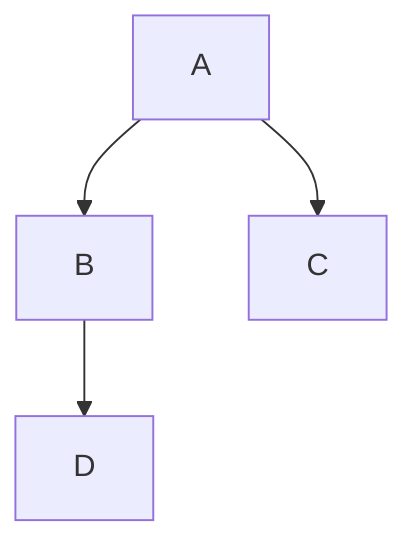

# Blog Post Guidelines

## Frontmatter (required)

```yaml
---
title: "Post Title"
date: "YYYY-MM-DD"
description: "Short description for SEO and blog list"
tags: ["Tag1", "Tag2"]
---
```

All four fields are required.

## Bilingual

Every post must exist in both `content/blog/ja/` and `content/blog/en/` with the **same filename** (slug).

## MDX Components

Custom components available in blog posts are registered in `src/app/[locale]/blog/[slug]/page.tsx` via `mdxComponents`. The `pre` element is overridden by `CodeBlock`, which delegates to `CopyCodeBlock` (copy button) or `Mermaid` (diagram rendering) based on the language.

### Interactive Components

Step-based interactive visualizations can be embedded via components in `src/components/interactive/`. See `.github/instructions/interactive-articles.instructions.md` for the full workflow. Available components:

- `InteractiveDemo` — styled container that breaks out of prose
- `GoRoutineVisualizer` — Go scheduler G/M/P step-through demo

To add a new interactive component, create it in `src/components/interactive/`, export from `index.ts`, and register in `getMdxComponents()`.

## Code Blocks

Use fenced code blocks with a language identifier for syntax highlighting:

````md
```typescript
const x = 1;
```
````

rehype-pretty-code (Shiki) handles highlighting at build time.

## Mermaid Diagrams

Use a fenced code block with `mermaid` language to render diagrams:

````md

````

Mermaid blocks are detected by `CodeBlock` (the `pre` override) and rendered client-side via `Mermaid.tsx`. The mermaid library is dynamically imported and re-renders when the theme toggles (dark/light). No imports or custom component tags needed.
