## Introduction — The "Last Mile" Problem of AI Agents

AI agent technology has matured rapidly. LLMs can autonomously call tools, and multiple agents can coordinate to handle complex tasks. However, there's one often-overlooked challenge.

**How do we deliver agent output to the user?**

Agents are long-running, stream intermediate artifacts, request user approval, and dynamically update UI state. This goes beyond what traditional REST APIs or GraphQL's "request → response" model can handle. Each agent framework has its own proprietary event format, frontends write framework-specific adapters, and tight coupling emerges.

The solution to this "lack of a standard protocol between agents and users" problem is **AG-UI (Agent-User Interaction Protocol)**.

### Three Agent Protocols

The AI agent ecosystem has three complementary open protocols.

| Protocol | Connection | Origin |
|----------|-----------|--------|
| **MCP** (Model Context Protocol) | Agent ↔ Tools & Data | Anthropic |
| **A2A** (Agent to Agent) | Agent ↔ Agent | Google |
| **AG-UI** (Agent-User Interaction) | Agent ↔ User (UI) | CopilotKit |

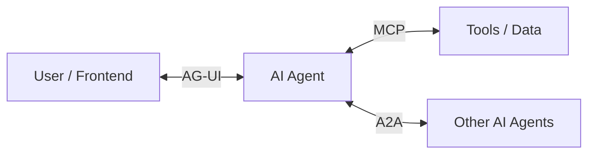

Just as MCP standardizes the connection between agents and external tools, and A2A standardizes inter-agent coordination, AG-UI **standardizes the connection between agents and user-facing applications**. Together, these three protocols cover "what to access," "who to collaborate with," and "who to deliver results to" — all with standard protocols.

### The World Without AG-UI

Without AG-UI, frontend developers face these problems:

1. **Framework-specific connection code**: Use LangGraph? Write a LangGraph-specific client. Use CrewAI? Write CrewAI-specific code.
2. **Reinventing streaming**: Implement text streaming, tool call visualization, and state synchronization for each framework.
3. **Reinventing Human-in-the-Loop**: Design user approval flows per application.

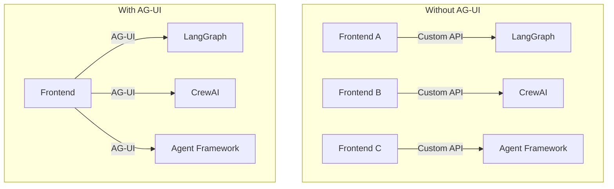

With AG-UI, a frontend implements one protocol to communicate with any agent backend. Backends only need to emit AG-UI events to support any frontend.

---

## Design Principles of AG-UI

AG-UI is built on these design principles.

### 1. Event-Driven Communication

Agents emit one of 16+ standardized event types during execution, producing a stream that clients can process. Rather than a "request → response → done" model like REST, events flow continuously throughout execution.

### 2. Bidirectional Interaction

Agents can accept input from users, enabling collaborative workflows where AI and humans work together. This is fundamentally different from models where agents unilaterally return results.

### 3. Transport Agnostic

AG-UI does not dictate how events are delivered. SSE (Server-Sent Events), WebSockets, Webhooks — choose the transport that fits your architecture.

### 4. Flexible Event Structure

Events don't need to match AG-UI's format exactly — they just need to be AG-UI-compatible. This allows existing agent frameworks to adapt their native event formats with minimal changes.

---

## Architectural Overview

AG-UI follows a client-server architecture.

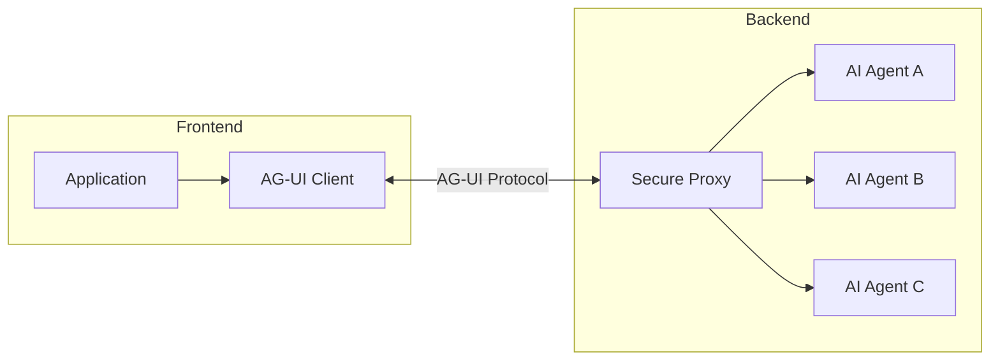

Here's what each component does.

| Component | Role |
|-----------|------|
| **Application** | User-facing app (chat UI, AI-powered app, etc.) |
| **AG-UI Client** | Generic communication client like `HttpAgent` |
| **Secure Proxy** | Backend service providing additional capabilities and acting as a secure proxy |
| **Agents** | AI agents processing requests and generating streaming responses |

### Protocol Layer

The core of AG-UI's protocol layer is a simple abstraction: run an agent and receive a stream of events.

```typescript
// The core AG-UI abstraction
type RunAgent = () => Observable<BaseEvent>

class MyAgent extends AbstractAgent {
  run(input: RunAgentInput): RunAgent {
    const { threadId, runId } = input
    return () =>
      from([
        { type: EventType.RUN_STARTED, threadId, runId },
        {
          type: EventType.MESSAGES_SNAPSHOT,
          messages: [
            { id: "msg_1", role: "assistant", content: "Hello!" }
          ],
        },
        { type: EventType.RUN_FINISHED, threadId, runId },
      ])
  }
}
```

The `run()` method accepts `RunAgentInput` and returns a function that returns an `Observable<BaseEvent>`. All communication is expressed as a stream of `BaseEvent`.

### Standard HTTP Client

AG-UI provides `HttpAgent`, a standard HTTP client that sends POST requests to any endpoint and receives a stream of `BaseEvent`.

```typescript
import { HttpAgent } from "@ag-ui/client"

const agent = new HttpAgent({
  url: "https://your-agent-endpoint.com/agent",
  agentId: "my-agent",
  threadId: "conversation-123",
})

agent.runAgent({
  tools: [...],
  context: [...]
}).subscribe({
  next: (event) => {
    switch(event.type) {
      case EventType.TEXT_MESSAGE_CONTENT:
        // Display text in UI
        break
      case EventType.TOOL_CALL_START:
        // Show tool call in progress
        break
    }
  },
  error: (err) => console.error("Agent error:", err),
  complete: () => console.log("Run complete")
})
```

Two transports are supported.

| Transport | Characteristics |
|-----------|----------------|
| **HTTP SSE** | Text-based streaming. Easy to debug |
| **HTTP Binary Protocol** | High-performance, space-efficient binary serialization |

---

## The Event System — The Core of AG-UI

All AG-UI communication happens through **typed events**. Every event inherits from `BaseEvent`.

```typescript
interface BaseEvent {
  type: EventType       // Event type identifier
  timestamp?: number    // Event creation time (optional)
  rawEvent?: any        // Original event data if transformed (optional)
}
```

Events are classified into 7 categories by purpose.

| Category | Purpose | Example Events |
|----------|---------|---------------|
| **Lifecycle Events** | Monitor agent run progression | `RunStarted`, `RunFinished`, `RunError` |
| **Text Message Events** | Handle streaming textual content | `TextMessageStart`, `TextMessageContent`, `TextMessageEnd` |
| **Tool Call Events** | Manage tool executions | `ToolCallStart`, `ToolCallArgs`, `ToolCallEnd` |
| **State Management Events** | Synchronize state between agent and UI | `StateSnapshot`, `StateDelta`, `MessagesSnapshot` |
| **Activity Events** | Represent ongoing activity progress | `ActivitySnapshot`, `ActivityDelta` |
| **Reasoning Events** | Visualize reasoning processes | `ReasoningStart`, `ReasoningMessageContent`, `ReasoningEnd` |
| **Special Events** | Support custom functionality | `Raw`, `Custom` |

### Lifecycle Events — Execution Boundaries

Lifecycle Events represent the lifecycle of agent runs. The typical flow is as follows.

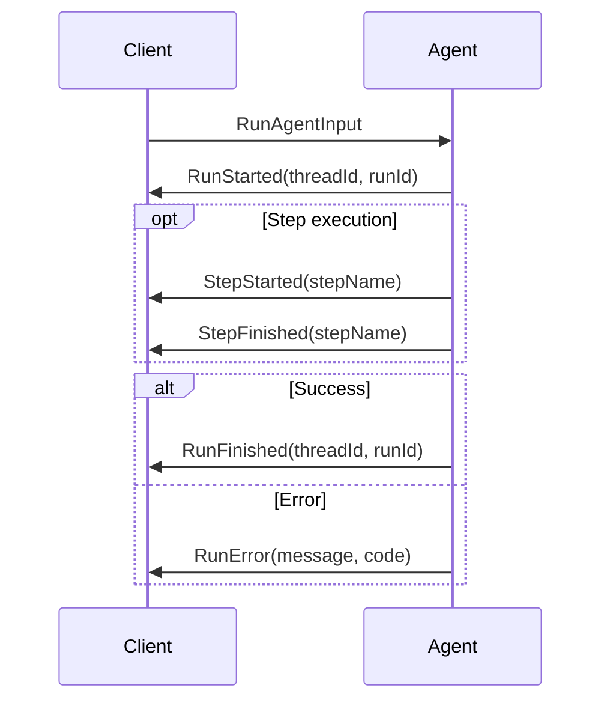

Here's each event's role.

| Event | Required | Description |
|-------|----------|-------------|
| `RunStarted` | Always | Start of execution. Uniquely identified by `threadId` and `runId`. Optional `parentRunId` supports branching/time travel |
| `RunFinished` | On success | Successful completion. Optional `result` field for output data |
| `RunError` | On error | Execution interrupted by error. Provides `message` and `code` |
| `StepStarted` | Optional | Start of a subtask or phase. Enables fine-grained progress tracking |
| `StepFinished` | Optional | Completion of a subtask. Used in pair with `StepStarted` |

`RunStarted` and `RunFinished` (or `RunError`) form the execution boundaries, with any number of step events occurring between them.

### Text Message Events — Streaming Text

Text messages follow a streaming pattern. Rather than waiting for the entire message to be generated, chunks are sent incrementally.

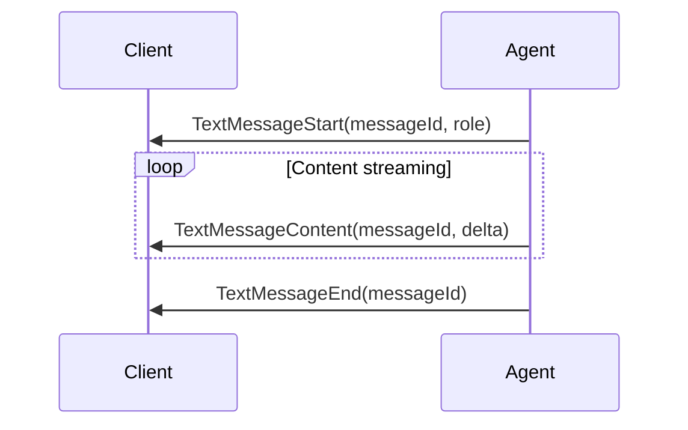

| Event | Description |
|-------|-------------|
| `TextMessageStart` | Initializes a message. Sets `messageId` and `role` (developer, system, assistant, user, tool) |
| `TextMessageContent` | Text chunk. The text in the `delta` property should be appended to previous chunks |
| `TextMessageEnd` | Message completion. UI removes loading indicators and finalizes rendering |

Additionally, `TextMessageChunk` is a convenience event that auto-expands to Start → Content → End. Including `messageId` on the first chunk implicitly emits `TextMessageStart`, and `TextMessageEnd` is automatically emitted when the stream switches to a new message ID or completes.

### Tool Call Events — Visualizing Tool Calls

Tool calls follow the same streaming pattern as text messages.

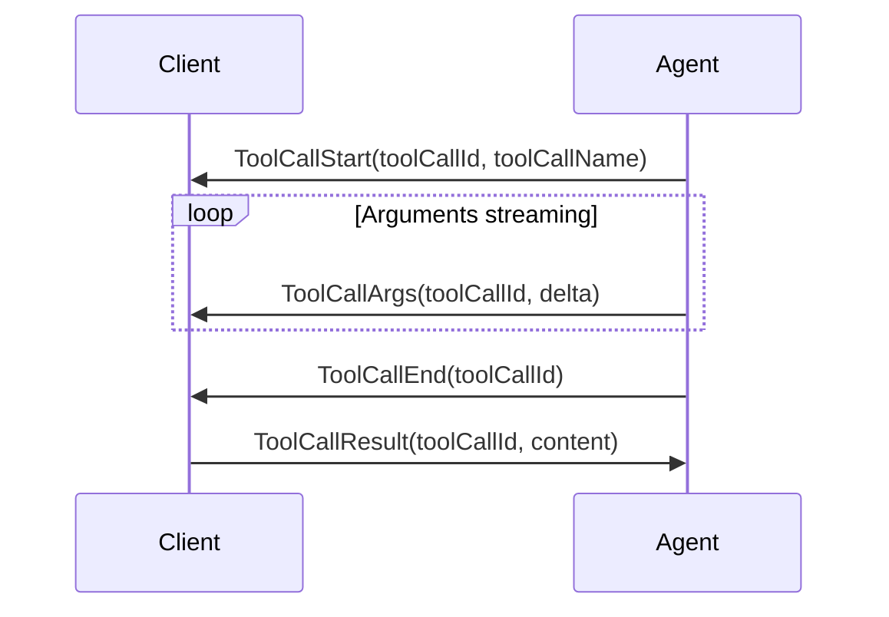

Critically, **tools are defined and passed in from the frontend to the agent**. This enables Human-in-the-Loop workflows:

1. Agent requests a tool call (ToolCallStart → ToolCallArgs → ToolCallEnd)
2. Frontend executes the tool (may include user judgment)
3. Result is returned to the agent (ToolCallResult)
4. Agent continues reasoning with the result

This enables interfaces where AI and humans collaborate.

Similar to `TextMessageChunk` for text messages, tool calls also have a `ToolCallChunk` convenience event. Including `toolCallId` and `toolCallName` on the first chunk implicitly emits `ToolCallStart`, and `ToolCallEnd` is automatically emitted when the stream switches to a new `toolCallId` or completes.

### State Management Events — Efficient State Synchronization

State management follows a **snapshot-delta pattern**.

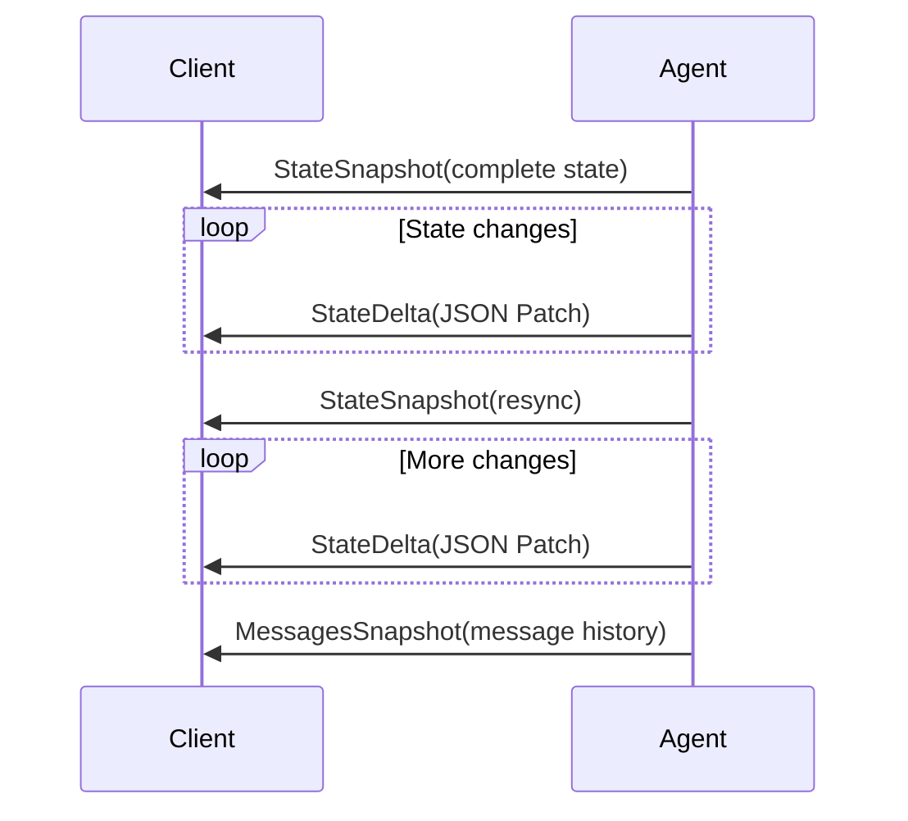

| Event | Description |
|-------|-------------|
| `StateSnapshot` | Complete state snapshot. Sent initially or for resynchronization |
| `StateDelta` | Incremental update via JSON Patch (RFC 6902). Bandwidth-efficient |
| `MessagesSnapshot` | Complete conversation message history. For chat initialization or resync |

Snapshots serve as synchronization points, while deltas provide lightweight incremental updates. This combination achieves both completeness and efficiency.

### Event Flow Patterns

AG-UI events can be classified into three patterns.

| Pattern | Use Case | Examples |
|---------|----------|---------|
| **Start-Content-End** | Streaming content | TextMessage, ToolCall |
| **Snapshot-Delta** | State synchronization | StateSnapshot + StateDelta |
| **Lifecycle** | Execution monitoring | RunStarted → RunFinished |

---

## Middleware — Intercepting Event Streams

AG-UI middleware sits between agent execution and event consumers, transforming, filtering, and augmenting event streams.

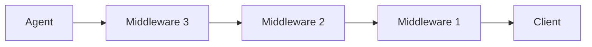

### Function-Based Middleware

For simple transformations, function-based middleware is suitable.

```typescript
import { MiddlewareFunction } from "@ag-ui/client"
import { EventType } from "@ag-ui/core"

// Middleware that prefixes text messages
const prefixMiddleware: MiddlewareFunction = (input, next) => {
  return next.run(input).pipe(
    map(event => {
      if (
        event.type === EventType.TEXT_MESSAGE_CHUNK ||
        event.type === EventType.TEXT_MESSAGE_CONTENT
      ) {
        return { ...event, delta: `[AI]: ${event.delta}` }
      }
      return event
    })
  )
}

agent.use(prefixMiddleware)
```

### Class-Based Middleware

For scenarios requiring state or configuration, use class-based middleware.

```typescript
import { Middleware } from "@ag-ui/client"

class MetricsMiddleware extends Middleware {
  private eventCount = 0

  run(input: RunAgentInput, next: AbstractAgent): Observable<BaseEvent> {
    const startTime = Date.now()
    return this.runNext(input, next).pipe(
      tap(event => {
        this.eventCount++
        this.metricsService.recordEvent(event.type)
      }),
      finalize(() => {
        this.metricsService.recordDuration(Date.now() - startTime)
      })
    )
  }
}
```

### Built-in Middleware

AG-UI provides built-in middleware like `FilterToolCallsMiddleware`.

```typescript
import { FilterToolCallsMiddleware } from "@ag-ui/client"

// Allow list
const filter = new FilterToolCallsMiddleware({
  allowedToolCalls: ["search", "calculate"]
})

// Block list
const blocker = new FilterToolCallsMiddleware({
  disallowedToolCalls: ["delete", "modify"]
})

agent.use(filter)
```

Middleware executes in the order added, with each middleware wrapping the next. The execution flow looks like this:

```text
→ middleware1
  → middleware2
    → middleware3
      → agent.run()
    ← events flow back through middleware3
  ← events flow back through middleware2
← events flow back through middleware1
```

---

## Reasoning Events — Visualizing the Reasoning Process

AG-UI provides Reasoning Events for visualizing LLM reasoning processes. This is a mechanism for showing Chain-of-Thought to users while maintaining privacy.

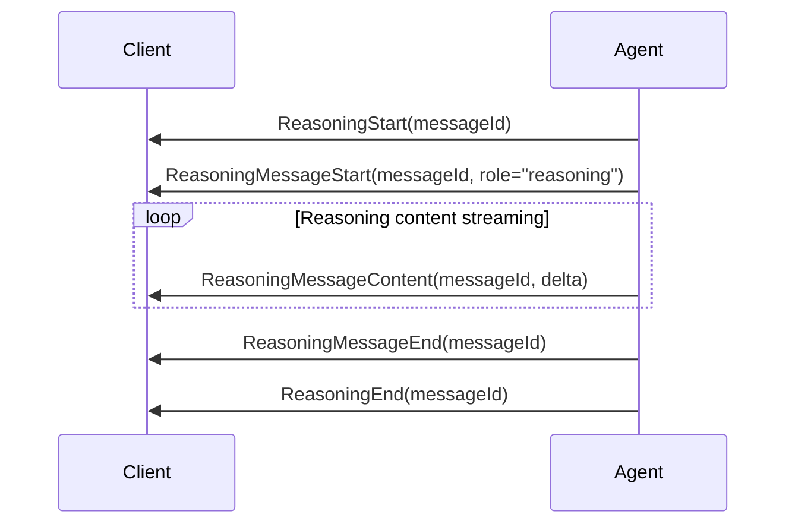

Particularly notable is the `ReasoningEncryptedValue` event. This preserves the LLM's internal Chain-of-Thought in encrypted form, carrying reasoning state across turns. The client stores and forwards encrypted values opaquely — it cannot read the contents. This maintains reasoning continuity even under `store:false` or zero data retention policies.

| Event | Description |
|-------|-------------|
| `ReasoningStart` | Start of reasoning process |
| `ReasoningMessageStart` | Start of reasoning message (visible portion) |
| `ReasoningMessageContent` | Reasoning content chunk |
| `ReasoningMessageEnd` | Completion of reasoning message |
| `ReasoningMessageChunk` | Convenience event auto-expanding Start/End |
| `ReasoningEnd` | Completion of reasoning process |
| `ReasoningEncryptedValue` | Preserves encrypted Chain-of-Thought |

---

## Security Considerations

AG-UI endpoints do not enforce authentication by default. For production deployments, you should add authentication using FastAPI's dependency injection system.

```python
import os
from fastapi import Depends, FastAPI, HTTPException, Security
from fastapi.security import APIKeyHeader
from agent_framework import Agent
from agent_framework.ag_ui import add_agent_framework_fastapi_endpoint

# API key authentication setup
API_KEY_HEADER = APIKeyHeader(name="X-API-Key", auto_error=False)
EXPECTED_API_KEY = os.environ.get("AG_UI_API_KEY")


async def verify_api_key(
    api_key: str | None = Security(API_KEY_HEADER),
) -> None:
    """Verify the API key in request headers."""
    if not api_key or api_key != EXPECTED_API_KEY:
        raise HTTPException(status_code=401, detail="Invalid or missing API key")


app = FastAPI()

# Assume agent was created in a previous section
# agent = simple_agent(chat_client)

# Register endpoint WITH authentication
add_agent_framework_fastapi_endpoint(
    app,
    agent,
    "/",
    dependencies=[Depends(verify_api_key)],
)
```

The `dependencies` parameter accepts any FastAPI dependency, enabling integration with OAuth 2.0, JWT, Azure AD / Entra ID, rate limiting, and other authentication methods.

---

## Agent Capabilities

AG-UI agents extend `AbstractAgent` and provide rich capabilities.

### Bidirectional Communication

Agents establish bidirectional communication channels with frontend applications through event streams. Real-time streaming responses, immediate feedback loops, progress indicators for long-running operations, and structured bidirectional data exchange are all possible.

### Multi-Agent Collaboration

Agents can delegate tasks to other agents. Coordinated multi-agent workflows, state and context transfer between agents, and transparent agent transitions on the frontend are all supported.

### Human-in-the-Loop

Agents support human intervention and assistance. They can request user input on specific decisions, pause execution and resume after human feedback, and build hybrid workflows combining AI efficiency with human judgment.

### Conversational Memory

Agents maintain a complete history of conversation messages. Past interactions inform future responses, and message history is synchronized between client and server.

---

## Implementing AG-UI with Microsoft Agent Framework

This is the core of this article. Let's deepen our understanding of AG-UI concepts through concrete implementations using Microsoft Agent Framework.

### The agent-framework-ag-ui Package

Microsoft Agent Framework provides first-party AG-UI protocol support through the `agent-framework-ag-ui` package. This package functions as a bridge that converts Agent Framework events into AG-UI events.

```text
pip install agent-framework-ag-ui
```

#### Architecture

The package's internal architecture looks like this.

| Component | Role |
|-----------|------|
| **AgentFrameworkAgent** | Lightweight wrapper making Agent Framework agents AG-UI compatible |
| **Orchestrators** | Handle different execution flows (default, human-in-the-loop, etc.) |
| **AgentFrameworkEventBridge** | Converts Agent Framework events to AG-UI events |
| **Message Adapters** | Bidirectional conversion between AG-UI and Agent Framework message formats |
| **FastAPI Endpoint** | Streaming HTTP endpoint with Server-Sent Events (SSE) |

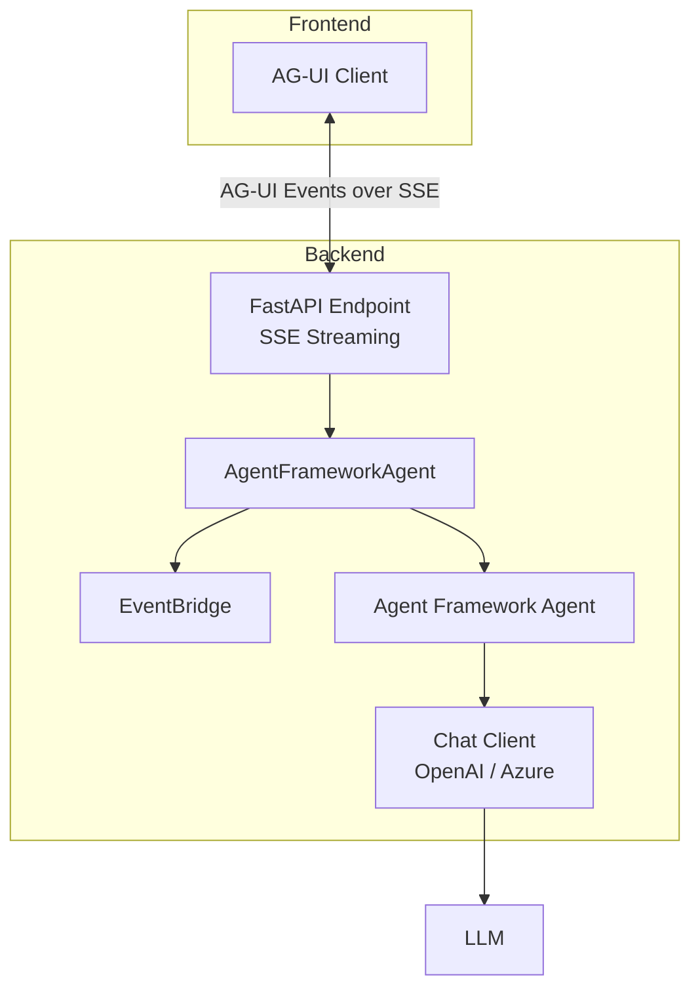

### Feature 1: Agentic Chat — Basic Conversational Agent

Let's start with the most basic example. AG-UI's Agentic Chat feature is a basic conversational agent with streaming chat and tool calling support.

```python
# simple_agent.py
from typing import Any
from agent_framework import Agent, SupportsChatGetResponse


def simple_agent(client: SupportsChatGetResponse[Any]) -> Agent[Any]:
    """Create a simple chat agent."""
    return Agent[Any](
        name="simple_chat_agent",
        instructions="You are a helpful assistant. Be concise and friendly.",
        client=client,
    )
```

That's it. An Agent Framework `Agent` just needs a name, instructions, and a chat client. To expose it as an AG-UI endpoint, use `add_agent_framework_fastapi_endpoint`.

```python
# server.py
from fastapi import FastAPI
from agent_framework.openai import OpenAIChatClient
from agent_framework.ag_ui import add_agent_framework_fastapi_endpoint
from agents.simple_agent import simple_agent

app = FastAPI(title="AG-UI Demo Server")

# Create chat client
chat_client = OpenAIChatClient(model="gpt-4o")

# Register as AG-UI endpoint
add_agent_framework_fastapi_endpoint(app, simple_agent(chat_client), "/agentic_chat")
```

Breaking down what `add_agent_framework_fastapi_endpoint` does:

1. Registers a POST endpoint on the FastAPI route
2. Receives `RunAgentInput` from the AG-UI client
3. Runs the Agent Framework agent
4. Converts events to AG-UI format through `AgentFrameworkEventBridge`
5. Returns them as streaming SSE (Server-Sent Events)

This single-line call generates the following AG-UI event sequence behind the scenes:

```text
→ RunStarted(threadId, runId)
  → TextMessageStart(messageId, role="assistant")
    → TextMessageContent(messageId, delta="Hel")
    → TextMessageContent(messageId, delta="lo")
    → TextMessageContent(messageId, delta="!")
  → TextMessageEnd(messageId)
→ RunFinished(threadId, runId)
```

### Feature 2: Backend Tool Rendering — Tool Execution and Result Streaming

Next, let's look at executing tools on the backend and streaming results to the client.

```python
# weather_agent.py
from typing import Any
from agent_framework import Agent, SupportsChatGetResponse, tool


@tool
def get_weather(location: str) -> dict[str, Any]:
    """Get current weather for a location.

    Args:
        location: The city to get weather for.

    Returns:
        Dictionary with temperature, conditions, humidity, etc.
    """
    weather_data = {
        "tokyo": {
            "temperature": 22,
            "conditions": "sunny",
            "humidity": 55,
            "wind_speed": 8,
        },
        "osaka": {
            "temperature": 24,
            "conditions": "partly cloudy",
            "humidity": 60,
            "wind_speed": 6,
        },
    }
    location_lower = location.lower()
    if location_lower in weather_data:
        return weather_data[location_lower]
    return {"temperature": 21, "conditions": "unknown", "humidity": 50, "wind_speed": 10}


@tool
def get_forecast(location: str, days: int = 3) -> str:
    """Get weather forecast for a location.

    Args:
        location: The city to get forecast for.
        days: Number of days to forecast (default: 3).

    Returns:
        Forecast information string.
    """
    forecast: list[str] = []
    for day in range(1, min(days, 7) + 1):
        forecast.append(f"Day {day}: Partly cloudy, {20 + day}°C")
    return f"{days}-day forecast for {location}:\n" + "\n".join(forecast)


def weather_agent(client: SupportsChatGetResponse[Any]) -> Agent[Any]:
    """Create a weather agent."""
    return Agent[Any](
        name="weather_agent",
        instructions=(
            "You are a helpful weather assistant. "
            "Use the get_weather and get_forecast functions to help users. "
            "Always provide friendly and informative responses."
        ),
        client=client,
        tools=[get_weather, get_forecast],
    )
```

The `@tool` decorator declares a function as a tool. Agent Framework automatically generates the tool schema and passes it to the LLM. When the agent calls a tool, the following AG-UI event sequence is generated:

```text
→ RunStarted
  → ToolCallStart(toolCallId, toolCallName="get_weather")
    → ToolCallArgs(toolCallId, delta='{"location":')
    → ToolCallArgs(toolCallId, delta=' "Tokyo"}')
  → ToolCallEnd(toolCallId)
  → ToolCallResult(toolCallId, content='{"temperature": 22, ...}')
  → TextMessageStart(messageId, role="assistant")
    → TextMessageContent(messageId, delta="The current weather in Tokyo is...")
  → TextMessageEnd(messageId)
→ RunFinished
```

The frontend can display tool-call-in-progress UI (like a loading spinner) upon receiving `ToolCallStart`, and show results on `ToolCallResult`. This all happens through standardized events — that's the value of AG-UI.

### Feature 3: Human-in-the-Loop — User Approval Flow

One of AG-UI's powerful features is Human-in-the-Loop. The agent can request user approval before executing a tool.

```python
# human_in_the_loop_agent.py
from typing import Any
from agent_framework import Agent, SupportsChatGetResponse, tool


@tool(approval_mode="always_require")
def delete_file(filename: str) -> str:
    """Delete a file (requires approval).

    Args:
        filename: Name of the file to delete.

    Returns:
        Deletion result message.
    """
    return f"File '{filename}' has been deleted."


@tool(approval_mode="always_require")
def send_email(to: str, subject: str, body: str) -> str:
    """Send an email (requires approval).

    Args:
        to: Recipient address.
        subject: Email subject.
        body: Email body.

    Returns:
        Send result message.
    """
    return f"Email sent to {to} with subject '{subject}'."


def human_in_the_loop_agent(
    client: SupportsChatGetResponse[Any],
) -> Agent[Any]:
    """Create a Human-in-the-Loop agent."""
    return Agent[Any](
        name="hitl_agent",
        instructions=(
            "You are a helpful assistant that can delete files and send emails. "
            "Always confirm with the user before performing these actions."
        ),
        client=client,
        tools=[delete_file, send_email],
    )
```

Tools declared with `@tool(approval_mode="always_require")` always request user approval before execution. The AG-UI event flow looks like this:

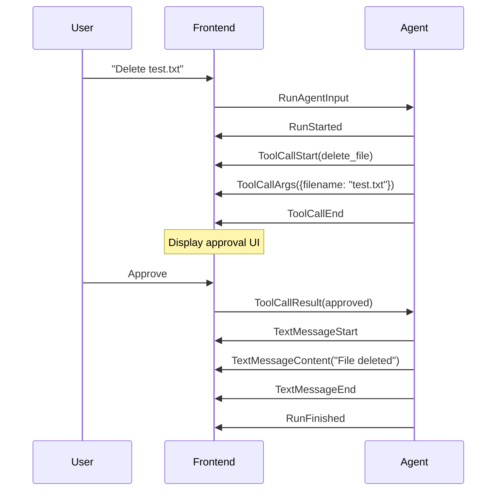

The orchestrator automatically detects approval responses, executing the tool if approved and skipping if rejected. This Human-in-the-Loop flow is expressed through standard AG-UI events, so a frontend can implement a generic approval UI once and reuse it across all agents.

### Feature 4: Shared State — Bidirectional State Synchronization

AG-UI's Shared State feature synchronizes structured state bidirectionally between the agent and frontend.

```python
# recipe_agent.py
from typing import Any
from agent_framework import Agent, SupportsChatGetResponse, tool
from agent_framework.ag_ui import AgentFrameworkAgent


@tool
def update_recipe(recipe_data: dict[str, Any]) -> str:
    """Update recipe information.

    Args:
        recipe_data: Recipe info (name, ingredients, etc.)

    Returns:
        Update result message.
    """
    return f"Recipe '{recipe_data.get('name', 'Unknown')}' has been updated."


def recipe_agent(client: SupportsChatGetResponse[Any]) -> AgentFrameworkAgent:
    """Create a recipe management agent."""
    agent = Agent[Any](
        name="recipe_agent",
        instructions=(
            "You are a recipe assistant. Help users create and modify recipes. "
            "Use the update_recipe tool to save changes."
        ),
        client=client,
        tools=[update_recipe],
    )

    # Define state schema
    state_schema = {
        "recipe": {
            "type": "object",
            "properties": {
                "name": {"type": "string"},
                "ingredients": {"type": "array"},
                "instructions": {"type": "array"},
            },
        }
    }

    return AgentFrameworkAgent(
        agent=agent,
        state_schema=state_schema,
        name="RecipeAgent",
        description="A recipe management agent with shared state",
    )
```

The `state_schema` defines the structure of state shared with the frontend. When the agent calls `update_recipe`, the state is updated and `StateDelta` events are sent to the frontend.

### Feature 5: Predictive State Updates — Optimistic State Updates

Predictive State Updates reflect tool arguments into state in real-time during tool execution.

```python
# document_writer_agent.py
from typing import Any
from agent_framework import Agent, SupportsChatGetResponse, tool
from agent_framework.ag_ui import AgentFrameworkAgent


@tool
def write_document(title: str, content: str) -> str:
    """Create a document.

    Args:
        title: Document title.
        content: Document content.

    Returns:
        Creation result message.
    """
    return f"Document '{title}' has been created."


def document_writer_agent(
    client: SupportsChatGetResponse[Any],
) -> AgentFrameworkAgent:
    """Create a document writer agent."""
    agent = Agent[Any](
        name="document_writer",
        instructions="You are a document writer. Create documents based on user requests.",
        client=client,
        tools=[write_document],
    )

    # Predictive State configuration
    predict_state_config = {
        "current_title": {"tool": "write_document", "tool_argument": "title"},
        "current_content": {"tool": "write_document", "tool_argument": "content"},
    }

    return AgentFrameworkAgent(
        agent=agent,
        state_schema={
            "current_title": {"type": "string"},
            "current_content": {"type": "string"},
        },
        predict_state_config=predict_state_config,
        require_confirmation=True,
    )
```

`predict_state_config` defines "which tool argument maps to which state field." As the LLM streams tool arguments, each chunk is immediately reflected in the corresponding state field.

```text
→ RunStarted
  → ToolCallStart(write_document)
    → ToolCallArgs(delta='{"title": "AG-')
      → StateDelta(op: replace, path: /current_title, value: "AG-")
    → ToolCallArgs(delta='UI Guide"')
      → StateDelta(op: replace, path: /current_title, value: "AG-UI Guide")
    → ToolCallArgs(delta=', "content": "AG-UI is...')
      → StateDelta(op: replace, path: /current_content, value: "AG-UI is...")
  → ToolCallEnd
→ RunFinished
```

This lets users see the document being written in real-time without waiting for tool execution to complete.

### Feature 6: Workflow AG-UI Integration

Agent Framework's workflows (graph-based multi-step execution engines) can also be exposed as AG-UI endpoints.

```python
from fastapi import FastAPI
from agent_framework import WorkflowBuilder, WorkflowContext, executor
from agent_framework.ag_ui import add_agent_framework_fastapi_endpoint


@executor(id="start")
async def start(message: str, ctx: WorkflowContext) -> None:
    """Start step of the workflow."""
    await ctx.yield_output(f"Workflow received: {message}")


@executor(id="analyze")
async def analyze(data: str, ctx: WorkflowContext) -> None:
    """Analysis step."""
    result = f"Analysis of '{data}': positive sentiment detected."
    await ctx.yield_output(result)


workflow = (
    WorkflowBuilder(start_executor=start)
    .add_executor(analyze)
    .add_edge("start", "analyze")
    .build()
)

app = FastAPI()
add_agent_framework_fastapi_endpoint(app, workflow, "/workflow")
```

Workflow events (run/step/activity/tool/custom) are automatically mapped to AG-UI events.

### Complete Server — Integrating All Features

Here's a complete example integrating all features into a single server.

```python
"""AG-UI Demo Server — All features integrated"""
import os
from fastapi import FastAPI
from agent_framework.openai import OpenAIChatClient
from agent_framework.ag_ui import add_agent_framework_fastapi_endpoint

# Import agents
from agents.simple_agent import simple_agent
from agents.weather_agent import weather_agent
from agents.human_in_the_loop_agent import human_in_the_loop_agent
from agents.recipe_agent import recipe_agent
from agents.document_writer_agent import document_writer_agent

app = FastAPI(title="AG-UI Demo Server")

# Shared chat client
chat_client = OpenAIChatClient(
    model=os.getenv("OPENAI_CHAT_MODEL", "gpt-4o"),
    api_key=os.getenv("OPENAI_API_KEY"),
)

# Register endpoints for each feature
add_agent_framework_fastapi_endpoint(
    app, simple_agent(chat_client), "/agentic_chat"
)
add_agent_framework_fastapi_endpoint(
    app, weather_agent(chat_client), "/backend_tool_rendering"
)
add_agent_framework_fastapi_endpoint(
    app, human_in_the_loop_agent(chat_client), "/human_in_the_loop"
)
add_agent_framework_fastapi_endpoint(
    app, recipe_agent(chat_client), "/shared_state"
)
add_agent_framework_fastapi_endpoint(
    app, document_writer_agent(chat_client), "/predictive_state_updates"
)

if __name__ == "__main__":
    import uvicorn
    uvicorn.run(app, host="0.0.0.0", port=8888)
```

This single server covers all the major AG-UI features.

### Connecting from an AG-UI Client

A Python client for connecting to AG-UI servers is also provided.

```python
import asyncio
from agent_framework.ag_ui import AGUIChatClient


async def main():
    async with AGUIChatClient(endpoint="http://localhost:8888/agentic_chat") as client:
        # Streaming response
        async for update in client.get_response("Hello!", stream=True):
            for content in update.contents:
                if content.type == "text" and content.text:
                    print(content.text, end="", flush=True)
        print()


asyncio.run(main())
```

`AGUIChatClient` supports streaming and non-streaming responses, hybrid tool execution (client-side + server-side), and automatic thread management.

---

## Integration with CopilotKit

The most mature AG-UI client is [CopilotKit](https://docs.copilotkit.ai/). CopilotKit is a framework for integrating AI copilot features into React applications and natively supports the AG-UI protocol.

CopilotKit's `useCopilotAction` hook simplifies the AG-UI frontend tool definition pattern.

```typescript
import { useCopilotAction } from "@copilotkit/react-core"

// Define a tool on the frontend
useCopilotAction({
  name: "confirmAction",
  description: "Ask user to confirm an action",
  parameters: [
    { name: "action", type: "string", description: "Action to confirm" },
    { name: "importance", type: "string", enum: ["low", "medium", "high"] },
  ],
  handler: async ({ action, importance }) => {
    // Show confirmation dialog to user
    const confirmed = await showConfirmDialog(action, importance)
    return confirmed ? "approved" : "rejected"
  },
})
```

This allows frontend-defined tools to be passed to the agent. When the agent calls a tool as needed, the frontend handler executes. Since AG-UI standardizes this bidirectional flow, no framework-specific logic is needed.

---

## Building Blocks Provided by AG-UI

AG-UI provides the following building blocks, including currently supported features and planned additions.

| Building Block | Description | Status |
|---------------|-------------|--------|
| Streaming Chat | Real-time token and event streaming | Supported |
| Multimodality | File, image, audio attachments | Supported |
| Generative UI (Static) | Output rendered as typed components | Supported |
| Generative UI (Declarative) | Declarative UI language | Supported |
| Shared State | Read-only/read-write shared state | Supported |
| Thinking Steps | Intermediate reasoning visualization | Supported |
| Frontend Tool Calls | Frontend-executed tool handoff | Supported |
| Backend Tool Rendering | Backend tool output visualization | Supported |
| Interrupts (HITL) | Pause, approve, retry | Supported |
| Sub-agents | Nested delegation | Supported |
| Agent Steering | Real-time user input for guiding agent | Supported |
| Tool Output Streaming | Real-time tool result streaming | Supported |
| Custom Events | Custom data exchange beyond protocol | Supported |

---

## Supported Integrations

AG-UI was born from CopilotKit and now supports a broad ecosystem.

### Agent Frameworks

| Framework | Status |
|-----------|--------|
| LangGraph | Supported |
| CrewAI | Supported |
| Microsoft Agent Framework | Supported |
| Google ADK | Supported |
| AWS Strands Agents | Supported |
| Mastra | Supported |
| Pydantic AI | Supported |
| Agno | Supported |
| LlamaIndex | Supported |
| AG2 | Supported |
| AWS Bedrock AgentCore | Supported |

### SDKs

In addition to TypeScript, SDKs for Kotlin, Golang, Dart, Java, and Rust are available from the community. .NET and Nim SDKs are also in progress.

---

## Conclusion — The Significance of AG-UI

AG-UI is a protocol that fills the "last mile" gap in the AI agent ecosystem — between agents and users.

### Complementary Nature of the Three Protocols

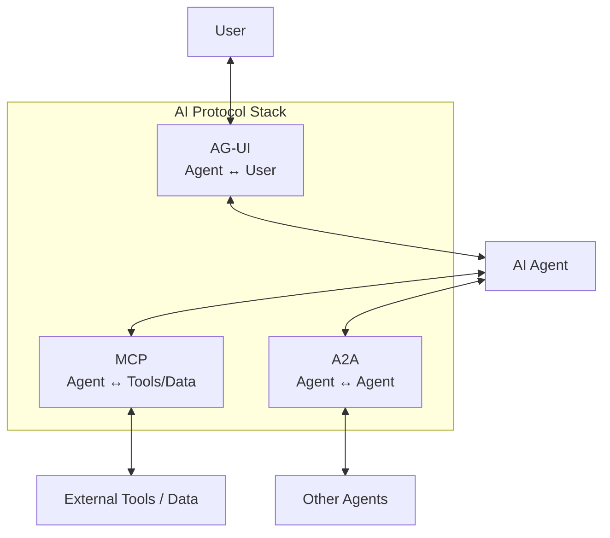

- **MCP** standardizes the connection between agents and tools/data.
- **A2A** standardizes inter-agent coordination.
- **AG-UI** standardizes agent-user interaction.

Together, these three connect the entire AI agent ecosystem with open standard protocols.

### Core Values of AG-UI

1. **Framework-agnostic**: Connect to any backend — LangGraph, CrewAI, Microsoft Agent Framework, Google ADK, and more.
2. **Real-time**: Event-driven architecture enables real-time visualization of agent behavior.
3. **Standardized Human-in-the-Loop**: User approval flows are defined as part of the standard protocol.
4. **State Synchronization**: Efficient bidirectional state management through snapshot-delta pattern.
5. **Extensibility**: Flexible extension through middleware, custom events, and custom orchestrators.

Microsoft Agent Framework provides first-party support for all these features through the `agent-framework-ag-ui` package. The convenience of making existing agents AG-UI compatible with a single line of `add_agent_framework_fastapi_endpoint` is a major advantage in real-world development.

As AI agents evolve from mere "behind-the-scenes" workers to entities that directly interact with users, AG-UI plays a crucial role in standardizing that interaction and enabling interoperability across the entire ecosystem.
