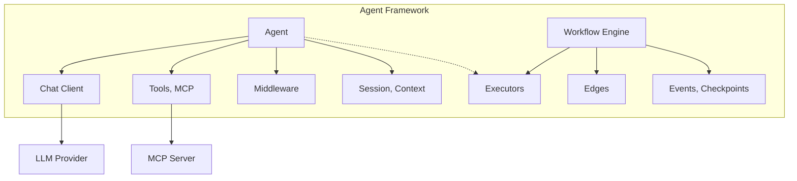
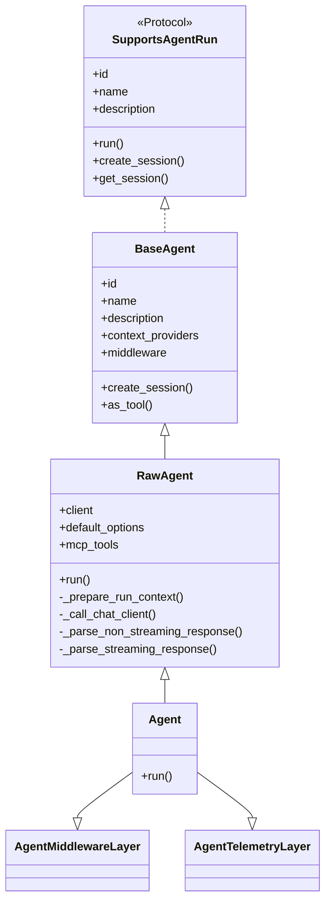
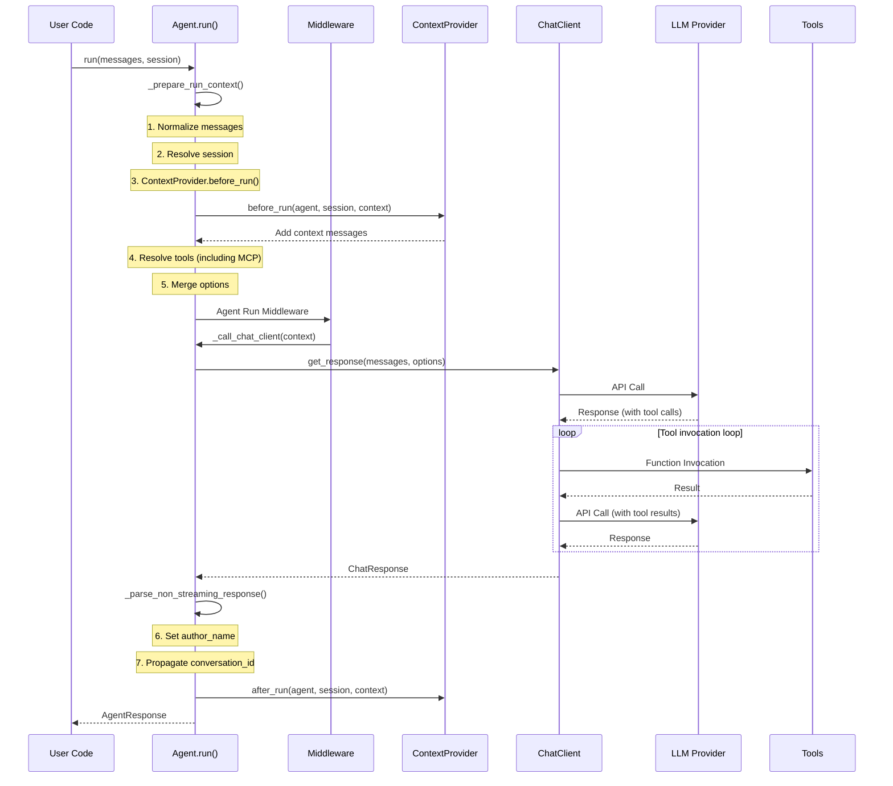
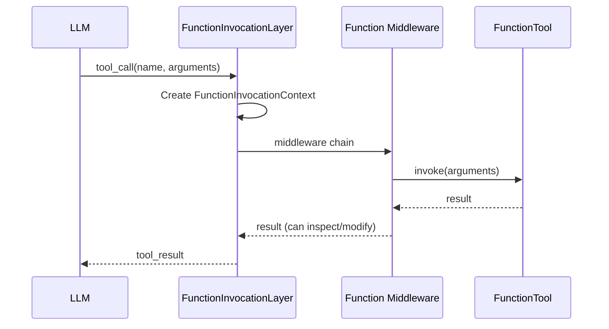
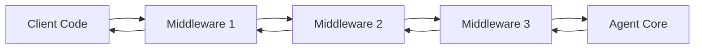
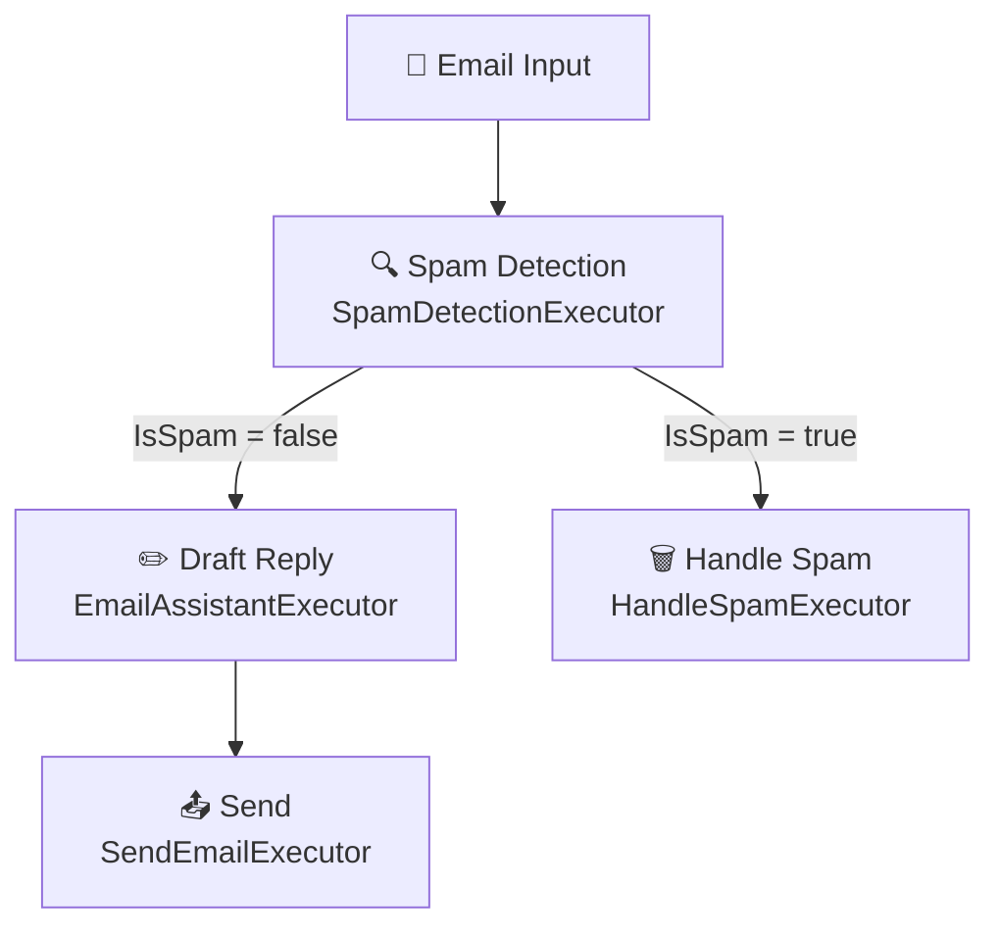

## Introduction

Since around 2025, AI agents have become a major topic among developers. The trend of using LLMs not merely as chat interfaces but as autonomous entities that invoke tools, form plans, and collaborate with other agents to tackle complex tasks has been accelerating. However, building such agents from scratch is no trivial undertaking — session management, tool-calling loops, error handling, telemetry, multi-agent coordination — implementing all of this yourself is an enormous amount of work.

In 2026, AI agents have evolved far beyond chatbots — they autonomously invoke tools, and multiple agents collaborate to tackle complex tasks. The framework powering this evolution is **[Microsoft Agent Framework](https://github.com/microsoft/agent-framework)**.

Agent Framework is positioned as the **direct successor** to Microsoft's [Semantic Kernel](https://github.com/microsoft/semantic-kernel) and [AutoGen](https://github.com/microsoft/autogen). It unifies Semantic Kernel's enterprise features (session management, type safety, middleware, telemetry) with AutoGen's simple agent abstractions, and adds a graph-based workflow engine on top — a true next-generation framework.

This article covers Agent Framework through the following pillars:

1. **Overall Architecture** — components and design philosophy
2. **Agent Execution Model** — what happens inside `run()`
3. **Tool Integration** — Function Tools, MCP, Agent-as-Tool
4. **Middleware System** — request/response interception
5. **Sessions and Context Providers** — state management
6. **Workflow Engine** — graph-based multi-agent orchestration
7. **Deployment and Integrations** — A2A, Azure Functions, AG-UI, MCP Server
8. **Observability** — tracing with OpenTelemetry
9. **Design Characteristics** — extensibility, layered separation, migration paths

## Overall Architecture

To understand Agent Framework, let's first get a bird's-eye view. The framework is built on two pillars: mechanisms for "building individual agents" and mechanisms for "orchestrating multiple agents together."

### Two Pillars of the Framework

Agent Framework provides two primary categories of capabilities:

| Category | Description |
|----------|-------------|
| **Agents** | Individual agents that use LLMs to process inputs, call tools and MCP servers, and generate responses |
| **Workflows** | Graph-based workflows that connect agents and functions for multi-step tasks with type-safe routing, checkpointing, and human-in-the-loop support |

In addition, model clients (Chat Completions / Responses API), AgentSession (state management), ContextProvider (agent memory), Middleware (interception), and MCP clients (tool integration) serve as foundational building blocks.



### Package Structure

The Python packages are organized as follows:

| Package | Purpose |
|---------|---------|
| `core` | Core abstractions: `Agent`, `RawAgent`, `BaseAgent`, `Workflow`, `WorkflowBuilder`, etc. |
| `foundry` | Microsoft Foundry integration via `FoundryChatClient` |
| `openai` | OpenAI / Azure OpenAI via `OpenAIChatClient` |
| `anthropic` | Anthropic Claude via `AnthropicChatClient` |
| `ollama` | Local Ollama via `OllamaChatClient` |
| `orchestrations` | Multi-agent orchestration patterns |
| `a2a` | Agent-to-Agent protocol integration |
| `ag-ui` | AG-UI protocol integration |
| `devui` | Developer debugging UI |

The .NET side mirrors this structure, with `Microsoft.Agents.AI` as the foundation and `Microsoft.Agents.AI.OpenAI`, `Microsoft.Agents.AI.Foundry`, `Microsoft.Agents.AI.Workflows`, etc.

### Quick Start

Let's create a minimal agent in Python. You only need three things: **a ChatClient to talk to the LLM**, **instructions that define the agent's behavior**, and **`run()` to process user input** — that's all it takes to get an agent running.

```python
# pip install agent-framework --pre
import asyncio
from agent_framework import Agent
from agent_framework.foundry import FoundryChatClient
from azure.identity import AzureCliCredential

async def main():
    agent = Agent(
        client=FoundryChatClient(credential=AzureCliCredential()),
        name="HaikuBot",
        instructions="You are a poet who writes beautiful haikus.",
    )
    print(await agent.run("Write a haiku about Microsoft Agent Framework."))

asyncio.run(main())
```

In this code, `FoundryChatClient` handles the connection to models on Azure AI Foundry, and `AzureCliCredential()` provides local development authentication. Passing `instructions` to the `Agent` constructor sends them as a system prompt to the LLM, and calling `run()` with a user message internally invokes the Chat Completions API and returns the response. It's just a few lines, but under the hood the full pipeline shown in the architecture diagram above executes: **message normalization → ContextProvider → Chat Client → response post-processing**.

The .NET version is even more concise:

```csharp
using Microsoft.Agents.AI;
using Azure.AI.Projects;
using Azure.Identity;

var agent = new AIProjectClient(
        new Uri(Environment.GetEnvironmentVariable("AZURE_AI_PROJECT_ENDPOINT")!),
        new DefaultAzureCredential())
    .AsAIAgent(
        model: "gpt-4o-mini",
        name: "HaikuBot",
        instructions: "You are a poet who writes beautiful haikus.");

Console.WriteLine(await agent.RunAsync("Write a haiku about Agent Framework."));
```

The .NET version uses the `AsAIAgent()` extension method on `AIProjectClient` to create an agent directly from the project client. While the API styles differ between Python and .NET, the three core building blocks — **Agent + ChatClient + instructions** — are consistent. This consistency reduces the cognitive overhead when teams work across both Python and C#.

To understand what happens behind the scenes of the quick start, let's dig into the Agent's internal implementation.

## Agent Execution Model — Inside `run()`

The quick start got an agent running in just a few lines, but behind the scenes, a surprising amount of processing takes place. Let's dissect the internals of `run()` by examining the Python source code.

### Class Hierarchy

In the Python implementation, the agent class hierarchy has 3 layers. Each layer handles different responsibilities, allowing users to pick the appropriate level of abstraction for their needs.



- **`SupportsAgentRun`** — A Protocol (duck-typing interface) defining `run()`, `create_session()`, and `id`/`name`/`description` properties
- **`BaseAgent`** — Base class implementing context providers, middleware, and session management. Can become a tool for other agents via `as_tool()`
- **`RawAgent`** — Implements the LLM invocation via Chat Client. No middleware or telemetry
- **`Agent`** — Full-featured class mixing in `AgentMiddlewareLayer` (middleware) and `AgentTelemetryLayer` (OpenTelemetry)

### The `run()` Execution Flow

When `Agent.run()` is called, the following flow executes internally:



#### Step 1: `_prepare_run_context()`

This method is the heart of execution. Looking at the source code ([`_agents.py`](https://github.com/microsoft/agent-framework/blob/main/python/packages/core/agent_framework/_agents.py)), it performs:

1. **Message normalization**: `normalize_messages()` converts input into a list of `Message` objects. If a string is passed, it becomes a `user`-role `ChatMessage`
2. **Automatic session creation**: If `session` is provided but no `context_providers` are set (and there is no service-side session ID or `store` flag), an `InMemoryHistoryProvider` is automatically added
3. **ContextProvider execution**: `before_run()` runs in forward order. History messages and system prompts are added to `SessionContext`
4. **Tool resolution**: Default tools + runtime tools + MCP server tools are unified. Unconnected MCP servers are connected via `AsyncExitStack`
5. **Options merging**: `_merge_options()` merges default and runtime options. Tools are merged by unique name; `instructions` are concatenated; `logit_bias` and `metadata` are dict-merged

```python
# Simplified _merge_options() behavior
def _merge_options(base, override):
    result = dict(base)
    for key, value in override.items():
        if value is None:
            continue
        if key == "tools":
            # Tools merged by unique name
            result["tools"] = _append_unique_tools(base_tools, override_tools)
        elif key == "instructions" and result.get("instructions"):
            # Instructions concatenated
            result["instructions"] = f"{result['instructions']}\n{value}"
        elif key == "logit_bias" and result.get("logit_bias"):
            # logit_bias dict-merged
            result["logit_bias"] = {**result["logit_bias"], **value}
        elif key == "metadata" and result.get("metadata"):
            # metadata dict-merged
            result["metadata"] = {**result["metadata"], **value}
        else:
            result[key] = value
    return result
```

#### Step 2: Chat Client Invocation

`_call_chat_client()` calls the Chat Client based on the `_RunContext`:

```python
def _call_chat_client(self, context, *, stream):
    return self.client.get_response(
        messages=context["session_messages"],
        stream=stream,
        options=context["chat_options"],
        compaction_strategy=context["compaction_strategy"],
        tokenizer=context["tokenizer"],
        function_invocation_kwargs=context["function_invocation_kwargs"],
        client_kwargs=context["client_kwargs"],
    )
```

Inside the Chat Client, the **tool invocation loop** executes. When the LLM requests a tool call, the `FunctionInvocationLayer` executes the tool and re-sends the results to the LLM. This loop repeats until the LLM returns a final response.

#### Step 3: Response Post-processing

`_finalize_response()` handles:

- Setting `author_name` (attaching the agent name to each message)
- Propagating `conversation_id` to the session
- Calling `after_run()` on ContextProviders (in reverse order)

### Streaming

With `stream=True`, `_parse_streaming_response()` returns a `ResponseStream`. This `AsyncIterator` yields `AgentResponseUpdate` objects while `get_final_response()` retrieves the complete `AgentResponse`.

```python
# Streaming usage
stream = agent.run("Hello", stream=True)
async for update in stream:
    print(update.text, end="")
final = await stream.get_final_response()
print(f"\nTokens used: {final.usage_details}")
```

Internally, `map()` transforms updates, and `with_transform_hook()` handles `conversation_id` propagation and `response_id` suppression.

Streaming matters because of **user experience**. LLM response generation can take several seconds, and without streaming users stare at a blank screen the entire time. With streaming, tokens appear in real-time as they're generated, dramatically reducing perceived latency. In Agent Framework, just passing `stream=True` makes this happen.

## Tool Integration

Tools are what elevate an AI agent from "just a chatbot" to "an agent that can take real-world action." An LLM alone can only generate text, but through tools it can call external APIs, query databases, manipulate files — interact with the real world. Agent Framework supports a variety of tool types, and through its MCP (Model Context Protocol) integration, tools across the entire ecosystem can be seamlessly leveraged.

### Tool Types

Agent Framework supports the following tool types:

| Tool Type | Description |
|-----------|-------------|
| **Function Tools** | Custom code that agents can call during conversations |
| **Tool Approval** | Human-in-the-loop approval for tool invocations |
| **Code Interpreter** | Execute code in a sandboxed environment |
| **File Search** | Search through uploaded files |
| **Web Search** | Search the web for information |
| **Hosted MCP Tools** | MCP tools hosted by Microsoft Foundry |
| **Local MCP Tools** | MCP tools running locally or on custom servers |

### Defining Function Tools

In Python, the `@tool` decorator makes defining tools trivial:

```python
from agent_framework import Agent, tool

@tool
def get_weather(location: str) -> str:
    """Get the weather for a given location."""
    return f"The weather in {location} is sunny."

agent = Agent(
    client=client,
    name="WeatherBot",
    instructions="You are an assistant that answers weather questions.",
    tools=[get_weather],
)
```

Internally, the `@tool` decorator generates a JSON Schema from the function signature and docstring, creating a `FunctionTool` instance. When the LLM calls this tool, the `FunctionInvocationLayer` executes:



### Agent-as-Tool Pattern

One of Agent Framework's most powerful features is **using an agent as a tool for another agent**. This enables an architecture where "a single coordinator agent delegates to multiple specialist agents as needed." Think of it like a manager assigning tasks to different domain experts on a team.

```python
# Define a specialist agent
weather_agent = Agent(
    client=client,
    name="weather_agent",
    description="An agent that answers weather questions.",
    tools=[get_weather],
)

# Main agent uses weather_agent as a tool
main_agent = Agent(
    client=client,
    name="coordinator",
    instructions="You are a coordinator that delegates to specialists.",
    tools=[weather_agent.as_tool()],
)
```

Looking at the `as_tool()` implementation, here's what happens internally:

1. A `FunctionTool` is generated from the agent's `name` and `description`
2. On invocation, `agent.run(task, stream=True)` is called
3. The response text is returned as a string

```python
# Simplified as_tool() internals
def as_tool(self, *, name=None, description=None):
    async def _agent_wrapper(ctx, **kwargs):
        stream = self.run(
            str(kwargs.get(arg_name, "")),
            stream=True,
            session=ctx.session if propagate_session else None,
        )
        final_response = await stream.get_final_response()
        return final_response.text
    
    return FunctionTool(
        name=tool_name,
        description=tool_description,
        func=_agent_wrapper,
    )
```

### MCP (Model Context Protocol) Integration

[MCP](https://modelcontextprotocol.io/) is a standard protocol connecting LLMs to tools. Agent Framework supports three connection modes: `MCPStdioTool`, `MCPStreamableHTTPTool`, and `MCPWebsocketTool`.

```python
from agent_framework import Agent, MCPStdioTool

# Use filesystem tools via MCP server
mcp_tool = MCPStdioTool(
    name="filesystem",
    command="npx",
    args=["-y", "@modelcontextprotocol/server-filesystem", "/tmp"],
)

async with Agent(client=client, tools=[mcp_tool]) as agent:
    response = await agent.run("List the files in /tmp")
```

MCP tool resolution happens inside `_prepare_run_context()`. Unconnected MCP servers are connected via `AsyncExitStack`, and tool lists are retrieved from their `functions` property.

Note the `async with Agent(...) as agent:` syntax. The MCP server connection is established in the Agent's `__aenter__` and torn down in `__aexit__`. This ties the MCP server's connection lifecycle to the agent's scope, preventing resource leaks. When not using MCP, you can call `agent.run()` directly without `async with`.

## Middleware System

Agent Framework's middleware follows the same concept as ASP.NET or Express.js middleware — injecting cross-cutting concerns (logging, validation, error handling, etc.) into the agent execution pipeline. The key value of middleware is that **it extends agent behavior without modifying the agent's core logic**. For example, requiring approval before all tool calls, or adding guardrails to block certain inputs, can be implemented without touching the agent's own code.

### Three Types of Middleware

| Type | Target | Use Case |
|------|--------|----------|
| **Agent Run Middleware** | Entire `agent.run()` | Input/output inspection, guardrails |
| **Function Calling Middleware** | Tool invocations | Tool call inspection, approval flows |
| **Chat Client Middleware** | LLM API calls | Request/response inspection |

### Python Middleware Implementation

Here are two middleware examples. `logging_middleware` records the input/output message count for every agent call, while `approval_middleware` inserts an approval flow before dangerous tool calls (file deletion, SQL execution).

```python
from agent_framework import (
    Agent,
    AgentContext,
    FunctionInvocationContext,
    agent_middleware,
    function_middleware,
)

@agent_middleware
async def logging_middleware(context: AgentContext, call_next):
    """Middleware that logs all agent invocations."""
    print(f"Input: {len(context.messages)} messages")
    await call_next()
    print(f"Output: {len(context.result.messages)} messages")

@function_middleware
async def approval_middleware(context: FunctionInvocationContext, call_next):
    """Middleware that requires approval for dangerous tool calls."""
    if context.function.name in ["delete_file", "execute_sql"]:
        print(f"Approval required for: {context.function.name}")
    await call_next()

agent = Agent(
    client=client,
    instructions="You are a helpful assistant.",
    middleware=[logging_middleware, approval_middleware],
)
```

The `await call_next()` inside middleware means **delegation to the next middleware**. Code before `call_next()` runs on the request path, code after runs on the response path. This is exactly the same mechanism as Express.js's `next()` or ASP.NET Core's `await next(context)`. If you don't call `call_next()`, the chain is short-circuited and the agent core is never reached.

### .NET Middleware Implementation

In .NET, the Builder pattern adds middleware to existing agents. `AsBuilder()` creates a copy of the existing agent, `Use()` chains middlewares, and `Build()` produces a new agent. The original agent is left unchanged.

```csharp
var middlewareAgent = originalAgent
    .AsBuilder()
        .Use(runFunc: async (messages, session, options, innerAgent, ct) =>
        {
            Console.WriteLine($"Input: {messages.Count()} messages");
            var response = await innerAgent.RunAsync(messages, session, options, ct);
            Console.WriteLine($"Output: {response.Messages.Count} messages");
            return response;
        })
        .Use(async (agent, context, next, ct) =>
        {
            Console.WriteLine($"Function: {context.Function.Name}");
            return await next(context, ct);
        })
    .Build();
```

### Middleware Internals

Middleware chain execution is managed by `AgentMiddlewareLayer`. When multiple middlewares are registered, they are chained in a call-stack fashion — each middleware calls `next` to delegate to the next middleware (ultimately the agent core).



Throwing a `MiddlewareTermination` exception can short-circuit the chain and return an early response. For example, if input validation finds a problem, you can return an error response immediately without calling the LLM.

## Sessions and Context Providers

So far we've covered the agent's execution flow, tools, and middleware. These all operate within the scope of a single request-response cycle. But real applications involve multi-turn conversations with users — the agent needs to "remember what was discussed" and respond in the context of the ongoing dialogue.

LLM APIs are fundamentally **stateless**. Each call is independent — the model doesn't remember "what was said last time." But real-world interactions require multi-turn conversations. In Agent Framework, **AgentSession** and **ContextProvider** bridge this gap.

### AgentSession

`AgentSession` is the container that holds an agent's conversation state:

```python
session = agent.create_session()

# First call
response1 = await agent.run("I live in Tokyo.", session=session)

# Second call — session preserves conversation history
response2 = await agent.run("Where do I live?", session=session)
# → "You live in Tokyo."
```

Key session properties:

- `session_id` — Local session ID (auto-generated)
- `service_session_id` — Service-side session ID (e.g., Foundry Agents thread ID)
- `state` — Dictionary holding per-provider state

### ContextProvider

`ContextProvider` is the extension point that hooks before and after agent invocations. `before_run()` injects additional context (history messages, system prompts, extra tools), and `after_run()` persists the response.

```python
from agent_framework import ContextProvider, SessionContext, AgentSession

class CustomContextProvider(ContextProvider):
    """Example custom context provider."""
    
    async def before_run(self, agent, session, context, state):
        # Inject additional system prompt
        context.instructions.append("Always respond in English.")
    
    async def after_run(self, agent, session, context, state):
        # Log the response
        if context.response:
            state["last_response"] = context.response.text
```

The most important built-in provider is `InMemoryHistoryProvider`. When a session is provided but no providers are configured, the Agent automatically adds one. This ensures that even the simplest usage with `session` achieves multi-turn conversations.

### CompactionStrategy

For long conversations, token counts become a concern. `CompactionStrategy` provides message compression strategies:

| Strategy | Description |
|----------|-------------|
| `TruncationStrategy` | Drops oldest messages |
| `SlidingWindowStrategy` | Retains the most recent N messages |
| `SummarizationStrategy` | Summarizes old messages using an LLM |
| `TokenBudgetComposedStrategy` | Combines multiple strategies within a token budget |

## Workflow Engine — Graph-Based Orchestration

So far we've been looking at single-agent implementations. But in practice, many business processes can't be handled by a single agent alone. Classifying emails as spam, generating replies for legitimate mail, quarantining spam — processes with "multiple steps executed in a specific order with conditional branching" require a workflow engine.

### Agent vs Workflow

| Use Agent when | Use Workflow when |
|----------------|-------------------|
| The task is open-ended or conversational | The process has well-defined steps |
| You need autonomous tool use and planning | You need explicit control over execution order |
| A single LLM call suffices | Multiple agents or functions must coordinate |

A workflow is a directed graph connecting **Executors** (processing nodes) via **Edges** (connections).

### Executor (Processing Node)

An Executor is the fundamental processing unit. It receives messages, processes them, and produces output messages.

```python
from agent_framework import Executor, handler, WorkflowContext

class UppercaseExecutor(Executor):
    """Executor that converts input strings to uppercase."""
    
    @handler
    async def handle(self, message: str, context: WorkflowContext) -> str:
        return message.upper()
```

In .NET, `partial` classes with the `[MessageHandler]` attribute use source generation:

```csharp
internal sealed partial class UppercaseExecutor() : Executor("UppercaseExecutor")
{
    [MessageHandler]
    private ValueTask<string> HandleAsync(string message, IWorkflowContext context)
    {
        return ValueTask.FromResult(message.ToUpperInvariant());
    }
}
```

Executors can be stateful. When shared across runs, implement `IResettableExecutor` to clear stale state.

### Edge (Connection)

Edges define message flow. The following patterns are available:

| Edge Type | Description | Use Case |
|-----------|-------------|----------|
| **Direct** | Simple one-to-one connection | Pipelines |
| **Conditional** | Condition-based routing | if/else branching |
| **Switch-Case** | Multi-branch routing based on conditions | 3+ branch routing |
| **Fan-out** | One executor to multiple targets | Parallel processing |
| **Fan-in** | Multiple sources to single target | Aggregation |

### Workflow Example — Email Classification Pipeline

Let's ground our understanding with a concrete workflow example. The following workflow classifies incoming email as spam or legitimate, then quarantines spam or auto-drafts a reply. Through this example, we'll see the full flow from defining Executors, conditional branching via Edges, to assembling the graph with `WorkflowBuilder`.



```python
from agent_framework import (
    Agent, Executor, handler, WorkflowBuilder, WorkflowContext,
    InProcRunnerContext, Message,
)

class SpamDetectionExecutor(Executor):
    def __init__(self, agent):
        super().__init__("SpamDetection")
        self._agent = agent
    
    @handler
    async def handle(self, message: str, context: WorkflowContext):
        response = await self._agent.run(message)
        is_spam = "spam" in response.text.lower()
        return {"is_spam": is_spam, "content": message}

class EmailAssistantExecutor(Executor):
    def __init__(self, agent):
        super().__init__("EmailAssistant")
        self._agent = agent
    
    @handler
    async def handle(self, message: dict, context: WorkflowContext):
        response = await self._agent.run(
            f"Draft a professional reply to: {message['content']}"
        )
        await context.emit(f"Reply: {response.text}")

class SpamHandler(Executor):
    @handler
    async def handle(self, message: dict, context: WorkflowContext):
        await context.emit(f"Marked as spam: {message['content'][:50]}...")

# Build the workflow
spam_detector = SpamDetectionExecutor(detection_agent)
assistant = EmailAssistantExecutor(reply_agent)
spam_handler = SpamHandler("SpamHandler")

workflow = (
    WorkflowBuilder(spam_detector)
    .add_edge(
        assistant,
        condition=lambda msg: not msg["is_spam"],
    )
    .add_edge(
        spam_handler,
        condition=lambda msg: msg["is_spam"],
    )
    .build()
)

# Run the workflow
async with InProcRunnerContext() as ctx:
    async for event in ctx.run(workflow, "Important meeting announcement"):
        print(event)
```

`WorkflowBuilder` provides a declarative API for building the execution graph. Passing condition functions to `add_edge()` defines runtime conditional branching. `InProcRunnerContext` is the runner that executes the workflow in-process, managing message passing between Executors and event propagation.

The equivalent .NET implementation uses `WorkflowBuilder`:

```csharp
var workflow = new WorkflowBuilder(spamDetectionExecutor)
    .AddEdge(spamDetectionExecutor, emailAssistantExecutor,
             condition: GetCondition(expectedResult: false))
    .AddEdge(emailAssistantExecutor, sendEmailExecutor)
    .AddEdge(spamDetectionExecutor, handleSpamExecutor,
             condition: GetCondition(expectedResult: true))
    .WithOutputFrom(handleSpamExecutor, sendEmailExecutor)
    .Build();
```

### Switch-Case Pattern

For 3+ branches, `AddSwitch()` provides cleaner syntax. Each case gets a condition function, and a default branch can be specified.

```csharp
builder.AddSwitch(spamDetectionExecutor, switchBuilder =>
    switchBuilder
        .AddCase(GetCondition(SpamDecision.NotSpam), emailAssistantExecutor)
        .AddCase(GetCondition(SpamDecision.Spam), handleSpamExecutor)
        .WithDefault(handleUncertainExecutor)
);
```

### Fan-out / Fan-in Pattern

Delegate parallel processing from one executor to multiple targets, then aggregate results. In fan-out, the `targetSelector` chooses execution targets based on input; the fan-in barrier waits for all sources to complete.

```csharp
// Fan-out: 1 → N
builder.AddFanOutEdge(
    analysisExecutor,
    targets: [spamHandler, emailAssistant, summarizer, uncertainHandler],
    targetSelector: (result, targetCount) =>
    {
        if (result.IsSpam) return [0];
        var targets = new List<int> { 1 };
        if (result.EmailLength > 100) targets.Add(2);
        return targets;
    }
);

// Fan-in: N → 1
builder.AddFanInBarrierEdge(
    sources: [worker1, worker2, worker3],
    target: aggregator
);
```

### Workflow Execution and Events

Workflows execute in a **superstep** fashion. In each superstep, active executors run concurrently, and output messages route along edges to the next superstep's executors.

`WorkflowEvent` types include:

| Event | Description |
|-------|-------------|
| `WorkflowOutputEvent` | Final output |
| `ExecutorStartEvent` / `ExecutorEndEvent` | Executor lifecycle |
| Custom events | Fire arbitrary events via `context.AddEventAsync()` |

### Checkpointing

Long-running workflows may encounter failures mid-execution. `CheckpointStorage` persists workflow state, enabling fault recovery and process restart resumption.

```python
from agent_framework import FileCheckpointStorage

storage = FileCheckpointStorage("./checkpoints")
runner_context = InProcRunnerContext(workflow, checkpoint_storage=storage)
```

## Deployment and Integrations

Agents and workflows built with Agent Framework can be deployed and integrated in various ways.

### A2A (Agent-to-Agent) Protocol

A2A is an open protocol proposed by Google for connecting agents across different frameworks. Agent Framework supports both A2A server and client roles, enabling interop with agents built on other frameworks.

```python
from agent_framework.a2a import A2AServer

# Expose an agent as an A2A server
server = A2AServer(agent=my_agent)
await server.start(host="0.0.0.0", port=8080)
```

### AG-UI (Agent-User Interface) Protocol

AG-UI is a protocol proposed by CopilotKit for real-time connection between agents and frontends. It provides a standardized interface for visualizing agent behavior to users — streaming responses, tool-call progress indicators, and Human-in-the-Loop approval UIs.

### Azure Functions / Container Apps

Deploying agents as serverless functions or containers is the most common pattern. With Azure Functions, you can set up an HTTP-triggered agent in just a few lines. Container Apps support long-running workflows and streaming responses.

### Export as MCP Server

You can also convert an agent into an MCP server, making it callable from other tools and agents.

```python
# Convert agent to MCP server
server = agent.as_mcp_server(server_name="MyAgent", version="1.0.0")
```

The `as_mcp_server()` implementation converts the agent to a tool via `as_tool()` and registers it as an MCP `@server.call_tool()` handler. This makes Agent Framework agents seamlessly available as part of the MCP ecosystem.

### DevUI

An interactive developer UI for agent development, testing, and debugging. Visualize workflow execution graphs in real-time, inspecting each Executor's inputs/outputs and Edge message flows.

## Observability

In production environments, the ability to monitor and debug agent behavior is essential. Agent Framework natively supports OpenTelemetry — the `AgentTelemetryLayer` (a mixin on the `Agent` class) automatically generates spans for every `run()` invocation.

```python
from opentelemetry import trace
from opentelemetry.sdk.trace import TracerProvider
from opentelemetry.sdk.trace.export import ConsoleSpanExporter, SimpleSpanProcessor

# OpenTelemetry setup
provider = TracerProvider()
provider.add_span_processor(SimpleSpanProcessor(ConsoleSpanExporter()))
trace.set_tracer_provider(provider)

# Agent automatically emits spans
agent = Agent(client=client, name="TracedAgent")
response = await agent.run("Hello")
```

Traces include:

- Agent name and ID
- Message counts
- Tool call details
- Token usage
- Response time

By exporting to OpenTelemetry-compatible backends like Jaeger or Azure Monitor, you can visualize agent behavior on dashboards and use it for bottleneck identification and cost optimization.

## Design Characteristics

### Protocol-Based Extensibility

`SupportsAgentRun` is defined as a Protocol, so you can create compatible agents without inheriting from any Agent Framework class — just implement the required methods. This aligns with Python's duck typing philosophy and is very useful when gradually introducing Agent Framework into an existing codebase.

### Layered Middleware Separation

The 3-layer structure — Agent Run Middleware → Function Calling Middleware → Chat Client Middleware — enables interception at different levels with clear separation of concerns. For example, "add logging to all agent calls," "add approval only to specific tool calls," and "add retries to LLM requests" can each be implemented as independent middleware.

### Migration Paths from Semantic Kernel / AutoGen

Agent Framework officially provides migration guides from both Semantic Kernel and AutoGen, enabling incremental migration that preserves existing investments.

### Python and .NET Symmetry

Providing consistent APIs across both Python and C#/.NET is a significant advantage for teams using multiple languages. Shared concepts and patterns make cross-language knowledge transfer straightforward.

## Conclusion

Microsoft Agent Framework is a comprehensive framework providing everything needed for AI agent development. As we've seen throughout this article, its internals are organized into the following layers:

1. **Agent layer** — A pipeline of message normalization → ContextProvider → ChatClient → response post-processing that manages LLM interactions
2. **Tool layer** — `@tool` decorators, MCP integration, and Agent-as-Tool connect agents to the outside world
3. **Middleware layer** — Three levels (Agent / Function / ChatClient) for injecting cross-cutting concerns
4. **Session layer** — AgentSession and ContextProvider enable multi-turn conversations on top of the stateless LLM API
5. **Workflow layer** — A graph of Executors and Edges for declaratively describing conditional branching, parallel processing, and Human-in-the-Loop
6. **Observability layer** — OpenTelemetry traces for monitoring and debugging agent behavior

Fusing Semantic Kernel's enterprise quality with AutoGen's simplicity, and supporting modern protocols like MCP, A2A, and AG-UI, Agent Framework is positioned at the center of the ecosystem as a unified foundation for AI agent development.

## References

- [Microsoft Agent Framework — GitHub](https://github.com/microsoft/agent-framework)
- [Official Documentation — MS Learn](https://learn.microsoft.com/en-us/agent-framework/)
- [Python Package — PyPI](https://pypi.org/project/agent-framework/)
- [.NET Package — NuGet](https://www.nuget.org/profiles/MicrosoftAgentFramework/)
