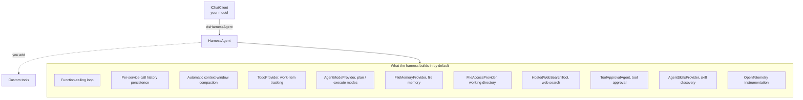
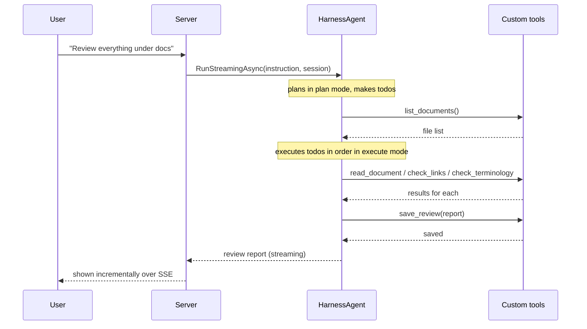

## Introduction

In the companion article, "[Letting Go of Orchestration — Building a Document Review Agent by Just Adding Tools with the GitHub Copilot SDK](/en/blog/copilot-doc-reviewer)," we implemented this idea:

> Stop writing the agent's control tower (the plan → choose tool → execute → evaluate loop) yourself, and hand it entirely to a production-tested runtime. Your only job is to provide the capabilities a review needs, as <strong>tools.</strong>

The GitHub Copilot SDK embodied this beautifully. But — when you hear "the same thing can be done with Microsoft Agent Framework's <strong>Agent Harness</strong>," you naturally want to verify it.

In this article, we build the exact same <strong>document review agent</strong>, this time with Microsoft Agent Framework's `HarnessAgent`. The short answer: yes, you can. And it's done under <strong>different design decisions</strong> than the Copilot SDK version. Reading the two side by side reveals how the same philosophy of "delegating orchestration" wears a different face depending on the runtime's design.

The structure is as follows.

1. <strong>What the Agent Harness is</strong> — what `HarnessAgent` "prebuilds for you"
2. <strong>Contrast with the Copilot SDK</strong> — two kinds of "delegation"
3. <strong>Design</strong> — the same five tools, but planning comes for free
4. <strong>Implementation</strong> — tools, the harness, an SSE server, and a UI in C#
5. <strong>Pros</strong> — why the harness works
6. <strong>Cons and caveats</strong> — experimental API, non-determinism, security
7. <strong>Which to choose</strong> — Copilot SDK vs. Agent Harness vs. explicit workflows

> For the big picture of Microsoft Agent Framework itself, see "[Microsoft Agent Framework Deep Dive](/en/blog/agent-framework)." This article narrows in on the single topic of the Agent Harness.

## What the Agent Harness Is

The usual way to use Microsoft Agent Framework is to create a `ChatClientAgent` and combine tools and context providers yourself. It's flexible, but to build an "agent that autonomously carries out long tasks," you need to <strong>assemble the operational scaffolding (the harness) yourself</strong> — planning, todo management, context compaction, tool approval.

The <strong>Agent Harness (`HarnessAgent`)</strong> is an agent with that scaffolding <strong>prebuilt.</strong> It's provided by the `Microsoft.Agents.AI.Harness` package. In a word, it's a way to <strong>"spin up a Claude-Code-style autonomous agent in one line."</strong>

When you call `AsHarnessAgent()` on an `IChatClient`, the following are configured <strong>fully prebuilt</strong>.



What the developer does is exactly the same as the Copilot SDK version — <strong>just add tools and instructions.</strong> Planning, todos, context compaction, tool approval — you write none of it yourself.

Note that the <strong>`AgentModeProvider`'s default modes are "plan" and "execute,"</strong> and that the <strong>`TodoProvider` tracks work items.</strong> In other words, the harness <strong>ships with a Claude-Code-style workflow</strong> of "first make a plan, break it into todos, then execute them in order." That's a distinctive feature of the harness — an <strong>explicit</strong> plan/todo subsystem. The Copilot SDK's runtime plans internally too, but exposes no equivalent plan-mode or todo provider.

> `HarnessAgent` is an <strong>experimental (preview)</strong> API at the time of writing, and it emits the diagnostic warning `MAAI001` at compile time. When adopting it in production, watch for breaking changes across versions.

## Contrast with the Copilot SDK — Two Kinds of "Delegation"

Both share the same philosophy: "delegate orchestration, just add tools." But because the runtime you delegate to differs in nature, the design decisions change too.

| Aspect | GitHub Copilot SDK | Agent Harness (`HarnessAgent`) |
|------|--------------------|-------------------------------|
| <strong>Runtime shape</strong> | Connects to a separate Copilot CLI process via JSON-RPC | A .NET library <strong>in your own process</strong> |
| <strong>Model</strong> | Via Copilot, or your own model via BYOM/BYOK | You <strong>bring your own model</strong> (Azure OpenAI / OpenAI, etc.) |
| <strong>Billing</strong> | Usage-based (GitHub AI Credits, metered by tokens) | Only the model provider you use |
| <strong>Planning / todos</strong> | No explicit plan/todo subsystem (the runtime plans internally; steer specifics via instructions) | <strong>plan/execute modes and a TodoProvider are standard</strong> |
| <strong>Narrowing capability</strong> | At runtime via `onPermissionRequest` (approve/reject) | <strong>At configuration time</strong> via `Disable*` flags and the tools you provide |
| <strong>Languages</strong> | Node/Python/Go/.NET/Java/Rust | .NET is most mature (Python, etc. also exist) |
| <strong>Distribution</strong> | Bundled CLI runtime | NuGet library (experimental) |

The most essential difference is <strong>how you narrow capability.</strong> The Copilot SDK secured safety with a <strong>dynamic gate</strong>: "for a powerful runtime, grant (or reject) permission one operation at a time at runtime." The harness, by contrast, secures safety through <strong>static assembly</strong>: "choose which capabilities to build in <strong>at configuration time</strong>." You leave out what you don't need from the start, like `DisableWebSearch = true` and `DisableFileAccess = true`.

This difference matters in the implementation and security discussions below.

## Design — the Same Five Tools

The capabilities a review needs are unchanged from the Copilot SDK version. We provide the same five tools.

1. <strong>`list_documents`</strong> — list the documents to review
2. <strong>`read_document`</strong> — read the contents
3. <strong>`check_links`</strong> — check for broken links
4. <strong>`check_terminology`</strong> — check terminology variants
5. <strong>`save_review`</strong> — save the review

The difference is that the harness <strong>ships with the "first plan, decompose into todos, then execute in order" approach.</strong> In the Copilot SDK version we steered the approach via the system message; with the harness, the `AgentModeProvider` (plan/execute) and `TodoProvider` give us that skeleton. We only need to specify the aspects (links, terminology, clarity) and the output format.



## Implementation

### Project Layout and Dependencies

The final layout pairs up with the Copilot SDK version.

```text
agent-harness-doc-reviewer/
├── AgentHarnessDocReviewer.csproj
├── Program.cs              # ASP.NET minimal API + SSE server
├── ReviewTools.cs          # the five custom tools (AIFunctions)
├── ReviewPrompt.cs         # review instructions
├── glossary.json           # canonical-term dictionary for terminology checks
├── docs/                   # documents to review
├── reviews/                # output destination
└── wwwroot/
    └── index.html          # browser UI (vanilla JS, identical to the Copilot SDK version)
```

Add the dependencies. Since the Agent Harness is experimental, fetch it with `--prerelease`.

```bash
dotnet add package Microsoft.Agents.AI.Harness --prerelease
dotnet add package Microsoft.Agents.AI.OpenAI --prerelease
dotnet add package Azure.AI.OpenAI
dotnet add package Azure.Identity
```

Because `HarnessAgent` is an experimental API, suppress the warning in the `.csproj`.

```xml
<PropertyGroup>
  <TargetFramework>net9.0</TargetFramework>
  <NoWarn>$(NoWarn);MAAI001;OPENAI001</NoWarn>
</PropertyGroup>
```

### Defining the Tools

The Copilot SDK version used `defineTool` + Zod. In Agent Framework, a tool is a `Microsoft.Extensions.AI` <strong>`AIFunction`</strong>, created from a delegate with `AIFunctionFactory.Create()`. As in the Copilot SDK version, each tool closes over an `emit` for UI notifications.

```csharp
// ReviewTools.cs
using System.ComponentModel;
using Microsoft.Extensions.AI;

public static class ReviewTools
{
    private static readonly string DocsRoot = Path.GetFullPath("docs");
    private static readonly string ReviewsRoot = Path.GetFullPath("reviews");

    // Path-traversal guard: ensure the resolved path stays under the root
    private static string ResolveWithin(string root, string target)
    {
        string resolved = Path.GetFullPath(Path.Combine(root, target));
        if (!resolved.StartsWith(root + Path.DirectorySeparatorChar, StringComparison.Ordinal)
            && resolved != root)
        {
            throw new InvalidOperationException($"Disallowed path: {target}");
        }
        return resolved;
    }

    public static IList<AITool> Create(Action<string, string> emit)
    {
        return new List<AITool>
        {
            AIFunctionFactory.Create(() =>
            {
                var files = Directory
                    .EnumerateFiles(DocsRoot, "*.*", SearchOption.AllDirectories)
                    .Where(f => f.EndsWith(".md") || f.EndsWith(".mdx"))
                    .Select(f => Path.GetRelativePath(DocsRoot, f))
                    .ToArray();
                emit("list_documents", $"Found {files.Length} documents");
                return new { files };
            }, "list_documents", "Return the list of documents under docs/ to be reviewed"),

            AIFunctionFactory.Create((
                [Description("path relative to docs/")] string filePath) =>
            {
                string abs = ResolveWithin(DocsRoot, filePath);
                string content = File.ReadAllText(abs);
                emit("read_document", $"Read {filePath} ({content.Length} chars)");
                return new { filePath, content };
            }, "read_document", "Read and return the contents of a given document"),

            AIFunctionFactory.Create(async (
                [Description("the text to check")] string content) =>
            {
                var urls = System.Text.RegularExpressions.Regex
                    .Matches(content, @"https?://[^\s)\]]+")
                    .Select(m => m.Value)
                    .Distinct()
                    .ToArray();
                var broken = new List<object>();
                using var http = new HttpClient { Timeout = TimeSpan.FromSeconds(5) };
                foreach (var url in urls)
                {
                    try
                    {
                        using var reqMsg = new HttpRequestMessage(HttpMethod.Head, url);
                        var res = await http.SendAsync(reqMsg);
                        if (!res.IsSuccessStatusCode)
                            broken.Add(new { url, status = ((int)res.StatusCode).ToString() });
                    }
                    catch
                    {
                        broken.Add(new { url, status = "unreachable" });
                    }
                }
                emit("check_links", $"{broken.Count} of {urls.Length} unreachable");
                return new { checked_ = urls.Length, broken };
            }, "check_links", "Check whether HTTP(S) links in the text are alive; return unreachable ones"),

            AIFunctionFactory.Create((
                [Description("the text to check")] string content) =>
            {
                var glossary = System.Text.Json.JsonSerializer
                    .Deserialize<Dictionary<string, string[]>>(File.ReadAllText("glossary.json"))
                    ?? new();
                var hits = new List<object>();
                foreach (var (canonical, variants) in glossary)
                    foreach (var variant in variants)
                        if (content.Contains(variant))
                            hits.Add(new { canonical, found = variant });
                emit("check_terminology", $"{hits.Count} terminology candidates");
                return new { issues = hits };
            }, "check_terminology", "Detect terminology variants against the canonical terms in glossary.json"),

            AIFunctionFactory.Create((
                [Description("file name to save")] string fileName,
                [Description("the review body in Markdown")] string markdown) =>
            {
                string abs = ResolveWithin(ReviewsRoot, fileName);
                Directory.CreateDirectory(Path.GetDirectoryName(abs)!);
                File.WriteAllText(abs, markdown);
                emit("save_review", $"Saved to {fileName}");
                return new { saved = fileName };
            }, "save_review", "Save the finished review as Markdown under reviews/"),
        };
    }
}
```

`AIFunctionFactory.Create(delegate, name, description)` turns it into a tool. The `[Description]` attribute on an argument becomes the parameter description passed to the model. The return value (an anonymous object) is automatically serialized to JSON and returned to the model. As in the Copilot SDK version, <strong>all the "actual work" lives inside your own code</strong> — the `HttpClient` (the equivalent of `fetch`) and the file write in `save_review` are entirely under your control.

### Assembling the Harness — Narrowing Capability

This is where it differs most from the Copilot SDK version. The Copilot SDK rejected operations at runtime via a permission handler; the harness <strong>leaves out unneeded capabilities at configuration time.</strong>

A document review needs none of the harness's default web search, arbitrary file I/O, or skill discovery. If anything, since we read untrusted documents, the <strong>attack surface should be minimized.</strong> So we drop those with `Disable*` flags and keep <strong>only the planning features (TodoProvider, AgentModeProvider) and our own tools.</strong>

```csharp
// Program.cs (excerpt) — assembling the harness
using Microsoft.Agents.AI;
using Microsoft.Extensions.AI;

AIAgent CreateReviewer(IChatClient client, Action<string, string> emit) =>
    client.AsHarnessAgent(new HarnessAgentOptions
    {
        Name = "DocReviewer",
        Description = "An agent that reviews technical documents",

        // ── Narrowing capability (minimizing the attack surface) ──
        DisableWebSearch = true,          // disable broad web search (use only our own check_links)
        DisableFileAccess = true,         // disable arbitrary file I/O
        DisableFileMemory = true,         // disable file memory too
        DisableAgentSkillsProvider = true,// disable skill discovery
        DisableToolApproval = true,       // non-interactive server: narrow capability at config time instead of an approval UI

        // Keep TodoProvider and AgentModeProvider (plan/execute) → leverage planning
        // ShellExecutor is not set → shell execution is impossible from the start

        ChatOptions = new ChatOptions
        {
            Instructions = ReviewPrompt.Instructions,
            Tools = ReviewTools.Create(emit),
        },
    });
```

Since `ShellExecutor` is not set, <strong>shell execution is never configured in the first place.</strong> We set `DisableToolApproval = true` because a server is non-interactive and can't present a human approval UI. Instead, we secure safety by <strong>narrowing the provided capabilities to only safe ones</strong> — that's the harness-style defense.

Be clear about what these flags do and don't cover: the `Disable*` flags switch off the harness's <strong>built-in</strong> providers (the `FileAccessProvider`, the `HostedWebSearchTool`, and so on). They do <strong>not</strong> touch your own tools — `save_review` still writes and `check_links` still fetches, because they're your `AIFunction`s, not harness providers. Just as in the Copilot SDK version, the real guardrails for custom tools live <strong>inside the tool</strong> (the path-traversal check, the timeout, an allowlist).

> <strong>Capability minimization is the harness's line of defense.</strong> If you pass a `ShellExecutor` or drop `DisableFileAccess`, the agent becomes more powerful but its attack surface widens sharply. As long as you have it read untrusted input (the documents under review), "what you don't build in" is the center of the security design.

### The Server and Streaming

Create the `IChatClient` (the model client) once at startup, and create a harness agent per request (so the tools close over that request's `emit`). Stream the response with `RunStreamingAsync` and push it to the UI over SSE.

```csharp
// Program.cs
using System.Text.Json;
using Azure.AI.OpenAI;
using Azure.Identity;
using Microsoft.Agents.AI;
using Microsoft.Extensions.AI;

var builder = WebApplication.CreateBuilder(args);
var app = builder.Build();
app.UseDefaultFiles(); // map "/" to wwwroot/index.html
app.UseStaticFiles();  // serve wwwroot

// Create the model client once at startup
string endpoint = Environment.GetEnvironmentVariable("AZURE_OPENAI_ENDPOINT")!;
string deployment = Environment.GetEnvironmentVariable("AZURE_OPENAI_DEPLOYMENT") ?? "gpt-5";
IChatClient chatClient = new AzureOpenAIClient(new Uri(endpoint), new DefaultAzureCredential())
    .GetChatClient(deployment)
    .AsIChatClient();

app.MapPost("/api/review", async (HttpContext ctx) =>
{
    var req = await ctx.Request.ReadFromJsonAsync<ReviewRequest>();
    var instruction = req?.Instruction ?? "Review everything under docs and save to report.md";

    ctx.Response.Headers.ContentType = "text/event-stream";
    ctx.Response.Headers.CacheControl = "no-cache";

    // Serialize writes so a tool's emit can't write to the response body
    // concurrently with the streaming loop.
    var writeLock = new SemaphoreSlim(1, 1);
    async Task Send(string type, object data)
    {
        await writeLock.WaitAsync();
        try
        {
            var payload = JsonSerializer.Serialize(new { type, data });
            await ctx.Response.WriteAsync($"data: {payload}\n\n");
            await ctx.Response.Body.FlushAsync();
        }
        finally
        {
            writeLock.Release();
        }
    }

    // Build the harness with tools that close over this request's emit
    void Emit(string tool, string detail) =>
        _ = Send("tool", new { tool, detail });

    AIAgent agent = CreateReviewer(chatClient, Emit);
    AgentSession session = await agent.CreateSessionAsync();

    try
    {
        // Stream the review report
        await foreach (var update in agent.RunStreamingAsync(instruction, session))
        {
            if (!string.IsNullOrEmpty(update.Text))
                await Send("delta", new { text = update.Text });
        }
        await Send("done", new { });
    }
    catch (Exception ex)
    {
        await Send("error", new { message = ex.Message });
    }
});

app.Run();

record ReviewRequest(string Instruction);
```

We stream the `.Text` of the updates returned by `agent.RunStreamingAsync(instruction, session)` as SSE `delta` events. Tool execution status is reported by the `emit` inside each tool sending a `tool` event.

> <strong>Observability is two-tier.</strong> The harness ships with `OpenTelemetry` instrumentation, so internal activity — tool calls, model calls, compaction — can be collected as traces (disable with `DisableOpenTelemetry = true`). On top of that, as in the Copilot SDK version, this implementation <strong>emits from inside the tool handlers</strong> to surface, for the UI, "which tool did what" as information we fully control. The delegation approach tends to obscure the internals, so this homemade visualization is effective.

### Review Instructions

Since the harness owns the skeleton of the approach (plan → execute), the instructions can focus on the <strong>aspects and output format.</strong>

```csharp
// ReviewPrompt.cs
public static class ReviewPrompt
{
    public const string Instructions = """
        You are a technical document reviewer. Use the provided tools to review documents.

        Review aspects:
        - Broken links (use check_links)
        - Terminology variants (use check_terminology)
        - Clarity, structure, and possible errors in the prose

        First make a plan and break it into work items, verify each aspect with the tools,
        and finally save the review as Markdown with save_review.

        Write the report concisely, in this structure:
        ## Summary
        ## Critical issues
        ## Minor issues
        ## Items checked
        """;
}
```

This instruction is passed to `HarnessAgentOptions.ChatOptions.Instructions` and is concatenated <strong>after</strong> the harness's own <strong>harness instructions (`HarnessInstructions`, general rules on tool usage and approach).</strong> So the division is "the harness gives the general approach, we give the domain-specific aspects."

### The UI

The frontend is <strong>all but identical</strong> to the Copilot SDK version — only the title and accent color change to mark this edition; the SSE-handling script is unchanged — because we kept the SSE event shapes (tool / delta / error) aligned. This literally demonstrates the delegation approach's advantage: "swap the runtime, and the tools and UI carry over as-is."

```html
<!-- wwwroot/index.html -->
<!DOCTYPE html>
<html lang="en">
  <head>
    <meta charset="utf-8" />
    <title>Document Review Agent (Agent Harness edition)</title>
    <style>
      body { font-family: system-ui, sans-serif; max-width: 760px; margin: 2rem auto; }
      #timeline div { padding: 4px 8px; border-left: 3px solid #16a34a; margin: 4px 0; }
      #report { white-space: pre-wrap; background: #f6f8fa; padding: 1rem; border-radius: 8px; }
    </style>
  </head>
  <body>
    <h1>Document Review Agent (Agent Harness edition)</h1>
    <input id="instruction" size="60" value="Review everything under docs and save to report.md" />
    <button id="run">Run review</button>
    <h2>Tool activity</h2>
    <div id="timeline"></div>
    <h2>Review report</h2>
    <div id="report"></div>
    <script>
      const $ = (id) => document.getElementById(id);
      $("run").onclick = async () => {
        $("timeline").innerHTML = "";
        $("report").textContent = "";
        const res = await fetch("/api/review", {
          method: "POST",
          headers: { "Content-Type": "application/json" },
          body: JSON.stringify({ instruction: $("instruction").value }),
        });
        const reader = res.body.getReader();
        const decoder = new TextDecoder();
        let buffer = "";
        while (true) {
          const { value, done } = await reader.read();
          if (done) break;
          buffer += decoder.decode(value, { stream: true });
          const parts = buffer.split("\n\n");
          buffer = parts.pop() ?? "";
          for (const part of parts) {
            if (!part.startsWith("data: ")) continue;
            const evt = JSON.parse(part.slice(6));
            if (evt.type === "tool") {
              const div = document.createElement("div");
              div.textContent = `🔧 ${evt.data.tool}: ${evt.data.detail}`;
              $("timeline").appendChild(div);
            } else if (evt.type === "delta") {
              $("report").textContent += evt.data.text;
            } else if (evt.type === "error") {
              $("report").textContent += `\n[error] ${evt.data.message}`;
            }
          }
        }
      };
    </script>
  </body>
</html>
```

That's the whole thing. As with the Copilot SDK version, we wrote not a single line of review workflow. The difference is that we obtained the operational scaffolding — planning, todos, context compaction — <strong>not as a separate process over an SDK, but as a .NET library inside our own process.</strong>

### Running It

Create the project with the Web SDK (`dotnet new web`) — this enables the implicit usings for `WebApplication` and lets you add the packages shown above. The `CreateReviewer` shown earlier is a local function in the same `Program.cs`: with top-level statements, keep the `using` directives at the top of the file, put local functions after them, and the `record ReviewRequest` at the end.

Place `glossary.json` at the root in the same shape as the Copilot SDK version (canonical term → array of variants). Before running, set up authentication to Azure OpenAI (anything `DefaultAzureCredential` can resolve, e.g. `az login`) and the endpoint environment variables.

```bash
az login
export AZURE_OPENAI_ENDPOINT="https://<your-resource>.openai.azure.com/"
export AZURE_OPENAI_DEPLOYMENT="gpt-5"   # deployment name

dotnet run   # → open the URL printed at startup (e.g. http://localhost:5000)
```

## Pros

Let's organize the harness-specific strengths (for the delegation-common benefit of "you don't write orchestration," see the companion article).

1. <strong>The operational scaffolding is all-inclusive</strong> — planning (plan/execute modes), todo management, context compaction, tool approval, file memory, and telemetry are configured from the start. You can spin up a Claude-Code-style autonomous agent in one line.
2. <strong>In-process, your own model</strong> — no dependence on a separate CLI runtime process; plug in Azure OpenAI or OpenAI freely as an `IChatClient`. No extra subscription is needed, and billing accrues only to your model provider.
3. <strong>Assemble capability by configuration</strong> — keep only the capabilities you need with `Disable*` flags. You can secure safety via "configuration-time selection" rather than "runtime approval," which suits non-interactive environments like a server.
4. <strong>Context compaction is built in</strong> — pass `MaxContextWindowTokens` / `MaxOutputTokens` and it automatically compacts so the function-calling loop won't overflow the context. It holds up even on long reviews.
5. <strong>OpenTelemetry is standard</strong> — tool calls, model calls, compaction, and more are emitted as traces aligned with the Semantic Conventions.
6. <strong>An open-source .NET library</strong> — you can read the internals, extend them, and your only dependency is a package.

## Cons and Caveats

The delegation-common costs (non-determinism, the difficulty of testing, cost/latency) are detailed in the companion article. Here we list the harness-specific caveats.

### It's an Experimental API

`HarnessAgent` is experimental (`MAAI001`) at the time of writing. The API may change. Production adoption calls for version pinning and tracking breaking changes. This contrasts with the Copilot SDK being GA (generally available).

### Non-determinism and Cost Are Delegation-Common

The order of tool calls — and whether they happen — is up to the model; there's no guarantee of a deterministic procedure. Moreover, the harness tends to <strong>call the model generously</strong> for planning, todos, and compaction, so that token cost and latency are harder to predict than a homegrown loop. Just as the Copilot SDK is metered in GitHub AI Credits, the harness is billed by the tokens it consumes — to your own model provider instead of GitHub. Only the payee differs; the "the more you use, the more it costs" structure is the same.

### Security — the Line of Defense Is in the "Configuration"

The risk of having a powerful runtime read untrusted documents is the same as the Copilot SDK version. The difference is where defense is placed.

- <strong>Prompt injection</strong> — the defense against malicious instructions inside a document centers, in the harness, on <strong>capability minimization.</strong> The more you drop `DisableFileAccess` / `DisableWebSearch` or pass a `ShellExecutor`, the greater the damage an injection can do.
- <strong>SSRF</strong> — give outbound access like `check_links` a timeout and a domain allowlist. It's also important not to casually enable web search or file access.
- <strong>Choosing an approval model</strong> — this implementation is a non-interactive server, so we set `DisableToolApproval = true` and substituted capability narrowing. For interactive use, you could instead enable tool approval and let a human decide. <strong>"Narrow by configuration" vs. "approve at runtime"</strong> is a choice you make based on the use case.

### .NET-Centric

The most mature implementation is the .NET one. The Agent Framework harness is also offered in Python (the repo has a [Python harness sample](https://github.com/microsoft/agent-framework/tree/main/python/samples/02-agents/harness)), but this article used the verified C#. For multilingual teams, language choice can be a constraint.

## Which to Choose

The "just add tools" delegation approach now has multiple implementation paths. Let's organize them.

| Option | When it fits |
|--------|--------------|
| <strong>GitHub Copilot SDK</strong> | Move fast in many languages (especially Node/TS). Within the GitHub ecosystem/subscription. You want fine-grained runtime permission control. GA stability. |
| <strong>Agent Harness</strong> | .NET-centric. You want to use your own model (Azure OpenAI, etc.). A one-line autonomous agent including planning, todos, and compaction. You want to narrow capability by configuration. |
| <strong>Explicit workflows</strong> ([Agentic Workflow](/en/blog/agentic-workflow) / [Agent Framework's workflow engine](/en/blog/agent-framework)) | When a deterministic, guaranteed procedure, reproducibility, testability, or cost control is a requirement. |

In practice, <strong>combining them</strong> is strong. Lock down the routine parts with an explicit workflow, and delegate only the parts that need exploratory judgment to the harness (or the Copilot SDK). Redrawing the balance of control and flexibility per use case is the real path forward.

## Conclusion

In this article, we implemented the "delegate orchestration, just add tools" idea with Microsoft Agent Framework's <strong>Agent Harness.</strong> Let's review the key points.

1. <strong>The same idea holds</strong> — `HarnessAgent` spins up, in one line, an autonomous agent with planning, todos, context compaction, tool approval, and telemetry prebuilt. We only added the exact same five tools and instructions as the Copilot SDK version.
2. <strong>The difference is "the nature of what you delegate to"</strong> — versus the Copilot SDK delegating to a separate CLI process, the harness delegates to a .NET library in your own process and brings your own model. Capability narrowing is done by <strong>configuration-time selection</strong> rather than runtime approval.
3. <strong>The UI and tools are reusable</strong> — by aligning the SSE event shapes, the frontend carried over from the Copilot SDK version almost unchanged (only its title and accent color differ). The delegation approach's "the runtime is swappable" nature shows clearly.
4. <strong>The cost is delegation-common plus an experimental API</strong> — on top of the delegation-common costs of non-determinism, cost, and security, note that the harness is an experimental API.

When there are multiple roads to the same goal, what you should choose is not "which is superior" but "which one meshes with your constraints (language, model, operations, stability requirements)." Read this article alongside the Copilot SDK version and find the form of delegation that fits your situation.

### References

- Microsoft. *[Microsoft Agent Framework (GitHub)](https://github.com/microsoft/agent-framework)*.
- Microsoft. *[Agent Harness samples (.NET)](https://github.com/microsoft/agent-framework/tree/main/dotnet/samples/02-agents/Harness)*.
- Microsoft. *[Agent Harness samples (Python)](https://github.com/microsoft/agent-framework/tree/main/python/samples/02-agents/harness)*.
- This author. *[Letting Go of Orchestration — Building a Document Review Agent by Just Adding Tools with the GitHub Copilot SDK](/en/blog/copilot-doc-reviewer)*.
- This author. *[Microsoft Agent Framework Deep Dive](/en/blog/agent-framework)*.
