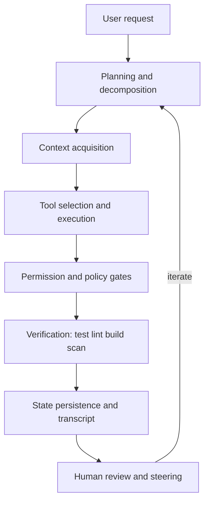

## Introduction

Comparing agent harnesses requires more than listing product names and feature checkboxes. For real adoption decisions, the important question is not which model a product uses or whether it can edit files, but whether it can execute work safely, make that work observable, and recover cleanly from failure.

The hard questions are these:

- Where does it run, what state does it hold, and how isolated is it?
- Who controls tool calls, and at what point can they be stopped?
- How is context collected, compressed, persisted, and forgotten?
- Can long-running and parallel work be tracked without losing control?
- When it fails, what can be reproduced, audited, and rolled back?

This article compares representative commercial and OSS products across 12 dimensions:

1. Execution locus (local / cloud / hybrid)
2. Orchestration openness
3. Tool extensibility
4. Permission control
5. Context strategy
6. Long-running tasks
7. Multi-agent design
8. Git/PR integration
9. Observability
10. Enterprise governance
11. OSS transparency
12. Evaluation readiness

The scope includes GitHub Copilot (cloud agent / IDE Agent Mode / CLI sandboxes), OpenAI Codex, Anthropic Claude Code, Cursor, Cline, Aider, OpenHands, SWE-agent / mini-SWE-agent, and Continue as a historical reference. Continue is not treated as a primary current contender because, after its final 2.0.0 release, the public repository moved to read-only status.

This comparison reflects public documentation as of 2026-09-10. Pricing, plan boundaries, limits, model availability, and beta features change quickly; verify the primary sources before making an adoption decision.

This is not a fixed numeric ranking. It is a technical investigation into which design responsibilities each product takes on and which responsibilities remain with the user or organization.

## Executive Summary

In 2026, agent harnesses are better understood as three design centers rather than a simple local-vs-cloud split.

| Design center | Examples | Optimized for | Main risks |
|---|---|---|---|
| Platform-integrated | GitHub Copilot cloud agent, Cursor Cloud Agents, OpenHands Cloud | Bringing issue/PR/audit/permission/cost workflows into organizational operations | Platform constraints, runtime limits, lock-in |
| Local-first | Claude Code, Codex CLI, Cline, Aider, Copilot IDE Agent Mode | Fast developer iteration, local context, immediate verification | Overbroad permissions, approval fatigue, fragmented audit trails |
| Research/evaluation-first | SWE-agent, mini-SWE-agent, OpenHands SDK | Reproducible experiments, trajectories, benchmark comparison | Less polished daily-dev UX, weaker enterprise controls out of the box |

This is not a product taxonomy; it is a usage taxonomy. The same brand can expose very different behavior across CLI, IDE, cloud, and SDK surfaces. GitHub Copilot cloud agent and Copilot IDE Agent Mode, for example, differ sharply in execution responsibility, auditability, latency, and human intervention points.

## What an Agent Harness Is

In this article, an agent harness means the execution framework that lets an LLM perform software development work. The model is only one component. A harness normally contains these pieces:



The real comparison is where each product invests heavily and where it leaves responsibility to the user or organization.

## Product Map

Before going axis by axis, here is the compressed map.

| Product | Execution surface | Strong axes | Watch carefully |
|---|---|---|---|
| GitHub Copilot cloud agent | Actions-backed cloud | 8 Git/PR, 10 governance, 9 auditability | GitHub-first, time limits, one task per PR |
| GitHub Copilot IDE Agent Mode / CLI | Local IDE / CLI sandbox | 1 execution, 3 MCP, 4 permissions | Surface differences, approval design |
| OpenAI Codex | Local CLI + cloud/SDK | 4 permissions, 2 hooks, 7 subagents | Beta churn, configuration drift and operational overhead |
| Claude Code | CLI/IDE/desktop/web + SDK | 2 hooks, 5 memory, 7 subagents | Broad feature set needs governance |
| Cursor | Editor + Cloud Agents | 3 extensions, 8 GitHub integration, 10 team controls | Surface scope, commercial governance |
| Cline | OSS IDE/CLI/SDK/Kanban | Approval-driven work, checkpoints, model freedom | Self-operated governance and policy burden |
| Aider | Terminal-first | Git safety rail, repo map, lightweight workflow | Long-running work, enterprise controls, parallel orchestration are thinner |
| OpenHands | OSS plus Cloud, Enterprise, and SDK | Self-hosted platform strategy, cloud operations | Heavier operating model, enterprise licensing boundaries |
| SWE-agent / mini | Research/evaluation oriented | trajectories, benchmarks, reproducibility | More experimental than daily-development UX |
| Continue | Historical OSS reference | Early extensible IDE agent lineage | Not a primary current selection target |

## How to Read the 12 Axes

You do not need to read every axis in order. Start from the operating model closest to your situation.

| Reader | Start with these axes |
|---|---|
| GitHub-centric organization | 1, 4, 8, 9, 10, 12 |
| Small product team | 1, 3, 4, 5, 8 |
| Internal agent platform team | 2, 3, 4, 6, 7, 9, 10 |
| Research/evaluation team | 5, 7, 9, 11, 12 |

Each axis is easiest to scan as: decision question, failure modes, then research findings.

## Axis 1: Execution Locus

Execution locus is not just local versus cloud. For engineering decisions, split it into at least five layers.

1. Where model inference runs
2. Where tool execution runs
3. Where filesystem changes happen
4. Where network traffic exits
5. Where session state is stored

GitHub Copilot cloud agent starts from a GitHub-hosted session, works in a GitHub Actions-backed ephemeral environment, and lands work on a branch or pull request. That is organizationally clean: work becomes commits, logs, and PRs. The tradeoff is the boundary: GitHub-hosted repositories, one branch/PR shape per task, and platform time limits.

Local-first systems such as Codex, Claude Code, Cline, and Aider make the opposite tradeoff. They read and edit the user's working directory and can immediately run local tests and builds. This is fast, but secret files, dirty worktrees, local services, and authenticated CLIs must be constrained deliberately.

Sandboxed interactive execution narrows the gap. Copilot CLI sandboxes (public preview) and Codex permission profiles (beta) try to combine local iteration with technical containment. Codex permission profiles describe filesystem and network access as named profiles, such as `:read-only`, `:workspace`, and `:danger-full-access`. Copilot local sandboxing uses OS-specific isolation, while Copilot cloud sandboxing runs in GitHub-hosted ephemeral Linux environments. Codex permission profiles govern local sandboxed command execution; MCP servers, cloud settings, and approved escalations need separate controls.

Inspect these details:

- Are edits made in the local working tree, an isolated worktree, or a cloud checkout?
- Is network access default-deny, domain allowlisted, or broad by default?
- Does state persist after stop, snapshot, resume, or vanish?
- Do intermediate results become branches, commits, PRs, or only chat logs?
- Can the agent reach `.env`, SSH keys, Docker sockets, or cloud CLI credentials?

Failure modes:

- A local agent can read `.env` or `~/.ssh` because the workspace boundary is too broad.
- A cloud agent cannot reproduce local-only services or secrets, so verification fails.
- A sandboxed command passes locally but fails in CI due to environment differences.
- Multiple agents edit the same working tree and collide.

Research findings:

- Cloud-first systems co-locate execution environment, identity, auditability, and artifacts on the same platform. GitHub Copilot cloud agent is the clearest example: execution shifts toward GitHub Actions, while output shifts toward branches and PRs.
- Local-first systems reuse the developer's working tree, local CLIs, dirty state, and authenticated environment. This makes iteration fast, but the boundary around local secrets and external side effects must be designed separately.
- Sandboxed systems sit between those poles. The key is not simply where execution happens, but how filesystem boundaries, network boundaries, and snapshot/deletion semantics are represented.
- Cursor Cloud Agents and OpenHands Cloud show that cloud execution is becoming a service surface that includes GitHub integration, team controls, usage reporting, and permission management, not just remote compute.

## Axis 2: Orchestration Openness

Orchestration is the control loop that decides what the model does next. There are four broad levels.

| Openness | Shape | Examples | Best for |
|---|---|---|---|
| UI-led | Internal loop mostly hidden | Cursor, Copilot IDE | Daily development, low-friction rollout |
| CLI-led | Config, approvals, and logs are exposed | Codex CLI, Claude Code, Cline, Aider | Fast individual/team iteration |
| SDK-led | Agent loop can be embedded in applications | Claude Agent SDK, Cline SDK, OpenHands SDK, Copilot SDK | Internal workflow integration |
| Research-config-led | YAML/trajectory reproducibility | SWE-agent, mini-SWE-agent | Evaluation and benchmarking |

More openness gives more control and more responsibility. The Claude Agent SDK, for example, exposes Claude Code-like tools, hooks, subagents, MCP, and sessions from Python or TypeScript. That is powerful, but if you expose it to users, you own authorization, tenant isolation, logging, consent, and recovery.

GitHub Copilot cloud agent goes the other way. It hides much of the internal control loop but lands work into an organizationally familiar issue/branch/PR flow. It optimizes for reviewable software process rather than programmable loop internals.

Codex and Claude Code sit in the middle. Both expose hooks and subagents with meaningful lifecycle control. Codex hooks include events such as `SessionStart`, `PreToolUse`, `PermissionRequest`, `PostToolUse`, `PreCompact`, `SubagentStart`, and `Stop`. In current Codex releases, however, command handlers are the primary supported handler type, and `PreToolUse` / `PostToolUse` cover supported paths such as Bash, `apply_patch`, and MCP tool calls rather than every shell or tool path. Claude Code exposes an even broader set, including `InstructionsLoaded`, `ConfigChange`, `FileChanged`, `TaskCreated`, `TaskCompleted`, and `WorktreeCreate`.

Inspect these capabilities:

- Can you intercept before tool execution (`PreToolUse`)?
- Can you intercept before an approval prompt (`PermissionRequest`)?
- Can you inspect tool output after execution (`PostToolUse`)?
- Can you prevent the agent from stopping before completion (`Stop`)?
- Can you observe compaction boundaries?
- Can you observe subagent start/stop events?

Caution: hook event names are product-specific. Codex and Claude Code use PascalCase names such as `PreToolUse` and `PermissionRequest`, while GitHub Copilot hooks use lower-camel names such as `sessionStart`, `preToolUse`, `postToolUse`, and `agentStop`; the public Copilot hook type list does not include a `PermissionRequest` event.

Design implications:

- UI-led systems are easy to adopt but harder to customize deeply.
- SDK-led systems integrate well but make you responsible for multi-tenancy, auditing, and authorization.
- Hooks are powerful but scripts and HTTP endpoints become part of your attack surface.

Research findings:

- Claude Code exposes a particularly fine-grained lifecycle model. It reaches beyond tool calls into events such as `InstructionsLoaded`, `ConfigChange`, `FileChanged`, `TaskCreated`, `TaskCompleted`, and `WorktreeCreate`.
- Codex exposes a smaller but practical JSON-based lifecycle surface. Its `transcript_path`, `permission_mode`, tool input, and tool output fields make automation possible, while current hooks remain command-handler centric and do not form a complete interception boundary.
- GitHub Copilot hooks use repository and personal hook files with lower-camel event names. Comparing hook systems by event name is misleading; compare whether each system has pre-execution control, post-execution observation, and pre-completion feedback.
- UI-led systems hide more of the internal loop, but that is not automatically weaker. If work is emitted as reviewable PRs, logs, checks, and comments, the organization can still get strong operational control.

## Axis 3: Tool Extensibility

Tool extensibility is rapidly converging around MCP, but "supports MCP" is too shallow to compare products.

Compare these layers:

1. Transport: stdio, HTTP, SSE, remote executor
2. Authentication: bearer token, OAuth, local env, managed secret
3. Tool allowlist: server-level or tool-level
4. Approval: auto, prompt, approve, deny per MCP tool
5. Instructions: how MCP server instructions reach the model
6. Distribution: personal, repository, team, organization, marketplace

Codex MCP supports stdio and streamable HTTP servers, bearer tokens, OAuth, tool allowlists/denylists, and per-tool approval modes. Claude Code treats MCP tools like normal tools in hook events, using names such as `mcp__server__tool`. Cursor centralizes plugins, skills, MCPs, subagents, rules, commands, and hooks through its Customize surface and Marketplace model. GitHub Copilot extends MCP across IDE chat, CLI, Copilot app, cloud agent, and code review, while tying availability to organization policy.

Among OSS systems, Cline emphasizes plugin/MCP/SDK extensibility. Aider is less MCP-centered and more focused on provider flexibility, repo maps, and Git integration. OpenHands moves toward an agent platform model through SDK, Cloud, and Enterprise surfaces.

Failure modes:

- Too many MCP servers bloat tool descriptions and reduce tool-selection accuracy.
- Similar tool names cause unstable tool selection.
- OAuth tokens or environment variables do not propagate consistently across local, cloud, and subagent contexts.
- Plugin-bundled hooks or MCP servers are enabled without review.

Questions to ask:

- Is read-only access enough for this MCP server?
- Can write tools be isolated into a separate server or toolset?
- Can approval behavior be configured per tool?
- Are server instructions short and self-contained at the start?
- Who can update, disable, or distribute this extension?

Research findings:

- MCP support is not a single feature. Codex can configure server-level and tool-level allow/deny lists and approval modes, while UI/Marketplace-oriented systems shift the problem toward distribution and lifecycle management.
- Claude Code treats MCP tools as regular tools in lifecycle events, which makes names like `mcp__server__tool` usable in hooks and permissions. This turns MCP from an extension mechanism into part of the normal tool-governance surface.
- Cursor's Customize surface groups plugins, skills, MCPs, subagents, rules, commands, and hooks into a single management plane. Extensibility there becomes closer to supply-chain management than local configuration.
- Aider extends less through MCP and more through provider portability, repo maps, and Git integration. OpenHands shifts extensibility toward SDK and platform-level tool orchestration.

## Axis 4: Permission Control

Permission control is where harness quality becomes most visible. The question is not whether an approval dialog exists. The question is which layer enforces the boundary.

| Layer | Examples | Strength | Limit |
|---|---|---|---|
| Model instructions | CLAUDE.md, AGENTS.md, rules | Flexible, cheap | Not enforcement |
| Tool allow/deny | allowedTools, disallowedTools, toolsets | Clear and fast | Weak for conditional policy |
| Approval UI | approve/deny prompt | Human stop point | Approval fatigue, inconsistency |
| Hooks | PreToolUse, PermissionRequest | Conditional policy and audit | Hooks must be secured too |
| Sandbox | filesystem/network profiles | Technical blast-radius reduction | OS differences, complexity |
| Organization policy | managed settings, enterprise policy | Centralized control | Operational overhead |

Codex permission profiles are concrete: they define filesystem and network boundaries, support `read`, `write`, and `deny`, workspace roots, network domain allow/deny rules, and local/private network handling. Claude Code layers permission modes, allow/deny rules, hooks, managed settings, and subagent-specific tools/permission modes. GitHub Copilot cloud agent ties permissions to GitHub policy, Actions environments, hooks, MCP settings, and auditability.

Cline's editor experience defaults toward explicit approval for actions, with Plan/Act and checkpoints supporting human control. CLI/headless and Kanban workflows can use auto-approval or experimental permission-bypass patterns, so defaults need to be checked per surface. Aider uses Git as a safety rail: auto-commits, `/undo`, and separation of dirty user changes make rollback easy.

Common misunderstandings:

- Hooks are not sandboxes; equivalent side effects may occur through another path.
- `PostToolUse` is after-the-fact; it cannot undo side effects.
- Instructions are not enforcement. Use permissions, sandboxes, or hooks for hard blocks.
- `danger-full-access` and bypass modes are useful for experiments but dangerous as team defaults.

Practical default posture:

1. Start with read-only or workspace-write without network.
2. Add network access through domain allowlists.
3. Deny `.env`, keys, cloud credentials, and package-manager hooks.
4. Where supported, block destructive commands with `PreToolUse` or an equivalent pre-execution control.
5. Require human approval for deployment, migrations, and production database access through `PermissionRequest` equivalents or approval UI.
6. Use Stop hooks to prevent "done" before tests or validation run.

Research findings:

- Permission control is a stack, not a feature: instructions, tool allow/deny lists, approval UI, hooks, sandboxes, and managed policy each cover different failure modes.
- Codex permission profiles model local command boundaries as filesystem and network policy. The precedence of `deny`, workspace-relative rules, and network domain rules makes this a concrete policy data structure.
- Claude Code layers permission modes, allow/deny rules, managed settings, hooks, and subagent-specific tool/permission configuration. That makes it possible to separate static allowlists from dynamic checks.
- Aider relies more on Git recovery semantics than hard sandboxing. Cline emphasizes approval and checkpoints. GitHub Copilot cloud agent distributes permission concerns across GitHub policy, Actions, repository settings, hooks, MCP configuration, and audit logs.

## Axis 5: Context Strategy

Context strategy affects not only quality, but also cost, latency, security, and reproducibility.

Common mechanisms:

1. Repository-wide structural summaries
2. Local search, grep, and semantic retrieval
3. Explicit rules and instructions
4. Long-term memory
5. Compaction and summarization

At a deeper level, context strategy can be treated as a composition of data structures. The following model is normalized for comparison; it is not a claim that every product implements these exact types internally.

```typescript
type ContextLayer =
    | InstructionLayer
    | RepoMapLayer
    | RetrievalLayer
    | MemoryLayer
    | TranscriptLayer
    | CompactionLayer
    | SubagentLayer
    | ToolMetadataLayer;

type ContextItem = {
    id: string;
    source: "repo" | "memory" | "rule" | "tool" | "transcript" | "mcp";
    scope: "user" | "project" | "local" | "managed" | "session" | "subagent";
    content: string;
    tokenEstimate: number;
    freshness: "startup" | "lazy" | "live" | "compacted" | "stale-risk";
    authority: "hint" | "instruction" | "policy" | "evidence";
};
```

In this structure, `source`, `scope`, `freshness`, and `authority` matter as much as `content`. CLAUDE.md and AGENTS.md are `authority: "instruction"`, not enforcement. Deny rules and sandbox policies should be modeled separately from context. Tool output is `authority: "evidence"`, but transcript-derived evidence may still be `freshness: "stale-risk"`.

### Repository Maps

Aider's repo map is a representative example of compressing context as a symbol graph rather than full files. Conceptually, it looks like this:

```typescript
type RepoMap = {
    files: FileNode[];
    edges: DependencyEdge[];
    tokenBudget: number;
};

type FileNode = {
    path: string;
    symbols: SymbolDef[];
    rank: number;
};

type SymbolDef = {
    name: string;
    kind: "class" | "function" | "method" | "type" | "constant";
    signature?: string;
    keyLines: string[];
    references: number;
};

type DependencyEdge = {
    from: string;
    to: string;
    kind: "imports" | "calls" | "references";
    weight: number;
};
```

Aider uses tree-sitter to extract definitions and references, then ranks important snippets over a graph where files are nodes and dependencies are edges. A token budget such as `--map-tokens` constrains which `SymbolDef.keyLines` reach the prompt. The design difference is not only retrieval quality; it is which information gets discarded.

### Instructions, Rules, and Memory

Claude Code's CLAUDE.md, `.claude/rules/`, and auto memory can be separated into three data structures.

```typescript
type InstructionFile = {
    path: string;
    scope: "managed" | "user" | "project" | "local";
    loadMode: "startup" | "lazy-by-path" | "imported";
    pathGlobs?: string[];
    content: string;
};

type MemoryIndex = {
    entrypoint: "MEMORY.md";
    loadedPrefixLimit: { lines: 200; bytes: 25_000 };
    topics: Array<{ path: string; summary: string; lastTouched?: string }>;
};

type MemoryNote = {
    topic: string;
    fact: string;
    evidence?: string;
    staleWhen?: string;
};
```

The key distinction is that `InstructionFile` content enters the context window at startup or lazy-load time, while detailed `MemoryNote` files are read on demand. Auto memory is therefore closer to a small knowledge base indexed by `MEMORY.md` than to a magic long-term memory. Without a `staleWhen`-style review condition, old learnings can linger.

### Transcripts and Trajectories

To evaluate context strategy, you also need to inspect conversation history. Claude Code and Codex hooks expose fields such as `session_id`, `transcript_path`, `tool_name`, and `tool_input`. mini-SWE-agent stores `.traj.json` files with `info` and `messages`; SWE-agent stores trajectory turns with thought, action, observation, state, and query.

Normalized, this looks like:

```typescript
type AgentTranscript = {
    sessionId: string;
    messages: AgentMessage[];
    artifacts: ArtifactRef[];
};

type AgentMessage = {
    role: "system" | "user" | "assistant" | "tool" | "exit";
    content?: string;
    toolCalls?: ToolCall[];
    extra?: {
        cost?: number;
        timestamp?: number;
        returncode?: number;
        actions?: Array<{ command: string }>;
        response?: unknown;
    };
};

type ToolCall = {
    id: string;
    name: string;
    input: unknown;
    output?: unknown;
    approvalState?: "auto" | "prompted" | "approved" | "denied";
};

type ArtifactRef = {
    kind: "file" | "patch" | "log" | "pr" | "screenshot";
    uri: string;
    hash?: string;
};
```

With this structure, you can ask which files were read before an edit, which tool result influenced the final answer, and which evidence disappeared after compaction.

### Compaction and Subagent Context

Compaction is not just summarization. It transforms history into state for the next inference step. Claude Code subagent transcripts remain separate from the main conversation, and compaction boundaries can record metadata such as `trigger` and `preTokens`.

```typescript
type CompactionRecord = {
    trigger: "manual" | "auto";
    preTokens?: number;
    summary: string;
    preservedFacts: string[];
    droppedArtifacts: ArtifactRef[];
};

type SubagentContext = {
    agentId: string;
    agentType: string;
    parentSessionId: string;
    startupContext: {
        systemPrompt: string;
        taskMessage: string;
        inheritedInstructions: boolean;
        inheritedGitStatus: boolean;
        preloadedSkills: string[];
    };
    transcriptPath?: string;
};
```

The key comparison is whether a subagent starts from fresh context, inherits the parent through a fork, returns only a summary, or can resume its full transcript. Fresh context reduces context pollution but increases explanation cost. Forks reduce explanation cost but inherit parent noise.

### MCP Tool Metadata

MCP is not only a way to call tools; it is also a way to put tool metadata into model context. At minimum, compare this structure:

```typescript
type McpServerContext = {
    name: string;
    transport: "stdio" | "http" | "sse";
    instructions?: string;
    tools: Array<{
        name: string;
        description: string;
        inputSchema: unknown;
        approvalMode?: "auto" | "prompt" | "approve";
        enabled: boolean;
    }>;
};
```

The `instructions` field and `tools[].description` directly affect tool selection. Long descriptions, similarly named tools, and unused tools increase context cost and misselection risk. Therefore MCP adoption research should look not only at whether a tool works, but also at how much context its metadata consumes and how often it causes wrong tool selection.

Aider's repo map is distinctive. It builds a concise repository map containing important files, symbols, classes, functions, and signatures, then selects the most relevant parts using graph ranking and a token budget. The model can understand likely entry points before reading full files.

Claude Code combines CLAUDE.md, `.claude/rules/`, auto memory, subagent memory, and compaction. The key point is that CLAUDE.md and auto memory are context, not enforcement. If something must be blocked, use permissions or hooks. Auto memory is useful, but if it cannot be audited and curated, stale learnings can conflict with team standards.

Codex has AGENTS.md, rules, hooks, session transcripts, and subagent context. GitHub Copilot cloud agent uses repository instructions, Copilot Memory when enabled and available for the relevant plan/public-preview condition, and MCP-provided context such as issues and pull requests. Cursor brings rules, skills, subagents, MCP, and plugins into its Customize surface.

Inspect these details:

- What context loads at startup?
- Are path-specific rules lazily loaded?
- Who writes memory, and who can delete it?
- What survives compaction?
- Does a subagent inherit parent context or start fresh?
- How does the harness find important files in large repositories?

Failure modes:

- CLAUDE.md grows so large that adherence drops.
- Memory contains an obsolete build command and causes repeated failures.
- A path-specific rule did not load but the user assumes it did.
- A subagent lacks needed context and repeats exploration.
- Compaction drops evidence or unfinished work.

Research findings:

- Context strategy differs most in what each system chooses not to include. Aider compresses code into symbol-level repo maps, Claude Code separates instructions, memory, and subagent context, and SWE-agent-style systems preserve trajectories for replay.
- Rules and memory are easier to compare when treated as data structures with `scope` and `loadMode`. Startup instructions, lazy path-scoped rules, and post-compaction reinjection behave very differently.
- Transcripts and trajectories are both model input history and debugging datasets. mini-SWE-agent's `.traj.json` structure, with config, messages, cost, and submission data, directly supports later failure analysis.
- MCP tool metadata is a hidden source of context consumption. Tool descriptions, input schemas, and server instructions shape tool selection and can create misselection risk when too many tools are registered.

## Axis 6: Long-Running Tasks

For long-running tasks, the key is not whether the model can think longer. The key is whether the harness can split work, wait, resume, and observe progress.

GitHub Copilot cloud agent runs in the background and lands work on branches and PRs. It can be started and followed on GitHub, then iterated through comments, but platform time limits and the one-repository/one-branch/one-PR shape matter.

Claude Code spans CLI, desktop, web, and IDE surfaces, and offers background agents, scheduled tasks, subagents, hooks, the Agent SDK, and Managed Agents. Stop and TaskCompleted hooks can define what "done" means. Codex supports subagents, non-interactive execution, hooks, and cloud-connected workflows. Cline emphasizes watching long-running processes such as dev servers and test watchers. OpenHands Cloud/Enterprise pushes this toward service-style multi-user, multi-task operation. Aider remains more of an interactive terminal pair-programming tool than a long-running async platform.

Inspect these capabilities:

- Does idle work stop, resume, or persist?
- Can dev server and watcher output be monitored continuously?
- How are rate limits and tool failures retried?
- Are intermediate states stored as transcripts, branches, task cards, or snapshots?
- Can a user steer the session while it is running?

Failure modes:

- A huge task is held in one turn until context rot appears.
- Long tests run synchronously in hooks and stall the agent.
- Background task output never returns to the model.
- Cloud time limits leave half-finished branches.

Research findings:

- Long-running support is mostly about where unfinished state is stored. GitHub Copilot cloud agent stores progress in branches, PRs, and logs; Claude Code and Codex store it in sessions, transcripts, and subagents; OpenHands stores it in Cloud/Enterprise session infrastructure.
- Watcher-style long-running work differs from cloud-PR-style work. Watchers center on stdout/stderr and process monitoring, while cloud PR workflows center on branch state, checks, and review artifacts.
- Synchronous hooks are the wrong place for long validation. Claude Code's async hook pattern shows a useful split: keep the agent loop moving, then return validation output as later context.
- Aider's terminal-first model is optimized for short Git-backed iterations rather than long asynchronous orchestration. That is a design choice, not merely a missing feature.

## Axis 7: Multi-Agent Design

Multi-agent design is not parallelism by default. It works when task boundaries are clear, each worker has scoped permissions and outputs, and integration is planned.

Claude Code subagents have strong context isolation. Built-in Explore and Plan agents are read-focused and keep large search output out of the main conversation. Custom subagents can specify tools, disallowedTools, model, permissionMode, MCP servers, hooks, memory, background behavior, and worktree isolation. Forks inherit the parent conversation, reducing explanation cost but weakening isolation.

Codex subagents spawn when explicitly requested, inherit the sandbox policy, and support parallel investigations or experimental CSV-style worker batches. Cline uses SDK subagents and Kanban (Research Preview) for per-card and per-worktree parallel work. Multiple Copilot CLI cloud sandbox sessions, multiple GitHub cloud agent sessions, and Cursor Cloud Agents also serve as parallel work entry points.

Good decompositions:

- security reviewer / docs researcher / code mapper for parallel review
- frontend reproduction / backend trace / test fixer for a bug
- one worker per file for repeated audits

Bad decompositions:

- multiple agents editing the same file
- parallel implementation before requirements are stable
- more reviewers without a clear final decision owner

Design decisions:

- Who is the coordinator?
- Are workers read-only or allowed to edit?
- Does each worker start fresh or fork parent context?
- Is the output a diff, report, or PR?
- Who resolves conflicts during integration?

Research findings:

- Multi-agent design is primarily about context isolation. Claude Code named subagents start with fresh context, while forks inherit parent context. Codex subagents inherit sandbox policy and runtime overrides. The important design question is which state is inherited.
- A subagent definition is a small execution profile, not just a prompt. It can include name, description, tools, model, permission mode, MCP servers, hooks, memory, background behavior, and isolation.
- Task-board systems such as Cline Kanban and Cursor Cloud Agents map parallel work onto visible work items. SWE-agent and mini-SWE-agent map parallelism into batch runs and trajectories for experiment reproducibility.
- Fan-out increases cost, latency, and integration work. It is most effective for exploration, review, and repeated audits; it is weakest when multiple agents edit the same files.

## Axis 8: Git/PR Integration

An agent harness becomes operationally useful when it produces reviewable diffs.

Aider is the clearest Git-first design. It auto-commits edits, separates dirty user changes before editing, and exposes `/diff`, `/undo`, and `/commit`. Cline emphasizes diff review, checkpoints, and reverts inside the IDE. Claude Code combines Git operations, commits, PR creation, worktree isolation, and hooks. GitHub Copilot cloud agent lands work directly into branches, commits, PRs, and review-comment iteration on GitHub.

Do not only ask whether a product can create a PR. Ask this:

- How does it handle a dirty worktree?
- Can agent changes be separated from human changes?
- Is author/committer attribution clear?
- Does it respect branch protection and required checks?
- Can it include rationale, test results, and evidence in the PR body?
- Can a human take over mid-task?

GitHub Copilot cloud agent's advantage is that the work starts inside GitHub's collaboration model. Its limits are GitHub-centric operation and weaker fit for multi-repository changes. Cursor's GitHub integration uses a GitHub App with repository, PR, issues, checks/actions, and branch-protection-related permissions. Enterprise setups may involve GitHub Enterprise Server, IP allowlists, AWS PrivateLink, or Cloudflare Tunnel.

Failure modes:

- The agent overwrites human dirty changes.
- A PR exists but lacks rationale or evidence.
- Branch protection prevents the agent-created PR from being mergeable.
- Generated commits are too large to review.
- Rollback only covers Git state and ignores database or external side effects.

Research findings:

- Git/PR integration differs in how much provenance it preserves. The strongest systems connect rationale, commits, test evidence, related issues, and agent logs.
- Aider uses Git commits as a local recovery primitive. GitHub Copilot cloud agent uses GitHub branches, commits, PRs, and review comments as the primary collaboration surface.
- Claude Code worktree isolation and subagent worktrees help separate parallel attempts. Cursor's GitHub integration brings GitHub App permissions, checks/actions, and branch protection into the agent workflow.
- Git history alone is not enough for external side effects. Database migrations, cloud resource changes, and deployments need separate evidence and recovery procedures.

## Axis 9: Observability

Observability is where production adoption succeeds or fails. A demo can work without it; an organization cannot. You need to know why a command ran, who approved it, which MCP tool was called, and with what arguments.

At minimum, observe these events:

- session start/end
- user prompt
- tool request / approval / denial
- tool output / failure
- file edit
- command execution
- subagent start/stop
- compaction
- memory load/write
- config change
- PR/commit/check status

Claude Code hooks expose fine-grained fields such as prompt IDs, session IDs, transcript paths, tool names, durations, and subagent transcripts. Codex hooks include session IDs, turn IDs, permission modes, transcript paths, model names, and tool input/output. Cline Enterprise advertises OpenTelemetry, Datadog, Grafana, and Splunk integrations. GitHub Copilot cloud agent naturally aligns with GitHub logs, PRs, Actions, usage metrics, and audit logs.

Do not confuse chat transcripts with audit logs. Transcripts help restore model context. Audit logs need tamper resistance, retention policy, searchability, and secret/PII redaction.

Practical logging pattern:

- Save tool calls as JSONL.
- Store approval/deny events with user ID, reason, timestamp, and tool.
- Separate shell stdout/stderr summaries from large raw artifacts.
- Run secret scanning on logs too.
- Link session ID to PR number and commit SHA.

Research findings:

- Claude Code and Codex expose rich local observation points through hook inputs such as `session_id`, `transcript_path`, `tool_name`, and `tool_input`. GitHub Copilot cloud agent is naturally observable through PRs, Actions, audit logs, and usage metrics.
- The core observability schema is made of join keys: `session_id`, `user_id`, `tool_name`, `tool_args_hash`, `approval_state`, `artifact_ref`, and `commit_sha`. Without these, conversations, tools, PRs, and CI results cannot be joined reliably.
- Transcripts are not audit logs. They help restore model context, while audits need tamper resistance, retention policy, searchability, redaction, and approval identity.
- Enterprise products tend to push observability toward OpenTelemetry, external logging systems, dashboards, and usage reports. OSS/local systems leave more of the log schema to the user.

## Axis 10: Enterprise Governance

Enterprise governance is invisible in personal use and decisive in organizational adoption.

Evaluate these areas:

1. Identity, SSO, and RBAC
2. Model allowlists and denylists
3. MCP server allowlists and denylists
4. Managed hooks and permission configuration
5. Network controls
6. Audit logs
7. Cost and budget controls
8. Data retention and region posture
9. Alignment with PR and branch protection
10. Developer device management such as MDM or Intune

GitHub Copilot cloud agent connects naturally to GitHub Business/Enterprise policy, Actions, repository MCP settings, usage metrics, AI credits, GitHub App behavior, and audit logs. Copilot cloud/local sandboxes add local sandbox policy and cloud sandbox access policy considerations.

One important caveat: GitHub Copilot content exclusions do not apply to cloud agent. Treating exclusions as a cloud-agent access boundary leaves a risk that excluded files can still be seen or updated.

Claude Code has managed settings, managed CLAUDE.md, model allowlists, MCP allow/deny controls, hooks, and permissions. Codex has managed `requirements.toml`, permission profiles, and managed hooks. Cursor Team/Enterprise includes GitHub integration, Protected Git Scopes, private connectivity, Marketplace/Team Marketplace, Cloud Agents, and Bugbot. OpenHands Cloud/Enterprise emphasizes RBAC, permissions, usage reporting, budgeting enforcement, and multi-user support. Cline Enterprise advertises SSO, RBAC, model/tool controls, remote configuration, and observability.

By contrast, lightweight OSS or research-oriented tools such as Aider and mini-SWE-agent offer flexibility and reproducibility, but governance is largely your responsibility.

Decide these before rollout:

- Who can enable agents?
- Which repositories are in scope?
- Which models are allowed?
- Which MCP servers are allowed?
- Who can distribute and update hooks?
- What happens on budget overrun?
- How long are audit logs retained?

Failure modes:

- Users add arbitrary MCP servers and leak internal data.
- BYOK spreads personal API keys across machines.
- Hooks exist only locally, so team policy is inconsistent.
- Transcripts expire before audit investigations complete.
- Subagent fan-out causes uncontrolled spend.

Research findings:

- Enterprise governance is a composition of identity, repository scope, model policy, MCP allowlists, hook distribution, network boundaries, budgets, and audit retention.
- GitHub Copilot aligns with GitHub organization policy. Cursor adds GitHub App integration, Protected Git Scopes, and private connectivity. Claude Code and Codex distribute controls through managed settings or requirements. OpenHands and Cline Enterprise expose more service-style RBAC and usage reporting.
- Lightweight OSS and research-oriented systems trade governance for flexibility. They can fit enterprise environments, but SSO, RBAC, audit retention, exception workflows, kill switches, and cost controls become user-owned concerns.
- Policy distribution is a key differentiator. Personal config, repository config, team marketplaces, managed config, and MDM-delivered hooks have very different levels of enforcement.

## Axis 11: OSS Transparency

OSS transparency should mean verifiability, modifiability, and auditability, not just no-cost usage.

Compare these points:

- What is the license?
- Is the core runtime open source, or only the UI?
- Are enterprise features open, source-available, or closed?
- Can you inspect tool execution and permission logic?
- Is release cadence healthy?
- Can you fork in internal policy?
- Can telemetry and authentication behavior be inspected?

Cline, Aider, OpenHands core, and SWE-agent/mini-SWE-agent score well here. Cline exposes core agent surfaces across SDK/CLI/IDE/Kanban. Aider's Git integration and repo map are inspectable. OpenHands core and agent-server are MIT-licensed, while the Enterprise directory has separate licensing. SWE-agent is MIT and research-driven, with trajectories and batch/eval mechanisms that are easy to inspect.

Continue remains important historically, but its current role is different: after final 2.0.0, the repository is no longer actively maintained and is read-only. Treat it as lineage and possible fork material, not a primary current adoption target.

The OSS reality:

- Freedom is high.
- Provider/model portability is usually better.
- You own SSO, RBAC, audit, budgets, and incident response.
- You also own security review.

For closed products, compare audit-log export, configuration export, data-retention documentation, third-party attestations, and evidence availability during incidents as substitutes for code visibility.

Research findings:

- OSS transparency is not only code visibility. It also includes whether tool execution, permission checks, prompt assembly, memory persistence, telemetry, and provider authentication can be inspected.
- Cline, Aider, OpenHands core, and SWE-agent/mini-SWE-agent are easier to inspect at the runtime level. Cloud and Enterprise surfaces may still have separate licensing or source availability constraints.
- For closed products, audit-log export, configuration export, data-retention documentation, third-party attestations, and incident evidence availability become substitutes for code visibility.
- Continue remains valuable as design lineage and possible fork material, but its read-only/non-active maintenance status changes how it should be evaluated.

## Axis 12: Evaluation Readiness

Evaluation readiness turns agent adoption from intuition into measurable engineering.

There are three levels:

1. Benchmark evaluation: SWE-bench, ProgramBench, internal task sets
2. Operational evaluation: lead time, intervention count, rollback rate, defect escape
3. Failure analysis: trajectories, transcripts, tool-call logs, root-cause taxonomy

SWE-agent and mini-SWE-agent are strongest here. They are built around SWE-bench, batch mode, trajectory inspection, output files, and YAML configuration. The current documentation positions mini-SWE-agent as simpler and more flexible while matching SWE-agent performance, making it a strong default for research/evaluation workflows.

Aider has its own LLM leaderboards for editing capability. GitHub Copilot cloud agent ties naturally into PR outcomes, merge rates, and time-to-merge operational data. Developer-facing harnesses such as Claude, Codex, Cline, and Cursor still need separate analysis on real repositories because official benchmarks rarely expose context retrieval, approval flow, rollback, or review quality.

A good evaluation set should:

- Use real past issues.
- Have test or review-based acceptance criteria.
- Mix small, medium, and large tasks.
- Separate read-only research, single-file fixes, multi-file fixes, investigation, and refactoring.
- Measure intervention count and evidence quality, not just success/failure.

Avoid these traps:

- Choosing based on one demo task
- Comparing models and harnesses without separating variables
- Ignoring human review time
- Looking only at successful PRs
- Excluding permission/security failures from the evaluation

Compare candidates with the same model, task set, permissions, and MCP configuration where possible; record unavoidable differences, then classify failures into model reasoning, context retrieval, permission block, tool failure, and human handoff.

Research findings:

- SWE-agent and mini-SWE-agent treat trajectory as a first-class artifact. Structures such as `thought`, `action`, `observation`, `state`, `query`, or `.traj.json` fields like `info`, `messages`, and `extra` make failure analysis and replay possible.
- GitHub Copilot cloud agent shifts evaluation from individual chat turns to the PR lifecycle: branch creation, review, CI, merge, and iteration through comments.
- Aider's editing benchmarks are useful but separate from organizational governance. Editing capability, reviewability, auditability, and rollback should be analyzed as different concerns.
- Evaluation readiness is less about success rate than failure taxonomy. The most useful harnesses make it possible to separate model reasoning failures, context retrieval failures, permission blocks, tool failures, human handoff failures, and external environment failures.

## Selection Framework Across the 12 Axes

In practice, choose by operating model.

### GitHub-Centric Organization

Primary candidates:

- GitHub Copilot cloud agent
- Copilot IDE Agent Mode / Codex / Claude Code / Cursor as local complements

Focus axes: 1 execution locus, 4 permissions, 8 Git/PR integration, 9 observability, 10 governance, 12 evaluation readiness.

Good fit when:

- Most engineering changes already flow through GitHub Issues and PRs.
- Auditability and permission governance matter.
- Work can be reviewed at PR granularity.
- Tests and builds run in GitHub Actions.

Poor fit when:

- Work spans multiple VCSs or many repositories in one task.
- Core workloads are long-running jobs.
- Verification depends heavily on local-only services.

### Small, High-Velocity Product Team

Primary candidates:

- Claude Code
- Codex CLI
- Cursor
- Cline
- Aider

Focus axes: 1 execution locus, 3 tool extensibility, 4 permissions, 5 context strategy, 8 Git/PR integration.

Good fit when:

- Decision makers and implementers are close.
- Tests run quickly on developer machines.
- Rollback is mostly Git-based.
- Speed matters more than centralized control.

Poor fit when:

- Strict separation of duties or centralized audit is mandatory.
- Developer machines hold powerful secrets.
- Local-only policy cannot be managed consistently.

### Team Building Its Own Agent Platform

Primary candidates:

- OpenHands SDK/Cloud/Enterprise
- Cline SDK
- Claude Agent SDK
- Copilot SDK

Focus axes: 2 orchestration, 3 tool extensibility, 4 permissions, 6 long-running tasks, 7 multi-agent design, 9 observability, 10 governance.

Good fit when:

- You need integration with internal portals or ticketing systems.
- You need multi-user or multi-tenant agent runtime.
- You want tools, hooks, MCP, and telemetry shaped to internal requirements.

Poor fit when:

- There is no team to operate the runtime.
- You cannot maintain sandbox, session, and audit infrastructure.
- A ready-made UI is enough.

### Research and Evaluation Platform

Primary candidates:

- mini-SWE-agent
- SWE-agent
- OpenHands benchmarks / SDK

Focus axes: 5 context strategy, 7 multi-agent design, 9 observability, 11 OSS transparency, 12 evaluation readiness.

Good fit when:

- You need trajectories for failure analysis.
- You compare models or prompts systematically.
- Reproducibility matters more than daily UX.

Poor fit when:

- Daily development UX is the priority.
- Non-technical users need to operate it.
- SSO/RBAC/audit requirements arrive immediately.

## Cross-Cutting Findings

Across the 12 axes, agent harnesses are converging in several important ways.

First, context and enforcement are becoming separate layers. CLAUDE.md, AGENTS.md, rules, memory, repo maps, and MCP metadata shape model behavior, but they do not enforce boundaries. Enforcement requires permissions, sandboxes, hooks, and managed policy.

Second, transcripts and trajectories are becoming core artifacts. The more a harness records what it read, which tools it called, which observations it received, and where compaction happened, the easier it is to analyze failures later. SWE-agent-style systems make this explicit for research, while Claude and Codex expose much of it through hooks and transcript paths.

Third, extensibility is becoming a supply-chain problem. MCP servers, plugins, skills, hooks, and subagents are useful, but each adds tool metadata, credentials, approval boundaries, distribution paths, and update responsibilities. Extensibility must include the ability to disable, scope, and audit extensions.

Fourth, cloud-first and local-first systems differ not only in execution location but also in artifact model. Cloud systems lean toward PRs, branches, task boards, and usage reports. Local systems lean toward working trees, terminal output, Git commits, and transcripts. The right choice depends on which artifacts the organization wants to review, audit, and retain.

## Reproducibility Note (2026-09-10 Snapshot)

To update this article, use this sequence:

1. Separate each product by surface: CLI, IDE, cloud, SDK.
2. Recheck only the relevant 12-axis dimension.
3. Verify official docs for limits, beta notes, and plan boundaries.
4. Update only the relevant section and table cells, then record the verification date.

<details>
<summary>Primary sources</summary>

- GitHub Copilot cloud agent: [About GitHub Copilot cloud agent](https://docs.github.com/en/copilot/concepts/agents/cloud-agent/about-cloud-agent)
- GitHub Copilot sandboxes: [About cloud and local sandboxes for GitHub Copilot](https://docs.github.com/en/copilot/concepts/about-cloud-and-local-sandboxes)
- GitHub Copilot hooks: [About hooks for GitHub Copilot](https://docs.github.com/en/copilot/concepts/agents/hooks)
- GitHub Copilot MCP: [About Model Context Protocol](https://docs.github.com/en/copilot/concepts/context/mcp)
- OpenAI Codex permissions: [Codex permissions](https://learn.chatgpt.com/docs/permissions)
- OpenAI Codex hooks: [Codex hooks](https://learn.chatgpt.com/docs/hooks)
- OpenAI Codex MCP: [Codex MCP](https://learn.chatgpt.com/docs/extend/mcp?surface=cli)
- OpenAI Codex subagents: [Codex subagents](https://learn.chatgpt.com/docs/agent-configuration/subagents)
- Claude Code overview: [Claude Code overview](https://code.claude.com/docs/en/overview)
- Claude Code memory: [Claude Code memory](https://code.claude.com/docs/en/memory)
- Claude Code hooks: [Claude Code hooks](https://code.claude.com/docs/en/hooks)
- Claude Code subagents: [Claude Code subagents](https://code.claude.com/docs/en/sub-agents)
- Claude Agent SDK: [Claude Agent SDK overview](https://code.claude.com/docs/en/agent-sdk/overview)
- Cursor docs: [Cursor documentation](https://cursor.com/docs)
- Cursor customization: [Customize Cursor](https://cursor.com/docs/customize-cursor)
- Cursor GitHub integration: [Cursor GitHub integration](https://cursor.com/docs/integrations/github)
- Cline docs: [Cline documentation](https://docs.cline.bot/)
- Cline CLI: [Cline CLI Overview](https://docs.cline.bot/usage/cli-overview)
- Cline SDK: [Cline SDK](https://docs.cline.bot/sdk/overview)
- Aider git integration: [Aider git integration](https://aider.chat/docs/git.html)
- Aider repo map: [Aider repository map](https://aider.chat/docs/repomap.html)
- Aider repo map internals: [Building a better repository map with tree-sitter](https://aider.chat/2023/10/22/repomap.html)
- OpenHands docs: [OpenHands documentation](https://docs.openhands.dev/)
- SWE-agent docs: [SWE-agent documentation](https://swe-agent.com/latest/)
- SWE-agent trajectories: [SWE-agent output files](https://swe-agent.com/latest/usage/trajectories/)
- mini-SWE-agent FAQ: [mini-SWE-agent FAQ](https://mini-swe-agent.com/latest/faq/)
- mini-SWE-agent output files: [mini-SWE-agent output files](https://mini-swe-agent.com/latest/usage/output_files/)
- mini-SWE-agent ProgramBench: [ProgramBench](https://mini-swe-agent.com/latest/usage/programbench/)
- Continue docs: [Continue documentation](https://docs.continue.dev/)

</details>

## Closing

Agent harness comparison cannot be reduced to model names or marketing claims about autonomous coding. The practical difference is which of the 12 responsibilities the product handles for you, and which ones remain your operating burden.

For individual development, a bit of manual approval and local responsibility may be worth the speed. For organizational development, PRs, auditability, policies, cost control, and recovery dominate. For research, trajectories and reproducibility matter most.

So the first question is not "which agent is smartest?"

> Which failures are we willing to tolerate, and which failures do we want to make technically impossible?

Once that question is answered, choosing an agent harness becomes an engineering decision rather than a brand preference.