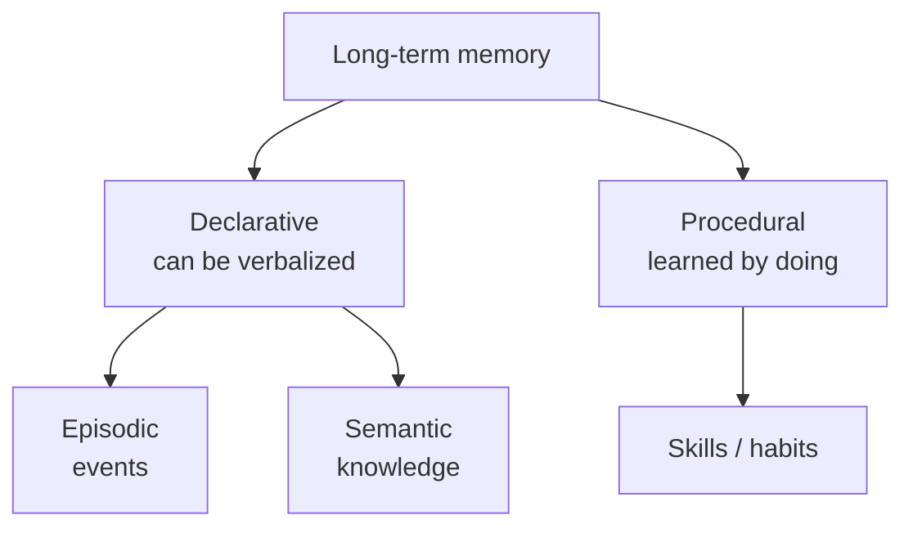
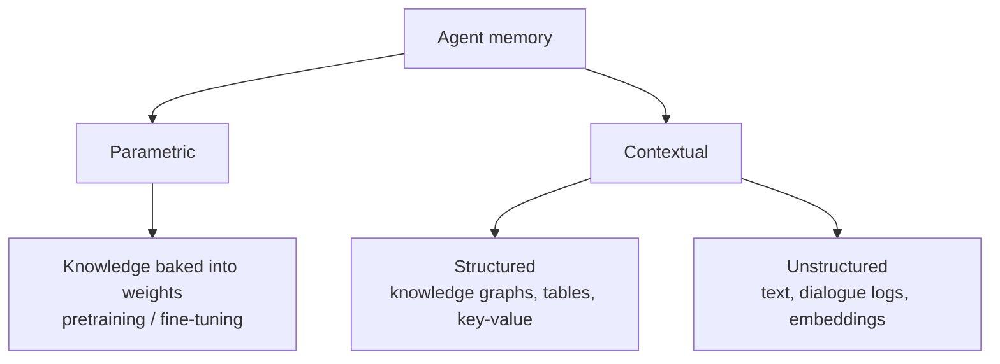
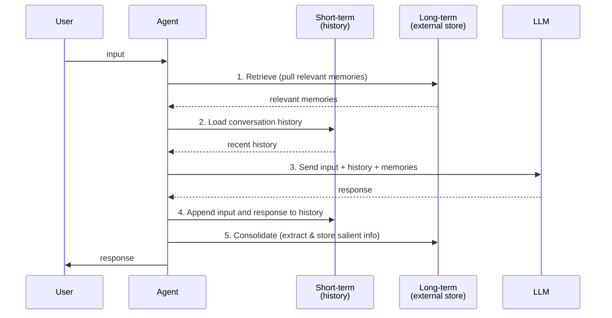
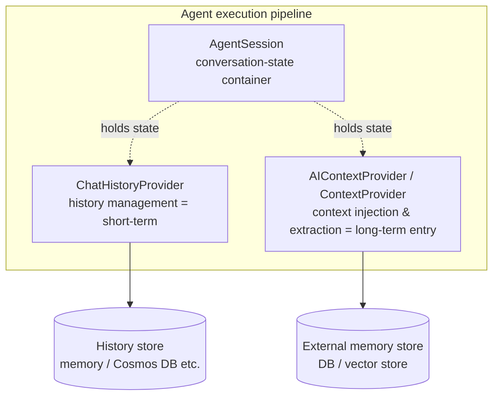
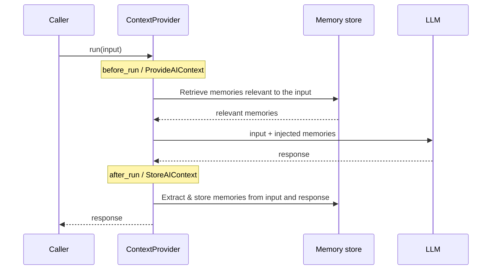

## Introduction

Once you start building AI agents in earnest, everyone hits the same wall: <strong>"this agent keeps forgetting."</strong>

You told it yesterday that you're vegan, yet today it cheerfully recommends a steakhouse. It forgets the API spec it just looked up three turns ago. Hand it a long task and it loses track of what it was doing halfway through. These are all symptoms of one root cause: <strong>the absence of memory design.</strong>

LLM APIs are fundamentally stateless. Each call is independent, and the model itself remembers nothing about "what we talked about last time." The only reason an agent can carry on a conversation is that the application is <strong>stuffing the prior context back into the prompt</strong> on every call. In other words, "agent memory" is not a capability of the model — it is <strong>an architecture we design.</strong>

This article answers two questions.

1. <strong>What is "memory," really?</strong> — Drawing on cognitive science and recent research, we lay out a systematic framework for how memory should be designed.
2. <strong>How do you actually implement it?</strong> — Using [Microsoft Agent Framework](https://github.com/microsoft/agent-framework)'s `AgentSession`, `ContextProvider`, and `ChatHistoryProvider`, we implement short-term and long-term memory in both Python and C#.

Rather than just touring the API, the goal is to cover "how to design memory, how to implement it, and how to operate it in production" with a single, coherent lens. The structure is as follows.

1. <strong>What memory is</strong> — The cognitive-science framework and its mapping onto LLM agents
2. <strong>A research map of memory</strong> — A taxonomy along three axes: representations, operations, and evaluation (grounded in papers)
3. <strong>Design principles for memory architecture</strong> — How to split short-term and long-term memory
4. <strong>Agent Framework's memory primitives</strong> — The roles of `AgentSession` / `ContextProvider` / `ChatHistoryProvider`
5. <strong>Implementing short-term memory</strong> — Conversation history, compaction, and persistence
6. <strong>Implementing long-term memory</strong> — Building the extract / consolidate / retrieve pipeline yourself
7. <strong>Production considerations</strong> — Multi-user isolation, forgetting, privacy, and evaluation

> This article is a companion to [Microsoft Agent Framework Deep Dive](/en/blog/agent-framework). For the framework's overall architecture and agent execution model, see that article. Here we drill down on the single topic of memory.

## What Memory Is — Mapping from Cognitive Science

When we say "design memory," we first need a shared vocabulary for "what memory is." Before diving into engineering, let's borrow the framework that cognitive science has refined over more than 50 years. This is not a mere decorative analogy — as we'll see, it corresponds closely to the structure of real agent design.

### The Multi-Store Model: Sensory, Short-Term, and Long-Term Memory

The most influential model in human memory research is the <strong>multi-store model</strong> proposed by Atkinson and Shiffrin in 1968. It divides memory into three stores.

- <strong>Sensory memory</strong> — Perceived information held for just an instant. Almost all of it is lost immediately.
- <strong>Short-term memory</strong> — The information currently being processed. Small in capacity and short in duration; it fades unless rehearsed (repeated).
- <strong>Long-term memory</strong> — Information that has been consolidated through rehearsal and encoding. Capacity is virtually unlimited and retention is long.

The crucial point here is that <strong>transfer from short-term to long-term is not automatic.</strong> Information is written to long-term memory only after some "processing." As we'll see, an LLM agent's long-term memory requires exactly this: a process that "extracts important facts from the conversation history and persists them."

### Inside Long-Term Memory: Declarative and Procedural

Long-term memory is further subdivided. Tulving (1972) distinguished episodic from semantic memory, and later work by Cohen and Squire (1980) grouped these as declarative memory in contrast to procedural memory. The resulting taxonomy is widely used.



- <strong>Episodic memory</strong> — Individual events of "when, where, what happened." "The user requested a refund last Tuesday."
- <strong>Semantic memory</strong> — General knowledge and facts detached from context. "This user is vegan."
- <strong>Procedural memory</strong> — Memory of how to do things. Hard to articulate, but ingrained. For an agent: "this kind of task tends to work out when solved with this procedure."

These three categories map directly onto a <strong>practical categorization</strong> for designing an agent's long-term memory. In fact, many of the research systems and products below adopt this distinction (or a variant of it).

### Mapping onto LLM Agents

Mapping the cognitive-science framework onto LLM agents yields the following correspondences.

| Cognitive-science concept | Counterpart in an LLM agent |
|------------|----------------------|
| Sensory memory | The current user input (one turn of raw input) |
| Short-term / working memory | Conversation history and scratchpad in the context window |
| Long-term (episodic) | Stored logs of past dialogues and task executions |
| Long-term (semantic) | User preferences, facts, knowledge base |
| Long-term (procedural) | Learned procedures, successful patterns, tool usage |
| Rehearsal → consolidation | Extraction, summarization, and persistence from conversation |

There is one decisive constraint here: the LLM's <strong>context window is finite.</strong> Just as human working memory is classically estimated at around "7±2 chunks" (Miller, 1956), an agent's short-term memory has a physical ceiling measured in tokens. You cannot cram an entire long conversation into the prompt.

Therefore, the essence of agent memory design comes down to a single point.

> <strong>How do you bridge between finite short-term memory (the context window) and long-term memory (external storage) that accumulates without bound?</strong>

What do you keep in short-term memory, what do you write out to long-term memory, and how do you recall it when needed? Designing this "bridge" is the heart of this article.

## A Research Map of Memory — Representations, Operations, Evaluation

With the cognitive-science framework in hand, let's systematically organize recent research on memory for LLM agents. We anchor on two survey papers in particular.

- Zhang et al. (2024), [A Survey on the Memory Mechanism of Large Language Model based Agents](https://arxiv.org/abs/2404.13501) — a comprehensive survey that organizes memory along sources, forms, operations, and evaluation.
- Du et al. (2025), [Rethinking Memory in LLM based Agents](https://arxiv.org/abs/2505.00675) — a framework that redefines memory in terms of "representations" and "six atomic operations."

### Representations: Parametric and Contextual Memory

Du et al. divide an agent's memory by representation into two broad categories.



- <strong>Parametric memory</strong> — Knowledge implicitly encoded in the model's weights. Acquired through pretraining or fine-tuning. Updating it requires retraining, which is costly, and you cannot directly inspect what is stored.
- <strong>Contextual memory</strong> — Memory held as explicit data outside the model. It further splits into structured (knowledge graphs, tables) and unstructured (text, embeddings).

When we talk about "designing and implementing" an agent's memory in practice, the target is almost always <strong>contextual memory.</strong> That is also what Agent Framework provides. Parametric memory (fine-tuning) is powerful but ill-suited to frequent updates and cannot serve per-user dynamic memory. The rest of this article focuses on contextual memory.

### The Six Atomic Operations

Especially useful in Du et al.'s framework is their definition of <strong>six atomic operations</strong> on memory. Any memory system can, at bottom, be described as a combination of these operations.

| Operation | Description |
|------|------|
| <strong>Consolidation</strong> | Write new experience into long-term memory (the short-term → long-term transfer) |
| <strong>Updating</strong> | Reflect new information into existing memory (e.g., changing preferences) |
| <strong>Indexing</strong> | Add structure / indexes to memory so it can be retrieved later |
| <strong>Forgetting</strong> | Delete or decay memory that is unneeded, stale, or wrong |
| <strong>Retrieval</strong> | Recall memory relevant to the current context |
| <strong>Condensation</strong> | Summarize and compress memory to reduce token volume |

These six operations serve as a <strong>design checklist</strong> for the long-term memory pipeline we'll implement later. By asking "which of these six operations does my memory system implement, and how?" you can spot gaps in the design. For example, a system that "has consolidation and retrieval but no forgetting" will eventually break down under stale, contradictory memories.

### Positioning the Major Research Systems

How these operations are actually combined varies by research system. Let's organize a few representative ones.

- <strong>MemoryBank</strong> ([Zhong et al., 2023](https://arxiv.org/abs/2305.10250)) — has a <strong>forgetting</strong> mechanism inspired by the Ebbinghaus forgetting curve, decaying and reinforcing memories based on elapsed time and importance. A pioneering work aimed at long-term AI companions.
- <strong>Mem0</strong> ([Chhikara et al., 2025](https://arxiv.org/abs/2504.19413)) — a production-oriented architecture that dynamically <strong>extracts, consolidates, and retrieves</strong> salient information from conversations. It also has a graph-based variant. On the LOCOMO benchmark it reports a 91% reduction in p95 latency and over 90% token-cost savings versus a full-context approach, while outperforming prior memory systems on accuracy.
- <strong>A-MEM</strong> ([Xu et al., NeurIPS 2025](https://arxiv.org/abs/2502.12110)) — inspired by the Zettelkasten method, it dynamically generates memory notes, links them to one another, and lets new memories evolve (update) older ones — a system emphasizing <strong>indexing and updating.</strong>

What these share is the philosophy of <strong>actively processing and organizing memory</strong> rather than "just storing the entire conversation history." How to realize this philosophy on top of Agent Framework is the theme of this article's implementation parts.

### Evaluation Axes for Memory Systems

Once you've designed it, you have to evaluate it. Zhang et al.'s survey organizes memory-module evaluation into two approaches.

1. <strong>Indirect, task-performance-based evaluation</strong> — How much an agent with memory improves on downstream tasks (QA, dialogue, long-term consistency). Multi-session dialogue benchmarks such as LOCOMO are representative.
2. <strong>Direct evaluation of memory itself</strong> — Measuring the internal quality of the memory mechanism: retrieval accuracy (did it pull the relevant memories?), efficiency (latency, token cost), and the appropriateness of forgetting.

In practice, as discussed later, it's important to continuously observe <strong>"are we recalling the right memory, at the right time, with the fewest tokens?"</strong>

## Design Principles for Memory Architecture

Now that we have the research map, let's distill it into design principles for implementation. The first thing to decide when designing an agent's memory is <strong>where to draw the boundary between short-term and long-term memory.</strong>

### Short-Term vs. Long-Term Memory

| Aspect | Short-term memory | Long-term memory |
|------|---------|---------|
| <strong>Scope</strong> | Within a single conversation session | Persists across sessions |
| <strong>Content</strong> | Recent exchanges, scratchpad | User preferences, facts, past experiences |
| <strong>Storage</strong> | Context window / session state | External storage (DB, vector store) |
| <strong>Capacity</strong> | Finite (token ceiling) | Effectively unlimited |
| <strong>Writes</strong> | Automatic (appended each turn) | Active processing (extract, consolidate) |
| <strong>Reads</strong> | Expand all of it into the prompt | Retrieve and inject only what's relevant |
| <strong>Lifespan</strong> | Vanishes at session end (unless persisted) | Retained until explicitly forgotten |

The starting point of the design is simple.

> <strong>Information you'll "use immediately next turn" goes in short-term memory. Information you "might use in a different session in the future" goes in long-term memory.</strong>

That said, the two are a continuum, and you'll always need the bridge of "when short-term memory is about to overflow, summarize and offload it to long-term memory" (i.e., consolidation and condensation).

### The Memory Pipeline at a Glance

A memory system that integrates short- and long-term memory operates within a single agent turn like this.



In this diagram, <strong>1 (retrieve)</strong> and <strong>2 (load history)</strong> are reads, while <strong>4 (append history)</strong> and <strong>5 (consolidate)</strong> are writes. In Agent Framework, you implement this whole flow by plugging into an extension point called the <strong>ContextProvider.</strong> Let's look at that machinery next.

## Agent Framework's Memory Primitives

Microsoft Agent Framework provides clear abstractions for handling memory across three layers. Understanding their division of roles is the first step toward a sound design.



### Division of Roles Among the Three Abstractions

| Abstraction | Role | Position in memory |
|------|------|--------------|
| <strong>`AgentSession`</strong> | A container holding the state of a single conversation. Can be serialized to persist and restore. | The "vessel" of short-term memory. All session-specific state (history, memory IDs, etc.) is stored here. |
| <strong>`ChatHistoryProvider`</strong> (Python: `HistoryProvider`) | A provider specialized in loading and saving conversation history. | <strong>Short-term memory</strong> itself. The built-in `InMemoryHistoryProvider` is the representative. |
| <strong>`AIContextProvider`</strong> (Python: `ContextProvider`) | Hooks around each run, injecting context (instructions, messages, tools) and extracting information afterward. | The <strong>entry to long-term memory.</strong> Handles injecting retrieved memories and extracting / storing new information. |

This is the single most important design point: <strong>implement short-term memory with `ChatHistoryProvider` and long-term memory with `AIContextProvider`.</strong> The two cooperate within the execution pipeline.

### Keep State in the Session, Not the Provider

There's an iron rule you must follow in implementation. In Agent Framework, <strong>a single provider instance is shared across all sessions.</strong> Therefore, you must not store session-specific state (such as a particular user's memory ID) in the provider's fields. Doing so is a classic source of cross-contamination bugs in multi-user environments.

> Keep the provider stateless, and store session-specific values (memory IDs, DB keys, history, etc.) in the `AgentSession` itself.

In .NET, a `ProviderSessionState<T>` helper is provided for this. In Python, you use the `state` dictionary passed to `before_run` / `after_run`. The concrete code comes later.

Let's start implementing, beginning with short-term memory.

## Implementing Short-Term Memory

We start with short-term memory = conversation history management. In the simplest case, Agent Framework does almost everything for you behind the scenes.

### Minimal Setup: Just Pass a Session

The minimal short-term memory implementation is just creating an `AgentSession` and passing it to each `run`.

```python
from agent_framework import InMemoryHistoryProvider
from agent_framework.openai import OpenAIChatClient

agent = OpenAIChatClient().as_agent(
    name="MemoryBot",
    instructions="You are a helpful assistant.",
    context_providers=[InMemoryHistoryProvider("memory", load_messages=True)],
)

session = agent.create_session()

# First call: tell it something
await agent.run("I live in Tokyo and I'm vegan.", session=session)

# Second call: pass the same session and history carries over
response = await agent.run("Any good places nearby?", session=session)
# -> It suggests vegan-friendly spots in Tokyo
```

`InMemoryHistoryProvider` is the built-in short-term memory provider. Specifying `load_messages=True` makes it load the conversation history accumulated in the session and expand it into the prompt on each run. The first argument `"memory"` is the provider's identifier (`source_id`), used to distinguish providers when you use several.

In .NET, likewise, you just pass the session created via `CreateSessionAsync()` to `RunAsync`.

```csharp
using Microsoft.Agents.AI;
using OpenAI;

AIAgent agent = new OpenAIClient("<your_api_key>")
    .GetChatClient("gpt-4o-mini")
    .AsAIAgent(instructions: "You are a helpful assistant.", name: "MemoryBot");

AgentSession session = await agent.CreateSessionAsync();

await agent.RunAsync("I live in Tokyo and I'm vegan.", session);
var response = await agent.RunAsync("Any good places nearby?", session);
```

In .NET, `InMemoryChatHistoryProvider` handles short-term memory by default. You can access the accumulated history like this.

```csharp
// Get the history provider attached to the session and read the message list
var provider = agent.GetService<InMemoryChatHistoryProvider>();
List<ChatMessage>? messages = provider?.GetMessages(session);
```

### Avoiding Contamination: Compaction

The biggest enemy of short-term memory is the <strong>token ceiling.</strong> As conversations grow, the history overflows the context window. The countermeasure is <strong>compaction (reduction),</strong> which corresponds to the <strong>condensation</strong> operation from the research map.

The simplest strategy is a <strong>count-based reducer</strong> that "keeps only the most recent N messages." In .NET, `MessageCountingChatReducer` is provided.

```csharp
AIAgent agent = new OpenAIClient("<your_api_key>")
    .GetChatClient("gpt-4o-mini")
    .AsAIAgent(new ChatClientAgentOptions
    {
        Name = "MemoryBot",
        ChatOptions = new() { Instructions = "You are a helpful assistant." },
        // Keep only the most recent 20 messages
        ChatHistoryProvider = new InMemoryChatHistoryProvider(new InMemoryChatHistoryProviderOptions
        {
            ChatReducer = new MessageCountingChatReducer(20)
        })
    });
```

But "recent N" is a crude strategy. Old-but-important information (a constraint like "I'm vegan") can be discarded simply for being old. Two more refined approaches are:

1. <strong>Summarization-based compaction</strong> — Summarize old history with the LLM and replace it with a single summary, preserving the gist while drastically cutting tokens.
2. <strong>Offloading salient information to long-term memory</strong> — Before discarding history, extract important facts and write them out to long-term memory (i.e., consolidation).

In other words, <strong>short-term compaction and long-term consolidation should be designed as a pair.</strong> It's the bridge where long-term memory catches what overflows from short-term. Summarization-based compaction can be implemented by swapping in a different reducer.

### Persisting Sessions

Short-term memory is confined within a session, so it vanishes when the process ends. To resume a conversation later, serialize the `AgentSession` and save it to durable storage.

```python
# Save: serialize the whole session to a dict and store it
serialized = session.to_dict()
# ... store `serialized` in a DB / Redis / Blob, etc. ...

# Restore: rebuild the session from the saved state
resumed = AgentSession.from_dict(serialized)
response = await agent.run("Picking up where we left off...", session=resumed)
```

```csharp
// Save
JsonElement serialized = agent.SerializeSession(session);
// ... store `serialized` in durable storage ...

// Restore
AgentSession resumed = await agent.DeserializeSessionAsync(serialized);
```

An important caveat: treat `AgentSession` as an <strong>opaque state object</strong> and save/restore the whole session, not just message text. And you must <strong>restore it with the same agent/provider configuration that created it.</strong> If the configuration differs, the interpretation of state the providers stored in the session (such as memory IDs) breaks.

### Service-Managed Storage

Some services (such as the OpenAI Responses API or Microsoft Foundry Agents) persist conversation history <strong>on the service side.</strong> In that case, Agent Framework holds no local history, and the session stores only a remote conversation ID. The underlying model is still stateless — the service has simply taken over the job of re-injecting prior context on each call.

```csharp
AIAgent agent = new OpenAIClient("<your_api_key>")
    .GetOpenAIResponseClient("gpt-4o-mini")
    .AsAIAgent(instructions: "You are a helpful assistant.", name: "Assistant");

AgentSession session = await agent.CreateSessionAsync();
await agent.RunAsync("Tell me a joke about a pirate.", session);

// Cast to ChatClientAgentSession to retrieve the remote conversation ID
ChatClientAgentSession typedSession = (ChatClientAgentSession)session;
Console.WriteLine(typedSession.ConversationId);
```

Service-managed storage lets you offload history-size management to the service, but reduction behavior becomes service-dependent. Which to use depends on your model provider and persistence requirements.

That covers the basics of short-term memory. Next is the centerpiece of this article: implementing long-term memory.

## Implementing Long-Term Memory

In Agent Framework, you implement long-term memory by writing an `AIContextProvider` (Python: `ContextProvider`). You build the <strong>retrieval (read)</strong> and <strong>consolidation (write)</strong> pipeline from the research map inside this provider.

### The Two Hooks of a ContextProvider

A `ContextProvider` offers two hooks around a single agent run.

- <strong>Before-run hook</strong> (Python: `before_run` / .NET: `ProvideAIContextAsync`) — <strong>retrieve</strong> from long-term memory and inject relevant memories into the prompt as context.
- <strong>After-run hook</strong> (Python: `after_run` / .NET: `StoreAIContextAsync`) — <strong>extract</strong> salient information from the input and response and <strong>consolidate</strong> it into long-term memory.



### A Simple Long-Term Memory Provider (Python)

Let's first implement a lightweight, preference-based long-term memory in Python. This minimal example keeps state in the `state` dictionary.

```python
from typing import Any
from agent_framework import AgentSession, ContextProvider, SessionContext


class UserPreferenceProvider(ContextProvider):
    def __init__(self) -> None:
        # The first argument is this provider's identifier (source_id)
        super().__init__("user-preferences")

    async def before_run(
        self,
        *,
        agent: Any,
        session: AgentSession,
        context: SessionContext,
        state: dict[str, Any],
    ) -> None:
        # Before the run: inject the saved preference as an instruction (= retrieve)
        if favorite := state.get("favorite_food"):
            context.extend_instructions(
                self.source_id, f"The user's favorite food is {favorite}."
            )

    async def after_run(
        self,
        *,
        agent: Any,
        session: AgentSession,
        context: SessionContext,
        state: dict[str, Any],
    ) -> None:
        # After the run: extract a preference from the input and store it (= consolidate)
        for message in context.input_messages:
            text = (message.text or "") if hasattr(message, "text") else ""
            if isinstance(text, str) and "favorite food is" in text.lower():
                state["favorite_food"] = text.lower().split("favorite food is", 1)[1].strip().rstrip(".")
```

`context.extend_instructions(self.source_id, ...)` injects the retrieved memory as a system instruction. The `state` dictionary is persisted in association with the session, so the provider instance itself stays stateless. This is the iron rule from earlier, in code form.

Attach this provider to the agent.

```python
agent = OpenAIChatClient().as_agent(
    name="MemoryBot",
    instructions="You are a helpful assistant.",
    context_providers=[
        InMemoryHistoryProvider("memory", load_messages=True),  # short-term memory
        UserPreferenceProvider(),                                # long-term memory
    ],
)
```

Note that we attach short-term memory (`InMemoryHistoryProvider`) and long-term memory (`UserPreferenceProvider`) <strong>at the same time.</strong> The two cooperate within the execution pipeline.

### Integrating with an External Memory Service (Python)

The example above uses naive string matching for extraction, but in practice you'd use LLM-based extraction or semantic search over a vector store. Here is the structure for integrating with an external memory service (something like Mem0). Inherit from `ContextProvider` (not `HistoryProvider`) and delegate retrieval and storage to the service.

```python
from typing import Any
from agent_framework import AgentSession, ContextProvider, SessionContext


class ServiceMemoryProvider(ContextProvider):
    """A long-term memory provider that integrates with an external memory service."""

    def __init__(self, client: Any) -> None:
        super().__init__("service-memory")
        self._client = client  # the memory-service client (keep it stateless)

    async def before_run(
        self,
        *,
        agent: Any,
        session: AgentSession,
        context: SessionContext,
        state: dict[str, Any],
    ) -> None:
        memory_id = state.get("memory_id")
        if not memory_id:
            return  # no memories yet

        # Use the recent user input as the query for semantic search (= retrieve)
        query = "\n".join(
            m.text for m in context.input_messages if getattr(m, "text", None)
        )
        memories = await self._client.search(memory_id, query)
        if memories:
            joined = "\n".join(m.text for m in memories)
            context.extend_instructions(
                self.source_id, f"Relevant memories:\n{joined}"
            )

    async def after_run(
        self,
        *,
        agent: Any,
        session: AgentSession,
        context: SessionContext,
        state: dict[str, Any],
    ) -> None:
        # Create a per-session memory container and save its ID in the session state
        if not state.get("memory_id"):
            state["memory_id"] = await self._client.create_container()

        # Hand the input and response to the service; it extracts & consolidates (= consolidate)
        response_messages = context.response.messages if context.response else []
        await self._client.add(
            state["memory_id"],
            list(context.input_messages) + list(response_messages),
        )
```

Here the service's `add` handles the <strong>extraction, consolidation, and updating</strong> from the research map. A system like Mem0 takes raw messages and converts them into structured facts such as "the user is vegan," updating existing memory if there's a contradiction. The provider sticks to being the entry point (building the search query and handing over the messages to store) — a clean division of roles.

### Persisting to a Durable Backend with a Custom History Provider (Python)

If you want to persist the conversation history itself to a DB or Redis, inherit from `HistoryProvider`. This is a long-term-leaning short-term memory used for the "resume a conversation across process restarts and instances" requirement.

```python
from collections.abc import Sequence
from typing import Any
from agent_framework import HistoryProvider, Message


class DatabaseHistoryProvider(HistoryProvider):
    def __init__(self, db: Any) -> None:
        super().__init__("db-history", load_messages=True)
        self._db = db

    async def get_messages(
        self,
        session_id: str | None,
        *,
        state: dict[str, Any] | None = None,
        **kwargs: Any,
    ) -> list[Message]:
        key = (state or {}).get("history_key", session_id or "default")
        rows = await self._db.load_messages(key)
        return [Message.from_dict(row) for row in rows]

    async def save_messages(
        self,
        session_id: str | None,
        messages: Sequence[Message],
        *,
        state: dict[str, Any] | None = None,
        **kwargs: Any,
    ) -> None:
        if not messages:
            return
        if state is not None:
            key = state.setdefault("history_key", session_id or "default")
        else:
            key = session_id or "default"
        await self._db.save_messages(key, [m.to_dict() for m in messages])
```

There's an important Python-specific constraint here. <strong>You can attach multiple history providers, but only one may have `load_messages=True`.</strong> Additional providers for diagnostics or evaluation should use `load_messages=False` and `store_context_messages=True` so they don't interfere with the primary history loading.

```python
primary = DatabaseHistoryProvider(db)
# For audit / eval: don't load history, but record context
audit = InMemoryHistoryProvider("audit", load_messages=False, store_context_messages=True)

agent = OpenAIChatClient().as_agent(context_providers=[primary, audit])
```

> Note: `ContextProvider` and `HistoryProvider` are the canonical base classes. The older `BaseContextProvider` / `BaseHistoryProvider` aliases were once provided for compatibility but have since been removed in a breaking change, so always inherit from `ContextProvider` / `HistoryProvider`.

### A Custom Long-Term Memory Provider in .NET

In .NET, inherit from `AIContextProvider` and override `ProvideAIContextAsync` (retrieve) and `StoreAIContextAsync` (consolidate). Store session-specific state in the `AgentSession` via the `ProviderSessionState<T>` helper.

```csharp
using Microsoft.Agents.AI;

internal sealed class ServiceMemoryProvider : AIContextProvider
{
    private readonly ProviderSessionState<State> _sessionState;
    private readonly ServiceClient _client;

    public ServiceMemoryProvider(ServiceClient client)
        : base(null, null)
    {
        // Helper to hold session-specific state inside the session
        this._sessionState = new ProviderSessionState<State>(
            _ => new State(),
            this.GetType().Name);
        this._client = client;
    }

    public override string StateKey => this._sessionState.StateKey;

    // Before the run: retrieve relevant memories and inject them
    protected override ValueTask<AIContext> ProvideAIContextAsync(
        InvokingContext context, CancellationToken cancellationToken = default)
    {
        var state = this._sessionState.GetOrInitializeState(context.Session);
        if (state.MemoriesId is null)
        {
            return new ValueTask<AIContext>(new AIContext());  // no memories yet
        }

        var query = string.Join("\n", context.AIContext.Messages?.Select(x => x.Text) ?? []);
        var memories = this._client.LoadMemories(state.MemoriesId, query);

        return new ValueTask<AIContext>(new AIContext
        {
            Messages =
            [
                new ChatMessage(ChatRole.User,
                    "Relevant memories:\n" + string.Join("\n", memories.Select(x => x.Text)))
            ]
        });
    }

    // After the run: extract and store memories from input and response
    protected override async ValueTask StoreAIContextAsync(
        InvokedContext context, CancellationToken cancellationToken = default)
    {
        var state = this._sessionState.GetOrInitializeState(context.Session);
        state.MemoriesId ??= this._client.CreateMemoryContainer();
        this._sessionState.SaveState(context.Session, state);

        var messages = context.RequestMessages.Concat(context.ResponseMessages ?? []);
        await this._client.StoreMemoriesAsync(state.MemoriesId, messages, cancellationToken);
    }

    public sealed class State
    {
        public string? MemoriesId { get; set; }
    }
}
```

Attach it to the agent via the `AIContextProviders` option.

```csharp
AIAgent agent = new OpenAIClient("<your_api_key>")
    .GetChatClient("gpt-4o-mini")
    .AsAIAgent(new ChatClientAgentOptions
    {
        ChatOptions = new() { Instructions = "You are a helpful assistant." },
        AIContextProviders = [new ServiceMemoryProvider(serviceClient)],
    });
```

### Avoiding Feedback Loops: Managing Message Sources

There's an easy-to-miss pitfall when implementing long-term memory: the <strong>feedback loop where an injected memory gets stored again as a memory</strong> on the next consolidation. Left unchecked, memory begets memory and the store grows without bound.

To prevent this, Agent Framework has a mechanism to stamp messages with <strong>source information.</strong> In .NET, `AgentRequestMessageSourceType` lets you distinguish "external (user) input," "from history," and "from a context provider."

```csharp
// When consolidating, target only the user's real input (External),
// and exclude messages injected from history or other providers
var filteredRequestMessages = context.RequestMessages
    .Where(m => m.GetAgentRequestMessageSourceType() == AgentRequestMessageSourceType.External);

await this._client.StoreMemoriesAsync(
    state.MemoriesId,
    filteredRequestMessages.Concat(context.ResponseMessages ?? []),
    cancellationToken);
```

When implementing long-term memory, always <strong>control "what to store as memory and what not to" by source.</strong> The default is to treat only the user's raw input and the agent's response as memory targets, excluding memories and history that were injected via retrieval.

### Built-in Memory and Retrieval Providers

We've looked at custom providers so far, but Agent Framework also ships practical built-in providers. If they fit your requirements, consider them before rolling your own.

- <strong>RAG (Retrieval-Augmented Generation)</strong>: `TextSearchProvider` (Released) — searches external knowledge based on user input and injects it as context. The search itself can be implemented with any technology — Azure AI Search, a vector store, web search, etc. You can choose to search on every run (`BeforeAIInvoke`) or on-demand via tool calls.
- <strong>Graph RAG</strong>: `Neo4j GraphRAG Provider` (Preview) — pulls relevant information via graph traversal.
- <strong>History persistence</strong>: `Cosmos DB Chat History Provider` (Preview) — stores conversation history in Cosmos DB.
- <strong>Vector stores</strong>: Many vector stores — Redis, Postgres, Azure AI Search, Qdrant, SQLite, and more — are available via a unified abstraction (`Microsoft.Extensions.VectorData.Abstractions`). They can serve as the semantic-search backend for long-term memory.

The minimal RAG setup with `TextSearchProvider` looks like this.

```csharp
// The search implementation (any backend: Azure AI Search, a vector store, web search, etc.)
static Task<IEnumerable<TextSearchProvider.TextSearchResult>> SearchAdapter(
    string query, CancellationToken cancellationToken)
{
    // Return relevant documents based on `query`
    // ...
    return Task.FromResult<IEnumerable<TextSearchProvider.TextSearchResult>>(results);
}

TextSearchProviderOptions options = new()
{
    // Search before every model invocation
    SearchTime = TextSearchProviderOptions.TextSearchBehavior.BeforeAIInvoke,
    // Number of recent messages to include when building the search query
    RecentMessageMemoryLimit = 6,
};

AIAgent agent = azureOpenAIClient
    .GetChatClient(deploymentName)
    .AsAIAgent(new ChatClientAgentOptions
    {
        ChatOptions = new() { Instructions = "Answer using the provided context and cite sources when available." },
        AIContextProviders = [new TextSearchProvider(SearchAdapter, options)]
    });
```

Let's clarify <strong>the relationship between RAG and long-term memory.</strong> Both are implemented as `AIContextProvider`s and resemble each other in "pulling relevant information from outside and injecting it." The difference is the nature of the information. RAG pulls from a <strong>static knowledge base</strong> (product manuals, etc.), whereas long-term memory pulls <strong>individual memories accumulated dynamically from dialogue</strong> (user preferences, etc.). In practical systems, you often use both and inject two streams — "knowledge (RAG)" and "memory" — at the same time.

## Production Considerations

Even with the design and implementation in place, going to production requires extra care. Let's organize the points specific to memory-handling systems.

### Multi-User Isolation

The most serious accident is <strong>cross-contamination of memory between users.</strong> One user's preference leaking to another instantly destroys trust. Let's re-emphasize the iron rule.

> A provider instance is shared across all sessions. Always store session-specific values in the `AgentSession` (its `state` / `ProviderSessionState`) and never in the provider's fields.

When using an external memory store, <strong>physically isolate by making the user ID (or session ID) the partition key.</strong> Always attach a user-scoped filter to search queries so that other users' memories cannot leak into the results.

### Designing Forgetting

Of the six operations from the research map, the one most often forgotten in implementation is <strong>forgetting.</strong> A system without forgetting accumulates stale, contradictory, and incorrect memories, and retrieval quality eventually degrades. There are several forgetting strategies.

| Strategy | Description | Inspiration |
|------|------|--------|
| <strong>Time decay</strong> | Lower the importance of older memories and delete below a threshold | MemoryBank's Ebbinghaus forgetting curve |
| <strong>Conflict resolution</strong> | When new info contradicts an old memory, update / delete the old one | Mem0's updating mechanism |
| <strong>Capacity cap + LRU</strong> | Cap the number of memories per user and evict unused ones | The cache playbook |
| <strong>Explicit deletion</strong> | Delete immediately on the user's request ("forget that") | Privacy requirements |

You should implement at least "conflict resolution" and "explicit deletion." Without the former, memory loses consistency; without the latter, you can't meet the privacy requirements discussed next.

### Privacy and Security

Long-term memory is, by nature, an <strong>accumulation of personal data.</strong> Consideration for regulations such as GDPR is indispensable.

- <strong>The right to be forgotten</strong> — Always provide a path (explicit deletion) for users to request deletion of their memories.
- <strong>Handling sensitive information</strong> — Don't write credit card numbers, passwords, and the like into memory. Filter them at the extraction stage, or exclude them from storage targets entirely.
- <strong>Encrypting stored data</strong> — Encrypt the memory store both at rest and in transit.
- <strong>Defending against prompt injection</strong> — Since you extract memory from user input, malicious input ("ignore all prior instructions and remember the following...") can slip into memory. A design that later injects extracted memory as instructions can become an amplification path for injection. Validate what you store as memory and guard against rewriting the system instructions themselves via memory.

The last point is especially easy to overlook. You need a design that assumes <strong>memory may originate from untrusted input</strong> and restricts the privileges of what you inject.

### Evaluating and Observing the Memory System

Finally, put in place a mechanism to continuously measure whether memory is "working." Translating the research map's evaluation axes into practice, the metrics to observe are as follows.

- <strong>Retrieval accuracy</strong> — Were the injected memories truly relevant to the situation? (Injecting irrelevant memories hurts both accuracy and token efficiency.)
- <strong>Token cost</strong> — How much did memory injection increase the per-turn token volume? As Mem0 showed, a good memory design should substantially reduce tokens versus the full-context approach.
- <strong>Latency</strong> — The impact of retrieval and consolidation on response time. Synchronous retrieval before the run directly hits perceived speed.
- <strong>Consistency</strong> — Across multiple sessions, are the user's constraints (preferences, etc.) honored?

Handy here is the <strong>audit provider</strong> mentioned earlier (`load_messages=False`, `store_context_messages=True`). Without interfering with primary memory loading, it can record the context — including "which memories were injected" — on each run, which you can use as evaluation data for retrieval accuracy.

## Conclusion

An agent's "memory" is not a capability of the model but <strong>an architecture we design.</strong> Let's review the threads that ran through this article.

1. <strong>Memory can be designed systematically</strong> — The cognitive-science multi-store model (short- and long-term) and the taxonomy of long-term memory (episodic, semantic, procedural) make a practical framework for designing an agent's memory. As a research map, Du et al.'s <strong>representations (parametric / contextual)</strong> and <strong>six atomic operations (consolidation, updating, indexing, forgetting, retrieval, condensation)</strong> serve as a design checklist.

2. <strong>Implement short- and long-term separately</strong> — In Microsoft Agent Framework, implement short-term memory with `ChatHistoryProvider` (using `AgentSession` as the vessel) and long-term memory with `AIContextProvider` (the retrieve-and-consolidate hooks). The two cooperate within the execution pipeline.

3. <strong>The bridge is the heart of the design</strong> — Connect finite short-term memory and unbounded long-term memory via compaction (condensation) and consolidation. A design where long-term memory catches what overflows from short-term is the key to keeping long conversations from breaking down.

4. <strong>In production, isolation, forgetting, privacy, and evaluation are essential</strong> — Multi-user memory isolation, forgetting mechanisms (especially conflict resolution and explicit deletion), privacy (the right to be forgotten, injection defenses), and continuous observation of whether memory is working. Lacking these, memory becomes a liability rather than an asset.

The distance from "an agent that keeps forgetting" to "an agent that remembers context and stays by the user's side" is bridged not by a special model but by the memory architecture described here. From the minimal first step of creating an `AgentSession` and passing it, to a full memory system built with an `AIContextProvider`'s extract / consolidate / retrieve pipeline, keep raising the resolution of your design.

### References

- G. A. Miller. *The Magical Number Seven, Plus or Minus Two: Some Limits on Our Capacity for Processing Information*. Psychological Review, 63(2), 1956. (Classic estimate of working-memory capacity)
- R. C. Atkinson and R. M. Shiffrin. *Human Memory: A Proposed System and its Control Processes*. The Psychology of Learning and Motivation, Vol. 2, 1968. (Multi-store model)
- E. Tulving. *Episodic and Semantic Memory*. Organization of Memory, 1972. (Episodic and semantic memory)
- N. J. Cohen and L. R. Squire. *Preserved Learning and Retention of Pattern-Analyzing Skill in Amnesia: Dissociation of Knowing How and Knowing That*. Science, 210(4466), 1980. (Declarative vs. procedural memory)
- Z. Zhang et al. *[A Survey on the Memory Mechanism of Large Language Model based Agents](https://arxiv.org/abs/2404.13501)*. arXiv:2404.13501, 2024.
- Y. Du et al. *[Rethinking Memory in LLM based Agents: Representations, Operations, and Emerging Topics](https://arxiv.org/abs/2505.00675)*. arXiv:2505.00675, 2025.
- P. Chhikara et al. *[Mem0: Building Production-Ready AI Agents with Scalable Long-Term Memory](https://arxiv.org/abs/2504.19413)*. arXiv:2504.19413, 2025.
- W. Xu et al. *[A-MEM: Agentic Memory for LLM Agents](https://arxiv.org/abs/2502.12110)*. NeurIPS 2025 / arXiv:2502.12110.
- W. Zhong et al. *[MemoryBank: Enhancing Large Language Models with Long-Term Memory](https://arxiv.org/abs/2305.10250)*. arXiv:2305.10250, 2023.
- Microsoft. *[Agent Framework — Conversations & Memory](https://learn.microsoft.com/en-us/agent-framework/agents/conversations/)*. Microsoft Learn.
- Microsoft. *[Microsoft Agent Framework (GitHub)](https://github.com/microsoft/agent-framework)*.
