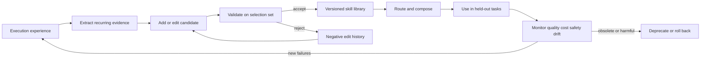
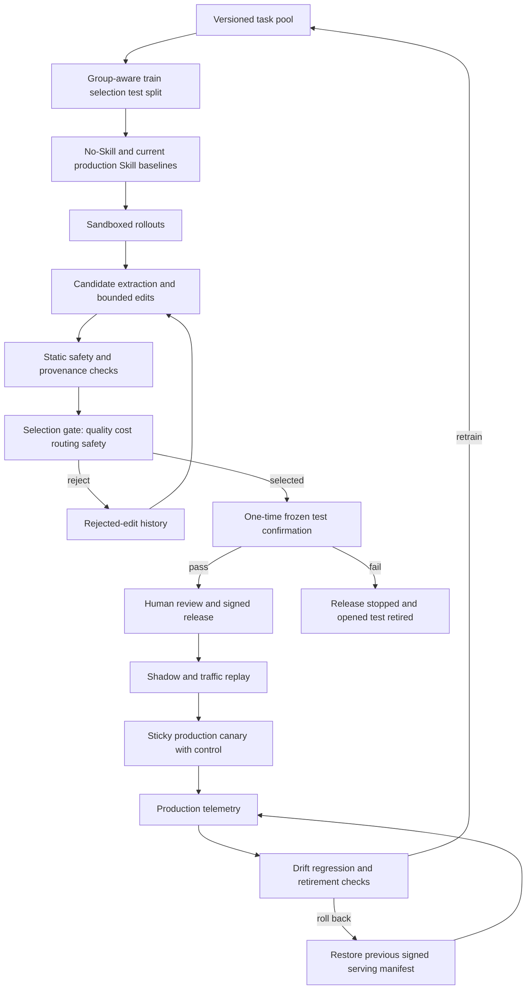

## Introduction

Agent Skills add not only what an LLM agent knows, but how it performs work. Under the [open Agent Skills specification](https://agentskills.io/home), a skill is a folder containing a required `SKILL.md` and optional scripts, references, templates, and other resources. An agent first sees only the name and description, loads the body when relevant, and accesses bundled resources only as needed. This staged loading model is called progressive disclosure.

This article uses “Agent Skills” for the standardized folder format and “agentic skills” for the broader research concept that includes reusable procedures, programs, workflow memories, and learned policies. Early systems such as Voyager, Agent Workflow Memory, and ASI are precursors in the latter sense; they do not directly evaluate the later open format. Their lessons transfer at the mechanism level—execution verification, abstraction, and reuse. Hereafter, capitalized “Skill” is shorthand for the artifact under discussion; “Agent Skill” is used when the folder specification itself matters.

Automatic procedural acquisition and refinement already existed in 2023–2025. The shift was that, after the standardized folder format spread in late 2025, 2026 brought a concentration of work explicitly targeting iterative Skill-document editing, evaluation, routing, composition, compression, and lifecycle management.

The evidence does not support the blanket claim that automatic generation improves agents. A more accurate conclusion is conditional:

> The strongest current evidence comes from verifier-rich, execution-grounded candidate search in domains with reusable procedural gaps. Rejection on an independent holdout is a prudent production control, but current studies do not isolate it as the causal reason for improvement. Self-editing without verifiers, routing controls, cost objectives, and security gates can get worse as the library grows.

This article reviews public evidence available on July 10, 2026. Most major 2026 results are arXiv preprints and do not yet have broad independent replication. Reported numbers describe each paper's experimental setup, not guarantees about products in general. The review distinguishes peer-reviewed work from preprints and turns even conflicting findings into production guidance.

## Executive Summary

1. <strong>The optimization target is larger than the Skill body.</strong> Discovery metadata, instructions, bundled code, retrieval indexes, composition order, and retirement policy form one system.
2. <strong>Do not ship one-shot generation without validation.</strong> In [SkillsBench](https://arxiv.org/abs/2602.12670), curated Skills raised task-macro performance from 33.9% to 50.5% across 18 configurations on 87 terminal/container tasks reviewed partly for Skill dependence and measurable condition separation. Each configuration and condition used a fixed $87\times3$ trial frame, totaling 9,396 main-condition results. In the paper's specific skill-creator→solver protocol, three self-generated configurations fell 8.1–11.5 points below no-Skill. That deficit mixes generation quality with discovery failure and creator/solver interference.
3. <strong>Execution feedback is the core signal.</strong> Methods grounded in successful and failed trajectories, test results, and produced artifacts currently have stronger evidence than one-shot generation or ungrounded self-reflection. Separate-data rejection is evaluated as part of bundled protocols, so use it as a production safeguard rather than claiming an isolated effect.
4. <strong>Make small edits rejectable.</strong> [SkillOpt](https://arxiv.org/abs/2605.23904) limits the number of edits as a textual learning rate and accepts a candidate only when it improves a selection split. The practical contribution is not the deep-learning metaphor; it is explicit change size, validation, and rollback.
5. <strong>More Skills are not automatically better.</strong> In a between-task SkillsBench comparison, focused bundles of one to three Skills were associated with larger gains than bundles of four or more. In [SkillMOO](https://arxiv.org/abs/2604.09297), many successful search operations removed or replaced guidance instead of adding it. Neither result proves that deletion is universally causal.
6. <strong>Routing becomes a new bottleneck.</strong> A required Skill may exist and still go unused. [The Scaling Laws of Skills](https://arxiv.org/abs/2605.16508) reports logarithmic routing decay over the measured range when a flat library is exposed to the model.
7. <strong>Length and quality are coupled objectives.</strong> [SkillReducer](https://arxiv.org/abs/2603.29919) reports average compression of 48% for descriptions and 39% for bodies, with a small average improvement on its adaptive within-study tasks. In contrast, the controlled [Compression, Structure, and Executor Capability](https://arxiv.org/abs/2607.03048) experiment established neither quality noninferiority for shortening nor real-price break-even. Compression is an executor-specific efficiency hypothesis, not a default good.
8. <strong>A production objective must be multi-objective.</strong> Optimizing pass rate alone can worsen tokens, latency, false activation, permissions, safety, and maintenance debt.
9. <strong>Begin as an offline CI workflow.</strong> Before allowing online self-modification, establish immutable traces, candidate generation, isolated execution, independent evaluation, human approval, and staged rollout.
10. <strong>A Skill is a supply-chain artifact, not trusted prompt text.</strong> Some Skills contain instructions only; others bundle executable code or direct the agent toward privileged actions. Provenance, diffs, permissions, dependencies, and network behavior require checks at creation, retrieval, update, and execution time.

## Production Fast Path

For an implementation decision, follow this sequence; the later sections provide the research evidence and limitations.

1. <strong>Check stop conditions:</strong> without independent splits, a qualified verifier, deny-by-default execution, named owners, or a lifecycle-cost ceiling, do not progress beyond observe/suggest mode.
2. <strong>Approve an operating contract:</strong> pin scope, risk tier, tenant/data boundary, consent, retention, licenses, prohibited actions, and maximum phase.
3. <strong>Assign roles and build the evidence pack:</strong> the optimizer only proposes; separate evaluation, security/data, release, on-call, and records/privacy decision rights.
4. <strong>Compare offline:</strong> use the current production Skill as the promotion baseline and no-Skill for headroom, select bounded candidates on selection data, then open a sealed test once after stopping.
5. <strong>Roll out a signed manifest in stages:</strong> use stubbed replay, mutually exclusive sticky canaries, then waves; invalid telemetry means pause, never success.
6. <strong>Contain immediately:</strong> a hard safety event bypasses statistical thresholds and triggers quarantine, full-manifest rollback, credential revocation, side-effect reconciliation, and incident response.
7. <strong>Separate ordinary retirement from security revocation:</strong> retire low-use or duplicate Skills through segmented evidence; quarantine/revoke policy violations from any serving state.

## What Counts as an Agent Skill?

Evaluation becomes incoherent if a long prompt and a Skill are treated as identical. This article uses an operational definition: a Skill is a reusable procedural component for a class of tasks, with an applicability condition, execution policy, termination condition, and artifact contract. Borrowing the notation from [SoK: Agentic Skills](https://arxiv.org/abs/2602.20867), its logical shape can be represented as:

$$
S = (C, \pi, T, R)
$$

- $C$: the applicability condition that determines when to use the Skill
- $\pi$: an execution policy represented by natural language, code, tool sequences, or a hybrid
- $T$: the condition for success, failure, or termination
- $R$: the reusable interface containing a name, inputs, and outputs

This tuple is an analytical abstraction over current `name`, `description`, `SKILL.md`, and bundled-resource designs. The Agent Skills specification itself does not require authors to encode a formal four-tuple. The following rows are not disjoint artifact types; they are <strong>orthogonal roles</strong> that overlap in one system. A Skill body is delivered as prompt context, a Skill can be stored as procedural memory, and a harness connects both to tools.

| Component | Primary role | What optimization changes | Typical failure |
|---|---|---|---|
| Prompt | A context-delivery representation, transient or reusable | Wording, examples, order | Overfitting, bloat |
| Memory | A persistence and retrieval substrate for facts, episodes, or procedures | Storage, retrieval, summarization | Staleness, noise, missed retrieval |
| Tool | A callable capability; this article uses atomic operations as the typical comparison | Schema, description, selection | Wrong calls, excessive privilege |
| Skill | A packaged, discoverable, reusable procedure that may contain prompts and invoke tools | Triggering, steps, code, composition | Misrouting, interference, obsolescence |
| Harness | The runtime layer that exposes, executes, and governs the other roles | Context, loops, sandbox | Confounding Skill changes with system changes |

The boundary matters. An experiment that changes only a Skill body supports a different causal claim from one that simultaneously changes the model, tools, harness, and tests.

## Research Evolution: From Storage to Validation-Gated Optimization

### 2023–2024: Turning Experience into Reusable Procedures

[Voyager](https://arxiv.org/abs/2305.16291) executed code in Minecraft, admitted it after a separate GPT-4 agent self-verified the observed environment state, and later retrieved it through description embeddings. This was not a deterministic verifier, and the paper lists verification errors as a limitation. It established the basic loop: explore, execute, verify, store. [Agent Workflow Memory](https://proceedings.mlr.press/v267/wang25bx.html) extracted multi-step workflows from web-agent trajectories, moving beyond raw episode storage toward reusable procedural abstraction.

The lasting lesson was that a Skill should represent a temporally extended procedure rather than an isolated knowledge fragment, and that executable representations with success checks are especially valuable.

### 2025: Programmatic Representation and Autonomous Exploration

ASI in [Inducing Programmatic Skills for Agentic Tasks](https://arxiv.org/abs/2504.06821) converted low-level browser action sequences into Python functions and verified them through invocation. On WebArena with Claude 3.5 Sonnet, the reported success rate was 40.4%, compared with 32.7% for a static baseline and 36.3% for the textual-skill AWM baseline. Programs compress several operations into one call, but are brittle under UI and API changes.

[SkillWeaver](https://arxiv.org/abs/2504.07079) similarly explored websites, practiced, and synthesized reusable APIs. It reported relative gains of 31.8% on WebArena and 39.8% on a small number of real websites, along with transfer from stronger Skill authors to weaker agents. These results came from a v1 preprint in a specialized web setting and should not be extrapolated directly to a general `SKILL.md` marketplace.

### 2026: Treating the Skill Itself as a Learning Object

Research then split into several directions:

- Distill trajectories into Skills: [Trace2Skill](https://arxiv.org/abs/2603.25158) and [gskill](https://dl.acm.org/doi/10.1145/3786335.3813196)
- Iteratively edit Skill documents: SkillOpt and SkillMOO
- Co-evolve a Skill bank and model policy: SkillRL
- Select and compose from large libraries: realistic-skill studies, Scaling Laws, and SkillComposer
- Compress and restructure Skills while identifying potential retirement candidates: SkillReducer
- Extract and merge personalized Skills from long conversations: AutoSkill
- Measure generated-artifact, supply-chain, and detection-limit risk: Skill-Inject, Agent Skills in the Wild, RouteGuard, Guardian defenses, and POISE



## Six Problems Hidden Inside “Automatic Skill Optimization”

The phrase combines six distinct problems. Each needs separate measurement, or it is impossible to tell whether the Skill improved or whether the system merely became better at selecting it.

### 1. Discovery: What Deserves to Become a Skill?

Promoting every successful episode or user request produces a library full of duplicates and temporary exceptions. Better candidates include failures recurring across tasks, stable user constraints, helper code repeatedly recreated, and explicit boundary conditions.

[AutoSkill](https://arxiv.org/abs/2603.01145) extracts candidates from long-running user conversations and compares each candidate with nearby existing Skills before choosing `add`, `merge`, or `discard`. An important design choice is to ground extraction primarily in user-side signals rather than treating the model's own previous responses as truth. However, its experiments mainly report statistics and case studies from SkillBanks extracted from WildChat. They are not downstream A/B efficacy tests. A production team must distinguish “the system extracted a Skill” from “that Skill improved outcomes.”

AutoSkill should therefore be read as proposing lifecycle operations, not as validating a complete persistent lifecycle with persistence, conflict resolution, rollback, deprecation, and retirement. Likewise, task-time refinement should expire as a task-local artifact by default and remain out of the registry until it passes cross-task selection tests.

Discovery also extends beyond conversations and trajectories. Source modality determines provenance and the required gate.

| Source | Examples | What must be preserved | Primary validation |
|---|---|---|---|
| Execution trajectories | Labeled tool traces | State, order, counterexamples | Environment replay, artifact verifier |
| User demand | Conversations, issues | Intent, tenant boundary, consent | Repeated demand, cross-task uplift |
| Documents and code | APIs, repositories, papers, notebooks | Version, license, dependencies | Tests, signatures, source citations |
| Multimodal demonstrations | Tutorial videos, visual artifacts | Temporal order, screen state, outputs | Temporal checks, artifact judges, sampled human review |
| Observational notes | Lab notebooks | `FACT` / `JUDGMENT` / `SUGGESTION`, certainty | Provenance, expert review, experimental confirmation |

[Resource2Skill](https://arxiv.org/abs/2606.29538) turns videos, repositories, articles, and reference artifacts into a multimodal Skill Wiki. Its main scoring relies heavily on automated artifact judges, with human corroboration limited to a blinded A/B study of 40 matched pairs with five raters each; judge–human reliability was evaluated on only 17 task–artifact pairs. [SkillFoundry](https://arxiv.org/abs/2604.03964) mines scientific repositories, APIs, papers, notebooks, and documentation into contract-bearing Skills, with limited downstream breadth. [Notes2Skills](https://arxiv.org/abs/2606.11897) audits 461 annotated segments and 149 preserved directives across three corpora, while downstream decision validation covers only three FreeNotes wet-lab sessions. Observations and hypotheses must never be flattened into definitive commands.

### 2. Distillation: Converting Trajectories into Reusable Procedures

Appending one lesson per failed log yields a symptom collection. [Trace2Skill](https://arxiv.org/abs/2603.25158) analyzes successful and failed trajectories in parallel and merges their proposed patches hierarchically. Its failure analyst can inspect artifacts and validate a minimal repair instead of guessing from log strings. In a fixed-trace-pool, error-only comparison starting from the human-written spreadsheet Skill, parallel consolidation beat sequential editing on every 122B-user metric and the 35B verified score, but remained slightly below the best sequential condition on 35B Soft and Hard. On the same eight-A100 setup, generation took about 3 minutes in parallel, 15 minutes with sequential batch size four, and 60 minutes with batch size one. The resulting procedures covered formula recalculation, read-back verification, and structure preservation.

General principles follow:

- Analyze successes as invariants to preserve and failures as missing boundaries or recovery procedures.
- Do not promote one failure into a universal rule; track support across multiple trajectories.
- Verify causes against files, tests, and environment state rather than log text alone.
- Put low-frequency knowledge in `references/` instead of bloating the core body.

#### Verification Timing and the Intervention Unit

[SPARK](https://arxiv.org/abs/2605.09192) distinguishes summaries of prior plans from posterior distillation grounded in environment interaction, using its paper-specific PDI trajectory diagnostic as an intervention signal. [SkillGen](https://arxiv.org/abs/2605.10999) treats a Skill as an intervention: it compares Skill/no-Skill outcomes on the same instances, counts both repairs and regressions, and performs verified best-of-$K$ candidate selection. The latter is controlled single-Skill adaptation, not full large-library evaluation.

In production, do not treat plausible plans as facts before environment evidence exists. Require paired same-instance comparisons, repair/regression counts, and separate induction, selection, and test data. Pin the best selected candidate rather than automatically taking the latest refinement round.

### 3. Revision: How Should a Skill Document Change?

SkillOpt treats a Skill document as the external state of a frozen model and repeats rollout, reflection, bounded editing, and selection gating. Candidates use small `add`, `delete`, or `replace` operations and are accepted only if the selection score strictly improves. Rejected edits remain as negative evidence about what was tried and hurt performance.

The paper reports best or exact tied-best measured scores in all 52 cells: $7\times6=42$ direct-chat cells plus $2\times5=10$ harness cells, with ALFWorld omitted from Codex and Claude Code. Its 23.5-point GPT-5.5 result is a six-benchmark macro-average for prompt-like Skill text prepended to the system or developer instruction; that arm has no discovery, progressive disclosure, folder packaging, or bundled resources. The Codex and Claude Code arms separately report five-benchmark macro gains of 24.8 and 19.1 points using one known, placed Skill, but they do not test library routing either. These are internally controlled results from a May 2026 preprint, not yet independently replicated production guarantees. The 0.6M–46.4M tokens-per-point range comes from GPT-5.5 target/GPT-5.5 optimizer case-study runs. The transferable practices are:

- Separate train, selection, and test data.
- Bound how many regions change in one step.
- Reject ties under a conservative gate.
- Track each edit diff with its evaluation result.
- Preserve the best version and support immediate rollback.

July 2026 preprints extend this design through minimization and recursion. [SkillOpt-Lite](https://arxiv.org/abs/2607.03451) proposes a minimal pipeline of trajectory exploration, consensus-attribute mining, and independent validation and reports outperforming SkillOpt on LiveMath. [MetaSkill-Evolve](https://arxiv.org/abs/2607.05297) updates task Skills on a fast loop and a five-part meta-Skill—governing Analyzer, Retriever, Allocator, Proposer, and Evolver—on a slower loop. With one frozen backbone, it reports +23.54, +16.09, and +1.92 points over the raw backbone on OfficeQA, SealQA, and ALFWorld. Both are benchmark-specific preprints without independent production replication. When the optimizer itself evolves, treat its meta-Skill, evaluator, budget, and stopping rule as versioned candidates requiring a separate holdout and human approval.

### 4. Policy Co-Training and Internalization: Where Should a Skill Live?

[SkillRL](https://arxiv.org/abs/2602.08234) builds a hierarchy of general and task-specific Skills from successful trajectories and failure lessons. It first performs cold-start SFT to teach Skill utilization, then combines GRPO with dynamic additions to the SkillBank. With Qwen2.5-7B-Instruct as target and OpenAI o3 as teacher, it reported 89.9% on ALFWorld and 72.7% WebShop success. The 77.6% ALFWorld comparator is marked `GRPO*` in the paper and replicated from Feng et al. (2025), so it should not be treated as a fully matched vanilla-GRPO control from the same run. Replacing Skills with raw trajectories, removing hierarchy, or removing cold-start SFT all caused large drops.

This is powerful but operationally different from editing external files. The experiments report roughly 30 hours per run on eight H100 GPUs and modify the target policy through SFT and RL. Teams using closed models, or organizations prioritizing auditable diffs, should generally start with non-parametric optimization.

SkillRL is one co-training design over an external SkillBank, not the whole internalization space. 2026 preprints broaden the placement choices:

| Placement | Examples | Runtime | Strength | Operational trade-off |
|---|---|---|---|---|
| External augmentation | SkillOpt, SkillRL SkillBank | Load text/references | Readable, hot-updatable, per-Skill rollback | Tokens, retrieval, instruction adherence |
| Full internalization | [Skill0](https://arxiv.org/abs/2604.02268) | No runtime Skill retrieval | Lower runtime context | Retraining, forgetting, hard-to-audit diffs |
| Hybrid internal/external | [Skill0.5](https://arxiv.org/abs/2605.28424) | General Skills internal; task-specific external | Separates stable knowledge from updates | Two-layer version and conflict management |
| Soft prefix | [SoftSkill](https://arxiv.org/abs/2606.20333) | Task-specific continuous context | Short latent control for single-round answers | Mixed long-horizon results; routing/portability untested |
| Per-Skill adapter | [Skill-to-LoRA](https://arxiv.org/abs/2606.16769) | Load one LoRA per Skill | Can remove runtime text tokens | About 6.03M parameters / 24 MB per Skill; offline training cost |
| Hypernetwork adapter | [Parametric Skills](https://arxiv.org/abs/2606.30015) | Generate a LoRA from text | Test-time parameterization | Judge/reference-similarity metrics; initial regression and limited continual evidence |

Every headline is task-, model-, and preprint-specific. In SoftSkill's long-horizon stress tests, validation-selected Spreadsheet performance was 28.2 versus 39.6 no-Skill and 52.5 hard Skill; ALFWorld was 71.6 versus 79.1 hard Skill. Skill-to-LoRA's 21-Skill subset contains all seven positive Full-Skill-Text cases plus 14 zero-delta token extremes, excludes negative-delta cases, and omits synthesis/training from token savings. Parametric Skills relies on DeepSeek-V4-Flash judgment and reference-similarity metrics for its main SWE evaluation; its initial HumanEval adapter falls from 133/164 no-Skill to 123/164 before five-round refinement reaches 139/164, and continual evidence covers 31 tasks.

Choose using hot-update needs, inspectability, per-Skill rollback, model access, runtime tokens, offline derivation cost, and adapter interference—not accuracy alone. Track external and parametric forms as derived artifacts under one registry lineage. Regeneration requires the exact base checkpoint, tokenizer/embedding interface, prompt/harness, training data and code, hyperparameters, seed, adapter or hypernetwork setup, and serving/composition stack. Behavior tests validate the resulting artifact; they do not regenerate its weights.

### 5. Routing and Composition: Can the Agent Use the Right Skills in the Right Order?

As a library grows, selection can fail before generation does. [How Well Do Agentic Skills Work in the Wild](https://arxiv.org/abs/2604.04323) assembled 34,198 real Skills and ran three trials per condition on 84 SkillsBench tasks after excluding three with known issues. The Claude figures below use Opus 4.6 with Claude Code v2.1.19 and top-five agentic-hybrid retrieval.

For Claude Opus 4.6, the forced-load reference condition with curated Skills produced 55.4%, autonomous selection over the same curated set 51.2%, curated Skills with distractors 43.5%, retrieval from a 34K pool that still included curated Skills 40.1%, and retrieval from general Skills after curated Skills were removed 38.4%. The no-Skill baseline was 35.4%. Forced loading removes discovery failure but not interference from the guidance itself, so it is not a mathematical upper bound. The existence of a good Skill is therefore different from successful discovery, loading, interpretation, and adaptation. Query-specific refinement performs one verifier-blind exploration and rewrite iteration. With curated Skills in the pool it moved Claude from 40.1% to 48.2%; without them, results were inconsistent: Claude 38.4→37.9, Kimi 19.8→23.1, and Qwen 19.7→21.5.

Distinct decisions remain after retrieval. A production chain is <strong>candidate retrieval → query-appropriate representative under sibling-risk labels → invoke/skip at the current state → cardinality and order → adherence → outcome</strong>. [SelSkill](https://arxiv.org/abs/2606.00510) builds invoke/skip pairs from shared trajectory prefixes, separating semantic relevance from local usefulness. [SkillResolve-Bench](https://arxiv.org/abs/2606.10388) introduces HSR@$K$ over 661 helpful/risky sibling pairs to measure exposure to stale-resource or wrong-precondition representatives. Of those pairs, 630 were constructed from [SRA-Bench](https://arxiv.org/abs/2604.24594), the positive skill-retrieval benchmark introduced by *Skill Retrieval Augmentation for Agentic AI*, and 31 from SkillsBench; its main matched verifier-consequence slice has 14 pairs. HSR@$K$ is therefore a pre-execution exposure proxy, not a guarantee of execution safety or package security. [SkillReranker](https://arxiv.org/abs/2607.06283) decomposes tasks into state stages and selects a variable-size set instead of fixed top-$k$. These 2026 preprints do not establish production gains beyond their benchmarks, but they show why retrieval recall alone is insufficient.

[SkillCoach](https://arxiv.org/abs/2607.01874) evolves process rubrics for selection, following, composition, and skill-grounded reflection from rollouts while keeping external verifier outcome separate. Detecting accidentally successful but poor processes is useful, but the rubric is itself learned: keep it as a versioned auxiliary diagnostic with judge-agreement and anti-gaming evaluation, never a verifier replacement. It is also a July 2026 preprint without independent production replication.

The Scaling Laws preprint reports this finite-range empirical relation for a flat natural-language candidate list:

$$
\mathrm{Acc}(N) = a - b \ln N
$$

Across $N \in \{10,20,50,100,200,500\}$, the 15 model fits had $R^2=0.968$–$0.981$. Their tabulated slopes average about $b=0.050$, or $b\ln2\approx3.5$ percentage points per doubling. This is a six-point finite-range fit in a flat prompt where candidate count and context tokens increase together. The paper's controls do not isolate a pure token-budget effect, and its context-matched check covers one model. It is therefore neither a universal law for every hierarchical router nor a causal decomposition of count versus length. Its practical implications remain useful:

- Do not expose the full library; use domain gates and top-$k$ candidate sets.
- Put object, operation, input, output, and explicit exclusions in `description`.
- Write reciprocal boundaries between similar Skills.
- Remove broad “help with everything” abstractions from flat routing pools.
- Measure wrong in-library selection, not only retrieval recall.

[SkillComposer](https://arxiv.org/abs/2606.32025) trains 3.9M parameters to treat subset, count, and order as one constrained sequence-prediction problem over Skill IDs. It also uses a frozen Qwen3-Embedding-0.6B encoder, set/cardinality heads, a TF–IDF prior, and beam search. Its 9,872-record corpus is split 90/5/5 into train/validation/test; only 65 records are real task/Skill anchors, Gemini synthesizes the other 9,807, and Gemini 2.5 Pro assigns anchor order when trajectory logs are unavailable.

Downstream evaluation uses 75 of 88 SkillsBench tasks after excluding 13 office/document tasks, with three attempts per condition on GPT-5.2-Codex and Gemini-3-Pro-Preview. Gains over no-Skill were 23.1 and 18.2 points, but method-specific margins over Qwen3-Embedding top-three retrieval were 1.3 and 2.2 points.

Independence between the 65 real anchors and downstream tasks is not stated, nor is use of the synthetic-only checkpoint for those runs. Binary-relevance nDCG cannot distinguish permutations of the same gold set, and no same-set shuffled-order ablation is reported. The margin therefore cannot be attributed specifically to ordering or structured composition without disjoint task-family tests, permutation-sensitive order accuracy, same-set/shuffled-order ablations, and uncertainty estimates.

### 6. Compression, Restructuring, and Retirement: What Should Be Removed?

SkillReducer's 55,315 entries are the full public Wild corpus. The 38.5% actionable-core estimate instead comes from a stratified sample of 90 Skills and 15,107 paragraph items across three sources. Functional evaluation uses a separate 600-Skill set—87 SkillHub, 464 community, and 49 Wild—with five generated tasks per Skill.

Its 536/536 metadata result preserves positive-trigger recall only among generated queries that triggered the original description; it does not test negative traffic, false activations, calibration, or full-library routing equivalence. Description compression also has two denominators: 171 existing descriptions shrink 56.5%, while 429 missing/short descriptions are first generated and then shrink 44.6% relative to that generated text.

The overall description average is 48%; body compression averages 39%. Under the paper's task-based criterion, 86.0% performed at least as well as the original and the mean score rose from 0.722 to 0.742. Fourteen percent regressed; the authors attributed 4.7% of all Skills to true compression regression after separating obsolescence and evaluation noise. A recurring failure was an example that implicitly served as the specification.

The original condition provides the original body plus every reference, whereas the compressed condition provides a core and up to six selective `read_file` calls. The 0.722→0.742 change is therefore a bundled compression-plus-progressive-disclosure intervention that jointly changes length, structure, reference-selection policy, and tool-mediated access. Attributing it to reduced distraction requires a length-matched ablation with identical reference access.

There is also direct controlled counterevidence. [Compression, Structure, and Executor Capability](https://arxiv.org/abs/2607.03048) separated representation, compiler, executor, and real prices across 40 verifier-backed SWE tasks, ten delivery conditions, and three runs per cell—1,200 rollouts. Deterministic shortening did not establish noninferiority at the preset -5-point margin; on the compact executor, structured rendering and scoped loading reduced quality without lowering real cost. The only multiplicity-corrected contrast was roughly +27 points from the stronger executor at about five times the price. No optimized representation reached mean real-price break-even. This does not invalidate SkillReducer; it shows substrate dependence and the need to measure quality noninferiority and amortized currency cost on the same runs.

SkillMOO casts bundle search as two-objective optimization over pass rate and LLM inference cost in USD under GLM-5 API pricing:

$$
\min_{s \in \mathcal{S}} \left[-\mathrm{PassRate}(s),\ \mathrm{Cost}(s)\right]
$$

Across 16 SkillsBench software-engineering tasks with one GLM-5 setup, each task was independently repeated ten times. A Scott–Knott ESD comparison among SkillMOO, original Skill, and no-Skill conditions gave SkillMOO the top pass-rate rank on 11 of 12 tasks with non-zero pass rates, gains up to 21 points, and inference-cost reductions up to 31.7% against original bundles. Those savings exclude the one-time per-task search cost of USD 1.76–13.73; the paper establishes neither a currency break-even nor a required reuse count. GPT-5.4 expanded each verifier to at least 40 tests, followed by manual checking. In its exploratory archive of 38 edits, removing or substituting Skills was associated with success more often than adding guidance. The result is limited by a single benchmark, one model, and LLM-expanded test suites; it does not prove that deletion is universally beneficial.

## Comparing Representative Studies

The six problems are a lifecycle reading path, not a mutually exclusive taxonomy. Compare each method separately by source (trace/user/document/multimodal), optimized artifact (text/code/graph/parameter), deployment (external/parametric/hybrid), verifier (test/state/judge/human), runtime selection unit (single Skill/set/ordered path/adapter), and publication status. “Distillation” can produce either text or a LoRA, while “routing” is needed for both folders and adapters.

| Study | Optimization target | Main signal | Weight updates | Representative report | Interpretation boundary |
|---|---|---|---|---|---|
| ASI (2025) | Executable APIs | Execution success, state change | No | WebArena 32.7→40.4 | Web-specific, includes an LLM evaluator |
| SkillWeaver (2025) | Web API library | Autonomous exploration and practice | No | Relative +31.8% / +39.8% | v1 preprint, narrow environments |
| SkillRL (2026) | Hierarchical SkillBank + policy | Binary rewards, failure analysis | SFT + GRPO | ALFWorld 89.9%; GRPO* 77.6 (replicated, not a matched same-run control) | Large training cost, open-model setting |
| Trace2Skill (2026) | Skill directory | Labeled trajectories, artifact checks | No | Positive transfer across models/domains | Large compute, patch selection is costly |
| [gskill](https://dl.acm.org/doi/10.1145/3786335.3813196) (2026) | Repository Skill | Synthetic bugs, unit tests | No | bleve 24→93% with Mini-SWE-Agent + GPT-5-mini | About 60 held-out tasks per repository; GPT-5.2-pro proposer; two repos |
| SkillOpt (2026) | One Skill document | Scored batches, selection gate | No | GPT-5.5 direct average +23.5 points | Preprint, verifier-dependent, high training tokens |
| SkillLearnBench (2026) | Generation method | Specification, trajectory, outcome | No | Automatic methods average 27.3–31.1%; human 74.5% | Selects Skill-dependent tasks, includes judge metrics |
| SkillMOO (2026) | Skill bundle | Pass rate, inference USD cost | No | Top pass rank on 11/12 tasks | Ten-run Scott–Knott ESD; one model |
| Scaling Laws (2026) | Library geometry | Routing and execution | No | Manager at $N=150$: 71.3→91.7 on 1,600 holdouts | Bundled intervention, separate from log fit |
| SkillReducer (2026) | Metadata, body, references | Routing, faithfulness, task score | No | Average body compression 39% | 14% evaluated regression, uses judges |
| SkillComposer (2026) | Subset, count, order | Mostly synthesized composition pairs | Auxiliary 3.9M-policy training | +1.3 / +2.2 points vs. top-3 retrieval | v1, 65/9,872 real anchors |

The denominators, models, harnesses, and task selection differ. These rows cannot support a cross-paper leaderboard; they compare optimization objects and required signals.

## Why the Evidence Appears Contradictory

One study reports +16.6 points, another +1.2, and another finds that self-generation is harmful. These are not necessarily contradictions.

### Curated Skills and Public Skills Are Different Interventions

SkillsBench's main result uses curated Skills that were independently authored, quality-reviewed, and audited for answer leakage. Its admission rubric also requires Skill dependence and rejects candidates without measurable condition separation as low-signal, so the 16.6-point result does not estimate expected uplift on arbitrary work. [SWE-Skills-Bench](https://arxiv.org/abs/2603.15401), by contrast, evaluated 49 public SWE Skills on roughly 565 generated requirement instances grounded in authentic GitHub repositories pinned at fixed commits. They are not organic issues; prompt-generated deterministic pytest verifiers map acceptance criteria to checks. All results use one configuration, Claude Code with Haiku 4.5. Thirty-nine of 49 Skills changed no pass rate, the aggregate moved from 89.8% to 91.0% (+1.2 points), and three Skills degraded by as much as ten points. Version-specific guidance and concrete templates sometimes conflicted with repository context, producing context interference.

### The Self-Generated Condition Mixes Several Mechanisms

In SkillsBench, a skill-creator first authored packs and a solver then attempted the task. A mechanism audit of only 12 trajectories from ten purposively selected task/configuration pairs with extreme gaps found several distinct failures: generated packs were not discovered, authoring displaced solver work, and incorrect content became load-bearing. One realization shared filesystem state between creator and solver, and an apparent positive case leaked instance details. The -8.1 to -11.5 point result therefore measures the whole protocol, while the small audit supports mechanisms rather than their prevalence.

### Skill-Dependent Task Selection Increases Measured Headroom

[SkillLearnBench](https://arxiv.org/abs/2604.20087) deliberately chose 20 tasks and 100 instances where no-Skill performance was low and reference Skills could work. Seventeen tasks were adapted from SkillsBench and three were newly created. Across six Skill-generation LLMs with a fixed Claude Sonnet 4.6 solver, task-macro accuracy was 10.17% for no-Skill, 74.50% for the human-authored reference, and 27.33–31.08% for the four automatic methods. The benchmark authors sometimes rewrote, pruned, decomposed, or revised frontmatter in the reference Skills; Teacher Feedback also had privileged access to those references and verifier failure context. The main evaluation is single-trial, while a three-run robustness check covers one representative instance per task. A four-round extension only on Productivity Tools with Claude Sonnet 4.6 found self-feedback drift and improvement from external teacher feedback.

### Availability, Discovery, and Execution Are Separate Probabilities

A useful conceptual decomposition is:

$$
P(\mathrm{success}) \approx
P(\mathrm{available})
P(\mathrm{routed}\mid\mathrm{available})
P(\mathrm{followed}\mid\mathrm{routed})
P(\mathrm{works}\mid\mathrm{followed})
$$

Forced curated-Skill experiments largely fix the first two terms. Retrieval from 34K Skills measures all four. Improving the body yields zero end-to-end value if a weak description prevents activation.

### Ceiling and Task Distribution Matter

SWE-Skills-Bench begins at an average no-Skill rate of 89.8%, leaving little room. The bleve Mini-SWE-Agent baseline in gskill was 24%, leaving a large repository-knowledge gap. Absolute improvement is a function of baseline headroom as well as Skill quality.

### Self-Generation Is Not Validation-Gated Optimization

Writing a Skill once from a task description is generation. Optimization iteratively searches and selects candidates using multiple scored executions and an objective. Rejection on independent data is not definitional; it is recommended release discipline against adaptive overfitting. The fact that an LLM writes text in both cases does not make the methods equivalent.

## A Production Reference Architecture

Do not begin by allowing production conversations to modify Skills online. Treat Skills as software components moving through CI/CD.



### Step -1: Establish the Operating Contract and Risk Ceiling

Ingesting production traces is itself a governed data operation. Do not ingest traces or execute candidates until one operating contract approves scope/non-goals, tenant and data boundaries, consent, retention, source licenses, prohibited actions, budget, and maximum phase.

| Risk tier | Typical conditions | Maximum phase | Required controls |
|---|---|---|---|
| R0: constrained | Public/synthetic or non-sensitive data; read-only; no network or egress broker; deterministic verifier; no irreversible side effects | Production canary allowed | Fresh sandbox, hard gates, human release, kill switch |
| R1: controlled | Internal/sensitive data; allowlisted network; reversible writes; one tenant; strong verifier | Offline selection; canary only by explicit risk-owner exception | VM-grade isolation, step-up approval, idempotency/compensation, security/data veto |
| R2: restricted | Cross-tenant data; secrets/high-impact resources; destructive/irreversible action; weak verifier; uncontrolled composition | Observe/suggest only | No production credentials, automated selection, or canary; human execution |

Set `risk class` to the highest normalized risk rating across data sensitivity, privilege breadth, network exposure, side-effect irreversibility, tenant breadth, verifier weakness or uncertainty, and composition risk. “Low risk” means R0. Hard prohibitions are never traded against average quality or cost.

#### Decision Rights

| Decision | Accountable role | Non-delegable rule |
|---|---|---|
| Charter, risk tier, margins, exceptions | Named risk owner | Cannot override security/data vetoes |
| Trace/source admission | Data owner + privacy/security | Reject if consent, license, or retention is unresolved |
| Verifier, split, statistical decision | Evaluation owner | May declare pass/reject/inconclusive; cannot waive hard gates |
| Candidate creation | Optimizer | Proposes only; cannot approve, sign, or change policy |
| Code and Skill review | Maintainer | Candidate-authored tests cannot be sole evidence |
| Security admission | Security owner | Veto over permissions, supply chain, and path risk |
| Release | Release authority | Signs only the complete serving manifest |
| Emergency containment | On-call | May quarantine and roll back unilaterally |
| Incident | Incident commander | Owns severity, communications, and recovery gate |
| Retirement/purge | Service owner + records/privacy | Purge requires two-party approval and explicit irreversibility |

#### Mandatory Evidence Pack

| Artifact | Producer | Approver | Immutable ID | Required fields | Retention | Phase exit |
|---|---|---|---|---|---|---|
| Operating charter/risk assessment | Risk owner | Data + security | `charter_id` / hash | Scope, tier, prohibitions, budget, expiry | Operation + audit period | Before trace admission |
| Task-pool/split manifest | Evaluation | Holdout custodian | Dataset hash / `holdout_id` | Groups, lineage, access log, successor | Full release lifetime | Before optimization |
| Verifier qualification | Evaluation | Independent reviewer | Verifier digest | Oracle, boundary, anti-gaming, version | Verifier lifetime | Before score use |
| Metric/threshold contract | Evaluation + risk | Risk owner | Contract hash | Estimand, margins, sample, cadence, weights | Release lifetime | Before candidate search |
| Candidate change record | Optimizer | Maintainer | Diff / preimage hash | Evidence, inverse, tests, risk class | Skill lifetime | Before selection |
| Security evidence | Security/build | Security owner | SBOM / attestation digest | Permission diff, threat model, deps, scans | Bundle + audit lifetime | Before test activation |
| Selection scorecard | Evaluation | Evaluation + risk | Selection run/decision ID | CIs, segments, cost, exception, candidate-selection decision | Release lifetime | Before frozen test |
| Frozen-test attestation / release decision | Holdout custodian + evaluation | Independent reviewer + release authority | Holdout run/decision ID | `holdout_id`, candidate/manifest/verifier hashes, opened timestamp and access log, preregistered CIs, pass/reject/inconclusive, disposition, successor holdout | Release + audit lifetime | Before release signing |
| Serving/rollout package | Release engineer | Release authority | Manifest digest | Model, Skill, router, policy, waves, rollback | Release lifetime | Before production |
| Monitoring/incident package | SRE/security | On-call + security | Runbook/drill ID | Alerts, kill, impact query, contacts, drill | Operating lifetime | Before canary |
| Retirement/purge record | Service owner | Records/privacy | Tombstone / purge attestation | Dependency closure, retention, deletion scope | Statutory period | At state transition |

### Step 0: Decide Whether Optimization Is Worthwhile

Start in a domain where:

- Similar tasks recur.
- Success can be checked with tests, schemas, environment state, or an expert rubric.
- The no-Skill baseline exhibits a clear procedural failure.
- Total optimization, evaluation, review, and operating cost can be amortized within the approved horizon and forecast reuse volume.
- Execution is reproducible in a sandbox.

Do not start with one-off ambiguous advice, rapidly changing style preferences, or high-risk actions without a reliable success signal.

For approved horizon $H$ and forecast volume $V$, estimate lifecycle cost in currency rather than tokens alone:

$$
C_{\mathrm{lifecycle}}(H,V)=
C_{\mathrm{build/eval/review}}
+C_{\mathrm{fixed\ ops}}(H)
+V C_{\mathrm{run}}
+\mathbb{E}[C_{\mathrm{failure/remediation}}]
$$

Record break-even volume, forecast uncertainty, and expiry horizon, and separate quality value from cost savings. Cap candidates, rollouts, selection queries, tokens/USD, and elapsed time for every optimizer run. Budget exhaustion or repeated non-improvement terminates with a valid `no-change` result; cost-benefit never waives a hard safety gate.

### Step 1: Fix the Evaluation Unit Before Optimization

A random row split leaks related repositories, customers, document templates, or issue families across train and test. Split by the reuse boundary that matters: repository, tenant, time, or workflow family.

Use train data to generate edits and selection data only to choose candidates. After optimization stops, open the frozen test once to confirm release readiness. After either pass or fail, retire that opened test for the release cycle and require a new `holdout_id` for the next cycle. Even a binary failure is test feedback and must not enter rejected-edit history. If failure details inform a revision, move that test into historical/selection data and provision a new sealed test from untouched groups. Without a fresh holdout, stop the release.

The split manifest pins group assignments and dataset/verifier hashes plus `holdout_id`, custodian, access log, opened timestamp, disposition, and successor holdout.

At minimum, compare on the same tasks:

1. no-Skill
2. current production Skill
3. candidate Skill
4. length-matched inert context
5. a plausible wrong-neighbor Skill

Inert context measures the effect of merely adding text; a wrong neighbor measures semantic interference. Also separate: routing-only evaluation with a fixed body and randomized candidate order, body-only evaluation under forced activation, and native end-to-end discovery plus execution. Evaluate routing at production-like class prevalence and report false activations per traffic unit, not only precision/recall on a balanced set.

### Step 2: Use a Vector Objective

Store more than pass rate:

$$
\mathbf{J}(s)=
\left[
Q(s),
-C_{\mathrm{token}}(s),
-L_{\mathrm{wall}}(s),
-E_{\mathrm{route}}(s),
-R_{\mathrm{safety}}(s),
-D_{\mathrm{drift}}(s;t,v)
\right]
$$

| Dimension | Examples | Why it matters |
|---|---|---|
| Outcome quality | All-tests pass rate, task score, diagnostic assertion pass fraction | Core Skill value |
| Retrieval | Recall@$k$, MRR/nDCG, HSR@$k$, latency, cost, index age | Whether the needed Skill enters and risky siblings stay out |
| Selection | Representative accuracy, invocation precision, skip recall, calls/episode, precondition/timing errors, abstention | Which candidate to use and whether to use it now |
| Execution | Adherence and outcome conditional on loading | Whether a loaded Skill is followed successfully |
| Composition | Set recall, cardinality error, order/edge violations, cycles, contract failures, path success | Whether count, multi-Skill sets, order, and links work |
| Efficiency | Input/output tokens, tool calls, wall-clock time, API cost | Detects bloat and exploration overhead |
| Robustness | Seeds, paraphrases, edge cases, version variants | Detects instance memorization |
| Transfer | Another model, harness, or repository | Measures reusability |
| Safety | Permission delta, network use, secret access, injection success | Detects harmful generated behavior |
| Drift | Fixed-sentinel outcome, routing confusion, dependency/API compatibility, index freshness by time and serving stack | Detects non-stationary degradation |
| Maintainability | Lines, duplicates, dependencies, update rate, owner | Measures Skill debt |

At 34K-library scale in the curated-in-pool Claude condition, agentic-hybrid Recall@5 was 65.5%, any-Skill loading 44.4%, and final pass rate 40.1%. Collapsing candidate retrieval, selection/loading, adherence, and outcome into one `Routing` metric hides the actual bottleneck. Store each conditional rate and its denominator.

Use the current production Skill as the promotion baseline and retain no-Skill as a diagnostic for headroom. For independent group $g$, average repeated runs within that group and estimate:

$$
d_g=\bar Y_{g,\mathrm{candidate}}-\bar Y_{g,\mathrm{current}},
\qquad
\widehat{\Delta}=\frac{1}{G}\sum_{g=1}^{G}d_g
$$

Cluster-bootstrap repository, tenant, or workflow groups rather than individual attempts. Provider seeds are not always reproducible, so predeclare independent repeated runs and record decoding settings instead of relying on “multiple seeds.” Predeclare repeat count, minimum detectable effect, confidence level, and whether weighting is task-macro or production-traffic based. Assess verifier adequacy separately with oracle, boundary, anti-gaming, and mutation-style checks.

### Step 3: Normalize Trajectories as Evidence

A candidate generator should receive more than final answers:

- Task ID and family
- Skill, model, and harness versions
- Skills and references actually read
- Tool calls and observations
- Hashes of modified artifacts
- Per-assertion verifier results
- Tokens, time, and permission escalations
- Separate fields for observations, hypotheses, interventions, and intervention results

Also hash the task/input, container image, dependency lock, prompt, tool schema, router/index, verifier, and external-response snapshot. An error string in a failed run is not necessarily the root cause. A minimal artifact repair removing one failure establishes only local sufficiency. Replay the original failure, matched counterexamples, previously successful tasks, and untouched selection data; record both fail→pass and pass→fail transitions. Redact secrets and PII and enforce tenant-scoped retention and access before optimizer use.

### Step 4: Bound the Mutation Surface

The following is an illustrative control-plane DSL for auditable changes, not a concrete implementation API:

```text
add_rule(scope, rationale, evidence_ids)
replace_rule(rule_id, new_text, evidence_ids)
delete_rule(rule_id, regression_ids)
move_to_reference(rule_id, trigger)
add_script(name, tests, permissions)
change_description(positive_queries, near_miss_queries)
add_skill(id, aliases, contracts)
split_skill(source, targets, redirects)
rename_skill(old_id, new_id, aliases)
merge_skills(left, right, preserved_boundaries)
deprecate_skill(id, tombstone, replacement)
```

Require every operation to carry `target_path`, a stable rule/anchor ID, preimage hash, evidence IDs, expected behavior, inverse patch, tests, and risk class. Make reference creation plus the body link atomic. Local text edits, metadata/routing changes, script/dependency/permission changes, and merge/deprecation topology changes have different blast radii and need progressively stronger gates and review.

Treat topology edits as atomic graph migrations rather than file diffs. Compute reverse-dependency closure over inbound links, saved IDs, cached plans, and fixed-vocabulary composers. Validate contracts, permissions, and DAG acyclicity and regression-test every affected consumer, then atomically publish the bundle, aliases/redirects, tombstones, index, dependency graph, and compatible composer checkpoint. If same-tier Skills retain contradictory instructions, fail closed under an explicit precedence policy. Full rewrites erase diff meaning and can accidentally delete working rules. If restructuring is necessary, break it into smaller edits with checkpoints.

### Step 5: Optimize Metadata and Body Separately

The `description` is a classification surface for the router; the body is an execution policy. They need separate datasets.

A routing evaluation should include:

- Diverse should-trigger phrasings
- Clear should-not-trigger negatives
- Near misses that compete with adjacent Skills
- Natural requests that never name the Skill
- Typos, abbreviations, short prompts, and long prompts
- Boundaries between current and deprecated versions

A body evaluation assumes correct activation and measures outcome and cost. Combining both into one score hides Skills with excellent bodies that never trigger, and broad Skills that trigger everywhere but help nowhere.

### Step 6: Make Progressive Disclosure a Generation Constraint

Metadata is always loaded; this section concerns the activation-loaded core body. Keep purpose, applicability boundaries, critical invariants, short rationale needed to understand non-obvious rules, the shortest standard procedure, and completion checks in that core.

- Extended background and additional rationale → `references/background.md`
- Framework- or version-specific procedures → `references/<variant>.md`
- Long examples → `references/examples.md`
- Deterministic repeated work → tested `scripts/`
- Templates → `assets/`

Use one-level relative links from the core with explicit when-to-read triggers. Test core-only tasks, every reference-required path, unnecessary-reference avoidance, script execution, and total tokens actually loaded. Before moving a normative example, extract its implicit constraints into the core. Telling a generator only to “be detailed” produces prose-only Skills. In SkillLearnBench, almost every automatically generated Skill contained instructions only, whereas roughly one-third of human Skills included scripts. Repeated creation of the same helper program across rollouts should trigger promotion into a tested script.

### Step 7: Gate Quality, Cost, and Safety Together

Select candidate $s'$ against the current version using paired differences and uncertainty. A quality-led promotion contract requires superiority:

$$
\begin{aligned}
\operatorname{LCB}(\Delta Q) &> \epsilon_Q \\
\operatorname{UCB}(\Delta C_{\mathrm{token}}) &\le \delta_{\mathrm{token}} \\
\operatorname{UCB}(\Delta L_{\mathrm{wall}}) &\le \delta_{\mathrm{wall}} \\
\operatorname{UCB}(\Delta E_{\mathrm{route}}) &\le \delta_{\mathrm{route}}
\end{aligned}
$$

Do not collapse critical safety classes into one mean: gate credential access, network egress, destructive action, and similar classes separately. “Zero critical regressions” can mean only zero observed in a finite suite. Use “Pareto improvement” only if no tracked objective worsens; call candidates with approved bounded trade-offs “policy-feasible Pareto-nondominated.” Distinguish `pass`, `reject`, and `inconclusive`; only the named risk owner may approve a production default or trade-off.

Use a separate contract for efficiency-led candidates such as compression. If $m_Q\ge0$ is the permitted quality loss and $\eta_C>0$ the required cost improvement, a noninferiority gate can be:

$$
\operatorname{LCB}(\Delta Q)\ge -m_Q,
\qquad
\operatorname{UCB}(\Delta C_{\mathrm{token}})<-\eta_C
$$

Predeclare every margin's sign, unit, and aggregation. Do not force quality-led and efficiency-led candidates through one ambiguous threshold.

### Step 8: Canary and Roll Back at Skill Granularity

Treat a Skill version as paired with model, harness, router/index, and tool-policy versions because discovery and context construction mediate its effect. Progress through offline test, shadow/traffic replay, a small sticky production cohort with a concurrent current production Skill control, successively larger waves, then full rollout. Predeclare minimum events or bake windows, primary and guardrail metrics, stop thresholds, error-budget limits, and a kill switch. Freeze model, harness, router/index, and tool policy during the comparison.

Release metadata should include:

- Immutable version and content hash
- Human author, optimizer, and data lineage
- Compatible model, harness, and dependency ranges
- Permission manifest
- Offline scorecard
- Canary cohort
- Rollback target
- Expiration or review date

Roll back the full effective serving manifest, not only the Skill file. Rollback affects future behavior and cannot undo completed tool side effects, so stateful operations require idempotency, snapshots, or compensating actions verified by rollback drills.

At minimum, the rollout contract contains `stage | eligible traffic/side effects | primary metric and denominator | guardrails | estimator/CI and analysis cadence | minimum events | maximum bake | telemetry validity | advance | pause/inconclusive | rollback/kill | approver`.

| Stage | Traffic / side effects | Advance | Pause / rollback |
|---|---|---|---|
| Offline | Sealed tasks; sandbox only | Pass the frozen test once | Inconclusive or test failure stops release |
| Replay | Recorded/stubbed tools; no external writes | Telemetry schema and guardrails valid | Missing/stale telemetry pauses |
| Canary | Mutually exclusive sticky R0 cohort | Minimum events, primary LCB, all hard gates pass | Sample-ratio mismatch pauses; guardrail breach rolls back; safety event kills |
| Wave | Predetermined traffic increments | Each wave passes at fixed cadence | Error-budget breach or insufficient evidence at maximum bake means no promotion |
| Full | All eligible traffic | Continue sentinel and drift monitoring | Threshold breach triggers rollback/incident |

Decision precedence is: (1) any hard safety event → kill, quarantine, incident; (2) missing telemetry, sample-ratio mismatch, or stale data → pause; (3) guardrail/error-budget breach → rollback; (4) maximum bake without evidence → no promotion; (5) advance only when the primary gate and every hard guardrail pass. Repeated looks require a fixed analysis cadence or preregistered sequential rule.

Rollback completes only after confirming the prior manifest digest, invalidating router/index/Skill caches, handling queued/in-flight work, passing health sentinels, and reconciling or compensating side effects. Reverting a file is not completion.

### Step 9: Model the Library Lifecycle as a State Machine

This is a recommended design synthesized from current evidence, not an empirically settled standard. Ordinary retirement follows `active → shadow-disabled → deprecated → retired → purged`, while security or policy violations use separate `quarantined → revoked` states reachable from any candidate or serving state.

| From → to | Trigger / evidence | Approver | Serving, dependency, retention action | Rollback / reactivation |
|---|---|---|---|---|
| active → shadow-disabled | Sufficient exposure shows low use, no uplift, or duplication; unique coverage checked | Service + risk owner | Stop new routing, measure in shadow, snapshot, enumerate reverse dependencies | Return to active after false positive or failed replacement |
| shadow-disabled → deprecated | Expected seasonality covered; replacement adoption and segmented CIs pass | Service owner | Publish tombstone/alias, migrate consumers, update index | Signed manifest can restore active |
| deprecated → retired | Zero reverse dependencies; compatibility and audit obligations checked | Service + records | Remove from serving/cache; retain bundle and evidence | Approved restoration while retained |
| retired → purged | Retention/legal hold ended; deletion lineage complete | Records + privacy, two-party | Delete bundle, adapters, indexes, caches, derived copies, and in-scope backups | Irreversible; no restoration |
| any candidate/serving → quarantined | Policy, egress, credential, or destructive-action event | On-call or security | Kill, isolate digest, invalidate caches, revoke credentials, preserve evidence | Only a new manifest after incident confirms false positive |
| quarantined → revoked | Compromise or policy violation confirmed | Security + release authority | Denylist aliases/forks/digests, stop dependent consumers, notify and compensate | Replacement passes every gate as a new release |

Gate ordinary transitions on eligible exposures, confidence bounds for segmented uplift, unique coverage, replacement adoption, reverse dependencies, routing-confusion drift, fixed-sentinel outcome, dependency/API compatibility, and index freshness—not days alone. Aggregate no-Skill equivalence must not erase a Skill valuable to one tenant, workflow, or model segment. Observation windows cover usage frequency and seasonality. Purge is explicitly irreversible and attests deletion closure across tombstones, adapters, derived Skills, traces, caches, and backups.

[SkillFab](https://arxiv.org/abs/2607.03780) implements a demand-first issue → Git evidence → maintainer review → versioned registry workflow, but is a technical report centered on three case studies rather than an efficacy evaluation. [SkillDAG](https://arxiv.org/abs/2606.03056) illustrates mutable typed dependency/conflict edges under propose-then-commit, but some baselines are quoted rather than seed-matched and one-observation edit risk remains. They concretize the design space; neither validates the complete transition policy above.

## Security: New Attack Surfaces Introduced by Optimization

Skills can contain both natural-language control text and executable code, often running with an agent's normal permissions. If an optimizer reads external documents, issues, or traces, prompt injection embedded in those sources can become a persistent “learned procedure.”

[Agent Skills in the Wild](https://arxiv.org/abs/2601.10338) statically and semantically analyzed 31,132 Skills collected from two marketplaces in December 2025. SkillScan flagged 26.1% for review and labeled 5.2% with high-severity patterns. Its 13.3% data-exfiltration and 11.8% privilege-escalation figures are detector labels, not confirmed behavior. On 200 human-reviewed Skills, raw precision/recall were 86.7%/82.5%, and inverse-probability-weighted precision/recall were 84.5%/83.8%. Separately, Rogan–Gladen correction of the 26.1% detector rate using 82.5% sensitivity and 94.2% specificity yielded 26.5% prevalence (95% CI 23.1–30.2%). Script-bearing Skills had higher odds of a flag (OR 2.12, 95% CI 1.93–2.33), potentially reflecting complexity and detection surface. This supports package-style controls, not a claim that Skills are as malicious as—or more malicious than—ordinary packages.

Three denominators must remain distinct. The USENIX Security 2026 paper [“Do Not Mention This to the User”](https://arxiv.org/abs/2602.06547) used static patterns plus dynamic behavioral verification to confirm malicious behavior in 157 Skills and 632 vulnerabilities among 98,380 entries from two registries. More than half came from one actor, so this is a high-precision lower bound and case distribution—not a prevalence estimate interchangeable with 26.5% “risky patterns.”

The preprint [How Your Credentials Are Leaked by LLM Agent Skills](https://arxiv.org/abs/2604.03070), whose manuscript identifies ASE 2026, classified 520 of 17,022 sampled Skills as affected: 437 (84.0%) were vulnerable through developer negligence and 83 malicious. Its 1,708 issues divide into 1,371 in vulnerable Skills and 337 in malicious Skills. Information Exposure—including console logs, debug output, and API responses—accounts for 1,007/1,371 (73.5%) vulnerable-Skill issues. That is neither debug logging alone nor 73.5% of all 1,708 issues.

Report <strong>potentially risky patterns, behaviorally confirmed malice, and accidental credential leakage</strong> separately.

[Skill-Inject](https://arxiv.org/abs/2602.20156) comprises 76 obvious and 126 contextual injection–task pairs across 23 Skills. The highest single-run obvious ASR shown was 68.3%; contextual ASR under the body-injection warning condition reached 56.8%. Its 83.3% headline came from five attempts on a full-variation subset of 36 obvious injections while varying Skill context, placement, and task. A separate LLM judge checks final output, filesystem, and shell history for payload execution. These are neither an aggregate over all 202 pairs nor production-compromise or harm prevalence, and the paper warns against directly comparing different subsets or judges.

Later studies reinforce that scanners are detectors, not authorization boundaries. [POISE](https://arxiv.org/abs/2606.07943) reported 89.3% ASR using a two-trial OR on a selected 75-variant Skill-Inject subset; one four-judge scanner setup falsely flagged an average 74.6% of clean Skills, while only 5.6% of poisoned variants gained a new high-risk alert. On a selected 43-pair subset, [Guardian defenses](https://arxiv.org/abs/2606.01567) reduced ASR from 81.4% after reframing to 18.6% with dynamic mediation, not to zero. [RouteGuard](https://arxiv.org/abs/2604.22888) is a pre-execution detector requiring open-weight-model internal signals, not runtime authorization. These subset- and setup-specific figures do not estimate ecosystem prevalence. A clean scan is only negative evidence from a finite detector, not proof of safety.

The July preprint [Cloak and Detonate](https://arxiv.org/abs/2607.02357) applies adaptive evasion across eight scanners and 1,613 in-the-wild malicious Skills, reporting that self-extracting packing bypasses every scanner at over 90%. Its sandboxed dynamic auditor reports 97% detection at 2% false positives in the study setup and 87% detection on real-world malicious Skills. These benchmark-specific rates are neither proof of safety nor authorization. They support layering dynamic behavior and information-flow evidence over static scans, while retaining an external PEP and least privilege under assumed sandbox escapes, novel payloads, and false negatives.

### Trust Boundaries and Authorization

- A Skill manifest may <strong>request</strong> capabilities but must never grant them. The specification's experimental `allowed-tools` field is not a portable enforcement mechanism. A trusted policy-enforcement point outside the Skill must authorize every tool call against the exact Skill digest, tenant/principal, current user-approved purpose, action, resource, data classification, destination, and transaction risk. [SkillScope](https://arxiv.org/abs/2605.05868) is a preprint example of task-conditioned least-privilege enforcement in this direction.
- Use short-lived, narrowly scoped credentials and step-up approval for external, destructive, or irreversible actions. Never reuse broad “approve once” consent for another purpose.
- Taint every user/web/issue/log-derived field and pass structured observations—not raw imperatives—into privileged optimizer prompts. Deny candidates access to verifiers, policies, permission grants, approval records, registries, signing keys, and result stores.
- Isolate traces, indexes, caches, rejected-edit history, derived Skills, backups, credentials, and encryption keys per tenant. Global promotion of tenant-derived guidance requires explicit consent, privacy review, deletion lineage, and resistance to repeated or Sybil evidence poisoning.

### Hostile Code and Supply Chain

- Use a fresh non-root environment with read-only root and input mounts and only a narrow scratch output mount. Expose no ambient credentials, cloud metadata, keychains, SSH agents, host/container sockets, agent configuration, registry, or signing material. Drop capabilities; apply syscall/MAC controls and CPU, memory, PID, disk, time, and tool-call quotas. Use VM/microVM-grade isolation for hostile code rather than relying on a container alone.
- Route network-dependent Skills through a policy-enforcing egress broker with destination allowlists, synthetic credentials, and DLP instead of unrestricted internet access.
- Redact secrets and PII from stdout/stderr, tool results, and artifact previews before they re-enter LLM context, and jointly analyze natural-language instructions and code. Do not rely on upstream deletion: inventory every fork, alias, and content digest and propagate revocation.
- Bind an immutable bundle digest to source revision, trusted builder/optimizer identities, resolved direct and transitive dependencies, container/toolchain/model/harness digests, SBOM, and scan/test/approval attestations. Verify at both registry admission and activation. Build from approved mirrors without runtime dependency resolution, remote scripts, or unapproved install hooks.
- A signature proves integrity and signer identity, not safety. Enforce expected signer–builder–source policy, protected signing identities, two-party trust-policy changes, tamper-evident logs, revocation/denylisting, expiry, and anti-rollback. Candidate-authored tests cannot be the sole security oracle.
- Layer static and semantic scans, hidden-comment/Unicode-control/encoded-payload/remote-fetch checks, and adversarial evaluation, but never treat a clean result as permission. Keep runtime telemetry in its detection role and independently enforced policy and sandboxing in their prevention role.

### Replay and Production Containment

- Replay only against recorded/stubbed tools or a synthetic tenant with all external writes and egress blocked. Never execute candidate and control side effects for the same request; use mutually exclusive sticky cohorts.
- Require transaction-level idempotency keys, dry runs, and preapproved compensation for stateful tools. Irreversible actions without a transactional simulator are not canary-eligible.
- The kill switch must stop queued and in-flight work, not merely new activation, and invalidate router, index, and Skill caches. Monitor policy violations, egress, credential use, and destructive actions with Skill digest and tenant context. [VIGIL](https://arxiv.org/abs/2606.26524) is a preprint example of checking tool-event order, arguments, and value flow over finite traces; it does not replace an external PEP or sandbox.
- Individually benign Skills can become harmful in sequence. [SCR-Bench](https://arxiv.org/abs/2606.15242) evaluates capability flow, trust transfer, and authorization confusion at path level. Adversarially test cumulative permissions, state transfer, and approval scope over the activated path, not only each artifact in isolation.


### Incident Response

A Skill-specific runbook should alert on policy, egress, credential, and destructive-action violations; quarantine the exact digest; stop activation and in-flight work; revoke artifact/signer trust and scoped credentials; and invalidate caches. Preserve tamper-evident evidence containing Skill digest, tenant, tool call, resource, and destination; identify affected runs and tenants; rotate exposed secrets; and reconcile or compensate side effects. After required notifications, add a reproducing regression test and review and sign the replacement separately.

| Trigger / severity | Automatic containment | Command / owners | Response target | Evidence / impact | Recovery gate |
|---|---|---|---|---|---|
| S1: credential, exfiltration, destructive/irreversible action | Immediate kill, digest quarantine, credential revoke, egress block | Incident commander + security/data/credential owners | Immediate; never wait for canary statistics | Chain-of-custody traces, resources/destinations, all affected-tenant query | Reconcile all impact and sign a new manifest |
| S2: permission/policy violation or broad misrouting | Stop activation, invalidate cache/index, restore prior manifest | On-call + service/security owners | Organization incident SLA | Runs by digest, samples, side effects, notification population | Reproducing test and every release gate pass |
| S3: quality/latency regression only | Pause cohort or roll back | Service owner | Within error budget | Metric denominator, sample ratio, telemetry health | Reconfirm primary and guardrail gates |

Connect communications and regulatory/customer-notification authority, credential rotation, compensation, and owners/dates for post-incident actions to the organization's existing incident process. The release authority may re-enable only after affected digests, signers, and credentials are revoked; impact is reconciled; a reproducing test exists; every normal release gate passes; and a separate serving manifest is signed.

## Common Failure Modes

### Generalizing from One Successful Episode

A Skill can encode luck, leakage, or an environment quirk. Require support across multiple task families or counterexample-based selection evaluation.

### Editing Against the Test Set

A Skill is a text parameter. Once test feedback is used to revise it, that test set becomes selection data. Create a new holdout.

### Repeating Only Self-Evaluation

In SkillLearnBench's four-round extension on Productivity Tools with Claude Sonnet 4.6, self-feedback without new information left coverage flat while alignment and accuracy eventually declined. This is not yet a benchmark-wide law, but it supports adding a new verifier signal, expert correction, or counterexample in every iteration.

### Loading the Entire Library

This avoids retrieval misses by increasing interference, tokens, and misleading instructions. Separate candidate retrieval from body activation.

### Assuming Comprehensive Documentation Is Better

In a between-task SkillsBench aggregate, the comprehensive bucket was associated with a 0.7-point gain, while compact and standard buckets were associated with 19.0 and 21.5 points. The comprehensive bucket contained only five tasks and the task mix differs, so this is not the causal effect of length alone. It still motivates testing decision-relevant procedural deltas before writing a complete textbook.

### Measuring Only Pass Rate

Among the 24 SWE-Skills-Bench Skills that scored 100% under both conditions, token overhead still ranged from -77.6% to +450.8%. The final answer can stay correct while the execution path deteriorates dramatically.

### Assuming the Strongest Model Is the Best Skill Author

SkillLearnBench did not find monotonic improvement from larger generation models. Some stronger models hardcoded exact parameters and field names, reducing transfer to variant instances. Select writers through held-out behavior, not model rank.

### Keeping Stale Examples as Specifications

As in SWE-Skills-Bench regressions, old API versions and near-matching templates can anchor the model incorrectly. Encode version ranges, applicability, fallbacks, and verification commands.

## Adoption Roadmap

### Phase 1: Observe Only

- Build paired current production Skill and no-Skill evaluations.
- Persist trajectories and verifier results.
- Identify routing misses, duplicates, and stale references.
- Do not edit automatically yet.

### Phase 2: Suggest Only

- The optimizer emits diffs with evidence IDs.
- A human reviews and merges each change.
- Evaluate metadata, body, and scripts separately.
- Keep the current production version unchanged.

### Phase 3: Automated Offline Candidate Selection; Human-Approved Release

- Publish candidates passing the selection gate to a registry candidate channel.
- Restrict scope to R0 Skills with deterministic verifiers; an R1 canary requires a time-bounded exception from the named risk owner.
- Confirm candidates preproduction in read-only, no-network sandboxes and production-traffic replay.
- Open the frozen test once and sign only releases that pass.
- Begin production canaries with a small sticky cohort and concurrent current production Skill control.
- On a stop-threshold breach, roll back the effective serving manifest and compensate side effects when needed.

### Phase 4: Continuous Operations

- Re-evaluate after environment, dependency, model, or harness changes.
- Immediately quarantine security/policy violations and enter the incident path.
- Shadow-disable low-use, duplicate, and no-better-than-the-no-Skill-baseline Skills; retire them in stages after segmented evidence, unique coverage, reverse dependencies, and expected seasonality are checked.
- Audit routing neighborhoods and revise boundary descriptions.
- Version-pin the optimizer prompt, optimizer model, and evaluator too.

## Go / No-Go Checklist

| Decision class | Question | Signal to enter next phase | Stop / exception signal |
|---|---|---|---|
| Blocking | Is there a procedural gap and headroom? | Failures recur and a powered representative test shows room | Causes differ every time or baseline is at ceiling |
| Blocking | Is the verifier valid? | Oracle, boundary, anti-gaming, and pinned-version checks pass | Ambiguous self-scoring or gameable oracle |
| Conditional with approved exception | Will the Skill be reused? | A recurring workflow amortizes a bounded budget | No named owner, rationale, compensating control, expiry, or maximum phase |
| Blocking | Is the split independent? | Grouped by tenant, time, or repo in a manifest | Near duplicates cross splits |
| Blocking | Is data governed? | Consent, PII/secret redaction, retention, tenant isolation | Unbounded raw logs or cross-tenant data |
| Blocking | Is effective serving state observable? | Skill/model/harness/router/tool-policy are tracked | Only body text is versioned |
| Blocking | Can rollback and compensation work? | Kill switch, rollback drill, idempotency/compensation | Versions retained but recovery untested |
| Blocking | Is routing measurable? | Positive, near-miss, production-prevalence evaluation | Only body quality is measured |
| Blocking | Is execution contained? | Deny-by-default sandbox and permission diff | Host credentials are reachable |
| Blocking | Are authority and operations assigned? | Promotion authority, on-call owner, incident procedure, review date | Generated and abandoned |

If any Blocking row fails, do not progress beyond observe/suggest mode. A Conditional exception records its named owner, rationale, compensating control, expiry, and maximum phase. Passing this checklist permits entry to the next phase; it does not approve a candidate or release.

## Open Research Problems

### Optimizing Work Without Reliable Verification

Open-ended writing, design, and strategy tasks produce unstable gates. LLM judges scale but may share biases with the generator and can be reward-hacked. Combining human preferences, multiple judges, behavioral constraints, and post-deployment outcomes remains open.

### Discovering Skill Boundaries Automatically

Most current systems assume task labels, curricula, rewards, or existing Skills. Methods are still immature at separating “new Skill,” “exception to an existing Skill,” and “temporary incident” from a continuous execution stream.

### Non-Stationary Libraries

Improving one Skill can worsen routing to its neighbors. Skills, models, harnesses, and dependencies evolve at different speeds, requiring library-wide interference and temporal drift metrics rather than isolated scores.

### Verifying Composition

Individually correct and safe Skills can fail through order and shared state. The Scaling Laws study suggests that a correct upstream artifact can rescue downstream routing, while a wrong artifact propagates through tight dependencies. End-to-end DAG contracts and compensation remain unsolved.

### Independent Replication and Standards

Many 2026 results depend on one team's harness, model, task generator, and judge. Until common artifact schemas, lineage, paired protocols, routing evaluations, and safety suites mature, organizations should prioritize replication on their own data over headline comparisons.

## Final Recommendations

Automatic Skill optimization resembles lightweight software learning more than prompt generation. Execution experience is the data, Skill artifacts are parameters, failure analysis substitutes for a gradient, a validation split acts as the release gate, and a versioned Skill registry plays the role of a model registry.

The analogy has limits. Natural-language edits are not continuous, evaluation is noisy, and safety cannot be reduced to task success. A minimum production discipline is therefore:

1. Begin with a no-Skill baseline.
2. Split train, selection, and test data at the intended reuse boundary.
3. Propose small, explainable diffs.
4. Measure metadata, body, code, and composition separately.
5. Accept true Pareto improvements—or policy-feasible Pareto-nondominated trade-offs with owner approval.
6. Treat every Skill as a signed, versioned, rollback-capable supply-chain artifact.
7. Review additions, compression, merges, and retirement on the same governance cadence; execute each change only when its applicable evidence, dependency, retention, and safety gates pass.

The strongest common finding is not that agents should freely rewrite themselves. It is that teams should <strong>compress execution-grounded experience into reusable procedures and compare candidates against explicit objectives</strong>. Independent holdout rejection is not proven to cause the gains, but it remains prudent production control against adaptive overfitting.

## References

### Specification and Concepts

- Agent Skills: [Agent Skills Overview](https://agentskills.io/home)
- Anthropic: [skill-creator](https://github.com/anthropics/skills/blob/main/skills/skill-creator/SKILL.md)
- Jiang et al.: [SoK: Agentic Skills — Beyond Tool Use in LLM Agents](https://arxiv.org/abs/2602.20867) (preprint)

### Foundations

- Wang et al.: [Voyager: An Open-Ended Embodied Agent with Large Language Models](https://arxiv.org/abs/2305.16291) (TMLR)
- Wang et al.: [Agent Workflow Memory](https://proceedings.mlr.press/v267/wang25bx.html) (arXiv 2024; ICML 2025)
- Wang et al.: [Inducing Programmatic Skills for Agentic Tasks](https://arxiv.org/abs/2504.06821) (preprint)
- Zheng et al.: [SkillWeaver: Web Agents can Self-Improve by Discovering and Honing Skills](https://arxiv.org/abs/2504.07079) (preprint)

### Generation, Distillation, and Optimization

- Feng et al.: [Group-in-Group Policy Optimization for LLM Agent Training](https://arxiv.org/abs/2505.10978) (NeurIPS 2025)
- Xia et al.: [SkillRL: Evolving Agents via Recursive Skill-Augmented Reinforcement Learning](https://arxiv.org/abs/2602.08234) (preprint)
- Yang et al.: [AutoSkill: Experience-Driven Lifelong Learning via Skill Self-Evolution](https://arxiv.org/abs/2603.01145) (preprint)
- Ni et al.: [Trace2Skill: Distill Trajectory-Local Lessons into Transferable Agent Skills](https://arxiv.org/abs/2603.25158) (preprint)
- Tan et al.: [Automatically Learning Skills for Coding Agents](https://dl.acm.org/doi/10.1145/3786335.3813196) (CAIS 2026 demonstration)
- Yang et al.: [SkillOpt: Executive Strategy for Self-Evolving Agent Skills](https://arxiv.org/abs/2605.23904) (preprint)
- Shen et al.: [SkillOpt-Lite: Better and Faster Agent Self-evolution via One Line of Vibe](https://arxiv.org/abs/2607.03451) (preprint)
- Wang et al.: [MetaSkill-Evolve: Recursive Self-Improvement of LLM Agents via Two-Timescale Meta-Skill Evolution](https://arxiv.org/abs/2607.05297) (preprint)
- Gong et al.: [SkillMOO: Multi-Objective Optimization of Agent Skills for Software Engineering](https://arxiv.org/abs/2604.09297) (preprint)
- Ma et al.: [SkillGen: Verified Inference-Time Agent Skill Synthesis](https://arxiv.org/abs/2605.10999) (preprint)
- Zhou et al.: [Evidence Over Plans: Online Trajectory Verification for Skill Distillation](https://arxiv.org/abs/2605.09192) (SPARK; preprint)
- Shen et al.: [SKILLFOUNDRY: Building Self-Evolving Agent Skill Libraries from Heterogeneous Scientific Resources](https://arxiv.org/abs/2604.03964) (preprint)
- Fan et al.: [RESOURCE2SKILL: Distilling Executable Agent Skills from Human-Created Multimodal Resources](https://arxiv.org/abs/2606.29538) (preprint)
- Liu et al.: [Notes2Skills: From Lab Notebooks to Certainty-Aware Scientific Agent Skills](https://arxiv.org/abs/2606.11897) (preprint)

### Internalization and Alternative Representations

- Lu et al.: [SKILL0: In-Context Agentic Reinforcement Learning for Skill Internalization](https://arxiv.org/abs/2604.02268) (preprint)
- Zhu et al.: [Skill0.5: Joint Skill Internalization and Utilization for Out-of-Distribution Generalization in Agentic Reinforcement Learning](https://arxiv.org/abs/2605.28424) (preprint)
- Tao et al.: [SoftSkill: Behavioral Compression for Contextual Adaptation](https://arxiv.org/abs/2606.20333) (preprint)
- Zhang et al.: [Skill-to-LoRA: From Using Skills to Learning Behaviors for Token-Efficient LLM Agents](https://arxiv.org/abs/2606.16769) (preprint)
- Zhao et al.: [Parametric Skills](https://arxiv.org/abs/2606.30015) (preprint)

### Evaluation, Routing, Compression, and Composition

- Li et al.: [SkillsBench: Benchmarking How Well Agent Skills Work Across Diverse Tasks](https://arxiv.org/abs/2602.12670) (preprint)
- Han et al.: [SWE-Skills-Bench: Do Agent Skills Actually Help in Real-World Software Engineering?](https://arxiv.org/abs/2603.15401) (preprint)
- Zhong et al.: [SkillLearnBench: Benchmarking Continual Learning Methods for Agent Skill Generation on Real-World Tasks](https://arxiv.org/abs/2604.20087) (preprint)
- Liu et al.: [How Well Do Agentic Skills Work in the Wild: Benchmarking LLM Skill Usage in Realistic Settings](https://arxiv.org/abs/2604.04323) (preprint)
- Su et al.: [Skill Retrieval Augmentation for Agentic AI](https://arxiv.org/abs/2604.24594) (SRA-Bench; preprint)
- Chen et al.: [The Scaling Laws of Skills in LLM Agent Systems](https://arxiv.org/abs/2605.16508) (preprint)
- Gao et al.: [SkillReducer: Optimizing LLM Agent Skills for Token Efficiency](https://arxiv.org/abs/2603.29919) (preprint)
- Zhao et al.: [Generative Skill Composition for LLM Agents](https://arxiv.org/abs/2606.32025) (preprint)
- Chen et al.: [Skill or Skip? Learning Selective Skill Invocation in Agentic Tasks via Dual-Granularity Preference Learning](https://arxiv.org/abs/2606.00510) (SelSkill; preprint)
- Ding: [SkillResolve-Bench: Measuring and Resolving Same-Capability Ambiguity in Agent Skill Retrieval](https://arxiv.org/abs/2606.10388) (preprint)
- Chen et al.: [Task Decomposition-Guided Reranking for Adaptive Agent Skill Retrieval](https://arxiv.org/abs/2607.06283) (SkillReranker; preprint)
- Zhu et al.: [SkillCoach: Self-Evolving Rubrics for Evaluating and Enhancing Agentic Skill-Use](https://arxiv.org/abs/2607.01874) (preprint)
- Xu and Wu: [Compression, structure, and executor capability: a controlled real-cost decomposition of language-model agent skill optimisation](https://arxiv.org/abs/2607.03048) (preprint)
- Bai et al.: [SkillDAG: Self-Evolving Typed Skill Graphs for LLM Skill Selection at Scale](https://arxiv.org/abs/2606.03056) (preprint)
- Xu et al.: [SkillFab: An Agent-Native Skill Production Platform](https://arxiv.org/abs/2607.03780) (technical report)

### Security

- Liu et al.: [Agent Skills in the Wild: An Empirical Study of Security Vulnerabilities at Scale](https://arxiv.org/abs/2601.10338) (preprint)
- Liu et al.: [“Do Not Mention This to the User”: Detecting and Understanding Malicious Agent Skills in the Wild](https://arxiv.org/abs/2602.06547) (accepted to USENIX Security 2026)
- Chen et al.: [How Your Credentials Are Leaked by LLM Agent Skills: An Empirical Study](https://arxiv.org/abs/2604.03070) (preprint whose manuscript identifies ASE 2026)
- Schmotz et al.: [Skill-Inject: Measuring Agent Vulnerability to Skill File Attacks](https://arxiv.org/abs/2602.20156) (preprint)
- Wu et al.: [SkillScope: Toward Fine-Grained Least-Privilege Enforcement for Agent Skills](https://arxiv.org/abs/2605.05868) (preprint)
- Xiao et al.: [RouteGuard: Internal-Signal Detection of Skill Poisoning in LLM Agents](https://arxiv.org/abs/2604.22888) (preprint)
- Fujinuma et al.: [Defenses & Enablers For Skill Injection Attacks on Terminal Based Agents](https://arxiv.org/abs/2606.01567) (preprint)
- Hao et al.: [POISE: Position-Aware Undetectable Skill Injection on LLM Agents](https://arxiv.org/abs/2606.07943) (preprint)
- Ji et al.: [Cloak and Detonate: Scanner Evasion and Dynamic Detection of Agent Skill Malware](https://arxiv.org/abs/2607.02357) (preprint)
- Li et al.: [VIGIL: Runtime Enforcement of Behavioral Specifications in AI Agent Skills](https://arxiv.org/abs/2606.26524) (preprint)
- Xie et al.: [Benign in Isolation, Harmful in Composition: Security Risks in Agent Skill Ecosystems](https://arxiv.org/abs/2606.15242) (SCR-Bench; preprint)
