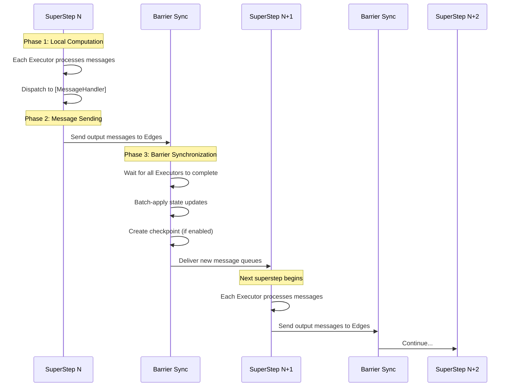
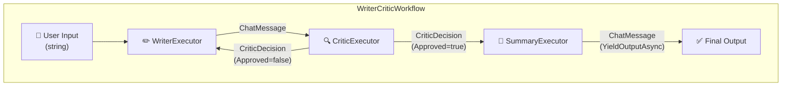

## Introduction

Between 2025 and 2026, the world of AI agents reached a major turning point. Rather than using LLMs as mere chat interfaces, a paradigm called **Agentic Workflow** — where multiple agents coordinate to accomplish complex tasks — has been spreading rapidly.

What exactly is an Agentic Workflow? Why are traditional automation and chatbots insufficient? And how do you implement one concretely?

This article dissects **everything about workflow patterns, from the concept of Agentic Workflow to concrete code using [Microsoft Agent Framework](https://github.com/microsoft/agent-framework)'s C# implementation.** Using an interactive visualizer to experience how each pattern operates, we will explore:

1. **What is an Agentic Workflow** — Definition, background, comparison with conventional approaches
2. **Workflow design patterns** — Sequential, Concurrent, Conditional, Handoff, Writer-Critic, Group Chat
3. **Advanced composition patterns** — Sub-Workflows, Workflow-as-Agent, Declarative Workflows
4. **C# implementation with Microsoft Agent Framework** — Code-level explanation of WorkflowBuilder, Executor, and Edge
5. **Practical implementation example** — Full Writer-Critic loop implementation
6. **Production considerations** — Error handling, checkpointing, observability, Human-in-the-Loop
7. **Design guidelines** — When to use an Agent vs. a Workflow

## What is an Agentic Workflow?

### Definition

An **Agentic Workflow** is a system design pattern that coordinates one or more AI agents within an explicitly defined execution graph to accomplish complex tasks.

Two points are critical here:

1. **"Agents" are the building blocks** — Not mere functions or rule-based processors, but agents with LLM reasoning capabilities that function as nodes in the workflow
2. **"Workflow" provides the control** — Execution order, conditional branching, and parallelism are **explicitly** controlled by the workflow definition. Rather than letting agents freely decide what to do next, developers design the execution flow as a graph structure

This combination of "LLM flexibility" and "deterministic workflow control" is the essence of an Agentic Workflow.

### Comparison with Conventional Approaches

To understand where Agentic Workflow fits, let's compare it with conventional approaches.

| Property | Traditional Automation (RPA etc.) | Chatbot | Single Agent | Agentic Workflow |
|----------|----------------------------------|---------|--------------|-----------------|
| **Flexibility** | Low (rule-based) | Moderate | High | High |
| **Controllability** | Very high | Low | Low | High |
| **Complex Tasks** | Hard-coded | Not suited | Single perspective | Multi-perspective |
| **Error Handling** | Branch handling | LLM-dependent | LLM-dependent | Structural handling |
| **Quality Assurance** | Testable | Difficult | Difficult | Review loops |
| **Implementation Cost** | High | Low | Low to moderate | Moderate |

Let's dig deeper into each approach's characteristics.

**Traditional automation (RPA etc.)** offers high controllability by strictly following predefined rules, but cannot handle unexpected inputs or ambiguous decisions. You can write "if the email subject contains keyword X, do Y," but "understand this email's intent and reply appropriately" is impossible.

**Chatbots** leverage LLM flexibility but are limited to single-turn responses and aren't suited for executing complex business processes. You can have a conversation about "help me book a trip," but reliably executing the entire booking-payment-confirmation email pipeline is difficult.

**Single agents** can interact with the outside world via tool calls and handle fairly complex tasks. However, all logic concentrates in one agent, making separation of concerns difficult and quality control a black box.

**Agentic Workflow** solves these problems. Each agent has a specialty domain, workflow controls execution order, and quality gates (such as Critic review loops) are structurally built in.

### Why Agentic Workflow Now?

Several technological advances underpin the rise of Agentic Workflow:

1. **LLM capability improvements** — Post-GPT-4 models have dramatically improved tool calling, structured output, and role-playing capabilities, making them viable as nodes within workflows
2. **Structured Output** — LLMs can now reliably generate structured output conforming to JSON schemas, making type-safe message passing between agents practical
3. **MCP standardization** — The Model Context Protocol standardized agent-tool connections, dramatically reducing integration costs
4. **Framework maturity** — Frameworks like Microsoft Agent Framework, LangGraph, and CrewAI have matured, enabling workflow construction with minimal code

## Workflow Design Patterns

Agentic Workflow has well-established design patterns that appear repeatedly. These patterns can be used individually or combined to build complex workflows. Let's examine each pattern with use cases, benefits, and trade-offs.

Use the interactive visualizer below to observe how each pattern operates. Switch between patterns with the buttons and step through message flows.

<AgenticWorkflowVisualizer />

### Pattern 1: Sequential (Serial Pipeline)

The simplest pattern. Multiple agents are chained in series, with each agent's output passed as input to the next.

<SequentialPatternDiagram />

**Use cases**: Translation chains, data transformation pipelines, staged document processing

**Benefits**: Simple implementation with clear input/output at each step. Easy to debug.

**Trade-offs**: Total latency is the sum of all steps. Cannot be parallelized.

In Microsoft Agent Framework, `AgentWorkflowBuilder.BuildSequential()` builds this pattern in a single line.

```csharp
// Sequential: Building a translation chain
// AgentWorkflowBuilder.BuildSequential() internally generates
// AddEdge(agent[0], agent[1]), AddEdge(agent[1], agent[2]), ...
Workflow workflow = AgentWorkflowBuilder.BuildSequential(
    from lang in new[] { "French", "Spanish", "English" }
    select new ChatClientAgent(
        chatClient,
        instructions: $"You are a translation assistant. Translate the input to {lang}.",
        name: $"{lang}Translator"
    )
);

// Execute the workflow
await using StreamingRun run =
    await InProcessExecution.RunStreamingAsync(workflow, "Hello, world!");

await foreach (WorkflowEvent evt in run.WatchStreamAsync())
{
    if (evt is AgentResponseUpdateEvent e)
        Console.Write(e.Update.Text);
    else if (evt is WorkflowOutputEvent output)
        Console.WriteLine($"\nFinal: {output.Data}");
}
```

### Pattern 2: Concurrent (Fan-out / Fan-in)

Input is distributed to multiple agents **simultaneously**, and all results are aggregated.

<ConcurrentPatternDiagram />

**Use cases**: Simultaneous multi-language translation, multi-angle analysis, parallel data processing

**Benefits**: Latency is bounded by the slowest agent (not the sum as in Sequential).

**Trade-offs**: Increases concurrent API calls — watch for rate limits. Aggregation logic required.

```csharp
// Concurrent: Parallel translation
// BuildConcurrent() internally generates Fan-out and Fan-in Barrier Edges
// Fan-out: Delivers messages from input node to all agents simultaneously
// Fan-in Barrier: Waits for all agents to complete before aggregating results
Workflow workflow = AgentWorkflowBuilder.BuildConcurrent(
    from lang in new[] { "French", "Spanish", "English" }
    select new ChatClientAgent(
        chatClient,
        instructions: $"Translate the input to {lang}. Output only the translation.",
        name: $"{lang}Translator"
    )
);
```

### Pattern 3: Conditional Routing

Dynamically determines the next execution target based on an Executor's output. Equivalent to `if-else` or `switch-case`.

<ConditionalPatternDiagram />

**Use cases**: Email classification (spam/legitimate), ticket routing, content moderation

```csharp
// Conditional Routing: Spam classification example
// AddSwitch() branches based on the ClassificationResult's Category property
// Type-safe condition evaluation via lambda expressions
WorkflowBuilder builder = new WorkflowBuilder(classifier)
    .AddSwitch(classifier, sw => sw
        .AddCase<ClassificationResult>(
            result => result?.Category == "spam",
            spamHandler)
        .AddCase<ClassificationResult>(
            result => result?.Category == "normal",
            replyGenerator)
        .WithDefault(manualReviewHandler)
    )
    .WithOutputFrom(spamHandler, replyGenerator, manualReviewHandler);
```

`AddSwitch` internally generates a **single `FanOutEdge`** whose `EdgeSelector` does an early return on the first matching case. In other words, `AddSwitch` is **exclusive** (switch-case semantics). In contrast, adding multiple conditional Edges via `AddEdge` is **non-exclusive** (multiple independent `if` statements) — messages are delivered to all matching Edge targets. This distinction is covered in detail in the "Implementation Gotchas" section.

### Pattern 4: Handoff (Delegation)

A triage agent analyzes input and delegates processing to the appropriate specialist agent. Similar to Conditional, but the key difference is that **the agent itself decides the delegation target**.

<HandoffPatternDiagram />

**Use cases**: Customer support routing, educational tutoring, specialist teams

```csharp
// Handoff: Triage → Specialist agent delegation
// CreateHandoffBuilderWith() builds starting from the triage agent
// WithHandoffs() defines bidirectional handoff routes
ChatClientAgent triageAgent = new(chatClient,
    instructions: "Determine which specialist to use. ALWAYS hand off.",
    name: "triage_agent",
    description: "Routes to the right specialist.");

ChatClientAgent mathTutor = new(chatClient,
    instructions: "You help with math. Explain step by step.",
    name: "math_tutor",
    description: "Math specialist.");

ChatClientAgent historyTutor = new(chatClient,
    instructions: "You help with history. Explain events and context.",
    name: "history_tutor",
    description: "History specialist.");

// Build the Handoff workflow
// WithHandoffs(source, targets) injects targets' descriptions
// as tool definitions into source, so the LLM calls a handoff tool
// and the workflow engine automatically routes to the correct Executor
Workflow workflow = AgentWorkflowBuilder
    .CreateHandoffBuilderWith(triageAgent)
    .WithHandoffs(triageAgent, [mathTutor, historyTutor])
    .WithHandoffs([mathTutor, historyTutor], triageAgent)
    .Build();
```

The internal mechanism of the Handoff pattern is fascinating. When you call `WithHandoffs(triageAgent, [mathTutor, historyTutor])`, the `name` and `description` of `mathTutor` and `historyTutor` are injected as **tool definitions** into `triageAgent`. When the LLM generates a tool call like `handoff_to_math_tutor`, the workflow engine detects it and routes the message to the corresponding Executor. In other words, the LLM makes the routing decision, but the workflow engine controls execution.

> **Note**: The Handoff API (`CreateHandoffBuilderWith` / `HandoffWorkflowBuilder`) is currently marked `[Experimental("MAAIW001")]`. You must suppress compiler warning `MAAIW001` to use it. The API may change in future releases.

### Pattern 5: Writer-Critic Loop (Iterative Refinement)

The most sophisticated pattern. A Writer generates output, a Critic reviews it, and the loop continues until approval. It replicates the human "review and revise" process in AI.

<WriterCriticPatternDiagram />

**Use cases**: Content generation, code review, translation quality management

**Benefits**: Quality gates are structurally built in, and output quality improves iteratively.

**Trade-offs**: LLM calls increase proportionally with loop iterations. A max-iteration safety valve is required.

```csharp
// Writer-Critic Loop: Iterative refinement workflow
// WorkflowBuilder declaratively defines the graph structure
WorkflowBuilder builder = new WorkflowBuilder(writer)
    .AddEdge(writer, critic)                    // Writer → Critic
    .AddSwitch(critic, sw => sw
        .AddCase<CriticDecision>(                // Approved → Summary
            cd => cd?.Approved == true, summary)
        .AddCase<CriticDecision>(                // Rejected → back to Writer
            cd => cd?.Approved == false, writer))
    .WithOutputFrom(summary);                    // Summary output = workflow output
```

### Pattern 6: Group Chat

In the Handoff pattern, "the current agent picks one next agent." Group Chat instead has **multiple agents converse in rounds**, with a `GroupChatManager` controlling who speaks next.

<GroupChatPatternDiagram />

**Use cases**: Brainstorming, multi-perspective review, debate-style analysis

```csharp
// Group Chat: Manager controls turn-taking among multiple agents
// CreateGroupChatBuilderWith() takes a GroupChatManager factory
// RoundRobinGroupChatManager: simplest manager — agents speak in order
Workflow workflow = AgentWorkflowBuilder
    .CreateGroupChatBuilderWith(
        agents => new RoundRobinGroupChatManager(agents) { MaximumIterationCount = 3 })
    .AddParticipants(researchAgent, criticAgent, synthesizerAgent)
    .Build();
```

`GroupChatManager` is an abstract class. You can implement custom managers with custom turn-selection logic. For example, a "MagneticGroupChatManager" that analyzes each utterance and nominates the most relevant agent next is entirely possible.

### Advanced Composition Patterns

Beyond the basic patterns, Agent Framework provides mechanisms for enhancing workflow composability.

#### Sub-Workflows

A workflow can itself be embedded as an Executor within another workflow. This enables building complex systems by **hierarchically composing reusable workflow components**.

```csharp
// Sub-Workflow: Embedding a workflow as an Executor
// 1. Build the child workflow normally
Workflow textProcessingWorkflow = new WorkflowBuilder(uppercase)
    .AddEdge(uppercase, reverse)
    .AddEdge(reverse, append)
    .WithOutputFrom(append)
    .Build();

// 2. Convert workflow to Executor via BindAsExecutor()
ExecutorBinding subWorkflowExecutor =
    textProcessingWorkflow.BindAsExecutor("TextProcessingSubWorkflow");

// 3. Connect it in the parent workflow like any other Executor
Workflow mainWorkflow = new WorkflowBuilder(prefix)
    .AddEdge(prefix, subWorkflowExecutor)
    .AddEdge(subWorkflowExecutor, postProcess)
    .WithOutputFrom(postProcess)
    .Build();
```

#### Workflow-as-Agent

Conversely, an entire workflow can be exposed as a single `AIAgent`. Callers don't need to know about the workflow's internal structure.

```csharp
// Workflow-as-Agent: Expose a workflow as an AIAgent
// AsAIAgent() wraps the workflow in the AIAgent interface
Workflow workflow = WorkflowFactory.BuildWorkflow(chatClient);
AIAgent agent = workflow.AsAIAgent("workflow-agent", "Workflow Agent");

// Interact just like with any other agent
AgentSession session = await agent.CreateSessionAsync();
await foreach (AgentResponseUpdate update in
    agent.RunStreamingAsync("Hello!", session))
{
    Console.Write(update.Text);
}
```

This pattern is ideal for **progressive complexity**. Start with a single agent, and when requirements grow complex, replace it with a workflow — without changing any calling code.

#### Declarative Workflows (YAML)

Instead of building graphs in C# code, you can **define workflows declaratively in YAML files**. This lets non-engineers understand and edit workflow structures, and workflows can be changed without code deployments.

Agent Framework's `Declarative/` samples provide numerous YAML-based workflow definitions for customer support, marketing, deep research, and more. The YAML is parsed and executed on the same engine as code-based workflows.

## Microsoft Agent Framework C# Implementation

Now let's explore the core concepts of Microsoft Agent Framework that power Agentic Workflow at the C# implementation level.

### Package Structure

The packages needed for .NET Agentic Workflow development:

```xml
<!-- Add to your .csproj -->
<PackageReference Include="Microsoft.Agents.AI" Version="1.1.0" />
<PackageReference Include="Microsoft.Agents.AI.Workflows" Version="1.1.0" />
<PackageReference Include="Microsoft.Agents.AI.Workflows.Generators" Version="1.1.0"
                OutputItemType="Analyzer" ReferenceOutputAssembly="false" />
<PackageReference Include="Microsoft.Agents.AI.OpenAI" Version="1.1.0" />
<!-- or Microsoft.Agents.AI.Foundry for Azure AI Foundry -->
```

`Microsoft.Agents.AI` is the framework core, containing agent-related foundation types like `AIAgent`, `ChatClientAgent`, and `AgentResponseUpdate`. `Microsoft.Agents.AI.Workflows` contains the workflow types (`WorkflowBuilder`, `Executor`, `InProcessExecution`, `StreamingRun`, etc.). `Microsoft.Agents.AI.Workflows.Generators` is the source generator that auto-generates dispatch code for `[MessageHandler]` attributes. `Microsoft.Agents.AI.OpenAI` provides OpenAI / Azure OpenAI integration, and `Microsoft.Agents.AI.Foundry` provides Microsoft Foundry (formerly Azure AI Foundry) integration.

### Core Concept: Executor

An **Executor** is a processing node in the workflow graph. It receives messages, processes them, and produces output messages. Agent Framework leverages C# partial classes and source generators to define Executors with minimal boilerplate.

```csharp
// Basic Executor form
// The partial keyword and source generators auto-generate
// message dispatch code
internal sealed partial class UpperCaseExecutor() : Executor("UpperCase")
{
    // [MessageHandler] attribute defines a message handler
    // The argument type (string) determines message routing
    [MessageHandler]
    public ValueTask<string> HandleAsync(
        string message,
        IWorkflowContext context,
        CancellationToken cancellationToken = default)
    {
        return ValueTask.FromResult(message.ToUpperInvariant());
    }
}
```

Methods with the `[MessageHandler]` attribute are automatically registered in the message dispatch table by the source generator. The **method's argument type** serves as the message routing key. So a `string` message calls `HandleAsync(string)`, and a `CriticDecision` message calls `HandleAsync(CriticDecision)`. This allows a single Executor to handle multiple message types in a type-safe manner.

#### Executor with ChatClientAgent

In most cases, you want to call an LLM inside an Executor. `ChatClientAgent` bridges this gap.

```csharp
// Executor that calls an LLM
// ChatClientAgent wraps IChatClient and provides the AIAgent interface
internal sealed partial class WriterExecutor : Executor
{
    private readonly AIAgent _agent;

    public WriterExecutor(IChatClient chatClient) : base("Writer")
    {
        // ChatClientAgent: IChatClient → AIAgent adapter
        // instructions are sent to the LLM as the system prompt
        this._agent = new ChatClientAgent(
            chatClient,
            name: "Writer",
            instructions: """
                You are a skilled writer. Create clear, engaging content.
                If you receive feedback, revise to address all concerns.
                """
        );
    }

    // Handler for initial requests (string type)
    [MessageHandler]
    public async ValueTask<ChatMessage> HandleInitialRequestAsync(
        string message,
        IWorkflowContext context,
        CancellationToken cancellationToken = default)
    {
        // RunStreamingAsync sends a streaming request to the LLM
        StringBuilder sb = new();
        await foreach (AgentResponseUpdate update in
            this._agent.RunStreamingAsync(
                new ChatMessage(ChatRole.User, message),
                cancellationToken: cancellationToken))
        {
            if (!string.IsNullOrEmpty(update.Text))
            {
                sb.Append(update.Text);
                Console.Write(update.Text); // Real-time output
            }
        }

        return new ChatMessage(ChatRole.User, sb.ToString());
    }

    // Handler for revision requests (CriticDecision type)
    // The same Executor handles different message types
    [MessageHandler]
    public async ValueTask<ChatMessage> HandleRevisionAsync(
        CriticDecision decision,
        IWorkflowContext context,
        CancellationToken cancellationToken = default)
    {
        string prompt =
            $"Revise based on this feedback:\n{decision.Feedback}\n\n" +
            $"Original:\n{decision.Content}";

        StringBuilder sb = new();
        await foreach (AgentResponseUpdate update in
            this._agent.RunStreamingAsync(
                new ChatMessage(ChatRole.User, prompt),
                cancellationToken: cancellationToken))
        {
            if (!string.IsNullOrEmpty(update.Text))
                sb.Append(update.Text);
        }

        return new ChatMessage(ChatRole.User, sb.ToString());
    }
}
```

Notice how `HandleInitialRequestAsync` and `HandleRevisionAsync` **coexist within the same Executor**. The former receives `string` messages, the latter `CriticDecision` messages. The workflow engine inspects the incoming message type and dispatches to the appropriate handler. This allows the Writer to process both "initial writing requests" and "revision requests with Critic feedback" in a single Executor.

### Core Concept: Edge

An **Edge** defines the message flow connections between Executors.

```csharp
// Direct Edge: Unconditionally routes messages from A → B
builder.AddEdge(executorA, executorB);

// Conditional Edge: Routes only when the condition is met
builder.AddEdge<ClassificationResult>(executorA, executorB,
    condition: r => r?.Category == "normal");

// Switch-Case Edge: Multiple conditional branches
builder.AddSwitch(executorA, sw => sw
    .AddCase<ResultType>(r => r?.IsSuccess == true, successHandler)
    .AddCase<ResultType>(r => r?.IsSuccess == false, failureHandler)
    .WithDefault(fallbackHandler));

// Fan-out Edge: 1 → N parallel distribution
builder.AddFanOutEdge<RoutingResult>(
    sourceExecutor,
    targets: [handlerA, handlerB, handlerC],
    targetSelector: (result, count) =>
    {
        // Select targets based on result content
        // Return value is a list of target indices
        if (result?.NeedsAll == true) return Enumerable.Range(0, count);
        return [0]; // handlerA only
    });

// Fan-in Barrier Edge: N → 1 aggregation (waits for all sources)
builder.AddFanInBarrierEdge(
    sources: [workerA, workerB, workerC],
    target: aggregator);
```

Edges are closely tied to the workflow engine's superstep execution. In each superstep, active Executors run and output messages are delivered to the next Executors based on Edge conditions. Condition matching is performed independently per Edge, so when using multiple conditional Edges created via `AddEdge`, a single output can match multiple Edges simultaneously. There are several important gotchas here, covered in the "Implementation Gotchas" section.

### Core Concept: WorkflowBuilder

**WorkflowBuilder** combines Executors and Edges to construct the workflow's directed graph.

```csharp
// Full WorkflowBuilder usage example
Workflow workflow = new WorkflowBuilder(entryExecutor)
    // Direct Edge: entry → processor
    .AddEdge(entryExecutor, processorExecutor)
    // Switch-Case: Branch based on processor output
    .AddSwitch(processorExecutor, sw => sw
        .AddCase<ProcessResult>(r => r?.Status == "approved", approvedHandler)
        .AddCase<ProcessResult>(r => r?.Status == "rejected", rejectedHandler)
        .WithDefault(manualReviewHandler))
    // Output sources: These executors' outputs become the workflow's output
    .WithOutputFrom(approvedHandler, rejectedHandler, manualReviewHandler)
    // Build: Generate the Workflow instance
    .Build();
```

The Executor passed to the `WorkflowBuilder` constructor becomes the workflow's entry point. `.Build()` validates graph integrity (no orphaned nodes, output sources specified, etc.) and returns a `Workflow` instance.

### Workflow Execution

Use `InProcessExecution` to run workflows. Both streaming and non-streaming modes are supported.

```csharp
// Streaming execution
// InProcessExecution.RunStreamingAsync() returns a StreamingRun
// StreamingRun is IAsyncDisposable, so using ensures resource cleanup
await using StreamingRun run =
    await InProcessExecution.RunStreamingAsync(workflow, "Input message");

// WatchStreamAsync() subscribes to events in real-time
await foreach (WorkflowEvent evt in run.WatchStreamAsync())
{
    switch (evt)
    {
        case AgentResponseUpdateEvent agentUpdate:
            // Agent streaming output (per-token)
            Console.Write(agentUpdate.Update.Text);
            break;

        case WorkflowOutputEvent output:
            // Workflow's final output
            Console.WriteLine($"\n=== Final Output ===");
            Console.WriteLine(output.Data);
            break;
    }
}
```

`InProcessExecution` runs the workflow within the same process. The workflow engine operates using a **Pregel-derived superstep model (BSP: Bulk Synchronous Parallel)**. This model originates from [Pregel](https://research.google/pubs/pregel-a-system-for-large-scale-graph-processing/), the large-scale graph processing framework published by Google in 2010, applying a computational model established in distributed graph processing to AI agent workflow execution.

#### What is Pregel / BSP?

**BSP (Bulk Synchronous Parallel)** is a parallel computing model proposed by Leslie Valiant in 1990. It structures computation as a repetition of discrete phases called "supersteps." Each superstep consists of three phases:

1. **Local computation** — Each processor (Executor) reads its local message queue and performs computation
2. **Message sending** — Computation results are sent as messages to other processors
3. **Barrier synchronization** — Wait for all processors to complete, batch-apply state updates. New messages become available in the next superstep

Pregel specializes BSP for vertex-centric computation on directed graphs — "each vertex processes received messages, sends messages to adjacent vertices, and updates its own state" in a loop. Agent Framework's workflow engine applies this Pregel computation model to agent orchestration.



Use the simulator below to experience the superstep execution flow with a Concurrent translation workflow. Step through each phase (Local Computation → Message Sending → Barrier Synchronization) to see how Executor message queues and state change at each stage.

<BSPVisualizer />

#### Concrete Execution Flow in Agent Framework

Looking at the actual source code ([`InProcessRunner.cs`](https://github.com/microsoft/agent-framework/blob/main/dotnet/src/Microsoft.Agents.AI.Workflows/InProc/InProcessRunner.cs)), the `RunSuperStepAsync` method executes a single superstep as follows:

```csharp
// InProcessRunner.RunSuperStepAsync() internals (simplified)
// https://github.com/microsoft/agent-framework/blob/main/dotnet/src/Microsoft.Agents.AI.Workflows/InProc/InProcessRunner.cs
async ValueTask<bool> RunSuperStepAsync(CancellationToken cancellationToken)
{
    // 1. AdvanceAsync(): Move messages queued in the previous superstep
    //    to the current superstep's StepContext
    StepContext currentStep = await RunContext.AdvanceAsync(cancellationToken);

    // No messages means no superstep needed
    if (!currentStep.HasMessages && !RunContext.HasQueuedExternalDeliveries)
        return false;

    // 2. Raise SuperStepStartedEvent
    await RaiseWorkflowEventAsync(StepTracer.Advance(currentStep));

    // 3. Deliver messages to all target Executors in parallel
    //    Task.WhenAll runs all Executors within the same superstep concurrently
    List<Task> receiverTasks = currentStep.QueuedMessages.Keys
        .Select(receiverId =>
            DeliverMessagesAsync(receiverId,
                currentStep.MessagesFor(receiverId),
                cancellationToken).AsTask())
        .ToList();
    await Task.WhenAll(receiverTasks);

    // 4. Drive sub-workflows in parallel if any
    List<Task> subworkflowTasks = [];
    foreach (var subRunner in RunContext.JoinedSubworkflowRunners)
        subworkflowTasks.Add(subRunner.RunSuperStepAsync(cancellationToken).AsTask());
    await Task.WhenAll(subworkflowTasks);

    // 5. Barrier synchronization: Batch-apply state updates
    //    StateManager.PublishUpdatesAsync() applies all updates
    //    queued via QueueStateUpdateAsync() in one batch
    await StateManager.PublishUpdatesAsync(StepTracer);

    // 6. Create checkpoint (if enabled)
    await CheckpointAsync(cancellationToken);

    // 7. Raise SuperStepCompletedEvent
    await RaiseWorkflowEventAsync(
        StepTracer.Complete(
            RunContext.NextStepHasActions,
            RunContext.HasUnservicedRequests));
}
```

Several aspects deserve attention:

**Parallel execution**: Step 3 uses `Task.WhenAll` to run all Executors within the same superstep **concurrently**. This is the mechanism that makes multiple agents operate simultaneously in the Fan-out pattern. In Sequential patterns, only one Executor is active per superstep (effectively serial), but in Concurrent patterns, multiple Executors run in parallel within the same step.

**Barrier synchronization**: Step 5 calls `PublishUpdatesAsync()`, which batch-applies all state updates queued via `QueueStateUpdateAsync()` during the superstep. This guarantees that multiple Executors reading the same state within a single superstep see a consistent snapshot. Updates queued in one superstep don't become visible until the next superstep.

**Checkpointing**: Step 6 automatically creates a checkpoint at the end of each superstep. Checkpoints include:
- `StepContext` — Message queues scheduled for delivery in the next superstep
- `StateManager` — All Executor states
- `EdgeMap` — Edge states (Fan-in barrier wait states, etc.)
- `WorkflowInfo` — Workflow graph structure information

#### StepContext — The Message Queue Mechanism

Message management for each superstep is handled by [`StepContext`](https://github.com/microsoft/agent-framework/blob/main/dotnet/src/Microsoft.Agents.AI.Workflows/Execution/StepContext.cs).

```csharp
// StepContext: Superstep message queue management
// https://github.com/microsoft/agent-framework/blob/main/dotnet/src/Microsoft.Agents.AI.Workflows/Execution/StepContext.cs
internal sealed class StepContext
{
    // Target Executor ID → Message queue
    // ConcurrentDictionary + ConcurrentQueue for thread safety
    public ConcurrentDictionary<string, ConcurrentQueue<MessageEnvelope>>
        QueuedMessages { get; } = [];

    public bool HasMessages =>
        !QueuedMessages.IsEmpty &&
        QueuedMessages.Values.Any(q => !q.IsEmpty);
}
```

`MessageEnvelope` holds the message body plus source Executor ID, message type information, and trace context (OpenTelemetry). Edge routing logic (`EdgeRunner`) evaluates output messages against conditions and enqueues them into the `StepContext` for the next superstep.

#### Execution Mode Selection

`InProcessExecution` provides three execution modes:

| Mode | Description | Use Case |
|------|-------------|----------|
| `OffThread` (default) | Runs supersteps on a background thread, streaming events in real-time | Production, streaming UI |
| `Lockstep` | Runs supersteps on the event-watching thread, batching events after each step | Testing, debugging |
| `Concurrent` | `OffThread` + allows multiple concurrent runs of the same workflow instance | High-throughput scenarios |

```csharp
// Execution mode selection
// Default (OffThread): Real-time streaming
await using var run = await InProcessExecution.RunStreamingAsync(workflow, input);

// Lockstep: For testing/debugging (events delivered in batches)
await using var run = await InProcessExecution.Lockstep
    .RunStreamingAsync(workflow, input);

// Concurrent: Parallel runs of the same workflow
// All Executors in the workflow must implement IResettableExecutor
await using var run = await InProcessExecution.Concurrent
    .RunStreamingAsync(workflow, input);
```

#### SuperStepStartedEvent / SuperStepCompletedEvent

The start and completion of each superstep are notified as events. Monitoring these provides real-time visibility into workflow execution progress.

```csharp
await foreach (WorkflowEvent evt in run.WatchStreamAsync())
{
    switch (evt)
    {
        case SuperStepStartedEvent stepStarted:
            // SendingExecutors: IDs of Executors that sent messages in the previous step
            Console.WriteLine(
                $"[Step Start] Senders: {string.Join(", ", stepStarted.StartInfo.SendingExecutors)}");
            break;

        case SuperStepCompletedEvent stepCompleted:
            // ActivatedExecutors: IDs of Executors that ran in this step
            // HasPendingMessages: Whether messages are queued for the next step
            // StateUpdated: Whether state was updated
            Console.WriteLine(
                $"[Step Done] Activated: {string.Join(", ", stepCompleted.CompletionInfo.ActivatedExecutors)}, " +
                $"Pending: {stepCompleted.CompletionInfo.HasPendingMessages}, " +
                $"StateUpdated: {stepCompleted.CompletionInfo.StateUpdated}");
            break;

        case AgentResponseUpdateEvent agentUpdate:
            Console.Write(agentUpdate.Update.Text);
            break;

        case WorkflowOutputEvent output:
            Console.WriteLine($"\nFinal: {output.Data}");
            break;
    }
}
```

#### Why Pregel / BSP?

The reasons Agent Framework adopted this model are clear:

1. **Deterministic execution order**: Barrier synchronization guarantees that "messages sent in superstep N are processed in superstep N+1." This makes debugging and testing much easier
2. **Consistent state**: Since state updates are batch-applied at the barrier, multiple Executors reading/writing the same state within a single step never conflict
3. **Checkpoint affinity**: Barrier points serve as natural checkpoint insertion points, enabling straightforward implementation of failure recovery and workflow resumption
4. **Concurrency control**: Combining `Task.WhenAll` parallel execution with barrier synchronization naturally controls the degree of parallelism
5. **Observability**: Events fire at superstep granularity, enabling discrete tracking of workflow progress

The workflow completes when all Executor queues are empty or an Executor specified by `WithOutputFrom` produces output.

#### Two Queues — Message Queue vs. Event Queue

Inside the workflow engine, there are **two independent queues**. They serve entirely different purposes, and it's important not to confuse them. The architecture diagram below shows the `currentStep` / `_nextStep` swap and Event Queue relationship.

<BSPArchitectureDiagram />

##### Message Queue (`StepContext.QueuedMessages`)

**What flows through it**: Business messages between Executors (`MessageEnvelope`)

Executors don't hold their own queues. [`StepContext`](https://github.com/microsoft/agent-framework/blob/main/dotnet/src/Microsoft.Agents.AI.Workflows/Execution/StepContext.cs) holds a `ConcurrentDictionary<string, ConcurrentQueue<MessageEnvelope>>`, **using the Executor ID as the key to route messages**.

Tracing the message flow:

```text
Executor A calls context.SendMessageAsync(output)
  → InProcessRunnerContext.SendMessageAsync(sourceId, output) is called
    → All Edges attached to sourceId are traversed
      → EdgeMap.PrepareDeliveryForEdgeAsync() evaluates conditions
        → DeliveryMapping.MapInto(_nextStep) enqueues into
          the StepContext for the next superstep
            → _nextStep.MessagesFor(targetId).Enqueue(envelope)
```

At the superstep boundary, [`InProcessRunnerContext.AdvanceAsync()`](https://github.com/microsoft/agent-framework/blob/main/dotnet/src/Microsoft.Agents.AI.Workflows/InProc/InProcessRunnerContext.cs) **atomically swaps** `_nextStep`:

```csharp
// InProcessRunnerContext.AdvanceAsync() — Superstep transition
// https://github.com/microsoft/agent-framework/blob/main/dotnet/src/Microsoft.Agents.AI.Workflows/InProc/InProcessRunnerContext.cs
public async ValueTask<StepContext> AdvanceAsync(CancellationToken cancellationToken = default)
{
    // First, route external messages into _nextStep via Edges
    while (_queuedExternalDeliveries.TryDequeue(out var deliveryPrep))
        await deliveryPrep();

    // Atomically swap _nextStep with a fresh empty StepContext
    return Interlocked.Exchange(ref _nextStep, new StepContext());
}
```

The extracted `StepContext`'s `QueuedMessages` are filtered by Executor ID and delivered to each Executor in parallel within `RunSuperstepAsync()`:

```csharp
// InProcessRunner.RunSuperstepAsync() — Filter by Executor ID and deliver
List<Task> receiverTasks = currentStep.QueuedMessages.Keys
    .Select(receiverId =>
        DeliverMessagesAsync(
            receiverId,
            currentStep.MessagesFor(receiverId),  // Filter by Executor ID
            cancellationToken).AsTask())
    .ToList();
await Task.WhenAll(receiverTasks);  // Parallel execution within the same step
```

##### Event Queue (`ConcurrentEventSink`)

**What flows through it**: Workflow observation/control events (`WorkflowEvent`)

[`ConcurrentEventSink`](https://github.com/microsoft/agent-framework/blob/main/dotnet/src/Microsoft.Agents.AI.Workflows/Execution/ConcurrentEventSink.cs) is a single event sink held by `InProcessRunner`. It has **no involvement whatsoever** in message routing between Executors.

```csharp
// ConcurrentEventSink — Event notification mechanism
// https://github.com/microsoft/agent-framework/blob/main/dotnet/src/Microsoft.Agents.AI.Workflows/Execution/ConcurrentEventSink.cs
internal class ConcurrentEventSink : IEventSink
{
    public ValueTask EnqueueAsync(WorkflowEvent workflowEvent)
        => this.EventRaised?.Invoke(this, workflowEvent) ?? default;

    public event Func<object?, WorkflowEvent, ValueTask>? EventRaised;
}
```

Events that flow through here include:

| Event | When it fires |
|-------|-------------|
| `SuperStepStartedEvent` | At superstep start |
| `SuperStepCompletedEvent` | At superstep completion |
| `AgentResponseUpdateEvent` | LLM streaming output (per-token) |
| `WorkflowOutputEvent` | When `YieldOutputAsync()` produces final output |
| `RequestInfoEvent` | Human-in-the-Loop input waiting |
| `WorkflowErrorEvent` | On exception |

These are exposed to client code via `StreamingRun.WatchStreamAsync()`.

##### Summary of Differences

| Aspect | Message Queue | Event Queue |
|--------|--------------|-------------|
| **Identity** | `StepContext.QueuedMessages` | `ConcurrentEventSink` |
| **Data type** | `MessageEnvelope` (business data) | `WorkflowEvent` (observation events) |
| **Purpose** | Message routing between Executors | External notification of execution status |
| **Routing** | Edge condition evaluation determines targets | None (all events flow externally) |
| **Superstep relationship** | Atomically swapped at step boundary | Fires in real-time during steps |
| **Checkpointed** | Yes (persisted) | No |
| **Consumer** | Executors in the next superstep | Client code via `WatchStreamAsync()` |

In a nutshell: **Message Queue is "conversations between Executors," Event Queue is "the workflow reporting events to the outside world."**

### Type-Safe Branching with Structured Output

**Structured Output** is particularly important in the Writer-Critic pattern. If the Critic returns its "approve/reject" decision as free-form text, parsing for subsequent conditional branching becomes unreliable. Structured Output forces the LLM to conform to a JSON schema, fundamentally solving this problem.

```csharp
// CriticDecision: DTO for Structured Output
// Description attributes map to JSON Schema description fields,
// giving the LLM hints about each field's meaning
[Description("Critic's review decision")]
internal sealed class CriticDecision
{
    [JsonPropertyName("approved")]
    [Description("Whether the content is approved (true) or needs revision (false)")]
    public bool Approved { get; set; }

    [JsonPropertyName("feedback")]
    [Description("Specific feedback for improvements if not approved")]
    public string Feedback { get; set; } = "";

    // Fields for workflow-internal use (not included in JSON)
    [JsonIgnore]
    public string Content { get; set; } = "";

    [JsonIgnore]
    public int Iteration { get; set; }
}

// Critic Executor: Review using Structured Output
internal sealed class CriticExecutor : Executor<ChatMessage, CriticDecision>
{
    private readonly AIAgent _agent;

    public CriticExecutor(IChatClient chatClient) : base("Critic")
    {
        this._agent = new ChatClientAgent(chatClient, new ChatClientAgentOptions
        {
            Name = "Critic",
            ChatOptions = new()
            {
                Instructions = """
                    You are a constructive critic. Review content and provide feedback.
                    Provide your decision as structured output.
                    """,
                // ChatResponseFormat.ForJsonSchema<T>() sends
                // CriticDecision's JSON Schema to the LLM
                // The LLM is guaranteed to return JSON conforming to this schema
                ResponseFormat = ChatResponseFormat.ForJsonSchema<CriticDecision>()
            }
        });
    }

    public override async ValueTask<CriticDecision> HandleAsync(
        ChatMessage message,
        IWorkflowContext context,
        CancellationToken cancellationToken = default)
    {
        // Get streaming response
        IAsyncEnumerable<AgentResponseUpdate> updates =
            this._agent.RunStreamingAsync(message, cancellationToken: cancellationToken);

        // Display streaming output in real-time
        await foreach (AgentResponseUpdate update in updates)
        {
            if (!string.IsNullOrEmpty(update.Text))
                Console.Write(update.Text);
        }

        // Convert stream to AgentResponse and deserialize JSON
        AgentResponse response = await updates.ToAgentResponseAsync(cancellationToken);
        CriticDecision decision = JsonSerializer.Deserialize<CriticDecision>(
            response.Text, JsonSerializerOptions.Web)
            ?? throw new JsonException("Failed to deserialize CriticDecision");

        return decision;
    }
}
```

`ChatResponseFormat.ForJsonSchema<CriticDecision>()` is the key. This forces the LLM to output JSON strictly conforming to the `CriticDecision` class's JSON Schema. `[Description]` attributes convey each field's meaning to the LLM, `[JsonPropertyName]` specifies JSON key names, and `[JsonIgnore]` fields are excluded from the JSON Schema — used only for workflow-internal state management.

### State Management with IWorkflowContext

Use `IWorkflowContext` to share state between Executors.

```csharp
// Reading and writing shared state
// IWorkflowContext is injected into each Executor
// scopeName isolates scopes, key identifies individual state entries

// Read state
FlowState? state = await context.ReadStateAsync<FlowState>(
    key: "singleton",
    scopeName: "FlowStateScope");

// Write state (queued, applied at superstep end)
await context.QueueStateUpdateAsync(
    key: "singleton",
    value: updatedState,
    scopeName: "FlowStateScope");
```

`ReadStateAsync` reads current state, and `QueueStateUpdateAsync` queues a state update. State updates are **batch-applied at the end of each superstep**. This ensures consistency when multiple Executors within the same superstep read the same state.

### IResettableExecutor — Reusing Stateful Executors

When stateful Executors (those with internal lists, counters, etc.) are reused as **shared instances** across multiple workflow runs, implementing the `IResettableExecutor` interface is required. The framework calls `ResetAsync()` at the end of each run to clear accumulated internal state.

```csharp
// IResettableExecutor: Reusing stateful shared Executors
// Framework-provided Executors (ChatForwardingExecutor, etc.) already implement this
// Custom stateful Executors must implement it themselves
internal sealed class AggregationExecutor()
    : Executor<List<ChatMessage>>("Aggregator"), IResettableExecutor
{
    private readonly List<ChatMessage> _messages = [];

    public override async ValueTask HandleAsync(
        List<ChatMessage> message,
        IWorkflowContext context,
        CancellationToken cancellationToken = default)
    {
        this._messages.AddRange(message);
        if (this._messages.Count >= 2)
            await context.YieldOutputAsync(
                string.Join("\n", this._messages.Select(m => m.Text)),
                cancellationToken);
    }

    // Framework calls this automatically between workflow runs
    public ValueTask ResetAsync()
    {
        this._messages.Clear();
        return default;
    }
}
```

Attempting to reuse a stateful shared Executor without `IResettableExecutor` throws `InvalidOperationException`. Not needed when creating new instances via a factory each time, but essential when sharing instances for performance.

## Practice: Full Writer-Critic Loop Implementation

Let's integrate all the concepts above into the full Writer-Critic loop implementation. This is based on the official Microsoft Agent Framework sample [`07_WriterCriticWorkflow`](https://github.com/microsoft/agent-framework/tree/main/dotnet/samples/03-workflows/_StartHere/07_WriterCriticWorkflow).

### Overall Structure



### Program.cs — Workflow Assembly and Execution

```csharp
// Program.cs — Writer-Critic workflow entry point
// https://github.com/microsoft/agent-framework/blob/main/dotnet/samples/03-workflows/_StartHere/07_WriterCriticWorkflow/Program.cs
using System.ComponentModel;
using System.Text;
using System.Text.Json;
using System.Text.Json.Serialization;
using Azure.AI.OpenAI;
using Azure.Identity;
using Microsoft.Agents.AI;
using Microsoft.Agents.AI.Workflows;
using Microsoft.Extensions.AI;

public static class Program
{
    public const int MaxIterations = 3; // Safety valve: max 3 iterations

    private static async Task Main()
    {
        // ── 1. Initialize LLM client ──
        string endpoint = Environment.GetEnvironmentVariable("AZURE_OPENAI_ENDPOINT")
            ?? throw new InvalidOperationException("AZURE_OPENAI_ENDPOINT is not set.");
        string deploymentName =
            Environment.GetEnvironmentVariable("AZURE_OPENAI_DEPLOYMENT_NAME")
            ?? "gpt-4o-mini";

        // IChatClient: Unified interface from Microsoft.Extensions.AI
        // Swapping providers (Azure OpenAI, OpenAI, Ollama, etc.)
        // requires no changes to downstream code
        IChatClient chatClient = new AzureOpenAIClient(
            new Uri(endpoint),
            new AzureCliCredential()
        ).GetChatClient(deploymentName).AsIChatClient();

        // ── 2. Create Executors ──
        WriterExecutor writer = new(chatClient);
        CriticExecutor critic = new(chatClient);
        SummaryExecutor summary = new(chatClient);

        // ── 3. Build workflow graph ──
        // WorkflowBuilder constructor arg = entry point
        WorkflowBuilder workflowBuilder = new WorkflowBuilder(writer)
            .AddEdge(writer, critic)           // Writer → Critic
            .AddSwitch(critic, sw => sw        // Conditional branch at Critic
                .AddCase<CriticDecision>(
                    cd => cd?.Approved == true,
                    summary)                   //   Approved → Summary
                .AddCase<CriticDecision>(
                    cd => cd?.Approved == false,
                    writer))                   //   Rejected → Writer (loop)
            .WithOutputFrom(summary);          // Summary output = final output

        // ── 4. Execute workflow ──
        Workflow workflow = workflowBuilder.Build();
        await using StreamingRun run =
            await InProcessExecution.RunStreamingAsync(
                workflow,
                "Write a 200-word blog post about AI ethics.");

        // ── 5. Subscribe to events ──
        await foreach (WorkflowEvent evt in run.WatchStreamAsync())
        {
            switch (evt)
            {
                case AgentResponseUpdateEvent agentUpdate:
                    if (!string.IsNullOrEmpty(agentUpdate.Update.Text))
                        Console.Write(agentUpdate.Update.Text);
                    break;

                case WorkflowOutputEvent output:
                    Console.WriteLine($"\n\n=== FINAL APPROVED CONTENT ===");
                    Console.WriteLine(output.Data);
                    break;
            }
        }
    }
}
```

### FlowState — Shared State

```csharp
// FlowState: Shared state for iteration tracking across Executors
// Read/written via IWorkflowContext's ReadStateAsync / QueueStateUpdateAsync
internal sealed class FlowState
{
    public int Iteration { get; set; } = 1;
    public List<ChatMessage> History { get; } = [];
}

// Constants for state scope and key
internal static class FlowStateShared
{
    public const string Scope = "FlowStateScope";
    public const string Key = "singleton";
}

// Helper methods
internal static class FlowStateHelpers
{
    public static async Task<FlowState> ReadFlowStateAsync(IWorkflowContext context)
    {
        FlowState? state = await context.ReadStateAsync<FlowState>(
            FlowStateShared.Key,
            scopeName: FlowStateShared.Scope);
        return state ?? new FlowState();
    }

    public static ValueTask SaveFlowStateAsync(
        IWorkflowContext context, FlowState state)
        => context.QueueStateUpdateAsync(
            FlowStateShared.Key,
            state,
            scopeName: FlowStateShared.Scope);
}
```

### Safety Valve: MaxIterations

Any workflow with loops must have a **safety valve**. If the LLM's judgment doesn't match expectations, infinite loops can occur.

```csharp
// Safety valve logic inside CriticExecutor
if (!decision.Approved && state.Iteration >= Program.MaxIterations)
{
    Console.WriteLine(
        $"⚠️ Max iterations ({Program.MaxIterations}) reached - auto-approving");
    decision.Approved = true;
    decision.Feedback = "";
}
```

Think of this pattern as a "deadline-bounded improvement loop." Even in human reviews, rules like "maximum 3 revision rounds — after that, ship best effort" aren't uncommon. The same concept applies to AI workflows.

## Production Considerations

### Error Handling and Failure Modes

Error handling in Agentic Workflows presents challenges distinct from traditional applications. LLM calls are **non-deterministic**, with diverse failure modes including rate limiting, timeouts, and malformed output.

#### Exception Handling within Executors

Exceptions thrown inside an Executor are caught by the workflow engine, causing the entire workflow to fail. For transient LLM errors, implement retry logic within the Executor.

```csharp
// Retry and error handling inside an Executor
[MessageHandler]
public async ValueTask<ChatMessage> HandleAsync(
    string message,
    IWorkflowContext context,
    CancellationToken cancellationToken = default)
{
    const int maxRetries = 3;
    for (int attempt = 1; attempt <= maxRetries; attempt++)
    {
        try
        {
            StringBuilder sb = new();
            await foreach (AgentResponseUpdate update in
                this._agent.RunStreamingAsync(
                    new ChatMessage(ChatRole.User, message),
                    cancellationToken: cancellationToken))
            {
                if (!string.IsNullOrEmpty(update.Text))
                    sb.Append(update.Text);
            }
            return new ChatMessage(ChatRole.User, sb.ToString());
        }
        catch (HttpRequestException ex) when (attempt < maxRetries)
        {
            // Exponential backoff for rate limits and timeouts
            int delay = (int)Math.Pow(2, attempt) * 1000;
            Console.WriteLine($"⚠️ Attempt {attempt} failed: {ex.Message}. Retrying in {delay}ms...");
            await Task.Delay(delay, cancellationToken);
        }
    }
    throw new InvalidOperationException("All retry attempts exhausted");
}
```

#### Common Failure Modes

| Failure Mode | Symptom | Mitigation |
|-------------|---------|------------|
| **Rate limiting** | HTTP 429 | Retry with exponential backoff |
| **Malformed output** | Structured Output parse failure | Fallback to defaults, or retry |
| **Infinite loop** | Writer-Critic never converges | MaxIterations safety valve |
| **Timeout** | LLM unresponsive | CancellationToken + timeout configuration |
| **Partial failure** | One Concurrent leg fails | Aggregation logic in Fan-in Barrier that excludes errored results |

### Checkpointing

For long-running workflows, restarting from scratch after a failure is wasteful. Agent Framework provides a checkpointing mechanism to persist workflow state and resume from where it left off.

```csharp
// Checkpoint storage configuration
// FileSystemJsonCheckpointStore persists state to the file system
// Production typically uses Cosmos DB or Azure Table Storage-based ICheckpointStore
var store = new FileSystemJsonCheckpointStore("./checkpoints");
var checkpointManager = new CheckpointManager(store);

// Workflow execution with checkpointing
await using StreamingRun run =
    await InProcessExecution.RunStreamingAsync(
        workflow,
        input,
        checkpointManager);
```

### Observability

Agent Framework natively supports OpenTelemetry, enabling tracing of each Executor's execution time, input/output, and LLM token usage.

```csharp
// OpenTelemetry setup example
using var tracerProvider = Sdk.CreateTracerProviderBuilder()
    .SetResourceBuilder(ResourceBuilder.CreateDefault()
        .AddService("WriterCriticWorkflow"))
    .AddSource("Microsoft.Agents.AI")     // Agent Framework traces
    .AddOtlpExporter()                     // Send to Jaeger / Azure Monitor etc.
    .Build();
```

The Workflow event system also serves observability. `ExecutorInvokedEvent` / `ExecutorCompletedEvent` reveal which Executor ran when, allowing detailed tracing of workflow execution flow.

### Human-in-the-Loop

Some workflow scenarios require user approval. Agent Framework supports this with the `RequestInput` pattern. The workflow pauses waiting for user input and resumes once input is provided. For example, when the Critic determines "human review needed," the workflow can pause and wait for user feedback.

## Design Guidelines: Agent vs. Workflow

Microsoft's official documentation provides the following usage guidelines:

| Use an Agent when... | Use a Workflow when... |
|---------------------|----------------------|
| The task is open-ended or conversational | The process has well-defined steps |
| Autonomous tool use and planning needed | Explicit control over execution order needed |
| A single LLM call (+ tools) suffices | Multiple agents/functions must coordinate |

And the most important guideline: **If a function can handle the task, you don't need an AI agent.** LLM calls carry cost, latency, and non-determinism. Implement deterministic logic with regular functions and use agents only where LLM reasoning is truly needed — this is the best practice for cost efficiency and reliability.

### Implementation Gotchas

Microsoft Agent Framework workflow implementation has several behavioral gotchas that are easy to miss from documentation alone. Here we summarize the important ones confirmed from the source code.

#### 1. Conditional Edges via `AddEdge` Are Non-Exclusive

When multiple conditional Edges are added to the same source via `AddEdge`, **all Edges are evaluated independently**. This means multiple `if` statements, not `if-else`.

```csharp
// ⚠️ If both conditions are true, BOTH processorA and processorB execute!
builder
    .AddEdge<MyResult>(source, processorA, r => r?.Score > 50)
    .AddEdge<MyResult>(source, processorB, r => r?.Score > 30);
// Score = 70 → Messages delivered to BOTH processorA and processorB
```

The evidence is in [`InProcessRunnerContext.SendMessageAsync()`](https://github.com/microsoft/agent-framework/blob/main/dotnet/src/Microsoft.Agents.AI.Workflows/InProc/InProcessRunnerContext.cs). All Edges are traversed with `foreach`, and messages are delivered to every matching Edge's target:

```csharp
// InProcessRunnerContext.SendMessageAsync() — All Edges evaluated independently
foreach (Edge edge in edges)  // No break, no return
{
    DeliveryMapping? maybeMapping =
        await _edgeMap.PrepareDeliveryForEdgeAsync(edge, envelope, cancellationToken);
    maybeMapping?.MapInto(this._nextStep);  // Delivers to ALL matches
}
```

**Use `AddSwitch` for exclusive branching.** `AddSwitch` internally generates a single `FanOutEdge`, and the [`SwitchBuilder.ReduceToFanOut()`](https://github.com/microsoft/agent-framework/blob/main/dotnet/src/Microsoft.Agents.AI.Workflows/SwitchBuilder.cs) `EdgeSelector` does an early return on the first match:

```csharp
// SwitchBuilder's internal EdgeSelector (simplified)
IEnumerable<int> EdgeSelector(object? input, int targetCount)
{
    for (int i = 0; i < caseMap.Count; i++)
    {
        if (caseMap[i].Predicate(input))
            return caseMap[i].OutgoingIndicies;  // Returns on first match
    }
    return defaultIndicies;  // Falls through to default
}
```

| API | Internal Edge | Semantics | Multiple Match |
|------|----------|------------|--------|
| `AddEdge` × N | Multiple `DirectEdge`s | Multiple independent `if`s | Possible |
| `AddSwitch` | Single `FanOutEdge` | `switch-case` (first match wins) | No |

#### 2. Type-Mismatched Messages Are Silently Dropped

`DirectEdgeRunner` **silently discards** messages whose type doesn't match any `[MessageHandler]` on the target Executor (`DroppedTypeMismatch`). No exception is thrown.

```csharp
// DirectEdgeRunner.ChaseEdgeAsync() — Type mismatch = silent drop
if (CanHandle(target, messageType))
{
    return new DeliveryMapping(envelope, target);  // Delivered
}
// ↓ Falls through here: DroppedTypeMismatch — no exception
return null;
```

This is intentional — it enables polymorphic message routing (different message types from the same source). But it means **bugs from unintended type mismatches happen silently**. When debugging, check OpenTelemetry traces for the `DroppedTypeMismatch` tag.

#### 3. `FanOutEdge` Without `targetSelector` Delivers to ALL Targets

Omitting `targetSelector` from `AddFanOutEdge` causes **messages to be delivered to every target Executor**. This is fine for broadcast scenarios, but if selective delivery is needed, always specify `targetSelector`.

```csharp
// ⚠️ No targetSelector → delivers to ALL targets
builder.AddFanOutEdge(source, [handlerA, handlerB, handlerC]);

// ✅ targetSelector controls delivery
builder.AddFanOutEdge<MyResult>(source, [handlerA, handlerB, handlerC],
    targetSelector: (result, count) =>
    {
        if (result?.Category == "urgent") return [0];  // handlerA only
        return Enumerable.Range(0, count);              // All targets
    });
```

#### 4. `FanInBarrierEdge` Waits for ALL Sources

`AddFanInBarrierEdge` **holds delivery to the target until every source Executor has sent at least one message**. If any source never sends a message, the workflow stalls permanently at that point.

```csharp
// ⚠️ If workerC never sends a message, aggregator never executes
builder.AddFanInBarrierEdge(
    sources: [workerA, workerB, workerC],
    target: aggregator);
```

Mitigation: Ensure each source Executor always sends a response message (even an empty one for "not applicable" cases), or implement a timeout safety valve.

#### 5. `QueueStateUpdateAsync` Updates Are Not Visible to Other Executors

The visibility of state updates queued via `QueueStateUpdateAsync()` depends on **which Executor reads them**. `StateManager.ReadValueOrDefaultAsync()` checks the unpublished queue (`_queuedUpdates`) first, so **within the same Executor, your own writes are immediately readable**. However, updates queued by **other Executors** are not visible until `PublishUpdatesAsync()` runs at the end of the superstep.

```csharp
// ✅ Within the same Executor, your own writes are immediately readable
await context.QueueStateUpdateAsync("key", newValue, scopeName: "MyScope");
var value = await context.ReadStateAsync<MyState>("key", scopeName: "MyScope");
// value IS newValue (StateManager checks _queuedUpdates first)

// ⚠️ But writes from OTHER Executors in the same superstep are NOT visible
// Executor A's queued update cannot be read by Executor B in the same superstep
// It only becomes visible after PublishUpdatesAsync() at the superstep boundary
```

#### 6. Only One Unconditional Edge Per Source-Target Pair

Calling `AddEdge` twice for the same source → target pair without conditions throws `InvalidOperationException`. Pass `idempotent: true` to make the second call a NoOp.

```csharp
// ⚠️ Throws exception
builder.AddEdge(source, target);
builder.AddEdge(source, target);  // InvalidOperationException!

// ✅ Safe with idempotent
builder.AddEdge(source, target, idempotent: true);
builder.AddEdge(source, target, idempotent: true);  // OK (2nd is NoOp)
```

### Workflow Design Best Practices

1. **Single-responsibility Executors** — Give each Executor one responsibility. Separate "write," "review," and "format"
2. **Type-safe messaging** — Leverage Structured Output and C#'s type system to guarantee messages between Executors
3. **Safety valves** — Always set MaxIterations for loops. LLMs are non-deterministic and won't always behave as expected
4. **Minimize state** — Keep shared state to the minimum necessary. More state means harder debugging
5. **Use events** — Leverage workflow events for observability. Being able to trace "what happened" in production is essential
6. **Progressive complexity** — Start with simple patterns (Sequential) and evolve to complex patterns (Writer-Critic) as needed
7. **Use `AddSwitch` for exclusive branching** — Conditional Edges via `AddEdge` are non-exclusive. Use `AddSwitch` to prevent unintended multi-path firing
8. **Be aware of Edge type matching** — Type-mismatched messages are silently dropped. Monitor `DroppedTypeMismatch` via OpenTelemetry traces

## Summary

Agentic Workflow is a paradigm that gives AI agents "deterministic control structures."

For complex business processes that a **single agent** cannot handle alone, workflow graphs provide structure, each agent gets a specialty domain, and quality gates are structurally embedded — enabling the construction of reliable AI systems.

Microsoft Agent Framework provides a comprehensive foundation for implementing Agentic Workflow in C#:

- **Executor** and **Edge** define directed graphs
- **WorkflowBuilder** declaratively assembles graphs
- **Structured Output** enables type-safe inter-agent communication
- **IWorkflowContext** manages state
- **Checkpointing** enables failure recovery
- **OpenTelemetry** provides observability

Understanding the six fundamental patterns (Sequential, Concurrent, Conditional, Handoff, Writer-Critic, Group Chat) plus advanced composition patterns like Sub-Workflows lets you address most business scenarios through their combinations. Workflow-as-Agent enables progressive complexity, and Declarative Workflows enable code-free operations. And the most important design principle: "If a function suffices, use a function. Use agents only where LLM reasoning is truly needed."

## References

- [Microsoft Agent Framework — GitHub](https://github.com/microsoft/agent-framework)
- [Official Documentation — MS Learn](https://learn.microsoft.com/en-us/agent-framework/)
- [Workflows Overview](https://learn.microsoft.com/en-us/agent-framework/workflows/)
- [.NET Workflow Samples](https://github.com/microsoft/agent-framework/tree/main/dotnet/samples/03-workflows)
- [Writer-Critic Sample](https://github.com/microsoft/agent-framework/tree/main/dotnet/samples/03-workflows/_StartHere/07_WriterCriticWorkflow)
- [NuGet Packages](https://www.nuget.org/profiles/MicrosoftAgentFramework/)
