## Introduction

ASP.NET Core is a cross-platform, high-performance web framework developed by Microsoft. But behind a simple line like `app.MapGet("/hello", () => "Hello World")`, the framework performs a surprisingly complex series of operations.

In this article, we trace the entire journey of an HTTP request from arrival to response, examining the source code along the way.

## Architecture Overview

Let's start with a bird's-eye view of the major components and request flow.

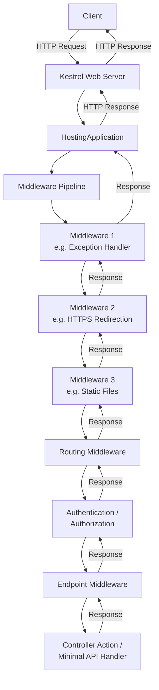

## Chapter 1: Hosting Model — How the Application Starts

### Generic Host Structure

ASP.NET Core applications are built on top of the **Generic Host** (`Microsoft.Extensions.Hosting`). When you call `WebApplication.CreateBuilder()`, the following happens internally:

```csharp
var builder = WebApplication.CreateBuilder(args);
// What happens internally:
// 1. Initialize HostApplicationBuilder
// 2. Configure Kestrel as the default web server
// 3. Load configuration sources (appsettings.json, env vars, etc.)
// 4. Set up logging providers
// 5. Initialize the DI container (ServiceCollection)
```

Let's look at the internal implementation of [`WebApplication.CreateBuilder()`](https://github.com/dotnet/aspnetcore/blob/main/src/DefaultBuilder/src/WebApplication.cs):

```csharp
// Simplified implementation from dotnet/aspnetcore
public static WebApplicationBuilder CreateBuilder(string[] args)
{
    var builder = new WebApplicationBuilder(
        new WebApplicationOptions { Args = args });
    return builder;
}
```

The `WebApplicationBuilder` constructor initializes in the following order:

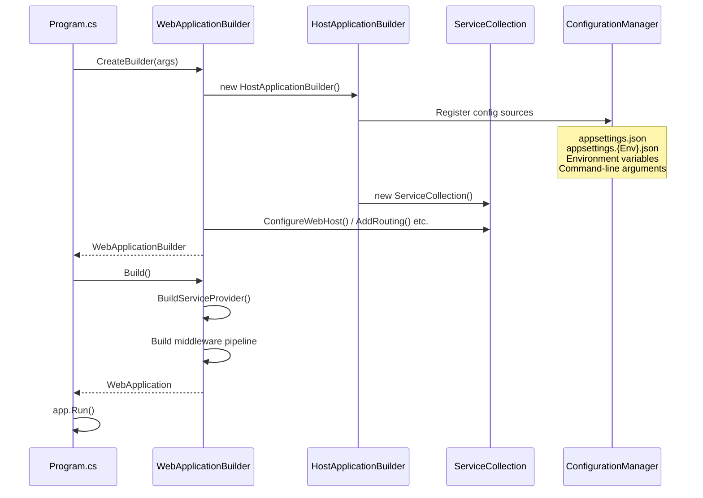

### Kestrel — High-Performance Web Server

Kestrel is ASP.NET Core's default in-process HTTP server. Having migrated from [libuv](https://libuv.org/) to its own I/O implementation, it now uses an **asynchronous I/O** architecture based on `System.IO.Pipelines` and `System.Net.Sockets`.

#### Kestrel Internals

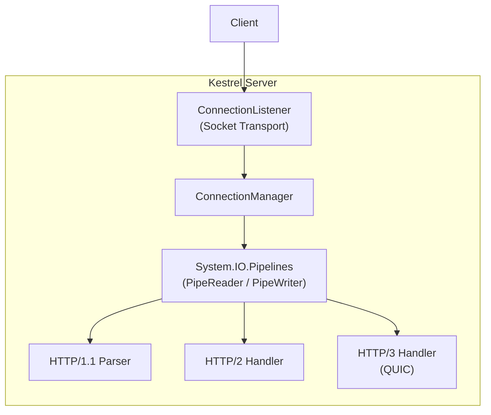

The key design choice in Kestrel is the adoption of **`System.IO.Pipelines`**. Traditional `Stream`-based APIs required frequent buffer copies when reading data. With `Pipelines`, data can be processed in a **near-zero-copy** manner through `ReadOnlySequence<byte>`.

```csharp
// Simplified image of Kestrel's HTTP/1.1 parser
while (true)
{
    // Read data from PipeReader (no copy needed)
    ReadResult result = await reader.ReadAsync();
    ReadOnlySequence<byte> buffer = result.Buffer;

    // Parse HTTP request line and headers
    if (TryParseRequest(buffer, out var consumed, out var examined))
    {
        reader.AdvanceTo(consumed, examined);
        break;
    }

    // Not enough data yet, wait for more
    reader.AdvanceTo(buffer.Start, buffer.End);
}
```

#### Connection Management and Concurrency

Kestrel manages each connection as an individual `Task`. With .NET's thread pool and `async/await`, a small number of OS threads can efficiently handle a large number of concurrent connections.

| Parameter | Default | Description |
|-----------|---------|-------------|
| `MaxConcurrentConnections` | `null` (unlimited) | Maximum concurrent connections |
| `MaxConcurrentUpgradedConnections` | `null` (unlimited) | Max upgraded connections (e.g. WebSocket) |
| `MaxRequestBodySize` | ~30 MB (30,000,000 bytes) | Maximum request body size |
| `RequestHeadersTimeout` | 30 seconds | Timeout for receiving request headers |
| `KeepAliveTimeout` | 130 seconds | Keep-alive connection timeout |

### Reverse Proxy Configuration

In production, Kestrel is typically placed behind a **reverse proxy** (Nginx, IIS, YARP, etc.) rather than being directly exposed.

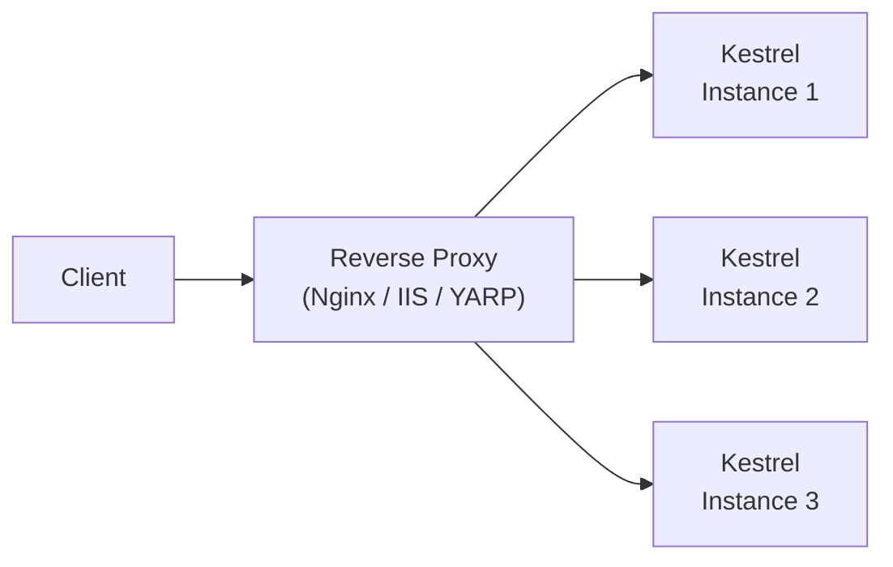

Responsibilities of the reverse proxy:

- **TLS Termination** — SSL/TLS encryption and decryption
- **Load Balancing** — Distributing load across multiple instances
- **Request Buffering** — Absorbing slow client transmissions
- **Static File Serving** — Responding without reaching Kestrel
- **Rate Limiting** — Mitigating DDoS attacks and abuse

## Chapter 2: Middleware Pipeline — The Request's Journey

### How Middleware Works

The core of ASP.NET Core's request processing is the **middleware pipeline**. Each middleware receives a `RequestDelegate` and returns a `RequestDelegate`, forming a **nested structure**.

```csharp
// RequestDelegate definition
public delegate Task RequestDelegate(HttpContext context);

// Basic middleware structure
public class MyMiddleware
{
    private readonly RequestDelegate _next;

    public MyMiddleware(RequestDelegate next)
    {
        _next = next;
    }

    public async Task InvokeAsync(HttpContext context)
    {
        // Request processing (before going downstream)
        Console.WriteLine("Before next middleware");

        await _next(context); // Call the next middleware

        // Response processing (after returning from downstream)
        Console.WriteLine("After next middleware");
    }
}
```

### Pipeline Construction Process

When `app.Build()` is called, registered middleware are chained in **reverse order**. This is known as the **Russian Doll (Matryoshka)** model.

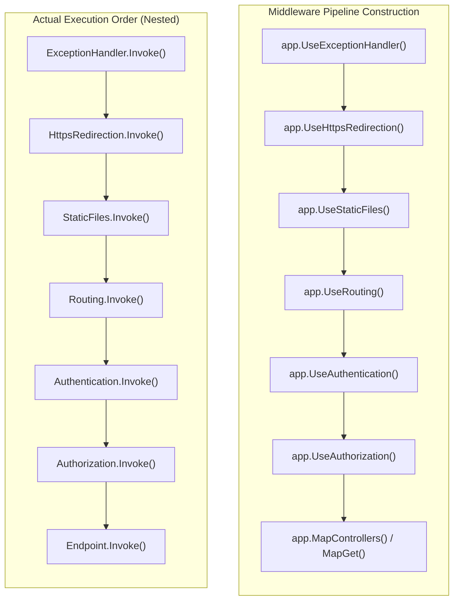

Internally, `ApplicationBuilder.Build()` performs the following:

```csharp
// Simplified implementation of ApplicationBuilder.Build()
public RequestDelegate Build()
{
    // Terminal: return 404 if no middleware handled the request
    RequestDelegate app = context =>
    {
        context.Response.StatusCode = 404;
        return Task.CompletedTask;
    };

    // Apply registered middleware in reverse order
    for (int i = _components.Count - 1; i >= 0; i--)
    {
        app = _components[i](app);
    }

    return app;
}
```

### Short-Circuiting

A middleware can **short-circuit** the pipeline by not calling `next()`. For example, the `StaticFiles` middleware returns a response directly when a matching file is found, without executing downstream middleware.

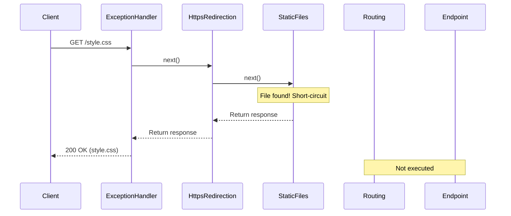

### Built-in Middleware Order

In ASP.NET Core, middleware **registration order** directly determines behavior. The recommended order is:

| Order | Middleware | Responsibility |
|-------|-----------|----------------|
| 1 | `ExceptionHandler` / `DeveloperExceptionPage` | Catch exceptions and convert to error responses |
| 2 | `HSTS` | Add HTTP Strict Transport Security header |
| 3 | `HttpsRedirection` | Redirect HTTP to HTTPS |
| 4 | `StaticFiles` / `MapStaticAssets` | Serve static files (can short-circuit). `MapStaticAssets` (.NET 9+) is recommended (build-time compression with fingerprinting) |
| 5 | `Routing` | Select endpoint based on URL |
| 6 | `RateLimiter` | Apply rate limiting policies |
| 7 | `Cors` | Apply Cross-Origin Resource Sharing policies |
| 8 | `Authentication` | User authentication (establish identity) |
| 9 | `Authorization` | User authorization (access control) |
| 10 | `OutputCache` | Response caching |
| 11 | Endpoint middleware | `MapGet()` / `MapControllers()` etc. |

## Chapter 3: Dependency Injection Container Internals

### ASP.NET Core's DI Container

ASP.NET Core includes a **built-in DI container** provided as the `Microsoft.Extensions.DependencyInjection` package. The framework itself is also built using this DI container.

#### Service Lifetimes

The DI container supports three lifetime types:

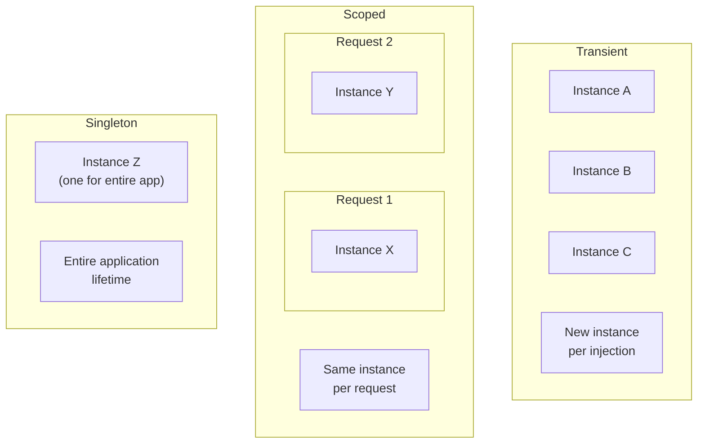

| Lifetime | Creation | Disposal |
|----------|----------|----------|
| **Transient** | New instance per injection | When scope ends |
| **Scoped** | On first request within scope | When scope ends (request ends) |
| **Singleton** | On first request | When application shuts down |

#### Captive Dependency Problem

**Critical pitfall**: When a Singleton service depends on a Scoped service, the Scoped service effectively becomes a Singleton. This is called a **captive dependency**.

```csharp
// Dangerous: Singleton depending on Scoped
services.AddSingleton<MySingleton>();
services.AddScoped<MyScopedService>();

public class MySingleton
{
    private readonly MyScopedService _scoped; // This reference leaks

    public MySingleton(MyScopedService scoped)
    {
        _scoped = scoped; // Held across requests!
    }
}
```

ASP.NET Core can detect this problem and throw an exception. When using `WebApplication.CreateBuilder()`, **`ValidateScopes` and `ValidateOnBuild` are enabled by default in the development environment** (since .NET 6). To enable them explicitly in production or when using a different host builder:

```csharp
builder.Host.UseDefaultServiceProvider(options =>
{
    options.ValidateScopes = true;  // Enabled by default in development
    options.ValidateOnBuild = true; // Validate dependencies at build time
});
```

### ServiceProvider Internals

How does the `ServiceProvider` resolve registered services internally?

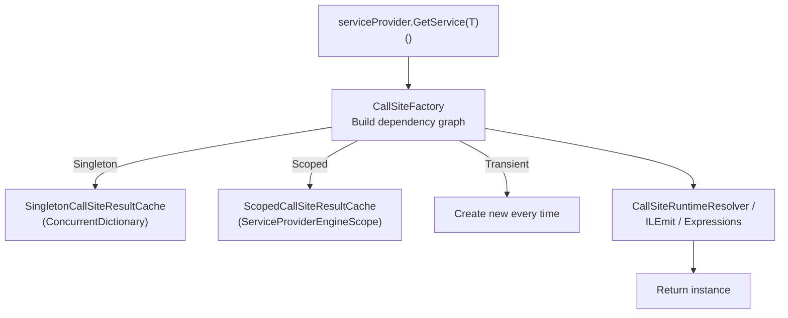

On first resolution, the `CallSiteFactory` builds a dependency graph (a **CallSite chain**). On subsequent resolutions, a compiled factory delegate is used for fast resolution.

```csharp
// Overview of ServiceProvider resolution process:
// 1. CallSiteFactory builds a CallSite tree from ServiceDescriptors
// 2. RuntimeResolver / CompiledResolver traverses CallSites to create instances
// 3. Results are stored in lifetime-appropriate caches

// Optimizations applied (continuously improved since .NET Core 3.0):
// - Dynamic compilation of factories via IL Emit
// - Expression tree to delegate conversion
// - Direct return of cached Singletons
```

### How Scopes Work

A new scope is created for each HTTP request, managed internally by `IServiceScopeFactory`.

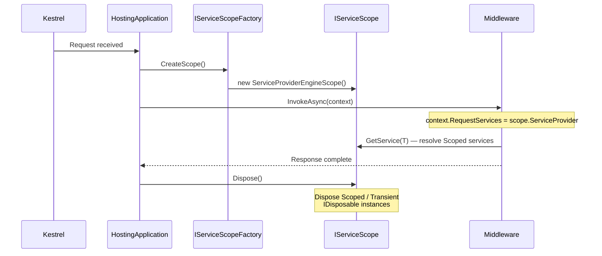

## Chapter 4: Routing System

### Endpoint Routing

Since **.NET Core 3.0**, ASP.NET Core uses **endpoint routing**. In this architecture, routing is split into two middleware:

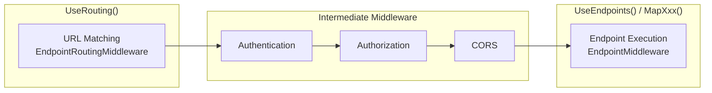

This separation allows authentication and authorization middleware to operate **knowing which endpoint was selected**.

### Route Matching Internals

The routing engine uses a **DFA (Deterministic Finite Automaton)** based matcher — a state machine that processes URL segments one by one.

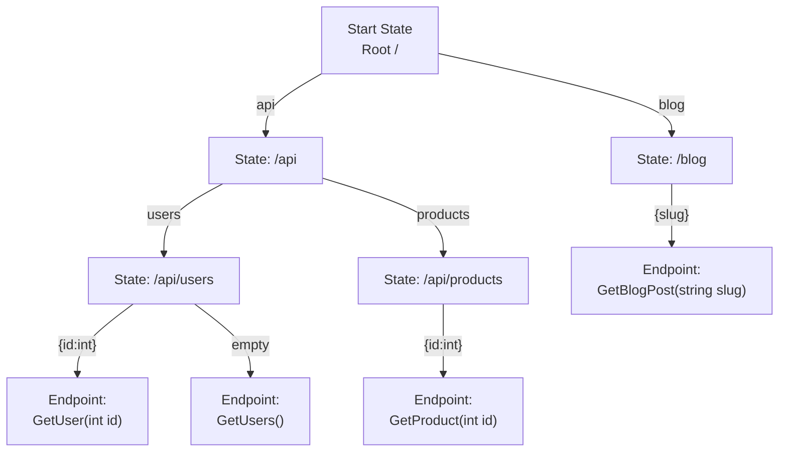

Key characteristics of the DFA matcher:

- **O(path segments)** time complexity for matching (no linear scan of all routes)
- Automaton is built from the route table at startup time
- Route parameter constraints (`{id:int}`) are evaluated during the matching phase

```csharp
// Route pattern examples and internal matching
app.MapGet("/api/users/{id:int}", (int id) => ...);
// Pattern: Literal("api") -> Literal("users") -> Parameter("id", IntConstraint)

app.MapGet("/api/users/{id:guid}", (Guid id) => ...);
// Pattern: Literal("api") -> Literal("users") -> Parameter("id", GuidConstraint)

// Same path with different constraints matches different endpoints:
// /api/users/42       → int version
// /api/users/abc-def  → guid version (if GUID-formatted)
```

### Minimal API vs Controllers

ASP.NET Core offers two programming models:

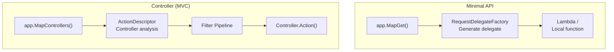

| Feature | Minimal API | Controller (MVC) |
|---------|------------|------------------|
| **Routing** | `app.MapGet/Post/Put/Delete()` | Attribute routing `[Route]` / Convention-based |
| **Model Binding** | `RequestDelegateFactory` auto-infers | `ModelBinder` + `ValueProvider` chain |
| **Filters** | Endpoint Filters (ASP.NET Core 7+) | Action / Result / Exception / Resource |
| **Best for** | Simple APIs, microservices | Complex apps, MVC with Views |
| **Startup speed** | Fast (minimal reflection) | Slightly slower (controller scan, descriptor building) |

## Chapter 5: Model Binding and Validation

### Model Binding Flow

**Model binding** is the process of converting raw HTTP request data (query strings, route parameters, forms, JSON body, etc.) into C# objects.

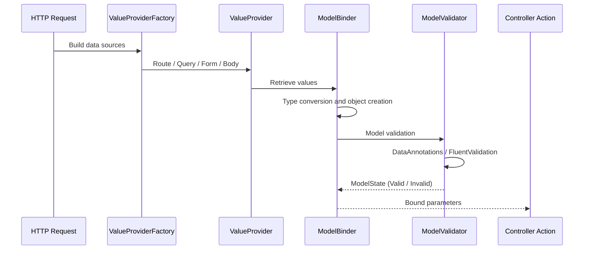

### Binding Source Types

By specifying attributes explicitly, data can be retrieved from the following sources. Note that the default search order without explicit attributes is: Form fields → Route data → Query string (request body is also included for `[ApiController]`).

1. **Form data** (`[FromForm]`)
2. **Request body** (`[FromBody]`) — processed via input formatters
3. **Route parameters** (`[FromRoute]`)
4. **Query string** (`[FromQuery]`)
5. **Headers** (`[FromHeader]`)
6. **Services (DI container)** (`[FromServices]`)

```csharp
// Explicitly specifying binding sources
[HttpPost("api/orders/{id}")]
public IActionResult UpdateOrder(
    [FromRoute] int id,           // URL: /api/orders/42
    [FromQuery] bool notify,      // Query: ?notify=true
    [FromBody] OrderDto order,    // Body: JSON
    [FromHeader(Name = "X-Correlation-Id")] string correlationId,
    [FromServices] IOrderService service)  // DI container
{
    // ...
}
```

### JSON Serialization: System.Text.Json

ASP.NET Core uses **System.Text.Json** by default. Here's a comparison with Newtonsoft.Json:

| Feature | System.Text.Json | Newtonsoft.Json |
|---------|-----------------|-----------------|
| **Performance** | Fast via `Utf8JsonReader/Writer` | Reflection-heavy |
| **Memory efficiency** | `Span<byte>`-based, minimal allocations | `string`-based |
| **Source Generator** | `JsonSerializerContext` for AOT | None |
| **Default behavior** | Strict (no comments, no trailing commas) | Lenient |
| **Polymorphism** | `[JsonDerivedType]` (.NET 7+) | `TypeNameHandling` (security risk) |

```csharp
// High-performance JSON serialization with Source Generator
[JsonSerializable(typeof(WeatherForecast))]
[JsonSerializable(typeof(List<WeatherForecast>))]
public partial class AppJsonContext : JsonSerializerContext { }

// Register in Program.cs
builder.Services.ConfigureHttpJsonOptions(options =>
{
    options.SerializerOptions.TypeInfoResolverChain
        .Insert(0, AppJsonContext.Default);
});
```

## Chapter 6: Filter Pipeline (MVC)

### Filter Execution Order

MVC filters allow inserting logic before and after action execution. Five filter types execute in a defined order:

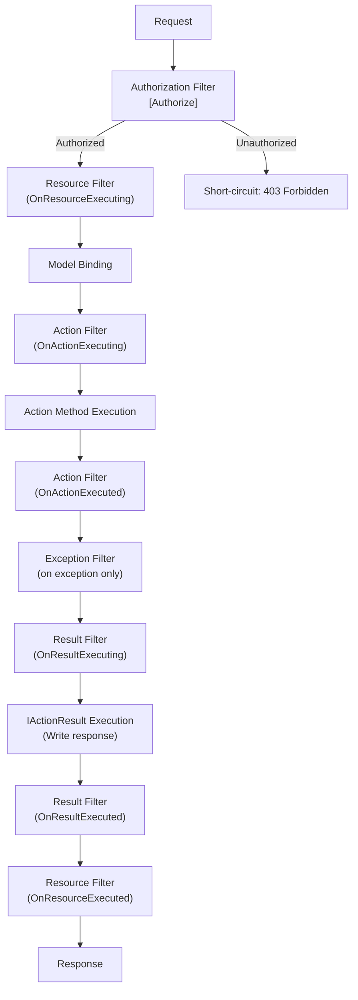

### Endpoint Filters (for Minimal API)

Instead of MVC filters, Minimal APIs have **Endpoint Filters** (ASP.NET Core 7+):

```csharp
app.MapGet("/api/users/{id}", (int id) => ...)
    .AddEndpointFilter(async (context, next) =>
    {
        var id = context.GetArgument<int>(0);
        if (id <= 0)
        {
            return Results.BadRequest("ID must be a positive integer");
        }

        // Execute the next filter or handler
        return await next(context);
    });
```

## Chapter 7: Configuration System

### Configuration Provider Chain

ASP.NET Core's configuration system retrieves settings from multiple sources, where **later sources override earlier ones**.

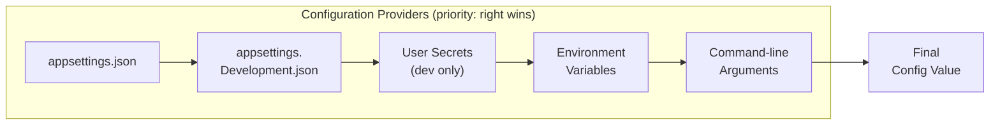

```csharp
// Accessing configuration values
// 1. Directly from IConfiguration
var connectionString = builder.Configuration
    .GetConnectionString("DefaultConnection");

// 2. Options pattern (recommended)
builder.Services.Configure<SmtpSettings>(
    builder.Configuration.GetSection("Smtp"));

// 3. Type-safe Options with validation
builder.Services.AddOptions<SmtpSettings>()
    .BindConfiguration("Smtp")
    .ValidateDataAnnotations()
    .ValidateOnStart(); // Validate at startup
```

### Three Options Interfaces

| Interface | Use Case | Reload Support |
|-----------|----------|---------------|
| `IOptions<T>` | Singleton. Value fixed at startup | No |
| `IOptionsSnapshot<T>` | Scoped. Latest value per request | Yes |
| `IOptionsMonitor<T>` | Singleton. Receives change notifications | Yes (`OnChange` callback) |

```csharp
// Real-time config monitoring with IOptionsMonitor
public class MyService
{
    private readonly IOptionsMonitor<MyConfig> _config;

    public MyService(IOptionsMonitor<MyConfig> config)
    {
        _config = config;
        _config.OnChange(newConfig =>
        {
            Console.WriteLine($"Config changed: {newConfig.SomeKey}");
        });
    }

    public string GetValue() => _config.CurrentValue.SomeKey;
}
```

## Chapter 8: Authentication and Authorization

### Authentication Schemes and Handlers

ASP.NET Core's authentication system uses a **scheme-based** architecture.

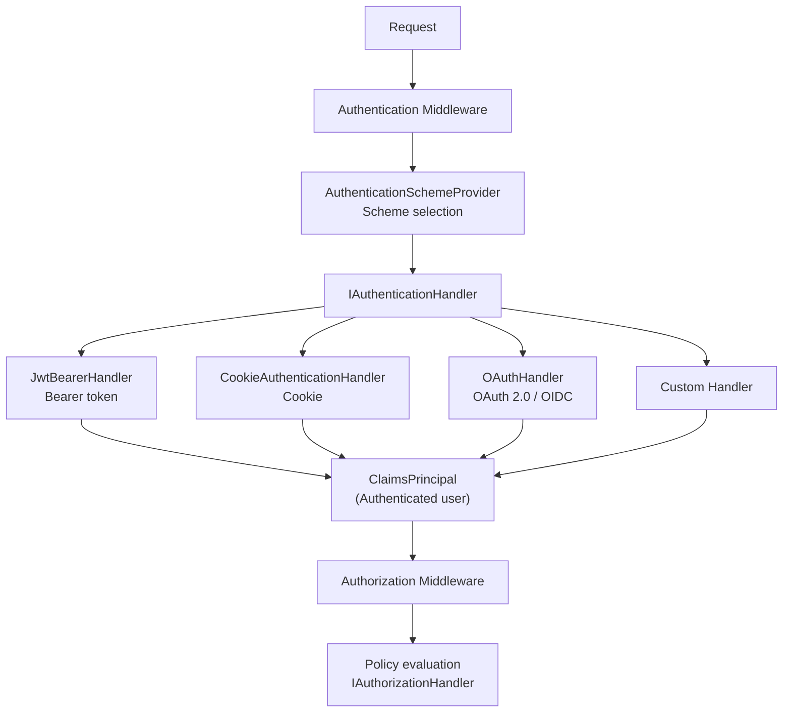

#### Authentication Processing Flow

```csharp
// Simplified AuthenticationMiddleware implementation
public async Task InvokeAsync(HttpContext context)
{
    // 1. Attempt authentication with the default scheme
    var result = await context.AuthenticateAsync();

    if (result.Succeeded)
    {
        // 2. Set ClaimsPrincipal on HttpContext
        context.User = result.Principal;
    }

    // 3. Pass to next middleware (typically Authorization)
    await _next(context);
}
```

### Policy-Based Authorization

Authorization is flexibly composed with policies and requirements:

```csharp
// Define custom authorization policies
builder.Services.AddAuthorization(options =>
{
    options.AddPolicy("AdminOnly", policy =>
        policy.RequireRole("Admin"));

    options.AddPolicy("MinimumAge", policy =>
        policy.Requirements.Add(new MinimumAgeRequirement(18)));
});

// Custom AuthorizationHandler
public class MinimumAgeHandler
    : AuthorizationHandler<MinimumAgeRequirement>
{
    protected override Task HandleRequirementAsync(
        AuthorizationHandlerContext context,
        MinimumAgeRequirement requirement)
    {
        var birthDateClaim = context.User.FindFirst("birth_date");
        if (birthDateClaim is null)
        {
            return Task.CompletedTask; // Fail (don't explicitly Succeed)
        }

        var birthDate = DateOnly.Parse(birthDateClaim.Value);
        var age = DateOnly.FromDateTime(DateTime.Today)
            .DayNumber - birthDate.DayNumber;

        if (age / 365 >= requirement.MinimumAge)
        {
            context.Succeed(requirement);
        }

        return Task.CompletedTask;
    }
}
```

## Chapter 9: HttpContext — All Request Information

### HttpContext Structure

`HttpContext` holds all information related to a single HTTP request/response cycle.

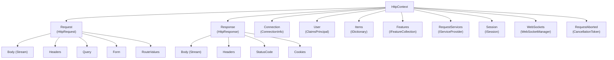

### Feature Collection

`HttpContext.Features` is an **extension point** where servers and middleware can inject additional capabilities.

```csharp
// Examples of features provided by Kestrel
var connectionFeature = context.Features
    .Get<IHttpConnectionFeature>();
var localIp = connectionFeature?.LocalIpAddress;

// HTTP response trailers (trailing headers sent after the response body)
var trailersFeature = context.Features
    .Get<IHttpResponseTrailersFeature>();

// Request timeout (.NET 8+)
var timeoutFeature = context.Features
    .Get<IHttpRequestTimeoutFeature>();
timeoutFeature?.DisableTimeout();
```

## Chapter 10: Performance Optimization Architecture

### Object Pool

ASP.NET Core **pools** frequently used objects to reduce GC pressure.

```csharp
// StringBuilder pooling example
var pool = serviceProvider
    .GetRequiredService<ObjectPool<StringBuilder>>();

var sb = pool.Get();
try
{
    sb.Append("Hello ");
    sb.Append("World");
    return sb.ToString();
}
finally
{
    pool.Return(sb); // Return to pool (auto-cleared)
}
```

### ArrayPool and MemoryPool

`System.Buffers.ArrayPool<T>` manages array rental and return, reducing heap allocations from large numbers of short-lived arrays.

```csharp
// Buffer management pattern used inside Kestrel
byte[] buffer = ArrayPool<byte>.Shared.Rent(4096);
try
{
    int bytesRead = await stream.ReadAsync(
        buffer.AsMemory(0, 4096));
    ProcessData(buffer.AsSpan(0, bytesRead));
}
finally
{
    ArrayPool<byte>.Shared.Return(buffer);
}
```

### Response Compression

The response compression middleware automatically compresses responses based on the `Accept-Encoding` header.

```csharp
builder.Services.AddResponseCompression(options =>
{
    options.EnableForHttps = true; // Compress over HTTPS too
    options.Providers.Add<BrotliCompressionProvider>();
    options.Providers.Add<GzipCompressionProvider>();
});

builder.Services.Configure<BrotliCompressionProviderOptions>(
    options => options.Level = CompressionLevel.Fastest);
```

### Performance Features (.NET 8 and Later)

#### .NET 8

| Feature | Description |
|---------|-------------|
| **Native AOT** | No JIT needed. Dramatically reduces startup time and memory |
| **Request Delegate Generator** | Compile-time generation of Minimal API delegates |
| **Frozen Collections** | Optimized read-only collections via `FrozenDictionary` / `FrozenSet` |
| **SearchValues** | SIMD-optimized string searching |
| **Interceptors** | Compile-time method call interception |
| **CompositeFormat** | Pre-parsed `string.Format` format strings |

#### .NET 9

| Feature | Description |
|---------|-------------|
| **MapStaticAssets** | Build-time compressed static file serving with fingerprinting (recommended replacement for `UseStaticFiles`) |
| **HybridCache** | Unified caching library combining `IDistributedCache` and `IMemoryCache` with stampede protection |
| **Keyed DI in Middleware** | Support for `[FromKeyedServices]` in middleware constructors and `Invoke` methods |
| **SignalR Native AOT** | SignalR client and server support for trimming and Native AOT |

#### .NET 10

| Feature | Description |
|---------|-------------|
| **Minimal API Validation** | Built-in DataAnnotations validation via `AddValidation()` |
| **Server-Sent Events** | Return SSE streams with `TypedResults.ServerSentEvents` |
| **OpenAPI 3.1** | OpenAPI document generation with JSON Schema draft 2020-12 |
| **Memory Pool Eviction** | Automatic memory release in Kestrel / IIS / HTTP.sys pools when idle |
| **JSON Patch (System.Text.Json)** | High-performance JSON Patch without Newtonsoft.Json |

## Chapter 11: Error Handling Architecture

### Exception Handling Hierarchy

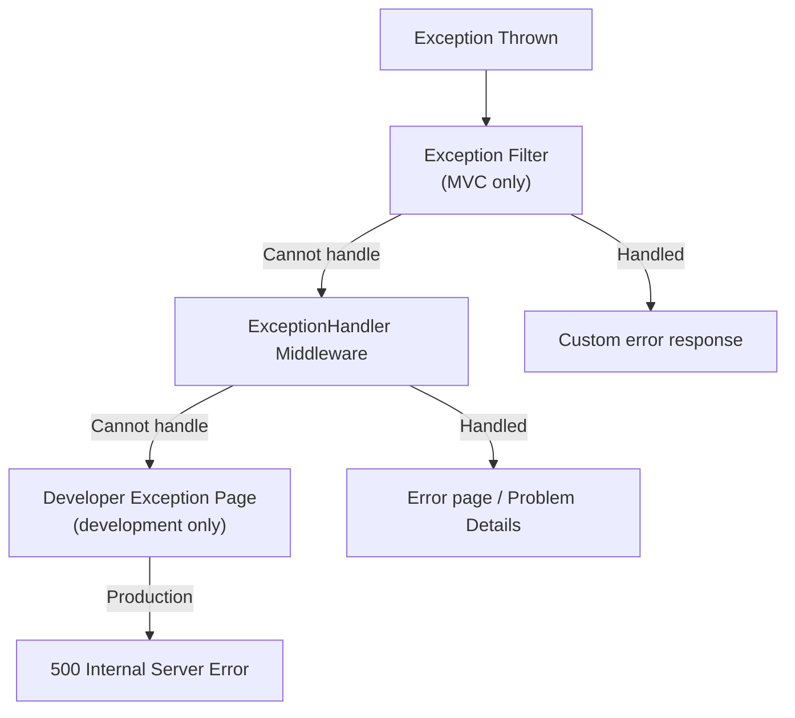

### Problem Details (RFC 9457)

Since ASP.NET Core 7, returning [RFC 9457 (Problem Details)](https://www.rfc-editor.org/rfc/rfc9457)-compliant error responses is straightforward:

```csharp
// Enable Problem Details globally
builder.Services.AddProblemDetails(options =>
{
    options.CustomizeProblemDetails = context =>
    {
        context.ProblemDetails.Extensions["traceId"] =
            context.HttpContext.TraceIdentifier;
    };
});

// With exception handler
app.UseExceptionHandler();
app.UseStatusCodePages();

// Example response:
// {
//   "type": "https://tools.ietf.org/html/rfc9110#section-15.5.5",
//   "title": "Not Found",
//   "status": 404,
//   "traceId": "00-abc123-def456-01"
// }
```

## Chapter 12: Testing Architecture

### WebApplicationFactory

ASP.NET Core provides `WebApplicationFactory`, which can start the entire application in-memory, enabling integration testing without actual network communication.

```csharp
public class ApiTests : IClassFixture<WebApplicationFactory<Program>>
{
    private readonly HttpClient _client;

    public ApiTests(WebApplicationFactory<Program> factory)
    {
        _client = factory.WithWebHostBuilder(builder =>
        {
            builder.ConfigureServices(services =>
            {
                // Replace services for testing
                services.AddScoped<IEmailService, FakeEmailService>();
            });
        }).CreateClient();
    }

    [Fact]
    public async Task GetUsers_ReturnsOk()
    {
        var response = await _client.GetAsync("/api/users");
        response.EnsureSuccessStatusCode();

        var users = await response.Content
            .ReadFromJsonAsync<List<UserDto>>();
        Assert.NotEmpty(users);
    }
}
```

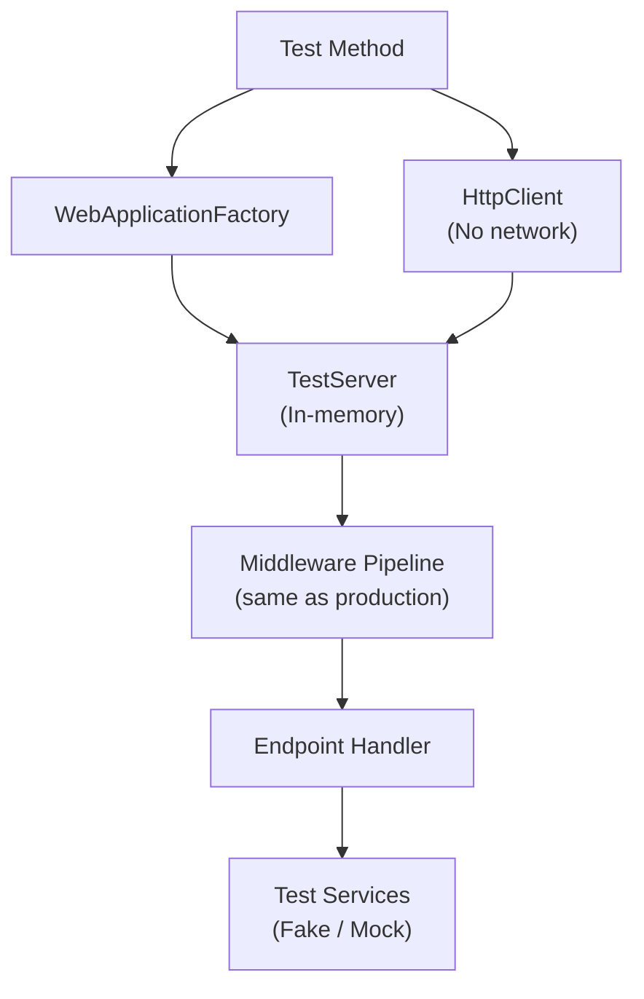

## Summary: The Lifetime of a Request

Finally, let's trace the complete journey of a single HTTP request:

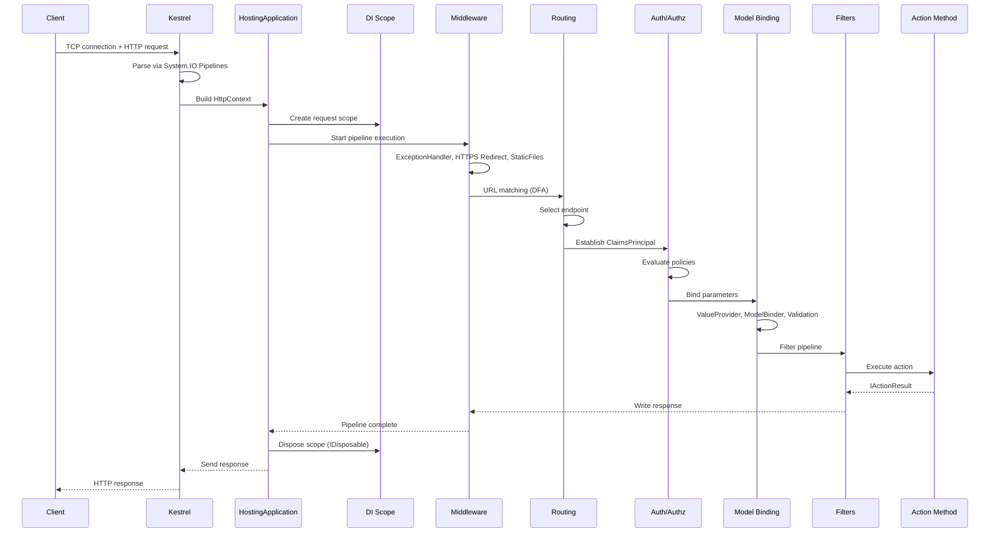

## References

- [ASP.NET Core Official Documentation](https://learn.microsoft.com/aspnet/core/)
- [ASP.NET Core Source Code (GitHub)](https://github.com/dotnet/aspnetcore)
- [.NET Runtime Source Code (GitHub)](https://github.com/dotnet/runtime)
- [Kestrel Internals — Steve Gordon](https://www.stevejgordon.co.uk/building-asp-net-core-kestrel)
- [ASP.NET Core Performance Best Practices](https://learn.microsoft.com/aspnet/core/performance/performance-best-practices)
- [RFC 9457 — Problem Details for HTTP APIs](https://www.rfc-editor.org/rfc/rfc9457)
