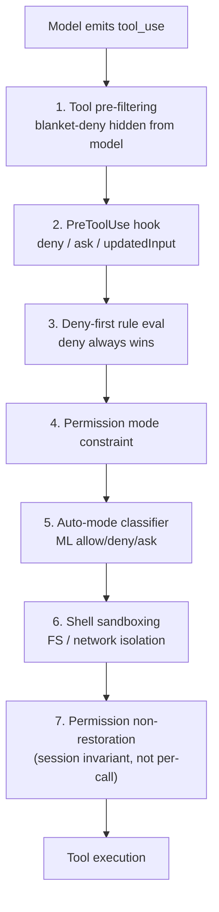

> **Source paper**: Liu, Zhao, Shang, Shen (MBZUAI / UCL).
> [_Dive into Claude Code: The Design Space of Today's and Future AI Agent Systems_](https://arxiv.org/abs/2604.14228) — arXiv:2604.14228, 2026-04-14.
> [GitHub: VILA-Lab/Dive-into-Claude-Code](https://github.com/VILA-Lab/Dive-into-Claude-Code)

## Introduction — Why you should care about what's inside a production agent

The landscape of software development has shifted dramatically in 2026. The era when GitHub Copilot simply suggested code fragments at your cursor position feels distant. Through the "chat-integrated" phase of Cursor and Windsurf — conversing with your IDE while editing multiple files — we've now entered the **Agentic CLI** era. Claude Code, Codex CLI, and Aider run shell commands, rewrite your filesystem, execute tests, and autonomously decide their next move based on results. Beyond that, fully autonomous systems like Devin, SWE-Agent, and OpenHands operate in sandboxes with near-zero human supervision.

Amid this rapid evolution, most discussion has focused on **model intelligence**. Which model solves what percentage of SWE-bench? What's the HumanEval score? But engineers on the ground are noticing something different: **the same model produces wildly different outcomes depending on the tool wrapping it**. The model is necessary but not sufficient — so what makes the difference?

In April 2026, a research group at MBZUAI and UCL answered that question head-on. They read Anthropic's Claude Code (v2.1.88) **line by line** — approximately 1,884 TypeScript files totaling 512,000 lines of code — and reverse-engineered its entire architecture.

Their most striking finding is simple but profound:

> **An estimated 1.6% of Claude Code's codebase is AI decision logic. The remaining 98.4% is deterministic operational harness.** (Tier C estimate from community analysis)

This is a line-count metric, not a value-attribution claim (swap Claude for a weaker model and the same harness collapses). But the message is clear: **the real design space of a production AI agent lies outside the model**.

This post reconstructs the paper's essence for **engineers building AI agent systems**, enriching each design decision with contextual background. Rather than following the paper section by section, we organize around the questions "Why was it built this way?" and "What does this mean for our products?"

The paper threads a running example — **"Fix the failing test in `auth.test.ts`"** — through its analysis. We do the same. Start with the interactive demo below to feel how one revolution of `queryLoop()` flows through each subsystem.

<ClaudeCodeLoopVisualizer />

---

## I. The North Star — Five Values and the "Don't Constrain the Model" Philosophy

Every software architecture embeds values, whether consciously or not. The paper begins by extracting **five human values** from Anthropic's public docs, blogs, and internal surveys — values that serve as the north star running through the entire architecture.

**Human Decision Authority**: humans retain ultimate control, organized through a principal hierarchy (Anthropic → operator → user, a formal authority chain). When Anthropic found that 93% of permission prompts get approved, the response wasn't "add more warnings" but "restructure the problem" — introducing sandboxes and ML classifiers to define boundaries within which the agent works freely. **Guaranteeing human authority by not assuming human attention** is the paradox at the heart of this value.

**Safety, Security, and Privacy**: the system protects even when the human is inattentive. The auto-mode threat model explicitly targets four risk categories: overeager behavior, honest mistakes, prompt injection, and model misalignment.

**Reliable Execution**: doing what was actually meant, staying coherent over time. Anthropic's harness design guidance notes that "agents tend to respond by confidently praising the work" even when quality is mediocre — motivating separation of generation from evaluation.

**Capability Amplification**: qualitatively expanding what humans can do. About 27% of Claude Code-assisted tasks were work that wouldn't have been attempted without the tool. Not faster — **new kinds of work become possible**.

**Contextual Adaptability**: growing with the project over time. Auto-approve rates rise from ~20% at fewer than 50 sessions to over 40% by 750 sessions — trust is "co-constructed by the model, the user, and the product."

These five values flow through **13 design principles**. The most architecturally consequential is **"Minimal scaffolding, maximal operational harness"**: rather than constraining the model's decisions through planners or state graphs (LangGraph-style), **let the model decide freely and surround it with deterministic walls**. This is the philosophy behind 1.6% / 98.4%.

The paper also introduces **"Long-term Capability Preservation"** as an evaluative lens — not part of Claude Code's stated design values, but used later to critically examine whether coding agents erode developer understanding and skills. This perspective is rare in production agent discussions and represents a significant contribution (see §X for supporting empirical data).

> **Industry implication #1**: Audit your own agent product against these 5 values. Many startups are all-in on Capability Amplification but neglect the Safety ↔ Authority balance, falling into the approval fatigue trap.

---

## II. Inside the Loop — Tracing One Task Through queryLoop()

### "Everything flows into queryLoop()"

Claude Code has multiple interfaces (Interactive CLI, Headless CLI, Agent SDK, IDE integration), but **all converge on a single `queryLoop()` function**. The difference is only the rendering layer. `QueryEngine` (`QueryEngine.ts`, 47KB) is a conversation wrapper for SDK/headless surfaces — not the engine itself. The interactive CLI bypasses `QueryEngine` and calls `query()` directly. **The shared code path is the loop function, not the class.**

### One turn in 9 steps

The core of `query.ts` (68KB) is `queryLoop()`, an async generator implementing a while-true loop. Tracing our running example ("Fix the failing test in auth.test.ts"):

1. **Settings resolution** — destructure system prompt, permission callback, model config
2. **State initialization** — a single State object with messages, tool context, compaction tracking. The loop's 7 continue points overwrite this object via whole-object assignment (no field-level mutation)
3. **Context assembly** — retrieve messages from the last compact boundary forward
4. **Five pre-model context shapers run sequentially** (detailed below)
5. **`callModel()` streams via `for await`** — the model emits `Bash { command: "npm test auth.test.ts" }`
6. **tool_use blocks dispatched** to StreamingToolExecutor
7. **Permission gate** — 7-layer deny-first evaluation (§III)
8. **Execute → append tool_result** — test failure log enters the conversation
9. **Text-only response → turn ends; tool_use → loop continues**

This is a textbook ReAct pattern (Reason → Act → Observe, iteratively; Yao et al., 2022). No LangGraph-style graph routing, no LATS-style tree search — **simple while-true, commit and don't backtrack**. This trades search completeness for latency and simplicity.

### Five stop conditions

The loop exits on: (1) text-only response (primary path), (2) `maxTurns` reached, (3) `prompt_too_long` with failed recovery, (4) PostToolUse hook sets `hook_stopped_continuation`, (5) `abortController` signal fires.

This design directly addresses the **compound error problem** (Huyen, 2025): at 95% per-step accuracy, a 100-step task succeeds only 0.6% of the time.

### Concurrent tool execution

`StreamingToolExecutor` runs read-only tools **in parallel** and serializes state-modifying tools. Output order preserves the original tool_use order. Two coordination mechanisms — a **sibling abort controller** (terminates in-flight processes on any Bash error) and a **progress-available signal** — manage concurrency safely. The whole thing is an `AsyncGenerator` yielding `StreamEvent`, `Message`, and other types, enabling **streaming UI output with single synchronous control flow**.

### The 5-stage compaction pipeline

One of the paper's biggest architectural insights: making compaction **multi-stage**.

The context window is not "a box for data" — it's a **scarce computational resource**. Claude Code manages it through a graduated pipeline, trying cheap compression first and escalating only when needed — **lazy degradation**.

| Stage | Name | What it trims | Note |
|---|---|---|---|
| 1 | **Budget reduction** | Oversized tool results | Always on; replaced with content references |
| 2 | **Snip** | Older history segments | Feature-flagged; lightweight trim |
| 3 | **Microcompact** | Fine-grained, cache-aware | Defers boundary until after API response to avoid breaking Anthropic's prompt cache prefix (breaking it forces a re-creation charge) |
| 4 | **Context collapse** | Read-time projection over history | Original transcript untouched |
| 5 | **Auto-compact** | Model-generated summary | Last resort if 1–4 didn't free enough |

A source-code comment from January 2026 reveals: disabling prompt cache reuse results in **98% cache miss, costing ~0.76% of fleet cache_creation**. Compression algorithms and API billing are directly coupled in production agent design.

Beyond the 5-stage pipeline, four additional context-conservation mechanisms operate: CLAUDE.md lazy loading, deferred tool schemas via ToolSearch, subagent summary-only return, and per-tool-result budget.

> **Industry implication #2**: At minimum, implement per-tool-result budget, session-wide token monitoring, a fallback model, and a small fixed retry budget for output-cap errors. Claude Code's retry count (3) is calibrated for their workload, not a universal constant. But "try cheap compression first, escalate only when needed" is a universally applicable principle.

---

## III. Safety as Architecture — The 7-Layer Permission Gate

### What "93% approve" really means

Anthropic's auto-mode analysis (2026) found that users approve 93% of permission prompts — evidence that **interactive confirmation stops working as a safety mechanism once habituated**. Longitudinal data reinforces this: auto-approve rates rise from ~20% (fewer than 50 sessions) to 40%+ (over 750 sessions). Trust transitions through **gradual habituation**, not deliberate mode selection. Sandboxing reduced prompt frequency by an estimated 84% — reframing the problem from "get more approvals" to "reduce the number of decisions humans must make."

Claude Code chose **multi-layered per-action policy enforcement** rather than coarse-grained Docker sandboxing (SWE-Agent/OpenHands) or git-based rollback (Aider).

### Seven permission modes

From `plan` (user approves all plans) through `default`, `acceptEdits`, `auto` (ML classifier, feature-gated), `dontAsk`, `bypassPermissions`, to `bubble` (internal subagent escalation) — 7 modes spanning a graduated autonomy spectrum.

### Seven independent safety layers



Every layer is independent. **Any single layer can block.**

### Four handler paths

The permission handler (`useCanUseTool.tsx`) branches into 4 paths: (1) **Coordinator** — multi-agent coordination with automated resolution before user fallback; (2) **Swarm worker** — swarm-specific resolution; (3) **Speculative classifier** — pre-started classification races a timeout, approving instantly on high confidence; (4) **Interactive** — standard approval dialog.

Critically, **denial is a routing signal, not a hard stop**. The model receives the denial reason and attempts a safer alternative in the next iteration. Permission enforcement **shapes** agent behavior rather than halting it.

### The auto-mode classifier tension

The auto-mode classifier (`yoloClassifier.ts`) evaluates proposed tool_use against the transcript and a permission template, returning allow / deny / ask — **a separate LLM call**. This creates a structural tension: the safety layer itself incurs token and latency costs shared with the main loop. An independent security audit (Adversa AI, 2026) reported that commands with more than 50 subcommands skip per-subcommand deny checks, falling back to a single generic prompt due to parsing overhead. **Defense in depth works only when layers have independent failure modes.**

### The temporal ordering vulnerability

The paper's most important safety insight: project initialization (hooks, MCP servers, settings) runs **before** the trust dialog. This pre-trust window sits **outside** the deny-first pipeline, and multiple independently verified CVEs share this single root. **Spatial layered diagrams hide temporal properties** — always ask "in what order, and when, does each component become active?"

### Shell sandbox orthogonality

The shell sandbox (`shouldUseSandbox.ts`) operates on a **different axis** from the permission system — authorization vs isolation. A command can be permission-approved but still sandboxed. This independence is the true meaning of defense in depth.

> **Industry implication #3**: "Deny-first" alone gives you friction without safety. You need deny-first + classifier/sandbox + temporal awareness. For MCP/plugin integrations, require extension manifests to declare an **activation phase** (`pre-trust-init` / `post-trust-init` / `per-turn`).

---

## IV. Extending Without Exploding — Four Mechanisms by Context Cost

### Why four, not one

The temptation to unify extension mechanisms is strong. Claude Code resists it because **context-window cost differs per mechanism**, and unifying forces unfair trade-offs on extension authors.

| Mechanism | Context cost | Injection point | What it provides |
|---|---|---|---|
| **Hooks** | **Zero** | `execute()` | Lifecycle interception |
| **Skills** | **Low** | `assemble()` | Domain instructions + meta-tool |
| **Plugins** | **Medium** | All 3 points | Multi-component packaging |
| **MCP servers** | **High** | `model()` | External service integration (MCP = Model Context Protocol) |

### Three injection points

The agent loop has three injection points: (a) `assemble()` controls what the model sees, (b) `model()` controls what it can reach, (c) `execute()` controls whether and how actions run. The four mechanisms connect at different points — Hooks touch only `execute()`, Skills only `assemble()`, MCP only `model()`, Plugins can touch all three.

### 27 hook events

27 hook event types span tool authorization (5), session lifecycle (5), user interaction (3), subagent coordination (5), context management (4), workspace events (4), and notification. 15 have rich output schemas. Implementation types: shell command, LLM prompt, HTTP, agentic verifier agent, callback.

An important implementation detail: **MCP and non-MCP tools have different hook timing**. For non-MCP tools, `tool_result` emits before PostToolUse hook fires. For MCP tools, result emission is deferred until after hooks complete, enabling `updatedMCPToolOutput` to rewrite outputs.

> **Industry implication #4**: With MCP donated to the Linux Foundation's Agentic AI Foundation, the debate — "separate mechanisms by cost, or one unified API with cost annotations?" — needs to happen at the ecosystem level. Claude Code bets that **separate mechanisms force authors to confront cost**.

---

## V. Remembering — CLAUDE.md and Context Construction Strategy

### Guidance vs enforcement separation

The most important design choice in Claude Code's memory system: **CLAUDE.md content is injected as a user message, not system prompt**. Model compliance is **probabilistic**. Deterministic enforcement lives in permission rules. "Guidance" (probabilistic) and "enforcement" (deterministic) are architecturally separated.

### Four-level CLAUDE.md hierarchy

```text
/etc/claude-code/CLAUDE.md    ← OS-level managed memory (policy)
~/.claude/CLAUDE.md           ← user memory (global)
<project>/CLAUDE.md           ← project memory (committed)
<project>/CLAUDE.local.md     ← local memory (gitignored)
```

Files load in "reverse priority order" (later-loaded = more model attention). Nested directories below CWD load **lazily** — only when the agent reads files there. The instruction set **evolves during conversation** as the agent explores the codebase.

Memory retrieval uses an LLM-based scan of file headers (up to 5 files, file granularity), trading embedding-based selectivity for inspectability.

### Assembly order and late injection

Nine sources assemble in a specific order, from system prompt through compact summaries. Relevant-memory prefetch, MCP instruction deltas, and agent listing deltas are added **after** the main window is built — the context window is not static at assembly time but can grow during the turn.

> **Industry implication #5**: Treat the context window as a **scarce computational resource** at the center of your design. Try cheap, non-destructive compression first. Make escalation conditions explicit (lazy degradation). Lost information should be inspectable by users.

---

## VI. Delegating — Subagent Design and Multi-Agent Reality

`AgentTool` is a meta-tool that **spawns new isolated contexts** (unlike `SkillTool`, which injects into the current context). Six built-in subagent types (Explore, Plan, General-purpose, Claude Code Guide, Verification, Statusline-setup) plus custom agents via `.claude/agents/*.md` with full configuration (tools, model, permissions, hooks, isolation mode).

Three isolation modes: **worktree** (FS isolation via git worktree, zero Docker dependency), **remote** (Claude Code Remote, internal-only), **in-process** (default, FS shared, context isolated).

Permission override follows specific cascade rules: parent modes like `bypassPermissions` always take precedence over subagent overrides. Two-tier permission scoping separates SDK-level (preserved) from session-level (replaceable) permissions.

Each subagent writes separate `.jsonl` + `.meta.json` files; only **summaries** return to the parent context. Agent teams consume approximately **7× the tokens** of a standard session in plan mode, making summary-only return critical.

Multi-instance coordination uses **file locking** — no message broker needed. Zero-dependency deployment + full debuggability. However, file locking is fragile on network filesystems — this works because Claude Code is a **single-user CLI**.

> **Industry implication #6**: Don't default to message brokers for multi-agent coordination. File lock + JSONL is operationally powerful when debuggability matters most. But switch to different primitives for distributed deployments.

---

## VII. Persisting — "Trust Cannot Be Carried Forward"

Two design principles govern persistence:

> **Conversations Outlive Context** — a session's useful life isn't capped by the context window. Disk transcripts record everything; compaction recycles the live view without ending the conversation.
>
> **Conversations Outgrow a Single Path** — sessions aren't trapped on a single trajectory. Append-only transcripts enable rewind, resume, and fork.

Three channels: session transcripts (project-scoped JSONL), global prompt history (`history.jsonl`), and subagent sidechains. The core commitment is **append-only** — past lines are never modified or deleted. Compact boundary markers with `headUuid / anchorUuid / tailUuid` enable read-time chain patching.

The most important safety decision: **`--resume` does not restore session-scoped permissions**. Trust must be established per session — accepting user friction over stale trust risk.

---

## VIII. The Mirror — What OpenClaw Reveals About the Design Space

The paper compares Claude Code with OpenClaw (a multi-channel personal-assistant gateway daemon) across six dimensions, showing that **the same design questions produce different answers under different deployment contexts**.

Claude Code is an ephemeral CLI with per-action deny-first; OpenClaw is a persistent WebSocket daemon with perimeter-level access control. Claude Code's `queryLoop()` is the system center; OpenClaw embeds its agent runtime inside a gateway dispatch layer. Claude Code stratifies 4 extension mechanisms by context cost; OpenClaw uses manifest-first plugins with 12 capability types.

The most interesting finding: **composability**. OpenClaw can host Claude Code as a coding harness via ACP (Agent Client Protocol). The two aren't exclusive alternatives — they're **layers**. The AI agent design space is not a flat taxonomy but a **layered taxonomy**.

---

## IX. Inescapable Tensions and Cross-Cutting Patterns

### Five structural tensions

Pursuing all five values creates tensions: Authority ↔ Safety (approval fatigue vs protection); Safety ↔ Capability (performance vs defense depth); Adaptability ↔ Safety (extensibility vs attack surface from pre-trust CVEs); Capability ↔ Adaptability (proactivity +12–18% tasks but preference drops at high frequencies — see KAIROS below); Capability ↔ Reliability (bounded context prevents full codebase awareness).

### Three recurring patterns

Reading across all subsystems: **Graduated layering** (safety, context, extensions all use graduated independent mechanism stacks), **Append-only** (auditability over query power), **Model judgment within deterministic harness** (1.6% decision-logic ratio — the harness enables rather than constrains).

The third pattern's trade-off is concrete: an agent fixing a test file might duplicate a utility function from a distant module it hasn't seen — locally correct but globally accumulating tech debt.

### KAIROS — proactive architecture

The feature-gated KAIROS system implements a persistent background agent with tick-based heartbeats, terminal focus awareness (maximize autonomy when user is away), and economic throttling via `SleepTool` (prompt cache expires after 5 minutes, making sleep/wake an explicit cost optimization). It addresses the Capability ↔ Adaptability tension: proactive AI improves task completion by 12–18% but drops user preference to 47% in the high-frequency Persistent Suggest variant (Chi et al., 2025). Production status unconfirmed.

---

## X. What the Data Says — Empirical Early Signals

The paper generates empirical predictions and cites adjacent research:

- **807-repo causal analysis of Cursor** (He et al., 2026): code complexity +40.7% (per He et al.), initial velocity gains dissipate by month 3. **Gains are self-cancelling.**
- **304,000 AI-authored commit audit** (Liu et al., 2026): security issues persist at substantially higher rates
- **16-developer RCT** (METR/Becker et al., 2025): AI made developers **19% slower** (perceived improvement: +20%). N=16 is small but "output-count KPIs ≠ end-to-end productivity" is universally applicable
- **EEG study of 54 participants** (Kosmyna et al., 2025): weakened neural connectivity persisted after AI removal
- **17% lower comprehension scores** under AI assistance (Shen et al., 2026)
- **25% decline in entry-level tech hiring** 2023→2024 (Rak et al., 2025)

Not direct evidence against Claude Code's architecture, but **structural problems common to any bounded-context, tool-use-loop agent system**. Each is a single study with non-trivial confounders; rather than treating any one as ground truth, read the *pattern* as a reason to measure your own organization.

> **Industry implication #7**: If "productivity goes up" is the only KPI, organizations get thinner over years. Track the ratio of agent-initiated PRs that ship without human edits vs those requiring substantive review. Build code-complexity and tech-debt monitoring into CI. Include developer comprehension measurement in your design space.

---

## XI. Six Open Questions for the Next Decade

**1. Silent failure and the observability–evaluation gap**: observability at 89% adoption vs offline evaluation at 52.4% (LangChain 2026). 78% of failures are invisible (Bessemer 2026). Where does generator-evaluator separation belong?

**2. Persistence and longitudinal colleague relationships**: what belongs between static CLAUDE.md and single-session transcripts? MemGPT, Mem0, AgentWorkflowMemory, Reflexion, AMem — Hu et al. (2025) position agent memory as an independent **cognitive substrate**.

**3. Harness boundary evolution**: **where** (Managed Agents virtualizes session/harness/sandbox), **when** (KAIROS heartbeats), **what** (VLA extends to physical actions), **with whom** (MetaGPT, CAMEL, multi-agent debate).

**4. Horizon scaling**: METR's 50%-time horizon; AI Scientist end-to-end manuscripts; CoScientist running multi-agent hypothesis generation over days; AlphaEvolve automating week-scale algorithmic discovery.

**5. Governance at scale**: EU AI Act fully applicable August 2026. MIT AI Agent Index: only 13.3% of indexed agentic systems publish agent-specific safety cards.

**6. Long-term human capability**: should the harness expose per-session signals for comprehension drift? **"Productivity goes up" and "people grow" are different things.**

---

## XII. Seven Practical Guidelines for Industry Adopters

### 1. After picking a frontier model, invest in the harness

The next marginal dollar buys more from deterministic infrastructure (permission, context management, recovery, observability) than from squeezing the model further. But remember: a 512K-LOC harness is also attack surface and onboarding cost.

### 2. Don't assume human attention in permission models

Deny-first + defense-in-depth + temporal ordering awareness. Require activation phases for MCP/plugin extensions.

### 3. Center your design on context as a computational resource

Graduated compaction (cheap first, escalate when needed), per-tool-result budget, token monitoring.

### 4. Stratify extensions by context cost

Zero-cost (hooks) → low-cost (skills) → medium-cost (plugins) → high-cost (MCP).

### 5. Design multi-agent by isolation granularity

Worktree (FS isolation) / in-process (context isolation) / container (resource isolation). Summary-only return to prevent context explosion.

### 6. Start persistence with append-only

JSONL + read-time chain patching + permission non-restoration. Don't carry trust across sessions.

### 7. Measure short-term productivity and long-term capability separately

Output KPIs are insufficient. Track agent PR no-edit-ship rate vs substantive-review rate. Monitor code complexity long-tail in CI. Include developer comprehension measurement.

---

## Closing

*Dive into Claude Code* reverse-engineers a production AI agent from its actual source code. The vocabulary it establishes — "model = reasoning, harness = execution" separation, deny-first multi-layer safety, graduated context management, context-cost-stratified extensions — is likely to become shared vocabulary for agent platform design.

The six open directions show that the agent design space isn't closing — **the space of interesting harness combinations is widening**.

The most consequential question isn't "how to add more autonomy" but **"how to preserve human capability over time."** That this paper makes that question explicit within an architectural analysis is its most lasting contribution.

If this prompts you to audit your own harness against tool_use safety, layered compaction, hook lifecycles, and subagent isolation, the post has earned its keep.

---

## Appendix: Three Evidence Tiers and Methodology

The paper grounds claims in three tiers. **Tier A** (Product-documented): official Anthropic docs and blog posts. Establishes product intent but doesn't guarantee implementation. **Tier B** (Code-verified): specific files and functions in the TypeScript source v2.1.88. Strongest evidence. **Tier C** (Reconstructed): community analysis, OpenClaw comparison, inference from code patterns. Stated with hedging.

Source corpus: ~1,884 files / 512K LOC. Static snapshot (v2.1.88). Feature flags create build-time variability. Reverse-engineering cannot confirm design intent, enabled production flags, runtime prevalence, or unshipped features.

## References

- Paper: [arXiv:2604.14228](https://arxiv.org/abs/2604.14228) — Liu, Zhao, Shang, Shen (2026)
- Repo: [VILA-Lab/Dive-into-Claude-Code](https://github.com/VILA-Lab/Dive-into-Claude-Code)
- Anthropic docs: [How Claude Code Works](https://docs.anthropic.com/en/docs/claude-code) and anthropic2025/2026 references in the paper
- Comparison: [OpenClaw](https://github.com/openclaw) — multi-channel personal assistant gateway
- MCP donation: [Agentic AI Foundation](https://www.linuxfoundation.org/) (2025)
- Agent Architecture: ReAct (Yao et al., 2022), Toolformer (Schick et al., 2023), LangGraph, AutoGen, SWE-Agent, OpenHands, Aider
- Agent Patterns: Martin (2026) "Seven Patterns", Chase (2025) "Deep Agents", Swyx (2025) "Agent Engineering", Huyen (2025) "Building Agents"
- Memory: MemGPT (Packer et al., 2024), Mem0 (Chhikara et al., 2025), AMem (Xu et al., 2025), AgentWorkflowMemory (Wang et al., 2024), Reflexion (Shinn et al., 2023)
- Context Engineering: ACE (Zhang et al., 2026), Hu et al. (2025) Agent Memory Survey
- Proactive AI: Chi et al. (2025), KAIROS (feature-gated in Claude Code)
- Horizon: AI Scientist (Lu et al., 2024), CoScientist (Gottweis et al., 2025), AlphaEvolve (Novikov et al., 2025), METR (Kwa et al., 2025)
- Empirical: He et al. (2026, Cursor 807 repos), Liu et al. (2026, 304K commits), Becker et al. (2025, METR RCT), Kosmyna et al. (2025, EEG), Shen et al. (2026, comprehension), Rak et al. (2025, hiring)
- Governance: EU AI Act, GPAI Code of Practice, MIT AI Agent Index (Staufer et al., 2026), Nannini et al. (2026)
