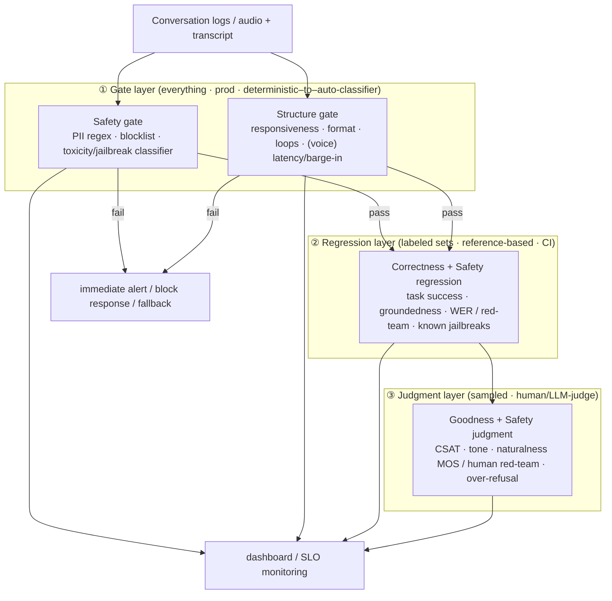

## Introduction —— "Model intelligence" doesn't measure conversation quality

When we talk about evaluating LLMs, benchmarks come to mind first. MMLU, GSM8K, SWE-bench — there is no shortage of yardsticks for how "smart" a model is. And yet, the moment you put a smart model behind a conversational agent and ship it to real users, you run into a **quality of conversation that benchmarks cannot explain**.

A high-accuracy model can still break in ways like:

- looping, asking the same thing over and over
- answering something subtly off from the question, at three times the necessary length
- confidently stating a fabricated return policy
- being factually correct yet somehow cold and condescending

Conversely, products built on a modestly capable model can deliver brisk, on-point, pleasant conversations. **Conversation UX lives outside the model** — that is where evaluation has to start.

So how do we measure "the quality of conversation UX" as a **system**, not a gut feeling? This article sets out to answer three questions head-on:

1. How do you **design the evaluation axes** (as a **MECE rule set**)?
2. How do you **measure** each one (separating what is **deterministically measurable** from what is not)?
3. How does the weighting of the axes change between **text chat** and **voice**?

The short answer: conversation UX is captured by **three quality axes plus one constraint axis**.

| Axis | The question it asks | Character |
|---|---|---|
| **Structure** | Did the conversation even happen as a conversation? | Form & dialogue flow. Mostly deterministic |
| **Correctness** | Is what was said true and valid? | Logical/semantic validity. Deterministic → judgmental mix |
| **Goodness** | Was the experience actually good? | User-felt value. Mostly judgmental |
| **Safety** | Is the response harmless and acceptable at all? | A constraint (veto) axis orthogonal to quality |

The first three (S, C, G) are mutually separable dimensions of *conversation quality* — the true substance of “good vs bad conversation” that you intuitively feel. But because an LLM **agent** takes actions and affects third parties, achieving genuine MECE coverage requires a fourth axis of a different nature — **Safety** — which behaves like a constraint, not a quality.

We will decompose these four axes down to sub-rules, turn them into a rule set, and lay them out on a map of determinism.

---

## I. The axis model —— Structure / Correctness / Goodness (+ Safety)

### Why these axes?

Observe the defects that can occur in a conversation, and they fall into four questions of fundamentally different character. The first three ask about *conversation quality*; the last asks about *acceptability*.

- **"Did a conversation even take place as a conversation?"** (Structure) — Do turns mesh, is there a reply, does it avoid loops, is the format intact? This is a layer you can judge **without understanding meaning**, from logs and timestamps alone.
- **"Is the content right?"** (Correctness) — Does it match the facts, address the question, stay consistent, accomplish the task? You **cannot judge this without understanding meaning**.
- **"Was the experience good?"** (Goodness) — Was it helpful, was the tone appropriate, did it feel natural, was the user satisfied? You **cannot judge this without measuring subjectivity**.
- **"Is the response harmless and acceptable at all?"** (Safety) — Is it free of toxic/unfair content, does it avoid leaking PII, does it resist injection and jailbreaks? This is a constraint that can **fail independently** even when the other three are perfect.

The first three map onto **form, content, and experience** — separable dimensions. The figure below shows the full picture of the axes and their sub-rules.

<ConversationAxesTaxonomy />

### Why make Safety its own axis?

A standard frame in LLM-agent evaluation is **HHH (Helpful, Honest, Harmless; Askell et al., 2021)**. Of these, **Helpful** lives in Goodness (G1 helpfulness) and **Honest** lives in Correctness (C1 factual accuracy). But **Harmless** fits nowhere.

A response that is fluent (S✓), factually accurate (C✓), and friendly in tone (G✓) can still **leak a third party's PII, give dangerous instructions, or be hijacked by prompt injection**. Toxicity is not a "tone" problem and a jailbreak is not a "relevance" problem, so forcing them into Goodness or Correctness is unconvincing. Hence Safety stands as an **independent constraint axis**, with sub-rules H1 harm avoidance, H2 fairness, H3 privacy, H4 injection resistance, and H5 action safety (caution on irreversible actions, while not over-refusing benign requests).

> We call Safety a **veto axis** because no matter how high the other three score, an unsafe response is **unacceptable on that basis alone**. It behaves like a zero factor in a product, not a term in a sum. (When we say Safety is "orthogonal to quality," "orthogonal" here means a *categorically different dimension*, not statistical independence — distinct from the "separable but correlated" relationship among S·C·G below.)

### The axes are separate questions (separable, but not independent)

The crucial point is that **these axes are mutually separable questions** — each can be judged on its own. One axis can be perfect while another collapses. Let's confirm with concrete cases.

- **S✓ C✗**: a perfectly formatted JSON reply that confidently states a **fabricated return policy**. Structure perfect, content zero.
- **S✓ C✓ G✗**: form and content are both correct, yet the **cold, condescending tone** blames the user. Structure and content perfect, experience zero.
- **S✓ C✓ G✓ H✗**: well-formed, grounded in fact, friendly in tone, yet it **leaks another person's PII**. It passes all three quality axes while being unsafe.
- **S✗**: there is simply **no reply**, or the agent **repeats the same utterance** and loops.

But "separable" does **not** mean "statistically independent (orthogonal)." In practice the axes are **causally ordered and positively correlated** — a lower-axis failure tends to propagate upward. A hallucination (C✗) erodes trust (G); a long silence (S✗) ruins the experience (G). So the honest framing is **"separately measurable, but propagating from the bottom up,"** not "independent/orthogonal." **Each axis is a separate net**, catching the fish that passed through the net above. (The net metaphor is about *catching defects*, though; Goodness is a positive, graded quality rather than the mere absence of a defect, so its "net" grades how good a response is rather than only catching bad fish.)

In the interactive demo below, watch which axis degrades — and which determinism band (defined later) can catch it — as the same conversation breaks in different ways.

<ConversationBreakdownVisualizer />

### The axes have an order (separable, but not equal)

The three quality axes are separable **measurement dimensions**, but in terms of **user impact they are ordered**.

```text
Structure (substrate) → Correctness (value) → Goodness (felt quality)
  the conversation        the content is          only then can you
  must happen first       correct first           speak of "a good experience"
```

If there is no reply (S✗), neither correctness nor experience means anything. Structure is the **substrate** on which conversation UX rides. If the content is a lie (C✗), no amount of charm yields positive value; Correctness is the condition for **value**. Only when both hold can you speak of Goodness, the **quality of the experience**.

**Safety sits outside this ordering as a veto axis.** However well the quality layers line up, the moment H is violated the whole response becomes unacceptable (e.g., a perfectly polite, accurate single PII leak).

This ordering carries straight over into the priorities of the measurement pipeline later (hang the cheap nets first).

### Being MECE —— the rule of attribution

For a rule set to function as a taxonomy, it must be **exhaustive (no gaps)** and **mutually exclusive (no overlaps)**. Our framework secures its MECE-ness via the following **attribution rule** — which is not a claim that the axes are statistically independent, but a **convention for avoiding double-counting**.

> **Attribution rule (tie-break)**: attribute a defect to the **cheapest layer at which it can be defined and detected**.
> 0. A defect that is unacceptable on safety grounds (harm, unfairness, PII leak, jailbreak, dangerous action) → **Safety** (the veto wins even if every other axis passes)
> 1. Definable from transcript and logs **without understanding meaning** → **Structure**
> 2. Definable only by **understanding** meaning, fact, or task goal → **Correctness**
> 3. Definable only by measuring the **subjective quality of experience** → **Goodness**

This rule produces exclusivity. A "confident hallucination," for instance, is formally flawless (it passes Structure), so it is classified uniquely as a **Correctness failure, not a Structure failure**. A "loop" can be defined as repetition without looking at meaning → **Structure**. A "cold tone" requires subjective judgment → **Goodness**. A "PII leak" is factually accurate yet unacceptable → **Safety**. Every defect lands in **exactly one** of the four axes.

> Note that **attribution becomes rule-dependent**. If there is an explicit "be polite" policy, a rude reply could be a machine-checkable C5 (constraint) violation; otherwise it is a G2 (tone) failure. So attribution shifts with "what rule exists on the ground." This is why MECE is best operated as a **team-agreed classification convention, not a fixed truth**.

Exhaustiveness, in turn, is guaranteed by the **four-way split**: "any observable defect in a conversation is either (a) a form/flow defect visible without understanding, (b) a meaning/truth/goal defect, (c) an experiential/affective defect, or (d) an unacceptable safety defect." The *did-it-happen / is-it-right / was-it-good / is-it-safe* split covers the space of what we observe.

---

## II. The map of determinism —— separating measurable from not

Alongside the axes, a second coordinate is essential for systematizing evaluation: **how deterministically can it be measured?** We split this into three bands.

<DeterminismSpectrum />

- **① Deterministic (rule-checkable)**: compute with a **fixed rule** from logs and timestamps. No model, same input always yields the same result. 100% reproducible, near-zero cost.
- **② Reference-based**: compare to **ground truth or a reference answer**. Automatic, but needs gold data and a metric choice.
- **③ Judgmental**: **human evaluation** or **LLM-as-judge**. Not bit-reproducible; quality is held by "correlation with humans" and "inter-rater agreement."

This distinction is operationally decisive because **cost, reproducibility, and where they apply differ by orders of magnitude**.

| | ① Deterministic | ② Reference-based | ③ Judgmental |
|---|---|---|---|
| Cost | ≈ 0 | Medium (build gold) | High (human/API) |
| Reproducibility | Perfect | Perfect (given a fixed reference) | Probabilistic |
| Main weakness | Sees form only | Reference coverage/validity (missing / multiple / stale gold) | Cost, rater bias |
| Where it fits | **Gate everything** (CI/prod) | Regression suite (labeled sets) | **Sampled** evaluation |
| Primary axis | Structure | Correctness | Goodness |

The tempting error here is ②: **its weakness is not reproducibility but reference coverage/validity.** BLEU/WER/F1 against a fixed gold set is bit-for-bit reproducible (deterministic in the same sense ① is); ② breaks down when the gold itself is incomplete, admits multiple valid answers, or goes stale — a *coverage* problem, not non-determinism.

As a rule of thumb, **the three quality axes line up diagonally with the determinism bands**. Structure is mostly measurable in ①, Correctness spans ①②③, and Goodness centers on ③ (with ① proxies as support). Safety does not sit on this diagonal — it cuts across all bands (blocklists in ①, red-team sets in ②, classifiers/humans in ③). This is exactly why the layered strategy "gate Structure on everything, regression-test Correctness, observe Goodness via sampled judgment" arises naturally.

---

## III. The methodological foundation (a shared vocabulary)

Before diving into the axes, let's fix the terms that recur in evaluation design. These are **degrees of freedom orthogonal to all the axes**.

- **Offline vs online**: regression evaluation on a fixed dataset, or observation on production traffic.
- **Turn-level vs dialogue-level**: looking at one reply, or the whole conversation. Loops, consistency, and long-horizon degradation (→ IV-8) are only visible at the dialogue level.
- **Reference-based vs reference-free**: comparing to a gold answer, or measuring properties of the response alone.
- **Pointwise vs pairwise**: absolute scoring (1–5) or which of A/B is better. Pairwise tends to have higher inter-rater agreement.
- **Who judges**: rule / human / LLM-judge.

### Standing on the shoulders of prior work

Conversation evaluation has a quarter-century of accumulated work. Our framework can be read as a re-mapping of these onto the axis × determinism grid.

- **PARADISE** (Walker et al., 1997, [ACL](https://aclanthology.org/P97-1035/)): the classic for task-oriented dialogue. **User satisfaction ≈ task success (κ) − dialogue costs** (number of turns, elapsed time, ASR rejections, etc.), with weights derived by **linear regression**. An early attempt to tie Correctness (task success) and Structure (costs) to a single satisfaction score (Goodness).
- **USR** (Mehri & Eskenazi, 2020, [arXiv:2005.00456](https://arxiv.org/abs/2005.00456)): reference-free open-domain dialogue evaluation. It measures several **interpretable sub-metrics** — understandability, naturalness, context maintenance, interestingness, knowledge use — in an unsupervised way. Turn-level correlation 0.42 on Topical-Chat, 0.48 on PersonaChat.
- **FED** (Mehri & Eskenazi, 2020, [arXiv:2006.12719](https://arxiv.org/abs/2006.12719)): using DialoGPT, it measures **eighteen fine-grained dialogue qualities** at the turn and dialogue level, reference-free. A pioneer in subdividing the structure of Goodness.
- **DBDC (Dialogue Breakdown Detection Challenge)** (Higashinaka et al., LREC 2016): annotators label each system utterance as **NB (not a breakdown) / PB (possible breakdown) / B (breakdown)**, and the task is to predict the distribution. It formalized Structure (dialogue breakdown) as an independent detection problem.
- **LLM-as-judge**: MT-Bench (Zheng et al., 2023, [arXiv:2306.05685](https://arxiv.org/abs/2306.05685)) and G-Eval (Liu et al., 2023, [arXiv:2303.16634](https://arxiv.org/abs/2303.16634)). Powerful, but known to carry **position bias, verbosity bias, and self-enhancement bias**, so **calibration against human judgment** is a prerequisite.

> **Caveat on LLM-as-judge**: using an LLM as the judge dramatically lowers the cost of ③, but it is a **probabilistic judgment**, not determinism. Always measure agreement with humans (with a statistic matching the scale — Cohen's κ for two nominal raters, Krippendorff's α for ordinal; see §VII), and counter position bias (swap A/B and evaluate both directions). Having it emit a rationale *before* the score (CoT) stabilizes the result.

---

## IV. Evaluating text chat

Now the per-channel details, starting with text chat. For each axis, we push the rule set down to **what to measure, in which determinism band**.

### IV-1. Structure —— guardable almost entirely, deterministically

The beauty of Structure is that you can check it **on everything, from logs alone, without understanding meaning**. It forms a "gate" you can run on every turn in production.

| Rule | What it inspects | Measurement (① deterministic) |
|---|---|---|
| **S1 Turn integrity** | One reply per user turn; no drops or duplicates | Inspect turn correspondence |
| **S2 Responsiveness** | No empty/absent reply, timeout, or crash | Reply presence + latency within budget |
| **S3 Format conformance** | Conforms to required format (JSON, fields, language, length) | Schema validation, parse, language ID |
| **S4 Flow progression** | State advances; no loops or repeated turns | n-gram repetition rate, state-transition monitoring |
| **S5 Role integrity** | Roles stay consistent; no fabricated user turns | Role-marker / protocol checks |

These can be written as deterministic code. A Structure gate bundling responsiveness, format, and loops, for example:

```typescript
type Turn = { role: "user" | "agent"; text: string; ts: number };

// 3-gram Jaccard similarity between the last two agent turns (loop detection)
function trigramJaccard(a: string, b: string): number {
  const grams = (s: string) =>
    new Set(
      [...s].slice(0, -2).map((_, i) => s.slice(i, i + 3))
    );
  const A = grams(a), B = grams(b);
  const inter = [...A].filter((g) => B.has(g)).length;
  const union = new Set([...A, ...B]).size;
  return union === 0 ? 0 : inter / union;
}

function checkStructure(turns: Turn[], budgetMs: number) {
  const failures: string[] = [];
  const agent = turns.filter((t) => t.role === "agent");
  const last = agent.at(-1);

  // S2 responsiveness
  if (!last || last.text.trim() === "") failures.push("S2: empty/no response");
  const prevUser = turns.at(-2);
  if (last && prevUser && last.ts - prevUser.ts > budgetMs)
    failures.push("S2: latency over budget");

  // S3 format conformance (e.g., when JSON is required)
  // try { JSON.parse(last.text) } catch { failures.push("S3: invalid JSON") }

  // S4 loop detection
  if (agent.length >= 2) {
    const sim = trigramJaccard(agent.at(-1)!.text, agent.at(-2)!.text);
    if (sim > 0.9) failures.push(`S4: repeated turn (sim=${sim.toFixed(2)})`);
  }

  return { pass: failures.length === 0, failures };
}
```

The point is that these are **cheap, deterministic, and runnable on everything**. A Structure violation is the most severe signal — "the conversation broke" — so implement it first, as a **production guardrail**.

> **Note**: the "loop" in S4 includes not only surface repetition but **semantic loops** (repeating the same thing with different wording). What surface n-grams miss is covered by embedding cosine similarity (leaning toward ② reference-based) or dialogue-level state tracking. This is exactly the boundary between Structure and Correctness.

### IV-2. Correctness —— spanning ①②③

Correctness mixes parts you can take deterministically with parts that need a reference or judgment.

| Rule | Main band | Specifics |
|---|---|---|
| **C1 Factual accuracy** | ② reference / ③ judgment | groundedness (verify entailment against sources via NLI/LLM-judge), hallucination rate |
| **C2 Relevance** | ③ judgment (② possible) | answer relevancy (semantic match between question and reply) |
| **C3 Logical consistency** | ③ judgment | detect self-contradiction / cross-turn contradiction |
| **C4 Task success** | ② reference | goal completion / slot-filling F1 / correct function call |
| **C5 Constraint adherence** | ① deterministic + ③ judgment | machine checks like "in three bullets," policy compliance |
| **C6 Calibration & abstention** | ② reference + ③ judgment | ECE/Brier, selective prediction (risk–coverage), abstention accuracy on unanswerable questions, validity of verbalized confidence |

For agents with RAG, Correctness is commonly decomposed into the **"RAG triad"** (a framing popularized by TruLens): **(1) context relevance** (is retrieval appropriate), **(2) groundedness/faithfulness** (is the response grounded in the retrieved context), **(3) answer relevance** (does the response answer the question). (1) is retrieval precision/recall (②); (2)(3) are measured by entailment or LLM-judge (②③).

C4, task success, **approaches deterministic ② reference-based** when ground truth (a goal state or action) can be defined — for "book a flight," you can check against gold whether the tool was called with the right flight, count, and date (multi-step trajectory evaluation is treated in IV-7). Part of C5 (format constraints, length, banned words) can be **gated in ① deterministically**.

On the other hand, C1 factuality and C2 relevance have no single gold answer in open domains, so they need **③ judgment**. If you use an LLM-judge here, always emit "rationale → verdict" in that order, and measure agreement with humans.

**C6 asks not "is the answer right" but "does the model know how confidently it may assert it."** This is the very heart of the article's flagship case, the *confident* hallucination — the problem is not only that the content is wrong (C1✗) but that the model *failed to signal it might be*. A calibrated model **hedges** ("I'm not certain, but…") or **abstains** ("I don't know / let me verify") when it lacks grounding, turning a C1 failure into an *honest, recoverable* one. Calibration is the deepest sense of **Honest** in HHH — not asserting beyond your knowledge — and complements C1. Metrics: ECE, Brier, risk–coverage curves, abstention accuracy on unanswerable questions (Kadavath et al., 2022, "Language Models (Mostly) Know What They Know"; Guo et al., 2017).

### IV-3. Goodness —— centered on ③, supported by ① proxies

Goodness is subjective by nature. It is also **audience-relative**: a terse answer is "good" for an expert but "bad" for a novice, and the same reply can flip in value with the target reader. The royal road is ③ (human evaluation), but it doesn't scale. So we combine **① proxies** with **③ sampled evaluation**.

| Rule | Direct (③ judgment) | Proxy (① deterministic) |
|---|---|---|
| **G1 Helpfulness** | CSAT, helpfulness score | resolution rate, re-ask rate, escalation rate |
| **G2 Tone & empathy** | LLM-judge rubric, human | sentiment score (weak proxy) |
| **G3 Clarity** | readability rating | sentence length, readability index, verbosity |
| **G4 Naturalness** | human, LLM-judge | (weak in text) |
| **G5 Trust & satisfaction** | CSAT, NPS | retention, drop-off, 👍/👎 |

Proxies are convenient, but beware **Goodhart's law**. Make answers vague to lower "re-ask rate," cut necessary information to shrink "sentence length" — the moment you make a proxy the optimization target, the proxy breaks. Use proxies for **monitoring**, and keep them separate from the true objective (CSAT, etc.).

To measure G2–G4 with an LLM-judge, an explicit-rubric evaluation prompt works well:

```text
You are an evaluator of conversation quality. Score the agent reply below on Goodness.
Rate each item 1–5; state the rationale BEFORE the score.

[Tone & empathy G2] Appropriate register? Does it avoid blaming the user? Is there empathy?
[Clarity G3]        Clear structure? Too verbose / too sparse?
[Naturalness G4]    Natural rather than robotic?

Conversation context: {context}
Agent reply: {response}

Output (JSON): {"G2":{"rationale":"...","score":N}, "G3":{...}, "G4":{...}}
```

### IV-4. Safety (text) —— the classifier-and-red-team layer

In text too, Safety is evaluated independently of the three quality axes, and the operating assumption is that you **gate it on everything and block** (an unsafe response must not ship, even if well-formed and accurate).

| Rule | Main band | Specifics |
|---|---|---|
| **H1 Harm avoidance** | ③ classifier + ② regression | toxicity/harm-category classifiers; regression on known harmful-prompt sets |
| **H2 Fairness** | ②③ + statistics | significance-test score/refusal-rate gaps across groups |
| **H3 Privacy** | ①② (detection) | PII regex + NER; check for leakage of training data / others' info |
| **H4 Injection resistance** | ② (known) + ③ (novel) | attack success rate on red-team sets; human red-teaming |
| **H5 Action safety** | ②③ | confirmation before irreversible/high-risk actions; measure over-refusal |

As H5 shows, safety is a balance of "refusing the dangerous" and "**not refusing the benign**." Over-refusal itself breaks UX, so erring entirely on the safe side is not enough. Red-team sets (known attacks) can be regression-monitored in ②, while the unknown attack surface is continuously probed by human/automated red-teaming (③).

### IV-5. How far determinism reaches in text

In text chat, **Structure is guardable almost entirely in ①, much of Correctness can be pushed into ②, Goodness depends on ③, and Safety is guarded by whole-traffic gates (①②) plus continuous red-teaming (③)**. The deterministic net covers Structure and the Safety gate, reaches half of Correctness, and barely touches Goodness — knowing **the precise shape of that reach (and non-reach)** is the heart of evaluation design.

### IV-6. Repair & error recovery —— the cross-axis "recovery" dimension

The rules so far classify defects; but real conversation UX is also decided by *what happens after a defect* — repair. In conversation analysis, repair is a classic structural phenomenon (Schegloff, Jefferson & Sacks, 1977), and in dialogue evaluation FED's eighteen qualities include "error recovery." The final scene of this article's demo (correcting "90 days" → "30 days") is precisely a repair. Repair does not fit one axis; it runs across all three quality axes:

- **Detection (Structure-leaning)**: detect the user's correction/rephrase ("no, that's not what I meant") and whether the agent enters a repair sequence — partly capturable in ①.
- **Correctness of the fix (Correctness)**: is the corrected content actually right (C1/C4)?
- **Grace of the repair (Goodness)**: acknowledge the error, apologize appropriately, not over-apologize, and move forward (G2).

So repair is a prime illustration of the "separable but propagating bottom-up" thesis, and it can be added as a separate *recovery* dimension without breaking the defect taxonomy. Measure it via repair success rate (fraction of correction requests after which the error is resolved) and time-to-repair (turns to recover).

### IV-7. Agentic tool use and multi-step task evaluation —— widening C4 into the "trajectory"

This article is titled for *agents*, yet C4's "correct function call" alone is not enough to evaluate an agent that uses tools across a multi-step task. Agent evaluation extends beyond the final result to the **trajectory** that produced it. This too can be added without breaking the defect taxonomy — it runs across Correctness and Safety.

| Aspect | What it inspects | Main band |
|---|---|---|
| **Tool-selection correctness** | Chose the right tool (no spurious or wrong calls) | ② reference (match vs gold tool sequence) |
| **Argument grounding** | Arguments grounded in context/user input (not fabricated values) | ② reference + ③ judgment |
| **Trajectory / plan quality** | Steps valid and non-redundant; order and dependencies correct | ② reference (trajectory/order match) + ③ judgment |
| **Recovery from tool errors** | Detects failures and retries, falls back, or escalates | ②③ (recovery rate on injected errors) |
| **Partial credit on multi-step tasks** | Score achieved sub-goals even when the whole task fails | ② reference (sub-goal completion rate) |
| **Irreversible-action safety** | Confirms before un-undoable/high-cost actions (→ H5) | ②③ + whole-traffic gate |

The key is to **evaluate the end-state and the trajectory separately**. τ-bench (Yao et al., 2024, [arXiv:2406.12045](https://arxiv.org/abs/2406.12045)) scores an agent — given domain APIs and policies, conversing with an LLM-simulated user — by **comparing the database state at the end of the conversation against the annotated goal state**, and measures consistency across trials with **pass^k** (even SOTA function-calling agents like gpt-4o succeed on under 50% of tasks, with pass^8 under 25% in retail). The trajectory itself is approximated by exact / in-order / any-order match against a gold tool sequence, or precision/recall over tool calls.

Safety of irreversible actions (transfers, deletions, confirmed bookings) is caught by **H5 action safety, not C4 task success** — "the right action" and "a reversible action" are different questions. Monitor, via the whole-traffic gate and a regression set, whether the agent confirms before actions that warrant it, and whether it slips into over-refusal.

### IV-8. Multi-turn / long-horizon degradation —— measuring "it breaks as turns pile up"

§III distinguished turn-level from dialogue-level, but the failure modes peculiar to *long* conversations are invisible if you only look at one turn. Degradation that emerges as a conversation grows must be measured independently, as a dialogue-level phenomenon.

- **Goal drift (Correctness-leaning)**: the conversation slowly veers from its original objective across turns. Track sub-goal completion and assess alignment with the final goal per dialogue.
- **Context / memory loss (Correctness/Structure)**: constraints fixed early (name, date, preference) are forgotten or garbled later. Measure the "retention rate of established facts" per dialogue.
- **"Lost in the middle" (Correctness)**: a U-shaped effect where information placed in the **middle** of a long context is used far less than information at the beginning or end (Nelson F. Liu et al., 2023, "Lost in the Middle," [arXiv:2307.03172](https://arxiv.org/abs/2307.03172)). Probing accuracy with the relevant information at varying positions is an effective test.
- **Multi-turn instruction decay (Correctness)**: an early instruction ("use formal language from now on") starts to be ignored as turns progress. Measure adherence as a function of turns elapsed since the instruction.
- **Dialogue-level coherence/consistency (Goodness/Correctness)**: do persona, tone, and claims stay consistent across turns? Detect cross-turn self-contradiction.

The implication for evaluation design is clear: **long-horizon degradation does not show up in the average of turn-level metrics.** So your eval set must include *long* conversations and be scored at the dialogue level. Beware that many benchmarks skew toward short exchanges — MT-Bench (Zheng et al., 2023), for instance, uses a two-turn setup, putting long-horizon decay out of scope. In production, monitor the correlation between conversation length and error rate, and regression-test the effectiveness of summarization/memory mechanisms when needed.

---

## V. Evaluating voice

Voice is text plus a **dimension of time and acoustics**. So evaluation becomes a two-story building: **"text evaluation on the transcript (everything in the previous chapter) + voice-native sub-layers."** And as we'll see, **the weighting of the axes changes**.

### V-1. Why "timing" dominates in voice —— the cognitive science of human conversation

Human turn-taking is astonishingly precise. From the classics of conversation analysis (Sacks, Schegloff & Jefferson, 1974) onward, and confirmed by careful measurement (Levinson & Torreira, 2015, [Frontiers in Psychology 6:731](https://www.frontiersin.org/articles/10.3389/fpsyg.2015.00731/full)), we know:

- The **modal gap (floor transfer offset) between turns is about 100–200 ms**.
- Yet **language production latency is about 600 ms for a single word** (the picture-naming meta-analysis of Indefrey & Levelt, 2004). It rises to 740–900 ms for two- to three-word utterances (Schnur et al., 2006) and ~1500 ms for sentence-level utterances (Griffin & Bock, 2000; both as reviewed in Levinson & Torreira, 2015).
- The resolution of this contradiction is **prediction (projection)** — the listener predicts the end of the speaker's turn and begins planning their reply **before the other has finished**.
- A 10-language cross-linguistic study (Stivers et al., 2009, [PNAS](https://doi.org/10.1073/pnas.0903616106); measuring responses to polar [yes/no] questions, visual responses included) found mean response offsets ranging from ~7 ms (Japanese) to ~469 ms (Danish), but the tendency to **minimize gaps and overlaps was universal**.
- And decisively: **a gap longer than 700 ms is interpreted as a signal that "something is wrong"** (a precursor to disagreement, trouble, or rejection). Beyond 300 ms, the probability of unqualified agreement starts to drop. (Both thresholds come from human–human dyads; applying them to agents is a working assumption.)

So humans achieve ~200 ms by "predicting ahead," whereas a **naïve voice agent pipeline "waits for silence and then processes serially"** — structurally violating this norm.

<TurnTakingLatencyDiagram />

Stack silence-waiting (endpointing) → ASR finalize → LLM's first token → TTS's first audio serially, and you easily blow past 1.5–2 seconds. That is **8–10×** the human norm (~200 ms) and **2–3×** the "problem signal" threshold (~700 ms). **Even if the answer is correct (C✓), that silence alone collapses the experience (G✗).** This is why Structure-timing dominates in voice.

> **Note (2024+ SOTA)**: this 1.5–2 s is a naïve serial-pipeline baseline, not the current ceiling. Native speech-to-speech models and full-duplex architectures have cut responses to ~300–500 ms, largely closing the gap to the human norm (~200 ms). The "wall of silence" is not structurally inevitable but a design variable you move via architecture (streaming ASR, semantic endpointing, direct audio-token generation). Even so, p95 latency and barge-in behavior remain first-class evaluation targets.

### V-2. Structure (voice) —— a treasure trove of determinism

Fortunately, almost everything about timing and voice flow can be **measured deterministically from audio timestamps**. Voice Structure adds, on top of the text S1–S5, the following voice-native rules.

| Voice Structure rule | What it inspects | Measurement (① deterministic) |
|---|---|---|
| **Response latency** | user speech end → agent speech start | p50/p95 of the FTO distribution vs the ~200 ms norm / ~700 ms threshold |
| **Endpointing accuracy** | correctly detecting the user's speech end | too-early (interrupt) / too-late (silence) rates |
| **Barge-in handling** | stop TTS immediately on user interruption | barge-in detection rate, time-to-stop |
| **Talk-over / overlap** | not talking over the user | duration/frequency of simultaneous speech |
| **Dead air** | no unnatural long silences | length of silent intervals |

These are **the most dominant and the most deterministic** part of voice UX — i.e., the best investment: cheap to guard, large in effect. The standard practice is to monitor the latency distribution (especially p95) as an SLO, and to tune the too-early/too-late trade-off of endpointing.

> **The endpointing dilemma**: shorten the threshold and you "cut in while the user is still talking" (too early); lengthen it and "the silence stretches into a problem signal" (too late). Just as humans solve this with prediction, the latest voice systems try to move this deterministic trade-off via **semantic endpointing** (predicting the semantic completion of an utterance) or **full-duplex** (listening while speaking).

### V-3. Correctness (voice) —— ASR and TTS inject error

Voice Correctness adds, on top of the text C1–C6, the **accuracy of speech ↔ text conversion** at the front and back ends.

- **Front end: ASR accuracy.** Did the agent **hear correctly?** The standard metric is **WER (Word Error Rate) = (substitutions + deletions + insertions) / reference words**. With a reference transcript, this is measurable **deterministically in ② reference-based**. ASR errors propagate straight into the downstream LLM (cascading error), so it's important to isolate ASR in end-to-end evaluation. Note that WER varies sharply with speaker accent/dialect, background noise, and code-switching, so cross-group WER gaps are also an H2 (fairness) concern.
- **Back end: TTS pronunciation accuracy.** Did it **pronounce the correct content correctly?** Numbers, proper nouns, dates, and units are especially error-prone ("1/2" as "one half" or "January 2nd"?). This is the classic "content is correct but the speech rendering breaks," which text evaluation cannot catch.

Even with a good ASR WER, breakage in punctuation, diarization, or proper nouns warps the LLM input. So the iron rule of voice Correctness is to **measure the "ASR layer," "LLM layer," and "TTS layer" separately**.

### V-4. Goodness (voice) —— "naturalness," and timing as a proxy

Voice Goodness adds an **acoustic experiential value** absent in text.

| Voice Goodness rule | Direct (③ judgment) | Proxy (① deterministic) |
|---|---|---|
| **Voice naturalness** | **MOS** (ITU-T P.800, 1–5), CMOS | (direct is the norm) |
| **Prosody / intonation fit** | human, LLM-judge | pitch/rate statistics |
| **Persona consistency** | human | stability of rate/volume |
| **"Good tempo"** | felt comfort | **latency distribution** (ties to V-2) |

Notably, in voice the **deterministic Structure metric (latency) becomes a strong proxy for Goodness (felt tempo)**. The closer to the human norm of ~200 ms, the better the tempo feels. Here Structure and Goodness join hands. Voice naturalness itself is measured by **MOS** — the ITU-T standard where subjects rate 1–5 (the crowdsourced variant is P.808) — a ③ judgmental metric.

### V-5. In voice, the axis weights change

In text, a slow reply is merely "a bit annoying" (mild Goodness degradation). In voice, **a silence over 700 ms is actively interpreted as "something is wrong"** — i.e., a Structure-timing failure **instantly destroys Goodness**.

```text
Text:   Correctness and Goodness (content and tone) dominate the experience
Voice:  Structure-timing dominates the experience, and even
        correct content can be ruined by a single silence
```

So in evaluating a voice agent, you must treat the **latency distribution (p95) as a first-class metric**, weighting it at least as heavily as Correctness (WER + content). The same quality axes — but **the weighting changes by channel**. That is why voice deserves its own chapter.

---

## VI. The rule set on a single page

Let's compress the four axes × determinism bands so far into one table spanning text and voice. This is, directly, a **rule set** you can drop into an evaluation pipeline.

<EvalMetricMatrix />

How to read it: the **further left, the cheaper, fuller-coverage, more automatic**; the **further right, the more expensive, sampled, subjective**. Decide, for each axis, "which band do I primarily measure it in," and hang the nets from the left.

---

## VII. Measurement in practice —— a 3-layer pipeline

Translate the axes and the map of determinism into an actual measurement architecture, and it naturally becomes **three layers** (one per determinism band). Cheap nets on everything, expensive nets on samples. **Safety cuts across all three** (block at the gate, monitor in regression, red-team in the sample).



- **① Gate layer**: check Structure and Safety on **everything, in production**. A violation triggers an immediate alert, response block, or fallback. Structure is pure determinism; the Safety gate is a hybrid of regex/blocklists (deterministic) and classifiers (automated, probabilistic).
- **② Regression layer**: evaluate Correctness and Safety with reference on a **labeled regression set**. Run it on every model update or prompt change to catch regressions (task-success drops, newly-successful jailbreaks).
- **③ Judgment layer**: **sample** and evaluate Goodness and Safety with humans / LLM-judge. Full coverage is impossible, so use stratified sampling (weight failure cases and new domains heavily).

### Online and offline

- **Offline**: a regression suite on fixed datasets (mostly ②). Also run the deterministic gate (①) and LLM-judge (③). Pre-release quality assurance.
- **Online**: on production traffic, run ① continuously as a guardrail and monitor ③'s proxies (drop-off, 👍/👎, escalation, and for voice the latency p95). Anomaly detection wired to business metrics.

### Principles for not breaking your measurement

1. **Hang the cheap nets first**: prioritize Structure ①. Debating Goodness while missing no-replies and loops is pointless.
2. **Safety is non-negotiable**: Safety is a veto axis. Don't average it with the other scores; place it as a separate gate up front. An H violation blocks release even if everything else is perfect.
3. **Measure layers separately**: for voice, isolate ASR / LLM / TTS. Don't crush cascading error into one number.
4. **Calibrate the LLM-judge before using it**: measure agreement with humans (with a scale-appropriate statistic; see "Statistical rigor" below) and counter position bias (A/B swap).
5. **Don't make proxies the optimization target**: avoid Goodhart. Proxies are for monitoring; manage the true objective (CSAT, etc.) separately.
6. **Use pairwise comparison**: A/B comparison tends to have higher inter-rater agreement than absolute scoring. Choose models pairwise.

### Statistical rigor —— sample size, confidence intervals, agreement statistics

The numbers from the judgment layer (③) are random variables. Claiming "A is better" requires **statistical backing**.

- **Sample size and power**: for the effect size you want to detect, estimate the number of evaluations needed up front (power analysis). A "win/loss" on a handful of samples cannot be distinguished from chance.
- **Confidence intervals and significance testing (A/B)**: report score differences with **confidence intervals**, not just point estimates. Test win-rate comparisons between two models for significance with bootstrap CIs or a binomial / McNemar test (the latter for paired comparisons). When comparing many metrics at once, apply a multiple-comparison correction (Bonferroni, etc.).
- **The right agreement statistic for the situation**: choose the inter-rater statistic by the nature of the data.
  - **2 raters, nominal** → **Cohen's κ** (κ assumes strictly "two raters, nominal").
  - **≥3 raters, nominal** → **Fleiss' κ** (generalizes to a fixed number of raters — strictly, it generalizes Scott's π rather than Cohen's κ).
  - **Ordinal scales (1–5, etc.)** → **Krippendorff's α** (any number of raters; handles ordinal/interval), **weighted κ** (2 raters; weights disagreements by distance), or **Spearman's ρ** (rank correlation). Running κ on a 1–5 scale as if it were nominal punishes a "4 vs 5" disagreement as harshly as a "1 vs 5" one.

The practical implication: **validating an LLM-judge follows the same distinction.** For 1–5 rubric scoring, report human agreement with Krippendorff's α or Spearman; for A/B pairwise verdicts, report agreement rate (and κ). The refrain in §III and this chapter — "measure agreement with humans" — means measure it **with the statistic that matches the scale**.

---

## Closing

Conversation UX is too often discussed as "somehow good / somehow bad," but its true nature decomposes into **three quality axes plus one constraint axis**.

- **Structure**: did the conversation even happen as a conversation? Guardable on **everything, deterministically**.
- **Correctness**: is what was said true? Much of it can be pushed toward **reference-based**.
- **Goodness**: was the experience good? **Judgmental**, approached via proxies and sampled evaluation.
- **Safety**: is the response harmless? A **veto axis** orthogonal to quality, guarded by classifiers and red-teaming.

These four axes are split exclusively by a **MECE attribution rule** (attribute to the cheapest layer — a non-double-counting convention) and exhaustively by the *did-it-happen / is-it-right / was-it-good / is-it-safe* split. The axes are not statistically independent (orthogonal); they are best understood as **separately measurable but propagating from the bottom up**. Overlay them on the map of determinism, and a measurement strategy — **what to gate on everything, what to regression-test, what to sample-judge** — emerges automatically.

Finally, never forget that **the channel changes the axis weights**. In text, content and tone dominate the experience; in voice, **timing** does. The fact that humans achieve ~200 ms gaps through prediction is a brutal benchmark for voice agents: a single silence can ruin even a correct answer. **Good conversation UX is the state in which the three quality axes line up at once — each weighted as the channel demands — without ever crossing the Safety line.**
