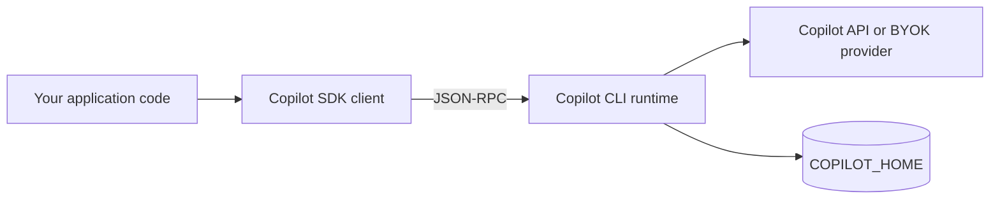
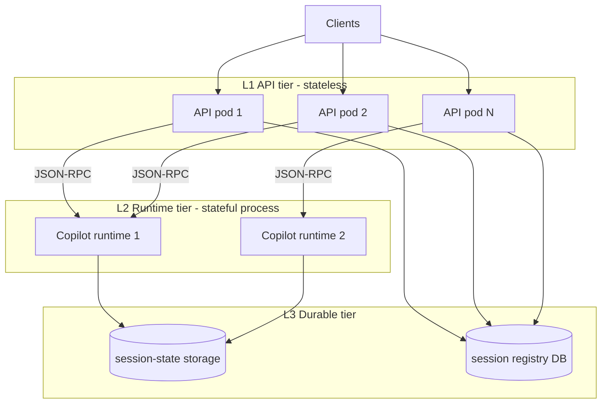
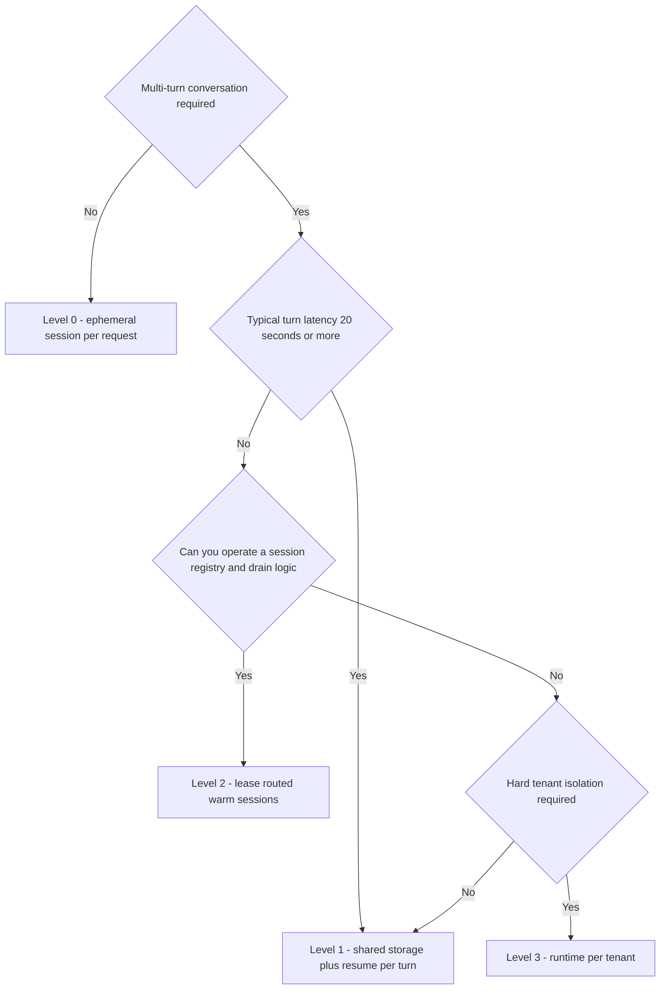
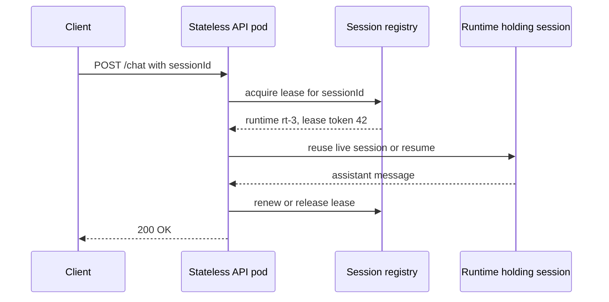
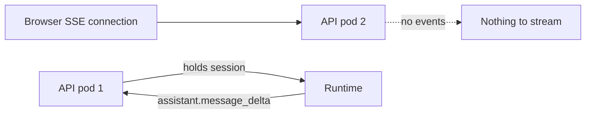

## Introduction

The GitHub Copilot SDK is a library for programmatically driving the agent runtime that sits behind Copilot CLI. It ships for Node.js/TypeScript, Python, Go, .NET, Java, and Rust, letting you embed a Copilot-grade agent into your own product.

The moment you consider running it server-side, the same question always comes up.

> Can a backend built on this SDK be designed stateless and scaled horizontally?

The short answer: <strong>your app tier can be stateless; the runtime tier cannot.</strong> But the useful discussion is not yes/no. It is these three questions:

- Where does state live, and at what granularity?
- What does it cost to cross that state boundary?
- When you put the boundary in the wrong place, how exactly does it break?

This article is grounded in the public documentation and the `@github/copilot-sdk` v1.0.13 README as of 2026-08. The SDK moves fast, so always re-verify against the type definitions of the version you actually have.

## The short version

| Question | Answer |
|---|---|
| Can HTTP/API handlers be stateless? | Yes, if you make sessions addressable by ID |
| Can the Copilot runtime be stateless? | No. It holds in-process memory and on-disk state |
| Can any pod serve any session? | Yes, with shared storage or `sessionFs` — but a single-writer constraint applies |
| Is resuming on every turn practical? | Yes for long turns. For short turns it can multiply your capacity needs |
| Does streaming break statelessness? | Yes. Event delivery has to be designed as a separate concern |
| What is the most dangerous default? | Leaving `mode: "copilot-cli"` in a multi-tenant deployment |

## Background: what the Copilot SDK actually holds

### The SDK is a client, not the engine

You need an accurate mental model first. The SDK does not call an LLM itself. It is a <strong>JSON-RPC client connected to the Copilot CLI runtime</strong>.



In other words, there is a second stateful process outside your own. That fact governs everything about stateless design here.

The transport is chosen through `RuntimeConnection` factories.

| Transport | Factory | Runtime lifetime |
|---|---|---|
| stdio (default) | `RuntimeConnection.forStdio({ path, args, env })` | SDK spawns and stops it as a child process |
| TCP | `RuntimeConnection.forTcp({ port, connectionToken, ... })` | SDK spawns it, talks over TCP |
| External URI | `RuntimeConnection.forUri(url, { connectionToken })` | Connects to an already-running runtime; lifetime managed separately |
| In-process | `RuntimeConnection.forInProcess()` | Same process via the native C ABI (FFI), experimental |

For server-side work, `forUri` is the one that matters. Run the runtime as a resident server with `copilot --headless --port 4321` and connect from your API processes. This decouples the runtime's lifecycle from your request handlers, so restarts and deployments can be scheduled independently.

Note that the headless server accepts loopback (`127.0.0.1`) connections only by default. Binding with `--host 0.0.0.0` is required to reach it from another container — and at that moment the constraint "there is no built-in auth between the SDK and the CLI" becomes load-bearing. `forUri` and `forTcp` do accept a `connectionToken`, but the docs still list the missing auth as a limitation: one shared secret is not a substitute for authentication. You have to protect it at the network boundary (same pod, sidecar, mTLS inside a VPC).

### Taking inventory of state

Before arguing about statelessness, classify the state. A system built on the Copilot SDK holds at least five kinds.

| Kind of state | What it is | Persisted? | Externalizable? |
|---|---|---|---|
| Conversation | Message thread, tool call results | Yes (checkpoints) | Yes (shared FS / `sessionFs`) |
| Plan and artifacts | `plan.md`, contents of `files/` | Yes | Yes |
| Runtime memory | Live session objects, subscribed event handlers | No | No |
| Credentials | BYOK API keys, per-session GitHub tokens | <strong>No</strong> (deliberately) | Keep in your own secret manager |
| Tool implementation state | In-memory state held by `defineTool` handlers | No | Your design problem |

Reorganizing what the docs state, `COPILOT_HOME/session-state/{sessionId}/` looks like this.

```text
~/.copilot/session-state/
└── user-123-task-456/
    ├── checkpoints/
    │   ├── 001.json
    │   ├── 002.json
    │   └── ...
    ├── plan.md
    └── files/
```

Two asymmetries here are critical.

1. <strong>Conversations persist; connections do not.</strong> The on-disk session survives, but the live object holding it and its event subscriptions vanish when the process dies.
2. <strong>Keys do not persist.</strong> With BYOK, you must re-supply the `provider` config on every `resumeSession`. That is a sound security decision, and it is also a landmine you will step on the first time you write a stateless resume path.

## Redefining "stateless" per tier

Statelessness is not a property of a system; it is a property of a <strong>tier</strong>. Splitting a Copilot SDK system into three tiers makes the design tractable.



- <strong>L1 (API tier)</strong> can be fully stateless in the twelve-factor sense. A request carries nothing but a session ID.
- <strong>L2 (runtime tier)</strong> is inherently stateful. The process holds live sessions. Trying to make it stateless is the same category error as trying to make PostgreSQL stateless.
- <strong>L3 (durable tier)</strong> consists of shared storage — or object storage via `sessionFs` — plus <strong>a session registry you own</strong>.

That third piece is the one most designs forget. The SDK offers `listSessions()`, but it only enumerates sessions visible on the runtime's storage. It will not tell you who owns a session, which runtime currently holds it, or whether it is still valid. <strong>Ownership and routing are your database's responsibility.</strong>

## Four levels of statelessness

Treat this as a spectrum, not a binary.



### Level 0: ephemeral sessions

When each request is independent — classification, summarization, one-shot code generation — do not keep a session at all. This is genuinely stateless.

```typescript
import { CopilotClient, RuntimeConnection } from "@github/copilot-sdk";

// Once, at process startup
const client = new CopilotClient({
  mode: "empty",
  connection: RuntimeConnection.forUri(process.env.COPILOT_RUNTIME_URL!),
});
await client.start();

app.post("/api/analyze", async (req, res) => {
  const session = await client.createSession({
    model: "gpt-5.4",
    availableTools: ["custom:lookupOrder"],
    gitHubToken: req.user.githubToken,
    onPermissionRequest: () => ({ kind: "approve-once" }),
  });

  try {
    const result = await session.sendAndWait({ prompt: req.body.prompt }, 120_000);
    res.json({ content: result?.data.content });
  } finally {
    await session.disconnect();
  }
});
```

Three things to get right.

- Do not construct `client` per request. `createSession` is cheap; `new CopilotClient()` + `start()` establishes a runtime connection.
- Always pass a timeout to `sendAndWait`. Agents have no guaranteed termination, so the caller owns the bound.
- `disconnect()` in `finally`. That releases in-memory resources while preserving on-disk data. If the session is disposable, follow up with `deleteSession()`.

Level 0's cost is obvious: <strong>no context carries over</strong>. Making it multi-turn means stuffing the history back into the prompt yourself, which hits token billing and latency directly.

### Level 1: shared storage plus resume per turn

The straightforward way to keep the API tier fully stateless while supporting multi-turn. Put session state on shared storage (NFS, a CSI PVC, or object storage via `sessionFs`) so any runtime can resume any session.

```typescript
app.post("/api/chat", async (req, res) => {
  const { sessionId, message } = req.body;

  // 1. Ownership check — the SDK will not do this for you
  const record = await db.sessions.findById(sessionId);
  if (!record || record.ownerId !== req.user.id) {
    return res.status(404).json({ error: "not found" });
  }

  // 2. Guarantee a single writer, then resume
  const result = await withSessionLease(sessionId, async () => {
    const session = await client.resumeSession(sessionId, {
      onPermissionRequest: policyFor(req.user),
      // BYOK requires re-supplying provider config every time
      provider: byokProviderFor(record.tenantId),
    });
    try {
      return await session.sendAndWait({ prompt: message }, 180_000);
    } finally {
      await session.disconnect();
    }
  });

  res.json({ content: result?.data.content });
});
```

Clean, but not free. Wall-clock time per turn becomes

$$
W_{\text{L1}} = W_{\text{lease}} + W_{\text{resume}} + W_{\text{turn}} + W_{\text{disconnect}}
$$

and that difference shows up in capacity, as shown below.

### Level 2: lease-routed warm sessions

To avoid resume cost, keep sessions alive inside a runtime for a while, and have the API tier <strong>ask a registry</strong> which runtime holds the session before forwarding. The API tier stays stateless while you get effective affinity.



The important part is <strong>not relying on load balancer sticky sessions</strong>. LB affinity is a property of the client connection, not the truth about session ownership. When a pod dies the LB silently routes elsewhere, and you get two writers. Express ownership as a lease in a registry, and let the API tier simply look it up.

### Level 3: runtime per tenant

If compliance requirements are strict, or each tenant's runtime needs distinct credentials, split runtimes per tenant. Isolation is strongest and density is worst — you pay for processes and memory belonging to idle tenants.

| | Level 0 | Level 1 | Level 2 | Level 3 |
|---|---|---|---|---|
| API tier statelessness | Full | Full | Full (registry-backed) | Full |
| Conversation continuity | None | Yes | Yes | Yes |
| Per-turn overhead | None | resume + lease | lease only | None |
| Shared storage needed | No | Required | Preferred (for failover) | Optional |
| Single-writer control | Not needed | Required | Required | Effectively unneeded |
| Isolation level | Session | Session | Session | Process |
| Operational complexity | Low | Medium | High | Medium (density cost) |

## What externalizing storage does and does not solve

Let me kill a common misconception here. "Move session data to external storage and it becomes stateless" — that is <strong>only half true</strong>.

### What you get is not "stateless" but "relocatable"

Externalizing buys exactly one property: the session <strong>can be opened from any node</strong>. The two remaining kinds of state cannot be externalized even in principle.

| State | Externalizable | Why |
|---|---|---|
| Conversation, checkpoints, `plan.md`, `files/` | Yes | Plain data. This is what `sessionFs` is for |
| The in-flight turn's outstanding call | <strong>No</strong> | It is not data — it is an <strong>RPC into your process</strong> |
| Events during streaming | <strong>No</strong> | They are never written to disk at all (see below) |

The second row is the essential one. Tool execution, `onPermissionRequest`, and hooks all work by the runtime issuing a JSON-RPC request into your process and <strong>blocking on your reply</strong>. If an API pod dies mid-turn, the runtime is left holding a pending request with nobody to answer it. Sharing a disk does not let you transfer that open call to another pod.

So externalizing protects <strong>between turns</strong>, not <strong>within a turn</strong>. When a Level 1 handler retries, the only safe assumption is "we are back at the last checkpoint" — which means tool side effects must be <strong>designed idempotent</strong>.

That is not my inference. The SDK says so itself, in the implementation of Agent Factories' durable steps.

```typescript
// nodejs/src/session.ts
// Producers are best-effort at-least-once across crashes or
// concurrent callers, so authors must make side effects idempotent.
```

Even the most durability-conscious mechanism in the SDK guarantees only at-least-once.

### Externalizing costs you an accidental single-writer property

There is a second, easily missed consequence.

With local disk, session state lived only on one pod's filesystem, so <strong>only that pod could touch it</strong>. Mutual exclusion held by accident. The moment you move to shared storage, that protection disappears — and the SDK has no locking.

Searching all of `nodejs/src` turns up exactly two things called a lock, and neither has anything to do with sessions.

| Location | What it is | What it protects |
|---|---|---|
| `modelsCacheLock` in `client.ts` | A promise-based mutex | The `listModels()` cache. In-process only |
| `"busyOrLocked"` in `sessionFsProvider.ts` | A SQLite BUSY/LOCKED classification | Whether a storage-layer retry is safe |

Neither `createSession` nor `resumeSession` checks whether another client already holds the session. Two pods resuming the same `sessionId` both succeed.

What makes this interesting is that the SDK does model "already active" — just not for sessions. It does it for factory runs.

```typescript
// nodejs/src/factory.ts
export type FactoryResumeErrorCode =
    | "not_found"
    | "non_resumable"
    | "already_active"          // rejects double execution
    | "factory_already_running"
    | "factory_limits_invalid"
    | "factory_session_disposed"
    | "factory_storage_unavailable"
    | "factory_storage_corrupt";
```

So this reads as a deliberate decision — <strong>session exclusion is the application's job</strong> — rather than an oversight. A library cannot know the shape of the layer above it (how many pods exist, how the LB routes), so it cannot provide exclusion. Attempting to would force the SDK itself to require Redis or etcd, which is a bad dependency for a library to impose.

That said, layers that decline to provide exclusion normally still provide <strong>conflict detection</strong>. HTTP's `If-Match`, conditional writes on object storage, and `git push`'s non-fast-forward rejection are all examples. The Copilot SDK gives you `modifiedTime` from `listSessions()`, but <strong>no compare-and-swap that validates a version at write time</strong>. Therefore:

- You cannot <strong>prevent</strong> double writes (reasonable for this layer)
- You have little means to <strong>know</strong> a double write happened (this part is thin)

The division of responsibility comes out like this:

| What the SDK provides | What you must provide |
|---|---|
| Identity — you can address a session by `sessionId` | Exclusion — the guarantee of one writer at a time |
| Durability — checkpoint persistence and restore | Ownership — whose session this is |
| Placement freedom — `sessionFs` lets you choose where state lives | Routing — which runtime currently holds it |

Externalizing storage buys you the third item in the left column. The right column is your job from beginning to end, externalized or not.

## The session ID is a primary key, not an ACL

`createSession({ sessionId })` lets you choose the ID. Omit it and a random one is generated — in which case you cannot resume it later unless you recorded it.

The official docs recommend structured IDs like `user-{userId}-{taskId}` and show a sample that verifies ownership by `sessionId.split("-")`. <strong>Do not ship that sample.</strong>

The reason is simple: it turns a string representation into a trust boundary.

- A hyphen inside a user ID shifts the boundary. How would you split `user-alice-smith-42`?
- An attacker controls the `sessionId` they send. Passing a client-supplied ID straight into `createSession` lets them claim someone else's namespace.
- It cannot follow tenant deletion or user ID reuse.

The correct approach is to <strong>treat the session ID as an opaque identifier and keep ownership in your own database</strong>.

```typescript
// Generation: an opaque, collision-free ID with only a tenant prefix
function newSessionId(tenantId: string): string {
  return `t${tenantId}-${crypto.randomUUID()}`;
}

// Authorization: record lookup, not string parsing
async function authorize(sessionId: string, user: User) {
  const rec = await db.sessions.findById(sessionId);
  if (!rec) throw new NotFound();
  if (rec.tenantId !== user.tenantId) throw new NotFound(); // 404, not 403
  if (!user.can("session:write", rec)) throw new Forbidden();
  return rec;
}
```

Keeping a tenant prefix is still useful — for routing storage paths in `sessionFs`, and for reading an ID during an incident. Just <strong>never make it the basis of authorization</strong>. Return 404 rather than 403 for other tenants' sessions so you do not leak existence.

## The single-writer constraint — solve it with partitioning, not locks

The SDK docs are explicit: there is no built-in session locking. If two clients `resumeSession` the same ID and write concurrently, the behavior is undefined. Checkpoints are written as numbered JSON files, so lost updates are possible.

The official sample shows a Redis `SET NX EX` lock. The direction is right, but there are two problems if you copy it as-is.

### Problem 1: lock release races

Some doc samples do a `GET` followed by a `DEL`. If the TTL expires between those two steps and another client acquires the lock, you <strong>delete someone else's lock</strong>. Release must be atomic via Lua.

```typescript
const RELEASE = `
if redis.call("get", KEYS[1]) == ARGV[1] then
  return redis.call("del", KEYS[1])
else
  return 0
end`;

// Renewal needs the same ownership check. A bare EXPIRE extends someone else's lock.
const RENEW = `
if redis.call("get", KEYS[1]) == ARGV[1] then
  return redis.call("expire", KEYS[1], ARGV[2])
else
  return 0
end`;

async function withSessionLease<T>(
  sessionId: string,
  fn: () => Promise<T>,
  ttlSec = 300,
): Promise<T> {
  const key = `copilot:lease:${sessionId}`;
  const token = crypto.randomUUID();

  const ok = await redis.set(key, token, "NX", "EX", ttlSec);
  if (!ok) throw new SessionBusyError(sessionId);

  const renew = setInterval(() => {
    void redis.eval(RENEW, 1, key, token, String(ttlSec));
  }, (ttlSec / 3) * 1000);

  try {
    return await fn();
  } finally {
    clearInterval(renew);
    await redis.eval(RELEASE, 1, key, token);
  }
}
```

The easy thing to miss is that <strong>renewal has exactly the same race</strong>. A bare `EXPIRE` never checks whether the key is still yours. If the TTL lapses, another client acquires the lock, and then your renewal timer fires, you have just extended someone else's lease. Renew through a token-checked Lua script, just like release.

### Problem 2: a lock does not actually guarantee mutual exclusion

A Redis lock is <strong>advisory</strong>; it is not a proof of mutual exclusion. A long GC pause, a network partition, or a frozen container can leave a process writing while believing it still holds an expired lock. The standard remedy for distributed locks is a fencing token validated at the resource — but <strong>the Copilot runtime does not accept fencing tokens</strong>. Locks alone cannot close the hole.

Two practical answers exist.

<strong>(a) Make single-writer structural.</strong> Use a partitioned queue keyed by session ID (a Kafka partition, an SQS FIFO `MessageGroupId`, a Redis Streams consumer group) so the same session's turns are always processed in order by the same worker. Mutual exclusion then comes from a delivery property rather than a lock outcome, which is far more robust.

<strong>(b) Make corruption detectable.</strong> Assume double writes can still happen. Use the `modifiedTime` returned by `listSessions()` or your own turn counter, and treat any unexpected advance as an anomaly. Agent sessions are not financial transactions, so "detect, quarantine that session, and ask the user to restart" is usually enough.

And the cheapest mitigation of all: <strong>reject concurrent requests to the same session with 409 Conflict immediately</strong>. A UI that says "still generating the previous response" resolves most of these cases.

## Resume cost and capacity planning

Level 1 accepts resume on every turn. Let us make that cost quantitative.

The number of concurrently active turns follows Little's law.

$$
L = \lambda \cdot W
$$

where $\lambda$ is the turn arrival rate [turns/sec], $W$ is time in system per turn [sec], and $L$ is the number of turns in flight.

For a chat backend with $\lambda = 3\ \text{turns/sec}$ and $W = 25\ \text{s}$, $L = 75$. Divide by the measured per-runtime concurrency $C$ to get the runtime count.

$$
N = \left\lceil \frac{L}{C} \right\rceil \times (1 + \text{headroom})
$$

This is where Level 1 and Level 2 diverge. Inserting a resume stretches $W$, and $L$ grows linearly.

$$
\frac{L_{\text{L1}}}{L_{\text{L2}}} = \frac{W_{\text{resume}} + W_{\text{turn}}}{W_{\text{turn}}}
$$

$W_{\text{lease}}$ applies to both Level 1 and Level 2, so it cancels; $W_{\text{disconnect}}$ is dropped as small next to $W_{\text{resume}}$.

| $W_{\text{turn}}$ | $W_{\text{resume}} = 1\text{s}$ | $W_{\text{resume}} = 5\text{s}$ |
|---|---|---|
| 60 s (long-running agent) | +1.7% | +8.3% |
| 25 s (typical chat) | +4.0% | +20% |
| 5 s (short lookup) | +20% | +100% |
| 1 s (completion-like) | +100% | +500% |

So <strong>the cost of statelessness is inversely proportional to turn length</strong>. For long agentic workflows, Level 1 is nearly free. For an API handling short turns at high frequency, resume translates directly into infrastructure spend. That is exactly the Level 1 / Level 2 decision boundary.

Do not reason about $W$ using the mean, though. Agent turn duration is heavy-tailed — tool execution dominates, and retries and compaction mix in. Size capacity on p95/p99, and <strong>cap concurrency so excess work waits</strong>. Without a cap, slow turns pile up, exhaust memory, and collapse the whole tier.

As for $C$, the public docs give no number. They only state that the runtime is single-process and that you scale by adding instances rather than threads. <strong>Measure it on your own workload.</strong> As you increase concurrent sessions against one runtime, record:

- Turn latency p50 / p95 / p99
- RSS (slope against live session count)
- `session-state` disk I/O and growth rate
- Error and timeout rates

You are not looking for "how many sessions fit" — you are looking for where latency falls off a cliff.

## Streaming breaks statelessness

This is where implementations most often get stuck.

With `createSession({ streaming: true })` the runtime emits `assistant.message_delta` events carrying `deltaContent`. Those events are delivered to <strong>the process holding that SDK client</strong>. The browser's SSE or WebSocket connection may be terminated on a different API pod.



The naive design produces exactly this: pod 1 receives the deltas while the browser is attached to pod 2 and sees nothing.

### Ephemeral events — some things cannot be replayed

There is a problem here beyond delivery. <strong>Streaming events are never written to disk.</strong>

Look at the generated type definitions and every session event carries an `ephemeral` flag.

```typescript
// nodejs/src/generated/session-events.ts
/**
 * When true, the event is transient and not persisted to the session event log on disk
 */
ephemeral?: boolean;
```

And for some events that field is pinned to the literal type `true` — meaning <strong>non-persistence is guaranteed at the type level</strong>. There are 63 such events, including:

| Event | What is lost |
|---|---|
| `assistant.message_delta` / `assistant.message_start` | A partially generated response |
| `assistant.reasoning_delta` / `assistant.tool_call_delta` | Reasoning and tool-call streams |
| `assistant.usage` | <strong>Per-model-call token counts and cost</strong> |
| `tool.execution_progress` / `tool.execution_partial_result` | Tool execution progress |
| `session.usage_info` | Context window utilization |
| `session_limits_exhausted.requested` / `.completed` | Budget exhaustion notifications |
| `user_input.requested` / `elicitation.requested` | User input and form requests |
| `session.idle` / `model.call_failure` | Idle transitions and model call failures |

This is what bites in stateless design. Calling `getEvents()` <strong>cannot reconstruct a partially streamed turn</strong>. What survives on disk is only what landed in a checkpoint.

So the streaming problem is not "how do I deliver events" but "<strong>how do I make events durable</strong>". Publishing to a broker is not merely transport — it becomes the only record. An append-only buffer is not a nice-to-have; it is <strong>the vault for things that are gone forever if dropped</strong>.

Note also that events carry a `parentId` forming "a linked chain to the chronologically preceding event". Order and causality are expressed through that chain, so carrying `parentId` through your own buffer makes reconstruction much easier.

There are three ways out.

| Approach | Mechanism | Fits | Cost |
|---|---|---|---|
| Event broker | The pod holding the session publishes deltas to Redis Pub/Sub or NATS; the pod terminating SSE subscribes | General-purpose; keeps the API tier genuinely stateless | One extra hop; needs ordering and loss handling |
| Route to the owning pod | Look up the registry and proxy or redirect the SSE connection to the owning pod | Fewer hops, lower latency | Requires inter-pod routing; drain handling gets awkward |
| Drop streaming | Skip `streaming` and return only the final `assistant.message` | Batch work, non-interactive UIs | Poor perceived latency; long turns look frozen |

If you take the broker route, add an <strong>append-only turn buffer</strong>. Publish each delta and simultaneously append it to a Redis List or Stream; a new SSE connection replays the existing buffer before switching to the subscription. That kills the "reconnected and lost the middle" class of bug. Combined with SSE `Last-Event-ID`, the resume point is well-defined too.

Note that the final `assistant.message` is always sent regardless of the `streaming` setting, so you can reconcile the buffer against the complete content that arrives at the end.

Cloud sessions (`cloud: { repository: ... }`) add another trap. `createSession` resolves as soon as Mission Control reserves a task, but the remote worker connects a second or two later. If you `send` before that, the runtime throws `"Remote session is still starting"` — yet <strong>the schema wrapper swallows that error and returns a fresh messageId</strong>. The prompt is dropped server-side. You must wait for a `session.start` event whose `producer === "copilot-agent"` before sending. In a stateless handler, either split "create session" and "send first prompt" into two requests, or await readiness before responding to the create call.

## `sessionFs` — peeling state off the local disk

`baseDirectory` sets `COPILOT_HOME`, defaulting to `~/.copilot`. When you connect to an external runtime with `RuntimeConnection.forUri`, the SDK client's `baseDirectory` is <strong>ignored</strong> — you must set it as an environment variable on the runtime process instead. This one trips people up.

The same is true of `sessionIdleTimeoutSeconds` and `enableRemoteSessions`. Under an external-runtime connection those client options are silently ignored — no exception, no warning — and the runtime process's own configuration wins. The resident headless topology this article recommends is exactly the case that lands on the "ignored" side.

The classic way to get shared storage is to mount `COPILOT_HOME/session-state` on a PVC or Azure File; the docs show Kubernetes and ACI examples. But mounting a network filesystem into several runtimes concurrently drags in locking, consistency, and latency problems all at once.

That is what `sessionFs` is for. It routes session-scoped file I/O through your application's storage instead of the runtime's local disk.

```typescript
const client = new CopilotClient({
  mode: "empty",
  sessionFs: {
    initialCwd: "/workspace",
    sessionStatePath: "/session-state",
    conventions: "posix",
  },
});
```

The shape is two-stage: configure `sessionFs` at the client level, and supply a per-session filesystem handler when creating or resuming. The public surfaces per language:

| Language | Client-level config | Per-session provider |
|---|---|---|
| TypeScript | `sessionFs` | `createSessionFsAdapter` / provider callbacks |
| Python | `session_fs` | `create_session_fs_handler` |
| Go | `SessionFS` | `CreateSessionFSProvider` |
| .NET | `SessionFs` | `CreateSessionFsProvider` |
| Rust | `with_session_fs(...)` | `with_session_fs_provider(...)` |
| Java | (no public option) | — |

Java currently has no verified public `sessionFs` option. If you are on a JVM stack, plan for a shared-filesystem design up front.

Three practical benefits.

1. <strong>Local disk can be ephemeral.</strong> State survives pod deletion. This is mandatory on Cloud Run or Container Apps where disks are volatile.
2. <strong>Tenant boundaries can be enforced by path.</strong> Force a tenant prefix inside the provider implementation, and a session ID mix-up is stopped at the storage layer. That is real defense in depth.
3. <strong>Lifecycle management moves to your tooling.</strong> Object storage lifecycle policies give you TTL deletion, versioning, and audit logs for free.

The cost is latency: checkpoint reads and writes go over the network. Combined with Level 1's per-turn resume, that lands squarely on $W_{\text{resume}}$. It pairs much better with Level 2 warm sessions.

## `mode: "empty"` — the precondition for multi-tenancy

It is one line of config, and <strong>the single most important branch in a multi-tenant design</strong>.

`CopilotClient`'s `mode` is either `"copilot-cli"` (default) or `"empty"`, and the docs are unambiguous: do not use the default `"copilot-cli"` on a shared server. That mode targets CLI-style coding agents and <strong>can expose ambient tools with host filesystem access</strong>.

The runtime runs as a process on your server. Anything that process can read is, in principle, shared across all tenants: `.env` files, service account tokens, other tenants' session directories, `/proc`, cloud instance metadata endpoints. Leaving tools that let an agent "read a file on the server" implicitly enabled walks you straight into OWASP A01 (broken access control) and A05 (security misconfiguration).

```typescript
const client = new CopilotClient({
  mode: "empty", // required for a shared runtime
  connection: RuntimeConnection.forUri(process.env.COPILOT_RUNTIME_URL!),
});

const session = await client.createSession({
  sessionId,
  model: "gpt-5.4",
  // Explicit allowlist. Never use wildcards like builtin:*
  availableTools: ["custom:lookupOrder", "custom:createTicket"],
  gitHubToken: user.githubToken,
  sessionLimits: { maxAiCredits: 30 },
  onPermissionRequest: (request) => {
    if (request.kind === "shell") {
      return { kind: "reject", feedback: "Shell execution is disabled." };
    }
    if (request.kind === "read" || request.kind === "write") {
      return { kind: "reject", feedback: "Direct file access is disabled." };
    }
    return { kind: "approve-once" };
  },
});
```

The docs summarize session-level isolation like this.

| Surface | Isolation behavior |
|---|---|
| Model list cache | Per session |
| Session state | Per `COPILOT_HOME/session-state/{sessionId}` |
| GitHub identity | Per session when `gitHubToken` is set on the session |
| Tools | Explicit under `mode: "empty"`, ambient under `"copilot-cli"` |
| Host filesystem | <strong>Shared by the runtime process</strong> if host tools are available |

That last row says it all. `mode: "empty"` is precisely what makes the shared-runtime pattern viable.

### `mode: "empty"` is validation, not just a defaults switch

Read only the guides and `mode: "empty"` looks like a defaults toggle. Read the type definitions and it is more than that.

```typescript
// nodejs/src/types.ts
/**
 * When set to `"empty"`, the SDK validates that the app has supplied the
 * required configuration (baseDirectory or sessionFs, plus availableTools
 * on each session) and translates session creation requests into runtime
 * options that flip tool filter precedence to deny-wins so exclusions are
 * expressible.
 */
```

`mode: "empty"` <strong>enforces</strong> two things. Miss either and you get a runtime error.

1. Either `baseDirectory` <strong>or</strong> `sessionFs` must be set (validated when `CopilotClient` is constructed)
2. Every session must specify `availableTools` (validated on `createSession`)

The first has a catch. As noted earlier, `baseDirectory` is ignored under `RuntimeConnection.forUri`. So in the external-runtime plus `mode: "empty"` topology this article recommends, <strong>`sessionFs` is effectively what you should supply</strong>. Passing `baseDirectory` satisfies the validation, but it configures nothing.

The second is a pleasant surprise: not "you should write an allowlist" but "it will not run without one". That errs on the safe side.

### A deny-by-default configuration reference

`mode: "empty"` flips many defaults to the safe side, but it <strong>does not close everything</strong>. Pulling from the type definitions, here are the fields whose defaults change with mode, plus the ones you should pin explicitly in a multi-tenant deployment.

| Field | How the default changes with mode | Multi-tenant recommendation |
|---|---|---|
| `availableTools` | <strong>Required</strong> under `empty` (omitting it errors) | Explicit allowlist |
| `skipCustomInstructions` | `false` → `true` under `empty` | `true` (keep the default) |
| `customAgentsLocalOnly` | `false` → `true` under `empty` | `true` (keep the default) |
| `coauthorEnabled` | `true` → `false` under `empty` | `false` (keep the default) |
| `manageScheduleEnabled` | Runtime-dependent → `false` under `empty` | `false` (keep the default) |
| `enableExperimentalMode` | Runtime-dependent → `false` under `empty` | `false` (keep the default) |
| `enableSessionStore` | Enabled under `copilot-cli` → disabled under `empty` | Explicitly `false` |
| `memory` | Runtime default under `copilot-cli` → disabled under `empty` | Explicitly `{ enabled: false }` |
| `skipEmbeddingRetrieval` | No mode-specific default documented | <strong>`true`</strong> |
| `embeddingCacheStorage` | No mode-specific default documented | <strong>`"in-memory"`</strong> |
| `enableFileHooks` | No mode-specific default documented | `false` |
| `enableOnDemandInstructionDiscovery` | Same | `false` |
| `enableHostGitOperations` | Same | `false` |
| `enableSkills` | Same | `false` unless needed |

`skipCustomInstructions` matters more than it looks. Under the default `copilot-cli` mode the runtime reads `.github/copilot-instructions.md`, `AGENTS.md`, and `CLAUDE.md` from the working directory and folds them into the system prompt. If tenants can upload files or otherwise influence the working directory, that is a <strong>direct prompt injection path</strong>. `enableOnDemandInstructionDiscovery` is the same family — it discovers additional instruction files after file views.

### The embedding cache is an easily missed leakage path

Buried in the type definitions is a warning the public guides never surface.

```typescript
// nodejs/src/types.ts
/**
 * When true, skips embedding-based retrieval for this session.
 * Use in multitenant deployments to prevent cross-session information
 * leakage through the shared embedding cache.
 */
skipEmbeddingRetrieval?: boolean;
```

<strong>Cross-session information leakage through the shared embedding cache.</strong> This is a field the SDK itself recommends by name for multi-tenant deployments. The related `embeddingCacheStorage` chooses between `"persistent"` (cached on disk, shared across sessions and restarts) and `"in-memory"` (discarded when the session ends).

`mode: "empty"` closes the tool exposure surface, but <strong>the type definitions document no mode-specific default for either of these two</strong>. For a multi-tenant SaaS, set `skipEmbeddingRetrieval: true`, or at minimum `embeddingCacheStorage: "in-memory"`, explicitly.

`onPermissionRequest` has a subtle trap too. Omit the handler and permission requests are emitted as events and <strong>left pending</strong>. The session will not advance until something resolves them. Forget the handler in a backend service and sessions hang silently until the idle timeout. Always set it explicitly.

Also, the scopes `approve-for-session`, `approve-for-location`, and `approve-permanently` persist approvals beyond a single request. In a multi-tenant deployment, an `approve-for-location` `locationKey` or an `approve-permanently` domain approval can be shared unintentionally. On a shared runtime, restricting yourself to `approve-once` and `reject` is the safe side.

## Authentication and token lifecycles

Server-side, auth is two-layered.

- <strong>Client/runtime level</strong>: environment variables such as `COPILOT_GITHUB_TOKEN`, or the `gitHubToken` client option. This is the runtime process's own identity.
- <strong>Session level</strong>: `createSession({ gitHubToken })`. This is the requesting user's identity.

The docs state plainly that multi-user servers should <strong>pass a per-session token</strong>, because content exclusion, model routing, quota checks, and per-user Copilot entitlement all depend on it. Reusing one service token for every user bypasses all of those organizational policies.

Authentication priority runs: explicit SDK token → direct Copilot API environment auth → environment variable GitHub tokens → stored Copilot CLI credentials → GitHub CLI credentials. The dangerous entries are the last two: <strong>code that forgot to pass an explicit token happily picks up whatever credentials are sitting on disk</strong>. Ship an image where a developer's `copilot` login is still lying around in `COPILOT_HOME` (default `~/.copilot`) and you get the classic "works locally, fails in production" — or worse, "runs in production under an unintended identity".

Note that the client option `useLoggedInUser` cannot be combined with `RuntimeConnection.forUri` (nor can a client-level `gitHubToken`). So in an external-runtime deployment this accident does not happen on the SDK client — it happens on <strong>the runtime process</strong>, and that is where the fix belongs. Keep `~/.copilot` out of your container image and pin the runtime process's `COPILOT_HOME` to a dedicated directory. (The SDK client's `baseDirectory` has no effect under `forUri`.)

The nastiest issue for stateless handlers is that <strong>token lifetime and session lifetime do not match</strong>. A user's OAuth token may expire in hours; a session can live for days. So:

- Do not store the token itself in the session record.
- On every resume, fetch a fresh token from your auth system and pass it as `gitHubToken`.
- If no token can be obtained — the user left, or revoked access — treat the session as non-resumable.

BYOK has the same shape. API keys are deliberately not persisted to disk, so <strong>you must re-supply `provider` on every `resumeSession`</strong>. Forget it and you get a low-reproducibility bug: works right after creation, auth error after resume.

```typescript
async function resumeWithFreshCredentials(sessionId: string, rec: SessionRecord) {
  return client.resumeSession(sessionId, {
    // Re-fetch from the secret manager each time
    gitHubToken: await tokenBroker.forUser(rec.ownerId),
    provider: rec.byok ? await secrets.providerConfig(rec.tenantId) : undefined,
    onPermissionRequest: policyFor(rec),
  });
}
```

Note that BYOK is not limited to static API keys. Besides `apiKey`, `provider` accepts `bearerToken` (a static string) and `bearerTokenProvider` (a callback that returns a token on demand), and the docs ship a dedicated Azure Managed Identity guide: acquire a token for the `https://ai.azure.com/.default` scope with `DefaultAzureCredential` and hand it to `bearerTokenProvider`.

That distinction matters for stateless design. `apiKey` and `bearerToken` are values you must re-fetch from a secret manager and re-supply on every resume, whereas `bearerTokenProvider` hands over <strong>the callback itself</strong>, delegating token acquisition and refresh to the Identity SDK. No long-lived key ends up in your session record or your environment. The `provider` object still has to be passed again on every resume (a callback reference is not persisted to disk either). Conversely, a static `bearerToken` is documented as never being auto-refreshed, so always use `bearerTokenProvider` for long-running sessions.

And credentials are not the only thing you must re-supply on resume. The type definitions carry one more — a more dangerous one.

```typescript
// nodejs/src/types.ts — SessionConfigBase.managedSettings
// This is startup-only. It is **not** persisted: it must be re-supplied on
// resume, where it replaces the prior injected layer (omitting it clears
// the layer, so warm and cold resume behave identically).
```

`managedSettings` is host-injected enterprise managed policy. `deny`/`ask` rules are unioned and `disableBypassPermissionsMode: "disable"` is deny-wins. In other words it is <strong>the setting that tightens permissions</strong> — and forgetting it on resume clears the layer, which <strong>loosens your policy</strong>.

Forget a BYOK key and you find out immediately via an auth error. Forget `managedSettings` and <strong>the session works fine</strong>. The failure is silent, so the only place to catch it is review. Collect everything that must be re-supplied on resume into a single function and write a test against it.

One thing here does err safe: `enableManagedSettings` (the mode where the runtime self-fetches org policy) requires the session's `gitHubToken`, and the type definitions state the runtime is expected to reject session creation if it is omitted (fail-closed).

## A catalog of failure modes

Organized so you can look them up by symptom during a design review.

| Symptom | Root cause | Fix |
|---|---|---|
| Conversation rewinds or responses interleave | Double writers on one session | Session-keyed partitioned queue, or lease plus 409 |
| Sessions vanish on pod restart | `session-state` on ephemeral disk | PVC, or `sessionFs` to external storage |
| Auth error right after resume | BYOK `provider` not re-supplied | Re-fetch from the secret manager on resume |
| 401 when resuming hours later | User OAuth token expired | Do not store tokens in the session record; mint per resume |
| Stream stops mid-answer | The SSE-terminating pod is not the session owner | Event broker, or route to the owning pod |
| Cloud session's first prompt disappears | `send` before `session.start` with `producer` `copilot-agent` | Await readiness before sending, with roughly a 60 s timeout |
| Disk slowly fills up | Unbounded `session-state` accumulation | TTL-based `deleteSession`; `sessionFs` plus lifecycle policies |
| Idle sessions accumulate | No idle timeout configured | Set one explicitly (15–30 minutes is a good start for chat). With an external runtime the client-side `sessionIdleTimeoutSeconds` is ignored — configure it on the runtime process |
| One tenant consumes the budget | No per-session budget | `sessionLimits.maxAiCredits` plus `session_limits_exhausted.requested` handling |
| Another tenant's files get read | Shared runtime left on `mode: "copilot-cli"` | `mode: "empty"` plus an `availableTools` allowlist |
| Another tenant's content shows up in retrieval | Shared embedding cache, or the cross-session store | `skipEmbeddingRetrieval: true`, `embeddingCacheStorage: "in-memory"`, `enableSessionStore: false` |
| Permission policy loosens after resume | `managedSettings` not re-supplied on resume (omitting it clears the layer) | Always re-supply it in the resume path; cover it with a test |
| Tenant files leak into the prompt | Automatic loading of `AGENTS.md` and friends | `skipCustomInstructions: true`, `enableOnDemandInstructionDiscovery: false` |
| Sessions hang silently | Permission requests pending with no `onPermissionRequest` | Always set a handler; monitor for pending requests |
| Turns lost on every deploy | No drain design | On SIGTERM: stop accepting, await in-flight turns, `disconnect()`, release leases |

On that last one: in Kubernetes, `terminationGracePeriodSeconds` must exceed <strong>p99 turn duration</strong>. Agent turns can run for minutes, so the 30-second default will almost always cut them off. Making it unbounded, however, means rolling updates never finish. In practice, do a staged shutdown:

1. Stop accepting new turns in a preStop hook
2. Wait for in-flight turns, with a cap
3. For anything past the cap, `session.abort()` then `disconnect()`
4. Release leases and tell clients to retry

This is exactly where `disconnect()` preserving on-disk state pays off.

At process exit, call `client.stop()`. It closes all sessions and <strong>returns an array of `Error[]` collected during cleanup</strong> rather than throwing, so log the return value instead of discarding it. `forceStop()` exists as an escape hatch when shutdown drags, but it skips graceful cleanup — treat it as the last resort in your drain sequence.

## Observability and budget control

Agent backends are harder to observe than ordinary web services, because a single request contains many model calls and tool executions.

The SDK supports OpenTelemetry out of the box. Just pass `telemetry` and the runtime emits spans for sessions, messages, and tool calls to your collector.

```typescript
const client = new CopilotClient({
  mode: "empty",
  telemetry: {
    otlpEndpoint: process.env.OTLP_ENDPOINT,
    otlpProtocol: "http/protobuf",
    captureContent: false, // default to off in multi-tenant deployments
  },
});
```

`captureContent` controls whether message bodies land in spans. In a multi-tenant SaaS, turning it on pushes tenant data into your tracing backend, which drags data residency, retention, and access control requirements onto that system too. Off by default, on only with consent, is the safe operating posture.

Use `onGetTraceContext` if you want your own application spans in the same trace as the runtime's. Tool handlers receive context as `traceparent` / `tracestate` on `ToolInvocation`, so even database access inside a tool implementation joins one trace.

For metrics, you want at minimum:

- Live session count (per runtime)
- Turn latency (p50 / p95 / p99)
- Resume latency (the single most important number at Level 1)
- Lease acquisition failure rate (409 frequency equals concurrent-operation pressure)
- Rate of `session.compaction_start` / `session.compaction_complete`
- Cumulative usage from `session.usage_checkpoint`
- Tool call success rate and duration, broken down by tool

### There are two usage events, and one of them disappears

If you are building tenant chargeback, this is mandatory reading. Usage arrives on two separate channels.

| Event | Granularity | Persisted | Key fields |
|---|---|---|---|
| `assistant.usage` | Per model call | <strong>No</strong> (`ephemeral: true` in the type) | `model`, `inputTokens`, `outputTokens`, `cacheReadTokens`, `cacheWriteTokens`, `reasoningTokens`, `cost`, `duration`, `timeToFirstTokenMs`, `interTokenLatencyMs`, `finishReason`, `isByok`, `serviceRequestId`, `providerCallId` |
| `session.usage_checkpoint` | Session cumulative | Yes | `totalNanoAiu`, `totalPremiumRequests?` |

In other words, <strong>the detailed one disappears</strong>. If you are not subscribed to `assistant.usage`, or the pod that was subscribed dies, those token counts and that cost are gone for good. GitHub still bills you; your ledger just has a hole in it.

So the chargeback design falls out as:

1. Push `assistant.usage` to an external append target (a queue, a time-series DB, an event store) <strong>the moment you receive it</strong>. Do not make this an async best-effort path.
2. Use the cumulative `session.usage_checkpoint` as the book of record. It is persisted, so it stays consistent across resume.
3. Reconcile the two to detect loss. Any gap is precisely the volume of events you dropped to pod failures.

`serviceRequestId` (`x-copilot-service-request-id`) and `providerCallId` (`x-github-request-id`) are your correlation handles into GitHub's own logs. They are the only lever you have when escalating "this specific request was slow or failed", so store them alongside cost.

Note that `quotaSnapshots` and `toolCounts` are marked `@internal` in the type definitions. You can reach them, but treat them as outside the backward-compatibility contract.

On cost, `sessionLimits.maxAiCredits` gives you a <strong>soft cap</strong> for the session's current accounting window. Usage is checked after model calls return, so <strong>one response can exceed the configured value</strong>. Treat it as a brake against runaway spend, not a hard ceiling.

Budget exhaustion arrives as a `session_limits_exhausted.requested` event and needs a user decision to continue. How you handle that inside a stateless HTTP handler is a design choice. The clean option is to `disconnect()` the session, return "budget limit reached", and take the top-up decision in a separate request. Waiting for human input inside a handler just parks the request.

Set `maxAiCredits` on both `createSession` and `resumeSession`. The official samples always set it in both places, and the behavior when it is omitted on resume is not documented — assume the cap disappears and pass it every time.

## Context compaction as hidden state

Long sessions rely on infinite sessions. Enabled by default, it manages the context window limit automatically through background compaction.

```typescript
const session = await client.createSession({
  sessionId,
  infiniteSessions: {
    enabled: true,
    backgroundCompactionThreshold: 0.8,  // start compacting at 80% context usage
    bufferExhaustionThreshold: 0.95,     // block at 95% until compaction completes
  },
});
```

The thresholds are <strong>context utilization ratios (0.0–1.0)</strong>, not absolute token counts. Misreading that and passing something like `8000` is an easy mistake.

For stateless design, what matters is that compaction is an <strong>asynchronous background process</strong>. Which means:

- Wall-clock $W$ spikes on turns where compaction interleaves. It is a primary source of a heavy latency tail.
- Hitting `bufferExhaustionThreshold` <strong>blocks</strong> until compaction completes. Your concurrency cap needs to account for that.
- If the process dies mid-compaction, which checkpoint the next resume starts from is not under your control.

As a mitigation, subscribe to `session.compaction_start` / `session.compaction_complete` and turn them into metrics. When compaction becomes frequent, have the application close the long-running session and start a fresh one. An infinite session is also an infinitely growing resume cost.

## Watch for documentation drift

The SDK moves quickly, and the official docs contradict themselves in places. Verify against the type definitions of your installed version before basing a design decision on any of it. The main inconsistencies observable as of 2026-08:

| Item | Statement A | Statement B | How to treat it |
|---|---|---|---|
| Default idle timeout | Session Persistence: "sessions have no idle timeout by default" | Scaling / Backend Services limits tables: "30-minute idle timeout" | Do not rely on the default. Note that under `RuntimeConnection.forUri` the client-side `sessionIdleTimeoutSeconds` is ignored and the runtime process's own setting applies |
| External runtime connection | npm README (v1.0.13): no top-level `cliUrl`; use `RuntimeConnection.forUri` | Scaling guide sample: `new CopilotClient({ cliUrl })` | Node uses `RuntimeConnection.forUri`; Java's `setCliUrl` is correct |
| Session metadata | npm README: `startTime` / `modifiedTime` | Backend Services / Session Persistence cleanup samples: `session.createdAt` | Check the type definitions; the README is newer |
| Health check | npm README: `ping()` | Backend Services: `client.getStatus()` | Use `ping()` |
| Azure provider config | npm README: `baseUrl` + `azure.apiVersion` | Session Persistence sample: `endpoint` + `deploymentId` | Prefer the README shipped with the package |
| What you can pass on resume | Session Persistence's "Resume options" table omits `gitHubToken` and `sessionLimits` | Type definitions: `ResumeSessionConfig` extends `SessionConfigBase`, which carries `gitHubToken`; the Session limits guide sets `sessionLimits` on resume too | The table is not exhaustive. Trust the type definitions |
| Event persistence | The guides describe some events as ephemeral | Generated types: 63 events pin `ephemeral` to the literal `true` | Check `session-events.ts` for the exact set before depending on any of them |

Drift like this is unremarkable for an SDK that recently reached GA and is still evolving. What matters is <strong>not letting your production design depend on sample code from a blog post or a guide</strong>. Reading `node_modules/@github/copilot-sdk`'s `.d.ts` is always the right answer.

## Design decision checklist

Finally, in the form you would actually use during review.

<strong>Architecture</strong>

- Is the runtime a resident `--headless` server, separated from API processes?
- Does each API process construct `CopilotClient` exactly once at startup?
- Does a session registry (ownership, status, lease) exist in your own database?
- Is the Level 0–3 choice justified by measured turn duration?

<strong>Isolation and security</strong>

- Is `mode: "empty"` set?
- Is `availableTools` an explicit allowlist (no `builtin:*`)?
- Is `onPermissionRequest` always supplied, rejecting `shell` / `read` / `write`?
- Are approval scopes limited to `approve-once` / `reject`?
- Is session ID string parsing kept out of authorization?
- Is a per-session `gitHubToken` passed (rather than a shared service token)?
- Does `telemetry.captureContent` align with your tenant data policy?

<strong>Resilience</strong>

- Are concurrent writes to one session prevented by partitioning or a lease?
- Is lease release atomic (Lua)?
- Are BYOK `provider` and `gitHubToken` re-supplied on every resume?
- Is there a SIGTERM drain procedure, with `terminationGracePeriodSeconds` above p99?
- Is `session-state` independent of pod lifecycle?

<strong>Cost and capacity</strong>

- Is an idle timeout set explicitly — on the runtime process, not the client, when connecting to an external runtime?
- Is `sessionLimits.maxAiCredits` set on both `createSession` and `resumeSession`?
- Is `deleteSession` run periodically for old sessions?
- Is concurrency capped, with excess queued (or 429'd)?
- Is the Little's law capacity estimate based on p95 turn duration?

## Closing

The answer to "can you write a stateless backend on the Copilot SDK" is: yes, but what is stateless is your code, not your system.

Agents are inherently stateful. Conversation history, plans, tool side effects, compacted context — none of that can be wished away, and none of it should be. The architect's job is not to eliminate state but to <strong>choose deliberately where state lives, measure the cost of crossing that boundary, and design how it fails when the boundary is violated</strong>.

The Copilot SDK offers those choices carefully. `sessionFs` lets you choose where state physically lives. `mode: "empty"` lets you choose the tool exposure surface. Per-session tokens let you choose the identity boundary. `sessionLimits` lets you choose the cost ceiling. In exchange, <strong>session locking, ownership, routing, and event delivery are explicitly left to you</strong>. Design with that division of responsibility in mind and the Copilot SDK holds up fine as a production multi-tenant backend.

Ship without understanding it, and double writers corrupt conversations, `mode: "copilot-cli"` leaks tenant boundaries, and resume-time auth errors linger as bugs you cannot reproduce. Hopefully this article is enough to make you stop just short of that.

## References

- [github/copilot-sdk](https://github.com/github/copilot-sdk) — the SDK repository
- [Multi-tenancy and server deployments](https://github.com/github/copilot-sdk/blob/main/docs/setup/multi-tenancy.md) — `mode: "empty"`, `sessionFs`, per-session tokens
- [Scaling and multi-tenancy](https://github.com/github/copilot-sdk/blob/main/docs/setup/scaling.md) — topologies, isolation patterns, container deployments
- [Backend services setup](https://github.com/github/copilot-sdk/blob/main/docs/setup/backend-services.md) — running and connecting to the headless server
- [Session resume and persistence](https://github.com/github/copilot-sdk/blob/main/docs/features/session-persistence.md) — what is and is not persisted
- [Session limits](https://github.com/github/copilot-sdk/blob/main/docs/features/session-limits.md) — `maxAiCredits` and budget events
- [Cloud sessions](https://github.com/github/copilot-sdk/blob/main/docs/features/cloud-sessions.md) — GitHub-hosted execution and the first-send race
- [Streaming session events](https://github.com/github/copilot-sdk/blob/main/docs/features/streaming-events.md) — every event type, and which ones are ephemeral vs persisted
- [BYOK (bring your own key)](https://github.com/github/copilot-sdk/blob/main/docs/auth/byok.md) — full `ProviderConfig` fields, including `bearerTokenProvider`
- [Azure Managed Identity with BYOK](https://github.com/github/copilot-sdk/blob/main/docs/setup/azure-managed-identity.md) — managed-identity authentication for BYOK
- [@github/copilot-sdk (npm)](https://www.npmjs.com/package/@github/copilot-sdk) — published package API reference
