## Introduction

### The Challenges of Distributed Application Development

When building microservices or distributed applications, developers face a mountain of challenges before they can even write business logic. How do you spin up Redis and PostgreSQL locally? How do you manage connection strings between services? How do you wire in health checks, telemetry, and retry policies? This **accidental complexity** quickly overwhelms the actual development work.

Traditionally, developers defined infrastructure in `docker-compose.yml`, hardcoded port numbers, set up telemetry SDKs in each service individually, and hand-wrote retry logic. As projects grew, these configurations drifted apart, leading to the classic problems: "it works on my machine but not in the cloud," or "Service A's configuration is outdated."

### .NET Aspire's Approach

.NET Aspire is Microsoft's answer to these challenges. It is an **opinionated framework** for distributed application development. "Opinionated" means the framework **embeds pre-made design decisions and best practices** so developers don't have to configure everything from scratch. Telemetry (OpenTelemetry), health checks (`/health`, `/alive`), and resilience (retry, circuit breaker) are all built in by default.

Crucially, Aspire does not replace the existing .NET ecosystem. ASP.NET Core, Entity Framework Core, HttpClient — you continue using all the same libraries and frameworks. What Aspire provides is the **glue**: it automates cross-cutting concerns like service connectivity, telemetry collection, and resilience policy application in a consistent manner.

But behind simple APIs like `builder.AddProject<Projects.Api>()` or `builder.AddRedis("cache")`, complex orchestration, dependency resolution, and dynamic service discovery are taking place. This article dives deep into the internal architecture of .NET Aspire.

## Architecture Overview

.NET Aspire is built on three pillars:

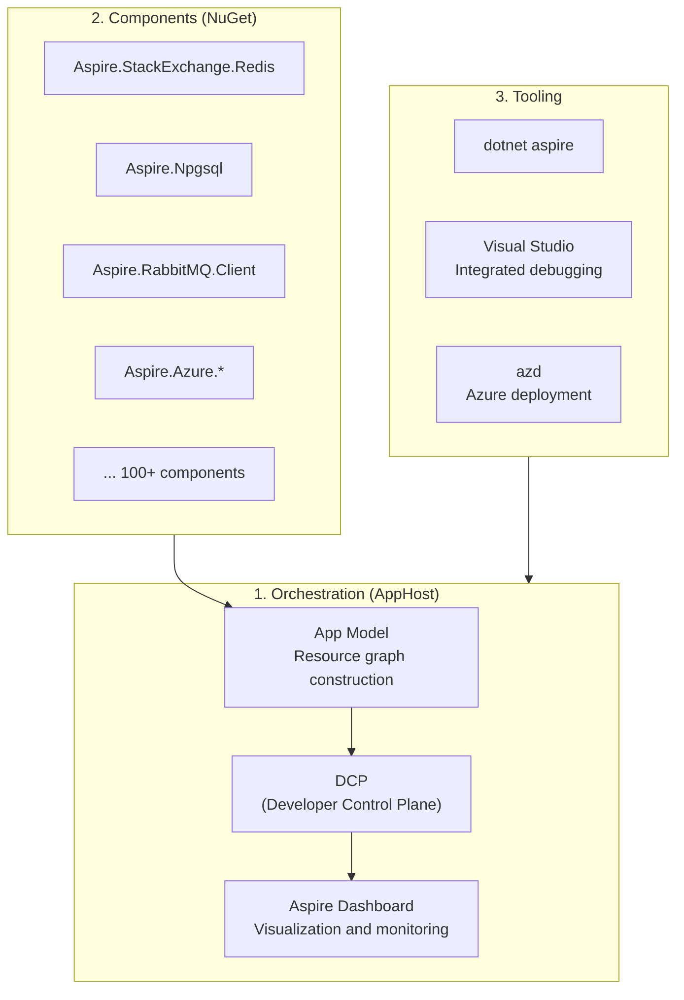

| Pillar | Role |
|--------|------|
| **Orchestration** | Define application composition and manage local execution |
| **Components** | Standardize client connections to external services (Redis, PostgreSQL, etc.) |
| **Tooling** | Support development, debugging, and deployment workflows |

The first pillar, **Orchestration**, is the central topic of this article. This is where the **AppHost** project comes in. AppHost is a dedicated console application that defines the "blueprint" of your entire application in C# code. It declares which services exist, which infrastructure they depend on, and how they connect. AppHost itself contains zero business logic — it deals purely with application composition.

The second pillar, **Components**, consists of NuGet packages installed in each service project (APIs, Workers, etc.). Packages like `Aspire.StackExchange.Redis` and `Aspire.Npgsql` automatically set up connection string resolution, health checks, and telemetry instrumentation. A developer writes just `builder.AddRedisClient("cache")` and gets a Redis client with connection management, monitoring, and failure detection all built in.

The third pillar, **Tooling**, provides end-to-end developer experience through Visual Studio, the `dotnet aspire` CLI, and the Azure Developer CLI (`azd`), supporting everything from project creation and local debugging to cloud deployment.

The following chapters focus on the first pillar — what is the App Model that AppHost builds, and how does it come to life locally — unraveling the framework's internals layer by layer.

## Chapter 1: App Model — Building the Resource Graph

### What Is the AppHost?

The starting point of .NET Aspire's orchestration is the **AppHost project**. AppHost is a special console application generated by `dotnet new aspire` or Visual Studio templates, living within your solution.

In a typical .NET solution, each project (Web API, Worker, Blazor frontend, etc.) starts and runs independently. But in a microservices setup, you need to manage **startup order and connectivity**: "start Redis and PostgreSQL first, run migrations, then bring up the API and Worker, and finally start the frontend." Traditionally, this was handled with `docker-compose.yml` or shell scripts, but AppHost expresses this **declaratively in C# code**.

The AppHost's `Program.cs` is fundamentally different from typical business logic code — it defines the **topology** (composition map) of your entire application. "This solution has Redis, PostgreSQL, and three .NET projects; the API depends on PostgreSQL and Redis; the Worker depends on RabbitMQ; the frontend depends on the API" — these relationships are described through method chains like `AddProject()`, `AddRedis()`, and `WithReference()`.

The AppHost's `.csproj` file lists `ProjectReference` entries for all orchestrated projects. At build time, a Source Generator analyzes these references and auto-generates the type-safe project metadata classes described below. In other words, AppHost is the **one place that surveys the entire solution** — the other projects have no awareness of its existence.

### What Is the App Model?

The core of .NET Aspire is the **App Model** — a **Directed Acyclic Graph (DAG)** representing all resources (projects, containers, executables, external services) and their dependencies. The sequence of `Add*()` and `WithReference()` calls in the AppHost's `Program.cs` constructs this DAG internally.

A DAG (Directed Acyclic Graph) is a graph structure with directed edges and no cycles. In Aspire, each resource (Redis, PostgreSQL, API service, etc.) is a node, and each `WithReference()` dependency is an edge. This structure allows Aspire to automatically derive startup order like "PostgreSQL → database migration → API service."

Below is a typical AppHost `Program.cs` and the resource graph it builds.

```csharp
// AppHost Program.cs
var builder = DistributedApplication.CreateBuilder(args);

// Add resources
var cache = builder.AddRedis("cache");
var postgres = builder.AddPostgres("pg")
    .AddDatabase("catalogdb");
var rabbit = builder.AddRabbitMQ("messaging");

// Project resources with their dependencies
var catalogApi = builder.AddProject<Projects.CatalogApi>("catalog-api")
    .WithReference(postgres)
    .WithReference(cache);

var orderProcessor = builder.AddProject<Projects.OrderProcessor>("order-processor")
    .WithReference(rabbit)
    .WithReference(postgres);

var webFrontend = builder.AddProject<Projects.WebFrontend>("web-frontend")
    .WithReference(catalogApi)
    .WithReference(cache)
    .WithExternalHttpEndpoints();

builder.Build().Run();
```

The resource graph built from this code:

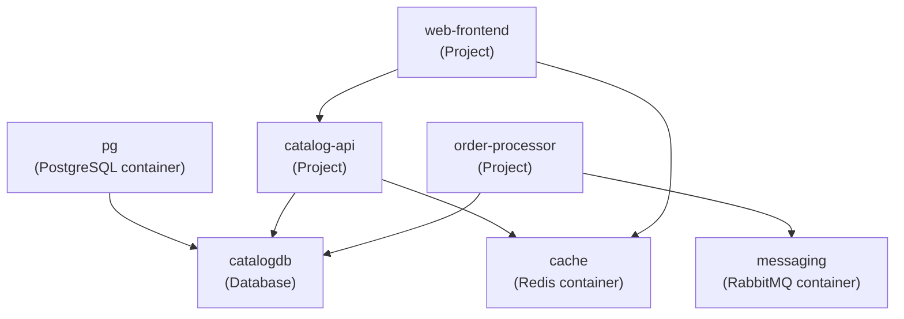

### How the `AddProject<T>()` Type Parameter Works

In the code above, we wrote `builder.AddProject<Projects.CatalogApi>("catalog-api")`. What exactly is `<Projects.CatalogApi>`? This is C#'s **generics** (type parameter) syntax — it treats the project as a "type."

When you add a project reference to the AppHost's `.csproj`:

```xml
<ProjectReference Include="..\CatalogApi\CatalogApi.csproj" />
```

Aspire's build tooling ([Source Generator](https://github.com/dotnet/aspire/blob/main/src/Aspire.Hosting/ProjectResourceBuilderExtensions.cs)) **auto-generates** a class under the `Projects` namespace. The generated code looks roughly like this:

```csharp
namespace Projects;

// Auto-generated at build time (not hand-written)
public class CatalogApi : IProjectMetadata
{
    public string ProjectPath => @"C:\src\CatalogApi\CatalogApi.csproj";
}
```

The `AddProject<T>()` method signature is:

```csharp
public static IResourceBuilder<ProjectResource> AddProject<TProject>(
    this IDistributedApplicationBuilder builder,
    string name)
    where TProject : IProjectMetadata, new()
```

The type constraint `where TProject : IProjectMetadata, new()` requires `TProject` to implement `IProjectMetadata` and have a parameterless constructor. Internally, the method calls `new TProject().ProjectPath` to obtain the `.csproj` path, allowing the orchestrator to identify which project to launch.

**Why use a type instead of a string path?** The main reason is **compile-time safety**. With a string path like `AddProject("../CatalogApi")`, a typo would only surface as a runtime error. With the type parameter `AddProject<Projects.CatalogApi>()`, if you remove or rename the project reference, `Projects.CatalogApi` simply ceases to exist and you get an **immediate build error**. IDE autocompletion and refactoring also work seamlessly, making it safe to manage resources even in large-scale microservice configurations.

### IResource Interface Hierarchy

Every resource registered in the App Model is an instance of a type that implements the `IResource` interface. Whether a "Redis container," ".NET project," or "RabbitMQ" — from Aspire's perspective, they're all equally "resources," represented by concrete classes like `ContainerResource`, `ProjectResource`, and `ExecutableResource`.

This type hierarchy also serves as the extension point for adding new resource kinds (e.g., Kafka, Elasticsearch, custom sidecars). All resources implement the [`IResource`](https://github.com/dotnet/aspire/blob/main/src/Aspire.Hosting/ApplicationModel/IResource.cs) interface:

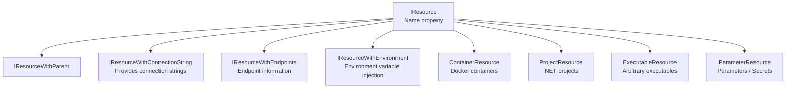

```csharp
// IResource definition
public interface IResource
{
    string Name { get; }
    ResourceAnnotationCollection Annotations { get; }
}

// ContainerResource example
public class RedisResource : ContainerResource, IResourceWithConnectionString
{
    public RedisResource(string name) : base(name) { }

    public ReferenceExpression ConnectionStringExpression =>
        ReferenceExpression.Create(
            $"{PrimaryEndpoint.Property(EndpointProperty.Host)}:{PrimaryEndpoint.Property(EndpointProperty.Port)}");
}
```

### Annotation-Based Extension Model

Looking at the resource type hierarchy, a natural question arises: "Where does Redis store its port number information?" "How is environment variable injection logic attached?" Aspire's answer is the **Annotation pattern**.

Rather than adding capabilities through class inheritance, Aspire "sticks post-it notes" of metadata onto resource objects. This is a **composition over inheritance** approach — method chains like `WithEndpoint()` and `WithEnvironment()` internally add annotation objects to the resource's `Annotations` collection. Thanks to this design, capabilities can be freely added to resources after the fact, without modifying the resource's type.

```csharp
// Annotation examples
public record EndpointAnnotation(
    string Name,
    string? Transport = null,
    string? Scheme = null,
    int? Port = null,
    int? TargetPort = null,
    bool IsExternal = false,
    bool IsProxied = true) : IResourceAnnotation;

public record EnvironmentCallbackAnnotation(
    Func<EnvironmentCallbackContext, Task> Callback)
    : IResourceAnnotation;

// What WithReference() does internally
public static IResourceBuilder<T> WithReference<T>(
    this IResourceBuilder<T> builder,
    IResourceBuilder<IResourceWithConnectionString> source)
    where T : IResourceWithEnvironment
{
    // Add an environment variable callback annotation
    return builder.WithEnvironment(context =>
    {
        var connectionString = source.Resource
            .ConnectionStringExpression;
        context.EnvironmentVariables[$"ConnectionStrings__{source.Resource.Name}"]
            = connectionString;
    });
}
```

| Annotation | Purpose |
|------------|---------|
| `EndpointAnnotation` | Define network endpoints |
| `EnvironmentCallbackAnnotation` | Dynamic environment variable injection |
| `ContainerImageAnnotation` | Docker image specification |
| `ContainerMountAnnotation` | Volume mount information |
| `HealthCheckAnnotation` | Health check method specification |
| `CommandLineArgsCallbackAnnotation` | Dynamic command-line argument construction |
| `ManifestPublishingCallbackAnnotation` | Deployment manifest generation method |

## Chapter 2: DCP (Developer Control Plane) — Local Orchestration

### What DCP Does

The App Model from Chapter 1 is just a "blueprint." An "execution engine" is needed to actually start containers, launch processes, and wire up networks. That engine is the **DCP (Developer Control Plane)**.

When you `dotnet run` the AppHost project, the App Model (DAG) is first built in memory. Then, this DAG is sent via gRPC to the DCP process. DCP takes the blueprint and executes: starting Docker containers, launching .NET project processes, allocating ports, and injecting connection strings. From the developer's perspective, a single `dotnet run` brings up the entire application, but behind the scenes there's a clear separation of responsibilities: AppHost → DCP → Docker/processes.

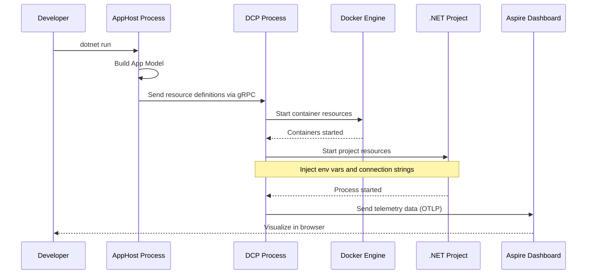

### DCP Internal Architecture

DCP is a lightweight control plane implemented in Go. "Inspired by Kubernetes" isn't just a metaphor — DCP literally adopts the same **declarative resource model** as Kubernetes Custom Resource Definitions (CRDs). Instead of receiving imperative commands like "start a Redis container on port 6379," DCP receives a **desired state** — "a Redis container should exist" — and runs a **reconciliation loop** to converge current state toward that desired state.

If a container crashes, DCP automatically restarts it. If an endpoint changes, the proxy configuration is updated. This self-healing behavior flows naturally from the declarative model. However, DCP does not require a Kubernetes cluster — it runs as a lightweight local process and only needs Docker Desktop.

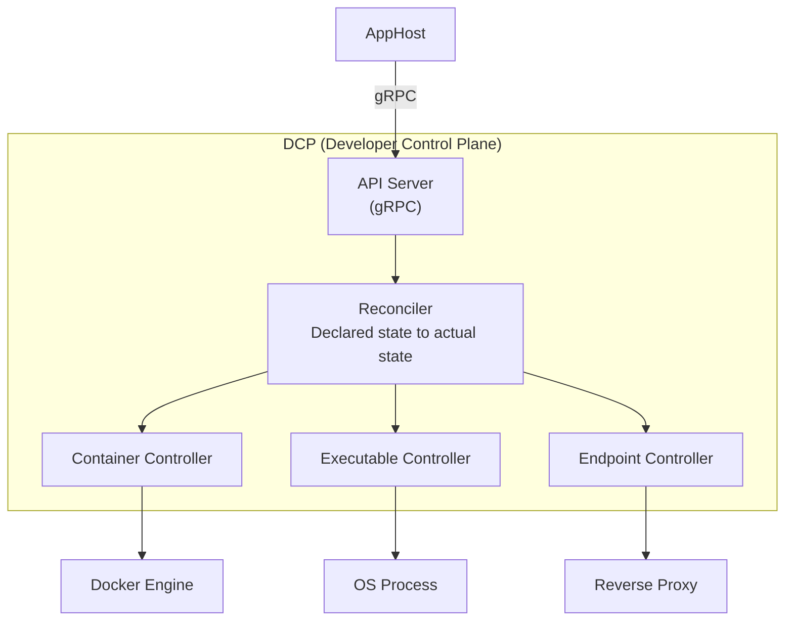

DCP resource model:

| DCP Resource | Concept | Description |
|-------------|---------|-------------|
| `Container` | Docker container | Image pull and startup |
| `Executable` | Process | .NET projects or arbitrary executables |
| `Endpoint` | Network | Port mapping and proxying |
| `ExecutableReplicaSet` | Replicas | Multiple instances of the same process |

### Startup Order and Dependency Resolution

Since the App Model is a DAG (Directed Acyclic Graph), DCP can apply **topological sort** to determine a safe startup order. Topological sort is an algorithm that finds a linear ordering for all edges (u → v) such that u comes before v.

Concretely, resources with no dependencies (Redis, PostgreSQL, RabbitMQ) start first, followed by resources that depend on them (API, Worker), and finally the frontend that depends on upstream services. Resources within the same phase start **in parallel**, minimizing total startup time.

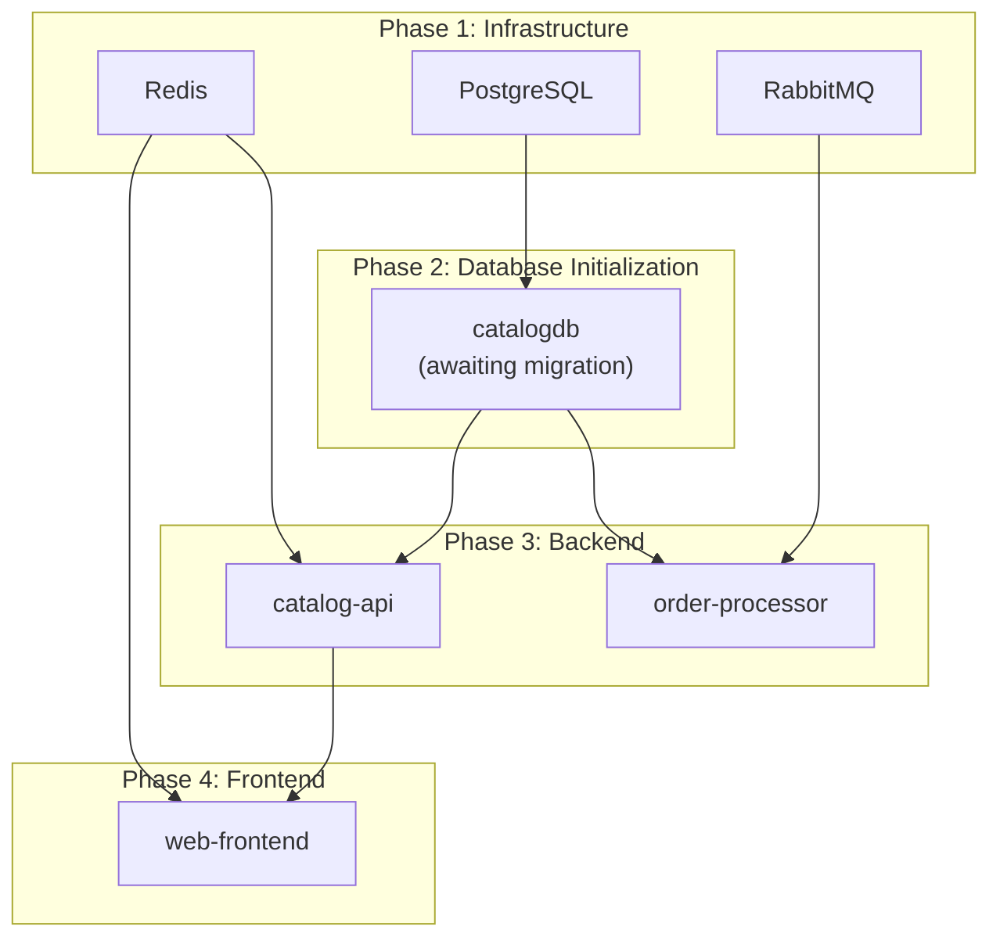

```csharp
// Explicit startup order control with WaitFor()
var postgres = builder.AddPostgres("pg")
    .AddDatabase("catalogdb");

var migration = builder.AddProject<Projects.DbMigration>("migration")
    .WithReference(postgres)
    .WaitFor(postgres); // Wait for PostgreSQL to be ready

var api = builder.AddProject<Projects.Api>("api")
    .WithReference(postgres)
    .WaitFor(migration); // Wait for migration to complete
```

`WaitFor()` internally uses health checks to confirm the readiness of dependent resources.

## Chapter 3: Service Discovery — Dynamic Endpoint Resolution

### Connection Strings and Environment Variables

One unavoidable problem in microservice architectures is "how does Service A connect to Service B?" Hardcoding IP addresses and port numbers is out of the question, and managing connection settings in configuration files is cumbersome since they differ between local development and cloud deployment.

Aspire solves this with **automatic injection via environment variables**. When you declare dependencies with `WithReference()`, DCP automatically injects the upstream resource's **connection strings** and **endpoint URLs** as environment variables when starting downstream service processes. Developers don't need to be aware of connection targets in their code — just writing `IConfiguration.GetConnectionString("cache")` retrieves the Aspire-injected value.

```csharp
// From this declaration...
var cache = builder.AddRedis("cache");
var api = builder.AddProject<Projects.Api>("api")
    .WithReference(cache);

// The following environment variable is injected into the api process:
// ConnectionStrings__cache = "localhost:63241"
```

Environment variable naming conventions:

| Reference Type | Environment Variable Pattern | Example |
|---------------|------------------------------|---------|
| Connection string | `ConnectionStrings__{name}` | `ConnectionStrings__cache` |
| HTTP endpoint | `services__{name}__http__0` | `services__catalog-api__http__0` |
| HTTPS endpoint | `services__{name}__https__0` | `services__catalog-api__https__0` |

### How Service Discovery Works

Environment variable injection is "static" endpoint resolution. But what about when services have replicas, or endpoints change dynamically? This is where Aspire's service discovery mechanism comes in.

The `Microsoft.Extensions.ServiceDiscovery` package inserts an intercept handler into the HttpClient pipeline. When a developer specifies a URL with a **logical name** (service name) like `http://catalog-api/api/products`, the handler intercepts the request and transparently resolves it to the actual endpoint (`https://localhost:7234/api/products`) using environment variables or DNS SRV records. Since no physical addresses appear in the code, no code changes are needed between local development and cloud environments.

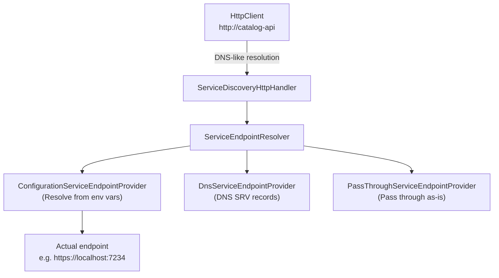

```csharp
// Service discovery usage (ServiceDefaults project)
builder.Services.AddServiceDiscovery();
builder.Services.ConfigureHttpClientDefaults(http =>
{
    http.AddServiceDiscovery(); // Apply service discovery to all HttpClients
});

// Consumer: request using logical names
app.MapGet("/products", async (HttpClient client) =>
{
    // "https://catalog-api" resolves to the actual endpoint
    var products = await client.GetFromJsonAsync<Product[]>(
        "https://catalog-api/api/products");
    return products;
});
```

### Endpoint Resolution Priority

1. **Configuration** — Resolve from environment variables `services__{name}__{scheme}__{index}`
2. **DNS SRV** — Resolve from DNS SRV records (useful in Kubernetes)
3. **Pass-through** — Hostname passes through (traditional DNS resolution)

```csharp
// Actual environment variable values injected by Aspire
// services__catalog-api__https__0 = "https://localhost:7234"
// services__catalog-api__http__0 = "http://localhost:5234"

// ServiceDiscovery resolves:
// "https://catalog-api" -> "https://localhost:7234"
```

### Load Balancing

Service discovery also supports client-side load balancing:

```csharp
// Configure replicas
var api = builder.AddProject<Projects.Api>("api")
    .WithReplicas(3); // Start 3 instances

// ServiceDiscovery distributes via round-robin
// services__api__https__0 = "https://localhost:7234"
// services__api__https__1 = "https://localhost:7235"
// services__api__https__2 = "https://localhost:7236"
```

## Chapter 4: Component System — Standardized Client Configuration

### Component Philosophy

.NET Aspire components are NuGet packages that provide the following for client connections to external services:

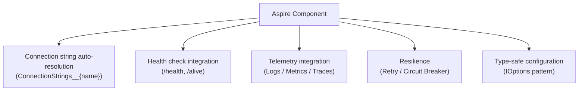

### Component Internals

To see how the "all-in-one in a single line" is achieved, let's examine the internals of `Aspire.StackExchange.Redis`. The `AddRedisClient()` method executes five steps in sequence: bind settings → retrieve connection string → register with DI container → add health checks → configure telemetry instrumentation. By having all these steps cohesive within a single method, the problem of forgetting just one part of the configuration is structurally eliminated.

```csharp
// AddRedisClient() internal implementation (simplified)
public static void AddRedisClient(
    this IHostApplicationBuilder builder,
    string connectionName,
    Action<AspireRedisSettings>? configureSettings = null)
{
    // 1. Bind settings
    var settings = new AspireRedisSettings();
    builder.Configuration
        .GetSection($"Aspire:StackExchange:Redis:{connectionName}")
        .Bind(settings);
    configureSettings?.Invoke(settings);

    // 2. Retrieve connection string
    var connectionString = settings.ConnectionString
        ?? builder.Configuration.GetConnectionString(connectionName);

    // 3. Register IConnectionMultiplexer
    builder.Services.AddSingleton<IConnectionMultiplexer>(sp =>
    {
        var options = ConfigurationOptions.Parse(connectionString!);
        return ConnectionMultiplexer.Connect(options);
    });

    // 4. Register health checks
    if (!settings.DisableHealthChecks)
    {
        builder.Services.AddHealthChecks()
            .AddRedis(connectionString!,
                name: $"Redis_{connectionName}",
                tags: ["ready"]);
    }

    // 5. Configure telemetry
    if (!settings.DisableTracing)
    {
        builder.Services.AddOpenTelemetry()
            .WithTracing(tracing =>
                tracing.AddRedisInstrumentation());
    }
}
```

### Hosting vs Client Packages

An important distinction for understanding Aspire components is between **hosting packages** and **client packages**. Even for the same Redis, two types of NuGet packages exist, each installed in different projects.

Hosting packages (`Aspire.Hosting.Redis`) are installed in the AppHost project and define "how to start the Redis container." Client packages (`Aspire.StackExchange.Redis`) are installed in each service project and configure "how to connect to Redis." The bridge between them is the environment variable (`ConnectionStrings__cache`) injected by DCP.

| Package | Purpose | Install In |
|---------|---------|-----------|
| `Aspire.Hosting.Redis` | Define Redis container | AppHost project |
| `Aspire.StackExchange.Redis` | Configure Redis client | Service project |

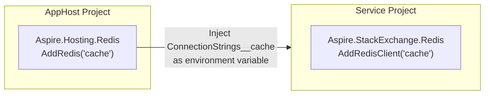

## Chapter 5: ServiceDefaults — Standardizing Cross-Cutting Concerns

### The Role of ServiceDefaults

While individual components provide best practices per external service, **ServiceDefaults** is a project that consolidates the cross-cutting concerns of the services themselves.

"Cross-cutting concerns" are functions orthogonal to business logic but needed by every service: telemetry collection, health check endpoints, service discovery, HTTP retry policies. Configuring these individually per service leads to inconsistency. ServiceDefaults is implemented as a shared class library — all service projects call `builder.AddServiceDefaults()` and unified configuration is applied.

Below is the structure of the `AddServiceDefaults()` method. Notice how just a few lines set up OpenTelemetry, health checks, service discovery, and retry all at once.

```csharp
// ServiceDefaults/Extensions.cs overall structure
public static IHostApplicationBuilder AddServiceDefaults(
    this IHostApplicationBuilder builder)
{
    // 1. Configure OpenTelemetry
    builder.ConfigureOpenTelemetry();

    // 2. Add health check endpoints
    builder.AddDefaultHealthChecks();

    // 3. Register service discovery
    builder.Services.AddServiceDiscovery();

    // 4. Configure HttpClient defaults
    builder.Services.ConfigureHttpClientDefaults(http =>
    {
        http.AddStandardResilienceHandler(); // Retry + Circuit Breaker
        http.AddServiceDiscovery();          // Service discovery
    });

    return builder;
}
```

### OpenTelemetry Integration Details

Aspire's choice of OpenTelemetry is no accident. OpenTelemetry is an open standard hosted by the CNCF (Cloud Native Computing Foundation) that handles logs, metrics, and traces in a unified way without vendor lock-in. Aspire automates each service's OpenTelemetry SDK configuration and specifies the Aspire Dashboard's OTLP Receiver as the data destination via an environment variable (`OTEL_EXPORTER_OTLP_ENDPOINT`).

Notably, this configuration happens **dynamically at runtime via environment variables** — not in AppHost or ServiceDefaults. During local development, data is sent to the Dashboard; in production, it can be switched to Jaeger, Azure Monitor, or another backend — with no code changes.

```csharp
public static IHostApplicationBuilder ConfigureOpenTelemetry(
    this IHostApplicationBuilder builder)
{
    // Logging
    builder.Logging.AddOpenTelemetry(logging =>
    {
        logging.IncludeFormattedMessage = true;
        logging.IncludeScopes = true;
    });

    // Metrics and Traces
    builder.Services.AddOpenTelemetry()
        .WithMetrics(metrics =>
        {
            metrics.AddAspNetCoreInstrumentation()  // HTTP metrics
                   .AddHttpClientInstrumentation()   // HttpClient metrics
                   .AddRuntimeInstrumentation();     // .NET runtime metrics
        })
        .WithTracing(tracing =>
        {
            tracing.AddAspNetCoreInstrumentation()   // HTTP traces
                   .AddGrpcClientInstrumentation()    // gRPC traces
                   .AddHttpClientInstrumentation();   // HttpClient traces
        });

    // OTLP exporter configuration
    builder.AddOpenTelemetryExporters();

    return builder;
}

private static IHostApplicationBuilder AddOpenTelemetryExporters(
    this IHostApplicationBuilder builder)
{
    // Use OTLP exporter if OTEL_EXPORTER_OTLP_ENDPOINT is set
    // Aspire Dashboard automatically sets this environment variable
    var otlpEndpoint = builder.Configuration["OTEL_EXPORTER_OTLP_ENDPOINT"];
    if (!string.IsNullOrWhiteSpace(otlpEndpoint))
    {
        builder.Services.AddOpenTelemetry()
            .UseOtlpExporter(); // Send to Dashboard via gRPC over HTTP/2
    }

    return builder;
}
```

Telemetry data flow:

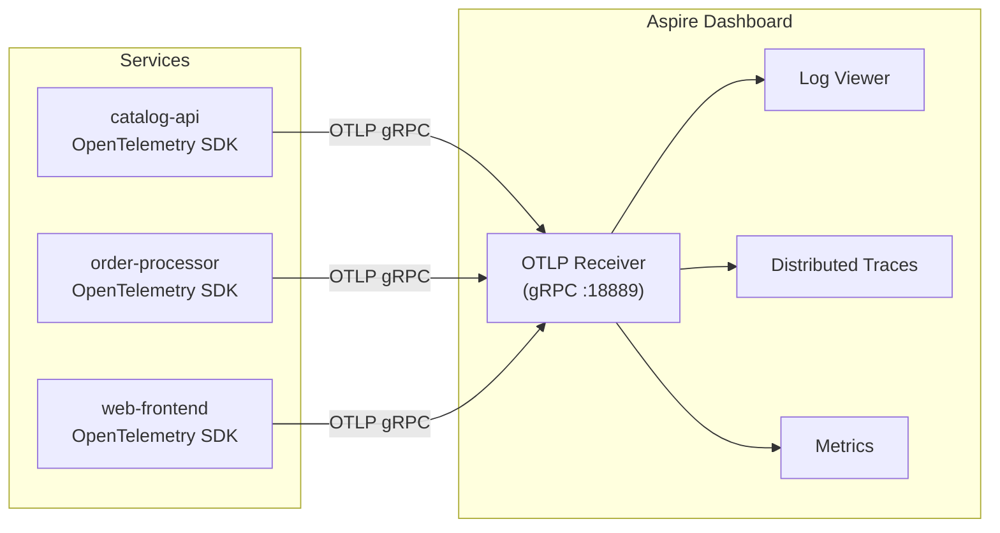

## Chapter 6: Aspire Dashboard — Integrated Observability

### Dashboard Architecture

Even if ServiceDefaults configures telemetry instrumentation in every service, it's meaningless without a destination to receive and visualize the data. The Aspire Dashboard serves as that receiver — a **Blazor Server** application.

When you start AppHost, DCP automatically launches the Dashboard as a Docker container (typically accessible at `http://localhost:15888`). The Dashboard operates as an OTLP (OpenTelemetry Protocol) receiver, ingesting logs, metrics, and distributed traces from all services in real time. The data is stored in an in-memory circular buffer and can be explored interactively in the browser.

When an error occurs during development, opening the Dashboard's distributed tracing view instantly shows "which operation in which service took how many milliseconds, and where the error occurred." Work that previously required correlating log files from multiple services is now accomplished in a single screen.

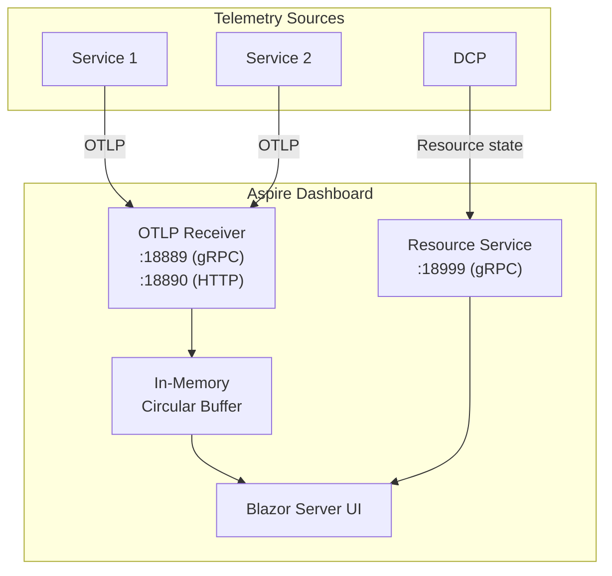

| Feature | Description |
|---------|-------------|
| **Resource list** | View status, startup logs, and environment variables for all resources |
| **Structured logs** | Filter and search logs collected via OpenTelemetry |
| **Distributed traces** | Visualize request flow across services |
| **Metrics** | Real-time HTTP request rate, latency, and error rate display |

### Standalone Dashboard Usage

The Dashboard is also available as a standalone Docker container:

```bash
docker run --rm -it -d \
  -p 18888:18888 \
  -p 4317:18889 \
  -p 4318:18890 \
  --name aspire-dashboard \
  mcr.microsoft.com/dotnet/aspire-dashboard:9.0
```

In this mode, it can receive telemetry from any OTLP-compatible application (Java, Go, Python, etc.).

## Chapter 7: Health Checks and Readiness

### Health Check Hierarchy

In distributed systems, "the service process is running" and "the service can correctly handle requests" are separate problems. The process may be alive but unable to handle requests if the DB connection is down.

.NET Aspire expresses this distinction through two tiers: **Liveness** (survival check) and **Readiness** (readiness check). Liveness (`/alive`) only verifies "does the process respond" and is used to detect deadlocks or memory exhaustion. Readiness (`/health`) checks all dependencies including DB, Redis, and dependent services to determine "is it safe to accept traffic."

These two tiers map directly to Kubernetes's `livenessProbe` and `readinessProbe`, so the same health check definitions are reused between local development and Kubernetes deployment. AppHost's `WaitFor()` polls the Readiness endpoint to delay downstream startup until dependent resources are truly "usable."

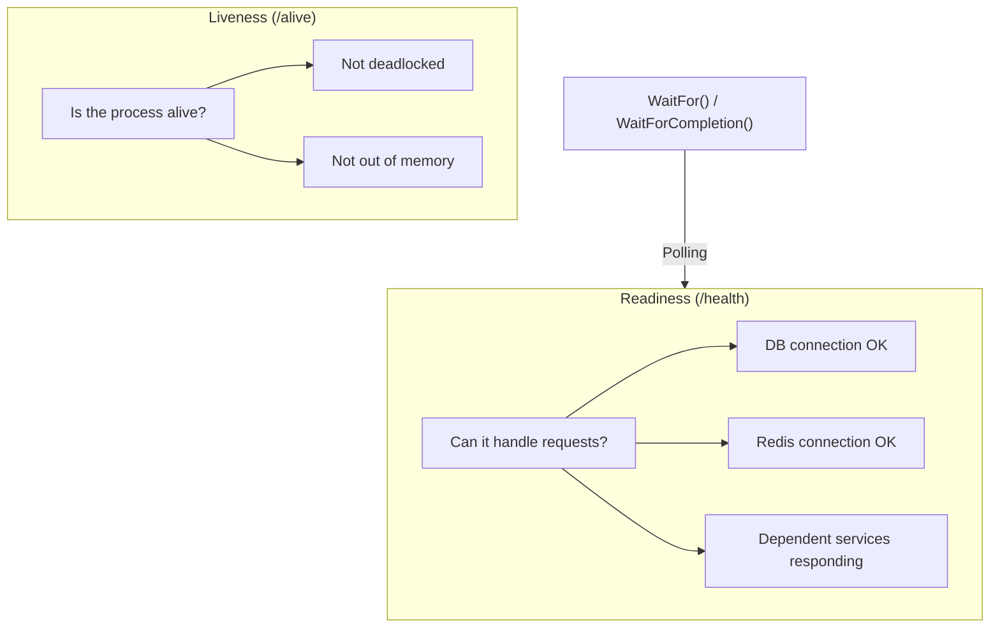

```csharp
// Health checks configured in ServiceDefaults
public static IHostApplicationBuilder AddDefaultHealthChecks(
    this IHostApplicationBuilder builder)
{
    builder.Services.AddHealthChecks()
        // Liveness: is the application process responding?
        .AddCheck("self", () => HealthCheckResult.Healthy(),
            tags: ["live"]);

    return builder;
}

public static WebApplication MapDefaultEndpoints(
    this WebApplication app)
{
    // Readiness endpoint: evaluate all health checks
    app.MapHealthChecks("/health");

    // Liveness endpoint: only checks tagged "live"
    app.MapHealthChecks("/alive", new()
    {
        Predicate = r => r.Tags.Contains("live")
    });

    return app;
}
```

### WaitFor Internals

`WaitFor()` causes DCP to poll the dependent resource's health check endpoint, delaying dependent resource startup until a `Healthy` response is received.

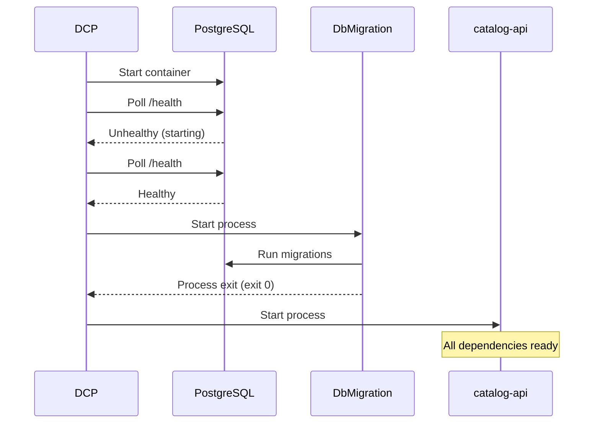

## Chapter 8: Resilience and Retry

### Standard Resilience Handler

In distributed systems, network latency, transient failures, and service restarts are everyday occurrences. Without countermeasures in client code, a temporary slowdown in one service triggers a storm of retries and cascade of timeouts that can bring down the entire system.

The `AddStandardResilienceHandler()` in ServiceDefaults uses `Microsoft.Extensions.Http.Resilience` (internally powered by [Polly v8](https://github.com/App-vNext/Polly)) to automatically apply a **5-layer resilience pipeline** to all `HttpClient` instances. Each layer wraps requests from the outside in, addressing various failure patterns.

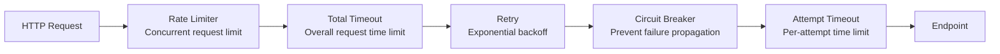

| Layer | Default | Description |
|-------|---------|-------------|
| **Rate Limiter** | 1,000 concurrent requests | Limit concurrent requests to downstream services |
| **Total Request Timeout** | 30 seconds | Timeout for entire request including retries |
| **Retry** | Max 3 attempts, exponential backoff | Recovery from transient failures |
| **Circuit Breaker** | 10% failure ratio, 30s sampling | Prevent failure cascading |
| **Attempt Timeout** | 10 seconds | Timeout for individual request attempts |

```csharp
// Customization example
builder.Services.ConfigureHttpClientDefaults(http =>
{
    http.AddStandardResilienceHandler(options =>
    {
        options.Retry.MaxRetryAttempts = 5;
        options.Retry.BackoffType = DelayBackoffType.Exponential;
        options.Retry.Delay = TimeSpan.FromMilliseconds(500);

        options.CircuitBreaker.SamplingDuration = TimeSpan.FromSeconds(60);
        options.CircuitBreaker.FailureRatio = 0.2;

        options.TotalRequestTimeout.Timeout = TimeSpan.FromSeconds(60);
    });
});
```

## Chapter 9: Deployment Manifests — From Local to Cloud

### Manifest Generation

The preceding chapters covered how AppHost functions in local development. But Aspire's ambition extends beyond local development. The App Model that AppHost builds can be exported as a **deployment manifest** in JSON, turning the local composition definition directly into a blueprint for cloud deployment.

This is the essence of the developer experience: "what works locally goes straight to production." Manual translation from `docker-compose.yml` to Kubernetes manifests or Terraform definitions becomes unnecessary — the AppHost's C# code functions as the **Single Source of Truth**.

```bash
# Generate manifest
dotnet run --project AppHost -- --publisher manifest --output-path manifest.json
```

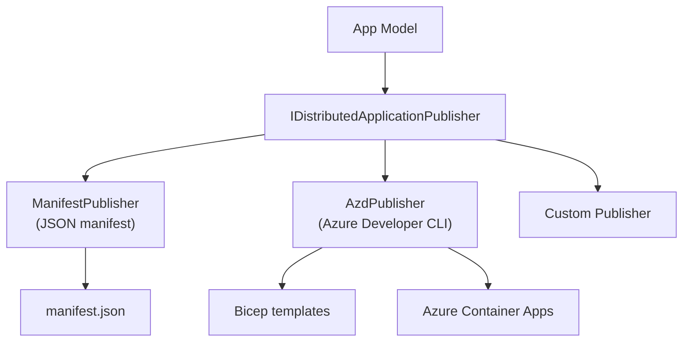

### Manifest Structure

The generated manifest contains all connection information and deployment settings:

```json
{
  "resources": {
    "cache": {
      "type": "container.v0",
      "connectionString": "{cache.bindings.tcp.host}:{cache.bindings.tcp.port}",
      "image": "docker.io/library/redis:7.4",
      "bindings": {
        "tcp": {
          "scheme": "tcp",
          "protocol": "tcp",
          "transport": "tcp",
          "targetPort": 6379
        }
      }
    },
    "catalog-api": {
      "type": "project.v0",
      "path": "../CatalogApi/CatalogApi.csproj",
      "env": {
        "ConnectionStrings__cache": "{cache.connectionString}"
      },
      "bindings": {
        "http": { "scheme": "http", "protocol": "tcp", "transport": "http" },
        "https": { "scheme": "https", "protocol": "tcp", "transport": "http" }
      }
    }
  }
}
```

### Deploying to Azure Container Apps

`azd` (Azure Developer CLI) reads the Aspire manifest and auto-provisions Azure resources:

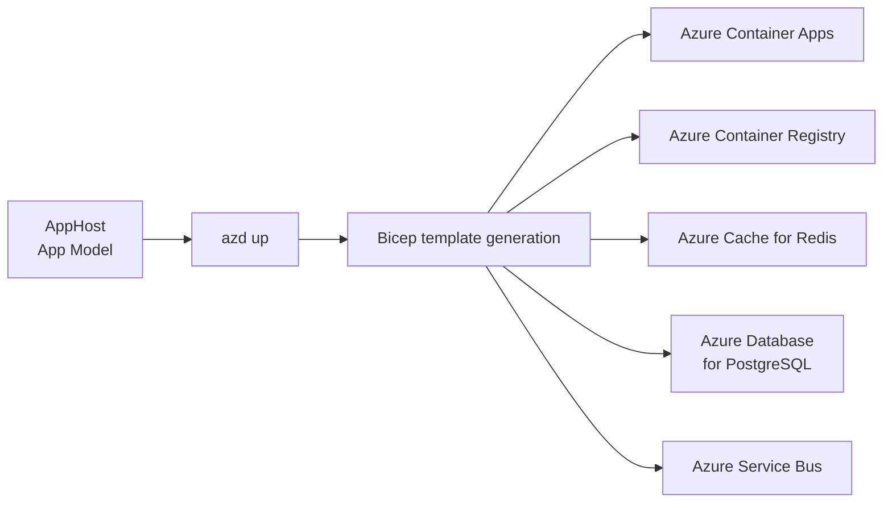

| Aspire Resource | Azure Mapping |
|----------------|--------------|
| `AddRedis()` | Azure Cache for Redis |
| `AddPostgres()` | Azure Database for PostgreSQL |
| `AddRabbitMQ()` | Azure Service Bus |
| `AddProject()` | Azure Container Apps |
| Container resources | Azure Container Apps (custom container) |

## Chapter 10: Creating Custom Resources

### Custom Resource Implementation Pattern

The resources Aspire provides out of the box (Redis, PostgreSQL, RabbitMQ, etc.) are convenient, but real projects inevitably have scenarios that go beyond them. A local dev mail server (MailDev), an internal queue system, a custom sidecar process — there are cases where you want to integrate "infrastructure Aspire doesn't know about" as resources.

Aspire addresses this with **custom resources** as an extension point. The implementation flow is straightforward: (1) define a resource class inheriting from `ContainerResource` or similar, (2) create a builder extension method like `AddMailDev()`, and (3) use it in the AppHost's `Program.cs` just like any other resource. Custom resources participate fully in the same ecosystem (health checks, telemetry, dependency via `WithReference()`) as built-in resources.

```csharp
// 1. Define the resource class
public class MailDevResource : ContainerResource, IResourceWithConnectionString
{
    public MailDevResource(string name) : base(name) { }

    // SMTP endpoint
    private EndpointReference? _smtpEndpoint;
    public EndpointReference SmtpEndpoint =>
        _smtpEndpoint ??= new(this, "smtp");

    // Web UI endpoint
    private EndpointReference? _httpEndpoint;
    public EndpointReference HttpEndpoint =>
        _httpEndpoint ??= new(this, "http");

    // Connection string expression
    public ReferenceExpression ConnectionStringExpression =>
        ReferenceExpression.Create(
            $"smtp://{SmtpEndpoint.Property(EndpointProperty.Host)}:{SmtpEndpoint.Property(EndpointProperty.Port)}");
}

// 2. Define builder extension method
public static class MailDevResourceExtensions
{
    public static IResourceBuilder<MailDevResource> AddMailDev(
        this IDistributedApplicationBuilder builder,
        string name,
        int? smtpPort = null,
        int? httpPort = null)
    {
        return builder.AddResource(new MailDevResource(name))
            .WithImage("maildev/maildev", "2.1.0")
            .WithHttpEndpoint(
                port: httpPort,
                targetPort: 1080,
                name: "http")
            .WithEndpoint(
                port: smtpPort,
                targetPort: 1025,
                name: "smtp",
                scheme: "tcp")
            .WithHealthCheck("smtp"); // Add health check
    }
}

// 3. Usage in AppHost
var maildev = builder.AddMailDev("mail");
var api = builder.AddProject<Projects.Api>("api")
    .WithReference(maildev); // ConnectionStrings__mail is injected
```

### Custom Resource Lifecycle Hooks

```csharp
// Intercept resource lifecycle with IDistributedApplicationLifecycleHook
public class DatabaseSeederHook : IDistributedApplicationLifecycleHook
{
    public async Task AfterResourcesCreatedAsync(
        DistributedApplicationModel appModel,
        CancellationToken cancellationToken)
    {
        // Runs after all resources are started
        var dbResource = appModel.Resources
            .OfType<PostgresDatabaseResource>()
            .FirstOrDefault();

        if (dbResource != null)
        {
            // Seed data, etc.
        }
    }
}

// Registration
builder.Services
    .AddLifecycleHook<DatabaseSeederHook>();
```

## Chapter 11: Testing and Integration

### DistributedApplicationTestingBuilder

Integration testing of microservices has traditionally been difficult. Manually starting each service, provisioning test infrastructure, and cleaning up afterward — this overhead often leads to skipped tests or insufficient coverage.

Aspire fundamentally solves this problem by providing `DistributedApplication.TestingBuilder`. Within test code, you can start the entire AppHost and send HTTP requests against an environment with real containers and processes running. These are **real integration tests** using actual infrastructure (PostgreSQL and Redis running in Docker), not mocks or stubs. On test completion, resources are automatically cleaned up via the `await using` pattern.

```csharp
public class AppHostTests
{
    [Fact]
    public async Task CatalogApiReturnsProducts()
    {
        // Start the entire AppHost
        var appHost = await DistributedApplicationTestingBuilder
            .CreateAsync<Projects.AppHost>();

        await using var app = await appHost.BuildAsync();
        await app.StartAsync();

        // Get HttpClient for catalog-api
        var httpClient = app.CreateHttpClient("catalog-api");

        // Make a request to the API
        var response = await httpClient.GetAsync("/api/products");
        response.EnsureSuccessStatusCode();

        var products = await response.Content
            .ReadFromJsonAsync<List<Product>>();
        Assert.NotEmpty(products);
    }

    [Fact]
    public async Task WebFrontendIsHealthy()
    {
        var appHost = await DistributedApplicationTestingBuilder
            .CreateAsync<Projects.AppHost>();

        await using var app = await appHost.BuildAsync();
        await app.StartAsync();

        // Check health endpoint
        var httpClient = app.CreateHttpClient("web-frontend");
        var response = await httpClient.GetAsync("/health");
        Assert.Equal(HttpStatusCode.OK, response.StatusCode);
    }
}
```

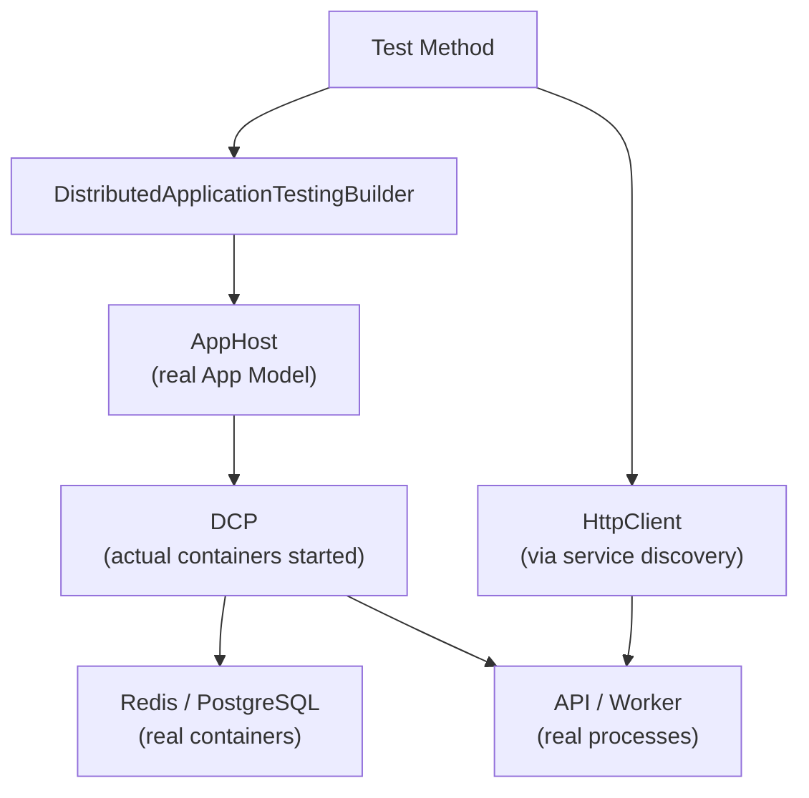

### Customizing Test Configuration

You can override settings and customize the service collection during testing:

```csharp
var appHost = await DistributedApplicationTestingBuilder
    .CreateAsync<Projects.AppHost>(args =>
    {
        // Override test-specific settings
        args.Configuration["Parameters:pgPassword"] = "test-password";
    });

// Configure HttpClient defaults for testing
appHost.Services.ConfigureHttpClientDefaults(http =>
{
    http.AddStandardResilienceHandler();
});
```

## Chapter 12: .NET Aspire 9.x Evolution

### Major New Features

Aspire has a fast release cadence. Aspire 9, released alongside .NET 9, incorporates many improvements reflecting community feedback. The most notable new features focus on further improving the developer experience.

`WaitFor` / `WaitForCompletion` are the declarative startup order control APIs introduced in Chapter 2, officially added in Aspire 9. `Persistent Containers` eliminates the wait time of container recreation on every `dotnet run` restart. `Resource Commands` and `Custom Resource States` are Dashboard extension points that make custom resource operations more interactive. The `Eventing Model` hooks into resource lifecycles, enabling declarative event-driven patterns like "execute specific processing when Redis finishes starting."

| Feature | Description |
|---------|-------------|
| **WaitFor / WaitForCompletion** | Declaratively control startup order between resources |
| **Persistent Containers** | Keep containers alive across `dotnet run` restarts |
| **Resource Commands** | Execute custom commands from the Dashboard |
| **Custom Resource States** | Report custom resource states |
| **Eventing Model** | Subscribe to resource lifecycle events |

### Eventing Model

```csharp
// Subscribe to resource events
var cache = builder.AddRedis("cache");

builder.Eventing.Subscribe<ResourceReadyEvent>(
    cache.Resource,
    async (evt, ct) =>
    {
        // Runs when Redis is ready
        Console.WriteLine($"{evt.Resource.Name} is ready!");
    });

builder.Eventing.Subscribe<BeforeResourceStartedEvent>(
    cache.Resource,
    async (evt, ct) =>
    {
        // Runs before Redis starts
        Console.WriteLine($"{evt.Resource.Name} is about to start");
    });
```

### Persistent Containers

```csharp
// Container persistence (survives restarts)
var postgres = builder.AddPostgres("pg")
    .WithLifetime(ContainerLifetime.Persistent) // Default is Session
    .AddDatabase("catalogdb");

// Session: container stops when AppHost stops
// Persistent: container survives AppHost shutdown (faster restarts)
```

## Complete Aspire Architecture

Finally, let's bring the entire .NET Aspire architecture together in one diagram:

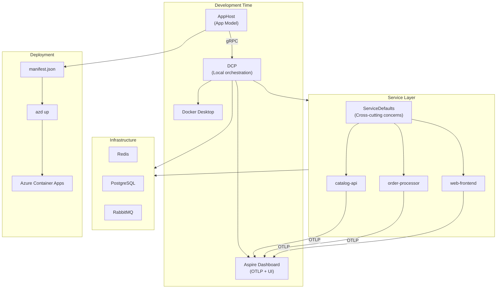

## Summary

.NET Aspire is not just a project template or code generation tool. From declarative composition via AppHost, through local orchestration by DCP, automatic best-practice application via components, to cloud migration via deployment manifests — it covers the **entire lifecycle** of distributed application development.

Its essence is "taking on the accidental complexity of infrastructure connectivity, monitoring, and fault tolerance so that developers can focus on what they should be doing: implementing business logic." The following design principles support this:

1. **Declarative App Model** — Express resources and their dependencies in code
2. **Local-first Orchestration** — Optimize developer experience via DCP
3. **Built-in Observability** — Standard OpenTelemetry integration
4. **Standardized Resilience** — Default retry and circuit breaker policies
5. **Smooth Cloud Migration** — Deployment abstraction via manifests
6. **Extensibility** — Custom resources, lifecycle hooks, eventing model

## References

- [.NET Aspire Official Documentation](https://learn.microsoft.com/dotnet/aspire/)
- [.NET Aspire Source Code (GitHub)](https://github.com/dotnet/aspire)
- [.NET Aspire Samples (GitHub)](https://github.com/dotnet/aspire-samples)
- [Microsoft.Extensions.ServiceDiscovery Source Code](https://github.com/dotnet/aspire/tree/main/src/Microsoft.Extensions.ServiceDiscovery)
- [Using the Aspire Dashboard Standalone](https://learn.microsoft.com/dotnet/aspire/fundamentals/dashboard/standalone)
- [.NET Aspire Component Overview](https://learn.microsoft.com/dotnet/aspire/fundamentals/components-overview)
