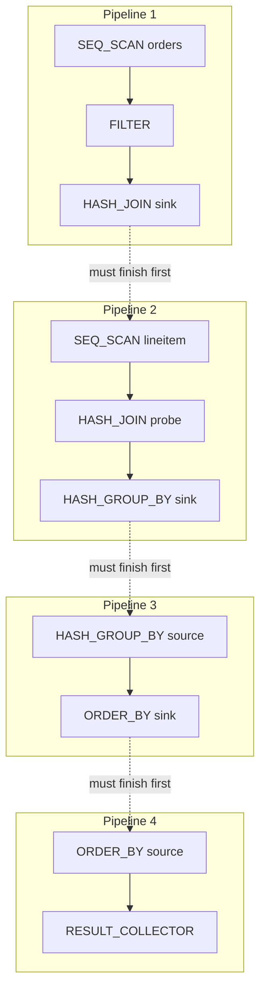
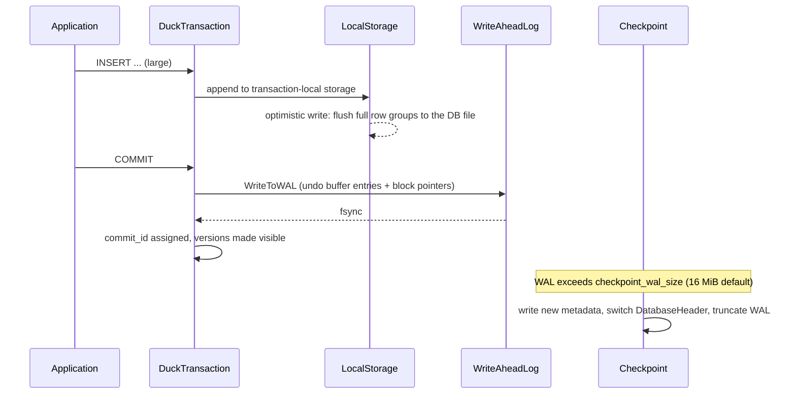

`pip install duckdb`, and three seconds later you are running `SELECT`. No server to start. No config file. And yet it aggregates a hundred million rows of Parquet in seconds. That "this is so fast it makes me nervous" feeling you get the first time has very concrete technical reasons behind it.

This article reads DuckDB <strong>not as a tool but as a machine</strong>: the data representation of its vectorized execution engine, its push-based pipelines, parallelism without a single exchange operator, a columnar store sealed inside one file, HyPer-style MVCC, and the ART index. For each, we go all the way down to which struct in which file of [`duckdb/duckdb`](https://github.com/duckdb/duckdb) does the work.

> <strong>The kitchen analogy, up front</strong>
>
> If a row-oriented OLTP database is a counter that cooks one dish per order, DuckDB is <strong>a kitchen that preps 2048 plates of the same dish at once</strong>.
>
> - <strong>Vectorization</strong>: stop re-asking "is this an int? is it NULL?" for every row; decide once and apply it to 2048 values.
> - <strong>Push-based</strong>: the customer (the parent operator) does not call for "the next plate"; the kitchen (the child operator) pushes finished plates onto the pass.
> - <strong>Morsel-driven</strong>: split the prep work into small units (row groups) and let any free cook grab the next one — nobody waits to be assigned.
> - <strong>Columnar + compression</strong>: box the ingredients by ingredient, not by dish. Identical things sit together, so whole boxes compress.
>
> When those four click together, single-node analytics gets absurdly fast.

## 1. Where DuckDB Sits

DuckDB is an <strong>embedded analytical (OLAP) database</strong> started by Mark Raasveldt and Hannes Mühleisen at CWI (Centrum Wiskunde & Informatica). The quickest way to place it is a two-by-two:

| | Transactional (OLTP) | Analytical (OLAP) |
| --- | --- | --- |
| <strong>Client–server</strong> | PostgreSQL, MySQL | Snowflake, ClickHouse, BigQuery |
| <strong>Embedded (in-process)</strong> | SQLite | <strong>DuckDB</strong> |

That is where "the SQLite of OLAP" comes from. But the similarity is in <strong>how it is deployed</strong>, not in <strong>what is inside</strong>. SQLite is row-oriented, B-tree based, with a tuple-at-a-time bytecode VM. DuckDB is columnar, vectorized and push-based. All they share is being a library linked into the host process.

<DuckDBArchitecture />

The biggest consequence of that placement is that <strong>no wire protocol and no serialization sit in the path</strong>. Handing a hundred million result rows to Python from PostgreSQL means encoding to a wire protocol, pushing it through TCP and decoding again. DuckDB stays on one process heap throughout.

"Zero copy" does mean different things in each direction, though. <strong>Inbound</strong> it is literal, but by two different routes. `SELECT * FROM my_df` goes through the pandas scan, where `ScanNumpyColumn` / `ScanNumpyFpColumn` hand the caller's NumPy buffer straight to `FlatVector::SetData` — but only when `stride == sizeof(T)`; a strided array falls into a gather loop instead, and object columns are always converted (that code lives not in the core but in the separate [`duckdb/duckdb-python`](https://github.com/duckdb/duckdb-python) repository, `src/numpy/numpy_scan.cpp`). `duckdb.from_arrow(tbl)` takes the Arrow table function instead, where `DirectConversion` in [`src/function/table/arrow_conversion.cpp`](https://github.com/duckdb/duckdb/blob/main/src/function/table/arrow_conversion.cpp) calls `FlatVector::SetData` on the Arrow buffer with no stride test at all — Arrow's C Data Interface guarantees contiguity, so only an offset is applied. <strong>Outbound</strong> it is further from literal. `fetchdf()` and `fetchnumpy()` allocate a fresh NumPy array per column and convert into it, and `to_arrow_table()` goes through `ArrowAppender`, which writes into its own `ArrowBuffer`s. A `Vector` may still be dictionary- or FSST-encoded and strings are `string_t` (§2.6), so a layout conversion is unavoidable. What disappears is <strong>serialization and IPC</strong>, not the memory copy itself.

## 2. Vectorized Execution — the Deepest Layer

### 2.1 Three execution models

How many rows an engine processes per operator call splits query engines into three schools.

| Model | Granularity per call | Examples | Weakness |
| --- | --- | --- | --- |
| <strong>Tuple-at-a-time</strong> (Volcano) | 1 row | PostgreSQL, SQLite | Call and branch overhead scales with row count |
| <strong>Column-at-a-time</strong> | Whole column | MonetDB, early Pandas | Intermediates balloon and spill to DRAM |
| <strong>Vector-at-a-time</strong> | A batch of N rows | <strong>DuckDB</strong>, Vectorwise, Velox | — |

Vector-at-a-time aims squarely between the two. The theory comes from Boncz, Zukowski and Nes, "MonetDB/X100: Hyper-Pipelining Query Execution" (CIDR 2005); DuckDB is a direct descendant.

### 2.2 Why 2048?

DuckDB's vector size lives in [`src/include/duckdb/common/vector_size.hpp`](https://github.com/duckdb/duckdb/blob/main/src/include/duckdb/common/vector_size.hpp).

```cpp
// duckdb/common/vector_size.hpp
//! The default standard vector size
#define DEFAULT_STANDARD_VECTOR_SIZE 2048U

//! The vector size used in the execution engine
#ifndef STANDARD_VECTOR_SIZE
#define STANDARD_VECTOR_SIZE DEFAULT_STANDARD_VECTOR_SIZE
#endif

#if (STANDARD_VECTOR_SIZE & (STANDARD_VECTOR_SIZE - 1) != 0)
#error The vector size must be a power of two
#endif
```

Note that this is a <strong>compile-time constant, not a runtime setting</strong>. Being a macro, it can appear in template arguments and in fixed-size array declarations. Stack-allocated buffers like `SelectionVector sel(STANDARD_VECTOR_SIZE);` are scattered all over the engine.

The justification for 2048 is keeping intermediates inside the CPU cache.

<VectorSizeTradeoff />

For an 8-byte type, 2048 × 8 = 16 KB. A typical L1 data cache is 32–48 KB and L2 runs from a few hundred KB to a few MB, so an operator's input, output and scratch space still fit in L2. At the same time, 2048 rows amortise the per-call overhead — virtual dispatch, type switching, state loading — down to 1/2048 per row.

DuckDB can also be built with `STANDARD_VECTOR_SIZE=512` or even `=2`, and the test suite runs at tiny vector sizes; that is why you occasionally see `#if STANDARD_VECTOR_SIZE > 2` guards in the code.

### 2.3 DataChunk — the "2048 rows × N columns" box

The unit that flows between operators is a `DataChunk`. It is a <strong>collection of columns</strong>, not of rows.

```cpp
// duckdb/common/types/data_chunk.hpp — https://github.com/duckdb/duckdb/blob/main/src/include/duckdb/common/types/data_chunk.hpp
class DataChunk {
public:
	//! The vectors owned by the DataChunk.
	vector<Vector> data;
	// ...
};
```

It is a thin box holding essentially a `vector<Vector>` plus a cardinality; all the interesting work lives in `Vector`.

`DataChunk::Slice()` reveals the design philosophy nicely. When a filter "removes" rows, no values are copied: a `SelectionVector` listing the surviving indices is built and simply <strong>layered on top of</strong> each `Vector`.

### 2.4 A Vector has more than one shape

This is the single most important thing to internalise when reading DuckDB. A `Vector` is not "an array of 2048 values". It is an object that can switch between <strong>several physical encodings of the same logical data</strong>.

```cpp
// duckdb/common/enums/vector_type.hpp — https://github.com/duckdb/duckdb/blob/main/src/include/duckdb/common/enums/vector_type.hpp
enum class VectorType : uint8_t {
	FLAT_VECTOR,       // Flat vectors represent a standard uncompressed vector
	FSST_VECTOR,       // Contains string data compressed with FSST
	CONSTANT_VECTOR,   // Constant vector represents a single constant
	DICTIONARY_VECTOR, // Dictionary vector represents a selection vector on top of another vector
	SEQUENCE_VECTOR,   // Sequence vector represents a sequence with a start point and an increment
	SHREDDED_VECTOR    // Shredded variant vector
};
```

Take `SELECT * FROM t WHERE country = 'JP'`.

- The literal `'JP'` is a <strong>CONSTANT_VECTOR</strong>: one materialised value, and comparison operators can compute once and broadcast over 2048 rows.
- If the `country` column is dictionary-compressed, the scan hands back a <strong>DICTIONARY_VECTOR</strong> as-is; only the dictionary entries exist as strings.
- An FSST-compressed string column reaches the operator as an <strong>FSST_VECTOR</strong> and is not decompressed until something actually needs the bytes.
- `range(0, 1000000)` and rowid columns are <strong>SEQUENCE_VECTOR</strong>s: two integers, start and increment.

Switch encodings in the playground below. The point to notice is that all four are the <em>same</em> 2048 logical rows — materialised as one value, as a list of indices, or as two integers.

<DuckDBVectorPlayground />

### 2.5 UnifiedVectorFormat — the compromise

Six physical encodings — does every operator have to branch six ways? Of course not. `UnifiedVectorFormat` provides a common read view.

```cpp
// duckdb/common/vector/unified_vector_format.hpp — https://github.com/duckdb/duckdb/blob/main/src/include/duckdb/common/vector/unified_vector_format.hpp
struct UnifiedVectorFormat {
	const SelectionVector *sel;
	const_data_ptr_t data;
	ValidityMask validity;
	SelectionVector owned_sel;
	PhysicalType physical_type;
	// ...
};
```

Reader code always takes this shape:

```cpp
UnifiedVectorFormat vdata;
input.ToUnifiedFormat(vdata);
auto values = UnifiedVectorFormat::GetData<int32_t>(vdata);

for (idx_t i = 0; i < count; i++) {
	auto idx = vdata.sel->get_index(i);   // logical row i -> index into data
	if (!vdata.validity.RowIsValid(idx)) {
		continue;                          // NULL
	}
	// values[idx] holds the value
}
```

- For FLAT, `sel` is the identity (`FlatVector::IncrementalSelectionVector()`).
- For CONSTANT, `sel` is an all-zeros vector (`ConstantVector::ZeroSelectionVector()`), so everything resolves to `data[0]`.
- For DICTIONARY, `sel` *is* the dictionary index.

Calling this a <strong>compromise</strong> is deliberate, because `ToUnifiedFormat()` is not universal:

```cpp
// src/common/types/vector.cpp — https://github.com/duckdb/duckdb/blob/main/src/common/types/vector.cpp
void Vector::ToUnifiedFormat(UnifiedVectorFormat &format) const {
	format.physical_type = GetType().InternalType();
	auto vtype = GetVectorType();
	if (vtype != VectorType::FLAT_VECTOR && vtype != VectorType::CONSTANT_VECTOR &&
	    vtype != VectorType::DICTIONARY_VECTOR) {
		// FSST/SEQUENCE/SHREDDED: flatten first so the buffer can provide unified format
		Flatten();
	}
	Buffer().ToUnifiedFormat(format);
}
```

FSST and SEQUENCE cannot be reduced to `sel` + `data`, so they are <strong>flattened into 2048 materialised values first</strong>. In other words, the moment you call `ToUnifiedFormat()`, the benefit of the compressed encoding evaporates. That is why DuckDB's hot operators — comparison, hashing, aggregation — carry <strong>dedicated fast paths</strong> that detect CONSTANT and DICTIONARY, in addition to the generic path. The genericity-versus-speed trade-off is written right into the API.

### 2.6 string_t — design decisions packed into 16 bytes

The string representation lives in [`src/include/duckdb/common/types/string_type.hpp`](https://github.com/duckdb/duckdb/blob/main/src/include/duckdb/common/types/string_type.hpp).

```cpp
// duckdb/common/types/string_type.hpp
struct string_t {
	static constexpr idx_t PREFIX_BYTES = 4 * sizeof(char);
	static constexpr idx_t INLINE_BYTES = 12 * sizeof(char);
	// ...
private:
	union {
		struct {
			uint32_t length;
			char prefix[4];
			char *ptr;
		} pointer;
		struct {
			uint32_t length;
			char inlined[12];
		} inlined;
	} value;
};
```

<StringTLayout />

Twelve bytes or fewer fit entirely inside the struct, so there is zero heap access. Even beyond that, <strong>the first four bytes are still copied into the struct as a prefix</strong>. This pays off in equality:

```cpp
// duckdb/common/types/string_type.hpp — inside string_t::StringComparisonOperators
struct StringComparisonOperators {
	static inline bool Equals(const string_t &a, const string_t &b) {
		// (the DUCKDB_DEBUG_NO_INLINE branch is elided)
		uint64_t a_bulk_comp = Load<uint64_t>(const_data_ptr_cast(&a));
		uint64_t b_bulk_comp = Load<uint64_t>(const_data_ptr_cast(&b));
		if (a_bulk_comp != b_bulk_comp) {
			// Either length or prefix are different -> not equal
			return false;
		}
		// they have the same length and same prefix!
		a_bulk_comp = Load<uint64_t>(const_data_ptr_cast(&a) + 8u);
		b_bulk_comp = Load<uint64_t>(const_data_ptr_cast(&b) + 8u);
		if (a_bulk_comp == b_bulk_comp) {
			// either they are both inlined (so compare equal) or point to the
			// same string (so compare equal)
			return true;
		}
		// ...
	}
	// ...
};
```

The first eight bytes (4-byte `length` + 4-byte `prefix`) are compared <strong>as a single `uint64_t`</strong>. Different length or different first four characters, and it returns false immediately. In real workloads the overwhelming majority of mismatches die in that one instruction.

The next eight bytes are compared the same way. If those match too, the pair is either "both inlined with identical contents" or "two pointers to the same string", so <strong>equality on strings of 12 bytes or fewer resolves in four loads and two comparisons</strong>. The pointer chase — and its cache miss — only happens for long strings whose length and prefix already matched.

Ordering comparisons use the same trick, plus a <strong>byte swap</strong>:

```cpp
uint32_t a_prefix = Load<uint32_t>(const_data_ptr_cast(left.GetPrefix()));
uint32_t b_prefix = Load<uint32_t>(const_data_ptr_cast(right.GetPrefix()));
if (a_prefix != b_prefix) {
	return BSwapIfLE(a_prefix) > BSwapIfLE(b_prefix);
}
```

Reading four bytes as a `uint32_t` on a little-endian machine reverses their order, so `BSwapIfLE` puts them back before comparing. The result: <strong>a four-character lexicographic comparison becomes one integer comparison</strong>.

### 2.7 SelectionVector and ValidityMask

A `SelectionVector` is a thin wrapper over `sel_t*` (`uint32_t*`), yet the whole execution model rides on it.

- <strong>Filters</strong> write the indices of surviving rows.
- <strong>Hash joins</strong> express matches as two selection vectors, one into the probe side and one into the build side.

(Sorting is the one exception: it reorders the sort keys themselves rather than a selection vector. §6.6 has the details.)

`ValidityMask` is the NULL bitmap: one bit per row, and <strong>a set bit means valid (not NULL)</strong>. The notable optimisation is that when a vector has no NULLs at all, no mask is allocated (`GetData()` returns `nullptr`) — if `CannotHaveNull()` (formerly `AllValid()`) holds, the NULL-checking loop can be skipped wholesale. Most real columns contain no NULLs, so that branch is taken constantly.

### 2.8 `Value` versus `Vector` — the distinction that trips readers up

Open the source and you meet a type called `Value` almost immediately — and it is not "one element of a `Vector`". Think of it as: <strong>`Vector` is the execution engine's representation, `Value` is everything else's</strong>. Constant folding, min/max statistics, `SET` option values, catalog defaults, and the runtime-filter bounds we will meet later are all `Value`s: a straightforward but fat object carrying one type tag and one value.

The functions that cross the boundary are fixed. `Vector::GetValue(i)` <strong>boxes one row into a `Value`</strong>; the other direction is `Vector::Reference(const Value &, count_t)` or turning the vector into a `ConstantVector`. Calling `GetValue()` in a hot loop is a loss, and in DuckDB's own code it only appears where a single value is pulled out at finalize time.

Casting likewise comes in two flavours. On a `Value`, `value.DefaultTryCastAs(type)` returns a failable result. On a `Vector`, `BoundCastExpression::AddCastToType()` <strong>splices a cast operator into the expression tree</strong>, and at runtime a function resolved from `CastFunctionSet` runs vector-at-a-time. Treating casts as first-class, failable operations also shapes runtime filter pushdown — which is one reason it only walks through integral casts and records, via `RuntimeFilterCastMode { DEFAULT_CAST, TRY_CAST }`, whether each cast could fail.

Function resolution itself is `FunctionBinder`'s job: given the candidate set for a name, it <strong>picks the best overload by implicit-cast cost</strong>. Extension-registered scalar functions go through the same path as built-ins, so "an extension registers functions into the catalog" means, concretely, that they join the same overload-resolution candidate set.

## 3. The Push-Based Execution Model

§2 was about how the data is represented. This section is about how it moves.

§2 was about how the data is represented. This section is about how it moves.

§2 was about how the data is represented. This section is about how it moves.

§2 was about how the data is represented. This section is about how it moves.

§2 was about how the data is represented. This section is about how it moves.

### 3.1 From pull to push

In the classic Volcano model, the root operator calls `next()` and the call recurses down to the leaves. A parent <strong>pulls</strong> from its children.

DuckDB runs the other way. Data is <strong>pushed</strong> upward, and every operator plays one of three roles:

| Role | Interface | Meaning |
| --- | --- | --- |
| <strong>Source</strong> | `GetData()` | Start of a pipeline; produces data. |
| <strong>Operator</strong> | `Execute()` | Middle; takes a chunk and returns a chunk. State, if any, is bounded (see below). |
| <strong>Sink</strong> | `Sink()` / `Combine()` / `Finalize()` | End of a pipeline; accumulates all input. |

"Holds little or no state" really means "does not accumulate without bound". Operators whose output row count differs from their input — filters and joins (`PhysicalFilter`, `PhysicalJoin`, `PhysicalCrossProduct` and `PhysicalRecursiveCTEKeyJoin` — four in all; `PhysicalProjection` is <em>not</em> one of them) — derive from `CachingPhysicalOperator`, which coalesces small output chunks in a `cached_chunk` until they approach 2048 rows (`CanCacheType()` excludes LIST / MAP / ARRAY / VARIANT). That means rows can still be sitting inside an operator after the source is exhausted, so a pipeline has a fourth entry point beyond Source / Operator / Sink — `FinalExecute()` — which `PipelineExecutor::TryFlushCachingOperators()` drains at the end.

The crucial part is that the same physical operator changes role depending on the pipeline. `PhysicalHashJoin` is a <strong>Sink</strong> in the build pipeline, an <strong>Operator</strong> in the probe pipeline, and a <strong>Source</strong> both when the join type propagates the build side (`PropagatesBuildSide`: RIGHT / FULL OUTER / RIGHT_SEMI / RIGHT_ANTI) and when it spills and becomes an external join. The code does not separate the three statically: `IsSource()` returns true unconditionally, and `GetDataInternal()` short-circuits to `FINISHED` when `!sink.external && !PropagatesBuildSide(join_type)`.

### 3.2 Pipelines and pipeline breakers

Pipelines are cut at <strong>pipeline breakers</strong>: operators that cannot emit a single row until they have seen all their input. Hash-join build sides, hash aggregation, sorting and window functions all qualify.



A set of pipelines sharing one sink is a `MetaPipeline`.

```cpp
// duckdb/parallel/meta_pipeline.hpp — https://github.com/duckdb/duckdb/blob/main/src/include/duckdb/parallel/meta_pipeline.hpp
//! MetaPipeline represents a set of pipelines that all have the same sink
class MetaPipeline : public enable_shared_from_this<MetaPipeline> {
	// ...
};
```

The two branches of a `UNION ALL`, for instance, are separate pipelines that pour into the same sink, so they belong to one MetaPipeline (`PhysicalUnion::BuildPipelines` calls `meta_pipeline.CreateUnionPipeline()`). Crossing a sink is the other case — `CreateChildMetaPipeline()` starts a new one — so the four pipelines in the diagram above are four MetaPipelines linked parent-to-child.

<DuckDBPipelineVisualizer />

### 3.3 HAVE_MORE_OUTPUT — when output expands

Push-based execution has a problem pull-based execution does not: <strong>one input chunk can produce more than 2048 output rows</strong>. If a hash join matches one row against a hundred, a 2048-row input becomes 200,000 output rows.

DuckDB's answer is `OperatorResultType`:

```cpp
// duckdb/common/enums/operator_result_type.hpp — https://github.com/duckdb/duckdb/blob/main/src/include/duckdb/common/enums/operator_result_type.hpp
// Upstream declares the enumerators on one line, with the semantics in a block
// comment above the enum. The per-value comments below are the author's summary.
enum class OperatorResultType : uint8_t {
	NEED_MORE_INPUT,   // done with this input, give me the next
	HAVE_MORE_OUTPUT,  // more output from the same input, call me again
	FINISHED,          // the whole pipeline is done: neither this nor any other operator in it is called again (LIMIT satisfied, etc.)
	BLOCKED            // waiting asynchronously, resume me later (intermediate operators do not emit this — see §3.4)
};
```

On `HAVE_MORE_OUTPUT`, the `PipelineExecutor` pushes that operator onto an `in_process_operators` stack.

```cpp
// duckdb/parallel/pipeline_executor.hpp — https://github.com/duckdb/duckdb/blob/main/src/include/duckdb/parallel/pipeline_executor.hpp
//! If the stack of in_process_operators is empty, we fetch from the source instead
stack<idx_t> in_process_operators;
```

While the stack is non-empty, the executor does not return to the source: it <strong>re-enters the same operator with the same input chunk</strong>. Multiple expanding operators can sit in one pipeline, because the stack remembers how far back to rewind. That single stack carries the whole notion of "resume mid-chunk" in the push model.

### 3.4 BLOCKED — waiting for I/O without wasting a thread

`BLOCKED` is a relatively recent addition, and it exists for queries that involve <strong>network I/O</strong>, such as reading Parquet from S3.

In a pull model you would just block on the socket — but that burns a worker thread. In DuckDB, when a source or sink returns `BLOCKED`, the `PipelineExecutor` propagates `INTERRUPTED`, and the `PipelineTask` returns `TASK_BLOCKED`, <strong>handing the thread back to the scheduler</strong>. When the I/O completes, the callback held in `InterruptState` fires and the task is rescheduled.

```cpp
// src/parallel/pipeline_executor.cpp — https://github.com/duckdb/duckdb/blob/main/src/parallel/pipeline_executor.cpp
// SINK INTERRUPT
if (result == OperatorResultType::BLOCKED) {
	remaining_sink_chunk = true;
	return PipelineExecuteResult::INTERRUPTED;
}
```

The reason `PipelineExecutor` is full of flags like `remaining_sink_chunk` is exactly this <strong>re-entrancy</strong>: every bit of "how far did we get" must be an explicit member so an interrupted pipeline resumes at precisely the right point. It is a hand-written state machine, painful to read, and it is the price of asynchrony without coroutines.

## 4. Morsel-Driven Parallelism — Throwing Away the Exchange Operator

### 4.1 What is wrong with the traditional approach

Traditional parallel databases parallelise plans with <strong>exchange operators</strong> (Volcano parallelism): insert operators that scatter data into N partitions and run the downstream N ways.

That brings three problems:

1. <strong>Degree of parallelism is fixed at plan time</strong>, so idle CPUs cannot be recruited mid-flight.
2. <strong>It is fragile under skew</strong>: one heavy partition drags the whole query.
3. <strong>Scattering itself costs</strong> — materialisation is not free.

### 4.2 Morsels

DuckDB follows Leis et al., "Morsel-Driven Parallelism" (SIGMOD 2014). The idea is simple:

- Split the input into <strong>morsels</strong>. For a table scan a morsel is <strong>one row group</strong> — 122,880 rows by default.
- Launch N identical tasks per pipeline.
- Each task <strong>advances a global cursor (under a short lock)</strong> to claim its next morsel.

In code, `RowGroupCollection::NextParallelScan()` is what advances that cursor, and the resulting parallelism is:

```cpp
// src/storage/data_table.cpp — https://github.com/duckdb/duckdb/blob/main/src/storage/data_table.cpp
idx_t DataTable::MaxThreads(ClientContext &context) const {
	idx_t row_group_size = GetRowGroupSize();
	idx_t parallel_scan_vector_count = row_group_size / STANDARD_VECTOR_SIZE;
	if (ClientConfig::GetConfig(context).verify_parallelism) {
		parallel_scan_vector_count = 1;
	}
	idx_t parallel_scan_tuple_count = STANDARD_VECTOR_SIZE * parallel_scan_vector_count;
	return GetTotalRows() / parallel_scan_tuple_count + 1;
}
```

So normally it is "total rows / row group size + 1". Turning on the `verify_parallelism` debug setting shrinks the morsel to a single vector, but that mode exists only to stress-test parallelism in the test suite.

Not a single exchange operator appears in the plan; parallelism is decided dynamically by `Pipeline::GetMaxThreads()`.

Row groups are the right morsel size because that is where the execution engine's needs and storage's needs coincide. A row group is the smallest unit that owns its own per-column `ColumnSegment`s and min/max statistics, so aligning morsels to row groups makes segment-level pruning (see below) line up exactly with task assignment. And 122,880 rows is 60 vectors' worth of work per cursor advance, which keeps the lock around the global cursor far from being a bottleneck. The flip side: for a table smaller than one row group `MaxThreads()` returns 1 and the scan is effectively single-threaded.

Vary the thread count below. Watch what happens when one thread runs slow: the others simply eat more morsels. That is the answer to problem 2 from §4.1.

<DuckDBMorselVisualizer />

### 4.3 Global versus local state

Morsel-driven scheduling only works because operator state is cleanly split into <strong>global</strong> and <strong>local</strong> halves.

```cpp
// duckdb/execution/physical_operator.hpp — https://github.com/duckdb/duckdb/blob/main/src/include/duckdb/execution/physical_operator.hpp
// (source and sink declarations live in separate sections; collected here for contrast)
virtual unique_ptr<LocalSourceState> GetLocalSourceState(ExecutionContext &context, GlobalSourceState &gstate) const;
virtual unique_ptr<GlobalSourceState> GetGlobalSourceState(ClientContext &context) const;
// ...
virtual unique_ptr<LocalSinkState> GetLocalSinkState(ExecutionContext &context) const;
virtual unique_ptr<GlobalSinkState> GetGlobalSinkState(ClientContext &context) const;
```

- <strong>Local state</strong> belongs to one thread and needs no locks: a thread-local hash table for aggregation, the current scan position for a table scan.
- <strong>Global state</strong> is shared and guarded by a lock or atomics: the "next row group to read" cursor.

When a thread runs out of work it merges its local state into the global one via `Combine()`, and the last one calls `Finalize()`.

```text
thread 0 ─ Sink() × n ─┐
thread 1 ─ Sink() × n ─┼─ Combine() ─→ GlobalSinkState ─ Finalize() ─→ next pipeline
thread 2 ─ Sink() × n ─┘
```

`Sink()` runs per chunk, so it must avoid locks. `Combine()` runs once per thread, so a lock is fine. `Finalize()` runs once, so anything goes. Those <strong>three levels of granularity</strong> squeeze lock contention to nearly zero.

### 4.4 Task granularity

Tasks that are too large are as bad as tasks that are too small. To stop a single task from eating every morsel, DuckDB has a partial-execution mode.

```cpp
// duckdb/parallel/pipeline.hpp — https://github.com/duckdb/duckdb/blob/main/src/include/duckdb/parallel/pipeline.hpp
class PipelineTask : public ExecutorTask {
	static constexpr const idx_t PARTIAL_CHUNK_COUNT = 50;
	// ...
};
```

Under `TaskExecutionMode::PROCESS_PARTIAL`, `PipelineExecutor::Execute(50)` returns `PipelineExecuteResult::NOT_FINISHED` after 50 chunks (up to 102,400 rows), and `PipelineTask::ExecuteTask()` translates that into `TaskExecutionResult::TASK_NOT_FINISHED` to yield to the scheduler. That preserves cancellation responsiveness and fairness with other queries.

## 5. Storage — a Columnar Store Sealed in One File

Everything so far has been in memory at execution time. This section is about how the same data sits on disk — and about how the 2048 chosen for the execution engine turns out to fix the storage granularity too.

### 5.1 File layout

A DuckDB database is <strong>a single file</strong>, with fixed-size headers up front.

```text
+---------------------------+  offset 0
| MainHeader (4096 B)       |  [0..8) checksum, magic "DUCK" at offset 8, library version / git hash
+---------------------------+  offset 4096
| DatabaseHeader #0 (4096 B)|  iteration, meta_block, free_list, block_count, ...
+---------------------------+  offset 8192
| DatabaseHeader #1 (4096 B)|
+---------------------------+  offset 12288  (SingleFileBlockManager::BLOCK_START)
| Block 0 (256 KB)          |
| Block 1 (256 KB)          |
| ...                       |
+---------------------------+
```

The key detail is that there are <strong>two</strong> `DatabaseHeader`s.

```cpp
// duckdb/storage/storage_info.hpp — https://github.com/duckdb/duckdb/blob/main/src/include/duckdb/storage/storage_info.hpp
//! The DatabaseHeader contains information about the current state of the database. Every storage file has two
//! DatabaseHeaders. On startup, the DatabaseHeader with the highest iteration count is used as the active header. When
//! a checkpoint is performed, the active DatabaseHeader is switched by increasing the iteration count of the
//! DatabaseHeader.
struct DatabaseHeader {
	//! The iteration count, increases by 1 every time the storage is checkpointed.
	uint64_t iteration = 0;
	idx_t meta_block = 0;
	idx_t free_list = 0;
	uint64_t block_count = 0;
	idx_t block_alloc_size = 0;
	idx_t vector_size = 0;
	StorageVersion storage_compatibility = StorageVersion::INVALID;
	// ...
};
```

A checkpoint simply <strong>writes the new state into whichever header is not currently active and bumps `iteration`</strong>. Each header is 4096 bytes (`Storage::FILE_HEADER_SIZE`, matched to the page size; the identically-valued `Storage::SECTOR_SIZE` is a separate constant used for direct I/O) — and the source itself hedges, describing that as a size the disk writes "*more or less atomically*". What actually makes it safe is the <strong>write ordering</strong> around it.

```cpp
// src/storage/single_file_block_manager.cpp — https://github.com/duckdb/duckdb/blob/main/src/storage/single_file_block_manager.cpp
// We need to fsync BEFORE we write the header to ensure that all the previous blocks are written as well
handle->Sync();
// ...
auto location = active_header == 1 ? Storage::FILE_HEADER_SIZE : Storage::FILE_HEADER_SIZE * 2;
ChecksumAndWrite(context, header_buffer, location);
// switch active header to the other header
active_header = 1 - active_header;
//! Ensure the header write ends up on disk
handle->Sync();
```

Fsync the data blocks, write into whichever header slot is *not* active, fsync again, then flip `active_header`. If the process dies mid-write, the older valid header is untouched — <strong>atomic checkpointing via shadow paging</strong>. Each header also carries an 8-byte checksum, so a torn write is caught by `CheckChecksum()` at open time and raises `DataCorruptionException`, rather than being read as garbage.

It is also telling that `vector_size` and `block_alloc_size` are stored in the header: that stops a binary built with a different `STANDARD_VECTOR_SIZE` from opening the file by accident.

### 5.2 RowGroup and ColumnSegment

A table is a `RowGroupCollection`, whose contents are a sequence of row groups.

```cpp
// duckdb/storage/storage_info.hpp
//! The standard row group size
#define DEFAULT_ROW_GROUP_SIZE 122880ULL
```

122,880 = 60 × 2048, so <strong>one row group is exactly 60 vectors</strong>. That invariant is checked at compile time:

```cpp
// duckdb/storage/storage_info.hpp
#if (DEFAULT_ROW_GROUP_SIZE % STANDARD_VECTOR_SIZE != 0)
#error The row group size must be a multiple of the vector size
#endif
```

Within a row group, each column has a `ColumnData`, whose contents are a sequence of `ColumnSegment`s.

<RowGroupLayout />

A `ColumnSegment` lives in a block (256 KB by default via [`DEFAULT_BLOCK_ALLOC_SIZE 262144ULL`](https://github.com/duckdb/duckdb/blob/main/src/include/duckdb/storage/storage_info.hpp), of which the first 8 bytes are a checksum, leaving 262,136 bytes of payload; 256 KB is also the maximum, `MAX_BLOCK_ALLOC_SIZE`) and <strong>picks its own compression scheme independently</strong>. The same column can end up compressed differently in different row groups, so "the first half is sequential, use RLE; the second half is random, use bit packing" happens naturally.

### 5.3 Zone maps — reading nothing at all

Every segment carries min/max statistics (`BaseStatistics`). For `WHERE l_shipdate > DATE '1998-01-01'`, any segment whose `max(l_shipdate) <= '1998-01-01'` can be <strong>skipped without reading a single byte</strong>.

That is a zone map (a min-max index), and the DuckDB twist is that it is never "built" — it falls out of writing as a by-product. Every compression scheme's compress state embeds a [`StatsWriter<T>`](https://github.com/duckdb/duckdb/blob/main/src/include/duckdb/storage/statistics/stats_writer.hpp) that updates min/max as the values go by, and so do the uncompressed path (`string_uncompressed.hpp`) and in-place updates to existing rows (`update_segment.cpp`). On naturally sorted columns — time series being the obvious case — this alone removes most of the I/O.

### 5.4 Compression is decided by a contest

DuckDB's compression is <strong>not fixed per column; it is competed for per segment</strong>.

At checkpoint time, `ColumnDataCheckpointer` runs three phases for every candidate that supports the physical type (`DBConfig::GetCompressionFunctions(physical_type)`):

1. `InitAnalyze` — create per-candidate analysis state
2. `Analyze(vector)` — stream every vector of the segment through it (returning `false` drops the candidate)
3. `FinalAnalyze` — return an <strong>estimated byte count</strong>

The smallest estimate wins. Losers are discarded, and only the winner goes through `InitCompression` → `Compress` → `FinalizeCompress`. It is a luxurious design — <strong>the data is scanned twice</strong> — but in analytical workloads one write is followed by hundreds of reads, so it more than pays for itself.

Change the input pattern in the lab below and see which scheme wins. The interesting part is finding where your intuition ("sequential → RLE, random → bit packing") stops holding.

<DuckDBCompressionLab />

The main schemes, from [`src/storage/compression/`](https://github.com/duckdb/duckdb/tree/main/src/storage/compression):

| Scheme | Applies to | Summary |
| --- | --- | --- |
| <strong>Constant</strong> | fixed-width numerics + validity | Every value identical; store one. Not applicable to VARCHAR or nested types (`ConstantFun::TypeIsSupported` is a whitelist). |
| <strong>RLE</strong> | fixed-width | (value, run length) pairs. The run length is a `uint16_t`, capping a run at 65,535 rows. |
| <strong>BitPacking</strong> | integers | Re-picks among `CONSTANT` / `CONSTANT_DELTA` / `DELTA_FOR` / `FOR` for every group of `BITPACKING_METADATA_GROUP_SIZE` values (which defaults to `STANDARD_VECTOR_SIZE` = 2048). |
| <strong>Dictionary</strong> | strings | Dictionary plus bit-packed indices. |
| <strong>FSST</strong> | strings | A static symbol table mapping frequent 1–8 byte substrings to single bytes; compressed data stays randomly accessible. |
| <strong>DICT_FSST</strong> | strings | Dictionary and FSST folded into one segment format. |
| <strong>ALP / ALPRD</strong> | floating point | A rests on an equally cheeky betly a decimal, plus a splitting fallback when the bet loses. |
| <strong>Roaring</strong> | validity mask | Roaring-bitmap compression of the NULL bitmap. |
| <strong>Zstd</strong> | strings, etc. | General-purpose fallback. |

FSST (Fast Static Symbol Table) comes from Boncz, Neumann and Leis (VLDB 2020), and its defining property is that <strong>you can search it while it is still compressed</strong>. LZ4 or Zstd need a whole block decompressed before you can read one row; FSST decodes each string independently. For string compression in a columnar engine, that property is decisive.

ALP (Adaptive Lossless floating-Point, SIGMOD 2024) has an equally nice premise. Most real-world `DOUBLE`s — prices, measurements — are <strong>really decimals</strong>. `938.71` is `93871 × 10^-2`. ALP picks an exponent `e` and factor `f` per 1024 values, rounds `value × 10^e` to an integer, verifies the round trip, and on success stores it as FOR plus bit packing. Outliers go into an exception list.

```cpp
// duckdb/storage/compression/alp/alp_constants.hpp — https://github.com/duckdb/duckdb/blob/main/src/include/duckdb/storage/compression/alp/alp_constants.hpp
class AlpConstants {
public:
	static constexpr uint32_t ALP_VECTOR_SIZE = 1024;
	static constexpr uint32_t RG_SAMPLES = 8;
	static constexpr uint16_t SAMPLES_PER_VECTOR = 32;
	// We calculate how many equidistant vector we must jump within a rowgroup
	static constexpr uint32_t RG_SAMPLES_DUCKDB_JUMP = (DEFAULT_ROW_GROUP_SIZE / RG_SAMPLES) / STANDARD_VECTOR_SIZE;
	// ...
};
```

`RG_SAMPLES = 8` and `SAMPLES_PER_VECTOR = 32` tell you that ALP does not scan a whole row group: it <strong>picks eight equidistant vectors and samples 32 values from each</strong>. Those 8 × 32 = 256 values only drive `FindTopKCombinations`, which shortlists exponent/factor pairs; the final size estimate then <strong>actually compresses the eight complete sampled vectors</strong> (up to 1024 values each). Sampling row groups first and vectors second is what balances analysis cost against representativeness.

### 5.5 The buffer manager

DuckDB <strong>can process data larger than memory</strong>, and `BufferManager` is what makes that true.

- Blocks are managed as `BlockHandle`s; `Pin()` brings one into physical memory and `Unpin()` makes it an eviction candidate.
- Eviction kicks in above the memory limit (by default 80% of <strong>available</strong> system memory, cgroup-aware). What runs is not a true LRU but a <strong>FIFO concurrent queue of unpin events</strong>: unpinning appends an entry, re-pinning and unpinning again appends a newer one, and the stale entry is skipped as a "dead node" because its sequence number no longer matches. That is the lock-free LRU approximation — `EvictionQueue::Purge()` even says *we want to keep the LRU characteristic alive*.
- There is not one queue but <strong>three tiers ordered by eviction cost</strong>: `BLOCK` / `EXTERNAL_FILE` first (cheap, just free), then `MANAGED_BUFFER` (has to be written to storage), and `TINY_BUFFER` last.
- Persistent blocks are <strong>written back to (or simply dropped from) the database file</strong>; temporary blocks — hash tables, sort buffers — are <strong>spilled to `temp_directory`</strong>.

Memory use is classifpipeline breakers — hash aggregation, hash join, sorting and window functions. Because none of them can emit a row until they have seen all their input, each has to solve <strong>what to do when memory runs out</strong> for itself, which makes them the most intricate parts of the engine. Interleaved with the four operators are the two pieces they share for exactly that reason: the memory arbiter, and the hash-table entry representation

## 6. The Heavy Operators — Aggregation, Join, Sort, Window

What follows are the four pipeline breakers. All of them, by virtue of consuming their entire input, have to solve <strong>what to do when memory runs out</strong> themselves — and they are the most intricate parts of the engine.

### 6.1 Radix-partitioned hash aggregation

`GROUP BY` is implemented in [`src/execution/radix_partitioned_hashtable.cpp`](https://github.com/duckdb/duckdb/blob/main/src/execution/radix_partitioned_hashtable.cpp). As the name says the partition comes from bits of the group-key hash — but not the topmost ones.

```cpp
// duckdb/common/radix_partitioning.hpp — https://github.com/duckdb/duckdb/blob/main/src/include/duckdb/common/radix_partitioning.hpp
//! 4096 partitions ought to be enough to go out-of-core properly
static constexpr const idx_t MAX_RADIX_BITS = 12;

//! Radix bits begin after uint16_t because these bits are used as salt in the aggregate HT
static inline constexpr idx_t Shift(idx_t radix_bits) {
	return (sizeof(hash_t) - sizeof(uint16_t)) * 8 - radix_bits;   // = 48 - radix_bits
}
```

The partition index is therefore taken from the <strong>`radix_bits` bits immediately below the top 16</strong>. Those top 16 bits are left alone because they are the hash-table salt of §6.2; if the two overlapped, every entry inside one partition would carry an identical salt and the salt pre-filter would be worthless.

`MAX_RADIX_BITS = 12` (4096 partitions) is the ceiling of the radix-partitioning framework as a whole, though; hash aggregation uses far fewer. Its own cap is `RadixHTConfig::MAXIMUM_FINAL_SINK_RADIX_BITS = 8` (256 partitions), trimmed further for wide rows — one bit at or above `ROW_WIDTH_THRESHOLD_ONE = 32` bytes, two at or above `ROW_WIDTH_THRESHOLD_TWO = 64` — because otherwise, as the comment says, cache misses get out of hand.

<RadixPartitionDiagram />

That partitioning does two jobs at once:

1. <strong>Parallelism</strong>: a given group key always lands in one partition, so partitions are fully independent and the finalize step needs no cross-partition synchronisation.
2. <strong>A spilling unit</strong>: under memory pressure you can pin one partition at a time and leave the rest on disk.

Pressure is detected by `MaybeRepartition()`:

```cpp
// src/execution/radix_partitioned_hashtable.cpp
const auto total_size =
    aggregate_allocator_size + ht.GetPartitionedData().SizeInBytes() + ht.Capacity() * sizeof(ht_entry_t);
if (total_size > gstate.GetThreadLimit()) {
	// We're over the thread memory limit
	// ...
}
```

Above the per-thread limit, `SetRadixBitsToExternal()` flips the operator into external mode and `Repartition()` increases the partition count, shrinking each one until it reliably fits in memory.

Newer DuckDB versions add <strong>spilling of the aggregate states themselves</strong> (`AggregateStateSpilling`). For aggregates whose state grows large — `string_agg`, `list` — spilling the row data still leaves the arena allocator resident. So the states are "exported" into a `ColumnDataCollection` so the arena can be freed, and "imported" back during finalize.

On top of radix partitioning and spilling, the hash aggregation is also <strong>adaptive</strong>. Each thread starts with a deliberately small hash table, counts distinct keys with HyperLogLog as it goes, and after 1,048,576 rows (`RadixHTLocalSinkState::ADAPTIVITY_THRESHOLD`) calls `DecideAdaptation()`:

- If the estimated unique ratio exceeds 95% (`SKIP_LOOKUP_UNIQUE_PERCENTAGE_THRESHOLD`) — i.e. almost nothing is being aggregated — it <strong>stops probing the hash table entirely and just appends</strong>, deferring all deduplication to the GetData phase (`ht.SkipLookups()`).
- If instead it sees that a larger table would have deduplicated more than twice as well, it grows the capacity and rebuilds.

Both decisions are made <strong>after looking at the data</strong>: when cardinality estimation (§8.3) is wrong, the execution engine can recover on its own. Relatedly, the `GetThreadLimit()` above is not a constant either — it tracks whatever the `TemporaryMemoryManager` (§6.4) has handed out.

(This adaptation only applies above `GROW_STRATEGY_THREAD_THRESHOLD` = 2 threads. At one or two threads DuckDB takes the "grow" strategy instead: `SinkCapacity()` starts at 262,144 rather than the adaptive path's 32,768, and `DecideAdaptation()` is never called.)

### 6.2 ht_entry_t — using every spare bit of a pointer

A hash-table entry is a single 64-bit word.

```cpp
// duckdb/execution/ht_entry.hpp — https://github.com/duckdb/duckdb/blob/main/src/include/duckdb/execution/ht_entry.hpp
struct ht_entry_t {
public:
	//! Upper 16 bits are salt, lower 48 bits are the pointer
	static constexpr const hash_t SALT_MASK = 0xFFFF000000000000;
	static constexpr const hash_t POINTER_MASK = 0x0000FFFFFFFFFFFF;
	// ...
private:
	hash_t value;
};
```

x86-64 user-space pointers effectively use only 48 bits, so <strong>the top 16 bits are free</strong>. DuckDB stuffs part of the hash — a <strong>salt</strong> — in there.

When linear probing inspects a slot, it compares the salt first. On a mismatch it moves on <strong>without dereferencing the pointer</strong>. The most expensive thing in hash-table probing is the cache miss behind that dereference, so a 16-bit pre-filter that cuts false positives to 1 in 65,536 is a big win.

(On Android the optimisation is disabled because of the virtual address space layout; `DUCKDB_DISABLE_POINTER_SALT` switches to salt-free entries. The grumbling comment left in the source is delightfully human.)

There is one more caveat: the salt comparison only pays off once the hash table is big enough.

```cpp
// duckdb/execution/join_hashtable.hpp — https://github.com/duckdb/duckdb/blob/main/src/include/duckdb/execution/join_hashtable.hpp
//! only compare salts with the ht entries if the capacity is larger than 8192 so that it does not fit into the CPU
//! cache
static constexpr const idx_t USE_SALT_THRESHOLD = 8192;
```

If the table already fits in cache, dereferencing costs nothing much and the pre-filter is pure overhead — so `JoinHashTable::UseSalt()` returns false and the salt comparison is skipped entirely. A nice example of the code admitting that <strong>even an optimisation has a break-even point</strong>.

The same header also contains a branch-free modulo helper:

```cpp
// uses an AND operation to apply the modulo operation instead of an if condition that could be branch mispredicted
inline void IncrementAndWrap(idx_t &offset, const uint64_t &capacity_mask) {
	++offset &= capacity_mask;
}
```

Keeping capacities a power of two exists precisely for that one line.

### 6.3 External hash joins and ProbeSpill

When the build side does not fit in memory, DuckDB radix-partitions it and <strong>spills probe rows that do not hit a currently resident partition</strong>.

```cpp
// duckdb/execution/join_hashtable.hpp — https://github.com/duckdb/duckdb/blob/main/src/include/duckdb/execution/join_hashtable.hpp
//! ProbeSpill represents materialized probe-side data that could not be probed during PhysicalHashJoin::Execute
//! because the HashTable did not fit in memory. The ProbeSpill is not partitioned if the remaining data can be
//! dealt with in just 1 more round of probing, otherwise it is radix partitioned in the same way as the HashTable
struct ProbeSpill {
	// ...
};
```

The split during probing is one call to `RadixPartitioning::Select()`, which sorts matching and spilling rows into two selection vectors:

```cpp
// src/execution/join_hashtable.cpp — https://github.com/duckdb/duckdb/blob/main/src/execution/join_hashtable.cpp
const auto true_count =
    RadixPartitioning::Select(hashes, FlatVector::IncrementalSelectionVector(), probe_keys.size(), radix_bits,
                              current_partitions, &true_sel, &false_sel);
```

As the comment says, if one more round will finish the job, the spilled data is not partitioned at all — a special case that avoids pointless partitioning work.

The load-factor convention is also worth noting:

```cpp
//! For a LOAD_FACTOR of 2.0, the HT is between 25% and 50% full
static constexpr double DEFAULT_LOAD_FACTOR = 2.0;
```

Capacity is at least twice the row count, rounded up to a power of two, so actual occupancy sits between 25% and 50% — deliberately generous to keep probe sequences short.

### 6.4 TemporaryMemoryManager

When several operators compete for memory, a naive per-operator cap is wasteful: if a hash join and a sort run concurrently and one is idle, the other should get everything.

`TemporaryMemoryManager` is the global arbiter. Each operator registers a `TemporaryMemoryState` and declares "I need at least this much" (`SetMinimumReservation`) and "I would like this much more" (`SetRemainingSizeAndUpdateReservation`). The manager looks at total demand, hands out reservations, and each operator decides from its reservation whether to fall back to external mode.

### 6.5 The external hash join's state machine

The quickest way to see how the `ProbeSpill` from §6.3 actually cycles is to look at the Source-side stages:

```cpp
// src/execution/operator/join/physical_hash_join.cpp — https://github.com/duckdb/duckdb/blob/main/src/execution/operator/join/physical_hash_join.cpp
enum class HashJoinSourceStage : uint8_t { INIT, BUILD, PROBE, SCAN_HT, DONE };
```

An external join walks these <strong>once per round of resident partitions</strong>:

1. <strong>BUILD</strong> — construct the pointer table for the partitions that fit in memory this round (`ExternalBuild`).
2. <strong>PROBE</strong> — pull the spilled probe rows back chunk by chunk from `probe_spill` and probe them (`ExternalProbe`).
3. <strong>SCAN_HT</strong> — when `PropagatesBuildSide` holds (RIGHT / FULL OUTER / RIGHT_SEMI / RIGHT_ANTI), emit the remaining build-side rows (`ExternalScanHT` → `ScanFullOuter`).
4. Back to `PrepareBuild()`: BUILD again if more partitions fit, otherwise DONE.

One caveat: the Source enters at PROBE, not BUILD. The first round's pointer table was already built by the Sink's `Finalize()` (`PrepareExternalFinalize()` → `ScheduleFinalize()`), so `Initialize()` sets `global_stage` straight to `PROBE`; BUILD only runs from the second round onwards.

The nice part is that <strong>waiting for a stage transition reuses the `BLOCKED` machinery verbatim</strong>:

```cpp
// src/execution/operator/join/physical_hash_join.cpp
if (gstate.TryPrepareNextStage(sink) || gstate.global_stage == HashJoinSourceStage::DONE) {
	gstate.UnblockTasks();
} else {
	return gstate.BlockSource(input.interrupt_state);
}
```

"Wait until the other threads finish this stage" is expressed with exactly the same mechanism as "wait for an S3 read": hand the thread back to the scheduler and get rescheduled later. `BLOCKED` turns out not to be an async-I/O feature at all — it is <strong>the general way any wait inside a pipeline is expressed</strong>.

### 6.6 Sorting — binary keys first, radix sort second

`ORDER BY` is one of the parts of DuckDB that was rewritten wholesale, and it lives in [`src/common/sort/`](https://github.com/duckdb/duckdb/tree/main/src/common/sort) — with headers under `src/include/duckdb/common/sorting/`, note the mismatched directory names.

The starting point is <strong>throwing away the comparator</strong>. `Sort` holds an expression for a scalar function called `create_sort_key`, runs it on every sink chunk, and folds all the ORDER BY columns into <strong>one binary-comparable byte string</strong>. After that the comparison itself never looks at column types, ASC/DESC or NULLS FIRST/LAST again: a `memcmp`-style comparison already yields the right order. (The type and the sort specifier are needed again only to decode a key back into values — `Sort::Sort` binds a matching `decode_sort_key` expression right next to `create_sort_key`.)

The physical shape of that byte string is a `SortKeyType`:

```cpp
// duckdb/common/sorting/sort_key.hpp — https://github.com/duckdb/duckdb/blob/main/src/include/duckdb/common/sorting/sort_key.hpp
enum class SortKeyType : uint8_t {
	INVALID = 0,
	//! Without payload
	NO_PAYLOAD_FIXED_8 = 1,
	NO_PAYLOAD_FIXED_16 = 2,
	NO_PAYLOAD_FIXED_24 = 3,
	NO_PAYLOAD_FIXED_32 = 4,
	NO_PAYLOAD_VARIABLE_32 = 5,
	//! With payload (requires row pointer in key)
	PAYLOAD_FIXED_16 = 6,
	PAYLOAD_FIXED_24 = 7,
	PAYLOAD_FIXED_32 = 8,
	PAre is a twist: 9,
};
```

Each width is pinned by a `static_assert` (`sizeof(SortKey<NO_PAYLOAD_FIXED_8>) == 8`, and so on). The PAYLOAD variants <strong>carry a pointer to their payload row inside the key struct</strong> (`SetPayload` / `GetPayload`), so sorting moves only 8-to-32-byte structs — the row data does not move at all, except when the sort goes external and `SortedRun::Finalize(external)` reorders it physically (*"Sorts the data (physically reorder data if external)"*).

The nice twist is that the key is <strong>not actually stored in byte-comparable order</strong>:

```cpp
// duckdb/common/sorting/sort_key.hpp — FixedSortKey::Construct
// IMPORTANT NOTE: We don't actually store the data in byte-comparable order!
// This allows us to do int64_t comparisons, yielding better performance.
// This means we have to ByteSwap once more when decoding the keys later.
ByteSwap();
```

`ByteSwap()` is `BSwapIfLE` — the same helper we met in §2.6 for `string_t` prefix comparison. The bytes are read as an array of `uint64_t`s and compared lexicographically by `SortKeyLessThan<PARTS>`. It is <strong>the "four characters of lexicographic order become one integer comparison" trick from §2.6, scaled up to the entire sort key</strong>.

The sort itself is not hand-rolled: vergesort with ska_sort (a radix sort) as its fallback.

```cpp
// src/common/sort/sorted_run.cpp — https://github.com/duckdb/duckdb/blob/main/src/common/sort/sorted_run.cpp
const auto fallback = [ska_extract_key](const BLOCK_ITERATOR &fb_begin, const BLOCK_ITERATOR &fb_end) {
	duckdb_ska_sort::ska_sort(fb_begin, fb_end, ska_extract_key);
};
duckdb_vergesort::vergesort(begin, end, std::less<SORT_KEY>(), fallback);
```

The per-thread <strong>sorted runs</strong> are then merged by `SortedRunMerger` — again with no exchange operator. The output is cut into partitions, and each thread independently computes where its slice starts and ends inside every run using <strong>K-way Merge Path</strong> (`COMPUTE_BOUNDARIES` → `ACQUIRE_BOUNDARIES` → `MERGE_PARTITION` → `SCAN_PARTITION`). Once the boundaries are known the partitions are fully independent, so the merge parallelises.

And inside a partition, DuckDB does not merge at all — it <strong>sorts again</strong> (except in special cases such as a single remaining run):

```cpp
// src/common/sort/sorted_run_merger.cpp — https://github.com/duckdb/duckdb/blob/main/src/common/sort/sorted_run_merger.cpp
// Seems counter-intuitive to re-sort instead of merging, but modern sorting algorithms detect and merge
static const auto fallback = [](SORT_KEY *begin, SORT_KEY *end) {
	duckdb_pdqsort::pdqsort_branchless(begin, end);
};
```

Here too the actual call is `duckdb_vergesort::vergesort(..., std::less<SORT_KEY>(), fallback)`, with `pdqsort_branchless` as the fallback — the same shape as the run sort. As the comment says, modern sorting algorithms already detect and merge pre-sorted subsequences, which beats hand-rolling a K-way merge.

When the sort exceeds memory, `BlockIteratorStateType` flips from `IN_MEMORY` to `EXTERNAL` and the same templated code starts reading keys through the buffer manager instead.

`Sort` is also what window functions run on. `SortStrategy::Factory()` returns one of three implementations: `FullSort` (`OVER (ORDER BY ...)`), `HashedSort` (`OVER (PARTITION BY ...)` — hash the partition keys, radix-partition into hash groups, and give each group its own sort state, `sort_global` / `sort_source`, driven by a single shared `Sort` that the header calls the "Common sort description") and `NaturalSort` (`OVER ()`, no sorting at all). The exact same "hash-partition, then process each partition independently" shape from §6.1 is reused here.

### 6.7 Window functions — hash groups and segment trees

`PhysicalWindow` in [`src/execution/operator/aggregate/physical_window.cpp`](https://github.com/duckdb/duckdb/blob/main/src/execution/operator/aggregate/physical_window.cpp) is, as its comment says, an operator that assumes all functions share a common partitioning and ordering. Its Sink feeds straight into whichever strategy `SortStrategy::Factory()` from §6.6 picked (`HashedSort` when there is a `PARTITION BY`); its Source runs <strong>one independent state machine per hash group</strong>.

```cpp
// src/execution/operator/aggregate/physical_window.cpp
enum WindowGroupStage : uint8_t { SORT, MATERIALIZE, MASK, SINK, FINALIZE, GETDATA, DONE };
```

A `WindowHashGroup` owns one group's sorted data, its boundary masks, the per-function global states and the per-thread local states. The eye-catching stage is <strong>MASK</strong>: it fills `partition_mask` and `order_masks`, both `ValidityMask`s. Recording "the partition changes at this row" and "the ORDER BY peer group changes at this row" as single bits means every later frame-boundary computation is bit arithmetic.

Task assignment extends the morsel story: groups are ordered largest-first, and <strong>a single group is split by block across several threads</strong>, so parallelism holds up even with fewer groups than threads. And waiting for a stage transition is `TryPrepareNextStage()` / `UnblockTasks()` / `BlockSource` — <strong>exactly the `BLOCKED` machinery</strong> from the external hash join in §6.5.

Frame aggregation itself is `WindowSegmentTree`. Computing `SUM(x) OVER (ROWS BETWEEN 100 PRECEDING AND CURRENT ROW)` naively costs 100 updates per row; with a segment tree any range costs $O(\log n)$.

```cpp
// src/function/window/window_segment_tree.cpp — https://github.com/duckdb/duckdb/blob/main/src/function/window/window_segment_tree.cpp
//! The actual window segment tree: an array of aggregate states that represent all the intermediate nodes
WindowAggregateStates levels_flat_native;
//! For each level, the starting location in the levels_flat_native array
vector<idx_t> levels_flat_start;
//! The level being built (read)
std::atomic<idx_t> build_level;
```

The tree's nodes are <strong>aggregate states themselves</strong> — raw states produced by `WindowAggregateStates::Initialize()` — packed into one flat array per level. `build_level` is atomic because the tree is built level by level across several threads. If the aggregate is order-insensitive, the upper levels can all be combined and the leaves handled in one `FramePart::FULL` pass. If it is not, the leaves are evaluated `LEFT` → upper levels → `RIGHT`, with the upper levels' right-hand ranges cached and drained in reverse. (Splitting the frame itself into a left and a right half is a separate axis, driven by the `EXCLUDE` clause.)

Everything so far has been about reading. MVCC is what decides who is allowed to see what once someone writes.

Functions that need a <em>rank within the frame</em> — `median`, `quantile`, and value functions with an argument `ORDER BY` such as `first_value(x ORDER BY y)` — take a different route via `MergeSortTree` (`WindowMergeSortTree` / `WindowIndexTree`), an index that can answer `SelectNth(frames, n)` and that owns a `Sort` from §6.6 outright (`sort = make_uniq<Sort>(...)`). <strong>Sorting, hash partitioning, segment trees and `BLOCKED` — nearly every part we have seen so far shows up again</strong>, which is exactly why window functions are the most intricate operator in the engine.

## 7. MVCC — Never Blocking a Reader

### 7.1 Where version information lives

DuckDB's MVCC follows Neumann, Mühlbauer and Kemper, "Fast Serializable Multi-Version Concurrency Control for Main-Memory Database Systems" (SIGMOD 2015) — the HyPer design.

Row visibility is managed per row group by a `RowVersionManager`, whose contents are <strong>one `ChunkVectorInfo` per 2048 rows</strong>.

```cpp
// src/storage/table/row_version_manager.cpp — https://github.com/duckdb/duckdb/blob/main/src/storage/table/row_version_manager.cpp
RowVersionManager::RowVersionManager(BufferManager &buffer_manager_p) noexcept
    : allocator(STANDARD_VECTOR_SIZE * sizeof(transaction_t), buffer_manager_p.GetTemporaryBlockManager(),
                MemoryTag::BASE_TABLE) {
}
```

`ChunkVectorInfo` records, per row, when it was inserted and when it was deleted, both as `transaction_t`. The storage form varies: when every row shares one id they collapse into constants (`constant_insert_id` / `constant_delete_id`); otherwise they live in per-row id arrays reached through `IndexPointer`s (`inserted_data` / `deleted_data`) in a `FixedSizeAllocator`. The test is:

```cpp
// conceptually
bool UseVersion(TransactionData transaction, transaction_t id) {
	return id < transaction.start_time || id == transaction.transaction_id;
}
bool visible = UseVersion(transaction, inserted[row]) && !UseVersion(transaction, deleted[row]);
```

<MVCCVersionDiagram />

The value range of `transaction_t` is where the trick lives.

```cpp
// src/common/constants.cpp — https://github.com/duckdb/duckdb/blob/main/src/common/constants.cpp
const transaction_t TRANSACTION_ID_START = 4611686018427388000ULL;                // 2^62
const transaction_t MAX_TRANSACTION_ID = NumericLimits<transaction_t>::Maximum(); // 2^63
const transaction_t NOT_DELETED_ID = NumericLimits<transaction_t>::Maximum() - 1; // 2^64 - 1
```

- Below `TRANSACTION_ID_START` → a <strong>commit timestamp</strong>
- At or above it → an <strong>uncommitted transaction id</strong>

One field carries two meanings, disambiguated by a single comparison. Uncommitted ids are always enormous, so `id < start_time` is naturally false and other transactions cannot see them. On commit, `CommitState::CommitEntry` overwrites the id with the commit timestamp, making everything visible at once.

`NOT_DELETED_ID` being `MAX - 1` follows the same logic: "not deleted" is equivalent to "deleted infinitely far in the future".

(The `// 2^63` and `// 2^64 - 1` comments in the source are approximations. `transaction_t` is a `uint64_t`, so `MAX_TRANSACTION_ID` is 2^64 − 1, `NOT_DELETED_ID` is 2^64 − 2, and `TRANSACTION_ID_START` is 2^62 + 96.)

### 7.2 Compressing version ids

Naively that costs two `transaction_t`s (16 bytes) per row, but in practice almost every row is "committed long ago, never deleted". DuckDB folds that away with `CompressVersionIds()`.

```cpp
// duckdb/storage/table/row_version_manager.hpp — https://github.com/duckdb/duckdb/blob/main/src/include/duckdb/storage/table/row_version_manager.hpp
//! Attempts to compress the per-row insert/delete ids of each vector into constants
//! This is possible when the ids behave identically for all transactions with a start time of at least
//! lowest_active_start (i.e. all active and future transactions)
//! ...
void CompressVersionIds(transaction_t lowest_active_start);
```

If every current and future transaction would get the same answer, an array of 2048 ids collapses into one constant. Deletions go further: `DeleteIdState` has three levels — `CONSTANT`, `MASKED` and `ARRAY` — covering "same for all rows", "a bitmask plus one delete id", and "different per row".

### 7.3 The UndoBuffer

Everything needed to undo a transaction's changes is appended linearly to an `UndoBuffer`.

```cpp
// src/transaction/undo_buffer.cpp — https://github.com/duckdb/duckdb/blob/main/src/transaction/undo_buffer.cpp
constexpr uint32_t UNDO_ENTRY_HEADER_SIZE = sizeof(UndoFlags) + sizeof(uint32_t);

UndoBufferReference UndoBuffer::CreateEntry(UndoFlags type, idx_t len) {
	idx_t alloc_len = AlignValue<idx_t>(len + UNDO_ENTRY_HEADER_SIZE);
	auto handle = allocator.Allocate(alloc_len);
	auto data = handle.GetDataMutable();
	// write the undo entry metadata
	Store<UndoFlags>(type, data);
	data += sizeof(UndoFlags);
	Store<uint32_t>(UnsafeNumericCast<uint32_t>(alloc_len - UNDO_ENTRY_HEADER_SIZE), data);
	// increment the position of the header past the undo entry metadata
	handle.position += UNDO_ENTRY_HEADER_SIZE;
	return handle;
}
```

A hand-rolled byte stream of `(type tag, length, payload)`. The same buffer is re-walked once per purpose:
the single line `info->version_number = commit_id;`; `INSERT_TUPLE` calls `CommitAppend`). Insertion order matters in exactly two places. One is catalog changes: entries touching the same object — a CREATE followed by an ALTER, say — must be stamped with the commit timestamp in the order they were appended. The other is the WAL write, because a log only replays correctly if the
| Operation | Direction | Implementation |
| --- | --- | --- |
| WAL write | insertion order | `WALWriteState::CommitEntry` — append the changes to the WAL |
| Commit | insertion order | `CommitState::CommitEntry` — rewrite uncommitted ids into commit ids |
| Rollback | <strong>reverse</strong> | `RollbackState::RollbackEntry` — undo the changes |
| Garbage collection | insertion order | `CleanupState::CleanupEntry` — free versions nobody can see any more |

Only rollback needs the reverse direction, and that is all the source claims — `// rollback needs to be performed in reverse`. On the commit side each entry is essentially independent (`UPDATE_TUPLE` is a concurrency check followed by the single line `info->version_number = commit_id;`; `INSERT_TUPLE` calls `CommitAppend`). Insertion order matters in exactly two places: catalog changes, where entries touching the same object (a CREATE followed by an ALTER, say) must be stamped with the commit timestamp in the order they were appended, and the WAL write, which walks the same buffer <strong>in the same insertion order</strong> — the log only replays correctly if operations are in the order they happened.

Worth noting: `UndoBufferAllocator` allocates through the `BufferManager`, so <strong>undo information for a huge transaction can spill to disk too</strong>. "I updated a billion rows in one transaction and ran out of memory" is designed out.

### 7.4 WAL, optimistic writing and checkpoints

The write path looks like this:



<strong>Optimistic writing</strong> is the distinctive part. During a bulk insert, DuckDB writes completed row groups straight into the database file without waiting for the commit.

- If it commits → the WAL only needs pointers to those blocks; the payload is never written twice.
- If it rolls back → the blocks simply return to the free list.

That means a hundred-million-row `COPY` does not write its data twice. It also matters that `DuckTransaction::PreFlushOptimisticBlocks()` runs <strong>before</strong> the commit locks are taken, keeping slow operations like `fsync` out of the critical section.

Checkpoints fire automatically once the WAL exceeds 16 MiB by default (`checkpoint_wal_size = 1 << 24`), and `RowGroupCollection::Checkpoint()` flushes all row groups. Even here there is a shortcut: unchanged row groups <strong>reuse their existing metadata and are skipped</strong> (`RowGroupWriteAction::REUSE_EXISTING_ROW_GROUP_METADATA`). Updating one row does not rewrite the whole table.

And the flush is <strong>column-at-a-time</strong>:

```cpp
// src/storage/table/row_group.cpp — https://github.com/duckdb/duckdb/blob/main/src/storage/table/row_group.cpp
Everything so far has been the machine that runs a physical plan fast. The optimizer is what decides which plan it runs.

// In order to co-locate columns across different row groups, we write column-at-a-time
// i.e. we first write column #0 of all row groups, then column #1, ...
```).

That last one is a good miniature of the rest. When `regex_range` finds a two-argument `regexp_full_match` with a constant pattern, it asks RE2's `PossibleMatchRange` for bounds, and if it gets them it inserts `col >= min AND col <= max` as an extra filter <strong>below</strong> the original. The regex is still evaluated — but the zone maps of §5.3 get to prune first.

Individual passes can be disabled with a comma-separated list (`SET disabled_optimizers='join_order'`), and `SELECT * FROM duckdb_optimizers();` lists every valid name,

That places data for the same column contiguously on disk, minimising seek distance for a single-column scan.

## 8. The Optimizer

### 8.1 A sequence of passes

DuckDB's optimizer is a sequence of transformations over the logical plan ([`src/optimizer/`](https://github.com/duckdb/duckdb/tree/main/src/optimizer)): expression rewriting, filter pushdown, unused-column removal, statistics propagation, join ordering, common subexpression elimination, and regex range extraction (`regex_range` takes a two-argument `regexp_full_match` with a constant pattern and, <em>when</em> RE2's `PossibleMatchRange` can produce bounds, inserts `col >= min AND col <= max` as an extra filter <strong>below</strong> the original one — the regex is still evaluated, but the zone maps of §5.3 get to prune first). Individual passes can be turned off with a comma-separated list (`SET disabled_optimizers='join_order'`), and `SELECT * FROM duckdb_optimizers();` lists every valid name — so you can measure exactly what each one buys.

### 8.2 Join ordering — DPccp

Join ordering lives in [`src/optimizer/join_order/plan_enumerator.cpp`](https://github.com/duckdb/duckdb/blob/main/src/optimizer/join_order/plan_enumerator.cpp), and the comment names its source:

```cpp
// the plan enumeration is a straight implementation of the paper "Dynamic Programming Strikes Back" by Guido
// Moerkotte and Thomas Neumannn, see that paper for additional info/documentation bonus slides:
// https://db.in.tum.de/teaching/ws1415/queryopt/chapter3.pdf?lang=de
bool PlanEnumerator::SolveJoinOrder() {
	// ...
}
```

The strings "DPccp" and "DPhyp" appear nowhere in the code, but the function names — `EmitCSG`, `EnumerateCSGRecursive`, `EnumerateCmpRecursive` — give the lineage away: this is the CSG-CMP-pair enumeration introduced by DPccp (VLDB 2006) and extended to hypergraphs as DPhyp in "Dynamic Programming Strikes Back". Either way it drastically improves on naive "try every subset" DP. The key is enumerating only <strong>connected subgraphs of the query graph</strong>. For a query whose relations form a chain, only a small fraction of the $2^n$ subsets is ever examined.

The implementation uses the paper's own function names, so you can read it with the paper open beside you.

There is a pragmatic safety valve:

```cpp
auto swap_to_approximate_threshold = Settings::Get<ApproximateJoinOrderThresholdSetting>(query_graph_manager.context);
// first try to solve the join order exactly
bool solved;
if (query_graph_manager.relation_manager.NumRelations() >= swap_to_approximate_threshold) {
	solved = SolveJoinOrderApproximately();
} else {
	auto completed_exactly = SolveJoinOrderExactly();
	// ...
}
```

Past a relation-count threshold, or once the budget of examined pairs (`pairs`) runs out, it switches to a greedy algorithm (`SolveJoinOrderApproximately`). <strong>Optimality is abandoned to keep optimization time bounded.</strong>

### 8.3 Cardinality estimation

`CardinalityEstimator` supplies the intermediate sizes the cost model needs, using a numerator/denominator model:

- <strong>Numerator</strong>: the product of the base cardinalities of the participating relations
- <strong>Denominator</strong>: the product of the <strong>total domain</strong> (estimated distinct count of the equi-join column) for each join predicate

$$
|R_1 \bowtie R_2 \bowtie \cdots| \approx \frac{\prod_i |R_i|}{\prod_j \mathrm{TD}_j}
$$

This generalises the classic "equi-join selectivity = 1 / max(distinct)" to subgraphs. The implementation builds equivalence classes (if `a.x = b.x` and `b.x = c.x`, all three share one total domain) and uses `EquivalenceGroupApplied` to avoid double-counting transitively redundant predicates.

DuckDB keeps HyperLogLog distinct-count estimates on join columns, which feed total domains as a `DistinctCountSource`. When the source is neither `HLL` nor `EXACT` — that is, when `IsReliableDistinctCount` returns false — it conservatively falls back to a precomputed `fallback_distinct_count`.

### 8.4 Runtime filter propagation

Beyond static optimization, DuckDB builds filters <strong>while running</strong>. Planning only decides <em>where</em> a filter will later be injected — which column of which `LogicalGet` — and leaves the slot empty until the build finishes. That reserved slot is a `DynamicTableFilterSet`; the reservation itself is a `JoinFilterPushdownInfo`.

```cpp
// duckdb/execution/operator/join/join_filter_pushdown.hpp — https://github.com/duckdb/duckdb/blob/main/src/include/duckdb/execution/operator/join/join_filter_pushdown.hpp
struct JoinFilterPushdownInfo {
	//! The join condition indexes for which we compute the min/max aggregates
	vector<idx_t> join_condition;
	//! The probes to push the filter into
	vector<JoinFilterPushdownFilter> probe_info;
	//! Min/Max aggregates
	vector<unique_ptr<Expression>> min_max_aggregates;
	//! Whether the build side has a filter -> we might be able to push down a bloom filter into the probe side
	bool build_side_has_filter;
};
```

Note that `min_max_aggregates` holds <strong>real aggregate expressions</strong>. The min/max is not computed after the build finishes; it is fed into a thread-local `LocalUngroupedAggregateState` inside the build's `Sink()` and merged globally in `Combine()` — the same three-level granularity from the parallelism section, reused.

And at finalize time DuckDB does not push only min/max. `FinalizeFilters()` inspects the build side and selectively injects up to <strong>four kinds</strong> of filter:

| Filter | When | Effect |
| --- | --- | --- |
| <strong>min/max comparison</strong> | min/max are non-NULL and neither an IN nor a prefix-range filter was taken (if min = max it collapses to a single equality) | Zone-map rejection of whole row groups |
| <strong>IN list</strong> | An equi-join with `1 < ht.Count() <= dynamic_or_filter_threshold`; skipped if the values are a dense range or contain NULL | Filters on the actual build-side values |
| <strong>Prefix range</strong> | The same gates as Bloom (exactly one equality condition, `build rows / estimated probe rows <= 1.0`) plus a value span under `1 << 26`, or within the Bloom filter's bit budget | Finer-grained range rejection than min/max |
| <strong>Bloom filter</strong> | Exactly one equality condition, and `build rows / estimated probe rows <= 1.0`. With no filter on the build side the bar is higher still: a ratio above 0.1 with more than 4,194,304 build rows is rejected | Per-row rejection before the probe |

Bloom and prefix-range filters cost the build side something, so the gates are strict. `CanUseBloomFilter()` states the reason in place: *building the bloom filter is costly on the build to make probing faster, so only use it if there are less build tuples than probing tuples*.

There is one more safety net. Bloom and prefix-range filters are always wrapped as <strong>selectivity-optional</strong> filters, and min/max filters are too for non-equality comparisons: after the scan starts, if the first few vectors show the filter is not actually rejecting much, it <strong>switches itself off and is no longer evaluated at all</strong>. A wrong planning-time estimate costs a bounded amount, not a linear one. (IN lists are the exception — holding the actual values, their selectivity is already known.)

For queries shaped like "small dimension table × huge fact table" — TPC-H Q3, say — a narrow build-side range means most of the fact table's row groups can be rejected on min/max alone.

## 9. Indexes — Why ART?

### 9.1 Does an analytical database need indexes?

With columnar storage and zone maps, most analytical queries need no index at all. DuckDB still has one, primarily to <strong>enforce constraints</strong> (PRIMARY KEY / UNIQUE / FOREIGN KEY) and to serve <strong>highly selective point lookups</strong>.

The choice is not a B+ tree but an <strong>ART (Adaptive Radix Tree)</strong>, from Leis, Kemper and Neumann, "The Adaptive Radix Tree: ARTful Indexing for Main-Memory Databases" (ICDE 2013).

The reason is that it targets main memory. B+ tree lookups binary-search inside each node, so every comparison risks straddling a cache line. A radix tree (trie) indexes directly by key byte — no comparisons — and its height depends only on key length. But a naive radix tree stores 256 pointers per node, which is hopeless for sparse trees.

ART's answer was to <strong>swap the physical node representation according to the number of children</strong>.

### 9.2 Adaptive nodes

<ARTNodeVisualizer />

DuckDB's `NType` in [`src/include/duckdb/execution/index/art/node.hpp`](https://github.com/duckdb/duckdb/blob/main/src/include/duckdb/execution/index/art/node.hpp) lists every variant:

```cpp
// duckdb/execution/index/art/node.hpp
enum class NType : uint8_t {
	PREFIX = 1,
	LEAF = 2,
	NODE_4 = 3,
	NODE_16 = 4,
	NODE_48 = 5,
Add children one at a time in the visualisation below to watch Node4 → Node16 → Node48 → Node256 flip over in place.

<ARTNodeVisualizer />

	NODE_256 = 6,
	LEAF_INLINED = 7,
	NODE_7_LEAF = 8,
	NODE_15_LEAF = 9,
	NODE_256_LEAF = 10,
};
```

Alongside the paper's `Node4` / `Node16` / `Node48` / `Node256`, several DuckDB-specific kinds appear:

- <strong>`PREFIX`</strong> — path compression: a run of non-branching bytes collapses into one node. The prefix length is configurable per ART instance (`ART::PrefixCount()`).
- <strong>`LEAF_INLINED`</strong> — with exactly one row id, no leaf node is allocated at all; the <strong>row id is embedded in the pointer</strong>. In a unique index this is the common case.
- <strong>`NODE_7_LEAF` / `NODE_15_LEAF` / `NODE_256_LEAF`</strong> — nodes that hold <strong>only the present bytes</strong> and no child pointers.

`Node48` is the clearest illustration of the memory win over a naive trie:

```cpp
// duckdb/execution/index/art/node48.hpp — https://github.com/duckdb/duckdb/blob/main/src/include/duckdb/execution/index/art/node48.hpp
//! Node48 holds up to 48 children. The child_index array is indexed by the key byte.
//! It contains the position of the child node in the children array.
class Node48 {
	// ...
	static constexpr uint8_t CAPACITY = 48;
	static constexpr uint8_t EMPTY_MARKER = 48;
	static constexpr uint8_t SHRINK_THRESHOLD = 12;
private:
	uint8_t count;
	uint8_t child_index[Node256::CAPACITY];
	NodePtr children[CAPACITY];
};
```

Even with a 256-byte index array, `sizeof(Node48)` is 648 bytes once `NodePtr`'s 8-byte alignment is accounted for, against 2056 for a `Node256` — under a third of the footprint for up to 48 children. <strong>A one-byte indirection table compresses an eight-byte pointer array.</strong>

Shrinking is not the mirror image of growth. `Node256::SHRINK_THRESHOLD = 36` and `Node48::SHRINK_THRESHOLD = 12` sit well below the growth thresholds of 48 and 16 — deliberate <strong>hysteresis</strong> so repeated inserts and deletes near a boundary do not thrash the node type.

### 9.3 Gates — a tree inside the tree

In a non-unique index, one key maps to many row ids. DuckDB represents that not as a list but as a <strong>nested ART keyed by row id</strong>. The boundary is marked by a <strong>gate</strong>.

```cpp
// duckdb/execution/index/art/node.hpp
//! A gate sets the leftmost bit of the metadata, binary: 1000-0000.
static constexpr uint8_t AND_GATE = 0x80;
static constexpr idx_t AND_ROW_ID = 0x00FFFFFFFFFFFFFF;
```

Setting the top bit of the `NodePtr` metadata byte says "everything below here is a nested ART" — the same "use the spare bits of a pointer" instinct as `ht_entry_t`.

The leaf-specialised nodes — `NODE_7_LEAF` and friends — exist for the inside of that nested tree. Row ids are a fixed eight bytes, so at the bottom level you only need the set of final bytes — no child pointers. Hence `Node256Leaf` is just a 256-bit mask:

```cpp
// duckdb/execution/index/art/node256_leaf.hpp — https://github.com/duckdb/duckdb/blob/main/src/include/duckdb/execution/index/art/node256_leaf.hpp
//! Node256Leaf is a bitmask containing 256 bits.
class Node256Leaf {
	// ...
	uint16_t count;
	validity_t mask[CAPACITY / sizeof(validity_t)];
};
```

2048 bytes of child pointers collapse into a 256-bit mask. (Only 256 bits — 32 bytes — are logically needed, but the declaration `validity_t mask[CAPACITY / sizeof(validity_t)]` reserves 32 × 8 = 256 bytes, so `sizeof(Node256Leaf)` is 264.) It is striking that entirely different optimizations apply inside and outside the same ART framework.

### 9.4 Where ART nodes are allocated

ART nodes are not `new`ed; they come from a <strong>per-node-type `FixedSizeAllocator`</strong>.

```cpp
// duckdb/execution/index/art/art.hpp — https://github.com/duckdb/duckdb/blob/main/src/include/duckdb/execution/index/art/art.hpp
//! Fixed-size allocators holding the ART nodes.
shared_ptr<array<unsafe_unique_ptr<FixedSizeAllocator>, ALLOCATOR_COUNT>> allocators;
```

And `NodePtr` is not a raw pointer but an `IndexPointer` — a 64-bit value meaning <strong>"buffer X, slot Y"</strong>. Three benefits fall out at once:

- Nodes of the same type sit contiguously, improving cache behaviour.
- The whole index can live under the buffer manager, so indexes larger than memory work.
- Serialising to disk needs no pointer rewriting.

That indirection is exactly why an ART can be persisted at all.

## 10. Extensibility — a Small Core Plus Extensions

### 10.1 Extensions

DuckDB's core is kept deliberately small. Parquet, JSON, httpfs (S3/HTTP access), spatial, iceberg, delta, fts (full-text search), vss (vector search) and more are separated out as <strong>core extensions</strong> — DuckDB's own term for extensions maintained by the DuckDB team and shipped from the official repository, as opposed to third-party <em>community extensions</em>.

"Separated out" does not always mean "a separate file", though. In the standard Python and CLI distributions, parquet, json and friends are <strong>statically linked into the binary</strong> and loaded through `DBConfig::linked_extensions`.

```cpp
// duckdb/main/config.hpp — https://github.com/duckdb/duckdb/blob/main/src/include/duckdb/main/config.hpp
//! An extension linked into the binary, and how to load it into a database.
struct LinkedExtension {
	string name;
	std::function<void(DuckDB &)> load;
};
```

That is why `SELECT * FROM 'x.parquet'` works without ever typing `INSTALL parquet`. Only extensions outside that set are actually dynamically loaded.

```sql
INSTALL httpfs;
LOAD httpfs;
SELECT count(*) FROM 's3://bucket/data/*.parquet';
```

An extension is a dynamically linked shared library (`.duckdb_extension`) that registers scalar functions, table functions, types, optimizer passes and storage backends into the catalog at load time. To keep ABI compatibility across versions, extension binaries are built per core version and platform, and their signatures are verified.

`DBConfig` carries the hooks that receive them:

```cpp
// duckdb/main/config.hpp — https://github.com/duckdb/duckdb/blob/main/src/include/duckdb/main/config.hpp
//! Replacement table scans are automatically attempted when a table name cannot be found in the schema
vector<ReplacementScan> replacement_scans;
```

This is also where the "inbound zero copy" of §1 actually lives. On the pandas route, `ScanNumpyColumn` / `ScanNumpyFpColumn` hand the NumPy buffer straight to `FlatVector::SetData` only when `stride == sizeof(T)`; a strided array falls into a gather loop, and object columns are always converted (that code lives in the separate [`duckdb/duckdb-python`](https://github.com/duckdb/duckdb-python) repository, `src/numpy/numpy_scan.cpp`). On the Arrow route, `DirectConversion` in [`src/function/table/arrow_conversion.cpp`](https://github.com/duckdb/duckdb/blob/main/src/function/table/arrow_conversion.cpp) calls `FlatVector::SetData` with no stride test at all, because for fixed-width primitives the Arrow layout is already one contiguous values buffer and only an offset is needed. That applies to fixed-width numerics and some temporal types only: `BOOLEAN` is bit-unpacked, and `TIME` and nanosecond timestamps are converted row by row.

### 10.2 Replacement scans — why `SELECT * FROM 'file.parquet'` works

That comment is literally the answer. When the binder cannot resolve a table name, DuckDB does not give up: it <strong>tries the registered replacement scans in order</strong>.

- Name ends in `.parquet` → rewrite to `parquet_scan('...')` (an alias of the same function set as `read_parquet`). This hook is registered into `config.replacement_scans` by the parquet extension's own `LoadInternal()`, so <strong>it only exists once that extension is loaded</strong>.
- Name ends in `.csv` or `.tsv` → rewrite to `read_csv_auto('...')`. A `.gz` / `.zst` suffix is stripped first, so `data.csv.gz` works too.
- In the Python client, look through the caller's local variables for a pandas DataFrame or Arrow table and rewrite to a function that scans it. (PyArrow and Polars objects become an arrow scan; a `DuckDBPyRelation` becomes a subquery, not a table function. By default only the immediate calling frame is searched — `python_scan_all_frames` widens it to ancestor frames.)

```python
import duckdb, pandas as pd
df = pd.DataFrame({"a": [1, 2, 3]})
duckdb.sql("SELECT sum(a) FROM df")   # df is not a table, yet this works
```

What looks like magic is one design decision: <strong>make name-resolution failure hookable</strong>. And because the rewrite happens at the logical plan level, the substituted table function still receives all the usual optimizations — filter pushdown, projection pruning. That is why `SELECT a FROM 'huge.parquet' WHERE b = 1` can consult the Parquet footer and skip both row groups and columns it does not need.

### 10.3 Table functions

`TableFunction` is the standard socket for plugging external data into DuckDB. An implementer writes `bind` (decide column names and types), `init_global` / `init_local` (create parallel scan state) and `function` (fill one chunk).

A point that is easy to get wrong: the hooks that receive optimizations come in two flavours — <strong>boolean capability flags</strong> and <strong>callbacks</strong>.

```cpp
// duckdb/function/table_function.hpp — https://github.com/duckdb/duckdb/blob/main/src/include/duckdb/function/table_function.hpp
//! Whether or not the table function supports projection pushdown. If not supported a projection will be added
//! that filters out unused columns.
bool projection_pushdown;
//! Whether or not the table function supports filter pushdown. If not supported a filter will be added
//! that applies the table filter directly.
bool filter_pushdown;
```

Set `projection_pushdown` / `filter_pushdown` to true and the required columns and pushed-down filters arrive directly on the `TableFunctionInitInput` handed to `init_global` / `init_local`, as `column_indexes` and `filters` (leave them false and DuckDB simply adds a Projection / Filter operator on top of the scan instead). Implement the optional <strong>callbacks</strong> as well — `cardinality`, `table_scan_progress`, `pushdown_complex_filter` (which receives arbitrary expressions, not just comparisons against constants) — and you <strong>get the same optimizations a built-in table gets</strong>. The Parquet and CSV readers are, internally, just table functions.

### 10.4 The CSV reader — what "just a table function" hides

Calling the CSV reader "just a table function" undersells it, though. [`src/execution/operator/csv_scanner/`](https://github.com/duckdb/duckdb/tree/main/src/execution/operator/csv_scanner) is one of DuckDB's most distinctive components, and it attacks two genuinely nasty problems head on: <strong>guessing the dialect</strong> and <strong>reading in parallel</strong>.

The sniffer first. `read_csv` guesses your delimiter, types and header because a staged detection process runs:

```cpp
// duckdb/execution/operator/csv_scanner/sniffer/csv_sniffer.hpp
//! CSV Sniffing consists of five steps:
//! 1. Dialect Detection: Generate the CSV Options (delimiter, quote, escape, etc.)
//! 2. Type Detection: Figures out the types of the columns (For one chunk)
//! 3. Type Refinement: Refines the types of the columns for the remaining chunks
//! 4. Header Detection: Figures out if  the CSV file has a header and produces the names of the columns
//! 5. Type Replacement: Replaces the types of the columns if the user specified them
```

The idea is <strong>the same contest as the compression choice in §5.4</strong>. `DetectDialect()` expands the cartesian product of delimiter × comment character × (quote, escape) candidates, <strong>builds one state machine per combination</strong>, and actually parses the first chunk with each. The candidate whose per-row column count is most consistent wins, and `RefineCandidates()` keeps running the survivors over further chunks to break ties. The state machines are cached in `CSVStateMachineCache`; concretely each one is `CSVState state_machine[NUM_TRANSITIONS][NUM_STATES]` — <strong>a 256-character × 19-state transition table</strong>. The source comment reads *"The Transition Array is a Finite State Machine"* / *"It holds the transitions of all states, on all 256 possible different characters"*.

Then parallelism. CSV has no natural boundary like a Parquet row group, so DuckDB's answer is <strong>"cut on byte ranges and re-find the line start afterwards"</strong>:

```cpp
// duckdb/execution/operator/csv_scanner/scanner_boundary.hpp
//! As in real life, much like my childhood country, the rules are not really enforced.
//! So the end boundaries of a Scanner Boundary can and will be pushed.
//! In practice this means that a scanner is tolerated to read one line over it's end.
```

`CSVGlobalState::Next()` does nothing more than hand out the next byte range via `CSVIterator::Next()`, and the width is in bytes, not rows. The catch is that the cut may land inside a quoted field: a newline inside `a,"foo ... bar",c` is not a record separator, and mistaking it for one throws off every row after it. `StringValueScanner::SetStart()` solves this bluntly — <strong>try up to three readings and keep the best row that comes out</strong> (the source comment says exactly that: *"At this point we have 3 options"*).

- `TryRow(CSVState::STANDARD_NEWLINE, ...)` — assume we are outside quotes, run to the next record separator, and check with `IsRowValid()` that exactly one row parses cleanly.
- If a quote character is configured, `TryRow(CSVState::QUOTED, ...)` — assume we are inside quotes and do the same.
- If neither worked, `TryRow(CSVState::ESCAPE, ...)` — assume we are inside an escaped value and do the same.

It even builds a <strong>separate strict-mode state machine</strong> just for this (`state_machine_strict`), because lenient parsing produces too many false line starts that happen to "work".

Since it is a guess, it can be wrong — so when reading in parallel with neither `ignore_errors` nor `store_rejects` set, a <strong>validator</strong> runs at the end:

```cppcontiguous numeric columns are genuinely zero-copy (§10.2
// src/execution/operator/csv_scanner/table_function/global_csv_state.cpp
// If we are running multithreaded and not ignoring errors, we must run the validator
scan.validator.Verify();
```

Every scanner registers the first line it read, and the validator checks it dovetails with the previous scanner's last line, failing the query if it does not. <strong>Guess fast, verify afterwards</strong> — the same posture as the selectivity-optional filters in §8.4.

There are limits: with `null_padding` enabled, a quoted newline makes the line start <strong>fundamentally undecidable</strong> in parallel, so DuckDB raises `CSVError::NullPaddingFail`.

## 11. Decomposing the Speed

DuckDB's speed is not one trick but a stack of decisions.

| Layer | Decision | Where it pays off |
| --- | --- | --- |
| Deployment | In-process library | No serialization, no IPC; inbound scans are genuinely zero-copy (pandas: contiguous numeric columns only; Arrow: always) |
| Data representation | 2048-row vectors, polymorphic `Vector` | Intermediates fit L1/L2; hot operators can work on the compressed form |
| Execution model | Push-based, decomposed into pipelines | Minimal intermediate materialisation |
| Parallelism | Morsel-driven, no exchange | Skew-tolerant, dynamically adjustable |
| Ordering | Binary sort keys plus Merge-Path parallel merging | Comparator calls disappear and even the merge parallelises |
| Storage | Single file, row groups, per-segment compression | Less I/O; zone maps skip reads entirely |
| Memory | Radix partitioning plus spilling | Larger-than-memory queries do not fail |
| Concurrency | HyPer-style MVCC | Readers never block on writers |
| Extensibility | Small core plus extensions and replacement scans | Ecosystem grows without bloating the core |

What deserves emphasis is that these <strong>share each other's assumptions</strong>. `STANDARD_VECTOR_SIZE` was chosen for the execution engine, but `DEFAULT_ROW_GROUP_SIZE` must be a multiple of it, MVCC's `ChunkVectorInfo` is cut at the same granularity, and compression analysis runs in the same unit. One constant threads through the entire engine.

Many of DuckDB's decisions also show <strong>the courage to give something up</strong>. `ToUnifiedFormat()` flattening FSST is a concession for the sake of abstraction; cutting off join-order search with a budget abandons optimality. Rather than optimising everything, it chooses "fast in almost every case". For an embedded database that must protect startup time and binary size, drawing that line was not optional.

## 12. A Map for Reading the Source

Starting points, if you want to follow along yourself. The practical trick is to <strong>look at the internal state through the `duckdb_` table functions first, then read the corresponding code</strong>. If you only open one file, open `src/include/duckdb/common/types/vector.hpp` — almost everything in this article branches off from there.

```sql
-- plan plus measured timings
EXPLAIN ANALYZE SELECT ...;

-- compression scheme and statistics per column segment
SELECT * FROM pragma_storage_info('my_table');

-- memory usage broken down by MemoryTag
SELECT * FROM duckdb_memory();

-- the three tiers of the buffer eviction queue
SELECT * FROM duckdb_eviction_queues();

-- every valid optimizer pass name
SELECT * FROM duckdb_optimizers();

-- loaded extensions
SELECT * FROM duckdb_extensions();
```

Seeing `RLE` and `FSST` in the `compression` column of `pragma_storage_info` makes the per-segment compression contest from this article directly visible. Descending into the code from there is the path least likely to get you lost.

Here is where to descend to.

| What you want | Where to look |
| --- | --- |
| The vector itself | `src/include/duckdb/common/types/vector.hpp`, `src/common/types/vector.cpp` |
| Vector type list | `src/include/duckdb/common/enums/vector_type.hpp` |
| String representation | `src/include/duckdb/common/types/string_type.hpp` |
| Execution model | `src/parallel/pipeline_executor.cpp`, `src/parallel/pipeline.cpp` |
| Morsel assignment | `src/storage/table/row_group_collection.cpp` (`NextParallelScan`), `src/storage/data_table.cpp` |
| Pipeline construction | `src/parallel/meta_pipeline.cpp`, `src/execution/physical_plan_generator.cpp` |
| Operator API | `src/include/duckdb/execution/physical_operator.hpp` |
| Hash aggregation | `src/execution/radix_partitioned_hashtable.cpp`, `src/execution/aggregate_hashtable.cpp` |
| Radix partitioning bit allocation | `src/include/duckdb/common/radix_partitioning.hpp` |
| Hash join | `src/execution/join_hashtable.cpp`, `src/execution/operator/join/physical_hash_join.cpp` |
| Runtime filter propagation | `src/include/duckdb/execution/operator/join/join_filter_pushdown.hpp` |
| Buffer eviction | `src/storage/buffer/buffer_pool.cpp` |
| Sorting (key representation) | `src/include/duckdb/common/sorting/sort_key.hpp` |
| Sorting (implementation) | `src/common/sort/sort.cpp`, `sorted_run.cpp`, `sorted_run_merger.cpp`, `hashed_sort.cpp` |
| Window functions | `src/execution/operator/aggregate/physical_window.cpp`, `src/function/window/` |
| CSV reader | `src/execution/operator/csv_scanner/` (`sniffer/`, `scanner/`, `table_function/`) |
| Storage | `src/storage/table/row_group.cpp`, `src/storage/table/row_group_collection.cpp` |
| Compression | `src/storage/compression/` |
| MVCC | `src/storage/table/row_version_manager.cpp`, `src/transaction/undo_buffer.cpp` |
| Join ordering | `src/optimizer/join_order/plan_enumerator.cpp` |
| ART | `src/execution/index/art/` |

(One trap is sorting: the implementation lives in `src/common/sort/` while the headers live in `src/include/duckdb/common/sorting/` — the directory names do not match.)

## References

- Peter Boncz, Marcin Zukowski, Niels Nes. "MonetDB/X100: Hyper-Pipelining Query Execution." CIDR 2005.
- Viktor Leis, Peter Boncz, Alfons Kemper, Thomas Neumann. "Morsel-Driven Parallelism: A NUMA-Aware Query Evaluation Framework for the Many-Core Age." SIGMOD 2014.
- Viktor Leis, Alfons Kemper, Thomas Neumann. "The Adaptive Radix Tree: ARTful Indexing for Main-Memory Databases." ICDE 2013.
- Thomas Neumann, Tobias Mühlbauer, Alfons Kemper. "Fast Serializable Multi-Version Concurrency Control for Main-Memory Database Systems." SIGMOD 2015.
- Guido Moerkotte, Thomas Neumann. "Analysis of Two Existing and One New Dynamic Programming Algorithm for the Generation of Optimal Bushy Join Trees without Cross Products." VLDB 2006 (DPccp).
- Guido Moerkotte, Thomas Neumann. "Dynamic Programming Strikes Back." SIGMOD 2008 (DPhyp).
- Peter Boncz, Thomas Neumann, Viktor Leis. "FSST: Fast Random Access String Compression." VLDB 2020.
- Azim Afroozeh, Leonardo X. Kuffo, Peter Boncz. "ALP: Adaptive Lossless floating-Point Compression." Proc. ACM Manag. Data 1(4), Article 230, 2023 (presented at SIGMOD 2024).
- Mark Raasveldt, Hannes Mühleisen. "DuckDB: an Embeddable Analytical Database." SIGMOD 2019 (Demo).
- Mark Raasveldt, Hannes Mühleisen. "Data Management for Data Science — Towards Embedded Analytics." CIDR 2020.
- [duckdb/duckdb](https://github.com/duckdb/duckdb) — all code quoted here is from the `main` branch.
