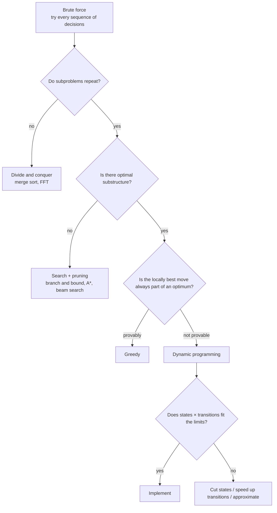
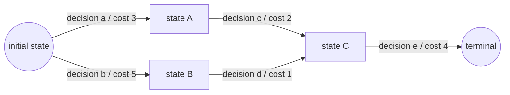

Dynamic programming (DP) is the single technique in competitive programming where “can you find the solution at all?” separates people the most. It is also the technique most often approached by memorisation — and most often failed that way. Knowing the knapsack recurrence is useless if you cannot get to that shape on a problem you have never seen.

This article makes one claim: <strong>DP is not an algorithm, it is a procedure for rewriting brute force</strong>. What is worth learning is therefore not the recurrences, but the path from brute force to a recurrence. Below we break that path into steps, verify each one with a running demo, and then widen out into a catalogue of patterns, transition speedups, and production applications.

## 1. DP is a rewrite of exhaustive search

### 1.1 Two conditions

When a problem yields to DP, almost always two properties hold.

- <strong>Optimal substructure</strong>: an optimal solution is assembled from optimal solutions to subproblems.
- <strong>Overlapping subproblems</strong>: a naive recursion solves the very same subproblem many times.

The first alone gives you divide and conquer (merge sort). The second alone is just caching. Only together does “name the subproblems and store them in a table” turn exponential into polynomial.

Richard Bellman's <strong>principle of optimality</strong>, formulated in the 1950s, is a restatement of optimal substructure:

> An optimal policy has the property that, whatever the initial state and initial decision are, the remaining decisions must constitute an optimal policy with regard to the state resulting from the first decision.

The name “dynamic programming” was, by Bellman's own account in his autobiography *Eye of the Hurricane* (1984), chosen partly to be palatable to a Secretary of Defense who was hostile to mathematical research. “Programming” here means planning, not writing code.

### 1.2 The fork with greedy algorithms

DP and greedy both decide one step at a time. The difference is whether <strong>a locally best move is guaranteed to belong to a global optimum</strong>.

<GreedyFailureDiagram />

The correctness of a greedy algorithm has to be <strong>proved</strong>. The two standard tools are the <strong>exchange argument</strong> (show that swapping two choices never makes the solution worse — either by replacing a move of an optimal solution with the greedy move, or by interchanging two adjacent elements; §3.5 works the latter through in full) and exhibiting a <strong>matroid</strong> structure (a family of “independent” sets satisfying certain axioms, for which greedy is guaranteed optimal; Kruskal's minimum spanning tree is the classic instance). If you cannot prove it, try every first move and let recursion handle the rest; that is DP, and it is the safe default. Conversely, bringing DP to a problem where greedy is provably optimal wastes both time and code.

Whether a coin system is <strong>canonical</strong> (greedy always optimal) is itself decidable: Pearson (2005) gave an $O(n^3)$ test for a system of $n$ coins. A nice reminder that “is greedy fine here?” can depend on the input, not just the problem statement.

### 1.3 The decision tree from brute force



The important framing here is that <strong>DP is not a weaker brute force; it is a compressed brute force</strong>. Coming up with a DP means finding the right axis of compression.

## 2. Always start from brute force

### 2.1 The running example: Frog 1

Let us work with a concrete problem — problem A, “Frog 1”, from AtCoder's [Educational DP Contest](https://atcoder.jp/contests/dp).

> Stones with heights $h_0, h_1, \dots, h_{N-1}$ stand in a row. A frog starts on stone 0 and can jump from stone $i$ to stone $i+1$ or $i+2$. Jumping from $i$ to $j$ costs $|h_i - h_j|$. What is the minimum cost to reach stone $N-1$?

Write brute force first, with no cleverness. The thing being decided at each point is whether to jump one stone or two.

```python
def solve(h):
    n = len(h)

    def f(i):  # minimum cost to arrive at stone i
        if i == 0:
            return 0
        if i == 1:
            return abs(h[1] - h[0])
        return min(
            f(i - 1) + abs(h[i] - h[i - 1]),
            f(i - 2) + abs(h[i] - h[i - 2]),
        )

    return f(n - 1)
```

Correct, but slow. Let us see exactly how slow by drawing the recursion tree.

### 2.2 Look at the recursion tree

<DPRecursionTreeVisualizer />

With memoization off, `f(3)`, `f(2)` and `f(1)` reappear again and again. The number of calls satisfies $T(i) = 1 + T(i-1) + T(i-2)$, that is $2F(i+1) - 1$, so it grows like the Fibonacci numbers (from $T(0) = T(1) = 1$ you get $T(2) = 3$, $T(3) = 5$, $T(4) = 9$ — check those against the node count in the demo). At $N = 45$ that is roughly 2.27 billion calls.

Meanwhile, <strong>there are only $N$ distinct arguments</strong>. We are recomputing a function that returns the same value for the same argument. So remember what we computed. That is memoization.

```python
from functools import cache

def solve(h):
    n = len(h)

    @cache
    def f(i):
        if i == 0:
            return 0
        if i == 1:
            return abs(h[1] - h[0])
        return min(
            f(i - 1) + abs(h[i] - h[i - 1]),
            f(i - 2) + abs(h[i] - h[i - 2]),
        )

    return f(n - 1)
```

One line — `functools.cache` (Python 3.9+; earlier, `lru_cache(maxsize=None)`) — turns exponential into linear. Turn memoization on in the demo and watch the tree collapse into a tree with the already-computed branches pruned.

### 2.3 When is memoization actually valid?

It is worth pausing here. Memoization is correct only when <strong>`f` is a pure function of its arguments</strong>. If it reads mutable state living outside the function — a visited flag, a global counter, a random number — then the same argument can produce different answers in different call contexts, and the cache will quietly produce wrong results.

The implementation checklist is two questions:

- Of the variables the function reads, is <strong>every one that changes during execution</strong> present in the argument list?
- Have you dropped something from the arguments because “it probably does not matter”?

That second question is exactly the state-design problem of the next section.

### 2.4 Cost is states × transitions

Two words that the rest of the article leans on, defined here on the code already in front of you:

- A <strong>state</strong> is the <strong>tuple of arguments</strong> to the memoised function `f`. The <strong>number of states</strong> is how many distinct argument values exist. Frog 1 takes only `i`, so there are $N$ states.
- A <strong>transition</strong> is one move from one state to another. The <strong>number of transitions</strong> is how many recursive calls one execution of `f` makes. In Frog 1 that is the two arms of the `min`: $i-1$ and $i-2$.

A memoised function runs its body <strong>exactly once for each argument it is actually called with</strong>. So the total work is “how many times the body runs × the work of one run”, and the running time of a DP is almost always this product:

$$
\text{cost} = (\text{states}) \times (\text{transitions})
$$

For Frog 1 that is $N \times 2 = O(N)$. Do this multiplication in your head <strong>before</strong> writing code. If the constraint is $N \le 10^5$ and your idea has $N^2$ states, discard it there and then. As a practical rule of thumb, C++ handles roughly $10^8$ simple operations within a one- or two-second limit; Python is closer to $10^6$–$10^7$.

### 2.5 A map of what follows

The skeleton is now complete: write brute force, notice the repetition, rename the arguments as a state, estimate the cost as a product. From here the material broadens, so here is the map.

| Chapter | Content | How to read it |
|---|---|---|
| 3 | How to design a state | The hardest part of DP. Read in order |
| 4 | The design procedure, and what a DP really is (a shortest path on a DAG) | Same |
| 5 | Filling the table, and implementation | Same |
| 6 | The pattern catalogue (knapsack, grid, interval, tree, bitmask, digit, expectation) | A <strong>reference</strong>. Take only the patterns you need |
| 7 | Speeding up transitions | Read when you are stuck |
| 8–11 | Implementation craft, production uses, a practice order | As needed |

<strong>Only chapters 1–5 need to be read straight through.</strong> Every section of chapter 6 is laid out as “problem statement → state → transition → implementation → pitfalls” and stands on its own, so the intended use is to come back to it when you meet a pattern you do not recognise.

## 3. A state is the smallest summary the future needs

### 3.1 Definition

For practical purposes, define the <strong>state</strong> of a DP as:

> The summary of the decisions made so far, keeping <strong>only what still affects how the rest should optimally be decided</strong>.

This is the Markov property from stochastic processes, or a sufficient statistic from statistics. You do not need the whole path — only enough to continue optimally. The smaller the summary, the fewer the states, the faster the DP.

### 3.2 The classic way state design fails

Take the <strong>longest increasing subsequence</strong> (LIS). First, the problem:

> Given a sequence $a_0, a_1, \dots, a_{n-1}$, find the length of the longest subsequence — chosen in increasing order of index — whose values are strictly increasing.

A <strong>subsequence</strong> here need not be contiguous (the contiguous version is a *subarray*, which §3.3 covers). For $a = [3, 1, 4, 1, 5, 9, 2, 6, 5]$, indices 1, 2, 4, 5 give $1 < 4 < 5 < 9$ and indices 1, 2, 4, 7 give $1 < 4 < 5 < 6$; both have length 4, which is optimal.

Now, a naive attempt:

```text
dp[i] = length of the LIS within a[0..i]
```

You cannot write a transition from `dp[i]` to `dp[i+1]`: whether `a[i+1]` can extend that subsequence depends on <strong>the value at its tail</strong>, and this state does not remember it. Knowing `dp[5] = 4` in the example above does not tell you whether that length-4 run ends in 9 or in something else, so you cannot decide whether $a_6 = 2$ extends it.

The correct definition is:

```text
dp[i] = length of the longest increasing subsequence ending exactly at a[i]
```

Changing “among the first $i$” to “<strong>ending at</strong> $i$” pins the tail value to `a[i]` and makes the transition expressible.

```text
dp[i] = 1 + max{ dp[j] | j < i and a[j] < a[i] }   (1 if no such j exists)
answer = max(dp[0], ..., dp[n-1])
```

Note that the answer is the <strong>maximum over the whole table</strong>, not `dp[n-1]`: with an “ending at $i$” definition the optimum need not use the last element, so a final aggregation is required. Getting into the habit of asking “now that the definition changed, how does the answer come out?” pays off on every DP you write.

<strong>If you cannot write the transition, your state is missing something</strong> — the most common way to get stuck, and fortunately the clearest signal. The $O(n \log n)$ version of this problem appears in §6.2.

### 3.3 The smallest DP — maximum subarray sum

Here is another case where “ending at $i$” pays off dramatically. Find the largest sum of a <strong>contiguous</strong> subarray of $a$.

Naively you try all $O(n^2)$ intervals. Define the state as “the largest sum of a contiguous subarray ending at $a[i]$”, and the transition becomes one line:

```text
dp[i] = max(a[i], dp[i-1] + a[i])
answer = max(dp[0], dp[1], ..., dp[n-1])
```

Either extend the run you have been building, or start fresh at $a[i]$. That is the entire decision. Since only `dp[i-1]` is read, two variables suffice — there is no table at all.

```python
def max_subarray(a):
    if not a:
        raise ValueError("an empty array has no non-empty subarray")
    best = cur = a[0]
    for x in a[1:]:
        cur = max(x, cur + x)   # dp[i]
        best = max(best, cur)   # running answer
    return best
```

This is <strong>Kadane's algorithm</strong> (Jay Kadane, 1977; popularised by Bentley's *Programming Pearls*): $O(n)$ time, $O(1)$ space. It is the best antidote to the belief that DP requires a table. The dimensionality of the array is set not by the number of states but by <strong>how many states are alive at once</strong>.

Note that this version <strong>does not allow the empty subarray</strong>. If every element is negative, the answer is 0 under the “empty allowed” definition and the maximum element otherwise. Starting from `best = cur = 0` silently implements the first while most problems ask for the second — a textbook case of a boundary definition changing the answer.

### 3.4 Problems that need *more* state

The reverse move — deliberately adding a dimension — is equally common.

| Added dimension | Meaning | Typical problem |
|---|---|---|
| Previous choice | “cannot pick the same thing twice in a row” | EDPC C (Vacation: pick one of three activities each day, never the same one two days running) |
| Count used | “pick exactly $k$ items” | cardinality-constrained optimisation |
| Tight flag | pinned to the upper bound in digit DP (§6.7) | counting within a range |
| Residue | “total ≡ 0 mod $m$” | subset sums with modular conditions |
| Visited set | the set matters, the order does not | TSP (§6.6), set partitioning |

A table is abstract, so let us actually solve the first row. EDPC C (Vacation) reads: “over $N$ days, each day pick one of three activities A, B or C. Picking A on day $i$ yields happiness $a_i$ (and $b_i$, $c_i$ for B and C). You may not pick the same activity two days in a row. Maximise total happiness.”

`dp[day]` alone admits no transition. Knowing “the best total through day $day$” does not tell you <strong>what was chosen last</strong>, so you cannot tell which activities are legal tomorrow — exactly the failure mode of §3.2's LIS. So add the last choice to the state.

```text
dp[day][last] = best total happiness through day `day`, having chosen `last` on that day
dp[day][last] = happiness[day][last] + max{ dp[day-1][prev] | prev ≠ last }
answer = max(dp[N-1][A], dp[N-1][B], dp[N-1][C])
base   = dp[0][last] = happiness[0][last]   (day 0 has no "previous" constraint)
```

That is $N \times 3$ states with 2 transitions each, so $O(N)$. <strong>Adding a dimension cost only a constant factor, yet it turned an unwritable transition into a writable one</strong> — which is how “add state” typically pays off.

State design is not only about deleting. It is a two-way adjustment: <strong>add when the transition is not expressible, fold when the count explodes</strong>.

### 3.5 Four standard ways to *shrink* the state

When the state space is too large, these four moves cover most of what works.

<strong>(a) Fix an order.</strong> If the processing order does not change the answer, sort first to obtain monotonicity — here meaning that the constraint tightens or loosens consistently along the processing order — and the order need not live in the state. Even when order does matter, an <strong>exchange argument</strong> (compare the outcome of swapping two adjacent elements) often <strong>determines the optimal processing order up front</strong>, after which the rest is an ordinary knapsack (§6.1).

EDPC X (Tower) is exactly this. The problem: “blocks have weight $w_i$, solidness $s_i$ and value $v_i$. For every block, the <strong>total weight of the blocks stacked above it</strong> must not exceed $s_i$. Maximise total value.”

Take two adjacent blocks $i, j$ and let $W$ be the total weight resting on the pair. Putting $i$ above $j$ is legal when $i$ can bear it ($W \le s_i$) and $j$ can bear it too ($W + w_i \le s_j$):

```text
i on top: W <= min(s_i, s_j - w_i)
j on top: W <= min(s_j, s_i - w_j)
```

Compare the two. The right-hand side ($j$ on top) is a $\min$, so it is at most $s_i - w_j$. Both terms on the left ($i$ on top), meanwhile, are at least $s_i - w_j$: $s_i \ge s_i - w_j$ because weights are positive, and

$$
s_j - w_i \ge s_i - w_j \iff w_i + s_i \le w_j + s_j
$$

So as long as $w_i + s_i \le w_j + s_j$, whichever term of the $\min$ happens to bind, the tolerance with $i$ on top never falls below the tolerance with $j$ on top: <strong>putting the smaller $w + s$ on top tolerates a larger $W$</strong>, and therefore never loses. The comparison does not depend on which blocks you end up choosing, so sorting by ascending $w_i + s_i$ once leaves a plain 0-1 knapsack over that ordering.

<strong>(b) Fold symmetry.</strong> If swapping $i$ and $j$, or complementing a set, leaves the problem unchanged, keeping one side halves the state count. For “split $N$ people into two teams” <strong>where the teams are interchangeable</strong>, $(S, \bar{S})$ and $(\bar{S}, S)$ are the same split, so pinning person 0 to team 1 turns $2^N$ into $2^{N-1}$. If the teams are labelled and therefore distinguishable, that same pinning silently discards half the solutions. <strong>You may only fold when the problem is genuinely symmetric</strong> — the one caveat this move carries.

<strong>(c) Track a difference instead of absolute quantities.</strong> Two group totals $(A, B)$ often do not both need to be remembered; $A - B$ alone can be enough. “Split the items into two piles minimising the weight difference” needs not the 2-D $(A, B)$ but a single difference — or just the set of achievable weights for one pile. One dimension gone.

<strong>(d) Reduce optimisation to feasibility.</strong> If “can it be made?” is enough and you do not need “what is the best?”, the table becomes boolean and bit-parallelism applies (the $O(nW/64)$ trick of §6.9).

In every case the decision comes back to the question from §3.1: does that information really affect the future?

## 4. Turning the procedure into a template

Let us fix the discussion so far into something you can apply to an unseen problem.

<DPDesignSteps />

Of these six, only steps 2 and 5 are genuinely hard. Step 2 (what is enough to remember) is the creative act; step 5 (cost estimation) is the safety valve before implementation. Steps 3, 4 and 6 follow mechanically once step 2 is settled.

### 4.1 On “is the dependency graph a DAG?” (step 6)

A DP is fundamentally a <strong>shortest path on a directed acyclic graph</strong>. Take states as vertices, transitions as edges, and transition costs as weights; the answer is the shortest (or longest, or total, or most probable) path from source to sink.

To fix terms: a <strong>directed graph</strong> connects points with edges that have a direction, “from A to B”; <strong>acyclic</strong> means you cannot follow edges back to where you started; a <strong>topological order</strong> is a linear arrangement of the points in which every edge points forwards. Translated into DP: points are states, edges are transitions, and “`dp[y]` must be settled before `dp[x]` can be computed” is what an edge direction means. In Frog 1 the points are the stones and the edges are $i \to i+1$ and $i \to i+2$; sorting by index makes every edge point forwards, so index order *is* a topological order.



Several things fall out of this view at once.

- <strong>Evaluation order is topological order</strong>. Getting the loop direction wrong means violating the topological order.
- <strong>If the dependencies contain a cycle, it is not a DP as written</strong>. To handle cycles you must either (a) add a dimension such as the number of edges used, unrolling the graph into layers (Bellman–Ford), (b) fix the order greedily (Dijkstra, when weights are non-negative), or (c) sweep the whole table repeatedly until nothing changes (value iteration, covered in §9.6).
- <strong>The longest path is NP-hard in general graphs but linear on a DAG</strong>. EDPC G is exactly this.

The invention of the traversal algorithms themselves is covered in [Graph Traversal Algorithms](/en/blog/graph-traversal). The DP in this article can be read as generalising those shortest paths from a physical graph to a state space.

### 4.2 Solving a different problem with the same table — the semiring view

Here is the practical version of that idea. Suppose that instead of the minimum cost, Frog 1 asked “how many ways are there to get from stone 0 to stone $N-1$?”. Effectively one line changes:

```text
minimum cost:    dp[i] = min( dp[i-1] + cost1 , dp[i-2] + cost2 )
number of ways:  dp[i] =      dp[i-1] * 1      +  dp[i-2] * 1
initial value:   0 for the cost version, 1 for the counting version
```

Where `min` stood, there is now `+`; where the cost `+` stood, there is now `×` (each edge is worth “one way”, so multiplying by 1 makes it vanish). The loops, the states and the scan order are untouched.

Swapping the operations like this is cleanly explained as changing the underlying <strong>semiring</strong> — a pair of an addition-like operation $\oplus$ and a multiplication-like operation $\otimes$. $\oplus$ combines several incoming paths into one value; $\otimes$ chains costs along a path.

The initial value flipping from 0 to 1 falls out of the same correspondence. What belongs in `dp[0]` is the value that leaves its partner unchanged under $\otimes$ — the <strong>identity for $\otimes$</strong> — which is 0 when $\otimes$ is addition (the cost version) and 1 when it is multiplication (the counting version). Its counterpart is the <strong>identity for $\oplus$</strong>, the value that changes nothing when combined, and that is what “this state does not exist” has to be: $\infty$ when minimising, 0 when counting. The out-of-range `dp[-1]` means “no such route”, so in the counting version it is 0 — which is why `dp[1] = dp[0] = 1`.

| Semiring $(\oplus, \otimes)$ | Meaning | What you get |
|---|---|---|
| $(\min, +)$ | minimum cost | shortest paths, min-cost DP |
| $(\max, +)$ | maximum value | knapsack, longest path |
| $(+, \times)$ | sums and products | counting DP, probability DP |
| $(\max, \times)$ | maximum probability | Viterbi decoding |
| $(\lor, \land)$ | disjunction and conjunction | reachability, subset-sum feasibility |

The practical payoff is large: once you have written “the DP for the minimum cost”, being asked for “how many ways are there in total” means keeping the same loops and <strong>replacing `min` with `+` and `+` with `×`</strong>. Note that this substitution counts <strong>all</strong> the ways, not <strong>the ways that achieve the minimum</strong>; for the latter you make the semiring element a pair $(\text{minimum},\ \text{number of ways attaining it})$, with $\oplus$ taking the minimum and summing the counts on ties.

One practical difference: unlike a minimum cost, a count grows exponentially and will overflow a 64-bit integer. That is why counting problems are normally posed modulo something like $10^9+7$, with the remainder taken after every addition and multiplication (§8.1). The skeleton itself is unchanged.

## 5. Filling the table — pull DP and push DP

Once the recurrence is fixed, you fill the table. There are two ways to write the loop.

<DPTableFillVisualizer />

- <strong>Pull DP</strong>: finalise `dp[i]` by examining every transition that enters it. It reads as an assignment, which makes missing initialisation less likely.
- <strong>Push DP</strong>: from a finalised `dp[i]`, relax the targets of its outgoing transitions. Better when the successors are easier to enumerate than the predecessors.

Both give the same answer; only the ease of writing differs. As a rule of thumb, <strong>pull when incoming edges are easier to enumerate, push when outgoing edges are</strong>. Transitions that spread a value uniformly over a range pair especially well with push DP plus a difference array.

### 5.1 Implementation

```cpp
// Pull DP (C++)
#include <bits/stdc++.h>
using namespace std;

int main() {
    int n; cin >> n;
    vector<long long> h(n);
    for (auto &x : h) cin >> x;

    const long long INF = 1e18;
    vector<long long> dp(n, INF);
    dp[0] = 0;
    for (int i = 1; i < n; i++) {
        dp[i] = dp[i - 1] + llabs(h[i] - h[i - 1]);
        if (i >= 2) dp[i] = min(dp[i], dp[i - 2] + llabs(h[i] - h[i - 2]));
    }
    cout << dp[n - 1] << '\n';
}
```

```cpp
// Push DP (C++)
vector<long long> dp(n, INF);
dp[0] = 0;
for (int i = 0; i < n; i++) {
    if (dp[i] == INF) continue;              // never relax out of an unreachable state
    for (int d = 1; d <= 2 && i + d < n; d++) {
        long long cand = dp[i] + llabs(h[i + d] - h[i]);
        dp[i + d] = min(dp[i + d], cand);
    }
}
```

Forgetting `if (dp[i] == INF) continue;` in a push DP means you evaluate `INF + cost`. If `INF` is something that breaks under addition — `LLONG_MAX`, say — that overflows to a negative number and then wins the minimum. The standard defence is to <strong>choose an `INF` that survives addition</strong>: `1e18` for `long long`, and something like `1'000'000'000 / 2` rather than `1'000'000'000` for `int`. Even when the arithmetic survives, though, you have still invented a path out of an unreachable state, so write the guard regardless.

### 5.2 Top-down or bottom-up?

<MemoVsTabulation />

A short decision guide:

- <strong>Sparse state space</strong> (many unreachable states, or states that are strings/sets and awkward to index): memoised recursion.
- <strong>Dense state space</strong>, or you want to bolt on a speedup: tabulation.
- <strong>Recursion depth could exceed $10^5$</strong>: tabulation, or an explicit stack. Python's default recursion limit is 1000, and raising `sys.setrecursionlimit` sometimes also requires enlarging the thread stack size.

The pragmatic order is: get it right with memoised recursion, then rewrite as a loop when you need to. Once the recurrence is verified, the conversion is mechanical.

## 6. A catalogue of patterns

This is the reference part. The standard shapes follow one by one, but <strong>each section stands on its own</strong>. Every one is laid out as “problem statement → why that state → transition and cost → implementation → pitfalls”, so take only the patterns you need.

The point of learning patterns is not the memorisation itself. It is to let you <strong>guess quickly</strong> on an unseen problem: “this is a merge-an-interval shape, so an interval state is probably right.” Chapters 3–5 are what you come back to when the guess turns out wrong.

<DPPatternTable />

### 6.1 Knapsack DP — what “pseudo-polynomial” means

First, the problem:

> There are $N$ items; item $i$ has weight $w_i$ and value $v_i$. Choose items so that the total weight does not exceed a capacity $W$, and maximise the total value. Each item is <strong>either taken or not</strong> (the 0-1 knapsack).

The thing being decided is, for each item in turn, take it or skip it — so brute force enumerates $2^N$ subsets. And of “how the first $i$ items were chosen”, the only thing that affects the future is <strong>the total weight used so far</strong>. Which particular combination reached weight $w$ does not change how the remaining items should be picked. That fixes a two-dimensional state.

```text
dp[i][w] = best total value using the first i items with total weight at most w
dp[i][w] = max( dp[i-1][w] ,  dp[i-1][w - w_i] + v_i )
             ↑ skip item i     ↑ take item i (only when w >= w_i)
```

Thinking in terms of “the weight used so far” suggests indexing by weight <strong>exactly</strong> $w$, but the definition above says <strong>at most</strong> $w$. Since weights are non-negative, leaving capacity unused never hurts, so the at-most table is the exact-weight table accumulated as a running maximum over $w$ — which is precisely why it comes out monotone non-decreasing in $w$.

The two do not agree cell by cell, though: a weight that no subset hits exactly still carries the best value from a lighter combination in the at-most table. What you finally want is “the best at weight at most $W$”, so reading `dp[N][W]` is the answer, with no special case for “no subset hits exactly $W$”.

When a problem genuinely needs *exactly* (as in §6.2, or subset sum), you instead mark unreachable cells explicitly — $\infty$ when minimising, $-\infty$ when maximising, `false` for feasibility.

With $N \times W$ states and 2 transitions each, that is $O(NW)$.

Now, the 0-1 knapsack problem is <strong>NP-hard</strong>. The $O(NW)$ DP works anyway because $W$ is the <strong>numeric value</strong> of an input, not the size of the input. Writing $W$ in binary takes $\log W$ bits, so $O(NW)$ is exponential in the input size. That is what <strong>pseudo-polynomial</strong> means.

In other words, “it passes for $W \le 10^5$ but not for $W \le 10^9$” is a property of the problem, not of your coding skill.

<KnapsackDPVisualizer />

The three modes in the demo correspond exactly to the implementation notes below.

<strong>The 2-D table</strong> is the definition, transcribed:

```cpp
// dp[i][w] = best value using the first i items with total weight at most w
vector<vector<long long>> dp(n + 1, vector<long long>(W + 1, 0));
for (int i = 1; i <= n; i++)
    for (int w = 0; w <= W; w++) {
        dp[i][w] = dp[i - 1][w];
        if (w >= wt[i - 1])
            dp[i][w] = max(dp[i][w], dp[i - 1][w - wt[i - 1]] + val[i - 1]);
    }
```

<strong>One dimension, descending</strong> exploits the fact that computing row $i$ only needs row $i-1$:

```cpp
vector<long long> dp(W + 1, 0);
for (int i = 0; i < n; i++)
    for (int w = W; w >= wt[i]; w--)          // ← descending is mandatory
        dp[w] = max(dp[w], dp[w - wt[i]] + val[i]);
```

<strong>One dimension, ascending</strong> makes `dp[w - wt[i]]` a value that the *current* item already updated, so the item can be used any number of times. That is a bug here — and simultaneously <strong>the correct implementation of the unbounded knapsack</strong>. In the demo the answer changes from 90 to 100. One loop direction changes which problem you are solving; that is worth remembering.

```cpp
// Unbounded knapsack: ascending is the "correct" direction
for (int i = 0; i < n; i++)
    for (int w = wt[i]; w <= W; w++)
        dp[w] = max(dp[w], dp[w - wt[i]] + val[i]);
```

<strong>Bounded knapsack</strong> (item $i$ available up to $c_i$ times — the 0-1 case is $c_i = 1$ and the unbounded case is $c_i = \infty$) is $O(NWc)$ naively. Splitting $c_i$ into $1, 2, 4, \dots$ and reducing to 0-1 gives $O(NW \log c)$; a sliding-window minimum per residue class gives $O(NW)$.

### 6.2 Swap the roles of index and value

The same knapsack becomes a different problem when the constraints change shape. EDPC E (Knapsack 2) has $N \le 100$, $W \le 10^9$ and $v_i \le 10^3$: few items, but a capacity that is orders of magnitude larger. $O(NW) = 10^{11}$ is hopeless.

Notice, though, that the total value is at most $N \times \max v_i = 100 \times 10^3 = 10^5$. So <strong>evict the oversized “weight” from the index and put the small “value” there instead</strong> — swap what is optimised with what is constrained.

```text
before: dp[i][w] = the best VALUE at weight at most w        ← indexed by weight
after:  dp[i][v] = the least WEIGHT reaching value exactly v  ← indexed by value
```

That makes the state count $N \times \sum v_i \le 100 \times 10^5 = 10^7$, which is workable. The answer is the largest `v` with `dp[N][v] <= W`.

> If one dimension is too large, ask whether the objective and the constraint can trade places. This is the most broadly useful reframing in all of DP.

The same idea drives the $O(n \log n)$ LIS, the problem defined in §3.2.

<LISVisualizer />

The naive $O(n^2)$ solution of §3.2 stores a <strong>length</strong> in `dp[i]`. The fast version does the opposite: it indexes by length and stores the value.

```text
naive: dp[i]    = the LENGTH of the increasing run ending at a[i]  ← index = position
fast:  tails[k] = the smallest VALUE that can end a run of length k+1  ← index = length
```

The crucial property is that `tails` is always strictly increasing (a longer run cannot end in a smaller value than a shorter one). Being sorted, it admits binary search: $O(\log n)$ per element, $O(n \log n)$ overall.

```python
from bisect import bisect_left

def lis_length(a):
    tails = []
    for x in a:
        i = bisect_left(tails, x)     # strictly increasing; use bisect_right for non-decreasing
        if i == len(tails):
            tails.append(x)
        else:
            tails[i] = x
    return len(tails)
```

<strong>There is a trap here.</strong> The <strong>length</strong> of `tails` is the answer, but <strong>its contents are not a subsequence</strong>. At the end of the demo you can see that `tails = [1, 2, 5, 6]` does not respect the input order. To recover the actual subsequence you must record, at insertion time, the slot used and the index that owned the slot immediately to its left.

```python
def lis_sequence(a):
    tails, tails_idx, parent = [], [], [-1] * len(a)
    for i, x in enumerate(a):
        k = bisect_left(tails, x)
        parent[i] = tails_idx[k - 1] if k > 0 else -1
        if k == len(tails):
            tails.append(x); tails_idx.append(i)
        else:
            tails[k] = x; tails_idx[k] = i
    res, cur = [], tails_idx[-1]
    while cur != -1:
        res.append(a[cur]); cur = parent[cur]
    return res[::-1]
```

### 6.3 Grid DP — the skeleton of diff and edit distance

Taking prefixes of two sequences as the two axes is the shape you will meet most often outside contests. Two representative problems:

> <strong>Longest common subsequence (LCS)</strong>: given strings $s$ and $t$, find the longest string that is a <strong>subsequence</strong> of both (not necessarily contiguous, but order-preserving). For $s = $ `axyb` and $t = $ `abyxb`, both `axb` and `ayb` have length 3 and are optimal.

> <strong>Edit distance (Levenshtein)</strong>: find the minimum number of single-character insertions, deletions and substitutions that turn $s$ into $t$. For example `axyb` → `abyb` (substitute x with b) → `abyxb` (insert x) is 2 operations.

In both cases the state is the <strong>pair of prefixes</strong> “first $i$ characters of $s$, first $j$ characters of $t$”: once you decide how the $i$-th and $j$-th characters correspond, what remains is a smaller instance of the same problem. With $nm$ states and 2–3 transitions each, both are $O(nm)$.

<LCSGridVisualizer />

Same table, same scan order — only the transition changes:

```python
# Longest common subsequence
if s[i-1] == t[j-1]: dp[i][j] = dp[i-1][j-1] + 1
else:                dp[i][j] = max(dp[i-1][j], dp[i][j-1])

# Edit distance (Levenshtein)
if s[i-1] == t[j-1]: dp[i][j] = dp[i-1][j-1]
else:                dp[i][j] = 1 + min(dp[i-1][j-1], dp[i-1][j], dp[i][j-1])
```

The applications follow directly.

- <strong>diff</strong>: the characters that did not make it into the LCS become deletions and insertions. GNU diff and git default to Myers' algorithm (1986), which finds a shortest path in the edit graph in $O(ND)$ where $D$ is the size of the difference — dramatically faster than $O(nm)$ when the diff is small.
- <strong>Spell correction and fuzzy search</strong>: edit distance itself. With a threshold you can compute only a diagonal band, giving $O(nk)$.
- <strong>Bioinformatics</strong>: Needleman–Wunsch (1970, global alignment) and Smith–Waterman (1981, local alignment) are this grid plus gap penalties and a substitution matrix.
- <strong>Dynamic time warping</strong>: aligning time series. The same grid with a different transition set.

<strong>For memory</strong>, if you only need the length, two rolling rows give $O(\min(n,m))$ space. If you need the sequence, Hirschberg's algorithm (1975) combines the DP with divide and conquer to reconstruct in $O(nm)$ time and $O(\min(n,m))$ space.

The theoretical lower bound is worth knowing too. Backurs and Indyk (2015) showed that, assuming the Strong Exponential Time Hypothesis, edit distance cannot be computed in $O(n^{2-\delta})$ time; analogous results exist for LCS. In other words, <strong>beyond constant-factor tricks (bit-parallelism, Four Russians) there is no substantial improvement to expect</strong> over $O(nm)$.

### 6.4 Interval DP

Problems with a “merge adjacent things” structure take the interval as the state. Two representatives:

> <strong>Slime merging</strong> (EDPC N): $N$ slimes stand in a row, the $i$-th of size $a_i$. Merging two adjacent slimes produces one of the summed size, at a cost equal to that sum. Minimise the total cost of merging everything into one.

> <strong>Matrix chain multiplication</strong>: multiplying $A_1 A_2 \cdots A_n$ costs a different number of scalar multiplications depending on the parenthesisation. Find the cheapest one.

In both, there is a final moment where the whole interval $[l, r)$ becomes one thing, and just before it the interval must have been split at <strong>some point $k$</strong>. Trying every $k$ is the transition. Unlike a linear DP that decides things left to right, here <strong>the order in which states are decided is by interval length</strong>.

```text
dp[l][r] = best value for combining the interval [l, r) into one
dp[l][r] = min over k in (l, r) of  dp[l][k] + dp[k][r] + cost(l, r)
```

With $O(n^2)$ states and $O(n)$ transitions this is $O(n^3)$. Loop over <strong>increasing interval length</strong> — long intervals depend on short ones, so that is the topological order. The skeleton above puts `cost(l, r)` <strong>outside</strong> the `min` (the form that fits EDPC N and optimal BSTs); when the cost depends on the split point, as in matrix chain multiplication, it moves <strong>inside</strong>: `dp[l][k] + dp[k][r] + p_l p_k p_r`. Both are interval DPs.

If the cost function satisfies the <strong>quadrangle inequality</strong>

$$
w(a, c) + w(b, d) \le w(a, d) + w(b, c) \quad (a \le b \le c \le d)
$$

together with monotonicity on the interval lattice, $w(b, c) \le w(a, d)$ for the same ordering, then <strong>the optimal split points are monotone</strong>. Intuitively: widening an interval to the right can only move its best split point right, and widening it to the left can only move it left — the two directions supply the lower and upper end of the search range respectively.

So the search for $dp[l][r]$'s split point can be confined to $[\,\text{argmin}(l, r-1),\ \text{argmin}(l+1, r)\,]$, and those ranges telescope within each interval length to give $O(n^2)$ overall (the Knuth–Yao speedup). Knuth showed this in 1971 for optimal binary search trees — building, from known key access frequencies, the BST that minimises the average search cost — and Yao generalised it in 1980.

```cpp
// Interval DP skeleton (pull form)
for (int len = 2; len <= n; len++)
    for (int l = 0; l + len <= n; l++) {
        int r = l + len;
        for (int k = l + 1; k < r; k++)
            dp[l][r] = min(dp[l][r], dp[l][k] + dp[k][r]);
        dp[l][r] += cost(l, r);
    }
```

### 6.5 Tree DP and rerooting

On a tree, the natural subproblem is a <strong>subtree</strong>. A representative problem:

> <strong>Maximum-weight independent set on a tree</strong>: given a tree whose vertices carry weights $w_v$, choose a set of vertices with no two joined by an edge, maximising the total weight.

On a path this is the linear “take it or skip it” DP; on a tree a vertex has several children, but the structure is the same: <strong>the answer for the subtree of $v$ is determined by the answers for the subtrees of its children</strong>. Since the children's freedom depends on whether $v$ itself was taken, that one bit joins the state.

```python
# Maximum-weight independent set on a tree
# returns (take, skip) = best for the subtree with v taken / not taken
def dfs(v, parent):
    take, skip = w[v], 0
    for c in graph[v]:
        if c == parent: continue
        t, s = dfs(c, v)
        take += s          # if we take v, children cannot be taken
        skip += max(t, s)  # if we skip v, children are free
    return take, skip

answer = max(dfs(root, -1))
```

The state is “vertex $v$” × “was $v$ itself taken?”. Each edge is visited once, so it is $O(n)$. EDPC P (Independent Set) is the <strong>counting</strong> version of the same state: replace $(\max, +)$ with $(+, \times)$ — `max` becomes addition and addition becomes multiplication — and you count independent sets instead. It is the semiring story of §4.2 applied verbatim.

<strong>Rerooting</strong> computes the answer for <strong>every</strong> choice of root at once, in $O(n)$. The DFS above only answers for one fixed root; repeating it $n$ times is $O(n^2)$. Instead you combine a downward accumulation (answers from the children) with a value descending from the parent, in two traversals. The key trick is computing “the aggregate of all children except one” with prefix and suffix accumulations, keeping it $O(\deg v)$ per vertex. EDPC V is the canonical exercise.

### 6.6 Bitmask DP — folding permutations into sets

Even when order matters, if “what has been done so far” can be summarised as a set, the state space collapses to $2^n$. The vehicle here is the travelling salesman problem.

> <strong>Travelling salesman problem (TSP)</strong>: given $n$ cities and the distance $D[u][v]$ from city $u$ to city $v$, find the shortest tour that starts at city 0, visits every city exactly once, and returns to city 0.

<BitmaskTSPVisualizer />

Solving it naively means trying the $(n-1)!$ orderings of the cities other than 0. But <strong>if two partial tours have visited the same set of cities and end at the same city, the best way to finish is identical</strong>. Compare “$0 \to 1 \to 2 \to 3$” with “$0 \to 2 \to 1 \to 3$”: both have visited $\lbrace 0,1,2,3 \rbrace$ and both stand on city 3, so exactly the same work lies ahead. That remains true when the distances are asymmetric ($D[u][v] \neq D[v][u]$) — only the cost already paid differs, not the work that remains. So the visiting order itself can be thrown away.

The visited set is stored as an $n$-bit integer $S$ (bit $i$ set means city $i$ has been visited) — hence the names <strong>state compression</strong> and <strong>bitmask DP</strong>.

$$
dp[S][v] = \min_{u \in S \setminus \lbrace v \rbrace} \bigl( dp[S \setminus \lbrace v \rbrace][u] + D[u][v] \bigr)
$$

With $2^n \cdot n$ states and $n$ transitions each, this is $O(2^n n^2)$ — the result Held and Karp (1962) and, independently, Bellman (1962) obtained. The exponential does not disappear, but the factorial does. At $n = 20$, $(n-1)! \approx 1.2 \times 10^{17}$ against $2^n n^2 \approx 4.2 \times 10^8$; only the latter is feasible.

```cpp
// Held–Karp
vector<vector<long long>> dp(1 << n, vector<long long>(n, INF));
dp[1][0] = 0;
for (int S = 1; S < (1 << n); S++) {
    if (!(S & 1)) continue;
    for (int v = 0; v < n; v++) {
        if (!((S >> v) & 1) || dp[S][v] == INF) continue;
        for (int u = 0; u < n; u++) {
            if ((S >> u) & 1) continue;
            int T = S | (1 << u);
            dp[T][u] = min(dp[T][u], dp[S][v] + D[v][u]);
        }
    }
}
```

Bit-manipulation idioms you will use constantly:

```cpp
__builtin_popcount(S)          // number of set bits
S & (S - 1)                    // clear the lowest set bit
S & -S                         // isolate the lowest set bit
for (int T = S; T; T = (T - 1) & S)   // enumerate all non-empty subsets of S
```

Running that last idiom over all $S$ costs $O(3^n)$ — each element is either in $T$, in $S \setminus T$, or outside $S$. If you only need sums over subsets, <strong>SOS DP (the fast zeta transform)</strong> does it in $O(2^n n)$.

```cpp
// Rewrite f[S] as the sum over every subset of S
for (int i = 0; i < n; i++)
    for (int S = 0; S < (1 << n); S++)
        if ((S >> i) & 1) f[S] += f[S ^ (1 << i)];
```

### 6.7 Digit DP

> “How many integers in $[A, B]$ satisfy some property — the digit sum is a multiple of $D$, say?”

Even when $B$ is around $10^{18}$, you can count them by <strong>deciding one digit at a time from the most significant end</strong> rather than enumerating values. The reframing is that the thing being decided is a digit, not the number.

The difficulty is respecting the upper bound $B$, and it is captured by a single bit: is the number being built <strong>still exactly equal to a prefix of $B$ (tight)</strong>? While tight, the next digit cannot exceed the corresponding digit of $B$; once not tight — that is, once the number is already provably smaller — every digit 0–9 is available.

```python
from functools import cache

def count_upto(n_str, ...):
    L = len(n_str)

    @cache
    def rec(pos, tight, started, state):
        if pos == L:
            return 1 if is_ok(state) else 0
        limit = int(n_str[pos]) if tight else 9
        total = 0
        for d in range(0, limit + 1):
            total += rec(
                pos + 1,
                tight and d == limit,     # still pinned to the bound?
                started or d > 0,         # have we passed the leading zeros?
                next_state(state, d, started or d > 0),
            )
        return total

    return rec(0, True, False, initial_state)

# Ranges come from a difference
answer = count_upto(str(B)) - count_upto(str(A - 1))
```

Forget `started` (the leading-zero handling) and any condition like “how many zeros are in the number” will be off. <strong>The pair of flags, tight and started</strong>, is boilerplate in nearly every digit DP.

### 6.8 Probability and expectation DP

These DPs compute an average rather than an optimum. A representative problem:

> There are $N$ plates; plate $i$ holds $a_i$ pieces of sushi, with $1 \le a_i \le 3$. Repeatedly pick one of the $N$ plates uniformly at random and, if it still has sushi, eat one piece (if it is empty nothing happens, but the operation still counts). What is the expected number of operations until no sushi remains? (EDPC J: Sushi)

Probability DP is just the $(+, \times)$ semiring of §4.2. Expectation DP has two idiosyncrasies.

<strong>First: run it backwards.</strong> Let `dp[s]` be “the expected number of operations from state $s$ until the end”, and fill from the terminal side. “Expected value from the start up to $s$” does not compose under linearity of expectation.

<strong>Second: self-loops become an equation.</strong> If with probability $p$ nothing happens and you stay in the same state,

$$
E = 1 + pE + \sum_i q_i E_i
\quad\Longrightarrow\quad
E = \frac{1 + \sum_i q_i E_i}{1 - p}
$$

Rearranging turns an infinite series into a closed form. If $p = 1$ the expectation diverges, so check that the problem excludes it.

EDPC J (Sushi) is the archetype: because $a_i \le 3$, the state can be the triple “number of plates with 1, 2 and 3 pieces of sushi”, and the self-loop needs exactly this treatment.

### 6.9 Subset sum and bitsets — brute constant-factor force when feasibility is enough

A concrete case of move (d) from §3.5. If the question is only “can some subset of the weights sum to exactly $j$?”, then `dp[j]` is a boolean.

```text
dp[j] = is the sum j achievable? (bool)
adding an item of weight w:  dp_new = dp OR (dp << w)
```

Viewing `dp` as a bit string turns the whole transition into <strong>one shift and one OR</strong>. In C++, `std::bitset` gives $O(nW/64)$ — one sixty-fourth of the naive $O(nW)$.

```cpp
bitset<100001> dp;
dp[0] = 1;
for (int w : weights) dp |= dp << w;   // bit j set ⇔ sum j is achievable
```

In Python, arbitrary-precision integers work directly as bit sets, and the reduced loop count often makes this one or two orders of magnitude faster than a list-based DP.

```python
dp = 1                       # only bit 0 is set: the sum 0 is achievable
for w in weights:
    dp |= dp << w
can_make = lambda j: (dp >> j) & 1
```

<strong>But this form supports neither reconstruction nor multiplicity limits.</strong> If you need to know which items were chosen, you must go back to a table that stores parents. Constant-factor speedups are almost always paid for by discarding information.

## 7. Making transitions faster

You will often be unable to reduce the number of states while the transitions are expensive. Here is the tool-to-symptom mapping.

<DPOptimizationTable />

### 7.1 Prefix sums: the best return on effort

If the transition is `dp[i] = sum(dp[j] for j in [i-k, i-1])` — that is, <strong>a sum over a range</strong> — a running prefix sum turns $O(k)$ into $O(1)$.

```python
# dp[i] = dp[i-1] + dp[i-2] + ... + dp[i-k]
S = [0] * (n + 2)          # prefix sums of dp
dp[0] = 1; S[1] = 1
for i in range(1, n + 1):
    lo = max(0, i - k)
    dp[i] = (S[i] - S[lo]) % MOD
    S[i + 1] = (S[i] + dp[i]) % MOD
```

On the push side, adding a constant over a range is a difference array. EDPC M (Candies) and T (Permutation) are the standard exercises.

### 7.2 Sliding-window minimum

If the transition is `dp[i] = min(dp[j] for j in [i-k, i-1]) + c[i]` — <strong>a minimum over a window</strong> — a monotonic deque makes it amortised $O(1)$.

```python
from collections import deque

dq = deque()               # (index, value) kept in increasing order of value
for i in range(n):
    while dq and dq[0][0] < i - k:      # drop entries that left the window
        dq.popleft()
    dp[i] = c[i] + (dq[0][1] if dq else 0)
    while dq and dq[-1][1] >= dp[i]:    # a larger, older entry can never win again
        dq.pop()
    dq.append((i, dp[i]))
```

“An element that is both larger and older than the new one will never be the minimum again” is why the monotonic deque is correct. The $O(NW)$ bounded-knapsack solution uses the same structure, one residue class at a time.

### 7.3 Convex hull trick

If the transition has the form $dp[i] = \min_j (dp[j] + a_j \cdot x_i)$ — the <strong>lower envelope of a family of lines</strong> — then monotone slopes and queries give $O(n)$, and a Li Chao tree gives $O(n \log n)$ in general.

The minimal exercise is EDPC Z (Frog 3): the same setting as Frog 1, except the frog may jump to <strong>any</strong> later stone rather than one or two ahead, and jumping from stone $j$ to stone $i$ costs $(h_i - h_j)^2 + C$. Written naively the transition is $O(n)$ and the whole thing $O(n^2)$. Expanding $dp[i] = \min_j (dp[j] + (h_i - h_j)^2 + C)$ gives

$$
dp[i] = h_i^2 + C + \min_j \bigl( \underbrace{-2h_j}_{\text{slope}} \cdot h_i + \underbrace{dp[j] + h_j^2}_{\text{intercept}} \bigr)
$$

so each $j$ contributes one line, of slope $-2h_j$ and intercept $dp[j] + h_j^2$. What you want is the minimum of that family at $x = h_i$ — the value of the <strong>lower envelope</strong>. The test for applicability is <strong>“can the expression be separated into an $i$-part and a $j$-part?”</strong>

EDPC Z additionally guarantees $h_1 < h_2 < \dots < h_N$, and that matters: the slopes $-2h_j$ arrive in decreasing order and the query points $h_i$ increase. For a minimum, the optimal slope decreases as $x$ grows, so those two monotonicities are exactly what is needed: the envelope can be kept in a deque that is <strong>monotone in slope</strong> — similar in name to §7.2's sliding-window minimum but with a different invariant (pop from the back when a line becomes unnecessary on insertion, pop from the front when the leading line stops being optimal) — at amortised $O(n)$. Without that monotonicity you need something like a Li Chao tree (a segment tree over the domain of $x$, each node storing the single line that dominates its range), at $O(n \log n)$. A good reminder that <strong>whether a speedup applies is written in the problem's constraints</strong>.

### 7.4 Matrix exponentiation

For a linear recurrence with $n$ around $10^9$, put the transition in a matrix and exponentiate.

$$
\begin{pmatrix} F_{n} \\ F_{n-1} \end{pmatrix}
=
\begin{pmatrix} 1 & 1 \\ 1 & 0 \end{pmatrix}^{\,n-1}
\begin{pmatrix} F_1 \\ F_0 \end{pmatrix}
$$

That is $O(k^3 \log n)$ for $k$ states. It is the same principle by which the $n$-th power of an adjacency matrix counts walks of length $n$ (the $(+, \times)$ semiring), and EDPC R (Walk) is exactly that path-counting exercise. Do the same in the $(\min, +)$ semiring and you get “shortest walk using exactly $n$ edges”.

### 7.5 Choosing among them

These are not tricks you apply because you know them; they are <strong>recognitions of the shape of a transition</strong>. In priority order:

1. First ask whether <strong>the state can shrink</strong>. Removing a dimension beats any constant-factor work.
2. Range aggregation → prefix sums, difference arrays, segment trees.
3. Window min/max → monotonic deque.
4. Family of lines → CHT / Li Chao tree.
5. Split-point search with a convex cost → Knuth–Yao / divide-and-conquer optimisation.

## 8. Implementation craft

### 8.1 Initial values, unreachability, overflow

- Initialise to `INF` when minimising and `-INF` when maximising, so that <strong>“unreachable” and “value 0” are distinguishable</strong>. Counting DPs initialise to 0.
- Choose an `INF` that survives addition (`1e18` for `long long`; `1e9` for `int` is unsafe).
- Always write `if (dp[i] == INF) continue;` in a push DP.
- Take the modulus at every step in counting DPs. $10^9+7$ and $998244353$ are the usual choices; the latter is NTT-friendly ($998244353 = 119 \cdot 2^{23} + 1$) and is preferred when convolutions are involved.

### 8.2 Reconstruction

Contests usually ask only for the optimal value; production usually wants the solution. Two approaches:

<strong>Store the parent</strong>: keep `from[state]` and walk back from the terminal. Simple, but costs as much memory as the state space.

<strong>Recompute</strong>: as long as the table survives, you can re-derive which transition produced each value. That is what the knapsack demo does. No extra memory, but the condition is written twice — once in the recurrence, once in the reconstruction — so they can drift apart.

```cpp
// Reconstruction with no extra memory (0-1 knapsack)
vector<int> chosen;
int w = W;
for (int i = n; i >= 1; i--) {
    if (dp[i][w] != dp[i - 1][w]) {   // the value changed = item i was used
        chosen.push_back(i - 1);
        w -= wt[i - 1];
    }
}
```

Collapsing to a rolling array destroys this “compare with the row above” reconstruction. <strong>If you need the solution, either keep the dimension or use a Hirschberg-style divide and conquer</strong> — decide this at design time, not after.

### 8.3 Memory and cache

An $O(NW)$ table with $N = 10^2$, $W = 10^5$ and `long long` entries is 80 MB. Rolling it down to one row makes it 800 KB. Under a typical 256 MB limit the 2-D table genuinely does not fit in some problems.

<strong>Access order</strong> matters too. Sweeping `dp[i][w]` in row-major order (with `w` in the inner loop) is cache-friendly; column-major is several times slower for identical asymptotics. The rule is to arrange loops so the innermost one varies the rightmost index.

### 8.4 Debugging: stress tests

DP bugs show up as “samples pass, submission fails”. The most efficient debugging technique is to <strong>compare against brute force on small random inputs</strong>.

```python
import random

def brute(items, W):
    best = 0
    for mask in range(1 << len(items)):
        w = v = 0
        for i, (wi, vi) in enumerate(items):
            if mask >> i & 1:
                w += wi; v += vi
        if w <= W:
            best = max(best, v)
    return best

for trial in range(10_000):
    n = random.randint(1, 8)
    W = random.randint(1, 15)
    items = [(random.randint(1, 8), random.randint(1, 20)) for _ in range(n)]
    if (expected := brute(items, W)) != (got := knapsack_dp(items, W)):
        print("MISMATCH", items, W, expected, got)
        break
```

This loop finds boundary bugs — $w = 0$, zero items, weight exactly equal to capacity — within seconds. <strong>Keep the brute-force implementation</strong>: since brute force was the starting point of the DP, you already have it.

The other high-value technique is to <strong>print the table itself</strong>. On a tiny input, printing the table and comparing with a hand computation separates “initialisation is wrong” from “the transition is wrong” in about a minute.

### 8.5 A symptom-to-cause table

DP failures map onto causes fairly predictably. When a submission comes back wrong, start here.

| Symptom | Look here first |
|---|---|
| Samples pass, submission fails | Initial values (`INF` versus 0), boundaries ($i = 0$, $w = 0$, the empty set), handling of unreachable states |
| Only large cases fail | Overflow, a missing modulus, negative remainders (sign conventions differ by language) |
| The answer is always too large | Missing `INF` guard in a push DP; wrong loop direction in the 1-D knapsack, turning 0-1 into unbounded |
| The answer is always too small | Initialising to `INF` while maximising, a missing case in the transition, confusing “exactly” with “at most” |
| Only the counting version is wrong | The same solution is counted more than once (order is being distinguished); you need a rule that fixes a canonical order |
| Time limit exceeded | A wrong states × transitions estimate; memo keys that are tuples or strings; recursion overhead |
| Memory limit exceeded | A 2-D table that was never rolled; a parent array kept when no reconstruction is needed |
| Runtime error | Recursion depth, a negative index (`w - w_i < 0` unchecked), an off-by-one array size |

<strong>Double counting</strong> deserves special attention: it never happens in optimisation DPs but constantly happens in counting DPs. Always ask “am I counting the same set twice by choosing it in a different order?”. It is the same root cause that makes the item-outer, capacity-inner loop order matter for the 0-1 knapsack.

### 8.6 Reality check for scripting languages

A straightforward Python DP can take tens of seconds at $10^7$ transitions. The remedies that work in both contests and production:

- <strong>Collapse memo keys to integers.</strong> `i * (W + 1) + w` hashes faster than the tuple `(i, w)` — and if a list will do, use a list.
- <strong>Go bottom-up to remove the calls.</strong> One recursive call costs several to several dozen times a loop iteration.
- <strong>Vectorise.</strong> A single knapsack row update is one slice operation. Replacing the descending loop with slices still preserves 0-1 semantics, because the right-hand side is fully evaluated into a temporary array first.

```python
import numpy as np

def knapsack(items, W):
    dp = np.zeros(W + 1, dtype=np.int64)
    for w, v in items:
        # same as dp[w:] = max(dp[w:], dp[:-w] + v); the RHS becomes a temporary first
        np.maximum(dp[w:], dp[:-w] + v, out=dp[w:])
    return int(dp[W])
```

- <strong>Turn boolean DPs into integer bit operations</strong>, as in §6.9.
- <strong>Use PyPy when it is available.</strong> On loop-heavy DPs it is routinely more than ten times faster than CPython.

## 9. DP in production systems

Outside contests, DP is used far more widely than people notice — often without anyone calling it DP.

### 9.1 Textual diff

The default algorithm behind `git diff` is Myers (1986): find the path in the edit graph minimising the total number of deletions and insertions, in $O(ND)$ time. Because it is fast when the diff is small, it became the standard for version control. `git diff --histogram` and `--patience` are alternative heuristics tuned for readability rather than minimality.

### 9.2 Japanese morphological analysis

Japanese tokenisers such as MeCab and Kuromoji build a lattice of candidate words from the input and find the minimum-cost path through it with the Viterbi algorithm. The cost is the sum of word-emission costs and part-of-speech connection costs. That is a shortest path on a DAG in the $(\min, +)$ semiring — structurally the same as Frog 1 above.

### 9.3 Join order optimisation in databases

Joining $n$ tables admits $n!$ orders even restricting to left-deep trees. System R (Selinger et al., 1979) introduced a DP that <strong>keeps only the best plan per subset of tables</strong>. The state is “the set of tables joined so far” — a bitmask DP, structurally identical to TSP. That is exactly why optimisers degrade abruptly as the table count grows, and why many engines switch to genetic or heuristic search somewhere around 8–12 tables. See [How SQL Reaches Bytes on Disk](/en/blog/sql-query-execution-internals) for the full picture.

### 9.4 Typesetting

TeX's paragraph breaking (Knuth–Plass, 1981) is a DP whose states are the candidate line-break positions. Rather than greedily filling each line, it minimises the total “badness” of the whole paragraph, with penalties for stretched and compressed inter-word space — again, a shortest path.

### 9.5 Image processing

Seam carving (Avidan and Shamir, 2007) resizes images by removing connected one-pixel-wide paths so that the subject is not distorted. Each seam is the minimum-energy path found by a grid DP.

### 9.6 Reinforcement learning and optimal control

Value iteration solves the Bellman equation

$$
V(s) = \max_a \Bigl( r(s,a) + \gamma \sum_{s'} P(s' \mid s,a) V(s') \Bigr)
$$

by iterating to a fixed point. The difference from a plain DP is that <strong>the dependency graph has cycles</strong>, so a single topological sweep does not suffice; convergence comes from the contraction property induced by the discount factor $\gamma < 1$. “DP is the acyclic case, value iteration is the cyclic case” is a useful pairing.

### 9.7 Practical caveats when applying DP at work

- <strong>State count is everything.</strong> Real problems tend to explode. Coarsening the state (discretisation, projection onto features), beam pruning, or keeping only the top $k$ candidates are all decisions to <strong>trade exactness for feasibility</strong>.
- <strong>The pseudo-polynomial trap.</strong> Deciding to measure weight in hundredths multiplies $W$ by 100. Unit choice determines running time.
- <strong>DP is bad at incremental change.</strong> Rebuilding the entire table whenever the input shifts slightly breaks down under online workloads. Look for structures that support incremental updates (DP over a segment tree, reusable transition matrices).

## 10. When DP is the wrong tool

To be honest about the limits:

- <strong>The state cannot be defined.</strong> If the entire history matters to the future, there is no summary. Go to search with pruning, or heuristics.
- <strong>The state count explodes.</strong> $2^n$ tops out around $n = 20$. Consider branch and bound, A*, beam search, or approximation. The 0-1 knapsack, for instance, admits an FPTAS — a scheme that, for any $\varepsilon > 0$, returns a solution within a factor $1 - \varepsilon$ of the optimum in time polynomial in both the input size and $1/\varepsilon$.
- <strong>Continuous states.</strong> Real-valued states do not fit in a table. Discretise, or approximate the value function (approximate dynamic programming, reinforcement learning).
- <strong>Global constraints.</strong> Conditions like “the variance of the chosen set is below a threshold” do not decompose into partial sums. Lagrangian relaxation (of which Alien's trick is a special case) sometimes helps.

Being able to say “DP is not the right tool here” is part of understanding DP.

## 11. A practice order

The fastest way to internalise the patterns is a curated, classified problem set. AtCoder's [Educational DP Contest](https://atcoder.jp/contests/dp) has 26 problems, A through Z, arranged by pattern, and maps almost one-to-one onto this article.

| Problem | Pattern | Section here |
|---|---|---|
| A, B (Frog 1 / 2) | linear DP | 2, 5 |
| C (Vacation) | previous choice in the state | 3.4 |
| D, E (Knapsack 1 / 2) | knapsack; swapping index and value | 6.1, 6.2 |
| F (LCS) | grid DP and reconstruction | 6.3 |
| G (Longest Path) | DP on a DAG | 4.1 |
| H (Grid 1) | counting on a grid | 4.2 |
| I (Coins) | probability DP | 6.8 |
| J (Sushi) | expectation DP with self-loops | 6.8 |
| K, L (Stones / Deque) | game DP | — |
| M (Candies) | prefix-sum speedup | 7.1 |
| N (Slimes) | interval DP | 6.4 |
| O (Matching) | counting with bitmask DP | 6.6 |
| P (Independent Set) | tree DP | 6.5 |
| R (Walk) | matrix exponentiation | 7.4 |
| S (Digit Sum) | digit DP | 6.7 |
| V (Subtree) | rerooting | 6.5 |
| Z (Frog 3) | convex hull trick | 7.3 |

When you solve them, <strong>do not jump straight to a recurrence</strong>. Go through “write brute force → look at the arguments → fix the state → multiply out the cost” every single time. That loop is the only real training for problems you have never seen.

## Summary

- DP is not a set of recurrences to memorise; it is a <strong>procedure for compressing brute force into states</strong>.
- A state is <strong>the summary of the past that still affects how the future should be decided</strong>. If you cannot write the transition, the state is missing something.
- The cost is <strong>states × transitions</strong>. Do the multiplication before writing code.
- A DP is a <strong>shortest path on a DAG</strong>, and the evaluation order is a topological order. Cycles require an extra dimension, a greedy ordering, or fixed-point iteration.
- Swap the semiring and the same skeleton minimises, maximises, counts, or computes probabilities.
- Speedups are not knowledge but <strong>recognition of the transition's shape</strong> — and the first question is always whether the state itself can shrink.
- diff, morphological analysis, query optimisation, typesetting, reinforcement learning: production DP has exactly the same structure as the tables you fill in contests.
