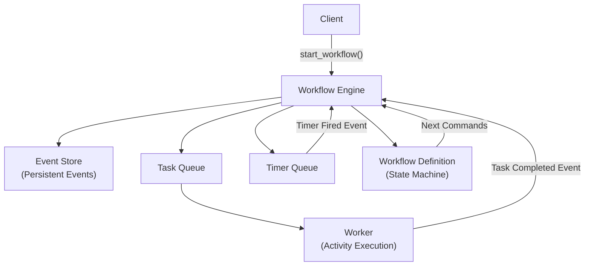
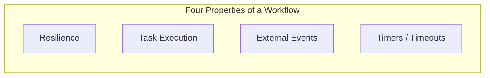
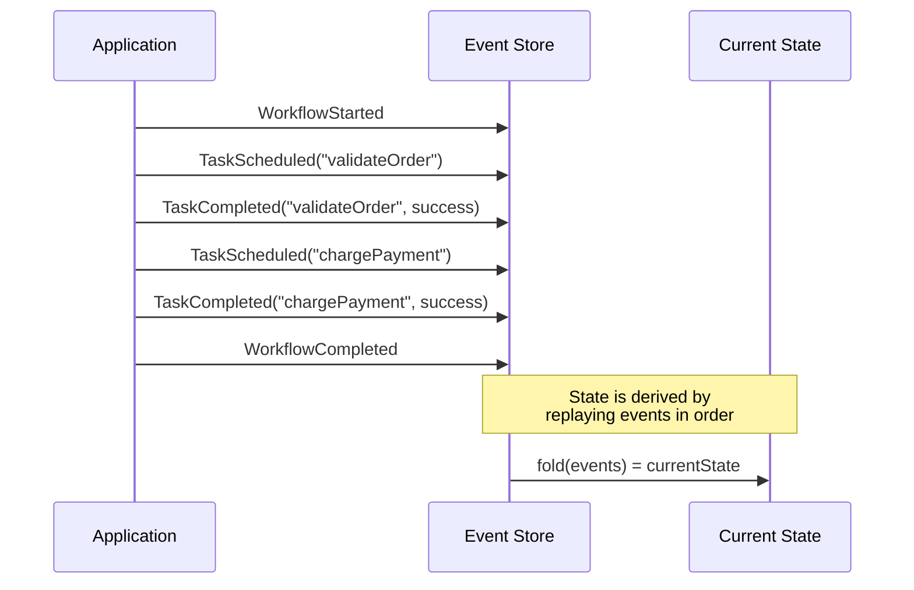
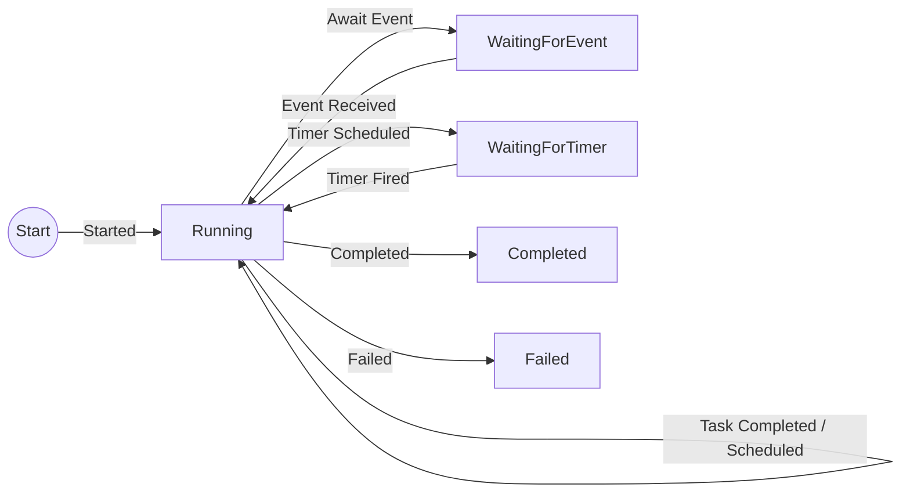
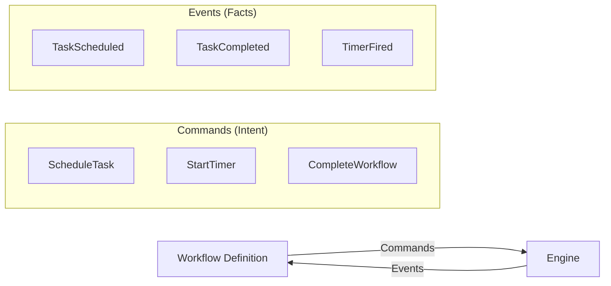
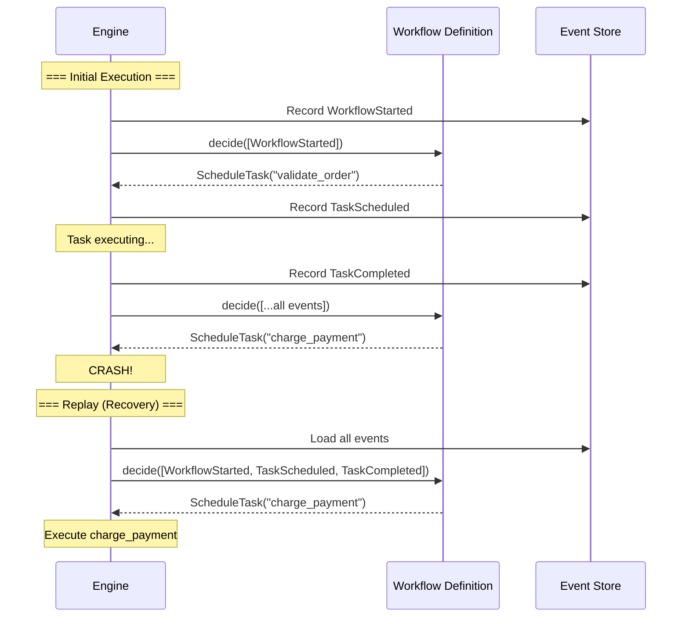
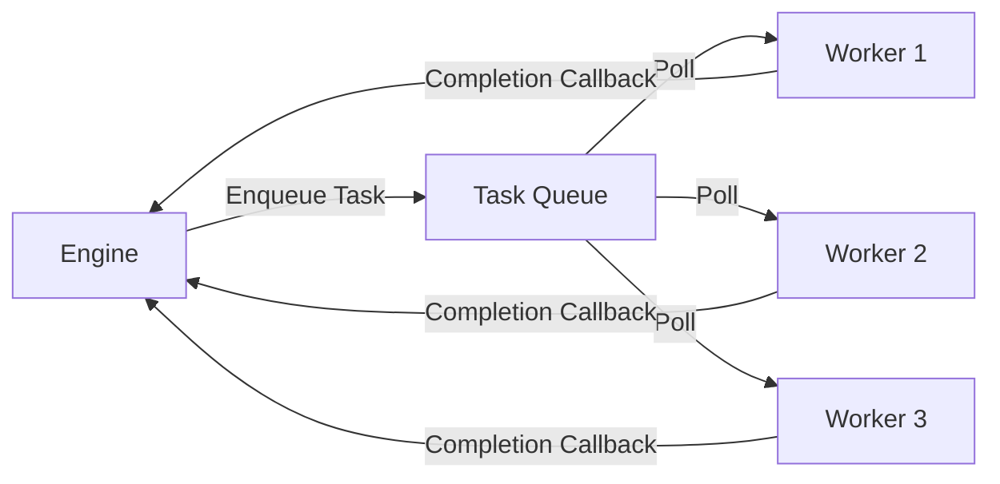
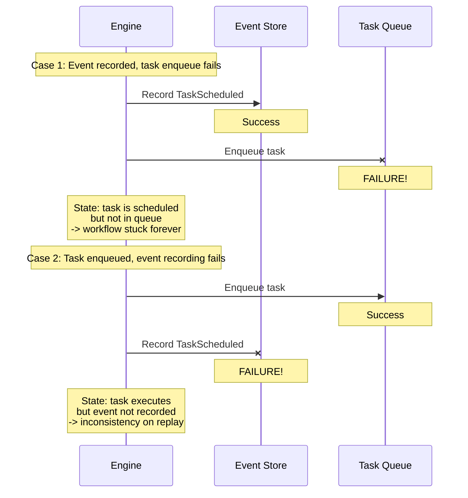
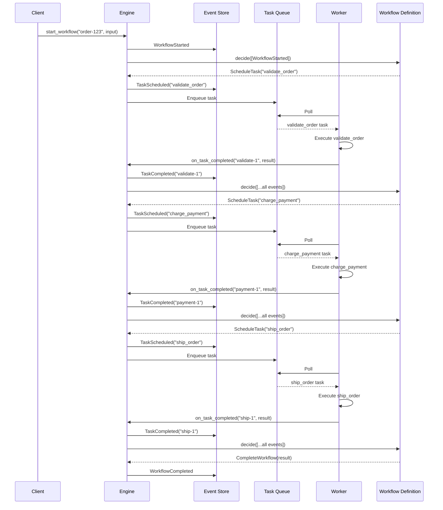
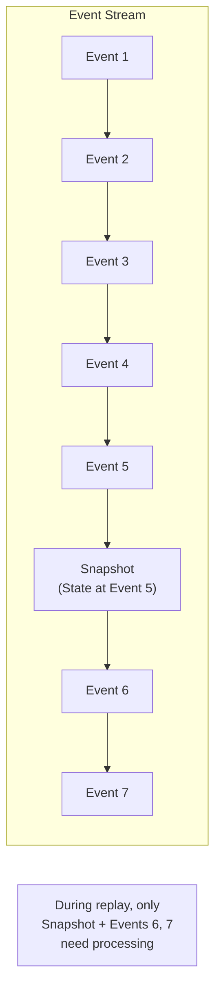

## Introduction

Temporal, Azure Durable Functions, AWS Step Functions — workflow engines have become essential infrastructure in modern distributed systems. They power e-commerce order processing, SaaS user onboarding, payment flows, and every other process that must "reliably execute multiple steps to completion."

But what is actually happening under the hood? By moving from merely *using* a workflow engine to *building* one, you gain a genuine understanding of the design principles at its foundation.

In this article, we will **build an event-driven workflow engine from scratch in Python**, gaining a thorough understanding of the fundamental design principles along the way. We will use only standard-library features — `dataclass`, `ABC` (Abstract Base Class), and `collections.deque` — so no external packages are required.

### Topics Covered

1. What is a workflow — the four essential properties
2. Event sourcing — storing state as a sequence of events
3. Workflow definitions — deterministic state machines
4. Deterministic replay — the heart of fault tolerance
5. Task queues and workers
6. Timers and timeouts
7. Transactional consistency — the Outbox pattern
8. Putting it all together — an order processing workflow
9. Snapshot optimization
10. Mapping to commercial engines

### Target Audience

- Readers who understand basic Python (classes, functions, dicts, lists)
- Anyone curious about distributed systems or workflow engines but unfamiliar with their internals
- Developers who use Temporal or Azure Durable Functions but want to deeply understand the design principles

Let us begin with a bird's-eye view of the overall architecture.

## Overall Architecture

Here is the big picture of the workflow engine we are going to build. Keep this diagram in mind as we implement each component one by one.



A brief summary of each component's role:

- <strong>Workflow Engine</strong> — The orchestrator. It reads history from the event store, consults the workflow definition, and decides the next action.
- <strong>Event Store</strong> — A "ledger" that records everything that happened. Append-only; existing records are never modified.
- <strong>Workflow Definition</strong> — The business logic itself. A state machine that defines procedures like "validate order, then charge, then ship."
- <strong>Task Queue</strong> — A queue that delegates side-effectful work (API calls, DB operations, etc.) to workers.
- <strong>Worker</strong> — A process that pulls tasks from the queue and actually executes them.
- <strong>Timer Queue</strong> — Manages time-based controls like "send a reminder in 30 days."

This structure is a heavily simplified version of Temporal's architecture, but the core concepts are the same. Temporal is the successor to Cadence, originally developed within Uber, and is now used in production by companies worldwide. Our goal is to understand *why* these commercial engines are designed the way they are — by writing the code ourselves.

## Chapter 1: What Is a Workflow — The Four Essential Properties

### Why a "Normal Program" Falls Short

First, consider what happens without a workflow engine — writing order processing as a plain program:

```python
def process_order(order):
    validate_order(order)        # Step 1: Validate the order
    charge_payment(order)        # Step 2: Charge payment
    ship_order(order)            # Step 3: Ship the order
    send_confirmation(order)     # Step 4: Send confirmation email
```

This looks simple, but it has serious problems:

- What if the process crashes right after `charge_payment()` succeeds? Payment was charged but the order never ships — the customer may be double-charged.
- What if `ship_order()` fails due to a shipping API timeout? How many minutes should you wait before retrying? What if it crashes again during the retry?
- How do you implement "wait 3 days for customer approval, then cancel on timeout"? `time.sleep(3 * 86400)` loses its state when the process restarts.

A workflow engine solves exactly this problem: **reliably executing multi-step, long-running processes to completion, even in the face of failures.**

### The Four Properties of a Workflow

Temporal co-founder Maxim Fateev defines a workflow by these four properties:

1. <strong>Resilient Program</strong> — Execution survives process crashes and can resume from where it left off
2. <strong>Executes Tasks</strong> — Invokes side-effectful operations (API calls, database writes, etc.)
3. <strong>Reacts to External Events</strong> — Receives notifications from the outside world: human approval buttons, webhooks, etc.
4. <strong>Timers and Timeouts</strong> — Time-based control such as "sleep for 30 days" or "cancel if not approved within 3 days"



To satisfy all four properties, workflow engines place two mechanisms at their core: **event sourcing** and **deterministic replay**. We will implement both, starting in the next chapter.

## Chapter 2: Event Sourcing — Everything is a Sequence of Events

### Why Storing "Current State" Alone Is Not Enough

A traditional CRUD (Create/Read/Update/Delete) approach stores only the current state in the database. For example, writing `status = "paid"` to an orders table represents "the current state."

For a workflow engine, however, this approach has fatal flaws:

- <strong>No audit trail</strong> — You cannot tell how `status` came to be `"paid"`. The history of who changed what and when is gone.
- <strong>No failure recovery</strong> — When a process crashes, in-memory intermediate state is lost. The DB `status` may or may not have been updated. There is no way to correctly restore a half-finished state.
- <strong>Difficult debugging</strong> — When something goes wrong in production, you cannot reconstruct "what happened in what order."

### Event Sourcing as the Solution

With event sourcing, instead of writing state changes directly to the database, you **record every occurrence (event) in chronological order**. The current state is derived by "replaying" the recorded events from the beginning.

A bank account is a perfect everyday analogy. Your passbook records "deposit 10,000 yen," "withdrawal 3,000 yen," "deposit 5,000 yen." The balance (current state) can be computed by processing these transaction records from top to bottom: 10,000 - 3,000 + 5,000 = 12,000 yen. If you had only written down the balance, you could not verify whether a calculation error occurred along the way. But with the full transaction history, you can always recompute the correct balance.



### Representing Events in Python — Using `dataclass`

Let us start coding. First, we define the types of events that occur in a workflow using Python's `dataclass`.

`dataclass` is a feature introduced in Python 3.7 that automatically generates `__init__`, `__repr__`, and other boilerplate. By specifying `frozen=True`, instances become immutable — their fields cannot be changed after creation. Since events are records of facts that happened, their contents must never be altered. `frozen=True` enforces this constraint at the code level.

The `from __future__ import annotations` import at the top makes type hints (like `str`, `list[WorkflowEvent]`) evaluated lazily as strings, allowing us to reference class names that have not been defined yet. This is safe to include for compatibility even with Python versions older than 3.10.

```python
from __future__ import annotations

import time
from dataclasses import dataclass
from typing import Any


# ──────────────────────────────────────────────
# Events: immutable records of "what happened"
# frozen=True prevents field modification after creation
# ──────────────────────────────────────────────

@dataclass(frozen=True)
class WorkflowStarted:
    workflow_id: str
    input_data: Any
    timestamp: float

@dataclass(frozen=True)
class TaskScheduled:
    task_id: str
    task_name: str
    input_data: Any
    timestamp: float

@dataclass(frozen=True)
class TaskCompleted:
    task_id: str
    result: Any
    timestamp: float

@dataclass(frozen=True)
class TaskFailed:
    task_id: str
    error: str
    timestamp: float

@dataclass(frozen=True)
class TimerScheduled:
    timer_id: str
    fire_at: float          # Unix timestamp (seconds)
    timestamp: float

@dataclass(frozen=True)
class TimerFired:
    timer_id: str
    timestamp: float

@dataclass(frozen=True)
class ExternalEventReceived:
    event_name: str
    payload: Any
    timestamp: float

@dataclass(frozen=True)
class WorkflowCompleted:
    result: Any
    timestamp: float

@dataclass(frozen=True)
class WorkflowFailed:
    error: str
    timestamp: float


# Type alias combining all event types (Union type)
WorkflowEvent = (
    WorkflowStarted | TaskScheduled | TaskCompleted | TaskFailed
    | TimerScheduled | TimerFired | ExternalEventReceived
    | WorkflowCompleted | WorkflowFailed
)
```

Notice that every event class shares a `timestamp` field. This records "when the event occurred" and plays an important role in deterministic replay, which we will cover later.

### Implementing the Event Store

Now let us implement the "event store" — the component that saves and retrieves events. Here we use a simple in-memory implementation (a Python dict), but in a production system you would replace this with persistent storage like PostgreSQL or DynamoDB.

```python
from collections import defaultdict


class EventStore:
    """Append-only event store.

    Holds a list of events per workflow ID.
    Once recorded, events are never modified or deleted —
    this is the fundamental rule of event sourcing.
    """

    def __init__(self) -> None:
        # Key: workflow_id, Value: list of events
        self._streams: dict[str, list[WorkflowEvent]] = defaultdict(list)

    def append(self, workflow_id: str, events: list[WorkflowEvent]) -> None:
        """Append events to the end. Never touches existing events."""
        self._streams[workflow_id].extend(events)

    def get_events(self, workflow_id: str) -> list[WorkflowEvent]:
        """Return all events for the given workflow in chronological order."""
        return list(self._streams[workflow_id])

    def get_events_since(
        self, workflow_id: str, after_index: int
    ) -> list[WorkflowEvent]:
        """Return only events after the given index (for snapshot optimization)."""
        return list(self._streams[workflow_id][after_index:])
```

Using `defaultdict(list)` means that when we `append` to a workflow ID that does not exist yet, an empty list is automatically created.

The critical point is that the event store is **append-only**. Once recorded, events are never modified or deleted. The `append` method only adds to the end and never touches existing events. This is the fundamental rule of event sourcing.

Why append-only? If you were to modify a past event, the "current state" derived from those events would change. Then, during failure recovery replay, a different state would be restored, and consistency would be broken. It is the same reason you must not erase past transactions from a bank passbook.

## Chapter 3: Workflow Definition — A Deterministic State Machine

### Every Workflow Is a State Machine

With the event store implemented, we now need a mechanism to define "the business logic of a workflow."

Every workflow engine — YAML-based AWS Step Functions and code-based Temporal alike — has a **state machine** at its core. A state machine is a model that defines "what state are we currently in" and "given an event, what state do we transition to next."

For order processing, the states would be "order received" → "validated" → "payment charged" → "shipped" → "completed", with each step's completion event triggering the transition to the next state.



The engine's core loop repeats the following cycle:

1. Read the **entire event history** from the event store
2. Pass the history to the workflow definition (state machine)
3. The workflow definition returns "the next commands to execute" (e.g., "execute task A")
4. The engine executes the commands and records the results as events
5. Go back to step 1

Clearly distinguishing "commands" from "events" at this point is a critically important design principle.

### Separating Commands from Events

- <strong>Commands</strong> are **intentions** issued by the workflow definition. They are requests: "please execute this task" or "please set a timer."
- <strong>Events</strong> are **facts** recorded by the engine. They are outcomes: "this task has completed" or "the timer has fired."



Why separate them? This separation allows the workflow definition to focus on **pure logic**. The actual execution of side effects like "call the payment API" is entirely delegated to the engine and workers. This makes the workflow definition testable and replayable.

### Implementing Commands and Workflow Definition in Python

Commands are defined with `dataclass` just like events. The workflow definition interface is defined using `ABC` (Abstract Base Class).

`ABC` is a mechanism that enforces "this class cannot be instantiated directly — subclasses must implement specified methods." It is equivalent to `interface` in Java or C#.

```python
from abc import ABC, abstractmethod


# ──────────────────────────────────────────────
# Commands: intentions issued by the workflow definition
# ──────────────────────────────────────────────

@dataclass(frozen=True)
class ScheduleTask:
    task_id: str
    task_name: str
    input_data: Any

@dataclass(frozen=True)
class StartTimer:
    timer_id: str
    delay_seconds: float

@dataclass(frozen=True)
class WaitForEvent:
    event_name: str

@dataclass(frozen=True)
class CompleteWorkflow:
    result: Any

@dataclass(frozen=True)
class FailWorkflow:
    error: str


WorkflowCommand = (
    ScheduleTask | StartTimer | WaitForEvent
    | CompleteWorkflow | FailWorkflow
)


# ──────────────────────────────────────────────
# Abstract interface for workflow definitions
# ──────────────────────────────────────────────

class WorkflowDefinition(ABC):
    """Abstract base class representing workflow business logic.

    Subclasses implement the decide() method.
    decide() is a "pure function" that takes an event history
    and returns a list of commands.
    """

    @abstractmethod
    def decide(self, events: list[WorkflowEvent]) -> list[WorkflowCommand]:
        """Determine the next commands based on event history.

        IMPORTANT: This method MUST be a **pure function**.
        Given the same event sequence, it must always return the same commands.
        """
        ...
```

The constraint that `decide` must be a **pure function** is the single most important point in this entire article. "Given the same input (event sequence), always return the same output (command list). Hold no side effects whatsoever." This is what makes deterministic replay possible, as we will see shortly.

### Concrete Example: Order Processing Workflow

Let us implement an actual workflow definition. The order processing flow is: validate → charge → ship → complete.

```python
class OrderWorkflow(WorkflowDefinition):
    """Order processing workflow.

    Progresses through: validate -> charge -> ship -> complete.
    If any task fails, the entire workflow fails.
    """

    def decide(self, events: list[WorkflowEvent]) -> list[WorkflowCommand]:
        # First, compute "what phase are we in" from the event history
        state = self._build_state(events)

        # Return the next command based on the current phase
        if state["phase"] == "started":
            return [ScheduleTask(
                task_id="validate-1",
                task_name="validate_order",
                input_data=state["order_data"],
            )]

        if state["phase"] == "validated":
            return [ScheduleTask(
                task_id="payment-1",
                task_name="charge_payment",
                input_data=state["order_data"],
            )]

        if state["phase"] == "charged":
            return [ScheduleTask(
                task_id="ship-1",
                task_name="ship_order",
                input_data=state["order_data"],
            )]

        if state["phase"] == "shipped":
            return [CompleteWorkflow(result={
                "order_id": state["order_id"],
                "status": "delivered",
            })]

        if state["phase"] == "failed":
            return [FailWorkflow(error=state["error_message"])]

        # No commands if a task is in progress or waiting for an event
        return []

    def _build_state(self, events: list[WorkflowEvent]) -> dict:
        """Process events from the start to reconstruct the current state.

        This operation is called 'rehydration' in event sourcing.
        In functional programming, it corresponds to a fold (reduce).
        """
        phase = "initial"
        order_data: Any = None
        order_id = ""
        error_message = ""

        for event in events:
            if isinstance(event, WorkflowStarted):
                phase = "started"
                order_data = event.input_data
                if isinstance(event.input_data, dict):
                    order_id = event.input_data.get("order_id", "")

            elif isinstance(event, TaskCompleted):
                if event.task_id == "validate-1":
                    phase = "validated"
                elif event.task_id == "payment-1":
                    phase = "charged"
                elif event.task_id == "ship-1":
                    phase = "shipped"

            elif isinstance(event, TaskFailed):
                phase = "failed"
                error_message = event.error

        return {
            "phase": phase,
            "order_data": order_data,
            "order_id": order_id,
            "error_message": error_message,
        }
```

Pay attention to the `_build_state` method. It processes the event list from beginning to end, computing "what phase are we in now." This operation is called **rehydration** in the event sourcing world. If you are familiar with functional programming, you will recognize it as the same pattern as `functools.reduce` (fold).

Note how `_build_state` uses `isinstance` to identify each event type and update the state accordingly. In Python, `isinstance`-based pattern matching corresponds to TypeScript's `switch (event.type)` or Rust's `match`. Python 3.10+ supports `match` statements, but we use `isinstance` here for broader compatibility.

## Chapter 4: Deterministic Replay — The Heart of Fault Tolerance

### Why Replay Can Recover State

The most important property of a workflow engine is **fault tolerance**. Even if the process crashes, the exact same state can be recovered simply by replaying the event sequence recorded in the event store.

Why is this possible? Because the `decide` method we implemented in the previous chapter is a **pure function**. Given the same event sequence, it always returns the same commands. In other words, just by passing the history stored in the event store to `decide`, we can uniquely determine "how far have we progressed, and what should we do next."



Look at the "Replay (Recovery)" section of this diagram. When a new process starts, it first loads the full history from the event store and passes it to `decide`. Because `decide` returns the same commands for the same event sequence as before the crash, the engine determines "these steps are already done, so the next step is `charge_payment`" and correctly resumes.

### Determinism Constraints — What You Must NOT Do Inside `decide`

For this mechanism to work, the `decide` method must be **deterministic** — meaning "given the same input, always produce the same output." Therefore, the following operations are forbidden inside `decide`:

| Forbidden | Reason | Alternative |
|-----------|--------|-------------|
| `random.random()` | Returns different values on replay | Execute as a task, record result as event |
| `time.time()` | Returns different timestamp on replay | Use the `timestamp` field from events |
| Network calls | Side effects re-execute on replay | Execute as an activity (task) |
| Global variable access | Values may differ across processes | Pass as input via events |

Temporal explicitly states in its official documentation that "workflow code must be **deterministic**." All side-effectful operations are externalized as **activities** (tasks), and their results are recorded as events. During replay, instead of re-executing activities, the recorded events (results) are used, thus preserving determinism.

### Implementing the Replay Engine

Now we implement the workflow engine itself — the orchestrator that ties together the event store, workflow definitions, task queues, and timer queues.

```python
class WorkflowEngine:
    """The workflow engine.

    Responsibilities:
    1. Start workflows (start_workflow)
    2. Restore state from event history and determine next commands (process_workflow)
    3. Execute commands and record events (_execute_command)
    4. Callbacks for task completion/failure/timer firing
    """

    def __init__(
        self,
        event_store: EventStore,
        task_queue: "TaskQueue",
        timer_queue: "TimerQueue",
        registry: dict[str, WorkflowDefinition],
    ) -> None:
        self.event_store = event_store
        self._task_queue = task_queue
        self._timer_queue = timer_queue
        self._registry = registry

    # ─── Starting a Workflow ───

    def start_workflow(
        self, workflow_id: str, workflow_type: str, input_data: Any
    ) -> None:
        """Start a new workflow."""
        start_event = WorkflowStarted(
            workflow_id=workflow_id,
            input_data=input_data,
            timestamp=time.time(),
        )
        self.event_store.append(workflow_id, [start_event])
        self.process_workflow(workflow_id, workflow_type)

    # ─── Core Loop ───

    def process_workflow(self, workflow_id: str, workflow_type: str) -> None:
        """Determine the next commands from the event sequence and execute them.

        This method IS deterministic replay.
        Because decide() returns the same commands for the same events,
        the workflow can correctly resume even after a crash.
        """
        definition = self._registry.get(workflow_type)
        if definition is None:
            raise ValueError(f"Unknown workflow type: {workflow_type}")

        events = self.event_store.get_events(workflow_id)

        # Step 1: Deterministic replay — same events -> same commands
        commands = definition.decide(events)

        # Step 2: Skip already-scheduled commands (idempotency guard)
        new_commands = self._filter_already_processed(events, commands)

        # Step 3: Execute only new commands
        for command in new_commands:
            self._execute_command(workflow_id, workflow_type, command)

    # ─── Command Execution ───

    def _execute_command(
        self, workflow_id: str, workflow_type: str, command: WorkflowCommand
    ) -> None:
        """Execute a command and record the corresponding event."""
        now = time.time()

        if isinstance(command, ScheduleTask):
            event = TaskScheduled(
                task_id=command.task_id,
                task_name=command.task_name,
                input_data=command.input_data,
                timestamp=now,
            )
            self.event_store.append(workflow_id, [event])
            self._task_queue.enqueue(TaskEntry(
                workflow_id=workflow_id,
                workflow_type=workflow_type,
                task_id=command.task_id,
                task_name=command.task_name,
                input_data=command.input_data,
            ))

        elif isinstance(command, StartTimer):
            fire_at = now + command.delay_seconds
            event = TimerScheduled(
                timer_id=command.timer_id,
                fire_at=fire_at,
                timestamp=now,
            )
            self.event_store.append(workflow_id, [event])
            self._timer_queue.schedule(TimerEntry(
                workflow_id=workflow_id,
                workflow_type=workflow_type,
                timer_id=command.timer_id,
                fire_at=fire_at,
            ))

        elif isinstance(command, CompleteWorkflow):
            event = WorkflowCompleted(result=command.result, timestamp=now)
            self.event_store.append(workflow_id, [event])

        elif isinstance(command, FailWorkflow):
            event = WorkflowFailed(error=command.error, timestamp=now)
            self.event_store.append(workflow_id, [event])

        # WaitForEvent is a no-op on the engine side —
        # we simply wait for the external event to arrive

    # ─── Callbacks ───

    def on_task_completed(
        self, workflow_id: str, workflow_type: str,
        task_id: str, result: Any,
    ) -> None:
        """Receive task completion notification from a worker."""
        event = TaskCompleted(
            task_id=task_id, result=result, timestamp=time.time()
        )
        self.event_store.append(workflow_id, [event])
        # Re-drive the workflow to determine the next commands
        self.process_workflow(workflow_id, workflow_type)

    def on_task_failed(
        self, workflow_id: str, workflow_type: str,
        task_id: str, error: str,
    ) -> None:
        """Receive task failure notification from a worker."""
        event = TaskFailed(
            task_id=task_id, error=error, timestamp=time.time()
        )
        self.event_store.append(workflow_id, [event])
        self.process_workflow(workflow_id, workflow_type)

    def on_timer_fired(
        self, workflow_id: str, workflow_type: str,
        timer_id: str, now: float,
    ) -> None:
        """Receive timer fired notification from the timer queue."""
        event = TimerFired(timer_id=timer_id, timestamp=now)
        self.event_store.append(workflow_id, [event])
        self.process_workflow(workflow_id, workflow_type)

    # ─── Idempotency Filter ───

    def _filter_already_processed(
        self,
        events: list[WorkflowEvent],
        commands: list[WorkflowCommand],
    ) -> list[WorkflowCommand]:
        """Skip commands that have already been scheduled.

        An idempotency guard to prevent double-execution during replay.
        """
        scheduled_task_ids: set[str] = set()
        scheduled_timer_ids: set[str] = set()
        is_completed = False

        for e in events:
            if isinstance(e, TaskScheduled):
                scheduled_task_ids.add(e.task_id)
            elif isinstance(e, TimerScheduled):
                scheduled_timer_ids.add(e.timer_id)
            elif isinstance(e, (WorkflowCompleted, WorkflowFailed)):
                is_completed = True

        if is_completed:
            return []

        result: list[WorkflowCommand] = []
        for cmd in commands:
            if isinstance(cmd, ScheduleTask) and cmd.task_id in scheduled_task_ids:
                continue    # Already scheduled -> skip
            if isinstance(cmd, StartTimer) and cmd.timer_id in scheduled_timer_ids:
                continue
            result.append(cmd)

        return result
```

The code is long, but each part has a clear responsibility. Let us summarize the key points:

1. <strong>`process_workflow`</strong> — The core loop. Reads all events from the event store, passes them to `decide()` to compute the next commands, and executes only commands that have not been executed yet.
2. <strong>`_execute_command`</strong> — Records an event for each command type and enqueues work onto the task queue or timer queue.
3. <strong>`on_task_completed` / `on_task_failed` / `on_timer_fired`</strong> — Receive notifications from the outside, record an event, and then call `process_workflow` again. This is what moves the workflow to its "next step."
4. <strong>`_filter_already_processed`</strong> — The idempotency guard. Even if `decide()` returns "schedule task A" during replay, this filter checks the event store for a "task A already scheduled" record and skips it. This prevents the same command from being executed twice.

## Chapter 5: Task Queues and Workers

### Why Use a Queue?

When the workflow engine decides "call the payment API," why does it not call the API directly? Why go through a queue and have a worker execute it?

There are three reasons:

1. <strong>Flow control</strong> — External APIs have rate limits (maximum requests per second). A queue distributes tasks according to worker capacity.
2. <strong>Availability</strong> — If a worker is temporarily down, tasks remain in the queue. When the worker recovers, it picks up tasks and resumes processing.
3. <strong>Scalability</strong> — Workers can be scaled horizontally (adding more instances). If one worker cannot handle the volume, scale to ten.



### Implementing the Task Queue and Workers

`deque` (double-ended queue) from the `collections` module is a data structure optimized for O(1) append and pop operations from both ends. Unlike a regular `list`, where `list.pop(0)` is O(n), `deque.popleft()` is O(1) — making it ideal for implementing FIFO queues.

`Callable` and `Awaitable` from `collections.abc` are types used for type hints. `Callable[[Any], Awaitable[Any]]` means "a function that takes one argument of any type and returns an awaitable (async) result." This is the type of an activity function.

```python
from collections import deque
from collections.abc import Awaitable, Callable


@dataclass
class TaskEntry:
    """An entry placed onto the task queue."""
    workflow_id: str
    workflow_type: str
    task_id: str
    task_name: str
    input_data: Any


class TaskQueue:
    """Simple in-memory FIFO task queue.

    In production, replace with RabbitMQ, Amazon SQS, Redis Streams, etc.
    """

    def __init__(self) -> None:
        self._queue: deque[TaskEntry] = deque()

    def enqueue(self, task: TaskEntry) -> None:
        """Add a task to the end of the queue."""
        self._queue.append(task)

    def dequeue(self) -> TaskEntry | None:
        """Retrieve a task from the front of the queue (FIFO).

        Returns None if the queue is empty.
        """
        if self._queue:
            return self._queue.popleft()
        return None

    def __len__(self) -> int:
        return len(self._queue)


# Activity function type: an async function that takes input and returns a result
ActivityFn = Callable[[Any], Awaitable[Any]]


class Worker:
    """Worker: retrieves tasks from the queue and executes them.

    Executes activities (side-effectful operations) and
    notifies the engine of completion or failure.
    """

    def __init__(
        self,
        task_queue: TaskQueue,
        engine: WorkflowEngine,
        activities: dict[str, ActivityFn],
    ) -> None:
        self._task_queue = task_queue
        self._engine = engine
        self._activities = activities

    async def poll(self) -> None:
        """Retrieve one task from the queue and execute it.

        In production, this would run in a continuous loop (long-polling).
        """
        task = self._task_queue.dequeue()
        if task is None:
            return

        activity = self._activities.get(task.task_name)
        if activity is None:
            self._engine.on_task_failed(
                task.workflow_id, task.workflow_type,
                task.task_id, f"Unknown activity: {task.task_name}",
            )
            return

        try:
            result = await activity(task.input_data)
            self._engine.on_task_completed(
                task.workflow_id, task.workflow_type,
                task.task_id, result,
            )
        except Exception as exc:
            self._engine.on_task_failed(
                task.workflow_id, task.workflow_type,
                task.task_id, str(exc),
            )
```

Workers execute **activities**. Activities are **side-effectful operations** such as external API calls, database queries, or sending emails.

Let us reaffirm the critical distinction:

- <strong>Workflow definitions</strong> — Pure functions. No side effects. Deterministic. Replayable.
- <strong>Activities</strong> — Have side effects. Non-deterministic is fine. Results are recorded as events.

Why can activities be non-deterministic? Because **their results are recorded as events**. During replay, instead of re-executing the activity, the engine uses the recorded result (`TaskCompleted` or `TaskFailed`) from the event store. So even if an activity is "an external API call that returns different results every time," it does not affect the determinism of replay.

## Chapter 6: Timers and Timeouts

### How to Implement "Sleep for 30 Days"

Workflows often require long waits such as "timeout after 3 days awaiting approval" or "send a reminder after 30 days."

What if you naively wrote `time.sleep(30 * 86400)`? If the process restarts, the sleep state is gone. Keeping a process running for 30 days straight is impractical and wastes memory.

The solution is **durable timers**. Record the scheduled fire time as an event, and have a separate process (timer service) periodically check and fire events when the time arrives. Even if the process restarts, the "timer was scheduled" record remains in the event store, so the timer service can automatically recover after restart.

```python
@dataclass
class TimerEntry:
    """An entry registered in the timer queue."""
    workflow_id: str
    workflow_type: str
    timer_id: str
    fire_at: float   # Unix timestamp (seconds)


class TimerQueue:
    """Durable timer queue.

    Holds a list sorted by fire time.
    Periodically calling check_and_fire() fires
    timers whose time has come.

    In production, replace with Redis Sorted Sets
    or a database scheduler.
    """

    def __init__(self) -> None:
        self._timers: list[TimerEntry] = []

    def schedule(self, timer: TimerEntry) -> None:
        """Register a timer, sorted by fire time."""
        self._timers.append(timer)
        self._timers.sort(key=lambda t: t.fire_at)

    def check_and_fire(
        self, engine: WorkflowEngine, now: float | None = None
    ) -> None:
        """Fire all timers whose time has passed."""
        if now is None:
            now = time.time()

        while self._timers and self._timers[0].fire_at <= now:
            timer = self._timers.pop(0)
            engine.on_timer_fired(
                timer.workflow_id, timer.workflow_type,
                timer.timer_id, now,
            )
```

Notice that `check_and_fire` calls the engine's `on_timer_fired` — the same pattern as the worker calling `on_task_completed` in the previous chapter. From the engine's perspective, both timer firing and task completion follow the same flow: "record event → re-drive `process_workflow`."

## Chapter 7: Transactional Consistency — The Outbox Pattern

### The Consistency Trap in Distributed Systems

Each operation in the workflow engine must perform multiple updates **atomically** (all succeed or all fail):

1. Append events to the event store
2. Enqueue tasks onto the task queue
3. Register timers in the timer queue

Without atomicity, serious inconsistencies arise:



In Case 1, the event store says "the task was scheduled," but the task was never actually placed in the queue, so no worker will ever process it. The workflow is stuck forever.

In Case 2, the task is in the queue and gets executed, but the event store has no record of it. During replay, `decide` concludes "not yet scheduled" and double-schedules the same task.

### The Outbox Pattern Solution

Temporal's architecture solves this with a **Transfer Queue**. In microservices architecture, Chris Richardson formalized this technique as the **Transactional Outbox pattern**, which is widely known.

The key idea is:

1. Write events and messages (notifications of task enqueue or timer registration) to the database in the **same transaction**
2. A separate process (Outbox relay) asynchronously reads messages and delivers them to the actual queues

This eliminates Case 1: "event was recorded but message was not delivered." Even if the Outbox relay process crashes, undelivered messages remain in the database and can be retried after restart.

```python
import json


@dataclass
class OutboxEntry:
    """An entry in the Outbox table.

    Written in the same transaction as the event store.
    The Outbox relay asynchronously delivers to task/timer queues.
    """
    id: int
    workflow_id: str
    workflow_type: str
    message_type: str      # "task" or "timer"
    payload: str           # JSON string
    processed: bool = False


class TransactionalEventStore:
    """Event store with the Outbox pattern.

    append_with_outbox() atomically appends events
    and adds Outbox messages. In a real system,
    use a database transaction.
    """

    def __init__(self) -> None:
        self._streams: dict[str, list[WorkflowEvent]] = defaultdict(list)
        self._outbox: list[OutboxEntry] = []
        self._next_outbox_id = 1

    def append_with_outbox(
        self,
        workflow_id: str,
        events: list[WorkflowEvent],
        messages: list[OutboxEntry],
    ) -> None:
        """Atomically append events and add Outbox messages.

        ──── Transaction boundary ────
        In a real system, wrap with BEGIN / COMMIT:
          BEGIN;
            INSERT INTO event_store ...;
            INSERT INTO outbox ...;
          COMMIT;
        """
        self._streams[workflow_id].extend(events)
        for msg in messages:
            msg.id = self._next_outbox_id
            self._next_outbox_id += 1
            self._outbox.append(msg)

    def process_outbox(
        self,
        task_queue: TaskQueue,
        timer_queue: TimerQueue,
    ) -> None:
        """Outbox relay: deliver unprocessed messages to queues."""
        for entry in self._outbox:
            if entry.processed:
                continue

            payload = json.loads(entry.payload)
            if entry.message_type == "task":
                task_queue.enqueue(TaskEntry(**payload))
            elif entry.message_type == "timer":
                timer_queue.schedule(TimerEntry(**payload))

            entry.processed = True

    def get_events(self, workflow_id: str) -> list[WorkflowEvent]:
        """Return all events for the given workflow."""
        return list(self._streams[workflow_id])
```

This implementation shows the "transaction boundary" as a comment within in-memory code, but the essential pattern is the same. In a production system, wrap the contents of `append_with_outbox` with SQL `BEGIN` / `COMMIT` for true atomicity.

> <strong>Outbox pattern guarantee and caveats</strong>: Messages are delivered **at-least-once**. If the Outbox relay crashes right after delivering a message, the `processed = True` update is lost, and the same message may be re-delivered on the next startup. Therefore, consumers (workers and timer handlers) must be **idempotent**. Idempotent means "even if the same operation is performed multiple times, the result is the same as performing it once." For example, "set balance to 1,000" is idempotent (repeating it still gives 1,000), but "add 1,000 to balance" is not (repeating doubles the addition). A common approach is to record processed task_ids and skip duplicates.

## Chapter 8: Putting It All Together — Order Processing Workflow

### The Complete Execution Flow

Let us trace the complete execution flow of the order processing workflow with all components assembled. We will verify "which component does what" at each step.



In words, the flow proceeds as follows:

1. The client calls `start_workflow`. The engine records a `WorkflowStarted` event and calls `decide`.
2. `decide` determines "not yet validated" and returns `ScheduleTask("validate_order")`.
3. The engine records a `TaskScheduled` event and enqueues the task.
4. A worker picks up the task from the queue and executes the `validate_order` activity.
5. On success, the worker calls `on_task_completed` on the engine.
6. The engine records a `TaskCompleted` event and calls `decide` again.
7. `decide` determines "validation is done; next is payment" and returns `ScheduleTask("charge_payment")`.
8. The same pattern repeats through charge → ship → complete.

**What if it crashes right after step 5?** A new process starts, loads all events from the event store, and passes them to `decide`. `decide` deterministically concludes "validation is done, next is payment" from the events, correctly resuming at step 7.

### The Entry Point — Wiring Everything Together

The sequence diagram may leave you wondering: "Where does execution actually start?" Here is a `main` function that wires all the components together.

```python
import asyncio


# ─── Activity functions (side-effectful business logic) ───

async def validate_order(input_data: Any) -> dict:
    """Validate the order contents."""
    order_id = input_data["order_id"]
    # In production: check inventory, validate inputs, etc.
    return {"valid": True, "order_id": order_id}


async def charge_payment(input_data: Any) -> dict:
    """Process payment."""
    order_id = input_data["order_id"]
    # In production: call the payment gateway API
    return {"charged": True, "order_id": order_id}


async def ship_order(input_data: Any) -> dict:
    """Process shipping."""
    order_id = input_data["order_id"]
    # In production: call the shipping carrier API
    return {"tracking_id": "TRK-456", "order_id": order_id}


# ─── Main function ───

async def main() -> None:
    # 1. Initialize the infrastructure layer
    event_store = EventStore()
    task_queue = TaskQueue()
    timer_queue = TimerQueue()

    # 2. Register workflow definitions
    #    The key "order" corresponds to workflow_type in start_workflow
    registry: dict[str, WorkflowDefinition] = {
        "order": OrderWorkflow(),
    }

    # 3. Assemble the engine
    engine = WorkflowEngine(event_store, task_queue, timer_queue, registry)

    # 4. Register activity functions and create the worker
    #    Keys correspond to the task_name values returned by decide()
    activities: dict[str, ActivityFn] = {
        "validate_order": validate_order,
        "charge_payment": charge_payment,
        "ship_order": ship_order,
    }
    worker = Worker(task_queue, engine, activities)

    # 5. Start a workflow
    engine.start_workflow(
        workflow_id="order-123",
        workflow_type="order",
        input_data={"order_id": "ORD-123", "items": ["item-A", "item-B"]},
    )

    # 6. Process tasks until the queue is drained
    while len(task_queue) > 0:
        await worker.poll()

    # 7. Inspect the results
    events = event_store.get("order-123")
    for i, event in enumerate(events):
        print(f"[{i}] {type(event).__name__}")


asyncio.run(main())
```

This `main` function illustrates the **dependency wiring** of the workflow engine.

- `EventStore`, `TaskQueue`, and `TimerQueue` are the infrastructure layer — responsible for data persistence and task routing.
- `OrderWorkflow` is the business logic layer — responsible for deciding "what to do next."
- `WorkflowEngine` is the orchestration layer — it records events, calls `decide`, and executes commands.
- `Worker` is the execution layer — it actually runs side-effectful activities and reports results back to the engine.

The `main` function itself **only assembles and starts** these layers; it contains no business logic and no infrastructure details. This is the power of separation of concerns.

In production, the `while len(task_queue) > 0` loop would be replaced by a long-polling process, and `asyncio.run(main())` would be integrated into a web framework's entry point (e.g., FastAPI with `uvicorn`). The wiring structure itself, however, remains the same.

### The Event Store Contents

After execution completes, the event store contains these events:

```text
[0] WorkflowStarted      input={"order_id": "order-123", "items": [...]}
[1] TaskScheduled         task_id="validate-1"  task_name="validate_order"
[2] TaskCompleted         task_id="validate-1"  result={"valid": True}
[3] TaskScheduled         task_id="payment-1"   task_name="charge_payment"
[4] TaskCompleted         task_id="payment-1"   result={"charged": True}
[5] TaskScheduled         task_id="ship-1"      task_name="ship_order"
[6] TaskCompleted         task_id="ship-1"      result={"tracking_id": "TRK-456"}
[7] WorkflowCompleted     result={"order_id": "order-123", "status": "delivered"}
```

With this complete history, you can recover the state at any point in time and use it for audit trails and debugging. When investigating "why did this order fail?", simply trace the event sequence from top to bottom; every step is documented.

## Chapter 9: Snapshot Optimization

### The Replay Cost Problem

In our current implementation, every time `process_workflow` is called, it reads **all events** from the event store and passes them to `decide`. This is fine for short workflows, but for workflows with thousands or tens of thousands of steps (e.g., large batch processes or long-running approval flows), replaying all events every time becomes prohibitively expensive.

### Snapshots as the Solution

**Snapshots** solve this problem. Every N events, save the "state at that point" as a snapshot. On the next replay, process only the snapshot plus the events that came after it.



For example, in a workflow with 1,000 events where a snapshot was taken at event 500, replay only needs to process events 501 through 1,000 — cutting the work in half.

The important point is that snapshots are purely an **optimization**. The event stream remains the true source of truth. If a snapshot becomes corrupted or is lost, it can always be regenerated from the event stream, so no data is ever lost.

## Chapter 10: Mapping to Commercial Workflow Engines

Let us see how each concept from our minimal engine maps to commercial workflow engines. The names may differ, but the underlying mechanisms are the same.

| Concept | Our Implementation | Temporal | Azure Durable Functions |
|---------|-------------------|----------|------------------------|
| Event Store | `EventStore` class | History Service (Event History per workflow) | Azure Storage Table/Blob (History Table) |
| Workflow Definition | `WorkflowDefinition.decide()` | Workflow function (deterministic code) | Orchestrator function (`yield`/`await` for replay) |
| Task Execution | `Worker` + `TaskQueue` | Activity + Task Queue | Activity function + Durable Task Framework |
| Timers | `TimerQueue` | Durable Timer (within History Service) | Durable Timer (`create_timer()`) |
| Outbox Pattern | `TransactionalEventStore` | Transfer Queue (local queue per shard) | Control Queue + Work Item Queue |
| Deterministic Replay | `process_workflow()` | Workflow Task Processing | Orchestrator Replay |
| Snapshots | `get_events_since()` | Sticky Execution (in-memory cache on a worker; not a persistent snapshot — full replay on worker failure) | Checkpoint (Extended Sessions) |

Temporal's Sticky Execution is a mechanism that caches state in worker process memory. When the same worker receives consecutive processing assignments, replay can be skipped. However, if the worker crashes, the cache is lost and a full replay is required. This differs from the persistent snapshots described in this article.

## Conclusion

In this article, we built an event-driven workflow engine from scratch in Python and learned six design principles:

1. <strong>Event Sourcing</strong> — Rather than storing state directly, record it as an immutable sequence of events. Current state is derived by replaying events. The same principle as a bank passbook.
2. <strong>Deterministic Workflow Definitions</strong> — Write workflow logic as pure functions. By always returning the same commands for the same event sequence, fault recovery through replay becomes possible.
3. <strong>Command-Event Separation</strong> — Clearly separate "what we want to do" (commands) from "what happened" (events) to isolate workflow definitions from side effects.
4. <strong>Indirect Execution via Task Queues</strong> — Delegate side-effectful operations to workers and use queues for flow control, availability, and scalability.
5. <strong>Durable Timers</strong> — Record timers as events to decouple them from the process lifecycle. Use event store records instead of `time.sleep()`.
6. <strong>Outbox Pattern</strong> — Perform state updates and message sends atomically for consistency in distributed systems. At-least-once delivery means consumers must be idempotent.

With these concepts firmly understood, whether you use Temporal, Azure Durable Functions, or any other workflow engine, you will be equipped to deeply understand the **why** behind their design decisions. And you will be able to step up from "just using" to "understanding the internals and making informed design and operational choices."

## References

- [Designing a Workflow Engine from First Principles — Temporal Blog](https://temporal.io/blog/workflow-engine-principles)
- [Event Sourcing pattern — Microsoft Azure Architecture Center](https://learn.microsoft.com/en-us/azure/architecture/patterns/event-sourcing)
- [Transactional Outbox pattern — microservices.io (Chris Richardson)](https://microservices.io/patterns/data/transactional-outbox.html)
- [Event Sourcing — Martin Fowler](https://martinfowler.com/eaaDev/EventSourcing.html)
- [CQRS Documents (PDF) — Greg Young](https://cqrs.files.wordpress.com/2010/11/cqrs_documents.pdf)
- [Temporal Documentation — Concepts](https://docs.temporal.io/concepts)
- [Azure Durable Functions Documentation](https://learn.microsoft.com/en-us/azure/azure-functions/durable/durable-functions-overview)
