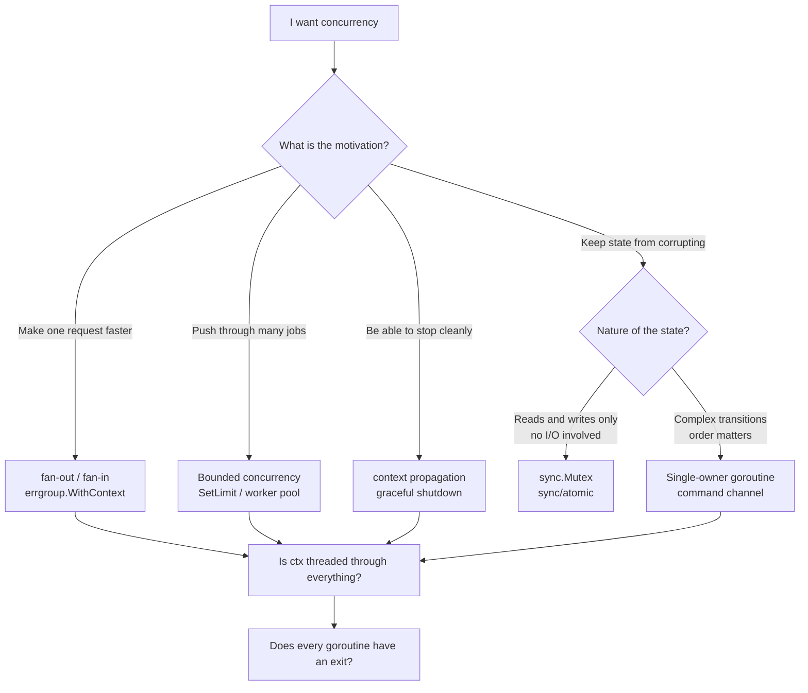
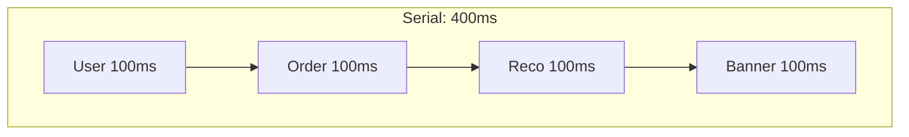
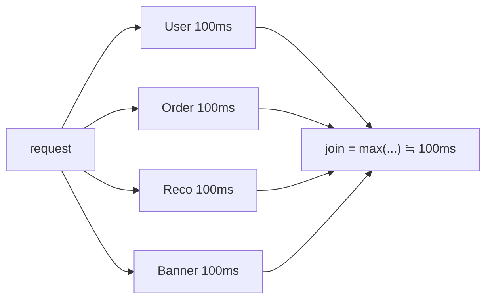
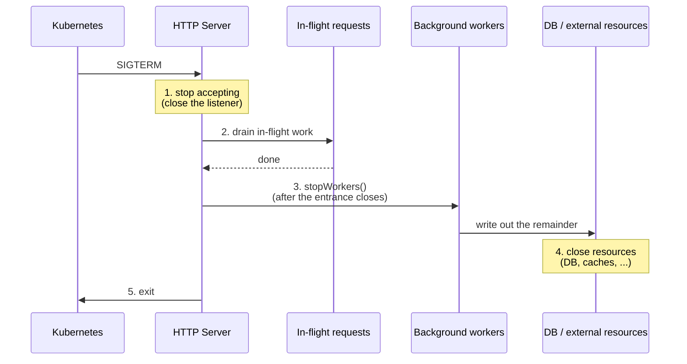
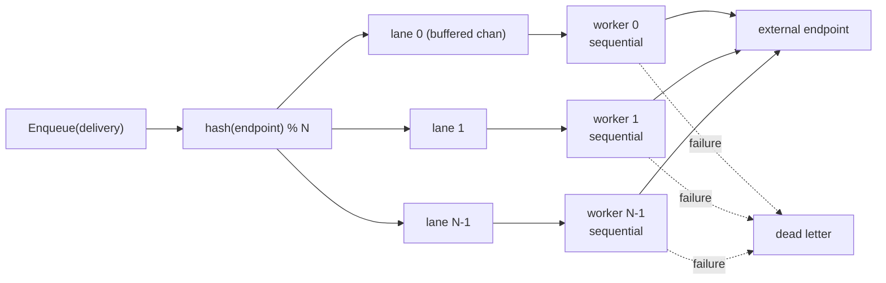

Write `go func()` and a goroutine starts. Send with `ch <- v`, receive with `<-ch`. Use `select` to wait on several channels at once. As syntax, this takes thirty minutes to learn. The textbook examples make sense too.

And yet, when you sit down to write real code at work, **there is nowhere to put a channel**. Or worse — you force one in, and the result is harder to read and easier to break than what you had before.

That gap is not a sign that your understanding is shallow. It exists because **textbooks teach the mechanism, not the motivation**. "Sum 1 to 100 using three goroutines" is a correct explanation of the machinery and has nothing to do with why anyone introduces concurrency in production. What real work demands is **judgment**: should this function be concurrent? Is this a channel or a mutex? What buffer size, and why?

This article rebuilds Go concurrency starting from that judgment.

## Where this article stands

Three misconceptions are worth dismantling up front. Without that, everything below reads as a bag of tricks.

<strong>Misconception 1: concurrency is for making things fast</strong>

In production server applications, the main reasons to introduce concurrency are **overlapping wait time** and **controlling lifecycle** — not saturating the CPU. Profile a web application and most of the wall clock is spent waiting on a database, an external API, or storage. CPU parallelism takes the lead only for genuinely CPU-bound work such as image or crypto processing.

<strong>Misconception 2: goroutines are for special occasions</strong>

The `net/http` server starts a goroutine **per connection** ([`net/http/server.go`](https://github.com/golang/go/blob/master/src/net/http/server.go) calls `go c.serve(connCtx)` from `Server.Serve`; with HTTP/1.1 keep-alive, requests on one connection are handled sequentially inside that goroutine, and HTTP/2 spawns a goroutine per stream). Either way, handlers for different clients run at the same time. So the moment you write a Go web application, you are already writing a concurrent program. Every global variable, shared cache, and connection pool your handler touches is accessed concurrently. The real question is not "should I use concurrency?" but "**given a world that is already concurrent, where do I put structure?**"

<strong>Misconception 3: channels are for passing data between goroutines</strong>

Not wrong, but it misleads you about the proportions. In real production code, channels carry **timing** (when may I proceed?) and **ownership** (which goroutine is allowed to touch this value right now?) far more often than they carry data. `<-ctx.Done()` transports no data at all, and it is the single most frequently written channel operation in practice.

With that established, here is the plan:

1. **A decision framework** — should this be concurrent, and is this a channel or a mutex?
2. **Six production patterns** — fan-out, bounded concurrency and backpressure, lifecycle management, ownership serialization, batching, and pub/sub
3. **A catalogue of failures** — the bugs you actually hit, and how to detect them as of Go 1.27
4. **The toolbox** — choosing among standard and quasi-standard libraries
5. **A case study** — building a webhook delivery worker step by step
6. **Testing and observability**

All code here is verified on **Go 1.27** (passing `go vet` and `go test -race`). For runtime internals — the G/M/P model, work stealing, the netpoller — see the companion article "[How the Go Scheduler Works](/en/blog/go-scheduler-gmp)". This one deliberately stays on the using side.

## Chapter 1: A decision framework

### 1.1 There are only four motivations for concurrency

Observe any real codebase and concurrency shows up for roughly four reasons. **Until you can name which one you are after, do not start writing code** — different motivations call for different structures.

| Motivation | What you want | Typical structure | Success metric |
| --- | --- | --- | --- |
| ① Overlapping wait time | Lower latency for one request | fan-out / fan-in | p50 / p99 latency |
| ② Throughput | More items processed per unit time | Bounded worker pool / pipeline | items/sec, queue depth |
| ③ Lifecycle management | Being able to stop, and to wait for the stop | context, graceful shutdown | error rate and data loss at shutdown |
| ④ Ownership serialization | State that does not corrupt | Single-owner goroutine (actor) | invariants held, no races |

Parallelizing CPU-bound computation is a fifth motivation, but it is rare in a typical web backend. When it does apply, it usually collapses into "split the work across `GOMAXPROCS` workers", and the backpressure and lifecycle discussions later in this article matter much less.

The important thing here is that **① and ② are entirely different goals.** ① (latency) is achieved by splitting *one* job into pieces dispatched simultaneously; ② (throughput) is achieved by keeping *many* jobs flowing without clogging. Spraying unbounded goroutines in pursuit of ① is exactly how ② collapses (Chapter 3).

### 1.2 Channel or mutex?

Go has a famous slogan:

> Don't communicate by sharing memory; share memory by communicating.

It is an excellent statement of design philosophy, and it **does not mean "always use a channel."** The official [Go Wiki: Use a sync.Mutex or a channel?](https://go.dev/wiki/MutexOrChannel) exists precisely to correct that misreading:

> Use whichever is most expressive and/or most simple.

That page lists channels as suited to "passing ownership of data, distributing units of work, communicating async results", and mutexes as suited to "caches, state". It also warns explicitly:

> A common Go newbie mistake is to over-use channels and goroutines just because it's possible, and/or because it's fun.

Translated into working criteria:

<strong>Choose a mutex (or atomics) when</strong>

- what you are protecting is **the data structure itself** (a map, a counter, a config value)
- the critical section is short and **performs no I/O**
- operations reduce to "read" and "write", and **order carries no meaning**

<strong>Choose a channel when</strong>

- you are **transferring ownership** of a value to another goroutine (after which the sender no longer touches it)
- you need to communicate **timing** (done, cancelled, time elapsed)
- you need to **regulate flow** — to make the producer wait, i.e. backpressure
- you need to **join several wait conditions with `select`** — which only channels can do

That last point is decisive. `select` is the only construct that safely expresses "react to whichever of these event sources fires first". Waiting simultaneously on "the result arrived", "we timed out", and "we were cancelled" is not something a mutex can express.

### 1.3 Measuring the cost — channels are not cheap

It is worth grounding the decision in numbers. Here is the same "increment a counter" operation implemented three ways.

```go
type mutexCounter struct {
    mu sync.Mutex
    n  int64
}

func (c *mutexCounter) Inc() {
    c.mu.Lock()
    c.n++
    c.mu.Unlock()
}

type atomicCounter struct{ n atomic.Int64 }

func (c *atomicCounter) Inc() { c.n.Add(1) }

// The "one goroutine owns the state" actor approach
type chanCounter struct {
    inc  chan struct{}
    stop chan struct{}
    n    int64
}

func newChanCounter() *chanCounter {
    c := &chanCounter{inc: make(chan struct{}), stop: make(chan struct{})}
    go func() {
        for {
            select {
            case <-c.inc:
                c.n++
            case <-c.stop:
                return
            }
        }
    }()
    return c
}

func (c *chanCounter) Inc() { c.inc <- struct{}{} }

// Note: this benchmark harness never closes `stop` — deliberately, since its
// lifetime is the measuring process. Production code should follow 4.2 rule 2.
```

Contended via `b.RunParallel`:

```text
goos: windows, goarch: amd64, go1.27
cpu: 12th Gen Intel(R) Core(TM) i7-12700K
GOMAXPROCS=8, -benchtime=2s -count=5 (median)

BenchmarkCounterAtomic-8      14.3 ns/op
BenchmarkCounterMutex-8       50.2 ns/op
BenchmarkCounterChannel-8    441.9 ns/op
```

Absolute values vary a lot by environment, and this measurement itself is noisy (five runs on the same machine spread by roughly ±30%). What to read is the **order of magnitude**. For a simple state update, the channel-actor approach is roughly an order of magnitude slower than a mutex and about 30× an atomic. Sends and receives on an unbuffered channel involve parking and unparking goroutines — handing control to the scheduler — so this is a structural cost, not an implementation defect.

That does not mean "channels are slow, avoid them." The correct conclusion is:

> Express in channels **the structures worth a few hundred nanoseconds a pop**. Do not pay it for plain mutual exclusion.

Using a channel once per request makes 441 ns entirely irrelevant — network I/O is measured in milliseconds, three to four orders of magnitude larger. Conversely, if you are updating a counter millions of times per second inside a hot loop, you should reach past the mutex for an atomic.

### 1.4 The decision flow



The bottom two rows are checkpoints every path must pass: **did you thread `ctx` through**, and **does every goroutine have a way out**. As Chapter 8 shows, most production incidents come from code that slipped past exactly these two.

## Chapter 2: Pattern ① fan-out / fan-in — overlapping wait time

### 2.1 Where it shows up

This is the most legible motivation. The archetype is a BFF (Backend for Frontend) or an aggregation API.

To render one screen you need user info, order history, recommendations, and banners from four different services. Each takes 100 ms. Serially that is 400 ms; concurrently it is 100 ms plus change. **This is the number-one reason concurrency appears in production code.**

```go
// Serial: 400ms
func (c *Clients) BuildPageSerial(ctx context.Context, uid string) (*Page, error) {
    u, err := c.User.Get(ctx, uid)
    if err != nil {
        return nil, err
    }
    o, err := c.Order.List(ctx, uid)
    if err != nil {
        return nil, err
    }
    r, err := c.Reco.For(ctx, uid)
    if err != nil {
        return nil, err
    }
    b, err := c.Banner.Fetch(ctx)
    if err != nil {
        return nil, err
    }
    return &Page{User: u, Orders: o, Recos: r, Banners: b}, nil
}
```

The condition for "this can be made concurrent" is precise: **there is no data dependency among the four calls.** If fetching `o` requires `u.TenantID`, those two must stay serial — the depth of the dependency graph is the floor on your latency.





### 2.2 The naive version and its four holes

Most people write this first:

```go
// Problematic
func (c *Clients) BuildPageNaive(ctx context.Context, uid string) (*Page, error) {
    var (
        wg   sync.WaitGroup
        page Page
        mu   sync.Mutex
        errs []error
    )
    wg.Go(func() {
        u, err := c.User.Get(ctx, uid)
        mu.Lock()
        defer mu.Unlock()
        if err != nil {
            errs = append(errs, err)
            return
        }
        page.User = u
    })
    wg.Go(func() {
        o, err := c.Order.List(ctx, uid)
        mu.Lock()
        defer mu.Unlock()
        if err != nil {
            errs = append(errs, err)
            return
        }
        page.Orders = o
    })
    wg.Wait()
    return &page, errors.Join(errs...)
}
```

(`wg.Go` is the method added in Go 1.25. It structurally eliminates the classic mismatched `wg.Add(1)` / `defer wg.Done()` bug, so new code should always prefer it.)

It works. It is not production-ready, for four reasons.

1. **Cancellation does not propagate.** If the user fetch fails at 500 ms, the order fetch still runs to completion. The user will never see the result, but the load on downstream services continues.
2. **Error meaning is lost.** Bundling everything with `errors.Join` leaves the caller unable to distinguish required data from optional data.
3. **A panic kills the process.** A panic inside a goroutine is not recovered unless that goroutine recovers it; the caller's `defer recover()` cannot catch it.
4. **The lock is guarding the wrong thing.** `page.User` and `page.Orders` are <strong>distinct memory locations</strong>, so <strong>no lock is needed for the page fields</strong>. What `mu` actually protects here is the `append` to `errs` (see 2.4).

### 2.3 Doing it with errgroup

`golang.org/x/sync/errgroup` is the quasi-standard library for this. Its API is five functions:

```go
func WithContext(ctx context.Context) (*Group, context.Context)
func (g *Group) Go(f func() error)
func (g *Group) TryGo(f func() error) bool
func (g *Group) SetLimit(n int)
func (g *Group) Wait() error
```

The `ctx` returned by `errgroup.WithContext` **is cancelled the first time any `Go` returns a non-nil error, or the first time `Wait` returns, whichever comes first.** The first half is the decisive difference from the naive version. The second half matters too: **reusing that `ctx` after `g.Wait()` yields `context.Canceled` even when every task succeeded.** The derived context's lifetime is the group's lifetime.

```go
func (c *Clients) BuildPage(ctx context.Context, uid string) (*Page, error) {
    g, ctx := errgroup.WithContext(ctx) // use this ctx from here on
    var page Page

    // Required: if either fails, there is no page to render
    g.Go(func() error {
        u, err := c.User.Get(ctx, uid)
        if err != nil {
            return err
        }
        page.User = u
        return nil
    })
    g.Go(func() error {
        o, err := c.Order.List(ctx, uid)
        if err != nil {
            return err
        }
        page.Orders = o
        return nil
    })

    // Optional: failure must not sink the whole page (return nil)
    g.Go(func() error {
        rctx, cancel := context.WithTimeout(ctx, 80*time.Millisecond)
        defer cancel()
        r, err := c.Reco.For(rctx, uid)
        if err != nil {
            slog.WarnContext(ctx, "recommendation degraded", "err", err)
            return nil // this is the design decision
        }
        page.Recos = r
        return nil
    })

    if err := g.Wait(); err != nil {
        return nil, err
    }
    return &page, nil
}
```

Three things to internalize here.

<strong>Point 1: shadowing in `g, ctx := errgroup.WithContext(ctx)` is deliberate.</strong>

Overwriting the original `ctx` prevents accidentally using the non-cancelling one further down. If you *do* have work that must not be swept up in the group's cancellation, deliberately keep the original under a different name.

<strong>Point 2: "required" versus "optional" is expressed as `return err` versus `return nil`.</strong>

`errgroup`'s semantics are "if one fails, abandon everything." That is right for required data and **too strong for optional data**. "Show the page even if recommendations are unavailable" is an utterly ordinary requirement. In that case, swallow the error inside the goroutine (but log it) and return `nil`.

Put differently, the `error` you return to `errgroup` is a flag meaning "is this subtask's failure a reason to abort the whole group?" — not "did an error occur?" Confuse the two and a transient failure in an optional dependency turns the whole page into a 500.

<strong>Point 3: give optional work its own, shorter timeout.</strong>

A tighter deadline than the required path prevents nice-to-have data from holding up everything else. Above, recommendations are abandoned after 80 ms.

One caveat: of the four holes listed in 2.2, **hole 3 (panic) is not closed by `errgroup` either.** It deliberately does not propagate panics from its goroutines, so a panicking `g.Go` function still takes the process down. The reasoning and the remedy are in 3.2 and 8.7.

### 2.4 Why `page` needs no lock

Different goroutines write `page.User` and `page.Orders`, and that is not a race. Under the Go memory model, **distinct struct fields are distinct memory locations**, and concurrent writes to distinct memory locations do not conflict. The reader only touches `page` after `g.Wait()`, whose synchronization edge makes all those writes visible.

This reasoning holds only under these conditions:

- each goroutine writes a **disjoint set of fields**
- the fields do not **share** a slice or map (e.g. `page.Orders` and `page.Recos` must not alias the same backing array)
- reads happen strictly after `Wait()`

By contrast, **multiple goroutines appending to the same slice is an outright race** (`append` reads and writes both the length and the backing array). When you need to collect results, either write to fixed indices or aggregate through a channel.

```go
// OK: each goroutine writes only its own index
results := make([]Result, len(inputs))
g, ctx := errgroup.WithContext(ctx)
for i, in := range inputs {
    g.Go(func() error {
        r, err := fetch(ctx, in)
        if err != nil {
            return err
        }
        results[i] = r // distinct index = distinct memory location
        return nil
    })
}
```

(This loop is safe to write this way because Go 1.22 made loop variables per-iteration. On Go 1.21 and earlier, `i, in := i, in` was mandatory. Beware copy-pasting from older articles.)

### 2.5 Latency is governed by the tail, not the max

I described fan-out as "400 ms → 100 ms", but production demands a more pessimistic model. The join point's latency is set by **the slowest of the four**. So:

- if each downstream has a p99 of 500 ms, the p99 of four concurrent calls is **worse** than 500 ms
- one slow dependency caps the benefit of the whole fan-out

If four independent calls are each slow 1% of the time, the probability that at least one is slow is `1 - 0.99^4 ≈ 3.9%`. **Fan-out amplifies individual slowness.** That is exactly why the per-call timeout in 2.3 matters.

Countermeasures, in order of preference:

1. **Reduce the required set** — must you really have all of it before responding?
2. **Give optional work a short timeout** — enforce the ceiling structurally
3. **Cache away the downstream call entirely** — most effective, most expensive to build
4. **Hedged requests** (fire a second attempt after a delay) — effective, but always cap the fraction, since it adds downstream load

### 2.6 `errgroup` versus `sync.WaitGroup`

Go 1.25's `WaitGroup.Go` narrowed the visual gap. The criterion is simple.

| | `sync.WaitGroup` | `errgroup.Group` |
| --- | --- | --- |
| Error aggregation | write it yourself | returns the first non-nil error |
| Cancel on failure | none | yes, with `WithContext` |
| Concurrency limit | write it yourself | `SetLimit(n)` |
| Dependency | standard library | `golang.org/x/sync` |

<strong>Tasks that return errors: `errgroup`. Tasks that do not: `WaitGroup`.</strong> That is the whole rule. Hand-rolling error aggregation onto `WaitGroup` to avoid a dependency rarely pays off — `golang.org/x/sync` is maintained by the Go team.

## Chapter 3: Pattern ② bounded concurrency and backpressure

### 3.1 The most common concurrency incident

The fan-out in Chapter 2 was safe because "four" is a fixed, small number. This chapter is about the case where **the count is determined by the input data**.

```go
// The code that takes down production
func ProcessAllUnbounded(ctx context.Context, items []Item) {
    var wg sync.WaitGroup
    for _, it := range items {
        wg.Go(func() { _ = process(ctx, it) })
    }
    wg.Wait()
}
```

Ten items is fine. A hundred thousand takes production down. Goroutines themselves are cheap (2 KB initial stack); the problem is not the goroutines but **the resources they grab**.

- **Connection pool exhaustion** — with `SetMaxOpenConns(20)`, 100,000 arrivals leave 99,980 blocked waiting for a connection. That wait eventually exceeds your application timeout and every request errors
- **Unintentional DoS on downstream services** — even if you survive, the callee dies under 100,000 concurrent connections, and the failure cascades
- **Memory** — 1 MB of buffer per goroutine is 100 GB. Goroutines are light; payloads are not
- **File descriptor exhaustion** — `too many open files` disables the whole process

The critical property is that **this code never fails in development or staging**, because the test fixture has ten rows. It fails only in production.

### 3.2 Three ways to bound it

<strong>Option 1: `errgroup.SetLimit` (first choice)</strong>

```go
func ProcessAllErrgroup(ctx context.Context, items []Item, limit int) error {
    g, ctx := errgroup.WithContext(ctx)
    g.SetLimit(limit)
    for _, it := range items {
        // Blocks here once `limit` goroutines are in flight
        g.Go(func() error { return process(ctx, it) })
    }
    return g.Wait()
}
```

After `SetLimit(n)`, `g.Go` blocks while `n` goroutines are running. Error aggregation, cancellation, and bounding all arrive together, so **this ends most discussions**.

One caveat. Reading the implementation, `g.Go` waits on a plain channel send ([`errgroup.go`](https://github.com/golang/sync/blob/master/errgroup/errgroup.go)):

```go
func (g *Group) Go(f func() error) {
    if g.sem != nil {
        g.sem <- token{} // not a select — ctx is not consulted
    }
    ...
}
```

So if `ctx` is cancelled while `g.Go` is blocked, **`g.Go` does not return until a slot frees up**. If you are feeding a large number of long-running tasks and need responsive cancellation, use `TryGo` (returns false immediately when full) or make the wait explicit with `select`, as in option 2.

Also, `errgroup` **does not propagate panics** from its goroutines. The source comments spell out the reasoning (delaying a panic makes bugs harder to find, it hides the stack from crash-monitoring tools, and so on). So if the function you hand to `g.Go` panics, the process dies. That is intended design, not a defect. Mitigation is in 8.7.

`SetLimit` also has a precondition: **it panics if called while the group has goroutines in flight.** Always set it before the first `Go`.

<strong>Option 2: a buffered channel as a semaphore</strong>

```go
func ProcessAllSemaphoreChan(ctx context.Context, items []Item, limit int) error {
    sem := make(chan struct{}, limit)
    var (
        wg   sync.WaitGroup
        mu   sync.Mutex
        errs []error
    )
    for _, it := range items {
        select {
        case sem <- struct{}{}: // take a slot (blocks when full)
        case <-ctx.Done():
            wg.Wait()
            return ctx.Err()
        }
        wg.Go(func() {
            defer func() { <-sem }() // return the slot
            if err := process(ctx, it); err != nil {
                mu.Lock()
                errs = append(errs, err)
                mu.Unlock()
            }
        })
    }
    wg.Wait()
    return errors.Join(errs...)
}
```

The idea: the number of values you can place in `make(chan struct{}, limit)` *is* the concurrency. Using `select` lets you wait for "a slot" and "cancellation" simultaneously — the difference from option 1.

This idiom is also **the clearest illustration of what a channel really is**. The `struct{}{}` being sent carries no data whatsoever. What travels is **permission to proceed**.

<strong>Option 3: `semaphore.Weighted` (non-uniform cost)</strong>

```go
func ProcessWeighted(ctx context.Context, items []Item, budgetMB int64) error {
    sem := semaphore.NewWeighted(budgetMB)
    g, ctx := errgroup.WithContext(ctx)
    for _, it := range items {
        // A weight above budgetMB makes Acquire wait forever (see below) — always clamp
        cost := min(estimateMB(it), budgetMB)
        if err := sem.Acquire(ctx, cost); err != nil {
            break // ctx cancelled
        }
        g.Go(func() error {
            defer sem.Release(cost)
            return process(ctx, it)
        })
    }
    return g.Wait()
}
```

Use this when the constraint is "at most 2 GB in flight" rather than "at most 10 at once" — video transcoding, batch aggregation, any workload where per-task cost varies by orders of magnitude.

<strong>The `min` clamp is a required defence.</strong> Reading [`semaphore.go`](https://github.com/golang/sync/blob/master/semaphore/semaphore.go), `Acquire(ctx, n)` with an `n` larger than the semaphore's total capacity **does not return an error — it blocks on `<-ctx.Done()`**, since the request can never be satisfied even when the semaphore is empty. Submit a 3 GB item against a 2 GB budget and the loop stalls until cancellation. The behaviour is "too large means wait forever", not "too large is an error", so the caller must clamp or reject up front.

### 3.3 Choosing the limit — do not guess

What number goes in `limit`? A great deal of code says "10, I guess" or "number of CPUs". There are principled answers.

<strong>CPU-bound: `GOMAXPROCS`</strong>

Cap at `runtime.GOMAXPROCS(0)`. Beyond that you only add context switches. Since Go 1.25 the default `GOMAXPROCS` accounts for Linux cgroup CPU limits, so the value is trustworthy in containers too (see "[How the Go Scheduler Works](/en/blog/go-scheduler-gmp)").

<strong>I/O-bound: derive it from the downstream constraint</strong>

This is overwhelmingly the common case. Your concurrency ceiling is set not by your CPU but by **what the downstream can absorb**. Use Little's Law:

```text
L = λ × W

L : number of jobs in the system at once (= required concurrency)
λ : throughput (items/sec)
W : residence time per item (sec)
```

Concretely: the downstream API is contractually capped at 200 req/s, and mean response time is 50 ms.

```text
L = 200 × 0.05 = 10
```

**Concurrency 10 saturates exactly 200 req/s.** Raising it to 100 just gets you rate-limited: no extra throughput, only errors and retries. Dropping it to 5 gets you 100 req/s.

(Strictly, this conversion assumes **`W` is constant**. The opposite danger — overshooting the contracted rate when the downstream gets *faster* — is the subject of the next section.)

The practical value of this calculation is that it lets you **derive the "concurrency" setting from a contract you must honour**. When the downstream allowance changes, you know the concurrency should change with it.

Another common constraint is the database connection pool:

```text
MaxOpenConns per app instance = 20
connections held by one task    = 1
→ DB-touching workers must stay below 20 concurrent
   (remember the HTTP handlers share the same pool)
```

**Failing to notice that batch workers and online requests share one pool** — and wiping out the API the moment a batch runs — is a classic incident.

#### 3.3.1 Concurrency limits and rate limits are different things

Here is a distinction many implementations conflate. Look at Little's Law again:

```text
L = λ × W
```

- **A semaphore (`SetLimit`, `semaphore.Weighted`) bounds `L`** — how many jobs are in flight at once
- **A rate limiter bounds `λ`** — how many jobs you *start* per unit time

<strong>Which tool you need is decided by the unit your downstream contract is written in.</strong>

| Downstream contract | Quantity to bound | Tool |
| --- | --- | --- |
| "up to 200 req/s" | λ (speed) | `rate.Limiter` |
| "up to 20 connections", "a 20-slot pool" | L (inventory) | semaphore / `SetLimit` |
| "1000 per minute, at most 10 at once" | both | both |

Trying to honour `λ` with a semaphore alone breaks down. The calculation in 3.3 (concurrency 10 ⇒ 200 req/s) holds **only while `W` stays at 50 ms**. The moment the downstream gets faster and `W` drops to 5 ms, that same concurrency of 10 emits 2000 req/s and slams into the rate limit. **A semaphore does not bound speed.**

```go
// golang.org/x/time/rate

// 200 req/s sustained, bursts of up to 20
limiter := rate.NewLimiter(rate.Limit(200), 20)

g, ctx := errgroup.WithContext(ctx)
g.SetLimit(10) // L: in-flight count (pool and memory constraints)

for _, it := range items {
    g.Go(func() error {
        // λ: start rate. Blocks until a token is available (ctx-interruptible)
        if err := limiter.Wait(ctx); err != nil {
            return err
        }
        return process(ctx, it)
    })
}
```

`rate.Limiter`'s three methods map directly onto the three strategies in 3.5:

| Method | Behaviour | Matching strategy |
| --- | --- | --- |
| `Wait(ctx)` | Block until a token is available | A (block = backpressure) |
| `Allow()` | Return `false` if no token right now | B (drop = load shedding) |
| `Reserve()` | Take a reservation and report the wait | C (decide based on the wait) |

`Reserve()` needs care: **it consumes the token immediately.** If you inspect the returned `*Reservation`'s `Delay()` and decide not to wait, you must call `r.Cancel()` to hand the token back, or your effective rate quietly degrades. (`ReserveN(t, n)` with `n` above the burst returns a reservation whose `OK()` is `false`.)

The burst argument (`20` above) is the same kind of design decision as buffer size in 3.4: it declares how many calls may go out back-to-back in an instant.

<strong>In practice you usually need both.</strong> A rate limiter alone lets in-flight work pile up without bound when the downstream stalls (`λ` is honoured while `L` diverges). A semaphore alone exceeds the contracted rate whenever the downstream speeds up. If you see an implementation with only one, check whether the other constraint really is absent.

### 3.4 What backpressure actually is

This is the part that stays invisible while you think of a channel as "an async queue".

<strong>An unbuffered channel means complete backpressure.</strong>

```go
ch := make(chan Item) // unbuffered
ch <- item            // blocks until a receiver takes it
```

The sender cannot proceed until a receiver accepts. That is a **feature**, not a limitation: the producer is forced to respect the consumer's pace. It becomes structurally impossible for a queue to grow without bound and exhaust memory when production outpaces consumption.

<strong>A buffered channel is a declaration that you will absorb N items of burst.</strong>

```go
ch := make(chan Item, 100) // sender doesn't block for the first 100
```

A frequent misconception is "bigger buffer, faster." Precisely stated: **a buffer raises the *attained* rate, not the *ceiling*.** The ceiling is the consumer's service rate μ, and a buffer does not lift it by a single item.

What a buffer does buy is exactly two things:

1. **absorbing transient bursts** — accepting a momentary inflow above μ on the promise of digesting it later
2. **decoupling producer and consumer scheduling** — amortizing the goroutine park/unpark paid at every rendezvous (the few hundred ns measured in 1.3) so the two overlap

(2) is a measurable win in a pipeline where both sides do real work. But if production persistently outruns consumption, the buffer fills sooner or later and behaviour from then on is identical to unbuffered.

So buffer size is not a performance knob; it is **a design decision about how much backlog you will tolerate**.

| Buffer size | Meaning |
| --- | --- |
| `0` (unbuffered) | Send and receive rendezvous. Full backpressure. Ordering and synchronization first |
| `1` | Let the sender get exactly one step ahead. The standard for signalling |
| `N` (small) | Absorb N items of burst. N × processing time = the extra latency you accept |
| Huge / unbounded | Backpressure abandoned. You are deferring the problem in exchange for memory |

<strong>Practical rule:</strong> derive buffer size from "how many seconds of backlog do I accept?" If an item takes 10 ms and you accept up to one second of delay, the buffer is 100. That number means something. "100 seems fine" does not.

### 3.5 What to do when it is full — three strategies

Designing backpressure means **explicitly deciding what happens when the queue is full**. Code that has not decided has implicitly chosen "block".

```go
// Strategy A: block (push backpressure upstream)
select {
case queue <- item:
case <-ctx.Done():
    return ctx.Err()
}

// Strategy B: drop (load shedding)
select {
case queue <- item:
default:
    metrics.Dropped.Inc()
    return ErrOverloaded
}

// Strategy C: wait with a deadline, then give up
timer := time.NewTimer(50 * time.Millisecond)
defer timer.Stop()
select {
case queue <- item:
case <-timer.C:
    metrics.Dropped.Inc()
    return ErrOverloaded
case <-ctx.Done():
    return ctx.Err()
}
```

The choice follows from the nature of the data.

| Data | Strategy | Reason |
| --- | --- | --- |
| Billing events, orders | A (block) + a durable queue | Cannot lose one. Better to stop accepting than to drop |
| Metrics, access logs | B (drop) | Gaps are tolerable; stalling the main path is worse |
| Synchronous user requests | B or C | Returning 503 quickly beats making them wait (fail fast) |

<strong>Strategy B is an active design decision, not a surrender.</strong> Blocking unconditionally when full causes upstream request handlers to pile up, goroutine count and memory to climb, and eventually the whole service to stop responding — the textbook cascading failure. Shedding load with an early 503 keeps the system healthier overall.

Note that strategy B's `default` clause means "give up immediately", so putting it in a `for` loop produces a busy loop. If you want to retry, always give it something to wait on, as in strategy C.

### 3.6 Making the queue observable

Whether your backpressure design was right is only knowable at runtime. **Simply exporting `len(ch)` and `cap(ch)` as metrics** dramatically improves what you can reason about. (The `metrics` below refers to your application's metrics package, e.g. a Prometheus client.)

```go
func (d *Dispatcher) observeQueues(ctx context.Context, interval time.Duration) {
    t := time.NewTicker(interval)
    defer t.Stop()
    for {
        select {
        case <-ctx.Done():
            return
        case <-t.C:
            for i, lane := range d.lanes {
                metrics.QueueDepth.WithLabelValues(strconv.Itoa(i)).
                    Set(float64(len(lane)))
            }
        }
    }
}
```

How to read it:

| Observed depth | Diagnosis |
| --- | --- |
| Almost always 0 | Healthy. Consumption keeps up with production |
| Spikes that quickly subside | Healthy. The buffer is doing its actual job (absorbing bursts) |
| Consistently near capacity | **Under-provisioned.** A bigger buffer will not help. Add consumers or throttle producers |
| Monotonically increasing | **Suspect a stalled consumer.** Look for a deadlock or a leak |

Row three matters most. Enlarging the buffer when depth is chronically high merely **hides the problem and worsens latency**. Backlogged items are also stale items — data whose value has decayed.

Go 1.26 added a per-state goroutine breakdown to [`runtime/metrics`](https://pkg.go.dev/runtime/metrics), so runtime saturation is directly readable too. (This `metrics` is the standard library's `runtime/metrics`.)

```go
// runtime/metrics

samples := []metrics.Sample{
    {Name: "/sched/goroutines:goroutines"},          // total (Go 1.16+)
    {Name: "/sched/goroutines/runnable:goroutines"}, // ready but not running (Go 1.26+)
    {Name: "/sched/goroutines/running:goroutines"},  // running (Go 1.26+)
    {Name: "/sched/goroutines/waiting:goroutines"},  // waiting on I/O or sync (Go 1.26+)
    {Name: "/sched/latencies:seconds"},              // scheduler wait distribution (Go 1.17+)
}
metrics.Read(samples)
```

Reading guide:

- chronically high `runnable` → **you are out of CPU**. Adding concurrency makes it worse
- `waiting` **high but flat**, `runnable` low, CPU idle → I/O-dominated. **This is where adding concurrency helps**
- `waiting` **growing without bound** → a leak (8.1) or a stalled downstream. Adding concurrency makes it worse; go read the stacks in the goroutine profile
- a lengthening tail on `/sched/latencies` → goroutines are being made to wait by the scheduler

"Should I raise the concurrency?" becomes a question you answer with numbers instead of intuition.

## Chapter 4: Pattern ③ lifecycle management

### 4.1 `<-ctx.Done()` is the channel you actually use

I opened by saying that real code has nowhere to put a channel. In fact most people already use one every day: `context.Context`'s `Done()`.

```go
type Context interface {
    Deadline() (deadline time.Time, ok bool)
    Done() <-chan struct{}   // this is a channel
    Err() error
    Value(key any) any
}
```

`context`'s design exploits two channel properties beautifully.

<strong>Property 1: receiving from a closed channel succeeds immediately.</strong>

This is what makes one-to-many broadcast work. When `cancel()` runs, it executes `close(done)`, and **every goroutine waiting on `<-ctx.Done()` is released at once**. Sending a value would reach exactly one receiver, so `close` is the only correct mechanism here.

The standard library ([`context/context.go`](https://github.com/golang/go/blob/master/src/context/context.go)) does exactly that:

```go
// excerpt from cancelCtx.cancel
func (c *cancelCtx) cancel(removeFromParent bool, err, cause error) {
    // ...
    c.mu.Lock()
    // ...
    d, _ := c.done.Load().(chan struct{})
    if d == nil {
        c.done.Store(closedchan)
    } else {
        close(d)          // wake every waiter at once
    }
    for child := range c.children {
        child.cancel(false, err, cause) // propagate recursively
    }
    // ...
}
```

<strong>Property 2: a nil channel blocks forever.</strong>

`context.Background()`'s `Done()` returns `nil`. A `select` arm waiting on a `nil` channel is **never chosen**. That is how "a context that is never cancelled" is expressed without special-casing. This property returns as a production idiom in 8.4.

### 4.2 Three rules for cancellation

<strong>Rule 1: take `ctx` as the first parameter and pass it straight down.</strong>

Code that accepts a `ctx` and fails to hand it to downstream calls has severed the chain. The `contextcheck` linter finds these mechanically (`go vet`'s `lostcancel` covers Rule 3 only — it reports an uncalled `cancel`, not a missing propagation).

<strong>Rule 2: whoever starts a goroutine stops it.</strong>

A function that launches a goroutine owns the responsibility for **a path by which that goroutine reliably terminates**. A `go` statement whose end you cannot explain is a bug.

There is a dedicated tool for this principle. The watchdog goroutine that exists only to "clean up when `ctx` is cancelled" —

```go
// Commonly written, easily leaked
go func() {
    select {
    case <-ctx.Done():
        conn.Close()
    case <-done: // forget to close this and the goroutine stays
    }
}()
```

— is replaced by Go 1.21's `context.AfterFunc`:

```go
stop := context.AfterFunc(ctx, func() { conn.Close() })
defer stop() // deregister
```

The benefit is that **no goroutine sits parked waiting on `ctx`**. `f` is merely registered in the parent's `children` set, and only at cancellation time does it get its own goroutine ([`context.go`](https://github.com/golang/go/blob/master/src/context/context.go)'s `afterFuncCtx.cancel` calls `a.once.Do(func() { go a.f() })`). So **there is no waiting goroutine to leak**.

Read `stop()`'s return value conservatively. The documentation says it returns `true` if it stopped `f` from running, and that `false` means "either the context is canceled and `f` has been started in its own goroutine, or `f` was already stopped" — and further that **`stop` does not wait for `f` to complete**. So `true` tells you the cleanup had not yet started; `false` tells you nothing about whether it finished. If you need to know, coordinate with `f` explicitly.

Note also that failing to call `stop()` keeps `f` and everything its closure captures alive **for as long as the parent context lives** — the same class of trap as Rule 3's `defer cancel()`.

<strong>Rule 3: always call `cancel` (`defer cancel()`).</strong>

```go
ctx, cancel := context.WithTimeout(parent, 3*time.Second)
defer cancel() // call it even when you finish early
```

Skipping `cancel()` leaves you registered in the parent's `children` map, so memory is not released while the parent lives. The timeout eventually frees it, but you leak until then. `go vet` catches this.

### 4.3 Layering timeouts

An easily missed fact: **timeouts nest**.

```go
// 3 seconds for the whole handler
ctx, cancel := context.WithTimeout(r.Context(), 3*time.Second)
defer cancel()

// 1 second for the database within it
dbCtx, dbCancel := context.WithTimeout(ctx, 1*time.Second)
defer dbCancel()
```

`context.WithTimeout` **cannot extend a parent's deadline**. If the parent is 3 seconds, specifying 10 for the child still means 3. That property structurally guarantees an overall ceiling.

Go 1.21's `WithTimeoutCause` is useful here:

```go
var ErrDBSlow = errors.New("db call exceeded budget")

dbCtx, dbCancel := context.WithTimeoutCause(ctx, time.Second, ErrDBSlow)
defer dbCancel()

if err := db.QueryRowContext(dbCtx, q).Scan(&v); err != nil {
    // ctx.Err() is always context.DeadlineExceeded,
    // but context.Cause(dbCtx) returns ErrDBSlow
    if errors.Is(context.Cause(dbCtx), ErrDBSlow) {
        // distinguish "the DB was slow" from "the overall budget expired"
    }
}
```

`ctx.Err()` only ever says `context.DeadlineExceeded`, so you cannot tell **which layer expired**. `Cause` disentangles it and makes incident analysis dramatically easier.

#### 4.3.1 A cancellation error has four different meanings

So far this has been about how to *propagate* cancellation. The harder problem in production is how to *interpret* one you observe. When a handler sees `context.Canceled`, there are at least four causes, and the right response differs for each.

| Cause | How to tell | Correct response |
| --- | --- | --- |
| ④ The process is shutting down | `workerCtx.Err() != nil` — **test this first** | Return 503 with `Retry-After` |
| ① The client hung up | `workerCtx.Err() == nil` **and** `errors.Is(r.Context().Err(), context.Canceled)` | **Do not log it as an error.** Do not burn SLO error budget. Do not retry |
| ② An `errgroup` sibling failed | `context.Cause(ctx)` is not `context.Canceled` | Report the sibling's **real** error, not `Canceled` |
| ③ Your own timeout budget expired | `DeadlineExceeded` + `Cause` identifies the layer (4.3) | **Alert.** This is your performance problem |

<strong>Note that the order of the tests matters.</strong> In 4.5's wiring, `BaseContext` supplies `workerCtx`, so `stopWorkers()` also cancels the `r.Context()` of every in-flight handler. That makes `r.Context().Err() != nil` true for **both** ① and ④. Test ④ first, or you will misclassify a shutdown as a client disconnect and skip the 503 you owe the caller.

<strong>Confusing ① with ② and ③ is the most common mistake in practice.</strong> A user closing their browser gets counted as a server error, and the error-rate graph appears to spike on every deploy — a fair share of "we implemented graceful shutdown but 5xx didn't drop" reports are exactly this. A client-side disconnect is not your failure to begin with.

Distinguishing ② has an implementation basis. In [`errgroup.go`](https://github.com/golang/sync/blob/master/errgroup/errgroup.go), `WithContext` builds its context with `context.WithCancelCause` and calls `g.cancel(g.err)` on failure. So **a sibling goroutine can learn who killed the group via `context.Cause(ctx)`**.

```go
g, ctx := errgroup.WithContext(context.Background())

g.Go(func() error {
    return errBoom // somebody fails
})
g.Go(func() error {
    <-ctx.Done()
    // ctx.Err()          → context.Canceled (no information)
    // context.Cause(ctx) → errBoom (the real cause)
    return fmt.Errorf("aborted: %w", context.Cause(ctx))
})
```

Running this on Go 1.27 with `x/sync v0.22.0` yields `ctx.Err()=context canceled` alongside `context.Cause(ctx)=boom`. When the fan-out in 2.3 fails and you want the *subtask* side to log why the page could not be built, that one line does it.

On the sending side, `context.WithCancelCause` lets you attach a reason:

```go
ctx, cancel := context.WithCancelCause(parent)
defer cancel(nil)

// ... when something goes wrong
cancel(fmt.Errorf("upstream quota exhausted"))
// downstream reads it back with context.Cause(ctx)
```

Where 4.3's `WithTimeoutCause` conveys "why the deadline was set", `WithCancelCause` conveys "why someone cancelled". With both, you finally escape the zero-information binary of `context.Canceled` / `DeadlineExceeded`.

### 4.4 Work that must outlive the request

Writing fire-and-forget work like this is a very common bug:

```go
// Bug: ctx is cancelled the instant the handler returns
func handler(w http.ResponseWriter, r *http.Request) {
    doMainWork(r.Context())
    go auditLog(r.Context(), "action performed") // almost certainly context canceled
    w.WriteHeader(http.StatusOK)
}
```

`r.Context()` is cancelled once the response is sent, so the audit write usually fails with `context canceled`. Go 1.21's `context.WithoutCancel` exists for this.

```go
func handler(w http.ResponseWriter, r *http.Request) {
    doMainWork(r.Context())

    // keep the values (trace ID, etc.), detach only cancellation
    bg := context.WithoutCancel(r.Context())
    go func() {
        ctx, cancel := context.WithTimeout(bg, 5*time.Second) // always add a deadline
        defer cancel()
        if err := auditLog(ctx, "action performed"); err != nil {
            slog.ErrorContext(ctx, "audit log failed", "err", err)
        }
    }()

    w.WriteHeader(http.StatusOK)
}
```

`WithoutCancel` preserves `Value`s such as trace IDs while detaching cancellation and deadline. **Always set a fresh timeout**, or you are spraying deadline-free goroutines and heading straight for Chapter 8.

Note that this `go func()` is lost when the process stops. If the data genuinely must not be lost, it belongs in a durable queue (or the worker set assembled in 4.5), not a bare goroutine. "Fire-and-forget" is synonymous with "acceptable to lose".

### 4.5 Graceful shutdown — ordering is everything

On Kubernetes, pod termination sends SIGTERM and then SIGKILLs after `terminationGracePeriodSeconds` (30 by default). What must happen in between is well defined.

<strong>Shutdown is entirely about order.</strong>



Reversing the order causes incidents. **Stop the workers first and requests you are still accepting cannot be served. Close the database first and every in-flight request dies.**

```go
func RunServer(handler http.Handler, workers []*Worker) error {
    // cancelled on SIGTERM / SIGINT
    rootCtx, stop := signal.NotifyContext(
        context.Background(), os.Interrupt, syscall.SIGTERM)
    defer stop()

    // Workers must stop *after* the entrance closes, so give them
    // a separate lineage from rootCtx.
    workerCtx, stopWorkers := context.WithCancel(context.Background())
    defer stopWorkers()

    srv := &http.Server{
        Addr:              ":8080",
        Handler:           handler,
        ReadHeaderTimeout: 5 * time.Second,
        BaseContext:       func(net.Listener) context.Context { return workerCtx },
    }

    g, gctx := errgroup.WithContext(rootCtx)

    g.Go(func() error {
        if err := srv.ListenAndServe(); !errors.Is(err, http.ErrServerClosed) {
            return err
        }
        return nil
    })

    for _, w := range workers {
        g.Go(func() error { return w.Run(workerCtx) })
    }

    // the shutdown goroutine
    g.Go(func() error {
        <-gctx.Done() // a signal, or any task failing

        // steps 1-2: close the entrance, wait for in-flight work.
        // The timeout comes from the whole-sequence budget (Decision 2)
        shutCtx, cancel := context.WithTimeout(context.Background(), 7*time.Second)
        defer cancel()
        if err := srv.Shutdown(shutCtx); err != nil {
            slog.Error("graceful shutdown timed out", "err", err)
            _ = srv.Close() // give up and force-close
        }

        // step 3: stop workers only after the entrance is closed
        stopWorkers()
        return nil
    })

    if err := g.Wait(); err != nil && !errors.Is(err, context.Canceled) {
        return err
    }
    return nil
}
```

Several hard-won decisions are embedded here.

<strong>Decision 1: use `signal.NotifyContext`.</strong> Shorter than hand-rolling `signal.Notify` with a channel, and it hands downstream code a `ctx`.

<strong>Decision 2: budget the grace period across the entire stop sequence.</strong>

You must finish before SIGKILL. The easily missed part is that **the grace period budgets the whole sequence, not just `Shutdown`.** Spend 25 s in `Shutdown` and then 15 s draining workers and you are at 40 s against a 30 s grace period — SIGKILLed mid-drain, losing exactly the data the drain existed to save.

```text
terminationGracePeriodSeconds = 30s
  LB drain delay             5s   (4.6)
+ srv.Shutdown               7s   (4.5)
+ worker drain              10s   (10.2's drain)
+ post-budget cleanup        3s   (10.2's abandon)
+ headroom                   5s
= 30s
```

(Lanes drain concurrently, so the 10 s and 3 s are a maximum *across* lanes, not a sum over them.)

Derive each stage's timeout from that budget. The code above uses 7 s for `shutCtx`. If `Shutdown` times out, `Close()` force-drops connections so that at least termination is definite.

<strong>Decision 3: `srv.Shutdown` does not cancel in-flight request contexts.</strong> This is widely misunderstood. `Shutdown` stops accepting, closes idle connections, and waits for active ones — it **does not cancel the `r.Context()` of a running handler** ([`net/http/server.go`](https://github.com/golang/go/blob/master/src/net/http/server.go)'s `Shutdown` closes listeners and idle connections, then polls until the connections go quiescent). So a handler stuck in an infinite loop means `Shutdown` itself keeps waiting, and in the code above only the 7-second `shutCtx` gets you out. That is why `BaseContext` supplies `workerCtx`, giving `stopWorkers()` a last-resort way to tell every handler to quit.

Step 3's `stopWorkers()` therefore does double duty: it stops the background workers **and**, via `BaseContext`, signals in-flight handlers — the fallback when `Shutdown` does not return in time.

<strong>Decision 4: worker context is not derived from `rootCtx`.</strong> If workers received `rootCtx`, they would stop the instant SIGTERM arrives — while HTTP requests are still in flight and may still enqueue jobs. Workers must stop **after the entrance has fully closed**, hence a separate lineage and a manual `stopWorkers()`.

<strong>Decision 5: ignore `context.Canceled` from `g.Wait()`.</strong> A normal signal shutdown cancels `gctx`; treating that as an error yields exit code 1 and Kubernetes records an abnormal termination.

### 4.6 Do not forget to leave the load balancer

One layer further out. Closing the listener immediately on SIGTERM can mean **the load balancer is still sending you traffic** (Endpoints updates are asynchronous with process shutdown), so some requests get connection-refused.

The standard practice is to fail the readiness probe first, wait a few seconds, and only then start draining. Replace 4.5's shutdown goroutine with this:

```go
// hardStop closes on a *second* SIGTERM / Ctrl-C. signal.NotifyContext
// swallows repeat signals until stop() is called, so an operator's second
// Ctrl-C does nothing unless you receive it yourself. This goroutine
// intentionally lives for the lifetime of the process.
hardStop := make(chan struct{})
go func() {
    sig := make(chan os.Signal, 2)
    signal.Notify(sig, os.Interrupt, syscall.SIGTERM)
    defer signal.Stop(sig)
    <-sig // first (shared with NotifyContext)
    <-sig // second = "don't wait, go down now"
    close(hardStop)
}()

g.Go(func() error {
    <-gctx.Done()

    // 1. fail readiness (leave the LB rotation)
    ready.Store(false)

    // 2. wait for the LB to notice (probe interval + margin)
    select {
    case <-time.After(5 * time.Second):
    case <-hardStop:
    }

    // 3. now drain (per Decision 2's budget)
    shutCtx, cancel := context.WithTimeout(context.Background(), 7*time.Second)
    defer cancel()
    if err := srv.Shutdown(shutCtx); err != nil {
        slog.Error("graceful shutdown timed out", "err", err)
        _ = srv.Close()
    }

    stopWorkers()
    return nil // as in Decision 5, a clean stop is not an error
})
```

Most reports of "we implemented graceful shutdown but still get 5xx on every deploy" trace back to this missing delay.

## Chapter 5: Pattern ④ ownership serialization

### 5.1 Three signs a mutex has stopped fitting

Section 1.2 said "just protecting state? use a mutex." So when do you switch to a channel? In practice, when these signs appear.

<strong>Sign 1: you are doing I/O while holding the lock.</strong>

```go
// Dangerous
func (c *Cache) Refresh(ctx context.Context, key string) error {
    c.mu.Lock()
    defer c.mu.Unlock()

    v, err := c.origin.Fetch(ctx, key) // hundreds of ms of network I/O under the lock
    if err != nil {
        return err
    }
    c.m[key] = v
    return nil
}
```

This works until the origin slows down, at which point **every request serializes**. Calling out to the world while holding a lock is one of the most expensive anti-patterns in production Go.

<strong>But the first remedy for Sign 1 is not "switch to an actor".</strong> Move the I/O out of the critical section:

```go
func (c *Cache) Refresh(ctx context.Context, key string) error {
    v, err := c.origin.Fetch(ctx, key) // I/O outside the lock
    if err != nil {
        return err
    }
    c.mu.Lock()
    c.m[key] = v // the lock covers only the assignment
    c.mu.Unlock()
    return nil
}
```

That resolves the serialization (add 9.1's `singleflight` on top if duplicate fetches for the same key concern you). **Switching to an actor does not fix this: doing I/O inside the owner loop stalls it exactly the same way** (5.4). Actors are not the answer to an I/O problem. They earn their keep when, *after* the I/O has been moved out, you still need to enforce **the ordering of state transitions** — Sign 3 below.

<strong>Sign 2: you are acquiring several locks in order.</strong>

A breeding ground for deadlocks. Maintaining a lock-ordering convention by documentation always breaks down as a codebase grows.

<strong>Sign 3: state transitions carry meaning.</strong>

Rules like "a connection only moves `connecting → connected → draining → closed`" or "writes after close are ignored" become state checks scattered across the top of every method when expressed with a mutex.

**When signs 2 and 3 appear** — or when sign 1 survives after you have already moved the I/O out of the lock — switch to a structure where **one goroutine owns the state and everyone else touches it only through a channel**: the actor model.

### 5.2 Command channels and reply channels

The skeleton:

```go
type entry struct {
    val       string
    expiresAt time.Time
}

// Commands as types
type cacheCmd interface{ isCacheCmd() }

type getCmd struct {
    key   string
    reply chan getResult // a dedicated reply channel
}

func (getCmd) isCacheCmd() {}

type getResult struct {
    val string
    ok  bool
}

type setCmd struct {
    key string
    val string
    ttl time.Duration
}

func (setCmd) isCacheCmd() {}

type Cache struct {
    cmds chan cacheCmd
    done chan struct{} // announces the owner goroutine has exited
}

func NewCache(ctx context.Context) *Cache {
    c := &Cache{
        cmds: make(chan cacheCmd),
        done: make(chan struct{}),
    }
    go c.loop(ctx)
    return c
}

// Done exposes "the owner has fully stopped" as public API.
// As 11.1 shows, testability requires it.
func (c *Cache) Done() <-chan struct{} { return c.done }
```

The core is a single `for-select` loop. **Inside it, nothing else touches `m`** — no locks at all.

```go
func (c *Cache) loop(ctx context.Context) {
    defer close(c.done) // broadcast termination to all waiters

    m := make(map[string]entry)
    gc := time.NewTicker(time.Minute)
    defer gc.Stop()

    for {
        select {
        case <-ctx.Done():
            return

        case cmd := <-c.cmds:
            switch cmd := cmd.(type) {
            case setCmd:
                m[cmd.key] = entry{cmd.val, time.Now().Add(cmd.ttl)}
            case getCmd:
                e, ok := m[cmd.key]
                if ok && time.Now().After(e.expiresAt) {
                    delete(m, cmd.key)
                    ok = false
                }
                if !ok {
                    e.val = "" // never hand back an expired value
                }
                cmd.reply <- getResult{e.val, ok}
            }

        case now := <-gc.C:
            // periodic sweep; the mutex version would lock the whole map here
            for k, e := range m {
                if now.After(e.expiresAt) {
                    delete(m, k)
                }
            }
        }
    }
}
```

Look at the final `case now := <-gc.C:`. **A time-driven chore sits naturally in the same place as state access.** The mutex version would need a separate goroutine locking the whole structure to sweep it, stalling the entire API meanwhile. Merging time and input is where channels have no competition.

### 5.3 The caller — always have three exits

At the public API, **wrap every channel operation in a `select` with three escape routes**.

```go
var ErrCacheClosed = errors.New("cache: closed")

func (c *Cache) Get(ctx context.Context, key string) (string, bool, error) {
    reply := make(chan getResult, 1) // the buffer of 1 matters (below)

    // (1) send the command
    select {
    case c.cmds <- getCmd{key: key, reply: reply}:
    case <-c.done:
        return "", false, ErrCacheClosed
    case <-ctx.Done():
        return "", false, ctx.Err()
    }

    // (2) await the reply — a reply that already arrived wins over a concurrent shutdown
    select {
    case r := <-reply:
        return r.val, r.ok, nil
    default:
    }

    select {
    case r := <-reply:
        return r.val, r.ok, nil
    case <-c.done:
        return "", false, ErrCacheClosed
    case <-ctx.Done():
        return "", false, ctx.Err()
    }
}
```

<strong>Point 1: without `<-c.done` you hang.</strong>

This is the actor pattern's biggest trap. Running `c.cmds <- cmd` after the owner goroutine has exited **blocks forever**, since no one will ever receive. Without a timeout on `ctx`, that goroutine never comes back. A channel announcing the owner's liveness (here, `done`) is mandatory.

<strong>Point 2: the non-blocking `select` before step (2) is not decoration.</strong>

Omit it and you **discard a correctly computed result and return `ErrCacheClosed` about half the time.** The owner can complete `cmd.reply <- ...` (non-blocking, buffer 1), loop, take `<-ctx.Done()`, return, and fire `defer close(c.done)` — a perfectly ordinary interleaving. At that instant the caller's `select` sees *both* `reply` and `c.done` ready, and per 8.3 picks uniformly at random.

Over 400 trials on my machine, exactly 200 returned a bogus `ErrCacheClosed`. Adding the non-blocking `select` first brings that to 0. **The `done` arm must not out-vote a reply that has already been delivered** — this is 8.3 applied to the actor's reply path.

<strong>Point 3: give `reply` a buffer of 1.</strong>

The `1` in `make(chan getResult, 1)` has a precise meaning. Unbuffered, if the caller abandons step (2) via `ctx.Done()` and the owner then executes `cmd.reply <- ...`, **the owner loop blocks forever with no receiver**. One stalled actor stalls every API call — a fatal outage. With a buffer of 1 the owner always completes the send, and the value is simply garbage-collected unread.

This is a concrete instance of 3.4's "give buffer sizes meaning". That `1` is not performance tuning; it is **the assertion of an invariant that the owner must never block**.

### 5.4 Actor or mutex?

| | mutex + map | actor (channel) |
| --- | --- | --- |
| Cost per operation | tens of ns | hundreds of ns |
| Read concurrency | parallel with `RWMutex` | **serialized** (single goroutine) |
| I/O under lock | source of incidents | structurally possible, but ends up stalling the same way |
| Time-driven work | separate goroutine + lock | one more line in `select` |
| Complex invariants | scattered across methods | concentrated in one place |
| Owner dies | no effect | without a `done` channel, every API call can hang (addressed in 5.3) |

For a read-dominated cache, `sync.RWMutex` is better. Actors win when **the state machine itself is the point of the specification**: connection state machines, token buckets, job queues with ordering guarantees.

Also, slow work inside the actor becomes the system bottleneck. The rule is that the owner loop **only updates state; I/O is dispatched to another goroutine**.

## Chapter 6: Pattern ⑤ batching

### 6.1 Where it shows up

"Send when N items accumulate or T seconds pass, whichever comes first." Extremely common in production:

- shipping metrics and audit logs (hitting HTTP once per item kills the downstream)
- bulk `INSERT` into a database (per-row round trips dominate)
- external bulk endpoints (max 500 items per request)
- search index updates

And it is **the archetype of work only channels express cleanly**. You must join two independent event sources — "input arrived" and "time elapsed" — and there is no natural expression other than `select`.

### 6.2 Implementation

```go
type Batcher struct {
    in       chan Event
    done     chan struct{}
    sink     Sink
    maxSize  int
    maxDelay time.Duration
}

func NewBatcher(sink Sink, queue, maxSize int, maxDelay time.Duration) *Batcher {
    return &Batcher{
        in:       make(chan Event, queue), // queue = the backlog you tolerate (3.4)
        done:     make(chan struct{}),
        sink:     sink,
        maxSize:  maxSize,
        maxDelay: maxDelay,
    }
}

func (b *Batcher) Run(ctx context.Context) error {
    defer close(b.done)

    batch := make([]Event, 0, b.maxSize)
    timer := time.NewTimer(b.maxDelay)
    defer timer.Stop()

    flush := func(reason string) {
        if len(batch) == 0 {
            return
        }
        // detach cancellation so we can still write during shutdown
        fctx, cancel := context.WithTimeout(context.WithoutCancel(ctx), 5*time.Second)
        defer cancel()
        if err := b.sink.WriteBatch(fctx, batch); err != nil {
            slog.Error("batch write failed", "reason", reason, "n", len(batch), "err", err)
        }
        batch = batch[:0]
    }

    for {
        select {
        case <-ctx.Done():
            // on stop: drain what is queued, then flush
            for {
                select {
                case e := <-b.in:
                    batch = append(batch, e)
                    if len(batch) >= b.maxSize {
                        flush("drain")
                    }
                    continue
                default:
                }
                break
            }
            flush("shutdown")
            return nil

        case e := <-b.in:
            batch = append(batch, e)
            if len(batch) == 1 {
                // measure max delay from when the *first* item arrived.
                // On Go 1.23+ no stale value survives Stop(), so the
                // <-timer.C drain must NOT be written (see 6.4)
                timer.Stop()
                timer.Reset(b.maxDelay)
            }
            if len(batch) >= b.maxSize {
                timer.Stop()
                flush("size")
            }

        case <-timer.C:
            flush("time")
        }
    }
}
```

### 6.3 The decisions embedded here

<strong>Decision 1: start the timer when the first item arrives.</strong>

That is the `len(batch) == 1` condition. Naively flushing "every 100 ms" means an event arriving at the 99 ms mark is shipped alone 1 ms later. To honour "ship within T of arrival" you must measure from the batch's origin.

<strong>Decision 2: always flush on shutdown.</strong>

The `case <-ctx.Done():` branch drains the remainder. Without it, every deploy silently loses **the in-flight batch (up to `maxSize - 1`) plus everything still buffered in `b.in` (up to `cap(b.in)`)** — the classic cause of "logs occasionally go missing".

<strong>This drain loop assumes the entrance is already closed.</strong> It exits via `default:` the first instant `b.in` is empty. If producers keep calling `Add`, they keep feeding it, and every `maxSize` boundary costs up to 5 s in `flush` — so **stop time becomes unbounded**. Follow 4.5's ordering (entrance → in-flight → workers) and this cannot happen; in any other arrangement, impose an explicit budget the way 10.2's `drain` does.

<strong>Decision 3: detach the flush context from cancellation.</strong>

That is `context.WithoutCancel(ctx)`. Using `ctx` directly during shutdown flush means it is already cancelled and the write fails instantly. Always pair it with `WithTimeout`, though — a shutdown that never finishes just gets SIGKILLed.

<strong>Decision 4: give `Add` both backpressure and the owner's liveness.</strong>

```go
var ErrBatcherClosed = errors.New("batcher: closed")

func (b *Batcher) Add(ctx context.Context, e Event) error {
    select {
    case b.in <- e:
        return nil
    case <-b.done: // 5.3 Point 1: always include the owner's liveness
        return ErrBatcherClosed
    case <-ctx.Done():
        return ctx.Err()
    }
}
```

`b.in`'s buffer size *is* the backlog you tolerate (3.4). For droppable data such as metrics, a `default:` clause that discards is a legitimate design.

Omit the `<-b.done` arm and an `Add` after `Run` has returned either **silently drops values into a buffer nobody drains** (up to `cap(b.in)` of them) or blocks until the caller's own `ctx` expires. The rule imposed on the actor in 5.3 applies here for exactly the same reason.

<strong>Decision 5: the timer is already running at construction.</strong>

`time.NewTimer(b.maxDelay)` starts immediately, so if no event arrives within `maxDelay` of startup you get exactly one `case <-timer.C:` firing on an empty batch. It is harmless — `flush` returns early when `len(batch) == 0`. Call `timer.Stop()` right after construction if the wart bothers you.

### 6.4 `time.Timer` etiquette — what changed in Go 1.23

The implementation in 6.2 just calls `timer.Stop()` and never drains an already-delivered value with `<-timer.C`. Since a great deal of existing code contains the classic `if !t.Stop() { <-t.C }` idiom, here is why it is absent. Go 1.23 changed `time.Timer`'s implementation and pulled the ground out from under that ritual.

The [Go 1.23 release notes](https://go.dev/doc/go1.23#timer-changes) list two changes:

1. **`Timer`s and `Ticker`s that are no longer referenced become eligible for GC immediately, even without `Stop`.** Previously an un-stopped `Timer` was not collected until it fired, and an un-stopped `Ticker` was never collected
2. **Timer channels are now unbuffered (capacity 0).** Go now guarantees that no stale value prepared before a `Reset` or `Stop` call is sent or received after it

Practical consequences:

- **`time.After` inside a loop no longer leaks memory** (Go 1.23+). Before that, `time.After(time.Hour)` in a `for`-loop `select` kept an hour's worth of timers alive
- the **cost of allocating a timer each iteration remains**, so hot loops still favour reusing a `time.Timer` or using `context.WithTimeout`
- **on Go 1.23+, do not write the `<-timer.C` drain after `Stop` at all**

The last point deserves detail, because it is most dangerous for people copying from older articles. On Go 1.23+, `Stop()` removes an already-delivered value from the channel if there is one, and **returns `true`** when it does. So **`Stop()` returning `false` is precisely the case where the channel is guaranteed empty.** The classic

```go
if !t.Stop() {
    <-t.C // On Go 1.23+, reaching here always deadlocks
}
```

therefore deadlocks whenever `Stop()` returns false ([`time/sleep.go`](https://github.com/golang/go/blob/master/src/time/sleep.go) states that "any receive from t.C after Stop has returned is guaranteed to block").

Crucially, **adding a guard like `timerActive` does not make it correct.** The condition that makes the guard false is not the condition that makes the drain safe. The right answer is simple: **call `timer.Stop()` and write no drain.**

Verified on Go 1.27:

```go
tm := time.NewTimer(1 * time.Millisecond)
time.Sleep(20 * time.Millisecond) // make sure it fires

tm.Stop() // → true (it removed the delivered value)
// after this, <-tm.C blocks forever
```

The `asynctimerchan` GODEBUG (which restored the old behaviour) was removed entirely in Go 1.27. On current Go, timer channels are always unbuffered.

## Chapter 7: Pattern ⑥ pub/sub and broadcast

### 7.1 Channels are one-to-one

An easily overlooked property: **one value sent to one channel reaches exactly one receiver.** With several goroutines receiving from the same channel, the value goes to exactly one of them. (The runtime keeps waiters in a FIFO queue called `recvq`, so in practice the longest-waiting goroutine is woken; the language spec leaves the order unspecified, so do not depend on it.) This is correct behaviour for work distribution.

So "notify everyone" needs something else. Two options:

| Mechanism | Use | Constraint |
| --- | --- | --- |
| `close(ch)` | A **one-shot** notification (shutdown, init complete) | Not repeatable; carries no value |
| One channel per subscriber | Repeated notifications (event delivery) | You must decide how to treat slow subscribers |

### 7.2 Broadcast via `close`

For "something that happens exactly once", this is the cheapest and most reliable.

```go
type Signal struct {
    once sync.Once
    ch   chan struct{}
}

func NewSignal() *Signal { return &Signal{ch: make(chan struct{})} }

func (s *Signal) Done() <-chan struct{} { return s.ch }

// safe to call any number of times (double-close would panic)
func (s *Signal) Fire() { s.once.Do(func() { close(s.ch) }) }
```

Wrapping in `sync.Once` is the point. **Closing an already-closed channel panics.** In real code where shutdown can be triggered from several paths, a `close` without `Once` will eventually crash.

This is exactly what `context` does, so you rarely write it yourself. Reach for it for one-shot events other than shutdown (initialization complete, leadership acquired).

### 7.3 A subscription hub — SSE / WebSocket

For recurring events delivered to N subscribers, give each subscriber its own channel.

```go
type Hub struct {
    mu   sync.RWMutex
    subs map[*subscriber]struct{}

    // RLock is a *shared* lock, so several Publish calls run concurrently.
    // A plain int64 here is a race that -race will report.
    dropped atomic.Int64
}

type subscriber struct {
    ch    chan Message
    unsub func()
}

func NewHub() *Hub {
    return &Hub{subs: make(map[*subscriber]struct{})}
}

func (h *Hub) Subscribe(buffer int) (<-chan Message, func()) {
    if buffer < 1 {
        // With buffer 0, a non-blocking send only succeeds while a receiver
        // is already parked — Publish would drop nearly everything.
        buffer = 1
    }
    s := &subscriber{ch: make(chan Message, buffer)}

    var once sync.Once
    s.unsub = func() {
        once.Do(func() {
            h.mu.Lock()
            delete(h.subs, s)
            h.mu.Unlock()
            close(s.ch) // only the sender closes
        })
    }

    h.mu.Lock()
    h.subs[s] = struct{}{}
    h.mu.Unlock()

    return s.ch, s.unsub
}

// Publish never blocks; slow subscribers lose messages.
func (h *Hub) Publish(m Message) {
    h.mu.RLock()
    defer h.mu.RUnlock()
    for s := range h.subs {
        select {
        case s.ch <- m:
        default:
            h.dropped.Add(1) // make it observable
        }
    }
}

// Always expose the drop count (7.4)
func (h *Hub) Dropped() int64 { return h.dropped.Load() }
```

This **combines channels and a mutex**. The subscriber set (a map) is protected by a mutex; delivery to each subscriber goes through a channel. Exactly per 1.2: "state = map" is mutex work, "handing off a message" is channel work. There is no need to pick one religion.

<strong>Note why `dropped` is an `atomic.Int64`.</strong> `RLock` is a **shared** lock, so multiple `Publish` calls execute this loop simultaneously. A bare `h.dropped++` is a read-modify-write and is not protected by a shared lock. This is the classic case where "I'm holding a lock, so I'm safe" fails, and `go test -race` reports it immediately. Always check that the *kind* of lock (exclusive versus shared) matches the operations performed under it.

<strong>Note the return type too.</strong> `Subscribe` returns `<-chan Message` — receive-only. Subscribers cannot send, and cannot `close`. The convention that **only the sender closes a channel** is enforced by the type system rather than by documentation.

### 7.4 The slow-consumer problem

That `default:` in `Publish` is in fact the heaviest design decision in the file. What happens when one subscriber is slow (congested network, heavy processing)?

| Strategy | Implementation | Fits |
| --- | --- | --- |
| **Drop** | `select` + `default` | Live dashboards, progress. Only the latest matters |
| **Block** | plain `s.ch <- m` | Nothing may be lost — but **it can deadlock (below)** |
| **Disconnect** | `unsubscribe()` **after** `RUnlock` | Chat, notifications. Cut clients that cannot keep up |
| **Drop oldest** | receive, then send | Monitoring data where only recent values matter |

<strong>"Disconnect" has a trap.</strong> Calling `unsubscribe()` directly inside `Publish`'s `default:` branch **self-deadlocks, guaranteed.** `Publish` holds `h.mu.RLock()` and `unsubscribe` reaches for `Lock()` on the same `RWMutex`. Go's `sync.RWMutex` is neither reentrant nor upgradeable. Collect the doomed subscribers and call them after `RUnlock`.

```go
func (h *Hub) PublishDisconnectSlow(m Message) {
    var doomed []func()

    h.mu.RLock()
    for s := range h.subs {
        select {
        case s.ch <- m:
        default:
            doomed = append(doomed, s.unsub) // collect, do not call
        }
    }
    h.mu.RUnlock()

    for _, unsub := range doomed {
        unsub() // needs the exclusive lock — must run after RUnlock
    }
}
```

<strong>In practice, drop or disconnect are the first choices.</strong> Choosing to block drags the caller of `Publish` — usually the heart of your business logic — down to the pace of the slowest subscriber. One slow client stalling the whole system is especially dangerous for a publicly exposed API.

<strong>And rewriting `Publish` with a plain `s.ch <- m` does not merely slow things down.</strong> The blocking version parks **while holding `h.mu.RLock()`**. If that subscriber's reader decides it is done and calls `unsub()`, `unsub` blocks waiting for `h.mu.Lock()` — and **stops draining `s.ch` in the process**. Nobody will ever drain `s.ch`, so `Publish` never returns, so `RUnlock` never runs, so `unsub` never returns. **A mutual deadlock.** Worse, Go's `RWMutex` stops admitting new readers once a writer is waiting, so every subsequent `Publish` and `Subscribe` wedges behind it.

In other words, the self-healing path — cut the slow subscriber loose — is precisely the path that cannot run under the blocking strategy.

<strong>And "just send outside the lock" trades the deadlock for a panic.</strong> Holding `RLock` across the send is exactly what mutually excludes it against `unsub`'s `close(s.ch)`. Snapshot the subscriber set and send outside the lock and that exclusion is gone: a publisher holding a stale `*subscriber` sends into a channel `unsub` just closed and dies with **`send on closed channel`**. With concurrent `Publish` calls, `s.ch` is a multi-sender channel — precisely the case 8.5 rule 2 tells you not to close.

If you take the snapshot route you must **stop closing `s.ch`**: signal unsubscription with a per-subscriber `done` channel in the `select` and let the channel be garbage-collected instead. If that is not worth it, the right answer is simply **not to put un-droppable data through a `Hub`** — put it in a durable queue.

Implementing "drop oldest" looks like this:

```go
select {
case s.ch <- m:
default:
    select {
    case <-s.ch: // discard the oldest
    default:
    }
    select {
    case s.ch <- m: // put the newest in the freed slot
    default:
    }
}
```

With concurrent `Publish` calls this is not a strict "latest N". If you need strictness, give each subscriber a ring buffer guarded by a mutex.

Whatever you choose, **always export the drop count as a metric.** Data quietly disappearing is the scariest failure mode in this structure.

## Chapter 8: A catalogue of production failures

### 8.1 The four causes of goroutine leaks

Goroutine leaks are **the dominant form of memory leak in Go**. Until a goroutine ends, its stack and everything reachable from it stay alive.

<strong>Cause 1: sending after the receiver left.</strong>

The most common pattern.

```go
// Leaks
func LeakySearch(ctx context.Context, q string) (string, error) {
    backends := []string{"a", "b", "c"}
    results := make(chan string) // unbuffered

    for _, backend := range backends {
        go func() {
            results <- search(backend, q) // all but the first block forever
        }()
    }

    select {
    case r := <-results:
        return r, nil // returning here leaks the other two forever
    case <-ctx.Done():
        return "", ctx.Err() // returning here leaks all three
    }
}
```

"Use only the fastest result" is a fine design; it just **fails to release the remaining senders**. The fix is one expression:

```go
results := make(chan string, len(backends)) // senders can never block
```

Another instance of 3.4's rule. That `len(backends)` asserts the invariant "every sender can complete its send even with no receiver" and has nothing to do with performance.

<strong>Cause 2: receiving after the sender left.</strong>

```go
for v := range ch { // blocks forever if nobody closes ch
    process(v)
}
```

Happens when nobody owns closing, or when the closing path is skipped by an error return. The rule is that **the sender closes, via `defer close(ch)`**.

<strong>Cause 3: an infinite loop that ignores `ctx`.</strong>

```go
// Cannot be stopped
go func() {
    for {
        time.Sleep(time.Minute)
        refreshCache()
    }
}()
```

It runs as long as the process lives. Start it in a test and it outlives the test.

```go
// Correct
go func() {
    t := time.NewTicker(time.Minute)
    defer t.Stop()
    for {
        select {
        case <-ctx.Done():
            return
        case <-t.C:
            refreshCache(ctx)
        }
    }
}()
```

<strong>Cause 4: breaking out of a `range` early.</strong>

```go
for v := range ch {
    if v.IsBad() {
        return errors.New("bad value") // the sender blocks on the rest
    }
}
```

If early return is possible, the sender needs a `ctx`-based escape too.

### 8.2 Go 1.27's goroutine leak profile

Until now, those four patterns could only be caught by careful review. [Go 1.27](https://go.dev/doc/go1.27) changes that:

> A new profile type that reports leaked goroutines, previously available as an experiment in Go 1.26, is now generally available. The new profile type, named `goroutineleak`, is supported in the `runtime/pprof` package. It is also available as the `net/http/pprof` endpoint `/debug/pprof/goroutineleak`.

The mechanism is clever: **it reuses the garbage collector's reachability analysis.** If goroutine G is blocked on synchronization primitive P, and P is unreachable from any runnable goroutine (or any goroutine those could unblock), then P can never be unblocked, so G is leaked.

Running it for real:

```go
func leak() {
    ch := make(chan int) // local; nothing references it once leak() returns
    go func() {
        ch <- 1 // blocks forever
    }()
}

func main() {
    for range 3 {
        leak()
    }
    time.Sleep(100 * time.Millisecond)

    p := pprof.Lookup("goroutineleak")
    fmt.Printf("goroutines alive: %d\n", runtime.NumGoroutine())
    fmt.Printf("Count() before write: %d\n", p.Count())
    _ = p.WriteTo(os.Stdout, 1)
    fmt.Printf("Count() after write: %d\n", p.Count())
}
```

Output on Go 1.27:

```text
goroutines alive: 4
Count() before write: 0
---- profile (debug=1) ----
goroutineleak profile: total 3
3 @ 0x7ff77731c56a 0x7ff7772b0f5c 0x7ff7772b0b57 0x7ff77738829e 0x7ff777322661
#	0x7ff77738829d	main.leak.func1+0x1d	.../leakdemo/main.go:15

Count() after write: 3
```

**All three leaks, with the exact source line.** The traditional `goroutine` profile simply lists every blocked goroutine and cannot distinguish a healthy wait from a leak. Automatic classification is a major step forward.

Two ways to use it:

```go
// 1. Expose it over HTTP (just import net/http/pprof)
//    go tool pprof http://localhost:6060/debug/pprof/goroutineleak

// 2. Assert on it at the end of a test
func TestNoLeaks(t *testing.T) {
    // ... test body ...

    p := pprof.Lookup("goroutineleak")
    var buf bytes.Buffer
    _ = p.WriteTo(&buf, 1) // detection runs here; Count() is 0 before it
    if n := p.Count(); n > 0 {
        t.Errorf("leaked %d goroutines:\n%s", n, buf.String())
    }
}
```

Two caveats found by actually running it:

- **`Count()` returns 0 until the first `WriteTo`** (see the output above). Leak detection runs at write time, so code that checks only `Count()` always sees zero. In tests, call `WriteTo` first
- as the release notes state, **leaks blocked on primitives reachable from global variables or from the locals of runnable goroutines are not detected**. That is an inherent limit of the reachability approach

So `goroutineleak` is not a silver bullet; pair it with `goleak` and goroutine-count monitoring.

### 8.3 `select` randomness and priority

**When several cases are ready, `select` picks one uniformly at random** ([Go spec](https://go.dev/ref/spec#Select_statements)). That prevents starvation and gets in the way when you want priority.

```go
// Does not do what it looks like
select {
case <-ctx.Done():   // "cancellation should win"
    return ctx.Err()
case job := <-jobs:
    process(job)
}
```

When `ctx` is already cancelled *and* `jobs` has data, **the job is processed 50% of the time**. If the requirement is "never start new work after cancellation", use two stages:

```go
// Strictly prioritise cancellation
select {
case <-ctx.Done():
    return ctx.Err()
default:
}

select {
case <-ctx.Done():
    return ctx.Err()
case job := <-jobs:
    process(job)
}
```

Conversely, when you want to **finish the remaining work at shutdown**, the priority inverts (exactly what the drain loop in 6.2 does). Decide explicitly which requirement you have.

Note that this two-stage form guarantees "**never start new work after cancellation has been observed**", not "stop the instant cancellation happens". If cancellation lands *between* the two `select`s, the second one is still a coin flip. The window is narrow but nonzero, so work that cannot afford a single stray item must **re-check `ctx.Err()` at the top of the work itself, and on cancellation not *process* the item but move it onto the drain budget or hand it back as unprocessed.** 10.2 works through exactly this trade-off for `deliver`.

### 8.4 `nil` channels — a genuinely useful idiom

Sending to or receiving from a `nil` channel blocks forever. That sounds purely like a bug source, but it is an excellent way to **enable and disable `select` arms dynamically**.

```go
func Pump(ctx context.Context, in <-chan Result, out chan<- Result) error {
    var pending *Result
    for {
        // while there is nothing to send, nil out the send arm
        var send chan<- Result
        var val Result
        if pending != nil {
            send = out
            val = *pending
        }

        // while holding an item, nil out the receive arm
        var recv <-chan Result
        if pending == nil {
            recv = in
        }

        select {
        case <-ctx.Done():
            return ctx.Err()
        case v, ok := <-recv:
            if !ok {
                return nil
            }
            pending = &v
        case send <- val:
            pending = nil
        }
    }
}
```

Writing this without `nil` channels means two separate `select` statements for "holding an item" and "not holding", duplicating the `ctx.Done()` handling.

<strong>From here to a general pipeline.</strong> `Pump` is a single stage; real work chains them: `generate → transform → sink`. The code above never closes `out` because `Pump` does not own it. In a pipeline the convention becomes **each stage owns its output channel and closes it with `defer close(out)`** (8.5 rule 1).

```go
// Stage 1: generate. It owns out, so it closes out.
func gen(ctx context.Context, items []Item) <-chan Item {
    out := make(chan Item)
    go func() {
        defer close(out) // the owner closes
        for _, it := range items {
            select {
            case out <- it:
            case <-ctx.Done():
                return // escapable even if the downstream disappears
            }
        }
    }()
    return out
}

// Stage 2: transform
func transform(ctx context.Context, in <-chan Item) <-chan Result {
    out := make(chan Result)
    go func() {
        defer close(out)
        for it := range in { // ends when the upstream closes
            v := convert(it) // evaluate outside the select (see below)
            select {
            case out <- v:
            case <-ctx.Done():
                return
            }
        }
    }()
    return out
}

// Stage 3: sink. Draining here is what lets the whole chain finish.
func sink(ctx context.Context, in <-chan Result) error {
    for r := range in {
        if err := write(ctx, r); err != nil {
            return err
        }
    }
    // Distinguishes "the upstream was interrupted" from "it closed normally"
    return ctx.Err()
}

// Composition. Owning the ctx here is the whole point.
func RunPipeline(parent context.Context, items []Item) error {
    ctx, cancel := context.WithCancel(parent)
    defer cancel() // if sink returns early, release stages 1 and 2

    return sink(ctx, transform(ctx, gen(ctx, items)))
}
```

<strong>Why `convert(it)` is evaluated outside the `select`.</strong> The Go spec says the channel and right-hand-side expressions of send statements are evaluated exactly once, upon entering the select. So `case out <- convert(it):` runs `convert` **even when the `ctx.Done()` arm is the one chosen**. Harmless for a pure function; wasteful or wrong if it is expensive or has side effects. One of `select`'s genuinely non-obvious semantics.

<strong>The key idea is the asymmetry of sends.</strong> Most people relax once the receive is written as `for v := range in` — but **it is the send that leaks**. If a downstream stage dies, `out <- v` has no receiver and blocks forever. That is why **every send must be wrapped in a `select` with a `ctx.Done()` arm**. Think of it as 8.1's cause 1 wearing pipeline clothes.

Second, if `sink` returns early (the failing `write` above), the upstream stages jam because nobody reads `in`. **That is why the `ctx` is owned by `RunPipeline`, the function doing the composition.** Only when its `defer cancel()` fires can stages 1 and 2 escape through `<-ctx.Done()`. `sink` itself cannot cancel the context it was handed, so the responsibility necessarily belongs to the caller.

This is verifiable: drop `defer cancel()` from `RunPipeline` and make `sink` fail on the third item, and `goleak` reports `gen`'s goroutine as still alive. Put it back and it does not.

Finally, a pipeline's throughput is set by **the slowest stage's μ** (3.4). Adding stages never makes it faster than its rate-limiting step.

The same idea removes closed channels from a `select`:

```go
for a != nil || b != nil {
    select {
    case v, ok := <-a:
        if !ok {
            a = nil // a closed channel is always ready; take it out
            continue
        }
        handle(v)
    case v, ok := <-b:
        if !ok {
            b = nil
            continue
        }
        handle(v)
    }
}
```

**A closed channel is permanently receivable.** Without swapping in `nil`, that case is selected endlessly and you have a busy loop. Essential when hand-rolling fan-in.

### 8.5 The rules of `close`

Three rules suffice.

1. **The sender closes. The receiver never does**
2. **Never close a channel with multiple senders** — if you must, signal every sender via a separate `done` channel (or `ctx`), `wg.Wait()` for all of them to exit, and only then close. Wrapping the close in `sync.Once` does not solve it: **`Once` only prevents the double-`close` panic, not "send on closed channel"**, and the latter is the actual multi-sender hazard (a sender parked in `ch <- v` when the close runs panics regardless of `Once`)
3. **Sending on a closed channel panics; double-close panics. Receiving from a closed channel first returns any values still buffered, and only then yields the zero value with `ok == false`**

That last proviso matters in practice. When 7.3 calls `close(s.ch)` there may still be buffered messages; they are not lost — the receiver reads them all before `ok` goes false.

(Note the contrast with 6.3: `Add` accepts up to `cap(b.in)` items simply because the buffer has room. Nobody ever closes `b.in`, so this rule does *not* apply there — which is exactly why the `<-b.done` arm is needed to stop accepting work nobody will drain.)

`Subscribe` returning `<-chan Message` in 7.3 exists to enforce rule 1 through the type system. **At API boundaries, use directional channel types (`chan<-` / `<-chan`).** Far more reliable than writing the convention in a doc comment.

### 8.6 Data races and the memory model

<strong>Run `-race` in CI.</strong> Nothing beats it. The detector only reports races that actually occurred, but it has **no false positives**. If it reports, it is a bug.

```sh
go test -race ./...
```

It runs 2–20× slower and uses 5–10× the memory, so keep it out of production binaries. Run it in CI, and ideally on a staging canary.

The [Go memory model](https://go.dev/ref/mem) guarantees four things about channels (the Go 1.19 revision restructured the model around *synchronized before*; *happens before* is still defined, in terms of *synchronized before* plus program order):

1. a send on a channel is synchronized before the **completion** of the corresponding receive
2. closing a channel is synchronized before a receive that returns the zero value because of the close
3. a receive from an **unbuffered** channel is synchronized before the **completion** of the corresponding send
4. the `k`th receive on a channel of capacity `C` is synchronized before the completion of the `k+C`th send

The third is the formal statement that unbuffered channels are a rendezvous. Because of it, passing a value over a channel makes every write performed before constructing it visible to the receiver.

The fourth looks obscure, but the spec states its purpose outright:

> This rule generalizes the previous rule to buffered channels. It allows a counting semaphore to be modeled by a buffered channel: the number of items in the channel corresponds to the number of active uses, the capacity of the channel corresponds to the maximum number of simultaneous uses, sending an item acquires the semaphore, and receiving an item releases the semaphore.

So the "buffered channel as a semaphore" pattern from 3.2 is not a clever hack — it is **a usage the memory model officially guarantees**.

<strong>Loop variables (the Go 1.22 change)</strong>

Through Go 1.21, the loop variable was shared across all iterations.

```go
// Go 1.21 and earlier: every goroutine sees the same i
for i := 0; i < 3; i++ {
    go func() { fmt.Println(i) }()
}

// The workaround required before Go 1.22
for i := 0; i < 3; i++ {
    i := i // redeclare
    go func() { fmt.Println(i) }()
}
```

**Go 1.22 made loop variables per-iteration and the problem is gone.** But the behaviour is selected by the `go` directive in `go.mod`; a module still declaring `go 1.21` keeps the old semantics. When copying from older articles, check **your `go.mod` version**, not the presence of `i := i`.

### 8.7 A panic in a goroutine kills the process

**`recover` is per goroutine.** A caller's `defer recover()` cannot catch a panic in a different goroutine.

```go
func handler(w http.ResponseWriter, r *http.Request) {
    defer func() {
        if v := recover(); v != nil { // never reached for the goroutine below
            w.WriteHeader(500)
        }
    }()
    go doWork() // a panic here kills the whole process
}
```

`net/http` recovers panics in the handler itself and closes just that connection, but **it cannot catch panics in goroutines the handler started**. As shown in 3.2, `errgroup` deliberately does not propagate them either.

The remedy is to wrap worker launches:

```go
func Go(ctx context.Context, name string, f func()) {
    go func() {
        defer func() {
            if v := recover(); v != nil {
                slog.ErrorContext(ctx, "goroutine panicked",
                    "name", name, "panic", v,
                    "stack", string(debug.Stack()))
                metrics.PanicTotal.WithLabelValues(name).Inc()
            }
        }()
        f()
    }()
}
```

That said, **recovering unconditionally is not always right**. If state may be corrupted, crashing and restarting is safer than limping on. The test is "does this goroutine's failure affect the correctness of other requests?" A worker handling one request in isolation: recover and continue. A goroutine midway through updating shared state: let it crash.

## Chapter 9: The toolbox

Before assembling channels by hand, check whether something already exists.

| Goal | Tool | Notes |
| --- | --- | --- |
| Wait for several tasks | `sync.WaitGroup` (`Go` method since 1.25) | Tasks that return no error |
| Wait + errors + cancellation | `errgroup.Group` | The default choice |
| Limit concurrency | `errgroup.SetLimit` | Uniform-cost tasks |
| Weighted resource limits | `semaphore.Weighted` | Non-uniform cost |
| Suppress duplicate calls | `singleflight.Group` | Cache stampede protection |
| One-time initialization | `sync.OnceValue` (1.21+) | `OnceValues` when it can fail |
| Counters and flags | `atomic.Int64` / `atomic.Bool` (1.19+) | Typed API, safer than `atomic.AddInt64` |
| Hot-reloadable config | `atomic.Pointer[T]` | Copy-on-write |
| Rate limiting | `x/time/rate.Limiter` | Token bucket. See 3.3.1 |
| Predicate wait under a held lock | `sync.Cond` | Almost always replaceable by a channel; `Broadcast` is the one thing it does better than `close` |
| Reusing temporary objects | `sync.Pool` | Only after profiling shows GC pressure |

### 9.1 `singleflight` — the highest-value quasi-standard library

A cache entry expires and a thousand requests for the same key arrive at once. All of them hit the origin (a database, an external API). This is a **cache stampede** (thundering herd), and it happens constantly in production.

`golang.org/x/sync/singleflight` does one thing: collapse concurrent calls for the same key into one and hand the result to everyone. A thousand requests become one origin call.

```go
func (l *Loader) Get(ctx context.Context, key string) (string, error) {
    if v, ok, err := l.cache.Get(ctx, key); err == nil && ok {
        return v, nil
    }

    ch := l.sf.DoChan(key, func() (any, error) {
        // do NOT use the caller's ctx directly (see below)
        octx, cancel := context.WithTimeout(context.WithoutCancel(ctx), 3*time.Second)
        defer cancel()

        v, err := l.origin(octx, key)
        if err != nil {
            return nil, err
        }
        _ = l.cache.Set(octx, key, v, time.Minute)
        return v, nil
    })

    select {
    case r := <-ch:
        if r.Err != nil {
            return "", fmt.Errorf("load %q: %w", key, r.Err)
        }
        return r.Val.(string), nil
    case <-ctx.Done():
        return "", ctx.Err() // leave alone; other waiters are unaffected
    }
}
```

Two important decisions here.

<strong>Decision 1: use `DoChan`, not `Do`.</strong>

`Do` blocks, so **it keeps waiting even after the caller's `ctx` is cancelled**. `DoChan` returns a channel, letting `select` wait on "the result" and "my own cancellation" together. You can leave without affecting the others riding along.

Leaving is safe for an implementation reason. In [`singleflight.go`](https://github.com/golang/sync/blob/master/singleflight/singleflight.go), `DoChan` creates `make(chan Result, 1)` — buffered — per waiter. So even if you bail out via `ctx.Done()`, the sender **completes its send without blocking**. That buffer of 1 is why this does not become 8.1's "send after the receiver left" (the docs also state that the returned channel is never closed).

<strong>Decision 2: do not use the caller's `ctx` inside the work function.</strong>

This trap is invisible without reading the source. `Do` runs `g.doCall(...)` synchronously on the calling goroutine; `DoChan` runs `go g.doCall(...)` in a new one. The location differs, but **in both cases the closure that runs is the one built by whichever caller arrived first for that key**. The functions passed by the second and later callers are never executed at all.

So if that function captures its caller's `ctx`, **the origin call is aborted the moment the first caller times out, and everyone riding along fails with it**. Worse, "the first caller" changes run to run, so it surfaces as sporadic, unreproducible errors. Detach with `context.WithoutCancel` and give it an independent timeout.

`singleflight` has three known caveats:

1. **Errors fan out to everyone.** One transient origin failure becomes a thousand errors. Pair it with retries or a fallback (serving stale cache). `Forget(key)` removes an in-flight call from sharing
2. **A panic inside the work function cannot be recovered on the `DoChan` path.** When there are channel waiters, `doCall` re-raises the captured panic from a *detached* goroutine (`go panic(e)`). Same design philosophy as `errgroup` in 3.2. (A plain `Do` with no channel waiters re-panics on the caller's own goroutine, where `recover` *does* work.) See 8.7
3. **Deduplication is per process.** With N replicas you get N origin calls. It is "1000 → N", not "1000 → 1" — the same boundary argument made for channels in 10.4

One more: the `ctx` detached with `context.WithoutCancel` **still carries the first caller's request-scoped values**. Trace IDs are among them, so a shared call made on behalf of a thousand callers gets attributed to whichever single request happened to arrive first. If observability matters, strip the values or open a new span linked to all the waiters.

### 9.2 Copy-on-write with `atomic.Pointer`

For data that is read constantly and updated rarely — configuration, routing tables — there is a better option than a mutex.

```go
type Config struct {
    Timeout  time.Duration
    Features map[string]bool
}

type Store struct {
    cfg atomic.Pointer[Config]
}

// Read: lock-free, a few ns
func (s *Store) Get() *Config { return s.cfg.Load() }

// Update: build a new instance and swap it in
func (s *Store) Update(c *Config) { s.cfg.Store(c) }
```

Readers take no lock at all. The catch is that **the contents of a stored `*Config` must never be mutated**. Updates always construct a fresh `Config` and `Store` it. If a holder of the returned `*Config` writes into the `Features` map, that is a race.

If your team cannot hold that convention, an `RWMutex` is the safer choice.

### 9.3 When not to use `sync.Map`

`sync.Map` is not "a fast concurrent map for all occasions." The [documentation](https://pkg.go.dev/sync#Map) names exactly two cases:

1. a key is written once and thereafter only read (append-only caches)
2. multiple goroutines read and write **disjoint sets of keys**

Otherwise, judge carefully. **Go 1.24 replaced `sync.Map`'s internals with a `HashTrieMap`-based implementation**, substantially improving write-heavy, delete-heavy and highly contended workloads. The old rule of thumb — "write-heavy always favours `map` + `RWMutex`" — no longer holds as stated on Go 1.24+.

The order of operations is unchanged, though: **write `map` + `RWMutex` first, and only reconsider once profiling shows lock contention — then measure on your own workload.** If you fall outside the two documented use cases, benchmark before choosing `sync.Map` for performance reasons.

## Chapter 10: Case study — a webhook delivery worker

Now to combine the patterns into one system. The requirements are typical of a real product.

1. Deliver events to external URLs via HTTP POST
2. **Preserve ordering per destination** (event order is meaningful)
3. Retry with exponential backoff; past a limit, send to a dead-letter sink
4. Bound concurrency so downstreams are not DoSed
5. Lose nothing during graceful shutdown
6. Make backlog and failures observable

### 10.1 Design: reconciling ordering with concurrency

Requirements 2 and 4 look contradictory. Ordering demands sequential execution; sequential execution kills throughput.

The resolution is **sharding by destination**. Hash the destination to pick a lane, and run **one worker per lane**. Within a lane execution is sequential, so per-destination order holds; across lanes it is concurrent, so throughput holds.



<strong>The lane count is the maximum concurrency.</strong> Use the value derived from Little's Law in 3.3.

### 10.2 Implementation

```go
type Delivery struct {
    Endpoint string // destination; ordering is preserved per endpoint
    Payload  []byte
    Attempt  int
}

type DispatcherConfig struct {
    Shards       int           // lanes = effective max concurrency
    QueuePerLane int           // per-lane buffer = tolerated backlog
    MaxAttempts  int
    BaseBackoff  time.Duration
    MaxBackoff   time.Duration
    SendTimeout  time.Duration
}

type Dispatcher struct {
    cfg    DispatcherConfig
    sender Sender
    lanes  []chan Delivery
    dead   func(context.Context, Delivery, error)
    done   chan struct{} // 5.3 Point 1: announces the owner's liveness

    enqueued atomic.Int64
    rejected atomic.Int64
    sent     atomic.Int64
    failed   atomic.Int64
}

func NewDispatcher(cfg DispatcherConfig, sender Sender,
    dead func(context.Context, Delivery, error)) *Dispatcher {

    if cfg.Shards < 1 {
        cfg.Shards = 1 // 0 would make lane()'s modulus a divide-by-zero panic
    }
    lanes := make([]chan Delivery, cfg.Shards)
    for i := range lanes {
        lanes[i] = make(chan Delivery, cfg.QueuePerLane)
    }
    return &Dispatcher{
        cfg: cfg, sender: sender, lanes: lanes, dead: dead,
        done: make(chan struct{}), // omit this and 10.2's liveness guard is dead code
    }
}

// Accessor for observability (per 7.4 / 10.3, always export these)
func (d *Dispatcher) Stats() (enqueued, rejected, sent, failed int64) {
    return d.enqueued.Load(), d.rejected.Load(), d.sent.Load(), d.failed.Load()
}

func (d *Dispatcher) lane(endpoint string) chan Delivery {
    h := fnv.New32a()
    _, _ = h.Write([]byte(endpoint))
    // Take the modulus in uint32: int(h.Sum32()) can be negative on 32-bit
    return d.lanes[h.Sum32()%uint32(len(d.lanes))]
}
```

The producer **gives up immediately when full** (strategy B from 3.5):

```go
var ErrQueueFull = errors.New("dispatcher: queue full")
var ErrDispatcherClosed = errors.New("dispatcher: closed")

func (d *Dispatcher) Enqueue(ctx context.Context, del Delivery) error {
    // The two-stage guard from 8.3. A select with `default` never blocks,
    // so mixing in `case <-ctx.Done()` would enqueue anyway ~50% of the time
    // when the context is already cancelled and the lane has room.
    if err := ctx.Err(); err != nil {
        return err
    }

    // Same rule as 5.3 Point 1: refuse once the workers are gone
    select {
    case <-d.done:
        return ErrDispatcherClosed
    default:
    }

    select {
    case d.lane(del.Endpoint) <- del:
        d.enqueued.Add(1)
        return nil
    default:
        d.rejected.Add(1)
        return fmt.Errorf("%w: %s", ErrQueueFull, del.Endpoint)
    }
}
```

<strong>This is where 8.3's priority problem shows up directly.</strong> A `select` carrying `default` never blocks, so adding a `case <-ctx.Done():` arm is not merely useless but harmful. When the context is cancelled and there is room, both arms are ready, so cancellation is ignored half the time. And when the context is cancelled and the lane is full, you return "cancelled" instead of "queue full", under-counting `rejected` and handing the caller the wrong failure class. For non-blocking sends, check `ctx` **before** the `select`.

<strong>The `<-d.done` pre-check is mandatory for the same reason.</strong> After `Run` returns — say `Shutdown` timed out and `stopWorkers()` fired — the lanes still have room. Without this check, `Enqueue` reports success, increments `enqueued`, and **that delivery is never processed and never dead-lettered**. You would be manufacturing the exact "events sometimes disappear" failure 10.4 warns about. The rule imposed on the actor in 5.3 and on `Batcher` in 6.3 applies here too.

That said, **the check does not close the window between test and send.** If `close(d.done)` lands right after the `default:`, that one delivery still vanishes. As in 8.3, a two-stage guard buys you "orders of magnitude rarer", not "impossible". **If you truly cannot lose an item, you need the durable queue of 10.4.**

<strong>Make the error a sentinel.</strong> A bare `fmt.Errorf` cannot be matched with `errors.Is`, so the caller cannot implement 3.5's strategy B ("return 503 when full"). Wrap with `%w` so `ErrQueueFull` propagates.

One worker per lane:

```go
func (d *Dispatcher) Run(ctx context.Context) error {
    defer close(d.done) // tell Enqueue we have stopped

    g := &errgroup.Group{}
    for i := range d.lanes {
        g.Go(func() error {
            d.runLane(ctx, d.lanes[i])
            return nil
        })
    }
    return g.Wait()
}

func (d *Dispatcher) runLane(ctx context.Context, lane chan Delivery) {
    for {
        // two-stage guard from 8.3: never start a new delivery after cancellation
        select {
        case <-ctx.Done():
            d.drain(lane)
            return
        default:
        }

        select {
        case <-ctx.Done():
            d.drain(lane)
            return
        case del := <-lane:
            d.deliver(ctx, del)
        }
    }
}

func (d *Dispatcher) drain(lane chan Delivery) {
    // bounded grace for shutdown (same reasoning as decision 2 in 4.5)
    ctx, cancel := context.WithTimeout(context.Background(), 10*time.Second)
    defer cancel()
    for {
        select {
        case <-ctx.Done():
            d.abandon(lane) // budget spent: stop sending, just record
            return
        default:
        }

        select {
        case del := <-lane:
            d.deliver(ctx, del)
        default:
            return
        }
    }
}

// abandon cleans up after the budget is gone. It attempts no sends and caps
// the dead-letter writes as a whole, so stop time cannot grow with cap(lane).
func (d *Dispatcher) abandon(lane chan Delivery) {
    ctx, cancel := context.WithTimeout(context.Background(), 3*time.Second)
    defer cancel()
    for {
        select {
        case del := <-lane:
            d.failed.Add(1)
            d.dead(ctx, del, context.DeadlineExceeded)
        default:
            return
        }
    }
}
```

<strong>The two-stage guard in `runLane` is mandatory.</strong> Written as a single `select`, 8.3's priority problem shows up in its worst form. If the lane is non-empty when cancellation arrives, both arms are ready and `<-lane` wins half the time. `deliver` then builds `sctx` from an already-cancelled `ctx`, the send fails instantly, and the retry backoff falls into `<-ctx.Done()` — so the item goes to the dead-letter sink **without a single delivery attempt**. On average one item per lane fails for no reason on every deploy.

(Even with the leading non-blocking `select`, a window remains if cancellation lands *between* the two selects. If you need strictness, check `ctx.Err()` at the top of `deliver` too, per 8.3, and route those items through the drain budget.)

<strong>Why `drain` hands off to `abandon`.</strong> The naive version — keep calling `deliver` after the budget expires — makes stop time grow with `cap(lane)`. The dead `ctx` does make each send fail instantly, but **every item still costs one `Send` attempt, one log line, and one dead-letter write**. Each `d.dead` call is individually capped at 2 s, but **nothing caps them in aggregate**: with `QueuePerLane = 1000` and a 20 ms dead-letter write you spend another 20 s after the 10 s budget — precisely the failure 4.5's Decision 2 warns about ("losing the very data the drain existed to save").

So once the budget is gone we stop sending and give **the dead-letter writes their own 3-second ceiling**. "Keep the record, skip the send" — inside an explicit budget.

That 3-second guarantee rests on two conditions. First, **`d.dead` must honour the deadline it is handed** — an implementation that ignores `ctx` silently blows the budget. Second, **anything still in the lane when the 3 s expires is neither sent nor recorded.** The conclusion is the same as 10.4's: if you cannot lose an item, you need a durable queue.

Delivery itself, with retries and backoff:

```go
func (d *Dispatcher) deliver(ctx context.Context, del Delivery) {
    for {
        sctx, cancel := context.WithTimeout(ctx, d.cfg.SendTimeout)
        err := d.sender.Send(sctx, del)
        cancel() // not deferred — this is a loop, release each iteration

        if err == nil {
            d.sent.Add(1)
            return
        }

        del.Attempt++
        permanent := errors.Is(err, ErrPermanent) // retrying a 4xx is pointless
        exhausted := del.Attempt >= d.cfg.MaxAttempts

        if permanent || exhausted {
            d.failed.Add(1)
            // The dead-letter write must land even mid-shutdown — but not forever
            dctx, dcancel := context.WithTimeout(context.WithoutCancel(ctx), 2*time.Second)
            d.dead(dctx, del, err)
            dcancel()
            return
        }

        wait := backoff(d.cfg.BaseBackoff, d.cfg.MaxBackoff, del.Attempt)
        slog.WarnContext(ctx, "webhook retry",
            "endpoint", del.Endpoint, "attempt", del.Attempt,
            "wait", wait, "err", err)

        select {
        case <-time.After(wait):
        case <-ctx.Done():
            // on shutdown, hand the unsent item to the dead-letter sink
            d.failed.Add(1)
            dctx, dcancel := context.WithTimeout(context.WithoutCancel(ctx), 2*time.Second)
            d.dead(dctx, del, err)
            dcancel()
            return
        }
    }
}

// Exponential backoff with full jitter; the result is in [1, maxWait].
// rand is math/rand/v2 (v1 has no Int64N).
func backoff(base, maxWait time.Duration, attempt int) time.Duration {
    if maxWait <= 0 {
        return 1 // rand.Int64N(0) panics
    }
    shift := attempt - 1
    if shift < 0 {
        shift = 0 // a negative shift count panics at run time
    }
    d := base << min(shift, 16) // cap the shift to avoid overflow
    if d > maxWait || d <= 0 {
        d = maxWait
    }
    return time.Duration(rand.Int64N(int64(d)) + 1)
}
```

### 10.3 The decisions, indexed

Short as it is, this code contains nearly every decision from the preceding chapters.

| Where | Decision | See |
| --- | --- | --- |
| Lane count | Derived from downstream capacity | 3.3 |
| `QueuePerLane` | Derived from tolerated backlog time | 3.4 |
| `ctx.Err()` before the `select` | Never mix `ctx.Done()` into a `select` with `default` | 8.3 |
| `<-d.done` pre-check in `Enqueue` | Refuse work once the owner is gone | 5.3 / 6.3 |
| `default` in `Enqueue` | Shed load and return 503 when full | 3.5 |
| `ErrQueueFull` as a sentinel | Lets the caller map it to 503 with `errors.Is` | 3.5 |
| Two-stage `select` in `runLane` | Never start a delivery after cancellation | 8.3 |
| `drain` | Process the remainder at shutdown | 4.5 / 6.3 |
| `drain` timeout | Finishes inside the grace period (dead-letter writes capped by `abandon`) | 4.5 |
| `cancel()` in `deliver` | Released per iteration, not deferred | — |
| `WithoutCancel` + deadline around `d.dead` | Survives shutdown without becoming unbounded | 4.4 / 6.3 |
| `ctx.Done()` during backoff | Respond to shutdown even while waiting | 4.2 |
| Full jitter | Prevent synchronized retries (thundering herd) | — |
| `atomic.Int64` + `Stats()` | Make it observable | 3.6 |

<strong>On not using `defer cancel()`.</strong> `deliver` is a loop, so deferring would **stack one un-cancelled context per retry until the function returns**. Ten retries leaves ten unreleased contexts. Inside a loop, call `cancel()` in place. This is a leak that `go vet`'s `lostcancel` does not catch.

<strong>On the deadline-bearing `context.WithoutCancel` around `d.dead`.</strong> The dead-letter write is the record you least want to lose — it says "we gave up on delivering this". Both call sites are reachable mid-shutdown with an already-cancelled `ctx`, so both detach cancellation. But the context `context.WithoutCancel` returns has **no deadline whatsoever** (`Deadline()` reports `ok == false`). Pass that straight through and your shutdown ceiling disappears, so always layer a `WithTimeout` on top.

<strong>On full jitter.</strong> `rand.Int64N(int64(d)) + 1` returns a value in `[1, d]`. With fixed backoff, every retry stampedes simultaneously the moment a downstream recovers, knocking it over again. Jitter spreads retries across time.

### 10.4 The remaining limits — in-process queues

This dispatcher has limits worth stating explicitly.

- **If the process is SIGKILLed, the queue contents are gone.** `drain` only rescues graceful stops
- **Horizontal scaling breaks the ordering guarantee**, since events for one destination can land on different instances. For the same reason, **changing `Shards` reshuffles the `hash % N` assignment and breaks ordering** for anything in flight
- **One dead destination takes down every healthy destination sharing its lane.** `deliver` waits out its retries inline, stalling the whole lane for up to `MaxAttempts × MaxBackoff` (say 5 × 30 s). The lane then fills and `Enqueue` **starts rejecting destinations that have nothing wrong with them** — a cascading failure created by the design. Fix it with a per-endpoint circuit breaker that fails fast to dead-letter, or park retries in a delay queue so the lane keeps moving

If "never lose an item" or "strict ordering" is a requirement, an in-process channel is the wrong queue. Use a durable queue (PostgreSQL `SELECT ... FOR UPDATE SKIP LOCKED`, Redis Streams, Kafka) and **restrict channels to distributing jobs pulled from it to in-process workers**.

<strong>This may be the single most important judgment in practice: a channel is an excellent in-process concurrency mechanism, and it is neither a durable queue nor a distributed one.</strong> Its contents vanish when the process dies and cannot be shared across processes. Miss that boundary and you inherit an unreproducible "events sometimes disappear" incident.

## Chapter 11: Testing and observability

### 11.1 `-race` is mandatory, `goleak` is strongly recommended

```sh
go test -race ./...
```

`go.uber.org/goleak` detects goroutines still alive at the end of a test. Where 8.2's `goroutineleak` profile finds goroutines that are *provably* unreachable, `goleak` finds goroutines that are *still running at test end*. **The two are complementary.**

```go
func TestCacheNoLeak(t *testing.T) {
    defer goleak.VerifyNone(t)

    ctx, cancel := context.WithCancel(context.Background())
    defer cancel() // stop it even if we exit via t.Fatal
    c := NewCache(ctx)
    // ... test body ...

    cancel()
    <-c.Done() // wait for the owner goroutine to exit before checking
}
```

`<-c.Done()` is the point. `goleak.VerifyNone` does retry (a dozen-plus attempts with backoff), so it will not fail on a goroutine that lingers for a microsecond after `cancel()`. But without `<-c.Done()`, **the test's outcome depends on whether shutdown fits inside goleak's retry budget.** Add a drain and a final flush and it will not — and you have a flaky test.

The deeper point is that **"signal a stop" and "wait for the stop" are different operations.** Any testable component must offer the second **as public API**, which is why `Cache` grew a `Done()` method in 5.2 (a test poking at `c.done` directly only compiles inside the same package).

To apply it package-wide, use `TestMain`:

```go
func TestMain(m *testing.M) {
    goleak.VerifyTestMain(m)
}
```

### 11.2 `testing/synctest` — deterministic time-dependent tests

Introduced experimentally in Go 1.24 and **stabilized in Go 1.25**, this package solves the biggest pain in concurrent testing: flaky tests built around `time.Sleep`.

<strong>Mind the versions.</strong> Go 1.25 shipped only `Test` and `Wait`; the **`Sleep` used in this section's example was added in Go 1.27** (`api/go1.25.txt` lists `Test` / `Wait`, `api/go1.27.txt` lists `Sleep`). On Go 1.25 and 1.26, write `time.Sleep(d)` followed by `synctest.Wait()` instead — `Sleep` is exactly equivalent to those two.

Inside `synctest.Test`, a **virtual clock** is used. When every goroutine in the bubble is durably blocked (unblockable only by another goroutine in the same bubble), time jumps instantly to the next event.

Testing the batcher from 6.2:

```go
func TestBatcherFlushesOnTimeout(t *testing.T) {
    synctest.Test(t, func(t *testing.T) {
        sink := &fakeSink{}
        b := NewBatcher(sink, 10, 100, 250*time.Millisecond) // queue, maxSize, maxDelay

        ctx, cancel := context.WithCancel(context.Background())
        defer cancel()
        go func() { _ = b.Run(ctx) }()

        if err := b.Add(ctx, Event{ID: "e1"}); err != nil {
            t.Fatal(err)
        }
        synctest.Wait() // let everything settle

        if got := sink.snapshot(); len(got) != 0 {
            t.Fatalf("flushed too early: %v", got)
        }

        synctest.Sleep(250 * time.Millisecond) // advance virtual time (Go 1.27+)
        // On Go 1.25 / 1.26:
        //   time.Sleep(250 * time.Millisecond)
        //   synctest.Wait()

        if got := sink.snapshot(); len(got) != 1 || len(got[0]) != 1 {
            t.Fatalf("want 1 batch of 1, got %v", got)
        }
    })
}
```

The result:

```text
=== RUN   TestBatcherFlushesOnTimeout
--- PASS: TestBatcherFlushesOnTimeout (0.00s)
=== RUN   TestBatcherFlushesOnSize
--- PASS: TestBatcherFlushesOnSize (0.00s)
PASS
```

**It verifies a 250 ms timeout in 0.00 s** — and also asserts that no premature flush happened. Previously that meant writing `time.Sleep(300 * time.Millisecond)` and hoping.

The main API is three functions:

| API | Purpose | Added |
| --- | --- | --- |
| `synctest.Test(t, f)` | Run the test inside a bubble | Go 1.25 |
| `synctest.Wait()` | Block until all other goroutines are durably blocked | Go 1.25 |
| `synctest.Sleep(d)` | `time.Sleep(d)` + `Wait()`: advance virtual time and settle | **Go 1.27** |

There are constraints. "Durably blocked" covers sends and receives on channels created inside the bubble, `time.Sleep`, `sync.WaitGroup.Wait`, `sync.Cond.Wait` and similar — **but not real network I/O, system calls, or mutex acquisition**. Code doing real I/O needs that part replaced with a fake.

<strong>An important trap: `synctest` does not synchronize memory.</strong>

I hit this while writing this article. My first `fakeSink` had no lock, and `-race` reported a genuine conflict:

```text
WARNING: DATA RACE
Write at 0x00c000114288 by goroutine 12:
  verify/snip.(*fakeSink).WriteBatch()
Previous read at 0x00c000114288 by goroutine 11:
  verify/snip.TestBatcherFlushesOnTimeout.func1()
```

What `synctest` makes deterministic is **time and scheduling**, not memory-model synchronization. If the test and the code under test touch the same variable, you still need a lock or a channel.

```go
type fakeSink struct {
    mu      sync.Mutex
    batches [][]Event
}

func (f *fakeSink) WriteBatch(ctx context.Context, batch []Event) error {
    f.mu.Lock()
    defer f.mu.Unlock()
    f.batches = append(f.batches, append([]Event(nil), batch...))
    return nil
}

func (f *fakeSink) snapshot() [][]Event {
    f.mu.Lock()
    defer f.mu.Unlock()
    return append([][]Event(nil), f.batches...)
}
```

**Using `synctest` is precisely when you should also run `-race`.**

### 11.3 What to watch in production

| Signal | Source | Warning sign |
| --- | --- | --- |
| Goroutine count | `runtime.NumGoroutine()` | Monotonic growth = leak |
| Leaked goroutines | `/debug/pprof/goroutineleak` (1.27+) | Greater than zero |
| Queue depth | `len(ch)` | Always full / monotonic growth |
| Rejected enqueues | your own counter | Rising = under-provisioned |
| Runnable goroutines | `/sched/goroutines/runnable` (1.26+) | Chronically high = CPU-bound |
| Scheduler wait | `/sched/latencies` (1.17+) | Lengthening tail |

<strong>The cheapest high-value signal is the goroutine count.</strong> Emitting `runtime.NumGoroutine()` every 30 seconds surfaces most leaks as a line that climbs and never comes down. One threshold alert is worth the effort.

## Summary — a decision cheat sheet

<strong>First, name the motivation</strong>

| Symptom | Motivation | Move |
| --- | --- | --- |
| One request is slow, mostly waiting | ① latency | fan-out with `errgroup.WithContext` |
| Bulk processing never finishes | ② throughput | Bounded worker pool; size it with Little's Law |
| Every deploy produces errors | ③ lifecycle | Design stop ordering; `Shutdown` + LB drain delay |
| State occasionally corrupts | ④ ownership | A mutex, or a single-owner goroutine |

<strong>Channel or mutex?</strong>

| Situation | Choice |
| --- | --- |
| Just guarding a map or counter | `sync.Mutex` / `atomic` |
| Read-dominated | `sync.RWMutex` / `atomic.Pointer` |
| Transferring ownership, communicating timing | channel |
| Joining several event sources | channel + `select` (**nothing else works**) |
| You want to do I/O while holding a lock | Move the I/O out of the lock first; single-owner goroutine only if ordering also matters |
| Bounding in-flight count (L) | semaphore / `SetLimit` |
| Bounding start rate (λ) | `rate.Limiter` |

<strong>Four questions when you create a channel</strong>

1. **What justifies the buffer size?** If you cannot explain the backlog it represents, start at 0
2. **What happens when it is full?** Block, drop, or give up. Undecided means you implicitly block
3. **Who closes it?** The sender. With multiple senders, nobody
4. **Does every goroutine have an exit?** Is it watching `ctx.Done()`, and will its counterpart definitely appear?

<strong>Pre-production checklist</strong>

- [ ] `go test -race ./...` runs in CI
- [ ] `goleak` checks for leaks
- [ ] You can explain the termination condition of every `go` statement
- [ ] No place where goroutine count scales with input size
- [ ] Every `context.WithTimeout` / `WithCancel` has its `cancel` called (not deferred inside loops)
- [ ] Shutdown order is entrance → in-flight → workers → resources
- [ ] The whole stop sequence (LB drain delay + `Shutdown` + worker drain) sums below the grace period
- [ ] If the downstream contract is a rate (req/s), it is bounded by a rate limiter, not by concurrency
- [ ] Queue depth and goroutine count are exported as metrics

One more time, to close. **A channel is not a tool for going faster; it is a tool for expressing timing and ownership as types.** If all you want is mutual exclusion, use a mutex. That is not un-idiomatic Go — it is what the Go project recommends.

The moments that call for a channel are specific: **when joining several event sources**, **when handing ownership of a value to another goroutine**, and **when you want structure to govern the gap between production and consumption rates**. Outside those three, you probably do not need one.

## References

<strong>Official documentation</strong>

- [The Go Memory Model](https://go.dev/ref/mem) — normative definition of channel synchronization
- [Go Wiki: Use a sync.Mutex or a channel?](https://go.dev/wiki/MutexOrChannel) — the official guidance
- [Go 1.22 Release Notes](https://go.dev/doc/go1.22) — loop variable scoping change
- [Go 1.23 Release Notes: Timer changes](https://go.dev/doc/go1.23#timer-changes) — `Timer` / `Ticker` GC and unbuffered channels
- [Go 1.25 Release Notes](https://go.dev/doc/go1.25) — `WaitGroup.Go`, `testing/synctest` stabilized
- [Go 1.26 Release Notes](https://go.dev/doc/go1.26) — per-state goroutine metrics, experimental `goroutineleak`
- [Go 1.27 Release Notes: Goroutine leak profile](https://go.dev/doc/go1.27) — `goroutineleak` generally available
- [testing/synctest](https://pkg.go.dev/testing/synctest) — testing with a virtual clock
- [runtime/metrics](https://pkg.go.dev/runtime/metrics) — the metric catalogue

<strong>Libraries</strong>

- [golang.org/x/sync/errgroup](https://pkg.go.dev/golang.org/x/sync/errgroup)
- [golang.org/x/sync/semaphore](https://pkg.go.dev/golang.org/x/sync/semaphore)
- [golang.org/x/sync/singleflight](https://pkg.go.dev/golang.org/x/sync/singleflight)
- [go.uber.org/goleak](https://pkg.go.dev/go.uber.org/goleak)

<strong>Related reading</strong>

- [How the Go Scheduler Works — the G/M/P model in motion](/en/blog/go-scheduler-gmp) — the runtime internals this article skips

<strong>Verification environment</strong>

All code here passes `gofmt`, `go vet`, and `go test -race` on Go 1.27.0 (windows/amd64). Benchmarks were measured on a 12th Gen Intel Core i7-12700K with `GOMAXPROCS=8`.


