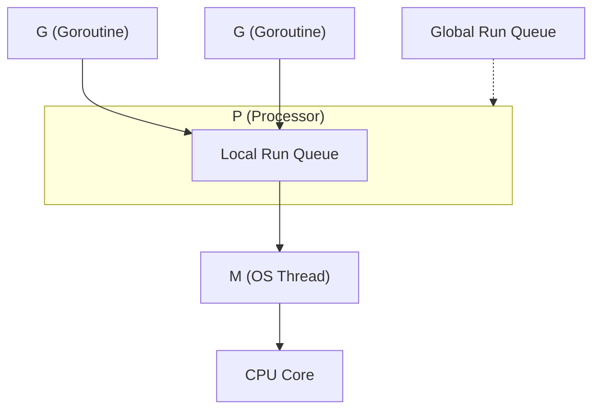

The Go runtime scheduler powers Go's concurrency model using the **G-M-P architecture**. This article dives deep into the runtime internals while using an interactive visualization to make the scheduling mechanics tangible.

## G-M-P Model Overview



## Internal Structure of G, M, P

### G (Goroutine) — `runtime.g` struct

A goroutine is represented by the `runtime.g` struct defined in [`runtime/runtime2.go`](https://github.com/golang/go/blob/master/src/runtime/runtime2.go):

```go
type g struct {
    stack       stack   // lo, hi — current stack bounds
    stackguard0 uintptr // used for preemption checks
    m           *m      // M currently running this G
    sched       gobuf   // saved context for context switch
    atomicstatus atomic.Uint32 // G's state flag
    goid         uint64 // goroutine ID
    // ... many more fields
}
```

Key fields:

- **`stack`** — Each G starts with a **2KB stack** (compare to 1–8MB for OS threads). It grows automatically via `runtime.morestack()` as needed.
- **`sched` (`gobuf`)** — Stores PC (Program Counter), SP (Stack Pointer), and BP (Base Pointer) for context switches. Read/written every time a G is suspended or resumed.
- **`stackguard0`** — Normally set near the stack lower bound. Set to `stackPreempt` (`0xfffffade`) when preemption is requested.
- **`atomicstatus`** — The G lifecycle: `_Gidle` → `_Grunnable` → `_Grunning` → `_Gsyscall` / `_Gwaiting` → `_Gdead`

### M (Machine) — `runtime.m` struct

An M is a 1:1 wrapper around an OS thread ([`runtime/runtime2.go`](https://github.com/golang/go/blob/master/src/runtime/runtime2.go)):

```go
type m struct {
    g0      *g     // scheduling goroutine (large stack)
    curg    *g     // currently running user G
    p       *p     // attached P
    nextp   *p     // P to attach on wakeup
    spinning bool  // looking for work to steal
    // ...
}
```

- **`g0`** — A special goroutine that exists on every M. Runtime functions like `schedule()`, `findRunnable()`, and GC code run on g0's stack. `mcall()` switches from a user G to g0.
- **`curg`** — The user goroutine currently running on this M. Set by `execute()`, cleared on `goexit()` or preemption.
- **`spinning`** — Indicates the M is busy-looping looking for work to steal. The runtime limits the number of spinning M's to avoid wasting CPU.

### P (Processor) — `runtime.p` struct

A P represents "the right to execute user Go code" — a logical resource ([`runtime/runtime2.go`](https://github.com/golang/go/blob/master/src/runtime/runtime2.go)):

```go
type p struct {
    status    uint32 // _Pidle, _Prunning, _Psyscall, _Pgcstop, _Pdead
    runqhead  uint32 // local queue head index
    runqtail  uint32 // local queue tail index
    runq      [256]guintptr // local run queue (ring buffer)
    runnext   guintptr      // next G to run (higher priority than queue)
    gFree     struct { ... } // free list of reusable G's
    // ...
}
```

- **`runq`** — A **256-entry fixed-size ring buffer**. Lock-free access (only the owning P advances head; steal uses atomic CAS on the tail side).
- **`runnext`** — A 1-slot cache for the most recently created G, ensuring it runs next for better locality.
- The number of P's is set by `GOMAXPROCS` and remains fixed during execution.

## The `schedule()` Loop in Detail

All scheduling decisions happen in [`runtime.schedule()`](https://github.com/golang/go/blob/master/src/runtime/proc.go) ([`runtime/proc.go`](https://github.com/golang/go/blob/master/src/runtime/proc.go)). Each M runs this loop on its g0 stack:

```go
func schedule() {
    // Fairness: check global queue every 61st tick
    if schedtick%61 == 0 {
        G = globrunqget(P)    // fetch from global queue
    }
    if G == nil {
        G = runqget(P)        // ① runnext → ② local queue
    }
    if G == nil {
        G = findRunnable(P)   // ③ blocking search
        // → globrunqget → netpoll → steal from random P
    }
    execute(G)  // restore gobuf → run user code
}
```

`findRunnable()` search order:
1. **runnext** — 1-slot cache
2. **Local queue** — `runqget()` from ring buffer
3. **Global queue** — `globrunqget()` fetches `min(len/GOMAXPROCS+1, len/2)` items in a batch
4. **Netpoller** — `netpoll()` harvests I/O-completed G's
5. **Work Stealing** — `runqsteal()` steals half of a random P's queue

## See the Scheduler in Action

The visualization below walks through the internal mechanics step by step. Each step references the actual runtime functions involved.

<GoRoutineVisualizer />

## Preemption Internals

### Cooperative Preemption (Go 1.1+)

The Go compiler inserts a **stack check prologue** at the beginning of every function:

```asm
// Function prologue (pseudocode)
MOV  AX, [G.stackguard0]
CMP  AX, SP
JBE  morestack          // stack growth or preemption
```

When sysmon's `retake()` detects a G running for >10ms, it sets `stackguard0` to `stackPreempt` (`0xfffffade`). At the next function call, the prologue detects this value and calls `morestack()` → `gopreempt_m()`, which sets the G back to `_Grunnable`.

**Problem**: Tight loops like `for {}` with no function calls can't be preempted.

### Asynchronous Preemption (Go 1.14+)

Go 1.14 introduced **signal-based asynchronous preemption**:

1. sysmon calls `preemptone()`
2. Sends `SIGURG` signal to the target M
3. Signal handler `doSigPreempt()` saves the current PC/SP
4. An **asyncPreempt frame** is injected onto the G's stack
5. G is suspended and control returns to `schedule()`

```go
// runtime/signal_unix.go — https://github.com/golang/go/blob/master/src/runtime/signal_unix.go
func doSigPreempt(gp *g, ctxt *sigctxt) {
    if wantAsyncPreempt(gp) && isAsyncSafePoint(gp, ctxt.sigpc(), ctxt.sigsp(), ctxt.siglr()) {
        ctxt.pushCall(abi.FuncPCABI0(asyncPreempt), ctxt.rip())
    }
}
```

`isAsyncSafePoint()` only allows preemption at points where GC can accurately enumerate the root set.

## sysmon — The Watchdog Daemon

`sysmon` is a special goroutine that runs on its own OS thread, **not bound to any M-P pair** ([`runtime/proc.go`](https://github.com/golang/go/blob/master/src/runtime/proc.go)):

```go
func sysmon() {
    for {
        usleep(delay) // 20μs to 10ms (adaptive)
        // 1. Harvest netpoller results
        netpoll(0)
        // 2. Hand off P's stuck in long syscalls
        retake(now)
        // 3. Preempt long-running G's
        // 4. Signal for GC STW if needed
        // 5. Force GC if none in 2+ minutes
    }
}
```

### [`retake()`](https://github.com/golang/go/blob/master/src/runtime/proc.go) Decision Logic

```go
func retake(now int64) uint32 {
    for _, pp := range allp {
        s := pp.status
        if s == _Prunning {
            // Running >10ms → preemptone()
            if pd.schedwhen + 10ms < now {
                preemptone(pp)
            }
        } else if s == _Psyscall {
            // In syscall >20μs & there's other work → handoffp()
            if runqempty(pp) && sched.nmspinning + sched.npidle > 0 {
                continue // don't hand off yet
            }
            handoffp(pp) // detach P from M
        }
    }
}
```

## Netpoller — Async I/O Integration

All network I/O in Go (`net.Conn.Read()`, etc.) is made asynchronous through the **netpoller**:

1. G starts network I/O → `runtime.pollWait()` calls `gopark()` → G becomes `_Gwaiting`
2. The fd is registered with epoll/kqueue/IOCP
3. `findRunnable()` and `sysmon` periodically call `netpoll()`
4. I/O-completed G's are injected back into run queues via `injectglist()`

```go
// Internal flow of network I/O
conn.Read(buf)
  → internal/poll.FD.Read()
    → runtime.pollWait()
      → gopark(netpollblockcommit) // G → _Gwaiting
// ... I/O completion detected via epoll_wait ...
runtime.netpoll()
  → G → _Grunnable
  → injectglist() into run queues
```

Unlike syscalls (`read(2)` etc.), the netpoller **does not block the M**. This is why `net/http` servers can handle thousands of connections with very few OS threads.

## G Lifecycle — State Transitions

```text
_Gidle → _Gdead → _Grunnable → _Grunning → _Gdead
                       ↑            ↓
                       ← ←  preempt ← ←
                       ↑            ↓
                       ← _Gwaiting ←  (chan/mutex/IO)
                       ↑            ↓
                       ← _Gsyscall ←  (syscall)
```

- **`_Grunnable`** — Ready to run but not yet assigned to an M
- **`_Grunning`** — Currently executing on an M
- **`_Gwaiting`** — Blocked on channel receive, mutex, I/O, etc.
- **`_Gsyscall`** — In a syscall (M is also blocked)
- **`_Gdead`** — Completed. The struct is pooled in `gFree` for reuse.

## Context Switch Cost

Go's context switches are far lighter than OS thread switches:

| | Go goroutine | OS thread |
|---|---|---|
| **What's switched** | PC, SP, BP, a few registers (`gobuf`) | All registers + page tables + TLB flush |
| **Cost** | ~100–200ns | ~1–10μs |
| **Stack size** | Initial 2KB (grows dynamically) | Fixed 1–8MB |
| **Creation cost** | `runtime.newproc` ≈ 300ns | `pthread_create` ≈ 10–30μs |

The [`gobuf`](https://github.com/golang/go/blob/master/src/runtime/runtime2.go) structure:

```go
type gobuf struct {
    sp   uintptr // stack pointer
    pc   uintptr // program counter
    g    guintptr
    ctxt unsafe.Pointer
    ret  uintptr
    lr   uintptr // link register (ARM)
    bp   uintptr // base pointer (frame pointer)
}
```

## GOMAXPROCS vs Actual Thread Count

The number of P's is fixed by `GOMAXPROCS`, but actual M's (OS threads) can exceed that:

- M's blocked in syscalls release their P, and new M's are created
- Default max M count is **10,000** (`runtime/debug.SetMaxThreads`)
- Idle M's are not destroyed immediately — they're pooled in `midle`

```go
runtime.GOMAXPROCS(4)  // P = 4
// But M count can be > 4
// e.g., 4 P's + 10 M's blocked in syscalls = 14 total M's
```

## Summary

Go's G-M-P scheduler achieves high-efficiency concurrency through:

1. **M:N scheduling** — Multiplexes many G's onto few M's
2. **Lock-free local queues** — 256-entry ring buffers per P, no contention
3. **Work Stealing** — Idle P's steal from busy P's for load balancing
4. **Hand-off** — P's don't stall when M's block on syscalls
5. **Netpoller** — Network I/O via epoll/kqueue without blocking M's
6. **Cooperative + async preemption** — Function prologues + SIGURG for fair CPU time
7. **sysmon** — Independent watchdog detecting long syscalls and runaway G's
