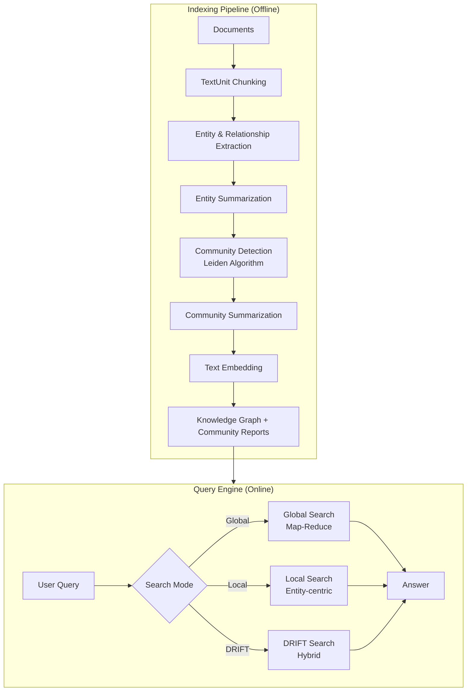
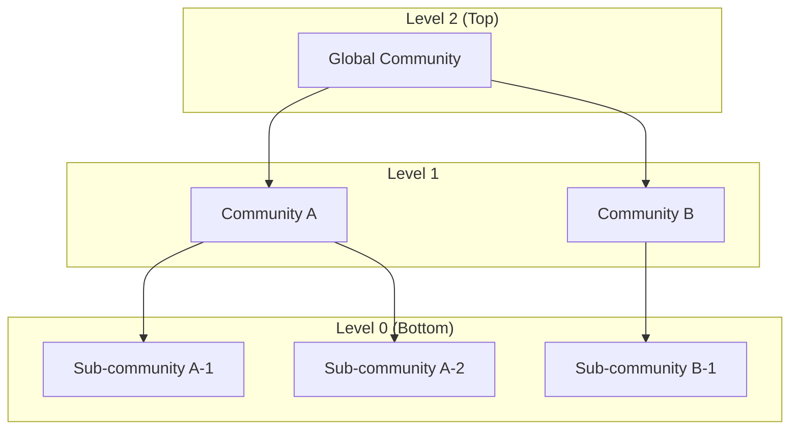
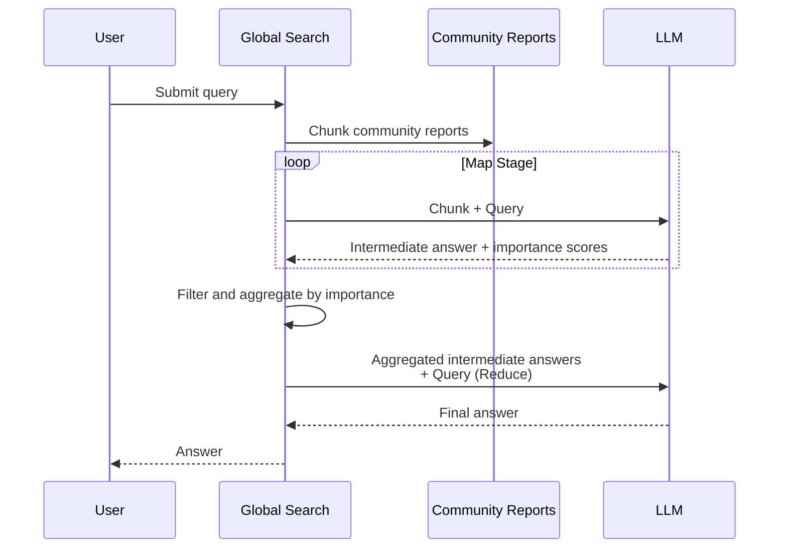
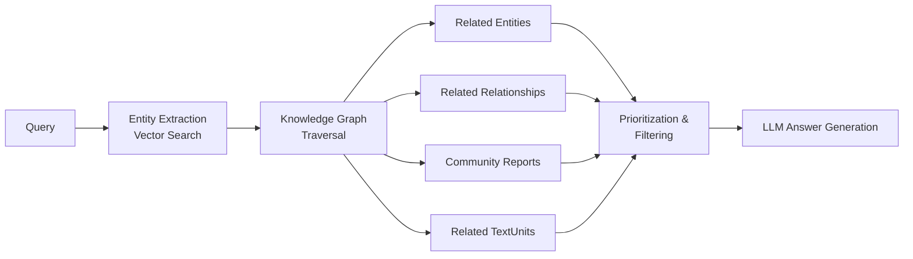
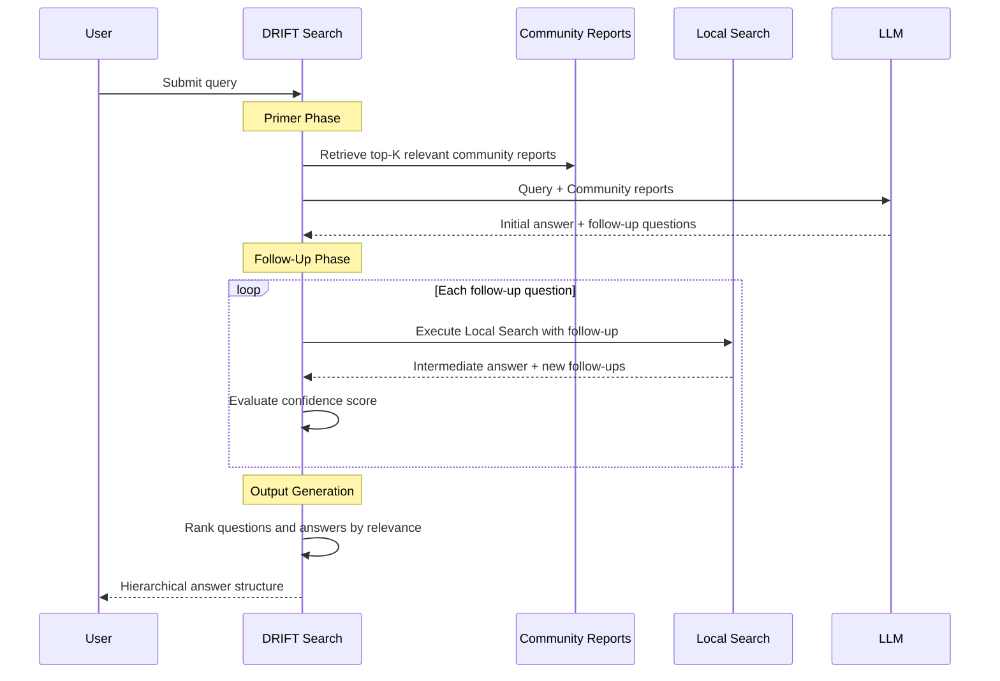

## Introduction — Why GraphRAG?

Retrieval-Augmented Generation (RAG) has become a widely adopted technique for improving LLM output quality. However, conventional **Baseline RAG** (vector-similarity-based RAG) has fundamental limitations.

### Limitations of Baseline RAG

Traditional RAG vectorizes a user query and retrieves the top-k text chunks from the corpus by cosine similarity. This approach suffers in two critical scenarios:

#### Limitation 1: Cannot connect the dots

When answering a question requires traversing disparate pieces of information through their shared attributes, vector search fails to retrieve the right chunks.

Consider asking "Which projects that Tanaka worked on eventually became shipping products?" against a company's internal documents. Answering this requires at least:

- **Document A** (HR record): "Tanaka Taro was assigned to Project Alpha in 2023"
- **Document B** (meeting minutes): "Project Alpha's deliverable passed to the QA phase"
- **Document C** (press release): "Product X, which cleared QA, launched in March 2024"

Baseline RAG searches for chunks semantically close to "Tanaka" and "shipping product," but Document B mentions neither Tanaka's name nor the word "product." As a result, it cannot trace the chain Alpha → QA → Product X, and fails to produce a correct answer.

GraphRAG, by contrast, traverses the entity relationships "Tanaka Taro" → "Project Alpha" → "QA phase" → "Product X" in the knowledge graph, accurately answering the question.

#### Limitation 2: Cannot grasp the big picture

For aggregation queries like "What are the top themes in this data?", vector search can only return chunks semantically close to the query text — it cannot capture the structure of the entire dataset.

For example, when analyzing 1,000 news articles and asking "What are the top 5 topics during this period?", Baseline RAG searches for chunks close to "topics" and "top," but the following problems arise:

- Chunks containing the phrase "top topics" may be completely unrelated to the actual major topics
- Themes spread broadly across the dataset are never fully captured in any single chunk
- The LLM ends up fabricating themes from the handful of chunks that happened to be retrieved

GraphRAG solves this with **community reports**. By capturing the dataset's overall structure as communities during indexing and pre-generating summaries, it can provide structurally grounded answers to questions about dataset-wide themes.

### The GraphRAG Approach

[GraphRAG](https://github.com/microsoft/graphrag) is a novel RAG methodology developed by Microsoft Research. It uses LLMs to build a **knowledge graph** from unstructured text and leverages that graph structure to enhance context at query time.

The three core ideas behind GraphRAG are:

- **Entity and relationship extraction**: The LLM extracts entities (people, organizations, locations, concepts) and their relationships to form a knowledge graph
- **Hierarchical community detection**: The Leiden algorithm clusters the graph into a hierarchy of semantic communities
- **Pre-generated community reports**: Each community's contents are summarized by the LLM into "community reports" used at query time

This enables both the cross-referential reasoning and holistic understanding that Baseline RAG struggles with.

> 📄 **Paper**: [From Local to Global: A Graph RAG Approach to Query-Focused Summarization](https://arxiv.org/pdf/2404.16130) (arXiv, 2024)

### The Paradigm Shift — From Flat Chunk Search to Semantic Graph Exploration

Let's frame the difference between Baseline RAG and GraphRAG in terms of how they structure their knowledge base.

Baseline RAG treats documents as a flat collection of chunks and searches by distance between "points" in vector space. In other words, the knowledge base is a **pile of disconnected fragments** — with no visible relationships between them.

GraphRAG adds **structure**. By constructing a graph with entities (people, organizations, concepts, etc.) as nodes and their relationships as edges, it explicitly models the semantic connections within the dataset — who is involved in what, what influences what, and which concepts are related. The Leiden algorithm then detects communities (semantic clusters) and organizes them hierarchically, enabling the system to reason at different levels of abstraction, from local facts to global themes.

In a single sentence, GraphRAG is **a method that structures the semantic space of a target corpus as a graph and uses it as the knowledge base for RAG**. An important caveat: this "semantic space" is not world knowledge at large, but rather a corpus-scoped semantic space built from entities and relationships that the LLM extracted from the input documents. Knowledge not written in the documents is not included — the same constraint as Baseline RAG — but the way information within the documents is *structurally organized* is the decisive difference.

```text
Baseline RAG:  Documents → Flat chunk collection → Search by vector distance
GraphRAG:     Documents → Structured semantic graph → Graph traversal + community summaries
```

---

## Architecture Overview

GraphRAG consists of two major phases: an **indexing pipeline** (offline) and a **query engine** (online).



---

## Indexing Pipeline — 6 Phases of Knowledge Graph Construction

Use the interactive visualizer below to step through each phase of the GraphRAG indexing pipeline.

<GraphRAGPipelineVisualizer />

### Phase 1: Composing TextUnits

The first phase splits input documents into token-based **chunks (TextUnits)**. TextUnits serve as the basic analysis unit and provide **provenance** (source references) for all extracted knowledge.

- Default chunk size is **1200 tokens**
- Larger chunks are faster to process but yield coarser output
- Each TextUnit maintains its link to the source document

```text
Document 1 → [TextUnit 1] [TextUnit 2]
Document 2 → [TextUnit 3] [TextUnit 4]
```

### Phase 2: Document Processing

Generates the Documents table and records the mapping between each document and its TextUnits. This enables tracing answers back to original documents.

### Phase 3: Graph Extraction

This phase is the heart of GraphRAG. It consists of three sub-steps.

#### 3a. Entity & Relationship Extraction

Each TextUnit is fed to the LLM, which extracts:

- **Entities**: title, type (person, organization, location, event, etc.), description
- **Relationships**: source entity, target entity, description

When the same title+type entity appears across multiple TextUnits, their descriptions are merged into an array. Relationships are merged similarly.

```text
TextUnit → LLM → Subgraph (entities + relationships)
                    ↓
          Merge into global graph (descriptions aggregated as arrays)
```

#### 3b. Entity & Relationship Summarization

The merged description arrays are passed to the LLM to generate a **single concise description** for each entity and relationship, ensuring consistency across the knowledge model.

#### 3c. Claim Extraction (Optional)

Independently extracts **covariates (claims)** from TextUnits — factual statements about entities expressed as time-bounded, evaluated assertions.

> ⚠️ Claim extraction is disabled by default and typically requires prompt tuning to be useful.

### Phase 4: Graph Augmentation — Community Detection

Once the entity-relationship graph is built, the **Leiden algorithm** is applied for hierarchical community detection.

#### What Is the Leiden Algorithm?

The Leiden algorithm ([Traag et al., 2019](https://arxiv.org/pdf/1810.08473.pdf)) is an improvement over the Louvain algorithm for detecting graph communities (clusters). Key features:

1. **Modularity optimization**: Groups densely connected nodes into communities based on connection density
2. **Hierarchical detection**: Recursively detects communities until a community size threshold is reached
3. **Guaranteed connectivity**: Unlike Louvain, Leiden guarantees that each community is internally connected



This hierarchy enables understanding the dataset at different granularity levels. Higher levels capture broad dataset themes; lower levels capture local details.

### Phase 5: Community Summarization

Each community's contents are summarized by the LLM to generate a **community report**:

- **Executive summary**: Overview of the entire community
- **Key entities**: Important entities and their roles within the community
- **Relationships**: Major relationships between entities
- **Claims**: Related claims (when enabled)

Higher-level community reports capture broader themes; lower-level ones contain more detail. These reports serve as context at query time.

### Phase 6: Text Embedding

Finally, text embeddings are generated for downstream vector search:

- **Entity description** embeddings
- **TextUnit text** embeddings
- **Community report** embeddings

These embeddings are written to the configured vector store.

---

## GraphRAG Knowledge Model

The indexing pipeline outputs these data types:

| Data Type | Description |
|---|---|
| **Document** | Input document — a CSV row or `.txt` file |
| **TextUnit** | Text chunk for analysis |
| **Entity** | Entity extracted from TextUnits (person, place, org, etc.) |
| **Relationship** | Relationship between two entities |
| **Covariate** | Extracted claim information (time-bounded) |
| **Community** | Entity clustering result |
| **Community Report** | LLM-generated community summary |

Outputs are stored as **Parquet tables** by default.

---

## Query Engine — 4 Search Modes

### Global Search — Dataset-Wide Reasoning

**Global Search** is the ideal mode for holistic questions like "What are the top themes in this dataset?"

#### Map-Reduce Processing Flow



1. **Map stage**: Community reports are split into predefined-size chunks, and the LLM generates intermediate answers (point lists with importance scores) for each
2. **Reduce stage**: The most important points are aggregated and used as context for the final answer

> ⚠️ The community hierarchy level chosen for sourcing reports significantly affects answer quality and processing cost. Lower levels yield more detailed answers but increase cost.

### Local Search — Entity-Focused Deep Dive

**Local Search** is optimal for questions about specific entities, such as "What are the healing properties of chamomile?"

#### Processing Flow

1. Extract entities from the query (vector search against entity description embeddings)
2. Use extracted entities as **access points** into the knowledge graph
3. Collect related entities, relationships, covariates, community reports, and source TextUnits
4. Prioritize and filter within the token budget
5. Generate answer with the LLM using the composed context window



### DRIFT Search — Global + Local Hybrid

**DRIFT Search** (Dynamic Reasoning and Inference with Flexible Traversal) is a hybrid approach that incorporates community information into local search. It has three phases:

1. **Primer phase**: Compares the user query with the top-K semantically relevant community reports, generating an initial answer and follow-up questions
2. **Follow-Up phase**: Uses local search to refine follow-up questions, producing additional intermediate answers and new follow-up questions
3. **Output Hierarchy**: Outputs a hierarchy of questions and answers ranked by relevance

DRIFT Search combines the precision of Local Search with the broad contextual understanding of Global Search.



### Basic Search — Traditional Vector RAG

GraphRAG also includes traditional vector RAG (Basic Search) for comparison, using top-k TextUnit chunks as context.

---

## Baseline RAG vs GraphRAG — Real-World Comparison

The Microsoft Research blog demonstrates a comparison using the VIINA dataset (Ukraine-Russia conflict news articles).

### Example 1: Cross-Referential Reasoning

**Query**: "What has Novorossiya done?"

| Baseline RAG | GraphRAG |
|---|---|
| Cannot answer — no relevant information in retrieved chunks | Provides detailed account of Novorossiya's activities by traversing entity relationships, with source provenance |

Baseline RAG retrieves chunks semantically close to the query but none mention "Novorossiya" directly. GraphRAG uses the entity as a starting point in the knowledge graph, traversing relationships to gather information from multiple sources.

### Example 2: Whole-Dataset Theme Understanding

**Query**: "What are the top 5 themes in the data?"

| Baseline RAG | GraphRAG |
|---|---|
| Lists irrelevant themes (urban development, economy, etc.) | Identifies conflict, military activity, political dynamics, humanitarian impact — themes true to the dataset |

Baseline RAG is misled by the word "themes" and retrieves unrelated chunks, while GraphRAG leverages community reports to accurately capture dataset-wide structure.

---

## Implementation with Microsoft Agent Framework (C#)

Let's now implement GraphRAG-style retrieval-augmented generation using [Microsoft Agent Framework](https://github.com/microsoft/agent-framework)'s C# library. The Agent Framework provides a comprehensive toolkit for building, orchestrating, and deploying AI agents.

### Prerequisites

```text
- .NET 10 SDK or later
- Azure OpenAI or OpenAI API key
- Azure CLI (for Azure OpenAI: authenticate with az login)
```

### Step 1: Project Setup

First, create a new console project and add the Microsoft Agent Framework NuGet packages. `Microsoft.Agents.AI` is the core library providing agent abstractions and function tool capabilities. `Microsoft.Agents.AI.OpenAI` is the connection adapter for Azure OpenAI / OpenAI.

```bash
mkdir GraphRAGDemo
cd GraphRAGDemo
dotnet new console
dotnet add package Microsoft.Agents.AI
dotnet add package Microsoft.Agents.AI.OpenAI
```

With this, you're ready to develop with Agent Framework. If using Azure OpenAI, make sure to authenticate with `az login` beforehand.

### Step 2: Knowledge Graph Data Model

We represent the GraphRAG knowledge model using C# `record` types. Records are ideal for immutable data and support immutable updates via `with` expressions. We define types corresponding to each table in the official GraphRAG implementation (Python).

```csharp
// Models/KnowledgeGraph.cs
// https://github.com/microsoft/graphrag — C# representation of the Knowledge Model

/// <summary>Text chunk — the basic analysis unit in GraphRAG</summary>
public record TextUnit(string Id, string Text, string DocumentId);

/// <summary>Entity — a node in the knowledge graph</summary>
public record Entity(
    string Id,
    string Title,
    string Type,        // "person", "organization", "location", "event", ...
    string Description,
    int CommunityId,
    float[] Embedding);

/// <summary>Relationship — an edge in the knowledge graph</summary>
public record Relationship(
    string SourceId,
    string TargetId,
    string Description,
    double Weight);

/// <summary>Community — a cluster detected by the Leiden algorithm</summary>
public record Community(
    int Id,
    string Title,
    int Level,
    string Report);    // LLM-generated community report
```

These `record` types enable type-safe handling of data produced by each pipeline phase. The `Embedding` field on `Entity` is populated during Phase 6 (text embedding) and used for vector search during Local Search.

### Step 3: Entity & Relationship Extraction Agent

One of Agent Framework's core features is **Function Tools**. Simply annotating a C# method with `[Description]` attributes causes Agent Framework to auto-generate a JSON Schema and integrate it with the LLM's Function Calling mechanism. Here we define a function tool to extract entities and relationships from a TextUnit.

```csharp
// Agents/EntityExtractor.cs
// https://github.com/microsoft/agent-framework — Leveraging function tool capabilities

using System.ComponentModel;
using Microsoft.Agents.AI;
using Microsoft.Extensions.AI;

public static class EntityExtractor
{
    /// <summary>
    /// Function tool for extracting entities and relationships from a TextUnit.
    /// Agent Framework auto-generates JSON Schema for LLM Function Calling.
    /// </summary>
    [Description("Extract entities (people, organizations, places, concepts) and relationships from text")]
    public static string ExtractEntitiesAndRelationships(
        [Description("The text chunk to analyze")] string textUnit,
        [Description("Entity types to extract (comma-separated)")] string entityTypes = "person,organization,location,event,concept")
    {
        // This function is invoked via LLM Function Calling.
        // In practice, you would parse structured output from the LLM
        // and return entity/relationship lists.
        return $$"""
        {
            "entities": [
                {"title": "...", "type": "...", "description": "..."}
            ],
            "relationships": [
                {"source": "...", "target": "...", "description": "..."}
            ]
        }
        """;
    }
}
```

The `ExtractEntitiesAndRelationships` method above is automatically invoked when the LLM decides it wants to extract entities from text. The `[Description]` attribute text becomes part of the JSON Schema sent to the LLM, communicating the function's purpose and parameter semantics. In a production implementation, you would parse the LLM's Structured Output within this method and convert it to typed entity/relationship objects.

### Step 4: Configuring the Extraction Agent

Next, we configure an agent that uses the function tool defined above. The `AsAIAgent` extension method wraps a `ChatClient` into an agent. The `instructions` parameter sets the system prompt, and `tools` registers our function tools.

```csharp
// Program.cs — Configuring the entity extraction agent
// https://github.com/microsoft/agent-framework/blob/main/dotnet/samples/02-agents/Agents/

using Azure.AI.OpenAI;
using Azure.Identity;
using Microsoft.Agents.AI;
using Microsoft.Extensions.AI;

var endpoint = Environment.GetEnvironmentVariable("AZURE_OPENAI_ENDPOINT")
    ?? throw new InvalidOperationException("AZURE_OPENAI_ENDPOINT is not set.");
var deploymentName =
    Environment.GetEnvironmentVariable("AZURE_OPENAI_DEPLOYMENT_NAME") ?? "gpt-4o";

// Configure the entity extraction agent
AIAgent extractionAgent = new AzureOpenAIClient(
        new Uri(endpoint),
        new DefaultAzureCredential())
    .GetChatClient(deploymentName)
    .AsAIAgent(
        instructions: """
            You are an expert in knowledge graph construction.
            Extract the following from the given text in JSON format:
            1. Entities: title, type (person/organization/location/event/concept), description
            2. Relationships: source entity, target entity, relationship description
            Unify duplicate entities under the same title.
            """,
        tools: [AIFunctionFactory.Create(EntityExtractor.ExtractEntitiesAndRelationships)]);
```

Notice the call chain: `AzureOpenAIClient` → `GetChatClient` → `AsAIAgent`. This cleanly bundles Azure OpenAI authentication (`DefaultAzureCredential`), model deployment name, and agent behavior (instructions/tools) in one expression. `DefaultAzureCredential` automatically uses `az login` credentials in development and managed identity in production.

### Step 5: Community Detection Implementation

We implement the community detection from Phase 4 of the GraphRAG indexing pipeline. While the official GraphRAG uses Python's `graspologic` library to run the Leiden algorithm, here we implement the core modularity optimization logic in C# to demonstrate how the algorithm works.

The main processing flow is:

1. Build an adjacency list from entity relationships
2. Initialize each entity in its own community
3. For each entity, move it to the community where most of its neighbors belong (modularity gain maximization)
4. Repeat until no further improvements are found

```csharp
// Services/CommunityDetector.cs
// Simplified Leiden algorithm implementation

/// <summary>
/// Hierarchical community detection based on the Leiden algorithm.
/// GraphRAG uses graspologic (Python); this C# implementation
/// demonstrates the core modularity optimization logic.
/// </summary>
public class CommunityDetector
{
    /// <summary>
    /// Detect communities from a graph.
    /// </summary>
    public List<Community> DetectCommunities(
        List<Entity> entities,
        List<Relationship> relationships,
        int maxCommunitySize = 10)
    {
        // 1. Build adjacency list
        var adjacency = BuildAdjacencyList(entities, relationships);

        // 2. Initialize: place each node in its own community
        var assignments = entities.ToDictionary(e => e.Id, e => e.Id);

        // 3. Modularity optimization loop
        bool improved;
        do
        {
            improved = false;
            foreach (var entity in entities)
            {
                var bestCommunity = FindBestCommunity(
                    entity, adjacency, assignments);
                if (bestCommunity != assignments[entity.Id])
                {
                    assignments[entity.Id] = bestCommunity;
                    improved = true;
                }
            }
        } while (improved);

        // 4. Group into communities and return
        return assignments
            .GroupBy(a => a.Value)
            .Select((g, i) => new Community(
                Id: i,
                Title: $"Community {i}",
                Level: 0,
                Report: "")) // Report generated in later phase
            .ToList();
    }

    private Dictionary<string, List<string>> BuildAdjacencyList(
        List<Entity> entities,
        List<Relationship> relationships)
    {
        var adj = entities.ToDictionary(e => e.Id, _ => new List<string>());
        foreach (var rel in relationships)
        {
            if (adj.ContainsKey(rel.SourceId))
                adj[rel.SourceId].Add(rel.TargetId);
            if (adj.ContainsKey(rel.TargetId))
                adj[rel.TargetId].Add(rel.SourceId);
        }
        return adj;
    }

    private string FindBestCommunity(
        Entity entity,
        Dictionary<string, List<string>> adjacency,
        Dictionary<string, string> assignments)
    {
        // Calculate modularity gain for each neighboring community
        var neighbors = adjacency.GetValueOrDefault(entity.Id) ?? [];
        var communityScores = neighbors
            .GroupBy(n => assignments.GetValueOrDefault(n, n))
            .ToDictionary(g => g.Key, g => (double)g.Count());

        return communityScores.Count > 0
            ? communityScores.MaxBy(kv => kv.Value).Key
            : assignments[entity.Id];
    }
}
```

The implementation above is a simplified version of the Leiden algorithm. A full implementation would include:

- **Refinement phase**: After local moves, run a refinement step that guarantees intra-community connectivity (Leiden's key improvement over Louvain)
- **Aggregation phase**: Contract communities into super-nodes and recursively apply the algorithm to build the hierarchy
- **Resolution parameter**: A parameter controlling community granularity (in GraphRAG, controlled via `max_cluster_size`)

For production use, consider using `graspologic`'s C# bindings or igraph's .NET wrapper.

### Step 6: Community Report Generation

We implement community report generation from Phase 5. The `CommunityReporter` class passes community entity and relationship information to the LLM and generates a structured report. Agent Framework's `CreateSessionAsync` and `RunAsync` enable conversational interaction with the agent.

```csharp
// Services/CommunityReporter.cs
// https://github.com/microsoft/agent-framework — Agent-powered community summarization

public class CommunityReporter
{
    private readonly AIAgent _agent;

    public CommunityReporter(AIAgent agent)
    {
        _agent = agent;
    }

    /// <summary>
    /// Generate a summary report from community entities and relationships.
    /// </summary>
    public async Task<string> GenerateReportAsync(
        Community community,
        List<Entity> entities,
        List<Relationship> relationships)
    {
        var context = BuildCommunityContext(entities, relationships);

        var session = await _agent.CreateSessionAsync();
        var response = await _agent.RunAsync(
            $"""
            Generate a community report based on the following entities and relationships.

            Include:
            1. Executive summary (2-3 sentences)
            2. Key entities and their roles
            3. Important relationships
            4. Main themes and trends

            Community data:
            {context}
            """,
            session);

        return response.Text;
    }

    private string BuildCommunityContext(
        List<Entity> entities,
        List<Relationship> relationships)
    {
        var sb = new System.Text.StringBuilder();
        sb.AppendLine("=== Entities ===");
        foreach (var e in entities)
            sb.AppendLine($"- {e.Title} ({e.Type}): {e.Description}");

        sb.AppendLine("\n=== Relationships ===");
        foreach (var r in relationships)
            sb.AppendLine($"- {r.SourceId} -> {r.TargetId}: {r.Description}");

        return sb.ToString();
    }
}
```

The `BuildCommunityContext` method is a helper that constructs the context string. It passes entity lists and relationship lists to the LLM in text format. The generated report includes an executive summary, key entities, relationship summaries, and theme analysis. This report becomes the most important context material used during GraphRAG query time.

### Step 7: Global Search Implementation

Global Search is the most resource-intensive query mode in GraphRAG, but it generates excellent answers for holistic questions about the entire dataset. Here we implement it using the Map-Reduce pattern. The Map stage processes each community report chunk in parallel, and the Reduce stage integrates intermediate results to generate the final answer.

```csharp
// Search/GlobalSearch.cs
// https://github.com/microsoft/graphrag — C# implementation of Global Search

public class GlobalSearch
{
    private readonly AIAgent _mapAgent;
    private readonly AIAgent _reduceAgent;
    private readonly int _maxTokensPerChunk;

    public GlobalSearch(
        AIAgent mapAgent,
        AIAgent reduceAgent,
        int maxTokensPerChunk = 2000)
    {
        _mapAgent = mapAgent;
        _reduceAgent = reduceAgent;
        _maxTokensPerChunk = maxTokensPerChunk;
    }

    /// <summary>
    /// Process community reports via Map-Reduce to answer
    /// dataset-wide questions.
    /// </summary>
    public async Task<string> SearchAsync(
        string query,
        List<Community> communities)
    {
        // === Map Stage ===
        // Split community reports into chunks and process in parallel
        var reportChunks = ChunkReports(communities);
        var intermediateTasks = reportChunks.Select(chunk =>
            MapAsync(query, chunk));
        var intermediateResults = await Task.WhenAll(intermediateTasks);

        // === Reduce Stage ===
        // Aggregate intermediate results into final answer
        var aggregated = intermediateResults
            .SelectMany(r => r.Points)
            .OrderByDescending(p => p.Score)
            .Take(20) // Keep top 20 points
            .ToList();

        return await ReduceAsync(query, aggregated);
    }

    private async Task<MapResult> MapAsync(
        string query, string reportChunk)
    {
        var session = await _mapAgent.CreateSessionAsync();
        var response = await _mapAgent.RunAsync(
            $"""
            Extract relevant points from the following community reports
            and assign each an importance score from 0-100.

            Question: {query}

            Reports:
            {reportChunk}
            """,
            session);

        return ParseMapResult(response.Text);
    }

    private async Task<string> ReduceAsync(
        string query, List<ScoredPoint> points)
    {
        var context = string.Join("\n",
            points.Select(p => $"[Score: {p.Score}] {p.Text}"));

        var session = await _reduceAgent.CreateSessionAsync();
        var response = await _reduceAgent.RunAsync(
            $"""
            Provide a comprehensive answer to the question based on
            the following information points extracted from the dataset.

            Question: {query}

            Information points:
            {context}
            """,
            session);

        return response.Text;
    }

    private List<string> ChunkReports(List<Community> communities)
    {
        var chunks = new List<string>();
        var current = new System.Text.StringBuilder();

        foreach (var community in communities)
        {
            if (current.Length > _maxTokensPerChunk * 4)
            {
                chunks.Add(current.ToString());
                current.Clear();
            }
            current.AppendLine(community.Report);
        }
        if (current.Length > 0)
            chunks.Add(current.ToString());

        return chunks;
    }

    private MapResult ParseMapResult(string response)
        => new(new List<ScoredPoint>
        {
            new(response, 80) // Simplified: real implementation needs structured parsing
        });
}

public record MapResult(List<ScoredPoint> Points);
public record ScoredPoint(string Text, int Score);
```

The key point of this implementation is the parallelization in the Map stage. Using `Task.WhenAll` to process each chunk in parallel ensures efficient handling even with many community reports. In the Reduce stage, `OrderByDescending(p => p.Score).Take(20)` narrows down to the 20 most important points, keeping within the token budget while using only the most relevant information for the final answer context.

### Step 8: Local Search Implementation

Local Search answers questions about specific entities. It identifies relevant entities from the user's query via vector search, then uses them as starting points to traverse the knowledge graph, collecting related entities, relationships, community reports, and source TextUnits.

```csharp
// Search/LocalSearch.cs
// https://github.com/microsoft/graphrag — C# implementation of Local Search

public class LocalSearch
{
    private readonly AIAgent _agent;
    private readonly IVectorStore _vectorStore;

    public LocalSearch(AIAgent agent, IVectorStore vectorStore)
    {
        _agent = agent;
        _vectorStore = vectorStore;
    }

    /// <summary>
    /// Answer entity-specific questions by locally traversing
    /// the knowledge graph.
    /// </summary>
    public async Task<string> SearchAsync(
        string query,
        List<Entity> entities,
        List<Relationship> relationships,
        List<Community> communities,
        List<TextUnit> textUnits)
    {
        // 1. Identify relevant entities via vector search
        var seedEntities = await _vectorStore.SearchAsync(
            query, topK: 5, collection: "entities");

        // 2. Explore the knowledge graph from seed entities
        var context = new SearchContext();
        foreach (var seed in seedEntities)
        {
            var relatedRels = relationships
                .Where(r => r.SourceId == seed.Id || r.TargetId == seed.Id)
                .ToList();
            context.Relationships.AddRange(relatedRels);

            var entity = entities.First(e => e.Id == seed.Id);
            var community = communities
                .FirstOrDefault(c => c.Id == entity.CommunityId);
            if (community != null)
                context.CommunityReports.Add(community.Report);

            context.TextUnits.AddRange(
                textUnits.Where(tu => tu.Text.Contains(entity.Title)));
        }

        // 3. Prioritize context within token budget
        var contextText = context.BuildContextString(maxTokens: 4000);

        // 4. Generate answer with LLM
        var session = await _agent.CreateSessionAsync();
        var response = await _agent.RunAsync(
            $"""
            Answer the question based on the following context.
            Cite specific sources where possible.

            Question: {query}

            Context:
            {contextText}
            """,
            session);

        return response.Text;
    }
}

public interface IVectorStore
{
    Task<List<Entity>> SearchAsync(
        string query, int topK, string collection);
}

public class SearchContext
{
    public List<Relationship> Relationships { get; } = [];
    public List<string> CommunityReports { get; } = [];
    public List<TextUnit> TextUnits { get; } = [];

    public string BuildContextString(int maxTokens)
    {
        var sb = new System.Text.StringBuilder();

        sb.AppendLine("=== Community Reports ===");
        foreach (var report in CommunityReports.Take(3))
            sb.AppendLine(report);

        sb.AppendLine("\n=== Relationships ===");
        foreach (var rel in Relationships.Take(10))
            sb.AppendLine($"- {rel.SourceId} -> {rel.TargetId}: {rel.Description}");

        sb.AppendLine("\n=== Source Text ===");
        foreach (var tu in TextUnits.Take(5))
            sb.AppendLine($"[{tu.Id}] {tu.Text[..Math.Min(200, tu.Text.Length)]}...");

        return sb.ToString();
    }
}
```

The `SearchContext` class collects three types of context — community reports, relationships, and source text (TextUnits) — and trims them to fit within the token budget via `BuildContextString`. Adjusting the `Take(3)` and `Take(10)` values controls the composition ratio. The actual GraphRAG implementation uses a more precise token budget allocation across data sources.

### Step 9: Full Pipeline Orchestration

Now we integrate all the components we've built (entity extraction agent, community detection, community report generation) into a single class. The `GraphRAGPipeline` class executes Phase 1 (TextUnit chunking) through Phase 5 (community report generation) sequentially to build a knowledge graph index.

```csharp
// Pipeline/GraphRAGPipeline.cs
// https://github.com/microsoft/agent-framework — Workflow orchestration

using Azure.AI.OpenAI;
using Azure.Identity;
using Microsoft.Agents.AI;
using Microsoft.Extensions.AI;

public class GraphRAGPipeline
{
    private readonly AIAgent _extractionAgent;
    private readonly AIAgent _summarizationAgent;
    private readonly CommunityDetector _communityDetector;
    private readonly CommunityReporter _communityReporter;

    public GraphRAGPipeline(string endpoint, string deploymentName)
    {
        var client = new AzureOpenAIClient(
            new Uri(endpoint),
            new DefaultAzureCredential());

        _extractionAgent = client
            .GetChatClient(deploymentName)
            .AsAIAgent(instructions: "Expert agent for extracting entities and relationships");

        _summarizationAgent = client
            .GetChatClient(deploymentName)
            .AsAIAgent(instructions: "Summarization agent for generating community reports");

        _communityDetector = new CommunityDetector();
        _communityReporter = new CommunityReporter(_summarizationAgent);
    }

    /// <summary>
    /// Execute the GraphRAG indexing pipeline.
    /// Runs Phases 1-5 sequentially to build a knowledge graph index.
    /// </summary>
    public async Task<KnowledgeGraphIndex> BuildIndexAsync(
        List<string> documents)
    {
        // Phase 1: TextUnit chunking
        var textUnits = ChunkDocuments(documents, chunkSize: 1200);

        // Phase 3: Entity & relationship extraction
        var (entities, relationships) =
            await ExtractGraphAsync(textUnits);

        // Phase 4: Community detection
        var communities = _communityDetector.DetectCommunities(
            entities, relationships);

        // Phase 5: Community report generation
        foreach (var community in communities)
        {
            var communityEntities = entities
                .Where(e => e.CommunityId == community.Id)
                .ToList();
            var communityRels = relationships
                .Where(r => communityEntities.Any(e => e.Id == r.SourceId))
                .ToList();

            var report = await _communityReporter.GenerateReportAsync(
                community, communityEntities, communityRels);

            communities[communities.IndexOf(community)] =
                community with { Report = report };
        }

        return new KnowledgeGraphIndex(
            textUnits, entities, relationships, communities);
    }

    private List<TextUnit> ChunkDocuments(
        List<string> documents, int chunkSize)
    {
        var units = new List<TextUnit>();
        int unitId = 0;
        for (int docIdx = 0; docIdx < documents.Count; docIdx++)
        {
            var doc = documents[docIdx];
            for (int i = 0; i < doc.Length; i += chunkSize)
            {
                var chunk = doc[i..Math.Min(i + chunkSize, doc.Length)];
                units.Add(new TextUnit(
                    $"tu-{unitId++}", chunk, $"doc-{docIdx}"));
            }
        }
        return units;
    }

    private async Task<(List<Entity>, List<Relationship>)>
        ExtractGraphAsync(List<TextUnit> textUnits)
    {
        var allEntities = new List<Entity>();
        var allRelationships = new List<Relationship>();

        foreach (var tu in textUnits)
        {
            var session = await _extractionAgent.CreateSessionAsync();
            var response = await _extractionAgent.RunAsync(
                $"""
                Extract entities and relationships from the following text.
                Output in JSON format.

                Text:
                {tu.Text}
                """,
                session);

            // Parse response into entities and relationships
            // (simplified for brevity)
        }

        return (allEntities, allRelationships);
    }
}

public record KnowledgeGraphIndex(
    List<TextUnit> TextUnits,
    List<Entity> Entities,
    List<Relationship> Relationships,
    List<Community> Communities);
```

The `BuildIndexAsync` method is the entry point for the entire pipeline. It takes a list of documents, then executes TextUnit chunking → entity extraction → community detection → community report generation sequentially. The `ChunkDocuments` method uses simple character-based chunking, but a production implementation should use a tokenizer like `tiktoken` for accurate token-based chunking.

### Usage: Pipeline Execution to Query

Finally, here's a complete usage example combining all the components above. It shows the flow from running the indexing pipeline to executing a Global Search against the built knowledge graph index.

```csharp
// Program.cs — Complete usage example

var endpoint = Environment.GetEnvironmentVariable("AZURE_OPENAI_ENDPOINT")!;
var model = Environment.GetEnvironmentVariable("AZURE_OPENAI_DEPLOYMENT_NAME")
    ?? "gpt-4o";

// 1. Run the indexing pipeline
var pipeline = new GraphRAGPipeline(endpoint, model);
var documents = new List<string>
{
    File.ReadAllText("data/document1.txt"),
    File.ReadAllText("data/document2.txt"),
};

var index = await pipeline.BuildIndexAsync(documents);
Console.WriteLine(
    $"Index built: {index.Entities.Count} entities, " +
    $"{index.Relationships.Count} relationships, " +
    $"{index.Communities.Count} communities");

// 2. Global Search — ask about dataset-wide themes
var client = new AzureOpenAIClient(
    new Uri(endpoint), new DefaultAzureCredential());
var mapAgent = client.GetChatClient(model)
    .AsAIAgent(instructions: "Extract information points and assign importance scores");
var reduceAgent = client.GetChatClient(model)
    .AsAIAgent(instructions: "Synthesize information points into a comprehensive answer");

var globalSearch = new GlobalSearch(mapAgent, reduceAgent);
var globalAnswer = await globalSearch.SearchAsync(
    "What are the main themes in this dataset?",
    index.Communities);
Console.WriteLine($"\n[Global Search]\n{globalAnswer}");

// 3. Local Search — ask about a specific entity
// (requires IVectorStore implementation)
```

---

## Prompt Tuning

To get the most out of GraphRAG with custom datasets, prompt tuning is recommended. GraphRAG provides an automatic prompt tuning feature:

```bash
# Run automatic prompt tuning
graphrag prompt-tune --root ./my-project
```

Auto-tuning (`graphrag prompt-tune`) generates three prompts:

| Prompt | Purpose |
|---|---|
| `extract_graph` | Improve entity and relationship extraction accuracy |
| `summarize_descriptions` | Improve entity description quality |
| `community_reports` | Adjust community report format and content |

Additionally, query-stage prompts (Global Search Map/Reduce prompts, Local Search system prompt, etc.) can be customized manually by creating custom prompt files and specifying their paths in the corresponding config fields (e.g., `local_search.prompt`, `global_search.map_prompt`).

---

## Evaluation Metrics

Microsoft Research evaluates GraphRAG using the following metrics (via LLM-as-a-judge pairwise comparison):

1. **Comprehensiveness**: How much detail the answer provides to cover all aspects of the question
2. **Diversity**: How varied and rich the answer is in providing different perspectives and insights
3. **Empowerment**: How well the answer helps the reader understand and make informed judgments about the topic without being misled
4. **Directness**: How specifically and clearly the answer addresses the question (control criterion)

Results show GraphRAG consistently and significantly outperforms Baseline RAG on **comprehensiveness** and **diversity**. **Empowerment** comparisons showed mixed results, with room for improvement in providing specific citations and source references. **Directness** favored Baseline RAG, as expected — it trades off against comprehensiveness and diversity.

> 📄 The paper's Section 6.1 mentions faithfulness evaluation using SelfCheckGPT as future work.

---

## Cost and Performance Considerations

GraphRAG indexing is a **resource-intensive** operation. Keep these factors in mind:

| Consideration | Details |
|---|---|
| **LLM Cost** | Entity extraction, summarization, and community report generation involve many LLM calls |
| **Chunk Size** | 1200 tokens (default); larger chunks are faster but yield coarser results |
| **Community Level** | Lower levels in Global Search yield more detail but higher cost |
| **NLP extraction mode** | `extract_graph_nlp` config for fast extraction, significantly reducing LLM costs |

> 💡 **Recommendation**: Start with a small dataset to understand the cost-quality trade-off before scaling to production data.

---

## GraphRAG Variations

GraphRAG offers several variations to balance cost and quality.

### NLP Extraction Mode (`extract_graph_nlp`)

GraphRAG provides a configuration option (`extract_graph_nlp`) that uses **NLP (Natural Language Processing) instead of LLMs** for entity and relationship extraction.

- **Pros**: Dramatically reduces LLM calls, significantly lowering indexing cost
- **Cons**: NLP-based extraction may produce lower-quality entity granularity and relationship descriptions compared to LLM-based extraction
- **Use case**: Large datasets with budget constraints, or for quick prototyping

In NLP extraction mode, claim extraction is always skipped.

### LazyGraphRAG

LazyGraphRAG, published by Microsoft Research in November 2024, **defers all LLM processing to query time**.

- **At indexing time**: Uses NLP (noun phrase extraction) to extract concepts and co-occurrences, then uses graph statistics for community structure detection (no LLM calls at all)
- **At query time**: Uses the LLM for relevance assessment of text chunks, claim extraction, and answer generation

```text
Standard GraphRAG: LLM-based indexing + all reports pre-generated (high cost)
LazyGraphRAG:      NLP-based indexing, all LLM processing deferred to query time (indexing cost identical to vector RAG, 0.1% of GraphRAG)
```

LazyGraphRAG aims to reduce indexing costs to vector RAG levels while achieving query quality that surpasses GraphRAG. It is particularly effective for one-off queries, exploratory analysis, and streaming data scenarios.

### Variation Comparison Table

| Feature | Standard GraphRAG | NLP Extraction Mode | LazyGraphRAG |
|---|---|---|---|
| **Entity extraction** | LLM-based | NLP-based | NLP-based |
| **Indexing cost** | High | Low | Very low (same as vector RAG) |
| **Query latency** | Low | Low | Slightly higher |
| **Answer quality** | Highest | Good | High |
| **Community reports** | Pre-generated | Pre-generated | Deferred to query time |
| **LLM usage timing** | Indexing + query time | Summarization + query time | Query time only |
| **Best for** | Quality-focused enterprise | Large data / budget constraints | One-off queries / exploratory analysis |

---

## Configuration Example

GraphRAG behavior is controlled via a YAML configuration file (`settings.yml`). The `graphrag init` command generates a template.

```yaml
# settings.yml — Key configuration parameters (generated by graphrag init)
completion_models:
  default_completion_model:
    model_provider: openai
    model: gpt-4o
    api_key: ${GRAPHRAG_API_KEY}
    # For Azure OpenAI
    # model_provider: azure
    # azure_deployment_name: your-deployment
    # api_base: https://your-resource.openai.azure.com

embedding_models:
  default_embedding_model:
    model_provider: openai
    model: text-embedding-3-small
    api_key: ${GRAPHRAG_API_KEY}

chunking:
  size: 1200          # TextUnit chunk size (in tokens)
  overlap: 100        # Overlap between chunks (in tokens)

extract_graph:
  max_gleanings: 1    # Number of extra extraction passes (higher = more accurate, more expensive)
  entity_types:       # Entity types to extract
    - person
    - organization
    - geo
    - event

community_reports:
  max_length: 2000    # Maximum report length

cluster_graph:
  max_cluster_size: 10  # Maximum community size
```

---

## Limitations and Caveats

GraphRAG is powerful but not a silver bullet. Understanding these limitations is important.

### Cost Limitations

- Indexing requires **many LLM API calls**, potentially costing hundreds of dollars for large datasets
- Community report generation is particularly expensive, with costs scaling proportionally to the number of communities

### Data Characteristic Limitations

- **Small datasets**: With little data, the knowledge graph becomes sparse, reducing community detection effectiveness. For fewer than a few dozen documents, Baseline RAG may be more efficient
- **Frequently updated data**: Indexing is heavy, making it unsuitable for near-real-time data update scenarios (LazyGraphRAG mitigates this)
- **Highly specialized domains**: In niche technical domains, the LLM may not extract entities accurately, making prompt tuning essential

### Architectural Limitations

- **Query type dependency**: Not all query types see improvement. Simple factual lookups may perform comparably to Baseline RAG
- **Hallucination risk**: Community reports are LLM-generated, so they may contain information not present in the source text. Faithfulness evaluation (e.g., SelfCheckGPT) is critical

---

## Summary

GraphRAG is an innovative methodology that overcomes Baseline RAG's limitations using the power of knowledge graphs and community structure.

**Key takeaways**:

- **Indexing**: 6-phase pipeline from text to TextUnits, entities/relationships, communities, community reports, and embeddings
- **Community detection**: Hierarchical clustering via the Leiden algorithm enables understanding datasets at multiple granularity levels
- **Query modes**: Global (dataset-wide), Local (entity-centric), and DRIFT (hybrid) — three modes for different question types
- **Implementation**: Microsoft Agent Framework (C#) enables building the pipeline using function tools, agents, and workflow capabilities

GraphRAG is a powerful tool for dramatically improving LLMs' reasoning over enterprise private data — especially for use cases requiring cross-referential reasoning ("connecting the dots") and holistic understanding ("seeing the big picture").

## References

- [GraphRAG GitHub Repository](https://github.com/microsoft/graphrag)
- [GraphRAG Paper (arXiv)](https://arxiv.org/pdf/2404.16130)
- [Microsoft Research Blog: GraphRAG](https://www.microsoft.com/en-us/research/blog/graphrag-unlocking-llm-discovery-on-narrative-private-data/)
- [Microsoft Agent Framework](https://github.com/microsoft/agent-framework)
- [Leiden Algorithm Paper](https://arxiv.org/pdf/1810.08473.pdf)
- [GraphRAG Documentation](https://microsoft.github.io/graphrag/)
