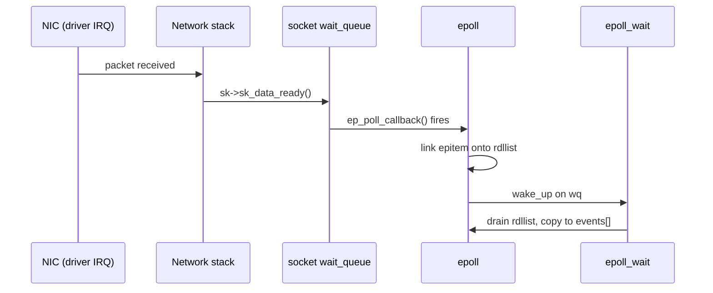
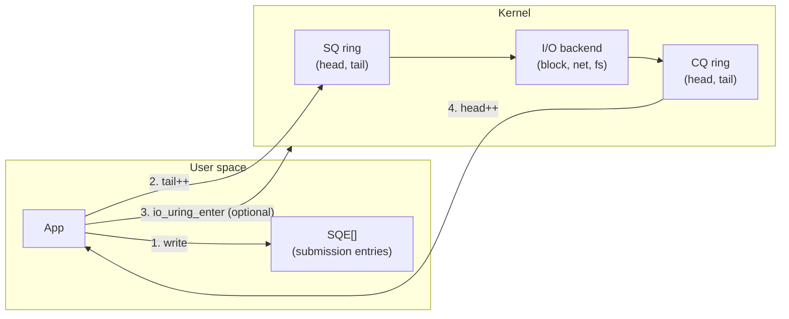
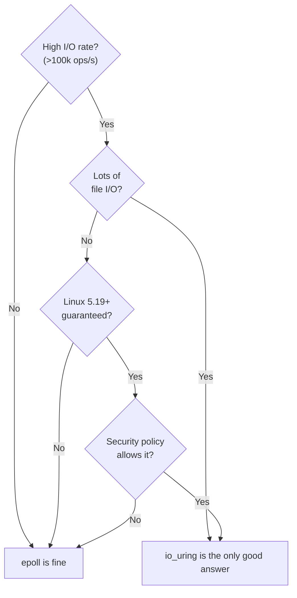

Push network servers and databases hard enough and you will always run into the same wall: <strong>I/O multiplexing</strong>. A single thread juggling 100k TCP connections, a single process saturating an NVMe's IOPS (I/O operations per second — the number of individual I/O requests a device can retire per second) — at the bottom of these stories sit Linux kernel interfaces like `epoll` and `io_uring`.

This article follows the evolution of Linux async I/O — `select → poll → epoll → io_uring` — while digging into <strong>how the kernel actually implements event notification and syscall reduction</strong>, grounded in real struct definitions and source files. Along the way we'll see why Node.js, nginx, PostgreSQL, ScyllaDB, and tokio each needed these APIs, and what trade-offs they accept.

> <strong>Think of it as a call centre</strong>
>
> A call centre with 100,000 phone lines suddenly starts ringing.
>
> - <strong>select / poll</strong>: an operator who walks past every phone asking "Is this one ringing? Is this one?" — re-checking them all on every round.
> - <strong>epoll</strong>: rings trigger a light on a dashboard, and the operator only looks at lit lights. The list of monitored phones lives at the <em>telephone exchange</em> (the kernel), so it isn't re-registered every round.
> - <strong>io_uring</strong>: instead of ringing for every request, requests and results slide across a <em>two-way counter</em> shared by operator and exchange. In the default mode the bell still rings — but only <em>once per batch</em> (`io_uring_enter`). With <strong>SQPOLL</strong>, a dedicated agent is stationed at the counter and grabs each slip the moment it lands — no bell at all, not even a syscall to submit.
>
> The whole evolution is really the same fight: <em>how do we reduce the number of hand-offs between user space and the kernel?</em>

## 1. Why async I/O matters

### 1.1 The cost structure of synchronous I/O

With blocking I/O, `read(fd, buf, n)` puts the calling thread to sleep until data arrives. An `fd` (<strong>file descriptor</strong>) is just an integer handle the kernel gives you for an open resource like a socket, file, or pipe — think of it as the counter ticket that says "talk to me about <em>this</em> specific connection". In the 1-thread-per-connection model, costs pile up:

- <strong>Thread stacks</strong> — Linux default is 8 MB (`ulimit -s`). 10k connections = 80 GB of virtual space.
- <strong>Context switches</strong> — a typical switch takes 1–3 µs. For scale, a main-memory access costs tens of nanoseconds and a syscall costs a fraction of a microsecond, so a context switch is among the heaviest things a thread does. At hundreds of thousands per second, CPU evaporates.
- <strong>Kernel thread structures</strong> — `task_struct` is several KB each.

To scale past this you must <strong>multiplex multiple I/Os on one thread</strong>. There are three approaches:

1. <strong>Readiness notification</strong> — ask the kernel "which fds are ready?" → `select` / `poll` / `epoll`.
2. <strong>Completion notification</strong> — ask the kernel to "do this I/O and tell me when done" → `aio`, `io_uring`.
3. <strong>Userspace polling</strong> — bypass the kernel entirely (DPDK, SPDK).

Linux optimised (1) for decades. The 2019 arrival of `io_uring` finally made (2) a first-class citizen.

### 1.2 Readiness vs completion

| Model | Representative APIs | Idea | Side effects |
| --- | --- | --- | --- |
| Readiness | `select`, `poll`, `epoll`, `kqueue` (BSD) | Kernel says "fd is ready", user does the I/O | 2 syscalls per I/O (notify + read/write) |
| Completion | Windows IOCP, POSIX `aio`, `io_uring` | Submit to kernel, wait for completion | 0–1 syscalls per I/O |

A <strong>syscall</strong>, in this context, is the privileged mode switch a user-space program uses to enter the kernel. It involves a trap instruction and a CPU-mode transition, so it costs orders of magnitude more than a plain function call — typically 200–500 ns on modern CPUs, versus < 10 ns for a regular call. KPTI (described later) makes this worse still.

Two related pieces of jargon to anchor: a <strong>reactor</strong> is an event loop that receives "this fd is ready" notifications and then performs the I/O itself (the epoll style), while a <strong>proactor</strong> is an event loop that submits I/O requests and receives completions (the IOCP / `io_uring` style). Holding both terms in mind makes the epoll-vs-`io_uring` contrast below much easier to read.

Regular Linux files are always considered "readable", so readiness doesn't work for disk I/O (`epoll` rejects regular files). That means <strong>a real completion-based API was genuinely needed</strong>, which is the strongest motivation behind `io_uring`.

## 2. The lineage: select → poll → epoll

> <strong>TL;DR</strong>: `select` and `poll` hand the whole watch list to the kernel on every call and the kernel scans all of it — $O(N)$ every time. `epoll` turns that inside out: the watch list lives in the kernel once, and only the fds that actually fired come back.

### 2.1 `select(2)` — 1983, BSD 4.2

The original multiplexing API.

```c
int select(int nfds, fd_set *readfds, fd_set *writefds,
           fd_set *exceptfds, struct timeval *timeout);
```

`fd_set` is a <strong>bitmap</strong> capped at `FD_SETSIZE = 1024` under glibc. Per call:

1. User builds the fd_set — $O(N)$
2. Kernel copies the full bitmap — $O(N)$
3. Kernel walks every fd to check state — $O(N)$
4. Kernel copies result bitmap back — $O(N)$

<strong>$O(N)$ per call, every call.</strong> Doesn't survive 10k connections.

### 2.2 `poll(2)` — from System V (Linux 2.1.23, 1997)

```c
int poll(struct pollfd *fds, nfds_t nfds, int timeout);

struct pollfd {
    int   fd;
    short events;   // monitored
    short revents;  // returned
};
```

The 1024 limit is gone, but the fundamental array-copy + full-scan complexity remains.

### 2.3 C10K and `epoll` — 2002, Linux 2.5.44

Dan Kegel's 1999 essay "The C10K problem" framed the challenge: 10k connections in one process. Davide Libenzi's `epoll` achieved two key breakthroughs:

- <strong>Keep state in the kernel</strong> (no per-call copy).
- <strong>Return only fds that are actually ready</strong> (no full scan).

## 3. Inside `epoll`

> <strong>TL;DR</strong>: epoll stores the watch set in a <strong>red-black tree</strong> keyed by fd, and moves only the fds with pending events onto a short <strong>ready list (`rdllist`)</strong>. `epoll_wait` just drains that list — no full scan, $O(1)$ per ready fd.

### 3.1 The interface

```c
int epoll_create1(int flags);
int epoll_ctl(int epfd, int op, int fd, struct epoll_event *event);
int epoll_wait(int epfd, struct epoll_event *events, int maxevents, int timeout);

struct epoll_event {
    uint32_t     events;
    epoll_data_t data;
};
```

- `epoll_create1()` — create an epoll instance, return its fd.
- `epoll_ctl()` — modify the watch set with `EPOLL_CTL_ADD / MOD / DEL`.
- `epoll_wait()` — get an array of ready fds. Supports blocking / non-blocking / timed.

### 3.2 Kernel data structures

In `fs/eventpoll.c` the core is three structs (simplified, key fields only — the same applies to every `struct` excerpt below):

```c
struct eventpoll {
    struct mutex       mtx;
    wait_queue_head_t  wq;          /* tasks sleeping in epoll_wait */
    wait_queue_head_t  poll_wait;
    struct list_head   rdllist;     /* ready items */
    struct rb_root_cached rbr;      /* all monitored items (red-black tree) */
    struct epitem      *ovflist;    /* overflow during delivery */
    /* ... */
};

struct epitem {
    struct rb_node       rbn;       /* node in eventpoll->rbr */
    struct list_head     rdllink;   /* link in rdllist */
    struct epoll_filefd  ffd;       /* the watched fd */
    struct eventpoll     *ep;
    struct list_head     pwqlist;   /* callback registration */
    struct epoll_event   event;
    /* ... */
};

struct eppoll_entry {
    struct list_head    llink;      /* in epitem->pwqlist */
    struct epitem       *base;
    wait_queue_entry_t  wait;       /* registered in file's wait queue */
    wait_queue_head_t   *whead;
};
```

Key ideas:

- <strong>Red-black tree `rbr`</strong> — a self-balancing binary search tree that holds every watched fd with $O(\log N)$ insert, delete, and lookup.
- <strong>Ready list `rdllist`</strong> — only the `epitem` records (one struct per watched fd) with pending events are linked here. `epoll_wait` just pops → $O(1)$ per ready fd.
- <strong>`eppoll_entry`</strong> — a callback registered on the watched file's <strong>wait queue</strong>.
  - `wait_queue_head_t` is the kernel's fundamental sleep/wake primitive — roughly a condition variable that every blockable object (socket, pipe, file) carries on its own.

<strong>In short</strong>: the three structs map cleanly onto "one epoll instance (`eventpoll`) → one watched fd (`epitem`) → one hook planted on that fd's wait queue (`eppoll_entry`)". When the hook fires, all it does is splice the `epitem` onto `rdllist`.

### 3.3 How events land in `rdllist`

For a TCP socket receiving a packet:



- Path: `sock_def_readable` → `wake_up_interruptible_sync_poll` → `ep_poll_callback` (`fs/eventpoll.c`).
- The callback only appends an item to `rdllist`, safe in interrupt context (spinlock-protected — interrupt handlers can't invoke the scheduler, so a sleeping mutex is forbidden; a spinlock that busy-waits without releasing the CPU is required instead).
- Then it wakes the task(s) waiting in `epoll_wait`.

### 3.4 Level vs Edge trigger

> <strong>TL;DR</strong>: <strong>level-triggered (LT)</strong> = the kernel keeps telling you "still readable / writable" every round (safe default); <strong>edge-triggered (ET)</strong> = it tells you only at the moment the state <em>changes</em> (faster, but you're responsible for draining until `EAGAIN`).

Epoll-specific, and a fertile source of bugs.

| Mode | Meaning | Expected read/write behaviour |
| --- | --- | --- |
| <strong>LT</strong> (default) | Keeps notifying while the fd is still ready | May read once and return; will be notified again. |
| <strong>ET</strong> | Notifies on state transition only | <strong>Must read until `EAGAIN`</strong>. Missing a notification can hang forever. |

The kernel side, simplified:

```c
/* ep_send_events_proc */
list_for_each_entry_safe(epi, tmp, &txlist, rdllink) {
    revents = ep_item_poll(epi, ...);
    if (revents) {
        copy_to_user(events, ...);
        if (epi->event.events & EPOLLET) {
            /* ET: drop from ready list; back only on next callback */
        } else if (!(epi->event.events & EPOLLONESHOT)) {
            /* LT: put back on ready list */
            list_add_tail(&epi->rdllink, &ep->rdllist);
        }
    }
}
```

ET is faster (no spurious re-notifications), but makes the <strong>application responsible for draining to `EAGAIN`</strong>. nginx and HAProxy use ET, and the canonical pattern is `while ((n = read(fd, ...)) > 0) { ... }`. (An <strong>nginx worker</strong>, for context, is one of the worker processes nginx forks at startup — roughly one per CPU core — each running its own independent epoll loop.)

### 3.5 Thundering herd and `EPOLLEXCLUSIVE`

Multiple processes / threads all watching the same listening socket with epoll can all wake on one incoming connection — only one will `accept()` successfully; the rest waste a wakeup. This is <strong>thundering herd</strong> — the literal image is a startled herd all breaking into a gallop when only one animal actually needed to move.

Fixes:

- <strong>`SO_REUSEPORT`</strong> (Linux 3.9+) — kernel spreads incoming connections across listeners. Common in nginx.
- <strong>`EPOLLEXCLUSIVE`</strong> (Linux 4.5+) — wake at most one waiter per event, by setting `WQ_FLAG_EXCLUSIVE` on the epoll wait-queue entry.

### 3.6 Limits of epoll

Even so, problems remain:

1. <strong>Doesn't work for regular files</strong> — they're always "readable". Disk I/O still blocks.
2. <strong>Two syscalls per I/O</strong> — `epoll_wait` + `read/write`. No VDSO fast path.
3. <strong>Post-Spectre/Meltdown syscall cost</strong> — KPTI (Kernel Page-Table Isolation, the Meltdown mitigation that splits user and kernel page tables) forces a TLB flush on every syscall boundary, pushing cost to 0.1–1 µs per syscall. At 1M IOPS that alone consumes 10–100% of a CPU before any real work happens — which is why syscall cost dominates at that scale.
4. <strong>Can't chain operations</strong> — `accept → read → parse → write` can't be submitted as one atomic step.

All of these are what drove `io_uring`.

## 4. Before `io_uring`: `aio(7)` and other attempts

### 4.1 POSIX AIO and `libaio`

Linux had both <strong>POSIX AIO (`aio_read`, `aio_write`)</strong> (glibc-emulated with threads) and the separate <strong>Kernel AIO (`io_setup`, `io_submit`, `io_getevents`)</strong>.

Kernel AIO (aka `libaio`):

- <strong>Direct I/O (`O_DIRECT`) + block devices only</strong>. `O_DIRECT` bypasses the page cache and DMAs straight between device and application buffer — designed for databases that do their own caching and scheduling. Buffered file I/O silently became synchronous.
- <strong>Awkward interface</strong> — arrays of `struct iocb`, completions harvested via `io_getevents`.
- No support for metadata ops (`open`, `stat`, `close`).

PostgreSQL and MySQL used `libaio`, but it never went mainstream. PostgreSQL's long-running frustration with the lack of a general-purpose AIO eventually pushed the project to design its <strong>own async I/O abstraction layer</strong> in v18 (2025), where `io_method` can be selected as `worker`, `io_uring`, or `sync`.

### 4.2 `eventfd` and friends

`eventfd` is a single-counter fd used as glue to funnel everything into epoll: `libaio` completions, `timerfd` clocks, `signalfd` signals, IPC notifications. That "make everything an fd and poll it" culture shaped all userspace event loops on Linux.

## 5. `io_uring` — 2019, Linux 5.1+

> <strong>TL;DR</strong>: share two <strong>ring buffers</strong> between the application and the kernel — one for requests (SQEs), one for results (CQEs). Submitting and harvesting I/O becomes pointer arithmetic on shared memory; a syscall is only needed to nudge the kernel to look at pending work, and with SQPOLL even that goes away.

### 5.1 Design goals

Jens Axboe's goals, as stated in his LWN article<sup>[1]</sup>:

1. <strong>Truly asynchronous</strong> — any I/O op submittable without blocking.
2. <strong>No copy, no allocation</strong> on the hot path — no syscall, no malloc.
3. <strong>Unified</strong> — one API for network, file, and block I/O.
4. <strong>Extensible</strong> — easy to add new opcodes.

The enabling idea is a pair of <strong>shared ring buffers</strong>.

### 5.2 Architecture: SQ and CQ

`io_uring` shares two ring buffers between kernel and userspace.



- <strong>SQ (submission queue)</strong> — user writes entries (SQEs, Submission Queue Entries).
- <strong>CQ (completion queue)</strong> — kernel writes completion entries (CQEs, Completion Queue Entries).
- Both rings are <strong>shared via mmap</strong>. `mmap` is the syscall that maps a file, device memory, or anonymous memory into a process's virtual address space; here it is used to expose the same physical pages to both userspace and the kernel so each side can read/write the rings without copying.

That's the heart of it: <strong>writing and reading entries does not involve a syscall</strong>. A syscall only happens when you call `io_uring_enter()`, and that call can batch hundreds of submissions.

<strong>In short</strong>: epoll made you walk to the kitchen window to shout every order; `io_uring` gives you and the cook a shared counter where you drop slips and collect results. Touching the counter is ordinary memory access; the only time you still have to ring the bell (syscall) is when you want the cook to check the slip pile — and in SQPOLL mode, the cook is already standing there watching.

<IoUringRingVisualizer />


### 5.3 SQE and CQE

```c
/* <linux/io_uring.h> */
struct io_uring_sqe {
    __u8    opcode;     /* IORING_OP_READ, WRITE, ACCEPT, ... */
    __u8    flags;
    __u16   ioprio;
    __s32   fd;
    union {
        __u64 off;      /* offset */
        __u64 addr2;
    };
    union {
        __u64 addr;     /* buffer */
    };
    __u32   len;
    union {
        __kernel_rwf_t rw_flags;
        __u32 fsync_flags;
        __u16 poll_events;
        /* ... */
    };
    __u64   user_data;  /* echoed back in CQE */
    /* ... */
};

struct io_uring_cqe {
    __u64 user_data;    /* from SQE */
    __s32 res;          /* syscall-style return: >=0 or -errno */
    __u32 flags;
};
```

`user_data` is the application's <strong>opaque 64-bit cookie</strong> used to identify completions. Usually a pointer or ID.

<strong>In short</strong>: an SQE is the request slip and the CQE is its matching stub. `user_data` is the claim-check number that ties them together — stash whatever you need (pointer, job id, future handle) in it and the kernel hands it back unchanged on the CQE.

### 5.4 Ring setup

Hidden under `liburing` but worth knowing:

1. `io_uring_setup(entries, params)` — kernel allocates SQ/CQ, returns mmap offsets.
2. `mmap` the SQ ring, CQ ring, and the SQE array. Since Linux 5.4, `IORING_FEAT_SINGLE_MMAP` lets SQ and CQ share one mapping, bringing the total down to <strong>2 mmap calls</strong> (3 on older kernels).
3. Read `sq_head`/`sq_tail`/`cq_head`/`cq_tail` pointers from the ring header.

Typical sizes: SQ = 128–4096, CQ = 2× SQ. The kernel pins the pages via `get_user_pages` (the helper that locks the physical pages backing a userspace virtual address so the kernel or a device can safely DMA to/from them).

### 5.5 Submission and completion in C

```c
/* Simple non-SQPOLL example using liburing */
struct io_uring ring;
io_uring_queue_init(32, &ring, 0);

struct io_uring_sqe *sqe = io_uring_get_sqe(&ring);
io_uring_prep_read(sqe, fd, buf, len, offset);
io_uring_sqe_set_data(sqe, user_ptr);

io_uring_submit(&ring);            /* issues io_uring_enter(SUBMIT) */

struct io_uring_cqe *cqe;
io_uring_wait_cqe(&ring, &cqe);    /* wait for completion */
process_completion(cqe);
io_uring_cqe_seen(&ring, cqe);     /* head++ */
```

The key property: <strong>many SQEs can be submitted in a single `io_uring_enter`</strong>. One syscall can send 1000 reads, amortising the syscall cost to nearly zero. Concretely: an epoll-shaped loop pays two syscalls per I/O (≈ 1 µs at 500 ns each), while batching 1000 io_uring requests spreads a single syscall across them — roughly 0.5 ns per request in overhead.

### 5.6 Memory ordering

Because user and kernel share `head`/`tail` through memory, <strong>memory barriers</strong> matter. The kernel doc (`io_uring.txt`) and header (`<linux/io_uring.h>`) require:

- After writing an SQE, before updating `sq->tail`: `smp_wmb` (= `io_uring_smp_wmb`; no-op on x86, `dmb ish` on ARM).
- After reading `cq->tail`, before reading the CQE body: `smp_rmb`.

`smp_wmb` is a store-store barrier guaranteeing earlier writes become visible to other cores before later ones; `smp_rmb` is its load-load counterpart. `liburing` (`io_uring_submit` / `io_uring_peek_cqe`) does this correctly, so you rarely touch it directly.

## 6. Advanced modes

> <strong>TL;DR</strong>: SQPOLL, IOPOLL, linked SQEs, registered files/buffers, and multishot are all knobs that shave <em>more</em> syscall or setup cost off the hot path. You don't need to turn them all on — reach for them only when the base API's ceiling is actually the bottleneck.

### 6.1 `IORING_SETUP_SQPOLL` — kernel-side polling thread

Set `IORING_SETUP_SQPOLL` and the kernel spawns a <strong>dedicated thread</strong> that polls SQ. Userspace just writes SQEs; <strong>no `io_uring_enter` needed</strong>. Truly <strong>zero syscalls</strong> for I/O. In call-centre terms, SQPOLL is the mode where an agent sits permanently at the shared counter, picking up request slips as soon as you place them down.

```c
struct io_uring_params params = {
    .flags = IORING_SETUP_SQPOLL,
    .sq_thread_idle = 2000,  /* sleep after 2 s idle */
};
io_uring_queue_init_params(entries, &ring, &params);
```

Costs:

- The kernel thread burns a CPU core (until `sq_thread_idle` milliseconds of idle elapse).
- Linux 5.11 removed the `CAP_SYS_ADMIN` (root) requirement, so SQPOLL itself is usable from fully unprivileged processes. `CAP_SYS_NICE` is still required only when pinning the SQ thread to a specific CPU via `IORING_SETUP_SQ_AFF`.

Sweet spot: <strong>single process fully saturating an NVMe</strong> (databases, high-frequency trading, ScyllaDB's shard-per-core model).

### 6.2 `IORING_SETUP_IOPOLL` — busy-poll completions

For `O_DIRECT` block I/O, busy-polling the block layer for completion beats interrupt-driven delivery at NVMe latencies (µs range).

### 6.3 Linked SQEs (`IOSQE_IO_LINK`)

Submit a <strong>dependency chain</strong> in one batch:

```c
/* Example: read → write on a known fd in a single enter */
sqe1 = io_uring_get_sqe(); io_uring_prep_read(sqe1, fd, buf, len, 0);
sqe1->flags |= IOSQE_IO_LINK;

sqe2 = io_uring_get_sqe(); io_uring_prep_write(sqe2, fd, buf, len, 0);
io_uring_submit(&ring);
```

If a predecessor fails (`res < 0`) the rest are auto-cancelled. Note that `IOSQE_IO_LINK` only <strong>orders execution</strong>; it does not automatically forward a result fd from one SQE to the next. To chain `accept → read/write` in one submission, use <strong>direct descriptors</strong> (`IORING_FILE_INDEX_ALLOC` + `IOSQE_FIXED_FILE`, with deferred fd assignment via `IORING_FEAT_LINKED_FILE` on 5.17+).

### 6.4 Registered files / buffers

- <strong>`io_uring_register_files()`</strong> — preregister an fd table; SQEs then use an <strong>index</strong> instead of an fd, skipping `fget()/fput()`.
- <strong>`io_uring_register_buffers()`</strong> — pin userspace buffers, avoiding per-I/O `get_user_pages` and enabling the DMA-direct path.

Baseline optimisation for high IOPS. ScyllaDB has reported 20–40% speedups.

### 6.5 Multishot (`IORING_OP_ACCEPT_MULTI`, Linux 5.19+)

A single SQE can generate <strong>multiple completions</strong> — keep accepting or receiving until cancelled. Eliminates the "accept → resubmit SQE" loop and reduces SQ pressure.

### 6.6 Provided buffers (`IORING_OP_PROVIDE_BUFFERS`)

Let the kernel pick a receive buffer from a pool <strong>on arrival</strong>, rather than pre-allocating one per connection. Big win for HTTP servers with many idle connections.

### 6.7 Opcode catalogue (selection)

| Category | Example opcodes |
| --- | --- |
| Network | `ACCEPT`, `CONNECT`, `SEND`, `RECV`, `SENDMSG`, `RECVMSG`, `SHUTDOWN`, `CLOSE` |
| File | `READ`, `WRITE`, `READV`, `WRITEV`, `FSYNC`, `FALLOCATE`, `OPENAT`, `STATX`, `RENAMEAT` |
| Poll | `POLL_ADD`, `POLL_REMOVE`, `POLL_MULTISHOT` |
| Sync | `LINK_TIMEOUT`, `TIMEOUT`, `NOP`, `ASYNC_CANCEL` |
| Memory | `MADVISE`, `FADVISE`, `SPLICE`, `TEE` |
| Process | `WAITID` (5.19+) |

Each opcode lives in its own kernel file (`io_uring/net.c`, `rw.c`, `fs.c`, etc.) and calls the existing VFS (the Virtual File System — Linux's abstraction layer that hides the differences between concrete filesystems) / socket internals.

## 7. Inside the kernel: walking `io_uring/`

> <strong>TL;DR</strong>: each SQE becomes an `io_kiocb` request struct in the kernel; if the work can complete without blocking it runs inline, otherwise it's punted to a dedicated thread pool `io-wq`. Completions are written directly into the shared CQ ring and the submitter is woken.

Linux 5.19 split the monolithic `fs/io_uring.c` into a top-level `io_uring/` directory, promoting it to a self-contained subsystem:

```text
io_uring/
├── io_uring.c      # ring management, enter syscall
├── sqpoll.c        # SQPOLL kernel thread
├── rw.c            # read/write opcodes
├── net.c           # network opcodes
├── fs.c            # openat/statx family
├── poll.c          # IORING_OP_POLL_ADD
├── timeout.c       # TIMEOUT, LINK_TIMEOUT
├── cancel.c        # ASYNC_CANCEL
└── ... 30+ files
```

### 7.1 Request struct `io_kiocb`

One struct per SQE, allocated inside the kernel.

```c
struct io_kiocb {
    union {
        struct file     *file;
        struct io_cmd_data cmd;
    };
    u8                      opcode;
    io_req_flags_t          flags;
    struct io_cqe           cqe;           /* user_data, res, cflags */
    struct io_ring_ctx      *ctx;
    struct io_uring_task    *tctx;
    /* opcode-specific data, task work node, etc. */
    /* ... */
};
```

Allocated from a slab cache (`req_cachep`), recycled after completion. A small per-`io_ring_ctx` pre-allocation batch (on the order of 128 entries, exact value varies by kernel version) keeps the hot path allocation-free.

### 7.2 `io-wq`: the offload thread pool

<strong>Operations that really would block</strong> (e.g. a page-cache miss on `read`) get punted to a kernel thread pool called `io-wq`. In other words, `io-wq` is the safety net that preserves the "submit now, complete later" contract even for operations the kernel cannot truly process asynchronously. Each `io_ring_ctx` has `bounded` (disk) and `unbounded` (network) pools. Threads are reclaimed on idle, so don't be alarmed when `ps` shows a herd of kernel threads briefly.

This is transparent to the user. The <strong>"fall back to a thread if we can't do it truly async"</strong> strategy keeps the async guarantee consistent — qualitatively different from epoll's "never blocks" promise.

Why a dedicated pool instead of the generic kernel `workqueue`? `io-wq` workers must <strong>inherit the submitter's credentials</strong> (uid/gid, cgroup, nsproxy …) and want ring-level NUMA locality and priority control. Generic workqueues don't satisfy those requirements.

### 7.3 The completion path

```c
/* io_uring.c (conceptual) */
void io_req_task_complete(struct io_kiocb *req, io_tw_token_t tw)
{
    struct io_ring_ctx *ctx = req->ctx;
    io_cq_lock(ctx);
    io_fill_cqe_req(ctx, req);   /* write CQE into ring */
    io_cq_unlock_post(ctx);      /* wake waiter */
}
```

CQE writes are done under a spinlock and are <strong>copy-free</strong> — direct writes into the mmap region visible to userspace.

## 8. Pitfalls and operations

> <strong>TL;DR</strong>: powerful but also the source of many CVEs, and `seccomp` can't filter at opcode granularity. Production use demands current LTS kernels, decent observability, and awareness that some distros or platforms disable it by default.

### 8.1 CVEs and security

A very complex, very privileged API. There have been many local privilege escalation CVEs:

- <strong>CVE-2022-29582</strong>, <strong>CVE-2023-2598</strong>, <strong>CVE-2023-21400</strong>, <strong>CVE-2024-0582</strong>, and more.
- As a result, <strong>Google (Android / CrOS) and many LTS kernel packages disable `io_uring` by default</strong>.
- Since RHEL 9.5, `sysctl kernel.io_uring_disabled=1/2` can outright disable it or allow root only.

In production: stay on current LTS kernels, and consider `seccomp` filters that restrict allowed opcodes.

### 8.2 Observability

- `strace` only sees `io_uring_enter`; SQE contents are invisible.
- Workarounds: `bpftrace` / `perf trace` on tracepoints (`io_uring:io_uring_submit_req` …), or `iouring-tools` dumps.
- Per-process stats live at `/proc/<pid>/io_uring`.

### 8.3 Buffer ownership

The kernel <strong>retains submitted buffers until completion</strong>. This is a poor fit for Rust's borrow checker; it's exactly why `tokio-uring` introduced its own `IoBuf` trait.

### 8.4 Ecosystem status (as of 2026)

- <strong>Kernel</strong>: introduced 5.1 (2019), matured around 5.19 (2022), iterating in 6.x.
- <strong>glibc</strong>: no direct wrappers; `liburing` is the de-facto library.
- <strong>Node.js</strong>: libuv v1.45 (2023) introduced io_uring for async file I/O, but v1.49 (September 2024) <strong>disabled the SQPOLL mode by default</strong> due to kernel bugs observed on some versions (the plain io_uring path is kept). Behaviour depends on the specific libuv version, so check before relying on it.
- <strong>PostgreSQL</strong>: the new AIO subsystem in 18 (2025) exposes `io_method=io_uring` (requires a `--with-liburing` build); the default is `worker`.
- <strong>Rust</strong>: separate crate `tokio-uring`; the mainline `tokio` async runtime stays on epoll for portability.
- <strong>nginx</strong>: third-party experimental module; no official uptake yet.
- <strong>ScyllaDB</strong>: architected around Seastar's async-everything model from the start (originally on Linux AIO) and was among the earliest projects to migrate to io_uring once it matured; SPDK is used on the NVMe-direct path.
- <strong>Netty / JVM</strong>: `IOUring` transport available in Netty 4.2.

### 8.5 Operational footguns

- <strong>cgroup v1 + SQPOLL accounting</strong>: the SQPOLL kernel thread runs as a task independent of the submitter. In other words, under cgroup v1 its CPU usage isn't reliably attributed back to the submitter's cgroup. cgroup v2 fixes this, but on older hosts an SQPOLL-heavy workload can look like stray kernel-mode CPU appearing out of nowhere.
- <strong>seccomp can't filter opcodes</strong>: seccomp-bpf inspects syscalls, not SQE contents, so `io_uring_enter` is just a single syscall regardless of which opcodes it carries. To restrict specific opcodes you need BPF-LSM, the newer seccomp notify hooks, or io_uring's own per-ring allowlist (`IORING_REGISTER_RESTRICTIONS`).

## 9. Performance: what is actually faster

> <strong>TL;DR</strong>: at light load, roughly the same as epoll. The investment in `io_uring` pays off when you are saturating an NVMe, chasing 1M IOPS, or mixing in file `fsync`— that's where the syscall-reduction and true-async properties translate into real wins.

<SyscallCostVisualizer />


### 9.1 Benchmark shapes

Summaries of published reports (see originals for exact setups):

| Workload | epoll | io_uring (no polling) | io_uring (SQPOLL + registered) |
| --- | --- | --- | --- |
| Network echo, 1M conn | baseline | ~1.2× | ~2–3× |
| NVMe random read, 4 KB | ~800k IOPS | ~1.5–2M IOPS | ~3–5M IOPS |
| DB commit (fsync-heavy) | baseline | ~1.1× | ~1.3–1.5× |

`io_uring` shines most in <strong>high-IOPS, low-latency</strong> workloads. Under light load the delta to epoll is small — often not worth the engineering cost.

### 9.2 When to actually choose `io_uring`



## 10. Conclusion

> <strong>TL;DR</strong>: the through-line across 40 years is a single question — "how few hand-offs between user space and kernel can we get away with?" `select → epoll → io_uring` is the sequence of answers, each one pushing that count closer to zero.

Forty years of async I/O, compressed:

1. <strong>select</strong> (1983) — fixed-size fd_set, $O(N)$ every call.
2. <strong>poll</strong> (1997) — removed the 1024 cap, same complexity.
3. <strong>epoll</strong> (2002) — kernel-side state + ready list → $O(1)$. Solved C10K.
4. <strong>io_uring</strong> (2019) — shared rings → fewer syscalls and real async for everything. The C10M / NVMe-saturating era.

One design pressure runs through the whole line: <strong>(a) keep state in the kernel to avoid repeated copies, (b) amortise syscall cost over more work, (c) let genuinely blocking operations be offloaded.</strong>

Epoll will remain the stable default. But when the requirement is <strong>saturating NVMe in a single node, handling 10M connections, or building async pipelines that include file I/O and fsync</strong>, the investment in `io_uring` pays off.

The most important thing is to <strong>internalise the design reasoning behind each interface</strong>. That is what turns these choices from folklore into engineering judgement.

## References

1. J. Axboe, "Efficient IO with io_uring", [liburing.pdf](https://kernel.dk/io_uring.pdf), 2019.
2. D. Libenzi, "Improving (network) I/O performance" (epoll), 2002.
3. D. Kegel, "The C10K problem", 1999.
4. [Linux kernel source: `fs/eventpoll.c`](https://git.kernel.org/pub/scm/linux/kernel/git/torvalds/linux.git/tree/fs/eventpoll.c)
5. [Linux kernel source: `io_uring/`](https://git.kernel.org/pub/scm/linux/kernel/git/torvalds/linux.git/tree/io_uring)
6. [`liburing`](https://github.com/axboe/liburing) — userspace helpers and official docs.
7. LWN: "The rapid growth of io_uring" (2020), "Security considerations for io_uring" (2023).
