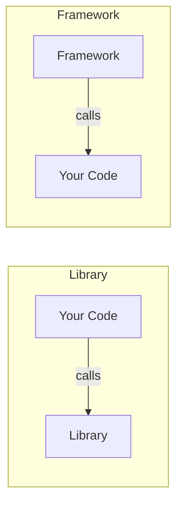

"Library" and "framework" are two of the most frequently used terms in software development, yet the difference between them is often misunderstood. This article explains the fundamental distinction through the concept of **Inversion of Control (IoC)**.

## What Is a Library?

A library is a **collection of code that provides specific functionality**. Developers call library functions and classes from their own code.

The key point is that **the developer retains control of the program flow**. When, how, and in what order to use the library's features is entirely up to the developer.

```python
# Library example: requests
import requests

# The developer is in control
response = requests.get("https://api.example.com/users")
data = response.json()

for user in data:
    print(user["name"])
```

In this example, **when to call** the `requests` library and **how to process** the result is entirely decided by the developer.

**Popular libraries:**

| Language | Library | Purpose |
|---|---|---|
| Python | Requests | HTTP client |
| JavaScript | Lodash | Utility functions |
| Java | Guava | Collections & caching |
| Go | zap | Structured logging |
| C | libcurl | HTTP/network communication |

## What Is a Framework?

A framework is a **software foundation that provides the skeleton of an application**. The framework determines the application's structure and execution flow, and the developer plugs their code into extension points defined by the framework.

The key point is that **the framework has control of the program flow**.

```python
# Framework example: Flask
from flask import Flask

app = Flask(__name__)

# The framework decides "when" to call this function
@app.route("/users")
def get_users():
    return [{"name": "Alice"}, {"name": "Bob"}]

# Hand over execution to the framework
if __name__ == "__main__":
    app.run()
```

In this example, **when to call** `get_users` is decided by the framework (Flask). When an HTTP request arrives at `/users`, Flask calls the developer's code at the appropriate time.

**Popular frameworks:**

| Language | Framework | Purpose |
|---|---|---|
| Python | Django, Flask | Web applications |
| JavaScript | Next.js | Full-stack Web |
| Java | Spring | Enterprise applications |
| Ruby | Ruby on Rails | Web applications |
| Go | Gin | Web APIs |

## Inversion of Control (IoC)

The fundamental difference between libraries and frameworks can be explained by a software design principle known as **Inversion of Control (IoC)**.



- **Library**: Your code → calls the library (**you call it**)
- **Framework**: The framework → calls your code (**it calls you back**)

This reversal of the calling relationship is "Inversion of Control," also known as the **"Hollywood Principle: Don't call us, we'll call you."** Martin Fowler explains in his [article on IoC](https://martinfowler.com/bliki/InversionOfControl.html) that this principle is a key part of what makes a framework different from a library.

### Comparing in Code

Even when building the same "HTTP server," the library approach and framework approach produce fundamentally different structures.

**Library approach (using Go's `net/http` directly):**

```go
package main

import (
    "encoding/json"
    "log"
    "net/http"
)

func main() {
    // The developer has full control over server construction and startup
    mux := http.NewServeMux()

    mux.HandleFunc("/users", func(w http.ResponseWriter, r *http.Request) {
        users := []map[string]string{
            {"name": "Alice"},
            {"name": "Bob"},
        }
        w.Header().Set("Content-Type", "application/json")
        json.NewEncoder(w).Encode(users)
    })

    log.Fatal(http.ListenAndServe(":8080", mux))
}
```

**Framework approach (Next.js App Router):**

```typescript
// app/users/page.tsx
// The framework controls routing, rendering, and serving

export default async function UsersPage() {
  const users = [
    { name: "Alice" },
    { name: "Bob" },
  ];

  return (
    <ul>
      {users.map((user) => (
        <li key={user.name}>{user.name}</li>
      ))}
    </ul>
  );
}
```

In the Next.js example, the file's location determines the route, and the framework manages when the component is rendered. The developer only needs to focus on *what* to display.

## Common Misconceptions

### "Is React a Library or a Framework?"

React officially calls itself **"A JavaScript library for building user interfaces."** Indeed, React on its own focuses on component rendering, delegating routing and state management to separate libraries.

However, React does control component lifecycles and re-rendering timing, giving it framework-like characteristics. Meanwhile, Next.js adds routing, data fetching, and a build system on top of React, making it a **framework**.

Rather than trying to classify strictly, what matters in practice is being aware of **which side holds control**.

### "If It's Big, It's a Framework?"

Code size is not the essential differentiator. Small frameworks and large libraries both exist. For example:

- **Express.js** — Very lightweight, but a framework (it manages the request-handling control flow)
- **TensorFlow** — Massive, but a library (the developer controls the training loop)

## Choosing Between Libraries and Frameworks

| Aspect | Library | Framework |
|---|---|---|
| **Control** | Developer controls | Framework controls |
| **Flexibility** | High (mix and match freely) | Lower (follow conventions) |
| **Learning curve** | Lower (learn only needed APIs) | Higher (understand overall conventions) |
| **Consistency** | Depends on team | Enforced by framework |
| **Dev speed** | Fast initially, may slow at scale | Slower initially, more stable at scale |
| **Best for** | Adding specific functionality | Building entire applications |

In practice, libraries are often used within frameworks. For example, using date-fns (library) inside Next.js (framework) to format dates is a common pattern.

## Summary

- A **library** is a tool your code calls. You retain control.
- A **framework** is a foundation that calls your code. It holds control.
- The fundamental difference is **Inversion of Control (IoC)** — "who calls whom."
- Rather than a strict binary, think of it as a spectrum and focus on **which side holds the control flow** when choosing tools.
