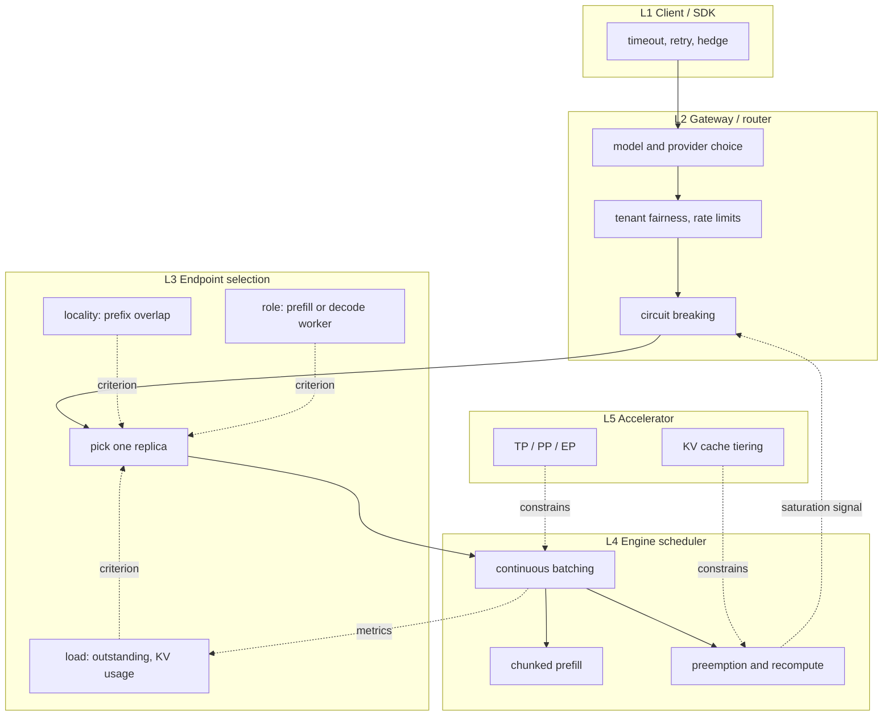

For a stateless HTTP API, round robin is usually the right first move. Per-request work is roughly uniform, so equalizing counts equalizes resources.

LLM serving breaks all four of the assumptions behind that. Per-request work varies by two orders of magnitude, the amount is unknown at dispatch time, the server holds state from previous requests in its KV cache, and the response streams for seconds to minutes. Add agents and the scheduling unit shifts again — from one request to one session of tens or hundreds of calls.

This article has one argument: <strong>at every layer of this stack, the same single trade is being made</strong>. You are choosing between locality (send it where the work is already done) and balance (send it where there is room), you are choosing on a signal that is already out of date, and you are choosing inside a window that closes the moment the first token ships. The names of the signals and the size of the time constants change from layer to layer. The shape of the trade does not.

We test that claim by asking, for each layer, <strong>what signal it observes and what it optimizes</strong>. Along the way we check what vLLM, SGLang, NVIDIA Dynamo, the Kubernetes Gateway API Inference Extension, LiteLLM, and Azure API Management actually compute, reading from upstream sources rather than from memory.

The genealogy of CPU scheduling and fair queueing itself is covered in [A Genealogy of Task Scheduling](/en/blog/task-scheduling-algorithms). This article picks up where that one stops, focusing on how work is spread across multiple servers.

## 1. Why LLM traffic is different, and the two formulas that quantify it

### 1.1 Differences from classical HTTP load balancing

| Assumption | Stateless HTTP | LLM inference |
|---|---|---|
| Per-request work | roughly uniform (small CV) | varies 100x with prompt and output length |
| Work known in advance | mostly (inferable from request size) | output length unknown until generation ends |
| Server state | stateless by design | prefix cache creates locality |
| Response time | milliseconds | seconds to minutes, streaming throughout |
| Dominant resource | CPU time | three-dimensional: compute, HBM bandwidth, KV capacity |
| Concurrency | threads or connections | co-resident slots in a continuous batch |
| Failure shape | a 5xx is returned | 429 with `Retry-After`, or silent slowdown |

### 1.2 How variability turns into waiting time

Queueing theory quantifies exactly how much that difference costs. For Poisson arrivals and an arbitrary service-time distribution (M/G/1), mean waiting time is given by the Pollaczek–Khinchine formula:

$$
W_q=\frac{\lambda E[S^2]}{2(1-\rho)}
=\frac{\rho}{1-\rho}\cdot\frac{E[S]\left(1+C_s^2\right)}{2}
$$

where $\rho=\lambda E[S]$ is utilization and $C_s = \sigma_S / E[S]$ is the coefficient of variation of service time. Two things follow.

1. The $1/(1-\rho)$ term makes waiting time diverge as utilization approaches 1.
2. The $(1+C_s^2)/2$ term means that <strong>at the same utilization, more variability produces proportionally more waiting</strong>.

Deterministic service gives $C_s^2=0$; exponential gives $C_s^2=1$. LLM requests vary widely in both prompt length and output length, so take $C_s^2=4$ as an illustrative heavy-tail value — measure your own, because everything below scales with it. At $C_s^2=4$ the factor $(1+C_s^2)/2$ is 2.5, so at the same utilization the queue is <strong>2.5x deeper than with exponential service times and 5x deeper than with deterministic ones</strong>.

<QueueingKneeCurve />

Read the chart horizontally rather than vertically. Pick a waiting time you can tolerate — say three times the service time — and trace across: deterministic service reaches it at $\rho = 0.86$, exponential at $\rho = 0.75$, and a heavy tail at $C_s^2 = 4$ at $\rho = 0.55$. The cost of variability is not "somewhat worse latency"; it is <strong>thirty points of utilization you are not allowed to use</strong>.

This formula is the theoretical basis for not running an LLM pool at high utilization. It also says something less obvious: measures that reduce variability — chunked prefill, output-length caps, separating models by shape — are worth roughly as much as measures that add capacity.

### 1.3 Sizing with Little's law

The second tool that works at every layer is Little's law:

$$
L=\lambda W
$$

The mean number of items in the system, $L$, equals arrival rate times mean time in system. It assumes nothing about distributions, so it holds for any scheduler.

Take the inside of one inference engine as the system. Then $L$ is the number of co-resident sequences — the batch size — and $W$ is in-engine residency (prefill plus decode). Batch size is bounded above by KV cache capacity, $L_{\max}$, so

$$
\lambda_{\max}=\frac{L_{\max}}{W}
$$

is the throughput ceiling of one replica. $W$ itself grows with the resident batch, so read the equation as a ceiling at the operating point where $W$ was measured. With that caveat, since $W$ scales roughly with output length, the obvious statement that <strong>longer outputs mean fewer concurrent requests per GPU</strong> becomes a capacity-planning equation. Conversely, shrinking the prefill component of $W$ with a prefix cache raises $\lambda_{\max}$.

## 2. What to measure

The most common reason load-balancing discussions go nowhere is a metric mix-up. "Latency got worse" means completely different causes and completely different fixes depending on whether it is TTFT, ITL, or E2E.

<LBMetricMap />

Three caveats.

<strong>Throughput and goodput are different things.</strong> Raising batch size increases total tokens per second while stretching per-stream inter-token latency. Counting only completions that met the SLO — goodput — the throughput-optimal point and the goodput-optimal point usually differ. Goodput is exactly the metric DistServe (Zhong et al., OSDI 2024) used to justify splitting prefill from decode.

<strong>Streaming distorts measurement.</strong> From the client, "response complete" is when the connection closes, but server-side resources were released well before that. A load balancer that measures load by active connection count is reading a signal that no longer matches reality.

<strong>Normalized latency exists for comparison.</strong> Dividing E2E by output tokens removes output-length differences so load levels can be compared. When reading benchmark results, always check whether output length was pinned (whether `--ignore-eos` was used).

One of those six rows carries more weight than the others, and it is worth saying why up front. <strong>TTFT is not only a user-experience number; it is the length of time during which a mistake is still recoverable.</strong> Once the first token has been written to the client, retrying, hedging, failing over, or spilling to another provider all become impossible or user-visible. Every mechanism in sections 9 and 12 is therefore a pre-first-token mechanism, and its window of effectiveness is, by construction, exactly TTFT. Section 9.4 returns to this once the mechanisms are on the table.

## 3. Five layers where decisions happen

What gets lumped together as "LLM load balancing" is really five stacked decisions with different granularity and different authority. Four of them are places where a request is <em>routed</em>; the fifth (L5 — TP for tensor parallelism, PP for pipeline parallelism, EP for expert parallelism) is a static topology choice that constrains the other four rather than acting per request, and this article treats it only in that role.

<LBLayerMap />



Solid edges follow the request; dotted edges carry information. The "metrics" and "saturation signal" edges are the <strong>reverse flow of information</strong> — what L4 publishes determines L3's next decision. That feedback path always lags, and the lag is what section 5.6 is about. The two "constrains" edges show static L5 topology bounding L4's runtime decisions rather than causing them.

Keeping the layers straight makes common failures easy to locate.

- Picking the best replica at L3 does nothing for TTFT if the L4 batch is saturated.
- No amount of L4 tuning reduces effective load if L1 retries without a budget.
- Rate limiting by request count at L2 is misaligned with the real resource (tokens) consumed at L4.

## 4. An inventory of selection rules

### 4.1 The classical rules and where each one breaks

<LBPolicyComparison />

A few points deserve expansion.

<strong>Round robin equalizes counts, not work.</strong> With per-request work of mean $E[S]$ and coefficient of variation $C_s$, dealing $n$ requests to $k$ replicas gives each replica a total-work standard deviation of $\sigma_S\sqrt{n/k}$. Relative to the mean $n E[S]/k$, the spread is $C_s/\sqrt{n/k}$, which converges for large $n$. The problem is the <strong>short-run</strong> skew: two long requests landing back to back on one replica degrade its TTFT immediately.

<strong>Power of two choices is remarkably cheap for what it buys.</strong> Throwing $n$ balls into $n$ bins uniformly at random gives a maximum load of $\Theta(\log n/\log\log n)$; sampling two bins and taking the lighter one drops it to $\ln\ln n/\ln 2+\Theta(1)$ (Azar, Broder, Karlin, and Upfal, 1994). An exponential improvement for one extra observation. Mitzenmacher (1996) extended the result to queueing models, showing the same effect holds for dynamic load balancing.

Raising $d$ above 2 shrinks the leading term only as $1/\ln d$: the jump from one to two is the whole story. In deployments with many independent routers there is also a practical advantage — two choices <strong>avoids herding</strong>, because not every router stampedes to the same currently-idlest replica.

<strong>Consistent hashing is a locality tool, not a balancing tool.</strong> Skewed key distributions produce hot spots. Consistent hashing with bounded loads (Mirrokni, Thorup, and Zadimoghaddam, 2016) caps each of $n$ nodes at $\lceil c\,m/n\rceil$ for $m$ balls with $c>1$, and forwards overflow to the next node on the ring. The affinity-versus-balance switch in prefix-aware routing, discussed below, has the same motivation.

### 4.2 What the numbers say when the trace is held fixed

Replaying one arrival trace while changing only the selection rule shows what actually moves.

<LLMLoadBalancerLab />

At the default settings (4 replicas, $\lambda=0.20$, 20% long requests) the measured results are:

| Selection rule | TTFT P95 | SLO attainment | Cache hit rate | Assignment gap | Output throughput |
|---|---|---|---|---|---|
| Random | 324.2 | 88% | 38% | 10 | 14.4 |
| Round robin | 84.3 | 94% | 46% | 0 | 15.1 |
| Least outstanding | <strong>52.1</strong> | <strong>98%</strong> | 39% | 10 | 16.6 |
| Power of two choices | 90.1 | 94% | 37% | 8 | 16.6 |
| Least KV usage | 559.0 | 81% | 45% | 50 | 12.5 |
| Prefix-aware | 151.3 | 91% | <strong>67%</strong> | 11 | <strong>17.2</strong> |

TTFT is in ticks and the SLO is 80 ticks. Reading the table:

- <strong>Round robin has a zero assignment gap and still loses the tail to least outstanding.</strong> This is the claim "equal counts is not equal resources", demonstrated.
- <strong>Random has the worst tail among the load-oblivious rules.</strong> Its assignment skew is small, but coincidental clustering of heavy requests drives TTFT P95 up.
- <strong>Power of two choices matches round robin's SLO attainment at $O(1)$ observation cost</strong> and matches least outstanding on throughput, without reaching its tail.
- <strong>Least-KV is last on every column.</strong> Its primary signal is blocks occupied by running and currently-prefilling sequences — and <strong>a queued request occupies zero KV blocks until it is admitted</strong>, so a gauge reading current occupancy literally cannot see it. Assigned-but-unadmitted work therefore acts only as a secondary tie-breaker. It keeps piling large prompts onto whichever replica just drained, opening an assignment gap of 50.
- <strong>Prefix-aware wins cache hit rate and throughput but not the tail</strong>, because it tolerates some load skew in exchange for affinity.

The fourth point is the most transferable lesson. <strong>A load signal must count every piece of accepted-but-unfinished work.</strong> That is why Envoy's least-request policy counts active requests rather than connections, and why the Dynamo cost function includes prefill load from queued requests.

This ordering changes as you move the sliders. Lower the arrival rate far enough and the load-driven rules converge — the expected consequence of the queueing formula, since load-balancing effort buys nothing when there is no congestion to spread. Prefix-aware routing is the exception: it keeps a TTFT P95 of 2 where the others sit at 7–8, because it is not spreading congestion but avoiding recomputation, and recomputation does not go away at low load.

### 4.3 When replicas are not identical

Every rule so far has been stated as though replicas were interchangeable. Real pools rarely are: mixed GPU generations, different tensor-parallel degrees, different quantizations, or — right after any scale-up — different cache temperatures.

Under heterogeneity, plain least-outstanding is actively wrong. A replica that is twice as fast <em>should</em> hold roughly twice the outstanding requests; equalizing counts underfills it. Envoy's weighted least request handles this by computing an effective weight at pick time whenever weights differ ([Supported load balancers](https://www.envoyproxy.io/docs/envoy/latest/intro/arch_overview/upstream/load_balancing/load_balancers)):

$$
\text{weight}=\frac{\text{load\_balancing\_weight}}{\left(\text{active\_requests}+1\right)^{\text{active\_request\_bias}}}
$$

`active_request_bias` defaults to 1.0. Notice that this single knob spans the whole family of rules continuously:

- at $0$ the active-request count is ignored and the policy degenerates to weighted round robin;
- as it grows, active requests depress the effective weight more aggressively, approaching strict least-outstanding.

Envoy's documentation is candid about the trade: the formula balances well at steady state but adapts slowly to a sudden imbalance, and unlike P2C a host never truly drains.

The part that stays hard for LLM serving is that <strong>the weight cannot be fixed statically</strong>, because a replica's effective capacity depends on the prompt-length and output-length mix it happens to receive. GIE's roadmap lists "heterogeneous accelerators — serve workloads on multiple types of accelerator using latency and request cost-aware load balancing" as outstanding work, so this is a live open problem rather than a corner case.

## 5. Signals specific to LLM serving

With the limits of the classical rules established, look at what inference engines actually publish — and at the routers built on top of it.

### 5.1 What the engine reports

vLLM exposes a Prometheus-compatible `/metrics` endpoint carrying values that map directly onto routing decisions ([`vllm/v1/metrics/loggers.py`](https://github.com/vllm-project/vllm/blob/main/vllm/v1/metrics/loggers.py)).

| Metric | Type | Meaning |
|---|---|---|
| `vllm:num_requests_running` | Gauge | requests in model execution batches |
| `vllm:num_requests_waiting` | Gauge | requests waiting to be scheduled |
| `vllm:num_requests_waiting_by_reason` | Gauge | waiting split by reason (`capacity` / `deferred`) |
| `vllm:kv_cache_usage_perc` | Gauge | KV cache usage, where 1 means 100% |
| `vllm:prefix_cache_queries` / `vllm:prefix_cache_hits` | Counter | prefix cache queries and hits, in tokens |
| `vllm:num_preemptions` | Counter | cumulative preemptions |
| `vllm:time_to_first_token_seconds` | Histogram | TTFT |
| `vllm:inter_token_latency_seconds` | Histogram | inter-token latency |
| `vllm:request_queue_time_seconds` | Histogram | queue delay |
| `vllm:request_prefill_time_seconds` / `vllm:request_decode_time_seconds` | Histogram | time attributed to each phase |
| `vllm:kv_block_reuse_gap_seconds` | Histogram | gap between consecutive accesses to a KV block (sampled) |
| `vllm:kv_block_idle_before_evict_seconds` | Histogram | idle time before eviction (sampled) |
| `vllm:kv_block_lifetime_seconds` | Histogram | how long a KV block lives (sampled) |

(These are the names as registered in the source. Prometheus client libraries append `_total` to counters at scrape time, so `/metrics` and alert expressions use `vllm:num_preemptions_total`. The last three are off by default. The enable switch is `--kv-cache-metrics` (boolean, default `False`); `--kv-cache-metrics-sample` (default `0.01`) only sets the sampling rate. They also require log stats to be on, so they stay dark if you pass `--disable-log-stats`.)

For routing, the important structural fact is that <strong>queue depth and KV usage are two independent saturation axes</strong>. A replica with free KV still queues if batch slots are full, and a replica with free slots still refuses admission if KV is exhausted.

A rising `vllm:num_preemptions` counter means running sequences are being evicted under KV pressure and recomputed later. That badly disturbs inter-token latency, which makes it an unambiguous signal to throttle admission at the router (or add capacity).

### 5.2 Standardizing the layer: Gateway API Inference Extension

The Kubernetes [Gateway API Inference Extension](https://gateway-api-inference-extension.sigs.k8s.io/) (GIE) is the official project standardizing this "look at engine state, then pick an endpoint" layer. The flow is:

1. The Gateway selects an `InferencePool` — a set of endpoints serving the same model — using ordinary Gateway API and HTTPRoute semantics.
2. The Gateway hands request information to that pool's Endpoint Picker (EPP) over Envoy's [External Processing](https://www.envoyproxy.io/docs/envoy/latest/configuration/http/http_filters/ext_proc_filter) protocol.
3. The EPP fetches endpoint metrics and selects the endpoint that best achieves the configured objectives.
4. The Gateway forwards to that endpoint.

The key design decision is that the EPP is an <strong>explicitly replaceable extension point</strong>. In 2026 that extensibility was institutionalized as a repository split. Per the current README, the full EPP and the `InferenceObjective` and `InferenceModelRewrite` APIs moved to [llm-d/llm-d-router](https://github.com/llm-d/llm-d-router), and the Body Based Router moved to [llm-d/llm-d-inference-payload-processor](https://github.com/llm-d/llm-d-inference-payload-processor); the packages left behind will be archived. The GIE repository itself has narrowed to the <strong>lightweight EPP (LWEPP)</strong> for conformance testing, the `InferencePool` API, and the conformance tests themselves.

The resulting division of labour is worth naming: <strong>standardize the pool API and the conformance suite upstream, and let routing algorithms compete in separate repositories.</strong> The migration is not finished — the project FAQ says the `InferencePool` and `InferencePoolImport` APIs and the conformance suite will themselves move into the Gateway API repository. Signals available to an EPP include prefix cache status and LoRA adapter availability. `InferencePoolImport` is the API type for spanning clusters, still `v1alpha1` and explicitly subject to breaking changes.

The roadmap is a good summary of what is still unsolved in this whole area: prefix-cache aware load balancing with interfaces for remote caches, a recommended LoRA adapter rollout pipeline, fairness and priority between workloads within the same criticality band, HPA support for autoscaling on aggregate metrics derived from the load balancer, large multi-modal inputs and outputs, other GenAI model types such as diffusion, heterogeneous accelerators, and disaggregated serving with independently scaling pools. Most of those map onto a section below; multi-modal serving and non-completion model types are the two this article does not attempt.

The engine-side hookup is plain. vLLM maps `vllm:kv_cache_usage_perc` and `vllm:num_requests_waiting` into ORCA-format endpoint load reports ([`vllm/entrypoints/serve/utils/orca_metrics.py`](https://github.com/vllm-project/vllm/blob/main/vllm/entrypoints/serve/utils/orca_metrics.py)). In other words, "which numbers the engine hands the router" is settling into a protocol.

### 5.3 Why prefix overlap is a signal at all

Every signal so far has been a classical load metric with an LLM-shaped replacement. The next one has no classical counterpart: <strong>is there a replica that has already computed the head of this request?</strong>

Start with the concrete case. In an agent conversation the system prompt, the tool definitions, and every prior turn all sit at the head of the next call. On step 10, 95% of the prompt being identical to step 9 is ordinary. In that regime, <strong>whether the same conversation lands on the same replica changes prefill cost by an order of magnitude</strong>.

Here is why. Autoregressive generation processes the whole prompt once (prefill), then emits one token at a time (decode). Prefill parallelizes across all prompt tokens and is compute-bound; decode advances one token at a time and is memory-bandwidth-bound. If the KV for the first $m$ tokens of an $n$-token prompt is already computed, only $n-m$ tokens need computing.

How much that saves depends on the layer. Token-linear layers — QKV projections, MLP — save exactly $m/n$. Attention saves less, because the uncached $n-m$ tokens must still attend across the entire cached prefix:

$$
1-\frac{n^2-m^2}{n^2}=\left(\frac{m}{n}\right)^2
$$

So the total saving sits between $(m/n)^2$ and $m/n$, with the quadratic attention term pulling it below $m/n$ rather than above it.

In practice the quadratic term barely bites outside long-context work. Write $d$ for the model's hidden dimension and $P \approx c\,d^2$ for the parameter count of one block. Ignoring constants, the token-linear part of a block costs about $2n\cdot P$ and the causally-masked attention terms cost about $2n^2 d$, so attention's share of prefill FLOPs is roughly $n/(n+c\,d)$, with $c$ typically between 11 and 19 (exactly 12 for the classic MHA plus 4d-GELU block, $4d^2 + 8d^2$). At $d=4096$, attention does not reach half the total until $n$ approaches 50,000 tokens. For ordinary prompt lengths, in other words, <strong>treat the saving as $m/n$</strong>.

The next two subsections show two ways of turning "prefill work I get to skip" into a routing decision.

### 5.4 Writing it as a cost function: NVIDIA Dynamo

The NVIDIA Dynamo KV router states endpoint selection as explicit cost minimization ([`router-design.md`](https://github.com/ai-dynamo/dynamo/blob/main/docs/fern/pages/developer-guide/knowledge-base/modular-components/router/router-design.md)).

```text
overlap_credit_blocks = device_overlap_blocks * effective_device_credit
                      + host_overlap_blocks   * host_cache_hit_weight   // default 0.75
                      + disk_overlap_blocks   * disk_cache_hit_weight   // default 0.25
                      + shared_beyond_blocks  * shared_cache_multiplier  // inert unless shared cache is on

adjusted_prefill_blocks = max(prefill_blocks - overlap_credit_blocks, 0)

cost = prefill_load_scale * adjusted_prefill_blocks       // default 1.0
     + potential_decode_blocks
     + decode_active_request_weight * active_requests     // default 0 (opt-in)
```

Three design decisions are compressed into that expression.

<strong>Everything is denominated in KV blocks.</strong> Prefill load, decode load, and cache hits all share one unit, so they add and subtract directly.

<strong>Cache tiers get different discount rates.</strong> Blocks resident on the device count at full weight; CPU-pinned memory at 0.75; disk at 0.25. Transfer cost is expressed as a weight on "prefill work you get to skip." `shared_beyond_blocks` counts only the cluster-shared cache hits that extend past that worker's own device-resident prefix; upstream is inconsistent about its multiplier's default (the Python bindings say 0.0, the frontend CLI reference documents 0.5), but it is inert either way unless a shared cache type is configured.

<strong>Excessive affinity decays — if you turn it on.</strong> The effective device weight is

$$
\text{effective\_device\_credit}=\frac{\text{overlap\_score\_credit}}{1+\text{decay}\times\text{normalized\_excess\_prefill}}
$$

so the more a cache-holding worker's prefill load exceeds that of the least loaded eligible worker, the weaker its affinity pull becomes. Note the default, though: `--router-kv-overlap-score-credit-decay` is <strong>0, which disables decay entirely</strong>. Out of the box, Dynamo's cost function has no brake on affinity; you must opt in. Setting `router_temperature` to a non-zero value switches selection to softmax sampling over normalized cost logits, which spreads deterministic concentration.

The worked example in the documentation (with `overlap_score_credit = 1.0` and `decode_active_request_weight = 0`):

| Worker | Raw prefill | Device overlap | Decode | Cost |
|---|---|---|---|---|
| 1 | 10 | 2 | 10 | $(10-2)+10=18$ |
| 2 | 10 | 5 | 5 | $(10-5)+5=10$ — selected |
| 3 | 10 | 8 | 9 | $(10-8)+9=11$ |

Worker 3 holds the most cache but loses on decode load. Since <strong>cache hits dominate TTFT while decode load dominates inter-token latency</strong>, this formula balances the two in a single scalar. The documentation says as much: higher overlap credit favours cache reuse and improves TTFT, while lower credit prioritizes even load and improves ITL.

### 5.5 Switching on a threshold: SGLang

The SGLang gateway solves the same problem not with a cost function but with a <strong>two-mode switch</strong> ([`policies/cache_aware.rs`](https://github.com/sgl-project/sglang/blob/main/sgl-model-gateway/src/policies/cache_aware.rs)).

```text
imbalanced = (max_load - min_load) > balance_abs_threshold
             AND max_load > min_load * balance_rel_threshold

if imbalanced:
    pick the minimum-load worker (ties broken randomly)
else:
    query the approximate radix tree for prefix overlap
    match_rate = matched_chars / input_chars
    if match_rate > cache_threshold:
        pick the matched worker
    else:
        pick the minimum-load worker (ties broken randomly)
insert the chosen worker into the radix tree
```

The tree stores raw characters rather than token IDs so the router never has to tokenize, at the cost of an approximate match rate. There is one tree per `(pool, model)`, and each worker is a <strong>tenant</strong> inside that tree — a lookup answers "which tenant holds the longest matching prefix?". Separating trees by pool keeps prefill and decode pools from evicting each other's entries.

The defaults differ by entry point, which is worth knowing. The Rust gateway binary ([`main.rs`](https://github.com/sgl-project/sglang/blob/main/sgl-model-gateway/src/main.rs)) uses `cache_threshold = 0.3`, `balance_abs_threshold = 64`, `balance_rel_threshold = 1.5`, `eviction_interval = 120` seconds, and `max_tree_size = 67108864`; the Python launcher ([`router_args.py`](https://github.com/sgl-project/sglang/blob/main/sgl-model-gateway/bindings/python/src/sglang_router/router_args.py)) matches those except for a 60-second eviction interval. `CacheAwareConfig::default()` ([`policies/mod.rs`](https://github.com/sgl-project/sglang/blob/main/sgl-model-gateway/src/policies/mod.rs)) uses `0.5 / 32 / 1.1 / 30 / 10000`.

Dynamo's continuous cost function and SGLang's discrete threshold switch are <strong>two encodings of the same trade-off</strong>. The former moves smoothly as weights change; the latter makes "when do we abandon affinity" readable straight from the config.

### 5.6 Signal freshness — what happens when every router trusts the same stale number

One assumption has been running silently underneath everything so far: that the router knows the current load of each replica. It does not. Routers <strong>decide at millisecond cadence and observe at multi-second cadence</strong>, and that gap imports a classic distributed-systems failure mode wholesale.

The mechanism is simple, and it depends on the routers being <strong>in phase</strong>:

1. $N$ routers read the same snapshot.
2. All of them pick the same "currently idlest" replica.
3. That replica absorbs all traffic until the next scrape.
4. At the next scrape it looks worst, and everyone flees at once.
5. Return to step 1.

The failure is not that the system picks badly once; it is that <strong>the oscillation sustains</strong> instead of converging. The amplitude is set by <strong>how many requests are dispatched on a single stale snapshot</strong> — roughly $\min(\lambda \times T_{\text{scrape}},\ L)$, the smaller of what arrives during a scrape interval and the total work in flight $L = \lambda W$ — the pool-wide version of the population section 1.3 plugged into Little's law. It grows with the scrape interval up to that ceiling. Router count does <strong>not</strong> affect it: as long as every router reads the same snapshot, the total dispatched per window is the same however it is divided (leave scrapes unstaggered, move the router-count slider in the lab below, and the top row's numbers do not budge). Router count matters instead for the first of the fixes below — counting your own in-flight dispatches.

<SignalStalenessLab />

At the default settings (5 replicas, 4 routers, 10-tick scrape interval):

| Selection rule | Peak skew | Mean skew | Ticks where every arrival hit one replica |
|---|---|---|---|
| Least outstanding (trust the stale view) | 21 | 12.0 | 64% |
| Least outstanding + my own dispatches | 20 | 9.1 | 48% |
| Two random replicas (no correction) | <strong>9</strong> | 5.2 | <strong>21%</strong> |
| Both | 10 | <strong>4.4</strong> | 23% |

(The lower three rows <strong>replace</strong> the top row rather than stacking on it. In particular, "two random replicas" does <strong>not</strong> include the in-flight correction; only "both" combines the two. The pile-up column is only comparable within this configuration — setting the scrape interval to 1 tick, i.e. a perfectly fresh view, pushes pile-up to 87%, but that is every router reaching the same <strong>correct</strong> conclusion, and peak skew falls from 21 to 2.)

There are four fixes.

<strong>0. Stop the routers being in phase.</strong> The cheapest fix is to stagger scrapes per router. Turn on "stagger scrape times" in the lab and the top row's skew falls without changing the selection rule at all. But this is only available when scrapes can be centrally coordinated — independently launched sidecars cannot do it. The three below assume you cannot break the phase alignment.

<strong>1. Count your own in-flight dispatches.</strong> Add "requests I sent since the last scrape" to the snapshot before choosing. How much this helps <strong>depends directly on router count</strong>. With one router the correction is exact: peak skew 3, mean 1.44, pile-up 6% — better than P2C. With four routers each sees only a quarter of the dispatches and mean skew climbs back to 9.1. In the table above that is roughly 40% of the achievable reduction in mean skew, and <strong>almost nothing on peak skew</strong>, which moves only from 21 to 20.

<strong>2. Randomize.</strong> P2C severs the path by which everyone stampedes toward the same minimum. Envoy's documentation states outright that `LEAST_REQUEST` with equal weights <em>is</em> P2C (`choice_count` defaults to 2), and that "P2C selection is particularly useful for load balancer implementations due to its resistance to herding behavior." Dynamo's `router_temperature` softmax sampling is a different implementation of the same idea.

<strong>3. Distrust stale weights, and distrust new endpoints.</strong> Envoy's `ClientSideWeightedRoundRobin` derives endpoint weights from ORCA reports as

$$
\text{weight}=\frac{\text{qps}}{\text{utilization}+\dfrac{\text{eps}}{\text{qps}}\times\text{error\_utilization\_penalty}}
$$

but the rules around that formula are the interesting part. While an endpoint has no valid weight — because its reports are being ignored, during the initial `blackout_period`, or after `weight_expiration_period` has elapsed — it is assigned the <strong>median weight of the endpoints that currently have a valid weight</strong> (or 1 if none do). The blackout and expiry machinery is specific to `ClientSideWeightedRoundRobin`, but <strong>slow start</strong> — ramping traffic gradually into new or recovered endpoints — is available for round robin and least request as well.

That third fix matters especially for LLM serving. A replica that just became ready has zero outstanding requests <em>and</em> a cold cache — a problem section 11.3 takes up in full. One caveat from Envoy's own documentation: slow start is "most effective for cases where few new endpoints come up," and "when all the endpoints are relatively new e.g. new deployment in Kubernetes, slow start is not very effective." It handles adding one replica to a warm pool; it does not handle replacing the pool.

## 6. Where to sit between affinity and balance

The previous section showed how to price prefix overlap. What remains is the question of <strong>how far to let that price win</strong>.

### 6.1 The locality / balance trade-off

<PrefixCacheRoutingVisualizer />

Cache slots are narrowed to one prefix per replica, and the trace is skewed: a single prefix (P1) accounts for 8 of the 12 requests. Running both routers side by side on it shows three things at once.

<strong>Affinity works.</strong> The load-only router hits 4 of 12; the prefix-aware router hits 6. Cumulative prefill tokens are 29,180 versus 21,180 — a <strong>27.4% reduction</strong>. Note that the load-only router does not "miss every time": as it fills three replicas in turn it sometimes lands back on the one holding the prefix. What prefix-aware routing changes is that those hits <strong>stop being accidental</strong>.

<strong>You still need an escape hatch.</strong> Because P1 dominates, pure affinity would pile onto replica 1. When the load gap exceeds the threshold (2 in this implementation), the router abandons affinity and takes the least-loaded replica instead. Two of the twelve requests go down that path.

<strong>The escape hatch is not free.</strong> Both of those two requests miss. So the 6/12 hit rate would rise if you raised the threshold toward infinity — at the price of a final load distribution skewed like 8, 2, 2. The tension here is not "cache affinity versus load balance, which is right" but <strong>where to sit between them</strong>. Stepping through the player shows the reason for each decision: first sight, affinity, or affinity dropped on load gap.

Prioritizing affinity unconditionally would concentrate load on whichever replica holds the popular prefix. The two implementations in the previous section were each providing exactly this <strong>escape hatch</strong>, in different forms — SGLang as a threshold, Dynamo as a decay term — though only SGLang ships with its hatch open. The design space:

| Axis | Options |
|---|---|
| How cache state is tracked | router-side approximate tree / KV event subscription / external indexer query |
| Match granularity | characters / tokens / KV blocks |
| When affinity is abandoned | absolute and relative load gap / continuous decay / softmax temperature |
| Cache tiers | GPU HBM only / host memory / disk / cluster-shared store |

That last row deserves a sentence, because it changes the shape of the whole decision. If KV blocks can be fetched from a cluster-shared store, a "miss" on replica B no longer costs a full prefill — it costs a transfer. Affinity stops being binary and becomes a bandwidth-versus-compute comparison, which is exactly what Dynamo's 0.75 and 0.25 tier weights were already pricing, extended across machines instead of within one. vLLM ships connectors for this under `vllm/distributed/kv_transfer/`, covering LMCache, Mooncake, NIXL, and plain CPU/disk offloading. It is also the GIE roadmap's "interfaces for remote caches" item, and it is the reason that item is still open: once the transfer is cheap enough, the router's cost function needs a term for network as well as compute.

### 6.2 A lighter alternative: prefix hashing

If maintaining a radix tree feels heavy, SGLang also ships a `prefix_hash` policy ([`policies/prefix_hash.rs`](https://github.com/sgl-project/sglang/blob/main/sgl-model-gateway/src/policies/prefix_hash.rs)):

1. Take the first $k$ tokens of the request (`prefix_token_count`).
2. Hash them with xxhash.
3. Look up the owning worker on a consistent hash ring.
4. If that worker's load exceeds average times `load_factor`, walk to the least loaded one instead.

The idea is consistent hashing with bounded loads from section 4.1, though this implementation deviates from the theoretical model by jumping straight to the globally least-loaded worker instead of walking the ring. There is no tree to maintain, ring lookup is $O(\log n)$, and growing the pool from $n$ to $n+1$ workers moves about $1/(n+1)$ of the keys. Keyed on the head of an agent conversation, it is often enough in practice.

### 6.3 The same shape on a different resource: LoRA adapters

Routing across multiple LoRA adapters has exactly the structure of prefix-cache routing. A replica can hold only a bounded number of adapters resident, swapping an absent one in costs real time, so the router must weigh "which replica already has adapter X" against "which replica is free" — the same affinity/balance tug-of-war, with the same need for an escape hatch.

The difference is that the affinity term is <strong>discrete and small</strong>. Prefix match rate is a continuous value in $[0,1]$; adapter residency is present-or-absent across a handful of slots. That lumpiness makes hot-spotting on a popular adapter worse than the prefix case, not better.

vLLM exposes `vllm:lora_requests_info` for this decision. Its value is the emit-time wall clock; the routing information is in the labels: `running_lora_adapters`, `waiting_lora_adapters`, and `max_lora`, the static cap on adapters co-resident in one batch. Be careful with the first two. vLLM's metrics design document describes them as "a per-adapter count of the number of requests running using that adapter, formatted as a comma-separated string", but [`loggers.py`](https://github.com/vllm-project/vllm/blob/main/vllm/v1/metrics/loggers.py) joins only the dictionary <strong>keys</strong> — the counts are dropped, and what reaches the wire is a comma-separated list of adapter <em>names</em>. The same document calls the comma-separated encoding "quite misguided" and notes it should use labels instead. The signal exists but has not settled. GIE's roadmap likewise lists a "recommended LoRA adapter pipeline for automated rollout" as outstanding.

## 7. Engine-side scheduling

However clever the router is, none of it matters if the scheduler inside the replica leaves work idle. This is the most commonly skipped layer in load-balancing discussions.

### 7.1 From static to continuous batching

Early inference servers grouped requests into a batch and processed the batch as a unit. No slot is freed until the longest generation in the batch finishes, so a request that stops after 10 tokens waits for one that generates 1000.

The <strong>iteration-level scheduling</strong> introduced by Orca (Yu et al., OSDI 2022) replaced this with a per-iteration decision: at every iteration, remove finished sequences and admit waiting ones. That is the origin of what is now called continuous batching.

vLLM's PagedAttention (Kwon et al., SOSP 2023) supports it from the memory side, splitting the KV cache into fixed-size blocks managed like virtual memory so sequences can enter and leave cheaply without fragmentation.

### 7.2 Prefill stalling decode

Continuous batching still has one hole. Prefilling a new sequence occupies a whole iteration, during which every running sequence stops decoding. Each long prompt that arrives spikes inter-token latency for everyone else.

The <strong>chunked prefill</strong> of Sarathi-Serve (Agrawal et al., OSDI 2024) splits prefill into chunks that fit inside a compute budget and rides them along with decode in the same iteration, eliminating decode-stalled iterations.

<ContinuousBatchingVisualizer />

Switching between the three modes shows the two effects measured against <strong>different baselines</strong>. Slot occupancy climbs from 57% under static batching to 91% under continuous batching and 93% under chunked prefill — that gain belongs to continuous batching. Zero-output iterations, meanwhile, go 6 → 8 → 1. Under continuous batching those really are decode stalls, and it makes them <strong>worse</strong>, precisely because keeping slots full admits more new prefills. (Static batching's six are mostly its initial prefills, when there is no decode to stall.) Chunked prefill erases that regression and then pushes below the static-batching baseline. In this schematic the very first iteration still emits nothing, because no sequence has finished prefill yet.

Chunked prefill is not free. Prefill and decode share the per-iteration token budget, so the split is itself a throughput-versus-ITL trade-off: bias toward prefill for throughput, toward decode for steady inter-token latency.

### 7.3 Putting prefill and decode on different machines

Splitwise (Patel et al., ISCA 2024) and DistServe (Zhong et al., OSDI 2024) go one step further and place the two phases on <strong>different workers</strong>. The motivation is that they use resources differently.

| | Prefill | Decode |
|---|---|---|
| Bottleneck | compute (FLOPS) | memory bandwidth |
| Available parallelism | all tokens in the prompt | number of sequences only |
| Benefit from batching | small (saturates alone) | large |
| Main scaling knob | choice of parallelism | larger batch |

Disaggregation lets each phase choose its own parallelism, GPU generation, and batching policy. DistServe reports that which parallelism helps the prefill side is itself rate-dependent, so "prefill always wants tensor parallelism" is not a rule you can apply blindly. The cost is transferring the post-prefill KV cache to the decode worker. For short prompts the transfer can outweigh the gain, which is why Dynamo implements <strong>conditional disaggregation</strong> with three switch policies: `isl_bounding` (effective input length), `prefill_load` (prefill-side congestion), and `isl_or_load`.

For routing, disaggregation doubles the decision. Prefill-worker choice is dominated by prefix affinity; decode-worker choice is dominated by KV capacity and current batch. In the Dynamo implementation, ordinary disaggregation forces `overlap_score_credit = 0` on the decode-side router so decode routing stays load-only, while conditional disaggregation skips that override and lets the base credit apply ([`build_decode_router_override`](https://github.com/ai-dynamo/dynamo/blob/main/lib/llm/src/kv_router/prefill_router/mod.rs)).

### 7.4 Speculative decoding, and the metric it breaks

The last engine-side lever worth naming changes what a decode iteration <em>is</em>. Speculative decoding drafts several tokens cheaply — with a small model, an n-gram lookup, or an extra head such as EAGLE or MTP — then verifies them in one pass of the target model and keeps the longest accepted prefix ([Leviathan, Kalman and Matias, ICML 2023](https://arxiv.org/abs/2211.17192)). Accepted tokens are nearly free; rejected ones are wasted compute.

Two things follow for a load balancer.

<strong>Per-request cost gets less predictable, not more.</strong> Every argument in section 1.2 was about the variance of service time. Speculation adds a second source of it, because the acceptance rate depends on the content: structured, low-entropy output accepts long runs, open-ended prose does not. The same prompt length can now cost meaningfully different amounts of GPU time on the same replica, and the variation is <em>correlated with the workload mix</em> rather than random — exactly the shape that makes a fixed capacity model wrong.

<strong>Inter-token latency stops meaning what section 2 said it means.</strong> With speculation, one streamed chunk can carry several tokens. vLLM's benchmark documentation is explicit that ITL records only the gaps <em>between</em> streamed outputs, without adding zero-length gaps for tokens bundled into the same output, while TPOT amortizes the request's decoding time over every output token ([Benchmark CLI](https://docs.vllm.ai/en/latest/benchmarking/cli/)). The two diverge. Write the SLO against ITL and then turn speculation on, and the number improves by more than the experience does; compare a speculative deployment against a non-speculative one on ITL, and you are not comparing the same quantity. Pin the SLO to TPOT, or to normalized end-to-end latency.

## 8. Fairness — fair to whom?

### 8.1 Neither request count nor token count is fair on its own

Multi-tenant LLM gateways usually rate-limit on RPM (requests per minute) and TPM (tokens per minute). Neither guarantees fairness alone.

<strong>RPM ignores work.</strong> A 200-token prompt and a 100,000-token prompt both count as one request.

<strong>TPM does not distinguish input from output.</strong> Input tokens are processed in parallel during prefill; output tokens are produced one at a time and hold a KV slot the entire while. Their contribution to GPU-seconds is nothing alike.

<strong>Neither reflects cache hits.</strong> A prompt that is 95% cached costs the same as a completely fresh one.

This is exactly the "define the fairness principal and the unit of account" problem from [the task scheduling article](/en/blog/task-scheduling-algorithms).

### 8.2 VTC: defining fairness in token service

VTC (Virtual Token Counter), from Sheng et al. (OSDI 2024), answers this directly. Each client carries a counter accumulating weighted token service received, and the next request is admitted from the client with the smallest counter. Input and output tokens can carry different weights, which expresses the prefill/decode cost difference.

Structurally it is the same family as `vruntime` in the Linux CFS / EEVDF schedulers and the start tag in Start-time Fair Queueing: "select the principal with the least accumulated normalized service," re-derived with tokens as the unit of resource.

Two practical notes. First, output length is unknown at admission, so charging has to happen incrementally as generation proceeds. Second, strict token fairness fights prefix locality, because admitting one tenant's requests back to back is what makes the cache pay off. The locality-versus-fairness trade-off reappears here.

### 8.3 Priority and preemption

Separately from fairness, some workloads need <strong>priority</strong>. If interactive chat and an overnight batch summarizer share a pool, the former should win. GIE lets a platform declare per-model serving priority so that lower-priority traffic waits or is shed under congestion.

The engine has preemption too. Under KV pressure, vLLM evicts running sequences and recomputes them later. It is a capacity-protection mechanism, but the evicted request's inter-token latency is badly disturbed. A continuously rising `vllm:num_preemptions_total` is a signal to throttle admission upstream.

## 9. Overload control — stopping failure propagation

### 9.1 Retry amplification across layers

Agent stacks are deep, and every layer implements retries in good faith. The easy mistake is to assume the per-layer attempt counts <strong>add</strong>. Four layers attempting 3, 4, 4, and 3 times is not 3+4+4+3 = 14 calls reaching upstream. It is $3 \times 4 \times 4 \times 3 = 144$.

<RetryAmplificationDiagram />

Four countermeasures:

1. <strong>Retry at exactly one layer.</strong> The LiteLLM router owns retries and pins the provider client's `max_retries` to 0. That is deliberate: it is what stops a deployment-level `num_retries: N` from being applied twice and turning one request into $(1+N)^2$ upstream calls ([Router docs](https://docs.litellm.ai/docs/routing)).
2. <strong>Enforce a retry budget.</strong> A ratio cap such as "at most 10% of successful calls" allows generous retries in steady state without amplifying during an incident.
3. <strong>Honour `Retry-After`.</strong> When Azure OpenAI returns 429, the `Retry-After` value can be very large — a day, for instance. The Azure API Management circuit breaker has an `acceptRetryAfter` option specifically to consume that header ([Backends docs](https://learn.microsoft.com/azure/api-management/backends)).
4. <strong>Add jitter to exponential backoff.</strong> Without jitter, retries synchronize and rebuild the load spike periodically.

### 9.2 Hedging: what the tail reduction costs

Hedged requests, from Dean and Barroso's "The Tail at Scale" (CACM, 2013), issue a duplicate to another replica once the P95 threshold passes and take whichever returns first. Hedging at the 95th percentile duplicates 5% of requests by construction, and the paper reports that this "limits the additional load to approximately 5%" while substantially shortening the tail.

<HedgingTimeline />

For LLMs the price is higher. The discarded attempt still ran prefill and decode, is still billed, and still consumed KV cache. Under streaming, the decision of which stream to keep must be made by the first token. And for agents that call tools, idempotency is a prerequisite so that duplicate side effects do not occur.

The realistic use is <strong>hedging only until prefill completes</strong>: if TTFT exceeds a threshold, issue to another replica, take whichever returns the first token, and cancel the other immediately. That is far cheaper than running both through decode.

### 9.3 Admission control and backpressure

Queues are not infinite. Letting them behave as if they were produces the worst state: waiting time grows while goodput does not.

- Cap <strong>queue length</strong> and return 429 immediately past the cap. Failing fast beats failing after a long wait.
- Attach <strong>deadlines</strong>. A request that has already blown its SLO has no value left to deliver, so drop it.
- Bound <strong>queue time</strong> as a constant multiple of mean service time.
- Use a <strong>circuit breaker</strong> to remove a repeatedly failing backend for a fixed period.

The Azure API Management circuit breaker takes failure count, observation interval, failure status code ranges, and trip duration as a rule. Its constraints matter: <strong>only one rule per backend</strong>, unsupported in the Consumption tier, and approximate because gateway instances do not synchronize state.

### 9.4 The commitment point — once the first token ships, the options are gone

Every reliability mechanism above shares one ceiling. <strong>Once the first token has been streamed to the client, no layer can retry, hedge, reroute, or fail over</strong> without the user watching text vanish and restart.

Several consequences fall out of that single fact at once.

- That is why section 2 set TTFT apart from the other five rows: every mechanism in sections 9 and 12 is a <strong>pre-first-token</strong> mechanism, and its window of effectiveness is, by construction, exactly TTFT.
- A long-lived SSE connection pins the request to one gateway instance for its entire life, which compounds with the fact that gateway instances do not synchronize state.
- If you genuinely need mid-stream recovery, the application has to build it: buffer emitted tokens and, on failure, re-prompt with the already-generated prefix and ask the model to continue. No protocol layer will do this for you.

### 9.5 Reasoning models move the commitment point — and hand the router a hint

Section 9.4 tied every reliability mechanism to TTFT. Reasoning models bend that ceiling, and it is worth being precise about which way.

<strong>The window gets longer, not shorter.</strong> A model that thinks before answering spends its first seconds emitting reasoning tokens the user was never shown, or emitting nothing at all. Whatever is displayed arrives after that phase. So the interval during which a retry or a failover is still invisible to the user is no longer TTFT as the engine reports it; it is the time until the first <em>user-visible</em> token. Hedging, which section 9.2 called expensive because the discarded attempt still ran decode, becomes cheaper in relative terms — the duplicate can be cancelled before either attempt has produced anything the user could have seen. The cost, of course, is that both attempts have been thinking.

<strong>Part of the cost becomes known at dispatch.</strong> This article opened by saying that per-request work is unknown at dispatch time. Reasoning models put a dent in that: `reasoning.effort` (OpenAI) and `thinking.budget_tokens` (Anthropic) are request fields, and they bound the largest and most variable component of the work. It is the only load signal in this article that arrives <em>with</em> the request rather than being scraped afterwards, which makes it worth extracting at L2 — as a rate-limit weight, as a priority class, or as a reason to send high-effort traffic to a separate pool so that it does not share a batch with interactive turns.

<strong>Effort is part of the cached prefix.</strong> Both providers render the reasoning configuration into the prompt, so changing it invalidates cached message prefixes and, on some models, the system and tool caches as well ([Anthropic, what invalidates the cache](https://platform.claude.com/docs/en/build-with-claude/prompt-caching)). Varying effort per request inside one conversation therefore does the same damage as varying the system prompt: the affinity of sections 5 and 6 is defeated by a field nobody thought of as part of the key.

## 10. Spending less — absorbing, downgrading, and deferring demand

The formula in section 1.2 says that near $\rho = 1$, <strong>lowering the arrival rate $\lambda$ beats any change of routing rule</strong>. Every section so far has been about distributing requests that reached the pool. This one is about not letting them reach it.

### 10.1 Semantic caching at the gateway

A prefix cache reduces prefill compute; the request still exists. Answering at the gateway means the request never reaches the pool at all. Strictly this is not load <em>shedding</em> — nothing is rejected — but an <strong>absorbing tier in front of the pool</strong> that lowers $\lambda$.

Azure API Management implements it as a policy pair: `llm-semantic-cache-lookup` on the inbound path and `llm-semantic-cache-store` on the outbound path. The lookup attributes tell you how it behaves:

- `score-threshold` (required, 0.0–1.0): how close a match must be. <strong>Lower values are stricter</strong>; the docs recommend starting around 0.05, and warn that a threshold above 0.2 can lead to cache mismatch.
- `embeddings-backend-id` (required) and `embeddings-backend-auth` (required, must be `system-assigned`).
- `ignore-system-messages` (default `false`, `true` recommended).
- `max-message-count`, plus a `<vary-by>` element to partition the cache — the documented way to keep one user's cached answers away from another's.

Two notes in the documentation matter directly for load balancing. First, it <strong>recommends placing a `rate-limit` policy immediately after the cache lookup</strong>, explicitly "to help keep your backend service from getting overloaded if the cache isn't available." If you have sized capacity assuming the absorbing tier is there, the moment it fails all of that absorbed load returns at once — a textbook metastable failure. Second, because matching is similarity-based rather than exact, it "can surface responses that are incorrect, outdated, or unsafe for the current request."

There is also an instructive contrast with section 13.2. Setting `ignore-system-messages="true"` excludes the system prompt from the <em>similarity comparison</em>, while section 13.2 advises keying the <em>routing hash</em> on the shared prefix. KV caching wants the common head; semantic caching wants the differing tail. Different purposes, therefore different parts of the same string.

### 10.2 Model cascades — the arrival process itself changes

The layer model in section 3 defined L2 as "model and provider choice". Provider choice is section 12; model choice usually has more leverage.

A <strong>cascade</strong> sends the request to a small model first and escalates to a large one only when a verifier or a self-reported confidence falls below a threshold. Average cost drops substantially. From a load-balancing standpoint there is a side effect that is easy to miss.

<strong>Escalated requests are selected for difficulty, so what the large pool sees is not the raw traffic.</strong> The direction of that effect is the opposite of the intuitive one, though. Escalation left-truncates the service-time distribution, so <strong>the coefficient of variation $C_s^2$ actually falls</strong>. Escalating only the top 10% of an exponential service-time distribution takes $C_s^2$ from 1.00 to 0.09 while the mean service time rises 3.3x. Looking only at the $(1+C_s^2)/2$ term of section 1.2, conditions appear to improve.

Three other effects are the real ones.

<strong>First, mean service time jumps.</strong> The large pool cannot be sized from request counts, and an RPM/TPM budget derived from raw traffic will be badly wrong.

<strong>Second, the arrival process breaks.</strong> The escalation decision is a <strong>state-dependent thinning</strong> that depends on the small model's competence and the query mix, so it is not Poisson. Change a prompt, swap a model, or shift the input distribution, and the escalation rate jumps discontinuously; escalations also arrive correlated. In Kingman's approximation

$$
W_q\approx\frac{\rho}{1-\rho}\cdot\frac{C_a^2+C_s^2}{2}\cdot E[S]
$$

what rises is the <strong>arrival-process variability $C_a^2$</strong>, not $C_s^2$.

<strong>Third, it has the same metastable shape as section 10.1.</strong> When the cheap tier degrades, everything it was absorbing lands on the expensive tier at once — structurally identical to the semantic cache failing.

The other cost is a round trip. An escalated request waits for the small model's generation (or at least for enough of it to judge) before starting again, so a cascade <strong>trades p50 cost against p95 latency</strong>. For interactive work where a user is waiting, that trade often does not pay.

### 10.3 Cost-aware routing and budgets

Since price varies by model, routing is also cost optimization. LiteLLM's `cost-based-routing` picks the deployment with the lowest token price, but that is a per-request local optimum.

What actually bites for agents is <strong>budgets</strong>. Cap token spend per tenant, per session, or per task, and stop when it is exhausted. Structurally this is the admission control of section 9.3, with one difference that has no analogue in classical load balancing: <strong>the enforcement point can be the agent loop itself</strong>. Folding the budget into the "should I take another step?" decision is an option the classical stack never had.

An extension of the same idea is to use a <strong>batch API as a demotion target</strong>. Non-interactive work — overnight summarization, index rebuilds, evaluation runs — moves to a cheaper tier with no latency guarantee. Where section 9.3 sheds load, this defers it, lowering $\lambda$ without missing an SLO.

## 11. Elasticity — coupling with autoscaling

Replica count has been treated as fixed so far. In reality a second control loop is running at the same time, and <strong>the two loops interfere</strong>.

### 11.1 The better you balance, the harder scaling gets

There are two failure modes here, pointing in opposite directions.

<strong>Watching per-replica metrics.</strong> In a perfectly balanced pool every replica reports the same numbers. Saturation is not hidden, but something is lost: the <strong>early warning</strong>. The hottest replica used to cross the knee first and announce the problem; once balancing is good, every replica crosses simultaneously. The healthy-to-saturated transition becomes a cliff, and there is less time to react.

<strong>Watching only a pool-wide average.</strong> Now the opposite: one sick replica is buried in the mean.

So where should the signal come from? GIE's roadmap phrases the item as "HPA support for autoscaling on aggregate metrics derived from the load balancer" because the load balancer is <strong>the only vantage point that observes waiting work before an endpoint is chosen</strong>. A replica's queue contains only work already sent to it; the router also sees the work it could not place anywhere.

### 11.2 GPU utilization is the wrong scaling signal

During decode, GPU utilization pins near the top <strong>whenever anything at all is decoding, regardless of how much of the GPU's capacity is actually in use</strong>. `utilization.gpu` reports the fraction of the sample window during which any kernel ran, not how much compute it consumed, and decode is memory-bandwidth-bound. The signals you actually want are exactly the ones section 5.1 introduced for routing:

- queue depth (`vllm:num_requests_waiting`),
- KV cache usage (`vllm:kv_cache_usage_perc`),
- TTFT quantiles.

vLLM's metrics design document frames the open autoscaling problem as finding "the saturation point for model server compute — the inflection point where we cannot get more throughput with a higher request rate, but start to incur additional latency." That is precisely the knee drawn in section 1.2. <strong>Routing and scaling are reading different parts of the same curve.</strong>

### 11.3 Slow to start, and cold on arrival

Cold start for an LLM replica is measured in minutes, not seconds: image pull, weight load, CUDA graph capture or compilation. Therefore:

- <strong>Scale-to-zero is not realistic for large models.</strong> At zero replicas there is nothing to absorb anything; the request simply waits out the entire cold start.
- Scaling out from a warm pool <em>does</em> put the control loop's dead time on the load balancer, which is why those decisions have to be <strong>predictive</strong>. A reactive threshold produces pods that become ready after the surge has passed.

And the problem from section 5.6 returns here. <strong>A freshly ready replica has zero outstanding requests and a cold cache.</strong> Least-outstanding pours all traffic into it and spikes TTFT again; a prefix-aware router never picks it at all. The answer is the blackout period and slow start that Envoy already implements: treat it as median for a while, then ramp.

## 12. Multiple providers and regions

With managed services rather than self-hosted replicas, the goal of load balancing shifts from "keep the GPUs busy" to "secure capacity across quotas and regions."

### 12.1 Spilling reserved capacity into pay-as-you-go

Azure OpenAI spillover automatically routes requests a provisioned (PTU) deployment cannot serve to a standard deployment in the same resource ([docs](https://learn.microsoft.com/azure/ai-foundry/openai/how-to/spillover-traffic-management)).

- Enabled through the deployment property `spilloverDeploymentName` or the request header `x-ms-spillover-deployment`; if both are set, the deployment property wins.
- Triggers on 429 when PTUs are exhausted, on 400 when the context exceeds the PTU-supported length, and on server errors 500 or 503.
- Spilled responses carry `x-ms-spillover-from-deployment` and `x-ms-spillover-error`, the latter holding the original non-200 response code.
- The deployment that actually answered is reported in `x-ms-deployment-name`, so monitoring your spillover rate means combining the two.
- Billing is hourly on the PTU side and per-token on the standard side.

Read structurally, this is <strong>a priority-ordered backend pool implemented by the platform</strong>: prefer cheap and predictable reserved capacity, and let only the overflow fall through to metered capacity.

### 12.2 Pools and breakers at the gateway

Azure API Management backend pools provide the more general toolkit.

| Option | Behaviour |
|---|---|
| Round robin | distribute evenly across the pool |
| Weighted | distribute by relative weight; used for blue-green rollouts |
| Priority based | use the highest-priority group first. <strong>Lower groups are used only when every backend in the higher groups has tripped its circuit breaker.</strong> |

Enabling session awareness sets a cookie carrying a session ID so requests from one session land on the same backend — the feature that matters for conversational agents. The constraints to remember: at most 30 backends per pool, and both load balancing and circuit breaking are approximate because gateway instances do not synchronize.

### 12.3 SDK-level routers

The [LiteLLM](https://docs.litellm.ai/docs/routing) router binds multiple providers behind one logical model name. Its strategies:

| Strategy | Selection rule |
|---|---|
| `simple-shuffle` (default) | weighted random by configured RPM / TPM / `weight` |
| `usage-based-routing-v2` | choose by remaining rate-limit headroom |
| `latency-based-routing` | choose the lowest moving-average observed latency |
| `least-busy` | choose the fewest in-flight requests |
| `cost-based-routing` | choose the lowest token price |

The reliability toolkit is there too: deployment priority via `order`, cooldowns (triggered immediately on 429, above 50% failures in the current minute, or on 401 / 404 / 408, each with a 5-second default cooldown), per-deployment concurrency caps via `max_parallel_requests`, and pre-call checks that exclude deployments with too small a context window or outside the EU.

Note that <strong>a self-hosted pool and a managed provider expose completely different signals</strong>. The former lets you read KV usage and queue depth; the latter gives you observed latency, 429s, and whatever tokens you counted yourself. Latency-weighted and weighted-random strategies are the reasonable design when the signal is that thin.

### 12.4 The provider has the same cache — and exposes only partial controls

Sections 5 and 6 treated prefix affinity as something you implement. With a managed provider you do not implement it, but you do not escape it either: <strong>the provider is running a similar cache-aware router, while exposing only selected controls</strong>.

OpenAI states the mechanism plainly. Cached KV lives on individual machines, where traffic above roughly 15 requests per minute can overflow to another machine, and an overflowed request misses. Within an organization and processing region, routing depends on current machine load, a hash of the initial tokens, and an optional `prompt_cache_key` that influences routing without pinning a request to a machine or guaranteeing a hit ([Prompt caching](https://platform.openai.com/docs/guides/prompt-caching)). As of September 2026, GPT-5.6 and later also expose `prompt_cache_options`: implicit or explicit caching, up to four explicit cache writes, and a `ttl` whose only supported value is `30m`; cache writes are priced at 1.25x the uncached input-token rate and reads at 0.1x. Earlier models use `prompt_cache_retention` instead. Structurally, this is section 4.1's consistent hashing with bounded loads, with the load term inside the provider and only the cache key, breakpoint placement, and retention choices in your hands. The documented remedy for a hot key is familiar too: if a group receives high traffic and cache read hits decline, spread it across more keys with a stable, deterministic mapping — sharding the affinity domain, which is section 6.1's escape hatch relocated to the caller.

Anthropic prices the same trade rather than hiding it. As of September 2026, a five-minute cache write costs 1.25x the base input rate, a one-hour write costs 2x, and reads normally cost 0.1x, with lower 0.025x reads documented for Claude Fable 5.1 and Claude Mythos 5.1; the default entry lives five minutes and is refreshed on use ([Prompt caching](https://platform.claude.com/docs/en/build-with-claude/prompt-caching)). Two documented details land directly on earlier sections. First, the lifetime is measured from the <em>start</em> of the request that touches the entry, not from the end of its response, so generation time is charged against the TTL — a four-minute stream leaves about one minute to come back. That is section 13.1's long-lived agent meeting a cache clock it cannot pause. Second, a cache entry only becomes available after the first response begins, so if you need cache hits across parallel requests you must wait for the first response before sending the rest. Section 13.1's fan-out burst therefore does not merely concentrate load on one prefix — <strong>on a managed provider every child misses at once</strong>, and the fix is to serialize the first call.

Two consequences for the configurations in section 14.

- <strong>Measure the provider's hit rate, not just its latency.</strong> `usage.prompt_tokens_details.cached_tokens` (OpenAI) and `cache_read_input_tokens` (Anthropic) turn "did routing work?" into a number. Section 12.3's point that a managed provider exposes a thin signal is true of <em>load</em>; it is not true of <em>locality</em>.
- <strong>Spreading a conversation across regions destroys the cache.</strong> Two deployments in two regions are two serving fleets, so they cannot share a prefix cache. The weighted failover in section 14.3 puts two equally weighted regions behind one model name, so a multi-turn conversation routed per request lands in the other region roughly half the time and re-prefills from scratch. Weight regions for failover; pin a session to one.

## 13. Load balancing for agentic applications

Everything so far has been about routing one request to one server. For agents, that unit itself changes.

<AgentTrafficShape />

The column to read is <em>Model calls</em>. One chat turn is one request; a RAG answer is two; a tool-using agent is twelve; parallel subagents are forty in fan-out bursts; a long-running agent is three hundred spread over hours. Each row below the first breaks a different assumption.

### 13.1 Five structural differences

<strong>The scheduling unit becomes a session.</strong> One unit of user-visible work is tens to hundreds of model calls. For a $k$-step sequential chain, session time is the <strong>sum</strong> of per-step latencies, so shaving 200 ms per step becomes 2 seconds over 10 steps. Optimizing the P95 of an individual call does not necessarily improve session completion time. The naïve reading is that sums average out — that the coefficient of variation would fall as $C_s/\sqrt{k}$. It does not, because agent steps are neither independent nor purely sequential; see fan-out below.

<strong>Stickiness becomes a performance requirement.</strong> Classical session affinity existed because the server held session state. For agents, the state travels in the request as conversation history, so affinity is not needed for correctness. The reason to want the same replica is that <strong>the prefix cache is there</strong>. That makes it a performance optimization rather than a correctness constraint — and therefore something you can drop the moment load skews.

<strong>Fan-out creates bursts.</strong> When subagents run in parallel, one parent call spawns ten simultaneous children. Arrivals become batch arrivals rather than Poisson, so queues run deeper at the same mean rate. Worse, those children usually <strong>share a prefix</strong>, so pure cache affinity sends all of them to one replica and buries it. This is where the affinity/balance tug-of-war is sharpest.

<strong>Lifetimes are long.</strong> An agent running for hours spans deployments, scale-ins, and node evictions. "Keep the session on one replica to the end" is not achievable, so checkpoint-and-resume has to be the design. Keeping conversation state outside the replica so any replica can resume preserves load-balancing freedom.

<strong>The bottleneck is not always the LLM.</strong> Tool calls hit external APIs, databases, and code execution. Break down agent step time and LLM calls are often under half of it. Optimizing the LLM pool alone can leave end-to-end throughput unchanged.

### 13.2 Design guidance

Concretely:

<strong>Key the cache on the prefix, not the conversation ID.</strong> Hashing by conversation ID prevents reuse between different conversations that share a system prompt. Hashing on the prefix — system prompt plus tool definitions plus the head of the conversation — shares the cache across every conversation in a tenant.

<strong>Then decide how wide that sharing domain is, because sharing has a price.</strong> The advice above is a performance decision with a security consequence: a cache hit is observable from outside as a shorter TTFT. Song et al. demonstrate exactly that against both KV caches and semantic caches, using timing measurements and a classifier to detect hits and a token-by-token search to recover shared prefixes — including system prompts and prefixes written by other users — and confirm it by black-box testing of live online services ([arXiv:2409.20002](https://arxiv.org/abs/2409.20002), accepted to IEEE TIFS). The providers' answer is isolation: OpenAI shares caches neither across organizations nor across regional processing boundaries. Self-hosted, the equivalent has to be a deliberate choice — put the tenant identifier into the routing key and the cache key and accept the lower hit rate, unless every principal inside the sharing domain is allowed to learn what the others sent.

<strong>Give fan-out its own concurrency cap.</strong> Unbounded subagent parallelism lets one user action monopolize the pool. Cap per-session concurrency and queue the excess.

<strong>Separate interactive steps from background steps.</strong> A call a user is waiting on and an asynchronous batch step have different SLOs and different priorities. Give them priority classes if they share a pool, or separate pools if they do not.

<strong>Make tools idempotent.</strong> Retries and hedging stop dead at a non-idempotent tool call. Idempotency keys widen your load-balancing options.

<strong>Make the fairness principal a session.</strong> Per-request fairness favours agents that run many steps. Accumulating token service per tenant or per session matches the intent better.

## 14. Configuration examples

### 14.1 Kubernetes: InferencePool and EPP

In GIE, an HTTPRoute references an `InferencePool`, and an EPP is attached to that pool.

```yaml
apiVersion: gateway.networking.k8s.io/v1
kind: HTTPRoute
metadata:
  name: llm-route
spec:
  parentRefs:
    - name: inference-gateway
  rules:
    - backendRefs:
        - group: inference.networking.k8s.io
          kind: InferencePool
          name: vllm-llama-pool
```

Endpoint-selection logic lives in the EPP. The bundled EPP is a conformance-testing reference implementation, so use your own or an existing one in production. The engine publishes `/metrics` and, if configured, returns ORCA-format load reports.

### 14.2 SGLang gateway

```bash
python -m sglang_router.launch_router \
    --worker-urls http://worker1:8000 http://worker2:8000 \
    --policy cache_aware \
    --cache-threshold 0.5 \
    --balance-abs-threshold 32 \
    --balance-rel-threshold 1.5 \
    --eviction-interval-secs 120 \
    --max-tree-size 67108864
```

Every value here is stated explicitly, but only three of them differ from the Python launcher's defaults: `--cache-threshold` (0.3), `--balance-abs-threshold` (64), and `--eviction-interval-secs` (60). `--balance-rel-threshold` and `--max-tree-size` merely restate theirs — see section 5.5 for the full default table. Raising `--cache-threshold` makes affinity more conservative; lowering `--balance-abs-threshold` switches to load balancing sooner. Note that the flag names differ by entry point: the Python launcher spells it `--eviction-interval-secs`, the Rust gateway binary `--eviction-interval`.

### 14.3 LiteLLM: weighted failover across regions

```yaml
model_list:
  - model_name: gpt-4.1-mini
    litellm_params:
      model: azure/gpt-4.1-mini
      api_base: https://eastus2.example.azure.com
      api_key: os.environ/AZURE_EASTUS2_KEY
      weight: 1
  - model_name: gpt-4.1-mini
    litellm_params:
      model: azure/gpt-4.1-mini
      api_base: https://swedencentral.example.azure.com
      api_key: os.environ/AZURE_SWEDEN_KEY
      weight: 1

router_settings:
  routing_strategy: simple-shuffle
  enable_weighted_failover: true
  num_retries: 2
```

With `enable_weighted_failover`, a failed deployment is excluded and a new one is picked from the same model group, escalating to a different `fallbacks` group only after every peer is exhausted. That is the right shape for regional redundancy of one model. Three constraints to note: it is active only when `routing_strategy` is `simple-shuffle` (the default, and what the example above uses), it is honoured only on async entrypoints (the synchronous `router.completion()` falls through to regular fallbacks), and the number of hops is capped by `max_fallbacks`, which defaults to 5.

### 14.4 Azure API Management: priority pool with a breaker

```bicep
resource pool 'Microsoft.ApiManagement/service/backends@2023-09-01-preview' = {
  name: 'myAPIM/aoai-pool'
  properties: {
    description: 'PTU first, PAYG as overflow'
    type: 'Pool'
    pool: {
      services: [
        { id: ptuBackendId, priority: 1, weight: 1 }
        { id: paygBackendId, priority: 2, weight: 1 }
      ]
    }
  }
}
```

The priority-2 backend is used only once every priority-1 backend has tripped its circuit breaker. That makes <strong>the breaker configuration the failover trigger</strong>, so a rule that handles 429 and `Retry-After` is mandatory.

## 15. How to evaluate

Load-balancing changes are invisible when measured the wrong way.

<strong>Measure open-loop.</strong> A fixed-concurrency (closed-loop) benchmark lowers its own arrival rate whenever the server slows, so it cannot reproduce overload. Use Poisson arrivals with a fixed rate.

<strong>Plot the goodput curve.</strong> Sweep arrival rate and find the highest rate that still meets the SLO (say, TTFT P95 under 2 seconds and ITL P95 under 50 ms). That is effective capacity. Single-point throughput hides how far the SLO is being missed.

<strong>Match prefix reuse to real traffic.</strong> Random prompts in a synthetic benchmark completely disable the prefix cache. Evaluation of cache-aware routing depends entirely on this ratio, so measure your own workload's reuse rate first — the ratio of `vllm:prefix_cache_hits` to `vllm:prefix_cache_queries` gives it directly.

<strong>Report the tail distribution.</strong> P50 and P95 are not enough; look at P99 and the maximum. The effect of hedging and admission control only appears in the tail.

<strong>Warm the cache before measuring.</strong> A cold-cache run understates prefix-aware routing; an over-warmed one ignores the eviction that happens in production.

<strong>A routing change is not canary-able in the usual sense.</strong> Cache locality depends on the <strong>fraction</strong> of traffic the new policy handles. With a per-<em>request</em> 5% canary, both consecutive turns of one conversation land in the canary only about 0.25% of the time, so the loss is quadratic rather than linear; a per-<em>session</em> canary does far better. Worse, if canary and control share one replica pool the arms are not independent at all: control traffic evicts the canary's prefixes, and the canary's writes warm the control's hits. The workable alternatives are shadow traffic (LiteLLM's traffic mirroring sends a copy to a silent model without affecting the primary request's latency or result) or splitting pools and A/B-ing them whole.

<strong>Take per-layer spans.</strong> Attributing a production regression to one of the five layers requires traces that span client, gateway, router, and engine. Unless queue time, prefill, and decode are separate spans, "TTFT got worse" is where the investigation stops.

<strong>Name the tools, or none of this happens.</strong> Everything above is a <em>what</em>. Here is the <em>with</em>, from the [vLLM benchmark CLI documentation](https://docs.vllm.ai/en/latest/benchmarking/cli/).

| Need | Flag |
|---|---|
| Open-loop Poisson arrivals | `--request-rate <rps>` with `--burstiness 1.0` — the shape parameter of a Gamma distribution whose CV is $1/\sqrt{\text{burstiness}}$, so 1.0 is Poisson and 0.1 is a stress burst. Left at the default `inf`, you get a closed-loop run and the failure described above |
| A controlled prefix-reuse ratio | `--dataset-name prefix_repetition` with `--prefix-repetition-prefix-len`, `--prefix-repetition-num-prefixes`, `--prefix-repetition-suffix-len` |
| Finding the knee | `--ramp-up-strategy linear` with `--ramp-up-start-rps` and `--ramp-up-end-rps` |
| A pinned output length | `--ignore-eos`, as section 2 warned |

<strong>And name the spans.</strong> "Take per-layer spans" is not actionable until the spans have agreed names. The [OpenTelemetry GenAI semantic conventions](https://opentelemetry.io/docs/specs/semconv/gen-ai/) define them, and the split matches this article's layers closely: server-side time-to-first-token and time-per-output-token metrics for section 2's TTFT and ITL, client-side operation metrics measured in streamed <em>chunks</em> rather than tokens (precisely because, as section 7.4 showed, one chunk need not carry one token), and agent-level duration and call-count metrics for section 13's session completion time. Instrument both sides, and the difference between the client and server histograms is your own routing layer — the cheapest way to find out what the router costs.

## 16. In closing — one trade under three constraints

There are many layers, many tools, and many vendors here, but the thing being done is the same everywhere: <strong>choose between locality and balance, on a stale signal, inside a window that is closing</strong>. The body met that trade three times wearing different faces.

<strong>Locality versus balance is not a question of which one is right.</strong> The player in section 6.1 shows it directly: prioritize affinity and the hit rate rises while load skews; take the escape hatch and load evens out while that request loses its cache. SGLang's threshold and Dynamo's decay term are the same dial — though SGLang's is set for you and Dynamo's defaults to off.

<strong>The signal is always old.</strong> Section 5.6 shows that when everyone trusts the same stale value, the oscillation never damps. The amplitude is set by the scrape interval and the work in flight, not by router count — which is why the fixes are to break the phase, randomize the choice, or correct for your own in-flight dispatches. Shortening the scrape interval also works; it is simply the one lever you often do not own.

<strong>The window closes at the first token.</strong> Section 9.4 makes it explicit: TTFT is simultaneously an experience metric and the length of time during which retry, hedging, failover, and spillover are still available. Before arguing about selection rules, find out where your own system's commitment point actually is.

When you meet a new routing technique or vendor feature, ask it those three questions. What is it trading against what, how old is the number it is reading, and does it get to decide before the first token.

## 17. Checklist

A layer-by-layer list for review.

<strong>L1 client</strong>
- How wide is the shared prefix-cache domain, and is every principal inside it allowed to learn what the others sent?
- If the model reasons, is `reasoning.effort` (or its equivalent) used as a weight rather than ignored?

- Is there exactly one layer that retries?
- Does exponential backoff include jitter?
- Is `Retry-After` honoured?
- Is the timeout realistic given the output-length distribution?

<strong>L2 gateway</strong>

- Is the rate limit denominated in tokens or requests, and does that match the intended fairness?
- Do you know what the router itself costs? (Client-side minus server-side latency histograms.)
- Is the circuit-breaker threshold well above the healthy failure rate?
- Can the failover target absorb the original load?
- Is the trigger for priority groups — that is, the breaker configuration — understood?
- If a cache is shedding load, can the pool absorb that load when the cache fails?

<strong>L3 endpoint selection</strong>

- Does the load signal count every piece of accepted-but-unfinished work?
- Full scan or two choices? With multiple routers, is herding possible?
- Does prefix affinity have an escape hatch (threshold or decay)?
- How fresh is the signal? Is the gap between scrape cadence and decision cadence understood?
- Do newly added replicas get a blackout period and slow start?
- If replicas are not identical, is the capacity difference expressed as a weight?

<strong>L4 engine</strong>

- Is continuous batching enabled?
- Is chunked prefill enabled, and is the budget split aligned with the ITL target?
- Is preemption happening continuously?
- Which saturates first, KV usage or queue depth?
- Does the L5 parallelism choice match the bottleneck of each phase?

<strong>Elasticity</strong>

- Is GPU utilization being used as a scaling signal? (It should not be.)
- Can the load balancer absorb the full cold-start time?
- Are scale-out decisions reactive or predictive?

<strong>Overall</strong>
- Are the spans named to a standard, so a client and a server histogram can be subtracted?

- Is goodput measured open-loop?
- Does the prefix reuse ratio match real traffic?
- Is session completion time tracked, not just per-request latency?
- Do per-layer spans exist, so a regression can be attributed to one layer?

- Y. Leviathan, M. Kalman, Y. Matias, "Fast Inference from Transformers via Speculative Decoding", ICML 2023, [arXiv:2211.17192](https://arxiv.org/abs/2211.17192)
- L. Song et al., "The Early Bird Catches the Leak: Unveiling Timing Side Channels in LLM Serving Systems", IEEE TIFS, [arXiv:2409.20002](https://arxiv.org/abs/2409.20002)
## References

- Y. Azar, A. Z. Broder, A. R. Karlin, E. Upfal, "Balanced Allocations", STOC 1994
- M. Mitzenmacher, "The Power of Two Choices in Randomized Load Balancing", Ph.D. thesis, UC Berkeley, 1996
- V. Mirrokni, M. Thorup, M. Zadimoghaddam, "Consistent Hashing with Bounded Loads", 2016, [arXiv:1608.01350](https://arxiv.org/abs/1608.01350)
- J. Dean, L. A. Barroso, "The Tail at Scale", Communications of the ACM, 56(2), 2013
- G.-I. Yu et al., "Orca: A Distributed Serving System for Transformer-Based Generative Models", OSDI 2022
- W. Kwon et al., "Efficient Memory Management for Large Language Model Serving with PagedAttention", SOSP 2023, [arXiv:2309.06180](https://arxiv.org/abs/2309.06180)
- A. Agrawal et al., "Taming Throughput-Latency Tradeoff in LLM Inference with Sarathi-Serve", USENIX OSDI 2024, [arXiv:2403.02310](https://arxiv.org/abs/2403.02310)
- P. Patel et al., "Splitwise: Efficient Generative LLM Inference Using Phase Splitting", ISCA, June 2024, [arXiv:2311.18677](https://arxiv.org/abs/2311.18677)
- Y. Zhong et al., "DistServe: Disaggregating Prefill and Decoding for Goodput-optimized Large Language Model Serving", OSDI 2024, [arXiv:2401.09670](https://arxiv.org/abs/2401.09670)
- Y. Sheng et al., "Fairness in Serving Large Language Models", OSDI 2024, [arXiv:2401.00588](https://arxiv.org/abs/2401.00588)
- [Kubernetes Gateway API Inference Extension](https://gateway-api-inference-extension.sigs.k8s.io/)
- [Envoy supported load balancers](https://www.envoyproxy.io/docs/envoy/latest/intro/arch_overview/upstream/load_balancing/load_balancers)
- [NVIDIA Dynamo KV router design](https://github.com/ai-dynamo/dynamo/blob/main/docs/fern/pages/developer-guide/knowledge-base/modular-components/router/router-design.md)
- [SGLang cache-aware policy implementation](https://github.com/sgl-project/sglang/blob/main/sgl-model-gateway/src/policies/cache_aware.rs)
- [vLLM metrics design](https://github.com/vllm-project/vllm/blob/main/docs/design/metrics.md)
- [LiteLLM Router documentation](https://docs.litellm.ai/docs/routing)
- [Azure API Management backends](https://learn.microsoft.com/azure/api-management/backends)
- [Azure API Management `llm-semantic-cache-lookup` policy](https://learn.microsoft.com/azure/api-management/llm-semantic-cache-lookup-policy)
- [Azure OpenAI spillover](https://learn.microsoft.com/azure/ai-foundry/openai/how-to/spillover-traffic-management)
