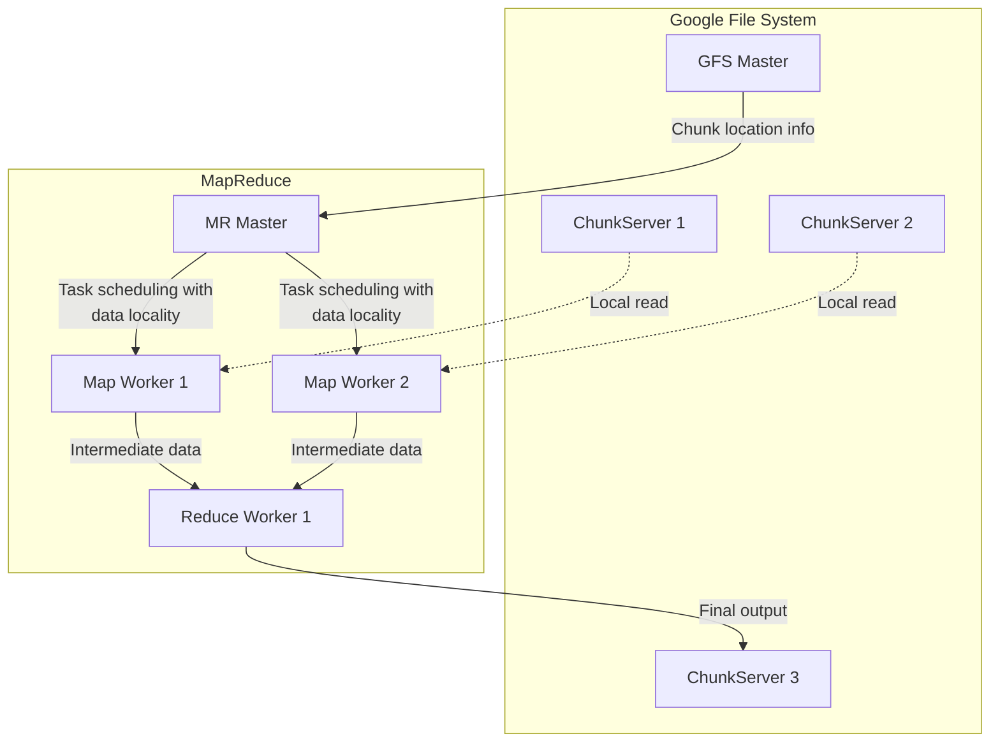

## Introduction — Why MapReduce Was a "Revolution"

In 2004, Jeff Dean and Sanjay Ghemawat from Google presented "[MapReduce: Simplified Data Processing on Large Clusters](https://research.google/pubs/mapreduce-simplified-data-processing-on-large-clusters/)" at OSDI'04. This paper transformed what had been **large-scale distributed processing accessible only to elite engineers** into something **anyone could use by writing just two functions**.

At the time, Google was routinely processing tens of petabytes of data collected by web crawlers. Index building, PageRank computation, access log analysis — all of these required distributing work across thousands of machines, but each time, engineers faced the same problems:

- **Data partitioning and distribution**: How to evenly distribute data across machines?
- **Parallel execution control**: How to coordinate thousands of processes?
- **Fault recovery**: What happens when a machine dies (and they die daily)?
- **Network bandwidth optimization**: How to efficiently move terabytes of data?

This infrastructure code was **completely unrelated to the computation logic** yet constituted the majority of the codebase. MapReduce's brilliant insight was: "Push all this plumbing into a framework and let programmers write only the essential computation."

<MapReduceTimeline />

## The World Before MapReduce

To understand MapReduce's innovation, we need to understand how painful distributed processing was before it.

### The MPI (Message Passing Interface) Era

In the early 2000s, MPI was the tool for large-scale computation. MPI is powerful but demands **everything** from the programmer:

```c
// Word Count with MPI (pseudocode) — hellish complexity
MPI_Init(&argc, &argv);
MPI_Comm_rank(MPI_COMM_WORLD, &rank);
MPI_Comm_size(MPI_COMM_WORLD, &size);

// Manually partition data
if (rank == 0) {
    // Master reads file and sends chunks to each worker
    for (int i = 1; i < size; i++) {
        MPI_Send(chunk[i], chunk_size, MPI_CHAR, i, 0, MPI_COMM_WORLD);
    }
}

// Each worker processes locally
MPI_Recv(my_chunk, chunk_size, MPI_CHAR, 0, 0, MPI_COMM_WORLD, &status);
local_count = count_words(my_chunk);

// Aggregate results to master — how many ways can this fail?
MPI_Reduce(&local_count, &global_count, 1, MPI_INT, MPI_SUM, 0, MPI_COMM_WORLD);

// Worker dies? → programmer handles it
// Network delay? → programmer handles it
// Data skew? → programmer handles it
MPI_Finalize();
```

This code works, but notice there's **zero fault handling**. In a 1,000-machine cluster, if a single machine fails, you start over. At Google's scale, the assumption that "machines don't fail" doesn't hold.

### Google's Internal Struggles

The MapReduce paper's Introduction describes Google's situation:

> The computations were conceptually straightforward, but the input data was large and had to be distributed across hundreds or thousands of machines in order to finish in a reasonable amount of time. The issues of how to parallelize, distribute data, and handle failures conspired to obscure the original simple computation with large amounts of complex code.
>
> — MapReduce paper, Section 1

This **separation of infrastructure from computation** is the fundamental problem MapReduce solved.

<MapReduceComparison />

## The Programming Model — Beautifully Simple

MapReduce's programming model is inspired by `map` and `fold` (reduce) from functional programming. All computation is expressed as two functions:

```text
map    (k1, v1)       → list(k2, v2)
reduce (k2, list(v2)) → list(k3, v3)
```

### The map Function

**Input**: A key-value pair `(k1, v1)` (e.g., filename and contents)

**Output**: A list of intermediate key-value pairs `list(k2, v2)`

**Responsibility**: Extract relevant information from input data and label it with intermediate keys

### The reduce Function

**Input**: An intermediate key and all values associated with that key `(k2, list(v2))`

**Output**: The final result `list(k3, v3)`

**Responsibility**: Aggregate values associated with the same key to produce the final result

### Word Count — The "Hello, World!" of MapReduce

The most famous MapReduce program is Word Count. It appears as the first example in Google's paper:

```python
# map function
def map(filename: str, contents: str):
    for word in contents.split():
        emit(word, 1)

# reduce function
def reduce(word: str, counts: list[int]):
    emit(word, sum(counts))
```

Just **6 lines**. These 6 lines can process petabytes of data across thousands of machines in parallel. Distribution, fault recovery, and data transfer are all handled by the framework.

<MapReduceVisualizer />

### Other Applications

MapReduce isn't just Word Count. This simple model can express a surprisingly diverse range of computations:

#### Distributed Grep

```python
def map(filename, contents):
    for line in contents.split('\n'):
        if pattern.match(line):
            emit(filename, line)

def reduce(filename, lines):
    for line in lines:
        emit(filename, line)
```

#### URL Access Frequency

```python
def map(logfile, log_entry):
    url = parse_url(log_entry)
    emit(url, 1)

def reduce(url, counts):
    emit(url, sum(counts))
```

#### Reverse Link Graph (Foundation of Web Search)

```python
def map(url, page_content):
    for target_url in extract_links(page_content):
        emit(target_url, url)  # target ← source relationship

def reduce(target_url, source_urls):
    emit(target_url, list(source_urls))
```

#### Inverted Index (Heart of Search Engines)

```python
def map(doc_id, contents):
    for word in tokenize(contents):
        emit(word, doc_id)

def reduce(word, doc_ids):
    emit(word, sorted(set(doc_ids)))
```

By changing only the "contents" of the map and reduce functions, entirely different computations can be performed. **No changes to the framework code are needed**.

## Internal Implementation of the Execution Model

Let's examine the MapReduce execution flow in detail, corresponding to Figure 1 of the paper.

### Overall Flow

```mermaid
flowchart LR
    subgraph Input["Input (GFS)"]
        I1[Split 0]
        I2[Split 1]
        I3[Split 2]
        I4[Split ...]
    end

    subgraph MapPhase["Map Phase"]
        M1[Worker 1<br/>map&#40;&#41;]
        M2[Worker 2<br/>map&#40;&#41;]
        M3[Worker 3<br/>map&#40;&#41;]
    end

    subgraph Shuffle["Shuffle"]
        S1[Partition &<br/>Sort by Key]
    end

    subgraph ReducePhase["Reduce Phase"]
        R1[Worker A<br/>reduce&#40;&#41;]
        R2[Worker B<br/>reduce&#40;&#41;]
    end

    subgraph Output["Output (GFS)"]
        O1[Output 0]
        O2[Output 1]
    end

    I1 --> M1
    I2 --> M2
    I3 --> M3
    I4 --> M3

    M1 --> S1
    M2 --> S1
    M3 --> S1

    S1 --> R1
    S1 --> R2

    R1 --> O1
    R2 --> O2
```



### Step 1: Input Splitting

The user program splits input data into M **splits** (typically 16–64 MB). This is aligned with the GFS block size.

**Why 64 MB?** GFS (Google File System) stores data in 64 MB chunks. Aligning the split size with GFS chunks maximizes **data locality** — executing computation on the machine where the data is stored. Reading from local disk is far faster than transferring data over the network.

### Step 2: Master Startup

The framework starts multiple copies of the program on cluster machines. One becomes the **Master**, and the rest are **Workers**. The Master has M Map tasks and R Reduce tasks, which it assigns to idle Workers.

```go
// Master task management (conceptual code)
type Master struct {
    mapTasks    []Task    // M Map tasks
    reduceTasks []Task    // R Reduce tasks
    workers     []Worker  // Available workers
}

type Task struct {
    State    TaskState  // idle | in-progress | completed
    WorkerID int        // Assigned worker
    Input    string     // Input file location
}

func (m *Master) schedule() {
    for _, task := range m.mapTasks {
        if task.State == Idle {
            worker := m.findIdleWorker()
            // Consider data locality: prefer workers with local data
            task.assign(worker)
        }
    }
}
```

### Step 3: Map Phase

A Map Worker reads its input split, applies the user-defined map function to each record, and buffers intermediate key/value pairs in memory.

Buffered pairs are periodically written to local disk, partitioned into R regions by a **partitioning function** (default: `hash(key) mod R`). The locations of intermediate files on local disk are reported to the Master.

```text
Files on Map Worker's disk:
  /tmp/mr-0-0  (Intermediate data for Partition 0)
  /tmp/mr-0-1  (Intermediate data for Partition 1)
  ...
  /tmp/mr-0-(R-1)  (Intermediate data for Partition R-1)
```

**Key point**: Map output is written to **local disk**, not GFS. Intermediate data is temporary and becomes unnecessary after the Shuffle phase delivers it to Reducers. However, this means Map tasks must be re-executed if the Worker fails — a deliberate trade-off.

### Step 4: Shuffle & Sort — The Hidden Heart

The Shuffle phase is the **most expensive and most critical** part of MapReduce.

Reduce Workers use location information from the Master to read the relevant partition data from all Map Workers' local disks via RPC.

Once all data is read, it's sorted by intermediate key. This groups records with the same key together. Sorting is necessary because many different keys typically map to the same Reduce task.

```text
Shuffle network transfer volume:
  M Maps * R Reduce partitions = up to M×R network transfers

  Example: M=10,000, R=5,000
      → up to 50,000,000 network calls
      → this is MapReduce's bottleneck
```

**Combiner optimization**: To reduce network transfer volume, a **Combiner** function can run on the Map side. The Combiner uses the same logic as Reduce but operates on local Map output. For Word Count, instead of sending `(hello, 1), (hello, 1), (hello, 1)` over the network, the Combiner aggregates to `(hello, 3)` before sending.

### Step 5: Reduce Phase

A Reduce Worker iterates over the sorted intermediate data, passing each unique intermediate key and its corresponding set of values to the user's reduce function. The reduce function's output is appended to the final output file.

### Step 6: Completion

After all Map and Reduce tasks complete, the Master wakes up the user program. At this point, MapReduce output is stored in R output files (one per Reduce task).

## Architecture

<MapReduceArchitecture />

## "Pushing Complexity into the Framework" — What It Actually Looks Like in Hadoop's Source Code

When you hear "programmers only write map and reduce," a natural question is: "So what does the framework side look like?" Google's original implementation is proprietary, but Apache Hadoop is fully open source — framework internals included. Looking at the actual code reveals the power of this abstraction.

### The User-Facing API: Mapper.java — ~150 Lines

The [`Mapper.java`](https://github.com/apache/hadoop/blob/trunk/hadoop-mapreduce-project/hadoop-mapreduce-client/hadoop-mapreduce-client-core/src/main/java/org/apache/hadoop/mapreduce/Mapper.java) class that users extend is remarkably simple:

```java
// Mapper.java (Apache Hadoop) — ~150 lines total (including license header and Javadoc)
// https://github.com/apache/hadoop/blob/trunk/.../mapreduce/Mapper.java
public class Mapper<KEYIN, VALUEIN, KEYOUT, VALUEOUT> {

  protected void setup(Context context) throws IOException, InterruptedException {
    // NOTHING
  }

  protected void map(KEYIN key, VALUEIN value, Context context)
      throws IOException, InterruptedException {
    context.write((KEYOUT) key, (VALUEOUT) value);  // default: identity function
  }

  protected void cleanup(Context context) throws IOException, InterruptedException {
    // NOTHING
  }

  public void run(Context context) throws IOException, InterruptedException {
    setup(context);
    try {
      while (context.nextKeyValue()) {
        map(context.getCurrentKey(), context.getCurrentValue(), context);
      }
    } finally {
      cleanup(context);
    }
  }
}
```

For Word Count, the user overrides **just one method**: `map()`.

### What the Framework Hides: MapTask.java — 2,100+ Lines

Behind this simple `map()`, the actual execution is handled by [`MapTask.java`](https://github.com/apache/hadoop/blob/trunk/hadoop-mapreduce-project/hadoop-mapreduce-client/hadoop-mapreduce-client-core/src/main/java/org/apache/hadoop/mapred/MapTask.java). This file is **over 2,100 lines** and includes:

**`MapOutputBuffer` — Circular buffer with sort and spill mechanics** (~800 lines)

```java
// MapOutputBuffer inside MapTask.java (excerpt)
// https://github.com/apache/hadoop/blob/trunk/.../mapred/MapTask.java
public static class MapOutputBuffer<K, V> implements MapOutputCollector<K, V>, IndexedSortable {
    private IntBuffer kvmeta;    // metadata circular buffer overlay
    byte[] kvbuffer;             // main serialization buffer
    int kvstart, kvend, kvindex; // metadata boundary management
    int equator;                 // boundary between meta and data regions
    int bufstart, bufend, bufmark, bufindex, bufvoid; // buffer pointers

    final ReentrantLock spillLock = new ReentrantLock();
    final Condition spillDone = spillLock.newCondition();
    final Condition spillReady = spillLock.newCondition();
    // ...

    // Receives KV pairs emitted from user's map()
    public synchronized void collect(K key, V value, final int partition)
        throws IOException {
      // Check buffer remaining → start spill if needed
      bufferRemaining -= METASIZE;
      if (bufferRemaining <= 0) {
        spillLock.lock();
        try {
          // Coordination logic with spill thread (dozens of lines of buffer mgmt)
          // ...
        } finally {
          spillLock.unlock();
        }
      }
      // Serialize key and value into the buffer
      keySerializer.serialize(key);
      valSerializer.serialize(value);
      // Record metadata (partition, offsets)
      kvmeta.put(kvindex + PARTITION, partition);
      kvmeta.put(kvindex + KEYSTART, keystart);
      // ...
    }

    // Sort and spill to disk
    private void sortAndSpill() throws IOException {
      // QuickSort by partition, then by key
      sorter.sort(MapOutputBuffer.this, mstart, mend, reporter);
      // Write intermediate data per partition in IFile format
      for (int i = 0; i < partitions; ++i) {
        Writer<K, V> writer = new Writer<>(job, partitionOut, keyClass, valClass, codec, ...);
        if (combinerRunner == null) {
          // No combiner: write directly
        } else {
          // With combiner: local aggregation before writing
          combinerRunner.combine(kvIter, combineCollector);
        }
      }
    }

    // Merge multiple spill files
    private void mergeParts() throws IOException {
      // k-way merge of N spill files
      for (int parts = 0; parts < partitions; parts++) {
        RawKeyValueIterator kvIter = Merger.merge(job, rfs, keyClass, valClass, ...);
        // Write merged result to final output file
      }
    }
}
```

`MapTask.java` also contains:

- **`SpillThread`** — Background thread that spills buffer to disk (synchronized with ReentrantLock + Condition)
- **`TrackedRecordReader`** — Counter management for input bytes and records
- **`SkippingRecordReader`** — Skipping and recording bad records
- **`NewOutputCollector`** — Applying the partition function and routing to the buffer
- **`BlockingBuffer`** — Write blocking control during spills

**In other words**: When the user writes `context.write(word, 1)` — a single line — behind the scenes it triggers serialization into a circular buffer → buffer-full detection → background thread sort → per-partition disk write → combiner application → final k-way merge. This is exactly what "pushing complexity into the framework" looks like in practice.

### Line Count Comparison

```text
User code:
  Mapper.java     ~150 lines   (map() itself is 3 lines; rest is Javadoc)
  Reducer.java    ~180 lines   (reduce() itself is 3 lines)

Framework side (Map phase alone):
  MapTask.java    ~2,100 lines  (buffer mgmt, sort, spill, merge)
  ReduceTask.java ~650 lines   (shuffle, sort, merge)
  Merger.java     ~870 lines   (k-way merge sort)
  IFile.java      ~500 lines   (intermediate file format)
  Total           ~4,100+ lines
```

The framework code is **over 12x** the user code, hiding all the complexity of distributed processing. And this only counts the core Map-phase files — job scheduling, Shuffle network transport, and other infrastructure push the ratio far higher.

## Fault Tolerance — Why It Works at Thousands of Machines

What made MapReduce truly revolutionary wasn't just its elegant programming model. It was the **mechanism for ensuring reliability on thousands of commodity machines**.

### Google's Reality

Google's 2003 environment:

- **1,800 machines** per cluster
- Each machine: two 2 GHz Intel Xeon processors (with Hyper-Threading), 4 GB memory, two 160 GB IDE disks
- Network: gigabit Ethernet (1 Gbps)
- Failures are routine (disk, memory, network, etc.)

In a 1,800-machine cluster, **something breaks almost every day**. If you restart the entire job each time, large jobs would never complete.

<FaultToleranceDiagram />

### Worker Failure in Detail

The Master periodically pings all Workers. If no response within a certain time, the Worker is marked as failed.

**When a Map Worker fails:**

1. Its **in-progress** Map tasks are set back to `idle` and rescheduled
2. Its **completed** Map tasks are also set back to `idle` and scheduled for re-execution
3. Why re-execute completed Maps? → Map output is on local disk, which becomes inaccessible when the Worker fails
4. When a Map task is rescheduled from Worker A to Worker B, all Reduce Workers that haven't read that data are notified

**When a Reduce Worker fails:**

1. Only its **in-progress** Reduce tasks are set back to `idle` and rescheduled
2. **Completed** Reduce tasks need no re-execution → output is stored on GFS (the global file system)

### Determinism and Atomic Commits

MapReduce guarantees **atomic commits** for completed Map and Reduce tasks.

- Map tasks: Workers write output to temporary files and report filenames to the Master upon completion. If the Master has already received a completion report, it ignores the duplicate (idempotency)
- Reduce tasks: Workers write output to temporary files and atomically rename them to the final output file upon completion. This leverages the atomicity of GFS rename operations

If map and reduce functions are **deterministic** (always produce the same output for the same input), distributed execution produces the same result as sequential execution. Even for non-deterministic functions, each Reduce task's output is equivalent to some sequential execution.

### Straggler Mitigation: Speculative Execution

One major cause of increased MapReduce job execution time is **stragglers** — the last few tasks running abnormally slowly. Causes vary:

- **Degraded disk**: Read/write speeds drop to 1/10 of normal
- **CPU overload**: Other tasks running on the same machine
- **Network congestion**: Bandwidth saturated between specific racks
- **Not crashed** — so not detected as a failure

Google's solution is **backup tasks** (speculative execution). Near the end of a job (when few tasks remain), backup copies of all remaining in-progress tasks are launched on other machines. Whichever copy finishes first is used.

According to the paper, disabling backup tasks increased job completion time by **44%**.

## Performance Characteristics

Understanding the key factors that determine MapReduce efficiency is important.

### Data Locality

Since network bandwidth is a scarce resource, MapReduce attempts to execute Map tasks on the machine (or rack) where the input data is stored. GFS replicates each chunk (typically to 3 locations), and the Master leverages this replica information for scheduling.

In Google's large-scale MapReduce jobs, the vast majority of input data was read locally, consuming virtually no network bandwidth.

### Combiner and Bandwidth Optimization

The Combiner mentioned earlier dramatically reduces Shuffle phase network transfer:

```text
Without Combiner: Each mapper sends (the, 1) thousands of times
With Combiner: Each mapper pre-aggregates to (the, 4832) before sending

Transfer data volume: Can be reduced by orders of magnitude
```

Combiners can be used when the reduce function satisfies the **commutative** and **associative** laws. Sum, max, and min work, but average cannot be used directly (numerator and denominator must be combined separately).

### Custom Partition Functions

The default partition function is `hash(key) mod R`, but customization may be needed for specific use cases. For example, when output keys are URLs and you want URLs from the same host in the same output file:

```python
def partition(key: str, num_reducers: int) -> int:
    hostname = urlparse(key).hostname
    return hash(hostname) % num_reducers
```

## Experimental Results from the Paper

The paper reports two benchmarks:

### Grep

Searching for a specific 3-character pattern across $10^{10}$ 100-byte records (approximately 1 TB):

- **1,764** Worker machines
- Input split into 15,000 splits of 64 MB ($M = 15000$)
- Startup overhead (program distribution, GFS open, locality info acquisition) took about 60 seconds
- Total completion in **approximately 150 seconds**

### Sort

Sorting $10^{10}$ 100-byte records (approximately 1 TB):

- **1,764** Worker machines
- $M = 15000$, $R = 4000$
- Total completion in **approximately 891 seconds** (about 15 minutes)
- Slower due to straggler effects, but significantly improved by backup tasks

## The Symbiosis with GFS

MapReduce doesn't work in isolation. Its **symbiotic relationship** with the Google File System (GFS) is essential.



### What GFS Provides

1. **Massive storage**: Petabyte-scale using commodity servers
2. **Replication**: Each chunk replicated to 3 locations for availability
3. **Chunk location information**: Data locality info for Map task scheduling
4. **Atomic rename**: Used for atomic commits of Reduce output

### What MapReduce Requires from GFS

- **High-throughput sequential reads and writes** (random access not needed)
- **Efficient append operations** (for intermediate data output)
- **Optimized for large files** (small files are problematic)

This design philosophy was later open-source implemented as **HDFS** (Hadoop Distributed File System) by Yahoo!.

## The Ecosystem MapReduce Created

MapReduce didn't just create one framework. It spawned an **entire big data processing ecosystem**.

### Direct Descendant: Hadoop

In 2006, Doug Cutting and Mike Cafarella open-sourced MapReduce + GFS as Apache Hadoop (with Yahoo!'s support). The HDFS + Hadoop MapReduce combination enabled petabyte-scale data processing for companies beyond Google.

The Hadoop ecosystem expanded rapidly:

- **Hive**: SQL interface on MapReduce (developed by Facebook)
- **Pig**: Dataflow language on MapReduce (developed by Yahoo!)
- **HBase**: Open-source Bigtable implementation (runs on HDFS)
- **ZooKeeper**: Distributed coordination service

### MapReduce's Limitations

Over time, MapReduce's limitations became apparent:

**1. Inefficiency for Iterative Processing**

Machine learning algorithms (k-means, PageRank, gradient descent) are inherently iterative. In MapReduce, each iteration becomes a separate job, with intermediate results written to disk every time:

```text
Iteration 1: Read → Map → Shuffle → Reduce → Write to disk
Iteration 2: Read from disk → Map → Shuffle → Reduce → Write to disk
Iteration 3: Read from disk → Map → Shuffle → Reduce → Write to disk
...
```

Disk I/O on every iteration makes this very slow.

**2. Unsuitability for Interactive Queries**

MapReduce job startup overhead is tens of seconds. Not suitable for ad-hoc queries.

**3. Expressiveness Constraints**

All computation must be fit into a map → shuffle → reduce pipeline. Complex DAGs (Directed Acyclic Graphs) must be expressed as chains of multiple MapReduce jobs, which is inefficient.

**4. Fixed Shuffle Pattern**

All Map output must go through Shuffle. Overhead occurs even when unnecessary.

### Successor Technologies

#### Apache Spark (2010–)

Developed at UC Berkeley's AMPLab, Spark introduced **RDD (Resilient Distributed Dataset)**, enabling intermediate data to be kept in memory:

```python
# Word Count with Spark — data stays in memory
text = sc.textFile("hdfs://input")
counts = text.flatMap(lambda line: line.split()) \
             .map(lambda word: (word, 1)) \
             .reduceByKey(lambda a, b: a + b)
counts.saveAsTextFile("hdfs://output")
```

- **10–100x** speedup for iterative processing
- DAG-based execution engine (not a fixed map → reduce pipeline)
- Interactive shell (Spark Shell) for ad-hoc queries

#### Apache Flink (2014–)

Native stream processing support. Treats batch processing as a special case of stream processing.

#### Google Cloud Dataflow / Apache Beam (2014–2016)

Developed by Google itself as MapReduce's successor (Dataflow SDK 2014, Apache Beam initial release 2016). Unified model for batch and streaming:

```python
# Apache Beam — same code for batch and stream
import apache_beam as beam

with beam.Pipeline() as p:
    (p
     | beam.io.ReadFromText('input.txt')
     | beam.FlatMap(lambda line: line.split())
     | beam.combiners.Count.PerElement()
     | beam.io.WriteToText('output'))
```

## MapReduce's Intellectual Legacy

MapReduce is technically legacy, but its **ideas** are deeply embedded in modern data processing infrastructure:

### 1. Democratization Through Abstraction

"Push distributed processing complexity into the framework and show users only a simple interface."

This philosophy has been inherited by Spark, Flink, Beam, and even general-purpose orchestrators like Kubernetes.

### 2. The Data Locality Principle

"Bring computation to data, not data to computation."

In the cloud era, compute and storage tend to be separated, but this principle remains fundamental to performance tuning.

### 3. Failure Is the Norm, Not the Exception

"In large-scale systems, failures will happen. Design for failure from the start."

This thinking later became the philosophy of Google's SRE (Site Reliability Engineering) and evolved into approaches like Netflix's Chaos Monkey.

### 4. Scalability of Simple Models

"A constrained simple model scales better than a complex model that can do everything."

MapReduce doesn't allow arbitrary communication patterns like MPI. Instead, this gives the framework much more room for optimization.

## Conclusion

MapReduce was published by Google in 2004 and **democratized large-scale data processing on commodity hardware**.

- **Programming model**: Express distributed computation with just `map()` and `reduce()`
- **Implementation**: Master-Worker architecture, GFS integration, automatic splitting and scheduling
- **Fault tolerance**: Automatic re-execution on Worker failure, speculative execution for stragglers
- **Historical significance**: Sparked the Hadoop ecosystem and ushered in the Big Data era

While it has been superseded by Spark and Flink today, the principles MapReduce established — **separation of computation from infrastructure**, **design for failure**, and **scaling through simple abstractions** — remain the foundation of distributed systems design in 2026.

## References

- Dean, J., & Ghemawat, S. (2004). [MapReduce: Simplified Data Processing on Large Clusters](https://research.google/pubs/mapreduce-simplified-data-processing-on-large-clusters/). OSDI'04.
- Ghemawat, S., Gobioff, H., & Leung, S.-T. (2003). [The Google File System](https://research.google/pubs/the-google-file-system/). SOSP'03.
- Zaharia, M., et al. (2010). [Spark: Cluster Computing with Working Sets](https://www.usenix.org/legacy/event/hotcloud10/tech/full_papers/Zaharia.pdf). HotCloud'10.
- White, T. (2015). *Hadoop: The Definitive Guide*. O'Reilly Media.
