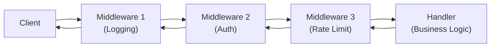
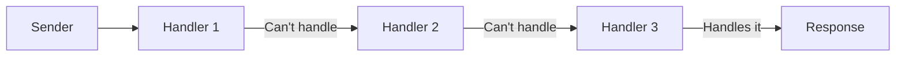
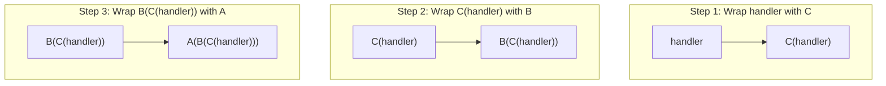
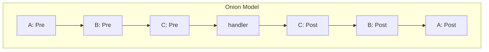
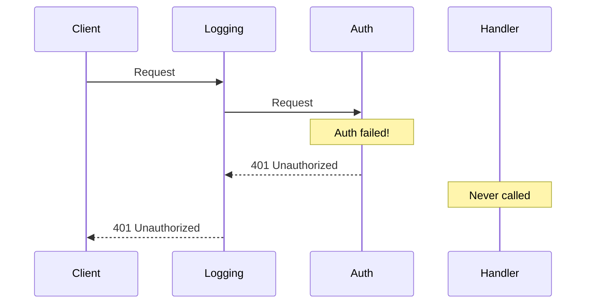
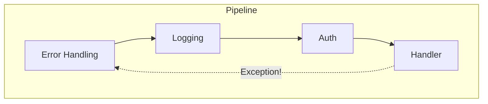

## Introduction

Express.js's `next()`, Django's `get_response`, ASP.NET Core's `Use()` / `Run()`, Go's `http.Handler` wrapper — across the web framework landscape, virtually every framework employs an architectural pattern called the "middleware chain."

A middleware chain is a mechanism that lets you **plug in and remove processing steps** (authentication, logging, error handling, etc.) from the HTTP request/response pipeline. If you are just using a framework, knowing the surface API is sufficient. But to truly understand **why you need to call `next()`** or **why middleware registration order matters**, the best approach is to **build one yourself**.

In this article, we will **build a middleware chain from scratch in Python** and thoroughly understand its design principles. After implementing it, we will look at the actual middleware APIs of Express.js, Django, ASP.NET Core, and Go, and you will be able to recognize: "this `next()` is the exact mechanism I built."

### Topics Covered

1. The core of middleware chains — function composition and what `next` really is
2. Relationship to GoF design patterns (Chain of Responsibility, Decorator)
3. Building from scratch in Python
4. The onion model — the symmetry of request and response
5. Short-circuiting — early termination of the pipeline
6. Error-handling middleware
7. Middleware composition and execution order
8. Real-world framework comparison (Express.js / Django / ASP.NET Core / Go)
9. Testing strategies

### Target Audience

- Developers who have used middleware in web frameworks but want to deeply understand the internals
- Anyone who wants to learn design patterns through hands-on implementation
- Readers who understand basic Python (functions, classes, decorators)

### A World Without Middleware — The Motivating Problem

To appreciate the value of middleware chains, let us first imagine a world without them.

```python
def handle_users(request):
    # Logging (copy-paste 1/3)
    print(f"{request.method} {request.path}")
    # Auth check (copy-paste 1/3)
    if "Authorization" not in request.headers:
        return Response(status=401, body="Unauthorized")
    # Error handling (copy-paste 1/3)
    try:
        return Response(status=200, body="User list")
    except Exception:
        return Response(status=500, body="Internal Server Error")


def handle_orders(request):
    # Logging (copy-paste 2/3)
    print(f"{request.method} {request.path}")
    # Auth check (copy-paste 2/3)
    if "Authorization" not in request.headers:
        return Response(status=401, body="Unauthorized")
    # Error handling (copy-paste 2/3)
    try:
        return Response(status=200, body="Order list")
    except Exception:
        return Response(status=500, body="Internal Server Error")


def handle_products(request):
    # Logging (copy-paste 3/3)
    print(f"{request.method} {request.path}")
    # Auth check (copy-paste 3/3)
    if "Authorization" not in request.headers:
        return Response(status=401, body="Unauthorized")
    # Error handling (copy-paste 3/3)
    try:
        return Response(status=200, body="Product list")
    except Exception:
        return Response(status=500, body="Internal Server Error")
```

In this example, <strong>cross-cutting concerns</strong> — logging, authentication, and error handling — are copy-pasted into every handler. Three handlers might be tolerable, but what happens when you have 50 or 100?

- Changing the log format requires grepping and modifying every handler
- A bug in auth logic must be fixed in every handler identically
- Every new handler must copy these boilerplate blocks (with risk of forgetting)

A middleware chain fundamentally solves this by <strong>separating cross-cutting concerns from handlers</strong> and consolidating them into a single pipeline. Each handler can then focus exclusively on its own business logic:

```python
# With a middleware chain, handlers contain only business logic
def handle_users(request):
    return Response(status=200, body="User list")

def handle_orders(request):
    return Response(status=200, body="Order list")

def handle_products(request):
    return Response(status=200, body="Product list")

# Cross-cutting concerns are defined once as middleware
app = compose(router, [error_handling, logging, auth])
```

Why this separation of concerns works, and exactly how it is achieved — that is what we will discover by building one from scratch.

## Chapter 1: What Is Middleware?

### Basic Definition

Middleware is a **processing layer** that sits between the request and the response.

- It receives a request
- It performs some processing (logging, authentication, header manipulation, etc.)
- It either passes processing to the next middleware or generates a response itself

The Express.js official documentation lists four capabilities of middleware:

1. Execute any code
2. Make changes to the request and response objects
3. End the request-response cycle
4. Call the next middleware function in the stack

### Why "Chain"?

Multiple middlewares are **linked in sequence**, and the request passes through them from first to last. Each middleware can choose to either "call the next middleware (`next()`)" or "return a response itself (short-circuit)."



Notice that the arrows go **both directions**. The request flows left to right, and the response flows right to left. This is the essence of the middleware chain, and it is why it is called the **onion model**.

## Chapter 2: Design Pattern Roots

### GoF's Chain of Responsibility Pattern

The middleware chain is rooted in the GoF (Gang of Four) <strong>Chain of Responsibility pattern</strong>. Its definition is:

> "Avoid coupling the sender of a request to its receiver by giving more than one object a chance to handle the request. Chain the receiving objects and pass the request along the chain until an object handles it." — Gang of Four, Design Patterns (1994)



However, there is an important difference between the GoF definition and web middleware.

| Property | GoF Chain of Responsibility | Web Middleware Chain |
|----------|---------------------------|---------------------|
| Number of handlers that process | Exactly one in the chain | All can participate |
| Processing direction | Unidirectional (request only) | Bidirectional (request + response) |
| Meaning of delegation | "I cannot handle this" | "Proceed to next step" |

### Similarity to the Decorator Pattern

As Wikipedia notes, Chain of Responsibility is structurally nearly identical to the <strong>Decorator pattern</strong>. In the Decorator pattern, each decorator adds behavior to its wrapped target and delegates processing. Web middleware does exactly this — "pre-processing → delegation → post-processing."

In other words, web middleware chains are a <strong>hybrid of Chain of Responsibility and Decorator</strong>.

## Chapter 3: The Core Abstraction — What `next` Really Is

### `next` Is Function Composition

The essence of a middleware chain can be expressed in one phrase: **function composition**.

Each middleware receives a function representing "the next processing step" and chooses whether or not to call it. "The next processing step" is "all subsequent middlewares + the final handler" collapsed into a single function.

Here is the simplest expression in Python:

```python
from __future__ import annotations

from dataclasses import dataclass, field
from collections.abc import Callable


# ──────────────────────────────────────────────
# Request and Response type definitions
# ──────────────────────────────────────────────

@dataclass
class Request:
    """A simple data class mimicking an HTTP request."""
    method: str = "GET"
    path: str = "/"
    headers: dict[str, str] = field(default_factory=dict)
    body: str = ""


@dataclass
class Response:
    """A simple data class mimicking an HTTP response."""
    status: int = 200
    headers: dict[str, str] = field(default_factory=dict)
    body: str = ""


# ──────────────────────────────────────────────
# Type aliases
# ──────────────────────────────────────────────

# Handler: a function that takes a request and returns a response
Handler = Callable[[Request], Response]

# Middleware: a function that takes a handler and returns a new handler
Middleware = Callable[[Handler], Handler]
```

This is the single most important point:

- `Handler` is a "request → response" function
- `Middleware` is a **higher-order function** that "takes a handler and returns a new handler"

Let us see what the `Middleware` signature `Callable[[Handler], Handler]` means in practice.

### Writing the First Middleware

Let us implement a logging middleware:

```python
def logging_middleware(next_handler: Handler) -> Handler:
    """Middleware that logs requests and responses."""
    def handler(request: Request) -> Response:
        # ── Pre-processing (before the request reaches the handler) ──
        print(f"--> {request.method} {request.path}")

        # ── Call next ──
        response = next_handler(request)

        # ── Post-processing (before the response reaches the client) ──
        print(f"<-- {response.status}")

        return response

    return handler
```

Understanding the structure of this function is the key to understanding the entire middleware chain:

1. It receives `next_handler` as an argument (= a reference to "the next step")
2. It defines and returns a new `handler` function
3. Inside that `handler`:
   - It performs pre-processing **before** calling `next_handler`
   - It delegates by calling `next_handler(request)`
   - It performs post-processing **after** `next_handler` returns

`next_handler` is "everything after me — all subsequent middlewares plus the final handler — collapsed into one function." This is what `next` really is.

### Why `next_handler` Stays Alive — The Closure Mechanism

When `logging_middleware(some_handler)` is called, the inner `handler` function is returned. But `handler` does not receive `some_handler` as its own argument. So how can `handler` access `next_handler` when it is called later?

The answer is <strong>closures</strong>. In Python, when an inner function references a variable from an enclosing function, that variable is "captured" by the inner function.

```python
def logging_middleware(next_handler: Handler) -> Handler:
    #           ^ next_handler enters the local scope here

    def handler(request: Request) -> Response:
        #     ^ handler "captures" next_handler
        print(f"--> {request.method} {request.path}")
        response = next_handler(request)  # <- accessed via closure
        print(f"<-- {response.status}")
        return response

    return handler
    # <- even after logging_middleware's stack frame is gone,
    #    handler retains a reference to next_handler
```

This mechanism underpins the entire middleware chain. When `compose` nests each middleware, every layer's `next_handler` holds a closure reference to the next layer. This is how all middlewares link together like a chain.

> <strong>A language-agnostic principle</strong>: Closures are not Python-specific — they exist in virtually every major language: JavaScript, Go, Ruby, Rust, and more. The reason Express.js's `next()` knows about "the next middleware," and the reason Go's `func(http.Handler) http.Handler` can form chains, are both powered by closures.

## Chapter 4: Assembling the Middleware Chain

### The `compose` Function — Building the Chain

To assemble multiple middlewares, we perform a **reverse fold** (reduce). Why reverse? Because the last registered middleware wraps closest to the handler (the innermost layer).

```python
def compose(handler: Handler, middlewares: list[Middleware]) -> Handler:
    """Compose a list of middlewares into a single handler.

    For middlewares = [A, B, C], execution order is A -> B -> C -> handler.
    Internally, handler is wrapped by C, then by B, then by A.
    """
    composed = handler
    for middleware in reversed(middlewares):
        composed = middleware(composed)
    return composed
```

Let us trace what happens step by step:



The resulting `A(B(C(handler)))`, when it receives a request, executes:

1. A pre → B pre → C pre → handler (request direction)
2. handler → C post → B post → A post (response direction)

This is the **onion model**.

### Visualizing the Onion Model



### Tracing the Call Stack

Abstract descriptions only go so far. Let us trace the <strong>call stack</strong> concretely when a single request flows through `compose(handler, [logging, timing, auth])`.

```text
compose execution (wiring phase, before any request):
  composed = handler
  composed = auth(handler)           -> auth_handler   (captures handler via closure)
  composed = timing(auth_handler)    -> timing_handler  (captures auth_handler via closure)
  composed = logging(timing_handler) -> logging_handler (captures timing_handler via closure)

app = logging_handler  <- this is the final entry point
```

```text
app(Request("GET /")) invocation (execution phase):

  logging_handler(request)
  |  print("--> GET /")                      # logging pre-processing
  |
  +-->  timing_handler(request)              # next_handler call
  |    |  start = time.perf_counter()        # timing pre-processing
  |    |
  |    +-->  auth_handler(request)           # next_handler call
  |    |    |  check Authorization header    # auth pre-processing
  |    |    |
  |    |    +-->  handler(request)           # next_handler call
  |    |    |    |  return Response(200)     # business logic executes
  |    |    |    v
  |    |    |  response = Response(200)
  |    |    |  return response               # auth has no post-processing
  |    |    v
  |    |  elapsed_ms = ...                   # timing post-processing
  |    |  response.headers["X-Response-Time"] = "1.23ms"
  |    |  return response
  |    v
  |  print("<-- 200")                        # logging post-processing
  |  return response
  v
```

Key observations:

- The <strong>wiring phase</strong> (`compose` execution) and the <strong>execution phase</strong> (`app(request)` call) are completely separated. Wiring happens once; thousands of requests flow through the same pipeline.
- The call stack forms a <strong>nested structure</strong>. Each middleware's pre-processing runs on the way in, and post-processing runs <strong>on the way out</strong>. This is the reality behind the onion model's "round trip."
- The handler (business logic) sits at the deepest point of the stack. No matter how many middlewares are added, the handler never needs to change.

Django's official documentation uses the onion analogy:

> "You can think of it like an onion: each middleware class is a 'layer' that wraps the view, which is in the core of the onion. If the request passes through all the layers of the onion (each one calls `get_response` to pass the request in to the next layer), all the way to the view at the core, the response will then pass through every layer (in reverse order) on the way back out." — Django documentation

### Running a Test

Let us add an authentication middleware and test the chain:

```python
def auth_middleware(next_handler: Handler) -> Handler:
    """Middleware that checks authentication.

    Returns 401 if no Authorization header (short-circuit).
    """
    def handler(request: Request) -> Response:
        if "Authorization" not in request.headers:
            # Return response without calling next_handler -> short-circuit
            return Response(status=401, body="Unauthorized")

        return next_handler(request)

    return handler


def timing_middleware(next_handler: Handler) -> Handler:
    """Middleware that measures processing time."""
    import time

    def handler(request: Request) -> Response:
        start = time.perf_counter()
        response = next_handler(request)
        elapsed_ms = (time.perf_counter() - start) * 1000
        response.headers["X-Response-Time"] = f"{elapsed_ms:.2f}ms"
        return response

    return handler


# ── Final handler ──
def my_handler(request: Request) -> Response:
    return Response(status=200, body="Hello, World!")


# ── Assemble and run the chain ──
app = compose(my_handler, [logging_middleware, timing_middleware, auth_middleware])

# Request with auth header
print("=== With Auth ===")
resp = app(Request(method="GET", path="/", headers={"Authorization": "Bearer token123"}))
print(f"Body: {resp.body}\n")

# Request without auth header (will be short-circuited)
print("=== Without Auth ===")
resp = app(Request(method="GET", path="/"))
print(f"Status: {resp.status}, Body: {resp.body}")
```

Output:

```text
=== With Auth ===
--> GET /
<-- 200
Body: Hello, World!

=== Without Auth ===
--> GET /
<-- 401
Status: 401, Body: Unauthorized
```

When there is no auth header, `auth_middleware` returns 401 directly without calling `next_handler`. Yet `logging_middleware` and `timing_middleware`'s post-processing still runs — this is the onion model in action. Middlewares outside the short-circuiting middleware always see both the request and the response.

## Chapter 5: Short-Circuiting — Early Pipeline Termination

### What Is Short-Circuiting?

Short-circuiting means a middleware returns a response without calling `next`, **skipping the rest of the pipeline**.

The `auth_middleware` from the previous chapter is exactly this. When authentication fails, there is no point executing the business logic (handler), so the pipeline is terminated there.



Short-circuiting is essential for **avoiding unnecessary work**. The ASP.NET Core documentation emphasizes this:

> "Short-circuiting the request pipeline is often desirable because it avoids unnecessary work. For example, Static File Middleware can act as a terminal middleware by processing a request for a static file and short-circuiting the rest of the pipeline." — ASP.NET Core documentation

### Design Considerations for Short-Circuiting

There are important design considerations when using short-circuiting:

- <strong>Outer middlewares are unaffected</strong> — Post-processing of middlewares outside the one that short-circuited always runs. This is why `logging_middleware`'s log appeared in the previous example.
- <strong>Registration order matters</strong> — If you place auth middleware before logging middleware, failed auth attempts will not be logged. Typically, logging is placed at the outermost position.
- <strong>Do not call `next` after sending a response</strong> — The ASP.NET Core documentation explicitly warns that calling `next` after a response has been sent to the client will cause an exception.

### Practical Example: Cache Middleware

Another case where short-circuiting is particularly effective is <strong>cache middleware</strong>.

```python
class CacheMiddleware:
    """Cache responses and serve subsequent identical requests from cache.

    On cache hit, the rest of the pipeline is completely skipped.
    This avoids DB access and external API calls,
    dramatically reducing response time.
    """

    def __init__(self) -> None:
        self._cache: dict[str, Response] = {}

    def __call__(self, next_handler: Handler) -> Handler:
        def handler(request: Request) -> Response:
            cache_key = f"{request.method}:{request.path}"

            # Cache hit -> short-circuit
            if cache_key in self._cache:
                cached = self._cache[cache_key]
                cached.headers["X-Cache"] = "HIT"
                return cached  # do NOT call next_handler!

            # Cache miss -> continue the pipeline
            response = next_handler(request)

            # Cache only successful responses
            if response.status == 200:
                response.headers["X-Cache"] = "MISS"
                self._cache[cache_key] = response

            return response

        return handler
```

This pattern follows the same idea as ASP.NET Core's Static File Middleware. When a static file or a precomputed response is available, it can be served without executing any of the heavier processing — authentication, authorization, business logic. The middleware ordering guideline "place static files before auth" exists precisely to maximize this short-circuiting benefit.

## Chapter 6: Error-Handling Middleware

### Catching Exceptions with Middleware

Error handling is one of the biggest strengths of middleware chains. Place an error-handling middleware at the outermost layer, and it will catch exceptions from anywhere inside the pipeline.

```python
def error_handling_middleware(next_handler: Handler) -> Handler:
    """Middleware that catches exceptions and converts them to 500 responses."""

    def handler(request: Request) -> Response:
        try:
            return next_handler(request)
        except Exception as exc:
            print(f"[ERROR] {type(exc).__name__}: {exc}")
            return Response(status=500, body="Internal Server Error")

    return handler
```

This simple implementation is remarkably powerful. By wrapping the `next_handler(request)` call in `try/except`, it reliably catches exceptions from any middleware or handler in the pipeline.

### Why Place It at the Outermost Layer?



The reason for placing error-handling middleware at the outermost layer is clear:

1. <strong>Maximum coverage</strong> — At the outermost layer, it catches exceptions from all inner middlewares and handlers.
2. <strong>Consistent error responses</strong> — If exceptions reach the client uncaught, framework-specific error pages or stack traces may be exposed.
3. <strong>Logging integration</strong> — If logging middleware is inside error handling, 500 responses are also logged.

ASP.NET Core's middleware ordering guidelines also instruct placing exception handling middleware at the earliest position in the pipeline.

### Express.js Error-Handling Middleware

Express.js has a unique mechanism for distinguishing error-handling middleware from regular middleware. A function with four arguments (`err, req, res, next`) is recognized as error-handling middleware:

```javascript
// Express.js error-handling middleware
// Identified by having 4 arguments (including err)
app.use((err, req, res, next) => {
  console.error(err.stack)
  res.status(500).send('Something broke!')
})
```

## Chapter 7: Middleware Composition and Execution Order

### Registration Order Determines Everything

Middleware registration order governs the application's **security, performance, and correctness**.

A typical order based on ASP.NET Core documentation (simplified):

1. Exception handling
2. HTTPS redirection
3. Static file serving
4. Routing
5. CORS
6. Authentication
7. Authorization
8. Custom middleware
9. Endpoints

This order has clear rationale:

- <strong>Exception handling first</strong> — To catch exceptions from all subsequent middlewares.
- <strong>Static files early</strong> — CSS and images do not need authentication/authorization; short-circuiting early improves performance.
- <strong>Authentication before authorization</strong> — You must determine "who the user is" before determining "what they can do." There is a logical dependency.

### What Happens When You Get the Order Wrong

Being told "order matters" is not the same as seeing the bugs it causes. Here are two classic failure patterns.

<strong>Failure Pattern 1: Error handling is inside auth</strong>

```python
# Dangerous order: auth is outside error handling
bad_pipeline = compose(my_handler, [
    auth_middleware,              # <- outermost
    error_handling_middleware,    # <- inside
    timing_middleware,
])
```

With this order, if `auth_middleware` itself throws an exception (e.g., unexpected header value during parsing), `error_handling_middleware` is inside auth and <strong>cannot catch the exception</strong>. The unhandled exception leaks a stack trace to the client — a security risk.

```python
# Correct order: error handling at the outermost layer
good_pipeline = compose(my_handler, [
    error_handling_middleware,    # <- outermost: catches all exceptions
    auth_middleware,
    timing_middleware,
])
```

<strong>Failure Pattern 2: Logging is inside auth</strong>

```python
# Problematic order
bad_pipeline = compose(my_handler, [
    auth_middleware,
    logging_middleware,   # <- inside auth
])
```

Requests that fail authentication are short-circuited by `auth_middleware`, so they never reach `logging_middleware`. This means <strong>unauthorized access attempts are never logged</strong> — a critical gap from a security audit perspective.

```python
# Correct order
good_pipeline = compose(my_handler, [
    logging_middleware,   # <- outermost: logs all requests
    auth_middleware,
])
```

As these examples show, middleware registration order is not just configuration — it <strong>defines the security boundaries</strong> of your application.

### Testing Composition — Verifying Execution Order

Let us verify with code how registration order maps to execution order:

```python
def make_trace_middleware(name: str) -> Middleware:
    """Generate a trace middleware for verifying execution order."""

    def middleware(next_handler: Handler) -> Handler:
        def handler(request: Request) -> Response:
            print(f"  [{name}] pre-processing")
            response = next_handler(request)
            print(f"  [{name}] post-processing")
            return response
        return handler

    return middleware


def trace_handler(request: Request) -> Response:
    print(f"  [handler] executing")
    return Response(status=200, body="OK")


# ── Compose in A -> B -> C -> handler order ──
pipeline = compose(trace_handler, [
    make_trace_middleware("A"),
    make_trace_middleware("B"),
    make_trace_middleware("C"),
])

print("Execution order:")
pipeline(Request())
```

Output:

```text
Execution order:
  [A] pre-processing
  [B] pre-processing
  [C] pre-processing
  [handler] executing
  [C] post-processing
  [B] post-processing
  [A] post-processing
```

Pre-processing runs A → B → C (registration order); post-processing runs C → B → A (reverse order) — a perfect demonstration of the onion model.

## Chapter 8: Real-World Framework Comparison

Let us see how the mechanism we built maps to actual frameworks. You will notice the structures are remarkably similar.

### Express.js (Node.js)

In Express.js, middleware is a function receiving `(req, res, next)`. Calling `next()` advances to the next middleware.

```javascript
const express = require('express')
const app = express()

// Middleware 1: Logging
app.use((req, res, next) => {
  console.log(`${req.method} ${req.url}`)
  next()  // Advance to next middleware
})

// Middleware 2: Auth
app.use((req, res, next) => {
  if (!req.headers.authorization) {
    return res.status(401).send('Unauthorized') // Short-circuit
  }
  next()
})

// Handler
app.get('/', (req, res) => {
  res.send('Hello!')
})
```

Mapping to our implementation:
- `next()` = our `next_handler(request)`
- `res.send()` without calling `next()` = short-circuit
- `app.use()` call order = middleware execution order

### Django (Python)

Django middleware is a factory that takes `get_response` and returns a callable. This is virtually identical to our `Middleware = Callable[[Handler], Handler]`.

```python
# Django middleware (function style)
def simple_middleware(get_response):
    # One-time initialization

    def middleware(request):
        # Pre-processing
        response = get_response(request)
        # Post-processing
        return response

    return middleware


# Django middleware (class style)
class SimpleMiddleware:
    def __init__(self, get_response):
        self.get_response = get_response

    def __call__(self, request):
        # Pre-processing
        response = self.get_response(request)
        # Post-processing
        return response
```

From Django's documentation:

> "The `get_response` callable provided by Django might be the actual view (if this is the last listed middleware) or it might be the next middleware in the chain. The current middleware doesn't need to know or care what exactly it is, just that it represents whatever comes next."

This is exactly our `next_handler` — "everything ahead collapsed into one function."

### ASP.NET Core (C#)

ASP.NET Core explicitly builds the pipeline with `Use()` and `Run()`.

```csharp
var app = builder.Build();

// Use(): can call the next middleware
app.Use(async (context, next) =>
{
    Console.WriteLine("Middleware 1: before");
    await next.Invoke(context);
    Console.WriteLine("Middleware 1: after");
});

app.Use(async (context, next) =>
{
    Console.WriteLine("Middleware 2: before");
    await next.Invoke(context);
    Console.WriteLine("Middleware 2: after");
});

// Run(): terminal middleware (does not receive next)
app.Run(async context =>
{
    await context.Response.WriteAsync("Hello!");
});
```

The output of this code is:

```text
Middleware 1: before
Middleware 2: before
Middleware 2: after
Middleware 1: after
```

Pre-processing runs 1 → 2; post-processing runs 2 → 1 — perfectly matching our onion model.

### Go (net/http)

In Go, middleware is expressed as a function that takes an `http.Handler` and returns an `http.Handler`. This is the most direct form of function composition.

```go
func loggingMiddleware(next http.Handler) http.Handler {
    return http.HandlerFunc(func(w http.ResponseWriter, r *http.Request) {
        log.Printf("%s %s", r.Method, r.URL.Path)
        next.ServeHTTP(w, r)  // Advance to next handler
    })
}

func authMiddleware(next http.Handler) http.Handler {
    return http.HandlerFunc(func(w http.ResponseWriter, r *http.Request) {
        if r.Header.Get("Authorization") == "" {
            http.Error(w, "Unauthorized", http.StatusUnauthorized)
            return // Short-circuit
        }
        next.ServeHTTP(w, r)
    })
}

// Assembling the chain
handler := loggingMiddleware(authMiddleware(myHandler))
```

Go's `func(http.Handler) http.Handler` is **type-level identical** to our `Callable[[Handler], Handler]`.

### Framework Comparison Table

| Property | Our Implementation | Express.js | Django | ASP.NET Core | Go net/http |
|----------|-------------------|------------|--------|-------------|-------------|
| Middleware type | `Handler -> Handler` | `(req, res, next) -> void` | `get_response -> callable` | `RequestDelegate -> RequestDelegate` | `Handler -> Handler` |
| Delegation | `next_handler(request)` | `next()` | `get_response(request)` | `next.Invoke(context)` | `next.ServeHTTP(w, r)` |
| Short-circuit | Don't call `next` | `res.send()` without `next()` | Return response without `get_response` | Don't call `next`, or use `Run()` | `return` without calling `next` |
| Composition | `compose()` (reverse fold) | `app.use()` (register order) | `MIDDLEWARE` list (config order) | `app.Use()` / `app.Run()` (register order) | Function nesting |
| Error handling | `try/except` wrapper | 4-arg `(err,req,res,next)` | Exceptions auto-converted to HTTP responses | `UseExceptionHandler()` | `recover()` to catch `panic` |

## Chapter 9: Testing Strategies

### Why Middleware Is Easy to Test

Because middleware is designed as "a function that takes a handler and returns a handler," testing is remarkably simple. Just pass a **mock handler** to the middleware under test to write unit tests.

```python
def test_auth_middleware_rejects_unauthenticated() -> None:
    """Test that requests without auth header get 401."""
    # ── Mock handler (should not be called) ──
    called = False

    def mock_handler(request: Request) -> Response:
        nonlocal called
        called = True
        return Response(status=200, body="OK")

    # ── Apply middleware under test ──
    protected = auth_middleware(mock_handler)

    # ── Test with unauthenticated request ──
    response = protected(Request(method="GET", path="/secret"))

    assert response.status == 401
    assert response.body == "Unauthorized"
    assert not called, "Handler should not be called"


def test_auth_middleware_passes_authenticated() -> None:
    """Test that requests with auth header reach the handler."""
    def mock_handler(request: Request) -> Response:
        return Response(status=200, body="Secret Content")

    protected = auth_middleware(mock_handler)

    response = protected(Request(
        method="GET",
        path="/secret",
        headers={"Authorization": "Bearer token123"},
    ))

    assert response.status == 200
    assert response.body == "Secret Content"


def test_compose_order() -> None:
    """Test that compose runs pre-processing in order, post-processing in reverse."""
    order: list[str] = []

    def make_tracker(name: str) -> Middleware:
        def middleware(next_handler: Handler) -> Handler:
            def handler(request: Request) -> Response:
                order.append(f"{name}:pre")
                response = next_handler(request)
                order.append(f"{name}:post")
                return response
            return handler
        return middleware

    def final_handler(request: Request) -> Response:
        order.append("handler")
        return Response(status=200)

    pipeline = compose(final_handler, [make_tracker("A"), make_tracker("B")])
    pipeline(Request())

    assert order == ["A:pre", "B:pre", "handler", "B:post", "A:post"]
```

Note that we can test middleware behavior through pure function calls without starting an HTTP server. This is a major advantage of the "middleware = higher-order function" design.

## Chapter 10: Class-Based Middleware

### From Functions to Classes

We have been implementing middleware in function style, but when middleware needs to hold internal state (configuration, counters, etc.), class-based implementations are more appropriate. This is why Django supports class-based middleware.

```python
class RateLimitMiddleware:
    """Middleware that limits request count within a time window.

    By using a class, we can hold the request counter
    as an instance variable.
    """

    def __init__(self, max_requests: int = 100, window_seconds: float = 60.0) -> None:
        self.max_requests = max_requests
        self.window_seconds = window_seconds
        self._request_counts: dict[str, list[float]] = {}

    def __call__(self, next_handler: Handler) -> Handler:
        import time

        def handler(request: Request) -> Response:
            client_ip = request.headers.get("X-Forwarded-For", "unknown")
            now = time.time()

            # Remove old entries outside the window
            timestamps = self._request_counts.get(client_ip, [])
            timestamps = [t for t in timestamps if now - t < self.window_seconds]

            if len(timestamps) >= self.max_requests:
                return Response(status=429, body="Too Many Requests")

            timestamps.append(now)
            self._request_counts[client_ip] = timestamps

            return next_handler(request)

        return handler


# Using class-based middleware
rate_limiter = RateLimitMiddleware(max_requests=10, window_seconds=60.0)
app = compose(my_handler, [logging_middleware, rate_limiter, auth_middleware])
```

By implementing the `__call__` method, the class instance becomes callable, conforming to the same `Callable[[Handler], Handler]` type as function-style middleware.

## Conclusion

In this article, we built a middleware chain from scratch in Python and learned the following design principles:

1. <strong>Middleware = Higher-Order Function</strong> — "A function that takes a handler and returns a new handler." `next` is really just the rest of the chain collapsed into a single function.
2. <strong>Onion Model</strong> — Pre-processing runs in registration order; post-processing runs in reverse. Requests and responses pass symmetrically through the middleware stack.
3. <strong>Short-Circuiting</strong> — By returning a response without calling `next`, unnecessary processing is skipped. Post-processing of outer middlewares still runs.
4. <strong>Function Composition</strong> — The `compose` function performs a reverse fold to assemble multiple middlewares into a single handler.
5. <strong>Registration Order Matters</strong> — Security (auth → authorization), performance (early static file serving), and correctness (outermost exception handling) all depend on order.
6. <strong>Testability</strong> — Because middleware is a higher-order function, unit testing requires only passing a mock handler. No HTTP server needed.

Express.js's `next()`, Django's `get_response`, ASP.NET Core's `next.Invoke()`, Go's `next.ServeHTTP()` — the names and syntax differ, but the **underlying design principle is identical**. Having built one yourself, you should now be able to read any framework's middleware documentation and immediately recognize: "that's the mechanism I built."

## References

- [Express.js — Using middleware](https://expressjs.com/en/guide/using-middleware.html)
- [Django — Middleware](https://docs.djangoproject.com/en/5.1/topics/http/middleware/)
- [ASP.NET Core — Middleware](https://learn.microsoft.com/en-us/aspnet/core/fundamentals/middleware/?view=aspnetcore-9.0)
- [Go — Writing Web Applications (net/http)](https://go.dev/doc/articles/wiki/)
- [Gang of Four — Design Patterns: Elements of Reusable Object-Oriented Software (1994)](https://en.wikipedia.org/wiki/Design_Patterns)
- [Chain-of-responsibility pattern — Wikipedia](https://en.wikipedia.org/wiki/Chain-of-responsibility_pattern)
