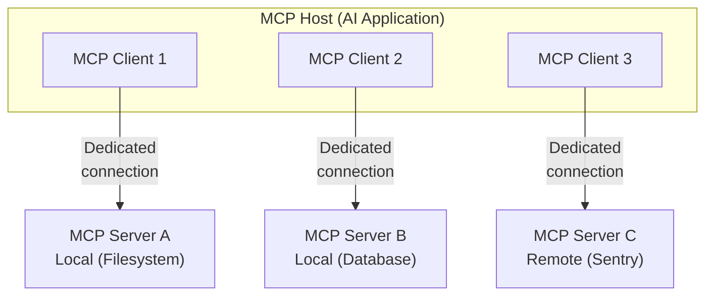
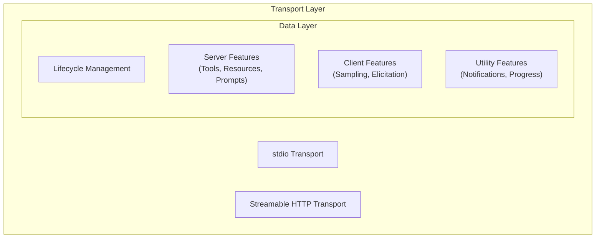
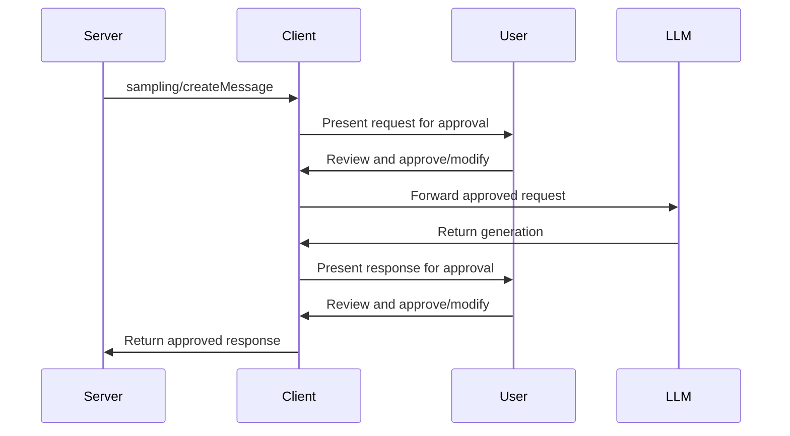
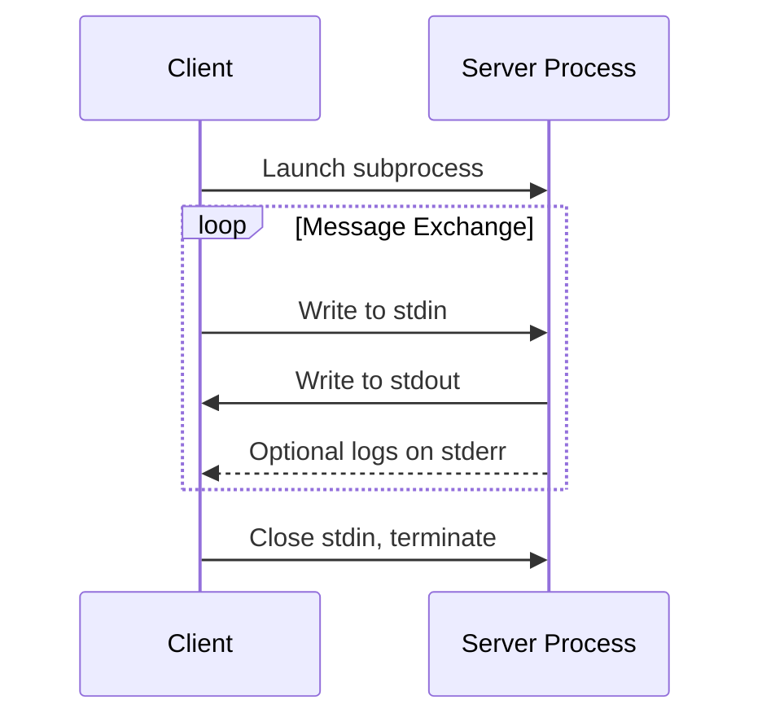
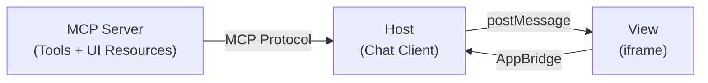
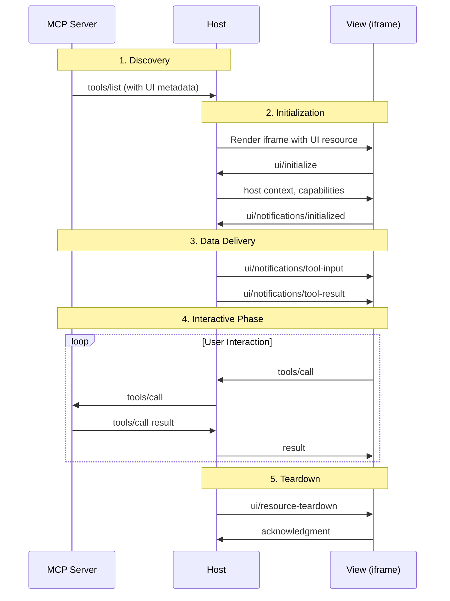

## Introduction — What is MCP?

**Model Context Protocol (MCP)** is an open-source standard for connecting AI applications to external systems. Using MCP, AI applications like Claude or ChatGPT can connect to data sources (local files, databases), tools (search engines, calculators), and workflows (specialized prompts) — enabling them to access key information and perform tasks.

MCP is often compared to a "USB-C port for AI applications." Just as USB-C provides a standardized way to connect electronic devices, MCP provides a standardized way to connect AI applications to external systems.

### A World Without MCP vs. With MCP

Let's consider a concrete example. You're a developer and want to ask your AI assistant: "Errors are spiking in production. Check the latest Sentry errors, fix the relevant source code, and create a PR on GitHub."

**Without MCP**: The AI assistant can't access Sentry data and responds "Sorry, I can't access external systems." You'd need to manually open Sentry, copy error details, fix the code yourself, and create a PR through GitHub's UI.

**With MCP**: The AI assistant retrieves errors via the Sentry MCP Server, reads and writes source code via the Filesystem MCP Server, and creates a PR via the GitHub MCP Server. All of these work through a common protocol called MCP, and you complete the entire workflow with a single prompt.

MCP comprises the following projects:

- [MCP Specification](https://modelcontextprotocol.io/specification/latest) — The protocol specification
- [MCP SDKs](https://modelcontextprotocol.io/docs/sdk) — SDKs for various programming languages
- [MCP Inspector](https://github.com/modelcontextprotocol/inspector) — Development tools
- [MCP Reference Servers](https://github.com/modelcontextprotocol/servers) — Reference implementations

Claude, ChatGPT, Visual Studio Code (GitHub Copilot), Cursor, and many other clients support MCP, forming an ecosystem where you build once and integrate everywhere.

This article provides a comprehensive deep dive based on the MCP specification `2025-06-18`, covering the protocol architecture, the MCP Apps extension, and Microsoft's implementation samples.

---

## Architecture Overview

### Participants

MCP follows a **client-server architecture**. To understand the full picture, let's organize the three key participants.

| Participant | Role | Examples |
|---|---|---|
| **MCP Host** | The AI application itself. Creates and manages one or more MCP Clients | Claude Desktop, VS Code, ChatGPT |
| **MCP Client** | A component that maintains a connection to an MCP Server and obtains context | Objects instantiated within the Host |
| **MCP Server** | A program that provides context and functionality to MCP Clients | Filesystem Server, Sentry MCP Server |

The key point is that **the Host creates one MCP Client instance for each MCP Server**.

Concretely, consider a scenario where VS Code (Host) has 3 MCP Servers configured in `.vscode/mcp.json`:

```json
// .vscode/mcp.json configuration example
{
  "servers": {
    "filesystem": {
      "command": "npx",
      "args": ["-y", "@modelcontextprotocol/server-filesystem", "/workspace"]
    },
    "github": {
      "command": "npx",
      "args": ["-y", "@modelcontextprotocol/server-github"],
      "env": { "GITHUB_TOKEN": "${env:GITHUB_TOKEN}" }
    },
    "sentry": {
      "type": "http",
      "url": "https://mcp.sentry.dev/sse"
    }
  }
}
```

VS Code reads this configuration and creates independent MCP Client objects for `filesystem`, `github`, and `sentry` respectively. The first two are launched as local processes via stdio transport, while `sentry` connects remotely via Streamable HTTP.



Despite being called "servers," MCP Servers don't necessarily run remotely. With the **stdio transport**, they run as subprocesses on the local machine. With the **Streamable HTTP transport**, they operate as remote servers.

### Two Layers

MCP is conceptually composed of two layers.



The **Data Layer (inner)** implements a JSON-RPC 2.0-based exchange protocol defining message structure and semantics. It includes lifecycle management, server features (Tools, Resources, Prompts), client features (Sampling, Elicitation), and utility features (notifications, progress tracking).

The **Transport Layer (outer)** manages communication channels and authentication between clients and servers. It handles connection establishment, message framing, and secure communication.

---

## Data Layer — JSON-RPC 2.0 Protocol

MCP uses [JSON-RPC 2.0](https://www.jsonrpc.org/) as its underlying RPC protocol. Clients and servers send requests to each other and respond accordingly. Notifications are used when no response is required.

### Lifecycle Management

MCP is a **stateful protocol** that requires lifecycle management. The purpose of lifecycle management is to **negotiate the capabilities** that both client and server support.

Use the interactive visualization below to follow the MCP initialization, tool discovery, execution, and notification flow step by step.

<MCPProtocolVisualizer />

#### Initialization Sequence Details

The initialization process serves three critical purposes.

**1. Protocol Version Negotiation**

The `protocolVersion` field (e.g., `"2025-06-18"`) ensures both client and server use compatible protocol versions. If a mutually compatible version cannot be negotiated, the connection should be terminated.

**2. Capability Discovery**

The `capabilities` object allows each party to declare what features they support.

```json
// Client capabilities example
{
  "capabilities": {
    "elicitation": {},
    "sampling": {}
  }
}
```

```json
// Server capabilities example
{
  "capabilities": {
    "tools": { "listChanged": true },
    "resources": { "subscribe": true },
    "prompts": { "listChanged": true }
  }
}
```

**3. Identity Exchange**

The `clientInfo` and `serverInfo` objects provide identification and versioning information for debugging and compatibility purposes.

After successful initialization, the client sends `notifications/initialized` to indicate it's ready. This is a JSON-RPC 2.0 notification message with no `id` field, and no response is expected.

---

## Server Primitives — Tools, Resources, Prompts

MCP defines **three core primitives** that servers can expose. These specify the types of contextual information that can be shared with AI applications and the range of actions that can be performed.

| Primitive | Controlled By | Description | Typical Use |
|---|---|---|---|
| **Tools** | Model (LLM) | Executable functions the LLM can invoke | API calls, DB queries, file operations |
| **Resources** | Application | Data sources providing contextual information | File contents, DB schemas, API responses |
| **Prompts** | User | Reusable templates for structuring LLM interactions | System prompts, few-shot examples |

Each primitive has associated methods for discovery (`*/list`), retrieval (`*/get` or `*/read`), and sometimes execution (`tools/call`).

### Tools — The LLM's Hands

Tools are functions the LLM can call, and the most important primitive in MCP. Each tool is uniquely identified by a name and includes metadata describing its schema.

Let's consider a concrete example. When a user types "What's the weather in Tokyo today?", here's what happens internally:

1. The Host passes the "list of available Tools" and the user's message to the LLM
2. The LLM decides it should call the `get_weather` Tool and generates the arguments `{"location": "Tokyo"}`
3. The Host sends `tools/call` via the MCP Client
4. The MCP Server queries a weather API and returns the result
5. The Host passes the result to the LLM, which responds to the user in natural language

In this process, the LLM reads `get_weather`'s `inputSchema` to understand that `location` is a required string parameter, and automatically generates the appropriate arguments.

#### Tools Capability Declaration

```json
{
  "capabilities": {
    "tools": {
      "listChanged": true
    }
  }
}
```

`listChanged` indicates whether the server will emit notifications when the list of available tools changes.

#### Tool Definition

Each tool object includes the following fields:

- `name` — Unique identifier within the server's namespace
- `title` — Optional human-readable display name
- `description` — Detailed explanation of what the tool does
- `inputSchema` — JSON Schema defining expected input parameters
- `outputSchema` — Optional JSON Schema defining expected output structure
- `annotations` — Optional properties describing tool behavior

```json
{
  "name": "get_weather",
  "title": "Weather Information Provider",
  "description": "Get current weather information for a location",
  "inputSchema": {
    "type": "object",
    "properties": {
      "location": {
        "type": "string",
        "description": "City name or zip code"
      }
    },
    "required": ["location"]
  }
}
```

#### Tool Result Content Types

Tool execution results are returned in a `content` array, supporting multiple content types.

| Content Type | Description |
|---|---|
| `text` | Plain text |
| `image` | Base64-encoded image data |
| `audio` | Base64-encoded audio data |
| `resource_link` | URI link to a resource |
| `resource` | Embedded resource |

Additionally, the `structuredContent` field enables structured JSON output. When an `outputSchema` is defined, the server MUST provide structured results conforming to that schema.

#### Error Handling

Tools use two error reporting mechanisms:

1. **Protocol Errors** — Standard JSON-RPC errors for unknown tools, invalid arguments, etc.
2. **Tool Execution Errors** — Business errors reported in tool results with `isError: true`

```json
{
  "content": [
    {
      "type": "text",
      "text": "Failed to fetch weather data: API rate limit exceeded"
    }
  ],
  "isError": true
}
```

#### Security Considerations

- Servers MUST validate all tool inputs
- Servers MUST implement proper access controls
- Servers MUST rate limit tool invocations
- Servers MUST sanitize tool outputs
- Clients SHOULD prompt for user confirmation on sensitive operations
- Clients SHOULD show tool inputs to the user before calling the server — to avoid malicious or accidental data exfiltration
- Clients SHOULD validate tool results before passing to LLM
- Clients SHOULD implement timeouts for tool calls
- Clients SHOULD log tool usage for audit purposes

### Resources — Providing Context Data

Resources are a standardized way for servers to expose data to clients. They provide data that serves as context for language models — files, database schemas, application-specific information. Each resource is uniquely identified by a **URI**.

Let's understand the difference from Tools with a concrete example. When a database MCP Server exists, **Resources** provide read-only context like "table listings and schema information," while **Tools** provide actions like "executing SQL queries."

- `db://schema/users` → Resource (returns column definitions for the users table)
- `run_query({"sql": "SELECT * FROM users LIMIT 10"})` → Tool (executes a query and returns results)

The LLM naturally combines these: first understanding the schema via Resources, then executing queries via Tools.

#### Resources Capability Declaration

```json
{
  "capabilities": {
    "resources": {
      "subscribe": true,
      "listChanged": true
    }
  }
}
```

- `subscribe` — Whether clients can subscribe to change notifications for individual resources
- `listChanged` — Whether the server will emit notifications when the available resources list changes

#### Listing and Reading Resources

```json
// resources/list response
{
  "resources": [
    {
      "uri": "file:///project/src/main.rs",
      "name": "main.rs",
      "title": "Rust Software Application Main File",
      "description": "Primary application entry point",
      "mimeType": "text/x-rust"
    }
  ]
}
```

```json
// resources/read response
{
  "contents": [
    {
      "uri": "file:///project/src/main.rs",
      "mimeType": "text/x-rust",
      "text": "fn main() {\n    println!(\"Hello world!\");\n}"
    }
  ]
}
```

#### Resource Templates

Resource templates allow servers to expose parameterized resources using [URI Templates (RFC 6570)](https://datatracker.ietf.org/doc/html/rfc6570).

```json
{
  "uriTemplate": "weather://forecast/{city}/{date}",
  "name": "weather-forecast",
  "title": "Weather Forecast",
  "description": "Get weather forecast for any city and date",
  "mimeType": "application/json"
}
```

#### Subscriptions

Clients can subscribe to changes for specific resources and receive notifications when they change.

```json
// resources/subscribe request
{ "uri": "file:///project/src/main.rs" }
```

```json
// Change notification
{
  "jsonrpc": "2.0",
  "method": "notifications/resources/updated",
  "params": { "uri": "file:///project/src/main.rs" }
}
```

#### Common URI Schemes

| Scheme | Use |
|---|---|
| `https://` | Web resources (when clients can fetch directly) |
| `file://` | Filesystem-like resources |
| `git://` | Git version control integration |
| Custom | Any scheme conforming to RFC 3986 |

#### Annotations

Resources and content blocks support optional annotations:

- `audience` — Array indicating intended recipients (`"user"` or `"assistant"`)
- `priority` — Number from 0.0 to 1.0 indicating importance
- `lastModified` — ISO 8601 timestamp of last modification

### Prompts — Templating Interactions

Prompts are a mechanism for servers to expose structured prompt templates to clients. They provide structured messages and instructions for interacting with language models.

Prompts are designed to be **user-controlled**, requiring explicit invocation rather than automatic triggering. They are typically exposed through UI patterns like slash commands or command palettes.

For example, suppose a GitHub MCP Server provides a `/code-review` Prompt. When a user types `/code-review` in the chat, the client displays an argument input UI saying "Please enter your code," and the entered code is included in a structured message passed to the LLM. The key difference from Tools is that Prompts are "explicitly chosen by the user" rather than "automatically invoked by the LLM."

```json
{
  "name": "code_review",
  "title": "Request Code Review",
  "description": "Asks the LLM to analyze code quality and suggest improvements",
  "arguments": [
    {
      "name": "code",
      "description": "The code to review",
      "required": true
    }
  ]
}
```

The result of `prompts/get` includes a list of messages to pass to the LLM. Each message has a `role` (`"user"` or `"assistant"`) and `content` that can be text, image, audio, or embedded resources.

---

## Client Features — Sampling, Elicitation, Roots

MCP allows not only servers but also clients to expose features. This enables MCP server developers to build richer interactions.

### Sampling — LLM Calls from the Server

Sampling is a mechanism that allows MCP servers to **access the LLM through the client**. When server developers want to use an LLM but remain model-independent, they can request language model completions from the client's AI application via the `sampling/createMessage` method.

Let's consider a concrete example. Suppose a flight search MCP Server has a Tool called `findBestFlight`. When a user asks "Book me the best flight to Barcelona next month," the Tool queries airline APIs and retrieves 47 flight options. However, deciding "which is better: a cheap red-eye or a convenient morning flight" requires AI analysis.

At this point, the server sends a Sampling request containing the 47 flight data points to the client. The client's LLM performs the analysis and returns the top 3 recommendations. The server itself doesn't need an LLM SDK or API key — it "borrows" the client-side model. This is the core value of Sampling.



A key design feature is incorporating **human-in-the-loop** at multiple checkpoints. Users can review and modify both the initial request and the generated response.

#### Model Preferences (Abstracting Model Selection)

Since servers and clients may use different AI providers, servers can't directly request a specific model by name. MCP implements a preference system combining **abstract capability priorities** with optional **model hints**.

```json
{
  "hints": [
    { "name": "claude-sonnet-4-20250514" },
    { "name": "claude" }
  ],
  "costPriority": 0.3,
  "speedPriority": 0.2,
  "intelligencePriority": 0.9
}
```

- `costPriority` — Importance of minimizing costs (0–1)
- `speedPriority` — Importance of low latency (0–1)
- `intelligencePriority` — Importance of advanced capabilities (0–1)

Hints are treated as substrings that can match model names flexibly, and clients MAY map hints to equivalent models from different providers.

### Elicitation — Requesting Information from Users

Elicitation (newly introduced in specification `2025-06-18`) is a structured way for servers to request additional information from users during interactions. Instead of requiring all information upfront or failing when data is missing, servers can pause operations to request specific inputs from users.

```json
// elicitation/create request example
{
  "jsonrpc": "2.0",
  "id": 1,
  "method": "elicitation/create",
  "params": {
    "message": "Please confirm your Barcelona vacation booking details:",
    "requestedSchema": {
      "type": "object",
      "properties": {
        "confirmBooking": {
          "type": "boolean",
          "description": "Confirm the booking (Flights + Hotel = $3,000)"
        },
        "seatPreference": {
          "type": "string",
          "enum": ["window", "aisle", "no preference"],
          "description": "Preferred seat type for flights"
        }
      },
      "required": ["confirmBooking"]
    }
  }
}
```

Elicitation responses use a three-action model:

| Action | Meaning |
|---|---|
| `accept` | User approved and submitted data |
| `decline` | User explicitly declined the request |
| `cancel` | User dismissed without making an explicit choice |

The `requestedSchema` is restricted to **flat objects with primitive properties only** to simplify implementation. Supported schema types are `string`, `number` (`integer`), and `boolean`. The `string` type can also be used with `enum` / `enumNames` properties to support enumerated inputs.

#### Security Constraints

- Servers MUST NOT request sensitive information through elicitation
- Clients SHOULD clearly indicate which server is requesting information
- Clients SHOULD implement rate limiting

### Roots — Communicating Filesystem Boundaries

Roots are a mechanism for clients to communicate filesystem access boundaries to servers. They consist of file URIs using the `file://` scheme that indicate directories where servers can operate.

```json
{
  "uri": "file:///Users/agent/travel-planning",
  "name": "Travel Planning Workspace"
}
```

Roots are a **coordination mechanism**, not a security boundary. The specification states that servers "SHOULD respect root boundaries," not "MUST enforce" them. Actual security must be enforced at the OS level via file permissions and/or sandboxing.

---

## Transport Layer

MCP uses JSON-RPC to encode messages. Messages MUST be UTF-8 encoded. Two standard transport mechanisms are currently defined.

### stdio Transport

With the **stdio transport**, the client launches the MCP server as a subprocess. A typical example is VS Code launching `npx @modelcontextprotocol/server-filesystem /workspace` as a child process and exchanging JSON-RPC messages via that process's stdin/stdout. No network configuration or authentication is needed, making it ideal for local development.

- The server reads JSON-RPC messages from `stdin` and sends messages to `stdout`
- Messages are delimited by newlines and MUST NOT contain embedded newlines
- The server MAY write UTF-8 strings to `stderr` for logging purposes
- No network overhead — optimal for local process communication



### Streamable HTTP Transport

With the **Streamable HTTP transport**, the server operates as an independent process that can handle multiple client connections. A typical example is a remote MCP Server provided by a SaaS like Sentry or Stripe, running in the cloud with multiple clients connecting simultaneously. The server provides a single HTTP endpoint path (e.g., `https://mcp.sentry.dev/sse`) supporting both POST and GET methods.

#### Client → Server: HTTP POST

Every JSON-RPC message from the client is a new HTTP POST request to the MCP endpoint.

- The `Accept` header must include both `application/json` and `text/event-stream`
- The POST body is a single JSON-RPC request, notification, or response
- The server returns either `Content-Type: text/event-stream` (SSE stream) or `Content-Type: application/json` (single JSON object)

#### Server → Client: SSE Stream

Clients can issue an HTTP GET to the MCP endpoint to open an SSE stream. The server can send JSON-RPC requests and notifications on this stream.

#### Session Management

Servers using Streamable HTTP can assign a session ID via the `Mcp-Session-Id` header at initialization time.

- Session IDs SHOULD be globally unique and cryptographically secure
- Clients MUST include the `Mcp-Session-Id` header on all subsequent HTTP requests
- Sessions can be terminated via HTTP DELETE

#### Protocol Version Header

When using HTTP, clients MUST include the `MCP-Protocol-Version: 2025-06-18` header on all subsequent requests. This allows servers to respond based on the MCP protocol version.

#### Resumability and Redelivery

To support resuming broken connections, servers can attach `id` fields to SSE events. Clients indicate their resume position using the `Last-Event-ID` header in HTTP GET requests.

#### Security Warning

- Servers MUST validate the `Origin` header on all incoming connections — DNS rebinding attack prevention
- When running locally, servers SHOULD bind only to `127.0.0.1`
- Servers SHOULD implement proper authentication for all connections

### Custom Transports

Clients and servers MAY implement additional custom transport mechanisms. The protocol is transport-agnostic and can be implemented over any communication channel supporting bidirectional message exchange.

---

## Notifications

MCP supports **real-time notifications** for dynamic updates between servers and clients. Notifications are sent as JSON-RPC 2.0 notification messages without an `id` field (no response expected).

Notifications are crucial for several reasons:

1. **Dynamic Environments** — Tools may come and go based on server state, external dependencies, or user permissions
2. **Efficiency** — Clients don't need to poll for changes; they're notified when updates occur
3. **Consistency** — Ensures clients always have accurate information about available server capabilities
4. **Real-time Collaboration** — Enables responsive AI applications that adapt to changing contexts

The notification pattern extends beyond Tools to all MCP primitives, including Resources and Prompts.

---

## Tasks (Experimental)

Tasks are an experimental MCP feature mentioned in the architecture overview, providing **durable execution wrappers for deferred result retrieval and status tracking**. They enable tracking the execution status of requests for scenarios like expensive computations, workflow automation, batch processing, and multi-step operations. Note that as of the `2025-06-18` specification, Tasks remain experimental and the design may change in future versions.

---

## MCP Apps — The Interactive UI Extension

### What Are MCP Apps?

**MCP Apps** is an extension to the Model Context Protocol that enables MCP servers to deliver **interactive user interfaces** to hosts. It defines how servers declare UI resources, how hosts render them securely in iframes, and how the two communicate.

### Why MCP Apps?

Standard MCP limits server responses to text and structured data. However, many use cases need more:

- **Data visualization** — Charts, graphs, dashboards
- **Rich media** — Video players, audio waveforms, 3D models
- **Interactive forms** — Multi-step wizards, configuration panels, approval workflows
- **Real-time displays** — Live logs, progress indicators, streaming content

Before MCP Apps, each host implemented UI support differently. MCP Apps standardizes this — servers declare their UIs once, and any compliant host can render them.

### Progressive Enhancement

MCP Apps is designed for **graceful degradation**. Hosts advertise their UI support when connecting to servers; servers check these capabilities before registering UI-enabled tools. **If a host doesn't support MCP Apps, tools still work** — they just return text instead of UI.

This is fundamental: **UI is a progressive enhancement, not a requirement.**

### MCP Apps Architecture

Three entities work together in MCP Apps:



- **Server** — A standard MCP server that declares tools and UI resources
- **Host** — The chat client (e.g., Claude Desktop, M365 Copilot) connects to servers, embeds Views in iframes, and proxies communication
- **View** — The UI running inside a sandboxed iframe. It receives tool data from the Host and can call server tools or send messages to the chat

The View acts as an MCP client, the Host acts as a proxy, and the Server is a standard MCP server.

### MCP Apps Lifecycle



1. **Discovery** — The Host learns about tools and their UI resources when connecting to the server
2. **Initialization** — When a UI tool is called, the Host renders the iframe. The View sends `ui/initialize` and receives host context (theme, capabilities, container dimensions). This handshake ensures the View is ready before receiving data
3. **Data Delivery** — The Host sends tool arguments and results to the View. Results include `content` (text for the model's context) and optionally `structuredContent` (data optimized for UI rendering)
4. **Interactive Phase** — The user interacts with the View. The View can call tools, send messages, or update context
5. **Teardown** — Before unmounting, the Host notifies the View so it can save state or release resources

### UI Resources

UI resources are HTML templates declared by servers using the `ui://` URI scheme. The MIME type `text/html;profile=mcp-app` is required. Tools link to their UI template via the `_meta.ui.resourceUri` field.

```json
"_meta": {
  "ui": { "resourceUri": "ui://weather/forecast" }
}
```

When the host executes a tool, it uses this `ui://` URI to fetch the template via `resources/read` and renders it in an iframe.

```json
// resources/read response example
{
  "contents": [{
    "uri": "ui://weather/forecast",
    "mimeType": "text/html;profile=mcp-app",
    "text": "<!DOCTYPE html><html>...</html>"
  }]
}
```

This design enables:

- **Prefetching** — Hosts can cache templates before tool execution
- **Separation of concerns** — Templates (presentation) are separate from tool results (data)
- **Review** — Hosts can inspect UI templates during connection setup

### Tool Visibility

Tools can be visible to the model, the app, or both. By default, tools are visible to both (`visibility: ["model", "app"]`).

**App-only tools** (`visibility: ["app"]`) are useful for UI interactions that shouldn't clutter the agent's context — refresh buttons, pagination controls, form submissions. The model never sees these tools; they exist purely for the View to call.

### Bidirectional Communication

Views communicate with Hosts via JSON-RPC over `postMessage`. From a View, you can:

**Interact with the server:**
- Call server tools (`tools/call`)
- Read server resources (`resources/read`)

**Interact with the chat:**
- Send messages to the conversation (`ui/message`)
- Update model context (`ui/update-model-context`)

**Request host actions:**
- Open external links (`ui/open-link`)

### Display Modes

| Mode | Description | Use Cases |
|---|---|---|
| `inline` | Embedded in the chat flow | Charts, previews, forms |
| `fullscreen` | Takes over the window | Editors, games, complex dashboards |
| `pip` | Picture-in-picture overlay | Music players, timers, persistent widgets |

Views declare which modes they support; Hosts declare which they can provide. Views can request mode changes, but the Host has final say.

### Host Context

Context information provided by the Host when a View initializes:

- **Theme** — Light / dark mode preference
- **Locale / Timezone** — For formatting dates, numbers, and text
- **Display Mode** — inline, fullscreen, pip
- **Container Dimensions** — Available space
- **Platform** — Web, Desktop, Mobile

The Host notifies Views when context changes (e.g., dark mode toggle), enabling dynamic updates without reloading.

### Theme Support

Hosts provide CSS custom properties for colors, typography, and borders. Views use these variables with fallbacks to match the host's visual style:

```css
.container {
  background: var(--color-background-primary, #ffffff);
  color: var(--color-text-primary, #000000);
}
```

### Security Model

- All Views run in sandboxed iframes — no access to the Host's DOM, cookies, or storage
- Communication happens only through `postMessage`, making it auditable
- Servers declare which network domains their UI needs via CSP metadata
- Hosts enforce these declarations — if no domains are declared, no external connections allowed
- **Restrictive by default** — prevents data exfiltration to undeclared servers

### Comparison with Adaptive Cards

In the M365 Copilot ecosystem, **Adaptive Cards** have traditionally been the standard for rich response UI. MCP Apps differ fundamentally in architecture.

| Aspect | Adaptive Cards | MCP Apps |
|---|---|---|
| **UI description** | JSON schema (declarative) | HTML / CSS / JS (imperative) |
| **Rendering** | Host interprets JSON and renders natively | Runs inside a sandboxed **iframe** |
| **Expressiveness** | Predefined elements only (TextBlock, Image, Input, etc.) | Unlimited (React, charts, maps, video, 3D models, etc.) |
| **Custom code execution** | Not possible (limited to schema-expressible range) | Possible (arbitrary JS runs inside iframe) |
| **Bidirectional communication** | Limited to `Action.Submit` returning data to the host | Rich JSON-RPC communication: `tools/call`, `ui/message`, `ui/update-model-context`, etc. |
| **Protocol** | Adaptive Card schema (proprietary) | MCP extension (JSON-RPC over `postMessage`) |
| **Security model** | No external code execution since host interprets and renders JSON | iframe sandbox + CSP restricts network and DOM access |

In summary, **Adaptive Cards** follow a "declare a structured card and the host renders it natively" model — highly safe but limited in expressiveness. **MCP Apps** follow a "embed a full-featured web app via iframe inside the host" model — unlimited expressiveness, but security must be ensured through sandboxing and CSP.

In the M365 Copilot context, traditional Declarative Agents returned responses using Adaptive Cards. With MCP server-based actions, MCP Apps now enable returning much richer interactive UIs.

---

## microsoft/mcp-interactiveUI-samples — Implementation Examples

Microsoft has published the [mcp-interactiveUI-samples](https://github.com/microsoft/mcp-interactiveUI-samples) repository as concrete implementation examples of MCP Apps. This repository contains sample MCP servers with rich interactive UI widgets that render inside Microsoft 365 Copilot.

### Repository Structure

```text
mcp-apps/                        # MCP Apps SDK samples
  employee-training/node/        # Learning course recommendations
  fieldops/node/                 # Field service dispatch
  trey-research/node/            # HR consultant management
  zava-insurance/node/           # Insurance claims management

oai-apps-sdk/                    # OpenAI Apps SDK samples
  fieldops/node/                 # Field service dispatch
  trey-research/node/            # HR consultant management
  zava-insurance/node/           # Insurance claims management
```

Three of the samples — Field Service Dispatch, Trey Research, and Zava Insurance — provide two implementations each: **MCP Apps version** and **OpenAI Apps SDK version**, demonstrating how to achieve the same use case with different approaches. Employee Training is available only as an MCP Apps version.

- **MCP Apps** — Uses the MCP standard `ui://` resource scheme, works with any MCP-compliant host
- **OpenAI Apps SDK** — Build tools for ChatGPT apps based on the MCP Apps standard with additional ChatGPT-specific functionality

### Sample 1: Trey Research — HR Consultant Management

An MCP server with rich Fluent UI React widgets for managing HR consultants, projects, and assignments.

#### Widget Tools

| Tool Name | Widget | Functionality |
|---|---|---|
| `show-hr-dashboard` | Dashboard | KPIs, consultant cards, project list |
| `show-consultant-profile` | Profile | Contact info, skills, certifications, roles, assignments |
| `show-project-details` | Dashboard | Project detail with assigned consultants and forecasted hours |
| `search-consultants` | Bulk Editor | Search consultants by skill or name |
| `show-bulk-editor` | Bulk Editor | View and edit consultant records |

#### Data Tools

| Tool Name | Functionality |
|---|---|
| `update-consultant` | Update name, email, phone, skills, or roles |
| `bulk-update-consultants` | Batch-update multiple consultant records |
| `assign-consultant-to-project` | Assign a consultant to a project with a role |
| `bulk-assign-consultants` | Assign multiple consultants to a project at once |
| `remove-assignment` | Remove a consultant's project assignment |

#### Architecture Highlights

1. The MCP server exposes a Streamable HTTP endpoint at `http://localhost:3001/mcp`
2. React + Fluent UI widgets are built as single-file HTML assets in the `assets/` folder
3. Uses Azurite (local Azure Table Storage emulator) as the data store
4. Uses Dev Tunnels to expose the local MCP server, connecting from M365 Copilot's Declarative Agent

#### Setup Steps

```bash
# Install dependencies
npm run install:all

# Start Azurite (separate terminal)
npm run start:azurite

# Seed the database
npm run seed

# Create a dev tunnel
devtunnel host -p 3001 --allow-anonymous

# Build widgets
npm run build:widgets

# Start the MCP server
npm run start:server

# Test with MCP Inspector
npm run inspector
```

#### Usage Example

Complex tasks can be executed through natural language:

> "I need a React developer for the Copilot project at Consolidated Messenger. Find someone with React skills, show me their profile, and assign them as a Developer."

With this single prompt, the server chains three operations: skill-based consultant search, profile card display, and project assignment.

### Sample 2: Field Service Dispatch

A server for field service dispatch workflows with assignment intake, map visualization, dispatch planning, and confirmation flow. Requires a Mapbox token for map widgets.

| Prompt | Action |
|---|---|
| "Show me new assignments from the last 24 hours." | Lists intake items in a list widget |
| "Show these assignments on the map." | Renders assignments on an interactive map |
| "Create a dispatch plan for these assignments." | Shows dispatch planning UI with technician assignments |

### Sample 3: Zava Insurance — Claims Management

An insurance claims management server with claims dashboard, map-enabled claim detail, and contractor list widgets.

Complex multi-step workflows are possible:

> "Show the claim detail for claim 1. Then approve the pending purchase order and mark the inspection as completed with findings noting that all repairs are satisfactory."

This single prompt chains claim detail view, purchase order approval, and inspection update — replacing multiple manual steps in one conversation.

### Sample 4: Employee Training

A learning course recommendation server with embedded video previews, inline entity cards, and fullscreen course views.

| Prompt | Action |
|---|---|
| "Recommend a training course about AI agents." | Shows a course card with embedded video |
| "Show me a course on Semantic Kernel." | Renders the course widget with video player |

---

## Concrete MCP Server Implementation Patterns

Based on the Trey Research sample from microsoft/mcp-interactiveUI-samples, let's examine MCP Apps-enabled server implementation patterns.

### UI Linkage in Tool Definitions

```typescript
// MCP Apps-enabled tool definition example
{
  name: "show-hr-dashboard",
  description: "Show HR consultant dashboard with KPIs and cards",
  inputSchema: {
    type: "object",
    properties: {
      consultantName: { type: "string", description: "Filter by name" },
      skill: { type: "string", description: "Filter by skill" },
      billable: { type: "boolean", description: "Filter billable only" }
    }
  },
  _meta: {
    ui: {
      resourceUri: "ui://trey-research/hr-dashboard"
    }
  }
}
```

The `_meta.ui.resourceUri` points to the UI template associated with this tool. The host fetches this UI resource when the tool is called and renders it in an iframe.

### Widget (View) Side Implementation

Widgets are built with React + Fluent UI and bundled as single-file HTML. From within a widget, the `AppBridge` enables:

```typescript
// Calling an MCP server tool from a View
const result = await app.callTool("update-consultant", {
  consultantId: "123",
  skills: ["React", "TypeScript"]
});

// Sending a message to the chat
await app.sendMessage("Consultant profile updated successfully.");

// Updating model context
await app.updateModelContext({
  type: "text",
  text: "The consultant's skills have been updated."
});
```

---

## Other Specification Features

This article could not cover every aspect of the MCP specification `2025-06-18`. The following additional features are defined in the spec:

- **Authorization** — An OAuth 2.1-based authorization flow for HTTP-based transports. Combines Protected Resource Metadata ([RFC 9728](https://datatracker.ietf.org/doc/html/rfc9728)), Authorization Server Metadata ([RFC 8414](https://datatracker.ietf.org/doc/html/rfc8414)), and Dynamic Client Registration ([RFC 7591](https://datatracker.ietf.org/doc/html/rfc7591))
- **Pagination** — List operations such as `tools/list`, `resources/list`, and `prompts/list` support cursor-based pagination. When a response includes `nextCursor`, clients pass it as the `cursor` parameter in the next request
- **Completion** — `completion/complete` provides argument autocompletion suggestions, enabling IDE-like experiences
- **Logging** — Servers send structured log messages via `notifications/message` with syslog-based severity levels (debug through emergency)
- **Progress** — Long-running operations can report progress via `_meta.progressToken` in requests and `notifications/progress` notifications
- **Cancellation** — In-progress requests can be cancelled via `notifications/cancelled`

See the [MCP Specification](https://modelcontextprotocol.io/specification/2025-06-18) for details.

---

## Summary

Model Context Protocol is an open protocol that standardizes how AI applications connect to external systems. Here's a summary of what this article covered.

### Architecture

- **Host / Client / Server** three-tier structure where the Host creates one Client per Server
- Two-layer composition: **Data Layer** (JSON-RPC 2.0) and **Transport Layer** (stdio / Streamable HTTP)

### Server Primitives

- **Tools** — Executable functions called by the LLM. `tools/list` → `tools/call` flow
- **Resources** — Application-driven context data. Uniquely identified by URI
- **Prompts** — User-controlled interaction templates

### Client Features

- **Sampling** — Servers request LLM completions via the client. Human-in-the-loop design
- **Elicitation** — Servers dynamically collect structured information from users
- **Roots** — Filesystem boundary communication (coordination mechanism)

### Transport

- **stdio** — Local subprocess communication. No network overhead
- **Streamable HTTP** — Remote communication. Supports SSE streaming, session management, resumability

### MCP Apps Extension

- Extension specification adding interactive UI to MCP
- Secure bidirectional communication via sandboxed iframes + `postMessage`
- Progressive Enhancement — Works with text-only results on non-UI hosts

### microsoft/mcp-interactiveUI-samples

- Four samples: HR management, field service, insurance claims, training courses
- Three samples provide both MCP Apps SDK and OpenAI Apps SDK versions (Employee Training is MCP Apps only)
- Rich UI via Fluent UI React widgets displayed within M365 Copilot

MCP provides a common language for context sharing and action execution in the AI application ecosystem, enabling a "build once, integrate everywhere" world.

---

## References

- [MCP Specification](https://modelcontextprotocol.io/specification/latest)
- [MCP Architecture](https://modelcontextprotocol.io/docs/learn/architecture)
- [MCP Server Concepts](https://modelcontextprotocol.io/docs/learn/server-concepts)
- [MCP Client Concepts](https://modelcontextprotocol.io/docs/learn/client-concepts)
- [MCP Apps Overview](https://apps.extensions.modelcontextprotocol.io/api/documents/Overview.html)
- [MCP Apps Specification](https://github.com/modelcontextprotocol/ext-apps/blob/main/specification/2026-01-26/apps.mdx)
- [microsoft/mcp-interactiveUI-samples](https://github.com/microsoft/mcp-interactiveUI-samples)
