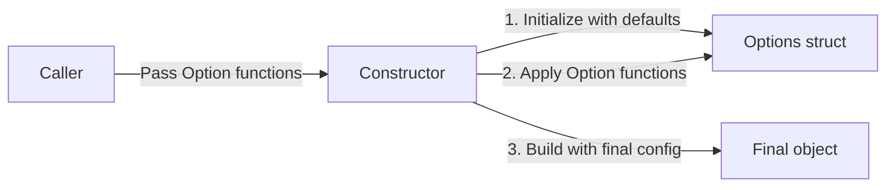
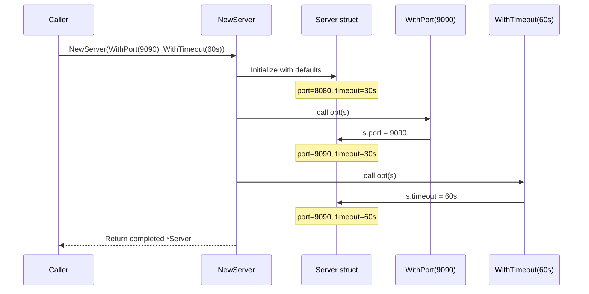
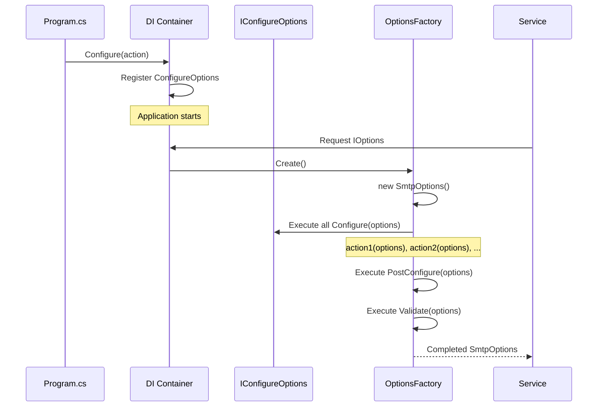
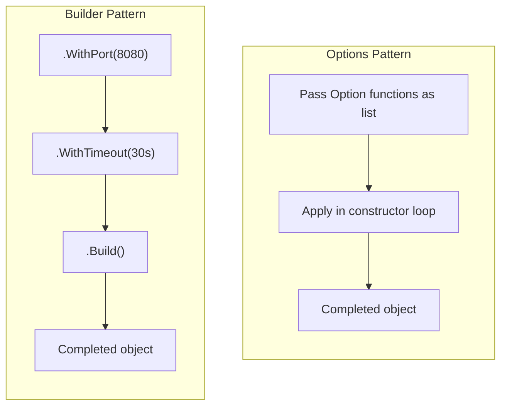
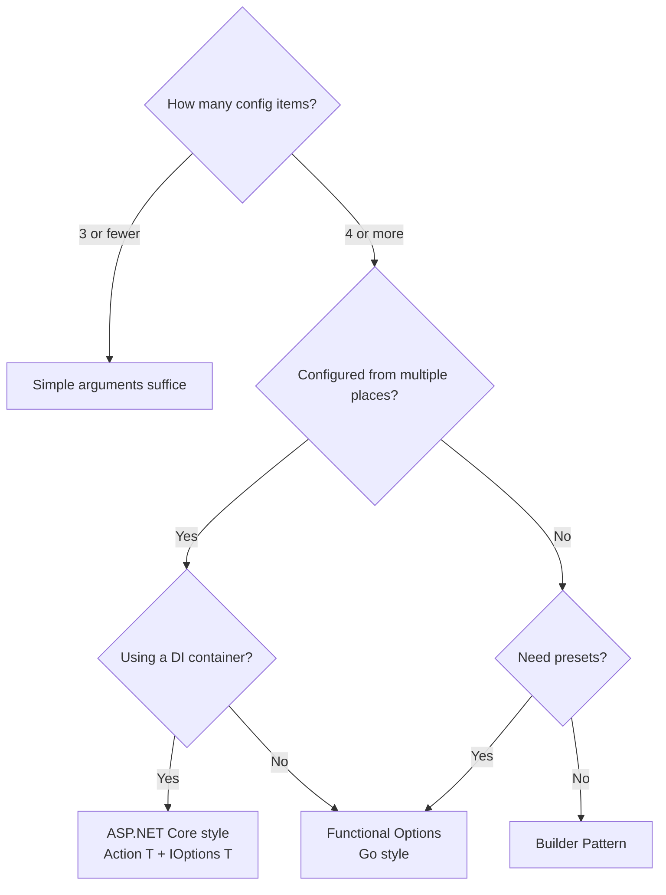

## Introduction

When reading library or framework code, you repeatedly encounter a pattern: "pass anonymous functions to a constructor to configure it." The languages differ, but the idea is the same. If you've read ASP.NET Core code, you've seen this pattern everywhere:

```csharp
builder.Services.AddAuthentication(options =>
{
    options.DefaultScheme = "Bearer";
    options.DefaultChallengeScheme = "Bearer";
});
```

Or in Go:

```go
server := NewServer(
    WithPort(8080),
    WithTimeout(30 * time.Second),
    WithLogger(myLogger),
)
```

Both of these are implementations of the **Options Pattern** — a design pattern based on the idea of "using anonymous functions (lambdas / closures) to assemble object configuration."

This article provides a thorough exploration of the Options Pattern:

1. **The problem it solves** — Telescoping Constructor hell
2. **Core concept** — Passing functions as configuration units
3. **C# / ASP.NET Core implementation** — `IOptions<T>` and the DI internals
4. **Go implementation** — Functional Options pattern
5. **TypeScript implementation** — Merging with Builder
6. **Comparison with other patterns** — Builder, Fluent API, Configuration Object
7. **When to use it** — Decision criteria

## The Problem: Telescoping Constructor

To understand why the Options Pattern is needed, we first need to see the problem it solves.

### Constructor Argument Explosion

Consider building an HTTP server. It starts simple:

```go
func NewServer(port int) *Server {
    return &Server{port: port}
}
```

But as features grow, arguments proliferate:

```go
func NewServer(
    port int,
    host string,
    timeout time.Duration,
    maxConnections int,
    logger Logger,
    tlsConfig *tls.Config,
    middleware []Middleware,
    readTimeout time.Duration,
    writeTimeout time.Duration,
    idleTimeout time.Duration,
) *Server {
    // ...
}
```

This is the **Telescoping Constructor** problem. With 10+ arguments, callers easily confuse argument order, and most arguments should use defaults but can't be omitted.

### The "Kitchen Sink Config Struct" Limitation

A common workaround is passing a single config struct:

```go
type ServerConfig struct {
    Port           int
    Host           string
    Timeout        time.Duration
    MaxConnections int
    Logger         Logger
    // ...
}

func NewServer(cfg ServerConfig) *Server { ... }
```

This looks clean but has issues:

- **Default values are ambiguous**: Is `Port: 0` "use port 0" or "use the default"? (the zero-value problem)
- **Required vs. optional is unclear**: All fields appear at the same level
- **Breaking changes on extension**: Adding new fields can affect existing constructor calls
- **Hard to express constraints**: Rules like "if A is set, B is unnecessary" are hard to enforce

## The Essence of the Options Pattern

The core idea is surprisingly simple:

> **Pass configuration as functions, not values.**

Instead of passing "Port is 8080" as a **value**, pass "set Port to 8080" as an **operation**.



This approach has several key benefits:

| Benefit | Description |
|---------|-------------|
| **Safe defaults** | If an Option function isn't called, the default value is preserved |
| **Order-independent** | Option functions can be passed in any order (last-write-wins) |
| **Open for extension** | Adding new Option functions doesn't affect existing code (Open-Closed Principle) |
| **Type-safe** | Each Option function operates on the correct field type |
| **Composable** | Option functions can be grouped into "presets" via slices/arrays |

## Go Implementation — Functional Options

Let's now look at concrete implementations across different languages, starting with Go — where this pattern was most systematically advocated and widely adopted. In the Go community, this pattern — proposed by [Rob Pike](https://commandcenter.blogspot.com/2014/01/self-referential-functions-and-design.html) and [Dave Cheney](https://dave.cheney.net/2014/10/17/functional-options-for-friendly-apis) — is widely known as **Functional Options**. Go lacks constructor overloading and default arguments, making Functional Options the de facto standard configuration pattern.

### Basic Implementation

Let's look at the full picture. The code below has three components: **(1)** the `Server` struct holding configuration, **(2)** the `Option` function type that modifies configuration, and **(3)** the `NewServer` constructor that initializes with defaults then applies Options in sequence. These three elements are all there is to Functional Options.

```go
package server

import (
    "log"
    "time"
)

// Server is the HTTP server
type Server struct {
    port         int
    host         string
    timeout      time.Duration
    maxConns     int
    logger       *log.Logger
}

// Option is a function type that modifies Server configuration
type Option func(*Server)

// WithPort sets the port number
func WithPort(port int) Option {
    return func(s *Server) {
        s.port = port
    }
}

// WithHost sets the hostname
func WithHost(host string) Option {
    return func(s *Server) {
        s.host = host
    }
}

// WithTimeout sets the timeout duration
func WithTimeout(d time.Duration) Option {
    return func(s *Server) {
        s.timeout = d
    }
}

// WithMaxConnections sets the max connection count
func WithMaxConnections(n int) Option {
    return func(s *Server) {
        s.maxConns = n
    }
}

// WithLogger sets the logger
func WithLogger(l *log.Logger) Option {
    return func(s *Server) {
        s.logger = l
    }
}

// NewServer creates a Server by applying Options
func NewServer(opts ...Option) *Server {
    // 1. Initialize with defaults
    s := &Server{
        port:     8080,
        host:     "localhost",
        timeout:  30 * time.Second,
        maxConns: 100,
        logger:   log.Default(),
    }

    // 2. Apply Option functions in order
    for _, opt := range opts {
        opt(s)
    }

    return s
}
```

### Usage

Let's use the implementation above. Pass no arguments and you get defaults; specify only what you need and just those parts get overridden. Bundle Options into a slice, and you've got a reusable "production defaults" preset.

```go
// Default configuration
s1 := server.NewServer()

// Custom configuration
s2 := server.NewServer(
    server.WithPort(9090),
    server.WithTimeout(60 * time.Second),
    server.WithLogger(customLogger),
)

// Preset: bundle production defaults
var ProductionDefaults = []server.Option{
    server.WithPort(443),
    server.WithTimeout(10 * time.Second),
    server.WithMaxConnections(10000),
}

s3 := server.NewServer(ProductionDefaults...)
```

### What Happens Internally

Let's trace the execution of `NewServer` step by step:



The key is **closures**. `WithPort(9090)` returns a function that has **captured** the argument 9090, and that function is later applied to the `Server`. This is the technical heart of the Options Pattern.

### Implementation with Validation

In production code, you'll want validation. Invalid port numbers, negative timeouts — you want to catch these early. In Go, returning errors is the idiomatic approach. When an error is returned, `NewServer` fails immediately, preventing the server from starting with invalid configuration.

```go
// Option that can return errors
type Option func(*Server) error

func WithPort(port int) Option {
    return func(s *Server) error {
        if port < 0 || port > 65535 {
            return fmt.Errorf("invalid port: %d", port)
        }
        s.port = port
        return nil
    }
}

func NewServer(opts ...Option) (*Server, error) {
    s := &Server{
        port:     8080,
        host:     "localhost",
        timeout:  30 * time.Second,
        maxConns: 100,
    }

    for _, opt := range opts {
        if err := opt(s); err != nil {
            return nil, fmt.Errorf("applying option: %w", err)
        }
    }

    return s, nil
}
```

### Real-World Usage

Functional Options are extremely widespread in the Go ecosystem:

| Library | Usage |
|---------|-------|
| [gRPC-Go](https://github.com/grpc/grpc-go) | `grpc.NewServer(opts...)` |
| [Zap](https://github.com/uber-go/zap) | `zap.New(core, opts...)` |
| [Fx](https://github.com/uber-go/fx) | `fx.New(opts...)` |
| [client-go](https://github.com/kubernetes/client-go) | Uses options functions in some APIs |
| [kafka-go](https://github.com/segmentio/kafka-go) | Kafka client configuration |

## C# / ASP.NET Core Implementation

ASP.NET Core's Options Pattern is built on the **same principle** as Go's Functional Options, but layered on top of a DI (Dependency Injection) container. In Go, Options are passed as constructor arguments; in ASP.NET Core, "configuration functions" registered in the DI container are applied internally by the container. In other words, the timing of Option application shifts from "at constructor call time" to "at dependency resolution time." This deferred application is the key that enables "incremental configuration from multiple places."

### Basic Pattern: `Action<TOptions>`

```csharp
// Options class definition
public class SmtpOptions
{
    public string Host { get; set; } = "localhost";
    public int Port { get; set; } = 25;
    public bool UseSsl { get; set; } = false;
    public string? Username { get; set; }
    public string? Password { get; set; }
}

// Configure with Action<T> at service registration
builder.Services.Configure<SmtpOptions>(options =>
{
    options.Host = "smtp.example.com";
    options.Port = 587;
    options.UseSsl = true;
});
```

Go's `func(*Server)` and C#'s `Action<SmtpOptions>` are **exactly the same thing** — both are "a function that takes an Options object and modifies its fields."

### `IOptions<T>` Interface Family

There's a reason ASP.NET Core provides three Options interfaces. Configuration that's read once at startup, configuration that needs the latest value per request, and configuration that should reflect `appsettings.json` changes in real-time — each has different use cases.

| Interface | Lifetime | Reload | Use Case |
|-----------|----------|--------|----------|
| `IOptions<T>` | Singleton | No | Static configuration determined at startup |
| `IOptionsSnapshot<T>` | Scoped | Per-request | Latest configuration per request |
| `IOptionsMonitor<T>` | Singleton | Real-time | Hot reload support |

### Internal DI Mechanics

What happens internally when you call `Configure<T>()`?



The key point is that `Configure()` can be **called multiple times**:

```csharp
// Base configuration
builder.Services.Configure<SmtpOptions>(options =>
{
    options.Host = "smtp.example.com";
    options.Port = 587;
});

// Additional configuration (can override)
builder.Services.Configure<SmtpOptions>(options =>
{
    options.UseSsl = true;
});

// Also bind from appsettings.json
builder.Services.Configure<SmtpOptions>(
    builder.Configuration.GetSection("Smtp"));
```

These are **all executed in order**. The last one wins. This is exactly the same mechanism as Go's `for _, opt := range opts { opt(s) }`.

### Extension Method Pattern

Let's look at the internal implementation of the common `AddXxx(options => ...)` pattern in ASP.NET Core. This pattern is the "setup window" that library authors provide. Consumers don't need to know the internal registration details (Options infrastructure, validation, service registration) — they just pass an `Action<SmtpOptions>` and everything is configured correctly.

```csharp
// AddSmtp extension method implementation
public static class SmtpServiceCollectionExtensions
{
    public static IServiceCollection AddSmtp(
        this IServiceCollection services,
        Action<SmtpOptions> configure)
    {
        // 1. Register Options infrastructure
        services.AddOptions<SmtpOptions>()
            .Configure(configure)        // Apply user configuration
            .ValidateDataAnnotations()   // Validation
            .ValidateOnStart();          // Validate at startup

        // 2. Register the service itself
        services.AddSingleton<ISmtpClient, SmtpClient>();

        return services;
    }
}

// Usage
builder.Services.AddSmtp(options =>
{
    options.Host = "smtp.example.com";
    options.Port = 587;
    options.UseSsl = true;
});
```

Breaking down what happens inside `AddSmtp`, three concerns are separated:

1. **Default values** → Property initializers in the `SmtpOptions` class
2. **User configuration** → The anonymous function received as `Action<SmtpOptions>`
3. **Validation** → Declaratively defined via `ValidateDataAnnotations()`

### PostConfigure and Validate

ASP.NET Core divides the configuration lifecycle into 3 stages. Why three? Because separating "setting values," "adjusting values," and "validating values" makes each stage's responsibility clear. `Configure` sets the base values, `PostConfigure` handles "cross-value consistency adjustments" (e.g., auto-switching port to 465 when SSL is enabled), and finally `Validate` checks that the final values are correct.

```csharp
builder.Services.AddOptions<SmtpOptions>()
    // Stage 1: Configure — inject configuration values
    .Configure(o => o.Host = "smtp.example.com")

    // Stage 2: PostConfigure — runs after ALL Configure calls
    .PostConfigure(o =>
    {
        // If SSL is enabled but port is still default, switch to 465
        if (o.UseSsl && o.Port == 25)
            o.Port = 465;
    })

    // Stage 3: Validate — final validation
    .Validate(o => !string.IsNullOrEmpty(o.Host),
              "SMTP host must not be empty")
    .ValidateDataAnnotations()
    .ValidateOnStart();
```


### Named Options

Sometimes you need multiple instances of the same options type:

```csharp
// Two SMTP configurations: "Primary" and "Backup"
builder.Services.Configure<SmtpOptions>("Primary", options =>
{
    options.Host = "smtp-primary.example.com";
    options.Port = 587;
});

builder.Services.Configure<SmtpOptions>("Backup", options =>
{
    options.Host = "smtp-backup.example.com";
    options.Port = 2525;
});

// Usage
public class EmailService
{
    private readonly SmtpOptions _primary;
    private readonly SmtpOptions _backup;

    public EmailService(IOptionsSnapshot<SmtpOptions> optionsSnapshot)
    {
        _primary = optionsSnapshot.Get("Primary");
        _backup = optionsSnapshot.Get("Backup");
    }
}
```

### `OptionsFactory<T>` Internals

ASP.NET Core's Options resolution is handled by [`OptionsFactory<TOptions>`](https://github.com/dotnet/runtime/blob/main/src/libraries/Microsoft.Extensions.Options/src/OptionsFactory.cs). Simplified, it works like this:

```csharp
// OptionsFactory<TOptions>.Create() internals (simplified)
public TOptions Create(string name)
{
    // 1. Create new instance (defaults)
    TOptions options = new TOptions();

    // 2. Execute all IConfigureOptions<T>
    foreach (var setup in _setups)
    {
        if (setup is IConfigureNamedOptions<TOptions> namedSetup)
            namedSetup.Configure(name, options);
        else if (name == Options.DefaultName)
            setup.Configure(options);
    }

    // 3. Execute all IPostConfigureOptions<T>
    foreach (var post in _postConfigures)
        post.PostConfigure(name, options);

    // 4. Execute all IValidateOptions<T> (aggregate errors)
    var failures = new List<string>();
    foreach (var validate in _validations)
    {
        var result = validate.Validate(name, options);
        if (result.Failed)
            failures.AddRange(result.Failures);
    }
    if (failures.Count > 0)
        throw new OptionsValidationException(name, typeof(TOptions), failures);

    return options;
}
```

This is the **sophisticated version** of Go's `for _, opt := range opts { opt(s) }` loop. The separation into Configure → PostConfigure → Validate phases is an ASP.NET Core refinement.

## TypeScript Implementation

TypeScript offers several ways to implement the Options Pattern. Thanks to its rich type system, Go-style Functional Options, ASP.NET Core-style callbacks, and TypeScript-specific `Partial<T>` merging all feel natural. Let's look at the tradeoffs of each approach.

### Basic: `Partial<T>` Pattern

The simplest approach uses `Partial<T>`:

```typescript
interface ServerOptions {
  port: number;
  host: string;
  timeout: number;
  maxConnections: number;
}

const defaults: ServerOptions = {
  port: 8080,
  host: "localhost",
  timeout: 30_000,
  maxConnections: 100,
};

function createServer(overrides?: Partial<ServerOptions>): Server {
  const options = { ...defaults, ...overrides };
  return new Server(options);
}

// Usage
const server = createServer({ port: 9090, timeout: 60_000 });
```

However, this isn't really the Options Pattern — configuration is **value merging**, not **function application**. `Partial<T>` merging is simple and intuitive, but it's hard to express validation or "inter-value dependencies" (e.g., change port when SSL is enabled). That's where Go-style Functional Options come in.

### Functional Options

Go-style Functional Options in TypeScript:

```typescript
interface ServerConfig {
  port: number;
  host: string;
  timeout: number;
  maxConnections: number;
  logger: Logger;
}

type ServerOption = (config: ServerConfig) => void;

function withPort(port: number): ServerOption {
  return (config) => {
    if (port < 0 || port > 65535) throw new RangeError(`Invalid port: ${port}`);
    config.port = port;
  };
}

function withHost(host: string): ServerOption {
  return (config) => { config.host = host; };
}

function withTimeout(ms: number): ServerOption {
  return (config) => { config.timeout = ms; };
}

function withMaxConnections(n: number): ServerOption {
  return (config) => { config.maxConnections = n; };
}

function createServer(...opts: ServerOption[]): Server {
  const config: ServerConfig = {
    port: 8080,
    host: "localhost",
    timeout: 30_000,
    maxConnections: 100,
    logger: console,
  };

  for (const opt of opts) {
    opt(config);
  }

  return new Server(config);
}

// Usage
const server = createServer(
  withPort(9090),
  withTimeout(60_000),
  withMaxConnections(5000),
);

// Presets
const productionDefaults: ServerOption[] = [
  withPort(443),
  withTimeout(10_000),
  withMaxConnections(10000),
];

const prodServer = createServer(...productionDefaults);
```

### Callback Pattern (ASP.NET Core Style)

The "single anonymous function configures everything" pattern works too:

```typescript
function createServer(configure: (options: ServerConfig) => void): Server {
  const config: ServerConfig = {
    port: 8080,
    host: "localhost",
    timeout: 30_000,
    maxConnections: 100,
    logger: console,
  };

  configure(config);

  return new Server(config);
}

// Usage
const server = createServer((options) => {
  options.port = 9090;
  options.timeout = 60_000;
  options.maxConnections = 5000;
});
```

A **hybrid** of Go's Functional Options and C#'s `Action<T>` is also interesting:

```typescript
function createServer(
  configure?: (options: ServerConfig) => void,
  ...opts: ServerOption[]
): Server {
  const config: ServerConfig = {
    port: 3000, host: "localhost",
    timeout: 30_000, maxConnections: 100, logger: console.log,
  };
  configure?.(config);
  for (const opt of opts) opt(config);
  return new Server(config);
}
```

## Rust Implementation

In Rust, ownership and lifetime constraints make the Options Pattern implementation slightly different. In Go, you can easily bundle `func(*Server)` into slices, but in Rust, closures need to be heap-allocated via `Box<dyn FnOnce>`. This incurs a performance cost, but it's useful for the use case of bundling configuration as `Vec` presets. A practical guideline for Rust: "use Builder when options are few and statically determined; use Functional Options when option combinations vary at runtime."

### Fusion with Builder Pattern

The Rust community favors the Builder Pattern, but the essence of Functional Options can be incorporated:

```rust
pub struct ServerOptions {
    pub port: u16,
    pub host: String,
    pub timeout: std::time::Duration,
    pub max_connections: usize,
}

impl Default for ServerOptions {
    fn default() -> Self {
        Self {
            port: 8080,
            host: "localhost".into(),
            timeout: std::time::Duration::from_secs(30),
            max_connections: 100,
        }
    }
}

// Option expressed as FnOnce
type ServerOption = Box<dyn FnOnce(&mut ServerOptions)>;

pub fn with_port(port: u16) -> ServerOption {
    Box::new(move |opts| { opts.port = port; })
}

pub fn with_host(host: impl Into<String>) -> ServerOption {
    let host = host.into();
    Box::new(move |opts| { opts.host = host; })
}

pub fn with_timeout(duration: std::time::Duration) -> ServerOption {
    Box::new(move |opts| { opts.timeout = duration; })
}

pub struct Server { /* ... */ }

impl Server {
    pub fn new(opts: impl IntoIterator<Item = ServerOption>) -> Self {
        let mut options = ServerOptions::default();
        for opt in opts {
            opt(&mut options);
        }
        Server::from_options(options)
    }

    fn from_options(_options: ServerOptions) -> Self {
        Server { /* ... */ }
    }
}

// Usage
let server = Server::new([
    with_port(9090),
    with_timeout(std::time::Duration::from_secs(60)),
]);
```

In Rust, the `Box<dyn FnOnce>` allocation cost exists, so the traditional Builder Pattern is often preferred for high-frequency use. However, when bundling configurations as `Vec<ServerOption>` presets, it's useful. A practical guideline: "use Builder when options are few and statically known; use Functional Options when option combinations change at runtime."

## Python Implementation

Python's `**kwargs` is standard, but the Options Pattern can be implemented explicitly. Python natively supports closures and treats functions as first-class objects without heap allocation, making it more concise than Go or Rust. Combined with `@dataclass`, default value definitions feel natural too.

```python
from dataclasses import dataclass
from typing import Callable

@dataclass
class ServerOptions:
    port: int = 8080
    host: str = "localhost"
    timeout: float = 30.0
    max_connections: int = 100

# Option type
Option = Callable[[ServerOptions], None]

def with_port(port: int) -> Option:
    def apply(opts: ServerOptions) -> None:
        if not 0 <= port <= 65535:
            raise ValueError(f"Invalid port: {port}")
        opts.port = port
    return apply

def with_host(host: str) -> Option:
    def apply(opts: ServerOptions) -> None:
        opts.host = host
    return apply

def with_timeout(seconds: float) -> Option:
    def apply(opts: ServerOptions) -> None:
        opts.timeout = seconds
    return apply

class Server:
    def __init__(self, *opts: Option):
        self.options = ServerOptions()
        for opt in opts:
            opt(self.options)

# Usage
server = Server(
    with_port(9090),
    with_timeout(60.0),
)

# Presets
production_defaults: list[Option] = [
    with_port(443),
    with_timeout(10.0),
]

prod_server = Server(*production_defaults)
```

## Pattern Comparison

### Options Pattern vs Builder Pattern



| Aspect | Options Pattern | Builder Pattern |
|--------|----------------|-----------------|
| **Syntax** | Pass functions as a list | Method chaining |
| **State management** | Constructor manages centrally | Builder holds intermediate state |
| **Composability** | Easy preset creation via function slices/arrays | Reusing intermediate Builder state is difficult |
| **Incremental config** | Great DI affinity (Configure from multiple places) | Usually completed in one place |
| **Type safety** | Guaranteed per Option function | Guaranteed by method return types |
| **Learning curve** | Requires understanding closures | Intuitive |

### Options Pattern vs Configuration Object

| Aspect | Options Pattern | Configuration Object |
|--------|----------------|---------------------|
| **Default values** | Safely set in constructor | Zero-value ambiguity |
| **Validation** | Executable within each Option function | Requires separate validation layer |
| **Extensibility** | Just add new Option functions | Add fields to struct |
| **Composability** | Free composition via function composition | Requires struct merging |

### Decision Guide



## Advanced Techniques

### Option Function Composition

Multiple Options can be combined into one:

```go
// Compose multiple Options into one
func ComposeOptions(opts ...Option) Option {
    return func(s *Server) {
        for _, opt := range opts {
            opt(s)
        }
    }
}

// Define presets
var HighPerformance = ComposeOptions(
    WithMaxConnections(50000),
    WithTimeout(5 * time.Second),
)

var SecureDefaults = ComposeOptions(
    WithPort(443),
    WithTimeout(10 * time.Second),
)

// Compose presets
s := NewServer(
    HighPerformance,
    SecureDefaults,
    WithHost("api.example.com"), // Individual override
)
```

This is function composition itself — evidence that the Options Pattern is rooted in **functional programming principles**.

### Conditional Options

```go
// Conditionally apply an Option
func WithPortIf(port int, condition bool) Option {
    return func(s *Server) {
        if condition {
            s.port = port
        }
    }
}

// Environment-based configuration
func WithEnvConfig() Option {
    return func(s *Server) {
        if port := os.Getenv("PORT"); port != "" {
            s.port, _ = strconv.Atoi(port)
        }
        if host := os.Getenv("HOST"); host != "" {
            s.host = host
        }
    }
}
```

### Self-Referential Functions (Returning Previous Values)

Rob Pike's original post describes a technique where Option functions return the "previous value," enabling **rollback**:

```go
type Option func(*Server) Option

func WithPort(port int) Option {
    return func(s *Server) Option {
        prev := s.port   // Save previous value
        s.port = port     // Set new value
        return WithPort(prev) // Return Option that restores previous
    }
}

// Rollback example
func temporarilyChangePort(s *Server, port int) {
    restore := WithPort(port)(s)  // Change port
    defer restore(s)               // Restore on function exit
    // ... process with temporarily changed port ...
}
```

This is rarely seen in production code, but it's a fascinating **theoretical foundation** for the Options Pattern.

## Summary

The Options Pattern is a design pattern based on the simple principle: "pass configuration as functions, not values."

| Language | Name | Signature |
|----------|------|-----------|
| Go | Functional Options | `func(*T)` / `func(*T) error` |
| C# | Options Pattern / `Action<T>` | `Action<TOptions>` |
| TypeScript | Callback Configuration | `(options: T) => void` |
| Rust | Functional Options | `Box<dyn FnOnce(&mut T)>` |
| Python | Option Callbacks | `Callable[[T], None]` |

The essence is the same regardless of language:

1. **Initialize with default values**
2. **Apply Option functions in order**
3. **Use the completed object**

It solves the Telescoping Constructor problem, follows the Open-Closed Principle, and works well with DI containers. Especially when "configuration happens incrementally from multiple places," the Options Pattern is more suitable than the Builder Pattern.

Understanding the Options Pattern reveals the "why" behind ASP.NET Core's `AddXxx(options => ...)` and the Go ecosystem's API design. Consider applying it in your own code.

## References

- [Rob Pike — Self-referential functions and the design of options (2014)](https://commandcenter.blogspot.com/2014/01/self-referential-functions-and-design.html)
- [Dave Cheney — Functional options for friendly APIs (2014)](https://dave.cheney.net/2014/10/17/functional-options-for-friendly-apis)
- [Microsoft — Options pattern in ASP.NET Core](https://learn.microsoft.com/en-us/aspnet/core/fundamentals/configuration/options)
- [.NET Runtime — OptionsFactory source code](https://github.com/dotnet/runtime/blob/main/src/libraries/Microsoft.Extensions.Options/src/OptionsFactory.cs)
