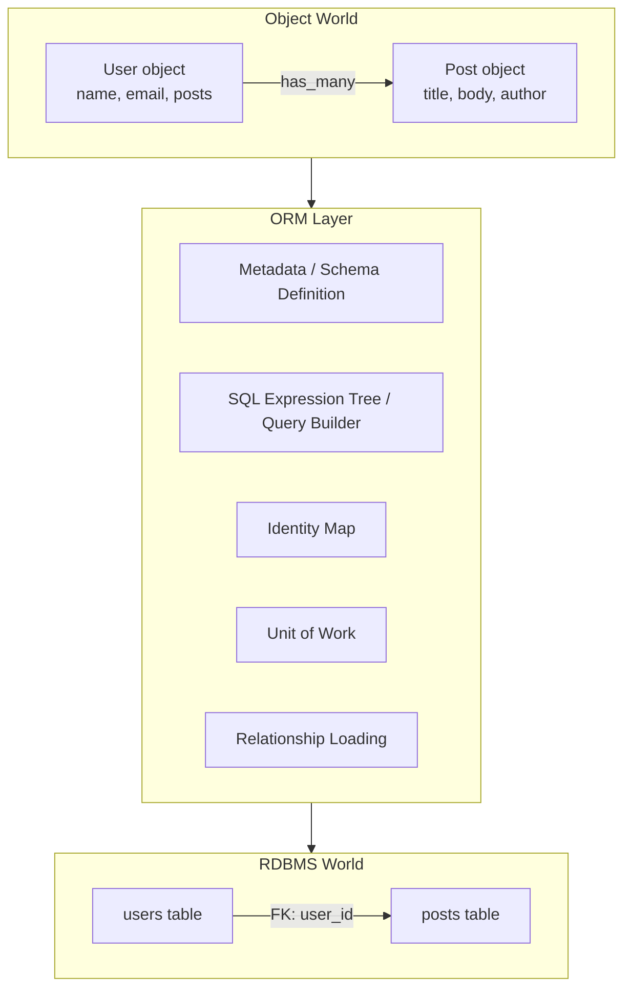
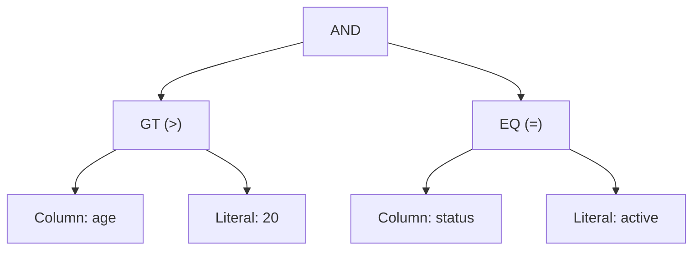
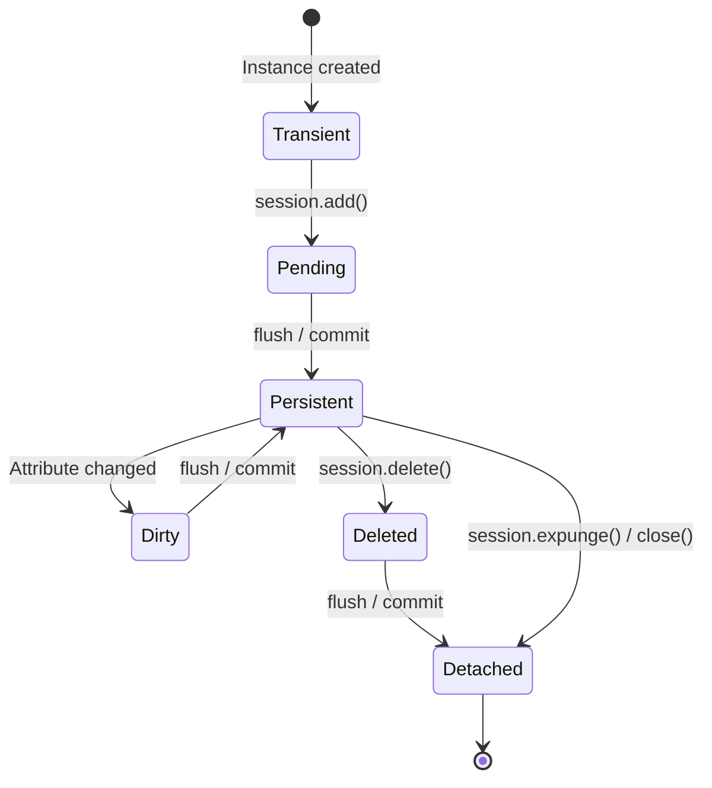
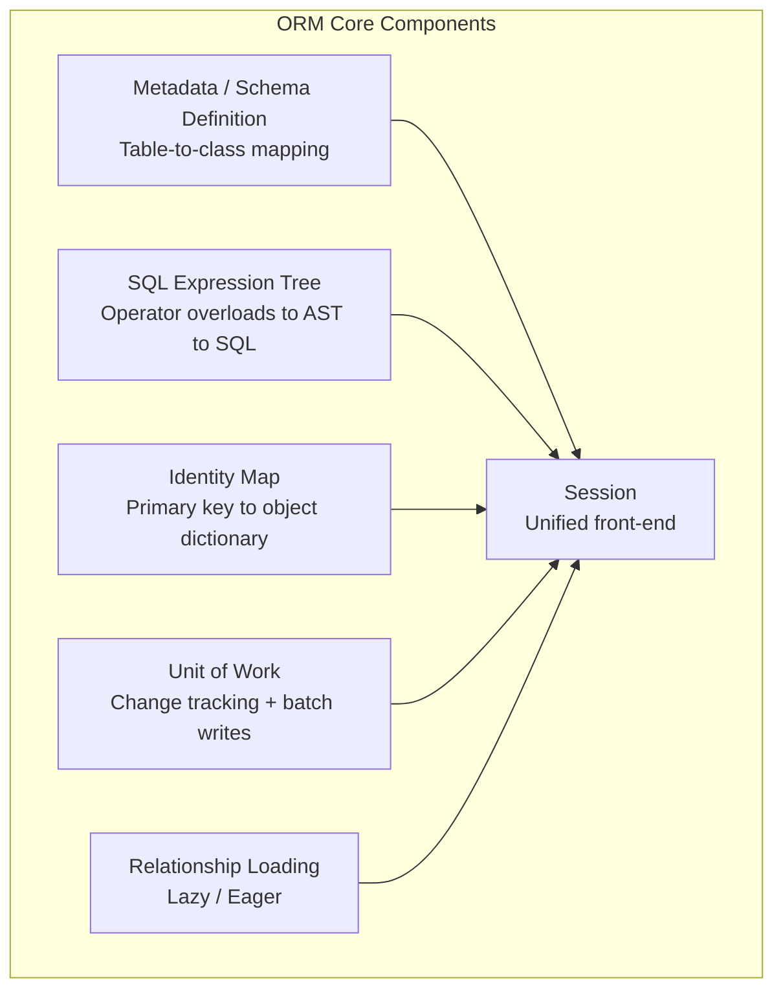

Write `session.query(User).filter(User.age > 20).all()` and SQL is generated, database rows are fetched and transformed into Python objects — ORMs look like magic, but underneath lies a set of well-defined design patterns.

In this article, we build an ORM (Object-Relational Mapping) from scratch in Python, demystifying its internals component by component. Guided by the patterns catalogued in Martin Fowler's **Patterns of Enterprise Application Architecture (PoEAA)**, we'll gain the foundation needed to understand the design decisions behind real-world ORMs like SQLAlchemy, Django ORM, and Entity Framework Core.

## The Big Picture

An ORM bridges two fundamentally different worlds: the **object-oriented domain model** and the **relational database**. This mismatch is known as the **object-relational impedance mismatch**, and it is the root problem that ORMs solve.



Internally, an ORM consists of these major components:

| Component | Responsibility | PoEAA Pattern |
|---|---|---|
| Metadata / Schema Definition | Describe the mapping between tables and classes | Metadata Mapping |
| SQL Expression Tree / Query Builder | Build SQL statements from Python expressions | Query Object |
| Identity Map | Map the same row to the same object instance | Identity Map |
| Unit of Work | Track changes and batch-write them to the DB | Unit of Work |
| Relationship Loading | Lazy or eager loading of related objects | Lazy Load / Eager Load |

## Chapter 1: Active Record vs Data Mapper

ORM architectures fall into two major categories. Let's understand the difference first.

### Active Record

**Active Record** represents a database row as an object that carries CRUD methods itself.

```python
class User:
    """Active Record pattern: the object knows how to persist itself"""

    def __init__(self, name: str, email: str, id: int | None = None):
        self.id = id
        self.name = name
        self.email = email

    def save(self):
        """Persist the object's state to the database"""
        if self.id is None:
            cursor.execute(
                "INSERT INTO users (name, email) VALUES (?, ?)",
                (self.name, self.email),
            )
            self.id = cursor.lastrowid
        else:
            cursor.execute(
                "UPDATE users SET name = ?, email = ? WHERE id = ?",
                (self.name, self.email, self.id),
            )

    def delete(self):
        """Delete the object from the database"""
        cursor.execute("DELETE FROM users WHERE id = ?", (self.id,))

    @classmethod
    def find(cls, id: int) -> "User":
        """Fetch a row by primary key and return it as an object"""
        row = cursor.execute(
            "SELECT id, name, email FROM users WHERE id = ?", (id,)
        ).fetchone()
        return cls(name=row[1], email=row[2], id=row[0])
```

```python
# Usage: the object directly executes DB operations
user = User(name="Alice", email="alice@example.com")
user.save()        # INSERT is executed
user.name = "Bob"
user.save()        # UPDATE is executed
```

Active Record's hallmark is **simplicity**. Tables map one-to-one with classes, and objects carry their own data access logic, making it easy to learn and quick to write. Ruby on Rails, Django ORM, and Laravel Eloquent adopt this pattern.

However, because the domain model is tightly coupled to the database schema (table columns map directly to object attributes), it can become a design constraint in large applications with complex business logic.

### Data Mapper

**Data Mapper** interposes an independent mapper layer between domain objects and the database. Domain objects know nothing about persistence.

```python
class User:
    """Data Mapper pattern: the object knows nothing about the DB"""

    def __init__(self, name: str, email: str, id: int | None = None):
        self.id = id
        self.name = name
        self.email = email


class UserMapper:
    """Mediates between User objects and the database"""

    def __init__(self, connection):
        self.conn = connection

    def find(self, id: int) -> User:
        row = self.conn.execute(
            "SELECT id, name, email FROM users WHERE id = ?", (id,)
        ).fetchone()
        return User(name=row[1], email=row[2], id=row[0])

    def insert(self, user: User):
        cursor = self.conn.execute(
            "INSERT INTO users (name, email) VALUES (?, ?)",
            (user.name, user.email),
        )
        user.id = cursor.lastrowid

    def update(self, user: User):
        self.conn.execute(
            "UPDATE users SET name = ?, email = ? WHERE id = ?",
            (user.name, user.email, user.id),
        )
```

```python
# Usage: the mapper mediates DB operations
mapper = UserMapper(connection)
user = User(name="Alice", email="alice@example.com")
mapper.insert(user)   # mapper executes the INSERT
user.name = "Bob"
mapper.update(user)   # mapper executes the UPDATE
```

Data Mapper's hallmark is **separation of concerns**. The domain model is independent of the database schema, and table structure and object structure can evolve independently. SQLAlchemy (Classical Mapping), Hibernate, and Entity Framework Core are built on this pattern.

### Comparing the Two

| Aspect | Active Record | Data Mapper |
|---|---|---|
| Domain object responsibility | Data + DB operations | Data only |
| Table-to-class relationship | One-to-one | Freely mappable |
| Learning curve | Low | High |
| Testability | DB coupling tends to leak in | Domain logic easily unit-tested |
| Representative ORMs | Django ORM, Rails AR, Eloquent | SQLAlchemy, Hibernate, EF Core |

From this point forward, we'll build on the Data Mapper pattern to explore the full range of ORM internals.

## Chapter 2: Metadata and Schema Definition

The starting point of an ORM is **metadata** — descriptions of how Python classes correspond to tables and columns.

### 2.1 Column and Table Definitions

Let's implement classes that represent columns and tables.

```python
from dataclasses import dataclass, field


@dataclass
class Column:
    """Represents a table column"""

    name: str
    column_type: str  # "INTEGER", "TEXT", "REAL", etc.
    primary_key: bool = False
    nullable: bool = True
    default: object = None

    def __set_name__(self, owner, name):
        """Descriptor protocol: record the attribute name when defined on a class"""
        if not self.name:
            self.name = name


@dataclass
class Table:
    """Represents table metadata"""

    name: str
    columns: list[Column] = field(default_factory=list)
    _column_map: dict[str, Column] = field(default_factory=dict, repr=False)

    def add_column(self, column: Column):
        self.columns.append(column)
        self._column_map[column.name] = column

    @property
    def primary_key(self) -> Column | None:
        for col in self.columns:
            if col.primary_key:
                return col
        return None

    def create_table_sql(self) -> str:
        """Generate a CREATE TABLE statement"""
        col_defs = []
        for col in self.columns:
            parts = [col.name, col.column_type]
            if col.primary_key:
                parts.append("PRIMARY KEY")
            if not col.nullable and not col.primary_key:
                parts.append("NOT NULL")
            col_defs.append(" ".join(parts))
        return f"CREATE TABLE IF NOT EXISTS {self.name} ({', '.join(col_defs)})"
```

### 2.2 Mapping Registry

Next, we build a registry that manages the correspondence between Python classes and table metadata — analogous to SQLAlchemy's `registry` or `MetaData`.

```python
class Registry:
    """Manages class-to-table mappings"""

    def __init__(self):
        self._mappings: dict[type, Table] = {}

    def map_class(self, cls: type, table: Table):
        """Register a class-to-table mapping"""
        self._mappings[cls] = table

    def get_table(self, cls: type) -> Table:
        """Retrieve the table for a given class"""
        return self._mappings[cls]

    def __contains__(self, cls: type) -> bool:
        return cls in self._mappings
```

```python
# Usage: register a class-to-table mapping
registry = Registry()

users_table = Table(name="users")
users_table.add_column(Column("id", "INTEGER", primary_key=True))
users_table.add_column(Column("name", "TEXT", nullable=False))
users_table.add_column(Column("email", "TEXT", nullable=False))

class User:
    def __init__(self, name: str, email: str, id: int | None = None):
        self.id = id
        self.name = name
        self.email = email

registry.map_class(User, users_table)
```

This is essentially SQLAlchemy's "Classical Mapping." While Declarative Mapping is the mainstream approach since SQLAlchemy 2.0, internally it builds the same kind of registry.

### 2.3 Declarative Mapping (Automatic Registration via Metaclass)

Manual `map_class` calls are tedious. Using Python's metaclass, we can write mappings declaratively.

```python
_global_registry = Registry()


class ModelMeta(type):
    """Metaclass: auto-registers table mappings at class definition time"""

    def __new__(mcs, name, bases, namespace):
        cls = super().__new__(mcs, name, bases, namespace)

        # Skip the base class (Model itself)
        if name == "Model":
            return cls

        # Determine table name from __tablename__
        table_name = namespace.get("__tablename__", name.lower() + "s")
        table = Table(name=table_name)

        # Collect Column instances
        for attr_name, attr_value in namespace.items():
            if isinstance(attr_value, Column):
                if not attr_value.name:
                    attr_value.name = attr_name
                table.add_column(attr_value)

        _global_registry.map_class(cls, table)
        return cls


class Model(metaclass=ModelMeta):
    """Base class for all models"""
    pass
```

```python
# Declarative model definition
class User(Model):
    __tablename__ = "users"

    id = Column("id", "INTEGER", primary_key=True)
    name = Column("name", "TEXT", nullable=False)
    email = Column("email", "TEXT", nullable=False)

# The metaclass automatically registers the mapping to the users table
table = _global_registry.get_table(User)
print(table.create_table_sql())
# => CREATE TABLE IF NOT EXISTS users (id INTEGER PRIMARY KEY, name TEXT NOT NULL, email TEXT NOT NULL)
```

This mechanism is fundamentally the same as SQLAlchemy's `DeclarativeBase` and Django ORM's `models.Model`. They use metaclasses (or `__init_subclass__` in Python 3.6+) to automatically collect metadata at class definition time.

## Chapter 3: SQL Expression Trees and the Query Builder

One of the most ingenious parts of an ORM is its ability to translate Python expressions into SQL. Writing `User.age > 20` returns a Python object that ultimately renders as the SQL fragment `WHERE age > 20`.

### 3.1 Expression Node Definitions (AST)

SQL statements can be represented as a tree structure — an Abstract Syntax Tree (AST).



Let's implement the classes that form this tree.

```python
from abc import ABC, abstractmethod


class Expression(ABC):
    """Abstract base class for SQL expressions"""

    @abstractmethod
    def to_sql(self) -> tuple[str, list]:
        """Return a (SQL string, parameters) tuple"""
        ...

    def __and__(self, other: "Expression") -> "BinaryOp":
        return BinaryOp("AND", self, other)

    def __or__(self, other: "Expression") -> "BinaryOp":
        return BinaryOp("OR", self, other)

    def __invert__(self) -> "UnaryOp":
        return UnaryOp("NOT", self)


class ColumnExpr(Expression):
    """Expression representing a column reference"""

    def __init__(self, table_name: str, column_name: str):
        self.table_name = table_name
        self.column_name = column_name

    def to_sql(self) -> tuple[str, list]:
        return f"{self.table_name}.{self.column_name}", []

    # Operator overloads for comparisons
    def __eq__(self, other) -> "BinaryOp":  # type: ignore[override]
        return BinaryOp("=", self, _to_expr(other))

    def __ne__(self, other) -> "BinaryOp":  # type: ignore[override]
        return BinaryOp("!=", self, _to_expr(other))

    def __gt__(self, other) -> "BinaryOp":
        return BinaryOp(">", self, _to_expr(other))

    def __ge__(self, other) -> "BinaryOp":
        return BinaryOp(">=", self, _to_expr(other))

    def __lt__(self, other) -> "BinaryOp":
        return BinaryOp("<", self, _to_expr(other))

    def __le__(self, other) -> "BinaryOp":
        return BinaryOp("<=", self, _to_expr(other))

    def in_(self, values: list) -> "InOp":
        return InOp(self, values)

    def like(self, pattern: str) -> "BinaryOp":
        return BinaryOp("LIKE", self, Literal(pattern))


class Literal(Expression):
    """Expression representing a literal value"""

    def __init__(self, value):
        self.value = value

    def to_sql(self) -> tuple[str, list]:
        return "?", [self.value]


class BinaryOp(Expression):
    """Expression representing a binary operation"""

    def __init__(self, op: str, left: Expression, right: Expression):
        self.op = op
        self.left = left
        self.right = right

    def to_sql(self) -> tuple[str, list]:
        left_sql, left_params = self.left.to_sql()
        right_sql, right_params = self.right.to_sql()
        return f"({left_sql} {self.op} {right_sql})", left_params + right_params


class UnaryOp(Expression):
    """Expression representing a unary operation"""

    def __init__(self, op: str, operand: Expression):
        self.op = op
        self.operand = operand

    def to_sql(self) -> tuple[str, list]:
        sql, params = self.operand.to_sql()
        return f"({self.op} {sql})", params


class InOp(Expression):
    """Expression representing an IN operation"""

    def __init__(self, column: ColumnExpr, values: list):
        self.column = column
        self.values = values

    def to_sql(self) -> tuple[str, list]:
        col_sql, col_params = self.column.to_sql()
        placeholders = ", ".join("?" for _ in self.values)
        return f"{col_sql} IN ({placeholders})", col_params + list(self.values)


def _to_expr(value) -> Expression:
    """Helper: convert a Python value to an Expression"""
    if isinstance(value, Expression):
        return value
    return Literal(value)
```

### 3.2 How Operator Overloading Works

Here lies the key insight. Python's operator overloading (`__eq__`, `__gt__`, etc.) makes **comparison expressions return SQL expression tree nodes** instead of booleans.

```python
# Create ColumnExpr instances
age = ColumnExpr("users", "age")
status = ColumnExpr("users", "status")

# Python comparison operators return SQL expression tree nodes
expr = (age > 20) & (status == "active")

# Convert to SQL
sql, params = expr.to_sql()
print(sql)     # => ((users.age > ?) AND (users.status = ?))
print(params)  # => [20, 'active']
```

Normally, `User.age > 20` would return `True` or `False` in Python. But when `age` is a `ColumnExpr` instance, `__gt__` is invoked and returns `BinaryOp(">", ColumnExpr("users", "age"), Literal(20))` — an **expression tree node**. Traversing this tree produces the SQL string.

In SQLAlchemy, this mechanism is implemented through the `PropComparator` class and `InstrumentedAttribute` descriptors. Accessing an attribute on a model class returns a `ColumnExpr`-equivalent object via the descriptor, and operator overloads build the SQL expression tree.

### 3.3 The Query Class

Now let's build a query builder that assembles `SELECT` statements using expression trees.

```python
class Query:
    """Builder for SELECT queries"""

    def __init__(self, table: Table, model_class: type):
        self.table = table
        self.model_class = model_class
        self._where: Expression | None = None
        self._order_by: list[tuple[str, str]] = []
        self._limit: int | None = None
        self._offset: int | None = None

    def filter(self, *conditions: Expression) -> "Query":
        """Add WHERE conditions (AND-joined)"""
        for condition in conditions:
            if self._where is None:
                self._where = condition
            else:
                self._where = self._where & condition
        return self

    def order_by(self, column_name: str, direction: str = "ASC") -> "Query":
        """Add an ORDER BY clause"""
        self._order_by.append((column_name, direction))
        return self

    def limit(self, n: int) -> "Query":
        self._limit = n
        return self

    def offset(self, n: int) -> "Query":
        self._offset = n
        return self

    def build_sql(self) -> tuple[str, list]:
        """Generate the SQL string and parameters"""
        columns = ", ".join(col.name for col in self.table.columns)
        sql = f"SELECT {columns} FROM {self.table.name}"
        params: list = []

        if self._where is not None:
            where_sql, where_params = self._where.to_sql()
            sql += f" WHERE {where_sql}"
            params.extend(where_params)

        if self._order_by:
            order_parts = [f"{col} {direction}" for col, direction in self._order_by]
            sql += f" ORDER BY {', '.join(order_parts)}"

        if self._limit is not None:
            sql += f" LIMIT {self._limit}"

        if self._offset is not None:
            sql += f" OFFSET {self._offset}"

        return sql, params
```

```python
# Usage
age = ColumnExpr("users", "age")
status = ColumnExpr("users", "status")

query = (
    Query(users_table, User)
    .filter(age > 20, status == "active")
    .order_by("name")
    .limit(10)
)
sql, params = query.build_sql()
print(sql)
# => SELECT id, name, email FROM users WHERE ((users.age > ?) AND (users.status = ?)) ORDER BY name ASC LIMIT 10
print(params)
# => [20, 'active']
```

This method-chaining query builder pattern is used by SQLAlchemy, Django ORM (QuerySet), and Entity Framework Core (LINQ). Each method returns a copy of itself (immutable query construction), and evaluation is deferred until SQL is finally generated and executed.

### 3.4 Parameter Binding (SQL Injection Prevention)

A critical detail in the implementation above: **user input values are never interpolated directly into SQL strings — they use parameter placeholders (`?`) instead**.

```python
# ❌ DANGEROUS: SQL injection vulnerability
sql = f"SELECT * FROM users WHERE name = '{user_input}'"

# ✅ SAFE: parameterized query
sql = "SELECT * FROM users WHERE name = ?"
params = [user_input]
cursor.execute(sql, params)
```

All ORMs use parameterized queries internally, forming a critical defense against SQL injection attacks. By routing through the expression tree, user input values are always isolated into `Literal` nodes and the parameter list.

## Chapter 4: Identity Map — Same Row, Same Object

The Identity Map is a pattern defined by Martin Fowler in **Patterns of Enterprise Application Architecture**: "keep every loaded object in a map, keyed by its primary key, and return the same object instance for the same primary key."

### 4.1 Why Do We Need an Identity Map?

Without an Identity Map, we run into issues like this:

```python
# Without Identity Map
user1 = mapper.find(1)  # SELECT ... WHERE id = 1 -> User(name="Alice")
user2 = mapper.find(1)  # SELECT ... WHERE id = 1 -> User(name="Alice") (new query)

user1.name = "Bob"
print(user2.name)  # "Alice" — a different object, so the change is not reflected!
print(user1 is user2)  # False — same row, different objects
```

**Object identity is broken.** Two independent objects represent the same database row, and changes to one are invisible to the other. Additionally, issuing a fresh SELECT every time is wasteful.

### 4.2 Identity Map Implementation

```python
class IdentityMap:
    """Tracks objects by primary key"""

    def __init__(self):
        self._map: dict[tuple[type, object], object] = {}

    def get(self, cls: type, pk: object) -> object | None:
        """Retrieve an object from the cache"""
        return self._map.get((cls, pk))

    def put(self, cls: type, pk: object, instance: object):
        """Register an object in the cache"""
        self._map[(cls, pk)] = instance

    def remove(self, cls: type, pk: object):
        """Remove an object from the cache"""
        self._map.pop((cls, pk), None)

    def clear(self):
        """Clear all cached objects"""
        self._map.clear()

    def __contains__(self, key: tuple[type, object]) -> bool:
        return key in self._map
```

### 4.3 Mapper with Identity Map

```python
class UserMapper:
    """Data Mapper with built-in Identity Map"""

    def __init__(self, connection, identity_map: IdentityMap):
        self.conn = connection
        self.identity_map = identity_map

    def find(self, id: int) -> User:
        # 1. Check the Identity Map first
        cached = self.identity_map.get(User, id)
        if cached is not None:
            return cached

        # 2. If not cached, fetch from DB
        row = self.conn.execute(
            "SELECT id, name, email FROM users WHERE id = ?", (id,)
        ).fetchone()
        if row is None:
            raise ValueError(f"User with id={id} not found")

        user = User(name=row[1], email=row[2], id=row[0])

        # 3. Register in the Identity Map
        self.identity_map.put(User, id, user)
        return user
```

```python
# With Identity Map
identity_map = IdentityMap()
mapper = UserMapper(connection, identity_map)

user1 = mapper.find(1)  # SELECT from DB (first time)
user2 = mapper.find(1)  # Hit from Identity Map (no SQL)

print(user1 is user2)  # True — the same object!
user1.name = "Bob"
print(user2.name)  # "Bob" — since it's the same object, the change is automatically reflected
```

In SQLAlchemy, the `Session` object holds an `IdentityMap` internally. Calling `session.get(User, 1)` first checks the Identity Map and returns the cached object without issuing SQL if found. Closing the session (`session.close()`) or expunging all objects (`session.expunge_all()`) clears the Identity Map. Note that `session.expire_all()` only marks attributes as stale — objects themselves remain in the Identity Map.

## Chapter 5: Unit of Work — Change Tracking and Batch Writes

The Unit of Work is defined by Martin Fowler as a pattern that "maintains a list of objects affected by a business transaction and coordinates the writing out of changes and the resolution of concurrency problems."

### 5.1 Why Do We Need a Unit of Work?

In a naive implementation without a Unit of Work, every attribute change immediately issues SQL:

```python
user.name = "Bob"       # UPDATE users SET name = 'Bob' WHERE id = 1
user.email = "b@x.com"  # UPDATE users SET email = 'b@x.com' WHERE id = 1
```

This is inefficient — the two changes should be combined into a single `UPDATE`. We also often want to commit changes to multiple objects within a single database transaction.

The Unit of Work strategy is: **track object changes in memory and defer SQL execution until an explicit "flush."**

### 5.2 Object State Transitions

Objects managed by the Unit of Work have the following states:



- **Transient**: A new object not yet added to the session
- **Pending**: Added via `add()` but not yet INSERTed into the DB
- **Persistent**: Exists in the DB and is being tracked by the session
- **Dirty**: An attribute has been modified but not yet reflected in the DB
- **Deleted**: Marked for deletion but not yet DELETEd from the DB
- **Detached**: Formerly associated with a session but no longer tracked

This is exactly the state machine managed by SQLAlchemy's `InstanceState`.

### 5.3 Dirty Tracking Implementation

There are two major approaches to detecting attribute changes.

**Approach 1: Snapshot Comparison**

Save attribute values at load time and compare against current values at flush time.

```python
class SnapshotTracker:
    """Snapshot-based change tracking"""

    def __init__(self):
        self._snapshots: dict[int, dict[str, object]] = {}

    def take_snapshot(self, obj: object, columns: list[str]):
        """Save a snapshot of the current attribute values"""
        snapshot = {col: getattr(obj, col) for col in columns}
        self._snapshots[id(obj)] = snapshot

    def get_dirty_attributes(self, obj: object, columns: list[str]) -> dict[str, object]:
        """Detect and return changed attributes"""
        snapshot = self._snapshots.get(id(obj), {})
        dirty = {}
        for col in columns:
            current = getattr(obj, col)
            if col not in snapshot or snapshot[col] != current:
                dirty[col] = current
        return dirty
```

**Approach 2: Descriptor-based Interception**

Use Python descriptors (`__set__` / `__get__`) to intercept attribute assignments.

```python
class TrackedAttribute:
    """Descriptor that detects attribute writes"""

    def __init__(self, name: str):
        self.name = name
        self.attr_name = f"_tracked_{name}"

    def __get__(self, obj, objtype=None):
        if obj is None:
            return self  # Return the descriptor itself when accessed from the class
        return getattr(obj, self.attr_name, None)

    def __set__(self, obj, value):
        old_value = getattr(obj, self.attr_name, _UNSET)
        setattr(obj, self.attr_name, value)
        # Notify the Unit of Work that a value has changed
        if old_value is not _UNSET and old_value != value:
            _notify_dirty(obj, self.name, old_value, value)


_UNSET = object()  # Sentinel value


def _notify_dirty(obj, attr_name, old_value, new_value):
    """Change notification (connected to the UnitOfWork below)"""
    if hasattr(obj, "_unit_of_work") and obj._unit_of_work is not None:
        obj._unit_of_work.mark_dirty(obj)
```

SQLAlchemy uses the latter approach. Its `InstrumentedAttribute` descriptor replaces (instruments) each attribute on the class. When an attribute is assigned to, the descriptor notifies the `InstanceState` (the state-management object attached to each instance), which adds the object to the session's dirty set.

### 5.4 Unit of Work Implementation

```python
class UnitOfWork:
    """Tracks changes and batch-writes them to the database"""

    def __init__(self, connection, registry: Registry):
        self.conn = connection
        self.registry = registry
        self.identity_map = IdentityMap()
        self._new: list[object] = []       # INSERT targets
        self._dirty: set[object] = set()   # UPDATE targets
        self._deleted: list[object] = []   # DELETE targets
        self._snapshot_tracker = SnapshotTracker()

    def register_new(self, obj: object):
        """Register a new object (INSERT target)"""
        self._new.append(obj)

    def mark_dirty(self, obj: object):
        """Mark a changed object (UPDATE target)"""
        self._dirty.add(obj)

    def register_deleted(self, obj: object):
        """Register an object for deletion"""
        self._deleted.append(obj)

    def commit(self):
        """Write all tracked changes to the database"""
        try:
            self._do_inserts()
            self._do_updates()
            self._do_deletes()
            self.conn.commit()
            # Clear after commit
            self._new.clear()
            self._dirty.clear()
            self._deleted.clear()
        except Exception:
            self.conn.rollback()
            raise

    def _do_inserts(self):
        for obj in self._new:
            table = self.registry.get_table(type(obj))
            columns = [c for c in table.columns if not c.primary_key]
            col_names = ", ".join(c.name for c in columns)
            placeholders = ", ".join("?" for _ in columns)
            values = [getattr(obj, c.name) for c in columns]

            cursor = self.conn.execute(
                f"INSERT INTO {table.name} ({col_names}) VALUES ({placeholders})",
                values,
            )
            # Set the auto-generated PK
            pk_col = table.primary_key
            if pk_col:
                setattr(obj, pk_col.name, cursor.lastrowid)

            # Register in the Identity Map
            self.identity_map.put(type(obj), cursor.lastrowid, obj)
            # Save a snapshot
            col_names_list = [c.name for c in table.columns]
            self._snapshot_tracker.take_snapshot(obj, col_names_list)

    def _do_updates(self):
        for obj in self._dirty:
            table = self.registry.get_table(type(obj))
            col_names_list = [c.name for c in table.columns if not c.primary_key]
            dirty_attrs = self._snapshot_tracker.get_dirty_attributes(obj, col_names_list)

            if not dirty_attrs:
                continue

            set_clause = ", ".join(f"{col} = ?" for col in dirty_attrs)
            values = list(dirty_attrs.values())
            pk_col = table.primary_key
            pk_value = getattr(obj, pk_col.name)
            values.append(pk_value)

            self.conn.execute(
                f"UPDATE {table.name} SET {set_clause} WHERE {pk_col.name} = ?",
                values,
            )
            # Update the snapshot
            self._snapshot_tracker.take_snapshot(obj, [c.name for c in table.columns])

    def _do_deletes(self):
        for obj in self._deleted:
            table = self.registry.get_table(type(obj))
            pk_col = table.primary_key
            pk_value = getattr(obj, pk_col.name)
            self.conn.execute(
                f"DELETE FROM {table.name} WHERE {pk_col.name} = ?",
                (pk_value,),
            )
            self.identity_map.remove(type(obj), pk_value)
```

### 5.5 Usage Example

```python
import sqlite3

conn = sqlite3.connect(":memory:")
conn.execute(users_table.create_table_sql())

uow = UnitOfWork(conn, _global_registry)

# INSERT: register new objects
alice = User(name="Alice", email="alice@example.com")
bob = User(name="Bob", email="bob@example.com")
uow.register_new(alice)
uow.register_new(bob)

# No SQL has been issued yet
uow.commit()  # Two INSERTs + COMMIT are executed here

# UPDATE: change an attribute and mark dirty
alice.name = "Alice Smith"
uow.mark_dirty(alice)
uow.commit()  # UPDATE users SET name = ? WHERE id = ? is executed

# DELETE: register for deletion
uow.register_deleted(bob)
uow.commit()  # DELETE FROM users WHERE id = ? is executed
```

In SQLAlchemy, `session.add(obj)` → `session.commit()` corresponds to `register_new` → `commit`. When `commit()` is called, it internally invokes `flush()`, which walks through `_new`, `_dirty`, and `_deleted` to issue SQL statements.

### 5.6 Topological Sort for Write Ordering

In real ORMs, foreign key constraints dictate write ordering. For example, if the `posts` table references `users`, INSERTs must execute in `users` → `posts` order, and DELETEs in `posts` → `users` order.

SQLAlchemy's Unit of Work constructs a directed graph of foreign key dependencies between tables and uses **topological sort** to determine the correct INSERT/DELETE execution order.

```python
from collections import defaultdict


def topological_sort(dependencies: dict[str, list[str]]) -> list[str]:
    """Topologically sort a dependency graph

    Args:
        dependencies: table name -> list of dependency table names
                      e.g. {"posts": ["users"]} means posts depends on users

    Returns:
        Execution order respecting dependencies
    """
    in_degree: dict[str, int] = defaultdict(int)
    graph: dict[str, list[str]] = defaultdict(list)
    all_nodes: set[str] = set()

    for node, deps in dependencies.items():
        all_nodes.add(node)
        for dep in deps:
            all_nodes.add(dep)
            graph[dep].append(node)
            in_degree[node] += 1

    # Start with nodes that have zero in-degree (Kahn's algorithm)
    queue = [n for n in all_nodes if in_degree[n] == 0]
    result = []

    while queue:
        node = queue.pop(0)
        result.append(node)
        for neighbor in graph[node]:
            in_degree[neighbor] -= 1
            if in_degree[neighbor] == 0:
                queue.append(neighbor)

    if len(result) != len(all_nodes):
        raise ValueError("Circular dependency detected")

    return result
```

```python
# Example: users -> posts -> comments dependency chain
deps = {
    "posts": ["users"],        # posts depends on users (FK: user_id)
    "comments": ["posts"],     # comments depends on posts (FK: post_id)
    "users": [],               # users is independent
}
order = topological_sort(deps)
print(order)  # => ['users', 'posts', 'comments']
# INSERTs execute in this order; DELETEs in reverse
```

## Chapter 6: Relationship Loading

ORMs shine brightest when automatically constructing object graphs from table relationships. But this is also where the most significant performance pitfalls lurk.

### 6.1 Defining Relationships

```python
from enum import Enum


class LoadStrategy(Enum):
    LAZY = "lazy"      # Issue a SELECT when accessed
    EAGER = "eager"    # Load with a JOIN/subquery alongside the parent


@dataclass
class Relationship:
    """Defines a relationship between tables"""

    target_class: type
    foreign_key: str         # FK column name on the child table
    back_populates: str | None = None
    load_strategy: LoadStrategy = LoadStrategy.LAZY
    many: bool = True        # True: one-to-many, False: many-to-one
```

### 6.2 Lazy Loading

Lazy loading defers loading related objects **until they are actually accessed**. We can implement this with Python descriptors.

```python
class LazyLoader:
    """Descriptor that implements lazy loading"""

    def __init__(self, relationship: Relationship, mapper_factory):
        self.relationship = relationship
        self.mapper_factory = mapper_factory
        self.attr_name = f"_lazy_{id(self)}"

    def __get__(self, obj, objtype=None):
        if obj is None:
            return self

        # Load from DB if not yet loaded
        if not hasattr(obj, self.attr_name):
            loaded = self._load(obj)
            setattr(obj, self.attr_name, loaded)
        return getattr(obj, self.attr_name)

    def _load(self, obj):
        """Load related objects from the database"""
        mapper = self.mapper_factory()
        pk = getattr(obj, "id")
        fk = self.relationship.foreign_key

        if self.relationship.many:
            # One-to-many: search the child table by FK
            rows = mapper.conn.execute(
                f"SELECT * FROM {mapper.table.name} WHERE {fk} = ?",
                (pk,),
            ).fetchall()
            return [mapper._row_to_object(row) for row in rows]
        else:
            # Many-to-one: look up the parent table by the FK value
            fk_value = getattr(obj, fk)
            return mapper.find(fk_value)
```

```python
class User:
    def __init__(self, name: str, email: str, id: int | None = None):
        self.id = id
        self.name = name
        self.email = email
    # The posts attribute is defined as a LazyLoader descriptor
```

```python
user = mapper.find(1)
# At this point, posts are NOT loaded (no SQL issued)

print(user.posts)
# NOW: SELECT * FROM posts WHERE user_id = 1 is executed
```

### 6.3 The N+1 Problem

The biggest issue with lazy loading is the **N+1 problem**.

```python
# Fetch all users: 1 SELECT
users = session.query(User).all()  # SELECT * FROM users (1 query)

# Access each user's posts: N SELECTs
for user in users:
    print(user.posts)
    # SELECT * FROM posts WHERE user_id = 1  (1 query)
    # SELECT * FROM posts WHERE user_id = 2  (1 query)
    # SELECT * FROM posts WHERE user_id = 3  (1 query)
    # ... N queries
# Total: 1 + N queries
```

With 100 users, that's 101 SQL queries — a major performance bottleneck.

### 6.4 Eager Loading

The solution to the N+1 problem is eager loading. There are two primary approaches.

**Approach 1: JOIN-based**

```python
def eager_load_join(connection, parent_table: str, child_table: str,
                     fk_column: str) -> list[tuple]:
    """Fetch parent and children in a single JOIN"""
    sql = f"""
        SELECT p.*, c.*
        FROM {parent_table} p
        LEFT JOIN {child_table} c ON p.id = c.{fk_column}
    """
    return connection.execute(sql).fetchall()
```

```sql
-- Fetch all data in 1 query
SELECT users.*, posts.*
FROM users
LEFT JOIN posts ON users.id = posts.user_id
```

**Approach 2: Subquery (IN clause)**

```python
def eager_load_subquery(connection, parent_ids: list[int],
                         child_table: str, fk_column: str) -> list[tuple]:
    """Batch-fetch related objects with an IN clause"""
    placeholders = ", ".join("?" for _ in parent_ids)
    sql = f"SELECT * FROM {child_table} WHERE {fk_column} IN ({placeholders})"
    return connection.execute(sql, parent_ids).fetchall()
```

```sql
-- Fetch all data in 2 queries
SELECT * FROM users;
SELECT * FROM posts WHERE user_id IN (1, 2, 3, ...);
```

How to specify eager loading in each ORM:

```python
# SQLAlchemy
users = session.query(User).options(joinedload(User.posts)).all()
# or
users = session.query(User).options(selectinload(User.posts)).all()

# Django ORM
users = User.objects.prefetch_related("posts").all()
# or
users = User.objects.select_related("profile").all()  # For ForeignKey/OneToOne
```

### 6.5 Choosing the Right Loading Strategy

| Strategy | Query count | Memory usage | Best for |
|---|---|---|---|
| Lazy loading | 1 + N (worst case) | Minimal | When related objects are never accessed |
| JOIN eager loading | 1 | High (duplicate rows) | One-to-one relations, small datasets |
| Subquery eager loading | 2 | Medium | One-to-many relations, large datasets |

The optimal strategy depends on the use case. Neither "always eager load" nor "always lazy load" is a best practice. Profiling and query log analysis are essential.

## Chapter 7: Session — Putting It All Together

Let's integrate all the components we've built into a `Session` class — the equivalent of SQLAlchemy's `Session`.

```python
class Session:
    """ORM front-end: integrates Identity Map + Unit of Work"""

    def __init__(self, connection, registry: Registry):
        self.conn = connection
        self.registry = registry
        self.identity_map = IdentityMap()
        self._new: list[object] = []
        self._dirty: set[object] = set()
        self._deleted: list[object] = []
        self._snapshot_tracker = SnapshotTracker()

    def add(self, obj: object):
        """Add a new object to the session (INSERT target)"""
        self._new.append(obj)

    def delete(self, obj: object):
        """Mark an object for deletion"""
        self._deleted.append(obj)

    def get(self, cls: type, pk: object) -> object | None:
        """Fetch an object by primary key (Identity Map first)"""
        cached = self.identity_map.get(cls, pk)
        if cached is not None:
            return cached

        table = self.registry.get_table(cls)
        pk_col = table.primary_key
        columns = ", ".join(c.name for c in table.columns)
        row = self.conn.execute(
            f"SELECT {columns} FROM {table.name} WHERE {pk_col.name} = ?",
            (pk,),
        ).fetchone()

        if row is None:
            return None

        instance = self._row_to_object(cls, table, row)
        self.identity_map.put(cls, pk, instance)
        col_names = [c.name for c in table.columns]
        self._snapshot_tracker.take_snapshot(instance, col_names)
        return instance

    def query(self, cls: type) -> Query:
        """Return a query builder"""
        table = self.registry.get_table(cls)
        return Query(table, cls)

    def flush(self):
        """Issue pending changes as SQL (without committing)"""
        self._do_inserts()
        self._detect_dirty()
        self._do_updates()
        self._do_deletes()

    def commit(self):
        """Commit all changes to the database"""
        self.flush()
        self.conn.commit()
        self._new.clear()
        self._dirty.clear()
        self._deleted.clear()

    def rollback(self):
        """Discard changes and roll back"""
        self.conn.rollback()
        self.identity_map.clear()
        self._new.clear()
        self._dirty.clear()
        self._deleted.clear()

    def close(self):
        """Clean up the session"""
        self.identity_map.clear()

    # --- Internal methods ---

    def _row_to_object(self, cls: type, table: Table, row: tuple) -> object:
        """Convert a DB row to an object"""
        kwargs = {}
        for i, col in enumerate(table.columns):
            kwargs[col.name] = row[i]
        return cls(**kwargs)

    def _detect_dirty(self):
        """Detect changes in objects within the Identity Map"""
        for (cls, pk), obj in list(self.identity_map._map.items()):
            table = self.registry.get_table(cls)
            col_names = [c.name for c in table.columns if not c.primary_key]
            dirty = self._snapshot_tracker.get_dirty_attributes(obj, col_names)
            if dirty:
                self._dirty.add(obj)

    def _do_inserts(self):
        for obj in self._new:
            table = self.registry.get_table(type(obj))
            columns = [c for c in table.columns if not c.primary_key]
            col_names = ", ".join(c.name for c in columns)
            placeholders = ", ".join("?" for _ in columns)
            values = [getattr(obj, c.name) for c in columns]

            cursor = self.conn.execute(
                f"INSERT INTO {table.name} ({col_names}) VALUES ({placeholders})",
                values,
            )
            pk_col = table.primary_key
            if pk_col:
                setattr(obj, pk_col.name, cursor.lastrowid)
            self.identity_map.put(type(obj), cursor.lastrowid, obj)
            all_cols = [c.name for c in table.columns]
            self._snapshot_tracker.take_snapshot(obj, all_cols)

    def _do_updates(self):
        for obj in self._dirty:
            table = self.registry.get_table(type(obj))
            col_names = [c.name for c in table.columns if not c.primary_key]
            dirty = self._snapshot_tracker.get_dirty_attributes(obj, col_names)

            if not dirty:
                continue

            set_clause = ", ".join(f"{col} = ?" for col in dirty)
            values = list(dirty.values())
            pk_col = table.primary_key
            values.append(getattr(obj, pk_col.name))

            self.conn.execute(
                f"UPDATE {table.name} SET {set_clause} WHERE {pk_col.name} = ?",
                values,
            )
            self._snapshot_tracker.take_snapshot(obj, [c.name for c in table.columns])

    def _do_deletes(self):
        for obj in self._deleted:
            table = self.registry.get_table(type(obj))
            pk_col = table.primary_key
            pk_value = getattr(obj, pk_col.name)
            self.conn.execute(
                f"DELETE FROM {table.name} WHERE {pk_col.name} = ?",
                (pk_value,),
            )
            self.identity_map.remove(type(obj), pk_value)
```

### Usage

```python
import sqlite3

conn = sqlite3.connect(":memory:")
conn.execute(users_table.create_table_sql())

session = Session(conn, _global_registry)

# Create
alice = User(name="Alice", email="alice@example.com", id=None)
session.add(alice)
session.commit()
print(alice.id)  # => 1 (auto-generated PK)

# Read (via Identity Map)
user = session.get(User, 1)
print(user is alice)  # => True

# Update (change tracking)
alice.name = "Alice Smith"
session.commit()  # Only one UPDATE statement is issued

# Delete
session.delete(alice)
session.commit()  # DELETE statement is issued
```

## Chapter 8: Mapping to Real-World ORMs

Let's see how each component we built maps to real ORMs.

### SQLAlchemy

SQLAlchemy is the most widely used Python ORM, built on the Data Mapper pattern.

| Our Implementation | SQLAlchemy Equivalent |
|---|---|
| `Table`, `Column` | `Table`, `Column` (Core), `mapped_column` (ORM) |
| `Registry` | `registry`, `MetaData` |
| `ModelMeta` (metaclass) | `DeclarativeBase`, `DeclarativeMeta` |
| `Expression`, `BinaryOp` | `ClauseElement`, `BinaryExpression` (Core) |
| `ColumnExpr` (operator overloads) | `PropComparator`, `InstrumentedAttribute` |
| `Query` | `Query` (Legacy) / `select()` (2.0 style) |
| `IdentityMap` | `Session.identity_map` (`IdentityMap` class) |
| `UnitOfWork` | `Session._flush()` via `UOWTransaction` |
| `SnapshotTracker` | `InstanceState._committed_state` |
| `TrackedAttribute` (descriptor) | `InstrumentedAttribute` + `AttributeEvents` |
| `Session` | `Session` |
| Topological sort | Dependency sort in `unitofwork.py` |

SQLAlchemy 2.0 shifted the query syntax from `session.query(User)` to `session.execute(select(User))`. The SQL expression tree is shared at the Core layer, and the ORM layer adds Identity Map and Unit of Work on top.

### Django ORM

Django ORM adopts the Active Record pattern, though it contains Data Mapper-like mechanisms internally.

| Our Implementation | Django ORM Equivalent |
|---|---|
| `Table`, `Column` | `Options` (`_meta`), `Field` |
| `ModelMeta` | `ModelBase` (metaclass) |
| `Expression`, `BinaryOp` | `Q` objects, `F` objects, `Lookup` |
| `Query` | `QuerySet` (lazy evaluation chain) |
| `IdentityMap` | None (Django has no built-in Identity Map) |
| `UnitOfWork` | None (`save()` immediately issues SQL) |
| Lazy loading | Default `ForeignKey` behavior |
| Eager loading | `select_related()`, `prefetch_related()` |

A notable point about Django ORM is that it **has neither an Identity Map nor a Unit of Work**. Calling `Model.save()` immediately issues SQL. This is a deliberate design choice of the Active Record pattern — simplicity at the cost of batch-flush optimizations like SQLAlchemy's.

Django's `QuerySet` uses **lazy evaluation**: chaining `.filter().exclude().order_by()` does not issue SQL. SQL is only executed when data is actually needed (iteration, `len()`, slicing, etc.).

### Entity Framework Core

Entity Framework Core (EF Core) is the .NET ORM, built on the Data Mapper pattern.

| Our Implementation | EF Core Equivalent |
|---|---|
| `Registry` | `ModelBuilder`, `IModel` |
| `Expression`, `BinaryOp` | `Expression Tree` (LINQ) |
| `Query` | `IQueryable<T>` (LINQ to Entities) |
| `IdentityMap` | `DbContext` Change Tracker |
| `UnitOfWork` | `DbContext.SaveChanges()` |
| Change tracking | `ChangeTracker` (snapshot-based) |

EF Core uses C#'s LINQ (Language Integrated Query), where the compiler generates **expression trees** that are translated to SQL. It's the same principle as Python's operator-overloading approach to SQL expression generation, but with language-level support.

```csharp
// C# + EF Core: LINQ generates Expression Trees, EF Core translates them to SQL
var users = context.Users
    .Where(u => u.Age > 20 && u.Status == "active")
    .OrderBy(u => u.Name)
    .ToList();
```

## Chapter 9: Performance and Pitfalls

### 9.1 Detecting and Preventing the N+1 Problem

The N+1 problem is the most notorious ORM performance issue. Here's how to detect and fix it.

**Detection:**

```python
# SQLAlchemy: enable SQL logging
import logging
logging.getLogger("sqlalchemy.engine").setLevel(logging.INFO)

# Django: django-debug-toolbar or django-silk
# EF Core: Microsoft.Extensions.Logging
```

**Solutions:**

1. **Explicitly specify eager loading** — SQLAlchemy's `joinedload()` / `selectinload()`, Django's `select_related()` / `prefetch_related()`
2. **Fetch only needed columns** — `session.query(User.name, User.email)` to exclude unnecessary columns
3. **Fall back to raw SQL** — Write SQL directly for complex queries that don't map well to ORM abstractions

### 9.2 Identity Map and Memory Leaks

In long-lived sessions, the Identity Map accumulates objects and can exhaust memory.

```python
# Solution 1: Manage sessions with proper scoping
with Session(conn, registry) as session:
    # Use a session per request, auto-cleanup on exit
    ...

# Solution 2: Stream processing for large datasets
for user in session.query(User).yield_per(1000):
    process(user)
    # yield_per internally fetches 1000 rows at a time, yielding one object at a time
session.expunge_all()  # Remove all objects from the Identity Map after processing
```

In SQLAlchemy web applications, the common pattern is to use `scoped_session` to manage a session per request and call `session.close()` at request end to clear the Identity Map.

### 9.3 Dirty Tracking Overhead

Descriptor-based change tracking **intercepts every attribute assignment**, which can become overhead when dealing with large numbers of objects.

```python
# Solution: bypass ORM mapping and query at the Core level
# SQLAlchemy Core — returns Row objects (no change tracking)
from sqlalchemy import select as core_select
rows = connection.execute(core_select(users_table)).fetchall()
```

Core-level `connection.execute()` returns `Row` objects (plain tuple-like objects), completely bypassing ORM change tracking and Identity Map overhead. For batch updates or large-scale reading, this approach should be considered.

## Summary

In this article, we built an ORM from scratch in Python, exploring its internals step by step.



| Component | Core Idea |
|---|---|
| Metadata | Declarative definition via metaclass + registry |
| SQL Expression Tree | Operator overloads → AST nodes → SQL strings |
| Identity Map | Dictionary keyed by primary key guarantees identity |
| Unit of Work | Accumulate changes in memory, flush all at once |
| Relationships | Descriptors for lazy loading / JOIN or IN for eager loading |
| Session | Unified API integrating all of the above |

An ORM is not "magic" — it is a composition of well-known design patterns (Identity Map, Unit of Work, Data Mapper, Active Record). Understanding how these patterns behave and where they fall short lets you predict the SQL your ORM generates, and avoid pitfalls like N+1 problems and memory leaks. The first step to using an ORM effectively is knowing exactly what it does under the hood.

## References

- Martin Fowler, *Patterns of Enterprise Application Architecture* (Addison-Wesley, 2002) — [Identity Map](https://martinfowler.com/eaaCatalog/identityMap.html), [Unit of Work](https://martinfowler.com/eaaCatalog/unitOfWork.html), [Data Mapper](https://martinfowler.com/eaaCatalog/dataMapper.html), [Active Record](https://martinfowler.com/eaaCatalog/activeRecord.html)
- [SQLAlchemy Documentation — Session Basics](https://docs.sqlalchemy.org/en/20/orm/session_basics.html)
- [SQLAlchemy Documentation — Relationship Loading Techniques](https://docs.sqlalchemy.org/en/20/orm/queryguide/relationships.html)
- [Django Documentation — Making queries](https://docs.djangoproject.com/en/5.2/topics/db/queries/)
- [Entity Framework Core Documentation — How EF Core Change Tracking Works](https://learn.microsoft.com/en-us/ef/core/change-tracking/)
