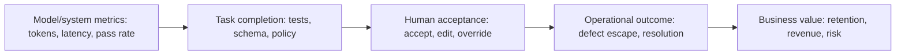
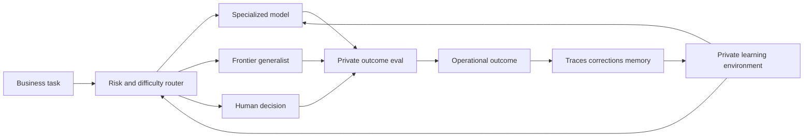
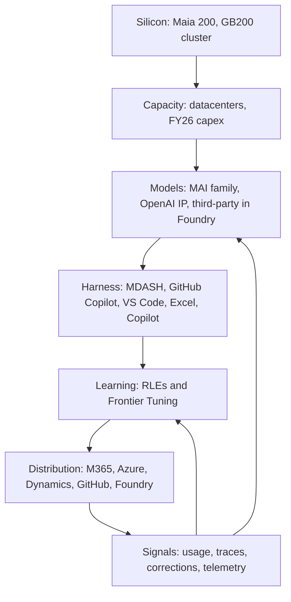

## Introduction

On July 29, 2026, Mustafa Suleyman published [Optimizing the frontier performance curve](https://microsoft.ai/news/optimizing-the-frontier-performance-curve/) for Microsoft AI. It is short. Reading it as a standalone lab post, however, misses the point.

The same day, Microsoft released its [FY26 Q4 results](https://www.microsoft.com/en-us/investor/earnings/fy-2026-q4/press-release-webcast), where Satya Nadella's quote begins:

> We are advancing the frontier on the cost-to-outcome curve, ensuring every customer can turn tokens into business results.

Suleyman closes his post with “we are hill-climbing to move the frontier on the cost-to-outcome curve.” <strong>The same vocabulary appears on the same day in both a model-team blog post and a CEO earnings quote.</strong> This is a technical observation and an investor-facing operating frame at once. Read only as the former, it is hard to explain why Microsoft is actively promoting the idea of not using the largest available model.

The argument is not merely that smaller models can be useful:

1. Do not send every task to the largest general-purpose model; allocate models by task difficulty.
2. Move evaluation from standalone model benchmarks to real customer outcomes relative to cost.
3. Co-optimize models, agent harnesses, and reinforcement learning environments (RLEs).
4. Still keep product context, memory, and action spaces independent of any one model family.
5. Serve specialized, compact models across hardware generations, including A100s and H100s.

Read alongside Satya Nadella's [A frontier without an ecosystem is not stable](https://snscratchpad.com/posts/frontier-ecosystem/) and [The Reverse Information Paradox](https://snscratchpad.com/posts/reverse-information-paradox/), this stops being an inference-cost strategy. It becomes an architectural and political-economic argument about whether a firm owns the evaluations, traces, corrections, and memories that make its AI system improve.

The central conclusion of this essay is:

> <strong>The new unit of the frontier is not a model. It is the whole system that classifies work, selects a model, verifies the result, and learns from the outcome. Its advantage comes from the variance of task difficulty and the cheapness of verification.</strong>

There is a tension. Outcome per dollar, model substitutability, and reuse of older GPUs do not automatically reinforce one another. Tight model-harness coupling can improve local performance while reducing substitutability. A longer accounting life does not guarantee favorable economics once power and rack opportunity costs are included. And whoever owns the definition of a successful outcome can capture the value generated by the learning loop.

## 1. Separating Facts, Self-Reported Results, and Interpretation

The first task when reading announcements like these is to sort claims by how independently checkable they are.

| Claim | Source | Verifiability |
|---|---|---|
| MDASH plus MAI-Cyber-1-Flash reaches 95.95% on CyberGym, 12 points above Mythos | [MAI-Cyber-1-Flash post](https://microsoft.ai/news/introducing-mai-cyber-1-flash-inside-mdash/) | Public benchmark, but measured by Microsoft; the number is for a system including GPT-5.4, not a standalone model |
| 50% cost saving versus MDASH's current best offering (GPT-5.4 + 5.4 mini + 5.3 codex) | Same | The comparator is Microsoft's own current configuration, not a competitor's system |
| MAI-Cyber-1-Flash handles up to 90% of tasks, with the remaining 10% sent to GPT-5.4 | Same | A design target for MDASH, not a general law |
| MAI-Code-1-Flash has 5B active parameters and scores 51% on SWE Bench Pro | [Build 2026 keynote](https://microsoft.ai/news/microsoft-build-2026-mai-keynote-transcript/) | Explicitly an internal benchmark run with a harness; harness quality affects the score |
| About 10% higher acceptance and 10% lower median token usage than GPT-5.4 Mini and Claude Haiku 4.5 in VS Code | [Copilot and Excel post](https://microsoft.ai/news/hill-climbing-mai-models-for-github-copilot-and-excel/) | Production in-product metrics; cohorts, allocation, and intervals are not published |
| The Excel model is on par with GPT-5.6 for the most common tasks and can be served on A100/H100 | Same | Vendor-reported and scope-limited; not equivalence across the long tail |
| Frontier Tuning produced the highest win rate for McKinsey at roughly 10x lower cost | Keynote and [Frontier Tuning](https://microsoft.ai/models/microsoft-frontier-tuning/) | The comparator is GPT-5.5, and the footnote metric is output tokens per dollar, stated as a projection from public pricing and scaled serving-cost differentials rather than a measured invoice |
| 40% better performance per watt for MAI models on Maia 200 | [July 29 post](https://microsoft.ai/news/optimizing-the-frontier-performance-curve/) | The “40%” appears only here, with no baseline stated. The June [seven-model post](https://microsoft.ai/news/building-a-hillclimbing-machine-launching-seven-new-mai-models/) says “a 1.4x efficiency boost”; the [keynote](https://microsoft.ai/news/microsoft-build-2026-mai-keynote-transcript/) reports “a further 1.4x performance-per-watt gain” head-to-head against GB200 |

The timeline matters as much as the numbers.

| Date | Event |
|---|---|
| 2026-06-02 | Build 2026: seven MAI models (Thinking-1, Code-1-Flash, Image-2.5, Transcribe-1.5, Voice-2, and more) plus Frontier Tuning |
| 2026-07-23 | Production metrics from GitHub Copilot and Excel |
| 2026-07-27 | MDASH with MAI-Cyber-1-Flash |
| 2026-07-29 | The cost-to-outcome post and FY26 Q4 results |

One detail deserves attention. In June the Excel-adapted model was described as comparable to GPT-5.4 while up to 10x more efficient; in July it is described as on par with GPT-5.6 for the most common tasks. <strong>The comparator generation changed within two months.</strong> The measurement basis changed too: June cited public and private benchmarks, July cites user feedback from production traffic, and the “10x more efficient” phrasing disappeared. Efficiency comparisons move both the numerator (quality) and the denominator (price) against a target that is itself changing, so they are meaningless without a fixed date and version. Readers should always ask which comparator, measured how, and when.

With that triage in place, the important structural point is that the horizontal axis of Microsoft's “performance curve” is neither model size nor inference compute. It is the <strong>economics of a system</strong> assembled from models, data, a harness, an RL environment, and deployment hardware.

Formally, for a system $S$ consisting of a model set, harness, router, and hardware configuration, define accepted outcomes per unit time $O(S)$ and total cost $C(S)$, and consider the Pareto surface of $(C, O)$. Conventional “frontier model” discourse uses a single model's benchmark score as a proxy for that surface. The claim here is that <strong>the Pareto surface of systems can dominate the Pareto surface of single models.</strong>

A point that maintains quality at half the cost therefore moves the frontier, just as a point that improves quality at the same cost does. Instead of competing only for the northeast-most point produced by the largest model, product teams choose among points on a portfolio curve.

## 2. What It Means to Tier Tasks

“Small model for easy work, large model for hard work” is intuitive, but difficulty is not a fixed property of an input. It depends on available context, tools, decomposition, memory, and verification.

Finding a vulnerability in a large repository may be intrinsically hard for a model presented with the raw codebase. A harness can partition the repository, retrieve relevant history, narrow candidates, run tests, and validate proposed patches. The residual problem presented to the model becomes much smaller. <strong>A good harness does not merely make a model appear smarter; it transforms the task into an easier one.</strong>

A production hierarchy usually needs at least four levels.

| Tier | Typical work | Suitable executor | Required gate |
|---|---|---|---|
| Deterministic and routine | Schema conversion, retrieval, known rules | Conventional code, search, workflow engine | Schema and rule validation |
| Frequent and specialized | Repeated product-specific work | Compact specialist model | Private eval, confidence gate, sampled audit |
| Rare and complex | Long reasoning, novel combinations, ambiguous requests | Frontier generalist or multiple models | Strong verification, budget cap, retry control |
| High-impact and irreversible | Production changes, legal, medical, or financial decisions | Human-AI joint decision | Approval, separation of duties, audit trail |

For a task $x$, choosing a model $m$ and harness configuration $h$ is better expressed by constraining quality and severe loss while minimizing cost than by subtracting quantities with unlike units:

$$
(m^*, h^*) = \arg\min_{m,h} C_{\mathrm{total}}(x,m,h)
\quad \text{s.t.} \quad
\Pr(\mathrm{pass} \mid x,m,h) \geq 1-\delta,\;
\Pr(L > L_{\max} \mid x,m,h) \leq \varepsilon
$$

Here, pass is the task-specific evaluation contract, $\delta$ is the tolerated failure probability, and $\varepsilon$ is the tolerated probability of a severe loss. The router's job is therefore not to pick the cheapest model. It is to select the cheapest path likely to produce an acceptable result within a risk bound. A false-easy classification can be much more expensive than an unnecessary escalation, so router evaluation must weight the consequences of each error, not just report classification accuracy.

### When Does a Cascade Actually Pay?

Whether “send 90% to the small model” pays can be checked with a simple model. Consider trying the small path first, verifying, and escalating when verification fails.

- $\alpha$: fraction of tasks the small path alone can complete acceptably
- $c_s, c_l$: cost of the small and large paths
- $c_v$: cost of verification (tests, reproduction, schema, judge)
- $d$: probability that the verifier detects a failure
- $L$: loss from a failure that passes undetected

Expected cost is:

$$
\mathbb{E}[C_{\mathrm{cascade}}]
= c_s + c_v + (1-\alpha)\,d\,c_l + (1-\alpha)(1-d)\,L
$$

Compared with always using the large path at cost $c_l$, and assuming perfect detection ($d=1$), the break-even condition is strikingly simple:

$$
c_s + c_v < \alpha\, c_l
$$

Three practical consequences follow.

<strong>First, what matters is not that the model is cheap but that verification is cheap.</strong> With $\alpha = 0.9$, the small path may cost up to 90% of the large path. That looks permissive. But if verification costs 30% of the large path, the small model itself must cost less than 60%. Strictly, $c_s$ and $c_v$ enter the inequality symmetrically; in practice small-model cost usually sits far below $\alpha c_l$, so $c_v$ is the binding term. Note also that the always-large baseline assumes that path is never verified, so if it also carries $c_v$ the condition relaxes to $c_s < \alpha c_l$, making the stated break-even conservative.

<strong>Second, cascades work best where verification is cheap.</strong> Code has tests, vulnerabilities have crash reproduction, structured output has schemas. It is no accident that Microsoft's reported wins are in GitHub Copilot, Excel, and CyberGym, all oracle-rich settings. Where verification is expensive and contested, such as the persuasiveness of a proposal or the soundness of a design judgment, the same 90/10 design does not transfer. <strong>This yields a prediction: cascade-style efficiency generalizes only as fast as verification technology does.</strong>

<strong>Third, the source of the gain is the variance of difficulty.</strong> With $d=1$, the improvement over always using the large path is

$$
\Delta = \alpha\, c_l - c_s - c_v
$$

If every task were equally hard, $\alpha$ would collapse toward 0 or 1 and separating paths would be pointless. The same is true if $c_s \approx c_l$. The expression itself contains no variance term: $\Delta$ increases monotonically in $\alpha$, at $\alpha=1$ you would simply always use the small model and $c_v$ becomes pure overhead, and at $\alpha=0$ the cascade is strictly worse. What the algebra shows is that uniform difficulty makes the branching structure pointless. The stronger reading, that the advantage scales with <strong>the variance of task difficulty multiplied by the accuracy of difficulty estimation</strong>, is an interpretation built on that result rather than a consequence of the formula, which contains no difficulty classifier. It still points somewhere qualitatively different from making a model smarter.

### The Harness Moves the Difficulty Distribution Itself

$\alpha$ is not given. If the harness can split a repository, retrieve prior fixes, and run tests, tasks that previously required a large model start passing on the small path. <strong>At the margin, harness investment and model efficiency are substitutes.</strong> The same improvement in outcome per dollar can be bought with a smarter model or with better decomposition.

That has an organizational consequence. Models can be purchased; harnesses and verifiers require your own domain knowledge. <strong>The advantage that is hard to copy therefore tends to accumulate on the decomposition and verification side rather than the model side.</strong>

### 90% of Volume Is Not 90% of Value

There is one more asymmetry that is easy to miss. The 90% figure describes task counts, not the distribution of value or risk.

Critical decisions, novel attacks, and exceptional customer situations are rare by count but often central by value. That creates a lopsided payoff:

- Savings on the head are bounded above by $\alpha(c_l - c_s)$
- Losses from quality degradation in the tail have no such bound

Misrouting is also most likely near the difficulty boundary, which is frequently where value is decided. So it is fine to measure savings on a count-weighted basis, but <strong>quality gates must be monitored on value-weighted slices.</strong>

## 3. From “Model Performance” to “Outcome per Dollar”

Standalone model benchmarks are comparable and relatively reproducible. Users, however, do not buy benchmark points. They buy remediated vulnerabilities, accepted code, completed spreadsheets, and resolved cases.

“Real customer outcome per dollar” is therefore the right direction, but the denominator cannot stop at token charges.

$$
C_{\mathrm{total}} = C_{\mathrm{model}} + C_{\mathrm{harness}} + C_{\mathrm{tools}}
+ C_{\mathrm{retry}} + C_{\mathrm{review}} + C_{\mathrm{failure}} + C_{\mathrm{capacity}}
$$

Each term must be an attributed monetary cost for the same evaluation cohort. Provider charges and self-hosted capacity must not be counted twice, while inference and labor time must be converted to comparable monetary values. Latency remains a separate service metric unless its opportunity cost is explicitly monetized.

- $C_{\mathrm{model}}$: input/output tokens, inference time, provider charges
- $C_{\mathrm{harness}}$: context construction, memory, routing, and state management
- $C_{\mathrm{tools}}$: retrieval, sandboxes, external APIs, and test execution
- $C_{\mathrm{retry}}$: retries, fallbacks, and duplicate execution
- $C_{\mathrm{review}}$: human inspection and approval
- $C_{\mathrm{failure}}$: wrong answers, rework, incidents, and lost opportunity
- $C_{\mathrm{capacity}}$: accelerators, power, cooling, networking, and reserved headroom

The economically relevant metric then looks more like:

$$
\operatorname{CostPerAccepted}(\mathcal{B})
= \frac{\sum_{x \in \mathcal{B}} C_{\mathrm{total}}(x)}
{N_{\mathrm{accepted}}(\mathcal{B})}
$$

$\mathcal{B}$ is a task cohort measured over the same period and under the same accounting rules. Keeping numerator and denominator aligned prevents expensive failed attempts from disappearing from the metric.

The hard part is defining an accepted outcome. Code acceptance is visible quickly, but whether that code increases incidents or maintenance burden emerges later. A vulnerability found in a benchmark is not identical to a low-false-positive production remediation. Lower GPU cost for a voice model is not better outcome per dollar if resolution rate or customer satisfaction falls.

Evaluation therefore needs a connected ladder:

Each step downstream is closer to real value but slower to observe and more exposed to confounding factors. The answer is not to replace all metrics with one business KPI. It is to connect leading and lagging indicators through explicit causal hypotheses and validate model, router, and harness changes progressively.

The acceptance rates, return rates, save rates, error rates, and GPU savings in Microsoft's examples are more useful than an external benchmark alone. Still, the public posts do not provide every cohort definition, traffic allocation, confidence interval, or total-cost component. They should be read as promising product signals, not independently audited universal superiority claims.

### Falling Unit Cost Does Not Mean Falling Total Spend

It is premature to assume that improving outcome per dollar reduces total spend. When unit cost falls, uses that were previously uneconomic become viable. An agent invokes a model repeatedly for planning, retrieval, attempts, verification, and repair, so <strong>lower unit cost directly invites more invocations.</strong> This is the same structure Jevons observed when more efficient coal use increased total coal consumption.

Microsoft's own framing is consistent with this. Suleyman writes that tokenmaxxing has been the story of the last few months and that token efficiency is next. Efficiency becomes a topic precisely when consumption has surged. The FY26 Q4 disclosure that commercial remaining performance obligation grew 84% to USD 678 billion also points to demand expanding alongside falling unit costs. RPO is contracted backlog, however, and this growth can include large related-party commitments such as OpenAI's USD 250 billion Azure purchase discussed in Section 6. It is suggestive of demand, not evidence of broad token-level demand.

The operational implication is clear: measure the effect of efficiency in cost per unit, but manage budgets in total spend. Conflating the two produces the familiar outcome of a successful efficiency program accompanied by a budget overrun.

## 4. The Enterprise Learning Loop Connecting the Three Essays

In [A frontier without an ecosystem is not stable](https://snscratchpad.com/posts/frontier-ecosystem/), Nadella distinguishes human capital, including knowledge, judgment, relationships, and pattern recognition, from token capital, the AI capability a firm builds and owns. The opportunity is not a one-time choice of the best model, but a loop in which both forms of capital compound.

[The Reverse Information Paradox](https://snscratchpad.com/posts/reverse-information-paradox/) sharpens the ownership problem. To make purchased intelligence useful, a customer reveals proprietary prompts, tool use, failures, corrections, and evaluations. The buyer pays not only in money but also in the institutional knowledge that specifies what good performance means. If that “intelligence exhaust” improves only the provider's system, learning and value accumulate in one direction.

Combined with Suleyman's system-level performance curve, the architecture looks like this:

The model is one replaceable executor within this loop. The firm's distinctive assets move elsewhere:

- Private evaluations that encode what counts as a good result
- Successful and failed trajectories, tool results, and correction history
- Organization-specific context, memory, permissions, and action spaces
- The router that estimates task difficulty and risk
- The learning environment that connects actions to field outcomes

These assets are also prerequisites for outcome-per-dollar optimization. Without an owned measure of outcome quality, a firm cannot tell whether moving traffic to a cheaper model preserved value. <strong>Sovereignty, resilience, and cost efficiency are distinct requirements linked by a private evaluation layer, but each also depends on additional controls.</strong> Sovereignty requires data rights and portability, resilience requires alternate paths and capacity, and cost efficiency requires full-cost measurement.

### Microsoft Has Productized This Loop

What makes this more than theory is that Nadella's argument about distributing the learning loop already has a product name.

[Microsoft Frontier Tuning](https://microsoft.ai/models/microsoft-frontier-tuning/) adapts MAI models inside reinforcement learning environments built from a customer's own workflows. The [seven-model post](https://microsoft.ai/news/building-a-hillclimbing-machine-launching-seven-new-mai-models/) describes these RLEs as training gyms for AI, accessible only to you. Its four stated properties map almost directly onto Nadella's requirements.

| Frontier Tuning claim | Corresponding argument |
|---|---|
| Your data stays in your environment | Establishing a trust boundary |
| Cost-efficient | Improving outcome per unit of spend |
| Knows your work, your terms, your context | Internalizing “company veteran” capability |
| You control the model, no vendor lock-in | Choice and control |

The Build keynote goes further: with MAI you do not rent intelligence from a shared model that learns from everyone, and the RLEs and models you build inside them become your moat. That is a commercial answer engineered against exactly the problem raised in [The Reverse Information Paradox](https://snscratchpad.com/posts/reverse-information-paradox/), where the buyer pays twice, once in money and again in revealed knowledge.

The clearest example is the Mayo Clinic collaboration. The two organizations co-develop a frontier healthcare model, deploy it first inside Mayo Clinic's environment, and the [seven-model announcement](https://microsoft.ai/news/building-a-hillclimbing-machine-launching-seven-new-mai-models/) states explicitly that <strong>the resulting frontier model will be owned by Mayo Clinic.</strong> Assigning ownership to the party that contributed the knowledge is a concrete response to the paradox. The same post also states that, once validated, the model will be made available to other organizations via Microsoft Foundry. Ownership sits with Mayo Clinic while the distribution channel remains Microsoft's.

A structural caveat remains. This sovereignty is granted inside Microsoft's tenant boundary and on Microsoft's learning infrastructure. <strong>Sovereignty is conferred by the platform rather than independent of it.</strong> What separates real ownership from branding is not the promise but the operational answers to four questions:

- Can the weights be exported, and can exported weights be served elsewhere?
- Can the RLE definition, rewards, graders, and evaluation sets be exported?
- Contractually, which party may learn from traces and corrections?
- When the relationship ends, what remains and what disappears?

These four questions are the practical test for every “your own model” offer, including Frontier Tuning.

## 5. Model Independence Is More Than a Common API

Microsoft AI's argument contains a productive tension. It advocates co-optimizing model, harness, and RL environment, while also insisting that models remain substitutable. The former appears to favor coupling; the latter favors modularity.

The way through is to stabilize the <strong>outcome contract</strong>, not force every implementation to be identical.

Model independence has at least six layers.

| Layer | Source of lock-in | Required control |
|---|---|---|
| Connectivity | APIs, authentication, streaming, tool-call formats | Provider adapters and normalized internal events |
| Behavior | Instruction following, tool choice, long-context behavior, refusal tendencies | Model-specific prompt/tool adapters and regression evals |
| State | Provider threads, caches, and memory | Organization-owned canonical state and exportable history |
| Evaluation | Model-shaped judges or thresholds | Fixed verifiers, human calibration, cross-model holdouts |
| Learning | Fine-tunes, feedback, and trace-use rights | Data rights, portable datasets, contractual permission to learn |
| Operations | Quotas, regions, prices, and proprietary hardware | Fallbacks, multi-region capacity, cost observability |

A lowest-common-denominator abstraction that sends every model the same prompt and demands byte-for-byte equivalent behavior can erase the gains from specialization. It is better to fix the input, output, safety, and verifiability contract while allowing model-specific adapters to optimize how that contract is met.

The real test of substitutability is not whether a settings page lists several models:

> Remove one primary model, rerun the private evaluations, and restore acceptable service within a defined time and cost budget.

Only after this model-removal drill can a firm claim that its “company veteran” capability remains in the system rather than in one model.

There is a further platform question. If models are swappable but evaluations, learning environments, memory, and the harness remain trapped in a cloud provider's closed service, lock-in has merely moved up the stack. For the three Microsoft arguments to hold from the customer's perspective, firms need not only model choice but also the right to export the learning-loop artifacts and replay them on another execution substrate.

On this point Microsoft has provided checkable evidence, at least at the model layer. MAI models are distributed not only through Foundry but also via OpenRouter, Fireworks, and Baseten, and the keynote states that developers can tune the weights themselves for the first time. That is portability that can be inspected rather than merely asserted. The open question is how far the layers above it, namely RLEs, evaluations, and memory, can travel.

## 6. Reading This as Microsoft's Corporate Strategy

So far this essay has examined whether the arguments hold. The next question is why Microsoft is making them now, and in this particular vocabulary.

### 6-1. Where the Control Points Sit in a Vertically Integrated Stack

By 2026 Microsoft is one of very few companies that can line up the entire path from silicon to distribution.

Laying out what each layer does clarifies what this series of posts is actually selling.

| Layer | Examples | Strategic function |
|---|---|---|
| Silicon | Maia 200, GB200 clusters | Optimize performance per watt in-house; reduce dependence on external supply |
| Capacity | Datacenters; FY26 capex of USD 115.9 billion | Secure volume under supply constraints |
| Models | Seven MAI models, OpenAI IP, third-party models in Foundry | A portfolio by use case rather than a single-family dependency |
| Harness | MDASH, GitHub Copilot, VS Code, Excel | The layer that reshapes difficulty and makes verification cheap |
| Learning | RLEs, Frontier Tuning | Converts customer know-how into a repeatable asset |
| Distribution | M365, Azure, Dynamics, GitHub | Places a reason to use the models directly in users' hands |
| Signals | Usage logs, corrections, security telemetry | Raw material for the next learning cycle |

The MDASH post emphasizes the thickness of that last layer, citing more than 100 trillion security signals per day and operational insight from 1.6 million customers, alongside the claim that no one can manufacture this history. <strong>Models can be replicated; the stream of corrections and outcomes from live products cannot.</strong> The consistent thesis across these posts is to move competition away from model cleverness and toward that non-replicable asset.

### 6-2. The OpenAI Relationship Requires a Two-Track Strategy

The decisive context is the [restructured Microsoft-OpenAI agreement](https://blogs.microsoft.com/blog/2025/10/28/the-next-chapter-of-the-microsoft-openai-partnership/) announced on October 28, 2025. Its published terms include:

- Microsoft holds an investment in OpenAI Group PBC valued at approximately USD 135 billion, roughly 27% on an as-converted diluted basis
- OpenAI remains Microsoft's frontier model partner, with exclusive IP rights and Azure API exclusivity until AGI
- An AGI declaration is made by OpenAI and will be verified by an independent expert panel
- Microsoft's IP rights for models and products extend through 2032 and now include post-AGI models with appropriate safety guardrails
- Research IP rights run until AGI verification or 2030, whichever comes first
- <strong>Microsoft can now independently pursue AGI alone or with third parties</strong>
- If Microsoft uses OpenAI's IP to develop AGI before AGI is declared, the models are subject to compute thresholds, described as significantly larger than the systems used to train today's leading models
- OpenAI contracted to purchase an incremental USD 250 billion of Azure services, while Microsoft's right of first refusal as compute provider was removed

Microsoft therefore retains broad access to OpenAI IP for now while also opening its own path. That clarifies where MAI sits.

<strong>The claim that every model should be substitutable is simultaneously a customer-facing architectural principle and Microsoft's own supply-chain strategy.</strong> If harness, context, memory, and action space are model-independent, then substituting in first-party models, running several vendors in parallel, and absorbing contractual change all become cheap. Consistent with a portfolio stance, FY26 Q4 results also included a USD 3.2 billion gain from Microsoft's investment in Anthropic. Building, investing, and reselling are running at once rather than betting on a single lab.

### 6-3. Why Efficiency Became a Management Metric

The numbers show that efficiency is a financial requirement, not a philosophy. From the FY26 results, for the year ended June 30, 2026:

| Measure | FY26 | Prior year |
|---|---|---|
| Revenue | USD 331.8 billion | USD 281.7 billion |
| Operating income | USD 155.2 billion | USD 128.5 billion |
| Additions to property and equipment (capex) | USD 115.9 billion | USD 64.6 billion |
| Property and equipment, net (period end) | USD 313.1 billion | USD 205.0 billion |
| Depreciation, amortization, and other | USD 38.5 billion | USD 29.4 billion |

Revenue grew 18% while capex grew roughly 80%. Demand is strong: Azure revenue passed USD 100 billion for the first time in a fiscal year, and Microsoft 365 Copilot surpassed 30 million paid seats. But <strong>when capital deployment outruns revenue growth, lowering cost per token and per outcome becomes a precondition for defending gross margin.</strong>

That is where the compact MAI models, Maia 200 performance per watt, the use of a heterogeneous fleet including A100s, and task tiering all connect. Before it is marketing language, the cost-to-outcome curve is a management metric for a business that has become far more capital-intensive.

### 6-4. The Two Faces of the Ecosystem Argument

Nadella's essays argue that a future in which value concentrates in a few models is not politically or economically sustainable. The argument is persuasive on its own terms. It is still worth noting the following.

As the model layer commoditizes, relative value accrues to whoever holds evaluation, RLEs, memory, the harness, and distribution. Microsoft holds precisely those layers. <strong>Advocating model substitutability lowers the importance of a layer Microsoft does not monopolize and raises the importance of layers where it is strong.</strong> That is neither contradictory nor deceptive; it is coherent platform strategy. Customers should simply negotiate with the structure in view.

The practical question reduces to one line:

> Is the freedom to switch models guaranteed as strongly, contractually, as the freedom to take the learning loop with you?

If only the former is guaranteed, lock-in has not been removed. It has moved one layer up.

## 7. The H100 Is Not a Six-Year-Old Generation

The hardware chronology matters.

- NVIDIA [announced the A100 in full production and shipping on May 14, 2020](https://nvidianews.nvidia.com/news/nvidias-new-ampere-data-center-gpu-in-full-production). It was roughly a six-year-old generation in July 2026.
- NVIDIA [announced the H100 on March 22, 2022, with availability planned from the third quarter](https://nvidianews.nvidia.com/news/nvidia-announces-hopper-architecture-the-next-generation-of-accelerated-computing). It was roughly a four-year-old generation in July 2026.

The claim that a current specialized model can run on a GPU generation introduced roughly six years earlier therefore applies to the A100, not the H100. Microsoft's [article on the Excel-adapted MAI model](https://microsoft.ai/news/hill-climbing-mai-models-for-github-copilot-and-excel/) explicitly names both A100 and H100 and emphasizes that the model does not require only the newest accelerators. The July 29 post likewise notes that MDASH with MAI-Cyber-1-Flash is served on H100s as well. Microsoft does not disclose the acquisition date of the units used for these workloads.

This is more than backward compatibility. Routing 90% of work toward compact models naturally creates a hierarchy of compute as well as a hierarchy of tasks.

| Workload | Model | Hardware placement logic |
|---|---|---|
| High-volume, routine, latency-tolerant | Quantized or specialized compact model | Seek high utilization on installed capacity such as A100s |
| Interactive and throughput-sensitive | Efficient mid-sized model | Choose H100s or first-party silicon by performance per watt |
| Rare and exceptionally hard | Frontier generalist with extended reasoning | Use the newest generation only when required |
| Training and major updates | Large-scale training or RL | Concentrate on current clusters with fast interconnects |

The question is not whether new or old GPUs are categorically better. System advantage comes from placing the right work on each layer of a heterogeneous fleet.

## 8. Is This an Answer to Criticism of Longer Depreciation Lives?

There is a real connection to cloud providers' accounting changes.

According to [Microsoft's FY2023 Form 10-K](https://www.sec.gov/Archives/edgar/data/789019/000095017023035122/msft-20230630.htm), the company increased the estimated useful lives of server and network equipment from four to six years in July 2022. It cited software investments that increased operating efficiency, along with advances in technology. The estimate change increased FY2023 operating income by $3.7 billion and net income by $3.0 billion.

[Alphabet's FY2023 Form 10-K](https://www.sec.gov/Archives/edgar/data/1652044/000165204424000022/goog-20231231.htm) reports a January 2023 change from four to six years for servers and from five to six years for certain network equipment. It reduced 2023 depreciation expense by $3.9 billion and increased net income by $3.0 billion.

Four different notions of life need to remain separate.

| Type of life | Question |
|---|---|
| Physical life | Does the equipment still power on, operate reliably, and remain repairable? |
| Technical life | Does the software stack support it, and can it run the required model? |
| Economic life | Is it still worth operating after power, cooling, maintenance, rack, and opportunity costs? |
| Accounting useful life | Over how many years does management estimate that the asset's economic benefits are consumed? |

Hardware that functions for six years is not necessarily economical for six years. Conversely, an accelerator that cannot host the largest current model may regain value through compression and specialization. An accounting useful life is a portfolio estimate, not a promise that each GPU will keep the same role through year six.

Does serving a current specialist on A100s answer criticism of the six-year estimate?

<strong>In the weak sense, it does provide an answer.</strong> Serving the Excel-adapted model on A100-class GPUs is later evidence consistent with Microsoft's software-efficiency rationale: a GPU generation introduced roughly six years earlier remains technically usable for this workload. Microsoft does not disclose the age or full economics of the deployed A100 capacity, including power, rack, maintenance, utilization, and opportunity costs.

<strong>In the strong sense, it does not prove the estimate was right.</strong>

1. The accounting change happened in 2022, four years before these 2026 product posts. This is later evidence consistent with the estimate, not a contemporaneous rebuttal.
2. One Excel model's A100 compatibility does not establish six-year economics for the whole server fleet.
3. Lower depreciation expense does not remove cash costs for power, cooling, failures, parts, or scarce rack space.
4. If a new accelerator's performance per watt is sufficiently better, it can still have lower cost per accepted outcome than an older GPU with little book value.
5. The July post reports “40% better performance per watt” for MAI models on Maia 200 without stating a baseline. The June Build keynote describes benchmarking MAI-Thinking-1 on Maia 200 head-to-head against the GB200 and reports “a further 1.4x performance-per-watt gain,” explicitly stacked on top of a 30% improvement mentioned separately. How those two figures compose is not determinable from public information, so the 40% number should not be treated as a standalone comparison.

There is also a change in scale that alters the stakes of the whole debate.

| As of | Property and equipment, net |
|---|---|
| June 30, 2023 | USD 95.6 billion |
| June 30, 2026 | USD 313.1 billion |

When the estimate changed in 2022, the effect was to increase FY2023 operating income by USD 3.7 billion. The asset base is now roughly 3.3 times larger, and FY26 capex alone reached USD 115.9 billion. <strong>The consequence of a one-year error in the same assumption is far greater than it was then.</strong> Depreciation also lags investment, so margins during a capex surge reflect the amortization of older and cheaper vintages. Whether a six-year assumption was right will show up in the income statement over the next several years.

Against that scale, the evidentiary weight of an Excel model running on A100s can be sized honestly. It is a technical fact about one workload in one product, and it is far too small to underwrite the economics of a fleet measured in hundreds of billions of dollars.

One further point: under power constraints the decision criterion changes. Write cost per accepted outcome for generation $g$ as

$$
c_g = \frac{D_g + E_g + M_g + O_g}{N_g}
$$

where $D$ is depreciation, $E$ is power and cooling, $M$ is maintenance, $O$ is the opportunity cost of rack space and power budget, and $N$ is accepted outcomes per unit time. As depreciation runs off, $D_{\text{old}}$ shrinks, but $N_{\text{old}}$ is small too. When the power envelope binds, the relevant comparison becomes accepted outcomes per watt, and the shadow price of a watt enters $O$. In that regime <strong>an older generation can become uneconomic even at zero book value.</strong> Microsoft emphasizing both older-generation support and first-party silicon performance per watt is not a contradiction; both follow from the same constraint.

A more precise conclusion is therefore:

> A100 compatibility is not proof that six-year depreciation was correct. It is an example of the operating hypothesis that a GPU generation introduced roughly six years earlier can still support a current workload. The age of individual assets and the economics including the power envelope require separate evidence.

Testing that hypothesis requires generation-specific measurements of accepted outcomes, energy, occupancy time, failure and maintenance cost, routing latency, and the opportunity value of freeing newer accelerators for other workloads. The current estimate itself is disclosed in each company's latest annual report; for Microsoft that is the accounting-policies note of the [FY2026 Form 10-K filed July 29, 2026](https://www.sec.gov/Archives/edgar/data/789019/000119312526323660/0001193125-26-323660-index.html). This essay relies only on the 2022 change as a verified fact.

## 9. The Strengths and Risks of the Strategy

### Strength 1: Less dependence on a frontier model

If specialist models handle routine work, shortages, price changes, outages, or policy changes affecting the largest model are less likely to stop the service. This is a capacity hedge as much as a cost optimization.

### Strength 2: Product use becomes a learning signal

Acceptance, correction, retries, and final outcomes can feed a product-native evaluation or RL environment. That signal can create domain capability that raw scale alone does not provide.

### Strength 3: Installed hardware can receive a new role

Rather than treating older accelerators as a bridge until a full refresh, a task/model/hardware routing system can operate them as a durable tier in a heterogeneous fleet. That matters in a capital-intensive cloud business.

The corresponding risks are substantial.

### Risk 1: The system optimizes only what it can measure

Aggressively optimizing code acceptance or save rate can favor immediately agreeable output at the expense of maintainability, safety, or long-term user learning. A private eval captures value, but also narrows and governs the meaning of value.

### Risk 2: The router becomes a new single point of failure

Multiple models do not provide resilience if one biased router sends a large volume of work down a cheap but unsafe path. The router needs shadow evaluation, calibration, and slice-level monitoring of false-easy errors.

### Risk 3: Ownership of the learning loop concentrates power

As models become easier to replace, the platform that owns evaluations, history, memory, and the harness becomes more valuable. If the customer does not own those assets, removing model lock-in can strengthen learning-loop lock-in.

### Risk 4: Specialization is vulnerable to distribution shift

A model optimized for the common 90% can misroute abruptly when product behavior, attack methods, or user workflows change. Frontier models and humans must remain exploration paths, and novel failures must become new evaluations.

### Risk 5: The publisher and the evaluator are the same party

Nearly all of the efficiency claims discussed here were measured by Microsoft and published as blog posts. That is a weaker form of verification than audited financial disclosure. A vendor also has a financial motive to tell an efficiency story precisely when its business is becoming more capital-intensive. Motive does not invalidate a claim, but <strong>readers must check, every time, who measured what population against which comparator and when.</strong> The Excel model's comparator moving from GPT-5.4 to GPT-5.6 within two months illustrates why.

### Risk 6: The efficiency story can obscure the demand question

If unit cost falls while total spend rises, the essential question for an investor is not whether efficiency improved but whether the additional spend produced proportionate outcomes. The cost-to-outcome framing is well suited to that question, yet it can also be used to present the denominator without the numerator. When evaluating the curve, always confirm the definition and measurement of the outcome side first.

## 10. What a Firm Should Measure

Adopting this strategy should begin with evaluation design, not model procurement.

1. <strong>Define outcomes</strong>: Agree on pass conditions, forbidden outcomes, and long-term lagging indicators with accountable business owners.
2. <strong>Slice the tasks</strong>: Separate work by frequency, difficulty, reversibility, maximum loss, and required tools.
3. <strong>Record total cost</strong>: Attribute retries, tools, human review, failures, and capacity cost, not only tokens.
4. <strong>Shadow the router</strong>: Let it recommend paths before controlling traffic, and compare quality and cost against the current route.
5. <strong>Fix the outcome contract</strong>: Allow provider-specific optimization while sharing evaluations, schemas, and safety gates.
6. <strong>Keep learning assets inside the organizational boundary</strong>: Secure rights to traces, corrections, judge outputs, memories, and datasets, not just prompts.
7. <strong>Run model-removal drills</strong>: Measure recovery time, quality loss, and incremental cost without a primary model.
8. <strong>Evaluate hardware with the same outcome metric</strong>: Compare accepted outcomes per dollar and per watt by accelerator generation, not hourly GPU price alone.

A useful operational dashboard includes at least these dimensions.

| Dimension | Representative measures |
|---|---|
| Quality | Task pass rate, severe failure rate, long-term defects, worst slice |
| Routing | False-easy rate, unnecessary escalations, fallback success, model concentration |
| Cost | Total cost per accepted outcome, retry cost, human review time |
| Experience | p50/p95 latency, abandonment, edit distance, repeat use |
| Resilience | Recovery time in model-removal drills, replacement-provider eval pass rate |
| Capital efficiency | Utilization by GPU generation, performance per watt, outcome per rack-hour |
| Sovereignty | Share of traces leaving the boundary, portable learning assets, data-use rights |

## 11. Conclusion: The Frontier Becomes a Portfolio

The most important part of Microsoft AI's argument is not that a smaller model can sometimes produce a frontier-level score. It is the change in subject: <strong>the frontier is now defined by the deployed system as a whole rather than by a model alone.</strong>

That system sends common work to specialists, the difficult tail to frontier generalists, and high-impact decisions to people. It also allocates work across A100s, H100s, current accelerators, and first-party silicon. Private evaluations measure the result, while corrections and traces feed the next learning cycle. This is the loop connecting Nadella's human capital and token capital.

Competitive advantage is therefore less likely to come from having contracted with this month's smartest model. It comes from defining good outcomes, preserving evaluation and memory when a model disappears, and continuously rearranging tasks and compute.

The older-GPU question follows the same logic. Technical operability and economic usefulness are different. But if specialization and routing create suitable work for the A100 generation introduced roughly six years earlier, software can preserve technical usefulness and may extend economic life when the full cost supports it. That does not fully vindicate a six-year accounting life, but it turns the claim into something operationally testable.

Seen as corporate strategy, this series of posts does three things at once. It explains, in technical language, why a business that has become far more capital-intensive must lower unit costs. It presents, as a customer-facing principle, an architecture that preserves room to substitute first-party models while the OpenAI relationship continues. And it shifts competition toward evaluation, RLEs, memory, and distribution by commoditizing the model layer.

None of that is necessarily bad for customers. Frontier Tuning and the Mayo Clinic ownership terms are concrete answers to the reverse information paradox. What matters is <strong>not accepting the offer at face value but testing it through portability and contract.</strong>

The final question is not whether a firm has the strongest model.

> <strong>Can it compound one dollar of compute, one human correction, and one workflow trace into the next better outcome, and can it keep that compounding on its own side of the boundary?</strong>

That is the frontier beyond the model.

## References

- [Mustafa Suleyman, “Optimizing the frontier performance curve,” Microsoft AI, 2026-07-29](https://microsoft.ai/news/optimizing-the-frontier-performance-curve/)
- [Microsoft AI, “Hill-climbing MAI models for GitHub Copilot and Excel,” 2026-07-23](https://microsoft.ai/news/hill-climbing-mai-models-for-github-copilot-and-excel/)
- [Mustafa Suleyman and Hayete Gallot, “Introducing MAI-Cyber-1-Flash inside MDASH,” Microsoft AI, 2026-07-27](https://microsoft.ai/news/introducing-mai-cyber-1-flash-inside-mdash/)
- [Mustafa Suleyman, “Building a hill-climbing machine: Launching seven new MAI models,” Microsoft AI, 2026-06-02](https://microsoft.ai/news/building-a-hillclimbing-machine-launching-seven-new-mai-models/)
- [Microsoft AI, “Microsoft Build 2026: MAI keynote transcript,” 2026-06-02](https://microsoft.ai/news/microsoft-build-2026-mai-keynote-transcript/)
- [Microsoft Frontier Tuning](https://microsoft.ai/models/microsoft-frontier-tuning/)
- [Microsoft, “Earnings Release FY26 Q4,” 2026-07-29](https://www.microsoft.com/en-us/investor/earnings/fy-2026-q4/press-release-webcast)
- [Microsoft, “The next chapter of the Microsoft–OpenAI partnership,” 2025-10-28](https://blogs.microsoft.com/blog/2025/10/28/the-next-chapter-of-the-microsoft-openai-partnership/)
- [Satya Nadella, “A frontier without an ecosystem is not stable,” sn scratchpad, 2026-06-14](https://snscratchpad.com/posts/frontier-ecosystem/)
- [Satya Nadella, “The Reverse Information Paradox,” sn scratchpad, 2026-07-12](https://snscratchpad.com/posts/reverse-information-paradox/)
- [Microsoft Corporation, Form 10-K for FY2023](https://www.sec.gov/Archives/edgar/data/789019/000095017023035122/msft-20230630.htm)
- [Alphabet Inc., Form 10-K for FY2023](https://www.sec.gov/Archives/edgar/data/1652044/000165204424000022/goog-20231231.htm)
- [NVIDIA, “NVIDIA’s New Ampere Data Center GPU in Full Production,” 2020-05-14](https://nvidianews.nvidia.com/news/nvidias-new-ampere-data-center-gpu-in-full-production)
- [NVIDIA, “NVIDIA Announces Hopper Architecture,” 2022-03-22](https://nvidianews.nvidia.com/news/nvidia-announces-hopper-architecture-the-next-generation-of-accelerated-computing)

This article reflects public information available as of August 3, 2026. Product metrics, model names, pricing, and deployment configurations can change quickly; deployment decisions should use current primary sources and organization-specific evaluations.