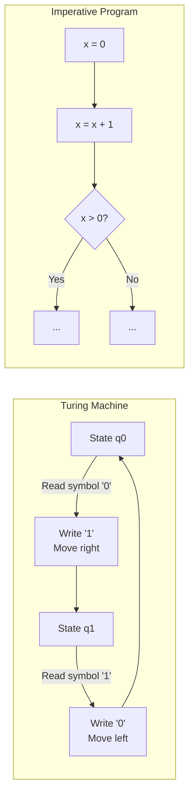
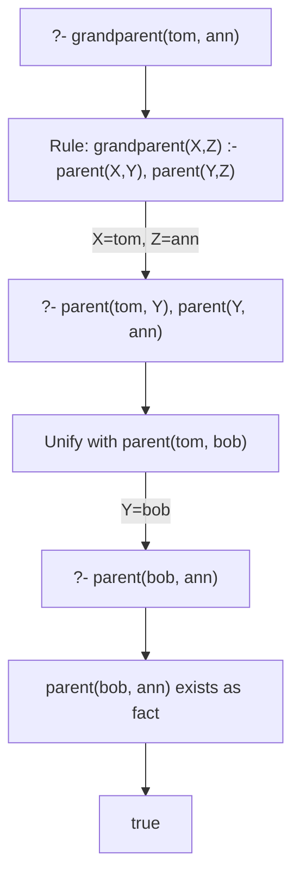
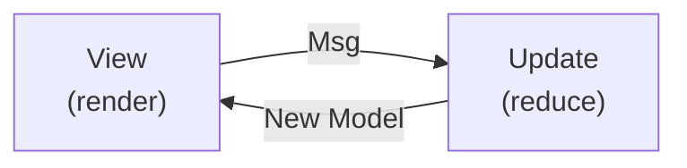

When learning a programming language, it's tempting to focus on syntax and libraries, but what truly matters is the **paradigm** — the fundamental approach to how we frame problems and construct solutions.

Think about what happens when you move from Python to Haskell. What trips you up isn't the syntax — it's the shift in **thinking patterns**: using recursion instead of loops, not reassigning variables. Conversely, once you internalize functional thinking, you can apply the same patterns in Scala, Rust, or Elixir. A paradigm is a **common language of software design** that transcends individual languages.

This article traces the lineage of major programming paradigms back to lambda calculus and Turing machines in 1936. We'll explore the theoretical foundations, design philosophies, and concrete code examples for each paradigm, accompanied by interactive diagrams. From imperative, declarative, functional, and object-oriented to logic, reactive, and concurrency-oriented — we'll see what makes each effective for different kinds of problems, and how modern multi-paradigm languages integrate them all.

## What Is a Paradigm?

A **programming paradigm** is a mode of thinking that defines the fundamental approach to structuring programs and solving problems. Robert Floyd described the importance of paradigms in his 1978 Turing Award lecture:

> If the advancement of the general art of programming requires the continuing invention and elaboration of paradigms, advancement of the art of the individual programmer requires that he expand his repertory of paradigms.

Paradigms are not bound to specific languages — they are **frameworks for thought**. The same problem yields entirely different solutions depending on whether you think procedurally, functionally, or in an object-oriented manner.

Consider the task "filter even numbers from a list and sum them." In procedural style, you write a `for` loop with an `if` check and accumulate into a variable. In functional style, you compose `filter` and `reduce`. In SQL (declarative), you simply write `SELECT SUM(x) FROM t WHERE x % 2 = 0`. All produce the same result, but the **way of framing the problem** is entirely different. Learning paradigms means expanding your **repertoire of problem-framing approaches**.

## Historical Lineage of Paradigms

The history of programming paradigms is inseparable from the history of computing itself. Many patterns that developers use daily are rooted in theoretical discussions from decades ago. Let's begin with a bird's-eye view of when major paradigms and languages appeared.

<ParadigmTimeline />

Several important trends emerge from this timeline:

1. **Two theories in 1936** — Church's lambda calculus and Turing's Turing machine independently laid the mathematical foundations for the functional and imperative paradigms, respectively
2. **Birth of OOP in the 1960s** — Simula introduced classes and objects, and Smalltalk refined the concept into a pure OOP language
3. **Multi-paradigm era from the 1990s onward** — Languages like Scala, Rust, and Kotlin that integrate multiple paradigms became mainstream

Notably, the emergence of a new paradigm doesn't cause older ones to disappear. Imperative programming remains the workhorse for OS kernels and embedded systems, while functional programming — with over 80 years of history — has found renewed prominence in data processing and concurrent systems. Paradigms don't **replace** each other; they **accumulate**.

## Paradigm Classification

Programming paradigms broadly fall into two categories: **Imperative** and **Declarative**. Click on each paradigm to see its description.

<ParadigmTaxonomy />

---

## The Imperative Paradigm — Describing "How"

The imperative paradigm is often the first paradigm developers encounter. C, Python, JavaScript, Go — the bulk of code written in these languages is imperative. "Assign a value to a variable, branch with conditions, repeat with loops." This natural flow is the essence of the imperative paradigm, but its theoretical roots predate the invention of computers.

### Theoretical Foundation: The Turing Machine

The theoretical foundation of imperative programming is the **Turing machine**, proposed by Alan Turing in 1936. A Turing machine consists of:

- **Tape** — An infinite sequence of memory cells
- **Head** — Reads and writes at the current position on the tape
- **State transition table** — Determines the next action based on the current state and the symbol read

This model of "**having state and sequentially modifying that state according to instructions**" is the essence of imperative programming. Modern CPUs operate with memory (tape), a program counter (head), and an instruction set (state transition table) — they are direct descendants of the Turing machine.



### Procedural Programming

The most basic form of the imperative paradigm is **procedural programming**. Programs are divided into **procedures (functions)** that are called sequentially. FORTRAN (1957) and C (1972) are representative procedural languages and remain central to systems programming today.

```c
// C: The quintessential procedural language
#include <stdio.h>

// Procedure (function) definition
int factorial(int n) {
    int result = 1;            // mutable state
    for (int i = 2; i <= n; i++) {
        result = result * i;   // state modification
    }
    return result;
}

int main(void) {
    int n = 5;
    int result = factorial(n); // procedure call
    printf("%d! = %d\n", n, result);
    return 0;
}
```

Key characteristics of procedural programming:
- **Mutable variables** manage state
- **Control structures** (if/for/while) direct execution flow
- **Functions** (procedures) divide and reuse logic

Procedural programming is intuitive and easy to understand, but as programs grow larger, tracking "which function modifies which state" becomes increasingly difficult. Two distinct responses to this challenge emerged: "structured programming," which improves code organization, and "object-oriented programming," which bundles state together with the functions that operate on it. Let's look at structured programming first.

### Structured Programming

In 1968, Edsger Dijkstra published his famous paper "Go To Statement Considered Harmful" and proposed **structured programming**.

```text
Structured Programming Theorem (Böhm–Jacopini theorem):
  Any flowchart can be equivalently expressed using only these three structures:

  1. Sequence    — execute instructions in order
  2. Selection   — branching via if-then-else
  3. Iteration   — repetition via while loops

  → goto statements are unnecessary
```

This theorem mathematically proved that structured programs can be written **without relying on goto**. Languages like C, Pascal, and Ada embody this philosophy. Structured programming was a "reform within the imperative paradigm" — rather than changing the paradigm itself, it established guidelines for writing better code within the imperative model.

---

## The Declarative Paradigm — Describing "What"

While the imperative paradigm describes "**how**" to compute, the declarative paradigm describes "**what**" result is desired. The specific steps are left to the runtime.

A restaurant analogy makes this clear. Telling the kitchen "roast the chicken at 180°C for 20 minutes, season with salt and pepper, and plate it" is imperative. Simply ordering "grilled chicken, please" is declarative. SQL is a classic declarative language for precisely this reason — you specify **what** you want with `SELECT`, and the database engine optimizes the index scan order and join strategy for you.

Try the interactive demo below to experience the difference between imperative and declarative approaches to the same task.

<ImperativeVsDeclarative />

In the declarative approach, you simply describe **filtering** and **transformation** — what you want to do — while details like loop variable management and array pushing are delegated to the runtime. The major benefits of the declarative paradigm are that code intent becomes clearer and the runtime is free to optimize execution. Functional, logic, and reactive programming all descend from the declarative lineage.

---

## Functional Programming — Programming as Mathematics

Functional programming is the most influential branch of the declarative paradigm. Its core idea is that "a program is a composition of mathematical functions." While the imperative paradigm views a program as "a sequence of instructions that modify state," functional programming views it as "a combination of functions that transform inputs into outputs." This shift in perspective yields side-effect-free predictable code, easy testing, and safe concurrency.

### Theoretical Foundation: Lambda Calculus

The theoretical foundation of functional programming is the **lambda calculus (λ-calculus)**, proposed by Alonzo Church in 1936. Lambda calculus consists of just three remarkably simple elements:

```text
Lambda calculus syntax:
  e ::= x          // variable
       | λx. e     // lambda abstraction (function definition)
       | e₁ e₂     // function application

This alone constitutes a Turing-complete model of computation.
```

The central operation in lambda calculus is **β-reduction**. Step through the demo below to see it in action.

<LambdaCalculusVisualizer />

As Church encoding demonstrates, numbers, booleans, and data structures can **all be represented as functions**. This is the remarkable expressive power of lambda calculus and the origin of the functional programming principle that **functions are first-class citizens**.

Lambda calculus defines "what computation is" in its purest form. Functional languages like Haskell, ML, Erlang, and Lisp were built on this theoretical foundation. The concepts lambda calculus gave to practical programming — anonymous functions, closures, higher-order functions, currying — are now standard features in non-functional languages like Java, C#, Python, and JavaScript.

### Pure Functions and Referential Transparency

Translating lambda calculus's idea of "a function simply returns an output for a given input" into practical programming gives us the concept of the **pure function**.

```haskell
-- Haskell: Pure functions
-- Always returns the same output for the same input (referential transparency)
-- No side effects
double :: Int -> Int
double x = x * 2

-- Function composition
doubleAndAdd3 :: Int -> Int
doubleAndAdd3 = (+3) . double
-- doubleAndAdd3 5 = (5 * 2) + 3 = 13
```

**Referential transparency** is the property that an expression can always be replaced by its value:

```text
Referential transparency example:
  When f(x) is a pure function,
  if f(3) always produces the same result,
  replacing every occurrence of f(3) in the program with that result
  does not change the program's meaning.

  This enables:
  - Equational reasoning
  - Easier compiler optimization
  - Simpler testing (just verify input → output)
  - Safe concurrency (no shared mutable state)
```

### Immutability and Data Transformation

To fully realize the benefits of pure functions, the data itself should also remain unchanged. In functional programming, the basic principle is to **generate new data rather than modifying existing data**. Where an imperative programmer writes `array.push(item)`, a functional programmer writes `[...array, item]`. Since the original data is never modified, there's no need to track "where was this variable mutated" — and in concurrent contexts, this fundamentally eliminates the risk of race conditions.

```erlang
%% Erlang: Immutability and recursion
%% Once a variable is bound, it cannot be changed (single assignment)

%% Double each element — recursion creates a new list
double_list([]) -> [];
double_list([H|T]) -> [H * 2 | double_list(T)].

%% Sorting also returns a new list (original is immutable)
merge_sort([]) -> [];
merge_sort([X]) -> [X];
merge_sort(List) ->
    {Left, Right} = lists:split(length(List) div 2, List),
    merge(merge_sort(Left), merge_sort(Right)).
```

### Higher-Order Functions and Closures

Pure functions and immutable data alone make it hard to compose programs flexibly. What dramatically increases the expressive power of functional programming is the **higher-order function** — a function that takes functions as arguments or returns a function. This enables abstracting processing patterns, separating "what to process" from "how to process it."

```javascript
// JavaScript: Higher-order functions
// map, filter, reduce — take functions as arguments
const numbers = [1, 2, 3, 4, 5];

const doubled = numbers.map(x => x * 2);        // [2, 4, 6, 8, 10]
const evens = numbers.filter(x => x % 2 === 0); // [2, 4]
const sum = numbers.reduce((acc, x) => acc + x, 0); // 15

// Function returning a function (currying)
const multiply = (a) => (b) => a * b;
const double = multiply(2);  // (b) => 2 * b
const triple = multiply(3);  // (b) => 3 * b
console.log(double(5));  // 10
console.log(triple(5));  // 15
```

### Algebraic Data Types and Pattern Matching

Another pillar of functional programming is the ability to express data structures through types. **Algebraic Data Types (ADTs)**, introduced by ML-family functional languages, provide a mechanism to precisely represent data structures through types. In imperative languages, "invalid states" are often caught by runtime validation, but with ADTs and pattern matching, **invalid states can be eliminated at compile time**.

```rust
// Rust: Algebraic data types (enum) and pattern matching
enum Shape {
    Circle(f64),           // radius
    Rectangle(f64, f64),   // width, height
    Triangle(f64, f64),    // base, height
}

fn area(shape: &Shape) -> f64 {
    match shape {
        Shape::Circle(r) => std::f64::consts::PI * r * r,
        Shape::Rectangle(w, h) => w * h,
        Shape::Triangle(b, h) => 0.5 * b * h,
    }
}

// The compiler verifies exhaustiveness — missing cases are caught at compile time
```

The combination of **sum types** and **product types** enables precise domain modeling at the type level.

```text
Mathematical background of algebraic data types:
  Product type: A × B    — struct, tuple
    e.g.: (Int, String) has Int values × String values
  Sum type:    A + B     — enum, tagged union
    e.g.: Result<T, E> is Ok(T) | Err(E)
  
  Why "algebraic":
    The number of values of a type can be calculated algebraically
    Bool = True | False → 2 values
    Option<Bool> = None | Some(True) | Some(False) → 3 values = 1 + 2
```

### Monads — Handling Side Effects in a Pure World

Everything we've covered so far — pure functions, immutability, higher-order functions, ADTs — exists in a "side-effect-free world." But real programs need to read and write files, make network calls, and accept user input. The greatest challenge for the pure functional language Haskell is "interacting with the real world while staying pure." **Monads** are the solution.

```haskell
-- Haskell: IO Monad
-- Treats side-effectful operations as "values" that can be composed
main :: IO ()
main = do
    putStrLn "What is your name?"  -- IO action
    name <- getLine                 -- extract value from IO action
    putStrLn ("Hello, " ++ name)

-- The essence of monads: chaining via bind (>>=)
-- m >>= f means "extract the value inside monad m and pass it to f"
-- Maybe monad example:
safeDivide :: Int -> Int -> Maybe Int
safeDivide _ 0 = Nothing
safeDivide x y = Just (x `div` y)

-- Chaining: if any step yields Nothing, the whole chain is Nothing
calculate :: Int -> Int -> Int -> Maybe Int
calculate x y z = do
    a <- safeDivide x y    -- Nothing if y=0
    b <- safeDivide a z    -- Nothing if z=0
    return (a + b)
```

```text
Monad laws:
  1. Left identity:  return a >>= f  ≡  f a
  2. Right identity: m >>= return    ≡  m
  3. Associativity:  (m >>= f) >>= g ≡  m >>= (λx → f x >>= g)

Monads are sometimes called "programmable semicolons."
Just as ; chains statements in imperative code,
>>= controls the chaining of monadic values.
```

---

## Object-Oriented Programming — A World of Messages and Objects

Object-oriented programming (OOP) is arguably the most widely adopted paradigm. Java, C#, Python, Ruby, Swift — many of the industry's mainstream languages are designed around OOP. However, the "essence" of OOP is often understood differently by different developers. Some equate OOP with classes and inheritance; others insist that message passing is the true core. These two views correspond to OOP's two historical lineages.

### Two Lineages: Simula and Smalltalk

OOP has two distinct intellectual lineages:

1. **Simula lineage** — An "abstract data type" approach centered on classes and inheritance. Influenced C++, Java, and C#.
2. **Smalltalk lineage** — A "message passing" approach where everything is an object. Influenced Ruby and Objective-C.

Alan Kay (designer of Smalltalk) described the essence of OOP as follows:

> I thought of objects being like biological cells and/or individual computers on a network, only able to communicate with messages.

In other words, the essence of OOP is not inheritance but **message passing**. The following interactive demo lets you visually compare class-based OOP in the Simula/C++ tradition with message-passing OOP in the Smalltalk/Ruby tradition.

<OOPVisualizer />

### SOLID Principles

Using OOP doesn't automatically produce good design. OOP's flexibility is a double-edged sword — poor class design leads to code that's fragile to change and hard to test. The **SOLID principles**, proposed by Robert C. Martin, are five guidelines for achieving "change-resilient design" in OOP:

| Principle | Name | Description |
|-----------|------|-------------|
| **S** | Single Responsibility Principle | A class should have only one reason to change |
| **O** | Open/Closed Principle | Open for extension, closed for modification |
| **L** | Liskov Substitution Principle | Subtypes must be substitutable for their supertypes |
| **I** | Interface Segregation Principle | Don't force clients to depend on methods they don't use |
| **D** | Dependency Inversion Principle | High-level modules should not depend on low-level modules; both should depend on abstractions |

### Composition over Inheritance

While inheritance was heavily used in early OOP, real-world projects repeatedly revealed that "deep inheritance hierarchies make changes difficult." The Gang of Four's *Design Patterns* (1994) explicitly states: "Favor object composition over class inheritance." Modern practice favors **composition**.

```go
// Go: Composition via interfaces
// Go has no classes or inheritance — it uses interfaces and embedding

type Reader interface {
    Read(p []byte) (n int, err error)
}

type Writer interface {
    Write(p []byte) (n int, err error)
}

// Interface composition
type ReadWriter interface {
    Reader
    Writer
}

// Struct embedding (composition, not inheritance)
type BufferedReadWriter struct {
    reader Reader
    writer Writer
    buf    []byte
}

func (brw *BufferedReadWriter) Read(p []byte) (int, error) {
    return brw.reader.Read(p)
}

func (brw *BufferedReadWriter) Write(p []byte) (int, error) {
    return brw.writer.Write(p)
}
```

Go deliberately omits classes and inheritance, adopting **interfaces** and **struct embedding** for composition. This embodies the "Composition over Inheritance" philosophy at the language level.

---

## Logic Programming — A World of Declarations and Inference

The paradigms we've explored so far — imperative, functional, OOP — all require the programmer to describe an algorithm (a procedure). Logic programming takes a fundamentally different approach. The programmer only declares **what is true**, and **leaves the derivation of answers to an inference engine**.

This concept shares similarities with SQL. When you write a `SELECT` in SQL, you don't specify how to scan the index — similarly, when you write a query in Prolog, you don't specify the search algorithm. However, logic programming is far more expressive than SQL: through recursive inference and pattern matching, it excels in domains like artificial intelligence, natural language processing, and theorem proving.

### Theoretical Foundation: Predicate Logic

The foundation of logic programming is **first-order predicate logic**. A program is a collection of **facts** and **rules**, and execution is the process of **inference** in response to **queries**.

```prolog
%% Prolog: Logic programming

%% Facts — declare what is true
parent(tom, bob).
parent(tom, liz).
parent(bob, ann).
parent(bob, pat).

%% Rules — derive new knowledge from facts
grandparent(X, Z) :- parent(X, Y), parent(Y, Z).
sibling(X, Y) :- parent(Z, X), parent(Z, Y), X \= Y.
ancestor(X, Y) :- parent(X, Y).
ancestor(X, Y) :- parent(X, Z), ancestor(Z, Y).

%% Queries — the inference engine searches for solutions
%% ?- grandparent(tom, ann).
%% true.
%% ?- ancestor(tom, Who).
%% Who = bob ; Who = liz ; Who = ann ; Who = pat.
```

Prolog's inference engine operates through three mechanisms:

1. **Unification** — Find variable bindings that make two terms equal. For example, matching `parent(X, bob)` with `parent(tom, bob)` yields the binding `X = tom`
2. **Backtracking** — When no solution is found, return to the last choice point and explore an alternative path. Uses depth-first search through the solution space
3. **SLD Resolution** — Select a clause, rewrite via unification, and recursively resolve remaining goals



### Constraint Logic Programming

An evolution of logic programming is **Constraint Logic Programming (CLP)**. While standard logic programming is based on "inference from facts and rules," CLP takes the approach of "finding combinations of values that satisfy constraints." You simply declare constraints, and the constraint solver finds solutions.

```prolog
%% CLP(FD): Finite domain constraints
%% Sudoku solver example (conceptual code)
sudoku(Rows) :-
    length(Rows, 9),
    maplist(length_(9), Rows),
    append(Rows, Vs), Vs ins 1..9,   %% all cells are 1-9
    maplist(all_distinct, Rows),       %% each row has no duplicates
    transpose(Rows, Columns),
    maplist(all_distinct, Columns),    %% each column has no duplicates
    Rows = [A,B,C,D,E,F,G,H,I],
    blocks(A,B,C), blocks(D,E,F), blocks(G,H,I), %% each block
    maplist(label, Rows).              %% search for solutions
```

Rather than describing "how to solve it," you declare "what is correct" and let the inference engine derive the solution. This is the essence of logic programming.

---

## Reactive Programming — A World of Streams and Propagation

The paradigms we've covered so far primarily deal with "one-shot computations" — there's an input, some processing, and an output. But modern applications — GUIs, web frontends, IoT data processing, financial systems — need to **continuously react to arriving events and data changes**. Reactive programming is a paradigm centered on **data streams** and **automatic propagation of changes**, directly addressing this challenge.

| Step | Traditional approach | Reactive approach |
|------|---------------------|-------------------|
| `a = 3, b = 4` | a=3, b=4 | a=3, b=4 |
| `c = a + b` | c = **7** | c = **7** |
| `a = 10` | c = **7** (unchanged) | c = **14** (auto-updated!) |

In the traditional approach, `c = a + b` merely assigns "the result of the calculation at that point in time" to `c`. In the reactive approach, the **relationship** between `c` and `a + b` is maintained, so changes to `a` automatically propagate to `c`.

### Functional Reactive Programming (FRP)

The theoretical foundation for reactive programming was laid by Conal Elliott and Paul Hudak, who proposed **Functional Reactive Programming (FRP)** in 1997. FRP treats "time-varying values" (Behaviors) and "discrete events" (Events) as first-class citizens within a functional framework. RxJS and the ReactiveX family are libraries that brought FRP ideas to practical use.

```typescript
// RxJS: Reactive programming
import { fromEvent, map, filter, debounceTime, switchMap } from 'rxjs';

// Treat DOM events as streams
const searchInput = document.getElementById('search');

const search$ = fromEvent(searchInput, 'input').pipe(
  map(event => (event.target as HTMLInputElement).value),
  filter(query => query.length >= 3),      // 3+ characters
  debounceTime(300),                        // wait 300ms
  switchMap(query => fetch(`/api/search?q=${encodeURIComponent(query)}`)),
);

// Subscribe to the stream
search$.subscribe(results => renderResults(results));
```

### The Elm Architecture

Elm was originally designed around FRP ideas (Evan Czaplicki's 2012 thesis was titled "Elm: Concurrent FRP for Functional GUIs"), but from version 0.17 onward it moved away from the FRP model toward a message-passing architecture. The resulting **Elm Architecture (TEA)** has had a major influence on React/Redux.

The Elm Architecture consists of three elements:

- **Model** — Application state (immutable data structure)
- **Update** — `(Msg, Model) -> Model` (pure function for state transitions)
- **View** — `Model -> Html Msg` (pure function to generate UI)



View renders the UI, user interactions generate Msgs, Update computes a new Model from the Msg and current Model, and View re-renders with that Model — this unidirectional data flow is the essence of TEA.

---

## Concurrency-Oriented Paradigms

In an era where multi-core CPUs are the norm, **safe concurrency** is one of the biggest challenges in software development. Writing concurrent code with threads and shared memory in the imperative paradigm leads to race conditions from missed locks, deadlocks, and livelocks — notoriously difficult bugs. Concurrency-oriented paradigms aim to make concurrent processing **safe at the language or runtime level**. The two most prominent models are the **actor model** and **CSP**.

### The Actor Model

The **actor model**, proposed by Carl Hewitt in 1973, uses "actors" as the fundamental unit of concurrent computation. Each actor maintains its own private state and communicates with other actors exclusively through **message passing**. With no shared memory, there's no need for locks or mutexes. Erlang/OTP adopted this model at the language level and achieved 99.9999999% (nine nines) availability in production telecom systems.

```elixir
# Elixir: Actor model (on the Erlang VM)
defmodule Counter do
  def start(initial_count) do
    spawn(fn -> loop(initial_count) end)
  end

  defp loop(count) do
    receive do
      {:increment, caller} ->
        new_count = count + 1
        send(caller, {:count, new_count})
        loop(new_count)  # recurse to wait for next message

      {:get, caller} ->
        send(caller, {:count, count})
        loop(count)
    end
  end
end

# Usage
pid = Counter.start(0)
send(pid, {:increment, self()})
receive do
  {:count, n} -> IO.puts("Count: #{n}")  # Count: 1
end
```

```text
Actor model axioms:
  An actor can only perform three operations:
  1. Create new actors (create)
  2. Send messages to other actors (send)
  3. Determine its behavior for the next message (become)

  No shared state — everything is message passing
  → Deadlock elimination by design
  → Natural extension to distributed systems
```

### CSP (Communicating Sequential Processes)

Often compared with the actor model, **CSP** was proposed by Tony Hoare in 1978. In CSP, the unit of communication isn't the actor (process) but the **channel**. Processes are anonymous and send/receive data through named channels. Go adopts this model — launching goroutines with the `go` keyword and creating channels with `chan` is the fundamental pattern for concurrency in Go.

```go
// Go: CSP model — goroutine + channel
func producer(ch chan<- int) {
    for i := 0; i < 10; i++ {
        ch <- i  // send to channel
    }
    close(ch)
}

func consumer(ch <-chan int, done chan<- bool) {
    for v := range ch {  // receive from channel
        fmt.Printf("received: %d\n", v)
    }
    done <- true
}

func main() {
    ch := make(chan int)  // unbuffered channel (synchronous rendezvous)
    done := make(chan bool)

    go producer(ch)       // launch producer as goroutine
    go consumer(ch, done) // launch consumer as goroutine

    <-done // wait for completion
}
```

| | CSP | Actor Model |
|---|---|---|
| **Named entity** | Channels have names (processes are anonymous) | Actors have names/addresses (channels are implicit) |
| **Communication** | Synchronous (sender and receiver rendezvous) | Asynchronous (queued in mailbox) |
| **Representative language** | Go (goroutine + channel) | Erlang / Elixir (processes) |

---

## The Multi-Paradigm Era

Having examined each paradigm individually, it's worth noting that "writing purely in a single paradigm" is rare in real-world software development. Most major modern languages are **multi-paradigm**. Rather than adhering to a single paradigm, they allow you to choose the best approach for the problem at hand.

For example, Rust integrates imperative, functional, and concurrent programming elements around its unique ownership system. Scala treats OOP and functional programming as equals — using OOP for domain modeling and functional style for data transformation feels natural.

### Rust — Ownership System and Multi-Paradigm

```rust
// Rust: Functional + imperative + concurrent

// Functional style — iterators and closures
fn functional_sum(numbers: &[i32]) -> i32 {
    numbers.iter()
        .filter(|&&x| x > 0)
        .map(|&x| x * 2)
        .sum()
}

// Imperative style — mutable state
fn imperative_sum(numbers: &[i32]) -> i32 {
    let mut sum = 0;
    for &x in numbers {
        if x > 0 {
            sum += x * 2;
        }
    }
    sum
}

// Ownership + traits — Rust's unique paradigm
trait Drawable {
    fn draw(&self);
}

struct Circle { radius: f64 }
struct Square { side: f64 }

impl Drawable for Circle {
    fn draw(&self) { println!("○ r={}", self.radius); }
}

impl Drawable for Square {
    fn draw(&self) { println!("□ s={}", self.side); }
}

// Trait object polymorphism
fn draw_all(shapes: &[&dyn Drawable]) {
    for shape in shapes {
        shape.draw();
    }
}
```

### Scala — Unifying OOP and FP

```scala
// Scala: OOP + functional integration

// case class — algebraic data type + OOP
sealed trait Expr
case class Num(value: Double) extends Expr
case class Add(left: Expr, right: Expr) extends Expr
case class Mul(left: Expr, right: Expr) extends Expr

// Pattern matching — functional style
def eval(expr: Expr): Double = expr match {
  case Num(v) => v
  case Add(l, r) => eval(l) + eval(r)
  case Mul(l, r) => eval(l) * eval(r)
}

// Higher-order functions + collections — functional style
val numbers = List(1, 2, 3, 4, 5)
val result = numbers
  .filter(_ % 2 == 0)
  .map(_ * 3)
  .foldLeft(0)(_ + _)  // 18

// for comprehension — syntactic sugar for monads
val pairs = for {
  x <- List(1, 2, 3)
  y <- List('a', 'b')
} yield (x, y)
// List((1,a), (1,b), (2,a), (2,b), (3,a), (3,b))
```

---

## Paradigm Comparison

Each paradigm has its own strengths and areas of applicability. Use the interactive comparison below to compare the characteristics of each paradigm and guide your choices.

<ParadigmComparison />

---

## Guidelines for Choosing a Paradigm

There is no "best" paradigm. The appropriate paradigm depends on the nature of the problem. The table below provides rough guidelines, but in practice, most projects combine multiple paradigms. Team experience, ecosystem maturity, and performance requirements also influence the choice.

| Problem Domain | Suitable Paradigm | Representative Languages | Reason |
|----------------|-------------------|--------------------------|--------|
| Systems programming (OS, drivers) | Procedural / imperative | C, Rust | Low-level hardware control required |
| Business logic (web apps) | OOP + functional | Java, Kotlin, TypeScript | Domain modeling + data transformation |
| Data processing / pipelines | Functional | Elixir, Scala, Haskell | Chains of immutable data transformations |
| Concurrent / distributed systems | Actor model / CSP | Erlang, Go | Safe concurrency via message passing |
| AI / knowledge representation | Logic | Prolog, Datalog | Declarative inference and search |
| UI / real-time processing | Reactive | Elm, RxJS, React | Declarative handling of event streams |

## Conclusion

The history of programming paradigms is also a history of the philosophical question: **how do we understand the nature of computation?**

1. **Imperative** views computation as "state modification" (Turing machine)
2. **Functional** views computation as "value transformation" (lambda calculus)
3. **OOP** views computation as "message exchange between objects" (Smalltalk)
4. **Logic** views computation as "logical inference" (predicate logic)
5. **Reactive** views computation as "data flow propagation" (FRP)

These are not mutually exclusive — modern languages **fuse** them. The key is not to cling to a single paradigm, but to **develop the ability to choose the right thinking tool for the problem at hand**. Learning paradigms is fundamentally different from learning a new language's syntax. It means **broadening how you see the world** — and once internalized, these thinking patterns remain a lifelong asset regardless of which languages or frameworks you use.

In Peter Van Roy's ["Programming Paradigms for Dummies"](https://www.info.ucl.ac.be/~pvr/VanRoyChapter.pdf), over 27 paradigms are systematically categorized. The world of programming paradigms is vast and deep.
