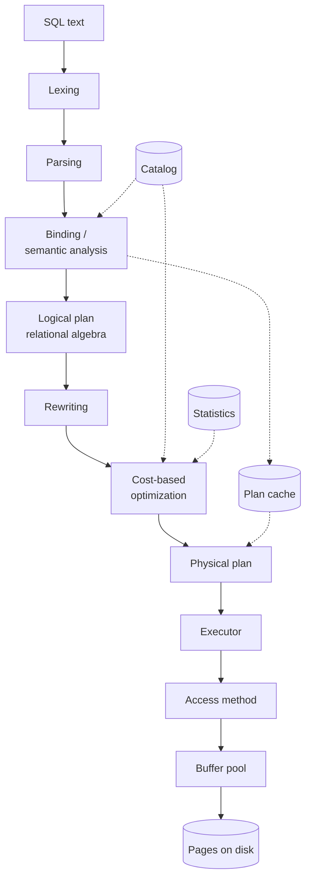

## What This Article Follows

Type `SELECT name FROM users WHERE age > 30` and results come back. The goal here is to trace everything that happens in between without ever saying "and from here it's a black box."

The starting point is a plain string. The end point is a very concrete instruction: read 8192 bytes at offset 34,988,032 of file descriptor 42, and interpret 48 of those bytes as a struct. Between them sit more than a dozen transformations, each with its own intermediate representation.

<SQLPipelineVisualizer />

The overall structure looks like this. The upper half is the layer that *understands* the query; the lower half is the layer that *touches* data.



The dotted edges are references rather than data flow. The catalog and the statistics are consulted from outside the main top-to-bottom path; the plan cache goes further and <strong>skips that path entirely</strong> — the second time the same SQL arrives, binding can short-circuit straight to a physical plan (chapter 9).

We will implement each stage in Python, leaning on PostgreSQL's vocabulary. Concrete names (`pd_lower`, `t_hoff`, `clock-sweep`) make it much easier to pick up the real source code afterwards.

The spine is one query traced top to bottom, but we detour into `GROUP BY` aggregation, `NULL` and three-valued logic, what actually happens past `work_mem`, plan caching, and how parallel plans get costed. Each of those is a direct answer to "why did this query suddenly get slow in production?"

Index data structures themselves (B+ trees and LSM-trees) are covered in [How Database Indexes Work](/en/blog/database-indexing), so this article concentrates on how indexes are *used*.

---

## Chapter 1: Lexing — Cutting a String Into Lexemes

The first job is turning a sequence of characters into meaningful minimal units — tokens.

It looks trivial, but decisions have to be made. Is `>=` one token or two? Is `age30` an identifier, or `age` followed by `30`? The answer is <strong>maximal munch</strong>: from the current position, consume as much as possible. That makes `>=` one token and `age30` one identifier.

```python
from dataclasses import dataclass

KEYWORDS = {
    "SELECT", "FROM", "WHERE", "AND", "OR", "NOT",
    "JOIN", "ON", "AS", "ORDER", "BY", "ASC", "DESC", "LIMIT",
    "GROUP", "HAVING",
}
TWO_CHAR_OPS = (">=", "<=", "<>", "!=")


@dataclass(frozen=True)
class Token:
    kind: str   # KEYWORD / IDENT / NUMBER / STRING / OP / PUNCT / EOF
    text: str
    pos: int


def tokenize(sql: str) -> list[Token]:
    out: list[Token] = []
    i, n = 0, len(sql)
    while i < n:
        if sql[i].isspace():
            i += 1
            continue

        start, c = i, sql[i]

        if c.isalpha() or c == "_":
            while i < n and (sql[i].isalnum() or sql[i] == "_"):
                i += 1
            word = sql[start:i]
            kind = "KEYWORD" if word.upper() in KEYWORDS else "IDENT"
            out.append(Token(kind, word, start))

        elif c.isdigit():
            while i < n and sql[i].isdigit():
                i += 1
            # Only consume a dot when a digit follows it — otherwise we would
            # break qualified references such as "t.1".
            if i + 1 < n and sql[i] == "." and sql[i + 1].isdigit():
                i += 1
                while i < n and sql[i].isdigit():
                    i += 1
            out.append(Token("NUMBER", sql[start:i], start))

        elif c == "'":
            i += 1
            while i < n and sql[i] != "'":
                i += 1
            if i >= n:
                raise SyntaxError("unterminated string literal")
            i += 1                       # closing quote
            out.append(Token("STRING", sql[start:i], start))

        elif sql[i:i + 2] in TWO_CHAR_OPS:   # must be tried before 1-char ops
            out.append(Token("OP", sql[i:i + 2], start))
            i += 2

        elif c in "=<>+-*/%":
            out.append(Token("OP", c, start))
            i += 1

        elif c in ",().;":
            out.append(Token("PUNCT", c, start))
            i += 1

        else:
            raise SyntaxError(f"unexpected character {c!r} at position {i}")

    out.append(Token("EOF", "", n))
    return out
```

The order of the branches carries meaning. If the `sql[i:i+2] in TWO_CHAR_OPS` test does not come <strong>before</strong> the single-character operator test, `>=` splits into `>` and `=`.

The demo below runs this scanner one token at a time.

<SQLTokenizerVisualizer />

### Where Keywords Are Recognized

The implementation above reads the whole word first and then consults the keyword table. Do it the other way around — scan for the literal string `SELECT` — and a column named `selected_at` splits into `SELECT` + `ed_at`. <strong>Munch first, classify second</strong> is the rule.

The SQL standard reserves more than 200 words, and implementations differ. PostgreSQL grades them into four categories — reserved; reserved but still usable as a function or type name; non-reserved but not usable as a function or type name; and fully non-reserved — listed in `kwlist.h`. That gradation is why words like `value` and `name` (both non-reserved) still work as column names.

---

## Chapter 2: Parsing — Assembling Tokens Into a Tree

Next, the grammar builds a tree. The skeleton of a statement (`SELECT … FROM … WHERE …`) falls out of <strong>recursive descent</strong> naturally, but expressions (`a + b * c > d AND e`) need operator precedence. We use <strong>precedence climbing</strong>, also known as Pratt parsing.

### AST Definitions

```python
@dataclass
class ColRef:                       # an unresolved column reference
    table: str | None
    column: str

@dataclass
class Const:
    value: object

@dataclass
class BinOp:
    op: str
    left: object
    right: object

@dataclass
class FuncCall:
    name: str
    args: list
    star: bool = False       # the * in COUNT(*)

@dataclass
class TableRef:
    name: str
    alias: str | None

@dataclass
class JoinExpr:
    left: object
    right: object
    on: object

@dataclass
class SortKey:
    expr: object
    desc: bool

@dataclass
class Select:
    targets: list
    frm: object
    where: object | None
    group_by: list
    having: object | None
    order_by: list
    limit: int | None
```

### The Parser

```python
PRECEDENCE = {
    "OR": 1,
    "AND": 2,
    "=": 3, "<>": 3, "!=": 3, "<": 3, ">": 3, "<=": 3, ">=": 3,
    "+": 4, "-": 4,
    "*": 5, "/": 5,
}


class Parser:
    def __init__(self, tokens: list[Token]):
        self.toks, self.i = tokens, 0

    def peek(self) -> Token:
        return self.toks[self.i]

    def advance(self) -> Token:
        tok = self.toks[self.i]
        self.i += 1
        return tok

    def accept(self, text: str) -> Token | None:
        if self.peek().text.upper() == text.upper():
            return self.advance()
        return None

    def expect(self, text: str) -> Token:
        tok = self.accept(text)
        if tok is None:
            raise SyntaxError(f"expected {text!r}, found {self.peek().text!r}")
        return tok

    # ── statement skeleton: recursive descent ─────────
    def parse_select(self) -> Select:
        self.expect("SELECT")
        targets = [self.parse_expr()]
        while self.accept(","):
            targets.append(self.parse_expr())

        self.expect("FROM")
        frm = self.parse_from()

        where = self.parse_expr() if self.accept("WHERE") else None

        group_by = []
        if self.accept("GROUP"):
            self.expect("BY")
            group_by.append(self.parse_expr())
            while self.accept(","):
                group_by.append(self.parse_expr())

        having = self.parse_expr() if self.accept("HAVING") else None

        order_by = []
        if self.accept("ORDER"):
            self.expect("BY")
            while True:
                expr = self.parse_expr()
                desc = self.accept("DESC") is not None
                if not desc:
                    self.accept("ASC")
                order_by.append(SortKey(expr, desc))
                if not self.accept(","):
                    break

        limit = int(self.advance().text) if self.accept("LIMIT") else None
        return Select(targets, frm, where, group_by, having, order_by, limit)

    def parse_from(self):
        node = self.parse_table_ref()
        while self.accept("JOIN"):
            right = self.parse_table_ref()
            self.expect("ON")
            node = JoinExpr(node, right, self.parse_expr())
        return node

    def parse_table_ref(self) -> TableRef:
        name = self.advance().text
        if self.accept("AS"):
            return TableRef(name, self.advance().text)
        if self.peek().kind == "IDENT":          # AS-less alias
            return TableRef(name, self.advance().text)
        return TableRef(name, None)

    # ── expressions: precedence climbing ──────────────
    def parse_expr(self, min_prec: int = 0):
        left = self.parse_primary()
        while True:
            op = self.peek().text.upper()
            prec = PRECEDENCE.get(op, -1)
            if prec < 0 or prec < min_prec:
                return left
            self.advance()
            # Left associative: the right operand may only absorb
            # operators that bind more tightly than this one.
            right = self.parse_expr(prec + 1)
            left = BinOp(op, left, right)

    def parse_primary(self):
        tok = self.advance()
        if tok.kind == "NUMBER":
            return Const(float(tok.text) if "." in tok.text else int(tok.text))
        if tok.kind == "STRING":
            return Const(tok.text[1:-1])
        if tok.kind == "IDENT":
            if self.peek().text == "(":         # an aggregate function call
                self.advance()
                if self.accept("*"):
                    self.expect(")")
                    return FuncCall(tok.text.upper(), [], star=True)
                args = [self.parse_expr()]
                while self.accept(","):
                    args.append(self.parse_expr())
                self.expect(")")
                return FuncCall(tok.text.upper(), args)
            if self.peek().text == ".":
                self.advance()
                return ColRef(tok.text, self.advance().text)
            return ColRef(None, tok.text)
        if tok.text == "(":
            inner = self.parse_expr()
            self.expect(")")
            return inner
        raise SyntaxError(f"unexpected token {tok.text!r}")
```

The `+ 1` in `parse_expr(prec + 1)` is what creates left associativity. Parsing `a - b - c`, the right operand is parsed with `min_prec = 5`, so the second `-` (precedence 4) is not absorbed and we get `(a - b) - c`. Write `parse_expr(prec)` instead and you get right associativity, `a - (b - c)`, which changes the result. Right-associative operators such as exponentiation use exactly that form.

### An AST Is Only What Was Written

What we have now is a <strong>syntax</strong> tree. Whether a table named `users` exists, whether it has a column `age`, whether the comparison `age > 30` is well typed — none of that has been checked. `SELECT nonexistent FROM nowhere` parses without complaint.

---

## Chapter 3: Binding — Attaching Names to Entities

Meaning is attached during <strong>binding</strong> (also called semantic analysis). This is where the catalog — the system tables — is consulted.

### The Catalog

```python
@dataclass
class Column:
    name: str
    type: str            # "int" / "text" / "numeric"

@dataclass
class Relation:
    name: str
    columns: list[Column]
    n_rows: int          # analogous to pg_class.reltuples
    n_pages: int         # analogous to pg_class.relpages
    oid: int = 0         # pg_class.oid
    relfilenode: int = 0 # on-disk file name; changes on VACUUM FULL etc.

CATALOG = {
    "users": Relation(
        "users",
        [Column("id", "int"), Column("name", "text"), Column("age", "int")],
        n_rows=100_000, n_pages=1_000, oid=16384, relfilenode=16384,
    ),
    "orders": Relation(
        "orders",
        [Column("id", "int"), Column("user_id", "int"), Column("total", "numeric")],
        n_rows=1_000_000, n_pages=10_000, oid=16390, relfilenode=16390,
    ),
}
```

### Range Tables and Vars

After binding, a column reference is a <strong>position</strong>, not a name — PostgreSQL's `Var(varno, varattno)`. `varno` indexes the range table (the list of relations that appeared in `FROM`), and `varattno` is the column number.

```python
@dataclass(frozen=True)
class Var:
    rel: int        # index into the range table
    attno: int      # column number (0-based here; PostgreSQL is 1-based)
    type: str
    label: str      # for display only; never used at run time


COMPARISONS = {"=", "<>", "!=", "<", ">", "<=", ">="}
NUMERIC_TYPES = {"int", "numeric"}


class Binder:
    def __init__(self, catalog):
        self.catalog = catalog
        self.range_table: list[tuple[str, Relation]] = []

    def collect_from(self, node) -> None:
        if isinstance(node, TableRef):
            if node.name not in self.catalog:
                raise NameError(f'relation "{node.name}" does not exist')
            rel = self.catalog[node.name]
            self.range_table.append((node.alias or node.name, rel))
        elif isinstance(node, JoinExpr):
            self.collect_from(node.left)
            self.collect_from(node.right)
        else:
            raise TypeError(node)

    def bind_expr(self, expr) -> tuple[object, str]:
        if isinstance(expr, Const):
            if isinstance(expr.value, bool):
                return expr, "bool"
            if isinstance(expr.value, int):
                return expr, "int"
            if isinstance(expr.value, float):
                return expr, "numeric"
            return expr, "text"

        if isinstance(expr, ColRef):
            hits = []
            for rel_idx, (alias, rel) in enumerate(self.range_table):
                if expr.table is not None and expr.table != alias:
                    continue
                for attno, col in enumerate(rel.columns):
                    if col.name == expr.column:
                        hits.append(Var(rel_idx, attno, col.type,
                                        f"{alias}.{col.name}"))
            if not hits:
                raise NameError(f'column "{expr.column}" does not exist')
            if len(hits) > 1:
                raise NameError(f'column reference "{expr.column}" is ambiguous')
            return hits[0], hits[0].type

        if isinstance(expr, BinOp):
            left, lt = self.bind_expr(expr.left)
            right, rt = self.bind_expr(expr.right)

            if expr.op in ("AND", "OR"):
                if (lt, rt) != ("bool", "bool"):
                    raise TypeError(f"argument of {expr.op} must be boolean")
                return BinOp(expr.op, left, right), "bool"

            if lt != rt and not {lt, rt} <= NUMERIC_TYPES:
                raise TypeError(
                    f"operator does not exist: {lt} {expr.op} {rt}")

            result = "bool" if expr.op in COMPARISONS else lt
            return BinOp(expr.op, left, right), result

        if isinstance(expr, FuncCall):
            args = [self.bind_expr(a) for a in expr.args]
            bound = FuncCall(expr.name, [a for a, _ in args], expr.star)
            if expr.name == "COUNT":
                return bound, "int"                # COUNT is always integral
            if not args:
                raise TypeError(f"{expr.name} requires an argument")
            arg_type = args[0][1]
            if expr.name == "AVG":
                return bound, "numeric"            # averaging integers yields a fraction
            if expr.name in ("SUM", "MIN", "MAX"):
                # exact for MIN/MAX; SUM is simplified — PostgreSQL widens
                # sum(int4) to int8 and sum(int8) to numeric to avoid overflow
                return bound, arg_type
            raise NameError(f'function "{expr.name}" does not exist')

        raise TypeError(f"cannot bind {expr!r}")
```

Only now can these errors be produced:

- `column "ago" does not exist` — no such column in the catalog
- `column reference "id" is ambiguous` — both relations have an `id`
- `operator does not exist: text > integer` — type mismatch

The line `lt != rt and not {lt, rt} <= NUMERIC_TYPES` compresses <strong>implicit casting</strong> into a single condition. Real PostgreSQL is far more elaborate: it collects every candidate operator from `pg_operator` and ranks them using the conversion rules in `pg_cast`. That machinery is what promotes the `100` in `o.total > 100` to `numeric`.

### Binding Normalizes Away Surface Differences

After binding, `u.age`, `users.age`, and (when unambiguous) plain `age` all become the same `Var(0, 2, "int")`. Every later optimization works on that normalized form and never has to care how the query was written. That is deliberate.

---

## Chapter 4: The Logical Plan — Dropping Into Relational Algebra

The bound AST becomes a tree of <strong>relational algebra</strong> operators. From here on SQL syntax is irrelevant; all that remains is which set operations to apply, in what order.

```python
@dataclass
class Scan:
    rel: int
    relation: Relation
    alias: str
    predicate: object | None = None    # evaluated while scanning

@dataclass
class Filter:
    child: object
    predicate: object

@dataclass
class Join:
    left: object
    right: object
    predicate: object

@dataclass
class Project:
    child: object
    exprs: list

@dataclass
class Sort:
    child: object
    keys: list

@dataclass
class Aggregate:
    child: object
    group_keys: list
    aggs: list           # [FuncCall("COUNT", [], star=True), …]

@dataclass
class Limit:
    child: object
    n: int
```

The translation rules are direct.

| SQL clause | Relational-algebra operator |
| --- | --- |
| `FROM t` | `Scan(t)` |
| `FROM a JOIN b ON p` | `Join(Scan(a), Scan(b), p)` |
| `WHERE p` | `Filter(child, p)` |
| `GROUP BY g` | `Aggregate(child, [g], aggs)` |
| `HAVING h` | `Filter(Aggregate(…), h)` |
| `SELECT e1, e2` | `Project(child, [e1, e2])` |
| `ORDER BY k` | `Sort(child, [k])` |
| `LIMIT n` | `Limit(child, n)` |

<strong>This table is where SQL's folk rules come from.</strong> `WHERE` expands <strong>below</strong> `Aggregate` and `HAVING` <strong>above</strong> it. That is the entire reason `HAVING` may reference aggregates and `WHERE` may not: one of them simply sits at a position where aggregated values do not exist yet.

Applied naively, the result is this tree:

```text
Limit(10)
└─ Sort(o.total DESC)
   └─ Project(u.name, o.total)
      └─ Filter(u.age > 30 AND o.total > 100)
         └─ Join(u.id = o.user_id)
            ├─ Scan(users AS u)
            └─ Scan(orders AS o)
```

The nesting order mirrors SQL's evaluation order (`FROM` → `WHERE` → `SELECT` → `ORDER BY` → `LIMIT`). Because `SELECT` sits <strong>above</strong> `WHERE`, an alias defined in the select list cannot be referenced in `WHERE` — a familiar SQL restriction that falls straight out of this shape.

The tree is <strong>correct</strong> and <strong>slow</strong>: it joins all 1,000,000 `orders` with all 100,000 `users` before filtering anything.

---

## Chapter 5: Rewriting — Changing Shape Without Changing Meaning

The first stage of optimization consists of transformations that are obviously profitable without computing any cost. They come from the equivalence laws of relational algebra.

### Predicate Pushdown

$$\sigma_{p}(R \bowtie S) \equiv \sigma_{p}(R) \bowtie S \quad (\text{when } p \text{ references only columns of } R)$$

Push selection below the join. Fewer rows reach the join, which is almost always a win.

The key implementation trick is to <strong>split AND into conjuncts and push each one separately</strong>. As one lump, `u.age > 30 AND o.total > 100` can only be pushed to one side; split apart, both halves can be pushed.

```python
def conjuncts(expr) -> list:
    """Flatten a chain of ANDs into a list."""
    if isinstance(expr, BinOp) and expr.op == "AND":
        return conjuncts(expr.left) + conjuncts(expr.right)
    return [expr]


def and_all(preds: list):
    if not preds:
        return None
    node = preds[0]
    for p in preds[1:]:
        node = BinOp("AND", node, p)
    return node


def used_rels(expr) -> set[int]:
    """The set of range-table indexes an expression references."""
    if isinstance(expr, Var):
        return {expr.rel}
    if isinstance(expr, BinOp):
        return used_rels(expr.left) | used_rels(expr.right)
    return set()


def rels_of(node) -> set[int]:
    if isinstance(node, Scan):
        return {node.rel}
    if isinstance(node, Join):
        return rels_of(node.left) | rels_of(node.right)
    return rels_of(node.child)


def push_down(node, preds: list):
    """Push predicates as deep as they can go.
       Returns (rewritten subtree, predicates that could not be pushed)."""
    if isinstance(node, Scan):
        mine, stays = [], []
        for p in preds:
            (mine if used_rels(p) <= {node.rel} else stays).append(p)
        node.predicate = and_all(mine)
        return node, stays

    if isinstance(node, Join):
        node.left, preds = push_down(node.left, preds)
        node.right, preds = push_down(node.right, preds)
        here, stays = [], []
        scope = rels_of(node)
        for p in preds:
            (here if used_rels(p) <= scope else stays).append(p)
        return (Filter(node, and_all(here)) if here else node), stays

    raise TypeError(node)
```

Splitting `WHERE` with `conjuncts()` and feeding it to `push_down()` gives:

```text
Limit(10)
└─ Sort(o.total DESC)
   └─ Project(u.name, o.total)
      └─ Join(u.id = o.user_id)
         ├─ Scan(users)   filter: age > 30
         └─ Scan(orders)  filter: total > 100
```

The join now sees 55,000 × 100,000 rows instead of 100,000 × 1,000,000.

### OR Cannot Be Pushed

`WHERE u.age > 30 OR o.total > 100` cannot be split. `OR` is true when either side is true, so evaluating one side alone changes the answer. In practice this form can only be evaluated after the join, and it is a common cause of slow queries. The usual fixes are to rewrite it as a `UNION` (so each branch can be optimized independently) or to avoid the `OR` in the schema design.

### Other Rewrites

- <strong>Column pruning</strong> — drop columns that nothing above the node references. The effect is dramatic in columnar stores, which is one reason to avoid `SELECT *`.
- <strong>Constant folding</strong> — evaluate `now() - interval '7 days'` once at plan time. This is only valid because `now()` is <strong>stable</strong> — constant within a statement. Volatile functions such as `random()` cannot be folded.
- <strong>Transitive predicate closure</strong> — derive `b.x = 10` from `a.x = b.x AND a.x = 10` so the constant can also be pushed onto `b`.
- <strong>Subquery decorrelation</strong> — turn a correlated subquery into a join. This is often the single highest-impact rewrite.

Transitive closure is short enough to show. In practice, "why does only one of my two tables use its index?" is very often a question about whether this rewrite fired.

```python
def transitive_closure(preds: list) -> list:
    """Build equivalence classes from x = y, then copy constant
       predicates across every member of the class."""
    classes: list[set] = []                     # sets of Vars known to be equal
    for p in preds:
        if (isinstance(p, BinOp) and p.op == "="
                and isinstance(p.left, Var) and isinstance(p.right, Var)):
            merged = {p.left, p.right}
            rest = []
            for c in classes:                   # fuse overlapping classes
                (merged.update(c) if merged & c else rest.append(c))
            classes = rest + [merged]

    derived = []
    for p in preds:
        if isinstance(p, BinOp) and isinstance(p.left, Var) and isinstance(p.right, Const):
            for c in classes:
                if p.left in c:
                    derived += [BinOp(p.op, v, p.right) for v in c if v != p.left]
    return preds + derived
```

Applied to `a.x = b.x AND a.x = 10`, this produces `b.x = 10`, which `push_down()` can then sink all the way to the scan of `b`. PostgreSQL calls this machinery <strong>equivalence classes</strong>, implemented in `equivclass.c`.

An example of decorrelation:

```sql
-- Correlated: naively evaluated once per outer row
SELECT u.name FROM users u
WHERE EXISTS (SELECT 1 FROM orders o WHERE o.user_id = u.id AND o.total > 100);

-- Rewritten as a semi join: one hash table, built once
SELECT u.name FROM users u
SEMI JOIN orders o ON o.user_id = u.id AND o.total > 100;
```

`SEMI JOIN` is not valid SQL syntax, but it is a real operator inside the planner. It is what `EXPLAIN` shows as `Hash Semi Join`.

### What Breaks Rewriting: Three-Valued Logic and Outer Joins

Everything above quietly assumed two things: that <strong>a predicate is either true or false</strong>, and that <strong>joins commute</strong>. Neither holds in SQL.

<strong>First: NULL and three-valued logic.</strong> SQL has three truth values — TRUE, FALSE and UNKNOWN. `NULL > 30` is not FALSE; it is UNKNOWN.

```text
AND    | T | F | U          OR     | T | F | U
-------+---+---+---        -------+---+---+---
   T   | T | F | U             T   | T | T | T
   F   | F | F | F             F   | T | F | U
   U   | U | F | U             U   | T | U | U
```

Two consequences matter in practice.

1. <strong>`WHERE` keeps a row only when the predicate is TRUE</strong>; UNKNOWN is discarded. So a predicate test should really read `if pred(row) is True` — which is exactly how it is spelled once chapter 15 rewires the scan to real storage.
2. <strong>`CHECK` constraints do the opposite</strong> and treat UNKNOWN as passing. The same expression flips its NULL behaviour depending on where it is written.

This is also why `NOT IN (… a list containing NULL)` always returns nothing. `x NOT IN (1, NULL)` means `x <> 1 AND x <> NULL`, and the right conjunct is permanently UNKNOWN, so the whole thing can never be TRUE. Consequently the planner cannot safely convert `NOT IN` into an anti join, which is why it tends to be slower than `NOT EXISTS`.

<strong>Second: outer joins.</strong> Predicate pushdown is only unconditionally valid for inner joins.

```sql
-- Original: users with no orders survive the join
SELECT u.name, o.total
FROM users u LEFT JOIN orders o ON u.id = o.user_id
WHERE o.total > 100;          -- ← discards the NULL-extended side anyway

-- This one cannot be pushed down
SELECT u.name, o.total
FROM users u LEFT JOIN orders o ON u.id = o.user_id AND o.total > 100;
```

In the first query `o.total > 100` rejects NULLs, so the planner performs <strong>join strength reduction</strong>, turning the outer join into an inner join and regaining full freedom to reorder. In the second the predicate lives in the `ON` clause; pushing it down would change the answer by dropping users entirely instead of NULL-extending them.

Outer joins also <strong>destroy join-order freedom</strong>: $(A \bowtie B) \mathbin{⟕} C$ and $A \bowtie (B \mathbin{⟕} C)$ generally differ. Chapter 8's dynamic program relies on the inner-join property that every split of a subset yields the same result, so it cannot be applied unchanged once outer joins appear. Representing joins as <strong>hyperedges</strong> instead of graph edges — "these relations must all be present before this join may run" — is exactly the idea behind DPhyp, which we meet shortly.

---

## Chapter 6: Statistics and Cardinality Estimation

Now the optimizer proper begins — and this is the <strong>most fragile part of query optimization</strong>.

Comparing costs requires knowing how many rows each operator produces. That number is unknowable before execution, so it is estimated from statistics.

### Histograms

`ANALYZE` samples a table and records the following in `pg_statistic`:

- <strong>Most common values (MCVs) and their frequencies</strong> — used for equality selectivity
- <strong>Equi-depth histogram bounds</strong> — used for range selectivity
- <strong>n_distinct</strong> — the number of distinct values (negative values express a fraction of the row count)
- <strong>Correlation</strong> — how closely the column order matches physical order, which drives random-I/O estimates for index scans

An equi-depth histogram places boundaries so that every bucket holds the same number of rows. Narrow buckets mean dense regions of the value distribution.

```python
@dataclass
class ColumnStats:
    n_distinct: int
    bounds: list         # equi-depth boundaries: len(bounds) - 1 buckets


def selectivity_gt(stats: ColumnStats, value) -> float:
    """Selectivity of col > value, assuming uniformity inside each bucket."""
    bounds = stats.bounds
    nb = len(bounds) - 1                     # number of buckets
    if value < bounds[0]:
        return 1.0
    if value >= bounds[-1]:
        return 0.0
    for i in range(nb):
        lo, hi = bounds[i], bounds[i + 1]
        if lo <= value < hi:
            above_in_bucket = (hi - value) / (hi - lo)
            return (nb - i - 1) / nb + above_in_bucket / nb
    return 0.0
```

Suppose the deciles of `users.age` are:

```python
age_stats = ColumnStats(
    n_distinct=63,
    bounds=[18, 22, 25, 27, 29, 31, 34, 38, 44, 53, 80],
)
selectivity_gt(age_stats, 30)     # → 0.55
```

Following the arithmetic: `30` lands in bucket 4, `[29, 31)`. Buckets 5 through 9 are entirely above it, contributing $5/10 = 0.5$. Within bucket 4, $(31-30)/(31-29) = 0.5$ lies above, contributing $0.5 \times 0.1 = 0.05$. Total: $0.55$, or 55,000 rows.

### Join Cardinality

The textbook estimate for an equi-join is the following, where $\mathrm{NDV}$ is the number of distinct values — the `n_distinct` seen above.

$$|R \bowtie_{R.a = S.b} S| \approx \frac{|R| \cdot |S|}{\max(\mathrm{NDV}(R.a), \mathrm{NDV}(S.b))}$$

```python
def join_cardinality(left_rows, right_rows, ndv_left, ndv_right) -> float:
    """Equi-join estimate under the containment assumption: every value on the
       side with fewer distinct values also occurs on the other side."""
    return left_rows * right_rows / max(ndv_left, ndv_right)
```

With 55,000 `users` rows (after filtering), 100,000 `orders` rows (after filtering), and `NDV(users.id) = NDV(orders.user_id) = 100,000`:

$$\frac{55{,}000 \times 100{,}000}{100{,}000} = 55{,}000$$

### When Estimation Breaks

Three strong assumptions underpin all of this:

1. <strong>Uniformity</strong> — values are uniformly distributed inside each histogram bucket
2. <strong>Independence</strong> — selectivities of separate predicates are independent and can be multiplied
3. <strong>Containment</strong> — one join key's value domain is contained in the other's

None of them hold in practice, and independence fails most easily. `WHERE city = 'Yokohama' AND prefecture = 'Kanagawa'` estimates $0.01 \times 0.05 = 0.0005$ under independence, but the true value is $0.01$ — Yokohama determines the prefecture. That is a 20× underestimate.

And the error multiplies with every join level.

<CardinalityErrorDiagram />

Leis et al., *"How Good Are Query Optimizers, Really?"* (VLDB 2015), measured join queries over real data (IMDB) and found that estimation errors in major commercial and open-source systems grow exponentially with the number of joins, routinely exceeding a factor of 1,000 once more than two joins are involved — with outliers several orders of magnitude worse. Their conclusion is worth internalizing: <strong>cardinality estimation accuracy matters far more to final plan quality than cost model accuracy does</strong>.

Mitigations include:

- <strong>Multivariate statistics</strong> — collect statistics over correlated column groups. PostgreSQL offers `CREATE STATISTICS (dependencies, ndistinct, mcv)`.
- <strong>Adaptive query execution</strong> — observe actual row counts at run time and switch plans. Oracle Adaptive Plans, SQL Server Adaptive Joins, Spark AQE.
- <strong>Learned estimators</strong> — train a model on execution history. Still mostly research, but reaching production.

---

## Chapter 7: The Cost Model — What Actually Gets Counted

With row counts estimated, costs follow. What is measured is neither seconds nor milliseconds but a <strong>dimensionless relative number</strong>: "if reading one page sequentially is 1.0, how much is everything else?"

```python
import math

SEQ_PAGE_COST        = 1.0      # read one page sequentially
RANDOM_PAGE_COST     = 4.0      # read one page randomly
CPU_TUPLE_COST       = 0.01     # process one tuple
CPU_INDEX_TUPLE_COST = 0.005    # process one index entry
CPU_OPERATOR_COST    = 0.0025   # evaluate one operator or function
```

`random_page_cost = 4.0` does <strong>not</strong> mean PostgreSQL believes a physical random read is only four times a sequential read. The documentation explicitly says the default is lower than raw hardware ratios because many indexed reads are assumed to be cached. On SSD-heavy or fully cached workloads, lowering `random_page_cost` toward the measured range (often 1.1–2, and equal to `seq_page_cost` only when random access is effectively no worse) is a common tuning step. That single constant moves the break-even point between index scans and sequential scans.

### Scan Costs

```python
def seq_scan_cost(rel: Relation, n_quals: int) -> float:
    """Read every block in order and evaluate n_quals conditions per tuple."""
    return (rel.n_pages * SEQ_PAGE_COST
            + rel.n_rows * CPU_TUPLE_COST
            + rel.n_rows * n_quals * CPU_OPERATOR_COST)
```

```python
seq_scan_cost(CATALOG["users"],  1)   # 1,000 + 1,000 +   250 =  2,250
seq_scan_cost(CATALOG["orders"], 1)   # 10,000 + 10,000 + 2,500 = 22,500
```

Crucially, this formula does <strong>not depend on selectivity</strong>. Returning one row still costs a full scan. An index scan, by contrast, costs roughly in proportion to selectivity. Where those two lines cross is where the plan flips.

<AccessPathComparison />

### The Cost of an Index Scan

Now the other line. Naively, fetching $n$ rows through an index looks like $n$ random reads — but it is not, because several rows share a page. The more rows you fetch, the higher the chance the next one lands on a page you have already read.

Mackert and Lohman quantified this in 1989, and PostgreSQL uses their formula verbatim.

```python
def index_pages_fetched(tuples_fetched, pages, index_pages,
                        total_table_pages, effective_cache_size=524_288):
    """Mackert-Lohman: pages actually fetched given a finite buffer.
       effective_cache_size defaults to 4 GB = 524,288 pages."""
    T = float(pages) if pages > 1 else 1.0
    # Every table in the query plus this index competes for cache;
    # pro-rate by this table's share
    total_pages = max(total_table_pages + index_pages, 1.0)
    b = max(1.0, math.ceil(effective_cache_size * T / total_pages))

    if T <= b:                                  # the table fits in cache
        pf = (2.0 * T * tuples_fetched) / (2.0 * T + tuples_fetched)
        return T if pf >= T else math.ceil(pf)

    lim = (2.0 * T * b) / (2.0 * T - b)         # where re-reads start
    if tuples_fetched <= lim:
        return math.ceil((2.0 * T * tuples_fetched) / (2.0 * T + tuples_fetched))
    return math.ceil(b + (tuples_fetched - lim) * (T - b) / T)
```

Fetch 5,000 rows from `users` (1,000 pages / 100,000 rows):

$$\mathrm{PF} = \frac{2 \times 1{,}000 \times 5{,}000}{2 \times 1{,}000 + 5{,}000} = 1{,}428.6 \;\longrightarrow\; \text{clamped to } T = 1{,}000$$

<strong>Not 5,000 random reads — at most one table's worth of pages.</strong> The "one page per row" intuition collapses as row counts grow.

### Correlation — the Same Index, 75× Apart

The other factor is the <strong>correlation</strong> between index order and physical heap order. PostgreSQL computes two endpoints and interpolates between them.

```python
def index_scan_cost(rel, index_pages, selectivity, correlation=0.0,
                    random_page_cost=RANDOM_PAGE_COST, total_table_pages=11_000):
    tuples = rel.n_rows * selectivity

    # Index side: read the matching entries
    idx_pages = math.ceil(selectivity * index_pages)
    idx_cost = (idx_pages * random_page_cost
                + tuples * (CPU_INDEX_TUPLE_COST + CPU_OPERATOR_COST))

    # Heap side: interpolate the two endpoints by correlation squared
    pf = index_pages_fetched(tuples, rel.n_pages, index_pages, total_table_pages)
    max_io = pf * random_page_cost                       # correlation = 0
    seq_pages = math.ceil(selectivity * rel.n_pages)
    min_io = random_page_cost + max(seq_pages - 1, 0) * SEQ_PAGE_COST  # = 1
    heap_cost = max_io + correlation ** 2 * (min_io - max_io)

    return idx_cost + heap_cost + tuples * CPU_TUPLE_COST
```

Holding selectivity at 5% (5,000 rows) and varying only correlation:

| Correlation | Heap I/O cost | Meaning |
| --- | ---: | --- |
| 0.0 | 4,000 | 1,000 pages, all read randomly |
| 0.5 | 3,013 | in between (squaring pulls it toward 0) |
| 1.0 | 53 | 50 pages read sequentially (4.0 + 49 × 1.0) |

Same index, same row count, <strong>75× difference</strong> from correlation alone. The value of `CLUSTER`, or of time-series data whose insertion order happens to be ascending, is concentrated in that one interpolation.

There is no rigorous derivation for using the <strong>square</strong> of the correlation as the weight. `costsize.c` says so itself:

> We currently interpolate linearly between the estimates based on the correlation squared (XXX is that appropriate?).

Production cost models contain acknowledged guesswork.

### Finding the Crossover

Take the `users(age)` index at 275 pages, correlation 0, and compare against the Seq Scan cost of 2,250.

| Selectivity | Rows | ML pages | Index Scan | Winner |
| ---: | ---: | ---: | ---: | --- |
| 0.1% | 100 | 96 | 390 | index |
| 0.5% | 500 | 400 | 1,617 | index |
| 0.8% | 800 | 572 | 2,314 | roughly tied |
| 1.0% | 1,000 | 667 | 2,698 | full scan |
| 5.0% | 5,000 | 1,000 | 4,144 | full scan |

<strong>The crossover sits around 0.8%</strong> — with the HDD-era `random_page_cost = 4.0`. Drop it to the SSD-oriented 1.1 and, for the same table and the same index, the crossover climbs into the <strong>tens of percent</strong>. Once random reads are cheap, the Mackert-Lohman clamp means the index scan's I/O stops growing, while the Seq Scan keeps paying CPU cost for every row in the table.

(This model omits index descent cost and B+ tree height, so real PostgreSQL crosses over sooner. The point is not the exact number but that <strong>one constant moves the boundary by orders of magnitude</strong>.)

### Join Costs

How to read a single table is settled. The next question is how to match two inputs against each other, and every join algorithm gets its own formula.

```python
@dataclass
class Plan:
    rows: float
    cost: float
    desc: str


def hash_join_cost(build: Plan, probe: Plan, out_rows: float) -> float:
    return (build.cost + probe.cost
            + build.rows * CPU_OPERATOR_COST     # building the hash table
            + probe.rows * CPU_OPERATOR_COST     # probing it
            + out_rows   * CPU_TUPLE_COST)       # producing output tuples


def sort_cost(input_cost: float, rows: float, limit: int | None = None) -> float:
    """Following PostgreSQL, one comparison costs 2 * cpu_operator_cost.
       A LIMIT turns this into a bounded heap, shrinking the logarithm."""
    comparison_cost = 2.0 * CPU_OPERATOR_COST
    keep = rows if limit is None else min(rows, limit)
    return input_cost + comparison_cost * rows * math.log2(max(keep, 2.0))


def merge_join_cost(left: Plan, right: Plan, out_rows: float) -> float:
    ls = sort_cost(left.cost, left.rows)
    rs = sort_cost(right.cost, right.rows)
    return (ls + rs
            + (left.rows + right.rows) * CPU_OPERATOR_COST
            + out_rows * CPU_TUPLE_COST)
```

(The bounded branch of `sort_cost` is simplified: PostgreSQL's `cost_tuplesort` uses $N \log_2 2K$ for a top-N heapsort. It is a constant-factor difference that never changes the plan ranking, but keep it in mind when comparing these numbers against real `EXPLAIN` output.)

Three candidates for the query from the introduction:

| Candidate | Breakdown | Cost |
| --- | --- | --- |
| NestedLoop (`users` × index scan) | $2{,}250 + 55{,}000 \times 48.175$ | 2,651,875 |
| MergeJoin (sort both sides) | $6{,}580 + 30{,}805 + 938$ | 38,323 |
| <strong>HashJoin</strong> (build = `users`) | $2{,}250 + 22{,}500 + 938$ | <strong>25,688</strong> |

The 48.175 in the nested-loop row is the cost of one inner index lookup. Each user has about 10 orders, so we read 2 index pages and 10 heap pages randomly, plus CPU cost $10 \times (0.005 + 0.01 + 0.0025)$. That is $12 \times 4.0 + 0.175 = 48.175$, repeated 55,000 times — hopeless.

But make the outer side a single row (`WHERE u.id = 42`) and the same nested loop becomes the fastest option. <strong>No join algorithm is universally better; the ranking flips with row counts.</strong> That is the entire reason cost-based optimization exists.

### Choosing the Build Side

`hash_join_cost` looks symmetric in build and probe, but the build side should be the smaller one. The hash table has to fit in memory (`work_mem` in PostgreSQL); if it does not, execution degrades to a <strong>grace hash join</strong> — both sides are partitioned by hash value, spilled to temporary files, and processed partition by partition — which adds I/O. The planner folds this in by increasing the batch count when the estimated build size exceeds `work_mem`.

### Startup Cost and Total Cost

Cost has been one scalar so far, but `EXPLAIN` prints this:

```text
Hash Join  (cost=2387.50..25687.50 rows=55000 width=36)
```

There are two numbers. The first is the <strong>startup cost</strong>: what must be paid before the first row can be returned. The second is the <strong>total cost</strong>: everything, through the last row.

They are tracked separately because <strong>a parent node does not always need every row</strong>. The formula at the top of `costsize.c` says it directly.

```python
@dataclass
class CostedPlan:
    rows: float
    startup_cost: float
    total_cost: float


def cost_for(plan: CostedPlan, tuples_to_fetch: float) -> float:
    """Cost of a partial retrieval. Startup is paid regardless, so it is not pro-rated."""
    frac = min(tuples_to_fetch, plan.rows) / plan.rows
    return plan.startup_cost + (plan.total_cost - plan.startup_cost) * frac
```

### "Blocking" Means "High Startup Cost"

A hash join's startup cost <strong>swallows the entire total cost of the build side</strong>, because no row can be emitted until the hash table is finished. An operator with that property — nothing comes out until the input has been drained — is called <strong>blocking</strong>; chapter 10 implements a few.

```python
def hash_join_startup(build: Plan) -> float:
    """Startup runs until the build side is drained and hashed."""
    return build.cost + build.rows * CPU_OPERATOR_COST
```

For the plan from the introduction that is $2{,}250 + 55{,}000 \times 0.0025 = 2{,}387.5$, against a total of $25{,}687.5$. That pair of numbers <strong>is</strong> the planner's definition of "blocking."

(PostgreSQL's `initial_cost_hashjoin` also charges `cpu_tuple_cost` per build row, giving $2{,}250 + 55{,}000 \times (0.0025 + 0.01) = 2{,}937.5$. We stay consistent with this chapter's simplified model here.)

### Add a LIMIT and the Ranking Inverts

Chapter 9 will claim that `LIMIT` changes the algorithm chosen below it. These two numbers are all it takes to check that claim.

| Query | Plan | Arithmetic | Cost |
| --- | --- | --- | ---: |
| `… ORDER BY o.total DESC LIMIT 10` | Sort blocks | startup ≈ total | 26,601 |
| `… LIMIT 10` (no ORDER BY) | HashJoin | $2{,}387.5 + 23{,}300 \times \frac{10}{55{,}000}$ | <strong>2,392</strong> |
| `… LIMIT 10` (no ORDER BY) | NestedLoop + IndexScan | $0 + 2{,}651{,}875 \times \frac{10}{55{,}000}$ | <strong>482</strong> |

For all rows the hash join (25,688) beats the nested loop (2,651,875) by more than 100×. Ask for ten rows and <strong>the ranking flips</strong>, because the nested loop has essentially zero startup cost and only has to spin the outer side as far as needed.

This is also the anatomy of the classic incident <strong>"adding `LIMIT 10` made the query 1000× slower."</strong> The planner assumes ten outer rows will yield ten results and picks the zero-startup nested loop; if matching rows are actually rare, execution scans the outer side to the end. Cardinality misestimates are never more punishing than under a `LIMIT`.

Cursors (`DECLARE … CURSOR`) use this machinery permanently. Following `cursor_tuple_fraction` (default 0.1), they are planned as if only 10% of rows will be fetched — which is why the same SQL can get a different plan through a cursor.

---

## Chapter 8: Join Order — Fighting the Search Space

With three or more relations, <strong>the order of joins</strong> matters more than the algorithm chosen for each one.

### How Big Is the Space?

For $n$ relations there are $n!$ left-deep trees, and $\frac{(2n-2)!}{(n-1)!}$ bushy trees.

<PlanSpaceTable />

Exhaustive enumeration is impossible, but <strong>optimal substructure</strong> saves us. If a plan uses the join of $\{A, B, C\}$ as an intermediate result, the subtree that produces it can be replaced by the best plan for $\{A, B, C\}$ alone without making the whole plan worse (given a monotone cost function). So one best plan per subset suffices, and the state count collapses to $2^n$. That is the dynamic program System R introduced in 1979.

```python
def dp_join_order(rels, cardinality, connected):
    """Fix the optimal plan for every subset, smallest first (DPsize)."""
    n = len(rels)
    best = {}
    for i in range(n):
        best[1 << i] = Plan(rows=rels[i].n_rows, cost=0.0, desc=rels[i].name)

    for size in range(2, n + 1):
        for mask in range(1, 1 << n):
            if bin(mask).count("1") != size:
                continue
            if not connected(mask):          # prune Cartesian products
                continue
            rows = cardinality(mask)
            for right in submasks(mask):     # enumerate proper subsets
                left = mask ^ right
                if left == 0 or right == 0:
                    continue
                if left not in best or right not in best:
                    continue
                if not has_join_edge(left, right):
                    continue
                cost = rows + best[left].cost + best[right].cost   # C_out
                if mask not in best or cost < best[mask].cost:
                    best[mask] = Plan(rows, cost,
                                      f"({best[left].desc} ⋈ {best[right].desc})")
    return best[(1 << n) - 1]


def submasks(mask: int):
    """The classic idiom for enumerating all non-empty proper submasks."""
    sub = (mask - 1) & mask
    while sub > 0:
        yield sub
        sub = (sub - 1) & mask
```

The `submasks` idiom is worth memorizing: `(sub - 1) & mask` walks the submasks of `mask` in descending order, and enumerating all submasks of all subsets is $O(3^n)$.

The cost function here is `C_out` — minimize only <strong>the sum of intermediate result sizes</strong>. It ignores scan and algorithm costs, yet it captures most of what makes one join order better than another.

Let's run it.

<JoinOrderDPVisualizer />

The textual order $((u \bowtie o) \bowtie i) \bowtie p$ costs 605,000; the optimal $((i \bowtie p) \bowtie o) \bowtie u$ costs 15,000 — <strong>roughly 40× cheaper</strong>. The intuition "start from the most selective relation" turns out to have a precise cost-based justification.

### Pruning Cartesian Products

The `connected(mask)` check inside the loop matters. A subset with no join predicates connecting it implies a Cartesian product and explodes row counts. This single pruning step shrinks the search space enormously — for a chain-shaped join graph, the candidate count drops to $O(n^3)$.

Pruning too aggressively has a cost, though. When one relation is tiny (a dimension table, say), the Cartesian product is sometimes genuinely faster, so most implementations fall back to allowing cross products when no connected subset can be formed.

### When n Gets Large

PostgreSQL abandons dynamic programming once the join count reaches `geqo_threshold` (default 12) and switches to a <strong>genetic algorithm (GEQO)</strong>. Optimality is no longer guaranteed, but planning time stays bounded.

In practice, though, <strong>`join_collapse_limit` (default 8) bites first</strong>. Beyond eight relations written with explicit `JOIN` syntax, the planner stops flattening the `FROM` clause and <strong>keeps the written order</strong>. If you reproduce this chapter's DP on a real ten-table explicit-join query and nothing gets reordered, suspect this setting first. (Subquery flattening has its own knob, `from_collapse_limit`.)

Conversely, setting `join_collapse_limit = 1` stops the search entirely, which is the standard way to <strong>pin a join order by hand</strong> — the last resort when estimates simply refuse to be right.

Other systems take other escape routes:

- <strong>DPccp / DPhyp</strong> (Moerkotte & Neumann) — enumerate only connected subgraphs of the join graph, never constructing useless subsets. DPccp, for simple join graphs, is the VLDB 2006 paper; DPhyp, which generalizes it to hypergraphs (outer joins and complex predicates), is *"Dynamic Programming Strikes Back"*, SIGMOD 2008. Used by DuckDB and HyPer.
- <strong>Cascades / Volcano framework</strong> (Graefe) — top-down search driven by transformation rules and a memo structure. SQL Server, Apache Calcite, and CockroachDB follow this lineage. Unlike bottom-up DP, the search space grows simply by adding rules.
- <strong>Interesting orders</strong> — treat sort order as part of the state. A sorted intermediate result can be reused by a later merge join or `ORDER BY`, so a locally more expensive plan can win globally. The idea appears already in the System R paper.

---

## Chapter 9: The Physical Plan — Committing to Algorithms

Each logical operator maps to several physical ones.

| Logical operator | Physical candidates |
| --- | --- |
| `Scan` | Seq Scan / Index Scan / Index Only Scan / Bitmap Heap Scan |
| `Join` | Nested Loop / Hash Join / Merge Join |
| `Sort` | Quicksort (in memory) / External Merge Sort / Top-N Heapsort |
| `Aggregate` | Hash Aggregate / Sorted Aggregate |
| `Distinct` | Hash / Sort + Unique |

The final physical plan:

```text
Limit(10)                              rows=10       cost≈26,601
└─ Sort(o.total DESC) top-N heapsort   rows=10       cost≈26,601
   └─ HashJoin(u.id = o.user_id)       rows=55,000   cost≈25,688
      ├─ SeqScan(orders)               rows=100,000  cost≈22,500   [probe]
      │    Filter: total > 100
      └─ Hash                          rows=55,000
         └─ SeqScan(users)             rows=55,000   cost≈2,250    [build]
              Filter: age > 30
```

`Sort` became a top-N heapsort because of `LIMIT 10`. Sorting all 55,000 rows costs $0.005 \times 55{,}000 \times \log_2 55{,}000 \approx 4{,}330$; keeping a 10-element heap costs $0.005 \times 55{,}000 \times \log_2 10 \approx 914$. Memory drops from $O(n)$ to $O(10)$ as well.

<strong>A parent node's requirement changes the algorithm chosen below it.</strong> `LIMIT` pushes down "how many rows are needed"; `ORDER BY` pushes down "in what order."

Properties like these — which do not change *what* is computed but constrain *how* — are called <strong>physical properties</strong>. The canonical examples are sort order (PostgreSQL's `PathKey`) and data distribution (partitioning, in a distributed engine). Cascades-style optimizers make them part of the search state, remembering "the cheapest plan for this subset *in this sort order*" separately for each order. Chapter 8's interesting orders are the ancestor of that idea.

### Reusing Plans — Prepared Statements and Generic Plans

Everything from chapter 1 to here is expensive. An application firing the same query thousands of times per second should not re-lex it every time, so implementations cache plans.

That introduces a trade-off. Caching a parameterized query means <strong>building a plan without knowing the parameter values</strong> — but chapter 6's `selectivity_gt` has nothing to say without a value.

```python
DEFAULT_INEQ_SEL = 0.3333333333333333    # selfuncs.h
DEFAULT_EQ_SEL   = 0.005
UNKNOWN = object()                       # an unbound parameter


def selectivity_gt(stats: ColumnStats, value) -> float:
    if value is UNKNOWN:
        return DEFAULT_INEQ_SEL          # no histogram lookup possible
    ...                                  # otherwise, as in chapter 6
```

Evaluating `WHERE u.age > $1` against the very same histogram:

| Plan | Selectivity | Est. rows | Plan chosen |
| --- | ---: | ---: | --- |
| custom, `$1 = 30` | 0.55 | 55,000 | HashJoin, cost 25,688 |
| custom, `$1 = 79` | 0.0037 | 370 | index nested loop |
| <strong>generic</strong> (value unknown) | 0.3333 | 33,333 | a middle plan that suits neither |

The generic plan is built for 33,333 rows: too small for `$1 = 30`, too large for `$1 = 79`.

PostgreSQL's compromise is to try first. `choose_custom_plan()` in `plancache.c`:

1. always builds a custom plan for the first <strong>five</strong> executions
2. compares their average estimated cost against the one generic plan
3. keeps the generic plan thereafter if it is cheaper (and skips planning entirely)

<strong>This is the anatomy of "it was fast for the first few calls and then suddenly 100× slower."</strong> To force the issue, set `plan_cache_mode` to `force_custom_plan` or `force_generic_plan`.

Avoiding parameters is not a free escape. Interpolating values into the SQL string every time makes estimation exact, but it <strong>defeats plan caching entirely and opens the door to SQL injection</strong>. Estimation accuracy and plan reuse are in tension by construction.

---

## Chapter 10: The Execution Engine — The Volcano Iterator Model

The plan exists. Time to run it.

The <strong>Volcano model</strong> that Goetz Graefe formalized in 1990 (also called the iterator model, or pull-based execution) gives every operator the same three methods.

```python
class Operator:
    def open(self) -> None: ...          # initialize state
    def next(self) -> dict | None: ...   # return one tuple, or None when done
    def close(self) -> None: ...         # release resources
```

Because the interface is uniform, any operator stacks on top of any other, and the planner is free to choose the shape of the tree. That is the essential value of the model.

### Implementation

```python
class SeqScanExec:
    def __init__(self, rows, predicate=None):
        self.rows, self.predicate = rows, predicate
        self.cursor = 0

    def open(self):
        self.cursor = 0

    def next(self):
        while self.cursor < len(self.rows):
            row = self.rows[self.cursor]
            self.cursor += 1
            if self.predicate is None or self.predicate(row):
                return row
        return None

    def close(self):
        pass


class NestedLoopJoinExec:
    def __init__(self, outer, inner, predicate):
        self.outer, self.inner, self.predicate = outer, inner, predicate
        self.outer_tuple = None

    def open(self):
        self.outer.open()
        self.inner.open()
        self.outer_tuple = None

    def next(self):
        while True:
            if self.outer_tuple is None:
                self.outer_tuple = self.outer.next()
                if self.outer_tuple is None:
                    return None
                self.inner.open()          # rewind the inner side (rescan)
            inner_tuple = self.inner.next()
            if inner_tuple is None:
                self.outer_tuple = None    # inner exhausted; advance the outer
                continue
            if self.predicate(self.outer_tuple, inner_tuple):
                return {**self.outer_tuple, **inner_tuple}

    def close(self):
        self.outer.close()
        self.inner.close()
```

The demo below follows the call chain one event at a time — `next()` descending from root to leaves, tuples climbing back from leaves to root.

<VolcanoIteratorVisualizer />

### Blocking Operators

Not every operator can return one tuple at a time. `Sort` cannot return its first row until it has seen the last one. `HashJoin` cannot probe until the build side is fully consumed. Such operators are called <strong>blocking</strong>, or pipeline breakers. Chapter 7's "Startup Cost and Total Cost" met them from the cost side, as operators whose startup cost is pinned to their total cost; here is what that looks like as code.

```python
from collections import defaultdict

class HashJoinExec:
    def __init__(self, build, probe, build_key, probe_key):
        self.build, self.probe = build, probe
        self.build_key, self.probe_key = build_key, probe_key

    def open(self):
        # ── build phase: drain the build side completely (blocking)
        self.build.open()
        self.table = defaultdict(list)
        while (row := self.build.next()) is not None:
            self.table[self.build_key(row)].append(row)
        self.build.close()

        # ── prepare the probe phase
        self.probe.open()
        self.matches = iter(())
        self.current = None

    def next(self):
        while True:
            m = next(self.matches, None)
            if m is not None:
                return {**m, **self.current}
            self.current = self.probe.next()
            if self.current is None:
                return None
            self.matches = iter(self.table.get(self.probe_key(self.current), ()))

    def close(self):
        self.probe.close()
        self.table = None
```

Where blocking operators sit determines how a query *feels*. `LIMIT 10` still reads every row when an `ORDER BY` is present, because `Sort` blocks. Without `ORDER BY`, `LIMIT 10` stops calling `next()` after ten rows.

### The Top-N Heap

`ORDER BY … LIMIT n` can be done with a heap of size $n$ instead of a full sort.

```python
import heapq
import itertools

class TopNExec:
    def __init__(self, child, key, n, desc=True):
        self.child, self.key, self.n, self.desc = child, key, n, desc

    def open(self):
        self.child.open()
        heap = []                       # min-heap of (sort key, seq, row)
        seq = itertools.count()
        while (row := self.child.next()) is not None:
            k = self.key(row)
            if not self.desc:
                k = -k                  # flip the sign for ASC
            if len(heap) < self.n:
                heapq.heappush(heap, (k, next(seq), row))
            elif k > heap[0][0]:        # only replace the current worst
                heapq.heapreplace(heap, (k, next(seq), row))
        heap.sort(key=lambda x: x[0], reverse=True)
        self.out = iter([row for _, _, row in heap])

    def next(self):
        return next(self.out, None)

    def close(self):
        self.out = None
```

The `next(seq)` counter in the second tuple position prevents Python from falling through to comparing the `row` dictionaries on key ties, which would raise `TypeError`. It is the standard defensive idiom when using `heapq` with non-comparable payloads.

### Expression Evaluation Does Not Walk a Tree

Every operator so far has treated `predicate(row)` as a plain Python function. Real implementations put one more layer here.

The obvious approach is to walk the bound expression tree recursively, once per row. But the shape of that tree never changes at run time. So PostgreSQL compiles it, <strong>once at executor-init time, into a flat array of steps</strong>, and afterwards just runs a `for` loop over that array. That is what `ExprState` and the `EEOP_*` steps are.

`Filter: (total > 100 AND user_id = 42)` becomes roughly this:

```text
 0  EEOP_SCAN_FETCHSOME       last_var=3     # deform only up to the highest attnum used
 1  EEOP_SCAN_VAR             attnum=3       # total
 2  EEOP_CONST                value=100
 3  EEOP_FUNCEXPR_STRICT      numeric_gt     # skip the call entirely if an arg is NULL
 4  EEOP_QUAL                 jumpdone=9     # FALSE and NULL both fail immediately
 5  EEOP_SCAN_VAR             attnum=2       # user_id
 6  EEOP_CONST                value=42
 7  EEOP_FUNCEXPR_STRICT      int4eq
 8  EEOP_QUAL                 jumpdone=9
 9  EEOP_DONE
```

(Opcode names move between releases. The listing uses the names through PostgreSQL 17; in 18 `EEOP_DONE` was split into `EEOP_DONE_RETURN` / `EEOP_DONE_NO_RETURN`, and two-argument strict functions became `EEOP_FUNCEXPR_STRICT_2`. Also, `attnum` is stored zero-based in the step struct (`varattno - 1`); only `last_var` is a real 1-based attribute number. The shape is what matters.)

Three things this article has discussed elsewhere are embedded in that array, in machine form.

<strong>The `last_var` on `EEOP_SCAN_FETCHSOME`</strong> — this is where chapter 15's `deform_tuple` is actually invoked, and it <strong>stops at the highest attribute number the expression references</strong>. Columns can only be extracted front to back, so if nothing beyond attnum 3 is used, attribute 4 onwards is never touched. That is one reason `SELECT *` on a 40-column table is slower than naming three columns: the executor pays for the longer loop before a single byte reaches the network (per-column output-function calls and transfer volume then pile on top of it).

<strong>The `_STRICT` suffix</strong> — chapter 5's three-valued logic, made mechanical. A strict function returns NULL whenever an argument is NULL, so the step short-circuits to NULL <strong>without calling the function at all</strong>.

<strong>`EEOP_QUAL`</strong> — the rule "`WHERE` only passes TRUE", as an instruction. Whether the previous result was FALSE or NULL, it jumps to the end and fails the row. An `AND` written *inside* an expression uses `EEOP_BOOL_AND_STEP_*` instead. That one must distinguish FALSE from UNKNOWN, so it threads an `anynull` flag through the steps: FIRST clears the flag, the middle steps set it on NULL and bail out early on FALSE, and LAST turns "no FALSE but at least one NULL" into NULL. Splitting those roles across three opcodes (FIRST / middle / LAST) instead of branching at run time is a deliberate performance special-case.

And this flat array is precisely <strong>what PostgreSQL's JIT compiles</strong>: an interpreter loop with an indirect branch per step becomes straight-line native code. When chapter 12 says PostgreSQL's JIT targets expression evaluation and tuple deforming, this array is what it means.

---

## Chapter 11: When Memory Runs Out — External Sort and Hash Aggregation

Every operator in the previous chapter assumed its intermediate results fit in memory. Sometimes they do not. This chapter looks at what happens when they don't, through the two canonical cases — sorting and aggregation — and the point is that <strong>they fail in completely different ways</strong>.

### External Merge Sort

`work_mem` showed up once, back in chapter 7, as the line a hash table has to stay under — but not what happens when that line is crossed. For sorting, this happens:

```python
def sort_external(rows, key, work_mem_rows, tmp):
    """Run generation, then merge. The skeleton of tuplesort.c."""
    runs, buf = [], []
    for row in rows:
        buf.append(row)
        if len(buf) == work_mem_rows:      # work_mem is exhausted
            buf.sort(key=key)
            runs.append(tmp.spill(buf))    # write the sorted chunk to a temp file
            buf = []
    if buf:
        buf.sort(key=key)
        runs.append(tmp.spill(buf))

    # Keep one row per run in a heap; pop the smallest and refill from that run
    return heapq.merge(*(tmp.read(r) for r in runs), key=key)
```

One pass would suffice if every run could be merged at once. The reason it cannot is that <strong>each tape in the merge needs its own read buffer</strong>. PostgreSQL budgets 32 blocks (`MERGE_BUFFER_SIZE` = 256 KB) plus per-tape overhead for each one, so at `work_mem = 4MB` roughly 15 runs can be merged simultaneously (`tuplesort_merge_order()`). More runs than that means stacking merge passes.

$$\text{passes} = \lceil \log_M r \rceil \qquad (r = \text{runs},\; M = \text{merge order})$$

PostgreSQL's `cost_tuplesort` writes exactly that:

$$\text{startup} = c\,N \log_2 N \;+\; 2\,\text{npages} \cdot \lceil \log_M r \rceil \times (0.75\,c_{\text{seq}} + 0.25\,c_{\text{rand}})$$

The comment on that last weighting is refreshingly honest:

> The disk traffic is assumed to be 3/4ths sequential and 1/4th random accesses (XXX can't we refine that guess?)

<strong>Some numbers</strong>, at 60 bytes per row:

- <strong>55,000 rows ≈ 3.3 MB</strong> — fits the default 4 MB `work_mem`, so it is an in-memory quicksort and touches no disk at all.
- <strong>5,500,000 rows ≈ 330 MB</strong> — $r = 330/4 \approx 79$ runs and $M \approx 15$, so $\lceil \log_{15} 79 \rceil = 2$ passes.
  - $\text{npages} = \lceil 330{,}000{,}000 / 8192 \rceil = 40{,}284$
  - $\text{npageaccesses} = 2 \times 40{,}284 \times 2 = 161{,}136$
  - disk $= 161{,}136 \times 1.75 \approx 282{,}000$
  - CPU $= 0.005 \times 5{,}500{,}000 \times \log_2 5{,}500{,}000 \approx 616{,}000$

So <strong>in this cost model, spilling to disk adds about 46% on top of the comparison cost</strong> — not 100×. Sorting <strong>degrades gracefully</strong> past `work_mem`, and that is worth remembering. Hashing is what falls off a cliff: a hash join has to repartition and rewrite <strong>both</strong> inputs, and a hash aggregate — which only ever has one — repartitions that one recursively.

One more thing: <strong>temp files bypass the buffer pool entirely</strong>. Chapter 14's `shared_buffers` is for tables and indexes; sort spills are read and written directly under `base/pgsql_tmp/`. That is how "there is plenty of RAM but the sort is slow" happens.

Actual behaviour shows up in `EXPLAIN ANALYZE`, where chapter 9's three sort variants appear verbatim as strings:

```text
Sort Method: top-N heapsort  Memory: 25kB
Sort Method: quicksort       Memory: 3400kB
Sort Method: external merge  Disk: 341000kB
```

### Aggregation — Hash or Sort

Chapter 9's operator table listed `Aggregate → Hash Aggregate / Sorted Aggregate`. Here are both. The only difference is <strong>whether they block</strong>.

```python
class HashAggExec:
    """Blocking: keeps per-group state in a hash table."""

    def __init__(self, child, group_keys, init, accum, final):
        self.child, self.group_keys = child, group_keys
        self.init, self.accum, self.final = init, accum, final

    def open(self):
        self.child.open()
        table = {}
        while (row := self.child.next()) is not None:      # ← drains everything
            k = tuple(row[c] for c in self.group_keys)
            # Never write `table.get(k) or self.init()`: the moment an
            # accumulator's state goes falsy (0, False) it would reset.
            state = table[k] if k in table else self.init()
            table[k] = self.accum(state, row)
        self.out = iter([(k, self.final(s)) for k, s in table.items()])

    def next(self):
        return next(self.out, None)

    def close(self):
        self.child.close()


class SortedAggExec:
    """Non-blocking: emits a row the instant the key changes. Input must be sorted."""

    def __init__(self, child, group_keys, init, accum, final):
        self.child, self.group_keys = child, group_keys
        self.init, self.accum, self.final = init, accum, final

    def open(self):
        self.child.open()
        self.cur_key, self.state = None, None

    def next(self):
        while True:
            row = self.child.next()
            if row is None:
                if self.cur_key is None:
                    return None
                out = (self.cur_key, self.final(self.state))    # the last group
                self.cur_key = None
                return out

            k = tuple(row[c] for c in self.group_keys)
            if self.cur_key is None:
                self.cur_key = k
                self.state = self.accum(self.init(), row)
            elif k == self.cur_key:
                self.state = self.accum(self.state, row)
            else:
                out = (self.cur_key, self.final(self.state))    # key changed
                self.cur_key = k
                self.state = self.accum(self.init(), row)
                return out

    def close(self):
        self.child.close()
```

<strong>And the two cost exactly the same.</strong> From `cost_agg` in `costsize.c`:

> Note: in this cost model, AGG_SORTED and AGG_HASHED have exactly the same total CPU cost, but AGG_SORTED has lower startup cost.

Work it out for `SELECT user_id, count(*) FROM orders GROUP BY user_id`. The input is `SeqScan(orders)` — 1,000,000 rows at cost 20,000 — and the group count is `NDV(user_id) = 100,000`.

| | Startup cost | Total cost |
| --- | ---: | ---: |
| HashAgg | $20{,}000 + 0.0025 \times 10^6 = 22{,}500$ | $22{,}500 + 0.01 \times 10^5 = 23{,}500$ |
| SortedAgg (input already sorted) | $\approx 0$ | $20{,}000 + 2{,}500 + 1{,}000 = 23{,}500$ |

Identical totals of 23,500; startup costs of 22,500 versus 0. Chapter 7's startup-cost section pays off immediately.

But <strong>"input already sorted" only counts when the order is free</strong>. Sorting on purpose costs

$$20{,}000 + 0.005 \times 10^6 \times \log_2 10^6 \approx 119{,}700$$

which loses to HashAgg's 23,500 by more than 5×. <strong>So the aggregation strategy is decided by whether an existing index or a lower merge join happens to supply the order</strong> — this is where chapter 8's interesting orders become worth actual money.

HashAgg has its own weakness: the hash table can overflow. The budget is not `work_mem` but `work_mem × hash_mem_multiplier` (default 2.0 since PostgreSQL 15) — the same budget a hash join's hash table gets. On spill, `cost_agg` charges `random_page_cost` per written page and `seq_page_cost` per page read back, then doubles both. The comment reads: "HashAgg has somewhat worse IO behavior than Sort on typical hardware/OS combinations." Once again, sorting is the one that copes.

Putting the two failure modes side by side makes the difference obvious. Try moving `work_mem` — and note that the demo below feeds <strong>the same input as this chapter's sort example</strong> (5,500,000 rows, 330 MB, grouped on 1,000,000 distinct keys) to both operators, not the 1,000,000-row / 100,000-group example in the table above:

<SpillVisualizer />

Measured behaviour appears on the `HashAggregate` node in `EXPLAIN ANALYZE`:

```text
HashAggregate  (actual rows=100000 loops=1)
  Peak Memory Usage: 6273 kB  Disk Usage: 21456 kB
```

---

## Chapter 12: Beyond Volcano — Vectorization, Code Generation and Parallelism

The Volcano model we have been building is elegant, but it has a performance problem: returning one row costs one function call per operator. Ten million rows times five operators is fifty million calls. At tens of nanoseconds each, that alone is seconds. Worse, virtual calls defeat branch prediction, so the overhead can exceed the actual work (one comparison).

This chapter covers the three directions out of that constraint: <strong>change the granularity</strong> (vectorization), <strong>erase the contract altogether</strong> (code generation), and <strong>clone the tree and run copies side by side</strong> (parallelism).

### Vectorization and Code Generation

<ExecutionModelComparison />

<strong>Vectorized execution</strong> makes `next()` return a batch of roughly 1024 rows instead of one tuple. Call counts drop by three orders of magnitude, and the inside of a batch becomes a tight loop where SIMD and loop unrolling pay off. MonetDB/X100 (CIDR 2005) started this line; DuckDB and ClickHouse follow it.

<strong>Code generation</strong> goes further and eliminates the operator tree, fusing it into a single loop. Neumann's *"Efficiently Compiling Efficient Query Plans for Modern Hardware"* (VLDB 2011) formalized the <strong>push-based pipeline</strong>: split the plan at pipeline breakers and compile each pipeline into one loop. Intermediate tuples are never materialized; values stay in registers.

Note that PostgreSQL's LLVM-based JIT does not eliminate the operator tree. It compiles <strong>expression evaluation</strong> and tuple deforming into native code — a different thing from whole-plan code generation, and easy to confuse. The `EEOP_*` array from chapter 10 is what it compiles.

### Parallel Execution — Where to Put the Gather

The third direction is running parts of the operator tree in several processes at once. Every plan so far has been serial, and there is a reason for that; the fastest way to see it is through the costs.

<strong>First, the worker count.</strong> PostgreSQL derives it logarithmically from table size: it starts once the table exceeds `min_parallel_table_scan_size` (default 8 MB = 1,024 pages) and adds a worker on every tripling.

| Pages | Size | Workers |
| ---: | ---: | ---: |
| < 1,024 | < 8 MB | 0 (serial) |
| ≥ 1,024 | 8 MB | 1 |
| ≥ 3,072 | 24 MB | 2 |
| ≥ 9,216 | 72 MB | 3 |
| ≥ 27,648 | 216 MB | 4 |

`users` is 1,000 pages: <strong>24 pages short, so it never goes parallel</strong>. `orders` at 10,000 pages would earn 3 workers, but `max_parallel_workers_per_gather` (default 2) caps it at <strong>2</strong>.

<strong>Next, the divisor.</strong> The leader participates too, so it is not simply the worker count — but the more workers there are, the busier the leader gets collecting their output, so its contribution is discounted by 0.3 per worker, and once that discount leaves nothing (4 workers or more) the leader stops counting at all.

$$\text{divisor} = 2 + (1.0 - 0.3 \times 2) = 2.4$$

<strong>And only CPU cost is divided.</strong> The same total number of pages still has to be read, so the I/O term survives intact.

$$\text{Parallel Seq Scan(orders)} = \underbrace{10{,}000}_{\text{I/O, undivided}} + \frac{10{,}000 + 2{,}500}{2.4} = 15{,}208.3$$

That would be a rout — except that shipping rows from workers to the leader costs something. `parallel_tuple_cost` defaults to <strong>0.1</strong>, ten times `cpu_tuple_cost`, and starting the workers costs `parallel_setup_cost` = 1,000.

<strong>Put the `Gather` directly above the scan and you lose:</strong>

$$15{,}208.3 + \underbrace{1{,}000}_{\text{setup}} + \underbrace{0.1 \times 100{,}000}_{\text{tuple transfer}} = 26{,}208 \;>\; 22{,}500\ \text{(serial)}$$

<strong>Put it above the join and you win</strong>, because only 55,000 rows cross the queue instead of 100,000.

| Node | Cost |
| --- | ---: |
| Seq Scan users (inner side; not divided) | 2,250 |
| Parallel Seq Scan orders | 15,208.3 |
| build + probe + output CPU | ≈ 471 |
| Hash Join subtotal | ≈ 17,929 |
| + setup 1,000 + 0.1 × 55,000 | <strong>24,429</strong> |
| (for comparison) serial Hash Join | 25,688 |

```text
Gather  (cost=3387.50..24429.00 rows=55000 width=36)
  Workers Planned: 2
  ->  Hash Join  (cost=2387.50..17929.00 rows=22917 width=36)
        Hash Cond: (o.user_id = u.id)
        ->  Parallel Seq Scan on orders o  (cost=0.00..15208.33 rows=41667 width=20)
              Filter: (total > '100'::numeric)
        ->  Hash  (cost=2250.00..2250.00 rows=55000 width=24)
              ->  Seq Scan on users u  (cost=0.00..2250.00 rows=55000 width=24)
                    Filter: (age > 30)
```

The small `rows=` values under `Gather` are not a mistake: they are <strong>per-worker</strong> counts (100,000 / 2.4 = 41,667 and 55,000 / 2.4 = 22,917). This trips up nearly everyone reading their first parallel plan.

Two rules fall out.

<strong>1. The `Gather` wants to be as high in the tree as possible</strong> — every row crossing the boundary costs 40 `cpu_operator_cost` units. That is why PostgreSQL builds partial paths bottom-up and only caps them with a `Gather` at the top, and why `Gather Merge` exists: preserving order on the way up means the `Sort` need not sit above the `Gather`.

<strong>2. The inner side of a join is not divided</strong> — in the plan above every worker builds <strong>its own copy</strong> of the `users` hash table (PostgreSQL 11+ can share one via `Parallel Hash`). So the hash budget is charged <strong>per node per process</strong>, and the leader executes the plan too: 2 workers + the leader = 3 processes × 1 hash node × 8 MB (the previous chapter's `work_mem` 4 MB × `hash_mem_multiplier` 2.0) = 24 MB. A plan with several hash nodes multiplies further. That multiplication is what makes the folk remedy for a spill — "just raise `work_mem`" — dangerous.

Not everything can live below a `Gather`, either. Operations that write or lock rows, executions that might be suspended part way (`DECLARE … CURSOR`, PL/pgSQL's `FOR … IN query LOOP`), and `PARALLEL UNSAFE` functions all force serial execution. (`SERIALIZABLE` isolation did too, through PostgreSQL 11; that restriction was lifted in 12.) A non-zero `max_parallel_workers_per_gather` is necessary but not sufficient.

As you may have noticed, <strong>the running example of this article would in fact go parallel on a default PostgreSQL</strong> (24,429 &lt; 25,688). Presenting the serial plan everywhere else is a simplification that keeps the discussion to a single execution path — the equivalent of `max_parallel_workers_per_gather = 0`.

---

## Chapter 13: Access Methods — From Logical Rows to Physical Locations

The `SeqScanExec` built back in chapter 10 read from a Python list. Real storage starts here.

### TIDs — the Physical Address of a Row

PostgreSQL identifies a row's physical location with a <strong>TID</strong> (tuple identifier, exposed as `ctid`): a pair of `(block number, line-pointer number)`.

```sql
SELECT ctid, id, name FROM users LIMIT 3;
--  ctid  | id  | name
-- -------+-----+------
--  (0,1) |   1 | Ann
--  (0,2) |   2 | Bob
--  (0,3) |   3 | Cid
```

The second component is a slot number, not a byte offset within the block. That indirection means tuples can move inside a page without changing their TID, so compacting a page never forces an index rewrite. Chapter 15 covers the details.

### Sequential Scan

```python
PAGE_SIZE = 8192

class HeapScan:
    """Scan a heap file block by block."""

    def __init__(self, rel, buffer_pool, snapshot):
        self.rel, self.pool, self.snapshot = rel, buffer_pool, snapshot

    def open(self):
        self.blkno = 0
        self.slot = 0
        self.page = None

    def next(self):
        while self.blkno < self.rel.n_pages:
            if self.page is None:
                self.page = self.pool.read_buffer(self.rel, self.blkno)  # pinned
                self.slot = 0

            while self.slot < self.page.n_slots:
                slot, raw = self.slot, self.page.item(self.slot)
                self.slot += 1
                if raw is None:            # skip LP_UNUSED / LP_DEAD
                    continue
                tup = parse_tuple(raw)
                if not visible(tup, self.snapshot):    # MVCC visibility check
                    continue
                return tup, (self.blkno, slot + 1)

            self.pool.release_buffer(self.rel, self.blkno)   # unpin
            self.page = None
            self.blkno += 1
        return None
```

The <strong>visibility check</strong> deserves attention. Not every row physically present on a page is visible to you. Under MVCC, several versions of the same logical row coexist on the page.

```python
def visible(tup, snapshot) -> bool:
    """A heavily simplified HeapTupleSatisfiesMVCC."""
    if not committed(tup.xmin, snapshot):
        return False                       # insert not committed yet
    if tup.xmin >= snapshot.xmax or tup.xmin in snapshot.in_progress:
        return False                       # inserted after our snapshot
    if tup.xmax == 0:
        return True                        # never deleted
    if not committed(tup.xmax, snapshot):
        return True                        # delete not committed yet
    if tup.xmax >= snapshot.xmax or tup.xmax in snapshot.in_progress:
        return True                        # deleted after our snapshot
    return False
```

Because this check requires the heap, PostgreSQL's Index Only Scan is harder than it sounds — index entries carry no visibility information, so in principle the heap must still be consulted. The workaround is the <strong>visibility map</strong>, an auxiliary file with one bit per block meaning "every tuple on this block is visible to every transaction." When the bit is set, the heap fetch is skipped. `VACUUM` sets those bits, so heavily updated tables often fail to get the Index Only Scans you expect.

### Index Scans and Bitmap Scans

An index scan walks the index for TIDs and fetches the heap per TID. The problem is that index order (key order) and heap order (physical order) differ. Fetching 100 rows can mean 100 random reads, and the same heap page may be read repeatedly. Chapter 7's Mackert–Lohman formula <strong>priced</strong> that repeated-page effect; here we attack the same problem from the execution side instead.

The <strong>bitmap scan</strong> fixes this:

1. Walk the index to the end, collecting matching TIDs into a <strong>bitmap</strong> keyed by block number
2. Traverse the bitmap in block order and read the heap

Random reads become sequential, and no page is read twice. Multiple indexes can also be combined with bitwise `AND` / `OR`.

The catch is `work_mem`: once the bitmap no longer fits, it degrades to a coarse per-block (lossy) bitmap, and every tuple on those blocks must be rechecked against the predicate. `EXPLAIN ANALYZE` reports this as `Heap Blocks: exact=… lossy=…`.

---

## Chapter 14: The Buffer Pool — Caching Pages

The execution engine never reads pages straight from disk. Everything goes through the <strong>buffer pool</strong>.

The pool is an array of fixed-size frames plus a hash table mapping `(database, relation, fork, block number)` to a frame index.

```python
MAX_USAGE = 5                # PostgreSQL's BM_MAX_USAGE_COUNT


@dataclass
class Frame:
    page: object | None = None    # a Page object (defined in chapter 15)
    tag: tuple | None = None
    usage: int = 0
    pin: int = 0
    dirty: bool = False


class BufferPool:
    def __init__(self, n_frames: int, storage):
        self.frames = [Frame() for _ in range(n_frames)]
        self.table = {}          # buffer tag -> frame index
        self.hand = 0            # the clock-sweep hand
        self.storage = storage

    def read_buffer(self, rel, blkno) -> "Page":
        tag = (rel.relfilenode, "main", blkno)
        idx = self.table.get(tag)
        if idx is not None:                       # ── hit
            f = self.frames[idx]
            f.usage = min(f.usage + 1, MAX_USAGE)
            f.pin += 1
            return f.page

        idx = self.evict_one()                    # ── miss
        victim = self.frames[idx]
        if victim.tag is not None:
            if victim.dirty:
                old_node, _, old_blkno = victim.tag
                self.storage.flush_wal_up_to(victim.page.lsn)   # WAL first
                self.storage.write_page(old_node, old_blkno, victim.page)
            del self.table[victim.tag]

        victim.page = Page(self.storage.read_page(rel.relfilenode, blkno))
        victim.tag, victim.usage, victim.pin, victim.dirty = tag, 1, 1, False
        self.table[tag] = idx
        return victim.page

    def release_buffer(self, rel, blkno) -> None:
        """Return one pin. At zero the frame becomes replaceable again."""
        idx = self.table[(rel.relfilenode, "main", blkno)]
        self.frames[idx].pin -= 1

    def evict_one(self) -> int:
        """Pick a victim with clock-sweep (second chance)."""
        for _ in range(len(self.frames) * (MAX_USAGE + 2)):
            f = self.frames[self.hand]
            here = self.hand
            self.hand = (self.hand + 1) % len(self.frames)
            if f.pin > 0:
                continue                    # in use; cannot be evicted
            if f.usage > 0:
                f.usage -= 1                # give it a second chance
                continue
            return here
        raise RuntimeError("no unpinned buffers available")
```

<BufferPoolVisualizer />

Three important rules are embedded here.

<strong>1. Pinned pages cannot be evicted.</strong>

`pin_count > 0` means somebody currently holds a pointer into that page's memory. Evicting it would dangle the pointer. The executor pins a page while reading tuples from it and calls `release_buffer()` when moving to the next block. Drop that pairing and you get a buffer leak; eventually every frame is pinned and PostgreSQL fails with `ERROR: no unpinned buffers available` (the bounded loop in `evict_one` above reproduces that).

<strong>2. Clock-sweep, not LRU.</strong>

Strict LRU has to relink a list on every hit, which becomes a lock-contention hotspot. Clock-sweep approximates it: keep a reference counter, decrement it when the hand passes, and evict at zero. A hit costs only a counter increment. PostgreSQL's `usage_count` ranges from 0 to 5.

PostgreSQL also has <strong>ring buffers</strong>. A sequential scan of a large table (bigger than a quarter of `shared_buffers`) uses only a small dedicated ring (256 KB by default) so it does not pollute the whole pool. It prevents a single full scan from evicting everything useful.

<strong>3. Evicting a dirty page forces a WAL flush.</strong>

This is the <strong>write-ahead logging rule</strong>: before a data page is persisted, the WAL records describing the changes to that page must already be persisted. Reverse the order and a crash leaves data newer than the log that produced it — unrecoverable.

The rule is also what lets a commit avoid writing data pages at all (NO-FORCE), and lets uncommitted changes be written to data pages (STEAL). STEAL/NO-FORCE is the fastest combination, at the price of needing both REDO and UNDO during recovery.

---

## Chapter 15: The Slotted Page — Where a Row Becomes Bytes

The bottom layer at last: how rows are packed into 8192 bytes.

### The Layout

A PostgreSQL heap page is a <strong>slotted page</strong>.

```text
+--------------------------------------------------+
| PageHeaderData (24B)                             |
+--------------------------------------------------+
| ItemIdData[0] | ItemIdData[1] | ItemIdData[2] |… |  ← grows forward
+--------------------------------------------------+
|                                                  |
|                   free space                     |
|                                                  |
+--------------------------------------------------+
| … | tuple 2 | tuple 1 | tuple 0                  |  ← grows backward
+--------------------------------------------------+
```

Growing from both ends toward the middle is the point. It is the least wasteful way to host a variable-length tuple area and a pointer array in one page, and free space is simply `pd_upper - pd_lower`.

<SlottedPageVisualizer />

### Why the Indirection?

The line-pointer array is an obvious extra hop. Why doesn't a TID point straight at a byte offset?

Because <strong>tuples must be movable within a page</strong>. When gaps left by deletions are compacted (`PageRepairFragmentation`), byte offsets change but line-pointer numbers do not. Indexes hold TIDs, so without the indirection every compaction would require rewriting the corresponding entries in every index.

`ItemIdData` is a 4-byte bitfield.

```c
/* src/include/storage/itemid.h */
typedef struct ItemIdData
{
    unsigned    lp_off:15,      /* offset from the start of the page */
                lp_flags:2,     /* state */
                lp_len:15;      /* tuple length in bytes */
} ItemIdData;
```

`lp_flags` has four states:

| Value | Name | Meaning |
| --- | --- | --- |
| 0 | `LP_UNUSED` | Free; reusable |
| 1 | `LP_NORMAL` | Points at a live tuple |
| 2 | `LP_REDIRECT` | Forwards to another line pointer (HOT chains) |
| 3 | `LP_DEAD` | Dead tuple; the bytes are still there |

`LP_REDIRECT` supports <strong>HOT (Heap-Only Tuple)</strong> updates. When an `UPDATE` touches no indexed column and the new version fits on the same page, no index entry is created. The old line pointer becomes `LP_REDIRECT` pointing at the new slot, so indexes can still follow the old TID.

### Reading a Page

```python
import struct

PAGE_SIZE = 8192
SIZEOF_PAGE_HEADER = 24
SIZEOF_ITEM_ID = 4

LP_UNUSED, LP_NORMAL, LP_REDIRECT, LP_DEAD = 0, 1, 2, 3


def parse_page(buf: bytes):
    """Extract the bytes of every live tuple from an 8192-byte page."""
    # PageHeaderData: pd_lsn(8) pd_checksum(2) pd_flags(2)
    #                 pd_lower(2) pd_upper(2) pd_special(2)
    #                 pd_pagesize_version(2) pd_prune_xid(4)
    pd_lower, pd_upper = struct.unpack_from("<HH", buf, 12)
    n_slots = (pd_lower - SIZEOF_PAGE_HEADER) // SIZEOF_ITEM_ID

    for slot in range(n_slots):
        (item_id,) = struct.unpack_from(
            "<I", buf, SIZEOF_PAGE_HEADER + slot * SIZEOF_ITEM_ID)
        # Typical little-endian bitfield packing
        lp_off = item_id & 0x7FFF
        lp_flags = (item_id >> 15) & 0x0003
        lp_len = (item_id >> 17) & 0x7FFF
        if lp_flags != LP_NORMAL:
            continue
        yield slot + 1, buf[lp_off:lp_off + lp_len]   # TID offsets are 1-based
```

`pd_lower` sits at byte 12 purely because of the sizes of the header fields before it. Counting offsets to decode structs is daily life in the storage layer.

Let's wrap that in the object chapters 13 and 14 expect — chapter 14's `BufferPool` returns a `Page`, and chapter 13's `HeapScan` calls `page.item(i)`.

```python
class Page:
    def __init__(self, buf: bytes):
        self.buf = buf
        (pd_lower,) = struct.unpack_from("<H", buf, 12)
        self.n_slots = (pd_lower - SIZEOF_PAGE_HEADER) // SIZEOF_ITEM_ID
        live = dict(parse_page(buf))                     # {line pointer: raw}
        # Index i must stay aligned with line pointer i+1; compacting breaks TIDs
        self.slots = [live.get(i + 1) for i in range(self.n_slots)]
        (self.lsn,) = struct.unpack_from("<Q", buf, 0)   # pd_lsn

    def item(self, i: int) -> bytes | None:
        """0-based slot index; None for LP_UNUSED / LP_DEAD."""
        return self.slots[i]
```

`Storage.read_page()` returns `bytes`, so wrapping it on the buffer-pool side as `victim.page = Page(self.storage.read_page(…))` is what makes chapter 14's `victim.page.lsn` resolve.

### Inside a Tuple

<HeapTupleAnatomy />

The fixed part is 23 bytes, but `t_hoff` (where data begins) is MAXALIGN'd, so with no NULLs the effective header is 24 bytes.

```python
HEAP_HASNULL = 0x0001
HEAP_NATTS_MASK = 0x07FF

@dataclass(frozen=True)
class HeapTuple:
    xmin: int
    xmax: int
    n_atts: int
    null_bits: bytes
    data: bytes


def parse_tuple(raw: bytes) -> HeapTuple:
    t_xmin, t_xmax, t_field3 = struct.unpack_from("<III", raw, 0)
    # t_ctid occupies bytes 12..17 (BlockIdData 4B + OffsetNumber 2B)
    t_infomask2, t_infomask = struct.unpack_from("<HH", raw, 18)
    (t_hoff,) = struct.unpack_from("<B", raw, 22)

    n_atts = t_infomask2 & HEAP_NATTS_MASK        # low 11 bits: attribute count
    has_nulls = bool(t_infomask & HEAP_HASNULL)
    null_bits = raw[23:t_hoff] if has_nulls else b""
    return HeapTuple(t_xmin, t_xmax, n_atts, null_bits, raw[t_hoff:])
```

<strong>The NULL bitmap is omitted entirely when no column is NULL.</strong> Adding a nullable column does not fatten every row. But one NULL anywhere costs one bit per column, rounded up to whole bytes — though up to 8 columns that single byte disappears into the MAXALIGN padding that already rounds 23 up to 24, so it is effectively free. Note that a <strong>1</strong> bit means NOT NULL and a <strong>0</strong> bit means NULL — the opposite of most people's intuition.

### Deforming a Tuple

```python
def align_to(offset: int, boundary: int) -> int:
    return (offset + boundary - 1) & ~(boundary - 1)


def read_varlena(data: bytes, offset: int) -> tuple[bytes, int]:
    """PostgreSQL variable-length values have 1-byte and 4-byte headers."""
    first = data[offset]
    if first == 0x01:                      # external TOAST pointer
        raise NotImplementedError("external TOAST pointer")
    if first & 0x01:                       # short value (up to 127 bytes incl. header)
        size = (first >> 1) & 0x7F         # size includes the header
        return data[offset + 1:offset + size], offset + size
    # 4-byte header — in this case the value is 4-byte aligned
    (header,) = struct.unpack_from("<I", data, offset)
    size = (header >> 2) & 0x3FFFFFFF
    return data[offset + 4:offset + size], offset + size


def deform_tuple(data: bytes, columns, null_bits: bytes) -> list:
    values, offset = [], 0
    for i, col in enumerate(columns):
        if null_bits and not (null_bits[i // 8] >> (i % 8)) & 1:
            values.append(None)            # bit 0 → NULL, and no bytes consumed
            continue
        if col.type == "int":
            offset = align_to(offset, 4)
            values.append(struct.unpack_from("<i", data, offset)[0])
            offset += 4
        elif col.type == "text":
            # Short varlenas need no alignment; only 4-byte headers do.
            if data[offset] & 0x01 == 0:
                offset = align_to(offset, 4)
            raw, offset = read_varlena(data, offset)
            values.append(raw.decode("utf-8"))
        else:
            raise NotImplementedError(col.type)
    return values
```

This is why <strong>column order affects performance</strong>. `deform_tuple` walks from the start, so reading column $k$ requires computing the offsets of the $k-1$ columns before it, and variable-length or nullable columns make precomputation impossible. PostgreSQL caches offsets only for a leading run of fixed-length, NOT NULL columns.

Alignment padding matters too. Declare `(a boolean, b bigint, c boolean, d bigint)` and each `boolean` is followed by 7 bytes of padding to align the `bigint`. Simply ordering columns from largest type to smallest can shave a dozen bytes per row.

### TOAST

A tuple cannot span pages — and PostgreSQL goes further, trying to keep a tuple within about a quarter of a page so that several rows fit per page. What happens to rows above that limit? <strong>TOAST</strong> (The Oversized-Attribute Storage Technique). Once a tuple exceeds `TOAST_TUPLE_THRESHOLD` (2032 bytes by default, roughly a quarter of an 8 KB page), large variable-length columns are, in order:

1. compressed (`pglz` or `lz4`), and
2. if still too large, split into chunks stored in a dedicated TOAST table, leaving an 18-byte pointer in the main tuple.

As a result, `SELECT id FROM docs` (which never touches the TOASTed column) is very fast, while `SELECT body FROM docs` incurs extra lookups in the TOAST table. Selecting fewer columns pays off here too.

### Joining the Layers — a Real-Storage SeqScanExec

Chapter 10's `SeqScanExec` read a Python list. Now that every piece exists, replace it.

```python
class HeapScanExec:
    """Chapter 10's SeqScanExec, rewired to read real storage."""

    def __init__(self, scan: HeapScan, columns, predicate=None):
        self.scan, self.columns, self.predicate = scan, columns, predicate

    def open(self):
        self.scan.open()

    def next(self):
        while (hit := self.scan.next()) is not None:
            tup, tid = hit                                    # chapter 13
            row = deform_tuple(tup.data, self.columns, tup.null_bits)  # chapter 15
            row = dict(zip((c.name for c in self.columns), row))
            if self.predicate is None or self.predicate(row) is True:
                return row
        return None

    def close(self):
        pass
```

<strong>Nothing above changes.</strong> `NestedLoopJoinExec`, `HashJoinExec` and `TopNExec` only ever knew that their child implements `open/next/close`. That is the concrete payoff of the uniform interface from chapter 10.

It also makes the boundary visible: every `next()` call unpacks a 48-byte struct into a Python dictionary. <strong>Tuple deforming is perennially near the top of a row-store's execution profile</strong> for exactly this reason. It is why PostgreSQL's JIT targets expression evaluation and tuple deforming, and why vectorized engines reach for columnar layouts.

The `self.predicate(row) is True` spelling is there because of chapter 5's three-valued logic: if UNKNOWN is represented as `None`, the result must be compared against TRUE rather than used as a truthy value.

---

## Chapter 16: All the Way to Disk

On a buffer-pool miss, we finally read the file.

```python
import os

class Storage:
    """Roughly PostgreSQL's smgr (storage manager)."""

    SEGMENT_SIZE = 1 << 30            # split relation files every 1 GB

    def __init__(self, base_dir):
        self.base_dir, self.fds = base_dir, {}

    def _fd(self, relfilenode: int, segno: int) -> int:
        key = (relfilenode, segno)
        if key not in self.fds:
            suffix = "" if segno == 0 else f".{segno}"
            path = os.path.join(self.base_dir, f"{relfilenode}{suffix}")
            self.fds[key] = os.open(path, os.O_RDWR)
        return self.fds[key]

    def read_page(self, relfilenode: int, blkno: int) -> bytes:
        blocks_per_segment = self.SEGMENT_SIZE // PAGE_SIZE   # 131072
        segno, local = divmod(blkno, blocks_per_segment)
        offset = local * PAGE_SIZE
        buf = os.pread(self._fd(relfilenode, segno), PAGE_SIZE, offset)
        if len(buf) != PAGE_SIZE:
            raise IOError(f"short read at block {blkno}")
        return buf
```

This is the destination. The declarative string `SELECT u.name, o.total FROM …` becomes, in the end, one system call:

```text
pread(fd=42, buf, 8192, offset=34988032)
```

Block 4271 sits at $4271 \times 8192 = 34{,}988{,}032$.

### Why Split at 1 GB?

Historically, 32-bit platforms and some file systems capped files at 2 GB. That constraint is gone, but the split remains for practical reasons — `unlink`ing one enormous file when dropping a table can stall a file system. It is configurable at build time with `--with-segsize`.

### Why Not O_DIRECT?

PostgreSQL goes through the kernel page cache by default, meaning <strong>double caching</strong>: the same page can live in both `shared_buffers` and the page cache.

That looks wasteful but is deliberate. Using `O_DIRECT` would require the database to implement readahead, writeback scheduling, and asynchronous I/O itself. Oracle and MySQL/InnoDB do exactly that; PostgreSQL chose to delegate to the kernel. The calculus is shifting as asynchronous I/O (`io_uring`) lands — see [io_uring and epoll](/en/blog/io-uring-and-epoll).

### fsync and Durability

The only thing that must be durable at commit time is the WAL.

```python
def commit(self, xid: int) -> None:
    self.wal.append(CommitRecord(xid))
    os.write(self.wal_fd, self.wal.pending_bytes())
    os.fsync(self.wal_fd)          # ← no OK to the client until this returns
```

A returning `write(2)` guarantees nothing about durability; the data merely reached the kernel page cache. Only `fsync(2)` guarantees it reached the storage device — and even then, a device write cache can undermine that.

`fsync` takes hundreds of microseconds at best and milliseconds at worst. Calling it once per transaction caps throughput at the `fsync` rate, which is why <strong>group commit</strong> — batching several transactions' WAL into one `fsync` — exists. PostgreSQL exposes it as `commit_delay` / `commit_siblings`.

Setting `synchronous_commit = off` replies to the client without waiting for `fsync`. Latency improves dramatically, at the risk of losing a few hundred milliseconds of committed transactions in a crash. This is the front line of the speed-versus-durability trade-off.

---

## Chapter 17: Putting It Together

All the pieces, wired into one function:

```python
PLAN_CACHE: dict[str, object] = {}


def execute(sql: str, catalog, stats, pool, snapshot, params=None):
    # ── front end
    tokens = tokenize(sql)                       # ch. 1
    ast = Parser(tokens).parse_select()          # ch. 2
    binder = Binder(catalog)
    binder.collect_from(ast.frm)                 # ch. 3
    bound = bind_statement(binder, ast)

    # ── planner (chapter 9's plan cache short-circuits identical SQL;
    #    simplified — the first plan is kept, with no custom/generic re-evaluation)
    if sql not in PLAN_CACHE:
        logical = to_logical_plan(bound)                          # ch. 4
        logical = rewrite(logical)                                # ch. 5
        estimated = estimate_cardinality(logical, stats, params)  # ch. 6
        PLAN_CACHE[sql] = optimize(estimated, stats)              # ch. 7–9
    physical = PLAN_CACHE[sql]

    # ── executor
    op = build_executor(physical, pool, snapshot)      # ch. 10–15
    op.open()
    try:
        while (row := op.next()) is not None:
            yield row
    finally:
        op.close()
```

Listing the input and output of each stage shows the whole article as a chain of types:

```text
str
  → list[Token]
  → Select                  (unbound AST)
  → Select                  (bound; ColRef became Var)
  → LogicalPlan             (relational algebra)
  → LogicalPlan             (after rewriting)
  → LogicalPlan + row estimates
  → PhysicalPlan            (algorithms chosen)
  → Operator                (an executable open/next/close tree)
  → Iterator[dict]
```

<strong>Each layer exists only for the next one and knows nothing across the boundary.</strong> That separation is what makes it possible to swap the execution engine from Volcano to vectorized without touching the parser.

### Checking the Answers Against EXPLAIN

One last exercise: the execution plan for the query from the introduction. Every number in it maps to a chapter of this article.

(The costs below are this article's model rendered in `EXPLAIN`'s format. Real PostgreSQL uses $N \log_2 2K$ for a top-N sort, so its Sort startup cost comes out slightly higher.)

```text
Limit  (cost=26601.03..26601.06 rows=10 width=36) (actual time=241.88..241.89 rows=10 loops=1)
  Buffers: shared hit=1024 read=9976
  ->  Sort  (cost=26601.03..26738.53 rows=55000 width=36) (actual time=241.88..241.88 rows=10 loops=1)
        Sort Key: o.total DESC
        Sort Method: top-N heapsort  Memory: 27kB
        ->  Hash Join  (cost=2387.50..25687.50 rows=55000 width=36) (actual time=18.40..228.12 rows=54812 loops=1)
              Hash Cond: (o.user_id = u.id)
              Buffers: shared hit=1024 read=9976
              ->  Seq Scan on orders o  (cost=0.00..22500.00 rows=100000 width=20) (actual time=0.02..191.44 rows=99873 loops=1)
                    Filter: (total > '100'::numeric)
                    Rows Removed by Filter: 900127
                    Buffers: shared hit=24 read=9976
              ->  Hash  (cost=2250.00..2250.00 rows=55000 width=24) (actual time=18.30..18.30 rows=54903 loops=1)
                    Buckets: 65536  Batches: 1  Memory Usage: 3584kB
                    ->  Seq Scan on users u  (cost=0.00..2250.00 rows=55000 width=24) (actual time=0.01..9.88 rows=54903 loops=1)
                          Filter: (age > 30)
                          Rows Removed by Filter: 45097
                          Buffers: shared hit=1000 read=0
Planning Time: 0.284 ms
Execution Time: 241.94 ms
```

| Fragment | Where it came from |
| --- | --- |
| `'100'::numeric` | Ch. 3 — the binder's implicit cast of the integer literal |
| `Filter:` sitting on the scan rather than the join | Ch. 5 — predicate pushdown |
| `rows=55000` | Ch. 6 — `selectivity_gt = 0.55` × 100,000 |
| `rows=100000` vs `actual rows=99873` | Ch. 6 — a 0.13% error; ch. 7's ranking survives it easily |
| `cost=0.00..22500.00` | Ch. 7 — $10{,}000 + 10^6 \times 0.01 + 10^6 \times 0.0025$ |
| `cost=2387.50..25687.50` | Ch. 7 — startup carries the build side's entire total cost |
| the separate `Hash` node | Ch. 10 — the build phase of `HashJoinExec.open()` |
| `Batches: 1` | Ch. 11 — it fit in the hash budget; 2 or more means grace hash join |
| `Memory Usage: 3584kB` | Ch. 11 — under the 8 MB hash budget (`work_mem` 4 MB × `hash_mem_multiplier` 2.0), so no spill |
| `Sort Method: top-N heapsort` | Ch. 9 — `LIMIT` picked the algorithm; ch. 10's `TopNExec` implements it |
| $26{,}601.03 - 25{,}687.50 \approx 913.5$ | Ch. 9 — $0.005 \times 55{,}000 \times \log_2 10$ |
| `shared hit=1024 read=9976` | Ch. 14 — 1,024 pages resident, the rest are misses |
| `read=9976` | Ch. 16 — 9,976 shared-buffer block reads from storage; not necessarily one syscall per block |
| `Planning Time: 0.284 ms` | Ch. 9 — exactly what the plan cache removes |

Operationally there are only two lines to watch. If `Batches: 1` has become `Batches: 8`, or `Sort Method: quicksort` has become `external merge`, chapter 11 has kicked in.

---

## Chapter 18: How Real Databases Differ

Everything above leaned on PostgreSQL, but the design decisions vary.

| | PostgreSQL | SQLite | MySQL / InnoDB | DuckDB |
| --- | --- | --- | --- | --- |
| Optimization | Bottom-up DP (+ GEQO) | Cost-based, greedy search (NGQP) | Cost-based | Bottom-up DP (DPhyp) |
| Execution model | Volcano (JIT for expressions) | Bytecode VM | Volcano (hash join since 8.0) | Vectorized (columnar batches) |
| Row storage | Heap + non-clustered indexes | Records stored in a B-tree | Clustered on the primary key | Columnar (row groups) |
| MVCC | Multiple versions on the page | Rollback journal / WAL | UNDO log + read view | Local delta based |
| Page size | 8 KB (build-time option) | 4 KB (default) | 16 KB (default) | 256 KB blocks |

A few notes.

<strong>SQLite's execution model</strong> is not Volcano but a bytecode VM of its own (a prepared statement is a VDBE program). `EXPLAIN` prints instructions like `OpenRead`, `Rewind`, `Column`, `Next`. Loops are explicit jumps rather than nested iterators — see [Inside Bytecode VMs](/en/blog/bytecode-vm).

<strong>InnoDB's clustered index</strong> stores the row data itself in the leaves of the primary-key B+ tree. Secondary index leaves therefore hold <strong>primary key values</strong>, not TIDs, and every secondary-index lookup is a two-level search: secondary index, then primary index. That is fundamentally different from PostgreSQL's heap-plus-TID design.

<strong>DuckDB</strong> is columnar and vectorized, quite far from the tuple-at-a-time world described here. Yet its front half — a parser forked from PostgreSQL's grammar, a logical plan, DP-based join ordering — is <strong>strikingly similar</strong>. Good evidence that the layering works.

---

## Summary

Tracing one SQL statement down to bytes, the key points are:

<strong>The system is a chain of transformations.</strong> String → tokens → AST → bound AST → logical plan → physical plan → execution tree. Each stage consumes only its predecessor's output and produces only its successor's input.

<strong>Meaning is assigned at binding time.</strong> Names become entities during semantic analysis. Everything after that operates on a normalized representation.

<strong>Optimization is a bet on cardinality estimation.</strong> No amount of cost-model precision survives a row estimate that is two orders of magnitude off. Most "the query suddenly got slow" incidents live here.

<strong>Cost is not one number but two.</strong> Because startup and total cost are tracked separately, a parent that does not want every row — a `LIMIT`, a cursor — can invert the algorithm choice underneath it. A blocking operator is simply one whose two numbers nearly coincide.

<strong>Estimate quality and plan reuse are inherently in tension.</strong> A generic plan built without parameter values saves planning time at the cost of accuracy; a plan per value is accurate but uncacheable. "It was fast for the first few calls and then fell off a cliff" is that tension surfacing.

<strong>The execution model rests on a uniform interface.</strong> The `open/next/close` contract is what allows arbitrary operator composition — and it is also the source of per-tuple overhead. Vectorization and code generation win performance by changing the granularity of that contract.

<strong>Operators run out of memory in different ways.</strong> Sorting degrades gracefully past `work_mem` by switching to an external merge; hashing falls off a cliff — a hash join repartitions both of its inputs, a hash aggregate recursively repartitions its single one. "Not enough memory" does not mean one thing.

<strong>NULL is a third truth value, and it reaches every layer.</strong> Three-valued logic is not a style question but a <strong>constraint on which rewrites are legal</strong>. That `WHERE` discards UNKNOWN, that `NOT IN` cannot become an anti join, that predicates cannot be pushed below an outer join — all of it follows from those truth tables.

<strong>The physical layer buys flexibility with one level of indirection.</strong> Because a TID names a slot, tuples can move inside a page without rewriting indexes. The buffer pool is another indirection, between the executor and the disk.

<strong>Durability rides entirely on WAL ordering.</strong> One rule — persist the log before the data page — is what makes the fast STEAL/NO-FORCE buffer policy safe.

`EXPLAIN (ANALYZE, BUFFERS)` should read differently now. The `Hash` node under `Hash Join` is a blocking operator; the left-hand number in `cost=2387.50..25687.50` is chapter 7's startup cost; `rows=55000` is the chapter 6 estimate; and `Buffers: shared hit=1024 read=9976` is chapter 14's buffer pool at work — 9,976 block reads from storage, not a guaranteed one-to-one count of `pread(2)` calls.

---

## References

### Papers

- Selinger, P. G. et al. *Access Path Selection in a Relational Database Management System*. SIGMOD 1979. — The origin of cost-based optimization and join-order DP, including interesting orders.
- Mackert, L. F., Lohman, G. M. *Index Scans Using a Finite LRU Buffer: A Validated I/O Model*. ACM TODS 14(3):401–424, 1989. — The source of chapter 7's `index_pages_fetched`.
- Graefe, G. *Volcano — An Extensible and Parallel Query Evaluation System*. IEEE TKDE 1994. — The iterator model, formalized. First presented as *Encapsulation of Parallelism in the Volcano Query Processing System*, SIGMOD 1990.
- Graefe, G. *The Cascades Framework for Query Optimization*. IEEE Data Eng. Bull. 1995. — Rule-based top-down optimization.
- Boncz, P., Zukowski, M., Nes, N. *MonetDB/X100: Hyper-Pipelining Query Execution*. CIDR 2005. — The starting point of vectorized execution.
- Neumann, T. *Efficiently Compiling Efficient Query Plans for Modern Hardware*. VLDB 2011. — Push-based code generation.
- Moerkotte, G., Neumann, T. *Analysis of Two Existing and One New Dynamic Programming Algorithm for the Generation of Optimal Bushy Join Trees without Cross Products*. VLDB 2006. — DPccp (connected-subgraph-complement-pair enumeration).
- Moerkotte, G., Neumann, T. *Dynamic Programming Strikes Back*. SIGMOD 2008. — DPhyp, the hypergraph generalization.
- Leis, V. et al. *How Good Are Query Optimizers, Really?* VLDB 2015. — Measured cardinality estimation error.
- Mohan, C. et al. *ARIES: A Transaction Recovery Method Supporting Fine-Granularity Locking and Partial Rollbacks Using Write-Ahead Logging*. ACM TODS 1992. — The standard formulation of WAL and recovery.

### Source Code

- [`src/backend/parser/gram.y`](https://github.com/postgres/postgres/blob/master/src/backend/parser/gram.y) — PostgreSQL's grammar (Bison)
- [`src/backend/optimizer/path/joinrels.c`](https://github.com/postgres/postgres/blob/master/src/backend/optimizer/path/joinrels.c) — Join-order search
- [`src/backend/optimizer/path/costsize.c`](https://github.com/postgres/postgres/blob/master/src/backend/optimizer/path/costsize.c) — The cost model
- [`src/backend/utils/adt/selfuncs.c`](https://github.com/postgres/postgres/blob/master/src/backend/utils/adt/selfuncs.c) — Selectivity estimation
- [`src/backend/executor/execMain.c`](https://github.com/postgres/postgres/blob/master/src/backend/executor/execMain.c) — The executor entry point
- [`src/backend/storage/buffer/freelist.c`](https://github.com/postgres/postgres/blob/master/src/backend/storage/buffer/freelist.c) — Clock-sweep
- [`src/include/storage/bufpage.h`](https://github.com/postgres/postgres/blob/master/src/include/storage/bufpage.h) — Page layout definitions
- [`src/include/access/htup_details.h`](https://github.com/postgres/postgres/blob/master/src/include/access/htup_details.h) — HeapTupleHeader definitions

### Books

- Hellerstein, J. M., Stonebraker, M., Hamilton, J. *Architecture of a Database System*. Foundations and Trends in Databases, 2007.
- Moerkotte, G. *Building Query Compilers*. (Draft available online.)
- Petrov, A. *Database Internals*. O'Reilly, 2019.

### Related Articles

- [How Database Indexes Work — Inside B+ Trees and LSM-Trees](/en/blog/database-indexing)
- [ORM Internals — Understanding Object-Relational Mapping from the Ground Up](/en/blog/orm-internals)
- [io_uring and epoll — A Deep Dive into Linux Asynchronous I/O](/en/blog/io-uring-and-epoll)
