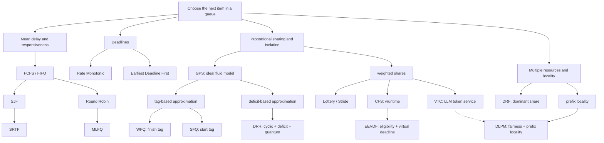
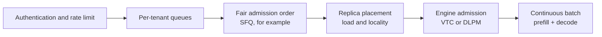

There is no single correct answer to “what should run next?” for a shared queue. The right algorithm depends on whether the objective is to reduce mean waiting time, respond to interaction quickly, meet deadlines, or divide resources fairly among users.

This article connects CPU scheduling, network fair queueing, and LLM inference serving by asking <strong>what each generation tried to optimize and what it changed from its predecessors</strong>. The second half focuses on [*Start-time Fair Queueing: Pay-after fair scheduling*](https://imoz.jp/scraps/202607_start_time_fair_queueing.en.html), explaining why SFQ's “select, then charge” structure fits admission order for LLM requests and how that router-level use differs from VTC inside an inference engine.

## 1. Define a good schedule first

Represent task $i$ by arrival time $a_i$, processing demand $p_i$, completion time $C_i$, deadline $d_i$, and weight $w_i$. Common objectives include:

| Objective | Metric | Typical question |
|---|---|---|
| Finish work early | Turnaround $C_i-a_i$, mean flow time | How can jobs finish sooner on average? |
| React early | Response time (first run time $-a_i$) | How can an interactive request respond immediately? |
| Meet deadlines | Deadline misses, maximum lateness | Can control, audio, or video work finish on time? |
| Divide fairly | Difference in normalized service, max-min fairness | Can a noisy neighbor be isolated? |
| Use all capacity | Throughput, utilization, work conservation | Is usable capacity being left idle? |
| Be predictable | Tail latency, maximum wait, jitter | Can P99 or a worst case be bounded? |

These objectives often conflict. Prioritizing short jobs reduces mean wait but can starve long jobs. Switching in small increments improves responsiveness but costs context switches and cache locality.

At least the following assumptions must also be fixed before choosing an algorithm:

- <strong>Preemptibility</strong>: can work stop and resume partway through?
- <strong>Size information</strong>: is $p_i$ exact, estimated, or unknown until completion?
- <strong>Resource dimensionality</strong>: is CPU the only resource, or do GPU memory, bandwidth, and KV cache contend too?
- <strong>Fairness principal</strong>: is fairness among processes, users, organizations, API keys, or models?
- <strong>Decision layer</strong>: is the decision admission, replica placement, dispatch order, or an in-flight token iteration?

## 2. Genealogy: branches by objective, not one linear progression

The following is a <strong>conceptual map of objectives and selection logic</strong>, not a chronology or a strict inheritance tree. Solid edges group or contrast design transitions. Dotted edges show Linux's adoption transition or DLPM relaxing VTC's strict order for locality. DLPM's quantum and deficit are also influenced by DRR.



This is not a chart in which every newer algorithm dominates every older one. DRR's amortized $O(1)$ work is attractive for tens of thousands of flows at line rate. A gateway with a few dozen LLM tenants can afford a tag-based algorithm with $O(\log n)$ selection. A different branch becomes useful whenever the objective or constraint changes.

## 3. The completion-time and responsiveness branch

### 3.1 FCFS / FIFO: arrival order is easy to explain

First-Come, First-Served selects the head of an arrival-ordered queue and normally runs it to completion.

```text
ready = queue ordered by arrival
if the CPU is free:
    running = ready.pop_front()
run running until completion
```

Each enqueue/dequeue and next-task decision is $O(1)$, deterministic, and easy to explain; constructing the full schedule for $n$ jobs is $O(n)$. Its weakness is the <strong>convoy effect</strong>: when one long job is followed by many short jobs, every short job waits behind the long one. This hurts both the mean and the response time of interactive work.

### 3.2 SJF / SRTF: prefer short work when size is known

Shortest Job First (SJF) chooses the arrived task with minimum $p_i$ whenever the CPU becomes free. Under the classical assumptions that all jobs are available together, lengths are known, there is one CPU, and execution is non-preemptive, SJF minimizes mean waiting time.

Shortest Remaining Time First (SRTF, also called SRPT or STCF) is the preemptive counterpart. At each decision point it selects the task with the smallest remaining time $r_i$. For jobs with known release times and processing times on one unit-speed machine, with cost-free preemption, SRTF minimizes total—and therefore mean—flow time. It does so at a cost:

- long tasks can starve while short tasks keep arriving;
- the policy is sensitive to size-prediction error;
- frequent preemption requires state-save and restore work;
- a user benefits by declaring a job shorter, so untrusted self-reported size is unsafe.

### 3.3 Round Robin: prioritize “run once soon” over completion order

Round Robin (RR) gives each task at most a time quantum $q$, then moves unfinished work to the tail.

```text
while ready is not empty:
    task = ready.pop_front()
    run min(q, task.remaining)
    if task is unfinished:
        ready.push_back(task)
```

As $q\to\infty$, RR approaches FCFS. Reducing $q$ lets every runnable task respond sooner, but making it too small increases context-switch and cache-miss costs on real hardware. RR equalizes CPU <strong>time</strong>. A request-count round robin, discussed later, does not equalize resources when one request can be much heavier than another.

### 3.4 MLFQ: infer short and interactive work without knowing the future

A Multi-Level Feedback Queue (MLFQ) maintains several priority queues. New tasks start at high priority; tasks that consume their CPU allotment are demoted; interactive tasks that block or yield quickly remain high. Periodically moving every task back to the top—a global priority boost—limits starvation. Aging, which raises an individual task's priority as it waits, is another related mechanism.

MLFQ can be understood as replacing SJF's impossible “predict total run time” input with <strong>online inference from observed behavior</strong>. Care is needed: if the rules reward yielding just before a quantum expires, a task can game the policy. Implementations therefore account for cumulative CPU usage and related behavior.

## 4. The deadline and proportional-share branches

### 4.1 EDF and Rate Monotonic: deadline feasibility before fairness

Earliest Deadline First (EDF) selects the ready job with the earliest absolute deadline $d_i$ and preempts when an earlier deadline arrives. Under the standard assumptions of independent jobs, one preemptive CPU, and negligible switching cost, EDF is feasibility-optimal: if any schedule can meet the deadlines, EDF can as well.

Rate Monotonic (RM) gives a shorter-period periodic task a higher fixed priority. Under the Liu–Layland assumptions of independent periodic tasks, implicit deadlines $D_i=T_i$, one preemptive CPU, fixed worst-case execution time $e_i$, and no blocking or switching overhead, the famous sufficient utilization condition for $n$ tasks is

$$
U=\sum_{i=1}^{n}\frac{e_i}{T_i}\le n\left(2^{1/n}-1\right).
$$

EDF and RM do not try to give everybody equal service. They reorder work to satisfy timing constraints.

### 4.2 Lottery / Stride: convert weights into CPU shares

Lottery scheduling gives each task tickets proportional to its weight and draws which task receives the next <strong>fixed-size allocation quantum</strong>. It provides proportional shares in long-run expectation but has short-term variance.

Stride scheduling makes the process deterministic. For a large constant $L$, define

$$
\operatorname{stride}_i=\frac{L}{w_i}.
$$

Choose the task with the smallest `pass`, grant the same-size quantum, then update `pass += stride`. If allocations vary in size, advance proportionally with `pass += service_used × L / w_i`. A high-weight task advances more slowly per unit service and is selected more often. The same skeleton—choose the principal with the least accumulated normalized service—reappears in CFS, SFQ, and VTC.

### 4.3 From CFS to EEVDF

Linux's Completely Fair Scheduler (CFS) approximates an ideal weighted CPU that runs all runnable tasks simultaneously. On a real CPU it selects the task with the smallest normalized execution time, `vruntime`. Running that task advances its `vruntime` until another task becomes leftmost.

Linux began transitioning from CFS toward Earliest Eligible Virtual Deadline First (EEVDF) in version 6.6. EEVDF expresses how far a task is behind its fair share as `lag`; among tasks with `lag >= 0`, it chooses the earliest virtual deadline. This preserves proportional sharing while making latency-sensitive tasks with shorter requested slices easier to express. CFS and EEVDF belong to the same virtual-time family, but EEVDF makes eligibility and deadline explicit in the selection rule.

## 5. Fair queueing grew up in networks

CPU time can be preempted finely. A network packet normally cannot be interleaved with another flow's packet once transmission begins. Research on dividing such indivisible work fairly among flows leads directly to LLM request scheduling.

### 5.1 GPS: an ideal model that defines fairness

Generalized Processor Sharing (GPS) treats every backlogged flow as infinitely divisible fluid and shares one link simultaneously in proportion to weights $w_i$. Real packet schedulers approximate GPS completion order or service discrepancy using indivisible packets.

### 5.2 WFQ: choose the smallest virtual finish time

Assign start and finish tags to packet $k$ from flow $i$:

$$
S_i^k=\max\left(V(a_i^k),F_i^{k-1}\right),\qquad
F_i^k=S_i^k+\frac{L_i^k}{w_i}.
$$

Weighted Fair Queueing (WFQ) broadly selects the packet with the smallest $F_i^k$, approximating GPS completion order. Packet length $L_i^k$ must be known before selection.

### 5.3 SFQ: choose by start tag, not finish tag

Start-time Fair Queueing (SFQ) compares the FIFO head packet of every backlogged flow and selects the one with the smallest $S_i^k$. The selected packet's length does not decide whether that packet is selected now. Instead, it sets the finish tag—and therefore affects the <strong>next selection</strong> from that flow.

That shift in time is useful for an LLM router with estimated request size. Let a request pass first, record its estimated cost on the tenant's meter, and let the other tenants catch up before selecting that tenant again. It is a deferred-charge structure.

### 5.4 DRR: replace tag arithmetic with a quantum and deficit

Deficit Round Robin (DRR) keeps a deficit counter $D_i$ for each flow and adds quantum $Q_i$ whenever it visits an active flow. It <strong>repeatedly</strong> transmits head packets while they fit, subtracting each length, and carries an unused deficit to the next round only while the flow remains backlogged. When the queue drains, it resets $D_i=0$ so idle credit cannot accumulate. Weighted DRR uses $Q_i\propto w_i$. If $Q_i\ge L_{\max}$, every visit can advance at least one packet, supporting the usual amortized-$O(1)$ argument.

DRR distributes <strong>credit before use</strong>; SFQ lets work pass and records <strong>debt after selection</strong>. A network MTU gives a stable basis for choosing a quantum. Maximum LLM request cost changes substantially with the model and workload.

### 5.5 DRF: consider multiple resources together

In a cluster, one job can dominate CPU while another dominates memory. Dominant Resource Fairness (DRF) takes each user's maximum allocation fraction across resources as its dominant share and favors users with smaller dominant shares. This branch defines max-min fairness over multiple resources instead of forcing every cost into one processing-time scalar.

## 6. Run the algorithms yourself

The lab below has two modes. In LLM mode, each tenant's configured requests arrive as one batch at its join time, and logical time advances by one per admission. While queues remain active, a boundary join occurs before that time's admission. If the preceding admission drained every queue, SFQ's idle reset occurs before a join at the same boundary. If all queues remain empty until a future arrival, time jumps there and reset / join appears as a separate non-admission stage. With no future arrival, the final reset is annotated on the last admission.

1. <strong>CPU</strong>: change arrival time, burst length, and RR quantum; compare FCFS, SJF, SRTF, and RR timelines and delays.
2. <strong>LLM</strong>: change every tenant's estimated cost, request count, and weight, plus tenant C's join time; compare global FIFO, request-count RR, shortest request first, and SFQ admission order.

In CPU mode, first observe short C waiting behind long A, then switch to SRTF. In LLM mode, set A's cost to 8 and B's to 2. Count admissions in the sequence under tenant RR and SFQ, then compare them with the normalized-cost bars for the common-backlog interval.

<TaskSchedulingVisualizer />

The simulator is a discrete teaching model. In particular, LLM mode models only <strong>admission order into a server pool</strong>, not GPU execution time. Because finite queues eventually expose different total demand, observe fairness while both tenants remain backlogged rather than only at the final state.

## 7. What is special about an LLM request?

LLM inference is more than a queue of differently sized HTTP requests.

### 7.1 Output length is unknown at selection time

Input token count is known, but output is not determined until generation terminates—by EOS, an output cap, a stop sequence, cancellation, or error. `max_tokens` is a limit, not the generated length. Policies such as SJF and WFQ that rank the current job using an exact length cannot be applied directly without a predictor.

### 7.2 Prefill and decode have different cost structures

Prefill processes prompt tokens in parallel and tends to be compute-heavy. Decode generates tokens autoregressively, one iteration at a time, while repeatedly reading the KV cache. A token stresses different bottlenecks depending on phase, batch composition, sequence length, and hardware. Token count is a useful service proxy, not a synonym for GPU seconds.

### 7.3 A request is indivisible outside but iterative inside

After a load balancer dispatches a request, returning it safely and moving it to another server is generally expensive. Treating it as non-preemptive at the outer router is therefore natural.

Inside an engine, Orca proposed iteration-level scheduling with selective batching. In what is now commonly called continuous or in-flight batching, an engine can rebuild a batch at decode-iteration boundaries. Some implementations can also preempt with KV-cache swap or recomputation. “LLM requests are never preemptible” is therefore too broad; the <strong>scheduler layer</strong> must be stated.

### 7.4 Batching, KV cache, and prefix locality interact

Co-locating requests with a shared prefix can reuse KV cache. Strict fairness order can scatter requests from one tenant and destroy that locality. When the head request does not fit available KV blocks, skipping it improves work conservation but weakens the ability to explain order using a fairness counter alone.

### 7.5 Request count is the wrong fairness unit

Giving 100 short chats and 100 long generations equal request counts does not equalize resource consumption. If the fairness principal is the tenant, service needs at least a positive estimated cost such as

$$
c(r)=\alpha n_{\text{input}}+\beta\widehat{n}_{\text{output}}.
$$

If model, prefix-cache hit, LoRA adapter, or SLO tier matters, $c$ becomes a profile-calibrated policy.

## 8. SFQ fits the router layer

Assume one scheduler stands in front of a pool serving the same model. Every tenant queue is FIFO, and whenever a slot is available, the scheduler decides only which single request to admit next.

### 8.1 Collapse tags into one variable per tenant

Keep meter $M_i$, the next request's start tag, for every tenant and one virtual time $V$. With equal weights, one decision is four lines:

```text
select: i = argmin(active tenants) M_i   # tenant ID breaks ties
clock:  V = M_i
admit:  send tenant i's FIFO head r to the server pool
charge: M_i = M_i + c(r)
```

With weights, the last line becomes $M_i\leftarrow M_i+c(r)/w_i$. The key is that current request cost $c(r)$ is not part of `argmin`. Estimation error does not decide whether this request passes now; it changes the rest period after admission.

### 8.2 Leave and rejoin without banking idle credit

A tenant with an empty queue leaves the candidate set. When it becomes non-empty again, join the current baseline with

$$
M_i\leftarrow\max(M_i,V).
$$

A tenant cannot save an unused share while idle and monopolize a later burst.

When every tenant's waiting queue drains, close the busy period without carrying old debt into the next one:

$$
V\leftarrow\max\left(V,\max_i M_i\right).
$$

The interactive lab exposes both tenant C's late join and the final reset of `V` in its step display.

### 8.3 Why not retroactively correct every meter with actual cost?

In this router-level SFQ variant, $c(r)$ is fixed at admission and is not surcharged or refunded after completion. Meters remain monotonic, which removes races over when to reconcile measured completion cost. Completion still determines when capacity opens relative to arrivals, so it can change the candidate set. Deterministic replay requires the same totally ordered stream of arrival, cancellation, and dispatch-capacity events, serialized decisions, and deterministic tie-breaking—not merely the same arrivals. Systematic error is addressed by slowly recalibrating $\alpha$, $\beta$, or the output-length predictor for future requests rather than rolling back individual meters.

This is not the only possible design. VTC's length-prediction variant, discussed below, reconciles predicted and actual output. That policy needs an analysis different from the simple fixed-charge SFQ invariant.

### 8.4 What does it guarantee?

Use the tags from the [original SFQ paper](https://doi.org/10.1145/248156.248171) with the [discrete router interpretation](https://imoz.jp/scraps/202607_start_time_fair_queueing.en.html).

Assume equal weights, one-at-a-time admission, and a positive cost fixed at admission. Let $\bar c$ be either a configured uniform bound on every request or the largest charge from the start of the busy period containing an observation interval through that interval's end. The maximum <strong>inside the observation interval alone</strong> cannot cover debt created before the interval. With this definition, meters for waiting tenants lie exactly in the following band at decision boundaries:

$$
V\le M_i\le V+\bar c.
$$

For two tenants $i,j$ that remain backlogged throughout an interval, let $W_i,W_j$ be the estimated cost charged in that interval. Bounding the meter difference at both endpoints yields

$$
|W_i-W_j|\le 2\bar c.
$$

For weighted tenants, define normalized charge $q(r)=c(r)/w_{\operatorname{owner}(r)}$ and a busy-period-covering bound $\bar q$. For fixed weights, the corresponding statement is

$$
\left|\frac{W_i}{w_i}-\frac{W_j}{w_j}\right|\le 2\bar q.
$$

Because one indivisible request can move a tenant ahead by one whole request immediately after admission, granularity on the order of $\bar c$ (or $\bar q$ with weights) is unavoidable.

The guarantee covers <strong>admission fairness over the estimated cost charged</strong>. It does not guarantee measured GPU seconds, KV-cache occupancy, per-request deadlines, or fairness across independent scheduler replicas. Nor does it transplant the original SFQ paper's single-link delay and throughput bounds unchanged to a parallel server pool.

### 8.5 Implementation cost

For $T$ active tenants, scanning every meter is $O(T)$. A heap or ordered set keyed by `(meter, tenant_id)` gives $O(\log T)$ updates and selection. A linear scan can be practical and easier to audit for tens or hundreds of tenants.

Implementation details that matter:

- preserve tenant-local FIFO and use tenant ID to break equal-meter ties deterministically;
- use integer or fixed-point cost units to avoid ambiguous floating-point ties;
- only $M_i-V$ matters, so values can be rebased atomically with $M_i\leftarrow M_i-V$ for every tenant and $V\leftarrow0$;
- under the fixed-charge model, do not refund admission cost on cancellation or failure;
- keep admission control, replica placement, and autoscaling in separate layers.

## 9. Use VTC inside the engine, and DLPM when locality matters

### 9.1 VTC: charge unknown output as tokens appear

[The VTC paper (OSDI 2024)](https://www.usenix.org/conference/osdi24/presentation/sheng) defines this engine-level fairness mechanism.

Virtual Token Counter (VTC) integrates with a continuous-batching scheduler and maintains a counter per client. Adding a new request charges its input-token service. Every decode iteration adds the service of output tokens actually generated. When capacity opens in the batch, requests from the client with the smallest counter are favored.

VTC also lifts a returning client's counter to the active baseline so that idle time cannot accumulate credit. Its biggest difference from router-level SFQ is that unknown output need not be predicted: service is observed and charged while generation progresses.

| Aspect | Router-level SFQ | Engine-level VTC |
|---|---|---|
| Decision | Admission into a server pool | Requests added to a running batch |
| When cost is charged | Fixed estimate immediately after admission | Known input-token service at selection/prefill; generated output-token service after each decode step |
| Output length | Estimated and fixed | Generated service observed before completion |
| Engine modification | Not required | Scheduler and counter updates must be integrated |
| Main guarantee target | Dispatch fairness over estimated cost | Execution fairness over defined token service |
| Relationship | Upstream | Downstream; both can be combined |

VTC's formal bound applies to clients continuously backlogged in the waiting queue under its single-engine, non-preemptive continuous-batching model. It bounds the defined token-service difference and depends on maximum input cost and the running batch's token capacity. “Execution fairness” does not mean every GPU metric or a distributed replica fleet. The length-prediction variant can reduce average discrepancy empirically, but it does not improve the paper's worst-case lower bound.

There is no contradiction between the VTC paper saying unknown output prevents direct application of classical SFQ and recommending SFQ here. VTC targets <strong>measured token-service fairness inside the engine</strong>. Router SFQ narrows the problem to <strong>ordering fairness over cost fixed at admission</strong>. They guarantee different quantities.

VTC's length-prediction variant pre-charges predicted output cost when selecting a request, adds any underprediction during decoding, and refunds overprediction at completion. It can reduce average service discrepancy, but prediction error and completion events enter counter updates, unlike fixed-charge router SFQ.

### 9.2 DLPM / D²LPM: relax fair order to reuse prefixes

The [2025 DLPM / D²LPM preprint](https://arxiv.org/abs/2501.14312) addresses the conflict between VTC's strict order and prefix locality.

VTC does not consider prefix locality. The 2025 arXiv preprint proposing Deficit Longest Prefix Match (DLPM) uses a client quantum $Q_u$ and deficit: while credit permits, it favors longest-prefix matches; when credit is exhausted, it yields to other clients. Double Deficit LPM (D²LPM) adds a per-client/per-worker quantum $Q_w$ to control stickiness to a worker, bringing distributed prefix locality and load balance into the decision.

Increasing $Q_u$ gives locality more freedom but also loosens DLPM's service bound. $Q_w$ primarily controls worker stickiness and the locality/load-balance trade-off. The two roles should not be collapsed: together they expose the conflict between fairness and efficiency as explicit knobs rather than claiming to maximize both with one order.

### 9.3 Equinox: the argument that one token counter is insufficient

The [2025 Equinox preprint](https://arxiv.org/abs/2508.16646) explores a different direction that predicts and combines multiple metrics.

The 2025 Equinox preprint argues that prefill/decode asymmetry prevents token count alone from representing latency, throughput, and GPU utilization simultaneously. It combines predicted user-side and resource-side counters. This is an interesting development, but it needs predictors and policy weights, making semantics and validation more complex than SFQ or VTC. Its reported experiments should be treated as preprint evidence, not a universal production guarantee.

## 10. Choose from the objective and layer backward

| Situation | First candidate | Reason / caution |
|---|---|---|
| Reduce batch mean completion time with known sizes | SJF / SRTF | Needs starvation control and robust prediction |
| Let interactive CPU tasks run quickly once | RR / MLFQ | Quantum versus context-switch cost |
| Hard or soft deadlines dominate | EDF / RM | Specify the task model and analyze feasibility first |
| Divide CPU share by weights | Stride / CFS / EEVDF family | Account for sleep/wakeup and granularity |
| Share packet service rapidly across many flows | DRR | Best when $L_{\max}$ and a quantum can be designed |
| Allocate multiple cluster resources to users | DRF | Placement can remain a separate problem |
| Fairly order admission into unmodified LLM servers | Estimated cost + SFQ | Guarantee stops at one scheduler and estimated-cost order |
| Handle unknown output inside continuous batching | VTC | Requires engine integration and a cost function |
| Preserve LLM prefix locality too | DLPM / D2LPM | Quantum controls the fairness-locality trade-off |
| Make SLO/latency and GPU efficiency multi-objective | Profile- or predictor-based scheduler | Continuously validate prediction error and policy weights |

A production design is usually clearer when responsibilities are layered instead of assigned to one algorithm:



Rate limits enforce abuse and budget ceilings. A fair scheduler divides congested shares. Placement handles load and locality. The engine scheduler controls actual token service. Orthogonal responsibilities make “why did this request wait?” easier to explain.

## 11. Pre-deployment validation checklist

1. <strong>Objective</strong>: which comes first—mean, P99, deadlines, or tenant isolation?
2. <strong>Backlog definition</strong>: one item in a queue, or a demand level at which another admission cannot improve throughput?
3. <strong>Cost function</strong>: how are input/output tokens, profiled GPU time, and cache hits counted?
4. <strong>Weight semantics</strong>: contract tier or urgency? Does $w=2$ mean twice the service?
5. <strong>Idle/rejoin rule</strong>: is unused share forbidden from accumulating, or intentionally exposed as burst credit?
6. <strong>Indivisibility</strong>: where is preemption possible, and where is dispatch irreversible?
7. <strong>Work conservation</strong>: can a fairness rule leave a GPU idle despite schedulable demand?
8. <strong>Adversarial traces</strong>: test heavy tails, ON/OFF traffic, one-request rejoining, prediction error, and cancellation.
9. <strong>Distributed state</strong>: does splitting counters across replicas destroy global fairness?
10. <strong>Observability</strong>: record per-tenant wait, normalized service, counters, cache hits, TTFT, and TPOT together.

Jain's fairness index

$$
J(x_1,\ldots,x_n)=\frac{(\sum_i x_i)^2}{n\sum_i x_i^2}
$$

is useful, but its meaning changes completely depending on whether $x_i$ is request count, token service, or GPU seconds. It should not demand service from a tenant with no demand, and it is undefined when all $x_i=0$. The lab resets its baseline whenever the comparison cohort changes and computes the displayed value only from increments during an interval in which that same cohort shares backlog. Production evaluation should likewise combine it with backlogged intervals, SLOs, and work conservation.

## 12. Summary

- A scheduler is not just a “choose next” function. It is a combination of <strong>objective, assumptions, charging unit, and decision layer</strong>.
- FCFS → SJF/SRTF targets mean delay; RR/MLFQ targets responsiveness; EDF/RM targets deadlines; Lottery/Stride/CFS/EEVDF and fair queueing pursue proportional allocation on separate branches.
- Approximating GPS with indivisible packets produced two implementation directions: WFQ/SFQ select minimum tags, whereas DRR avoids a global `argmin` by using cyclic visits and deficits.
- Unknown output, prefill/decode, continuous batching, KV cache, and prefix locality mean request-count round robin is insufficient for LLM serving fairness.
- In front of an unmodified server pool, SFQ is simple and explainable when it <strong>charges a fixed estimated cost after selection</strong>. Its guarantee is dispatch fairness over that estimate—not measured GPU fairness.
- When the engine can be controlled, VTC's incremental charge for actual token progress better matches unknown output. DLPM-family policies become relevant when prefix locality must also be preserved.

The most important rule is not to choose by algorithm name. Define the fairness principal and the unit of service, identify the layer where a decision can actually be enforced, and only then compare selection rules. That design order is unchanged from classical operating systems to LLM serving.

## References

1. Remzi H. Arpaci-Dusseau, Andrea C. Arpaci-Dusseau, [*Operating Systems: Three Easy Pieces — Scheduling: Introduction*](https://pages.cs.wisc.edu/~remzi/OSTEP/cpu-sched.pdf) / [*Multi-Level Feedback Queue*](https://pages.cs.wisc.edu/~remzi/OSTEP/cpu-sched-mlfq.pdf).
2. Linus E. Schrage, ["A Proof of the Optimality of the Shortest Remaining Processing Time Discipline"](https://doi.org/10.1287/opre.16.3.687), *Operations Research*, 1968.
3. C. L. Liu, James W. Layland, ["Scheduling Algorithms for Multiprogramming in a Hard-Real-Time Environment"](https://doi.org/10.1145/321738.321743), *JACM*, 1973.
4. Carl A. Waldspurger, William E. Weihl, ["Stride Scheduling: Deterministic Proportional-Share Resource Management"](https://dspace.mit.edu/handle/1721.1/149244), MIT/LCS/TM-528, 1995.
5. Linux Kernel documentation, [CFS Scheduler](https://docs.kernel.org/scheduler/sched-design-CFS.html) / [EEVDF Scheduler](https://docs.kernel.org/scheduler/sched-eevdf.html).
6. Alan Demers, Srinivasan Keshav, Scott Shenker, ["Analysis and Simulation of a Fair Queueing Algorithm"](https://doi.org/10.1145/75246.75248), SIGCOMM, 1989.
7. Abhay K. Parekh, Robert G. Gallager, ["A Generalized Processor Sharing Approach to Flow Control in Integrated Services Networks"](https://doi.org/10.1109/90.234856), 1993.
8. Pawan Goyal, Harrick M. Vin, Haichen Cheng, ["Start-time Fair Queueing"](https://doi.org/10.1145/248156.248171), SIGCOMM, 1996.
9. M. Shreedhar, George Varghese, ["Efficient Fair Queuing Using Deficit Round-Robin"](https://doi.org/10.1109/90.502236), 1996.
10. Ali Ghodsi et al., ["Dominant Resource Fairness: Fair Allocation of Multiple Resource Types"](https://www.usenix.org/conference/nsdi11/dominant-resource-fairness-fair-allocation-multiple-resource-types), NSDI, 2011.
11. Gyeong-In Yu et al., ["Orca: A Distributed Serving System for Transformer-Based Generative Models"](https://www.usenix.org/conference/osdi22/presentation/yu), OSDI, 2022.
12. Woosuk Kwon et al., ["Efficient Memory Management for Large Language Model Serving with PagedAttention"](https://doi.org/10.1145/3600006.3613165), SOSP, 2023.
13. Ying Sheng et al., ["Fairness in Serving Large Language Models"](https://www.usenix.org/conference/osdi24/presentation/sheng), OSDI, 2024.
14. Shiyi Cao et al., ["Locality-aware Fair Scheduling in LLM Serving"](https://arxiv.org/abs/2501.14312), 2025.
15. Zhixiang Wei et al., ["Equinox: Holistic Fair Scheduling in Serving Large Language Models"](https://arxiv.org/abs/2508.16646), preprint, 2025.
16. Carl A. Waldspurger, William E. Weihl, ["Lottery Scheduling: Flexible Proportional-Share Resource Management"](https://www.usenix.org/conference/osdi-94/lottery-scheduling-flexible-proportional-share-resource-management), OSDI, 1994.
17. Raj Jain, Dah-Ming Chiu, William Hawe, ["A Quantitative Measure of Fairness and Discrimination for Resource Allocation in Shared Computer Systems"](https://www.cs.wustl.edu/~jain/papers/ftp/fairness.pdf), DEC TR-301, 1984.
18. Kentaro Imajo, ["Start-time Fair Queueing: Pay-after fair scheduling"](https://imoz.jp/scraps/202607_start_time_fair_queueing.en.html), 2026.
