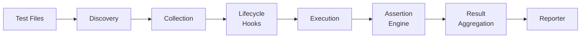

Have you ever wondered what happens behind the scenes when you run `pytest`?

Test frameworks (pytest, unittest, Jest, Go's testing package, etc.) take hundreds of lines of test code and **automatically discover, organize, execute, and report results** — a remarkably complex job. In this article, we'll build a test framework from scratch in Python, thoroughly dissecting its design philosophy and internal architecture.

## The Big Picture of a Test Framework

Let's start with the overall pipeline that a test framework processes.



Use the interactive demo below to step through what the test runner does at each phase.

<TestRunnerVisualizer />

Now let's dive into each phase, implementing real code along the way.

---

## Phase 1: Test Discovery — Finding the Files

The first thing a test framework does is **find which files are tests**.

### Convention-Based Discovery

Most frameworks identify test files by **filename conventions**.

```text
pytest:
  test_*.py
  *_test.py

unittest:
  test*.py (default for discover)

Jest / Vitest:
  **/*.test.{ts,js}
  **/*.spec.{ts,js}

Go:
  *_test.go
```

Let's implement this. `pathlib.Path.rglob()` lets us recursively traverse directories and collect all files matching a pattern in one shot.

```python
# mini_test/discovery.py
from pathlib import Path
from fnmatch import fnmatch

DEFAULT_PATTERNS = ["test_*.py", "*_test.py"]
DEFAULT_IGNORE = ["__pycache__", ".venv", "venv", ".git"]


def discover_test_files(
    root_dir: str = ".",
    patterns: list[str] | None = None,
    ignore: list[str] | None = None,
) -> list[Path]:
    """Recursively find test files matching glob patterns"""
    patterns = patterns or DEFAULT_PATTERNS
    ignore = ignore or DEFAULT_IGNORE
    root = Path(root_dir)

    files: list[Path] = []
    for path in root.rglob("*.py"):
        # Skip directories that should be ignored
        if any(part in ignore for part in path.parts):
            continue
        # Check if filename matches any pattern
        if any(fnmatch(path.name, pat) for pat in patterns):
            files.append(path)

    return sorted(files)
```

We apply `sorted()` to the result to make test execution order **deterministic**. The order returned by the filesystem varies by OS and filesystem type, so sorting guarantees a stable, environment-independent execution order. The ignore list (`__pycache__`, `.venv`, etc.) prevents the framework from accidentally picking up `.py` files inside those directories as "tests."

### Why Glob Patterns?

The advantage of glob patterns is that they're **declarative**. Users can define file placement rules in configuration, and the framework simply scans the filesystem following those patterns.

```ini
# pyproject.toml — this is exactly what testpaths config does
[tool.pytest.ini_options]
testpaths = ["tests"]
python_files = ["test_*.py", "*_test.py"]
python_classes = ["Test*"]
python_functions = ["test_*"]
```

---

## Phase 2: Test Collection — Gathering Functions and Classes

Once test files are found, the next step is to **collect** test cases from them. This is where pytest's design gets really interesting.

### pytest's Collection Strategy: Function Name Conventions

pytest doesn't use DSLs like `describe`/`it`. It identifies tests **purely by function name conventions** (`test_` prefix). Combined with Python's `inspect` module, this enables remarkably powerful discovery.

The implementation below uses `importlib.util` to **dynamically import test files as modules**. The three-step process — `spec_from_file_location()` to create a module spec from a file path, `module_from_spec()` to build the module object, and `exec_module()` to actually execute the code — allows importing any `.py` file without polluting `sys.path`.

```python
# mini_test/collector.py
import importlib.util
import inspect
from dataclasses import dataclass, field
from typing import Callable
from pathlib import Path


@dataclass
class TestCase:
    name: str
    fn: Callable[[], None]
    module_name: str


@dataclass
class TestSuite:
    name: str
    tests: list[TestCase] = field(default_factory=list)
    setup_module: Callable[[], None] | None = None
    teardown_module: Callable[[], None] | None = None
    setup_function: Callable[[], None] | None = None
    teardown_function: Callable[[], None] | None = None


def collect_from_file(path: Path) -> TestSuite:
    """Load a test file and collect test_ functions"""
    # Dynamically import the file as a module
    spec = importlib.util.spec_from_file_location(path.stem, path)
    if spec is None or spec.loader is None:
        raise ImportError(f"Cannot load {path}")

    module = importlib.util.module_from_spec(spec)
    spec.loader.exec_module(module)  # ← top-level code executes here

    suite = TestSuite(name=path.stem)

    # Collect lifecycle hooks
    suite.setup_module = getattr(module, "setup_module", None)
    suite.teardown_module = getattr(module, "teardown_module", None)
    suite.setup_function = getattr(module, "setup_function", None)
    suite.teardown_function = getattr(module, "teardown_function", None)

    # Collect functions starting with test_
    for name, obj in inspect.getmembers(module, inspect.isfunction):
        if name.startswith("test_"):
            suite.tests.append(
                TestCase(name=name, fn=obj, module_name=path.stem)
            )

    return suite
```

### The Key to Collection: Module Import

The crucial point here is that **`exec_module()` executes the module's top-level code**. The test functions themselves are NOT executed at this point — they're merely collected by name via `inspect.getmembers()`.

```python
# test_math.py — this file gets exec_module()'d

import math

print("This line runs during the collection phase")  # module level

def test_addition():
    # ← collected only; not executed yet
    assert 1 + 1 == 2

def test_sqrt():
    # ← collected only; not executed yet
    assert math.sqrt(4) == 2.0

def helper_function():
    # ← not collected (doesn't start with test_)
    pass
```

This pattern of **"import to collect, defer test execution"** is the foundational design of pytest-style frameworks. It enables:

1. **Separation** of test registration and execution
2. Knowing the total test count before execution (for progress bars)
3. **Filtering** (`-k` option) and **reordering** tests before running
4. Injecting lifecycle hooks (setup/teardown) at the right moments

### Lifecycle Hook Registration

In pytest / unittest conventions, functions with specific names are recognized as lifecycle hooks. The split into `setup_module`/`teardown_module` (module-level) and `setup_function`/`teardown_function` (per-test) exists for an important reason. **Expensive resources** like database connections can be created and destroyed once per module, while operations that ensure **test isolation** (e.g., clearing tables) run before every individual test.

```python
# test_database.py — lifecycle hook example

db = None

def setup_module():
    """Runs once before all tests in the module"""
    global db
    db = create_test_database()

def teardown_module():
    """Runs once after all tests in the module"""
    db.drop()

def setup_function():
    """Runs before each test function"""
    db.clear_tables()

def teardown_function():
    """Runs after each test function"""
    db.rollback()

def test_insert():
    db.insert({"key": "value"})
    assert db.get("key") == "value"

def test_delete():
    db.insert({"key": "value"})
    db.delete("key")
    assert db.get("key") is None
```

---

## Phase 3: The Execution Engine — Running in the Right Order

After collection, it's time to run the tests. The test runner's job is to **execute each test safely while interleaving lifecycle hooks in the correct order**.

### Execution Order

Visualizing the test runner's execution order for a suite reveals a nested structure: `setup_module` → (`setup_function` → test body → `teardown_function`) × n → `teardown_module`.

```text
Execution flow for Suite "test_math":
  ┌─ setup_module()         ← once for the entire module
  │
  │  ┌─ setup_function()    ← once per test
  │  │  test_addition() runs
  │  └─ teardown_function()
  │
  │  ┌─ setup_function()
  │  │  test_sqrt() runs
  │  └─ teardown_function()
  │
  └─ teardown_module()      ← once for the entire module
```

### Runner Implementation

A key detail in the implementation is the use of **`time.perf_counter()`**. While `time.time()` is based on the system clock and can be affected by NTP synchronization or manual clock changes, `perf_counter()` uses a monotonic clock, making it **ideal for measuring elapsed time**.

```python
# mini_test/runner.py
import time
from dataclasses import dataclass


@dataclass
class TestResult:
    name: str
    suite_name: str
    status: str  # "passed" or "failed"
    duration: float
    error: Exception | None = None


def run_suite(suite: TestSuite) -> list[TestResult]:
    results: list[TestResult] = []

    # setup_module — module-wide initialization
    if suite.setup_module:
        suite.setup_module()

    for test_case in suite.tests:
        # setup_function — per-test initialization
        if suite.setup_function:
            suite.setup_function()

        start = time.perf_counter()
        try:
            # Execute the test body
            test_case.fn()
            results.append(TestResult(
                name=test_case.name,
                suite_name=suite.name,
                status="passed",
                duration=time.perf_counter() - start,
            ))
        except Exception as exc:
            results.append(TestResult(
                name=test_case.name,
                suite_name=suite.name,
                status="failed",
                duration=time.perf_counter() - start,
                error=exc,
            ))

        # teardown_function — per-test cleanup
        if suite.teardown_function:
            suite.teardown_function()

    # teardown_module — module-wide cleanup
    if suite.teardown_module:
        suite.teardown_module()

    return results
```

### Test Isolation via try-except

One of the most important design principles in a test runner is that **one test's failure must not affect other tests**.

```python
# Each test is wrapped in its own try-except
try:
    test_case.fn()
    # → if no exception is thrown, PASS
except Exception as exc:
    # → if an exception is thrown, FAIL (other tests unaffected)
```

This works hand-in-hand with the design that "assertions simply raise exceptions." `assert 1 == 2` internally executes `raise AssertionError`. A test PASSes when "nothing was thrown," and FAILs when "something was thrown."

Another benefit of this `try-except` model is that it **catches unexpected errors (`TypeError`, `KeyError`, etc.) too**. Not just assertion failures, but any exception thrown during a test is safely captured, allowing the remaining tests to continue. This robustness is a fundamental quality expected of test runners.

---

## Phase 4: The Assertion Engine — Inside assert

The assertion engine is the part of the test framework closest to the user.

### Python's assert Statement

In Python tests, the built-in `assert` statement works out of the box. It's simply syntactic sugar for raising `AssertionError`.

```python
# The essence of assert
assert 1 + 1 == 2
# ↓ equivalent to
if not (1 + 1 == 2):
    raise AssertionError
```

However, a plain `assert` produces poor error messages. For example, when `assert result == "Hello, world!"` fails, plain Python only shows `AssertionError` with no indication of what `result` actually contained. This makes debugging painfully slow. pytest solves this through **assert rewriting**.

### pytest's Assert Rewriting

pytest **rewrites the AST (Abstract Syntax Tree) of `assert` statements at import time** to display detailed information on failure. This is one of pytest's most innovative features.

```python
# What the user writes
def test_greeting():
    result = greet("world")
    assert result == "Hello, world!"

# What pytest internally transforms it into (conceptually)
def test_greeting():
    result = greet("world")
    _left = result
    _right = "Hello, world!"
    if not (_left == _right):
        raise AssertionError(
            f"assert {_left!r} == {_right!r}\n"
            f"  where {_left!r} = greet('world')"
        )
```

Let's implement a simplified version of this mechanism:

```python
# mini_test/assertion_rewrite.py
import ast
import textwrap


class AssertRewriter(ast.NodeTransformer):
    """Transform assert statements to include detailed error messages"""

    def visit_Assert(self, node: ast.Assert) -> ast.AST:
        # Only rewrite assert a == b patterns
        if isinstance(node.test, ast.Compare):
            return self._rewrite_compare(node)
        return node

    def _rewrite_compare(self, node: ast.Assert) -> list[ast.stmt]:
        compare = node.test
        if not isinstance(compare, ast.Compare) or len(compare.ops) != 1:
            return [node]

        # Save left and right values in temporary variables
        stmts: list[ast.stmt] = []

        # __mt_left = <left expr>
        stmts.append(ast.Assign(
            targets=[ast.Name(id="__mt_left", ctx=ast.Store())],
            value=compare.left,
            lineno=node.lineno,
            col_offset=node.col_offset,
        ))

        # __mt_right = <right expr>
        stmts.append(ast.Assign(
            targets=[ast.Name(id="__mt_right", ctx=ast.Store())],
            value=compare.comparators[0],
            lineno=node.lineno,
            col_offset=node.col_offset,
        ))

        # if not (__mt_left <op> __mt_right): raise AssertionError(...)
        op_symbols = {
            "Eq": "==", "NotEq": "!=", "Lt": "<", "LtE": "<=",
            "Gt": ">", "GtE": ">=", "Is": "is", "IsNot": "is not",
            "In": "in", "NotIn": "not in",
        }
        op_name = type(compare.ops[0]).__name__
        op_symbol = op_symbols.get(op_name, op_name)
        raise_node = ast.Raise(
            exc=ast.Call(
                func=ast.Name(id="AssertionError", ctx=ast.Load()),
                args=[ast.JoinedStr(values=[
                    ast.Constant(value="assert "),
                    ast.FormattedValue(
                        value=ast.Name(id="__mt_left", ctx=ast.Load()),
                        conversion=ord("r"),
                    ),
                    ast.Constant(value=f" {op_symbol} "),
                    ast.FormattedValue(
                        value=ast.Name(id="__mt_right", ctx=ast.Load()),
                        conversion=ord("r"),
                    ),
                ])],
                keywords=[],
            ),
        )
        stmts.append(ast.If(
            test=ast.UnaryOp(
                op=ast.Not(),
                operand=ast.Compare(
                    left=ast.Name(id="__mt_left", ctx=ast.Load()),
                    ops=compare.ops,
                    comparators=[ast.Name(id="__mt_right", ctx=ast.Load())],
                ),
            ),
            body=[raise_node],
            orelse=[],
        ))

        # Assign line numbers to all nodes
        for stmt in stmts:
            ast.fix_missing_locations(stmt)
        return stmts
```

### Custom Assert Functions

While pytest's assert rewriting uses the advanced technique of AST transformation, a simpler approach is to implement **custom assert functions**.

The tradeoff is clear: AST rewriting lets users write plain `assert` and still get detailed messages, but the implementation is complex and harder to debug. Custom assert functions require calls like `assert_equal(a, b)`, but the implementation is transparent and easy to understand:

```python
# mini_test/assertions.py
from typing import Any


class AssertionError(Exception):
    def __init__(self, message: str, actual: Any = None, expected: Any = None):
        super().__init__(message)
        self.actual = actual
        self.expected = expected


def assert_equal(actual: Any, expected: Any) -> None:
    """Equality check using =="""
    if actual != expected:
        raise AssertionError(
            f"Expected {expected!r}, got {actual!r}",
            actual=actual,
            expected=expected,
        )


def assert_is(actual: Any, expected: Any) -> None:
    """Identity check using is"""
    if actual is not expected:
        raise AssertionError(
            f"Expected {expected!r} (id={id(expected)}), "
            f"got {actual!r} (id={id(actual)})",
            actual=actual,
            expected=expected,
        )


def assert_true(value: Any) -> None:
    if not value:
        raise AssertionError(f"Expected truthy, got {value!r}")


def assert_raises(exc_type: type, fn: Any, *args: Any, **kwargs: Any) -> None:
    """Verify that a function raises a specific exception"""
    try:
        fn(*args, **kwargs)
    except exc_type:
        return  # Expected exception → PASS
    except Exception as e:
        raise AssertionError(
            f"Expected {exc_type.__name__}, got {type(e).__name__}: {e}"
        )
    raise AssertionError(
        f"Expected {exc_type.__name__} to be raised, but nothing was raised"
    )


def assert_in(item: Any, container: Any) -> None:
    if item not in container:
        raise AssertionError(
            f"Expected {item!r} to be in {container!r}"
        )


def assert_length(obj: Any, length: int) -> None:
    actual = len(obj)
    if actual != length:
        raise AssertionError(
            f"Expected length {length}, got {actual}"
        )
```

### == vs is — What's the Difference?

The difference between these two comparisons is a common source of confusion for test writers. As a practical guideline, **use `==` when verifying value equality, and `is` when verifying identity with singleton objects (like `None`) or same-object references**.

```python
# == → value equality (__eq__ method)
assert [1, 2] == [1, 2]     # ✅ same values → OK
assert {"a": 1} == {"a": 1} # ✅ same structure → OK

# is → object identity (same id)
a = [1, 2]
b = [1, 2]
assert a is a  # ✅ same object
assert a is b  # ❌ same values but different objects

# Caveat: CPython caches small integers
assert 1 is 1        # ✅ CPython implementation detail (-5 to 256 are cached)
assert 1000 is 1000  # ⚠️ may happen to be True in CPython
```

### The not Modifier Pattern

```text
assert 1 == 2       → 1 == 2 is False → AssertionError
assert not 1 == 2   → not (1 == 2) is True → PASS
assert not 1 == 1   → not (1 == 1) is False → AssertionError
```

---

## Phase 5: Mocking & Patching — Replacing Function Behavior

Another crucial feature of test frameworks is the ability to **replace function behavior and record calls**.

Why is mocking necessary? Tests often face **external dependencies** like API calls, database connections, and filesystem operations. Including these dependencies directly in tests makes them slow, flaky, and environment-dependent. Mocking lets you replace these dependencies with "fakes," allowing you to focus solely on the logic under test.

### Implementing a Spy

A **spy** wraps the original function and records call information.

```python
# mini_test/spy.py
from typing import Any, Callable
from dataclasses import dataclass, field

_UNSET = object()  # Sentinel for "not set"


@dataclass
class CallRecord:
    args: tuple
    kwargs: dict
    return_value: Any = None
    exception: Exception | None = None


class Spy:
    """Wraps a function and records all calls"""

    def __init__(self, original: Callable | None = None):
        self._original = original
        self._mock_return: Any = _UNSET
        self._mock_impl: Callable | None = None
        self.calls: list[CallRecord] = []

    def __call__(self, *args: Any, **kwargs: Any) -> Any:
        record = CallRecord(args=args, kwargs=kwargs)
        self.calls.append(record)

        # If a mock return value was set
        if self._mock_return is not _UNSET:
            record.return_value = self._mock_return
            return self._mock_return

        # If a replacement implementation was set
        impl = self._mock_impl or self._original
        if impl:
            try:
                result = impl(*args, **kwargs)
                record.return_value = result
                return result
            except Exception as exc:
                record.exception = exc
                raise

        return None

    @property
    def call_count(self) -> int:
        return len(self.calls)

    def mock_return_value(self, value: Any) -> "Spy":
        self._mock_return = value
        return self

    def mock_implementation(self, fn: Callable) -> "Spy":
        self._mock_impl = fn
        self._mock_return = _UNSET
        return self

    def reset(self) -> None:
        self._mock_impl = None
        self._mock_return = _UNSET
        self.calls.clear()
```

### Testing with Spies

```python
def test_spy_records_calls():
    add = Spy(lambda a, b: a + b)

    add(1, 2)
    add(3, 4)

    assert add.call_count == 2
    assert add.calls[0].args == (1, 2)
    assert add.calls[0].return_value == 3

def test_spy_mock_return():
    fetch_user = Spy()
    fetch_user.mock_return_value({"name": "Alice"})

    user = fetch_user()
    assert user["name"] == "Alice"
```

### Patching Object Methods

In Python, `unittest.mock.patch` is well-known, and its mechanism is essentially **attribute replacement**. The `Patch` class below uses Python's context manager (`with` statement). `__enter__` replaces the attribute and `__exit__` restores it, **structurally preventing restoration from being forgotten**. This is critical for maintaining test isolation.

```python
# mini_test/patch.py
from typing import Any


class Patch:
    """Context manager that temporarily replaces an object's attribute"""

    def __init__(self, obj: Any, attr: str, replacement: Any = None):
        self.obj = obj
        self.attr = attr
        self.replacement = replacement or Spy()
        self._original: Any = None

    def __enter__(self) -> Any:
        # Save the original attribute and replace it
        self._original = getattr(self.obj, self.attr)
        setattr(self.obj, self.attr, self.replacement)
        return self.replacement

    def __exit__(self, *exc_info: Any) -> None:
        # Restore the original attribute
        setattr(self.obj, self.attr, self._original)
```

```python
# Usage example
import os

def test_patch_environ():
    with Patch(os, "getcwd", Spy(lambda: "/fake/path")) as mock_cwd:
        result = os.getcwd()
        assert result == "/fake/path"
        assert mock_cwd.call_count == 1

    # After exiting the with block, the original is automatically restored
    assert os.getcwd() != "/fake/path"
```

---

## Phase 6: The Reporter — Communicating Results to Humans

The reporter **formats test execution results into human-readable output**.

### Reporter Interface

Defining the reporter as an abstract class (interface) is a classic application of the **Strategy pattern**. The same test results can be output in various formats — console, JSON file, JUnit XML, HTML — and the runner depends only on the interface, not any specific implementation.

```python
# mini_test/reporter.py
from abc import ABC, abstractmethod


class Reporter(ABC):
    @abstractmethod
    def on_suite_start(self, suite: TestSuite) -> None: ...

    @abstractmethod
    def on_test_result(self, result: TestResult) -> None: ...

    @abstractmethod
    def on_suite_end(self, suite: TestSuite, results: list[TestResult]) -> None: ...

    @abstractmethod
    def on_run_end(self, all_results: list[TestResult]) -> None: ...
```

### Console Reporter Implementation

The console reporter uses ANSI escape codes (`\033[32m` for green, `\033[31m` for red, `\033[0m` for reset) to color-code test results. The visual feedback of green `✓` for passes and red `✗` for failures lets you scan hundreds of results at a glance.

```python
# mini_test/console_reporter.py
import time


class ConsoleReporter(Reporter):
    def __init__(self):
        self._start_time = 0.0

    def on_suite_start(self, suite: TestSuite) -> None:
        print(f"\n  {suite.name}")
        self._start_time = time.perf_counter()

    def on_test_result(self, result: TestResult) -> None:
        icon = "✓" if result.status == "passed" else "✗"
        color = "\033[32m" if result.status == "passed" else "\033[31m"
        reset = "\033[0m"
        duration = f"{result.duration * 1000:.1f}"

        print(f"    {color}{icon}{reset} {result.name} ({duration}ms)")

        if result.error:
            print(f"      {result.error}")

    def on_suite_end(self, suite: TestSuite, results: list[TestResult]) -> None:
        pass  # Per-suite summary omitted for brevity

    def on_run_end(self, all_results: list[TestResult]) -> None:
        passed = sum(1 for r in all_results if r.status == "passed")
        failed = sum(1 for r in all_results if r.status == "failed")
        total = len(all_results)
        duration = (time.perf_counter() - self._start_time) * 1000

        print("\n" + "─" * 40)
        if failed > 0:
            print(f"\033[31m  Tests: {passed} passed, {failed} failed, {total} total\033[0m")
        else:
            print(f"\033[32m  Tests: {passed} passed, {total} total\033[0m")
        print(f"  Time:  {duration:.0f}ms")
```

### Integrating the Reporter into the Runner

```python
# mini_test/runner.py (with reporter integration)

def run(suites: list[TestSuite], reporter: Reporter) -> list[TestResult]:
    all_results: list[TestResult] = []

    for suite in suites:
        reporter.on_suite_start(suite)
        results = run_suite(suite)

        for result in results:
            reporter.on_test_result(result)

        reporter.on_suite_end(suite, results)
        all_results.extend(results)

    reporter.on_run_end(all_results)
    return all_results
```

---

## Phase 7: Putting It All Together — The CLI Entry Point

Finally, let's build a CLI entry point that ties all the phases together. A particularly important detail here is the **exit code** design. `sys.exit(1 if failed else 0)` allows CI servers (GitHub Actions, Jenkins, CircleCI, etc.) to determine test success purely from the exit code. This follows the Unix convention of "exit code 0 = success, non-zero = failure," honored by every test framework.

```python
# mini_test/cli.py
import sys
from mini_test.discovery import discover_test_files
from mini_test.collector import collect_from_file
from mini_test.runner import run
from mini_test.console_reporter import ConsoleReporter


def main() -> None:
    # Phase 1: Discovery
    files = discover_test_files()
    print(f"Found {len(files)} test file(s)\n")

    # Phase 2: Collection
    suites = [collect_from_file(f) for f in files]

    # Phase 3–6: Execution + Reporting
    reporter = ConsoleReporter()
    results = run(suites, reporter)

    # Exit code
    failed = any(r.status == "failed" for r in results)
    sys.exit(1 if failed else 0)


if __name__ == "__main__":
    main()
```

### Sample Output

```text
$ python -m mini_test

Found 2 test file(s)

  test_math
    ✓ test_addition (0.3ms)
    ✓ test_division_by_zero (0.1ms)

  test_string
    ✓ test_trim (0.2ms)
    ✗ test_upper (0.4ms)
      AssertionError: Expected 'HELLO', got 'Hello'

────────────────────────────────────────
  Tests: 3 passed, 1 failed, 4 total
  Time:  12ms
```

---

## Comparison with Real Frameworks

We've now implemented the core features of a test framework. Real frameworks build many more advanced features on top of this core. Test parallelization shortens execution time, snapshot testing enables regression detection, code coverage reveals untested paths, and watch mode improves the development experience — each bringing its own unique design challenges.

### Test Parallelization

pytest-xdist uses `execnet` to spawn and manage worker processes, running test files in parallel.

```text
Parallel execution architecture:
  Main process (coordinator)
    │
    ├── Worker 1 (subprocess): test_math.py
    ├── Worker 2 (subprocess): test_string.py
    ├── Worker 3 (subprocess): test_api.py
    └── Worker 4 (subprocess): test_ui.py

  Each worker is an independent process,
  preventing global state interference.
  Results are aggregated via IPC to the main process.
```

```python
# Conceptual implementation of parallel execution
from multiprocessing import Pool
from pathlib import Path

def run_file(path: str) -> list[TestResult]:
    suite = collect_from_file(Path(path))
    return run_suite(suite)

def run_in_parallel(files: list[Path], num_workers: int = 4) -> list[TestResult]:
    with Pool(num_workers) as pool:
        nested = pool.map(run_file, [str(f) for f in files])
    return [r for results in nested for r in results]  # flatten
```

### Snapshot Testing

Snapshot testing **saves output to a file and compares it on the next run** (in pytest, plugins like syrupy provide this). It's especially effective for cases where the output is complex and writing the "correct value" by hand would be tedious, such as UI components or API responses. On the first run, it saves a "baseline snapshot," and subsequent runs detect only the diff — efficiently catching unintended regressions.

```python
# Conceptual implementation
import json
from pathlib import Path
from typing import Any

def assert_matches_snapshot(actual: Any, snapshot_path: Path) -> None:
    serialized = json.dumps(actual, indent=2, sort_keys=True, default=str)

    if snapshot_path.exists():
        stored = snapshot_path.read_text()
        if serialized != stored:
            raise AssertionError(
                f"Snapshot mismatch. Run with --update to update.\n"
                f"  Expected: {stored[:100]}...\n"
                f"  Got:      {serialized[:100]}..."
            )
    else:
        # First run: save the snapshot
        snapshot_path.parent.mkdir(parents=True, exist_ok=True)
        snapshot_path.write_text(serialized)
```

### Code Coverage

Code coverage in Python is achieved through **trace hooks via `sys.settrace`** or **`sys.monitoring` (Python 3.12+)**.

```text
How coverage.py works:
  1. Sets a trace hook via sys.settrace()
  2. Python interpreter calls the hook on each line execution
  3. The hook records executed line numbers in a set
  4. After tests complete, compares against total lines to calculate coverage

Python 3.12+ sys.monitoring:
  1. sys.monitoring is a newer API with less overhead
  2. Monitors LINE events to record line execution
  3. coverage.py 7.x supports this new API
```

### Watch Mode

Watch mode detects file changes and automatically reruns tests, implemented through filesystem monitoring with libraries like `watchdog` (e.g., pytest-watch).

```python
# Conceptual implementation
from watchdog.observers import Observer
from watchdog.events import FileSystemEventHandler

class TestRerunHandler(FileSystemEventHandler):
    def on_modified(self, event):
        if event.src_path.endswith(".py"):
            print(f"\nFile changed: {event.src_path}")
            run_tests()

def watch_mode(root_dir: str) -> None:
    print("Watching for changes...")
    observer = Observer()
    observer.schedule(TestRerunHandler(), root_dir, recursive=True)
    observer.start()
    observer.join()
```

---

## Design Comparisons Across Frameworks

### pytest vs unittest

```text
pytest:
  - Discovery: filename + function name conventions (test_ prefix)
  - Assertions: built-in assert rewriting (AST transformation)
  - Fixtures: decorators + dependency injection via argument names
  - Plugins: pluggy-based plugin system
  - Parallelization: pytest-xdist (execnet)

unittest:
  - Discovery: test* methods on TestCase subclasses
  - Assertions: assertEqual, assertTrue method family
  - Fixtures: setUp / tearDown methods
  - Plugins: TestRunner customization
  - Parallelization: not supported out of the box

The key difference:
  pytest made "using plain assert statements" possible
  through AST rewriting. This eliminated the need for
  verbose method calls like unittest's
  self.assertEqual(a, b).
```

### Go's testing Package

Go is a rare language that bakes testing into its standard library.

```go
// Go: tests are identified by function signature conventions
func TestAdd(t *testing.T) {
    result := Add(1, 1)
    if result != 2 {
        t.Errorf("Add(1, 1) = %d, want 2", result)
    }
}

// Subtests — hierarchical structure similar to describe/it
func TestMath(t *testing.T) {
    t.Run("addition", func(t *testing.T) {
        if Add(1, 1) != 2 {
            t.Fatal("1+1 should be 2")
        }
    })
    t.Run("division by zero", func(t *testing.T) {
        defer func() {
            if r := recover(); r == nil {
                t.Fatal("expected panic")
            }
        }()
        Divide(1, 0)
    })
}
```

```text
Go testing characteristics:
  - Discovery: go test collects Test* functions at compile time
  - Assertions: none in standard library (if + t.Error is the norm)
  - Parallelization: opt-in via t.Parallel()
  - Benchmarking: integrated via Benchmark* functions
  - Fuzzing: integrated via Fuzz* functions (Go 1.18+)
```

### Jest / Vitest

The major test frameworks in the JavaScript / TypeScript ecosystem.

```text
Jest:
  - Discovery: *.test.js / *.spec.js filename patterns
  - Collection: describe/it callback registration pattern
  - Assertions: expect().toBe() Fluent API
  - Mocking: jest.mock() automatic module mocking
  - Parallelization: child_process (fork) by default

Vitest:
  - Jest-compatible API but leverages the Vite ecosystem
  - Native ESM support
  - tinypool (worker_threads-based) parallelization
```

### pytest Fixtures — A Masterpiece of Dependency Injection

pytest's fixture system is one of the most elegant designs in test framework engineering. Test functions' **argument names** are matched against fixture names, and dependencies are automatically injected. This is similar to DI containers in web frameworks, but specialized for testing. With `yield`-based fixtures, everything before `yield` is setup and everything after is teardown, keeping resource creation and cleanup co-located.

```python
# pytest: fixtures are dependency injection
import pytest

@pytest.fixture
def database():
    """Create and destroy a test DB"""
    db = create_test_db()
    yield db        # ← inject db into the test
    db.cleanup()    # ← cleanup after the test

@pytest.fixture
def user(database):
    """A fixture that depends on the database fixture"""
    return database.create_user(name="Alice")

def test_insert(database):
    # Argument name "database" matches fixture name → auto-injected
    database.insert({"key": "value"})
    assert database.get("key") == "value"

def test_user_name(user):
    # user fixture auto-injected → database also auto-resolved internally
    assert user.name == "Alice"

# Parametric tests
@pytest.mark.parametrize("input_val,expected", [
    (1, 1),
    (2, 4),
    (3, 9),
])
def test_square(input_val, expected):
    assert input_val ** 2 == expected
```

```text
pytest fixture resolution:
  1. Get test function argument names via inspect.signature
  2. Match argument names to fixture names
  3. Build a dependency graph (fixtures can depend on other fixtures)
  4. Determine execution order via topological sort
  5. Cache based on scope (function / class / module / session)
```

---

## Summary

Test frameworks appear simple on the surface yet are composed of sophisticated design choices under the hood.

| Phase | Mechanism | Design Pattern |
|-------|-----------|---------------|
| Discovery | Glob patterns for file search | Convention over Configuration |
| Collection | Module import + inspect | Reflection |
| Lifecycle | setup/teardown hooks | Hook / Callback |
| Execution | try-except test isolation | Defensive Programming |
| Assertion | assert raises exceptions | AST Rewriting |
| Mocking | Function wrapping + call recording | Proxy Pattern |
| Reporting | Reporter abstract class | Strategy Pattern |
| Parallelization | execnet (process parallelism) | Message Passing |

Understanding "what happens behind the scenes" makes you a better test designer. Next time a test goes red, picture the `assert` statement triggering `raise AssertionError`, caught by the runner's `try-except` — and you'll know exactly what's happening.
