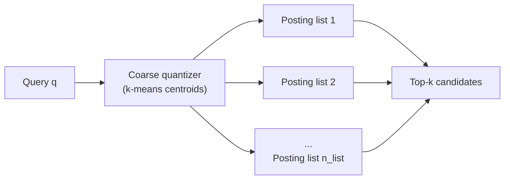
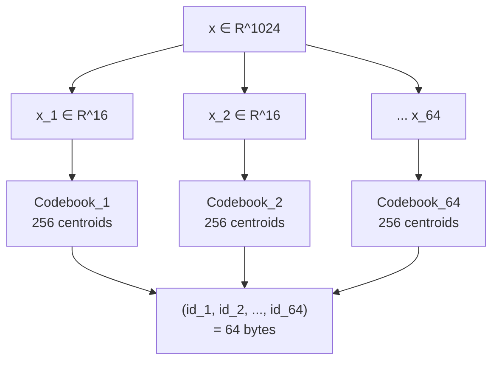
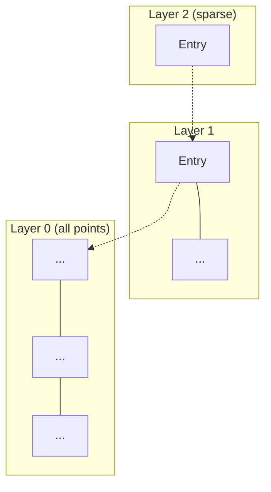
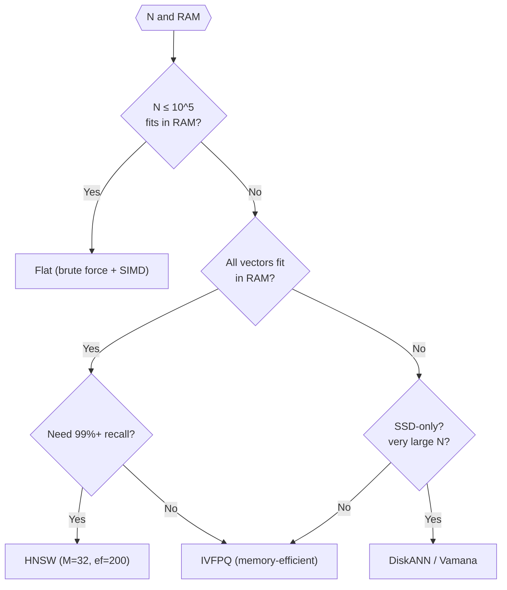
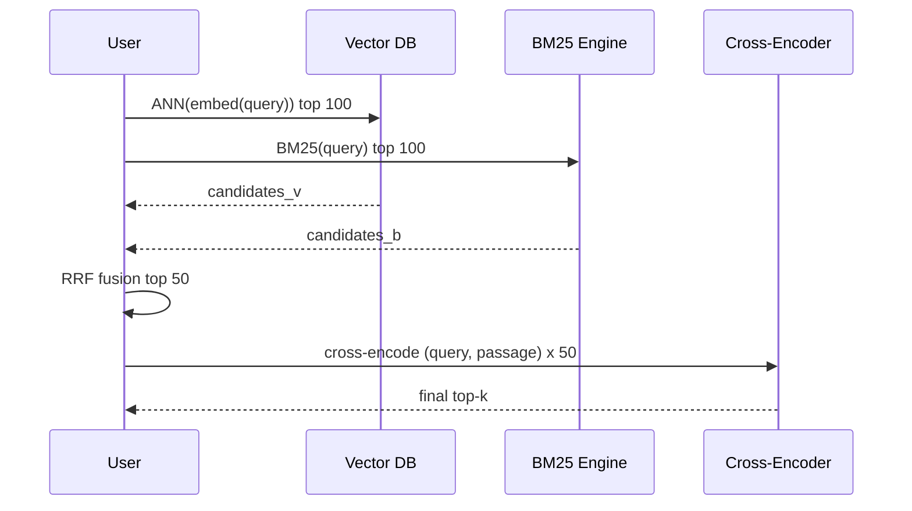

The rise of large language models (LLMs) turned the humble "vector database" into a core piece of modern infrastructure: it powers semantic search, recommendation, and Retrieval-Augmented Generation (RAG). Underneath the REST API, however, a vector database is solving a decades-old problem — <strong>Approximate Nearest Neighbor Search (ANN) in high-dimensional spaces</strong> — with algorithms that mix combinatorial data structures, quantization, and careful systems engineering.

This article builds up the core algorithms layer by layer, starting from brute force, climbing through <strong>IVF (Inverted File)</strong>, <strong>Product Quantization (PQ)</strong>, <strong>HNSW (Hierarchical Navigable Small World)</strong>, and finally <strong>DiskANN (Vamana)</strong> — with references grounded in real code from FAISS, Milvus, pgvector, and Qdrant.

> <strong>A mental model to carry through</strong>
>
> Picture a vast library.
>
> - <strong>Brute force</strong> is a librarian picking up <em>every</em> book to check how similar it is — hopeless at a billion books.
> - <strong>IVF</strong> is a librarian who first glances at the <em>shelf labels</em>, walks only to the 10 shelves whose labels are closest to the book you're looking for, and searches there.
> - <strong>Product Quantization</strong> summarises each book's cover into <em>64 colour codes chosen from a 256-colour palette</em>, then compares colour codes instead of covers — blazingly fast, slightly lossy.
> - <strong>HNSW</strong> is a social graph of books linked to "books I'm friends with," navigated top-down from sparse world map to dense street map.
> - <strong>DiskANN</strong> is the same graph but <strong>living on SSD</strong>. Only <em>low-resolution thumbnails of every book</em> (PQ-compressed vectors) stay in RAM; the full originals are pulled from disk only when a candidate looks promising.
>
> The rest of the article is the careful version of this story.

## 1. Why vector search is hard

### 1.1 Embedding vectors

An embedding maps text / image / audio into a <strong>fixed-dimensional real vector</strong> such that semantic similarity corresponds to geometric closeness. Typical dimensionalities:

| Model | Dimension | Preferred distance |
| --- | --- | --- |
| OpenAI `text-embedding-3-small` | 1536 | cosine |
| OpenAI `text-embedding-3-large` | 3072 | cosine |
| Cohere `embed-v3` | 1024 | cosine / dot |
| BGE-M3 | 1024 | cosine |
| CLIP ViT-L/14 | 768 | cosine |

Dimension $d$ is commonly above 1000, and at that scale <strong>brute-force search stops being practical</strong>.

### 1.2 Distances and similarities

For vectors $\mathbf{x}, \mathbf{y} \in \mathbb{R}^d$ the three common metrics are:

<strong>Euclidean (L2):</strong>

$$
d_{L2}(\mathbf{x}, \mathbf{y}) = \sqrt{\sum_{i=1}^{d} (x_i - y_i)^2}
$$

<strong>Inner product (IP; sum of element-wise products of the two vectors):</strong>

$$
\text{IP}(\mathbf{x}, \mathbf{y}) = \sum_{i=1}^{d} x_i y_i
$$

<strong>Cosine:</strong>

$$
\cos(\mathbf{x}, \mathbf{y}) = \frac{\mathbf{x} \cdot \mathbf{y}}{\|\mathbf{x}\|\,\|\mathbf{y}\|}
$$

When every vector is normalised to unit length,

$$
d_{L2}(\mathbf{x}, \mathbf{y})^2 = 2 - 2\,\mathbf{x}\cdot\mathbf{y}
$$

so <strong>L2, cosine, and inner product become equivalent up to monotonic transformations</strong> (transformations that preserve order, so the ranking of results does not change). Most ANN libraries internally use L2 or IP, with optional pre-normalisation.

### 1.3 The curse of dimensionality

High-dimensional geometry defies low-dimensional intuition:

- <strong>Distance concentration</strong> — the ratio $\max/\min$ of pairwise distances converges to 1; "far" and "near" points become relatively indistinguishable.
- <strong>Volume concentration</strong> — almost the entire volume of a unit ball lives near its surface.
- <strong>Space partitioning fails</strong> — axis-aligned structures like kd-trees (a classical binary-tree index that recursively splits space along coordinate axes) visit essentially every node once $d \gtrsim 20$.

These facts force us to <strong>relax to approximate</strong> search — aiming for, say, 95% recall (the fraction of the true top-k that we actually return) rather than exact correctness. This is the premise of ANN.

## 2. Baseline: brute-force (Flat)

Always start with the baseline. In FAISS this is `IndexFlatL2` / `IndexFlatIP`.

```python
# Naive brute-force search (pseudocode)
def search(query: np.ndarray, xb: np.ndarray, k: int):
    dists = np.linalg.norm(xb - query, axis=1)  # O(Nd)
    idx = np.argpartition(dists, k)[:k]         # O(N)
    return idx[np.argsort(dists[idx])]
```

Complexity is $O(Nd)$. With $N=10^6$, $d=1024$, float32, a single query streams <strong>4 GB of memory</strong> (roughly the byte count of a full-HD movie — per query). With good SIMD (AVX-512 / NEON; CPU instructions that process many numbers in parallel in a single op) and BLAS-style GEMM (highly tuned matrix-multiply routines), brute force can still beat HNSW up to $N \approx 10^5$. That is exactly why FAISS keeps `IndexFlat` as the gold-standard reference.

ANN reduces that $O(Nd)$ by either <strong>(a) visiting fewer vectors</strong> or <strong>(b) compressing each distance computation</strong>. IVF does (a); PQ does (b); HNSW does (a) differently; DiskANN combines both.

## 3. IVF: partition the space

> <strong>TL;DR</strong>: don't look at everything — <em>pre-sort the data into buckets of similar items</em>, and at query time open only the few buckets closest to the query. Fast, but if the right answer happens to sit in a bucket you didn't open, you miss it.

### 3.1 Coarse quantization via k-means

IVF (inverted file index) adapts the classic text inverted index to vectors:

> <strong>Analogy</strong>: finding a good ramen shop in Tokyo. You don't walk all 23 wards; you first pick "the 3 wards closest to my query location," then brute-force within them. IVF first coarsely picks a few <em>cells</em> (centroids closest to the query), then searches exhaustively inside them.

1. <strong>Train</strong>: run k-means on the dataset, producing $n_{\text{list}}$ centroids (the "average vectors" that act as a representative for each cluster) $\{\mathbf{c}_1, \dots, \mathbf{c}_{n_{\text{list}}}\}$ (typically $n_{\text{list}} \approx \sqrt{N}$).
2. <strong>Build</strong>: assign every vector to its nearest centroid; each centroid owns a <strong>posting list</strong> (the list of IDs of points that belong to that centroid — structurally identical to the list of page numbers filed under one entry in a book's back-of-book index).
3. <strong>Search</strong>: pick the top-$n_{\text{probe}}$ centroids closest to the query; scan only the corresponding posting lists.



### 3.2 Parameter design

- <strong>`nlist`</strong> — larger means shorter posting lists and faster search, but you also need a larger `nprobe` to maintain recall. Rule of thumb: $4\sqrt{N} \le n_{\text{list}} \le 16\sqrt{N}$.
- <strong>`nprobe`</strong> — number of posting lists visited. `nprobe=1` is very fast but low recall because the true nearest neighbour might sit in a cell you didn't open; 10-128 typically yields 90-99% recall.
- <strong>Training data</strong> — FAISS's clustering defaults are `min_points_per_centroid = 39` and `max_points_per_centroid = 256`; roughly 39-256 × `nlist` samples is the comfort zone (below it you get a warning, above it FAISS auto-subsamples).

### 3.3 Limits of IVF alone

Inside each cell, IVF is still brute force. Long posting lists become the bottleneck, which motivates combining IVF with Product Quantization (FAISS's `IndexIVFPQ`).

## 4. Product Quantization (PQ)

> <strong>TL;DR</strong>: instead of comparing full vectors, compare <em>compressed summary codes</em>. Each vector is sliced into short chunks and each chunk is replaced by the nearest entry in a 256-entry palette, shrinking a kilobyte-sized vector to a few dozen bytes. Memory drops, distance math becomes table lookups, and you trade a bit of accuracy for one to two orders of magnitude in speed.

### 4.1 Break the vector into sub-codes

PQ<sup>[1]</sup> (Jégou et al., 2011) <strong>compresses high-dimensional vectors into short integer codes</strong> to accelerate distance computation.

1. Split $\mathbf{x} \in \mathbb{R}^d$ into $m$ subvectors: $\mathbf{x} = [\mathbf{x}^{(1)}, \dots, \mathbf{x}^{(m)}]$, each $\in \mathbb{R}^{d/m}$.
2. In each subspace run an independent k-means, producing $k^* = 256$ centroids $\{\mathbf{c}^{(i)}_1, \dots, \mathbf{c}^{(i)}_{256}\}$ — these are the <strong>codebook</strong> (think of it as a per-subspace 256-colour palette).
3. Replace each $\mathbf{x}^{(i)}$ with the <strong>8-bit ID</strong> of its nearest centroid.

A $d$-dim float32 vector ($4d$ bytes) shrinks to <strong>$m$ bytes</strong>. For $d=1024$, $m=64$ that's 4096 → 64 bytes — <strong>64× compression</strong>.



### 4.2 Asymmetric Distance Computation (ADC)

The speed trick of PQ is <strong>Asymmetric Distance Computation</strong>: the query stays uncompressed, and we precompute a lookup table per subspace.

1. Split the query: $\mathbf{q} = [\mathbf{q}^{(1)}, \dots, \mathbf{q}^{(m)}]$.
2. For each subspace $i$, precompute distances to all 256 centroids:
   $$
   \text{LUT}_i[j] = \|\mathbf{q}^{(i)} - \mathbf{c}^{(i)}_j\|^2, \quad j \in \{0, \dots, 255\}
   $$
3. For a stored vector with code $(id_1, \dots, id_m)$, the approximate distance is just <strong>$m$ table lookups summed</strong>:
   $$
   d(\mathbf{q}, \mathbf{x})^2 \approx \sum_{i=1}^{m} \text{LUT}_i[id_i]
   $$

<strong>Zero float multiplications per distance</strong>; with $m=64$ it's 64 8-bit adds. SIMD lookup (FAISS `pq4_fast_scan`) pushes this to millions of vectors per millisecond on a single core.

<strong>In short</strong>: PQ turns distance computation from "floating-point arithmetic" into "summing values from a precomputed table", and that substitution is the whole reason PQ is orders of magnitude faster.

<ProductQuantizationVisualizer />


<strong>A tiny worked example.</strong> Take $d=4$, $m=2$ (subvector dimension 2), $k^*=4$ (2-bit IDs). Query $\mathbf{q} = [1, 0, 0, 1]$ splits into $\mathbf{q}^{(1)} = [1, 0]$ and $\mathbf{q}^{(2)} = [0, 1]$. If subspace 1's codebook is $\{[1,0], [0,1], [-1,0], [0,-1]\}$ (IDs 0-3), then

$$
\text{LUT}_1 = [\,0,\ 2,\ 4,\ 2\,]
$$

(each entry is $\|\mathbf{q}^{(1)} - \mathbf{c}^{(1)}_j\|^2$). Similarly $\text{LUT}_2 = [2, 0, 2, 4]$. A stored vector with PQ code $(id_1, id_2) = (0, 1)$ (so $\hat{\mathbf{x}} \approx [1, 0, 0, 1]$) has approximate squared distance $\text{LUT}_1[0] + \text{LUT}_2[1] = 0 + 0 = 0$ — <strong>two table lookups and one add</strong>, no multiplication. Real indices simply scale this up: 64 tables of 256 entries each, executed 16-32 codes wide in SIMD.

### 4.3 Error and tuning

PQ is lossy. Practical knobs:

- <strong>`m`</strong> — number of sub-quantizers. Must divide $d$; $d/m$ in the range 4-16 balances accuracy and speed.
- <strong>`nbits`</strong> — typically 8 (256 centroids). 16 bits (65k centroids) exists but codebook training gets expensive.
- <strong>Optimised Product Quantization (OPQ)</strong><sup>[2]</sup> — apply an orthogonal rotation $R$ before splitting, balancing variance across subspaces. Recovers several percentage points of recall.

### 4.4 IVFPQ: the workhorse

FAISS's `IndexIVFPQ` combines both:

- IVF narrows the query to a few cells.
- Each cell stores PQ codes of the <strong>residual</strong> $\mathbf{x} - \mathbf{c}$ (residual PQ), which concentrates codebook capacity.

<strong>Geometric intuition for the residual.</strong> A raw vector $\mathbf{x}$ can live anywhere in the big ambient space, but once you subtract its cell centroid $\mathbf{c}$, the residual $\mathbf{x} - \mathbf{c}$ only describes <strong>the offset inside that cell</strong> — a much smaller, more concentrated distribution. The same 256 PQ centroids can now resolve finer detail, so quantisation error drops. The more cells you have ($n_{\text{list}}$), the tighter the residual distribution becomes.

`IndexIVFPQ` scales to $N=10^9$ (≈ a billion vectors — roughly 100 × the number of articles in English Wikipedia) on a single machine, with per-query latency ranging from a few ms to a few tens of ms depending on hardware, `nprobe`, and recall target (see the FAISS wiki [Indexing 1G vectors](https://github.com/facebookresearch/faiss/wiki/Indexing-1G-vectors) page). Recall tends to be lower than HNSW, but memory usage and GPU amenability win in many production settings (FAISS-GPU, cost-constrained, disk-backed).

<strong>What goes wrong in production.</strong> If your training data doesn't match the serving distribution, you can hit <strong>codebook collapse</strong> — most vectors get assigned to a handful of centroids and the rest sit empty, tanking recall. Stay above FAISS's `min_points_per_centroid` warning, and <strong>train on samples drawn from the same distribution you'll serve</strong> (e.g. if production is multilingual BGE, match the language mix at training time). IVF has a cousin problem: if data is topic-skewed, cell sizes get lopsided, and a few long posting lists dominate p99 latency even at modest `nprobe`. Track max/min cell size as a metric so you notice before users do.

## 5. HNSW: hierarchical navigable small world

> <strong>TL;DR</strong>: pre-build a “<em>social network</em> of vectors” in which similar vectors link to each other, then at query time <em>walk the graph</em> towards the query, zooming from world map down to street map as you go. Today’s default for in-memory vector search — but only works well while everything fits in RAM.

### 5.1 Inspiration

HNSW<sup>[3]</sup> (Malkov & Yashunin, 2016) is the most widely deployed graph-based ANN today. It combines two ideas:

1. <strong>Navigable Small World (NSW)</strong> — a graph with both short and long-range edges supports greedy routing (at every step, move to whichever neighbour of the current node is closest to the query — a purely local rule) to any node in logarithmic hops (Kleinberg's small-world model). Kleinberg's key result is that when long-range edges are drawn with probability $\propto 1/r^d$ in the node-distance $r$ — <strong>and only in that case</strong> — a purely local greedy algorithm reaches its target in $O(\log^2 N)$ hops. HNSW's layered graph is, implicitly, an approximation of exactly this edge distribution.
2. <strong>Skip lists</strong> — a randomised layered structure lets search start coarse and refine.

### 5.2 Structure

HNSW is a layered graph:



- Every point lives in Layer 0.
- Each point's top layer is drawn from an exponential distribution $\ell = \lfloor -\ln(U(0,1)) \cdot m_L \rfloor$ (default $m_L = 1/\ln(M)$).
- Each node has at most $M$ edges per layer ($2M$ at Layer 0).

### 5.3 Search algorithm

<HNSWSearchVisualizer />

In pseudocode:

```text
search(q, k):
    ep = entry_point
    for level L in [top_level ... 1]:
        ep = greedy_search_layer(q, ep, ef=1, level=L)
    W = greedy_search_layer(q, ep, ef=efSearch, level=0)
    return top-k of W

greedy_search_layer(q, ep, ef, level):
    visited = {ep}
    candidates = min-heap([(dist(q, ep), ep)])   # priority: closest first
    W         = max-heap([(dist(q, ep), ep)])    # keep top ef
    while candidates not empty:
        c = candidates.pop_min()
        f = W.peek_max()
        if dist(q, c) > dist(q, f): break         # pruning
        for each neighbor n of c at `level`:
            if n in visited: continue
            visited.add(n)
            if dist(q, n) < dist(q, f) or |W| < ef:
                candidates.push((dist(q, n), n))
                W.push((dist(q, n), n))
                if |W| > ef: W.pop_max()
    return W
```

Key points:

- <strong>`efSearch`</strong> — size of the beam. Larger gives higher recall, lower QPS. 50-200 in production, 300+ when chasing 99% recall.
- <strong>Upper layers use `ef=1`</strong> — a plain greedy descent.
- <strong>Layer 0 uses `ef=efSearch`</strong> — beam search (keep several candidates alive at once and expand them in parallel — a wider, breadth-first style of walk) to broaden candidates.

<strong>In short</strong>: go "roughly in the right direction" in the upper layers, then "walk several candidates forward in parallel" in the bottom layer to recover precision.

### 5.4 Insertion and neighbor selection

```text
insert(x):
    ℓ = floor(-ln(rand()) * m_L)
    ep = entry_point
    for L in [top_level ... ℓ+1]:
        ep = greedy_search_layer(x, ep, ef=1, L)
    for L in [min(top_level, ℓ) ... 0]:
        W = search_layer(x, ep, ef=efConstruction, L)
        neighbors = select_neighbors_heuristic(x, W, M)
        add bidirectional edges between x and neighbors
        for each n in neighbors:
            if degree(n) > M_max:
                W' = neighbors(n)
                neighbors(n) = select_neighbors_heuristic(n, W', M_max)
        ep = W
    if ℓ > top_level: top_level = ℓ; entry_point = x
```

Neighbor <strong>selection</strong> decides HNSW's quality. Rather than "$M$ nearest neighbours", HNSW uses a <strong>diversity heuristic</strong>:

```text
select_neighbors_heuristic(x, W, M):
    R = []
    sort W by dist(x, ·) ascending
    for e in W:
        if |R| == M: break
        if ∀ r ∈ R: dist(x, e) < dist(r, e):
            R.append(e)
    return R
```

Keep $e$ only if $x$ is closer to $e$ than any already-selected neighbour is. This <strong>spreads neighbours across directions</strong>, preventing the graph from collapsing onto a single cluster — a key reason HNSW avoids local minima during search. `faiss/impl/HNSW.cpp`'s `shrink_neighbor_list` implements this.

<strong>In short</strong>: instead of "take the $M$ nearest", HNSW picks "the $M$ near-ish neighbours that aren't redundant with each other", so edges fan out in all directions and greedy search rarely gets stuck in a local pocket.

The paper's full Algorithm 4 takes two additional optional flags: <strong>`extendCandidates`</strong> (grow $W$ by the neighbours of each candidate before selecting — useful on sparse upper layers) and <strong>`keepPrunedConnections`</strong> (if $|R| < M$ at the end, refill from the pruned set in distance order). Many implementations including FAISS default both to false; the paper recommends `extendCandidates=true` only on upper layers.

### 5.5 Parameters and cost

- <strong>`M`</strong>: 12-48 typically. Higher gives better recall at the cost of memory ($M \cdot 4$ bytes of links per point).
- <strong>`efConstruction`</strong>: 100-500; build-time only; higher improves index quality but is linear in build time.
- <strong>Complexity</strong>: search expected $O(\log N)$, build $O(N \log N)$.
- <strong>Memory</strong>: $N$ vectors + roughly $N \cdot M_0 \cdot 4$ bytes of links (most nodes live only in Layer 0, so upper-layer links are negligible). $M=16$ ($M_0 = 2M = 32$), $d=1024$, $N=10^6$: 4 GB vectors + ~128 MB links (the link overhead is only ~3% on top of the raw vectors).

Downsides: <strong>memory-hungry</strong> and <strong>hard to delete from</strong>. Actually removing a node and re-wiring its edges can break graph connectivity, so most implementations mark the node with a <strong>tombstone</strong> (a "deleted" flag that leaves the node in the graph but hides it from query results). Over time the tombstoned nodes clutter the graph: search paths still route through them, and regions of the graph can become effectively unreachable, so recall silently degrades even at high `efSearch`. A common operational rule is to <strong>trigger a full rebuild (compaction — periodically rewriting the index so tombstoned nodes are physically removed) once the tombstone ratio crosses 5-10%</strong>.

## 6. DiskANN / Vamana: a graph index for SSDs

> <strong>TL;DR</strong>: same “walk a friend graph” idea as HNSW, but the graph <em>lives on SSD</em> and only a PQ-compressed thumbnail sits in RAM. Unlocks billion-vector single-node indexes at the cost of SSD IOPS — throughput under high concurrency becomes the new bottleneck.

### 6.1 Motivation

HNSW assumes every vector fits in RAM. A billion 1024-dim float32 vectors is 4 TB (several times the 512 GB–1 TB DRAM of a typical server — clearly doesn't fit on a single machine). DiskANN<sup>[4]</sup> (Microsoft, 2019) introduces a <strong>single-layer graph index designed to run from SSD</strong>.

### 6.2 The Vamana graph

Like HNSW, search is greedy, but there is no layered hierarchy — a single layer mixes short and long edges. The entry point is the <strong>medoid</strong> of the dataset, computed once at build time. Unlike the centroid (an abstract arithmetic mean that may not correspond to any real vector), the medoid is the <strong>actual data point closest to the centroid</strong> — i.e. the data point that sits most "centrally" in the distribution. Starting greedy search from there minimises the expected number of hops to any query target, since on average no point in the dataset is too far from the medoid. Construction uses <strong>$\alpha$-pruning</strong>:

```text
build_vamana(X, R, α):
    G = random graph (R edges per node)
    for two passes (α=1.0, then α=1.2):
        for p in random permutation of X:
            V = greedy_search(G, p, ep, L)   # candidate set
            neighbors(p) = robust_prune(p, V, α, R)
            for n in neighbors(p):
                add edge n→p
                if degree(n) > R:
                    neighbors(n) = robust_prune(n, N(n)∪{p}, α, R)
```

<strong>robust_prune ($\alpha$-pruning):</strong>

```text
robust_prune(p, V, α, R):
    V = V sorted by dist(p, ·)
    P = []
    while V not empty and |P| < R:
        p* = V.pop_closest()
        P.append(p*)
        V = {v ∈ V : α · dist(p*, v) > dist(p, v)}   # drop v dominated by p*, keep diverse (long-range) edges
    return P
```

With <strong>$\alpha=1$ on the first pass and $\alpha > 1$ (typically 1.2) on the second</strong>, Vamana <strong>keeps more long-range edges</strong> than HNSW's diversity heuristic. That is what makes greedy search work well on SSD.

<strong>In short</strong>: raising $\alpha$ above 1 discards "nearby, similar" neighbours in favour of "farther-away, differently-oriented" ones, so a single hop can jump further across the graph. On SSD, one hop = one random read, so fewer hops translate directly to lower latency.

### 6.3 SSD layout

- Vectors and adjacency lists are co-located in 4 KB pages (<strong>Vamana page layout</strong>).
- Visiting a node on the search path costs <strong>one 4 KB random read</strong> that returns both the vector and its neighbours.
- To keep recall, DiskANN keeps a <strong>PQ-compressed copy in memory</strong> for coarse distance pruning, and only reads the full-precision vector for a handful of candidates.

### 6.4 IOPS and recall

On a single NVMe SSD, DiskANN typically reaches <strong>50-150 random 4 KB reads per query</strong> (the paper's SIFT1B benchmark reports roughly 100 reads at recall@1 = 95%), p99 5-10 ms — at scales (10B+ vectors) far beyond what HNSW can hold in RAM for the same budget. FreshDiskANN (2021) adds background insert/delete with periodic re-merges.

<strong>What goes wrong in production.</strong> Those numbers are for low-concurrency workloads. Consumer SSDs top out around 50-200 k random 4 KB read IOPS (I/O operations per second); server NVMe reaches 500 k-1 M. As concurrent QPS × (reads per query) approaches that ceiling, the device queue saturates and <strong>tail latency blows up non-linearly</strong> — p99 (the worst 1% of queries) can jump from 10 ms to hundreds of ms even while the median barely moves. Standard mitigations: stripe across multiple SSDs (RAID-0), crank up PQ compression so more pruning happens in memory before hitting disk, or lower `beam_width` to visit fewer nodes per query.

## 7. ScaNN: Google's anisotropic quantization

Before moving on, it is worth circling back to §4's PQ to look at one important refinement. Google's ScaNN<sup>[5]</sup> (2020) targets maximum inner product search via a more careful kind of quantisation (compressing each vector down to a short sequence of bits).

Regular PQ minimises <strong>reconstruction error $\|\mathbf{x} - \hat{\mathbf{x}}\|^2$</strong>. But for IP search, what matters is the error in $\mathbf{q} \cdot \mathbf{x}$, which is dominated by the component parallel to $\mathbf{q}$. ScaNN's <strong>anisotropic quantization loss</strong> weights the two components differently:

$$
L(\mathbf{x}, \hat{\mathbf{x}}) = h_\parallel(\mathbf{x}) \cdot \|(\mathbf{x} - \hat{\mathbf{x}})_\parallel\|^2 + h_\perp(\mathbf{x}) \cdot \|(\mathbf{x} - \hat{\mathbf{x}})_\perp\|^2
$$

with $h_\parallel \gg h_\perp$. This learns a quantizer that minimises the error direction that matters for IP. Empirically, ScaNN lifts recall by 5-10% at the same bit budget.

## 8. Filtered search (pre / post / in-filter)

Real systems need <strong>metadata-filtered ANN</strong>: "only published docs", "only this tenant".

- <strong>Post-filter</strong>: retrieve $k' \gg k$ via ANN, apply the filter afterwards. Breaks when selectivity (the fraction of rows that pass the filter) is low.
- <strong>Pre-filter</strong>: materialise the filter-matching ID set, brute-force within it. Good for very selective filters, loses ANN speed.
- <strong>In-filter / integrated</strong>: keep only filter-matching nodes as candidates during graph traversal. Each system handles reachability differently. Current Milvus docs describe two modes: <strong>standard filtering</strong> (scalar pre-filter, then ANN within the matching set) and <strong>iterative filtering</strong> (vector-search iterator with per-hit scalar checks); the query planner picks between them. Qdrant uses a <strong>filterable HNSW index</strong> that adds extra links into the graph based on payload categories so the graph stays connected under filtering (and falls back to the payload index alone when cardinality is too low).

Recent research — ACORN (2024), Filtered-DiskANN (2023) — builds graphs that are filter-aware from the start.

When does each strategy win?

| Strategy | Works well when | Fails when | Typical home |
| --- | --- | --- | --- |
| Post-filter | selectivity ≥ 50% (most rows pass) | selectivity ≤ 1%; top-$k$ ends up empty | pgvector, naive Elasticsearch |
| Pre-filter | selectivity ≤ 1% (subset is tiny) | mid-range selectivity — ANN is wasted and the linear scan dominates | Milvus standard filtering |
| In-filter | the messy middle, selectivity 1–50% | harder to implement; graph connectivity must be engineered in | Qdrant filterable HNSW, Filtered-DiskANN |

## 9. Implementations compared

A cheat sheet for how today’s popular OSS and SaaS products <strong>combine the algorithms</strong> from §2–§8. A rough mental model: FAISS is a <em>library</em>, Milvus / Qdrant / Weaviate are full distributed-DB <em>products</em>, pgvector is a Postgres extension, and Pinecone is a fully managed SaaS.

| Library | Core algorithms | Notes |
| --- | --- | --- |
| <strong>FAISS</strong> | Flat, IVF, IVFPQ, HNSW, OPQ | Meta. GPU + SIMD. The research reference. |
| <strong>Milvus</strong> | Wraps FAISS / HNSW / DiskANN | Distributed, persistent, multi-tenant. Kubernetes-first. |
| <strong>Qdrant</strong> | HNSW (custom Rust) | Strong payload filtering, gRPC/REST. |
| <strong>Weaviate</strong> | HNSW | Module-based vectorisers, GraphQL API. |
| <strong>pgvector</strong> | IVFFlat, HNSW | PostgreSQL extension. Joins with existing SQL. |
| <strong>Pinecone</strong> | Proprietary hybrid | Fully managed SaaS. |
| <strong>LanceDB</strong> | IVFPQ, HNSW over Arrow/Parquet | Columnar persistence — think "DuckDB for embeddings". |
| <strong>Elasticsearch / OpenSearch</strong> | Lucene HNSW | BM25 + vector hybrid in one engine. |

### 9.1 A selection flowchart



## 10. Hybrid search: BM25 + vector

In practice, combining <strong>lexical (BM25; a classical relevance score from the TF-IDF family that weights how many of the query's words appear in each document) and semantic (vector)</strong> beats either alone.

### 10.1 Reciprocal Rank Fusion (RRF)

$$
\text{score}(d) = \sum_{r \in R} \frac{1}{k + \text{rank}_r(d)}
$$

$R$ is the set of retrievers (BM25, vector, …), $k \approx 60$ by convention. <strong>No score normalisation required</strong>, which is why Elasticsearch and Weaviate use RRF as a default hybrid strategy.

### 10.2 Cross-encoder re-rank

Retrieve 100 with ANN, re-score each with a BERT-style cross-encoder. This is essentially the standard RAG pipeline.

<strong>Bi-encoder vs cross-encoder.</strong> Vector search itself uses a <strong>bi-encoder</strong>: query and document are embedded <strong>independently</strong>, and similarity is a cheap cosine / dot product between the two vectors. Because document embeddings can be precomputed offline, a bi-encoder scales to billions of docs. A <strong>cross-encoder</strong> instead concatenates the (query, document) pair and runs them through one Transformer so every attention head can see both sides at once — this captures interactions a bi-encoder cannot, giving noticeably better relevance, but <strong>you pay a full forward pass per (query, doc) pair at query time</strong>. The two-stage pattern — cheap bi-encoder to get 100 candidates, expensive cross-encoder to re-rank only those — is the cost/quality sweet spot.



## 11. Production metrics

| Metric | Meaning |
| --- | --- |
| <strong>Recall@k</strong> | overlap between returned top-k and true top-k |
| <strong>QPS</strong> | queries per second |
| <strong>p50 / p95 / p99 latency</strong> | median / top-5% / top-1% latency; the tail (especially p99) is where GC pauses and disk IO stalls show up |
| <strong>Build time</strong> | batch reindex time |
| <strong>Index size</strong> | shows compression efficiency |
| <strong>Insert/delete throughput</strong> | whether streaming updates are viable |

[ann-benchmarks](https://github.com/erikbern/ann-benchmarks) is the standard framework for comparing HNSW / IVFPQ / ScaNN etc under identical conditions. The canonical visualisation is a <strong>recall vs QPS Pareto frontier</strong> plot. The Pareto frontier is the set of operating points such that <strong>you cannot improve recall without sacrificing QPS, or vice versa</strong> — an algorithm whose frontier sits further out dominates the others at every trade-off. The point of plotting frontiers (rather than a single number) is that ANN algorithms rarely win outright: method A may beat B at 95% recall yet lose at 99%, and only the frontier shows that crossover clearly.

## 12. State of the art (as of 2026)

What’s likely to become the <em>next default</em>, as of 2026. The running themes are <strong>bigger scale, tighter compression, and easier updates</strong>.

- <strong>SPANN / SPFresh</strong> (Microsoft, 2021-2023) — IVF trees kept on SSD with clustered posting lists for easier updates; a DiskANN successor line.
- <strong>Learned indexes</strong> — an active research direction where neural nets adapt centroid selection or hierarchical structure to the data distribution (not yet upstreamed into FAISS).
- <strong>RaBitQ</strong> — a randomised binary quantisation with tighter error bounds than PQ (Gao & Long, 2024). FAISS has landed `faiss::IndexRaBitQ` / `IndexIVFRaBitQ`; pgvector 0.8 is evaluating it.
- <strong>GPU HNSW (CAGRA, 2023)</strong> — NVIDIA RAPIDS reformulates HNSW construction and search as CUDA-friendly graph ops.
- <strong>Hybrid DRAM / CXL layouts</strong> — after Optane was discontinued, the new direction is NVMe + big RAM + CXL memory pools for very large working sets.

## 13. Putting it all together

The design space of vector search can be summarised in three orthogonal axes:

| Axis | Technique |
| --- | --- |
| <strong>Reduce candidate set</strong> | IVF / Graph (HNSW, Vamana) |
| <strong>Compress distance</strong> | PQ / OPQ / ScaNN / RaBitQ |
| <strong>Exploit the memory hierarchy</strong> | DiskANN / SPANN (SSD), CAGRA (GPU) |

In practice, four questions drive the choice: <strong>N, memory budget, update rate, recall target</strong>.

- $N \le 10^5$ → Flat
- $10^5 \le N \le 10^7$, RAM plentiful → HNSW
- $10^7 \le N$, RAM constrained → IVFPQ
- $N \ge 10^9$ → DiskANN / SPANN
- Already on PostgreSQL → pgvector (HNSW)
- Need distributed → Milvus / Qdrant / Weaviate

Vector DBs aren't magic. Once you see them as <strong>classical inverted indexes extended to high-dimensional space</strong>, the whole architecture becomes legible — and your ability to debug recall regressions, size capacity, and triage incidents changes entirely.

## References

1. H. Jégou, M. Douze, C. Schmid, "Product quantization for nearest neighbor search", *IEEE TPAMI*, 2011.
2. T. Ge et al., "Optimized Product Quantization", *IEEE TPAMI*, 2014.
3. Y. Malkov, D. Yashunin, "Efficient and robust approximate nearest neighbor search using Hierarchical Navigable Small World graphs", 2016. [arXiv:1603.09320](https://arxiv.org/abs/1603.09320)
4. S. Jayaram Subramanya et al., "DiskANN: Fast Accurate Billion-point Nearest Neighbor Search on a Single Node", *NeurIPS*, 2019.
5. R. Guo et al., "Accelerating Large-Scale Inference with Anisotropic Vector Quantization", *ICML*, 2020.
6. [FAISS wiki](https://github.com/facebookresearch/faiss/wiki) — the de-facto reference.
7. [ann-benchmarks](https://github.com/erikbern/ann-benchmarks) — recall vs throughput comparisons.
