## はじめに ─ AI エージェントの「最後の 1 マイル」問題

AI エージェントの技術は急速に成熟してきた。LLM はツールを自律的に呼び出し、複数のエージェントが協調して複雑なタスクをこなせるようになった。しかし、ここに一つ見過ごされがちな課題がある。

**エージェントの出力を、どうやってユーザーに届けるのか？**

エージェントは長時間動作し、中間的な成果物をストリーミングし、ユーザーの承認を求め、UI の状態を動的に更新する。これは従来の REST API や GraphQL の「リクエスト → レスポンス」モデルでは対処しきれない。各エージェントフレームワークが独自のイベント形式を持ち、フロントエンドはフレームワークごとにアダプターを書き、密結合が生まれる。

この「エージェントとユーザーの間のプロトコルが標準化されていない」問題を解決するのが **AG-UI（Agent-User Interaction Protocol）** だ。

### 3 つのエージェントプロトコル

AI エージェントのエコシステムには、3 つの補完的なオープンプロトコルが存在する。

| プロトコル | 接続対象 | 起源 |
|-----------|---------|------|
| **MCP**（Model Context Protocol） | エージェント ↔ ツール・データ | Anthropic |
| **A2A**（Agent to Agent） | エージェント ↔ エージェント | Google |
| **AG-UI**（Agent-User Interaction） | エージェント ↔ ユーザー（UI） | CopilotKit |

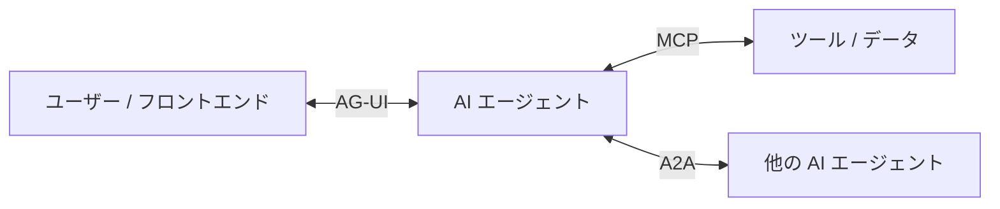

MCP がエージェントと外部ツールの接続を標準化し、A2A がエージェント間の協調を標準化したように、AG-UI は**エージェントとユーザー対面アプリケーションの接続を標準化する**。この 3 つを組み合わせることで、エージェントは「何にアクセスし」「誰と協力し」「誰に結果を届けるか」のすべてが標準プロトコルでカバーされる。

### AG-UI がない世界

AG-UI がない場合、フロントエンド開発者は次のような問題に直面する。

1. **フレームワーク固有の接続コード**: LangGraph を使うなら LangGraph 専用のクライアントを書き、CrewAI なら CrewAI 専用のコードを書く
2. **ストリーミングの再発明**: テキストの逐次表示、ツール呼び出しの可視化、状態の同期をフレームワークごとに実装する
3. **Human-in-the-Loop の車輪の再発明**: ユーザー承認フローをアプリケーションごとに設計する

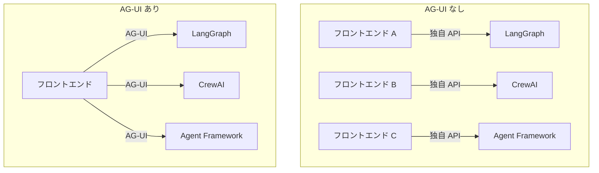

AG-UI を導入すると、フロントエンドは 1 つのプロトコルを実装するだけで、あらゆるエージェントバックエンドと通信できる。バックエンドも AG-UI イベントを送出するだけで、あらゆるフロントエンドに対応できる。

---

## AG-UI の設計原則

AG-UI は次の設計原則に基づいている。

### 1. イベント駆動通信

エージェントは 16 種類以上の標準化されたイベントタイプのいずれかを実行中に送出し、クライアントが処理できるストリームを生成する。REST のような「リクエスト → レスポンス → 完了」のモデルではなく、実行全体を通じてイベントが流れ続ける。

### 2. 双方向インタラクション

エージェントはユーザーからの入力を受け取ることができ、AI と人間が協調するワークフローを可能にする。これはエージェントが一方的に結果を返すモデルとは根本的に異なる。

### 3. トランスポート非依存

AG-UI はイベントの配信方法を規定しない。SSE（Server-Sent Events）、WebSocket、Webhook など、アーキテクチャに合ったトランスポートを選択できる。

### 4. 柔軟なイベント構造

イベントは AG-UI のフォーマットに完全に一致する必要はなく、AG-UI 互換であればよい。これにより、既存のエージェントフレームワークが最小限の変更でネイティブイベント形式を適応できる。

---

## アーキテクチャ概観

AG-UI はクライアント - サーバーアーキテクチャに従う。

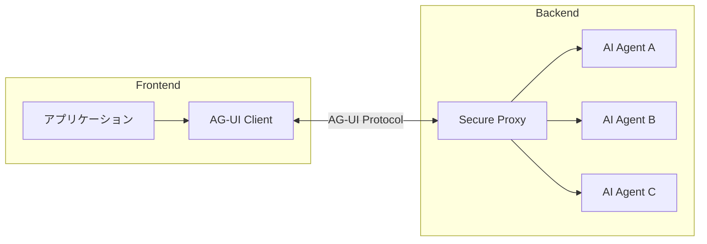

各コンポーネントの役割を整理する。

| コンポーネント | 役割 |
|--------------|------|
| **Application** | ユーザー対面のアプリケーション（チャット UI、AI 搭載アプリなど） |
| **AG-UI Client** | `HttpAgent` などの汎用通信クライアント |
| **Secure Proxy** | 追加機能を提供し、セキュアなプロキシとして機能するバックエンドサービス |
| **Agents** | リクエストを処理し、ストリーミングレスポンスを生成する AI エージェント |

### プロトコル層

AG-UI のプロトコル層の核心は、エージェントを実行してイベントのストリームを受け取るという単純な抽象化だ。

```typescript
// AG-UI の核心的な抽象化
type RunAgent = () => Observable<BaseEvent>

class MyAgent extends AbstractAgent {
  run(input: RunAgentInput): RunAgent {
    const { threadId, runId } = input
    return () =>
      from([
        { type: EventType.RUN_STARTED, threadId, runId },
        {
          type: EventType.MESSAGES_SNAPSHOT,
          messages: [
            { id: "msg_1", role: "assistant", content: "Hello!" }
          ],
        },
        { type: EventType.RUN_FINISHED, threadId, runId },
      ])
  }
}
```

`run()` メソッドは `RunAgentInput` を受け取り、`Observable<BaseEvent>` を返す関数を返す。すべての通信はこの `BaseEvent` のストリームとして表現される。

### 標準 HTTP クライアント

AG-UI は `HttpAgent` という標準 HTTP クライアントを提供する。任意のエンドポイントに POST リクエストを送り、`BaseEvent` のストリームを受信する。

```typescript
import { HttpAgent } from "@ag-ui/client"

const agent = new HttpAgent({
  url: "https://your-agent-endpoint.com/agent",
  agentId: "my-agent",
  threadId: "conversation-123",
})

agent.runAgent({
  tools: [...],
  context: [...]
}).subscribe({
  next: (event) => {
    switch(event.type) {
      case EventType.TEXT_MESSAGE_CONTENT:
        // テキストを UI に表示
        break
      case EventType.TOOL_CALL_START:
        // ツール呼び出しの開始を表示
        break
    }
  },
  error: (err) => console.error("Agent error:", err),
  complete: () => console.log("Run complete")
})
```

サポートされるトランスポートは次の 2 つだ。

| トランスポート | 特徴 |
|--------------|------|
| **HTTP SSE** | テキストベースのストリーミング。デバッグが容易 |
| **HTTP Binary Protocol** | 高性能・省スペースなバイナリシリアライゼーション |

---

## イベントシステム ─ AG-UI の核心

AG-UI の通信はすべて**型付きイベント**で行われる。すべてのイベントは `BaseEvent` を継承する。

```typescript
interface BaseEvent {
  type: EventType       // イベントタイプの識別子
  timestamp?: number    // イベント生成時刻（オプション）
  rawEvent?: any        // 変換元の生イベントデータ（オプション）
}
```

イベントは目的別に 7 つのカテゴリに分類される。

| カテゴリ | 目的 | イベント例 |
|---------|------|----------|
| **Lifecycle Events** | エージェント実行の進行を監視 | `RunStarted`, `RunFinished`, `RunError` |
| **Text Message Events** | ストリーミングテキストコンテンツ | `TextMessageStart`, `TextMessageContent`, `TextMessageEnd` |
| **Tool Call Events** | ツール実行の管理 | `ToolCallStart`, `ToolCallArgs`, `ToolCallEnd` |
| **State Management Events** | エージェントと UI 間の状態同期 | `StateSnapshot`, `StateDelta`, `MessagesSnapshot` |
| **Activity Events** | 進行中のアクティビティの進捗 | `ActivitySnapshot`, `ActivityDelta` |
| **Reasoning Events** | 推論プロセスの可視化 | `ReasoningStart`, `ReasoningMessageContent`, `ReasoningEnd` |
| **Special Events** | カスタム機能 | `Raw`, `Custom` |

### Lifecycle Events ─ 実行の境界

Lifecycle Events はエージェント実行のライフサイクルを表す。典型的なフローは次のとおりだ。

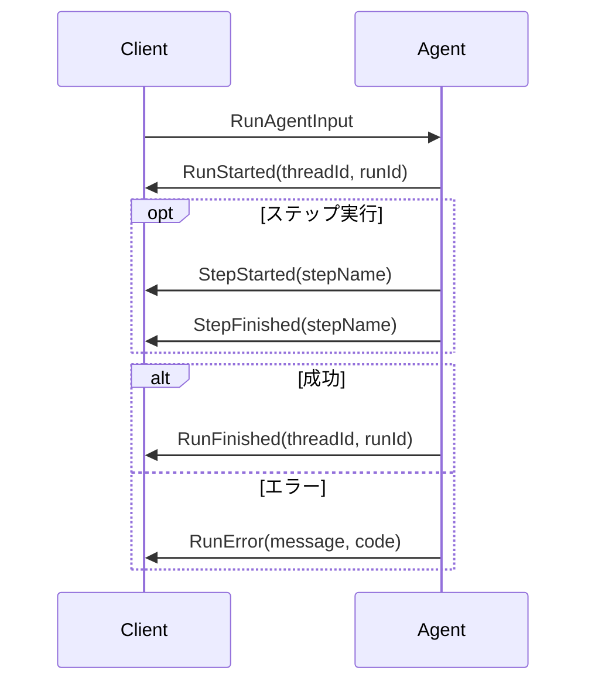

各イベントの役割を見てみよう。

| イベント | 必須 | 説明 |
|---------|------|------|
| `RunStarted` | 常に必須 | 実行の開始。`threadId` と `runId` で一意に識別。オプションで `parentRunId` を持ち、ブランチ/タイムトラベルをサポート |
| `RunFinished` | 成功時に必須 | 正常完了。オプションの `result` フィールドで結果データを返せる |
| `RunError` | エラー時に必須 | エラーによる実行中断。`message` と `code` でエラー情報を提供 |
| `StepStarted` | 任意 | サブタスクやフェーズの開始。エージェントの進捗をきめ細かく追跡 |
| `StepFinished` | 任意 | サブタスクの完了。`StepStarted` とペアで使用 |

`RunStarted` と `RunFinished`（または `RunError`）が実行の境界を形成し、その間に任意の数のステップイベントが発生する。

### Text Message Events ─ ストリーミングテキスト

テキストメッセージはストリーミングパターンで配信される。メッセージの生成を待ってから全体を送るのではなく、生成されたチャンクを逐次送信する。

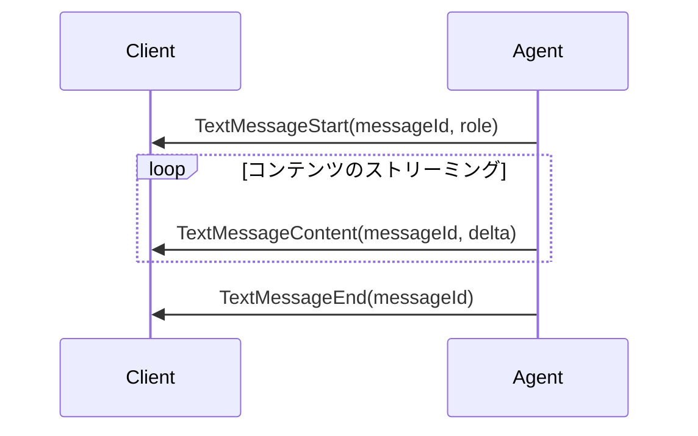

| イベント | 説明 |
|---------|------|
| `TextMessageStart` | メッセージの初期化。`messageId` と `role`（developer, system, assistant, user, tool）を設定 |
| `TextMessageContent` | テキストチャンク。`delta` プロパティに含まれるテキストを前のチャンクに追記 |
| `TextMessageEnd` | メッセージの完了。UI はローディング表示を解除し、レンダリングを確定 |

さらに、`TextMessageChunk` という便利イベントがある。これは Start → Content → End を自動展開する。最初のチャンクで `messageId` を含めると `TextMessageStart` が暗黙的に発行され、`TextMessageEnd` はストリームが新しいメッセージ ID に切り替わるか完了するときに自動発行される。

### Tool Call Events ─ ツール呼び出しの可視化

ツール呼び出しもテキストメッセージと同様のストリーミングパターンに従う。

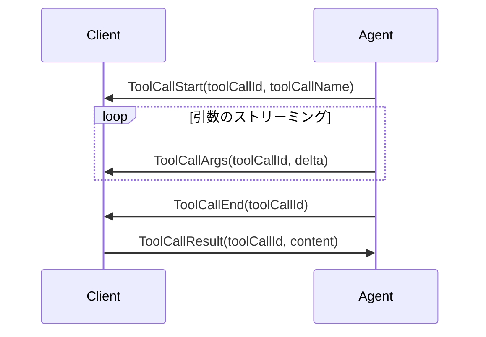

ここで重要なのは、**ツールはフロントエンドから定義され、エージェントに渡される** という点だ。これにより以下のような Human-in-the-Loop ワークフローが実現する。

1. エージェントがツール呼び出しを要求する（ToolCallStart → ToolCallArgs → ToolCallEnd）
2. フロントエンドがツールを実行する（ユーザーの判断を含む場合もある）
3. 結果をエージェントに返す（ToolCallResult）
4. エージェントが結果を踏まえて推論を継続する

これにより、AI と人間が協力するインターフェースを構築できる。

テキストメッセージの `TextMessageChunk` と同様に、ツール呼び出しにも `ToolCallChunk` という便利イベントがある。最初のチャンクで `toolCallId` と `toolCallName` を含めると `ToolCallStart` が暗黙的に発行され、`ToolCallEnd` はストリームが新しい `toolCallId` に切り替わるか完了するときに自動発行される。

### State Management Events ─ 効率的な状態同期

状態管理は**スナップショット - デルタパターン**に従う。

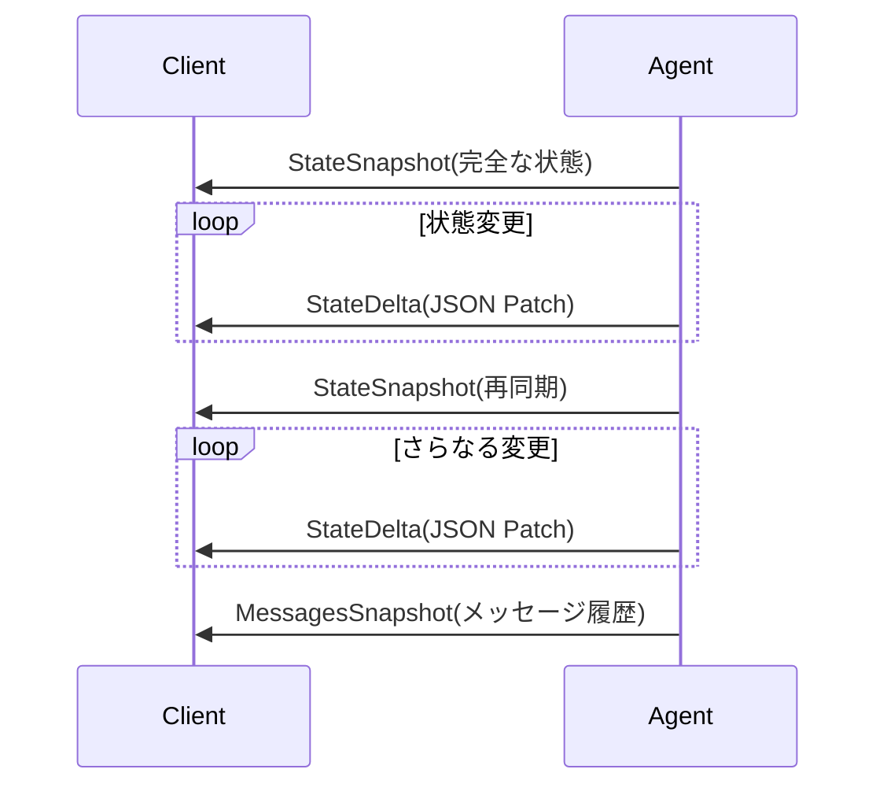

| イベント | 説明 |
|---------|------|
| `StateSnapshot` | 完全な状態のスナップショット。初回や再同期時に送信 |
| `StateDelta` | JSON Patch（RFC 6902）による差分更新。帯域効率が高い |
| `MessagesSnapshot` | 会話メッセージの完全な履歴。チャット表示の初期化や再同期に使用 |

スナップショットが同期ポイントとして機能し、デルタが軽量な差分更新を提供する。この組み合わせにより、完全性と効率性の両立を実現する。

### イベントフローパターン

AG-UI のイベントは 3 つのパターンに分類できる。

| パターン | 用途 | 例 |
|---------|------|-----|
| **Start-Content-End** | ストリーミングコンテンツ | TextMessage, ToolCall |
| **Snapshot-Delta** | 状態同期 | StateSnapshot + StateDelta |
| **Lifecycle** | 実行監視 | RunStarted → RunFinished |

---

## ミドルウェア ─ イベントストリームのインターセプト

AG-UI のミドルウェアは、エージェント実行とイベント消費者の間に位置し、イベントストリームを変換・フィルタ・拡張する。

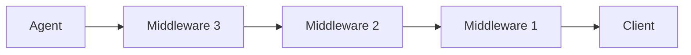

### 関数ベースミドルウェア

単純な変換には関数ベースのミドルウェアが適している。

```typescript
import { MiddlewareFunction } from "@ag-ui/client"
import { EventType } from "@ag-ui/core"

// テキストメッセージにプレフィックスを付加するミドルウェア
const prefixMiddleware: MiddlewareFunction = (input, next) => {
  return next.run(input).pipe(
    map(event => {
      if (
        event.type === EventType.TEXT_MESSAGE_CHUNK ||
        event.type === EventType.TEXT_MESSAGE_CONTENT
      ) {
        return { ...event, delta: `[AI]: ${event.delta}` }
      }
      return event
    })
  )
}

agent.use(prefixMiddleware)
```

### クラスベースミドルウェア

状態管理や設定が必要な場合は、クラスベースのミドルウェアを使う。

```typescript
import { Middleware } from "@ag-ui/client"

class MetricsMiddleware extends Middleware {
  private eventCount = 0

  run(input: RunAgentInput, next: AbstractAgent): Observable<BaseEvent> {
    const startTime = Date.now()
    return this.runNext(input, next).pipe(
      tap(event => {
        this.eventCount++
        this.metricsService.recordEvent(event.type)
      }),
      finalize(() => {
        this.metricsService.recordDuration(Date.now() - startTime)
      })
    )
  }
}
```

### 組み込みミドルウェア

AG-UI は `FilterToolCallsMiddleware` などの組み込みミドルウェアを提供する。

```typescript
import { FilterToolCallsMiddleware } from "@ag-ui/client"

// 許可リスト
const filter = new FilterToolCallsMiddleware({
  allowedToolCalls: ["search", "calculate"]
})

// ブロックリスト
const blocker = new FilterToolCallsMiddleware({
  disallowedToolCalls: ["delete", "modify"]
})

agent.use(filter)
```

ミドルウェアは追加順に実行され、各ミドルウェアが次のミドルウェアをラップする。実行フローは次のようになる。

```text
→ middleware1
  → middleware2
    → middleware3
      → agent.run()
    ← events flow back through middleware3
  ← events flow back through middleware2
← events flow back through middleware1
```

---

## Reasoning Events ─ 推論プロセスの可視化

AG-UI は LLM の推論プロセスを可視化するための Reasoning Events を提供する。これは Chain-of-Thought（思考の連鎖）をユーザーに見せつつ、プライバシーを維持するための仕組みだ。

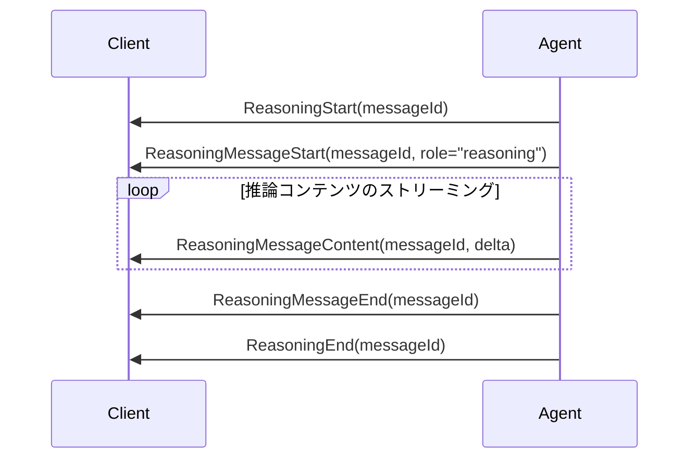

特に注目すべきは `ReasoningEncryptedValue` イベントだ。これは LLM の内部 Chain-of-Thought を暗号化して保持し、ターン間で推論状態を引き継ぐ。クライアントは暗号化された値を不透明に保存・転送するだけで、内容を読むことはできない。これにより、`store:false` やゼロデータ保持ポリシーの下でも推論の継続性を維持できる。

| イベント | 説明 |
|---------|------|
| `ReasoningStart` | 推論プロセスの開始 |
| `ReasoningMessageStart` | 推論メッセージの開始（可視部分） |
| `ReasoningMessageContent` | 推論コンテンツのチャンク |
| `ReasoningMessageEnd` | 推論メッセージの完了 |
| `ReasoningMessageChunk` | Start/End を自動展開する便利イベント |
| `ReasoningEnd` | 推論プロセスの完了 |
| `ReasoningEncryptedValue` | 暗号化された Chain-of-Thought を保持 |

---

## セキュリティの考慮事項

AG-UI エンドポイントはデフォルトでは認証を強制しない。本番環境では FastAPI の依存性注入を使って認証を追加する必要がある。

```python
import os
from fastapi import Depends, FastAPI, HTTPException, Security
from fastapi.security import APIKeyHeader
from agent_framework import Agent
from agent_framework.ag_ui import add_agent_framework_fastapi_endpoint

# API キー認証の設定
API_KEY_HEADER = APIKeyHeader(name="X-API-Key", auto_error=False)
EXPECTED_API_KEY = os.environ.get("AG_UI_API_KEY")


async def verify_api_key(
    api_key: str | None = Security(API_KEY_HEADER),
) -> None:
    """リクエストヘッダの API キーを検証する。"""
    if not api_key or api_key != EXPECTED_API_KEY:
        raise HTTPException(status_code=401, detail="Invalid or missing API key")


app = FastAPI()

# エージェントは前のセクションで作成済みと仮定
# agent = simple_agent(chat_client)

# 認証付きでエンドポイントを登録
add_agent_framework_fastapi_endpoint(
    app,
    agent,
    "/",
    dependencies=[Depends(verify_api_key)],
)
```

`dependencies` パラメータは任意の FastAPI 依存性を受け入れるため、OAuth 2.0、JWT、Azure AD / Entra ID、レート制限など、あらゆる認証方式と統合できる。

---

## エージェントの能力

AG-UI のエージェントは `AbstractAgent` を拡張し、豊富な能力を持つ。

### 双方向コミュニケーション

エージェントはイベントストリームを通じてフロントエンドと双方向の通信チャネルを確立する。リアルタイムのストリーミングレスポンス、即時のフィードバックループ、長時間操作の進捗表示、構造化データの双方向交換が可能だ。

### マルチエージェント協調

エージェントは他のエージェントにタスクを委任できる。複数のエージェントが協調するワークフロー、状態とコンテキストのエージェント間転送、フロントエンドがエージェント遷移を透過的に扱うことが可能だ。

### Human-in-the-Loop

エージェントは人間の介入と支援をサポートする。特定の意思決定にユーザーの入力を要求し、エージェント実行を一時停止して人間のフィードバック後に再開し、AI の効率と人間の判断を組み合わせるハイブリッドワークフローを構築できる。

### 会話メモリ

エージェントは会話メッセージの完全な履歴を保持する。過去のやり取りが将来のレスポンスに反映され、クライアントとサーバー間でメッセージ履歴が同期される。

---

## Microsoft Agent Framework による AG-UI の実装

ここからが本記事の核心だ。AG-UI プロトコルの概念を、Microsoft Agent Framework を使って具体的に実装しながら理解を深めていこう。

### agent-framework-ag-ui パッケージ

Microsoft Agent Framework は `agent-framework-ag-ui` パッケージとして AG-UI プロトコルへのファーストパーティサポートを提供している。このパッケージは、Agent Framework のイベントを AG-UI のイベントに変換するブリッジとして機能する。

```text
pip install agent-framework-ag-ui
```

#### アーキテクチャ

パッケージの内部アーキテクチャは次のようになっている。

| コンポーネント | 役割 |
|--------------|------|
| **AgentFrameworkAgent** | Agent Framework のエージェントをラップし、AG-UI 互換にする軽量ラッパー |
| **Orchestrators** | デフォルト、Human-in-the-Loop など異なる実行フローを処理 |
| **AgentFrameworkEventBridge** | Agent Framework のイベントを AG-UI イベントに変換 |
| **Message Adapters** | AG-UI と Agent Framework のメッセージフォーマットを相互変換 |
| **FastAPI Endpoint** | SSE（Server-Sent Events）によるストリーミング HTTP エンドポイント |

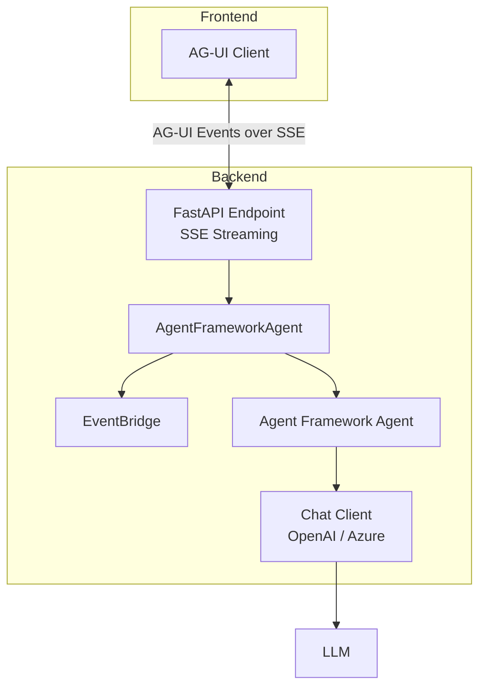

### Feature 1: Agentic Chat ─ 基本的な会話エージェント

最も基本的な例から始めよう。AG-UI の Agentic Chat 機能は、ストリーミングチャットとツール呼び出しをサポートする基本的な会話エージェントだ。

```python
# simple_agent.py
from typing import Any
from agent_framework import Agent, SupportsChatGetResponse


def simple_agent(client: SupportsChatGetResponse[Any]) -> Agent[Any]:
    """シンプルなチャットエージェントを作成する。"""
    return Agent[Any](
        name="simple_chat_agent",
        instructions="You are a helpful assistant. Be concise and friendly.",
        client=client,
    )
```

これだけだ。Agent Framework の `Agent` は、名前、指示文、そしてチャットクライアントを受け取るだけで動作する。これを AG-UI エンドポイントとして公開するには `add_agent_framework_fastapi_endpoint` を使う。

```python
# server.py
from fastapi import FastAPI
from agent_framework.openai import OpenAIChatClient
from agent_framework.ag_ui import add_agent_framework_fastapi_endpoint
from agents.simple_agent import simple_agent

app = FastAPI(title="AG-UI Demo Server")

# チャットクライアントを作成
chat_client = OpenAIChatClient(model="gpt-4o")

# AG-UI エンドポイントとして登録
add_agent_framework_fastapi_endpoint(app, simple_agent(chat_client), "/agentic_chat")
```

`add_agent_framework_fastapi_endpoint` が行うことを分解すると次のようになる。

1. FastAPI ルートに POST エンドポイントを登録する
2. AG-UI クライアントからの `RunAgentInput` を受信する
3. Agent Framework のエージェントを実行する
4. `AgentFrameworkEventBridge` を通じてイベントを AG-UI 形式に変換する
5. SSE（Server-Sent Events）としてストリーミング返却する

この 1 行の呼び出しで、裏側では以下の AG-UI イベントシーケンスが生成される。

```text
→ RunStarted(threadId, runId)
  → TextMessageStart(messageId, role="assistant")
    → TextMessageContent(messageId, delta="こん")
    → TextMessageContent(messageId, delta="にちは")
    → TextMessageContent(messageId, delta="！")
  → TextMessageEnd(messageId)
→ RunFinished(threadId, runId)
```

### Feature 2: Backend Tool Rendering ─ ツール実行と結果のストリーミング

次は、バックエンドでツールを実行し、結果をクライアントにストリーミングする例だ。

```python
# weather_agent.py
from typing import Any
from agent_framework import Agent, SupportsChatGetResponse, tool


@tool
def get_weather(location: str) -> dict[str, Any]:
    """指定された場所の現在の天気を取得する。

    Args:
        location: 天気を取得する都市名

    Returns:
        温度、天候、湿度などを含む辞書
    """
    weather_data = {
        "tokyo": {
            "temperature": 22,
            "conditions": "sunny",
            "humidity": 55,
            "wind_speed": 8,
        },
        "osaka": {
            "temperature": 24,
            "conditions": "partly cloudy",
            "humidity": 60,
            "wind_speed": 6,
        },
    }
    location_lower = location.lower()
    if location_lower in weather_data:
        return weather_data[location_lower]
    return {"temperature": 21, "conditions": "unknown", "humidity": 50, "wind_speed": 10}


@tool
def get_forecast(location: str, days: int = 3) -> str:
    """指定された場所の天気予報を取得する。

    Args:
        location: 天気予報を取得する都市名
        days: 予報日数（デフォルト: 3）

    Returns:
        天気予報の文字列
    """
    forecast: list[str] = []
    for day in range(1, min(days, 7) + 1):
        forecast.append(f"Day {day}: Partly cloudy, {20 + day}°C")
    return f"{days}-day forecast for {location}:\n" + "\n".join(forecast)


def weather_agent(client: SupportsChatGetResponse[Any]) -> Agent[Any]:
    """天気エージェントを作成する。"""
    return Agent[Any](
        name="weather_agent",
        instructions=(
            "You are a helpful weather assistant. "
            "Use the get_weather and get_forecast functions to help users. "
            "Always provide friendly and informative responses."
        ),
        client=client,
        tools=[get_weather, get_forecast],
    )
```

`@tool` デコレータで関数をツールとして宣言するだけで、Agent Framework が自動的にツールスキーマを生成し、LLM に渡す。エージェントがツールを呼び出すと、以下の AG-UI イベントシーケンスが生成される。

```text
→ RunStarted
  → ToolCallStart(toolCallId, toolCallName="get_weather")
    → ToolCallArgs(toolCallId, delta='{"location":')
    → ToolCallArgs(toolCallId, delta=' "Tokyo"}')
  → ToolCallEnd(toolCallId)
  → ToolCallResult(toolCallId, content='{"temperature": 22, ...}')
  → TextMessageStart(messageId, role="assistant")
    → TextMessageContent(messageId, delta="東京の現在の天気は...")
  → TextMessageEnd(messageId)
→ RunFinished
```

フロントエンドは `ToolCallStart` を受信するとツール呼び出し中の UI（ローディングスピナーなど）を表示し、`ToolCallResult` で結果を表示できる。これがすべて標準化されたイベントで行われるのが AG-UI の価値だ。

### Feature 3: Human-in-the-Loop ─ ユーザー承認フロー

AG-UI の強力な機能の一つが Human-in-the-Loop だ。エージェントがツールを実行する前にユーザーの承認を求めることができる。

```python
# human_in_the_loop_agent.py
from typing import Any
from agent_framework import Agent, SupportsChatGetResponse, tool


@tool(approval_mode="always_require")
def delete_file(filename: str) -> str:
    """ファイルを削除する（承認が必要）。

    Args:
        filename: 削除するファイル名

    Returns:
        削除結果のメッセージ
    """
    return f"File '{filename}' has been deleted."


@tool(approval_mode="always_require")
def send_email(to: str, subject: str, body: str) -> str:
    """メールを送信する（承認が必要）。

    Args:
        to: 宛先
        subject: 件名
        body: 本文

    Returns:
        送信結果のメッセージ
    """
    return f"Email sent to {to} with subject '{subject}'."


def human_in_the_loop_agent(
    client: SupportsChatGetResponse[Any],
) -> Agent[Any]:
    """Human-in-the-Loop エージェントを作成する。"""
    return Agent[Any](
        name="hitl_agent",
        instructions=(
            "You are a helpful assistant that can delete files and send emails. "
            "Always confirm with the user before performing these actions."
        ),
        client=client,
        tools=[delete_file, send_email],
    )
```

`@tool(approval_mode="always_require")` で宣言されたツールは、実行前に必ずユーザーの承認を求める。AG-UI のイベントフローは次のようになる。

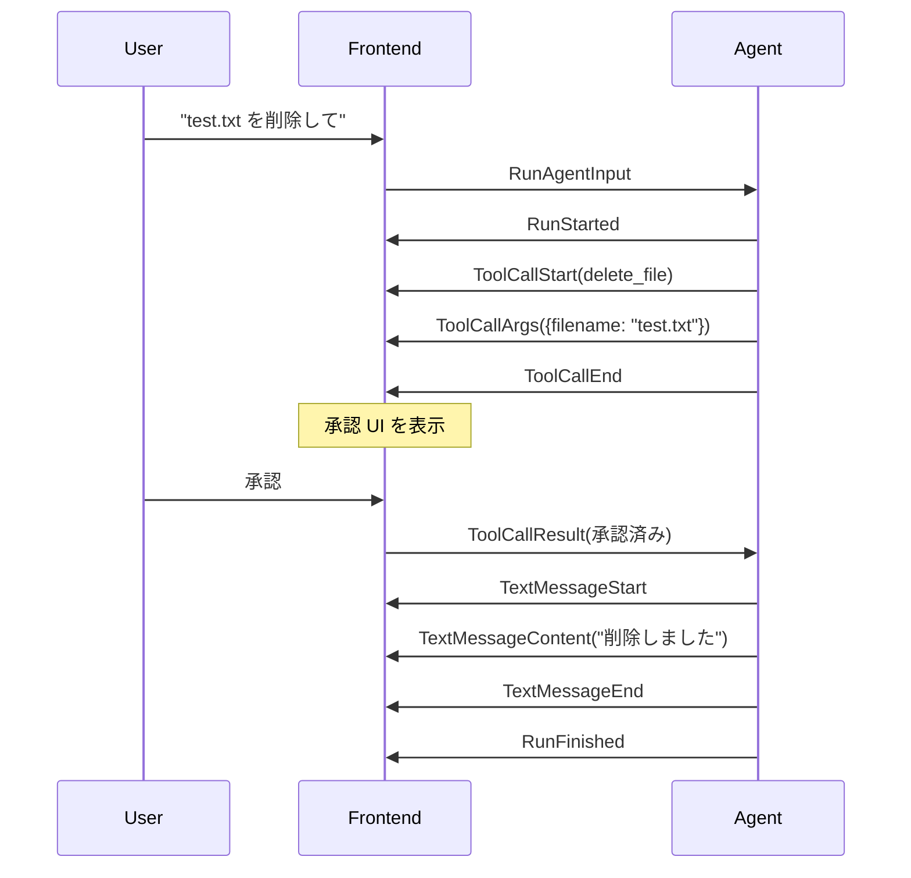

オーケストレータが承認レスポンスを自動検出し、承認済みの場合はツールを実行、拒否された場合はスキップする。この Human-in-the-Loop フローは AG-UI の標準イベントとして表現されるため、フロントエンドは汎用的な承認 UI を一度実装すれば、あらゆるエージェントで再利用できる。

### Feature 4: Shared State ─ 双方向の状態同期

AG-UI の Shared State 機能は、エージェントとフロントエンド間で構造化された状態を双方向に同期する。

```python
# recipe_agent.py
from typing import Any
from agent_framework import Agent, SupportsChatGetResponse, tool
from agent_framework.ag_ui import AgentFrameworkAgent


@tool
def update_recipe(recipe_data: dict[str, Any]) -> str:
    """レシピ情報を更新する。

    Args:
        recipe_data: レシピの情報（name, ingredients など）

    Returns:
        更新結果のメッセージ
    """
    return f"Recipe '{recipe_data.get('name', 'Unknown')}' has been updated."


def recipe_agent(client: SupportsChatGetResponse[Any]) -> AgentFrameworkAgent:
    """レシピ管理エージェントを作成する。"""
    agent = Agent[Any](
        name="recipe_agent",
        instructions=(
            "You are a recipe assistant. Help users create and modify recipes. "
            "Use the update_recipe tool to save changes."
        ),
        client=client,
        tools=[update_recipe],
    )

    # 状態スキーマを定義
    state_schema = {
        "recipe": {
            "type": "object",
            "properties": {
                "name": {"type": "string"},
                "ingredients": {"type": "array"},
                "instructions": {"type": "array"},
            },
        }
    }

    return AgentFrameworkAgent(
        agent=agent,
        state_schema=state_schema,
        name="RecipeAgent",
        description="A recipe management agent with shared state",
    )
```

`state_schema` でフロントエンドと共有する状態の構造を定義する。エージェントが `update_recipe` ツールを呼び出すと、状態が更新され、`StateDelta` イベントがフロントエンドに送信される。

### Feature 5: Predictive State Updates ─ 楽観的な状態更新

Predictive State Updates は、ツール実行中にツールの引数をリアルタイムで状態に反映する機能だ。

```python
# document_writer_agent.py
from typing import Any
from agent_framework import Agent, SupportsChatGetResponse, tool
from agent_framework.ag_ui import AgentFrameworkAgent


@tool
def write_document(title: str, content: str) -> str:
    """ドキュメントを作成する。

    Args:
        title: ドキュメントのタイトル
        content: ドキュメントの内容

    Returns:
        作成結果のメッセージ
    """
    return f"Document '{title}' has been created."


def document_writer_agent(
    client: SupportsChatGetResponse[Any],
) -> AgentFrameworkAgent:
    """ドキュメント作成エージェントを作成する。"""
    agent = Agent[Any](
        name="document_writer",
        instructions="You are a document writer. Create documents based on user requests.",
        client=client,
        tools=[write_document],
    )

    # Predictive State の設定
    predict_state_config = {
        "current_title": {"tool": "write_document", "tool_argument": "title"},
        "current_content": {"tool": "write_document", "tool_argument": "content"},
    }

    return AgentFrameworkAgent(
        agent=agent,
        state_schema={
            "current_title": {"type": "string"},
            "current_content": {"type": "string"},
        },
        predict_state_config=predict_state_config,
        require_confirmation=True,
    )
```

`predict_state_config` は「どのツールのどの引数をどの状態フィールドにマッピングするか」を定義する。LLM がツール引数をストリーミング生成する際に、各チャンクが対応する状態フィールドに即座に反映される。

```text
→ RunStarted
  → ToolCallStart(write_document)
    → ToolCallArgs(delta='{"title": "AG-')
      → StateDelta(op: replace, path: /current_title, value: "AG-")
    → ToolCallArgs(delta='UI Guide"')
      → StateDelta(op: replace, path: /current_title, value: "AG-UI Guide")
    → ToolCallArgs(delta=', "content": "AG-UI is...')
      → StateDelta(op: replace, path: /current_content, value: "AG-UI is...")
  → ToolCallEnd
→ RunFinished
```

これにより、ユーザーはツール実行完了を待たずに、リアルタイムでドキュメントが書かれていく様子を見ることができる。

### Feature 6: Workflow の AG-UI 統合

Agent Framework のワークフロー（グラフベースのマルチステップ実行エンジン）も AG-UI エンドポイントとして公開できる。

```python
from fastapi import FastAPI
from agent_framework import WorkflowBuilder, WorkflowContext, executor
from agent_framework.ag_ui import add_agent_framework_fastapi_endpoint


@executor(id="start")
async def start(message: str, ctx: WorkflowContext) -> None:
    """ワークフローの開始ステップ。"""
    await ctx.yield_output(f"Workflow received: {message}")


@executor(id="analyze")
async def analyze(data: str, ctx: WorkflowContext) -> None:
    """分析ステップ。"""
    result = f"Analysis of '{data}': positive sentiment detected."
    await ctx.yield_output(result)


workflow = (
    WorkflowBuilder(start_executor=start)
    .add_executor(analyze)
    .add_edge("start", "analyze")
    .build()
)

app = FastAPI()
add_agent_framework_fastapi_endpoint(app, workflow, "/workflow")
```

ワークフローのイベント（run/step/activity/tool/custom）は AG-UI イベントに自動マッピングされる。

### 完全なサーバー ─ 全機能を統合

すべての機能を 1 つのサーバーに統合した完全な例を示す。

```python
"""AG-UI Demo Server — 全機能統合"""
import os
from fastapi import FastAPI
from agent_framework.openai import OpenAIChatClient
from agent_framework.ag_ui import add_agent_framework_fastapi_endpoint

# エージェントのインポート
from agents.simple_agent import simple_agent
from agents.weather_agent import weather_agent
from agents.human_in_the_loop_agent import human_in_the_loop_agent
from agents.recipe_agent import recipe_agent
from agents.document_writer_agent import document_writer_agent

app = FastAPI(title="AG-UI Demo Server")

# 共有チャットクライアント
chat_client = OpenAIChatClient(
    model=os.getenv("OPENAI_CHAT_MODEL", "gpt-4o"),
    api_key=os.getenv("OPENAI_API_KEY"),
)

# 各機能のエンドポイントを登録
add_agent_framework_fastapi_endpoint(
    app, simple_agent(chat_client), "/agentic_chat"
)
add_agent_framework_fastapi_endpoint(
    app, weather_agent(chat_client), "/backend_tool_rendering"
)
add_agent_framework_fastapi_endpoint(
    app, human_in_the_loop_agent(chat_client), "/human_in_the_loop"
)
add_agent_framework_fastapi_endpoint(
    app, recipe_agent(chat_client), "/shared_state"
)
add_agent_framework_fastapi_endpoint(
    app, document_writer_agent(chat_client), "/predictive_state_updates"
)

if __name__ == "__main__":
    import uvicorn
    uvicorn.run(app, host="0.0.0.0", port=8888)
```

この 1 つのサーバーで、AG-UI の主要機能をすべてカバーしている。

### AG-UI クライアントからの接続

Python で AG-UI サーバーに接続するクライアントも用意されている。

```python
import asyncio
from agent_framework.ag_ui import AGUIChatClient


async def main():
    async with AGUIChatClient(endpoint="http://localhost:8888/agentic_chat") as client:
        # ストリーミングレスポンス
        async for update in client.get_response("Hello!", stream=True):
            for content in update.contents:
                if content.type == "text" and content.text:
                    print(content.text, end="", flush=True)
        print()


asyncio.run(main())
```

`AGUIChatClient` はストリーミング/非ストリーミングレスポンス、ハイブリッドツール実行（クライアントサイド + サーバーサイド）、自動スレッド管理をサポートする。

---

## CopilotKit との連携

AG-UI のクライアントとして最も成熟しているのが [CopilotKit](https://docs.copilotkit.ai/) だ。CopilotKit は React アプリケーションに AI コパイロット機能を統合するフレームワークで、AG-UI プロトコルをネイティブサポートしている。

CopilotKit の `useCopilotAction` フックは、AG-UI のフロントエンドツール定義パターンを簡素化する。

```typescript
import { useCopilotAction } from "@copilotkit/react-core"

// フロントエンドでツールを定義
useCopilotAction({
  name: "confirmAction",
  description: "ユーザーにアクションの確認を求める",
  parameters: [
    { name: "action", type: "string", description: "確認するアクション" },
    { name: "importance", type: "string", enum: ["low", "medium", "high"] },
  ],
  handler: async ({ action, importance }) => {
    // ユーザーに確認ダイアログを表示
    const confirmed = await showConfirmDialog(action, importance)
    return confirmed ? "approved" : "rejected"
  },
})
```

これにより、フロントエンドで定義したツールがエージェントに渡され、エージェントが必要に応じてツールを呼び出すと、フロントエンドのハンドラが実行される。AG-UI プロトコルがこの双方向フローを標準化しているため、フレームワーク固有のロジックは不要だ。

---

## AG-UI が提供するビルディングブロック

AG-UI は現在すでにサポートしている機能と、今後追加予定の機能を含め、以下のビルディングブロックを提供する。

| ビルディングブロック | 説明 | 状態 |
|-------------------|------|------|
| Streaming Chat | リアルタイムトークン・イベントストリーミング | サポート済み |
| Multimodality | ファイル、画像、音声のアタッチメント | サポート済み |
| Generative UI（Static） | 型付きコンポーネントとしての出力レンダリング | サポート済み |
| Generative UI（Declarative） | 宣言的な UI 言語 | サポート済み |
| Shared State | 読み取り専用/読み書き可能な共有状態 | サポート済み |
| Thinking Steps | 中間的な推論プロセスの可視化 | サポート済み |
| Frontend Tool Calls | フロントエンド実行のツールハンドオフ | サポート済み |
| Backend Tool Rendering | バックエンドツール出力の可視化 | サポート済み |
| Interrupts（HITL） | 中断・承認・再試行 | サポート済み |
| Sub-agents | ネストされた委任 | サポート済み |
| Agent Steering | リアルタイム入力によるエージェント制御 | サポート済み |
| Tool Output Streaming | ツール結果のリアルタイムストリーミング | サポート済み |
| Custom Events | プロトコルでカバーされない独自データ交換 | サポート済み |

---

## サポート対象のインテグレーション

AG-UI は CopilotKit から生まれたプロトコルで、現在は幅広いエコシステムをサポートしている。

### エージェントフレームワーク

| フレームワーク | 状態 |
|--------------|------|
| LangGraph | サポート済み |
| CrewAI | サポート済み |
| Microsoft Agent Framework | サポート済み |
| Google ADK | サポート済み |
| AWS Strands Agents | サポート済み |
| Mastra | サポート済み |
| Pydantic AI | サポート済み |
| Agno | サポート済み |
| LlamaIndex | サポート済み |
| AG2 | サポート済み |
| AWS Bedrock AgentCore | サポート済み |

### SDK

TypeScript に加え、Kotlin、Golang、Dart、Java、Rust の SDK がコミュニティ主導で開発されている。.NET や Nim の SDK も開発中だ。

---

## まとめ ─ AG-UI の意義

AG-UI は、AI エージェントエコシステムにおける「最後の 1 マイル」—— エージェントとユーザーの間のギャップを埋めるプロトコルだ。

### 3 つのプロトコルの補完性

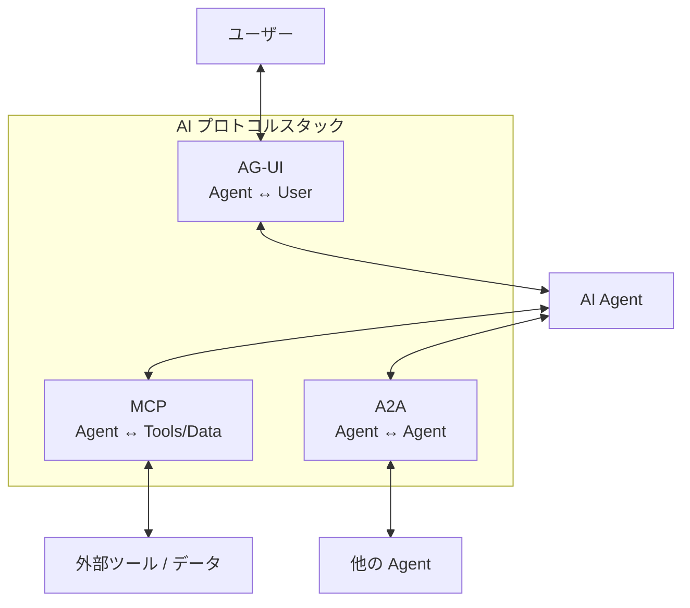

- **MCP** がエージェントとツール/データの接続を標準化する
- **A2A** がエージェント間の協調を標準化する
- **AG-UI** がエージェントとユーザーの対話を標準化する

この 3 つが揃うことで、AI エージェントのエコシステム全体がオープンな標準プロトコルで接続される。

### AG-UI の核心的な価値

1. **フレームワーク非依存**: LangGraph、CrewAI、Microsoft Agent Framework、Google ADK など、あらゆるバックエンドと接続できる
2. **リアルタイム性**: イベント駆動アーキテクチャにより、エージェントの動作をリアルタイムで可視化できる
3. **Human-in-the-Loop の標準化**: ユーザー承認フローが標準プロトコルの一部として定義されている
4. **状態同期**: スナップショット - デルタパターンによる効率的な双方向状態管理
5. **拡張性**: ミドルウェア、カスタムイベント、カスタムオーケストレータによる柔軟な拡張

Microsoft Agent Framework は `agent-framework-ag-ui` パッケージを通じて、これらすべての機能にファーストパーティサポートを提供している。`add_agent_framework_fastapi_endpoint` の 1 行で、既存のエージェントを AG-UI 互換にできるという手軽さが、実際の開発における大きな利点だ。

AI エージェントが単なる「裏方」から「ユーザーと直接対話する存在」へと進化する中で、AG-UI はその対話を標準化し、エコシステム全体の相互運用性を実現するプロトコルとしての役割を果たしている。
