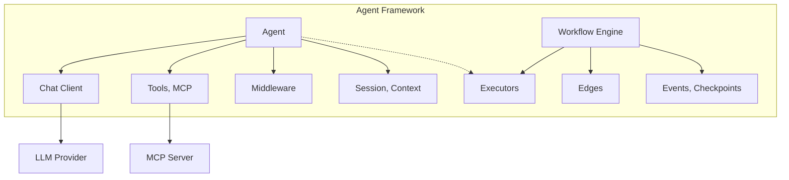
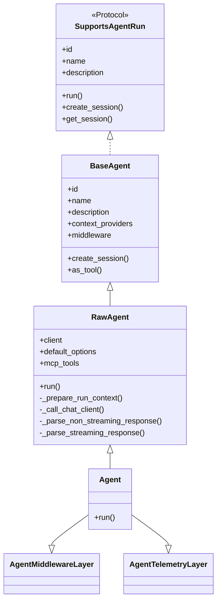
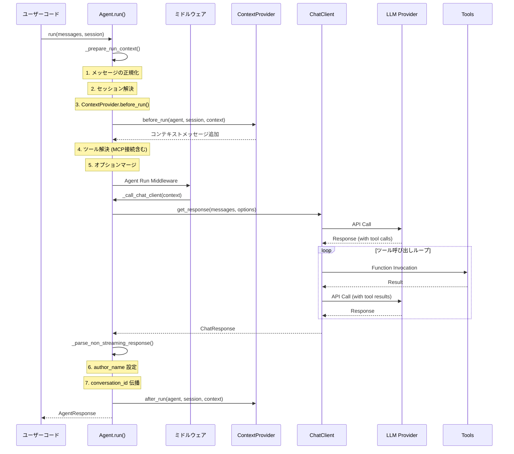
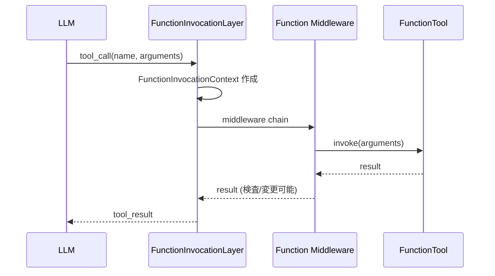
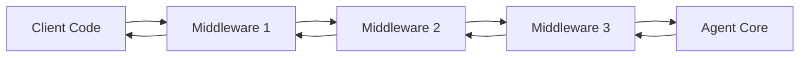
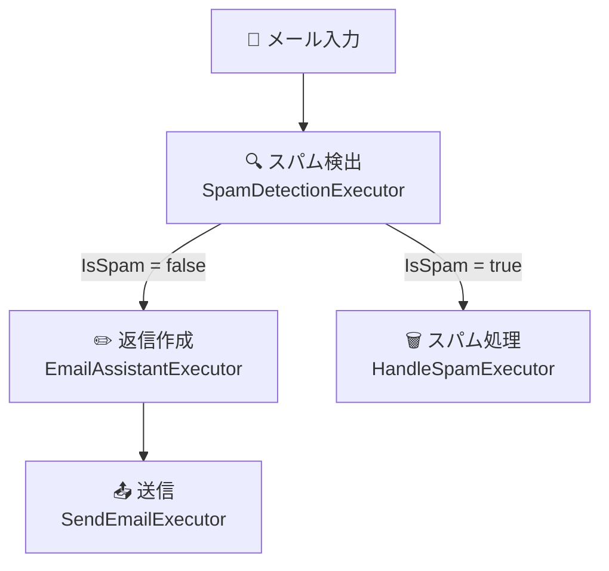

## はじめに

2025 年ごろから、AI エージェントは開発者の間で主要トピックとなった。LLM を単なるチャットインターフェースとして使うのではなく、「ツールを自律的に呼び出し、計画を立て、他のエージェントと協調して複雑なタスクをこなす存在」として活用する動きが加速している。しかし、そのようなエージェントを一から構築するのは容易ではない。セッション管理、ツール呼び出しループ、エラーハンドリング、テレメトリ、マルチエージェント協調——これらすべてを自前で実装するのは膨大な作業だ。

2026 年、AI エージェントは「チャットボット」の枠を超え、ツールを自律的に呼び出し、複数エージェントが協調して複雑なタスクをこなす存在へと進化した。この進化を支えるフレームワークとして Microsoft が公開したのが **[Microsoft Agent Framework](https://github.com/microsoft/agent-framework)** だ。

Agent Framework は、Microsoft が開発してきた [Semantic Kernel](https://github.com/microsoft/semantic-kernel) と [AutoGen](https://github.com/microsoft/autogen) の**直接的な後継**として位置づけられている。Semantic Kernel のエンタープライズ機能（セッション管理・型安全性・ミドルウェア・テレメトリ）と AutoGen のシンプルなエージェント抽象化を統合し、さらにグラフベースのワークフローエンジンを加えた、次世代のフレームワークだ。

この記事では以下の柱で Agent Framework を解説する。

1. **全体アーキテクチャ** — フレームワークの構成要素と設計思想
2. **Agent の実行モデル** — `run()` 内部で何が起きているか
3. **ツール統合** — Function Tools・MCP・Agent-as-Tool
4. **ミドルウェアシステム** — リクエスト/レスポンスのインターセプト
5. **セッションとコンテキストプロバイダ** — ステート管理の仕組み
6. **ワークフローエンジン** — グラフベースのマルチエージェントオーケストレーション
7. **デプロイとインテグレーション** — A2A・Azure Functions・AG-UI・MCP サーバー
8. **オブザーバビリティ** — OpenTelemetry によるトレーシング
9. **設計上の特徴** — 拡張性・層分離・移行パス

## 全体アーキテクチャ

Agent Framework を理解するために、まず全体像を把握しよう。このフレームワークは「個々のエージェントを作る」仕組みと「複数のエージェントを協調させる」仕組みの 2 つの柱で構成されている。

### フレームワークの二本柱

Agent Framework は大きく 2 つの機能カテゴリを提供する。

| カテゴリ | 概要 |
|---------|------|
| **Agents** | LLM を使って入力を処理し、ツールや MCP サーバーを呼び出し、レスポンスを生成する個々のエージェント |
| **Workflows** | エージェントと関数をグラフで接続し、型安全なルーティング・チェックポイント・Human-in-the-Loop をサポートするマルチステップワークフロー |

これらに加えて、モデルクライアント（Chat Completions / Responses API）、AgentSession（ステート管理）、ContextProvider（エージェントメモリ）、Middleware（インターセプト）、MCP クライアント（ツール統合）が基盤ビルディングブロックとして機能する。



### パッケージ構成

Python 側のパッケージは以下のように分割されている。

| パッケージ | 役割 |
|-----------|------|
| `core` | `Agent`, `RawAgent`, `BaseAgent`, `Workflow`, `WorkflowBuilder` 等のコア抽象 |
| `foundry` | Microsoft Foundry 連携の `FoundryChatClient` |
| `openai` | OpenAI / Azure OpenAI の `OpenAIChatClient` |
| `anthropic` | Anthropic Claude の `AnthropicChatClient` |
| `ollama` | ローカル Ollama の `OllamaChatClient` |
| `orchestrations` | マルチエージェントオーケストレーションパターン |
| `a2a` | Agent-to-Agent プロトコル統合 |
| `ag-ui` | AG-UI プロトコル統合 |
| `devui` | 開発者向けデバッグ UI |

.NET 側も同等のパッケージ構成で、`Microsoft.Agents.AI` を基盤に `Microsoft.Agents.AI.OpenAI`、`Microsoft.Agents.AI.Foundry`、`Microsoft.Agents.AI.Workflows` 等が提供される。

### クイックスタート

Python で最小構成のエージェントを作ってみよう。必要なのは 3 つだけだ。**LLM との通信を担う ChatClient**、**エージェントの振る舞いを定義する instructions**、そして**ユーザーの入力を処理する `run()`** — これだけでエージェントが動く。

```python
# pip install agent-framework --pre
import asyncio
from agent_framework import Agent
from agent_framework.foundry import FoundryChatClient
from azure.identity import AzureCliCredential

async def main():
    agent = Agent(
        client=FoundryChatClient(credential=AzureCliCredential()),
        name="HaikuBot",
        instructions="あなたは美しい俳句を詠む詩人です。",
    )
    print(await agent.run("Microsoft Agent Framework について俳句を詠んでください。"))

asyncio.run(main())
```

このコードでは `FoundryChatClient` が Azure AI Foundry 上のモデルへの接続を担い、`AzureCliCredential()` でローカル開発時の認証を行っている。`Agent` のコンストラクタに `instructions` を渡すとシステムプロンプトとして LLM に送信され、`run()` にユーザーメッセージを渡すと内部的に Chat Completions API が呼ばれてレスポンスが返る。たった数行だが、この裏では先ほどのアーキテクチャ図に示した**メッセージ正規化 → ContextProvider → Chat Client → レスポンス後処理**のフルパイプラインが走っている。

.NET の場合はさらに簡潔だ。

```csharp
using Microsoft.Agents.AI;
using Azure.AI.Projects;
using Azure.Identity;

var agent = new AIProjectClient(
        new Uri(Environment.GetEnvironmentVariable("AZURE_AI_PROJECT_ENDPOINT")!),
        new DefaultAzureCredential())
    .AsAIAgent(
        model: "gpt-4o-mini",
        name: "HaikuBot",
        instructions: "あなたは美しい俳句を詠む詩人です。");

Console.WriteLine(await agent.RunAsync("Agent Framework について俳句を詠んでください。"));
```

.NET 版では `AIProjectClient` の拡張メソッド `AsAIAgent()` を使って、プロジェクトクライアントから直接エージェントを生成している。Python 版と .NET 版で API のスタイルは異なるが、**Agent + ChatClient + instructions** という 3 つの構成要素は共通だ。この一貫性が、チーム内で Python と C# を使い分ける際の認知負荷を下げている。

クイックスタートの裏で何が起きているかを理解するために、次は Agent の内部実装を掘り下げていこう。

## Agent の実行モデル — `run()` の内部

クイックスタートでは数行でエージェントが動いたが、その裏側では驚くほど多くの処理が走っている。ここでは Python 実装のソースコードに即して、`run()` の内部を徹底的に解剖する。

### クラス階層

Agent Framework の Python 実装では、エージェントのクラス階層は 3 層構造になっている。各層が異なる責務を担い、ユーザーは必要に応じて適切な抽象レベルを選べる設計だ。



- **`SupportsAgentRun`** — Protocol（ダックタイピング用インターフェース）。`run()`、`create_session()`、`id`/`name`/`description` プロパティを定義
- **`BaseAgent`** — コンテキストプロバイダ・ミドルウェア・セッション管理を実装する基底クラス。`as_tool()` で他のエージェントのツールになれる
- **`RawAgent`** — Chat Client を使った LLM 呼び出しの実装。ミドルウェアとテレメトリは含まない
- **`Agent`** — `AgentMiddlewareLayer`（ミドルウェア）と `AgentTelemetryLayer`（OpenTelemetry）を Mix-in したフル機能クラス

### `run()` の実行フロー

`Agent.run()` が呼ばれた時、内部では以下のフローが実行される。



#### ステップ 1: `_prepare_run_context()`

このメソッドが実行の核心だ。ソースコード（[`_agents.py`](https://github.com/microsoft/agent-framework/blob/main/python/packages/core/agent_framework/_agents.py)）を見ると、以下の処理が行われる。

1. **メッセージの正規化**: `normalize_messages()` で入力を `Message` のリストに変換。文字列が渡された場合は `user` ロールの `ChatMessage` に変換される
2. **セッション自動生成**: `session` が渡されているが `context_providers` が未設定（かつサービス側セッション ID や `store` フラグもない）場合、自動的に `InMemoryHistoryProvider` が追加される
3. **ContextProvider 実行**: `before_run()` を forward order で実行。履歴メッセージやシステムプロンプトが `SessionContext` に追加される
4. **ツール解決**: デフォルトツール＋ランタイムツール＋MCP サーバーのツールを統合。MCP サーバーが未接続なら `AsyncExitStack` 経由で接続する
5. **オプションマージ**: `_merge_options()` でデフォルトオプションとランタイムオプションをマージ。ツールは名前が重複しないように統合、`instructions` は連結、`logit_bias` や `metadata` は辞書マージされる

```python
# _merge_options() の動作イメージ
def _merge_options(base, override):
    result = dict(base)
    for key, value in override.items():
        if value is None:
            continue
        if key == "tools":
            # ツールは名前ベースでユニーク統合
            result["tools"] = _append_unique_tools(base_tools, override_tools)
        elif key == "instructions" and result.get("instructions"):
            # instructions は連結
            result["instructions"] = f"{result['instructions']}\n{value}"
        elif key == "logit_bias" and result.get("logit_bias"):
            # logit_bias は辞書マージ
            result["logit_bias"] = {**result["logit_bias"], **value}
        elif key == "metadata" and result.get("metadata"):
            # metadata は辞書マージ
            result["metadata"] = {**result["metadata"], **value}
        else:
            result[key] = value
    return result
```

#### ステップ 2: Chat Client 呼び出し

`_call_chat_client()` は `_RunContext` を基に Chat Client を呼び出す。

```python
def _call_chat_client(self, context, *, stream):
    return self.client.get_response(
        messages=context["session_messages"],
        stream=stream,
        options=context["chat_options"],
        compaction_strategy=context["compaction_strategy"],
        tokenizer=context["tokenizer"],
        function_invocation_kwargs=context["function_invocation_kwargs"],
        client_kwargs=context["client_kwargs"],
    )
```

Chat Client 内部で**ツール呼び出しループ**が実行される。LLM がツール呼び出しを要求すると、`FunctionInvocationLayer` がツールを実行し、結果を含むメッセージを LLM に再送信する。このループは LLM が最終応答を返すまで繰り返される。

#### ステップ 3: レスポンスの後処理

`_finalize_response()` で以下が行われる。

- `author_name` の設定（各メッセージにエージェント名を付与）
- `conversation_id` のセッションへの伝播
- `after_run()` の ContextProvider 呼び出し（逆順）

### ストリーミング

`stream=True` の場合、`_parse_streaming_response()` が `ResponseStream` を返す。`ResponseStream` は `AsyncIterator` として `AgentResponseUpdate` を yield しつつ、`get_final_response()` で最終的な `AgentResponse` を取得できる。

```python
# ストリーミング使用例
stream = agent.run("こんにちは", stream=True)
async for update in stream:
    print(update.text, end="")
final = await stream.get_final_response()
print(f"\nTokens used: {final.usage_details}")
```

内部では `map()` でアップデートを変換し、`with_transform_hook()` で `conversation_id` の伝播や `response_id` の抑制を行う。

ストリーミングが重要な理由は**ユーザー体験**だ。LLM の応答生成には数秒かかることがあり、ストリーミングなしではその間ユーザーは何も見えない白い画面を見つめることになる。ストリーミングを使えば、トークンが生成されるたびにリアルタイムで表示でき、体感的な待ち時間を大幅に短縮できる。Agent Framework では `stream=True` を渡すだけでこれが実現される。

## ツール統合

ツールは AI エージェントを「ただのチャットボット」から「自律的に行動できるエージェント」に引き上げる最も重要な概念だ。LLM 単体ではテキスト生成しかできないが、ツールを介することで外部 API の呼び出し、データベースの検索、ファイル操作など、現実世界とのインタラクションが可能になる。Agent Framework はさまざまなツールタイプをサポートしており、特に MCP（Model Context Protocol）との統合により、エコシステム全体のツールをシームレスに活用できる。

### ツールの種類

Agent Framework は以下のツールタイプをサポートする。

| ツールタイプ | 説明 |
|------------|------|
| **Function Tools** | エージェントが対話中に呼び出せるカスタムコード |
| **Tool Approval** | ツール実行前の Human-in-the-Loop 承認 |
| **Code Interpreter** | サンドボックス環境でのコード実行 |
| **File Search** | アップロードファイルの検索 |
| **Web Search** | Web 検索 |
| **Hosted MCP Tools** | Microsoft Foundry がホストする MCP ツール |
| **Local MCP Tools** | ローカルまたはカスタムサーバーの MCP ツール |

### Function Tools の定義

Python では `@tool` デコレータで簡単にツールを定義できる。

```python
from agent_framework import Agent, tool

@tool
def get_weather(location: str) -> str:
    """指定された場所の天気を取得する。"""
    return f"{location}の天気は晴れです。"

agent = Agent(
    client=client,
    name="WeatherBot",
    instructions="天気について答えるアシスタントです。",
    tools=[get_weather],
)
```

内部的には `@tool` デコレータが関数のシグネチャと docstring から JSON Schema を生成し、`FunctionTool` インスタンスを作成する。LLM がこのツールを呼び出すと、`FunctionInvocationLayer` が以下のフローを実行する。



### Agent-as-Tool パターン

Agent Framework の強力な機能の一つが、**エージェントを別のエージェントのツールとして使う**パターンだ。これは「専門知識を持つ複数のエージェントを、1 つのコーディネーターエージェントが必要に応じて呼び出す」というアーキテクチャを実現する。人間のチームに例えると、マネージャーが各専門家に仕事を振り分けるのと同じだ。

```python
# 専門エージェントの定義
weather_agent = Agent(
    client=client,
    name="weather_agent",
    description="天気に関する質問に答えるエージェント。",
    tools=[get_weather],
)

# メインエージェントが weather_agent をツールとして使用
main_agent = Agent(
    client=client,
    name="coordinator",
    instructions="あなたは質問を適切な専門家に委任するコーディネーターです。",
    tools=[weather_agent.as_tool()],
)
```

`as_tool()` の実装を見ると、内部的には以下のことが行われている。

1. エージェントの `name` と `description` から `FunctionTool` を生成
2. ツール呼び出し時に `agent.run(task, stream=True)` を実行
3. レスポンスのテキストを文字列として返却

```python
# as_tool() の内部実装（簡略化）
def as_tool(self, *, name=None, description=None):
    async def _agent_wrapper(ctx, **kwargs):
        stream = self.run(
            str(kwargs.get(arg_name, "")),
            stream=True,
            session=ctx.session if propagate_session else None,
        )
        final_response = await stream.get_final_response()
        return final_response.text
    
    return FunctionTool(
        name=tool_name,
        description=tool_description,
        func=_agent_wrapper,
    )
```

### MCP（Model Context Protocol）統合

[MCP](https://modelcontextprotocol.io/) は LLM とツールをつなぐ標準プロトコルだ。Agent Framework は `MCPStdioTool`、`MCPStreamableHTTPTool`、`MCPWebsocketTool` の 3 種の接続方式をサポートする。

```python
from agent_framework import Agent, MCPStdioTool

# MCP サーバーのファイルシステムツールを利用
mcp_tool = MCPStdioTool(
    name="filesystem",
    command="npx",
    args=["-y", "@modelcontextprotocol/server-filesystem", "/tmp"],
)

async with Agent(client=client, tools=[mcp_tool]) as agent:
    response = await agent.run("/tmp 配下のファイル一覧を教えて")
```

MCP ツールの解決は `_prepare_run_context()` の中で行われる。未接続の MCP サーバーは `AsyncExitStack` 経由で接続され、`functions` プロパティからツール一覧が取得される。

`async with Agent(...) as agent:` の構文に注目してほしい。MCP サーバーとの接続は Agent の `__aenter__` で確立され、`__aexit__` で切断される。これにより、MCP サーバーの接続ライフサイクルがエージェントのスコープに紐づき、リソースリークが防止される。MCP を使わない場合は `async with` なしで直接 `agent.run()` を呼べる。

## ミドルウェアシステム

Agent Framework のミドルウェアは ASP.NET や Express.js のミドルウェアパターンと同じ概念で、エージェントの実行パイプラインに横断的関心事（ロギング・バリデーション・エラーハンドリング等）を注入する。ミドルウェアの重要性は、**エージェントのコアロジックを変更せずに振る舞いを拡張できる**点にある。例えば、すべてのツール呼び出しの前に承認を挟む、特定の入力をブロックするガードレールを設ける、といったことがエージェント本体のコードに手を加えずに実現できる。

### 3 種類のミドルウェア

| 種類 | 対象 | 用途 |
|------|------|------|
| **Agent Run Middleware** | `agent.run()` 全体 | 入出力の検査・変更、ガードレール |
| **Function Calling Middleware** | ツール呼び出し | ツール呼び出しの検査・変更、承認フロー |
| **Chat Client Middleware** | LLM API 呼び出し | リクエスト/レスポンスの検査・変更 |

### Python でのミドルウェア実装

以下は 2 つのミドルウェアの例だ。`logging_middleware` はすべてのエージェント呼び出しの入出力メッセージ数をログに記録し、`approval_middleware` は危険なツール（ファイル削除や SQL 実行）の呼び出し前に承認フローを挟む。

```python
from agent_framework import (
    Agent,
    AgentContext,
    FunctionInvocationContext,
    agent_middleware,
    function_middleware,
)

@agent_middleware
async def logging_middleware(context: AgentContext, call_next):
    """すべてのエージェント呼び出しをログに記録するミドルウェア。"""
    print(f"Input: {len(context.messages)} messages")
    await call_next()
    print(f"Output: {len(context.result.messages)} messages")

@function_middleware
async def approval_middleware(context: FunctionInvocationContext, call_next):
    """危険なツール呼び出しに承認を要求するミドルウェア。"""
    if context.function.name in ["delete_file", "execute_sql"]:
        # 承認ロジック（例: ユーザーへの確認）
        print(f"Approval required for: {context.function.name}")
    await call_next()

agent = Agent(
    client=client,
    instructions="あなたは親切なアシスタントです。",
    middleware=[logging_middleware, approval_middleware],
)
```

ミドルウェアの中の `await call_next()` が**次のミドルウェアへの委譲**を意味する。`call_next()` の前に書いたコードはリクエスト時に実行され、後に書いたコードはレスポンス時に実行される。これは Express.js の `next()` や ASP.NET Core の `await next(context)` とまったく同じ仕組みだ。`call_next()` を呼ばなければ、そこでチェーンが中断されエージェント本体には到達しない。

### .NET でのミドルウェア実装

.NET では Builder パターンで既存のエージェントにミドルウェアを追加する。`AsBuilder()` で既存エージェントのコピーを作り、`Use()` でミドルウェアをチェーンし、`Build()` で新しいエージェントを生成する。元のエージェントは変更されない。

```csharp
var middlewareAgent = originalAgent
    .AsBuilder()
        .Use(runFunc: async (messages, session, options, innerAgent, ct) =>
        {
            Console.WriteLine($"Input: {messages.Count()} messages");
            var response = await innerAgent.RunAsync(messages, session, options, ct);
            Console.WriteLine($"Output: {response.Messages.Count} messages");
            return response;
        })
        .Use(async (agent, context, next, ct) =>
        {
            Console.WriteLine($"Function: {context.Function.Name}");
            return await next(context, ct);
        })
    .Build();
```

### ミドルウェアの内部実装

ミドルウェアのチェーン実行は `AgentMiddlewareLayer` で管理される。複数のミドルウェアが登録された場合、それらはコールスタック形式でチェーンされ、各ミドルウェアは `next` を呼ぶことで次のミドルウェア（最終的にはエージェント本体）に処理を委譲する。



`MiddlewareTermination` 例外を送出することで、チェーンを途中で中断し、早期にレスポンスを返すことも可能だ。例えば、入力のバリデーションで問題が見つかった場合に LLM を呼び出さずに即座にエラーレスポンスを返す、といった使い方ができる。

## セッションとコンテキストプロバイダ

ここまで Agent の実行フロー、ツール、ミドルウェアを見てきた。これらは「1 回のリクエスト-レスポンス」の範囲内の話だ。しかし実際のアプリケーションでは、ユーザーとの対話は複数のターンにわたる。「前回何を話したか」を覚え、「この会話の文脈」を踏まえて応答する必要がある。

LLM の API は本質的に**ステートレス**だ。各呼び出しは独立しており、「前回何を話したか」を覚えていない。しかし、ユーザーとの対話ではマルチターンの会話が必要になる。Agent Framework では **AgentSession** と **ContextProvider** がこのギャップを埋める。

### AgentSession

`AgentSession` はエージェントの対話状態を保持するコンテナだ。

```python
session = agent.create_session()

# 1回目の呼び出し
response1 = await agent.run("私は東京に住んでいます。", session=session)

# 2回目の呼び出し — セッションが会話履歴を保持
response2 = await agent.run("私はどこに住んでいますか？", session=session)
# → "東京に住んでいます。"
```

セッションの主要プロパティは以下の通り。

- `session_id` — ローカルセッション ID（自動生成）
- `service_session_id` — サービス側のセッション ID（Foundry Agents の thread ID 等）
- `state` — プロバイダごとのステートを保持する辞書

### ContextProvider

`ContextProvider` はエージェント呼び出しの前後にフックする拡張ポイントだ。`before_run()` で追加のコンテキスト（履歴メッセージ・システムプロンプト・追加ツール）を注入し、`after_run()` で応答を永続化できる。

```python
from agent_framework import ContextProvider, SessionContext, AgentSession

class CustomContextProvider(ContextProvider):
    """カスタムコンテキストプロバイダの例。"""
    
    async def before_run(self, agent, session, context, state):
        # 追加のシステムプロンプトを注入
        context.instructions.append("常に日本語で回答してください。")
    
    async def after_run(self, agent, session, context, state):
        # 応答をログに記録
        if context.response:
            state["last_response"] = context.response.text
```

最も重要な組み込みプロバイダは `InMemoryHistoryProvider` だ。セッションが渡されたのにプロバイダが未設定の場合、Agent は自動的にこれを追加する。これにより、最もシンプルな `session` 付き呼び出しでもマルチターン会話が実現される。

### CompactionStrategy

長い会話ではトークン数が問題になる。`CompactionStrategy` はメッセージを圧縮する戦略を提供する。

| 戦略 | 説明 |
|------|------|
| `TruncationStrategy` | 古いメッセージを削除 |
| `SlidingWindowStrategy` | 直近 N 件のメッセージを保持 |
| `SummarizationStrategy` | 古いメッセージを LLM で要約 |
| `TokenBudgetComposedStrategy` | 複数戦略を組み合わせてトークン予算内に収める |

## ワークフローエンジン — グラフベースのオーケストレーション

ここまでは「単一のエージェント」の実装を見てきた。しかし現実の業務プロセスは、1 つのエージェントだけでは処理しきれないことが多い。メールをスパム判定し、正常なら返信を生成し、スパムなら隔離する——このような「複数のステップを特定の順序で実行し、条件分岐を含むプロセス」には、ワークフローエンジンが必要だ。

### Agent vs Workflow

| Agent を使うべき場面 | Workflow を使うべき場面 |
|---------------------|----------------------|
| オープンエンドまたは対話的なタスク | 明確に定義されたステップがあるプロセス |
| 自律的なツール使用と計画が必要 | 実行順序を明示的に制御したい |
| 単一の LLM 呼び出しで十分 | 複数のエージェントや関数を協調させたい |

ワークフローは **Executor**（処理ノード）を **Edge**（接続）でつなぐ有向グラフだ。

### Executor（実行ノード）

Executor はワークフローの基本的な処理単位だ。メッセージを受け取り、処理し、出力メッセージを生成する。

```python
from agent_framework import Executor, handler, WorkflowContext

class UppercaseExecutor(Executor):
    """入力文字列を大文字に変換する Executor。"""
    
    @handler
    async def handle(self, message: str, context: WorkflowContext) -> str:
        return message.upper()
```

.NET では `partial` クラスと `[MessageHandler]` 属性を使ったソース生成で実装する。

```csharp
internal sealed partial class UppercaseExecutor() : Executor("UppercaseExecutor")
{
    [MessageHandler]
    private ValueTask<string> HandleAsync(string message, IWorkflowContext context)
    {
        return ValueTask.FromResult(message.ToUpperInvariant());
    }
}
```

Executor はステートフルにできる。共有される場合は `IResettableExecutor` を実装してランクリアする。

### Edge（接続）

Edge はメッセージの流れを定義する。以下のパターンがある。

| Edge タイプ | 説明 | ユースケース |
|------------|------|------------|
| **Direct** | 単純な 1 対 1 接続 | パイプライン |
| **Conditional** | 条件付きルーティング | if/else 分岐 |
| **Switch-Case** | 条件に基づくマルチブランチルーティング | 3 分岐以上のルーティング |
| **Fan-out** | 1 つの Executor から複数ターゲットへ | 並列処理 |
| **Fan-in** | 複数ソースから 1 つのターゲットへ | 集約 |

### ワークフロー実装例 — メール分類パイプライン

ここからは具体的なワークフローの実装例で理解を深めよう。以下はメールをスパム判定し、スパムなら隔離処理、正常メールなら返信を自動作成するワークフローだ。この例を通じて、Executor の定義方法、Edge による条件分岐、`WorkflowBuilder` によるグラフ組み立てまでの一連の流れを見ていく。



```python
from agent_framework import (
    Agent, Executor, handler, WorkflowBuilder, WorkflowContext,
    InProcRunnerContext, Message,
)

class SpamDetectionExecutor(Executor):
    def __init__(self, agent):
        super().__init__("SpamDetection")
        self._agent = agent
    
    @handler
    async def handle(self, message: str, context: WorkflowContext):
        response = await self._agent.run(message)
        is_spam = "spam" in response.text.lower()
        return {"is_spam": is_spam, "content": message}

class EmailAssistantExecutor(Executor):
    def __init__(self, agent):
        super().__init__("EmailAssistant")
        self._agent = agent
    
    @handler
    async def handle(self, message: dict, context: WorkflowContext):
        response = await self._agent.run(
            f"以下のメールに丁寧な返信を作成してください: {message['content']}"
        )
        await context.emit(f"返信: {response.text}")

class SpamHandler(Executor):
    @handler
    async def handle(self, message: dict, context: WorkflowContext):
        await context.emit(f"スパムとしてマーク: {message['content'][:50]}...")

# ワークフローの構築
spam_detector = SpamDetectionExecutor(detection_agent)
assistant = EmailAssistantExecutor(reply_agent)
spam_handler = SpamHandler("SpamHandler")

workflow = (
    WorkflowBuilder(spam_detector)
    .add_edge(
        assistant,
        condition=lambda msg: not msg["is_spam"],
    )
    .add_edge(
        spam_handler,
        condition=lambda msg: msg["is_spam"],
    )
    .build()
)

# ワークフロー実行
async with InProcRunnerContext() as ctx:
    async for event in ctx.run(workflow, "重要な会議のお知らせ"):
        print(event)
```

`WorkflowBuilder` はグラフの構築を宣言的に行うビルダーだ。`add_edge()` に条件関数を渡すことで、実行時の条件分岐が定義される。`InProcRunnerContext` はワークフローをインプロセスで実行するランナーであり、各 Executor のメッセージ受け渡しやイベントの伝搬を管理する。

.NET での同等実装は `WorkflowBuilder` を使って以下のように記述する。

```csharp
var workflow = new WorkflowBuilder(spamDetectionExecutor)
    .AddEdge(spamDetectionExecutor, emailAssistantExecutor,
             condition: GetCondition(expectedResult: false))
    .AddEdge(emailAssistantExecutor, sendEmailExecutor)
    .AddEdge(spamDetectionExecutor, handleSpamExecutor,
             condition: GetCondition(expectedResult: true))
    .WithOutputFrom(handleSpamExecutor, sendEmailExecutor)
    .Build();
```

### Switch-Case パターン

3 分岐以上の条件分岐では `AddSwitch()` が見通しがよい。各ケースに条件関数を与え、デフォルトブランチも指定できる。

```csharp
builder.AddSwitch(spamDetectionExecutor, switchBuilder =>
    switchBuilder
        .AddCase(GetCondition(SpamDecision.NotSpam), emailAssistantExecutor)
        .AddCase(GetCondition(SpamDecision.Spam), handleSpamExecutor)
        .WithDefault(handleUncertainExecutor)
);
```

### Fan-out / Fan-in パターン

1 つの Executor から複数のターゲットに並列処理を委譲し、結果を集約するパターンだ。Fan-out では `targetSelector` が入力に応じて実行先を選択し、Fan-in のバリアはすべてのソースが完了するまで待機する。

```csharp
// Fan-out: 1 → N
builder.AddFanOutEdge(
    analysisExecutor,
    targets: [spamHandler, emailAssistant, summarizer, uncertainHandler],
    targetSelector: (result, targetCount) =>
    {
        if (result.IsSpam) return [0];
        var targets = new List<int> { 1 };
        if (result.EmailLength > 100) targets.Add(2);
        return targets;
    }
);

// Fan-in: N → 1
builder.AddFanInBarrierEdge(
    sources: [worker1, worker2, worker3],
    target: aggregator
);
```

### ワークフローの実行とイベント

ワークフローの実行は**スーパーステップ方式**で進行する。各スーパーステップで、アクティブな Executor が並行して実行され、出力メッセージは Edge に沿って次のスーパーステップの Executor に配送される。

`WorkflowEvent` は以下の種類がある。

| イベント | 説明 |
|---------|------|
| `WorkflowOutputEvent` | 最終出力 |
| `ExecutorStartEvent` / `ExecutorEndEvent` | Executor のライフサイクル |
| カスタムイベント | `context.AddEventAsync()` で任意のイベントを発火 |

### チェックポイント

長時間実行ワークフローでは途中で障害が発生する可能性がある。`CheckpointStorage` を使えばワークフローのステートを永続化し、障害復旧やプロセス再起動後にワークフローを途中から再開できる。

```python
from agent_framework import FileCheckpointStorage

storage = FileCheckpointStorage("./checkpoints")
runner_context = InProcRunnerContext(workflow, checkpoint_storage=storage)
```

## デプロイとインテグレーション

Agent Framework で構築したエージェントやワークフローは、さまざまな方法でデプロイ・統合できる。

### A2A（Agent-to-Agent）プロトコル

A2A は Google が提唱した、異なるフレームワーク間でエージェントを連携させるためのオープンプロトコルだ。Agent Framework は A2A サーバーとクライアントの両方をサポートしており、他のフレームワークで構築されたエージェントとも相互運用できる。

```python
from agent_framework.a2a import A2AServer

# エージェントを A2A サーバーとして公開
server = A2AServer(agent=my_agent)
await server.start(host="0.0.0.0", port=8080)
```

### AG-UI（Agent-User Interface）プロトコル

AG-UI は CopilotKit が提唱した、エージェントとフロントエンドをリアルタイムに接続するプロトコルだ。ストリーミング応答、ツール呼び出しの進捗表示、Human-in-the-Loop の承認 UI など、エージェントの動作をユーザーに可視化するための標準的なインターフェースを提供する。

### Azure Functions / Container Apps

エージェントをサーバーレスまたはコンテナとしてデプロイするのが最も一般的なパターンだ。Azure Functions を使えば、HTTP トリガーで起動するエージェントを数行で構成できる。Container Apps を使えば、長時間実行のワークフローやストリーミング応答にも対応できる。

### MCP サーバーとしてのエクスポート

エージェント自体を MCP サーバーに変換し、他のツールやエージェントから呼び出し可能にすることもできる。

```python
# エージェントを MCP サーバーに変換
server = agent.as_mcp_server(server_name="MyAgent", version="1.0.0")
```

`as_mcp_server()` の実装は、エージェントを `as_tool()` でツール化し、MCP の `@server.call_tool()` ハンドラとして登録する。これにより、Agent Framework で構築したエージェントが MCP エコシステムの一部としてシームレスに利用できる。

### DevUI

開発者向けのインタラクティブ UI で、エージェントの開発・テスト・デバッグが可能だ。ワークフローの実行グラフをリアルタイムで可視化し、各 Executor の入出力や Edge のメッセージフローを確認できる。

## オブザーバビリティ

プロダクション環境では、エージェントの動作を監視・デバッグできることが不可欠だ。Agent Framework は OpenTelemetry をネイティブサポートしており、`AgentTelemetryLayer`（`Agent` クラスの Mix-in）がすべての `run()` 呼び出しに対してスパンを自動生成する。

```python
from opentelemetry import trace
from opentelemetry.sdk.trace import TracerProvider
from opentelemetry.sdk.trace.export import ConsoleSpanExporter, SimpleSpanProcessor

# OpenTelemetry セットアップ
provider = TracerProvider()
provider.add_span_processor(SimpleSpanProcessor(ConsoleSpanExporter()))
trace.set_tracer_provider(provider)

# Agent は自動的にスパンを出力する
agent = Agent(client=client, name="TracedAgent")
response = await agent.run("こんにちは")
```

トレースには以下の情報が含まれる。

- エージェント名・ID
- メッセージ数
- ツール呼び出しの詳細
- トークン使用量
- レスポンスタイム

Jaeger や Azure Monitor など、OpenTelemetry 対応のバックエンドにエクスポートすることで、エージェントの振る舞いをダッシュボードで可視化し、ボトルネックの特定やコスト最適化に活用できる。

## 設計上の特徴

### プロトコルベースの拡張性

`SupportsAgentRun` が Protocol として定義されているため、Agent Framework のクラスを継承せずとも、必要なメソッドを実装すれば互換性のあるエージェントを作れる。これは Python のダックタイピングの思想と一致しており、既存のコードベースに Agent Framework を段階的に導入する際に非常に便利だ。

### ミドルウェアの層分離

Agent Run Middleware → Function Calling Middleware → Chat Client Middleware の 3 層構造で、それぞれ異なるレベルでインターセプトできる設計は、責務の分離が明確で拡張しやすい。たとえば、「すべてのエージェント呼び出しにロギングを追加」「特定のツール呼び出しだけに承認を追加」「LLM リクエストにリトライを追加」を、それぞれ独立したミドルウェアで実現できる。

### Semantic Kernel / AutoGen からの移行パス

Agent Framework は Semantic Kernel からの移行ガイドと AutoGen からの移行ガイドを公式に提供しており、既存投資を活かした段階的な移行が可能だ。

### Python と .NET の対称性

Python と C#/.NET の両方で一貫した API を提供する点は、組織内で複数言語を使うチームにとって大きなメリットだ。概念とパターンが同じなので、言語間の知識転移が容易になる。

## まとめ

Microsoft Agent Framework は、AI エージェント開発に必要な要素を包括的に提供するフレームワークだ。この記事で見てきたように、その内部は以下の層で構成されている。

1. **Agent 層** — メッセージ正規化 → ContextProvider → ChatClient → レスポンス後処理のパイプラインで、LLM との対話を管理する
2. **ツール層** — `@tool` デコレータ、MCP 統合、Agent-as-Tool により、エージェントと外部世界を接続する
3. **ミドルウェア層** — Agent / Function / ChatClient の 3 レベルで横断的関心事を注入する
4. **セッション層** — AgentSession と ContextProvider で、ステートレスな LLM API の上にマルチターン対話を実現する
5. **ワークフロー層** — Executor と Edge のグラフで、条件分岐・並列処理・Human-in-the-Loop を宣言的に記述する
6. **オブザーバビリティ層** — OpenTelemetry でエージェントの動作を監視・デバッグする

Semantic Kernel のエンタープライズ品質と AutoGen のシンプルさを融合し、MCP・A2A・AG-UI といった最新のプロトコルにも対応する Agent Framework は、AI エージェント開発の統一的な基盤としてエコシステムの中心に位置づけられている。

## 参考リンク

- [Microsoft Agent Framework — GitHub](https://github.com/microsoft/agent-framework)
- [公式ドキュメント — MS Learn](https://learn.microsoft.com/en-us/agent-framework/)
- [Python パッケージ — PyPI](https://pypi.org/project/agent-framework/)
- [.NET パッケージ — NuGet](https://www.nuget.org/profiles/MicrosoftAgentFramework/)
