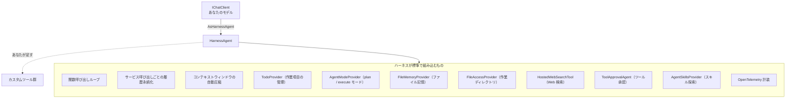
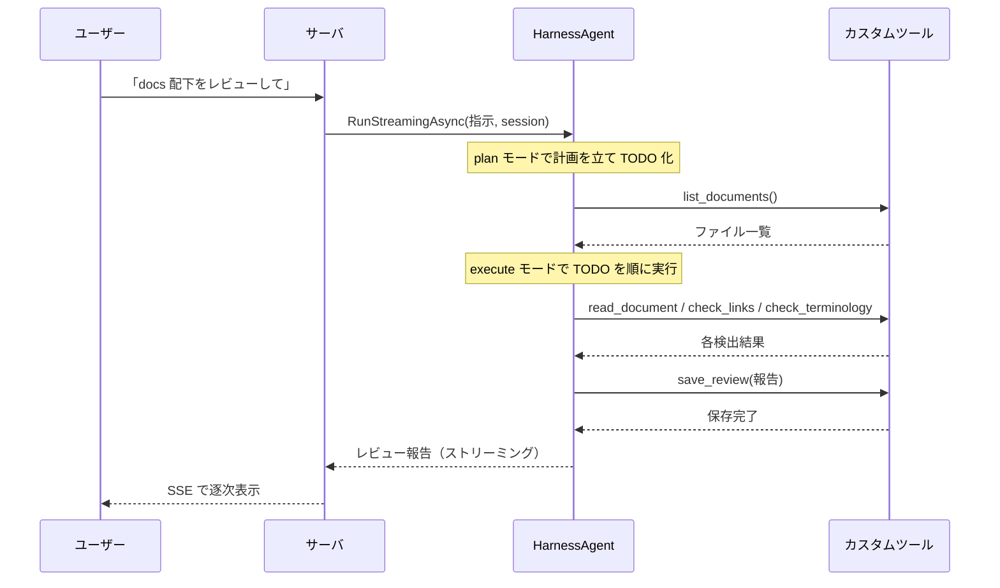

## はじめに

姉妹編「[オーケストレーションを手放す — GitHub Copilot SDK でツールを足すだけの文書レビューエージェントを作る](/ja/blog/copilot-doc-reviewer)」では、こんな発想を実装した。

> エージェントの司令塔（計画 → ツール選択 → 実行 → 評価のループ）を自分で書くのをやめ、本番で揉まれたランタイムに丸ごと委譲する。自分はレビューに必要な処理を<strong>ツール</strong>として提供するだけ。

GitHub Copilot SDK はこの発想を見事に体現していた。だが——「同じことが Microsoft Agent Framework の <strong>Agent Harness</strong> でもできる」と聞いたら、確かめたくなるのが人情だ。

本記事では、まったく同じ<strong>文書レビューエージェント</strong>を、今度は Microsoft Agent Framework の `HarnessAgent` で実装する。結論から言えば、できる。しかも Copilot SDK 版とは<strong>異なる設計判断</strong>のもとで、だ。両者を読み比べると、「オーケストレーションを委譲する」という同じ思想が、ランタイムの設計次第でどう違う顔を見せるかがよく分かる。

構成は以下の通り。

1. <strong>Agent Harness とは何か</strong> — `HarnessAgent` が「あらかじめ作り込んでくれているもの」
2. <strong>Copilot SDK との対比</strong> — 2 つの「委譲」の違い
3. <strong>設計</strong> — 同じ 5 つのツール、ただし計画機能は最初から付いてくる
4. <strong>実装</strong> — C# でツール・ハーネス・SSE サーバ・UI
5. <strong>メリット</strong> — なぜハーネスが効くのか
6. <strong>デメリットと注意点</strong> — 実験的 API・非決定性・セキュリティ
7. <strong>どれを選ぶか</strong> — Copilot SDK・Agent Harness・明示的ワークフローの使い分け

> 前提として Microsoft Agent Framework 自体の全体像は「[Microsoft Agent Framework 完全解説](/ja/blog/agent-framework)」を参照してほしい。本記事は「Agent Harness」という一点に絞る。

## Agent Harness とは何か

Microsoft Agent Framework の通常の使い方は、`ChatClientAgent` を作り、ツールやコンテキストプロバイダを自分で組み合わせていくものだ。柔軟だが、「自律的に長いタスクをこなすエージェント」を作るには、計画・TODO 管理・コンテキスト圧縮・ツール承認といった<strong>運用基盤（ハーネス）を自分で組む</strong>必要がある。

<strong>Agent Harness（`HarnessAgent`）</strong>は、その運用基盤を<strong>あらかじめ作り込んだ</strong>エージェントだ。`Microsoft.Agents.AI.Harness` パッケージが提供する。一言でいえば、<strong>「Claude Code 的な自律エージェントを 1 行で立ち上げる」</strong>仕組みである。

`IChatClient` に対して `AsHarnessAgent()` を呼ぶと、次のものが<strong>最初から全部入り</strong>で構成される。



開発者がやることは、Copilot SDK 版とまったく同じだ——<strong>ツールと指示を足すだけ</strong>。計画も、TODO も、コンテキスト圧縮も、ツール承認も、自分では書かない。

注目すべきは <strong>`AgentModeProvider` の既定モードが "plan"（計画）と "execute"（実行）</strong>であること、そして <strong>`TodoProvider` が作業項目を追跡する</strong>ことだ。つまりハーネスは、「まず計画を立て、TODO に落とし、順に実行する」という Claude Code 的なワークフローを<strong>標準で持っている</strong>。これはハーネスならではの特徴——<strong>明示的な</strong>計画/TODO の仕組みだ。Copilot SDK のランタイムも内部では計画するが、これに相当する plan モードや TODO プロバイダは外部に公開していない。

> `HarnessAgent` は本記事執筆時点で<strong>実験的（experimental / preview）</strong>な API であり、コンパイル時に診断 ID `MAAI001` の警告が出る。本番採用の際はバージョン間の破壊的変更に注意してほしい。

## Copilot SDK との対比 — 2 つの「委譲」

どちらも「オーケストレーションを委譲し、ツールを足すだけ」という同じ思想だ。だが委譲先のランタイムの性質が違うため、設計判断も変わってくる。

| 観点 | GitHub Copilot SDK | Agent Harness（`HarnessAgent`） |
|------|--------------------|-------------------------------|
| <strong>ランタイムの形</strong> | 別プロセスの Copilot CLI に JSON-RPC で接続 | <strong>同一プロセス内</strong>の .NET ライブラリ |
| <strong>モデル</strong> | Copilot 経由、または BYOM/BYOK で自前のモデル | <strong>自前のモデル</strong>（Azure OpenAI / OpenAI など）を持ち込む |
| <strong>課金</strong> | 使用量ベース（GitHub AI Credits、トークン消費量で課金） | 利用したモデルプロバイダーへの課金のみ |
| <strong>計画・TODO</strong> | 明示的な計画/TODO の仕組みは持たない（ランタイムが内部で計画。具体は指示で誘導） | <strong>plan/execute モードと TodoProvider が標準装備</strong> |
| <strong>能力の絞り込み</strong> | 実行時に `onPermissionRequest` で承認/拒否 | <strong>構成時に</strong> `Disable*` フラグと提供ツールで決める |
| <strong>言語</strong> | Node/Python/Go/.NET/Java/Rust | .NET が最も成熟（Python 等も存在） |
| <strong>配布</strong> | CLI ランタイム同梱 | NuGet ライブラリ（実験的） |

最も本質的な違いは<strong>能力の絞り込み方</strong>だ。Copilot SDK は「強力なランタイムに対し、実行時に一つひとつ許可を出す（または拒否する）」という<strong>動的なゲート</strong>で安全性を担保した。一方ハーネスは「どの能力を組み込むかを<strong>構成時に</strong>選ぶ」という<strong>静的な組み立て</strong>で安全性を担保する。`DisableWebSearch = true`、`DisableFileAccess = true` のように、要らない能力を最初から外しておくわけだ。

この違いは後の実装とセキュリティの議論で効いてくる。

## 設計 — 同じ 5 つのツール

レビューに必要な能力は Copilot SDK 版と変わらない。同じ 5 つのツールを提供する。

1. <strong>`list_documents`</strong> — レビュー対象の一覧
2. <strong>`read_document`</strong> — 本文の読み込み
3. <strong>`check_links`</strong> — リンク切れの確認
4. <strong>`check_terminology`</strong> — 用語の表記ゆれ確認
5. <strong>`save_review`</strong> — レビュー結果の保存

違いは、<strong>「まず計画を立てて TODO に分解し、順に実行する」という進め方を、ハーネスが最初から持っている</strong>ことだ。Copilot SDK 版ではシステムメッセージで進め方を誘導したが、ハーネスでは `AgentModeProvider`（plan/execute）と `TodoProvider` がその骨組みを与えてくれる。私たちは観点（リンク・用語・明確さ）と出力形式を指示するだけでよい。



## 実装

### プロジェクト構成と依存

最終的な構成は Copilot SDK 版と対になっている。

```text
agent-harness-doc-reviewer/
├── AgentHarnessDocReviewer.csproj
├── Program.cs              # ASP.NET 最小 API + SSE サーバ
├── ReviewTools.cs          # 5 つのカスタムツール（AIFunction）
├── ReviewPrompt.cs         # レビュー指示
├── glossary.json           # 用語統一チェック用の正規表記辞書
├── docs/                   # レビュー対象
├── reviews/                # 出力先
└── wwwroot/
    └── index.html          # ブラウザ UI（バニラ JS、Copilot SDK 版と同一）
```

依存パッケージを追加する。Agent Harness は実験的なので `--prerelease` で取得する。

```bash
dotnet add package Microsoft.Agents.AI.Harness --prerelease
dotnet add package Microsoft.Agents.AI.OpenAI --prerelease
dotnet add package Azure.AI.OpenAI
dotnet add package Azure.Identity
```

`HarnessAgent` は実験的 API なので、`.csproj` で警告を抑制しておく。

```xml
<PropertyGroup>
  <TargetFramework>net9.0</TargetFramework>
  <NoWarn>$(NoWarn);MAAI001;OPENAI001</NoWarn>
</PropertyGroup>
```

### ツールを定義する

Copilot SDK 版では `defineTool` + Zod を使った。Agent Framework では、ツールは `Microsoft.Extensions.AI` の <strong>`AIFunction`</strong> であり、`AIFunctionFactory.Create()` でデリゲートから生成する。各ツールが UI 通知用の `emit` を閉じ込める点は Copilot SDK 版と同じだ。

```csharp
// ReviewTools.cs
using System.ComponentModel;
using Microsoft.Extensions.AI;

public static class ReviewTools
{
    private static readonly string DocsRoot = Path.GetFullPath("docs");
    private static readonly string ReviewsRoot = Path.GetFullPath("reviews");

    // パストラバーサル対策: 解決後のパスがルート配下にあることを保証する
    private static string ResolveWithin(string root, string target)
    {
        string resolved = Path.GetFullPath(Path.Combine(root, target));
        if (!resolved.StartsWith(root + Path.DirectorySeparatorChar, StringComparison.Ordinal)
            && resolved != root)
        {
            throw new InvalidOperationException($"許可されていないパスです: {target}");
        }
        return resolved;
    }

    public static IList<AITool> Create(Action<string, string> emit)
    {
        return new List<AITool>
        {
            AIFunctionFactory.Create(() =>
            {
                var files = Directory
                    .EnumerateFiles(DocsRoot, "*.*", SearchOption.AllDirectories)
                    .Where(f => f.EndsWith(".md") || f.EndsWith(".mdx"))
                    .Select(f => Path.GetRelativePath(DocsRoot, f))
                    .ToArray();
                emit("list_documents", $"{files.Length} 件のドキュメントを検出");
                return new { files };
            }, "list_documents", "レビュー対象の docs/ 配下にあるドキュメントの一覧を返す"),

            AIFunctionFactory.Create((
                [Description("docs/ からの相対パス")] string filePath) =>
            {
                string abs = ResolveWithin(DocsRoot, filePath);
                string content = File.ReadAllText(abs);
                emit("read_document", $"{filePath} を読み込み（{content.Length} 文字）");
                return new { filePath, content };
            }, "read_document", "指定したドキュメントの本文を読み込んで返す"),

            AIFunctionFactory.Create(async (
                [Description("チェック対象の本文")] string content) =>
            {
                var urls = System.Text.RegularExpressions.Regex
                    .Matches(content, @"https?://[^\s)\]]+")
                    .Select(m => m.Value)
                    .Distinct()
                    .ToArray();
                var broken = new List<object>();
                using var http = new HttpClient { Timeout = TimeSpan.FromSeconds(5) };
                foreach (var url in urls)
                {
                    try
                    {
                        using var reqMsg = new HttpRequestMessage(HttpMethod.Head, url);
                        var res = await http.SendAsync(reqMsg);
                        if (!res.IsSuccessStatusCode)
                            broken.Add(new { url, status = ((int)res.StatusCode).ToString() });
                    }
                    catch
                    {
                        broken.Add(new { url, status = "unreachable" });
                    }
                }
                emit("check_links", $"{urls.Length} 件中 {broken.Count} 件が到達不能");
                return new { checked_ = urls.Length, broken };
            }, "check_links", "本文中の HTTP(S) リンクが生きているかを確認し、到達不能なものを返す"),

            AIFunctionFactory.Create((
                [Description("チェック対象の本文")] string content) =>
            {
                var glossary = System.Text.Json.JsonSerializer
                    .Deserialize<Dictionary<string, string[]>>(File.ReadAllText("glossary.json"))
                    ?? new();
                var hits = new List<object>();
                foreach (var (canonical, variants) in glossary)
                    foreach (var variant in variants)
                        if (content.Contains(variant))
                            hits.Add(new { canonical, found = variant });
                emit("check_terminology", $"{hits.Count} 件の表記ゆれ候補");
                return new { issues = hits };
            }, "check_terminology", "glossary.json の正規表記に照らして表記ゆれを検出する"),

            AIFunctionFactory.Create((
                [Description("保存するファイル名")] string fileName,
                [Description("レビュー結果の Markdown 本文")] string markdown) =>
            {
                string abs = ResolveWithin(ReviewsRoot, fileName);
                Directory.CreateDirectory(Path.GetDirectoryName(abs)!);
                File.WriteAllText(abs, markdown);
                emit("save_review", $"{fileName} に保存");
                return new { saved = fileName };
            }, "save_review", "完成したレビュー結果を reviews/ に Markdown として保存する"),
        };
    }
}
```

`AIFunctionFactory.Create(デリゲート, 名前, 説明)` でツールになる。引数の `[Description]` 属性がモデルに渡るパラメータ説明になる。戻り値（匿名オブジェクト）は自動的に JSON 化されてモデルに返る。Copilot SDK 版と同様、<strong>「実際の処理」はすべて自分のコードの中</strong>にあり、`fetch` 相当の `HttpClient` も `save_review` のファイル書き込みも完全に管理下にある。

### ハーネスを組み立てる — 能力を絞り込む

ここが Copilot SDK 版と最も異なる部分だ。Copilot SDK では実行時に権限ハンドラで拒否したが、ハーネスでは<strong>構成時に要らない能力を外す</strong>。

文書レビューに、ハーネスが標準で持つ Web 検索・任意のファイル IO・スキル探索は要らない。むしろ、信頼できない文書を読む以上、<strong>攻撃面は最小化すべき</strong>だ。そこで `Disable*` フラグでそれらを外し、<strong>計画機能（TodoProvider・AgentModeProvider）と自前のツールだけ</strong>を残す。

```csharp
// Program.cs（抜粋）— ハーネスの組み立て
using Microsoft.Agents.AI;
using Microsoft.Extensions.AI;

AIAgent CreateReviewer(IChatClient client, Action<string, string> emit) =>
    client.AsHarnessAgent(new HarnessAgentOptions
    {
        Name = "DocReviewer",
        Description = "技術文書をレビューするエージェント",

        // ── 能力の絞り込み（攻撃面の最小化）──
        DisableWebSearch = true,          // 広範な Web 検索は無効化（自前の check_links だけ使う）
        DisableFileAccess = true,         // 任意のファイル IO は無効化
        DisableFileMemory = true,         // ファイル記憶も無効化
        DisableAgentSkillsProvider = true,// スキル探索も無効化
        DisableToolApproval = true,       // 非対話サーバなので承認 UI は使わず、構成時に能力を絞る

        // TodoProvider と AgentModeProvider（plan/execute）は残す → 計画機能を活かす
        // ShellExecutor は設定しない → シェル実行は最初から不可能

        ChatOptions = new ChatOptions
        {
            Instructions = ReviewPrompt.Instructions,
            Tools = ReviewTools.Create(emit),
        },
    });
```

`ShellExecutor` を設定していないので、<strong>シェル実行はそもそも構成されない</strong>。`DisableToolApproval = true` にしているのは、サーバは非対話で人間の承認 UI を出せないためだ。その代わり、<strong>提供する能力自体を安全なものだけに絞る</strong>ことで安全性を担保している——これがハーネス流の防御だ。

これらのフラグが「何を制御し、何を制御しないか」は明確にしておきたい。`Disable*` フラグが無効化するのは、ハーネスの<strong>組み込みプロバイダ</strong>（`FileAccessProvider`、`HostedWebSearchTool` など）だ。自分のツールには<strong>影響しない</strong>——`save_review` は依然としてファイルを書き、`check_links` は依然として外部へアクセスする。これらはハーネスのプロバイダではなく、自分の `AIFunction` だからだ。Copilot SDK 版と同じく、カスタムツールにとっての本当の防御線は<strong>ツールの内側</strong>（パストラバーサル対策・タイムアウト・許可ドメイン）にある。

> <strong>能力の最小化こそがハーネスの防御線。</strong> もし `ShellExecutor` を渡したり `DisableFileAccess` を外したりすれば、エージェントは強力になるが攻撃面も一気に広がる。信頼できない入力（レビュー対象の文書）を読ませる以上、「何を組み込まないか」がセキュリティ設計の中心になる。

### サーバとストリーミング

`IChatClient`（モデルクライアント）は起動時に 1 つだけ作り、リクエストごとにハーネスエージェントを生成する（ツールがそのリクエストの `emit` を閉じ込めるため）。応答は `RunStreamingAsync` でストリーミングし、SSE で UI に流す。

```csharp
// Program.cs
using System.Text.Json;
using Azure.AI.OpenAI;
using Azure.Identity;
using Microsoft.Agents.AI;
using Microsoft.Extensions.AI;

var builder = WebApplication.CreateBuilder(args);
var app = builder.Build();
app.UseDefaultFiles(); // "/" を wwwroot/index.html にマップ
app.UseStaticFiles();  // wwwroot を配信

// モデルクライアントは起動時に 1 つだけ生成する
string endpoint = Environment.GetEnvironmentVariable("AZURE_OPENAI_ENDPOINT")!;
string deployment = Environment.GetEnvironmentVariable("AZURE_OPENAI_DEPLOYMENT") ?? "gpt-5";
IChatClient chatClient = new AzureOpenAIClient(new Uri(endpoint), new DefaultAzureCredential())
    .GetChatClient(deployment)
    .AsIChatClient();

app.MapPost("/api/review", async (HttpContext ctx) =>
{
    var req = await ctx.Request.ReadFromJsonAsync<ReviewRequest>();
    var instruction = req?.Instruction ?? "docs 配下をレビューして report.md に保存して";

    ctx.Response.Headers.ContentType = "text/event-stream";
    ctx.Response.Headers.CacheControl = "no-cache";

    // ツールの emit がストリーミングループと同時にレスポンスボディへ
    // 書き込まないよう、書き込みを直列化する。
    var writeLock = new SemaphoreSlim(1, 1);
    async Task Send(string type, object data)
    {
        await writeLock.WaitAsync();
        try
        {
            var payload = JsonSerializer.Serialize(new { type, data });
            await ctx.Response.WriteAsync($"data: {payload}\n\n");
            await ctx.Response.Body.FlushAsync();
        }
        finally
        {
            writeLock.Release();
        }
    }

    // このリクエスト専用の emit を閉じ込めたツールでハーネスを生成
    void Emit(string tool, string detail) =>
        _ = Send("tool", new { tool, detail });

    AIAgent agent = CreateReviewer(chatClient, Emit);
    AgentSession session = await agent.CreateSessionAsync();

    try
    {
        // レビュー報告をストリーミング
        await foreach (var update in agent.RunStreamingAsync(instruction, session))
        {
            if (!string.IsNullOrEmpty(update.Text))
                await Send("delta", new { text = update.Text });
        }
        await Send("done", new { });
    }
    catch (Exception ex)
    {
        await Send("error", new { message = ex.Message });
    }
});

app.Run();

record ReviewRequest(string Instruction);
```

`agent.RunStreamingAsync(instruction, session)` が返す更新の `.Text` を、SSE の `delta` イベントとして流している。ツールの実行状況は、ツール内の `emit` が `tool` イベントを送ることで通知される。

> <strong>観測性は二段構え。</strong> ハーネスは `OpenTelemetry` 計装を標準で持つので、ツール呼び出し・モデル呼び出し・コンパクションといった内部活動はトレースとして収集できる（`DisableOpenTelemetry = true` で無効化可能）。それに加えて、本実装では Copilot SDK 版と同じく<strong>ツールハンドラの内側から `emit`</strong> することで、UI 用の「どのツールが何をしたか」を自分が完全に把握した情報として出している。委譲アプローチでは内部が見えにくくなりがちなので、この自前の可視化が効く。

### レビュー指示

進め方の骨組み（計画 → 実行）はハーネスが持つので、指示は<strong>観点と出力形式</strong>に集中できる。

```csharp
// ReviewPrompt.cs
public static class ReviewPrompt
{
    public const string Instructions = """
        あなたは技術文書のレビュアーです。与えられたツールを使ってドキュメントをレビューしてください。

        レビューの観点:
        - リンク切れ（check_links を使う）
        - 用語の表記ゆれ（check_terminology を使う）
        - 文章の明確さ・構成・誤りの可能性

        まず計画を立てて作業項目に分解し、各観点をツールで検証し、
        最後に save_review でレビュー結果を Markdown として保存してください。

        報告は次の構成で、簡潔に日本語で書くこと:
        ## 要約
        ## 重大な問題
        ## 軽微な指摘
        ## 確認した項目
        """;
}
```

この指示は `HarnessAgentOptions.ChatOptions.Instructions` に渡され、ハーネス自身の<strong>ハーネス指示（`HarnessInstructions`、ツールの使い方や進め方の一般則）</strong>の<strong>後ろ</strong>に連結される。つまり「一般的な進め方はハーネスが、ドメイン固有の観点は私たちが」与える、という役割分担になる。

### UI

フロントエンドは Copilot SDK 版と<strong>ほぼ同一</strong>でよい——変えたのはタイトルとアクセントカラーだけで、SSE を捌くスクリプトはそのままだ。サーバが流す SSE のイベント形式（`tool` / `delta` / `error`）を揃えてあるからだ。これは「ランタイムを差し替えても、ツール群と UI はそのまま使い回せる」という委譲アプローチの利点を地で行っている。

```html
<!-- wwwroot/index.html -->
<!DOCTYPE html>
<html lang="ja">
  <head>
    <meta charset="utf-8" />
    <title>文書レビューエージェント（Agent Harness 版）</title>
    <style>
      body { font-family: system-ui, sans-serif; max-width: 760px; margin: 2rem auto; }
      #timeline div { padding: 4px 8px; border-left: 3px solid #16a34a; margin: 4px 0; }
      #report { white-space: pre-wrap; background: #f6f8fa; padding: 1rem; border-radius: 8px; }
    </style>
  </head>
  <body>
    <h1>文書レビューエージェント（Agent Harness 版）</h1>
    <input id="instruction" size="60" value="docs 配下をレビューして report.md に保存して" />
    <button id="run">レビュー実行</button>
    <h2>ツールの実行</h2>
    <div id="timeline"></div>
    <h2>レビュー報告</h2>
    <div id="report"></div>
    <script>
      const $ = (id) => document.getElementById(id);
      $("run").onclick = async () => {
        $("timeline").innerHTML = "";
        $("report").textContent = "";
        const res = await fetch("/api/review", {
          method: "POST",
          headers: { "Content-Type": "application/json" },
          body: JSON.stringify({ instruction: $("instruction").value }),
        });
        const reader = res.body.getReader();
        const decoder = new TextDecoder();
        let buffer = "";
        while (true) {
          const { value, done } = await reader.read();
          if (done) break;
          buffer += decoder.decode(value, { stream: true });
          const parts = buffer.split("\n\n");
          buffer = parts.pop() ?? "";
          for (const part of parts) {
            if (!part.startsWith("data: ")) continue;
            const evt = JSON.parse(part.slice(6));
            if (evt.type === "tool") {
              const div = document.createElement("div");
              div.textContent = `🔧 ${evt.data.tool}: ${evt.data.detail}`;
              $("timeline").appendChild(div);
            } else if (evt.type === "delta") {
              $("report").textContent += evt.data.text;
            } else if (evt.type === "error") {
              $("report").textContent += `\n[エラー] ${evt.data.message}`;
            }
          }
        }
      };
    </script>
  </body>
</html>
```

これで完成だ。Copilot SDK 版と同じく、レビューのワークフローは一行も書いていない。違いは、<strong>計画・TODO・コンテキスト圧縮といった運用基盤を、SDK 越しの別プロセスではなく、自前プロセス内の .NET ライブラリとして手に入れた</strong>ことだ。

### 動かす

プロジェクトは Web SDK で作る（`dotnet new web`）。これで `WebApplication` などの暗黙の using が有効になり、前掲の `dotnet add package` でパッケージを足せる。前掲の `CreateReviewer` は同じ `Program.cs` 内のローカル関数だ——トップレベル文では `using` をファイル先頭にまとめ、ローカル関数はその後ろに、`record ReviewRequest` は末尾に置けばよい。

`glossary.json` は Copilot SDK 版と同じ形式（正規表記 → 表記ゆれの配列）でルートに置く。実行前に、Azure OpenAI への認証（`az login` など `DefaultAzureCredential` が解決できる方法）とエンドポイントの環境変数を用意する。

```bash
az login
export AZURE_OPENAI_ENDPOINT="https://<your-resource>.openai.azure.com/"
export AZURE_OPENAI_DEPLOYMENT="gpt-5"   # デプロイ名

dotnet run   # → 起動時に表示される URL（http://localhost:5000 など）を開く
```

## メリット

ハーネスならではの効きどころを整理する（「オーケストレーションを書かなくてよい」という委譲共通の利点は姉妹編を参照）。

1. <strong>運用基盤が全部入り</strong> — 計画（plan/execute モード）・TODO 管理・コンテキスト圧縮・ツール承認・ファイル記憶・テレメトリが最初から構成される。Claude Code 的な自律エージェントを 1 行で立ち上げられる。
2. <strong>同一プロセス・自前モデル</strong> — 別プロセスの CLI ランタイムに依存せず、`IChatClient` として Azure OpenAI でも OpenAI でも自由に差せる。追加のサブスクリプションも不要で、課金は自分のモデルプロバイダに対してだけ発生する。
3. <strong>能力を構成で組み立てる</strong> — `Disable*` フラグで要る能力だけを残す。安全性を「実行時の承認」ではなく「構成時の取捨選択」で担保でき、サーバのような非対話環境と相性がよい。
4. <strong>コンテキスト圧縮が組み込み</strong> — `MaxContextWindowTokens` / `MaxOutputTokens` を渡せば、関数呼び出しループがコンテキストを溢れさせないよう自動で圧縮する。長いレビューでも破綻しにくい。
5. <strong>OpenTelemetry 標準装備</strong> — ツール呼び出し・モデル呼び出し・圧縮などが Semantic Conventions に沿ったトレースとして出る。
6. <strong>オープンソースの .NET ライブラリ</strong> — 中身を読め、拡張でき、依存はパッケージだけ。

## デメリットと注意点

委譲アプローチ共通の代償（非決定性・テストの難しさ・コスト/レイテンシ）は姉妹編で詳述した。ここではハーネス固有の注意点を挙げる。

### 実験的 API である

`HarnessAgent` は執筆時点で実験的（`MAAI001`）だ。API は今後変わりうる。本番採用ではバージョン固定と破壊的変更の追跡が要る。Copilot SDK が GA（一般提供）なのと対照的だ。

### 非決定性とコストは委譲共通

ツールの呼び出し順序も呼ぶかどうかもモデル次第で、決定論的な手順保証はない。さらにハーネスは計画・TODO・圧縮のために<strong>モデルを多めに呼ぶ</strong>傾向があり、その分のトークンコストとレイテンシは自前ループより読みにくい。Copilot SDK が GitHub AI Credits で使用量課金されるのと同様に、ハーネスも消費トークンに応じて課金される——ただし支払う先が GitHub ではなく自分のモデルプロバイダーになるだけで、「使うほどかかる」構造は同じだ。

### セキュリティ — 防御線は「構成」にある

信頼できない文書を強力なランタイムに読ませるリスクは Copilot SDK 版と同じだ。違いは防御の置き所である。

- <strong>プロンプトインジェクション</strong> — 文書内の悪意ある指示への対策は、ハーネスでは<strong>能力の最小化</strong>が中心になる。`DisableFileAccess` / `DisableWebSearch` を外したり `ShellExecutor` を渡したりするほど、インジェクションの被害は大きくなる。
- <strong>SSRF</strong> — `check_links` のような外部アクセスにはタイムアウトと許可ドメインを設ける。Web 検索やファイルアクセスを安易に有効化しないことも重要だ。
- <strong>承認モデルの選択</strong> — 本実装は非対話サーバなので `DisableToolApproval = true` とし、能力の絞り込みで代替した。対話的な用途なら、逆にツール承認を有効にして人間に判断させる設計もありうる。<strong>「構成で絞る」か「実行時に承認する」か</strong>は、用途に応じて選ぶ。

### .NET 中心

最も成熟しているのは .NET 実装だ。Agent Framework のハーネスは Python でも提供されている（リポジトリに [Python のハーネスサンプル](https://github.com/microsoft/agent-framework/tree/main/python/samples/02-agents/harness)がある）が、本記事では検証済みの C# を用いた。多言語チームでは言語選択が制約になりうる。

## どれを選ぶか

「ツールを足すだけ」の委譲アプローチには、いまや複数の実装手段がある。整理しよう。

| 選択肢 | 向いている場面 |
|--------|--------------|
| <strong>GitHub Copilot SDK</strong> | 多言語（特に Node/TS）で素早く。GitHub エコシステム/サブスクの中で。実行時の細かい権限制御がほしい。GA の安定性。 |
| <strong>Agent Harness</strong> | .NET 中心。自前モデル（Azure OpenAI 等）を使いたい。計画・TODO・圧縮込みの自律エージェントを 1 行で。能力を構成で絞りたい。 |
| <strong>明示的ワークフロー</strong>（[Agentic Workflow](/ja/blog/agentic-workflow) / [Agent Framework のワークフローエンジン](/ja/blog/agent-framework)） | 決定論的な手順保証・再現性・テスト容易性・コスト制御が要件のとき。 |

そして現実的には<strong>併用</strong>が強い。定型部分は明示的ワークフローで固め、探索的な判断が要る部分だけをハーネス（または Copilot SDK）に委譲する。制御と柔軟性のバランスを、用途ごとに引き直していくのが本筋だ。

## まとめ

「オーケストレーションを委譲し、ツールを足すだけ」という発想を、本記事では Microsoft Agent Framework の <strong>Agent Harness</strong> で実装した。要点を振り返る。

1. <strong>同じ発想が成立する</strong> — `HarnessAgent` は計画・TODO・コンテキスト圧縮・ツール承認・テレメトリを作り込んだ自律エージェントを 1 行で立ち上げる。私たちは Copilot SDK 版とまったく同じ 5 つのツールと指示を足すだけだった。
2. <strong>違いは「委譲先の性質」</strong> — 別プロセスの CLI に委譲する Copilot SDK に対し、ハーネスは同一プロセス内の .NET ライブラリに委譲し、自前モデルを持ち込む。能力の絞り込みも、実行時の承認ではなく<strong>構成時の取捨選択</strong>で行う。
3. <strong>UI とツールは使い回せる</strong> — SSE のイベント形式を揃えれば、フロントエンドは Copilot SDK 版とほぼそのまま共有できた（違いはタイトルとアクセントカラーだけだ）。委譲アプローチの「ランタイムは差し替え可能」という性質がよく表れている。
4. <strong>代償は委譲共通＋実験的 API</strong> — 非決定性・コスト・セキュリティという委譲共通の代償に加え、ハーネスは実験的 API である点に注意が要る。

同じゴールへ向かう道が複数あるとき、選ぶべきは「どれが偉いか」ではなく「自分の制約（言語・モデル・運用・安定性要件）にどれが噛み合うか」だ。Copilot SDK 版と本記事を並べて読み、あなたの現場に合う委譲の形を見つけてほしい。

### 参考文献

- Microsoft. *[Microsoft Agent Framework (GitHub)](https://github.com/microsoft/agent-framework)*.
- Microsoft. *[Agent Harness サンプル（.NET）](https://github.com/microsoft/agent-framework/tree/main/dotnet/samples/02-agents/Harness)*.
- Microsoft. *[Agent Harness サンプル（Python）](https://github.com/microsoft/agent-framework/tree/main/python/samples/02-agents/harness)*.
- 拙稿. *[オーケストレーションを手放す — GitHub Copilot SDK でツールを足すだけの文書レビューエージェントを作る](/ja/blog/copilot-doc-reviewer)*.
- 拙稿. *[Microsoft Agent Framework 完全解説](/ja/blog/agent-framework)*.
