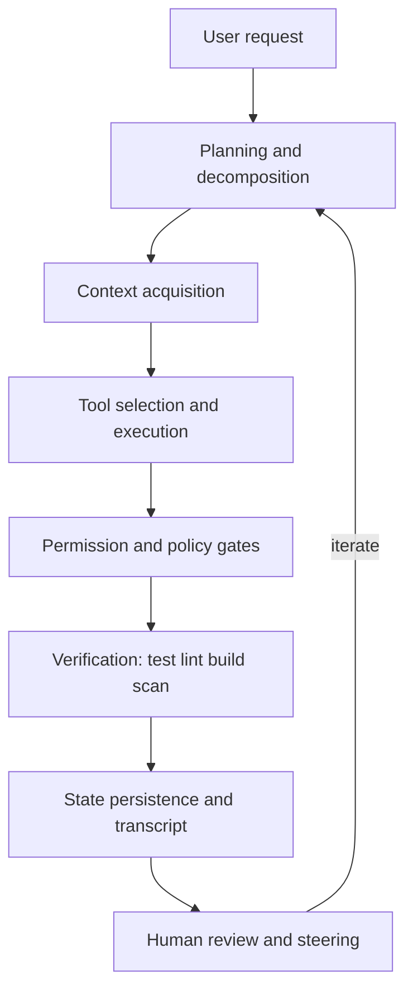

## はじめに

Agent Harness の比較は、製品名や機能一覧を並べるだけでは足りない。実際の導入判断で重要なのは、「どのモデルを積んでいるか」や「ファイル編集できるか」ではなく、作業を安全に実行し、観測し、失敗から戻せる設計になっているかである。

本当に見るべきなのは、次のような問いである。

- どこで実行され、どの状態を持ち、どこまで隔離されるのか
- ツール呼び出しは誰が制御し、どの時点で止められるのか
- コンテキストはどう集められ、どう圧縮され、どう忘れられるのか
- 長時間タスクや並列タスクを、破綻せず追跡できるのか
- 失敗したとき、何を再現し、何を監査し、どこから戻せるのか

この記事では、代表的な商用/OSSプロダクトを、次の 12 軸で比較する。

1. 実行場所（local / cloud / hybrid）
2. オーケストレーションの公開度
3. ツール拡張
4. 権限制御
5. コンテキスト戦略
6. 長時間タスク
7. マルチエージェント
8. Git/PR統合
9. 観測性
10. 企業統制
11. OSS透明性
12. 評価容易性

対象は、GitHub Copilot（cloud agent / IDE Agent Mode / CLI sandboxes）、OpenAI Codex、Anthropic Claude Code、Cursor、Cline、Aider、OpenHands、SWE-agent / mini-SWE-agent、そして歴史的参照として Continue である。Continue は 2.0.0 final release 後に公開リポジトリが read-only 化されているため、現行選定の主対象ではなく、OSSエージェントの系譜として扱う。

本稿は 2026-09-10 時点の公開情報に基づく比較である。価格、プラン、制限値、対応モデル、ベータ機能は変化が速いので、導入時は必ず一次情報で再確認してほしい。

また、本稿は製品に固定スコアを付けるランキングではない。各製品がどの設計責務を引き受け、どの責務を利用者側に残しているかを読み解くための技術調査である。

## 先に結論

2026年時点の Agent Harness は、単純な「ローカル vs クラウド」ではなく、次の3つの設計重心で見ると理解しやすい。

| 設計重心 | 代表例 | 最適化対象 | 主なリスク |
|---|---|---|---|
| プラットフォーム統合型 | GitHub Copilot cloud agent, Cursor Cloud Agents, OpenHands Cloud | Issue/PR/監査/権限/課金を組織運用に載せる | プラットフォーム制約、実行時間制限、ロックイン |
| ローカル主導型 | Claude Code, Codex CLI, Cline, Aider, Copilot IDE Agent Mode | 開発者の高速反復、手元の文脈、即時検証 | 権限過多、承認疲れ、監査分散 |
| 研究・評価型 | SWE-agent, mini-SWE-agent, OpenHands SDK | 再現実験、trajectory、ベンチマーク比較 | 日常開発UX、企業統制、運用の作り込み |

ただし、これは製品分類ではなく「使い方の重心」だ。同じ製品でも、CLI、IDE、クラウド、SDKで性質が変わる。たとえば GitHub Copilot cloud agent と IDE Agent Mode は、同じ Copilot ブランドでも、実行責任・監査粒度・待ち時間・人間の関与点がまったく違う。

## Agent Harnessとは何か

ここでいう Agent Harness は、LLM そのものではなく、LLM に開発作業を任せるための実行基盤である。構成要素はおおむね次の通りだ。



この図の中で、各製品がどこを厚く作り、どこをユーザーや組織に委ねているかが比較の本質になる。

## 全体マップ

細部に入る前に、主要プロダクトの性格を圧縮しておく。

| プロダクト | 実行面 | 強い軸 | 注意点 |
|---|---|---|---|
| GitHub Copilot cloud agent | Actions上のクラウド | 8 Git/PR、10 統制、9 監査 | GitHub前提、時間制限、1タスク1PR |
| GitHub Copilot IDE Agent Mode / CLI | ローカルIDE / CLI sandbox | 1 実行、3 MCP、4 権限 | サーフェス差、承認設計 |
| OpenAI Codex | ローカルCLI + cloud/SDK | 4 権限、2 hooks、7 subagents | beta変化、設定運用 |
| Claude Code | CLI/IDE/desktop/web + SDK | 2 hooks、5 memory、7 subagents | 機能が多く統制設計が必要 |
| Cursor | エディタ + Cloud Agents | 3 拡張、8 GitHub連携、10 チーム | 仕様差、商用統制前提 |
| Cline | OSSのIDE/CLI/SDK/kanban | 承認駆動、チェックポイント、モデル自由度 | 自前運用責任、ポリシー設計 |
| Aider | terminal-first | Git安全弁、repo map、軽量性 | 長時間/組織統制/並列化は薄め |
| OpenHands | OSS + Cloud + Enterprise + SDK | 自前プラットフォーム化、クラウド運用 | 運用設計の重さ、Enterpriseはライセンス注意 |
| SWE-agent / mini | 研究/評価向け | trajectory、ベンチ、再現性 | 日常開発UXより実験向け |
| Continue | OSS系譜の参照 | 拡張可能IDEエージェントの先行例 | 現行主選定からは外すのが安全 |

## この12軸の読み方

全軸を順に読む必要はない。まず自分の運用モデルに近い入口から読む。

| 読者 | まず読む軸 |
|---|---|
| GitHub中心の組織 | 1, 4, 8, 9, 10, 12 |
| 少人数プロダクトチーム | 1, 3, 4, 5, 8 |
| 自社エージェント基盤 | 2, 3, 4, 6, 7, 9, 10 |
| 研究・評価 | 5, 7, 9, 11, 12 |

各軸は「判断する問い → 失敗モード → 調査から見えた設計差」の順に読むと迷いにくい。

## 軸1: 実行場所

実行場所は、単に「ローカルかクラウドか」ではない。実務では少なくとも次の5層に分けて見る必要がある。

1. モデル推論がどこで走るか
2. ツール実行がどこで走るか
3. ファイルシステム変更がどこに発生するか
4. ネットワークアクセスがどの境界から出るか
5. セッション状態がどこに保存されるか

GitHub Copilot cloud agent は、GitHub上のエージェントセッションから GitHub Actions ベースの一時環境でリポジトリを操作し、ブランチとPRに成果を落とす。この設計は、組織にとって非常に分かりやすい。変更はPRとして残り、作業はGitHub上のログやコミットに寄る。一方で、GitHub上のリポジトリ、1タスク1ブランチ/PR、セッション時間上限などの境界が設計制約になる。

Codex、Claude Code、Cline、Aider のローカル型は逆だ。ユーザーの作業ディレクトリを直接読んで編集し、ローカルのテストやビルドを即座に回せる。これは圧倒的に速いが、秘密情報、未コミット変更、ローカルサービス、認証済みCLIへのアクセスをどう絞るかが重要になる。

Copilot CLI sandboxes（public preview）や Codex permission profiles（beta）のように、対話型/ローカル寄りの実行にもサンドボックスを挟む設計が増えている。これは「ローカルの速さ」と「クラウドの隔離」を近づける試みだ。たとえば Codex の permission profiles は、filesystem と network を profile として記述し、`:read-only`、`:workspace`、`:danger-full-access` のような姿勢を切り替える。Copilot local sandbox は OS ごとのサンドボックス機構を使い、cloud sandbox ではGitHubホストの一時Linux環境を使う。ただし Codex permission profiles はローカルのサンドボックス化されたコマンド実行の境界であり、MCP server、cloud設定、承認済みescalationなどは別制御になる。

見るべき具体項目:

- ファイル編集はローカル作業ツリーか、隔離されたworktreeか、クラウドcheckoutか
- ネットワークはデフォルトdenyか、ドメインallowlistか、完全許可か
- セッション停止後に状態が残るか、snapshotされるか、完全破棄か
- 途中成果はブランチ/コミット/PRとして残るか、会話ログだけか
- ローカルの `.env`、SSH鍵、Docker socket、クラウドCLI認証へ到達しうるか

失敗モード:

- ローカル型で `~/.ssh` や `.env` を読める状態のまま作業させる
- クラウド型でローカル再現に必要なサービスや秘密情報がなく、テストが通らない
- サンドボックス上では通るが本番CIでは落ちる
- 複数エージェントが同じ作業ツリーを同時編集して競合する

調査から見えた設計差:

- クラウド型は「実行環境、認証、監査、成果物」を同じプラットフォームに寄せる。GitHub Copilot cloud agent はその典型で、実行環境はGitHub Actions側に寄り、成果物はブランチとPRに寄る。
- ローカル型は「作業ディレクトリ、ローカルCLI、未コミット状態、開発者の認証済み環境」をそのまま利用する。反復は速いが、ローカル秘密情報と外部副作用の境界を別途設計しなければならない。
- sandbox型はこの中間で、実行場所そのものより「filesystem境界」「network境界」「状態のsnapshot/破棄」をどう表現するかが本質になる。Codex permission profiles は filesystem/network をプロファイル化し、Copilot sandboxes は local/cloud の実行環境を切り替える。
- Cursor Cloud Agents や OpenHands Cloud は、クラウド実行を単なるリモート実行ではなく、GitHub連携、チーム管理、使用量管理、権限管理と結びついたサービス面として扱う方向に寄っている。

## 軸2: オーケストレーションの公開度

オーケストレーションとは、モデルが次に何をするかを決める制御ループである。ここには大きく4段階ある。

| 公開度 | 形 | 代表例 | 向く用途 |
|---|---|---|---|
| UI主導 | 内部ループはほぼ隠蔽 | Cursor, Copilot IDE | 日常開発、低摩擦導入 |
| CLI主導 | 設定・承認・ログを触れる | Codex CLI, Claude Code, Cline, Aider | 個人/チームの高速反復 |
| SDK主導 | ループをアプリに組み込める | Claude Agent SDK, Cline SDK, OpenHands SDK, Copilot SDK | 自社ワークフローへの組込 |
| 研究構成主導 | YAML/trajectoryで再現 | SWE-agent, mini-SWE-agent | 評価、研究、ベンチ |

公開度が高いほど柔軟だが、責任も増える。たとえば Claude Agent SDK は、Claude Code のツール実行、hooks、subagents、MCP、sessions をアプリから扱える。これは強力だが、プロダクトとして公開するなら、認可、テナント分離、ログ保全、ユーザー同意、失敗時の復旧を自分で設計することになる。

GitHub Copilot cloud agent は逆に、オーケストレーションの細部を隠しつつ、Issue/PR/Actions の運用面に落とす。制御ループの中身を細かく変えるより、組織が受け入れやすい成果物形式に寄せている。

Codex と Claude Code は中間で、hooks や subagents をかなり細かく触れる。Codex hooks は `SessionStart`、`PreToolUse`、`PermissionRequest`、`PostToolUse`、`PreCompact`、`SubagentStart`、`Stop` などのイベントを持つ。ただし現行の Codex hooks は command handler が中心で、`PreToolUse` / `PostToolUse` の対象も Bash、`apply_patch`、MCP tool call などの対応経路に限られ、すべての shell/tool 経路を完全に捕捉するものではない。Claude Code hooks はさらに多く、`InstructionsLoaded`、`ConfigChange`、`FileChanged`、`TaskCreated`、`TaskCompleted`、`WorktreeCreate` など、運用イベントに近い粒度まで扱える。

見るべき具体項目:

- ツール実行前に制御できるか（PreToolUse）
- 権限プロンプト直前に制御できるか（PermissionRequest）
- ツール実行後に結果を検査できるか（PostToolUse）
- 停止直前に「まだ終わっていない」と差し戻せるか（Stop）
- compaction前後に介入できるか
- subagent起動/終了を観測できるか

注意点として、hook event名は製品ごとに異なる。Codex/Claude Code は `PreToolUse` や `PermissionRequest` のような PascalCase 名を使う一方、GitHub Copilot hooks は `sessionStart`、`preToolUse`、`postToolUse`、`agentStop` などの lower camel case 名を使い、公開ドキュメント上は `PermissionRequest` という同名hook typeを持たない。

設計上の勘所:

- UI主導の製品は導入が簡単だが、自社固有の統制を差し込みにくい
- SDK主導の製品は統合しやすいが、マルチテナント/監査/権限の実装責任を負う
- hooks は便利だが、shell script を走らせる以上、それ自体が攻撃面になる

調査から見えた設計差:

- Claude Code は lifecycle event の粒度が非常に細かい。`InstructionsLoaded`、`ConfigChange`、`FileChanged`、`TaskCreated`、`TaskCompleted` まで扱えるため、単なるツール実行制御ではなく、設定変更やタスク完了条件の観測にも踏み込んでいる。
- Codex は hook の対象イベントを整理しつつ、現行では command handler 中心に寄せている。`transcript_path` や `permission_mode` などの入力は実用的だが、全shell経路を完全捕捉する境界ではない。
- GitHub Copilot hooks は repository 配下の `.github/hooks/*.json` と個人hooksを使うが、イベント名や機能範囲はClaude/Codexと一致しない。比較時は名前ではなく「実行前制御」「実行後観測」「停止前差し戻し」の有無で見るべきだ。
- UI主導型は内部ループを隠すが、必ずしも弱いわけではない。Copilot cloud agent のように、内部ループを隠してもPR、ログ、Actions、レビューコメントに成果を落とせれば、組織運用上は十分に制御可能になる。

## 軸3: ツール拡張

ツール拡張は、いま最も急速に収斂している領域だ。MCP が共通語になりつつあるが、「MCP対応」と言っても、実務上はかなり差がある。

比較すべき層は次の通り。

1. transport: stdio / HTTP / SSE / remote executor
2. 認証: bearer token / OAuth / local env / managed secret
3. tool allowlist: サーバ単位か、tool単位か
4. approval: MCP toolごとに自動承認/都度承認/拒否を設定できるか
5. instruction: MCP server instructions をモデルにどう渡すか
6. 配布: 個人設定、リポジトリ設定、チーム/組織配布、marketplace

Codex MCP は stdio と streamable HTTP をサポートし、bearer token や OAuth、tool allowlist/denylist、tool単位の approval mode を設定できる。Claude Code も MCP tools を通常の tool event として hooks で扱え、`mcp__server__tool` 形式で matcher を書ける。Cursor は Customize 画面から plugins, skills, MCPs, subagents, rules, commands, hooks を扱う方向に寄せ、Marketplace/Team Marketplace と組み合わせる。GitHub Copilot は MCP を Copilot Chat、CLI、Copilot app、cloud agent/code review など複数サーフェスへ広げつつ、組織ポリシーと紐づける。

OSS勢では Cline が plugin/MCP/SDK の自由度を強く打ち出している。Aider はMCP中心というより、LLM provider接続、repo map、git統合で軽量に拡張するタイプ。OpenHands はSDKとCloud/Enterpriseで、より「エージェントプラットフォーム」を自前運用する方向に近い。

失敗モード:

- MCP serverを増やしすぎて tool descriptions がコンテキストを圧迫する
- 似た名前のツールが増え、モデルのtool selectionが不安定になる
- OAuth tokenや環境変数が、ローカル/クラウド/サブエージェント間で伝播しない
- plugin bundled hook や MCP server を信頼レビューせずに有効化する

導入時に聞くべき質問:

- このMCPは読み取り専用で十分か
- 書き込みツールは別サーバ/別toolsetへ分離できるか
- toolごとに承認モードを変えられるか
- サーバの instructions は短く、最初の数百文字で自己完結しているか
- チームに配布したあと、誰が更新し、誰が無効化できるか

調査から見えた設計差:

- MCP対応は「外部ツールが呼べる」だけでは比較にならない。Codexのように serverごとの `enabled_tools`、`disabled_tools`、tool単位の approval mode を持つものと、UIやMarketplace中心に配布するものでは運用責任が違う。
- Claude Code は MCP tool を通常のtool eventとして扱えるため、`mcp__server__tool` のような名前でhooksやpermission ruleに載せやすい。これはMCPを「拡張」ではなく「通常ツールの一種」として統制する設計である。
- Cursor は plugins, skills, MCPs, subagents, rules, commands, hooks をCustomize面に集約し、拡張の発見・配布・チーム共有をUI化する方向に寄っている。ここでは拡張性がサプライチェーン管理に近づく。
- Aider はMCP中心ではなく、repo map、git統合、LLM provider接続で軽量に拡張する。OpenHands はSDKとCloud/Enterpriseを通じて、ツール追加をアプリケーション基盤側に寄せる。

## 軸4: 権限制御

権限制御は、Agent Harness の品質が最も露骨に出る軸である。重要なのは「承認ダイアログがあるか」ではない。見るべきなのは、権限がどの層で効いているかだ。

| 層 | 例 | 強み | 限界 |
|---|---|---|---|
| モデル指示 | CLAUDE.md, AGENTS.md, rules | 低コスト、柔軟 | 強制力はない |
| tool allow/deny | allowedTools, disallowedTools, toolsets | 明確で高速 | 条件付き制御に弱い |
| 承認UI | approve/deny prompt | 人間が止められる | 承認疲れ、属人化 |
| hooks | PreToolUse, PermissionRequest | 条件付き制御、監査 | hook自体の安全性が必要 |
| sandbox | filesystem/network profile | 被害半径を技術的に限定 | OS差、設定複雑性 |
| 組織ポリシー | managed settings, enterprise policy | 中央統制 | 導入と運用が重い |

Codex の permission profiles は、filesystem と network の境界をプロファイル化する点で具体的だ。`read`、`write`、`deny` の優先順位、workspace roots、network domain allow/deny、localhost/private network の扱いまで設計できる。Claude Code は permission modes、deny/allow rules、hooks、managed settings、subagentごとの tools/permissionMode を重ねる。GitHub Copilot cloud agent はGitHub側のポリシー、Actions環境、hooks、MCP設定、監査ログと連動する。

Cline のエディタ体験は「every action requires explicit approval」を基本にし、Plan/Act とチェックポイントで人間が差分を確認しやすい方向に寄せる。一方、CLI/headless や Kanban では auto-approve や実験的な権限バイパスを使う運用もあるため、サーフェス別に既定値を確認する。Aider はgitを安全弁にする。編集ごとのコミット、`/undo`、dirty file の事前コミットにより、「戻せる」ことを重視している。

よくある誤解:

- hooks はsandboxではない。hookが止める前に別経路で同じ副作用が起きる場合がある。
- PostToolUse は事後検査であり、副作用を取り消せない。
- instructionは強制ではない。禁止したい操作は permission/sandbox/hook で止める。
- `danger-full-access` や bypass permissions は、短期実験では便利でも組織標準にしてはいけない。

設計の実務パターン:

1. 既定は read-only または workspace-write no-network
2. ネットワークはドメインallowlistから始める
3. `.env`, keys, cloud credentials, package manager hooks はdeny
4. 対応製品では destructive command を PreToolUse 相当でブロック
5. deployment, migration, production DB は PermissionRequest 相当または承認UIで人間承認
6. Stop hook で「テスト未実行のまま完了」を止める

調査から見えた設計差:

- 権限制御は単一機能ではなく、instruction、tool allow/deny、承認UI、hook、sandbox、managed policy の積層でできている。強い製品はこの層を混同せず、それぞれに役割を持たせている。
- Codex permission profiles はローカルコマンド実行の filesystem/network 境界を明示的な設定データとして扱う。`deny` が `write` や `read` を上書きする、workspace rootsへ相対適用する、といった構造がある。
- Claude Code はpermission mode、rules、managed settings、subagentごとのtools/permissionModeを組み合わせる。さらにhooksで条件付き制御を足せるため、静的allowlistと動的検査を分けて設計できる。
- Aider は強制的なsandboxより、git commitとundoによる復旧性を安全弁にする。Cline は承認とcheckpointを中心に、人間が差分を見て止める設計に寄せる。
- GitHub Copilot cloud agent はGitHub側の権限、Actions環境、repository settings、MCP設定、hooks、監査ログにまたがる。content exclusions がcloud agentの境界にならない点は特に重要である。

## 軸5: コンテキスト戦略

コンテキスト戦略は、モデルの賢さを左右するだけでなく、コスト、速度、セキュリティ、再現性にも直結する。

主な方式は次の5つ。

1. リポジトリ全体の構造要約
2. 検索/grep/semantic searchによる局所取得
3. 明示的なrules/instructions
4. 長期memory
5. compaction / summarization

さらに一段深く見るなら、コンテキスト戦略は次のようなデータ構造の組み合わせとして捉えられる。これは各製品の厳密な内部実装そのものではなく、比較のために正規化したモデルである。

```typescript
type ContextLayer =
    | InstructionLayer
    | RepoMapLayer
    | RetrievalLayer
    | MemoryLayer
    | TranscriptLayer
    | CompactionLayer
    | SubagentLayer
    | ToolMetadataLayer;

type ContextItem = {
    id: string;
    source: "repo" | "memory" | "rule" | "tool" | "transcript" | "mcp";
    scope: "user" | "project" | "local" | "managed" | "session" | "subagent";
    content: string;
    tokenEstimate: number;
    freshness: "startup" | "lazy" | "live" | "compacted" | "stale-risk";
    authority: "hint" | "instruction" | "policy" | "evidence";
};
```

この `ContextItem` で重要なのは、`content` そのものよりも `source`、`scope`、`freshness`、`authority` だ。たとえば CLAUDE.md や AGENTS.md は `authority: "instruction"` だが強制ではない。deny rule や sandbox policy は context ではなく enforcement であり、別レイヤーに置くべきである。tool output は `authority: "evidence"` だが、古い transcript 由来なら `freshness: "stale-risk"` になる。

### リポジトリマップ

Aider の repo map は、コンテキストを「ファイル全文」ではなく「シンボルグラフ」として圧縮する代表例だ。構造としては、概念的に次のような形になる。

```typescript
type RepoMap = {
    files: FileNode[];
    edges: DependencyEdge[];
    tokenBudget: number;
};

type FileNode = {
    path: string;
    symbols: SymbolDef[];
    rank: number;
};

type SymbolDef = {
    name: string;
    kind: "class" | "function" | "method" | "type" | "constant";
    signature?: string;
    keyLines: string[];
    references: number;
};

type DependencyEdge = {
    from: string;
    to: string;
    kind: "imports" | "calls" | "references";
    weight: number;
};
```

Aider は tree-sitter で定義や参照を抽出し、ファイルをnode、依存関係をedgeとするグラフランキングで重要部分を選ぶ。`--map-tokens` のような token budget は、このグラフからどの `SymbolDef.keyLines` をプロンプトに入れるかを決める制約になる。ここでの設計差は、検索精度だけでなく「どの情報を捨てるか」に出る。

### 指示・ルール・メモリ

Claude Code の CLAUDE.md / `.claude/rules/` / auto memory は、だいたい次の3種類のデータ構造に分けられる。

```typescript
type InstructionFile = {
    path: string;
    scope: "managed" | "user" | "project" | "local";
    loadMode: "startup" | "lazy-by-path" | "imported";
    pathGlobs?: string[];
    content: string;
};

type MemoryIndex = {
    entrypoint: "MEMORY.md";
    loadedPrefixLimit: { lines: 200; bytes: 25_000 };
    topics: Array<{ path: string; summary: string; lastTouched?: string }>;
};

type MemoryNote = {
    topic: string;
    fact: string;
    evidence?: string;
    staleWhen?: string;
};
```

ポイントは、`InstructionFile` は起動時/遅延ロード時に context window に入るが、`MemoryNote` の詳細ファイルは必要に応じて読まれることだ。したがって、memoryは単なる「長期記憶」ではなく、`MEMORY.md` をインデックスとして使う小さな知識ベースに近い。ここで `staleWhen` のような棚卸し条件を持てないと、古い学習が残り続ける。

### Transcript と trajectory

コンテキスト戦略を評価するなら、会話履歴の構造も見る必要がある。Claude Code や Codex の hooks は `session_id`、`transcript_path`、`tool_name`、`tool_input` などを渡す。mini-SWE-agent は `.traj.json` に `info` と `messages` を保存し、SWE-agent は `(thought, action, observation)` のtrajectoryを保存する。

正規化すると、実行履歴は次のように扱える。

```typescript
type AgentTranscript = {
    sessionId: string;
    messages: AgentMessage[];
    artifacts: ArtifactRef[];
};

type AgentMessage = {
    role: "system" | "user" | "assistant" | "tool" | "exit";
    content?: string;
    toolCalls?: ToolCall[];
    extra?: {
        cost?: number;
        timestamp?: number;
        returncode?: number;
        actions?: Array<{ command: string }>;
        response?: unknown;
    };
};

type ToolCall = {
    id: string;
    name: string;
    input: unknown;
    output?: unknown;
    approvalState?: "auto" | "prompted" | "approved" | "denied";
};

type ArtifactRef = {
    kind: "file" | "patch" | "log" | "pr" | "screenshot";
    uri: string;
    hash?: string;
};
```

この構造を持つと、「どのファイルを読んでから編集したか」「どのtool resultが最終判断に影響したか」「compaction後にどの証拠が失われたか」を評価しやすい。

### Compaction と subagent context

compaction は単なる要約ではなく、履歴を「次の推論に残す状態」へ変換する処理だ。Claude Code の subagent では、subagent transcript がメイン会話とは別に残り、compaction boundary には `trigger` や `preTokens` のようなメタデータが残る。

```typescript
type CompactionRecord = {
    trigger: "manual" | "auto";
    preTokens?: number;
    summary: string;
    preservedFacts: string[];
    droppedArtifacts: ArtifactRef[];
};

type SubagentContext = {
    agentId: string;
    agentType: string;
    parentSessionId: string;
    startupContext: {
        systemPrompt: string;
        taskMessage: string;
        inheritedInstructions: boolean;
        inheritedGitStatus: boolean;
        preloadedSkills: string[];
    };
    transcriptPath?: string;
};
```

ここで見るべき差分は、subagent が fresh context で始まるのか、fork のように親会話を引き継ぐのか、探索結果を要約だけ返すのか、transcript全体をresumeできるのか、である。コンテキスト汚染を避けるには fresh context が有利だが、説明コストは増える。fork は逆に説明コストを下げるが、親会話のノイズも継承する。

### MCP tool metadata

MCP は「外部ツールを呼べる」だけではなく、tool metadata を context としてモデルに渡す仕組みでもある。比較時は、少なくとも次の構造を見る。

```typescript
type McpServerContext = {
    name: string;
    transport: "stdio" | "http" | "sse";
    instructions?: string;
    tools: Array<{
        name: string;
        description: string;
        inputSchema: unknown;
        approvalMode?: "auto" | "prompt" | "approve";
        enabled: boolean;
    }>;
};
```

`instructions` と `tools[].description` は、モデルの tool selection に直接効く。長すぎる説明、似た名前のtool、未使用toolの大量登録は、コンテキスト消費と誤選択を増やす。したがって、MCP導入時は「toolが動くか」だけでなく、「tool metadata がどれだけcontext windowを消費し、どれだけ誤選択を誘発するか」を調査すべきだ。

Aider の repo map はこの軸で非常に特徴的だ。リポジトリの主要なファイル、クラス、関数、シグネチャを簡潔なmapにして、依存グラフのランキングで重要部分を選ぶ。これにより、LLMは全ファイルを読む前に「どのファイルが重要そうか」を把握できる。

Claude Code は CLAUDE.md、`.claude/rules/`、auto memory、subagent memory、compaction を組み合わせる。重要なのは、CLAUDE.md と auto memory は「context」であり「enforcement」ではないことだ。強制したい場合は hooks や permissions を使う。auto memory は便利だが、内容を棚卸しできなければ、古い学習がチーム標準と衝突する。

Codex は AGENTS.md や rules、hooks、session transcript、subagent contextを持つ。GitHub Copilot cloud agent は repository instructions、Copilot Memory（対応プラン/preview条件で有効な場合）、MCP経由のIssues/PR/履歴などがコンテキスト源になる。Cursor は rules, skills, subagents, MCP, plugins を Customize 画面に集約する方向だ。

見るべき具体項目:

- 起動時に必ず入るcontextは何か
- ファイルアクセスで遅延ロードされるrulesはあるか
- memoryは誰が書き、誰が消せるか
- compaction後に何が残り、何が落ちるか
- subagentが親会話のcontextを持つか、fresh contextで始まるか
- large repoで重要ファイルの発見精度をどう上げるか

失敗モード:

- CLAUDE.mdが長すぎて、重要ルールの遵守率が下がる
- memoryに古いbuild commandが残り、毎回失敗する
- path-specific rulesが読み込まれていないのに、読み込まれた前提で作業する
- subagentに必要な文脈を渡さず、探索をやり直す
- compactionで根拠や未完了TODOが落ちる

調査から見えた設計差:

- コンテキスト戦略は「何を入れるか」より「何を入れないか」の設計で差が出る。Aider はrepo mapでsymbol-levelの要約を作り、Claude Codeはinstructions/memory/subagentで文脈を分離し、SWE-agent系はtrajectoryで後から再現できる履歴を残す。
- rulesやmemoryは、単なるテキストファイルではなく `scope` と `loadMode` を持つデータ構造として見ると比較しやすい。起動時に入る情報、ファイルアクセスで遅延ロードされる情報、compaction後に再注入される情報は別物である。
- transcriptやtrajectoryは、モデルへの入力であると同時に、後から失敗を分析するためのデータセットでもある。mini-SWE-agent の `.traj.json` のように config、messages、cost、submission を一緒に保存する形式は、評価容易性にも直結する。
- MCP tool metadata は隠れたコンテキスト消費源である。tool description、input schema、server instructions が長いほど、モデルは多くの選択肢を抱える。コンテキスト戦略では、外部ツールの数だけでなく、metadataの密度も管理対象になる。

## 軸6: 長時間タスク

長時間タスクで重要なのは、モデルが長く考えられるかではなく、作業を分割し、待ち、再開し、観測できるかである。

GitHub Copilot cloud agent はバックグラウンドで作業し、ブランチやPRに成果を残す。GitHub上で開始・追跡・コメントによる反復ができる一方、セッション時間制限や1リポジトリ/1ブランチ/1PRの制約を意識する必要がある。

Claude Code は CLI/desktop/web/IDE など複数サーフェスにまたがり、background agents、scheduled tasks、subagents、hooks、Agent SDK/Managed Agents など長時間化の選択肢が多い。Stop hooks や TaskCompleted hooks で「終わってよい条件」を定義できる点も強い。

Codex は subagents や non-interactive execution、hooks、cloud連携で長時間作業を支える。Cline は長時間プロセスの出力を監視し、dev serverやtest watcherの出力に反応する方向が強い。OpenHands Cloud/Enterprise は、エージェントをサービスとして長時間・多人数・多タスクに拡張する方向。Aider は対話的なterminal pair programming寄りで、長時間非同期運用は主戦場ではない。

長時間タスクで見るべきこと:

- idle時に自動終了するのか、resumeできるのか
- dev serverやwatcherの出力を継続監視できるか
- API rate limitやtool failure時にどうリトライするか
- 途中状態はtranscript/branch/task boardに残るか
- user steeringが途中で効くか

失敗モード:

- 1ターンで巨大タスクを抱え、context rotが起きる
- 長時間テストを同期hookで実行し、エージェント全体を止める
- バックグラウンドタスク完了後の結果がモデルに戻らない
- クラウド環境の時間制限で中途半端なブランチが残る

調査から見えた設計差:

- 長時間タスクの本質は「長く動くこと」ではなく、途中状態をどのデータ構造に退避するかである。GitHub Copilot cloud agent はブランチ/PR/ログへ、Claude CodeやCodexはtranscript/session/subagentへ、OpenHandsはCloud/Enterpriseのセッション管理へ寄せる。
- watcher型の長時間実行とcloud PR型の長時間実行は性質が違う。前者はstdout/stderrやdev serverの継続監視が中心で、後者はbranchやPRへの状態保存が中心になる。
- hooksで長時間処理を同期実行すると、エージェントの推論ループ自体を詰まらせる。Claude Code の async hook のように、完了後の追加contextとして戻す設計は、長時間検証と対話継続を分離するための重要なパターンである。
- Aiderのようなterminal-first設計は、長時間非同期基盤よりも短いgit-backed反復に寄る。これは弱点というより、最適化している作業単位が違うと見るべきである。

## 軸7: マルチエージェント

マルチエージェントは、単なる並列化ではない。価値が出るのは、タスク分解の境界が明確で、各エージェントの権限と成果物が分離され、最後に統合できる場合だけだ。

Claude Code の subagents は、context isolation が強い。ExploreやPlanのような組み込みsubagentは読み取り中心で、探索出力をメイン会話に溢れさせない。custom subagentでは tools、disallowedTools、model、permissionMode、mcpServers、hooks、memory、background、isolation: worktree などを指定できる。forkは親会話を引き継ぐため、説明コストは低いが、context isolationの利点は弱まる。

Codex subagents は、明示的に依頼したときにspawnし、sandbox policyを継承し、並列調査やCSV batchのような実験的ワークフローにも向く。Cline は SDK の subagents や Kanban（Research Preview）で、カード単位・worktree単位の並列作業を志向する。Copilot CLI の複数cloud sandbox session、GitHub cloud agentの複数セッション、Cursor Cloud Agents も、並列作業の入口になる。

良い分解例:

- security reviewer / docs researcher / code mapper の並列レビュー
- frontend reproduction / backend trace / test fixer の分担
- 100ファイルの同型監査を1ファイル1workerで実行

悪い分解例:

- 複数エージェントが同じファイルを編集する
- 仕様が固まっていないのに実装を並列化する
- 誰が最終判断するか決めずにレビューだけ増やす

設計時に決めること:

- coordinatorは誰か
- workerは読み取り専用か、編集可能か
- workerごとのコンテキストはfreshかforkか
- 成果物はdiffか、reportか、PRか
- 統合時の衝突を誰が解くか

調査から見えた設計差:

- マルチエージェントは、並列数ではなく context isolation の設計で差が出る。Claude Code の named subagent はfresh contextで始まり、forkは親会話を継承する。Codex subagents は親のsandbox policyやruntime overrideを引き継ぐ。どの継承を許すかが設計の核心になる。
- subagent定義は、`name`、`description`、`tools`、`model`、`permissionMode`、`mcpServers`、`hooks`、`memory` などを持つ小さな実行プロファイルとして見られる。これは単なるプロンプト分割ではなく、権限と文脈の分割でもある。
- Cline KanbanやCursor Cloud Agentsのようなタスクボード型は、並列作業をUI上の作業単位に写像する。研究系のSWE-agent/mini-SWE-agentは、batchやtrajectoryを通じて並列実験の再現性に寄る。
- fan-outはコスト、latency、統合作業を増やす。調査から見る限り、成功しやすいのは「探索」「レビュー」「同型監査」の並列化であり、同じファイルを複数エージェントが編集する並列化は破綻しやすい。

## 軸8: Git/PR統合

Agent Harness が実務に乗るかは、最後に「レビュー可能な差分」へ落ちるかで決まる。

Aider はgit統合が最も分かりやすい。編集ごとに自動コミットし、dirty fileを事前に分離し、`/diff`、`/undo`、`/commit` で差分を扱える。これは軽量だが強い安全弁だ。Cline はIDE上でdiff review、checkpoint、revertを重視する。Claude Code はgit操作、commit、PR作成、worktree isolation、hooksと組み合わせる。GitHub Copilot cloud agent はbranch作成、commit、PR作成、レビューコメントによる反復までGitHub上に寄せる。

ここで見るべきは、単にPRを作れるかではない。

見るべき具体項目:

- dirty worktreeをどう扱うか
- エージェントの変更と人間の変更を分離できるか
- commit author/committer attributionは明確か
- branch protectionやrequired checksと衝突しないか
- PR本文、テスト結果、根拠リンクを自動で残せるか
- 途中で人間が引き継げるか

GitHub Copilot cloud agent の強みは、作業が最初からGitHubの協業モデルに載ることだ。一方で、GitHub以外のVCSや、複数リポジトリ横断変更には向きにくい。Cursor GitHub integration はGitHub App経由でrepository access、PR、issues、checks/actions、branch protectionなどに関わる。EnterpriseではGitHub Enterprise Server、IP allowlist、PrivateLink/Cloudflare Tunnelのような接続方式も論点になる。

失敗モード:

- エージェントが人間の未コミット変更を上書きする
- PRは作るが、なぜその変更をしたかの根拠が残らない
- branch protectionのためにエージェントPRがmergeできない
- 生成コミットが大きすぎてレビュー不能になる
- rollback手順がgit履歴に依存しすぎ、DBや外部状態を戻せない

調査から見えた設計差:

- Git/PR統合は、差分生成ではなく「変更の由来をどこまで説明できるか」で差が出る。PR本文、commit分割、テスト結果、関連Issue、エージェントの作業ログがつながっているほどレビューしやすい。
- Aider はgit commitを小さな復旧単位として使う。これはPRプラットフォーム統合より軽量だが、ローカル作業の安全弁として強い。GitHub Copilot cloud agent は逆に、最初からGitHubのbranch/PR/review commentに作業を寄せる。
- Claude Code の worktree isolation や subagent worktree は、同じリポジトリ内で複数案を並べるときの衝突回避に効く。Cursor/GitHub連携はGitHub App権限、branch protection、checks/actionsとの関係まで含めて設計される。
- 外部状態を伴う変更、たとえばDB migrationやクラウドリソース変更は、Gitのrollbackだけでは戻らない。Git/PR統合が強い製品でも、外部副作用の記録と復旧手順は別途必要になる。

## 軸9: 観測性

観測性は、導入後に差が出る。デモでは成功しても、本番では「なぜそのコマンドを実行したのか」「誰が承認したのか」「どのMCP toolがどの引数で呼ばれたのか」を追えなければ運用できない。

観測すべきイベントは少なくとも次の通り。

- session start/end
- user prompt
- tool request / approval / denial
- tool output / failure
- file edit
- command execution
- subagent start/stop
- compaction
- memory load/write
- config change
- PR/commit/check status

Claude Code hooks は prompt_id、session_id、transcript_path、tool_name、duration_ms、subagent transcript など、かなり細かい観測点を持つ。Codex hooks も session_id、turn_id、permission_mode、transcript_path、model、tool input/output などを渡す。Cline Enterprise は OpenTelemetry, Datadog, Grafana, Splunk integrations を打ち出している。GitHub Copilot cloud agent はGitHub上のログ、PR、Actions、usage metrics、audit logとの親和性が強い。

重要なのは、会話ログと監査ログを混同しないことだ。会話ログはモデルの文脈復元に役立つが、監査ログには改ざん耐性、検索性、保持期間、個人情報/秘密情報のマスキングが必要になる。

設計の実務パターン:

- tool callはJSONLで保存する
- approval/denyはユーザーID、理由、時刻、対象toolを残す
- shell stdout/stderrは大きすぎるため要約と原本への参照を分ける
- secret scan後に保存するログからもsecretを除去する
- session_idとPR番号、commit SHAを紐づける

調査から見えた設計差:

- Claude Code と Codex は、hooks入力として `session_id`、`transcript_path`、`tool_name`、`tool_input` などを渡すため、ローカルにも詳細な観測点を作れる。GitHub Copilot cloud agent は、GitHub上のPR、Actions、監査ログ、usage metricsと自然に結びつく。
- 観測性の中核データは `session_id`、`user_id`、`tool_name`、`tool_args_hash`、`approval_state`、`artifact_ref`、`commit_sha` のようなjoin keyである。これがないと、会話ログ、tool call、PR、CI結果を横断して追跡できない。
- 会話transcriptは監査ログではない。transcriptはモデル文脈の復元に向くが、監査には改ざん耐性、保持期間、検索性、secret redaction、承認者情報が必要になる。
- Cline Enterprise やOpenHands Cloud/Enterpriseのような商用/Enterprise面は、OpenTelemetryや外部監視基盤、使用量レポートに接続する方向に寄る。OSS/ローカル系は、ログスキーマを利用者が設計する余地が大きい。

## 軸10: 企業統制

企業統制は、個人利用では見えにくいが、組織導入では最重要になる。

見るべき領域:

1. ID/SSO/RBAC
2. モデル許可/禁止
3. MCP server allowlist/denylist
4. hooks/permissionsのmanaged config
5. ネットワーク制限
6. 監査ログ
7. コスト/予算管理
8. データ保持とリージョン
9. PR/branch protectionとの整合
10. 開発者端末のMDM/Intune等との連携

GitHub Copilot cloud agent は、GitHub Enterprise/Businessのポリシー、GitHub Actions、MCP repository settings、usage metrics、AI credits、GitHub App/audit logと接続しやすい。Copilot cloud/local sandboxでは、local sandbox policyやcloud sandbox access policyも論点になる。

ただし、GitHub Copilot の content exclusions は cloud agent には適用されない。除外設定を cloud agent のアクセス境界として扱うと、除外したつもりのファイルを見られる/更新されるリスクが残る。

Claude Code は managed settings、managed CLAUDE.md、availableModels、MCP allow/deny、hooks、permissions など、端末側統制が厚い。Codex も managed requirements.toml や permission profiles、managed hooks の方向がある。Cursor はTeam/EnterpriseでGitHub integration、Protected Git Scopes、Private Connectivity、Marketplace/Team Marketplace、Cloud Agents/Bugbotなどの組織機能を持つ。OpenHands Cloud/Enterprise はRBAC、permissions、usage reporting、budgeting enforcement、多人数対応を前面に出す。Cline EnterpriseもSSO、RBAC、model/tool controls、remote configuration、observabilityを掲げる。

一方、Aiderやmini-SWE-agentのようなOSS/研究寄りツールは、軽量性や再現性の代わりに、企業統制は利用者側で組む必要がある。

導入時に決めること:

- 誰がエージェントを有効化できるか
- どのリポジトリで使えるか
- どのモデルを使えるか
- どのMCP serverを使えるか
- 誰がhooksを配布・更新できるか
- 予算超過時に止めるのか、モデルを落とすのか
- 監査ログを何日保持するか

失敗モード:

- 個人が勝手にMCP serverを追加し、内部データが外部toolへ流れる
- BYOKで個人API keyが散在する
- hooksがローカルにしかなく、チームで同じ制御が効かない
- 監査ログより会話ログの保持期間が短く、調査不能になる
- コスト上限がなく、subagent fan-outで急増する

調査から見えた設計差:

- 企業統制は、エージェント単体の機能ではなく、ID、repo scope、model policy、MCP allowlist、hook配布、network boundary、budget、audit retention の合成である。
- GitHub Copilot はGitHub組織の権限モデルに寄り、CursorはGitHub AppやProtected Git Scopes、Private Connectivityに寄る。Claude Code/Codexはmanaged settingsやrequirementsで端末/CLI側に統制を配る。OpenHands/Cline Enterpriseは自社サービスとしてRBACやusage reportingを前面に出す。
- OSS系を企業で使う場合、軽量さの裏返しとして、SSO/RBAC、ログ保全、例外申請、緊急停止、コスト制御の設計を自前で持つ必要がある。
- 調査で特に重要だったのは、ポリシーの「配布経路」である。個人設定、リポジトリ設定、チームmarketplace、managed config、MDM配布では、更新速度と強制力がまったく違う。

## 軸11: OSS透明性

OSS透明性は、「無料で使えるか」ではなく「検証・改変・監査できるか」で見るべきだ。

比較する観点:

- ライセンスは何か
- core runtimeがOSSか、UIだけOSSか
- enterprise機能はsource-availableかclosedか
- tool executionやpermission logicを読めるか
- release cadenceとメンテナンス状態は健全か
- forkして社内policyを入れられるか
- telemetryや認証の挙動を追えるか

Cline、Aider、OpenHands core、SWE-agent/mini-SWE-agent は、OSS透明性が高い。ClineはSDK/CLI/IDE/kanbanのコアを見られる。Aiderはgit統合やrepo mapの挙動を追いやすい。OpenHandsはcoreやagent-serverはMITだが、Enterpriseディレクトリは別ライセンスである点に注意が必要。SWE-agentはMITで研究起点、trajectoryやbatch/evalの設計を追いやすい。

Continue は歴史的には重要なOSS coding agentだが、現状は final 2.0.0 release 後、read-only/non-active maintenance と明示されている。現行導入の主候補というより、設計系譜やfork元として見るのが妥当だ。

OSSを選ぶときの現実:

- 自由度は高い
- provider/modelの切替もしやすい
- ただし、SSO/RBAC/監査/予算/インシデント対応は自分たちの責任になる
- セキュリティレビューも自分たちの責任になる

closed製品はコード可視性の代わりに、監査ログexport、設定export、データ保持説明、第三者認証、インシデント時の証跡取得可否で比較する。

調査から見えた設計差:

- OSS透明性は、コードが読めることだけではない。tool execution、permission check、prompt assembly、memory保存、telemetry、provider認証の経路まで追えるかが重要である。
- Cline、Aider、OpenHands core、SWE-agent/mini-SWE-agent は、内部挙動をコードで追いやすい。一方で、Enterprise機能やCloud運用は別ライセンスや商用契約になることがある。
- closed製品ではコード透明性の代替として、監査ログexport、設定export、データ保持説明、第三者認証、インシデント時の証跡取得可否を見る必要がある。
- Continue はOSSエージェントの歴史的参照として価値があるが、read-only化された現状では、現行導入候補というより設計パターンやfork元として読むのが自然である。

## 軸12: 評価容易性

評価容易性は、エージェント導入を「雰囲気」から「改善可能な工学」に変える軸だ。

評価には3段階ある。

1. ベンチマーク評価: SWE-bench, ProgramBench, 社内課題セット
2. 運用評価: lead time, intervention count, rollback rate, defect escape
3. 失敗分析: trajectory, transcript, tool call log, root-cause taxonomy

SWE-agent/mini-SWE-agent はこの軸で強い。SWE-benchやbatch mode、trajectory inspector、output files、yaml configなど、評価と再現のための道具が揃っている。mini-SWE-agent は「同等性能でより単純・柔軟」と説明され、現行の研究/評価用途では第一候補にしやすい。

Aider は独自のLLM leaderboardを持ち、編集能力の比較に使える。GitHub Copilot cloud agent はPR outcomes、merge率、time-to-mergeなど組織運用データと接続しやすい。Claude/Codex/Cline/Cursorのような開発者向けハーネスは、公式ベンチだけでは見えない実リポジトリ上の文脈取得、承認、復旧、レビュー品質を別途見なければならない。

良い評価セットの条件:

- 実際の過去Issueから作る
- 正解がテスト/レビューで判定できる
- 小/中/大のタスクを混ぜる
- 読み取りだけ、単一ファイル修正、複数ファイル修正、調査、リファクタを分ける
- 成功/失敗だけでなく、介入回数と根拠品質を見る

避けるべき評価:

- 1つのデモタスクだけで決める
- モデルとハーネスを分離せず比較する
- 人間のレビュー時間を測らない
- 成功したPRだけを見る
- セキュリティ/権限失敗を評価から外す

可能な範囲で同じモデル、同じタスク、同じ権限、同じMCP構成に揃え、揃えられない差分を記録したうえで、失敗原因を model reasoning、context retrieval、permission block、tool failure、human handoff に分類する。

調査から見えた設計差:

- SWE-agent/mini-SWE-agent は、trajectoryを第一級の成果物として扱う。`thought`、`action`、`observation`、`state`、`query`、または `.traj.json` の `info`、`messages`、`extra` といった構造が、失敗分析と再現実験の土台になる。
- GitHub Copilot cloud agent は、評価対象が個々の会話ではなくPR lifecycleへ寄る。PR作成、レビュー、CI、mergeといった既存の開発データに統合できる点が強い。
- Aider は編集ベンチやleaderboardを持つが、組織運用の評価軸とは別物である。編集能力、レビュー可能性、監査可能性は分けて見る必要がある。
- 評価容易性の本質は、成功率ではなく失敗分類にある。model reasoning、context retrieval、permission block、tool failure、human handoff、external environment のどこで失敗したかを分けられるハーネスほど改善しやすい。

## 12軸をまとめた選定フレーム

最終的には、次のように選ぶのが現実的だ。

### GitHub中心の組織開発

第一候補:

- GitHub Copilot cloud agent
- 補助として Copilot IDE Agent Mode / Codex / Claude Code / Cursor

重点軸: 1 実行場所、4 権限制御、8 Git/PR統合、9 観測性、10 企業統制、12 評価容易性

採用しやすい条件:

- 開発の大半がGitHub Issue/PRで回っている
- 監査と権限統制が重要
- PR単位で成果をレビューできる
- GitHub Actionsでテスト/ビルドが完結する

避ける条件:

- 複数VCS/複数リポジトリを一括変更する必要がある
- 主要タスクが長時間ジョブ中心
- ローカル専用依存が多い

### 高速な少人数プロダクトチーム

第一候補:

- Claude Code
- Codex CLI
- Cursor
- Cline
- Aider

重点軸: 1 実行場所、3 ツール拡張、4 権限制御、5 コンテキスト戦略、8 Git/PR統合

採用しやすい条件:

- 意思決定者と実装者が近い
- ローカルでテストがすぐ回る
- rollbackをgitで管理できる
- 承認疲れより速度が価値になる

避ける条件:

- 厳格な職務分掌や中央監査が必須
- 開発者端末に強いsecretが多い
- local-only policyが整備できない

### エージェント基盤を自社運用したいチーム

第一候補:

- OpenHands SDK/Cloud/Enterprise
- Cline SDK
- Claude Agent SDK
- Copilot SDK

重点軸: 2 オーケストレーション、3 ツール拡張、4 権限制御、6 長時間タスク、7 マルチエージェント、9 観測性、10 企業統制

採用しやすい条件:

- 既存の内製ポータルやチケットシステムへ統合したい
- 複数ユーザー/複数テナントのagent runtimeを作りたい
- hooks, tools, MCP, telemetryを自社仕様に合わせたい

避ける条件:

- 運用チームがない
- sandbox/session/auditを自前で保守できない
- 既製UIで十分

### 研究・評価基盤

第一候補:

- mini-SWE-agent
- SWE-agent
- OpenHands benchmarks / SDK

重点軸: 5 コンテキスト戦略、7 マルチエージェント、9 観測性、11 OSS透明性、12 評価容易性

採用しやすい条件:

- trajectoryを保存して失敗分析したい
- モデル比較やプロンプト比較をしたい
- 再現性が速度より重要

避ける条件:

- 日常開発UXが最優先
- 非技術者も使う
- 監査/SSO/RBACをすぐ要求される

## 横断的な調査結果

12軸を通して見ると、Agent Harness の進化は次の方向に集約されている。

1つ目は、context と enforcement の分離である。CLAUDE.md、AGENTS.md、rules、memory、repo map、MCP metadata はモデルに与える文脈であり、操作を強制的に止める仕組みではない。強制にはpermission、sandbox、hook、managed policyが必要になる。この分離が明確な製品ほど、挙動を説明しやすい。

2つ目は、transcript/trajectory の重要性である。エージェントが何を読んだか、どのtoolを呼んだか、どの観測結果を得たか、どこでcompactionされたかが残るほど、失敗を後から分析できる。SWE-agent系はこの思想を研究向けに徹底しており、Claude/Codexはhooksやtranscript_pathを通じて運用側に露出している。

3つ目は、拡張性がサプライチェーン問題になっていることだ。MCP server、plugin、skill、hook、subagent は便利だが、増えるほどtool metadata、認証情報、承認境界、配布経路、更新責任が増える。拡張性は「増やせること」ではなく「安全に減らせること」まで含めて見る必要がある。

4つ目は、クラウド型とローカル型の差が、実行場所だけでなく成果物モデルの差になっていることだ。クラウド型はPR、branch、task board、usage reportに寄り、ローカル型はworking tree、terminal output、git commit、transcriptに寄る。どちらが優れているかではなく、どの成果物を組織がレビュー・監査・保管したいかで選ぶべきである。

## 再現可能性ノート（2026-09-10 検証スナップショット）

本稿の主張を更新する場合は、次の順で確認する。

1. 対象製品の実行面（CLI/IDE/cloud/SDK）を分ける
2. 12軸のうち、更新対象の軸だけを確認する
3. 公式ドキュメントの制限値・ベータ注記・プラン条件を確認する
4. 比較表と該当節だけを更新し、検証日を変える

<details>
<summary>主要な一次情報</summary>

- GitHub Copilot cloud agent: [About GitHub Copilot cloud agent](https://docs.github.com/en/copilot/concepts/agents/cloud-agent/about-cloud-agent)
- GitHub Copilot sandboxes: [About cloud and local sandboxes for GitHub Copilot](https://docs.github.com/en/copilot/concepts/about-cloud-and-local-sandboxes)
- GitHub Copilot hooks: [About hooks for GitHub Copilot](https://docs.github.com/en/copilot/concepts/agents/hooks)
- GitHub Copilot MCP: [About Model Context Protocol](https://docs.github.com/en/copilot/concepts/context/mcp)
- OpenAI Codex permissions: [Codex permissions](https://learn.chatgpt.com/docs/permissions)
- OpenAI Codex hooks: [Codex hooks](https://learn.chatgpt.com/docs/hooks)
- OpenAI Codex MCP: [Codex MCP](https://learn.chatgpt.com/docs/extend/mcp?surface=cli)
- OpenAI Codex subagents: [Codex subagents](https://learn.chatgpt.com/docs/agent-configuration/subagents)
- Claude Code overview: [Claude Code overview](https://code.claude.com/docs/en/overview)
- Claude Code memory: [Claude Code memory](https://code.claude.com/docs/en/memory)
- Claude Code hooks: [Claude Code hooks](https://code.claude.com/docs/en/hooks)
- Claude Code subagents: [Claude Code subagents](https://code.claude.com/docs/en/sub-agents)
- Claude Agent SDK: [Claude Agent SDK overview](https://code.claude.com/docs/en/agent-sdk/overview)
- Cursor docs: [Cursor documentation](https://cursor.com/docs)
- Cursor customization: [Customize Cursor](https://cursor.com/docs/customize-cursor)
- Cursor GitHub integration: [Cursor GitHub integration](https://cursor.com/docs/integrations/github)
- Cline docs: [Cline documentation](https://docs.cline.bot/)
- Cline CLI: [Cline CLI Overview](https://docs.cline.bot/usage/cli-overview)
- Cline SDK: [Cline SDK](https://docs.cline.bot/sdk/overview)
- Aider git integration: [Aider git integration](https://aider.chat/docs/git.html)
- Aider repo map: [Aider repository map](https://aider.chat/docs/repomap.html)
- Aider repo map internals: [Building a better repository map with tree-sitter](https://aider.chat/2023/10/22/repomap.html)
- OpenHands docs: [OpenHands documentation](https://docs.openhands.dev/)
- SWE-agent docs: [SWE-agent documentation](https://swe-agent.com/latest/)
- SWE-agent trajectories: [SWE-agent output files](https://swe-agent.com/latest/usage/trajectories/)
- mini-SWE-agent FAQ: [mini-SWE-agent FAQ](https://mini-swe-agent.com/latest/faq/)
- mini-SWE-agent output files: [mini-SWE-agent output files](https://mini-swe-agent.com/latest/usage/output_files/)
- mini-SWE-agent ProgramBench: [ProgramBench](https://mini-swe-agent.com/latest/usage/programbench/)
- Continue docs: [Continue documentation](https://docs.continue.dev/)

</details>

## おわりに

Agent Harness の比較は、モデル名や「自律実装できます」という見出しだけでは判断できない。実務で差が出るのは、12軸のうちどこを製品が引き受け、どこを利用者の運用責任として残しているかである。

個人開発なら、多少の手動承認やローカル運用でも速さが勝つ。組織開発なら、PR、監査、ポリシー、コスト、復旧まで含めた運用設計が勝つ。研究開発なら、trajectoryと再現性が勝つ。

したがって、最初に決めるべき問いは「どのエージェントが一番賢いか」ではない。

> 自分たちは、どの失敗を許容し、どの失敗を技術的に不可能にしたいのか。

この問いに答えられると、Agent Harness 選定はようやく道具選びになる。