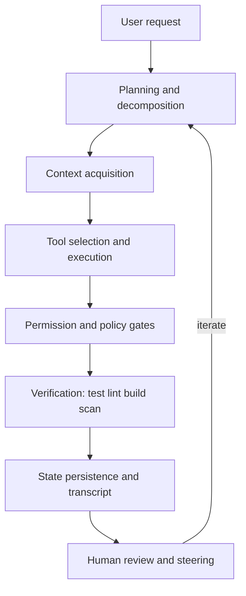

## はじめに

Agent Harness を導入するときに比べるべきなのは、搭載モデルやファイル編集の可否より、作業を安全に実行し、観測し、失敗から戻せる設計になっているかである。製品名や機能一覧を並べるだけでは、この差は分からない。

具体的には、次の問いに答えられるかを比べる。

- どこで実行され、どの状態を持ち、どこまで隔離されるのか
- ツール呼び出しは誰が制御し、どの時点で止められるのか
- コンテキストはどう集められ、どう圧縮され、どう忘れられるのか
- 長時間タスクや並列タスクを、破綻せず追跡できるのか
- 失敗したとき、何を再現し、何を監査し、どこから戻せるのか

本稿では、代表的な商用/OSSプロダクトを、次の12軸で比較する。

1. 実行場所（local / cloud / hybrid）
2. オーケストレーションの公開度
3. ツール拡張
4. 権限制御
5. コンテキスト戦略
6. 長時間タスク
7. マルチエージェント
8. Git/PR統合
9. 観測性
10. 企業統制
11. OSS透明性
12. 評価容易性

対象は、GitHub Copilot（cloud agent / IDE Agent Mode / CLI sandboxes）、OpenAI Codex、Anthropic Claude Code、Cursor、Cline、Aider、OpenHands、SWE-agent / mini-SWE-agent、そして歴史的参照として Continue である。Continue は 2.0.0 final release 後に公開リポジトリーが read-only 化されているため、現行選定の主対象ではなく、OSSエージェントの系譜として扱う。

本稿は 2026-09-10 時点の公開情報に基づく比較である。価格、プラン、制限値、対応モデル、ベータ機能は変化が速いので、導入時は必ず一次情報で再確認してほしい。

製品に点数を付けて順位を決めることはせず、各製品がどの設計責務を引き受け、どの責務を利用者側に残しているかを調べる。

## 先に結論

2026年時点の Agent Harness は、ローカルかクラウドかの二分より、次の3つの設計重心に分けると整理しやすい。

| 設計重心 | 代表例 | 最適化対象 | 主なリスク |
|---|---|---|---|
| プラットフォーム統合型 | GitHub Copilot cloud agent, Cursor Cloud Agents, OpenHands Cloud | Issue/PR/監査/権限/課金を組織運用に載せる | プラットフォーム制約、実行時間制限、ロックイン |
| ローカル主導型 | Claude Code, Codex CLI, Cline, Aider, Copilot IDE Agent Mode | 開発者の高速反復、手元の文脈、即時検証 | 権限過多、承認疲れ、監査分散 |
| 研究・評価型 | SWE-agent, mini-SWE-agent, OpenHands SDK | 再現実験、trajectory、ベンチマーク比較 | 日常開発UX、企業統制、運用の作り込み |

この3分類は製品ではなく使い方の重心を分けたもので、同じ製品でもCLI、IDE、クラウド、SDKのどれを使うかで性質が変わる。たとえば GitHub Copilot cloud agent と IDE Agent Mode は、同じ Copilot ブランドでも、実行責任・監査の粒度・待ち時間・人間の関与点が大きく異なる。

## Agent Harnessとは何か

本稿でいう Agent Harness は、LLM そのものではなく、LLM に開発作業を任せるための実行基盤を指す。主な構成要素と処理の流れは次の通りだ。


```mermaid
flowchart TD
    U[User request] --> P[Planning and decomposition]
    P --> C[Context acquisition]
    C --> T[Tool selection and execution]
    T --> G[Permission and policy gates]
    G --> V[Verification: test lint build scan]
    V --> S[State persistence and transcript]
    S --> H[Human review and steering]
    H -->|iterate| P
```

製品ごとの違いは、この図のどの段階を製品側で作り込み、どの段階をユーザーや組織に委ねているかに表れる。

## 全体マップ

表の「強い軸」の数字は、冒頭に挙げた12軸の番号である。

| プロダクト | 実行面 | 強い軸 | 注意点 |
|---|---|---|---|
| GitHub Copilot cloud agent | Actions上のクラウド | 8 Git/PR、10 統制、9 監査 | GitHub前提、時間制限、1タスク1PR |
| GitHub Copilot IDE Agent Mode / CLI | ローカルIDE / CLI sandbox | 1 実行、3 MCP、4 権限 | サーフェス差、承認設計 |
| OpenAI Codex | ローカルCLI + cloud/SDK | 4 権限、2 hooks、7 subagents | beta機能の変化、設定の運用負担 |
| Claude Code | CLI/IDE/desktop/web + SDK | 2 hooks、5 memory、7 subagents | 機能が多く統制設計が必要 |
| Cursor | エディター + Cloud Agents | 3 拡張、8 GitHub連携、10 チーム | サーフェスごとの機能範囲の差、統制は商用プラン前提 |
| Cline | OSSのIDE/CLI/SDK/kanban | 承認駆動、チェックポイント、モデル自由度 | 自前運用責任、ポリシー設計 |
| Aider | terminal-first | Git安全弁、repo map、軽量性 | 長時間/組織統制/並列化は薄め |
| OpenHands | OSS + Cloud + Enterprise + SDK | 自前プラットフォーム化、クラウド運用 | 運用設計の重さ、Enterpriseはライセンス注意 |
| SWE-agent / mini | 研究/評価向け | trajectory、ベンチ、再現性 | 日常開発UXより実験向け |
| Continue | OSS系譜の参照 | 拡張可能IDEエージェントの先行例 | 現行主選定からは外すのが安全 |

## この12軸の読み方

読者の運用形態ごとに、先に読むとよい軸を次の表に示す。全軸を順に読む必要はない。

| 読者 | まず読む軸 |
|---|---|
| GitHub中心の組織 | 1, 4, 8, 9, 10, 12 |
| 少人数プロダクトチーム | 1, 3, 4, 5, 8 |
| 自社エージェント基盤 | 2, 3, 4, 6, 7, 9, 10 |
| 研究・評価 | 5, 7, 9, 11, 12 |

各軸の節では、製品ごとの扱いを説明したあと、確認すべき項目、失敗モード、調査から見えた設計差を挙げる。

## 軸1: 実行場所

実行場所を比べるときは、ローカルかクラウドかだけでなく、少なくとも次の5層をそれぞれ確かめる必要がある。

1. モデル推論がどこで走るか
2. ツール実行がどこで走るか
3. ファイルシステム変更がどこに発生するか
4. ネットワークアクセスがどの境界から出るか
5. セッション状態がどこに保存されるか

GitHub Copilot cloud agent は、GitHub上のエージェントセッションから GitHub Actions ベースの一時環境でリポジトリーを操作し、ブランチとPRに成果を残す。実行環境、認証、監査記録、成果物が同じプラットフォームにまとまり、作業はコミット、ログ、PRとして残る。一方で、対象がGitHub上のリポジトリーに限られること、1タスク1ブランチ/PRであること、セッション時間に上限があることが設計上の制約になる。

Codex、Claude Code、Cline、Aider などのローカル型は、ユーザーの作業ディレクトリーを直接読んで編集し、ローカルのCLIや認証済みのセッションをそのまま使い、ローカルのテストやビルドをすぐに実行できる。反復は速いが、秘密情報、未コミット変更、ローカルサービス、外部への副作用、認証済みCLIへのアクセスをどう絞るかを設計しなければならない。

Copilot CLI sandboxes（public preview）や Codex permission profiles（beta）のように、対話型・ローカル寄りの実行にもサンドボックスを挟む設計が増えている。ローカルの反復速度を保ちながら、クラウドに近い隔離を得るための設計だ。Codex の permission profiles は、filesystem と network へのアクセスを profile として記述し、`:read-only`、`:workspace`、`:danger-full-access` のような設定を切り替える。Copilot local sandbox は OS ごとのサンドボックス機構を使い、cloud sandbox ではGitHubホストの一時Linux環境を使う。なお、Codex permission profiles が対象とするのはローカルのサンドボックス内で実行するコマンドで、MCP server、cloud設定、承認済みのescalationなどは別の仕組みで制御する。

見るべき具体項目:

- ファイル編集はローカル作業ツリーか、隔離されたworktreeか、クラウドcheckoutか
- ネットワークはデフォルトdenyか、ドメインallowlistか、完全許可か
- セッション停止後に状態が残るか、snapshotされるか、完全破棄か
- 途中成果はブランチ/コミット/PRとして残るか、会話ログだけか
- ローカルの `.env`、SSH鍵、Docker socket、クラウドCLI認証へ到達しうるか

失敗モード:

- ローカル型で `~/.ssh` や `.env` を読める状態のまま作業させる
- クラウド型でローカル再現に必要なサービスや秘密情報がなく、テストが通らない
- サンドボックス上では通るが本番CIでは落ちる
- 複数エージェントが同じ作業ツリーを同時編集して競合する

調査から見えた設計差:

- sandbox型はクラウド型とローカル型の中間にあり、実行場所そのものより、filesystemとnetworkの境界、状態のsnapshotと破棄をどう表現するかで差が出る。
- Cursor Cloud Agents や OpenHands Cloud は、クラウド実行を、GitHub連携、チーム管理、使用量管理、権限管理と組み合わせたサービスとして提供する方向に進んでいる。

## 軸2: オーケストレーションの公開度

オーケストレーションは、モデルが次に何をするかを決める制御ループである。その中身を利用者がどこまで触れるかで、大きく4段階に分けられる。

| 公開度 | 形 | 代表例 | 向く用途 |
|---|---|---|---|
| UI主導 | 内部ループはほぼ隠蔽 | Cursor, Copilot IDE | 日常開発、低摩擦導入 |
| CLI主導 | 設定・承認・ログを触れる | Codex CLI, Claude Code, Cline, Aider | 個人/チームの高速反復 |
| SDK主導 | ループをアプリに組み込める | Claude Agent SDK, Cline SDK, OpenHands SDK, Copilot SDK | 自社ワークフローへの組込 |
| 研究構成主導 | YAML/trajectoryで再現 | SWE-agent, mini-SWE-agent | 評価、研究、ベンチ |

公開度が高いほど柔軟になる一方、利用者が負う責任も増える。たとえば Claude Agent SDK を使うと、Claude Code のツール実行、hooks、subagents、MCP、sessions をアプリから扱える。ただし、それを組み込んだプロダクトを公開するなら、認可、テナント分離、ログ保全、ユーザー同意、失敗時の復旧を自分で設計することになる。

GitHub Copilot cloud agent は、オーケストレーションの細部を隠し、作業を Issue/PR/Actions の運用に載せる。制御ループを細かく変えられるようにするより、組織が受け入れやすい成果物の形式を優先している。

Codex と Claude Code はその中間にあり、hooks や subagents を細かく設定できる。Codex hooks は `SessionStart`、`PreToolUse`、`PermissionRequest`、`PostToolUse`、`PreCompact`、`SubagentStart`、`Stop` などのイベントを持つ。ただし現行の Codex hooks は command handler が中心で、`PreToolUse` / `PostToolUse` の対象も Bash、`apply_patch`、MCP tool call などの対応経路に限られ、すべての shell/tool 経路を完全に捕捉するものではない。それでも hook の入力には `transcript_path`、`permission_mode`、tool の入出力が渡るので、自動化には使える。Claude Code hooks はイベントの種類がさらに多く、`InstructionsLoaded`、`ConfigChange`、`FileChanged`、`TaskCreated`、`TaskCompleted`、`WorktreeCreate` など、ツール呼び出しの外側にある設定変更やタスク完了まで扱える。

見るべき具体項目:

- ツール実行前に制御できるか（PreToolUse）
- 権限プロンプト直前に制御できるか（PermissionRequest）
- ツール実行後に結果を検査できるか（PostToolUse）
- 停止直前に「まだ終わっていない」と差し戻せるか（Stop）
- compaction前後に介入できるか
- subagent起動/終了を観測できるか

hook event の名前は製品ごとに異なる。Codex/Claude Code は `PreToolUse` や `PermissionRequest` のような PascalCase 名を使う。GitHub Copilot hooks はリポジトリー配下の `.github/hooks/*.json` と個人用の hooks で定義し、`sessionStart`、`preToolUse`、`postToolUse`、`agentStop` などの lower camel case 名を使う。公開ドキュメント上は `PermissionRequest` という同名hook typeを持たない。そのため、hook の仕組みは名前ではなく、実行前の制御、実行後の観測、停止前の差し戻しができるかで比べる。

設計上の勘所:

- UI主導の製品は導入が簡単だが、自社固有の統制を差し込みにくい
- SDK主導の製品は統合しやすいが、マルチテナント/監査/権限の実装責任を負う
- hook の shell script や HTTP endpoint 自体が攻撃面になる

調査から見えた設計差:

- 内部ループを隠すUI主導型でも、Copilot cloud agent のようにPR、ログ、Actions、レビューコメントに成果を残せれば、組織は十分に制御できる。

## 軸3: ツール拡張

ツール拡張は MCP を共通の接続方式として収斂しつつある。ただし、「MCP対応」というだけでは製品の差は分からない。差は次の6つの層に出る。

1. transport: stdio / HTTP / SSE / remote executor
2. 認証: bearer token / OAuth / local env / managed secret
3. tool allowlist: サーバー単位か、tool単位か
4. approval: MCP toolごとに自動承認/都度承認/拒否を設定できるか
5. instruction: MCP server instructions をモデルにどう渡すか
6. 配布: 個人設定、リポジトリー設定、チーム/組織配布、marketplace

Codex MCP は stdio と streamable HTTP をサポートし、bearer token や OAuth、tool allowlist/denylist、tool単位の approval mode を設定できる。Claude Code も MCP tools を通常の tool event として hooks で扱え、`mcp__server__tool` 形式で matcher を書ける。Cursor は Customize 画面から plugins, skills, MCPs, subagents, rules, commands, hooks を扱う方向に寄せ、Marketplace/Team Marketplace と組み合わせる。GitHub Copilot は MCP を Copilot Chat、CLI、Copilot app、cloud agent/code review など複数サーフェスへ広げつつ、組織ポリシーと紐づける。

OSSでは、Cline が plugin/MCP/SDK の自由度を前面に出している。Aider はMCPより、LLM provider 接続、repo map、git統合を軽量に組み合わせて拡張する。OpenHands はSDKとCloud/Enterpriseを通じて、ツール追加をアプリケーション基盤側に寄せ、エージェントプラットフォームを自前で運用する方向に近い。

失敗モード:

- MCP serverを増やしすぎて tool descriptions がコンテキストを圧迫する
- 似た名前のツールが増え、モデルのtool selectionが不安定になる
- OAuth tokenや環境変数が、ローカル/クラウド/サブエージェント間で伝播しない
- plugin bundled hook や MCP server を信頼レビューせずに有効化する

導入時に確認すること:

- このMCPは読み取り専用で十分か
- 書き込みツールは別サーバー/別toolsetへ分離できるか
- toolごとに承認モードを変えられるか
- サーバーの instructions は短く、最初の数百文字で自己完結しているか
- チームに配布したあと、誰が更新し、誰が無効化できるか

調査から見えた設計差:

- Codexのように server ごとの `enabled_tools`、`disabled_tools`、tool単位の approval mode を設定として持つ製品と、UIやMarketplaceを中心に配布する製品とでは、運用の責任を負う場所が違う。
- Claude Code は MCP tool を通常のtool eventとして扱い、`mcp__server__tool` のような名前で hooks や permission rule の対象にできる。MCPを別枠の拡張としてではなく、通常のツールと同じ仕組みで統制する設計である。
- Cursor のように拡張の発見・配布・チーム共有をUIにまとめると、拡張の管理はサプライチェーン管理に近づく。

## 軸4: 権限制御

権限制御は、Agent Harness の品質の差が最もはっきり表れる軸である。承認ダイアログの有無より、権限がどの層で効いているかを比べる。権限は次の層を重ねて構成され、層ごとに防げる失敗が異なる。

| 層 | 例 | 強み | 限界 |
|---|---|---|---|
| モデル指示 | CLAUDE.md, AGENTS.md, rules | 低コスト、柔軟 | 強制力はない |
| tool allow/deny | allowedTools, disallowedTools, toolsets | 明確で高速 | 条件付き制御に弱い |
| 承認UI | approve/deny prompt | 人間が止められる | 承認疲れ、属人化 |
| hooks | PreToolUse, PermissionRequest | 条件付き制御、監査 | hook自体の安全性が必要 |
| sandbox | filesystem/network profile | 被害半径を技術的に限定 | OS差、設定複雑性 |
| 組織ポリシー | managed settings, enterprise policy | 中央統制 | 導入と運用が重い |

Codex の permission profiles は、filesystem と network の境界をプロファイルとして定義する。`read`、`write`、`deny` の優先順位、workspace roots、network domain の allow/deny、localhost/private network の扱いまで設定できる。Claude Code は permission modes、deny/allow rules、hooks、managed settings、subagentごとの tools/permissionMode を重ねる。GitHub Copilot cloud agent はGitHub側のポリシー、Actions環境、hooks、MCP設定、監査ログと連動する。

Cline のエディター体験は「every action requires explicit approval」を基本にし、Plan/Act とチェックポイントで人間が差分を確認しやすい方向に寄せる。一方、CLI/headless や Kanban では auto-approve や実験的な権限バイパスを使う運用もあるため、サーフェス別に既定値を確認する。Aider はgitを安全弁にし、編集ごとのコミット、`/undo`、dirty file の事前コミットで、変更を戻せるようにしている。

よくある誤解:

- hooks はsandboxではない。hookが止める前に別経路で同じ副作用が起きる場合がある。
- PostToolUse は事後検査であり、副作用を取り消せない。
- instructionは強制ではない。禁止したい操作は permission/sandbox/hook で止める。
- `danger-full-access` や bypass permissions は、短期実験では便利でも組織標準にしてはいけない。

設計の実務パターン:

1. 既定は read-only または workspace-write no-network
2. ネットワークはドメインallowlistから始める
3. `.env`, keys, cloud credentials, package manager hooks はdeny
4. 対応製品では destructive command を PreToolUse 相当でブロック
5. deployment, migration, production DB は PermissionRequest 相当または承認UIで人間承認
6. Stop hook で「テスト未実行のまま完了」を止める

調査から見えた設計差:

- Codex permission profiles では、ローカルコマンド実行の filesystem/network 境界が明示的な設定データになる。`deny` は `write` や `read` より優先され、設定は workspace roots からの相対パスで適用される。
- Claude Code では、静的な allowlist（permission rules や subagent ごとの tools）と、hooks による動的な検査を分けて設計できる。

## 軸5: コンテキスト戦略

コンテキスト戦略は、モデルの回答の質に加えて、コスト、速度、セキュリティー、再現性にも直接影響する。

主な方式は次の5つ。

1. リポジトリー全体の構造要約
2. 検索/grep/semantic searchによる局所取得
3. 明示的なrules/instructions
4. 長期memory
5. compaction / summarization

比較のために、コンテキスト戦略を次のデータ構造の組み合わせとして表す。各製品の内部実装そのものではなく、本稿で正規化したモデルである。

```typescript
type ContextLayer =
    | InstructionLayer
    | RepoMapLayer
    | RetrievalLayer
    | MemoryLayer
    | TranscriptLayer
    | CompactionLayer
    | SubagentLayer
    | ToolMetadataLayer;

type ContextItem = {
    id: string;
    source: "repo" | "memory" | "rule" | "tool" | "transcript" | "mcp";
    scope: "user" | "project" | "local" | "managed" | "session" | "subagent";
    content: string;
    tokenEstimate: number;
    freshness: "startup" | "lazy" | "live" | "compacted" | "stale-risk";
    authority: "hint" | "instruction" | "policy" | "evidence";
};
```

`ContextItem` では、`content` に加えて `source`、`scope`、`freshness`、`authority` が比較の要点になる。たとえば CLAUDE.md や AGENTS.md は `authority: "instruction"` だが、操作を強制する力はない。deny rule や sandbox policy は context ではなく enforcement なので、別のレイヤーに置くべきである。tool output は `authority: "evidence"` だが、古い transcript 由来なら `freshness: "stale-risk"` になる。

### リポジトリーマップ

Aider の repo map は、ファイル全文の代わりにシンボルのグラフとしてコンテキストを圧縮する代表例で、概念的には次の構造になる。

```typescript
type RepoMap = {
    files: FileNode[];
    edges: DependencyEdge[];
    tokenBudget: number;
};

type FileNode = {
    path: string;
    symbols: SymbolDef[];
    rank: number;
};

type SymbolDef = {
    name: string;
    kind: "class" | "function" | "method" | "type" | "constant";
    signature?: string;
    keyLines: string[];
    references: number;
};

type DependencyEdge = {
    from: string;
    to: string;
    kind: "imports" | "calls" | "references";
    weight: number;
};
```

Aider は tree-sitter で定義や参照を抽出し、ファイルをnode、依存関係をedgeとするグラフランキングで重要部分を選ぶ。これにより、LLMは全ファイルを読む前に、どのファイルが重要そうかを把握できる。`--map-tokens` のような token budget は、このグラフからどの `SymbolDef.keyLines` をプロンプトに入れるかを決める制約になる。設計の差は、検索精度に加えて、どの情報を捨てるかに表れる。

### 指示・ルール・メモリー

Claude Code の CLAUDE.md / `.claude/rules/` / auto memory は、おおむね次の3種類のデータ構造に分けられる。

```typescript
type InstructionFile = {
    path: string;
    scope: "managed" | "user" | "project" | "local";
    loadMode: "startup" | "lazy-by-path" | "imported";
    pathGlobs?: string[];
    content: string;
};

type MemoryIndex = {
    entrypoint: "MEMORY.md";
    loadedPrefixLimit: { lines: 200; bytes: 25_000 };
    topics: Array<{ path: string; summary: string; lastTouched?: string }>;
};

type MemoryNote = {
    topic: string;
    fact: string;
    evidence?: string;
    staleWhen?: string;
};
```

`InstructionFile` は起動時または遅延ロード時に context window に入るのに対し、`MemoryNote` の詳細ファイルは必要になったときに読まれる。つまり memory は、`MEMORY.md` をインデックスとする小さな知識ベースに近い。`staleWhen` のような棚卸し条件を持てないと、古い学習が残り続ける。

### Transcript と trajectory

コンテキスト戦略を評価するなら、会話履歴の構造も見る必要がある。Claude Code や Codex の hooks は `session_id`、`transcript_path`、`tool_name`、`tool_input` などを渡す。mini-SWE-agent は `.traj.json` に `info` と `messages` を保存し、SWE-agent は thought、action、observation、state、query を持つターンとしてtrajectoryを保存する。

これらを正規化すると、実行履歴は次の構造で表せる。

```typescript
type AgentTranscript = {
    sessionId: string;
    messages: AgentMessage[];
    artifacts: ArtifactRef[];
};

type AgentMessage = {
    role: "system" | "user" | "assistant" | "tool" | "exit";
    content?: string;
    toolCalls?: ToolCall[];
    extra?: {
        cost?: number;
        timestamp?: number;
        returncode?: number;
        actions?: Array<{ command: string }>;
        response?: unknown;
    };
};

type ToolCall = {
    id: string;
    name: string;
    input: unknown;
    output?: unknown;
    approvalState?: "auto" | "prompted" | "approved" | "denied";
};

type ArtifactRef = {
    kind: "file" | "patch" | "log" | "pr" | "screenshot";
    uri: string;
    hash?: string;
};
```

履歴がこの構造で残っていれば、「どのファイルを読んでから編集したか」「どのtool resultが最終判断に影響したか」「compaction後にどの証拠が失われたか」を評価しやすい。

### Compaction と subagent context

compaction は、履歴を次の推論に残す状態へ変換する処理だ。Claude Code の subagent では、subagent transcript がメイン会話とは別に残り、compaction boundary には `trigger` や `preTokens` のようなメタデータが残る。

```typescript
type CompactionRecord = {
    trigger: "manual" | "auto";
    preTokens?: number;
    summary: string;
    preservedFacts: string[];
    droppedArtifacts: ArtifactRef[];
};

type SubagentContext = {
    agentId: string;
    agentType: string;
    parentSessionId: string;
    startupContext: {
        systemPrompt: string;
        taskMessage: string;
        inheritedInstructions: boolean;
        inheritedGitStatus: boolean;
        preloadedSkills: string[];
    };
    transcriptPath?: string;
};
```

製品間で比べるべきなのは、subagent が fresh context で始まるのか、fork のように親会話を引き継ぐのか、探索結果を要約だけ返すのか、transcript全体をresumeできるのか、である。コンテキスト汚染を避けるには fresh context が有利だが、説明コストは増える。fork は逆に説明コストを下げるが、親会話のノイズも継承する。

### MCP tool metadata

MCP は、外部ツールを呼び出せるようにすると同時に、tool metadata を context としてモデルに渡す。比較するときは、少なくとも次の構造を見る。

```typescript
type McpServerContext = {
    name: string;
    transport: "stdio" | "http" | "sse";
    instructions?: string;
    tools: Array<{
        name: string;
        description: string;
        inputSchema: unknown;
        approvalMode?: "auto" | "prompt" | "approve";
        enabled: boolean;
    }>;
};
```

`instructions` と `tools[].description` は、モデルの tool selection に直接効く。長すぎる説明、似た名前のtool、未使用toolの大量登録は、コンテキスト消費と誤選択を増やす。MCPを導入するときは、toolが動くかに加えて、tool metadata がcontext windowをどれだけ消費し、誤選択をどれだけ招くかも調べるべきだ。

### 製品ごとの構成と確認点

Claude Code は CLAUDE.md、`.claude/rules/`、auto memory、subagent memory、compaction を組み合わせる。auto memory の内容を棚卸しできなければ、古い学習がチーム標準と衝突する。

Codex は AGENTS.md や rules、hooks、session transcript、subagent contextを持つ。GitHub Copilot cloud agent では、repository instructions、Copilot Memory（対応プラン/preview条件で有効な場合）、MCP経由のIssues/PR/履歴などがコンテキスト源になる。Cursor は rules, skills, subagents, MCP, plugins を Customize 画面に集約する方向だ。

見るべき具体項目:

- 起動時に必ず入るcontextは何か
- ファイルアクセスで遅延ロードされるrulesはあるか
- memoryは誰が書き、誰が消せるか
- compaction後に何が残り、何が落ちるか
- subagentが親会話のcontextを持つか、fresh contextで始まるか
- large repoで重要ファイルの発見精度をどう上げるか

失敗モード:

- CLAUDE.mdが長すぎて、重要ルールの遵守率が下がる
- memoryに古いbuild commandが残り、毎回失敗する
- path-specific rulesが読み込まれていないのに、読み込まれた前提で作業する
- subagentに必要な文脈を渡さず、探索をやり直す
- compactionで根拠や未完了TODOが落ちる

調査から見えた設計差:

- コンテキスト戦略の差は、何を入れるかより、何を入れないかの設計に出る。Aider はrepo mapでsymbol-levelの要約を作り、Claude Codeはinstructions/memory/subagentで文脈を分離し、SWE-agent系はtrajectoryで後から再現できる履歴を残す。
- rules や memory は、`scope` と `loadMode` を持つデータ構造として見ると比較しやすい。起動時に入る情報、ファイルアクセス時に遅延ロードされる情報、compaction後に再注入される情報は、それぞれ扱いが異なる。
- transcriptやtrajectoryは、モデルへの入力であると同時に、後から失敗を分析するためのデータセットでもある。mini-SWE-agent の `.traj.json` のように config、messages、cost、submission を一緒に保存する形式は、評価容易性にも直結する。
## 軸6: 長時間タスク

長時間タスクで差が出るのは、モデルが長く考えられるかより、作業を分割し、待ち、再開し、観測できるかである。

GitHub Copilot cloud agent はバックグラウンドで作業し、ブランチやPRに成果を残す。GitHub上で開始・追跡・コメントによる反復ができる一方、セッション時間制限や1リポジトリー/1ブランチ/1PRの制約を意識する必要がある。

Claude Code は CLI/desktop/web/IDE など複数サーフェスにまたがり、background agents、scheduled tasks、subagents、hooks、Agent SDK/Managed Agents など、長時間の作業に使える仕組みが多い。Stop hooks や TaskCompleted hooks で、タスクを完了としてよい条件も定義できる。

Codex は subagents や non-interactive execution、hooks、cloud連携で長時間作業を支える。Cline は、dev server や test watcher のように動き続けるプロセスの出力を監視し、それに反応する使い方に向く。OpenHands Cloud/Enterprise は、エージェントをサービスとして運用し、長時間・多人数・多タスクへ広げる方向に進んでいる。Aider は terminal での対話的なペアプログラミングが中心で、git に記録しながら短く反復する作業に最適化されている。長時間の非同期運用が手薄なのは、この設計上の選択による。

長時間タスクで見るべきこと:

- idle時に自動終了するのか、resumeできるのか
- dev serverやwatcherの出力を継続監視できるか
- API rate limitやtool failure時にどうリトライするか
- 途中状態はtranscript/branch/task boardに残るか
- user steeringが途中で効くか

失敗モード:

- 1ターンで巨大タスクを抱え、context rotが起きる
- 長時間テストを同期hookで実行し、エージェント全体を止める
- バックグラウンドタスク完了後の結果がモデルに戻らない
- クラウド環境の時間制限で中途半端なブランチが残る

調査から見えた設計差:

- 長時間タスクでは、長く動けるかより、途中状態をどこに退避するかで設計が分かれる。GitHub Copilot cloud agent はブランチ/PR/ログへ、Claude CodeやCodexはtranscript/session/subagentへ、OpenHandsはCloud/Enterpriseのセッション管理へ寄せる。
- watcher型の長時間実行とcloud PR型の長時間実行は性質が違う。前者はstdout/stderrやdev serverの継続監視が中心で、後者はbranchやPRへの状態保存が中心になる。
- hooksで長時間処理を同期実行すると、エージェントの推論ループ自体が止まる。Claude Code の async hook のように、完了後に結果を追加の context として戻す設計なら、長時間の検証と対話の継続を分けられる。

## 軸7: マルチエージェント

マルチエージェントに価値が出るのは、タスク分解の境界が明確で、各エージェントの権限と成果物が分離され、最後に統合できる場合だけだ。

Claude Code の subagents は、context isolation を重視している。ExploreやPlanのような組み込みsubagentは読み取り中心で、探索の出力でメイン会話を埋めない。custom subagentでは tools、disallowedTools、model、permissionMode、mcpServers、hooks、memory、background、isolation: worktree などを指定できる。subagent定義はこうした項目を持つ小さな実行プロファイルなので、subagent を分けるとプロンプトだけでなく権限と文脈も分割される。forkは親会話を引き継ぐため、説明コストは低いが、context isolationの利点は弱まる。

Codex subagents は、明示的に依頼したときにspawnし、sandbox policyを継承し、並列調査やCSV batchのような実験的ワークフローにも向く。Cline は SDK の subagents や Kanban（Research Preview）で、カード単位・worktree単位の並列作業を志向する。Copilot CLI の複数cloud sandbox session、GitHub cloud agentの複数セッション、Cursor Cloud Agents も、並列作業の入口になる。

良い分解例:

- security reviewer / docs researcher / code mapper の並列レビュー
- frontend reproduction / backend trace / test fixer の分担
- 100ファイルの同型監査を1ファイル1workerで実行

悪い分解例:

- 複数エージェントが同じファイルを編集する
- 仕様が固まっていないのに実装を並列化する
- 誰が最終判断するか決めずにレビューだけ増やす

設計時に決めること:

- coordinatorは誰か
- workerは読み取り専用か、編集可能か
- workerごとのコンテキストはfreshかforkか
- 成果物はdiffか、reportか、PRか
- 統合時の衝突を誰が解くか

調査から見えた設計差:

- 製品の差は、並列数より context isolation の設計に出る。Claude Code の named subagent は fresh context で始まり、fork は親会話を継承する。Codex subagents は親の sandbox policy や runtime override を引き継ぐ。何を継承させるかが設計の中心になる。
- Cline KanbanやCursor Cloud Agentsのようなタスクボード型は、並列作業をUI上の作業単位に写像する。研究系のSWE-agent/mini-SWE-agentは、batchやtrajectoryを通じて並列実験の再現性に寄る。
- fan-outはコスト、latency、統合作業を増やすので、元が取れるのは「探索」「レビュー」「同型監査」の並列化である。

## 軸8: Git/PR統合

Agent Harness を実務で使えるかは、作業結果がレビューできる差分として残るかで決まる。

git統合が最も分かりやすいのは Aider で、編集ごとに自動コミットし、dirty fileを事前に分離し、`/diff`、`/undo`、`/commit` で差分を扱える。Cline はIDE上でdiff review、checkpoint、revertを重視する。Claude Code はgit操作、commit、PR作成、worktree isolation、hooksと組み合わせる。GitHub Copilot cloud agent はbranch作成、commit、PR作成、レビューコメントによる反復までGitHub上に寄せる。

見るべき具体項目（PRを作れるかに加えて）:

- dirty worktreeをどう扱うか
- エージェントの変更と人間の変更を分離できるか
- commit author/committer attributionは明確か
- branch protectionやrequired checksと衝突しないか
- PR本文、テスト結果、根拠リンクを自動で残せるか
- 途中で人間が引き継げるか

GitHub Copilot cloud agent の強みは、作業が最初からGitHubの協業の流れに載ることだ。一方で、GitHub以外のVCSや、複数リポジトリー横断変更には向きにくい。Cursor GitHub integration はGitHub App経由でrepository access、PR、issues、checks/actions、branch protectionなどに関わる。EnterpriseではGitHub Enterprise Server、IP allowlist、PrivateLink/Cloudflare Tunnelのような接続方式も論点になる。

失敗モード:

- エージェントが人間の未コミット変更を上書きする
- PRは作るが、なぜその変更をしたかの根拠が残らない
- branch protectionのためにエージェントPRがmergeできない
- 生成コミットが大きすぎてレビュー不能になる
- rollback手順がgit履歴に依存しすぎ、DBや外部状態を戻せない

調査から見えた設計差:

- Git/PR統合の差は、差分を作れるかより、変更の由来をどこまで説明できるかに出る。PR本文、commit分割、テスト結果、関連Issue、エージェントの作業ログがつながっているほどレビューしやすい。
- Claude Code の worktree isolation や subagent worktree は、同じリポジトリー内で複数案を並べるときの衝突回避に効く。
- 外部状態を伴う変更、たとえばDB migrationやクラウドリソース変更は、Gitのrollbackだけでは戻らない。Git/PR統合が強い製品でも、外部副作用の記録と復旧手順は別途必要になる。

## 軸9: 観測性

観測性の差は導入後に表れる。デモで成功しても、本番で「なぜそのコマンドを実行したのか」「誰が承認したのか」「どのMCP toolがどの引数で呼ばれたのか」を追えなければ運用できない。

観測すべきイベントは少なくとも次の通り。

- session start/end
- user prompt
- tool request / approval / denial
- tool output / failure
- file edit
- command execution
- subagent start/stop
- compaction
- memory load/write
- config change
- PR/commit/check status

Claude Code hooks は prompt_id、session_id、transcript_path、tool_name、duration_ms、subagent transcript など、かなり細かい観測点を持つ。Codex hooks も session_id、turn_id、permission_mode、transcript_path、model、tool input/output などを渡す。Cline Enterprise は OpenTelemetry, Datadog, Grafana, Splunk integrations を打ち出している。GitHub Copilot cloud agent はGitHub上のログ、PR、Actions、usage metrics、audit logとの親和性が強い。

会話ログと監査ログは区別する。会話ログはモデルの文脈復元に役立つが、監査ログには改ざん耐性、検索性、保持期間、個人情報/秘密情報のマスキング、承認者の情報が必要になる。

設計の実務パターン:

- tool callはJSONLで保存する
- approval/denyはユーザーID、理由、時刻、対象toolを残す
- shell stdout/stderrは大きすぎるため要約と原本への参照を分ける
- secret scan後に保存するログからもsecretを除去する
- session_idとPR番号、commit SHAを紐づける

調査から見えた設計差:

- 観測性の中核データは `session_id`、`user_id`、`tool_name`、`tool_args_hash`、`approval_state`、`artifact_ref`、`commit_sha` のようなjoin keyである。これがないと、会話ログ、tool call、PR、CI結果を横断して追跡できない。
- Cline Enterprise やOpenHands Cloud/Enterpriseのような商用/Enterprise面は、OpenTelemetryや外部監視基盤、使用量レポートに接続する方向に寄る。OSS/ローカル系は、ログスキーマを利用者が設計する余地が大きい。

## 軸10: 企業統制

企業統制は、個人利用では見えにくいが、組織導入では最重要になる。

見るべき領域:

1. ID/SSO/RBAC
2. モデル許可/禁止
3. MCP server allowlist/denylist
4. hooks/permissionsのmanaged config
5. ネットワーク制限
6. 監査ログ
7. コスト/予算管理
8. データ保持とリージョン
9. PR/branch protectionとの整合
10. 開発者端末のMDM/Intune等との連携

GitHub Copilot cloud agent は、GitHub Enterprise/Businessのポリシー、GitHub Actions、MCP repository settings、usage metrics、AI credits、GitHub App/audit logと接続しやすい。Copilot cloud/local sandboxでは、local sandbox policyやcloud sandbox access policyも論点になる。

ただし、GitHub Copilot の content exclusions は cloud agent には適用されない。除外設定を cloud agent のアクセス境界として扱うと、除外したつもりのファイルを見られる/更新されるリスクが残る。

Claude Code は managed settings、managed CLAUDE.md、availableModels、MCP allow/deny、hooks、permissions など、端末側統制が厚い。Codex も managed requirements.toml や permission profiles、managed hooks の方向がある。Cursor はTeam/EnterpriseでGitHub integration、Protected Git Scopes、Private Connectivity、Marketplace/Team Marketplace、Cloud Agents/Bugbotなどの組織機能を持つ。OpenHands Cloud/Enterprise はRBAC、permissions、usage reporting、budgeting enforcement、多人数対応を前面に出す。Cline EnterpriseもSSO、RBAC、model/tool controls、remote configuration、observabilityを掲げる。

一方、Aiderやmini-SWE-agentのようなOSS/研究寄りツールは、軽量性や再現性と引き換えに、SSO/RBAC、ログ保全、例外申請、緊急停止、コスト制御といった企業統制を利用者側で組む必要がある。

導入時に決めること:

- 誰がエージェントを有効化できるか
- どのリポジトリーで使えるか
- どのモデルを使えるか
- どのMCP serverを使えるか
- 誰がhooksを配布・更新できるか
- 予算超過時に止めるのか、モデルを落とすのか
- 監査ログを何日保持するか

失敗モード:

- 個人が勝手にMCP serverを追加し、内部データが外部toolへ流れる
- BYOKで個人API keyが散在する
- hooksがローカルにしかなく、チームで同じ制御が効かない
- 監査ログより会話ログの保持期間が短く、調査不能になる
- コスト上限がなく、subagent fan-outで急増する

調査から見えた設計差:

- 製品の差が大きく出るのは、ポリシーの配布経路である。個人設定、リポジトリー設定、チームmarketplace、managed config、MDM配布では、更新速度と強制力が大きく異なる。

## 軸11: OSS透明性

OSS透明性は、無料で使えるかではなく、検証・改変・監査できるかで評価する。

比較する観点:

- ライセンスは何か
- core runtimeがOSSか、UIだけOSSか
- enterprise機能はsource-availableかclosedか
- tool executionやpermission logicを読めるか
- release cadenceとメンテナンス状態は健全か
- forkして社内policyを入れられるか
- telemetryや認証の挙動を追えるか

Cline、Aider、OpenHands core、SWE-agent/mini-SWE-agent は、OSS透明性が高い。ClineはSDK/CLI/IDE/kanbanのコアを見られる。Aiderはgit統合やrepo mapの挙動を追いやすい。OpenHandsはcoreやagent-serverはMITだが、Enterpriseディレクトリーは別ライセンスである。SWE-agentはMITライセンスの研究プロジェクトで、trajectoryやbatch/evalの設計を追いやすい。

Continue は歴史的には重要なOSS coding agentだが、現状は final 2.0.0 release 後、read-only/non-active maintenance と明示されている。現行導入の主候補というより、設計系譜やfork元として見るのが妥当だ。

OSSは自由度が高く、provider や model も切り替えやすい。その代わり、SSO/RBAC、監査、予算、インシデント対応、セキュリティーレビューは自分たちの責任になる。

closed製品はコード可視性の代わりに、監査ログexport、設定export、データ保持説明、第三者認証、インシデント時の証跡取得可否で比較する。

調査から見えた設計差:

- OSS透明性は、コードを読めるかに加えて、tool execution、permission check、prompt assembly、memory保存、telemetry、provider認証の経路まで追えるかで決まる。
- OSSのコアを公開している製品でも、Enterprise機能やCloud運用は別ライセンスや商用契約になることがある。

## 軸12: 評価容易性

評価容易性は、エージェント導入の効果を測定し、その結果に基づいて改善できるかを左右する軸だ。

評価は次の3段階に分けられる。

1. ベンチマーク評価: SWE-bench, ProgramBench, 社内課題セット
2. 運用評価: lead time, intervention count, rollback rate, defect escape
3. 失敗分析: trajectory, transcript, tool call log, root-cause taxonomy

SWE-agent/mini-SWE-agent はこの軸で強い。SWE-benchやbatch mode、trajectory inspector、output files、yaml configなど、評価と再現のための道具が揃っている。mini-SWE-agent は「同等性能でより単純・柔軟」と説明され、現行の研究/評価用途では第一候補にしやすい。

Aider は独自のLLM leaderboardを持ち、編集能力の比較に使える。GitHub Copilot cloud agent では評価の対象が個々の会話からPRのライフサイクル（ブランチ作成、レビュー、CI、merge、コメントによる反復）に移るので、PR outcomes、merge率、time-to-mergeなど組織運用データと接続しやすい。Claude/Codex/Cline/Cursorのような開発者向けハーネスは、公式ベンチだけでは見えない実リポジトリー上の文脈取得、承認、復旧、レビュー品質を別途見なければならない。

良い評価セットの条件:

- 実際の過去Issueから作る
- 正解がテスト/レビューで判定できる
- 小/中/大のタスクを混ぜる
- 読み取りだけ、単一ファイル修正、複数ファイル修正、調査、リファクタリングを分ける
- 成功/失敗だけでなく、介入回数と根拠品質を見る

避けるべき評価:

- 1つのデモタスクだけで決める
- モデルとハーネスを分離せず比較する
- 人間のレビュー時間を測らない
- 成功したPRだけを見る
- セキュリティー/権限失敗を評価から外す

可能な範囲で同じモデル、同じタスク、同じ権限、同じMCP構成に揃え、揃えられない差分を記録したうえで、失敗原因を model reasoning、context retrieval、permission block、tool failure、human handoff、external environment に分類する。こうした失敗の分類は成功率より多くを教えてくれる。分類に必要な記録を残せるハーネスほど改善しやすい。

調査から見えた設計差:

- SWE-agent/mini-SWE-agent は、trajectoryを第一級の成果物として扱う。`thought`、`action`、`observation`、`state`、`query`、または `.traj.json` の `info`、`messages`、`extra` といった構造が、失敗分析と再現実験の土台になる。
- Aider の編集ベンチや leaderboard は、組織運用の評価とは別物である。編集能力、レビュー可能性、監査可能性、ロールバックは分けて見る必要がある。
## 12軸をまとめた選定フレーム

12軸の比較を踏まえると、運用形態ごとの候補と条件は次のようになる。

### GitHub中心の組織開発

第一候補:

- GitHub Copilot cloud agent
- 補助として Copilot IDE Agent Mode / Codex / Claude Code / Cursor

重点軸: 1 実行場所、4 権限制御、8 Git/PR統合、9 観測性、10 企業統制、12 評価容易性

採用しやすい条件:

- 開発の大半がGitHub Issue/PRで回っている
- 監査と権限統制が重要
- PR単位で成果をレビューできる
- GitHub Actionsでテスト/ビルドが完結する

避ける条件:

- 複数VCS/複数リポジトリーを一括変更する必要がある
- 主要タスクが長時間ジョブ中心
- ローカル専用依存が多い

### 高速な少人数プロダクトチーム

第一候補:

- Claude Code
- Codex CLI
- Cursor
- Cline
- Aider

重点軸: 1 実行場所、3 ツール拡張、4 権限制御、5 コンテキスト戦略、8 Git/PR統合

採用しやすい条件:

- 意思決定者と実装者が近い
- ローカルでテストがすぐ回る
- rollbackをgitで管理できる
- 中央での統制より速度を優先できる

避ける条件:

- 厳格な職務分掌や中央監査が必須
- 開発者端末に強いsecretが多い
- local-only policyが整備できない

### エージェント基盤を自社運用したいチーム

第一候補:

- OpenHands SDK/Cloud/Enterprise
- Cline SDK
- Claude Agent SDK
- Copilot SDK

重点軸: 2 オーケストレーション、3 ツール拡張、4 権限制御、6 長時間タスク、7 マルチエージェント、9 観測性、10 企業統制

採用しやすい条件:

- 既存の内製ポータルやチケットシステムへ統合したい
- 複数ユーザー/複数テナントのagent runtimeを作りたい
- hooks, tools, MCP, telemetryを自社仕様に合わせたい

避ける条件:

- 運用チームがない
- sandbox/session/auditを自前で保守できない
- 既製UIで十分

### 研究・評価基盤

第一候補:

- mini-SWE-agent
- SWE-agent
- OpenHands benchmarks / SDK

重点軸: 5 コンテキスト戦略、7 マルチエージェント、9 観測性、11 OSS透明性、12 評価容易性

採用しやすい条件:

- trajectoryを保存して失敗分析したい
- モデル比較やプロンプト比較をしたい
- 再現性が速度より重要

避ける条件:

- 日常開発UXが最優先
- 非技術者も使う
- 監査/SSO/RBACをすぐ要求される

## 横断的な調査結果

12軸を通して見ると、Agent Harness は次の4つの方向に進んでいる。

1つ目は、context と enforcement の分離である。CLAUDE.md、AGENTS.md、rules、memory、repo map、MCP metadata はモデルに与える文脈であり、操作を強制的に止める仕組みではない。強制にはpermission、sandbox、hook、managed policyが必要になる。

2つ目は、transcript/trajectory の重要性である。エージェントが何を読んだか、どのtoolを呼んだか、どの観測結果を得たか、どこでcompactionされたかが残るほど、失敗を後から分析できる。SWE-agent系はこの思想を研究向けに徹底しており、Claude/Codexはhooksやtranscript_pathを通じて運用側に露出している。

3つ目は、拡張性がサプライチェーン問題になっていることだ。MCP server、plugin、skill、hook、subagent は便利だが、増えるほどtool metadata、認証情報、承認境界、配布経路、更新責任が増える。拡張の管理には、追加する手段だけでなく、無効化し、範囲を絞り、監査する手段も要る。

4つ目は、クラウド型とローカル型の差が、実行場所だけでなく成果物モデルの差になっていることだ。クラウド型はPR、branch、task board、usage reportに寄り、ローカル型はworking tree、terminal output、git commit、transcriptに寄る。どちらを選ぶかは、組織がどの成果物をレビュー・監査・保管したいかで決まる。

## 再現可能性ノート（2026-09-10 検証スナップショット）

本稿の主張を更新する場合は、次の順で確認する。

1. 対象製品の実行面（CLI/IDE/cloud/SDK）を分ける
2. 12軸のうち、更新対象の軸だけを確認する
3. 公式ドキュメントの制限値・ベータ注記・プラン条件を確認する
4. 比較表と該当節だけを更新し、検証日を変える

<details>
<summary>主要な一次情報</summary>

- GitHub Copilot cloud agent: [About GitHub Copilot cloud agent](https://docs.github.com/en/copilot/concepts/agents/cloud-agent/about-cloud-agent)
- GitHub Copilot sandboxes: [About cloud and local sandboxes for GitHub Copilot](https://docs.github.com/en/copilot/concepts/about-cloud-and-local-sandboxes)
- GitHub Copilot hooks: [About hooks for GitHub Copilot](https://docs.github.com/en/copilot/concepts/agents/hooks)
- GitHub Copilot MCP: [About Model Context Protocol](https://docs.github.com/en/copilot/concepts/context/mcp)
- OpenAI Codex permissions: [Codex permissions](https://learn.chatgpt.com/docs/permissions)
- OpenAI Codex hooks: [Codex hooks](https://learn.chatgpt.com/docs/hooks)
- OpenAI Codex MCP: [Codex MCP](https://learn.chatgpt.com/docs/extend/mcp?surface=cli)
- OpenAI Codex subagents: [Codex subagents](https://learn.chatgpt.com/docs/agent-configuration/subagents)
- Claude Code overview: [Claude Code overview](https://code.claude.com/docs/en/overview)
- Claude Code memory: [Claude Code memory](https://code.claude.com/docs/en/memory)
- Claude Code hooks: [Claude Code hooks](https://code.claude.com/docs/en/hooks)
- Claude Code subagents: [Claude Code subagents](https://code.claude.com/docs/en/sub-agents)
- Claude Agent SDK: [Claude Agent SDK overview](https://code.claude.com/docs/en/agent-sdk/overview)
- Cursor docs: [Cursor documentation](https://cursor.com/docs)
- Cursor customization: [Customize Cursor](https://cursor.com/docs/customize-cursor)
- Cursor GitHub integration: [Cursor GitHub integration](https://cursor.com/docs/integrations/github)
- Cline docs: [Cline documentation](https://docs.cline.bot/)
- Cline CLI: [Cline CLI Overview](https://docs.cline.bot/usage/cli-overview)
- Cline SDK: [Cline SDK](https://docs.cline.bot/sdk/overview)
- Aider git integration: [Aider git integration](https://aider.chat/docs/git.html)
- Aider repo map: [Aider repository map](https://aider.chat/docs/repomap.html)
- Aider repo map internals: [Building a better repository map with tree-sitter](https://aider.chat/2023/10/22/repomap.html)
- OpenHands docs: [OpenHands documentation](https://docs.openhands.dev/)
- SWE-agent docs: [SWE-agent documentation](https://swe-agent.com/latest/)
- SWE-agent trajectories: [SWE-agent output files](https://swe-agent.com/latest/usage/trajectories/)
- mini-SWE-agent FAQ: [mini-SWE-agent FAQ](https://mini-swe-agent.com/latest/faq/)
- mini-SWE-agent output files: [mini-SWE-agent output files](https://mini-swe-agent.com/latest/usage/output_files/)
- mini-SWE-agent ProgramBench: [ProgramBench](https://mini-swe-agent.com/latest/usage/programbench/)
- Continue docs: [Continue documentation](https://docs.continue.dev/)

</details>

## おわりに

Agent Harness の比較は、モデル名や「自律実装できます」という見出しだけでは判断できない。実務で差が出るのは、12軸のうちどこを製品が引き受け、どこを利用者の運用責任として残しているかである。

個人開発なら、多少の手動承認やローカル運用を引き受けても速さを取る価値がある。組織開発では、PR、監査、ポリシー、コスト、復旧まで含めた運用設計が決め手になる。研究開発では、trajectoryと再現性が最も重要になる。

だから、「どのエージェントが一番賢いか」を問う前に、次の問いに答えておく。

> 自分たちは、どの失敗を許容し、どの失敗を技術的に不可能にしたいのか。

この答えがあれば、Agent Harness の選定を要件に基づく技術判断として進められる。