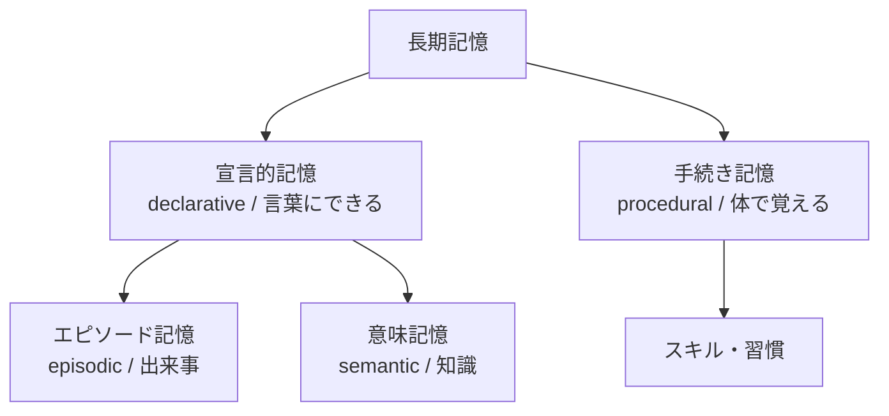
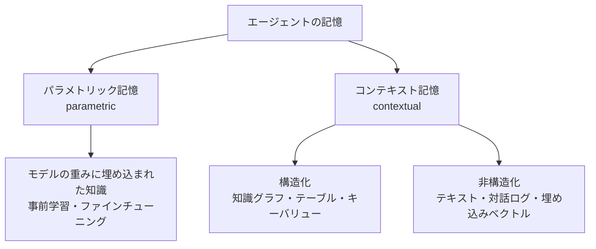
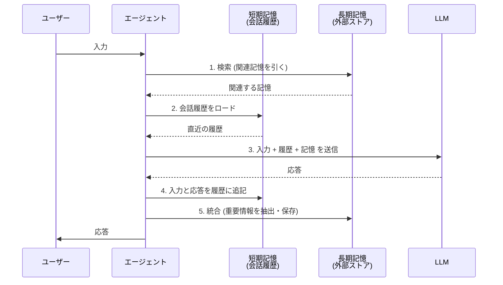
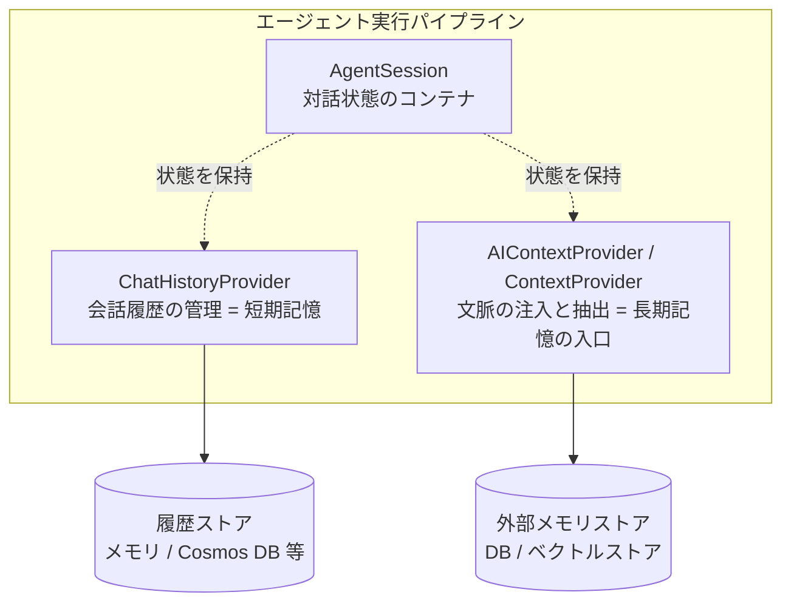
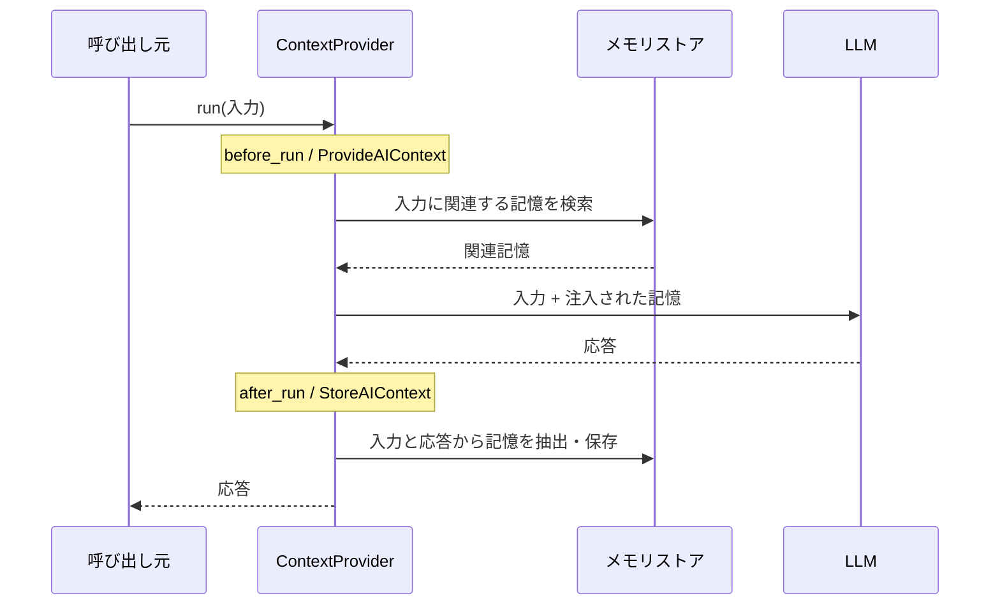

## はじめに

AI エージェントを少し本気で作り始めると、誰もが同じ壁にぶつかる。<strong>「このエージェント、すぐ忘れる」</strong>という壁だ。

昨日「私はビーガンです」と伝えたのに、今日になると平気でステーキ屋を勧めてくる。さっき調べたばかりの API 仕様を、3 ターン後には忘れている。長いタスクを任せると、途中で何をしていたのか分からなくなる。これらはすべて<strong>記憶（メモリ）の設計が不在</strong>であることに起因する症状だ。

LLM の API は本質的にステートレスである。各呼び出しは独立しており、モデル自身は「前回何を話したか」を一切覚えていない。にもかかわらずエージェントが会話を続けられるのは、アプリケーション側が<strong>過去の文脈をプロンプトに詰め直して送っている</strong>からにすぎない。つまり「エージェントの記憶」とは、モデルの能力ではなく<strong>我々が設計するアーキテクチャ</strong>そのものなのだ。

この記事では 2 つの問いに答える。

1. <strong>そもそも「記憶」とは何か</strong> — 認知科学と最新の研究論文をもとに、記憶を「どのようなものとして設計すべきか」を体系立てて整理する
2. <strong>具体的にどう実装するか</strong> — [Microsoft Agent Framework](https://github.com/microsoft/agent-framework) の `AgentSession`・`ContextProvider`・`ChatHistoryProvider` を使い、短期記憶と長期記憶を Python と C# の両方で実装する

単なる API の紹介ではなく、「記憶をどう設計し、どう実装し、本番でどう運用するか」を一貫した視点で解説することを目指す。記事の構成は以下の通りだ。

1. <strong>記憶とは何か</strong> — 認知科学の枠組みと、LLM エージェントへの写像
2. <strong>記憶の研究地図</strong> — 表現形式・操作・評価という 3 軸での体系化（研究論文ベース）
3. <strong>記憶アーキテクチャの設計原則</strong> — 短期記憶と長期記憶をどう分けるか
4. <strong>Agent Framework のメモリ機構</strong> — `AgentSession` / `ContextProvider` / `ChatHistoryProvider` の役割分担
5. <strong>短期記憶の実装</strong> — 会話履歴・コンパクション・永続化
6. <strong>長期記憶の実装</strong> — 抽出・統合・検索のパイプラインを自作する
7. <strong>本番運用の考慮事項</strong> — マルチユーザー分離・忘却・プライバシー・評価

> 本記事は [Microsoft Agent Framework 完全解説](/ja/blog/agent-framework) の姉妹編にあたる。フレームワーク全体のアーキテクチャやエージェント実行モデルについては、そちらを参照してほしい。本記事は「記憶」という一点に絞って深掘りする。

## 記憶とは何か — 認知科学からの写像

「記憶を設計する」と言うとき、まず「記憶とは何か」の共通言語が必要になる。エンジニアリングの議論に入る前に、認知科学が 50 年以上かけて整理してきた枠組みを借りよう。これは単なる飾りの比喩ではなく、後で見るように実際のエージェント設計の構造とよく対応する。

### 多重貯蔵モデル: 感覚記憶・短期記憶・長期記憶

人間の記憶研究で最も影響力のあるモデルが、Atkinson と Shiffrin が 1968 年に提唱した<strong>多重貯蔵モデル（multi-store model）</strong>だ。記憶を 3 つの貯蔵庫に分ける。

- <strong>感覚記憶（sensory memory）</strong> — 知覚した情報が一瞬だけ保持される。ほとんどは即座に失われる
- <strong>短期記憶（short-term memory）</strong> — 今まさに処理している情報。容量が小さく、保持時間も短い。リハーサル（反復）しないと消える
- <strong>長期記憶（long-term memory）</strong> — リハーサルや符号化を経て定着した情報。容量はほぼ無制限で、長期間保持される

ここで重要なのは、<strong>短期から長期への転送は自動的には起こらない</strong>という点だ。何らかの「処理」を経て初めて、情報は長期記憶に書き込まれる。後で見る LLM エージェントの長期記憶も、まさにこの「会話履歴から重要な事実を抽出して永続化する処理」を必要とする。

### 長期記憶の中身: 宣言的記憶と手続き記憶

長期記憶はさらに細分化される。Tulving（1972）はエピソード記憶と意味記憶を区別し、後年 Cohen と Squire（1980）がこれらを宣言的記憶として束ねて手続き記憶と対比した。以下の分類が広く使われる。



- <strong>エピソード記憶</strong> — 「いつ・どこで・何が起きたか」という個別の出来事。「先週の火曜にユーザーが返金を依頼した」
- <strong>意味記憶</strong> — 文脈から切り離された一般的な知識・事実。「このユーザーはビーガンである」
- <strong>手続き記憶</strong> — やり方の記憶。明示的には語れないが体が覚えている。エージェントで言えば「このタスクはこの手順で解くとうまくいく」というノウハウ

この 3 分類は、エージェントの長期記憶を設計する際の<strong>実用的なカテゴリ分け</strong>にそのまま使える。実際、後述する研究や製品の多くがこの区分（あるいはその変種）を採用している。

### LLM エージェントへの写像

認知科学の枠組みを LLM エージェントに写像すると、次のような対応になる。

| 認知科学の概念 | LLM エージェントでの対応物 |
|------------|----------------------|
| 感覚記憶 | 現在のユーザー入力（1 ターン分の生の入力） |
| 短期記憶 / ワーキングメモリ | コンテキストウィンドウに載っている会話履歴・スクラッチパッド |
| 長期記憶（エピソード） | 過去の対話ログ・タスク実行履歴の保存 |
| 長期記憶（意味） | ユーザーの嗜好・事実・知識ベース |
| 長期記憶（手続き） | 学習した手順・成功パターン・ツールの使い方 |
| リハーサル → 長期化 | 会話からの情報抽出・要約・永続化処理 |

ここで決定的に重要な制約がある。LLM の<strong>コンテキストウィンドウは有限</strong>だということだ。人間のワーキングメモリが古典的に「7±2 チャンク」程度とされる（Miller 1956）のと同じく、エージェントの短期記憶もトークン数という物理的上限を持つ。長い会話をすべてプロンプトに詰め込むことはできない。

したがって、エージェントの記憶設計の本質は次の一点に集約される。

> <strong>有限の短期記憶（コンテキストウィンドウ）と、無限に蓄積される長期記憶（外部ストレージ）の間を、どう橋渡しするか。</strong>

何を短期記憶に載せ続け、何を長期記憶に書き出し、必要なときにどう呼び戻すか。この「橋渡しの設計」こそが、本記事の核心だ。

## 記憶の研究地図 — 表現・操作・評価の 3 軸

認知科学の枠組みを踏まえたうえで、LLM エージェントの記憶を扱った最新の研究を体系立てて整理しよう。ここでは特に 2 つのサーベイ論文を軸にする。

- Zhang ら（2024）の [A Survey on the Memory Mechanism of Large Language Model based Agents](https://arxiv.org/abs/2404.13501) — 記憶を「ソース・形式・操作・評価」の観点で整理した包括的サーベイ
- Du ら（2025）の [Rethinking Memory in LLM based Agents](https://arxiv.org/abs/2505.00675) — 記憶を「表現形式」と「6 つの原子的操作」で再定義した枠組み

### 表現形式: パラメトリック記憶とコンテキスト記憶

Du らは、エージェントの記憶を表現形式によって 2 つに大別する。



- <strong>パラメトリック記憶</strong> — モデルの重みそのものに暗黙的に符号化された知識。事前学習やファインチューニングで獲得される。更新には再学習が必要で、コストが高く、何が記憶されているかを直接覗くことはできない
- <strong>コンテキスト記憶</strong> — モデルの外部に明示的なデータとして保持される記憶。さらに構造化（知識グラフ・テーブル）と非構造化（テキスト・埋め込み）に分かれる

実務でエージェントの記憶を「設計・実装する」と言うとき、対象はほぼ常に<strong>コンテキスト記憶</strong>だ。Agent Framework が提供するのもこちらである。パラメトリック記憶（ファインチューニング）は強力だが、頻繁な更新には向かず、ユーザーごとの動的な記憶には使えない。本記事も以降はコンテキスト記憶に焦点を当てる。

### 6 つの原子的操作

Du らの枠組みで特に有用なのが、記憶に対する<strong>6 つの原子的操作</strong>の定義だ。どんな記憶システムも、突き詰めればこれらの操作の組み合わせで記述できる。

| 操作 | 英語 | 内容 |
|------|------|------|
| <strong>統合</strong> | Consolidation | 新しい経験を長期記憶に書き込む（短期→長期の転送） |
| <strong>更新</strong> | Updating | 既存の記憶に新情報を反映する（嗜好の変化など） |
| <strong>索引付け</strong> | Indexing | 後で検索できるよう記憶に構造・インデックスを付与する |
| <strong>忘却</strong> | Forgetting | 不要・古い・誤った記憶を削除または減衰させる |
| <strong>検索</strong> | Retrieval | 現在の文脈に関連する記憶を呼び出す |
| <strong>圧縮</strong> | Condensation | 記憶を要約・凝縮してトークン量を削減する |

この 6 操作は、後で実装する長期記憶パイプラインの<strong>設計チェックリスト</strong>として機能する。「自分の記憶システムは、この 6 操作のうちどれをどう実現しているか」を問えば、設計の抜け漏れが見える。例えば「統合・検索はあるが忘却がない」システムは、いずれ古い・矛盾した記憶で破綻する。

### 主要な研究システムの位置づけ

これらの操作を実際にどう組み合わせるかは、研究システムごとに個性がある。代表的なものを整理しよう。

- <strong>MemoryBank</strong>（[Zhong ら, 2023](https://arxiv.org/abs/2305.10250)）— エビングハウスの忘却曲線にインスパイアされた<strong>忘却</strong>機構を持つ。時間経過と重要度に応じて記憶を減衰・強化する。長期的な AI コンパニオンを志向した先駆的研究
- <strong>Mem0</strong>（[Chhikara ら, 2025](https://arxiv.org/abs/2504.19413)）— 会話から重要情報を動的に<strong>抽出・統合・検索</strong>するプロダクション志向のアーキテクチャ。グラフベースの変種も持つ。LOCOMO ベンチマークで、全コンテキスト方式に比べ p95 レイテンシを 91% 削減、トークンコストを 90% 以上削減しつつ、既存のメモリ手法を上回る精度を達成したと報告している
- <strong>A-MEM</strong>（[Xu ら, NeurIPS 2025](https://arxiv.org/abs/2502.12110)）— Zettelkasten（ツェッテルカステン）法に着想を得て、記憶ノートを動的に生成し、相互にリンクし、新しい記憶が古い記憶を進化（更新）させる<strong>索引付け・更新</strong>に重点を置いたシステム

これらに共通するのは、「会話履歴をただ全部保存する」のではなく、<strong>記憶を能動的に加工・組織化する</strong>という思想だ。この思想を Agent Framework の上でどう実現するかが、本記事の実装パートのテーマになる。

### 記憶システムの評価軸

設計したら評価しなければならない。Zhang らのサーベイは、記憶モジュールの評価を 2 つのアプローチに整理している。

1. <strong>タスク性能ベースの間接評価</strong> — 記憶を組み込んだエージェントが、下流タスク（QA・対話・長期一貫性）でどれだけ性能を上げるか。LOCOMO のようなマルチセッション対話ベンチマークが代表例
2. <strong>記憶そのものの直接評価</strong> — 検索の正確性（関連する記憶を引けたか）・効率（レイテンシ・トークンコスト）・忘却の適切さなど、記憶機構の内部品質を測る

実務では、後述するように<strong>「正しい記憶を、正しいタイミングで、最小のトークンで呼び出せているか」</strong>を継続的に観測することが重要になる。

## 記憶アーキテクチャの設計原則

研究の地図を手に入れたところで、実装に向けた設計原則に落とし込もう。エージェントの記憶を設計するときに最初に決めるべきは、<strong>短期記憶と長期記憶の境界をどこに引くか</strong>だ。

### 短期記憶 vs 長期記憶

| 観点 | 短期記憶 | 長期記憶 |
|------|---------|---------|
| <strong>スコープ</strong> | 1 つの会話セッション内 | セッションをまたいで永続 |
| <strong>内容</strong> | 直近のやりとり・スクラッチパッド | ユーザーの嗜好・事実・過去の経験 |
| <strong>保存先</strong> | コンテキストウィンドウ / セッション状態 | 外部ストレージ（DB・ベクトルストア） |
| <strong>容量</strong> | 有限（トークン上限） | 実質無制限 |
| <strong>書き込み</strong> | 自動（毎ターン追記） | 能動的処理（抽出・統合） |
| <strong>読み出し</strong> | 全件をプロンプトに展開 | 関連分のみ検索して注入 |
| <strong>寿命</strong> | セッション終了で消滅（永続化しない限り） | 明示的に忘却するまで保持 |

設計の出発点はシンプルだ。

> <strong>「次のターンですぐ使う」情報は短期記憶に。「将来の別のセッションで使うかもしれない」情報は長期記憶に。</strong>

ただし両者は地続きであり、短期記憶が溢れそうになったら要約して長期記憶へ退避する（=統合・圧縮）という橋渡しが必ず必要になる。

### 記憶パイプラインの全体像

短期・長期を統合した記憶システムは、エージェントの 1 ターンの中で次のように動く。



この図の <strong>1（検索）</strong>・<strong>2（履歴ロード）</strong>が読み出し、<strong>4（履歴追記）</strong>・<strong>5（統合）</strong>が書き込みにあたる。Agent Framework では、この一連の流れを<strong>ContextProvider</strong>という拡張ポイントに差し込む形で実装する。次節でその機構を見ていこう。

## Agent Framework のメモリ機構

Microsoft Agent Framework は、記憶を扱うための明確な抽象を 3 層で提供する。それぞれの役割分担を理解することが、適切な設計の第一歩だ。



### 3 つの抽象の役割分担

| 抽象 | 役割 | 記憶での位置づけ |
|------|------|--------------|
| <strong>`AgentSession`</strong> | 1 つの会話の状態を保持するコンテナ。シリアライズして永続化・復元できる | 短期記憶の「器」。セッション固有の状態（履歴・メモリ ID 等）をすべてここに格納する |
| <strong>`ChatHistoryProvider`</strong>（Python: `HistoryProvider`） | 会話履歴のロードと保存に特化したプロバイダ | <strong>短期記憶</strong>そのもの。組み込みの `InMemoryHistoryProvider` が代表 |
| <strong>`AIContextProvider`</strong>（Python: `ContextProvider`） | 各実行の前後にフックし、文脈（指示・メッセージ・ツール）を注入し、実行後に情報を抽出する | <strong>長期記憶の入口</strong>。検索した記憶の注入と、新情報の抽出・保存を担う |

ここが設計上の最重要ポイントだ。<strong>短期記憶は `ChatHistoryProvider`、長期記憶は `AIContextProvider` で実装する</strong>。両者は実行パイプラインの中で協調して動く。

### 状態はプロバイダではなくセッションに置く

実装で必ず守るべき鉄則がある。Agent Framework では、<strong>1 つのプロバイダインスタンスがすべてのセッションで共有される</strong>。したがって、プロバイダのフィールドにセッション固有の状態（特定ユーザーのメモリ ID など）を持たせてはいけない。これはマルチユーザー環境でデータが混線する典型的なバグの原因になる。

> プロバイダはステートレスに保ち、セッション固有の値（メモリ ID・DB キー・履歴など）は `AgentSession` 自体に格納する。

.NET ではこのために `ProviderSessionState<T>` というヘルパーが用意されている。Python では `before_run` / `after_run` に渡される `state` 辞書を使う。具体的なコードは後述する。

それでは、短期記憶から実装していこう。

## 短期記憶の実装

短期記憶 = 会話履歴の管理から始める。最もシンプルなケースでは、Agent Framework が裏側でほぼすべてをやってくれる。

### 最小構成: セッションを渡すだけ

短期記憶の最小実装は、`AgentSession` を作って毎回の `run` に渡すだけだ。

```python
from agent_framework import InMemoryHistoryProvider
from agent_framework.openai import OpenAIChatClient

agent = OpenAIChatClient().as_agent(
    name="MemoryBot",
    instructions="あなたは親切なアシスタントです。",
    context_providers=[InMemoryHistoryProvider("memory", load_messages=True)],
)

session = agent.create_session()

# 1 回目: 情報を伝える
await agent.run("私は東京に住んでいて、ビーガンです。", session=session)

# 2 回目: 同じセッションを渡すと履歴が引き継がれる
response = await agent.run("近くのおすすめのお店は？", session=session)
# → ビーガン対応の店を東京で提案してくれる
```

`InMemoryHistoryProvider` が組み込みの短期記憶プロバイダだ。`load_messages=True` を指定すると、毎回の実行時にセッションに溜まった会話履歴をロードしてプロンプトに展開する。第 1 引数 `"memory"` はプロバイダの識別子（`source_id`）で、複数プロバイダを使うときに区別するために使う。

.NET でも同様に、`CreateSessionAsync()` で作ったセッションを `RunAsync` に渡すだけでよい。

```csharp
using Microsoft.Agents.AI;
using OpenAI;

AIAgent agent = new OpenAIClient("<your_api_key>")
    .GetChatClient("gpt-4o-mini")
    .AsAIAgent(instructions: "あなたは親切なアシスタントです。", name: "MemoryBot");

AgentSession session = await agent.CreateSessionAsync();

await agent.RunAsync("私は東京に住んでいて、ビーガンです。", session);
var response = await agent.RunAsync("近くのおすすめのお店は？", session);
```

.NET では既定で `InMemoryChatHistoryProvider` が短期記憶を担う。蓄積された履歴には次のようにアクセスできる。

```csharp
// セッションに紐づく履歴プロバイダを取得し、メッセージ一覧を読む
var provider = agent.GetService<InMemoryChatHistoryProvider>();
List<ChatMessage>? messages = provider?.GetMessages(session);
```

### コンタミネーションを避ける: コンパクション

短期記憶の最大の敵は<strong>トークン上限</strong>だ。会話が長くなると、履歴がコンテキストウィンドウを溢れさせる。これに対処するのが、研究地図で見た<strong>圧縮（Condensation）</strong>操作にあたる<strong>コンパクション（リデュース）</strong>だ。

最もシンプルな戦略は「直近 N 件だけ残す」という<strong>件数ベースのリデューサ</strong>だ。.NET では `MessageCountingChatReducer` が用意されている。

```csharp
AIAgent agent = new OpenAIClient("<your_api_key>")
    .GetChatClient("gpt-4o-mini")
    .AsAIAgent(new ChatClientAgentOptions
    {
        Name = "MemoryBot",
        ChatOptions = new() { Instructions = "あなたは親切なアシスタントです。" },
        // 直近 20 件のメッセージだけを保持する
        ChatHistoryProvider = new InMemoryChatHistoryProvider(new InMemoryChatHistoryProviderOptions
        {
            ChatReducer = new MessageCountingChatReducer(20)
        })
    });
```

ただし「直近 N 件」は乱暴な戦略でもある。古いが重要な情報（「私はビーガンです」のような制約）が、単に古いというだけで捨てられてしまう。より洗練されたアプローチは次の 2 つだ。

1. <strong>要約ベースのコンパクション</strong> — 古い履歴を LLM で要約し、要約文 1 つに置き換える。情報の核を保ちつつトークンを大幅削減する
2. <strong>重要情報の長期記憶への退避</strong> — 履歴から捨てる前に、重要な事実を抽出して長期記憶に書き出す（=統合）

つまり<strong>短期記憶のコンパクションと長期記憶への統合はセットで設計すべき</strong>だ。短期記憶から溢れたものを長期記憶が受け止める、という橋渡しである。要約ベースのコンパクションは、リデューサを差し替えることで実装できる。

### セッションの永続化

短期記憶はセッション内に閉じているため、プロセスが終われば消える。会話を後で再開したい場合は、`AgentSession` をシリアライズして永続ストレージに保存する。

```python
# 保存: セッション全体を辞書化してストレージへ
serialized = session.to_dict()
# ... DB / Redis / Blob などに serialized を保存 ...

# 復元: 保存した状態からセッションを再構築
resumed = AgentSession.from_dict(serialized)
response = await agent.run("さっきの続きだけど…", session=resumed)
```

```csharp
// 保存
JsonElement serialized = agent.SerializeSession(session);
// ... 永続ストレージに serialized を保存 ...

// 復元
AgentSession resumed = await agent.DeserializeSessionAsync(serialized);
```

ここで重要な注意点がある。`AgentSession` は<strong>不透明な状態オブジェクト</strong>として扱い、メッセージ本文だけでなくセッション全体を保存・復元すること。そして、<strong>復元には保存時と同じエージェント・プロバイダ構成を使う</strong>必要がある。構成が異なると、プロバイダがセッションに格納した状態（メモリ ID など）の解釈が壊れる。

### サービス管理型ストレージ

一部のサービス（OpenAI Responses API や Microsoft Foundry Agents など）は、会話履歴を<strong>サービス側で永続化</strong>する。この場合、Agent Framework はローカルに履歴を持たず、セッションにはリモートの会話 ID だけが格納される。モデル自体が依然としてステートレスである点は変わらず、過去の文脈をプロンプトに詰め直す役割をサービス側が肩代わりしているだけだ。

```csharp
AIAgent agent = new OpenAIClient("<your_api_key>")
    .GetOpenAIResponseClient("gpt-4o-mini")
    .AsAIAgent(instructions: "あなたは親切なアシスタントです。", name: "Assistant");

AgentSession session = await agent.CreateSessionAsync();
await agent.RunAsync("海賊についてのジョークを教えて。", session);

// ChatClientAgentSession にキャストするとリモート会話 ID を取得できる
ChatClientAgentSession typedSession = (ChatClientAgentSession)session;
Console.WriteLine(typedSession.ConversationId);
```

サービス管理型は履歴のサイズ管理をサービスに任せられる利点がある一方、リデュース挙動はサービス依存になる。どちらを使うかは、利用するモデルプロバイダと永続化要件で決める。

これで短期記憶の基本は押さえた。次は本記事の山場、長期記憶の実装だ。

## 長期記憶の実装

長期記憶は、Agent Framework では `AIContextProvider`（Python: `ContextProvider`）を実装することで実現する。研究地図で見た<strong>検索（読み出し）</strong>と<strong>統合（書き込み）</strong>のパイプラインを、このプロバイダの中に作り込む。

### ContextProvider の 2 つのフック

`ContextProvider` は、エージェントの 1 回の実行に対して前後 2 つのフックを提供する。

- <strong>実行前フック</strong>（Python: `before_run` / .NET: `ProvideAIContextAsync`）— 長期記憶を<strong>検索</strong>し、関連する記憶を文脈としてプロンプトに注入する
- <strong>実行後フック</strong>（Python: `after_run` / .NET: `StoreAIContextAsync`）— 入力と応答から重要情報を<strong>抽出</strong>し、長期記憶に<strong>統合</strong>する



### シンプルな長期記憶プロバイダ（Python）

まず Python で、嗜好ベースの軽量な長期記憶を実装してみよう。ここでは状態を `state` 辞書に持たせる最小例だ。

```python
from typing import Any
from agent_framework import AgentSession, ContextProvider, SessionContext


class UserPreferenceProvider(ContextProvider):
    def __init__(self) -> None:
        # 第 1 引数はこのプロバイダの識別子 (source_id)
        super().__init__("user-preferences")

    async def before_run(
        self,
        *,
        agent: Any,
        session: AgentSession,
        context: SessionContext,
        state: dict[str, Any],
    ) -> None:
        # 実行前: 保存済みの嗜好を指示として注入する (= 検索)
        if favorite := state.get("favorite_food"):
            context.extend_instructions(
                self.source_id, f"ユーザーの好きな食べ物は {favorite} です。"
            )

    async def after_run(
        self,
        *,
        agent: Any,
        session: AgentSession,
        context: SessionContext,
        state: dict[str, Any],
    ) -> None:
        # 実行後: 入力から嗜好を抽出して保存する (= 統合)
        for message in context.input_messages:
            text = (message.text or "") if hasattr(message, "text") else ""
            if isinstance(text, str) and "好きな食べ物は" in text:
                state["favorite_food"] = text.split("好きな食べ物は", 1)[1].strip().rstrip("。")
```

`context.extend_instructions(self.source_id, ...)` で、検索した記憶をシステム指示として注入している。`state` 辞書はセッションに紐づいて永続化されるため、プロバイダインスタンス自体はステートレスのままだ。これが前述の鉄則の実装形である。

このプロバイダをエージェントに取り付ける。

```python
agent = OpenAIChatClient().as_agent(
    name="MemoryBot",
    instructions="あなたは親切なアシスタントです。",
    context_providers=[
        InMemoryHistoryProvider("memory", load_messages=True),  # 短期記憶
        UserPreferenceProvider(),                                # 長期記憶
    ],
)
```

短期記憶（`InMemoryHistoryProvider`）と長期記憶（`UserPreferenceProvider`）を<strong>同時に取り付けている</strong>点に注目してほしい。両者は実行パイプラインの中で協調して動く。

### 外部メモリサービスと連携する（Python）

上の例は文字列マッチングという素朴な抽出だが、実用では LLM ベースの抽出や、ベクトルストアでの意味検索を使う。ここでは外部メモリサービス（Mem0 のようなもの）と連携する構造を示す。`HistoryProvider` ではなく `ContextProvider` を継承し、検索と保存をサービスに委譲する。

```python
from typing import Any
from agent_framework import AgentSession, ContextProvider, SessionContext


class ServiceMemoryProvider(ContextProvider):
    """外部メモリサービスと連携する長期記憶プロバイダ。"""

    def __init__(self, client: Any) -> None:
        super().__init__("service-memory")
        self._client = client  # メモリサービスのクライアント (ステートレスに保つ)

    async def before_run(
        self,
        *,
        agent: Any,
        session: AgentSession,
        context: SessionContext,
        state: dict[str, Any],
    ) -> None:
        memory_id = state.get("memory_id")
        if not memory_id:
            return  # まだ記憶がない

        # 直近のユーザー入力をクエリにして意味検索する (= 検索)
        query = "\n".join(
            m.text for m in context.input_messages if getattr(m, "text", None)
        )
        memories = await self._client.search(memory_id, query)
        if memories:
            joined = "\n".join(m.text for m in memories)
            context.extend_instructions(
                self.source_id, f"関連する記憶:\n{joined}"
            )

    async def after_run(
        self,
        *,
        agent: Any,
        session: AgentSession,
        context: SessionContext,
        state: dict[str, Any],
    ) -> None:
        # セッションごとのメモリコンテナを用意し、ID をセッション状態に保存
        if not state.get("memory_id"):
            state["memory_id"] = await self._client.create_container()

        # 入力と応答をサービスに渡し、サービス側で抽出・統合させる (= 統合)
        response_messages = context.response.messages if context.response else []
        await self._client.add(
            state["memory_id"],
            list(context.input_messages) + list(response_messages),
        )
```

ここでサービス側の `add` が、研究地図で見た<strong>抽出・統合・更新</strong>を担う。Mem0 のようなシステムは、生のメッセージを受け取って「ユーザーはビーガンである」のような構造化された事実に変換し、既存の記憶と矛盾があれば更新する。プロバイダはその入口（検索クエリの構築と、保存対象メッセージの受け渡し）に徹する、という役割分担だ。

### カスタム履歴プロバイダで永続バックエンドに保存する（Python）

会話履歴そのものを DB や Redis に永続化したい場合は、`HistoryProvider` を継承する。これは「プロセスの再起動や複数インスタンスをまたいで会話を再開する」要件で使う、長期記憶寄りの短期記憶だ。

```python
from collections.abc import Sequence
from typing import Any
from agent_framework import HistoryProvider, Message


class DatabaseHistoryProvider(HistoryProvider):
    def __init__(self, db: Any) -> None:
        super().__init__("db-history", load_messages=True)
        self._db = db

    async def get_messages(
        self,
        session_id: str | None,
        *,
        state: dict[str, Any] | None = None,
        **kwargs: Any,
    ) -> list[Message]:
        key = (state or {}).get("history_key", session_id or "default")
        rows = await self._db.load_messages(key)
        return [Message.from_dict(row) for row in rows]

    async def save_messages(
        self,
        session_id: str | None,
        messages: Sequence[Message],
        *,
        state: dict[str, Any] | None = None,
        **kwargs: Any,
    ) -> None:
        if not messages:
            return
        if state is not None:
            key = state.setdefault("history_key", session_id or "default")
        else:
            key = session_id or "default"
        await self._db.save_messages(key, [m.to_dict() for m in messages])
```

ここで Python 特有の重要な制約がある。<strong>複数の履歴プロバイダを取り付けられるが、`load_messages=True` にしてよいのは 1 つだけ</strong>だ。診断や評価用の追加プロバイダは `load_messages=False` かつ `store_context_messages=True` にして、主たる履歴ロードに干渉させないようにする。

```python
primary = DatabaseHistoryProvider(db)
# 監査・評価用: 履歴はロードしないが、文脈は記録する
audit = InMemoryHistoryProvider("audit", load_messages=False, store_context_messages=True)

agent = OpenAIChatClient().as_agent(context_providers=[primary, audit])
```

> 補足: `ContextProvider` と `HistoryProvider` が正規の基底クラスだ。かつて互換性のために `BaseContextProvider` / `BaseHistoryProvider` という別名が提供されていたが、これらは破壊的変更で削除済みなので、必ず `ContextProvider` / `HistoryProvider` を継承すること。

### .NET でのカスタム長期記憶プロバイダ

.NET では `AIContextProvider` を継承し、`ProvideAIContextAsync`（検索）と `StoreAIContextAsync`（統合）をオーバーライドする。セッション固有の状態は `ProviderSessionState<T>` ヘルパーで `AgentSession` に格納する。

```csharp
using Microsoft.Agents.AI;

internal sealed class ServiceMemoryProvider : AIContextProvider
{
    private readonly ProviderSessionState<State> _sessionState;
    private readonly ServiceClient _client;

    public ServiceMemoryProvider(ServiceClient client)
        : base(null, null)
    {
        // セッション固有の状態をセッション内に保持するためのヘルパー
        this._sessionState = new ProviderSessionState<State>(
            _ => new State(),
            this.GetType().Name);
        this._client = client;
    }

    public override string StateKey => this._sessionState.StateKey;

    // 実行前: 関連する記憶を検索して注入する
    protected override ValueTask<AIContext> ProvideAIContextAsync(
        InvokingContext context, CancellationToken cancellationToken = default)
    {
        var state = this._sessionState.GetOrInitializeState(context.Session);
        if (state.MemoriesId is null)
        {
            return new ValueTask<AIContext>(new AIContext());  // まだ記憶がない
        }

        var query = string.Join("\n", context.AIContext.Messages?.Select(x => x.Text) ?? []);
        var memories = this._client.LoadMemories(state.MemoriesId, query);

        return new ValueTask<AIContext>(new AIContext
        {
            Messages =
            [
                new ChatMessage(ChatRole.User,
                    "関連する記憶:\n" + string.Join("\n", memories.Select(x => x.Text)))
            ]
        });
    }

    // 実行後: 入力と応答から記憶を抽出・保存する
    protected override async ValueTask StoreAIContextAsync(
        InvokedContext context, CancellationToken cancellationToken = default)
    {
        var state = this._sessionState.GetOrInitializeState(context.Session);
        state.MemoriesId ??= this._client.CreateMemoryContainer();
        this._sessionState.SaveState(context.Session, state);

        var messages = context.RequestMessages.Concat(context.ResponseMessages ?? []);
        await this._client.StoreMemoriesAsync(state.MemoriesId, messages, cancellationToken);
    }

    public sealed class State
    {
        public string? MemoriesId { get; set; }
    }
}
```

エージェントへの取り付けは `AIContextProviders` オプションで行う。

```csharp
AIAgent agent = new OpenAIClient("<your_api_key>")
    .GetChatClient("gpt-4o-mini")
    .AsAIAgent(new ChatClientAgentOptions
    {
        ChatOptions = new() { Instructions = "あなたは親切なアシスタントです。" },
        AIContextProviders = [new ServiceMemoryProvider(serviceClient)],
    });
```

### フィードバックループを避ける: メッセージのソース管理

長期記憶の実装で見落としがちな落とし穴がある。<strong>注入した記憶が、次の統合で再び記憶として保存されてしまう</strong>フィードバックループだ。これを放置すると、記憶が記憶を生み、ストアが無限に膨張する。

Agent Framework はこれを防ぐために、メッセージに<strong>ソース情報</strong>をスタンプする仕組みを持つ。.NET では `AgentRequestMessageSourceType` で「外部（ユーザー）入力」「履歴由来」「コンテキストプロバイダ由来」を区別できる。

```csharp
// 統合時は、ユーザーの実入力 (External) のみを対象にし、
// 履歴や他プロバイダが注入したメッセージは除外する
var filteredRequestMessages = context.RequestMessages
    .Where(m => m.GetAgentRequestMessageSourceType() == AgentRequestMessageSourceType.External);

await this._client.StoreMemoriesAsync(
    state.MemoriesId,
    filteredRequestMessages.Concat(context.ResponseMessages ?? []),
    cancellationToken);
```

長期記憶を実装するときは、<strong>「何を記憶として保存し、何を保存しないか」を必ずソースで制御する</strong>こと。ユーザーの生入力とエージェントの応答だけを記憶対象とし、検索で注入した記憶や履歴は対象から外すのが基本だ。

### 組み込みの記憶・検索プロバイダ

ここまで自作のプロバイダを見てきたが、Agent Framework は実用的な組み込みプロバイダも提供している。要件に合えば、自作より先にこれらを検討すべきだ。

- <strong>RAG（検索拡張生成）</strong>: `TextSearchProvider`（Released）— ユーザー入力に基づいて外部知識を検索し、文脈として注入する。検索の実体は Azure AI Search やベクトルストア、Web 検索など任意の技術で実装できる。実行ごとに検索する（`BeforeAIInvoke`）か、ツール呼び出しでオンデマンド検索するかを選べる
- <strong>グラフ RAG</strong>: `Neo4j GraphRAG Provider`（Preview）— グラフ走査で関連情報を引く
- <strong>履歴の永続化</strong>: `Cosmos DB Chat History Provider`（Preview）— 会話履歴を Cosmos DB に保存する
- <strong>ベクトルストア</strong>: Redis・Postgres・Azure AI Search・Qdrant・SQLite など多数のベクトルストアが、統一された抽象（`Microsoft.Extensions.VectorData.Abstractions`）経由で利用できる。長期記憶の意味検索バックエンドとして使える

`TextSearchProvider` を使った RAG の最小構成は次の通りだ。

```csharp
// 検索の実体 (Azure AI Search・ベクトルストア・Web 検索など任意の実装)
static Task<IEnumerable<TextSearchProvider.TextSearchResult>> SearchAdapter(
    string query, CancellationToken cancellationToken)
{
    // query に基づいて関連ドキュメントを返す
    // ...
    return Task.FromResult<IEnumerable<TextSearchProvider.TextSearchResult>>(results);
}

TextSearchProviderOptions options = new()
{
    // 毎回のモデル呼び出し前に検索する
    SearchTime = TextSearchProviderOptions.TextSearchBehavior.BeforeAIInvoke,
    // 検索クエリ構築時に含める直近メッセージ数
    RecentMessageMemoryLimit = 6,
};

AIAgent agent = azureOpenAIClient
    .GetChatClient(deploymentName)
    .AsAIAgent(new ChatClientAgentOptions
    {
        ChatOptions = new() { Instructions = "提供された文脈を使って回答し、可能なら出典を引用してください。" },
        AIContextProviders = [new TextSearchProvider(SearchAdapter, options)]
    });
```

ここで<strong>RAG と長期記憶の関係</strong>を整理しておこう。両者はどちらも `AIContextProvider` で実装され、「外部から関連情報を引いて注入する」点で似ている。違いは情報の性質だ。RAG は<strong>静的な知識ベース</strong>（製品マニュアル等）を引くのに対し、長期記憶は<strong>対話から動的に蓄積される個別の記憶</strong>（ユーザーの嗜好等）を引く。実用システムでは両者を併用し、「知識（RAG）」と「記憶（メモリ）」の 2 系統を同時に注入することが多い。

## 本番運用の考慮事項

設計と実装ができても、本番投入には追加の配慮が要る。記憶を扱うシステム特有の論点を整理する。

### マルチユーザーの分離

最も重大な事故が<strong>ユーザー間の記憶の混線</strong>だ。あるユーザーの嗜好が別のユーザーに漏れる、といった事態は信頼を即座に破壊する。前述の鉄則を改めて徹底する。

> プロバイダインスタンスは全セッションで共有される。セッション固有の値は必ず `AgentSession`（の `state` / `ProviderSessionState`）に格納し、プロバイダのフィールドには絶対に置かない。

外部メモリストアを使う場合は、<strong>ユーザー ID（またはセッション ID）をパーティションキーにして物理的に分離</strong>する。検索クエリには必ずユーザースコープのフィルタを付与し、他ユーザーの記憶が検索結果に混入しない設計にする。

### 忘却の設計

研究地図で見た 6 操作のうち、実装で最も忘れられがちなのが<strong>忘却（Forgetting）</strong>だ。忘却のないシステムは、古い・矛盾した・誤った記憶を溜め込み、いずれ検索の質が劣化する。忘却には複数の戦略がある。

| 戦略 | 内容 | 着想元 |
|------|------|--------|
| <strong>時間減衰</strong> | 古い記憶ほど重要度を下げ、一定以下で削除する | MemoryBank のエビングハウス忘却曲線 |
| <strong>矛盾解消</strong> | 新情報が古い記憶と矛盾したら、古い方を更新・削除する | Mem0 の更新機構 |
| <strong>容量制限 + LRU</strong> | ユーザーあたりの記憶数に上限を設け、使われない記憶を退避する | キャッシュの定石 |
| <strong>明示的削除</strong> | ユーザーの要求（「それは忘れて」）で即座に削除する | プライバシー要件 |

最低でも「矛盾解消」と「明示的削除」は実装すべきだ。前者がないと記憶が一貫性を失い、後者がないと次に述べるプライバシー要件を満たせない。

### プライバシーとセキュリティ

長期記憶は本質的に<strong>個人データの蓄積</strong>だ。GDPR をはじめとする規制への配慮が欠かせない。

- <strong>忘れられる権利</strong> — ユーザーが自分の記憶の削除を要求できる導線（明示的削除）を必ず用意する
- <strong>機微情報の扱い</strong> — クレジットカード番号やパスワードなどを記憶に書き込まない。抽出段階でフィルタリングするか、そもそも保存対象から除外する
- <strong>保存データの暗号化</strong> — 記憶ストアは保存時・転送時ともに暗号化する
- <strong>プロンプトインジェクション対策</strong> — ユーザー入力から記憶を抽出する以上、悪意ある入力（「これまでの指示を無視して…と記憶せよ」）が記憶に混入しうる。抽出された記憶を後で指示として注入する設計は、インジェクションの増幅経路になりうる。記憶として保存する内容は検証し、システム指示そのものを記憶から書き換えられないようにガードする

最後の点は特に見落とされやすい。<strong>記憶は信頼できない入力に由来しうる</strong>という前提で、注入する内容の権限を絞る設計が必要だ。

### 記憶システムの評価と観測

最後に、記憶が「効いているか」を継続的に測る仕組みを入れる。研究地図の評価軸を実務に落とすと、観測すべき指標は次のようになる。

- <strong>検索の精度</strong> — 注入された記憶が、その場面で本当に関連していたか（無関係な記憶の注入は精度もトークン効率も下げる）
- <strong>トークンコスト</strong> — 記憶注入によって 1 ターンあたりのトークン量がどれだけ増えたか。Mem0 が示したように、適切な記憶設計は全コンテキスト方式に比べトークンを大幅削減できるはずだ
- <strong>レイテンシ</strong> — 検索・統合処理が応答時間に与える影響。実行前の同期検索は体感速度を直撃する
- <strong>一貫性</strong> — マルチセッションをまたいで、ユーザーの制約（嗜好等）が守られているか

ここで便利なのが、前述した<strong>監査用の追加プロバイダ</strong>（`load_messages=False`, `store_context_messages=True`）だ。主たる記憶ロードに干渉せず、各実行で「どの記憶が注入されたか」を含む文脈を記録できるため、検索精度の評価データとして使える。

## まとめ

エージェントの「記憶」は、モデルの能力ではなく<strong>我々が設計するアーキテクチャ</strong>である。この記事を貫いた論点を振り返ろう。

1. <strong>記憶は体系立てて設計できる</strong> — 認知科学の多重貯蔵モデル（短期・長期）と長期記憶の分類（エピソード・意味・手続き）は、エージェントの記憶設計の実用的な枠組みになる。研究地図としては、Du らの<strong>表現形式（パラメトリック / コンテキスト）</strong>と<strong>6 つの原子的操作（統合・更新・索引付け・忘却・検索・圧縮）</strong>が設計のチェックリストとして機能する

2. <strong>短期と長期を分けて実装する</strong> — Microsoft Agent Framework では、短期記憶を `ChatHistoryProvider`（`AgentSession` を器として）、長期記憶を `AIContextProvider`（検索と統合のフック）で実装する。両者は実行パイプラインの中で協調して動く

3. <strong>橋渡しが設計の核心</strong> — 有限の短期記憶と無限の長期記憶の間を、コンパクション（圧縮）と統合でつなぐ。短期記憶から溢れる情報を長期記憶が受け止める設計が、長い対話を破綻させない鍵になる

4. <strong>本番では分離・忘却・プライバシー・評価が要</strong> — マルチユーザーの記憶分離、忘却機構（特に矛盾解消と明示的削除）、プライバシー（忘れられる権利・インジェクション対策）、そして記憶が効いているかの継続的な観測。これらを欠くと、記憶は資産ではなく負債になる

「すぐ忘れるエージェント」から「文脈を覚え、ユーザーに寄り添うエージェント」への距離は、特別なモデルではなく、ここで述べた記憶アーキテクチャの設計が埋める。`AgentSession` を作って渡す最小の一歩から、`AIContextProvider` で抽出・統合・検索のパイプラインを作り込む本格的な記憶システムまで、設計の解像度を上げていってほしい。

### 参考文献

- G. A. Miller. *The Magical Number Seven, Plus or Minus Two: Some Limits on Our Capacity for Processing Information*. Psychological Review, 63(2), 1956.（ワーキングメモリ容量の古典的推定）
- R. C. Atkinson and R. M. Shiffrin. *Human Memory: A Proposed System and its Control Processes*. The Psychology of Learning and Motivation, Vol. 2, 1968.（多重貯蔵モデル）
- E. Tulving. *Episodic and Semantic Memory*. Organization of Memory, 1972.（エピソード記憶・意味記憶）
- N. J. Cohen and L. R. Squire. *Preserved Learning and Retention of Pattern-Analyzing Skill in Amnesia: Dissociation of Knowing How and Knowing That*. Science, 210(4466), 1980.（宣言的記憶と手続き記憶の区別）
- Z. Zhang et al. *[A Survey on the Memory Mechanism of Large Language Model based Agents](https://arxiv.org/abs/2404.13501)*. arXiv:2404.13501, 2024.
- Y. Du et al. *[Rethinking Memory in LLM based Agents: Representations, Operations, and Emerging Topics](https://arxiv.org/abs/2505.00675)*. arXiv:2505.00675, 2025.
- P. Chhikara et al. *[Mem0: Building Production-Ready AI Agents with Scalable Long-Term Memory](https://arxiv.org/abs/2504.19413)*. arXiv:2504.19413, 2025.
- W. Xu et al. *[A-MEM: Agentic Memory for LLM Agents](https://arxiv.org/abs/2502.12110)*. NeurIPS 2025 / arXiv:2502.12110.
- W. Zhong et al. *[MemoryBank: Enhancing Large Language Models with Long-Term Memory](https://arxiv.org/abs/2305.10250)*. arXiv:2305.10250, 2023.
- Microsoft. *[Agent Framework — Conversations & Memory](https://learn.microsoft.com/en-us/agent-framework/agents/conversations/)*. Microsoft Learn.
- Microsoft. *[Microsoft Agent Framework (GitHub)](https://github.com/microsoft/agent-framework)*.
