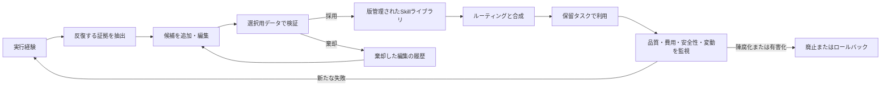
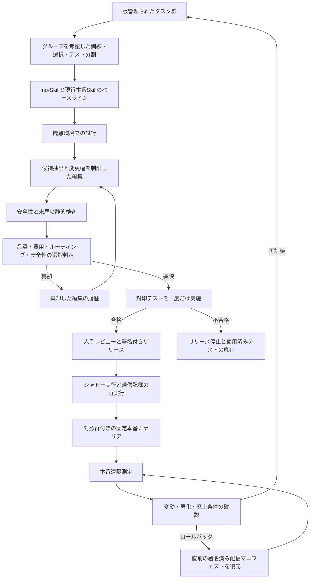

## はじめに

Agent Skills は、LLM エージェントに「何を知っているか」だけでなく「どう仕事を進めるか」も追加する仕組みである。[Agent Skills のオープン仕様](https://agentskills.io/home)では、必須の `SKILL.md` と、任意のスクリプト、参照資料、テンプレートなどを一つのフォルダーにまとめる。エージェントは最初に名前と説明だけを見て候補を発見し、必要なときに本文を読み、さらに必要な場合だけ付属資源を使う。この仕組みを段階的開示（progressive disclosure）と呼ぶ。

本稿では、標準化されたフォルダー形式を指すときは「Agent Skills」、より広く、再利用可能な手順・プログラム・ワークフローメモリ・学習済み方策まで含む研究概念を指すときは「エージェント技能（agentic skills）」と書き分ける。Voyager、Agent Workflow Memory、ASI など初期の研究は後者の先駆けであり、後発のオープン仕様を直接評価したものではない。したがって、これらから借りるのは実行検証、抽象化、再利用といった仕組み上の知見である。以降の「Skill」は議論中の成果物の略称とし、フォルダー仕様そのものが論点のときは「Agent Skill」と明記する。

手続きの自動獲得と改善自体は2023〜2025年の研究にも存在した。転換点は、標準フォルダー形式が2025年後半に普及した後、2026年に、Skill 文書そのものの反復編集、評価、ルーティング、合成、圧縮、ライフサイクル管理を明示的に扱う研究が集中したことである。

ただし、結論は「自動生成すれば性能が上がる」ではない。むしろ現在の研究が示しているのは次の条件付きの結論である。

> 現在もっとも強い証拠は、再利用可能な手順上の差があり、実行結果を十分な検証器で確認できる領域から得られている。独立した保留テストセットによる棄却は、保守的な本番管理策として妥当である。ただし、それ自体が改善の原因だと切り分けて実証されたわけではない。検証器、ルーティング、コスト、安全性の管理を欠いた自己編集は、Skill を増やすほど悪化しうる。

本稿は2026年7月10日時点の公開情報を対象とする。2026年の主要研究の多くは arXiv プレプリントであり、独立追試も十分ではない。数値は各論文の実験条件における報告値で、製品一般の保証ではない。査読済み成果とプレプリントを区別し、相反する結果も含めて実務上の示唆へ変換する。

## 先に結論

1. <strong>最適化対象は Skill 本文だけではない。</strong>発見用メタデータ、本文、付属コード、検索索引、複数 Skill の順序、廃止判断までが一つの系である。
2. <strong>単発生成を検証なしで採用してはいけない。</strong>[SkillsBench](https://arxiv.org/abs/2602.12670)では、Skillへの依存性と条件間の差も審査された87件の端末・コンテナ実行タスクにおいて、精選した Skill が18構成のタスク単位マクロ平均を33.9%から50.5%へ、16.6ポイント押し上げた。各構成・条件では $87\times3$ 回を固定して試行し、主要条件全体で9,396件の結果を得ている。一方、同論文の特定の「Skill作成器から解決器へ渡す手順」では、自己生成条件が3構成すべてで no-Skill を8.1〜11.5ポイント下回った。ただし、この差には生成品質だけでなく、発見失敗や作成器と解決器の干渉も含まれる。
3. <strong>実行フィードバックが核心である。</strong>成功・失敗の軌跡、テスト結果、生成物を根拠にする方式には、現時点で単発生成や根拠のない自己反省より強い証拠がある。別データによる候補の棄却は、ほかの仕組みと一体で評価されているため、単独の効果とはみなさず、本番運用上の安全策として採用する。
4. <strong>小さな編集を棄却可能にする。</strong>[SkillOpt](https://arxiv.org/abs/2605.23904)は編集数を「テキスト版の学習率」として制限し、選択用データで評価値が改善した候補だけを採用する。実務で重要なのは深層学習の比喩ではなく、変更幅、検証、ロールバックを明示した点である。
5. <strong>Skill は多いほどよいわけではない。</strong>SkillsBench のタスク間比較では、1〜3個に絞った Skill 群が4個以上の Skill 群より大きな改善と関連した。[SkillMOO](https://arxiv.org/abs/2604.09297)の探索記録でも、成功した変更の多くは追加ではなく削除・置換だった。いずれも「削除すれば必ず改善する」と示す因果実験ではない。
6. <strong>ルーティングが新しいボトルネックになる。</strong>大規模ライブラリでは、必要な Skill が存在しても選べない。[Scaling Laws of Skills](https://arxiv.org/abs/2605.16508)は、平坦な候補一覧における選択精度が実験範囲でライブラリサイズの対数に沿って低下すると報告する。
7. <strong>本文の長さと性能は別々に扱えない。</strong>[SkillReducer](https://arxiv.org/abs/2603.29919)は説明を平均48%、本文を平均39%圧縮し、同論文内の適応的な評価タスクでは平均品質がわずかに改善した。一方、[Compression, Structure, and Executor Capability](https://arxiv.org/abs/2607.03048)の制御実験では、短縮後の品質の非劣性も、実価格での損益分岐点到達も確認できなかった。圧縮は無条件に望ましいものではなく、実行モデルごとに検証すべき効率化の仮説である。
8. <strong>本番の目的関数は多目的でなければならない。</strong>成功率だけを上げると、トークン、時間、誤発火、権限、安全性、保守負債を悪化させる。
9. <strong>自動最適化はオフライン CI として始める。</strong>オンラインで自己改変させる前に、履歴の固定、候補生成、隔離実行、独立検証、人間承認、段階配信を整える。
10. <strong>Skill は信頼済みプロンプトではなく、サプライチェーン上の成果物である。</strong>手順だけを含む Skill もある一方、実行コードを含んだり、エージェントに特権操作を指示したりできる。生成・取得・更新・実行の各段階で、出所、差分、権限、依存関係、ネットワークを検査する必要がある。

## 実務導入の最短手順

実装判断だけを先に行う場合は、次の順序で進める。詳細な研究根拠と限界は後半で説明する。

1. <strong>停止条件を確認する:</strong> 独立したデータ分割、信頼できる検証器、既定で拒否する実行環境、責任者、総費用上限のいずれかがなければ、観測・提案段階より先へ進めない。
2. <strong>運用契約を承認する:</strong> 対象範囲、リスク区分、テナントとデータの境界、同意、保存期間、ライセンス、禁止操作、到達可能な最大段階を固定する。
3. <strong>役割と証拠一式を定める:</strong> 最適化器は提案だけを行い、評価、セキュリティとデータ管理、リリース、当番対応、記録・プライバシー管理の決定権を分離する。
4. <strong>オフラインで比較する:</strong> 現行本番Skillを昇格判断のベースライン、no-Skillを改善余地の診断条件とする。変更幅を制限した候補を選択用データで選び、探索停止後に封印したテストセットを一度だけ開く。
5. <strong>署名済みマニフェストを段階配信する:</strong> スタブを用いた再実行、相互に排他的な固定カナリア群、段階的な展開の順に進む。遠隔測定が不完全な場合は成功扱いせず、一時停止する。
6. <strong>異常時は即時封じ込める:</strong> 重大な安全事象では統計上のしきい値を待たずに隔離し、完全な配信マニフェストのロールバック、認証情報の失効、副作用の補償、インシデント対応へ移る。
7. <strong>通常廃止とセキュリティ上の失効を分ける:</strong> 低利用・重複は区分別の証拠に基づき段階的に廃止する。方針違反は、どの配信状態からでも直ちに隔離・失効させる。

## 何を Agent Skill と呼ぶのか

実務上は、単なる長いプロンプトと Skill を分けないと評価が崩れる。本稿では、Skill を「ある種類の課題に再利用でき、適用条件、実行手順、終了条件、成果物の契約を持つ手続き的部品」と捉える。[SoK: Agentic Skills](https://arxiv.org/abs/2602.20867)の表記を借りると、論理的には次の4要素で表せる。

$$
S = (C, \pi, T, R)
$$

- $C$: いつ使うかを決める適用条件
- $\pi$: 自然言語、コード、ツール列、またはその組み合わせで表す実行方針
- $T$: 成功、失敗、打ち切りを判断する終了条件
- $R$: 名前、入力、出力を含む再利用可能なインターフェース

この定義は、現行仕様の `name`、`description`、`SKILL.md`、付属資源を分析しやすく抽象化したものであり、仕様そのものが4項組を要求しているわけではない。また、以下は排他的な種類ではなく、同じシステム内で重なる<strong>直交的な役割</strong>である。たとえば Skill 本文はプロンプトとして渡され、Skill は手順メモリとして保存され、ハーネスがそれらとツールを接続する。

| 部品 | 主な役割 | 自動最適化で変えるもの | 主な失敗 |
|---|---|---|---|
| プロンプト | 文脈を渡す表現。単発にも再利用にもなる | 文言、例、順序 | 過学習、長文化 |
| メモリ | 事実・実行例・手順を保存し検索する基盤 | 保存、検索、要約 | 古さ、ノイズ、検索漏れ |
| ツール | 呼び出し可能な能力。本稿では比較上、原子的操作を典型とする | スキーマ、説明、選択 | 誤呼び出し、過剰権限 |
| Skill | プロンプトや資源をまとめ、ツールを呼びうる、発見可能で再利用可能な手順成果物 | 発火条件、手順、コード、構成 | 誤発火、干渉、陳腐化 |
| ハーネス | 上記を公開・実行・統制する実行基盤 | コンテキスト、ループ、隔離環境 | Skill以外の変更との交絡 |

この境界は重要である。Skill 本文を変えた実験と、モデル、ツール、ハーネス、テストを同時に変えた実験では、改善の帰属が異なる。

## 研究の流れ: 「保存」から「検証付き最適化」へ

### 2023–2024: 経験を再利用可能な手順へ

[Voyager](https://arxiv.org/abs/2305.16291)は Minecraft でコードを実行し、観測した環境状態を別のGPT-4エージェントが自己検証した後にライブラリへ蓄積し、説明文の埋め込み表現を使って再利用した。これは決定的な検証器ではなく、論文自身も検証誤りを制約として挙げている。ここで示された原型は「探索 → 実行 → 検証 → 保存」である。[Agent Workflow Memory](https://proceedings.mlr.press/v267/wang25bx.html)は、Web エージェントの軌跡から複数段階のワークフローを抽出し、経験をそのまま保存するより高い抽象度で再利用する方向を示した。

この時期の知見は、Skill を単なる知識断片ではなく、時間方向にまとまった手順として扱うこと、そして成功判定を伴う実行可能な表現が強いという点にある。

### 2025: プログラム化と自律探索

[Inducing Programmatic Skills for Agentic Tasks](https://arxiv.org/abs/2504.06821)の ASI は、Web 操作の低水準な操作列から Python 関数を作り、実際に呼び出して検証した。WebArena では Claude 3.5 Sonnet の静的ベースライン32.7%、テキスト Skill を使う AWM 36.3%に対し、40.4%と報告した。プログラムは短い呼び出しで複数操作をまとめられるが、UI や API の変更には脆い。

[SkillWeaver](https://arxiv.org/abs/2504.07079)も、Web サイトを探索し、練習し、再利用可能な API を合成・改善する。報告された相対改善は WebArena 31.8%、実サイト39.8%で、強いエージェントが作った Skill が弱いエージェントへ移る可能性も示した。一方、Web 操作という限定領域と、WebArenaおよび少数の実サイトで得た結果を、一般的な `SKILL.md` 市場へ直接外挿はできない。

### 2026: Skill 自体を学習対象とする

2026年の研究は次の方向へ分岐した。

- 軌跡をまとめて Skill に蒸留する: [Trace2Skill](https://arxiv.org/abs/2603.25158)、[gskill](https://dl.acm.org/doi/10.1145/3786335.3813196)
- Skill 文書を反復編集する: SkillOpt、SkillMOO
- Skillバンクとモデル方策を同時に学ぶ: SkillRL
- 大規模ライブラリから選択・合成する: 現実条件でのSkill利用研究、Scaling Laws、SkillComposer
- Skill を圧縮・階層化し、廃止候補を見つける: SkillReducer
- 長期対話から個人 Skill を抽出・統合する: AutoSkill
- 生成物の安全性・サプライチェーン・検出限界を測る: Skill-Inject、Agent Skills in the Wild、RouteGuard、Guardian defenses、POISE



## 自動最適化を6つの問題に分解する

「Skill を自動でよくする」という一文には、異なる6問題が混ざっている。個別に評価しないと、本文がよくなったのか、選択がよくなったのかを判別できない。

### 1. 発見: 何を Skill に昇格させるか

すべての成功例やユーザー指示を Skill にすると、ライブラリは重複と一時的な例外で膨らむ。候補にすべきなのは、複数タスクで繰り返される失敗、安定したユーザー制約、何度も作る補助コード、明示的な境界条件である。

[AutoSkill](https://arxiv.org/abs/2603.01145)は長期対話のユーザー発話から候補を抽出し、既存 Skill との近傍比較により `add`、`merge`、`discard` を決める。重要な設計は、モデル自身の返答を事実上の教師にせず、ユーザー側の信号を主な根拠にする点である。ただし同論文の実験は主に WildChat から抽出した SkillBank の統計と事例であり、下流タスクの A/B 成功率を示す有効性試験ではない。実務では「抽出できた」と「役に立った」を分けて測る必要がある。

したがって AutoSkill は、永続化、衝突解決、ロールバック、非推奨化、廃止までを検証済みのライフサイクル基盤ではなく、ライフサイクル操作を提案した方式と読むべきである。テスト時の改良で生じた成果物も、既定ではタスク固有の一時物として期限を設け、別タスクでの選択試験を通るまでレジストリへ昇格させない。

発見元は対話や実行軌跡だけではない。情報源の種類ごとに、来歴情報と検証条件を変える必要がある。

| 情報源 | 例 | 保つべきもの | 主な検証 |
|---|---|---|---|
| 実行軌跡 | 成否付きツール呼び出し履歴 | 状態、順序、反例 | 環境での再実行、成果物の検証器 |
| ユーザー需要 | 対話、課題票 | 意図、テナント境界、同意 | 需要の反復、タスクをまたぐ改善幅 |
| 文書・コード | API、リポジトリ、論文、ノートブック | バージョン、ライセンス、依存関係 | テスト、署名、出典引用 |
| マルチモーダルな実演 | 解説動画、視覚的な成果物 | 時間順序、画面状態、出力 | 時系列検査、成果物判定、人手抽出検査 |
| 観測記録 | 実験ノート | `FACT` / `JUDGMENT` / `SUGGESTION`、確実性 | 来歴、専門家レビュー、実験確認 |

[Resource2Skill](https://arxiv.org/abs/2606.29538)は動画、リポジトリ、記事、参照成果物をマルチモーダルな Skill Wiki へ変換した。主要な評価値は自動成果物判定器への依存が大きい。人手確認は、対応する40組を各5名が評価した盲検 A/B 比較に限られ、判定器と人間の一致度も17組のタスク・成果物だけで確認している。[SkillFoundry](https://arxiv.org/abs/2604.03964)は科学分野のリポジトリ、API、論文、ノートブック、文書から契約付き Skill を掘り起こしたが、下流評価の範囲は限定的である。[Notes2Skills](https://arxiv.org/abs/2606.11897)は3コーパスの461注釈区間と149件の保持対象指示で確実性の保存を監査したが、下流の意思決定検証は FreeNotes の湿式実験3セッションに限られる。観測や仮説を断定的な命令へ変えてはいけない。

### 2. 蒸留: 軌跡を再利用可能な手順へ変える

失敗ログを一件ずつ追記すると、症状の寄せ集めになる。[Trace2Skill](https://arxiv.org/abs/2603.25158)は成功・失敗軌跡を並列に分析し、個別の修正案を階層的に統合する。失敗分析ではログだけで推測せず、生成物を検査し、最小修正で原因を再検証する。SpreadsheetBench の人手作成Skillから始めた、失敗例のみ・同一軌跡群の比較では、並列統合が122Bモデル利用時の全指標と35Bモデルの検証済み評価値で逐次編集を上回った。一方、35BモデルのSoft/Hard指標では最良の逐次条件をわずかに下回った。同じ8基のA100環境で、所要時間は並列で約3分、逐次処理の一括数4で15分、一括数1で60分だった。数式の再計算、読み戻し確認、構造保持など、複数軌跡で繰り返す標準手順も抽出した。

この設計から得られる一般則は次の通りである。

- 成功例は「残すべき不変条件」、失敗例は「追加すべき境界・回復策」として別々に分析する
- 一件の失敗を一般則にしない。複数軌跡で支持数を持たせる
- ログの文字列ではなく、ファイル、テスト、環境状態で因果を確認する
- 低頻度の知識は本文へ詰めず、`references/` へ送る

#### 検証の時点と介入単位

[SPARK](https://arxiv.org/abs/2605.09192)は、実行前の計画要約と、環境操作後の証拠に基づく事後蒸留を区別し、論文固有の軌跡診断値 PDI を介入の判断材料に使う。[SkillGen](https://arxiv.org/abs/2605.10999)は Skill を介入として扱い、同一事例の Skill/no-Skill 対から、修復した件数と悪化させた件数の両方を数え、複数候補から検証済みの候補を選ぶ。後者は単一 Skill の適応を制御した実験であり、大規模ライブラリ全体の検証ではない。

実務では、環境から証拠を得る前の「もっともらしい計画」を事実扱いしない。同一事例での対応付き比較、修復件数と悪化件数、独立した導出用・選択用・テスト用データを要求する。最新の反復結果をそのまま採るのではなく、選択用データで最良候補を固定する。

### 3. 改訂: Skill 文書をどう更新するか

SkillOpt は、Skill 文書を凍結モデルの外部状態とみなし、試行実行、振り返り、限定的な編集、選択判定を反復する。候補は `add`、`delete`、`replace` の小さな編集で作り、選択用データの評価値が厳密に改善した場合だけ採用する。棄却した編集も「何を試して悪化したか」という記録として残す。

同論文は、直接対話の $7\times6=42$ セルと、ALFWorldを除く2種類のハーネスの $2\times5=10$ セル、計52セルすべてで、測定値が比較対象中の最良または同率最良だったと報告した。GPT-5.5を使った直接対話の6ベンチマーク・マクロ平均 +23.5ポイントは、Skill本文をシステム指示または開発者指示の前方に置く、プロンプトに近い最適化の結果である。Skillの発見、段階的開示、フォルダー内の付属資源は含まない。別に、既知の単一 Skill を配置した Codex / Claude Code ハーネスの5ベンチマーク・マクロ平均では +24.8 / +19.1ポイントを報告したが、こちらもライブラリ内のルーティングは評価していない。これは2026年5月のプレプリント内での比較であり、独立追試はまだない。1ポイント改善するために0.6M〜46.4Mトークンを使ったという範囲は、GPT-5.5を対象モデルと最適化モデルの両方に使った事例研究に基づく。実務へ持ち込むべきなのは大きな改善値ではなく、次の制御である。

- 訓練用・選択用・テスト用データの分離
- 一度に変える箇所数の上限
- 同点を改善と数えない保守的な判定
- 編集差分と評価結果の追跡
- 最良版の固定と即時ロールバック

2026年7月のプレプリントは、この設計を最小化・再帰化する方向へ進んだ。[SkillOpt-Lite](https://arxiv.org/abs/2607.03451)は、軌跡探索、共通属性の抽出、独立検証からなる最小構成を提案し、LiveMathで SkillOpt を上回ると報告した。[MetaSkill-Evolve](https://arxiv.org/abs/2607.05297)は、タスクSkillを速い周期で、Analyzer / Retriever / Allocator / Proposer / Evolver を規定する5要素のメタSkillを遅い周期で更新する。単一の凍結基盤モデルで、OfficeQA / SealQA / ALFWorld の未加工基盤モデル比 +23.54 / +16.09 / +1.92ポイントを報告した。いずれも固有ベンチマーク上のプレプリントであり、独立した本番追試はない。最適化器自身を変える場合は、メタSkill、評価器、予算、停止規則も版管理された候補とみなし、別の保留テストセットと人手承認を通す必要がある。

### 4. 方策の共同学習と内在化: どこに Skill を置くか

[SkillRL](https://arxiv.org/abs/2602.08234)は、成功軌跡と失敗から得た教訓を基に、汎用・タスク固有の階層型 SkillBank を作る。まずコールドスタートSFTで Skill の使い方を教え、その後 GRPO と動的な Skill 追加を組み合わせる。Qwen2.5-7B-Instructを対象モデル、OpenAI o3を教師モデルに用いた報告では、ALFWorld 89.9%、WebShop成功率72.7%だった。ALFWorldの77.6%は論文表で `GRPO*` と記され、Feng et al. (2025)から再現した比較値であるため、同一実験内で条件を完全にそろえた通常のGRPO対照群とは断定できない。Skillを未加工の軌跡へ置き換える、階層をなくす、コールドスタートをなくす、という各条件では性能が大幅に低下した。

これは強力だが、外部文書だけを編集する方式とは運用コストが違う。論文の実験は8基のH100で約30時間/実験と報告され、SFT と RL によって対象モデル自体も変わる。閉じたモデルを利用するチームや、説明可能な差分を優先する組織では、まず非パラメトリック最適化を選ぶ方が現実的である。

SkillRLは外部 SkillBank と方策を共同学習する一方式であり、内在化の全体を代表するものではない。2026年のプレプリントは配置方法を次のように広げた。

| 配置 | 代表例 | 実行時の方式 | 強み | 運用上の代償 |
|---|---|---|---|---|
| 外部拡張 | SkillOpt、SkillRLのSkillBank | 本文・参照資料を読み込む | 可読性、即時更新、Skill単位のロールバック | トークン、検索、指示遵守 |
| 完全内在化 | [Skill0](https://arxiv.org/abs/2604.02268) | Skill検索なし | 実行時コンテキストを削減 | 再訓練、忘却、差分監査の難しさ |
| 内外ハイブリッド | [Skill0.5](https://arxiv.org/abs/2605.28424) | 汎用Skillは内在化、タスク固有Skillは外部 | 安定知識と更新性を分離 | 二層の版・衝突管理 |
| ソフトプロンプト | [SoftSkill](https://arxiv.org/abs/2606.20333) | タスク固有の連続表現 | 単発回答で短い潜在制御を使える | 長期エージェントタスクでは結果が混在し、ルーティングと移植性は未検証 |
| Skill別アダプター | [Skill-to-LoRA](https://arxiv.org/abs/2606.16769) | SkillごとのLoRAを読み込む | 実行時の本文トークンを減らせる | Skillごとに約6.03Mパラメーター・24 MB、事前学習費用 |
| ハイパーネットワーク型アダプター | [Parametric Skills](https://arxiv.org/abs/2606.30015) | 本文からLoRAを生成 | テスト時にパラメーター化 | 判定モデル・参照文との類似度中心の評価、初期悪化、限定的な継続学習の証拠 |

各報告値は、固有のタスク、モデル、プレプリント条件で得られたものである。SoftSkillの長期課題向け耐性試験では、Spreadsheetの選択用データで選んだ条件が28.2（no-Skill 39.6、本文Skill 52.5）、ALFWorldが71.6（本文Skill 79.1）だった。Skill-to-LoRAの21 Skill部分集合は、Full-Skill-Text条件で改善した7件と、差がゼロでトークン量が極端な14件からなり、悪化した事例を含まない。また、トークン削減量に合成・学習費用は含まれない。Parametric Skillsの主要なソフトウェア工学評価は、検証器で確認した完了率ではなく、DeepSeek-V4-Flashによる判定と参照文との類似度を使う。HumanEvalでは初期アダプターが no-Skill の133 / 164から123 / 164へ悪化し、5回の改良後に139 / 164となった。継続学習の証拠も31タスクに限られる。

選択軸は正解率だけではない。即時更新、監査可能性、Skill単位のロールバック、モデルへのアクセス、実行時トークン、事前導出費用、アダプター間干渉も考慮する。外部Skillとパラメトリック表現は、同じレジストリ項目から派生した成果物として来歴管理する。「再生成可能」と言うには、元の本文と振る舞いテストだけでなく、基盤チェックポイント、トークナイザー・埋め込みインターフェース、プロンプトとハーネス、学習データとコード、ハイパーパラメーター、乱数種、アダプターまたはハイパーネットワークの設定、配信・合成基盤まで固定する必要がある。振る舞いテストは再生成手段ではなく、生成後の成果物を検証するために使う。

### 5. ルーティングと合成: 正しい Skill を正しい順で使えるか

Skill が増えると、生成品質より先に選択品質が壊れる。[How Well Do Agentic Skills Work in the Wild](https://arxiv.org/abs/2604.04323)は34,198個の実在 Skill から検索する設定を作り、SkillsBenchで既知の問題がある3件を除いた84タスクを各条件3回実行し、理想条件から現実条件へ段階的に移した。以下の Claude の値は Opus 4.6 + Claude Code v2.1.19を使った結果で、検索方式は上位5件を返すエージェント型ハイブリッド検索である。

Claude Opus 4.6 では、精選 Skill を強制読み込みした参照条件が55.4%、同じ Skill を自律選択させると51.2%、妨害用 Skill を加えると43.5%、34K件から精選 Skill を含めて検索すると40.1%、精選 Skillを除いた一般 Skillだけでは38.4%だった。no-Skill は35.4%である。強制読み込みは発見失敗を除くが、手順自体の干渉は残るため数学的な上限ではない。つまり「よい Skill が存在すること」と「発見・読解・適応できること」は別問題である。問い合わせ固有の改良は、正解判定用の検証器を見ずにタスク環境を一度探索して書き直す方式である。精選 Skill を含む検索条件では Claude を40.1%から48.2%へ回復させた。一方、精選 Skillなしでは Claude 38.4→37.9、Kimi 19.8→23.1、Qwen 19.7→21.5で、一貫した回復は見られなかった。

検索後にも別の判断がある。実務上は、<strong>候補検索 → 類似Skillの危険性ラベルを踏まえた適切な代表選択 → 現在の状態で呼ぶか見送るか → 必要個数と順序の決定 → 手順遵守 → 結果</strong>に分けて考える。[SelSkill](https://arxiv.org/abs/2606.00510)は、同じ軌跡の先頭部分から「呼ぶ・見送る」の対を作り、「意味的に関連する」ことと「今呼ぶと有益」を分けた。[SkillResolve-Bench](https://arxiv.org/abs/2606.10388)は、役立つSkillと危険な類似Skillからなる661組を使い、古い資源や前提条件違反を含む同能力Skillが上位$K$件に露出する割合 HSR@$K$を導入した。うち630組は、*Skill Retrieval Augmentation for Agentic AI*が導入した正例中心のSkill検索ベンチマーク [SRA-Bench](https://arxiv.org/abs/2604.24594)を基に構築され、31組は SkillsBench 由来である。検証器で結果まで対応付けた主要部分は14組に限られる。したがって HSR@$K$ は実行前の露出を表す代替指標であり、実行時の無害性やパッケージの安全性を保証しない。[SkillReranker](https://arxiv.org/abs/2607.06283)はタスクを状態段階へ分解し、固定件数ではなく可変個数の Skill を選ぶ。いずれも2026年のプレプリントであり、固有ベンチマークを越えた本番効果は未確立だが、検索再現率だけでは足りないことを示す。

[SkillCoach](https://arxiv.org/abs/2607.01874)は、Skillの選択、遵守、合成、Skillに基づく振り返りを評価する過程別ルーブリックを試行結果から進化させ、外部検証器の結果を別の信号として残す。偶然成功した悪い過程を見つける方向は有用だが、ルーブリック自体も学習対象である。検証器の代替にはせず、ルーブリックの版、判定者間の一致、攻略耐性の評価を固定した補助診断として扱う。これも2026年7月のプレプリントで、独立した本番追試はない。

Scaling Laws のプレプリントは、平坦な自然言語候補一覧で次の局所的経験則を報告する。

$$
\mathrm{Acc}(N) = a - b \ln N
$$

測定範囲は $N \in \{10,20,50,100,200,500\}$ で、15モデルの $R^2$ は0.968〜0.981、表の平均傾きは $b\approx0.050$、倍増当たりでは $b\ln2\approx3.5$ポイントだった。これは6点だけの有限範囲への当てはめであり、必要 Skill を必ず含む平坦なプロンプトでは、候補数とコンテキストのトークン数が同時に増える。論文の対照実験も、純粋なトークン予算の効果を分離しておらず、コンテキスト長をそろえた確認は1モデルだけである。したがって、あらゆる階層型ルーターに通じる普遍法則でも、候補数と長さの因果効果を分解した結果でもない。それでも実務上の示唆は明確である。

- 全 Skill を常に見せず、領域ごとの絞り込みと上位$k$件の選択で露出集合を絞る
- `description` に対象、操作、入力、出力、非対象を入れる
- 類似 Skill 同士に相互排他的な境界を書く
- 「何でも支援する」のような抽象 Skill を平坦な候補集合から外す
- ルーティングの再現率だけでなく、ライブラリ内の誤選択も測る

[SkillComposer](https://arxiv.org/abs/2606.32025)は、部分集合、個数、順序を別々に決めず、Skill IDの列を制約付き自己回帰デコーダーで一度に生成する。学習対象は3.9Mパラメーターだが、別に凍結した Qwen3-Embedding-0.6B エンコーダー、集合・個数推定ヘッド、TF–IDF事前分布、ビーム探索を使う。全9,872件を90 / 5 / 5で訓練・検証・テストに分け、実タスクとSkillの対応を持つ基準例は65件、残る9,807件は Gemini で合成した。軌跡記録がない基準例の順序も Gemini 2.5 Pro が付与した。

下流評価では SkillsBench 88件からオフィス・文書系13件を除く75タスクを、各条件3回、GPT-5.2-Codex と Gemini-3-Pro-Preview で実行した。no-Skill 比は +23.1 / +18.2ポイントだったが、Qwen3-Embeddingによる上位3件検索との差は +1.3 / +2.2ポイントだった。

65件の実基準例と下流タスクの独立性は明記されず、合成データだけで学習したチェックポイントが下流実行を担ったとも示されていない。また、二値関連度を使う nDCG は、同じ正解集合内の順序を区別しない。同じ集合の順序だけを入れ替える除去実験もない。したがって、この差を順序付けや構造化合成に固有の効果とは帰属できない。タスク群を分離した評価、順列に敏感な順序正解率、同一集合での順序入れ替え比較、不確実性の提示が必要である。

### 6. 圧縮・再編・廃止: 何を消すか

SkillReducer の55,315件は公開Wildコーパス全体であり、38.5%という「実行可能な中核規則」の比率は、3情報源から層化抽出した90 Skill、15,107段落項目の分析値である。機能評価では、別の600 Skill（SkillHub 87、コミュニティ464、Wild 49）に対し、各5個の生成タスクを用いた。

メタデータ評価の536 / 536は、元の`description`が発火した生成問い合わせに対し、圧縮後も発火したという正例再現率の保持を示す。負例の本番通信、誤発火、確率校正、ライブラリ全体でのルーティング同等性は測っていない。説明文の平均圧縮率48%も内訳に注意が必要である。既存説明171件は56.5%削減した一方、説明がないか短すぎた429件では、まず説明を生成し、その生成文を基準に44.6%削減した。

本文は平均39%圧縮し、タスクに基づく評価では86.0%が元と同等以上、平均評価値は0.722から0.742へ上がった。一方で14.0%は低下し、著者の原因分析で真の圧縮による悪化とされたものは全体の4.7%だった。「例が暗黙の仕様になっている」Skillが代表的な失敗である。

ただし元条件では元の本文とすべての参照資料を与え、圧縮条件では中核本文と最大6回の`read_file`による選択的な参照資料アクセスを与える。0.722→0.742という変化は、長さ、構造、参照資料の選択方針、ツール経由のアクセスを同時に変える「圧縮 + 段階的開示」の複合介入である。「注意散漫が減った」ことへ因果帰属するには、長さをそろえ、参照資料へのアクセス条件も同一にした除去実験が必要である。

直接の反証的証拠もある。[Compression, Structure, and Executor Capability](https://arxiv.org/abs/2607.03048)は、検証器付きのソフトウェア工学タスク40件、配信条件10種類、各3回の計1,200試行で、表現、変換器、実行モデル、実価格の効果を分けた。決定的な短縮は、事前設定した-5ポイントの許容幅で非劣性を確立できなかった。小型の実行モデルでは、構造化表示と範囲限定読み込みが実費を下げずに品質を落とした。多重比較補正後に残った差は、高性能な実行モデルによる約+27ポイントだけで、価格は約5倍だった。どの最適化表現も平均実価格の損益分岐点へ届かなかった。これは SkillReducer を否定するものではなく、圧縮効果が実行基盤に依存し、品質の非劣性と通貨建ての償却後費用を同じ試行で測る必要があることを示す。

SkillMOO は Skill 群を、成功率と GLM-5 API の価格に基づくLLM推論費用（USD）の二目的で探索した。

$$
\min_{s \in \mathcal{S}} \left[-\mathrm{PassRate}(s),\ \mathrm{Cost}(s)\right]
$$

SkillsBench のソフトウェア工学タスク16件、GLM-5の一構成では、各タスクを10回独立実行した。SkillMOO / 元のSkill / no-SkillをScott–Knott ESDで比較すると、成功率がゼロでない12タスク中11タスクで SkillMOO が成功率の最上位群に入り、最大+21ポイント、元のSkill群比で最大31.7%のUSD推論費用削減を報告した。この削減率には、一度だけ必要となるタスク当たりUSD 1.76〜13.73の探索費用を含まない。論文は通貨建ての損益分岐点や、必要な再利用回数を確立していない。検証器は GPT-5.4 で最低40テストへ拡張し、人手確認した。38編集の探索的分析では、Skillの削除・置換が追加より成功と結びついた。ただし、単一ベンチマーク、単一モデル、LLM生成で拡張したテスト群という制約があり、「削除が常に正しい」という因果則ではない。

## 主要研究の比較

6問題は読み進めるためのライフサイクル軸であり、研究を一意に分類する体系ではない。各方式は別に、情報源（軌跡 / ユーザー / 文書 / マルチモーダル）、最適化する成果物（本文 / コード / グラフ / パラメーター）、配備方式（外部 / パラメトリック / ハイブリッド）、検証手段（テスト / 状態 / 判定モデル / 人間）、実行時の選択単位（単一Skill / 集合 / 順序付き経路 / アダプター）、発表状況で比較する。たとえば「蒸留」は本文SkillにもLoRAにもなり、「ルーティング」は外部フォルダーにもアダプターにも必要である。

| 研究 | 最適化する対象 | 主な信号 | 重み更新 | 代表的な報告 | 読む際の注意 |
|---|---|---|---|---|---|
| ASI (2025) | 実行可能API | 実行成功、状態変化 | なし | WebArena 32.7→40.4 | Web特化、LLM判定器を含む |
| SkillWeaver (2025) | Web APIライブラリ | 自律探索と練習 | なし | 相対 +31.8% / +39.8% | 初版プレプリント、対象環境が限定的 |
| SkillRL (2026) | 階層SkillBank + 方策 | 二値報酬、失敗分析 | SFT + GRPO | ALFWorld 89.9%; GRPO* 77.6（再現値であり、同一試行の対応対照ではない） | 大きな学習計算、公開重みモデルが前提 |
| Trace2Skill (2026) | Skillディレクトリ | 成否付き軌跡、成果物検証 | なし | 複数モデル・領域へ正の移転 | 大規模計算、修正案の選択は高価 |
| [gskill](https://dl.acm.org/doi/10.1145/3786335.3813196) (2026) | リポジトリSkill | 合成不具合、単体テスト | なし | bleve 24→93%（Mini-SWE-Agent + GPT-5-mini） | リポジトリごとに約60件の保留タスク、提案器はGPT-5.2-pro、2リポジトリのみ |
| SkillOpt (2026) | 単一Skill文書 | 評価値付き一括実行、選択判定 | なし | GPT-5.5直接対話平均 +23.5ポイント | プレプリント、検証器依存、学習トークン量が大きい |
| SkillLearnBench (2026) | 生成法そのもの | 仕様、軌跡、結果 | なし | 自動法平均27.3〜31.1%、人手74.5% | Skill依存タスクを選別、判定モデルの指標を含む |
| SkillMOO (2026) | Skill群 | 成功率、推論費用（USD） | なし | 12タスク中11件で成功率最上位群 | 10回実行のScott–Knott ESD、単一モデル |
| Scaling Laws (2026) | ライブラリ構造 | ルーティング / 実行 | なし | 管理器が $N=150$ の1,600保留例で71.3→91.7 | 対数当てはめとは別の複合介入 |
| SkillReducer (2026) | メタデータ、本文、参照資料 | ルーティング、忠実性、タスク評価 | なし | 本文平均39%圧縮 | 14%で評価低下、判定モデルを併用 |
| SkillComposer (2026) | 部分集合・個数・順序 | 主に合成したSkill構成対 | 補助方策3.9Mパラメーターを学習 | 上位3件検索比 +1.3 / +2.2ポイント | 初版、実基準例は65 / 9,872 |

数値の分母、モデル、ハーネス、task選定が異なるため、横方向のランキングには使えない。表の目的は、最適化対象と必要な信号を比較することにある。

## なぜ研究結果が矛盾して見えるのか

一方では平均 +16.6ポイント、他方では平均 +1.2ポイント、さらに自己生成はマイナスという結果がある。これは必ずしも矛盾ではない。

### 精選 Skill と公開 Skill は別物

SkillsBench の主結果は、タスクと独立に書かれ、品質審査と漏洩監査を通った精選 Skill を使う楽観的条件である。さらに、タスクの採択基準は Skill への依存性を求め、条件間に測定可能な差がない候補を「信号が弱い」として除く。そのため、+16.6ポイントは任意の業務タスクに対する期待改善ではない。対して [SWE-Skills-Bench](https://arxiv.org/abs/2603.15401) は、49件の公開ソフトウェア工学Skillと、実在するGitHubリポジトリを特定コミットでコンテナ化して生成した約565件の要件事例を評価した。これらは実在の課題票ではなく、受け入れ基準からプロンプトを生成したもので、決定的なpytest検証器を持つ。全結果は Claude Code + Haiku 4.5 の単一構成で、49 Skill中39件は成功率が変わらず、平均は89.8%から91.0%へ+1.2ポイント、3 Skillは最大10ポイント悪化した。悪化例では、古いAPI版や具体的なテンプレートがリポジトリの文脈と衝突し、文脈干渉が起きていた。

### 自己生成条件は生成品質だけを測っていない

SkillsBench の自己生成条件では、skill-creatorでSkill群を作った後に解決器が利用する。監査対象は、条件差が極端だった10組のタスク・構成から選んだ12軌跡に限られる。それでも、生成したSkill群を発見できない、作成処理が解決処理の資源を圧迫する、誤った内容を自信を持って使う、といった複数の仕組みが確認された。一つの実装では作成器と解決器が同じファイルシステム状態を共有し、改善例には事例固有情報の漏洩もあった。したがって -8.1〜-11.5ポイントは手順全体の結果であり、Skill本文の生成能力だけの効果ではない。この小規模監査は仕組みの存在を支持するが、各仕組みの出現率までは推定しない。

### Skill が必要な課題だけを選ぶと効果は大きくなる

[SkillLearnBench](https://arxiv.org/abs/2604.20087)は、no-Skill の成功率が低く、人手作成Skillなら解ける20タスク・100事例を意図的に選ぶ。17タスクは SkillsBench から改変し、3タスクは新規作成した。6種類のSkill生成LLMで作った Skill を、固定した Claude Sonnet 4.6 解決器でタスク単位のマクロ集計をすると、no-Skill 10.17%、人手作成の参照Skill 74.50%、4種類の自動方式の平均正解率は27.33〜31.08%だった。ただし参照Skillには、著者が書き換え、剪定、分割、フロントマター修正を行ったものがある。Teacher Feedback方式は、その参照Skillと検証器の失敗情報へ特権的にアクセスする。主評価は1回だけの試行で、3回試行の確認は各タスクの代表1事例だけである。4回反復の追加分析も Productivity Tools + Claude Sonnet 4.6 に限られ、そこでは自己フィードバックが徐々に逸脱し、外部教師のフィードバックは改善につながった。

### Skill の存在、発見、実行は別の確率

概念的には end-to-end 成功を次の積として見るとよい。

$$
P(\mathrm{success}) \approx
P(\mathrm{available})
P(\mathrm{routed}\mid\mathrm{available})
P(\mathrm{followed}\mid\mathrm{routed})
P(\mathrm{works}\mid\mathrm{followed})
$$

精選 Skill を強制読み込みする実験は最初の2項をほぼ固定する。34K件から検索する実験は4項すべてを測る。本文だけを改善しても、`description` が弱く発火しなければ、端から端までの効果はゼロである。

### 上限効果とタスク分布が違う

SWE-Skills-Bench は no-Skill ですでに平均89.8%で、改善余地が小さい。一方、gskill の bleve / Mini-SWE-Agent ベースラインは24%で、リポジトリ固有の知識を追加する余地が大きい。絶対改善値は Skill の品質だけでなく、ベースラインから上限までの余地にも左右される。

### 自己生成と検証付き最適化は別物

一回のタスク説明から Skill を書かせるのは「生成」である。「最適化」は、複数の成否付き実行と目的関数に基づいて候補を反復探索・選択する。独立データで棄却できることは定義そのものではなく、適応的過学習を抑えるために推奨するリリース規律である。「LLM が Skill を書いた」という共通点だけで同じ方法として扱ってはいけない。

## 実務向け参照アーキテクチャ

最初から本番会話を使って自己改変させるのではなく、Skill をソフトウェア部品として CI/CD に載せる。



### Step -1: 運用契約とリスク上限を先に定める

本番の実行軌跡を取り込むこと自体が、管理対象となるデータ操作である。対象範囲と対象外、テナントとデータの境界、同意、保存期間、情報源とライセンス、禁止操作、予算、到達可能な最大段階を一つの運用契約として承認するまで、軌跡の取り込みも候補の実行も始めない。

| リスク区分 | 典型条件 | 到達可能な最大段階 | 必須管理策 |
|---|---|---|---|
| R0: 制約付き | 公開・合成または非機密データ、読み取り専用、ネットワークなしまたは外向き通信仲介、決定的な検証器、不可逆な副作用なし | 本番カナリアまで可 | 毎回新しい隔離環境、必須判定、人手リリース、緊急停止 |
| R1: 管理付き | 社内・機密データ、許可先限定ネットワーク、取り消せる書き込み、単一テナント、強い検証器 | オフライン選択まで。カナリアにはリスク責任者の明示例外が必要 | VM級分離、追加承認、冪等性・補償、セキュリティ・データ責任者の拒否権 |
| R2: 制限対象 | テナント横断、秘密情報・高影響資源、破壊的・不可逆操作、弱い検証器、未管理の合成 | 観測・提案のみ | 本番認証情報、自動採択、カナリアを禁止し、人手で実行 |

リスク区分は、データの機密度、権限範囲、ネットワーク露出、副作用の不可逆性、テナント範囲、検証器の弱さ・不確実性、合成リスクを「大きいほど危険」の尺度へ正規化し、その最大値で決める。「低リスク」はR0を指す。絶対禁止事項を、平均品質や費用との交換条件にしてはならない。

#### 意思決定権

| 判断 | 最終責任者 | 越権できない規則 |
|---|---|---|
| 規約、リスク区分、許容幅、例外 | 指名されたリスク責任者 | セキュリティ・データ責任者の拒否権を上書きできない |
| 軌跡・情報源の受け入れ | データ責任者 + プライバシー・セキュリティ責任者 | 同意、ライセンス、保存期間が未確定なら拒否 |
| 検証器、分割、統計判定 | 評価責任者 | 合格・棄却・判定不能を宣言できるが、必須条件は免除できない |
| 候補作成 | 最適化器 | 提案のみ。承認、署名、方針変更は禁止 |
| コード・Skillレビュー | 保守担当者 | 候補自身が生成したテストだけを根拠に承認しない |
| セキュリティ受け入れ | セキュリティ責任者 | 権限、サプライチェーン、実行経路リスクに拒否権を持つ |
| リリース | リリース権限者 | 完全な配信マニフェストだけを署名する |
| 緊急封じ込め | 当番担当者 | 単独で隔離・ロールバックできる |
| インシデント | インシデント指揮者 | 重大度、連絡、復旧条件を統括する |
| 廃止・完全削除 | サービス責任者 + 記録・プライバシー責任者 | 完全削除には二者承認が必要で、復元不能であることを明示する |

#### 必須の証拠一式

| 成果物 | 作成者 | 承認者 | 不変ID | 必須内容 | 保存期間 | 段階完了条件 |
|---|---|---|---|---|---|---|
| 運用規約・リスク評価 | リスク責任者 | データ + セキュリティ責任者 | `charter_id` / ハッシュ | 対象範囲、区分、禁止事項、予算、期限 | 運用期間+監査期間 | 軌跡受け入れ前 |
| タスク群・分割マニフェスト | 評価担当 | 保留データ管理者 | データセットハッシュ / `holdout_id` | グループ、来歴、アクセス記録、後継 | リリース全期間 | 最適化前 |
| 検証器の適格性報告 | 評価担当 | 独立レビュー担当 | 検証器ダイジェスト | 正解系、境界値、攻略耐性、版 | 検証器の利用期間 | 評価値利用前 |
| 指標・しきい値契約 | 評価 + リスク担当 | リスク責任者 | 契約ハッシュ | 推定対象、許容幅、標本数、判定間隔、重み | リリース全期間 | 候補探索前 |
| 候補変更記録 | 最適化器 | 保守担当者 | 差分 / 変更前ハッシュ | 証拠、逆変更、テスト、リスク区分 | Skill利用期間 | 選択前 |
| セキュリティ証拠 | セキュリティ・ビルド担当 | セキュリティ責任者 | SBOM / 証明ダイジェスト | 権限差分、脅威モデル、依存関係、検査 | Skill群利用期間+監査 | テスト有効化前 |
| 選択評価票 | 評価担当 | 評価 + リスク責任者 | 選択実行 / 判断ID | 信頼区間、区分、費用、例外、候補選択判断 | リリース全期間 | 封印テスト前 |
| 封印テスト証明・リリース判断 | 保留データ管理者 + 評価担当 | 独立レビュー担当 + リリース権限者 | 保留テスト実行 / 判断ID | `holdout_id`、候補・マニフェスト・検証器のハッシュ、開封時刻とアクセス記録、事前登録した信頼区間、合格・棄却・判定不能、処置、後継テスト | リリース全期間+監査期間 | リリース署名前 |
| 配信・展開一式 | リリース担当 | リリース権限者 | マニフェストダイジェスト | モデル、Skill、ルーター、方針、段階展開、ロールバック | リリース全期間 | 本番前 |
| 監視・インシデント一式 | SRE・セキュリティ担当 | 当番 + セキュリティ責任者 | 手順書 / 訓練ID | 通知、緊急停止、影響調査、連絡先、訓練 | 運用期間 | カナリア前 |
| 廃止・完全削除記録 | サービス責任者 | 記録・プライバシー責任者 | 廃止標識 / 削除証明 | 依存閉包、保存期間、削除範囲 | 法定期間 | 状態遷移時 |

### Step 0: 最適化する価値があるか判定する

次の条件を満たす領域から始める。

- 同種のタスクが繰り返される
- 成功をテスト、スキーマ、環境状態、専門家ルーブリックで評価できる
- no-Skillベースラインに明確な手順上の失敗がある
- 予測利用量と承認済み期間内で、最適化・評価・レビュー・運用を含む総費用を償却できる
- 隔離環境内で再現できる

一回限りの曖昧な相談、好みが頻繁に変わる文章、成功判定ができない高リスク操作は初期対象にしない。

承認済みの評価期間 $H$ と予測利用量 $V$ について、トークン数だけでなく通貨建てのライフサイクル費用を見積もる。

$$
C_{\mathrm{lifecycle}}(H,V)=
C_{\mathrm{build/eval/review}}
+C_{\mathrm{fixed\ ops}}(H)
+V C_{\mathrm{run}}
+\mathbb{E}[C_{\mathrm{failure/remediation}}]
$$

損益分岐となる利用量、予測の不確実性、有効期限を記録し、品質価値と費用削減を分ける。最適化の実行ごとに、候補数、試行数、選択用データへの問い合わせ回数、トークン・USD、経過時間へ上限を設ける。予算の枯渇や改善なしの連続は失敗ではなく、有効な`no-change`終了とする。安全性の必須条件を費用便益で免除してはならない。

### Step 1: 評価単位を先に固定する

行単位の無作為分割では、同じリポジトリ、顧客、文書テンプレート、課題群が訓練用とテスト用にまたがり、情報漏洩が起きる。実務では、リポジトリ、テナント、時期、ワークフロー群など、再利用したい境界でグループ分割する。

訓練用データは編集生成、選択用データは候補選択だけに使い、最適化停止後に封印テストを一度だけ開いてリリース可否を確認する。合格・不合格のどちらでも、開いたテストはそのリリース周期で廃止し、次の周期には新しい`holdout_id`を要求する。二値の不合格情報もテストからのフィードバックなので、棄却した編集の履歴へ戻してはならない。不合格の詳細を改訂に使う場合は、そのテストを過去・選択用データへ移し、未使用グループから新しい封印テストを用意する。新しい保留テストセットがなければリリースを停止する。

分割マニフェストには、グループ割り当て、データセットと検証器のハッシュに加え、`holdout_id`、管理者、アクセス記録、開封時刻、処置、後継の保留テストセットを固定する。

最低限、次の条件を同じタスクで比較する。

1. no-Skill
2. 現行本番Skill
3. 候補Skill
4. 長さをそろえた無意味なコンテキスト
5. もっともらしいが誤った近隣Skill

無意味なコンテキストは「文章を追加しただけ」の効果を、誤った近隣Skillは意味的干渉を測る。さらに、(a) 本文を固定し候補順だけを無作為化するルーティングのみの評価、(b) 強制発火させる本文のみの評価、(c) 通常の発見処理を含む端から端までの評価を分ける。ルーティング評価は、本番通信に近いクラス出現率で行い、均衡データ上の適合率・再現率だけでなく、通信量当たりの誤発火数も示す。

### Step 2: 目的関数をベクトルで持つ

成功率だけを最大化せず、少なくとも次を保存する。

$$
\mathbf{J}(s)=
\left[
Q(s),
-C_{\mathrm{token}}(s),
-L_{\mathrm{wall}}(s),
-E_{\mathrm{route}}(s),
-R_{\mathrm{safety}}(s),
-D_{\mathrm{drift}}(s;t,v)
\right]
$$

| 指標 | 例 | 必要な理由 |
|---|---|---|
| 結果品質 | 全テスト成功率、タスク評価、診断用の表明通過率 | Skill本来の価値を測る |
| 検索 | Recall@$k$、MRR / nDCG、HSR@$k$、遅延、費用、索引経過時間 | 必要Skillが候補に入り、危険な同能力Skillを避けたかを見る |
| 選択 | 代表選択正解率、呼び出し適合率、見送り再現率、実行例当たりの呼び出し数、前提・時機の誤り、見送り | どの候補を今使うべきかを見る |
| 実行 | 読み込み後の手順遵守、読み込みを条件とした結果 | 読んだSkillを実行できたかを見る |
| 合成 | 集合再現率、個数誤差、順序・辺違反、循環、契約違反、経路成功率 | 必要個数と複数Skillの集合・順序・接続が正しいかを見る |
| 効率 | 入出力トークン、ツール呼び出し、実時間、API費用 | 長文化と探索の副作用を捉える |
| 頑健性 | 乱数種、言い換え、境界事例、版違い | タスク固有の暗記を検出する |
| 転移 | 別モデル、別ハーネス、別リポジトリ | 再利用可能性を確認する |
| 安全性 | 権限差分、ネットワーク利用、秘密情報アクセス、注入成功率 | 自動生成物の危険を検出する |
| 変動 | 固定監視タスクの結果、ルーティング混同、依存関係・API互換性、索引鮮度を時点・配信基盤別に比較 | 非定常な劣化を検出する |
| 保守性 | 行数、重複、依存関係、更新頻度、責任者 | Skillの保守負債を測る |

34K規模の現実条件で、精選 Skill が候補群に含まれる Claude のエージェント型ハイブリッド検索では、Recall@5が65.5%、何らかのSkillを読み込んだ割合が44.4%、最終成功率が40.1%だった。このように、候補検索、選択・読み込み、手順遵守、最終結果を一つの「ルーティング」へまとめると、詰まりの場所を誤診する。各段階の条件付き割合と分母を保存する。

昇格判断のベースラインは現行本番Skillとし、no-Skillは改善余地を知る診断条件として残す。独立単位をグループ $g$ とし、その中の反復実行を平均した対応付き推定量を使う。

$$
d_g=\bar Y_{g,\mathrm{candidate}}-\bar Y_{g,\mathrm{current}},
\qquad
\widehat{\Delta}=\frac{1}{G}\sum_{g=1}^{G}d_g
$$

リポジトリ、テナント、ワークフローなどのグループ単位でクラスター・ブートストラップを行い、個々の試行を独立標本として再抽出しない。APIの乱数種が再現可能とは限らないため、「複数の乱数種」ではなく、事前に定めた独立反復回数と記録済みの生成設定を使う。反復回数、検出したい最小効果、信頼水準、タスク単位マクロ平均と本番通信量による重み付けのどちらを使うかも事前登録する。検証器の妥当性は、正解系の通過、境界値、攻略耐性、変異テスト風の検査で別に測る。

### Step 3: 軌跡を証拠として正規化する

候補生成器には、最終回答だけでなく次を渡す。

- タスクIDとタスク群
- Skill、モデル、ハーネスの版
- 実際に読んだSkillと参照資料
- ツール呼び出しと結果
- 変更した成果物のハッシュ
- 検証器の表明ごとの結果
- トークン、時間、権限昇格
- 観測事実、原因仮説、介入、介入結果を分けた記録

タスクと入力、コンテナイメージ、依存関係ロック、プロンプト、ツールスキーマ、ルーターと索引、検証器、外部応答の写しについてもハッシュを残す。失敗ログにエラー文字列があっても、それが根本原因とは限らない。成果物への最小修正で一つの失敗が消えることは、局所的な十分性の証拠にすぎない。元の失敗を再実行し、条件をそろえた反例、以前成功したタスク、未使用の選択用データでも確認する。失敗→成功と成功→失敗の遷移を両方記録する。最適化器へ渡す前に秘密情報と個人情報を伏せ、テナントごとの保存・アクセス方針を適用する。

### Step 4: 変更幅を小さくする

次は実装APIそのものではなく、変更を監査可能にする管理用DSLの例である。

```text
add_rule(scope, rationale, evidence_ids)
replace_rule(rule_id, new_text, evidence_ids)
delete_rule(rule_id, regression_ids)
move_to_reference(rule_id, trigger)
add_script(name, tests, permissions)
change_description(positive_queries, near_miss_queries)
add_skill(id, aliases, contracts)
split_skill(source, targets, redirects)
rename_skill(old_id, new_id, aliases)
merge_skills(left, right, preserved_boundaries)
deprecate_skill(id, tombstone, replacement)
```

各操作には `target_path`、安定した規則・基準点ID、変更前ハッシュ、証拠ID、期待挙動、逆変更、テスト、リスク区分を必須にする。参照資料の作成と本文からのリンク追加は不可分に扱う。本文の局所編集、メタデータ・ルーティング変更、スクリプト・依存関係・権限変更、統合・非推奨化などのライブラリ構造変更では影響範囲が異なるため、後者ほど厳しい判定とレビューを要求する。

構造編集は単なるファイル差分ではなく、不可分なグラフ移行として扱う。逆依存関係の閉包を計算し、流入リンク、保存済みID、キャッシュ済み計画、固定語彙の合成器を含む利用側を列挙する。契約、権限、DAGの非循環性を検証し、影響を受ける利用側を回帰テストした後、Skill群、別名・転送、廃止標識、索引、依存グラフ、互換性のある合成器チェックポイントを一括公開する。同じ階層の Skill に矛盾する指示が残る場合は、明示した優先順位方針に従って安全側に停止する。全文書き換えは差分の意味を失い、よい規則を偶然消しやすい。大きな再編が必要なら、複数の小さな編集と確認点に分ける。

### Step 5: メタデータと本文を別々に最適化する

`description` はルーティングモデルに渡す分類ラベル、本文は実行方針である。評価集合も分ける。

ルーティング評価には次を含める。

- 発火すべき依頼の多様な表現
- 発火すべきでない明らかな負例
- 類似Skillと競合する紛らわしい負例
- Skill 名を言わない自然な依頼
- 誤字、略語、短文、長文
- 廃止版と現行版の境界

本文評価では、正しく発火した前提で結果と費用を測る。二つを一つの評価値へまとめると、「発火しないが本文は優秀」「何にでも発火するが本文は平凡」という失敗を見逃す。

### Step 6: 段階的開示を自動生成の制約にする

常時読み込まれるのはメタデータであり、ここで整理するのは発火後に読み込まれる中核本文である。中核本文には、目的、適用境界、重要な不変条件、その理由を理解するための短い説明、最短の標準手順、終了判定を置く。

- 長い背景説明と追加の根拠 → `references/background.md`
- フレームワーク・版別の手順 → `references/<variant>.md`
- 長い例 → `references/examples.md`
- 決定的で反復する処理 → テスト付き `scripts/`
- テンプレート → `assets/`

参照資料への一段の相対リンクと「いつ読むか」を中核本文に明記する。中核本文だけで解けるタスク、各参照資料が必要な経路、不要な参照資料を読まないこと、スクリプト実行、実際に読み込んだ総トークン数を個別にテストする。規範的な例を移す前に、暗黙の制約を中核本文へ抽出する。生成器に「詳しく書け」とだけ指示すると、文章だけのSkillが増える。SkillLearnBench では、自動生成Skillのほぼすべてが手順だけだったのに対し、人手作成Skillの約3分の1はスクリプトを含んだ。実務では、複数の試行で同じ補助コードを毎回書いていることを、テスト付きスクリプトへの昇格信号にする。

### Step 7: 判定では品質・費用・安全性を同時に見る

候補 $s'$ は現行版との対応付き差分と不確実性で選ぶ。品質を目的とする昇格では優越性を要求する。

$$
\begin{aligned}
\operatorname{LCB}(\Delta Q) &> \epsilon_Q \\
\operatorname{UCB}(\Delta C_{\mathrm{token}}) &\le \delta_{\mathrm{token}} \\
\operatorname{UCB}(\Delta L_{\mathrm{wall}}) &\le \delta_{\mathrm{wall}} \\
\operatorname{UCB}(\Delta E_{\mathrm{route}}) &\le \delta_{\mathrm{route}}
\end{aligned}
$$

重大な安全性区分は一つの平均評価値へまとめず、認証情報へのアクセス、外向き通信、破壊的操作などを別々の必須判定にする。「重大な悪化ゼロ」は、有限の試験群で観測されなかったという意味に限る。追跡対象のどの目的も悪化しない場合だけ「パレート改善」と呼び、許容幅内の交換条件がある候補は「方針上実行可能なパレート非劣位候補」と呼ぶ。判定は`pass / reject / inconclusive`（合格 / 棄却 / 判定不能）を区別し、本番既定値や交換条件は指名されたリスク責任者だけが承認できる。

圧縮など効率を目的とする昇格には別の契約を使う。$m_Q\ge0$を許容する品質低下幅、$\eta_C>0$を必要な費用改善幅とすると、たとえば次の非劣性判定になる。

$$
\operatorname{LCB}(\Delta Q)\ge -m_Q,
\qquad
\operatorname{UCB}(\Delta C_{\mathrm{token}})<-\eta_C
$$

すべての許容幅について、符号、単位、集計法を事前登録する。品質目的と効率目的の候補を一つの曖昧なしきい値で扱わない。

### Step 8: カナリア配信とロールバックを Skill 単位で行う

Skill の版は、モデル、ハーネス、ルーター・索引、ツール方針の版と組で扱う。同じ Skill でも、発見方法やコンテキスト構築が変わると効果が変わるからである。オフラインテスト → シャドー実行・通信記録の再実行 → 現行本番Skillを同時対照にした小さな固定本番群 → 段階展開 → 全面展開の順に進める。各段階で、最小事象数または観測期間、主要指標と防護指標、停止しきい値、エラー予算上限、緊急停止手段を事前に決める。比較中はモデル、ハーネス、ルーター・索引、ツール方針を固定する。

- 不変の版と内容ハッシュ
- 作成者、最適化器、データの来歴
- 対応するモデル、ハーネス、依存関係の範囲
- 権限マニフェスト
- オフライン評価票
- カナリア対象群
- ロールバック先
- 有効期限・レビュー日

これらをリリース用メタデータに持たせる。ロールバックでは Skill ファイルだけでなく、実際に有効な配信マニフェスト全体を戻す。すでに起きたツールの副作用は戻らないため、状態を変更する操作には冪等性、スナップショット、または補償操作を用意し、復旧訓練で確認する。

展開契約には最低限、`段階 | 対象通信・副作用 | 主要指標と分母 | 防護指標 | 推定量・信頼区間と判定間隔 | 最小事象数 | 最大観測期間 | 遠隔測定の妥当性 | 前進条件 | 一時停止・判定不能条件 | ロールバック・緊急停止条件 | 承認者`を持たせる。

| 段階 | 通信・副作用 | 前進条件 | 一時停止・ロールバック条件 |
|---|---|---|---|
| オフライン | 封印タスク、隔離環境のみ | 封印テストに一度だけ合格 | 判定不能またはテスト不合格でリリース停止 |
| 再実行 | 記録済み・スタブ化したツール、外部書き込みなし | 遠隔測定のスキーマと防護指標が有効 | 測定欠損・陳腐化で一時停止 |
| カナリア | 相互に排他的な固定R0対象群 | 最小事象数、主要指標の信頼下限、全必須条件を満たす | 標本比率不一致は一時停止、防護指標違反はロールバック、安全事象は緊急停止 |
| 段階展開 | 事前定義した通信量 | 固定間隔で各段階に合格 | エラー予算超過、または最大観測期間で証拠不足なら昇格しない |
| 全面展開 | 対象となる全通信 | 監視タスクと変動監視を継続 | しきい値違反でロールバック・インシデント対応 |

判定の優先順位は、(1) 重大な安全事象 → 即時停止・隔離・インシデント対応、(2) 遠隔測定の欠損、標本比率の不一致、データの陳腐化 → 一時停止、(3) 防護指標またはエラー予算の違反 → ロールバック、(4) 最大観測期間までに証拠不足 → 昇格なし、(5) 主要判定とすべての必須防護条件を満たした場合だけ前進、とする。途中結果を繰り返し確認する場合は、固定した判定間隔か、事前登録した逐次検定規則を使う。

ロールバック完了には、直前のマニフェストダイジェストの確認、ルーター・索引・Skillキャッシュの無効化、待機中・実行中作業の処理、健全性監視の合格、副作用の整合・補償までを含む。ファイルを戻しただけでは完了ではない。

### Step 9: ライブラリのライフサイクルを状態機械にする

以下は研究で確立した単一標準ではなく、現在の証拠から導く推奨設計である。通常廃止は「有効 → シャドー無効 → 非推奨 → 廃止 → 完全削除」と段階化する。一方、セキュリティ・方針違反には、任意の候補・配信状態から到達できる「隔離 → 失効」を別に持つ。実装上の状態名には、それぞれ `active`、`shadow-disabled`、`deprecated`、`retired`、`purged`、`quarantined`、`revoked` などを使える。

| 遷移 | 発動条件・証拠 | 承認者 | 配信・依存関係・保存処置 | ロールバック・再有効化 |
|---|---|---|---|---|
| 有効 → シャドー無効 | 十分な利用機会で低利用・改善なし・重複を確認し、固有の適用範囲も確認 | サービス + リスク責任者 | 新規ルーティング停止、シャドー計測、スナップショット、逆依存関係の列挙 | 誤判定・代替失敗なら有効へ |
| シャドー無効 → 非推奨 | 想定季節性を覆い、代替先の利用と区分別信頼区間を確認 | サービス責任者 | 廃止標識・別名、利用側移行、索引更新 | 署名済みマニフェストで有効へ戻せる |
| 非推奨 → 廃止 | 逆依存関係ゼロ、互換性・監査要件を確認 | サービス + 記録責任者 | 配信・キャッシュから除外し、Skill群と証拠は保持 | 保存期間中は承認付き復帰可 |
| 廃止 → 完全削除 | 保存期間・法的保全終了、削除来歴完結 | 記録 + プライバシー責任者の二者承認 | Skill群、アダプター、索引、キャッシュ、派生物、対象バックアップを削除 | 不可逆。復帰不可 |
| 任意の候補・配信状態 → 隔離 | 方針、外向き通信、認証情報、破壊的操作の事象 | 当番またはセキュリティ責任者 | 緊急停止、ダイジェスト隔離、キャッシュ無効化、認証情報失効、証拠保全 | インシデントで誤判定確認後のみ新マニフェストへ |
| 隔離 → 失効 | 侵害・方針違反を確認 | セキュリティ + リリース権限者 | 別名・複製・ダイジェストの拒否一覧、依存利用側の停止、通知・補償 | 修正版は新リリースとして全判定を通す |

通常遷移は経過日数だけでなく、利用機会、区分別改善幅の信頼限界、固有の適用範囲、代替先の利用、逆依存関係、ルーティング混同の変化、固定監視タスクの結果、依存関係・API互換性、索引鮮度で判定する。特定のテナント、ワークフロー、モデルでだけ価値がある Skill を、集計した no-Skill 同等という理由で消してはならない。観測期間は利用頻度と季節性を覆う。完全削除は明示的に不可逆とし、廃止標識、アダプター、派生Skill、軌跡、キャッシュ、バックアップを含む削除範囲を証明する。

[SkillFab](https://arxiv.org/abs/2607.03780)は、需要を起点とする課題票からGit上の証拠、保守担当者レビュー、版管理レジストリへ進む実装例である。ただし、3件の事例研究を中心とする技術報告であり、効果試験ではない。[SkillDAG](https://arxiv.org/abs/2606.03056)は、依存・衝突などの型付き辺を実行中に提案してから確定する例である。ただし、比較ベースラインの一部は引用値で乱数種をそろえておらず、単発観測から編集する危険も残る。これらは設計空間を具体化する証拠であり、上記の状態遷移条件全体を検証したものではない。

## 安全性: 自動最適化が増やす新しい攻撃面

Skill は自然言語と実行コードの両方を持ち、エージェントの通常権限で動く可能性がある。自動生成器が外部文書や失敗軌跡を読む場合、そこに混入したプロンプト注入を「学習済み手順」として永続化する危険がある。

[Agent Skills in the Wild](https://arxiv.org/abs/2601.10338)は、2025年12月に2つの市場から取得した31,132 Skillを静的・意味解析した。SkillScanがレビュー対象と判定したのは26.1%、重大度の高いパターンは5.2%だった。情報流出13.3%、権限昇格11.8%という値も、確認済みの挙動ではなく検出器の分類である。200 Skillの人手検証で得た未補正の適合率・再現率は86.7% / 82.5%、逆確率重み付け後は84.5% / 83.8%だった。これとは別に、26.1%の検出率を感度82.5%・特異度94.2%でRogan–Gladen補正した出現率は26.5%（95%信頼区間 23.1–30.2%）だった。スクリプト付きSkillは検出されるオッズが高かった（オッズ比2.12、95%信頼区間1.93–2.33）が、複雑さや検出面の広さを反映した可能性もある。これはパッケージと同様の管理策を適用する根拠であり、通常のパッケージと同等以上に悪意があるという比較ではない。

ここでは3種類の分母を混ぜてはいけない。USENIX Security 2026採択の[“Do Not Mention This to the User”](https://arxiv.org/abs/2602.06547)は、2つのレジストリにある98,380件から、静的パターン検査と動的な振る舞い検証により157 Skillの悪意ある挙動と632件の脆弱性を確認した。半数超が単一の攻撃者に由来するため、これは精度を重視して確認した下限値と事例分布であり、26.5%の「危険パターン」推定と置き換え可能な出現率ではない。

ASE 2026を掲げるプレプリント[How Your Credentials Are Leaked by LLM Agent Skills](https://arxiv.org/abs/2604.03070)は、17,022件の標本中520 Skillを影響ありと判定した。その内訳は、開発者の過失によって脆弱になったSkillが437件（84.0%）、悪意あるSkillが83件である。1,708件の問題は前者の1,371件と後者の337件に分かれる。コンソールログ、デバッグ出力、API応答を含む情報露出が、前者の1,007 / 1,371件（73.5%）を占めた。これはデバッグ記録だけの比率でも、全1,708件に対する比率でもない。

つまり、<strong>潜在的に危険なパターン / 振る舞いで確認した悪意 / 過失による認証情報漏洩</strong>は別々に報告する。

[Skill-Inject](https://arxiv.org/abs/2602.20156)のベンチマークは、23 Skillにまたがる露骨な注入76組、文脈型注入126組、計202組の注入・タスク対からなる。表に示された露骨な注入の1回試行における最高ASRは68.3%、本文注入への警告を付けた条件での文脈型ASRは56.8%だった。83.3%という大きな値は、Skillの文脈、配置、タスクを変えた露骨な注入36件の部分集合を5回試し、一度でも成功すれば成功とする条件である。別のLLM判定器が最終出力、ファイルシステム、シェル履歴から攻撃内容の実行を判定した値であり、202組全体の平均でも、本番環境の侵害率や実害の出現率でもない。異なる部分集合や判定器の値も直接比較できない。

その後の研究も、スキャナーは検出器であって権限境界ではないことを示す。[POISE](https://arxiv.org/abs/2606.07943)は、選択したSkill-Injectの75変種を2回試行の論理和で評価し、89.3%のASRを報告した。一方、ある4判定器のスキャナー構成は、無害なSkillを平均74.6%誤検出し、汚染後に新たな高リスク警告が増えた変種は5.6%だけだった。[Guardian defenses](https://arxiv.org/abs/2606.01567)でも、選択した43組で表現を変えた攻撃のASRが81.4%、動的仲介後は18.6%まで低下したが、ゼロにはならない。[RouteGuard](https://arxiv.org/abs/2604.22888)は、重みを公開したモデルの内部信号を必要とする実行前検出器であり、実行時認可ではない。いずれも選択した部分集合と固有設定での値であり、生態系全体へ外挿できない。無警告という結果は、有限の検出器から得た否定的証拠にすぎず、安全証明ではない。

7月のプレプリント[Cloak and Detonate](https://arxiv.org/abs/2607.02357)は、8種類のスキャナーと実在の悪意あるSkill 1,613件に適応的回避を適用し、自己展開型の梱包がすべてのスキャナーを90%超で回避したと報告した。提案した隔離環境型の動的監査器は、同研究条件で検出率97%・誤検出率2%、実在の悪意あるSkillでは検出率87%だった。これはベンチマーク固有の検出性能であり、安全証明でも認可機構でもない。静的検査に動的な振る舞い・情報流の証拠を重ねる根拠にはなるが、隔離環境からの脱出、未知の攻撃内容、見逃しを前提に、外部の方針実施点と最小権限を維持する必要がある。

### 信頼境界と認可

- Skill内のマニフェストは能力を<strong>要求</strong>できるだけで、自ら付与してはならない。仕様上は実験的な`allowed-tools`も、環境をまたいで使える強制機構ではない。Skill外に置いた信頼済みの方針実施点が、正確なSkillダイジェスト、テナント・主体、現在ユーザーが承認した目的、操作、資源、データ分類、送信先、取引リスクごとに、すべてのツール呼び出しを認可する。[SkillScope](https://arxiv.org/abs/2605.05868)のタスク条件付き最小権限は、この方向のプレプリント実装例である。
- 認証情報は短命かつ最小範囲にし、外部送信、破壊的・不可逆操作には追加承認を要求する。広い「一度だけ許可」を別の目的へ再利用しない。
- ユーザー、Web、課題票、ログに由来する項目へ汚染印を付け、特権的な最適化器のプロンプトには、生の命令文ではなくスキーマ化した観測を渡す。候補から検証器、方針、権限付与、承認記録、レジストリ、署名鍵、結果保管庫への読み書きを遮断する。
- 軌跡、索引、キャッシュ、棄却した編集の履歴、派生Skill、バックアップ、認証情報、暗号鍵をテナントごとに分離する。テナント由来の知見を全体へ昇格するには、明示的な同意、プライバシーレビュー、削除来歴、反復投稿やSybil攻撃による証拠汚染への耐性を要求する。

### 敵対的コードとサプライチェーン

- 毎回新しい非root環境を使い、ルート領域と入力は読み取り専用、出力用の狭い一時領域だけを書き込み可能としてマウントする。周囲の認証情報、クラウドメタデータ、キーチェーン、SSHエージェント、ホスト・コンテナソケット、エージェント設定、レジストリ、署名材料を見せない。権限能力を落とし、システムコール・強制アクセス制御を制限し、CPU、メモリ、PID、ディスク、時間、ツール呼び出しに上限を課す。敵対的コードには、コンテナ単体よりVM・microVM級の分離を使う。
- ネットワーク依存Skillは無制限のインターネットへ出さず、送信先許可一覧、合成認証情報、情報漏洩防止を強制する外向き通信仲介を経由させる。
- 標準出力・標準エラー、ツール結果、成果物のプレビューをLLMのコンテキストへ戻す前に、秘密情報と個人情報を伏せる。自然言語の指示とコードを一体で解析する。上流での削除だけに頼らず、すべての複製、別名、内容ダイジェストを台帳化し、失効を波及させる。
- 不変のSkill群ダイジェストに、情報源の版、信頼済みのビルド担当・最適化器の識別情報、解決済みの直接・推移依存関係、コンテナ・ツールチェーン・モデル・ハーネスのダイジェスト、SBOM、検査・テスト・承認の証明を結び付ける。レジストリ受け入れ時と有効化時の両方で検証する。承認済みミラーからビルドし、実行時の依存関係解決、遠隔スクリプト、未承認のインストールフックを禁止する。
- 署名は完全性と署名者の識別情報を示す証拠であり、安全性そのものではない。期待する署名者・ビルド担当・情報源の方針、保護された署名主体、信頼方針変更の二者レビュー、改ざん検知可能な記録、失効・拒否一覧、有効期限、版戻し攻撃対策を実装する。候補自身が生成したテストだけをセキュリティ判定の正解系にしない。
- 静的・意味検査、隠しコメント、Unicode制御文字、符号化された攻撃内容、遠隔取得の検査、敵対的評価を重ねるが、「問題なし」という判定を認可に使わない。実行時の遠隔測定は検出、外部方針と隔離環境は予防として役割を分ける。

### 再実行と本番での封じ込め

- シャドー再実行は、記録済み・スタブ化したツール、または外部書き込みと外向き通信を遮断した合成テナントだけで行う。同一依頼で候補と対照の副作用を両方実行せず、相互に排他的な固定対象群へ割り当てる。
- 状態を変更するツールには、取引単位の冪等性キー、ドライラン、事前承認済みの補償操作を要求する。取引シミュレーターがない不可逆操作はカナリア対象外にする。
- 緊急停止手段は、新規発火だけでなく待機中・実行中の作業も止め、ルーター、索引、Skillキャッシュを無効化できなければならない。方針違反、外向き通信、認証情報利用、破壊操作を、Skillダイジェストとテナント情報付きで監視する。[VIGIL](https://arxiv.org/abs/2606.26524)は、ツール事象の順序・引数・値の流れを有限軌跡上で検査するプレプリント例だが、外部の方針実施点や隔離環境の代替ではない。
- 単体で安全でも連鎖によって危険になりうる。[SCR-Bench](https://arxiv.org/abs/2606.15242)は、能力の流れ、信頼の移転、認可の混同を経路単位で測る。各Skillの検査だけでなく、有効化された経路全体の権限累積、状態移転、承認範囲を敵対的にテストする。


### インシデント対応

Skill専用の対応手順には、方針・外向き通信・認証情報・破壊操作違反の通知、正確なダイジェストの隔離、新規発火と実行中作業の停止、成果物・署名者への信頼と範囲限定認証情報の失効、キャッシュ無効化を順に定める。Skillダイジェスト、テナント、ツール呼び出し、資源、送信先を含む改ざん検知可能な証拠を保全し、影響を受けた実行とテナントを特定する。露出した秘密情報を更新し、副作用の整合を取るか補償する。必要な通知後に再現テストを追加し、修正版は別途レビュー・署名する。

| 発動条件・重大度 | 自動封じ込め | 指揮・責任者 | 対応目標 | 保全証拠・影響調査 | 復旧条件 |
|---|---|---|---|---|---|
| S1: 認証情報、外部流出、破壊・不可逆操作 | 即時停止、ダイジェスト隔離、認証情報失効、外向き通信遮断 | インシデント指揮者 + セキュリティ・データ・認証情報責任者 | 即時。カナリアの統計判定を待たない | 管理履歴付き軌跡、資源・送信先、全影響テナントの検索 | 全影響を整合・補償し、新マニフェストを署名 |
| S2: 権限・方針違反、広範な誤ルーティング | 発火停止、キャッシュ・索引無効化、直前マニフェストへ復元 | 当番 + サービス・セキュリティ責任者 | 組織のインシデントSLA | ダイジェスト別の実行、標本、副作用、通知対象 | 再現テストと全リリース条件に合格 |
| S3: 品質・遅延の悪化のみ | 対象群の一時停止またはロールバック | サービス責任者 | エラー予算内 | 指標の分母、標本比率、遠隔測定の健全性 | 主要・防護判定を再確認 |

連絡と法令・顧客通知の判断責任者、認証情報の更新、補償、事後対応の責任者と期限を、組織の既存インシデント手順へ接続する。再有効化は、影響を受けたダイジェスト・署名者・認証情報の失効、影響の整合、再現テスト、通常のリリース条件、別途署名した配信マニフェストがそろった場合だけ、リリース権限者が許可する。

## よくある失敗パターン

### 「成功した一件」を一般則にする

偶然、情報漏洩、環境固有の癖を Skill に固定してしまう。少なくとも複数のタスク群による支持、または反例を含む選択評価を要求する。

### テストセットを見て Skill を直す

Skill はテキストで表されたパラメーターなので、テスト結果を一度でも見て直せば、そのテストは選択用データになる。新しい保留テストセットを用意する。

### 自己評価だけで反復する

SkillLearnBench が Productivity Tools + Claude Sonnet 4.6 で4回まで延長した分析では、外部情報のない自己フィードバックを重ねると、網羅率は横ばいで、整合性と正解率が低下した。ベンチマーク全体の法則とはまだ言えないが、新しい検証信号、専門家の指摘、反例のいずれかを各反復に加える設計が安全である。

### 全 Skill を常時ロードする

選択漏れを防ぐ代わりに、干渉、トークン、誤指示を増やす。候補検索と本文の発火を分ける。

### 網羅的であるほどよいと思う

SkillsBench のタスク間集計では、網羅的な区分の改善は+0.7ポイントにとどまり、簡潔・標準の区分は+19.0 / +21.5ポイントと関連した。ただし網羅的な区分は5タスクだけで、タスク構成も異なるため、長さだけの因果効果ではない。それでも完全な参考書を目指すより、意思決定に必要な差分を優先して検証する価値がある。

### 成功率だけを見る

SWE-Skills-Bench で両条件とも100%だった24 Skillに限っても、トークン増減率は-77.6%から+450.8%まで変動した。結果が同じでも実行経路は大きく悪化しうる。

### より強いモデルに Skill を書かせれば解決すると思う

SkillLearnBench では、生成モデルの大型化が単調な改善にならなかった。強いモデルが具体的なパラメーターや項目名を固定しすぎて、別の事例へ移転できない例もあった。作成モデルの順位ではなく、保留データ上の振る舞いで選ぶ。

### 古くなった具体例を仕様として残す

SWE-Skills-Bench の悪化例のように、古いAPI版や、似ているが異なるテンプレートが誤った思い込みを固定する。対応版の範囲、適用条件、代替手順、検証コマンドを明示する。

## 導入ロードマップ

### フェーズ1: 観測だけ

- 現行本番Skill / no-Skill の対応付き評価を作る
- 軌跡と検証器の結果を保存する
- ルーティング漏れ、重複、古い参照資料を可視化する
- 自動編集はまだ行わない

### フェーズ2: 提案だけ

- 最適化器は差分と根拠IDを作る
- 人間がレビューして統合する
- メタデータ、本文、スクリプトを別々に評価する
- 本番では現行版を維持する

### フェーズ3: オフライン候補選択・人手リリース承認

- 選択判定を通った候補をレジストリの候補用経路へ出す
- 決定的な検証器を持つR0 Skillに限定する。R1のカナリアには、指名されたリスク責任者による期限付き例外を要する
- 読み取り専用・ネットワークなしの隔離環境と、本番通信記録の再実行で本番前確認を行う
- 封印テストを一度だけ開き、合格したリリースだけを署名する
- 本番カナリアは現行本番Skillの対照群を残した、小さな固定対象群から始める
- 停止しきい値を超えたら有効な配信マニフェスト全体を自動ロールバックし、必要なら副作用を補償する

### フェーズ4: 継続運用

- 環境、依存関係、モデル、ハーネスの更新時に再評価する
- セキュリティ・方針違反は即時隔離し、インシデント対応へ送る
- 低利用、no-Skillベースラインより改善しない、重複した Skill はシャドー無効化し、区分別証拠、固有の適用範囲、逆依存関係、想定季節性を確認して段階的に廃止する
- ルーティングライブラリの近隣Skillを監査し、境界説明を更新する
- 最適化器自身のプロンプト、モデル、評価器も版を固定する

## 実施可否チェックリスト

| 判定区分 | 質問 | 次段階へ進む目安 | 停止・例外の兆候 |
|---|---|---|---|
| 必須 | 手順差と改善余地があるか | 同じ失敗が複数タスクで再現し、代表性と検出力のあるテストで改善余地あり | 毎回原因が異なる、すでに上限に近い |
| 必須 | 検証器は妥当か | 正解系、境界値、攻略耐性、版固定を確認 | 曖昧な自己採点だけ、攻略可能 |
| 承認付き例外可 | 再利用回数は多いか | 継続的なワークフローで予算を償却 | 指名責任者、理由、補償策、期限、最大段階がない |
| 必須 | データ分割は独立か | テナント・時期・リポジトリで分離しマニフェスト化 | 類似事例が分割をまたぐ |
| 必須 | データ管理があるか | 同意、個人・秘密情報の伏せ字、保存期間、テナント分離 | 生ログや他テナントデータを無制限利用 |
| 必須 | 有効な配信状態を観測できるか | Skill、モデル、ハーネス、ルーター、ツール方針を追跡 | Skill本文しか版管理しない |
| 必須 | ロールバックと副作用補償が可能か | 緊急停止、復旧訓練、冪等性・補償 | 版を保存しただけで復旧未演習 |
| 必須 | ルーティングを測れるか | 正例、紛らわしい負例、本番出現率で評価 | 本文の品質しか見ない |
| 必須 | 安全に実行できるか | 既定で拒否する隔離環境と権限差分 | ホストの認証情報へ到達できる |
| 必須 | 権限者と運用責任が決まっているか | 昇格権限、当番責任者、インシデント手順、レビュー期限 | 自動生成後に放置 |

必須項目が一つでも不合格なら、観測・提案段階より先へ進めない。例外を認める場合は、指名責任者、理由、補償策、期限、到達可能な最大段階を判断記録へ残す。このチェックリストへの合格は次段階への入場許可であり、候補やリリースそのものの承認ではない。

## 研究上まだ解けていないこと

### 検証できない仕事の最適化

文章、設計、戦略のような正解が一意でないタスクでは、選択判定が不安定になる。LLM判定器は大量評価に向くが、Skill生成器と同じ偏りを共有し、評価指標の攻略対象にもなる。人間の選好、複数の判定器、行動制約、配備後の結果をどう組み合わせるかは未解決である。

### Skill境界の自動発見

現在の多くの方式は、タスクラベル、学習課程、成功報酬、既存 Skill を前提にする。連続する実行履歴から「これは新しいSkill」「これは既存Skillの例外」「これは一時的障害」を自動で分ける方法は未成熟である。

### ライブラリ全体の非定常性

一つの Skill を改善すると、近隣 Skill のルーティングが悪化することがある。Skill、モデル、ハーネス、依存関係が異なる速度で更新されるため、個別の評価値ではなく、ライブラリ全体の干渉と時系列変化を扱う必要がある。

### 合成の検証

個々に安全・正しい Skill でも、順序と共有状態により失敗する。Scaling Laws が示すように、正しい上流成果物は下流選択を助けるが、誤った成果物は強い依存関係を通じて伝播する。DAG全体の契約と補償を検証する方法が必要である。

### 独立追試と標準化

2026年の結果は、同一研究チームのハーネス、モデル、タスク生成、判定器に依存するものが多い。共通の成果物スキーマ、来歴、対応付き評価手順、ルーティング評価、安全性評価が整うまでは、大きな改善値の比較より、自組織データでの再現を優先すべきである。

## 実務への最終提言

Agent Skills の自動最適化は、プロンプト自動生成よりも「軽量なソフトウェア学習」に近い。入力は実行経験、パラメーターは Skill 成果物、勾配の代わりは失敗分析、検証用データはリリース判定、モデルレジストリの代わりは版管理された Skill レジストリである。

ただし比喩をそのまま実装してはいけない。自然言語 edit は連続値でなく、評価はノイズを持ち、安全性は成功率へ還元できない。したがって本番で採るべき最小原則は次の7つである。

1. no-Skillベースラインから始める
2. 訓練用・選択用・テスト用データを再利用境界で分ける
3. 小さく説明可能な差分だけを候補にする
4. メタデータ、本文、コード、構成を別々に測る
5. 真のパレート改善、または明示方針内のパレート非劣位な交換条件だけを、責任者の承認で採る
6. Skill を署名・版管理・ロールバック可能なサプライチェーン成果物として扱う
7. 追加・圧縮・統合・廃止を同じガバナンス周期で審査し、該当する証拠、依存関係、保存期間、安全性の条件を通った変更だけを実行する

研究が最も強く支持しているのは、エージェントに自由に自己改変させることではない。<strong>経験を実行で裏づけられた再利用可能な手順へ圧縮し、候補を目的に照らして比較する仕組み</strong>を作ることである。独立した保留テストセットによる棄却は、改善原因として証明済みではないが、適応的過学習を抑える本番管理策として組み合わせる。

## 参考文献

### 仕様・概念

- Agent Skills: [Agent Skills Overview](https://agentskills.io/home)
- Anthropic: [skill-creator](https://github.com/anthropics/skills/blob/main/skills/skill-creator/SKILL.md)
- Jiang et al.: [SoK: Agentic Skills — Beyond Tool Use in LLM Agents](https://arxiv.org/abs/2602.20867)（プレプリント）

### 起点となる研究

- Wang et al.: [Voyager: An Open-Ended Embodied Agent with Large Language Models](https://arxiv.org/abs/2305.16291)（TMLR）
- Wang et al.: [Agent Workflow Memory](https://proceedings.mlr.press/v267/wang25bx.html)（arXiv 2024、ICML 2025）
- Wang et al.: [Inducing Programmatic Skills for Agentic Tasks](https://arxiv.org/abs/2504.06821)（プレプリント）
- Zheng et al.: [SkillWeaver: Web Agents can Self-Improve by Discovering and Honing Skills](https://arxiv.org/abs/2504.07079)（プレプリント）

### 自動生成・蒸留・最適化

- Feng et al.: [Group-in-Group Policy Optimization for LLM Agent Training](https://arxiv.org/abs/2505.10978)（NeurIPS 2025）
- Xia et al.: [SkillRL: Evolving Agents via Recursive Skill-Augmented Reinforcement Learning](https://arxiv.org/abs/2602.08234)（プレプリント）
- Yang et al.: [AutoSkill: Experience-Driven Lifelong Learning via Skill Self-Evolution](https://arxiv.org/abs/2603.01145)（プレプリント）
- Ni et al.: [Trace2Skill: Distill Trajectory-Local Lessons into Transferable Agent Skills](https://arxiv.org/abs/2603.25158)（プレプリント）
- Tan et al.: [Automatically Learning Skills for Coding Agents](https://dl.acm.org/doi/10.1145/3786335.3813196)（CAIS 2026 demonstration）
- Yang et al.: [SkillOpt: Executive Strategy for Self-Evolving Agent Skills](https://arxiv.org/abs/2605.23904)（プレプリント）
- Shen et al.: [SkillOpt-Lite: Better and Faster Agent Self-evolution via One Line of Vibe](https://arxiv.org/abs/2607.03451)（プレプリント）
- Wang et al.: [MetaSkill-Evolve: Recursive Self-Improvement of LLM Agents via Two-Timescale Meta-Skill Evolution](https://arxiv.org/abs/2607.05297)（プレプリント）
- Gong et al.: [SkillMOO: Multi-Objective Optimization of Agent Skills for Software Engineering](https://arxiv.org/abs/2604.09297)（プレプリント）
- Ma et al.: [SkillGen: Verified Inference-Time Agent Skill Synthesis](https://arxiv.org/abs/2605.10999)（プレプリント）
- Zhou et al.: [Evidence Over Plans: Online Trajectory Verification for Skill Distillation](https://arxiv.org/abs/2605.09192)（SPARK、プレプリント）
- Shen et al.: [SKILLFOUNDRY: Building Self-Evolving Agent Skill Libraries from Heterogeneous Scientific Resources](https://arxiv.org/abs/2604.03964)（プレプリント）
- Fan et al.: [RESOURCE2SKILL: Distilling Executable Agent Skills from Human-Created Multimodal Resources](https://arxiv.org/abs/2606.29538)（プレプリント）
- Liu et al.: [Notes2Skills: From Lab Notebooks to Certainty-Aware Scientific Agent Skills](https://arxiv.org/abs/2606.11897)（プレプリント）

### 内在化・代替表現

- Lu et al.: [SKILL0: In-Context Agentic Reinforcement Learning for Skill Internalization](https://arxiv.org/abs/2604.02268)（プレプリント）
- Zhu et al.: [Skill0.5: Joint Skill Internalization and Utilization for Out-of-Distribution Generalization in Agentic Reinforcement Learning](https://arxiv.org/abs/2605.28424)（プレプリント）
- Tao et al.: [SoftSkill: Behavioral Compression for Contextual Adaptation](https://arxiv.org/abs/2606.20333)（プレプリント）
- Zhang et al.: [Skill-to-LoRA: From Using Skills to Learning Behaviors for Token-Efficient LLM Agents](https://arxiv.org/abs/2606.16769)（プレプリント）
- Zhao et al.: [Parametric Skills](https://arxiv.org/abs/2606.30015)（プレプリント）

### 評価・ルーティング・圧縮・合成

- Li et al.: [SkillsBench: Benchmarking How Well Agent Skills Work Across Diverse Tasks](https://arxiv.org/abs/2602.12670)（プレプリント）
- Han et al.: [SWE-Skills-Bench: Do Agent Skills Actually Help in Real-World Software Engineering?](https://arxiv.org/abs/2603.15401)（プレプリント）
- Zhong et al.: [SkillLearnBench: Benchmarking Continual Learning Methods for Agent Skill Generation on Real-World Tasks](https://arxiv.org/abs/2604.20087)（プレプリント）
- Liu et al.: [How Well Do Agentic Skills Work in the Wild: Benchmarking LLM Skill Usage in Realistic Settings](https://arxiv.org/abs/2604.04323)（プレプリント）
- Su et al.: [Skill Retrieval Augmentation for Agentic AI](https://arxiv.org/abs/2604.24594)（SRA-Bench、プレプリント）
- Chen et al.: [The Scaling Laws of Skills in LLM Agent Systems](https://arxiv.org/abs/2605.16508)（プレプリント）
- Gao et al.: [SkillReducer: Optimizing LLM Agent Skills for Token Efficiency](https://arxiv.org/abs/2603.29919)（プレプリント）
- Zhao et al.: [Generative Skill Composition for LLM Agents](https://arxiv.org/abs/2606.32025)（プレプリント）
- Chen et al.: [Skill or Skip? Learning Selective Skill Invocation in Agentic Tasks via Dual-Granularity Preference Learning](https://arxiv.org/abs/2606.00510)（SelSkill、プレプリント）
- Ding: [SkillResolve-Bench: Measuring and Resolving Same-Capability Ambiguity in Agent Skill Retrieval](https://arxiv.org/abs/2606.10388)（プレプリント）
- Chen et al.: [Task Decomposition-Guided Reranking for Adaptive Agent Skill Retrieval](https://arxiv.org/abs/2607.06283)（SkillReranker、プレプリント）
- Zhu et al.: [SkillCoach: Self-Evolving Rubrics for Evaluating and Enhancing Agentic Skill-Use](https://arxiv.org/abs/2607.01874)（プレプリント）
- Xu and Wu: [Compression, structure, and executor capability: a controlled real-cost decomposition of language-model agent skill optimisation](https://arxiv.org/abs/2607.03048)（プレプリント）
- Bai et al.: [SkillDAG: Self-Evolving Typed Skill Graphs for LLM Skill Selection at Scale](https://arxiv.org/abs/2606.03056)（プレプリント）
- Xu et al.: [SkillFab: An Agent-Native Skill Production Platform](https://arxiv.org/abs/2607.03780)（技術報告）

### セキュリティ

- Liu et al.: [Agent Skills in the Wild: An Empirical Study of Security Vulnerabilities at Scale](https://arxiv.org/abs/2601.10338)（プレプリント）
- Liu et al.: [“Do Not Mention This to the User”: Detecting and Understanding Malicious Agent Skills in the Wild](https://arxiv.org/abs/2602.06547)（USENIX Security 2026採択）
- Chen et al.: [How Your Credentials Are Leaked by LLM Agent Skills: An Empirical Study](https://arxiv.org/abs/2604.03070)（論文原稿がASE 2026を掲げるプレプリント）
- Schmotz et al.: [Skill-Inject: Measuring Agent Vulnerability to Skill File Attacks](https://arxiv.org/abs/2602.20156)（プレプリント）
- Wu et al.: [SkillScope: Toward Fine-Grained Least-Privilege Enforcement for Agent Skills](https://arxiv.org/abs/2605.05868)（プレプリント）
- Xiao et al.: [RouteGuard: Internal-Signal Detection of Skill Poisoning in LLM Agents](https://arxiv.org/abs/2604.22888)（プレプリント）
- Fujinuma et al.: [Defenses & Enablers For Skill Injection Attacks on Terminal Based Agents](https://arxiv.org/abs/2606.01567)（プレプリント）
- Hao et al.: [POISE: Position-Aware Undetectable Skill Injection on LLM Agents](https://arxiv.org/abs/2606.07943)（プレプリント）
- Ji et al.: [Cloak and Detonate: Scanner Evasion and Dynamic Detection of Agent Skill Malware](https://arxiv.org/abs/2607.02357)（プレプリント）
- Li et al.: [VIGIL: Runtime Enforcement of Behavioral Specifications in AI Agent Skills](https://arxiv.org/abs/2606.26524)（プレプリント）
- Xie et al.: [Benign in Isolation, Harmful in Composition: Security Risks in Agent Skill Ecosystems](https://arxiv.org/abs/2606.15242)（SCR-Bench、プレプリント）
