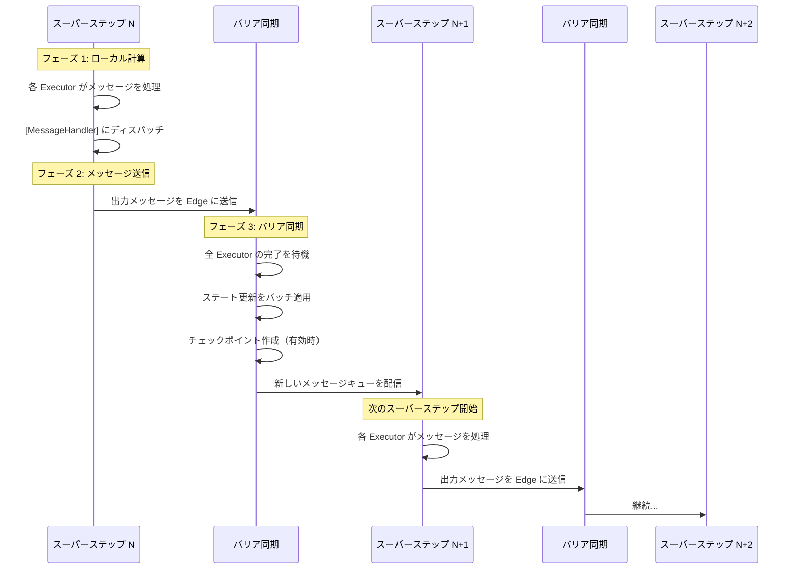
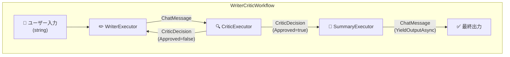

## はじめに

2025 年から 2026 年にかけて、AI エージェントの世界は大きな転換点を迎えた。LLM を単にチャットインターフェースとして使うのではなく、**複数のエージェントが協調して複雑なタスクを遂行する「Agentic Workflow」** というパラダイムが急速に広まっている。

Agentic Workflow とは何か。なぜ従来の自動化やチャットボットでは不十分なのか。そして、具体的にどう実装するのか。

この記事では、**Agentic Workflow の概念から、[Microsoft Agent Framework](https://github.com/microsoft/agent-framework) の C# 実装による具体的なコードまで**、ワークフローパターンのすべてを解剖する。インタラクティブなビジュアライザーでパターンの動きを体感しながら、以下の内容を深掘りしていく。

1. **Agentic Workflow とは何か** — 定義・背景・従来手法との比較
2. **ワークフローの設計パターン** — Sequential・Concurrent・Conditional・Handoff・Writer-Critic・Group Chat
3. **発展的な構成パターン** — Sub-Workflow・Workflow-as-Agent・Declarative Workflow
4. **Microsoft Agent Framework の C# 実装** — WorkflowBuilder・Executor・Edge のコードレベル解説
5. **実践的な実装例** — Writer-Critic ループのフル実装
6. **本番運用の考慮事項** — エラーハンドリング・チェックポイント・オブザーバビリティ・Human-in-the-Loop
7. **設計指針** — いつ Agent を使い、いつ Workflow を使うべきか

## Agentic Workflow とは何か

### 定義

**Agentic Workflow（エージェンティック・ワークフロー）** とは、1 つ以上の AI エージェントを明確に定義された実行グラフの中で協調させ、複雑なタスクを達成するシステム設計パターンである。

ここで重要な点が 2 つある。

1. **「エージェント」が構成要素である** — 単なる関数やルールベースの処理ではなく、LLM の推論能力を持つエージェントがワークフローのノードとして機能する
2. **「ワークフロー」で制御される** — エージェントの実行順序・条件分岐・並列度はワークフロー定義で**明示的に**制御される。エージェントに「次に何をすべきか」を自由に判断させるのではなく、開発者がグラフ構造で実行フローを設計する

この「LLM の柔軟性」と「ワークフローの決定論的な制御」の組み合わせこそが、Agentic Workflow の本質だ。

### 従来手法との比較

Agentic Workflow がどこに位置づけられるかを理解するために、従来のアプローチと比較してみよう。

| 特性 | 従来の自動化 (RPA等) | チャットボット | 単一エージェント | Agentic Workflow |
|------|---------------------|-------------|---------------|-----------------|
| **柔軟性** | 低い（ルールベース） | 中程度 | 高い | 高い |
| **制御性** | 非常に高い | 低い | 低い | 高い |
| **複雑なタスク** | ハードコード | 不向き | 単一視点 | 多角的に対応 |
| **エラーハンドリング** | 分岐で対応 | LLM任せ | LLM任せ | 構造的に対応 |
| **品質保証** | テスト可能 | 困難 | 困難 | レビューループで対応 |
| **実装コスト** | 高い | 低い | 低い～中程度 | 中程度 |

各アプローチの特徴をもう少し掘り下げよう。

**従来の自動化（RPA 等）** は、定義済みのルールに厳密に従うため制御性は高いが、想定外の入力やあいまいな判断には対応できない。「もしメールの件名にキーワード X が含まれたら Y をする」というルールは書けるが、「このメールの意図を理解して適切に返信する」は不可能だ。

**チャットボット** は LLM の柔軟性を活かせるが、単発の応答に限られ、複雑な業務プロセスの遂行には向かない。「旅行の予約を手伝って」と言えば会話はできるが、予約・決済・確認メール送信という一連のプロセスを確実に遂行することは難しい。

**単一エージェント** はツール呼び出しで外部世界とやりとりでき、かなり複雑なタスクもこなせる。しかし、すべてのロジックが 1 つのエージェントに集中するため、問題の分離が困難になり、品質管理がブラックボックス化する。

**Agentic Workflow** はこれらの問題を解決する。各エージェントに専門領域を持たせ、ワークフローで実行順序を制御し、品質ゲート（Critic による審査ループなど）を構造的に組み込める。

### なぜ今 Agentic Workflow なのか

Agentic Workflow が注目される背景には、いくつかの技術的進歩がある。

1. **LLM の能力向上** — GPT-4 以降のモデルは、ツール呼び出し・構造化出力・ロールプレイの能力が大幅に向上し、ワークフロー内のノードとして十分に機能するようになった
2. **Structured Output** — LLM が JSON スキーマに従った構造化出力を確実に生成できるようになったことで、エージェント間のメッセージの型安全な受け渡しが現実的になった
3. **MCP の標準化** — Model Context Protocol により、エージェントとツールの接続が標準化され、ツール統合のコストが劇的に下がった
4. **フレームワークの成熟** — Microsoft Agent Framework、LangGraph、CrewAI などのフレームワークが成熟し、ワークフローの構築が少ないコード量で実現できるようになった

## ワークフローの設計パターン

Agentic Workflow には、繰り返し登場する定番のデザインパターンがある。これらのパターンは単独で使うこともできるし、組み合わせて複雑なワークフローを構築することもできる。各パターンを、ユースケース・メリット・トレードオフとともに見ていこう。

以下のインタラクティブ・ビジュアライザーで、各パターンの動きを確認できる。ボタンでパターンを切り替え、ステップ実行でメッセージの流れを追ってみてほしい。

<AgenticWorkflowVisualizer />

### パターン 1: Sequential（直列パイプライン）

最もシンプルなパターンだ。複数のエージェントを直列に接続し、前のエージェントの出力を次のエージェントの入力として渡す。

<SequentialPatternDiagram />

**ユースケース**: 翻訳チェーン、データ変換パイプライン、段階的な文書処理

**メリット**: 実装が簡単で、各ステップの入出力が明確。デバッグしやすい。

**トレードオフ**: 全体のレイテンシが各ステップの合計になる。並列化できない。

Microsoft Agent Framework では `AgentWorkflowBuilder.BuildSequential()` 一行でこのパターンを構築できる。

```csharp
// Sequential: 翻訳チェーンの構築
// AgentWorkflowBuilder.BuildSequential() は内部で
// AddEdge(agent[0], agent[1]), AddEdge(agent[1], agent[2]), ...
// を自動生成する
Workflow workflow = AgentWorkflowBuilder.BuildSequential(
    from lang in new[] { "French", "Spanish", "English" }
    select new ChatClientAgent(
        chatClient,
        instructions: $"You are a translation assistant. Translate the input to {lang}.",
        name: $"{lang}Translator"
    )
);

// ワークフロー実行
await using StreamingRun run =
    await InProcessExecution.RunStreamingAsync(workflow, "Hello, world!");

await foreach (WorkflowEvent evt in run.WatchStreamAsync())
{
    if (evt is AgentResponseUpdateEvent e)
        Console.Write(e.Update.Text);
    else if (evt is WorkflowOutputEvent output)
        Console.WriteLine($"\nFinal: {output.Data}");
}
```

### パターン 2: Concurrent（Fan-out / Fan-in）

入力を複数のエージェントに**同時に**配信し、すべての結果を集約するパターンだ。

<ConcurrentPatternDiagram />

**ユースケース**: 複数言語への同時翻訳、複数角度からの分析、並列データ処理

**メリット**: レイテンシが最も遅いエージェントの時間に収まる（Sequential の合計時間ではない）。

**トレードオフ**: API の同時呼び出し数が増え、レート制限に注意が必要。結果の集約ロジックが必要。

```csharp
// Concurrent: 並列翻訳
// BuildConcurrent() は内部で Fan-out Edge と Fan-in Barrier Edge を生成する
// Fan-out: 入力ノードから全エージェントに同時にメッセージを配信
// Fan-in Barrier: 全エージェントの完了を待ってから結果を集約
Workflow workflow = AgentWorkflowBuilder.BuildConcurrent(
    from lang in new[] { "French", "Spanish", "English" }
    select new ChatClientAgent(
        chatClient,
        instructions: $"Translate the input to {lang}. Output only the translation.",
        name: $"{lang}Translator"
    )
);
```

### パターン 3: Conditional Routing（条件分岐）

Executor の出力に基づいて次の実行先を動的に決定するパターンだ。`if-else` や `switch-case` に相当する。

<ConditionalPatternDiagram />

**ユースケース**: メール分類（スパム/正常）、チケットルーティング、コンテンツモデレーション

```csharp
// Conditional Routing: スパム分類の例
// AddSwitch() で ClassificationResult の Category プロパティに基づき分岐
// ラムダ式による型安全な条件判定
WorkflowBuilder builder = new WorkflowBuilder(classifier)
    .AddSwitch(classifier, sw => sw
        .AddCase<ClassificationResult>(
            result => result?.Category == "spam",
            spamHandler)
        .AddCase<ClassificationResult>(
            result => result?.Category == "normal",
            replyGenerator)
        .WithDefault(manualReviewHandler)
    )
    .WithOutputFrom(spamHandler, replyGenerator, manualReviewHandler);
```

`AddSwitch` は内部的に**単一の `FanOutEdge`** を生成し、`EdgeSelector` が最初にマッチしたケースで早期リターンする。つまり `AddSwitch` は**排他的**（switch-case のセマンティクス）だ。一方、`AddEdge` で個別の条件付き Edge を複数追加した場合は**非排他的**（複数の独立した if 文）で、条件を満たす Edge すべてにメッセージが配信される。この違いは「実装上の注意点」セクションで詳しく解説する。

### パターン 4: Handoff（委任）

トリアージ・エージェントが入力を分析し、適切な専門エージェントに処理を委任するパターンだ。Conditional と似ているが、**エージェント自身が委任先を決定する**点が異なる。

<HandoffPatternDiagram />

**ユースケース**: カスタマーサポートの振り分け、教育チューター、専門家チーム

```csharp
// Handoff: トリアージ → 専門エージェントへの委任
// CreateHandoffBuilderWith() でトリアージエージェントを起点に構築
// WithHandoffs() で双方向のハンドオフルートを定義
ChatClientAgent triageAgent = new(chatClient,
    instructions: "Determine which specialist to use. ALWAYS hand off.",
    name: "triage_agent",
    description: "Routes to the right specialist.");

ChatClientAgent mathTutor = new(chatClient,
    instructions: "You help with math. Explain step by step.",
    name: "math_tutor",
    description: "Math specialist.");

ChatClientAgent historyTutor = new(chatClient,
    instructions: "You help with history. Explain events and context.",
    name: "history_tutor",
    description: "History specialist.");

// Handoff ワークフローの構築
// WithHandoffs(source, targets) は source が targets の description を
// ツール定義として受け取り、LLM が handoff ツールを呼び出すことで
// 自動的にルーティングが行われる
Workflow workflow = AgentWorkflowBuilder
    .CreateHandoffBuilderWith(triageAgent)
    .WithHandoffs(triageAgent, [mathTutor, historyTutor])
    .WithHandoffs([mathTutor, historyTutor], triageAgent)
    .Build();
```

Handoff パターンの内部メカニズムは興味深い。`WithHandoffs(triageAgent, [mathTutor, historyTutor])` を呼ぶと、`mathTutor` と `historyTutor` の `name` と `description` が**ツール定義**として `triageAgent` に注入される。LLM が `handoff_to_math_tutor` のようなツール呼び出しを生成すると、ワークフローエンジンがそれを検知して対応する Executor にメッセージをルーティングする。つまり、ルーティングの判断は LLM が行うが、実行の制御はワークフローエンジンが担う。

> **注意**: Handoff API（`CreateHandoffBuilderWith` / `HandoffWorkflowBuilder`）は現在 `[Experimental("MAAIW001")]` としてマークされている。利用時はコンパイラ警告 `MAAIW001` を抑制する必要がある。API は今後変更される可能性がある。

### パターン 5: Writer-Critic ループ（反復改善）

最も洗練されたパターンだ。Writer が成果物を生成し、Critic がレビューし、承認されるまでループする。人間の「レビュー・修正」プロセスを AI で再現する。

<WriterCriticPatternDiagram />

**ユースケース**: コンテンツ生成、コードレビュー、翻訳品質管理

**メリット**: 品質ゲートが構造的に組み込まれ、出力品質が反復的に向上する。

**トレードオフ**: ループ回数に比例して LLM コールが増える。最大イテレーション数の安全弁が必要。

```csharp
// Writer-Critic ループ: 反復改善ワークフロー
// WorkflowBuilder でグラフ構造を宣言的に定義
WorkflowBuilder builder = new WorkflowBuilder(writer)
    .AddEdge(writer, critic)                    // Writer → Critic
    .AddSwitch(critic, sw => sw
        .AddCase<CriticDecision>(                // 承認 → Summary
            cd => cd?.Approved == true, summary)
        .AddCase<CriticDecision>(                // 拒否 → Writer に戻る
            cd => cd?.Approved == false, writer))
    .WithOutputFrom(summary);                    // Summary の出力が最終出力
```

### パターン 6: Group Chat（グループチャット）

Handoff パターンでは「今のエージェントが次のエージェントを 1 つ選ぶ」のに対し、Group Chat は**複数のエージェントがラウンドで会話する**パターンだ。誰が次に発言するかは `GroupChatManager` が制御する。

<GroupChatPatternDiagram />

**ユースケース**: ブレインストーミング、多角的レビュー、ディベート形式の分析

```csharp
// Group Chat: マネージャーが発言順を制御する複数エージェントの会話
// CreateGroupChatBuilderWith() で GroupChatManager のファクトリを指定
// RoundRobinGroupChatManager: エージェントを順番に指名する最もシンプルなマネージャー
Workflow workflow = AgentWorkflowBuilder
    .CreateGroupChatBuilderWith(
        agents => new RoundRobinGroupChatManager(agents) { MaximumIterationCount = 3 })
    .AddParticipants(researchAgent, criticAgent, synthesizerAgent)
    .Build();
```

`GroupChatManager` は抽象クラスで、独自のマネージャーを実装することで発言順のカスタムロジックを定義できる。例えば、各発言の内容を分析して最も関連性の高いエージェントを次に指名する「MagneticGroupChatManager」のような戦略も実装可能だ。

### 発展的な構成パターン

基本パターンに加え、Agent Framework はワークフローの構成性を高める仕組みを提供している。

#### Sub-Workflow（サブワークフロー）

ワークフロー自体を Executor として別のワークフローに埋め込める。これにより、**再利用可能なワークフロー部品**を階層的に組み合わせて複雑なシステムを構築できる。

```csharp
// Sub-Workflow: ワークフローを Executor として埋め込む
// 1. まず子ワークフローを通常通り構築
Workflow textProcessingWorkflow = new WorkflowBuilder(uppercase)
    .AddEdge(uppercase, reverse)
    .AddEdge(reverse, append)
    .WithOutputFrom(append)
    .Build();

// 2. BindAsExecutor() でワークフローを Executor に変換
ExecutorBinding subWorkflowExecutor =
    textProcessingWorkflow.BindAsExecutor("TextProcessingSubWorkflow");

// 3. 親ワークフローの中で通常の Executor と同様に接続
Workflow mainWorkflow = new WorkflowBuilder(prefix)
    .AddEdge(prefix, subWorkflowExecutor)
    .AddEdge(subWorkflowExecutor, postProcess)
    .WithOutputFrom(postProcess)
    .Build();
```

#### Workflow-as-Agent（ワークフローのエージェント化）

逆に、ワークフロー全体を 1 つの `AIAgent` として外部に公開することもできる。呼び出し側はワークフローの内部構造を意識する必要がない。

```csharp
// Workflow-as-Agent: ワークフローを AIAgent として公開
// AsAIAgent() でワークフローを AIAgent インターフェースにラップ
Workflow workflow = WorkflowFactory.BuildWorkflow(chatClient);
AIAgent agent = workflow.AsAIAgent("workflow-agent", "Workflow Agent");

// 通常のエージェントと同じように対話できる
AgentSession session = await agent.CreateSessionAsync();
await foreach (AgentResponseUpdate update in
    agent.RunStreamingAsync("Hello!", session))
{
    Console.Write(update.Text);
}
```

このパターンは**ワークフローの段階的複雑化**に最適だ。最初は単一エージェントで始め、要件が複雑化したらワークフローに置き換えても、呼び出し側のコードを変更する必要がない。

#### Declarative Workflow（宣言的ワークフロー）

C# のコードでグラフを構築する代わりに、**YAML ファイルでワークフローを宣言的に定義**することもできる。これにより、非エンジニアでもワークフローの構造を理解・編集でき、コードのデプロイなしにワークフローを変更できる。

Agent Framework の `Declarative/` サンプルでは、カスタマーサポート・マーケティング・ディープリサーチなど、YAML ベースのワークフロー定義例が多数提供されている。ワークフロー定義を YAML でパースし、コードベースのワークフローと同じ実行エンジンで動かす仕組みだ。

## Microsoft Agent Framework の C# 実装

ここからは、Agentic Workflow を支える Microsoft Agent Framework のコア概念を、C# の実装レベルで解説していこう。

### パッケージ構成

.NET での Agentic Workflow 開発に必要なパッケージは以下の通りだ。

```xml
<!-- csproj ファイルに追加 -->
<PackageReference Include="Microsoft.Agents.AI" Version="1.1.0" />
<PackageReference Include="Microsoft.Agents.AI.Workflows" Version="1.1.0" />
<PackageReference Include="Microsoft.Agents.AI.Workflows.Generators" Version="1.1.0"
                OutputItemType="Analyzer" ReferenceOutputAssembly="false" />
<PackageReference Include="Microsoft.Agents.AI.OpenAI" Version="1.1.0" />
<!-- or Microsoft.Agents.AI.Foundry for Azure AI Foundry -->
```

`Microsoft.Agents.AI` がフレームワークのコアで、`AIAgent`、`ChatClientAgent`、`AgentResponseUpdate` といったエージェント関連の基盤型が含まれる。`Microsoft.Agents.AI.Workflows` にはワークフロー関連の型（`WorkflowBuilder`、`Executor`、`InProcessExecution`、`StreamingRun` 等）が含まれる。`Microsoft.Agents.AI.Workflows.Generators` はソースジェネレータで、`[MessageHandler]` 属性のディスパッチコードを自動生成する。`Microsoft.Agents.AI.OpenAI` は OpenAI / Azure OpenAI との統合を提供し、`Microsoft.Agents.AI.Foundry` は Microsoft Foundry (旧 Azure AI Foundry) との統合を提供する。

### コア概念: Executor

**Executor** はワークフローグラフにおける処理ノードだ。メッセージを受け取り、処理し、出力メッセージを生成する。Agent Framework では C# の partial クラスとソースジェネレータを活用して、最小限のボイラープレートで Executor を定義できる。

```csharp
// Executor の基本形
// partial キーワードとソースジェネレータにより、
// メッセージのディスパッチコードが自動生成される
internal sealed partial class UpperCaseExecutor() : Executor("UpperCase")
{
    // [MessageHandler] 属性でメッセージハンドラを定義
    // 引数の型 (string) でメッセージのルーティングが決まる
    [MessageHandler]
    public ValueTask<string> HandleAsync(
        string message,
        IWorkflowContext context,
        CancellationToken cancellationToken = default)
    {
        return ValueTask.FromResult(message.ToUpperInvariant());
    }
}
```

`[MessageHandler]` 属性が付与されたメソッドは、ソースジェネレータによって自動的にメッセージディスパッチテーブルに登録される。**メソッドの引数の型**がメッセージのルーティングキーとして機能する。つまり、`string` 型のメッセージが来たら `HandleAsync(string)` が呼ばれ、`CriticDecision` 型が来たら `HandleAsync(CriticDecision)` が呼ばれる。これにより、1 つの Executor が複数のメッセージタイプを型安全に処理できる。

#### ChatClientAgent を使った Executor

多くの場合、Executor の中で LLM を呼び出したい。`ChatClientAgent` はその橋渡しをする。

```csharp
// LLM を呼び出す Executor の例
// ChatClientAgent は IChatClient を受け取り、AIAgent インターフェースを提供する
internal sealed partial class WriterExecutor : Executor
{
    private readonly AIAgent _agent;

    public WriterExecutor(IChatClient chatClient) : base("Writer")
    {
        // ChatClientAgent: IChatClient → AIAgent のアダプタ
        // instructions がシステムプロンプトとして LLM に送信される
        this._agent = new ChatClientAgent(
            chatClient,
            name: "Writer",
            instructions: """
                You are a skilled writer. Create clear, engaging content.
                If you receive feedback, revise to address all concerns.
                """
        );
    }

    // 初回リクエスト用のハンドラ（string 型）
    [MessageHandler]
    public async ValueTask<ChatMessage> HandleInitialRequestAsync(
        string message,
        IWorkflowContext context,
        CancellationToken cancellationToken = default)
    {
        // RunStreamingAsync で LLM にストリーミングリクエスト
        StringBuilder sb = new();
        await foreach (AgentResponseUpdate update in
            this._agent.RunStreamingAsync(
                new ChatMessage(ChatRole.User, message),
                cancellationToken: cancellationToken))
        {
            if (!string.IsNullOrEmpty(update.Text))
            {
                sb.Append(update.Text);
                Console.Write(update.Text); // リアルタイム出力
            }
        }

        return new ChatMessage(ChatRole.User, sb.ToString());
    }

    // 修正リクエスト用のハンドラ（CriticDecision 型）
    // 同じ Executor が異なる型のメッセージを処理できる
    [MessageHandler]
    public async ValueTask<ChatMessage> HandleRevisionAsync(
        CriticDecision decision,
        IWorkflowContext context,
        CancellationToken cancellationToken = default)
    {
        string prompt =
            $"Revise based on this feedback:\n{decision.Feedback}\n\n" +
            $"Original:\n{decision.Content}";

        StringBuilder sb = new();
        await foreach (AgentResponseUpdate update in
            this._agent.RunStreamingAsync(
                new ChatMessage(ChatRole.User, prompt),
                cancellationToken: cancellationToken))
        {
            if (!string.IsNullOrEmpty(update.Text))
                sb.Append(update.Text);
        }

        return new ChatMessage(ChatRole.User, sb.ToString());
    }
}
```

ここで注目してほしいのは、`HandleInitialRequestAsync` と `HandleRevisionAsync` が**同じ Executor 内に共存している**点だ。前者は `string` 型のメッセージを、後者は `CriticDecision` 型のメッセージを受け取る。ワークフローエンジンは受信メッセージの型を検査し、適切なハンドラにディスパッチする。これにより、Writer は「初回の執筆依頼」と「Critic からのフィードバック付き修正依頼」を 1 つの Executor で処理できる。

### コア概念: Edge

**Edge** は Executor 間のメッセージフローを定義する接続だ。

```csharp
// Direct Edge: 無条件で A → B にメッセージを流す
builder.AddEdge(executorA, executorB);

// Conditional Edge: 条件を満たすときだけメッセージを流す
builder.AddEdge<ClassificationResult>(executorA, executorB,
    condition: r => r?.Category == "normal");

// Switch-Case Edge: 複数の条件分岐
builder.AddSwitch(executorA, sw => sw
    .AddCase<ResultType>(r => r?.IsSuccess == true, successHandler)
    .AddCase<ResultType>(r => r?.IsSuccess == false, failureHandler)
    .WithDefault(fallbackHandler));

// Fan-out Edge: 1 → N の並列配信
builder.AddFanOutEdge<RoutingResult>(
    sourceExecutor,
    targets: [handlerA, handlerB, handlerC],
    targetSelector: (result, count) =>
    {
        // result の内容に応じて実行先を選択
        // 戻り値は実行先のインデックスのリスト
        if (result?.NeedsAll == true) return Enumerable.Range(0, count);
        return [0]; // handlerA のみ
    });

// Fan-in Barrier Edge: N → 1 の集約（全ソースの完了待ち）
builder.AddFanInBarrierEdge(
    sources: [workerA, workerB, workerC],
    target: aggregator);
```

Edge はワークフローエンジンのスーパーステップ実行と密接に関連している。各スーパーステップで、アクティブな Executor が実行され、出力メッセージが Edge の条件に基づいて次の Executor に配送される。条件のマッチングは Edge ごとに独立して行われるため、`AddEdge` で作成した複数の条件付き Edge では、1 つの出力が複数の Edge に同時にマッチすることがある。ここには重要な注意点がいくつかあるので、「実装上の注意点」セクションで詳しく解説する。

### コア概念: WorkflowBuilder

**WorkflowBuilder** は Executor と Edge を組み合わせてワークフローの有向グラフを構築するビルダーだ。

```csharp
// WorkflowBuilder のフル活用例
Workflow workflow = new WorkflowBuilder(entryExecutor)
    // Direct Edge: entry → processor
    .AddEdge(entryExecutor, processorExecutor)
    // Switch-Case: processor の出力で分岐
    .AddSwitch(processorExecutor, sw => sw
        .AddCase<ProcessResult>(r => r?.Status == "approved", approvedHandler)
        .AddCase<ProcessResult>(r => r?.Status == "rejected", rejectedHandler)
        .WithDefault(manualReviewHandler))
    // 出力元の指定: これらの Executor の出力がワークフロー全体の出力になる
    .WithOutputFrom(approvedHandler, rejectedHandler, manualReviewHandler)
    // ビルド: Workflow インスタンスの生成
    .Build();
```

`WorkflowBuilder` のコンストラクタに渡した Executor がワークフローのエントリーポイントになる。`.Build()` はグラフの整合性を検証し（孤立ノードがないか、出力元が指定されているか等）、`Workflow` インスタンスを返す。

### ワークフローの実行

ワークフローの実行には `InProcessExecution` を使う。ストリーミングモードと非ストリーミングモードの両方をサポートしている。

```csharp
// ストリーミング実行
// InProcessExecution.RunStreamingAsync() は StreamingRun を返す
// StreamingRun は IAsyncDisposable で、using で確実にリソースが解放される
await using StreamingRun run =
    await InProcessExecution.RunStreamingAsync(workflow, "入力メッセージ");

// WatchStreamAsync() でリアルタイムにイベントを購読
await foreach (WorkflowEvent evt in run.WatchStreamAsync())
{
    switch (evt)
    {
        case AgentResponseUpdateEvent agentUpdate:
            // エージェントのストリーミング出力（トークン単位）
            Console.Write(agentUpdate.Update.Text);
            break;

        case WorkflowOutputEvent output:
            // ワークフロー全体の最終出力
            Console.WriteLine($"\n=== Final Output ===");
            Console.WriteLine(output.Data);
            break;
    }
}
```

`InProcessExecution` はワークフローを同一プロセス内で実行する。ワークフローエンジンは **Pregel 由来のスーパーステップ方式（BSP: Bulk Synchronous Parallel）** で動作する。このモデルは Google が 2010 年に発表した大規模グラフ処理フレームワーク [Pregel](https://research.google/pubs/pregel-a-system-for-large-scale-graph-processing/) に由来し、分散グラフ処理で確立された計算モデルを AI エージェントのワークフロー実行に応用したものだ。

#### Pregel / BSP とは何か

**BSP（Bulk Synchronous Parallel）** は 1990 年に Leslie Valiant が提唱した並列計算モデルだ。計算を「スーパーステップ」と呼ばれる離散的なフェーズの繰り返しとして構造化する。各スーパーステップは以下の 3 つのフェーズで構成される。

1. **ローカル計算** — 各プロセッサ（Executor）がローカルのメッセージキューを読み取り、計算を実行する
2. **メッセージ送信** — 計算結果を他のプロセッサへのメッセージとして送信する
3. **バリア同期** — 全プロセッサの計算完了を待ち、状態更新をバッチ適用する。次のスーパーステップでは新しいメッセージが利用可能になる

Pregel は BSP を有向グラフの頂点ベース計算に特化させたもので、「各頂点が受信メッセージを処理し、隣接頂点にメッセージを送信し、自身の状態を更新する」というループを繰り返す。Agent Framework のワークフローエンジンは、この Pregel の計算モデルをエージェントオーケストレーションに適用している。



以下のシミュレーターで、Concurrent 翻訳ワークフローを例にスーパーステップの実行フローを体験してみよう。各フェーズ（ローカル計算 → メッセージ送信 → バリア同期）でどのように Executor のメッセージキューとステートが変化するかをステップ実行で確認できる。

<BSPVisualizer />

#### Agent Framework での具体的な実行フロー

実際のソースコード（[`InProcessRunner.cs`](https://github.com/microsoft/agent-framework/blob/main/dotnet/src/Microsoft.Agents.AI.Workflows/InProc/InProcessRunner.cs)）を見ると、`RunSuperStepAsync` メソッドが 1 回のスーパーステップを以下のように実行していることがわかる。

```csharp
// InProcessRunner.RunSuperStepAsync() の内部動作（簡略化）
// https://github.com/microsoft/agent-framework/blob/main/dotnet/src/Microsoft.Agents.AI.Workflows/InProc/InProcessRunner.cs
async ValueTask<bool> RunSuperStepAsync(CancellationToken cancellationToken)
{
    // 1. AdvanceAsync(): 前のスーパーステップでキューされた
    //    メッセージを、現在のスーパーステップの StepContext に移動
    StepContext currentStep = await RunContext.AdvanceAsync(cancellationToken);

    // メッセージがなければスーパーステップは不要
    if (!currentStep.HasMessages && !RunContext.HasQueuedExternalDeliveries)
        return false;

    // 2. SuperStepStartedEvent を発火
    await RaiseWorkflowEventAsync(StepTracer.Advance(currentStep));

    // 3. 全ての宛先 Executor に対してメッセージを並行配信
    //    Task.WhenAll で同一スーパーステップ内の Executor を並行実行
    List<Task> receiverTasks = currentStep.QueuedMessages.Keys
        .Select(receiverId =>
            DeliverMessagesAsync(receiverId,
                currentStep.MessagesFor(receiverId),
                cancellationToken).AsTask())
        .ToList();
    await Task.WhenAll(receiverTasks);

    // 4. サブワークフローがあればそちらも並行駆動
    List<Task> subworkflowTasks = [];
    foreach (var subRunner in RunContext.JoinedSubworkflowRunners)
        subworkflowTasks.Add(subRunner.RunSuperStepAsync(cancellationToken).AsTask());
    await Task.WhenAll(subworkflowTasks);

    // 5. バリア同期: ステート更新をバッチ適用
    //    StateManager.PublishUpdatesAsync() が
    //    QueueStateUpdateAsync() でキューされた更新を一括適用
    await StateManager.PublishUpdatesAsync(StepTracer);

    // 6. チェックポイント作成（有効時）
    await CheckpointAsync(cancellationToken);

    // 7. SuperStepCompletedEvent を発火
    await RaiseWorkflowEventAsync(
        StepTracer.Complete(
            RunContext.NextStepHasActions,
            RunContext.HasUnservicedRequests));
}
```

注目すべき点がいくつかある。

**並行実行**: ステップ 3 で `Task.WhenAll` を使い、同一スーパーステップ内のすべての Executor を**並行**に実行する。これが Fan-out パターンで複数エージェントが同時に動作する仕組みだ。Sequential パターンでは各スーパーステップに 1 つの Executor しかアクティブでないため実質直列だが、Concurrent パターンでは複数の Executor が同一ステップで並行実行される。

**バリア同期**: ステップ 5 で `PublishUpdatesAsync()` が呼ばれ、スーパーステップ中に `QueueStateUpdateAsync()` でキューされた全ステート更新が一括適用される。これにより、同一スーパーステップ内の複数 Executor が同じステートを読んでも一貫したスナップショットが保証される。あるスーパーステップでキューされた更新は、次のスーパーステップまで可視にならない。

**チェックポイント**: ステップ 6 でチェックポイントが各スーパーステップ終了時に自動作成される。チェックポイントには以下が含まれる。
- `StepContext` — 次のスーパーステップに配送予定のメッセージキュー
- `StateManager` — 全 Executor のステート
- `EdgeMap` — Edge のステート（Fan-in バリアの待機状態等）
- `WorkflowInfo` — ワークフローグラフの構造情報

#### StepContext — メッセージキューの仕組み

各スーパーステップのメッセージ管理は [`StepContext`](https://github.com/microsoft/agent-framework/blob/main/dotnet/src/Microsoft.Agents.AI.Workflows/Execution/StepContext.cs) が担う。

```csharp
// StepContext: スーパーステップのメッセージキュー管理
// https://github.com/microsoft/agent-framework/blob/main/dotnet/src/Microsoft.Agents.AI.Workflows/Execution/StepContext.cs
internal sealed class StepContext
{
    // 宛先 Executor ID → メッセージキュー
    // ConcurrentDictionary + ConcurrentQueue でスレッドセーフ
    public ConcurrentDictionary<string, ConcurrentQueue<MessageEnvelope>>
        QueuedMessages { get; } = [];

    public bool HasMessages =>
        !QueuedMessages.IsEmpty &&
        QueuedMessages.Values.Any(q => !q.IsEmpty);
}
```

`MessageEnvelope` はメッセージ本体に加え、送信元 Executor ID、メッセージの型情報、トレースコンテキスト（OpenTelemetry）を持つ。Edge のルーティング処理（`EdgeRunner`）が出力メッセージを条件判定し、次のスーパーステップ用の `StepContext` にエンキューする。

#### 実行モードの選択

`InProcessExecution` は 3 つの実行モードを提供する。

| モード | 説明 | 用途 |
|--------|------|------|
| `OffThread`（デフォルト） | バックグラウンドスレッドでスーパーステップを実行し、イベントをリアルタイムにストリーミング | 本番環境・ストリーミング UI |
| `Lockstep` | イベント監視スレッドでスーパーステップを実行し、各ステップ完了後にイベントをまとめて配信 | テスト・デバッグ |
| `Concurrent` | `OffThread` + 同一ワークフローインスタンスの複数同時実行を許可 | 高スループットシナリオ |

```csharp
// 実行モードの選択
// デフォルト（OffThread）: リアルタイムストリーミング
await using var run = await InProcessExecution.RunStreamingAsync(workflow, input);

// Lockstep: テスト・デバッグ用（イベントがバッチで配信される）
await using var run = await InProcessExecution.Lockstep
    .RunStreamingAsync(workflow, input);

// Concurrent: 同一ワークフローの並行実行
// ワークフロー内の全 Executor が IResettableExecutor を実装している必要がある
await using var run = await InProcessExecution.Concurrent
    .RunStreamingAsync(workflow, input);
```

#### SuperStepStartedEvent / SuperStepCompletedEvent

各スーパーステップの開始と完了はイベントとして通知される。これらを監視することで、ワークフローの実行状況をリアルタイムに把握できる。

```csharp
await foreach (WorkflowEvent evt in run.WatchStreamAsync())
{
    switch (evt)
    {
        case SuperStepStartedEvent stepStarted:
            // SendingExecutors: 前ステップでメッセージを送った Executor の ID
            Console.WriteLine(
                $"[Step Start] Senders: {string.Join(", ", stepStarted.StartInfo.SendingExecutors)}");
            break;

        case SuperStepCompletedEvent stepCompleted:
            // ActivatedExecutors: このステップで実行された Executor の ID
            // HasPendingMessages: 次のステップに配送予定のメッセージがあるか
            // StateUpdated: ステートが更新されたか
            Console.WriteLine(
                $"[Step Done] Activated: {string.Join(", ", stepCompleted.CompletionInfo.ActivatedExecutors)}, " +
                $"Pending: {stepCompleted.CompletionInfo.HasPendingMessages}, " +
                $"StateUpdated: {stepCompleted.CompletionInfo.StateUpdated}");
            break;

        case AgentResponseUpdateEvent agentUpdate:
            Console.Write(agentUpdate.Update.Text);
            break;

        case WorkflowOutputEvent output:
            Console.WriteLine($"\nFinal: {output.Data}");
            break;
    }
}
```

#### なぜ Pregel / BSP なのか

Agent Framework がこのモデルを採用した理由は明確だ。

1. **決定論的な実行順序**: バリア同期により、「スーパーステップ N で送信されたメッセージはスーパーステップ N+1 で処理される」ことが保証される。これにより、デバッグとテストが容易になる
2. **一貫したステート**: ステート更新はバリア時に一括適用されるため、同一ステップ内の複数 Executor が同時に同じステートを読み書きしても競合しない
3. **チェックポイントとの親和性**: バリアポイントがチェックポイントの自然な挿入点となり、障害復旧やワークフロー再開が簡潔に実装できる
4. **並行実行の制御**: `Task.WhenAll` による並行実行と、バリアによる同期を組み合わせることで、並行度を自然に制御できる
5. **オブザーバビリティ**: スーパーステップ単位でイベントが発生するため、ワークフローの進行状況を離散的に追跡できる

全 Executor のキューが空になるか、`WithOutputFrom` で指定された Executor が出力を生成するとワークフローが完了する。

#### 2 つのキュー — Message Queue と Event Queue

ワークフローエンジンの内部には **2 つの独立したキュー** が存在する。目的がまったく異なるため、混同しないことが重要だ。以下の構造図で、`currentStep` / `_nextStep` のスワップと Event Queue の関係を確認できる。

<BSPArchitectureDiagram />

##### Message Queue（`StepContext.QueuedMessages`）

**流れるもの**: Executor 間のビジネスメッセージ（`MessageEnvelope`）

Executor 自体がキューを持っているわけではない。[`StepContext`](https://github.com/microsoft/agent-framework/blob/main/dotnet/src/Microsoft.Agents.AI.Workflows/Execution/StepContext.cs) が `ConcurrentDictionary<string, ConcurrentQueue<MessageEnvelope>>` を保持し、**Executor ID をキーにしてメッセージを振り分ける**設計だ。

メッセージの流れを追うと以下のようになる。

```text
Executor A が context.SendMessageAsync(output) を呼ぶ
  → InProcessRunnerContext.SendMessageAsync(sourceId, output) が呼ばれる
    → sourceId に紐づく全 Edge を走査
      → EdgeMap.PrepareDeliveryForEdgeAsync() で条件判定
        → DeliveryMapping.MapInto(_nextStep) で
          次のスーパーステップ用 StepContext にエンキュー
            → _nextStep.MessagesFor(targetId).Enqueue(envelope)
```

そしてスーパーステップの切り替え時に、[`InProcessRunnerContext.AdvanceAsync()`](https://github.com/microsoft/agent-framework/blob/main/dotnet/src/Microsoft.Agents.AI.Workflows/InProc/InProcessRunnerContext.cs) が `_nextStep` を**アトミックにスワップ**する。

```csharp
// InProcessRunnerContext.AdvanceAsync() — スーパーステップの切り替え
// https://github.com/microsoft/agent-framework/blob/main/dotnet/src/Microsoft.Agents.AI.Workflows/InProc/InProcessRunnerContext.cs
public async ValueTask<StepContext> AdvanceAsync(CancellationToken cancellationToken = default)
{
    // まず外部メッセージを Edge 経由で _nextStep にルーティング
    while (_queuedExternalDeliveries.TryDequeue(out var deliveryPrep))
        await deliveryPrep();

    // _nextStep をアトミックに取り出して新しい空の StepContext に差し替え
    return Interlocked.Exchange(ref _nextStep, new StepContext());
}
```

取り出された `StepContext` の `QueuedMessages` は、`RunSuperstepAsync()` 内で Executor ID ごとにフィルタされ、各 Executor に並行配信される。

```csharp
// InProcessRunner.RunSuperstepAsync() — Executor ID でフィルタして配信
List<Task> receiverTasks = currentStep.QueuedMessages.Keys
    .Select(receiverId =>
        DeliverMessagesAsync(
            receiverId,
            currentStep.MessagesFor(receiverId),  // Executor ID でフィルタ
            cancellationToken).AsTask())
    .ToList();
await Task.WhenAll(receiverTasks);  // 同一ステップ内は並行実行
```

##### Event Queue（`ConcurrentEventSink`）

**流れるもの**: ワークフローの観測・制御イベント（`WorkflowEvent`）

[`ConcurrentEventSink`](https://github.com/microsoft/agent-framework/blob/main/dotnet/src/Microsoft.Agents.AI.Workflows/Execution/ConcurrentEventSink.cs) は `InProcessRunner` が 1 つだけ保持するイベントシンクで、Executor 間のメッセージルーティングには**一切関与しない**。

```csharp
// ConcurrentEventSink — イベント通知の仕組み
// https://github.com/microsoft/agent-framework/blob/main/dotnet/src/Microsoft.Agents.AI.Workflows/Execution/ConcurrentEventSink.cs
internal class ConcurrentEventSink : IEventSink
{
    public ValueTask EnqueueAsync(WorkflowEvent workflowEvent)
        => this.EventRaised?.Invoke(this, workflowEvent) ?? default;

    public event Func<object?, WorkflowEvent, ValueTask>? EventRaised;
}
```

ここに流れるイベントの例:

| イベント | 発火タイミング |
|---------|-------------|
| `SuperStepStartedEvent` | スーパーステップ開始時 |
| `SuperStepCompletedEvent` | スーパーステップ完了時 |
| `AgentResponseUpdateEvent` | LLM ストリーミング出力（トークン単位） |
| `WorkflowOutputEvent` | `YieldOutputAsync()` で最終出力が生成された時 |
| `RequestInfoEvent` | Human-in-the-Loop の入力待ち |
| `WorkflowErrorEvent` | 例外発生時 |

これらは `StreamingRun.WatchStreamAsync()` でクライアントコードに公開される。

##### 両者の違いのまとめ

| 項目 | Message Queue | Event Queue |
|------|--------------|-------------|
| **正体** | `StepContext.QueuedMessages` | `ConcurrentEventSink` |
| **流れるデータ** | `MessageEnvelope`（ビジネスデータ） | `WorkflowEvent`（観測イベント） |
| **目的** | Executor 間のメッセージルーティング | ワークフロー実行状況の外部通知 |
| **ルーティング** | Edge の条件判定で宛先決定 | なし（全イベントが外部に流れる） |
| **スーパーステップとの関係** | ステップ境界でアトミックにスワップ | ステップ中にリアルタイム発火 |
| **チェックポイント** | 含まれる（永続化対象） | 含まれない |
| **消費者** | 次のスーパーステップの Executor | `WatchStreamAsync()` のクライアントコード |

一言でまとめると、**Message Queue は「Executor 同士の会話」、Event Queue は「ワークフローが外の世界に報告する出来事」** だ。

### Structured Output で型安全な分岐

Writer-Critic パターンで特に重要なのが **Structured Output** だ。Critic が「承認/拒否」の判断を自由形式のテキストで返すと、後続の条件分岐でパースが不安定になる。Structured Output は LLM に JSON スキーマへの準拠を強制し、この問題を根本的に解決する。

```csharp
// CriticDecision: Structured Output 用の DTO
// Description 属性は JSON Schema の description フィールドにマップされ、
// LLM がフィールドの意味を理解するためのヒントになる
[Description("Critic's review decision")]
internal sealed class CriticDecision
{
    [JsonPropertyName("approved")]
    [Description("Whether the content is approved (true) or needs revision (false)")]
    public bool Approved { get; set; }

    [JsonPropertyName("feedback")]
    [Description("Specific feedback for improvements if not approved")]
    public string Feedback { get; set; } = "";

    // ワークフロー内部で使用するフィールド（JSON には含まれない）
    [JsonIgnore]
    public string Content { get; set; } = "";

    [JsonIgnore]
    public int Iteration { get; set; }
}

// Critic Executor: Structured Output を使ったレビュー
internal sealed class CriticExecutor : Executor<ChatMessage, CriticDecision>
{
    private readonly AIAgent _agent;

    public CriticExecutor(IChatClient chatClient) : base("Critic")
    {
        this._agent = new ChatClientAgent(chatClient, new ChatClientAgentOptions
        {
            Name = "Critic",
            ChatOptions = new()
            {
                Instructions = """
                    You are a constructive critic. Review content and provide feedback.
                    Provide your decision as structured output.
                    """,
                // ChatResponseFormat.ForJsonSchema<T>() で
                // CriticDecision の JSON Schema を LLM に送信
                // LLM はこのスキーマに準拠した JSON を必ず返す
                ResponseFormat = ChatResponseFormat.ForJsonSchema<CriticDecision>()
            }
        });
    }

    public override async ValueTask<CriticDecision> HandleAsync(
        ChatMessage message,
        IWorkflowContext context,
        CancellationToken cancellationToken = default)
    {
        // ストリーミングでレスポンスを取得
        IAsyncEnumerable<AgentResponseUpdate> updates =
            this._agent.RunStreamingAsync(message, cancellationToken: cancellationToken);

        // ストリーミング出力をリアルタイムで表示
        await foreach (AgentResponseUpdate update in updates)
        {
            if (!string.IsNullOrEmpty(update.Text))
                Console.Write(update.Text);
        }

        // ストリームを AgentResponse に変換し、JSON をデシリアライズ
        AgentResponse response = await updates.ToAgentResponseAsync(cancellationToken);
        CriticDecision decision = JsonSerializer.Deserialize<CriticDecision>(
            response.Text, JsonSerializerOptions.Web)
            ?? throw new JsonException("Failed to deserialize CriticDecision");

        return decision;
    }
}
```

`ChatResponseFormat.ForJsonSchema<CriticDecision>()` が鍵だ。これにより、LLM は `CriticDecision` クラスの JSON Schema に厳密に従った JSON を出力する。`[Description]` 属性が各フィールドの意味を LLM に伝え、`[JsonPropertyName]` が JSON のキー名を指定する。`[JsonIgnore]` が付いたフィールドは JSON Schema に含まれず、ワークフロー内部の状態管理専用として使える。

### IWorkflowContext による状態管理

Executor 間でステートを共有するには、`IWorkflowContext` を使う。

```csharp
// 共有ステートの読み書き
// IWorkflowContext は各 Executor に注入される
// scopeName でスコープを分離し、key で個別のステートを識別する

// ステートの読み取り
FlowState? state = await context.ReadStateAsync<FlowState>(
    key: "singleton",
    scopeName: "FlowStateScope");

// ステートの書き込み（キュー経由でスーパーステップ終了時に適用）
await context.QueueStateUpdateAsync(
    key: "singleton",
    value: updatedState,
    scopeName: "FlowStateScope");
```

`ReadStateAsync` は現在のステートを読み取り、`QueueStateUpdateAsync` はステートの更新をキューに入れる。ステートの更新は**スーパーステップの終了時**にバッチ適用される。これにより、同一スーパーステップ内の複数の Executor が同じステートを読み取っても一貫性が保たれる。

### IResettableExecutor — ステートフル Executor の再利用

ステートフルな Executor（内部にリストやカウンタを持つもの）を複数のワークフロー実行にわたって**共有インスタンス**として再利用する場合、`IResettableExecutor` インターフェースの実装が必要だ。フレームワークは各実行の終了時に `ResetAsync()` を呼び出し、蓄積された内部状態をクリアする。

```csharp
// IResettableExecutor: ステートフルな共有 Executor の再利用
// フレームワーク提供の Executor（ChatForwardingExecutor 等）は既に実装済み
// カスタム Executor でステートを持つ場合は自分で実装する必要がある
internal sealed class AggregationExecutor()
    : Executor<List<ChatMessage>>("Aggregator"), IResettableExecutor
{
    private readonly List<ChatMessage> _messages = [];

    public override async ValueTask HandleAsync(
        List<ChatMessage> message,
        IWorkflowContext context,
        CancellationToken cancellationToken = default)
    {
        this._messages.AddRange(message);
        if (this._messages.Count >= 2)
            await context.YieldOutputAsync(
                string.Join("\n", this._messages.Select(m => m.Text)),
                cancellationToken);
    }

    // フレームワークがワークフロー実行間で自動的に呼び出す
    public ValueTask ResetAsync()
    {
        this._messages.Clear();
        return default;
    }
}
```

`IResettableExecutor` を実装していないステートフルな共有 Executor を再利用しようとすると、`InvalidOperationException` がスローされる。ファクトリ経由で毎回新しいインスタンスを生成する場合は不要だが、パフォーマンス上の理由でインスタンスを共有する場合は必須だ。

## 実践: Writer-Critic ループのフル実装

ここまでの概念を統合して、Writer-Critic ループのフル実装を見よう。これは Microsoft Agent Framework の公式サンプル [`07_WriterCriticWorkflow`](https://github.com/microsoft/agent-framework/tree/main/dotnet/samples/03-workflows/_StartHere/07_WriterCriticWorkflow) を基にしている。

### 全体構成



### Program.cs — ワークフローの組み立てと実行

```csharp
// Program.cs — Writer-Critic ワークフローのエントリーポイント
// https://github.com/microsoft/agent-framework/blob/main/dotnet/samples/03-workflows/_StartHere/07_WriterCriticWorkflow/Program.cs
using System.ComponentModel;
using System.Text;
using System.Text.Json;
using System.Text.Json.Serialization;
using Azure.AI.OpenAI;
using Azure.Identity;
using Microsoft.Agents.AI;
using Microsoft.Agents.AI.Workflows;
using Microsoft.Extensions.AI;

public static class Program
{
    public const int MaxIterations = 3; // 安全弁: 最大3回のイテレーション

    private static async Task Main()
    {
        // ── 1. LLM クライアントの初期化 ──
        string endpoint = Environment.GetEnvironmentVariable("AZURE_OPENAI_ENDPOINT")
            ?? throw new InvalidOperationException("AZURE_OPENAI_ENDPOINT is not set.");
        string deploymentName =
            Environment.GetEnvironmentVariable("AZURE_OPENAI_DEPLOYMENT_NAME")
            ?? "gpt-4o-mini";

        // IChatClient: Microsoft.Extensions.AI の統一インターフェース
        // Azure OpenAI、OpenAI、Ollama 等、プロバイダを切り替えても
        // 後続のコードは変更不要
        IChatClient chatClient = new AzureOpenAIClient(
            new Uri(endpoint),
            new AzureCliCredential()
        ).GetChatClient(deploymentName).AsIChatClient();

        // ── 2. Executor の生成 ──
        WriterExecutor writer = new(chatClient);
        CriticExecutor critic = new(chatClient);
        SummaryExecutor summary = new(chatClient);

        // ── 3. ワークフローグラフの構築 ──
        // WorkflowBuilder はコンストラクタの引数がエントリーポイント
        WorkflowBuilder workflowBuilder = new WorkflowBuilder(writer)
            .AddEdge(writer, critic)           // Writer → Critic
            .AddSwitch(critic, sw => sw        // Critic で条件分岐
                .AddCase<CriticDecision>(
                    cd => cd?.Approved == true,
                    summary)                   //   承認 → Summary
                .AddCase<CriticDecision>(
                    cd => cd?.Approved == false,
                    writer))                   //   拒否 → Writer（ループ）
            .WithOutputFrom(summary);          // Summary の出力が最終出力

        // ── 4. ワークフロー実行 ──
        Workflow workflow = workflowBuilder.Build();
        await using StreamingRun run =
            await InProcessExecution.RunStreamingAsync(
                workflow,
                "Write a 200-word blog post about AI ethics.");

        // ── 5. イベント購読 ──
        await foreach (WorkflowEvent evt in run.WatchStreamAsync())
        {
            switch (evt)
            {
                case AgentResponseUpdateEvent agentUpdate:
                    if (!string.IsNullOrEmpty(agentUpdate.Update.Text))
                        Console.Write(agentUpdate.Update.Text);
                    break;

                case WorkflowOutputEvent output:
                    Console.WriteLine($"\n\n=== FINAL APPROVED CONTENT ===");
                    Console.WriteLine(output.Data);
                    break;
            }
        }
    }
}
```

### FlowState — 共有ステート

```csharp
// FlowState: Executor 間で共有されるイテレーション追跡用ステート
// IWorkflowContext の ReadStateAsync / QueueStateUpdateAsync で読み書きする
internal sealed class FlowState
{
    public int Iteration { get; set; } = 1;
    public List<ChatMessage> History { get; } = [];
}

// ステートのスコープとキーの定数定義
internal static class FlowStateShared
{
    public const string Scope = "FlowStateScope";
    public const string Key = "singleton";
}

// ヘルパーメソッド
internal static class FlowStateHelpers
{
    public static async Task<FlowState> ReadFlowStateAsync(IWorkflowContext context)
    {
        FlowState? state = await context.ReadStateAsync<FlowState>(
            FlowStateShared.Key,
            scopeName: FlowStateShared.Scope);
        return state ?? new FlowState();
    }

    public static ValueTask SaveFlowStateAsync(
        IWorkflowContext context, FlowState state)
        => context.QueueStateUpdateAsync(
            FlowStateShared.Key,
            state,
            scopeName: FlowStateShared.Scope);
}
```

### 安全弁: MaxIterations

Writer-Critic ループに限らず、ループを含むワークフローには必ず**安全弁**を設ける必要がある。LLM の判断が期待通りでない場合、無限ループに陥る可能性があるからだ。

```csharp
// CriticExecutor 内の安全弁ロジック
if (!decision.Approved && state.Iteration >= Program.MaxIterations)
{
    Console.WriteLine(
        $"⚠️ Max iterations ({Program.MaxIterations}) reached - auto-approving");
    decision.Approved = true;
    decision.Feedback = "";
}
```

このパターンは「デッドライン付きの改善ループ」と考えるとわかりやすい。人間のレビューでも「修正は最大 3 回まで。それ以降はベストエフォートで出す」というルールは珍しくない。同じ考え方を AI ワークフローにも適用している。

## 本番運用の考慮事項

### エラーハンドリングと障害モード

Agentic Workflow のエラーハンドリングには、従来のアプリケーションとは異なる課題がある。LLM の呼び出しは**非決定的**であり、レート制限・タイムアウト・不正な出力など、多様な障害モードが存在する。

#### Executor 内の例外処理

Executor 内でスローされた例外は、ワークフローエンジンによってキャッチされ、ワークフロー全体が失敗する。LLM 呼び出しの一時的なエラーには Executor 内でリトライロジックを実装すべきだ。

```csharp
// Executor 内のリトライとエラーハンドリング
[MessageHandler]
public async ValueTask<ChatMessage> HandleAsync(
    string message,
    IWorkflowContext context,
    CancellationToken cancellationToken = default)
{
    const int maxRetries = 3;
    for (int attempt = 1; attempt <= maxRetries; attempt++)
    {
        try
        {
            StringBuilder sb = new();
            await foreach (AgentResponseUpdate update in
                this._agent.RunStreamingAsync(
                    new ChatMessage(ChatRole.User, message),
                    cancellationToken: cancellationToken))
            {
                if (!string.IsNullOrEmpty(update.Text))
                    sb.Append(update.Text);
            }
            return new ChatMessage(ChatRole.User, sb.ToString());
        }
        catch (HttpRequestException ex) when (attempt < maxRetries)
        {
            // レート制限やタイムアウトの場合はエクスポネンシャルバックオフで再試行
            int delay = (int)Math.Pow(2, attempt) * 1000;
            Console.WriteLine($"⚠️ Attempt {attempt} failed: {ex.Message}. Retrying in {delay}ms...");
            await Task.Delay(delay, cancellationToken);
        }
    }
    throw new InvalidOperationException("All retry attempts exhausted");
}
```

#### 主な障害モード

| 障害モード | 症状 | 対策 |
|-----------|------|------|
| **レート制限** | HTTP 429 | エクスポネンシャルバックオフ付きリトライ |
| **不正な出力** | Structured Output のパース失敗 | デフォルト値でフォールバック、またはリトライ |
| **無限ループ** | Writer-Critic が収束しない | MaxIterations の安全弁 |
| **タイムアウト** | LLM が応答しない | CancellationToken + タイムアウト設定 |
| **部分的な障害** | Concurrent の一部が失敗 | Fan-in Barrier でエラーのあった結果を除外する集約ロジック |

### チェックポイント

長時間実行ワークフローでは、途中で障害が発生した際にゼロからやり直すのは非効率だ。Agent Framework はチェックポイント機構を提供しており、ワークフローのステートを永続化して途中から再開できる。

```csharp
// チェックポイントの設定
// FileSystemJsonCheckpointStore はファイルシステムにステートを保存する
// 本番環境では Cosmos DB や Azure Table Storage ベースの ICheckpointStore を使うことが多い
var store = new FileSystemJsonCheckpointStore("./checkpoints");
var checkpointManager = new CheckpointManager(store);

// チェックポイント付きワークフロー実行
await using StreamingRun run =
    await InProcessExecution.RunStreamingAsync(
        workflow,
        input,
        checkpointManager);
```

### オブザーバビリティ

Agent Framework は OpenTelemetry をネイティブサポートしており、各 Executor の実行時間・入出力・LLM トークン使用量をトレースできる。

```csharp
// OpenTelemetry セットアップ例
using var tracerProvider = Sdk.CreateTracerProviderBuilder()
    .SetResourceBuilder(ResourceBuilder.CreateDefault()
        .AddService("WriterCriticWorkflow"))
    .AddSource("Microsoft.Agents.AI")     // Agent Framework のトレース
    .AddOtlpExporter()                     // Jaeger / Azure Monitor 等に送信
    .Build();
```

Workflow のイベントシステムもオブザーバビリティに活用できる。`ExecutorInvokedEvent` / `ExecutorCompletedEvent` でどの Executor がいつ実行されたかがわかり、ワークフローの実行フローを詳細に追跡できる。

### Human-in-the-Loop

ワークフロー内でユーザーの承認を必要とする場面がある。Agent Framework は `RequestInput` パターンでこれをサポートする。ワークフローがユーザー入力を待機し、入力が提供されると実行を再開する。例えば、Critic が「人間のレビューが必要」と判断した場合に、ワークフローを一時停止してユーザーのフィードバックを待つことができる。

## 設計指針: Agent vs Workflow

Microsoft の公式ドキュメントには、以下のような使い分けガイドラインが示されている。

| Agent を使うべき場面 | Workflow を使うべき場面 |
|---------------------|----------------------|
| タスクがオープンエンドまたは対話的 | プロセスに明確なステップ定義がある |
| 自律的なツール使用と計画が必要 | 実行順序を明示的に制御したい |
| 単一の LLM 呼び出し（＋ツール）で十分 | 複数のエージェント・関数の協調が必要 |

そして最も重要な指針: **関数で処理できるなら、AI エージェントを使う必要はない。** LLM の呼び出しにはコスト・レイテンシ・非決定性が伴う。確定的なロジックは通常の関数で実装し、LLM が真に必要な部分にだけエージェントを使うのが、コスト効率と信頼性の観点からベストプラクティスだ。

### 実装上の注意点（Gotchas）

Microsoft Agent Framework のワークフロー実装には、ドキュメントだけでは見落としがちな動作上の注意点がいくつかある。ここではソースコードから確認できた重要な Gotchas をまとめる。

#### 1. `AddEdge` の条件付き Edge は排他的ではない

`AddEdge` で複数の条件付き Edge を同一ソースに追加した場合、**すべての Edge が独立に評価される**。つまり、複数の if 文であって if-else ではない。

```csharp
// ⚠️ 両方の条件が true なら、processorA と processorB の両方が実行される！
builder
    .AddEdge<MyResult>(source, processorA, r => r?.Score > 50)
    .AddEdge<MyResult>(source, processorB, r => r?.Score > 30);
// Score = 70 の場合 → processorA と processorB の両方にメッセージが配信される
```

この動作の根拠は [`InProcessRunnerContext.SendMessageAsync()`](https://github.com/microsoft/agent-framework/blob/main/dotnet/src/Microsoft.Agents.AI.Workflows/InProc/InProcessRunnerContext.cs) にある。全 Edge を `foreach` で走査し、マッチした Edge すべての宛先にメッセージを配信する。

```csharp
// InProcessRunnerContext.SendMessageAsync() — 全 Edge を独立評価
foreach (Edge edge in edges)  // break も return もない
{
    DeliveryMapping? maybeMapping =
        await _edgeMap.PrepareDeliveryForEdgeAsync(edge, envelope, cancellationToken);
    maybeMapping?.MapInto(this._nextStep);  // マッチした分だけ全部配信
}
```

**排他的な分岐が必要な場合は `AddSwitch` を使う。** `AddSwitch` は内部的に単一の `FanOutEdge` を生成し、[`SwitchBuilder.ReduceToFanOut()`](https://github.com/microsoft/agent-framework/blob/main/dotnet/src/Microsoft.Agents.AI.Workflows/SwitchBuilder.cs) 内の `EdgeSelector` が最初にマッチしたケースで早期リターンする。

```csharp
// SwitchBuilder 内部の EdgeSelector（簡略化）
IEnumerable<int> EdgeSelector(object? input, int targetCount)
{
    for (int i = 0; i < caseMap.Count; i++)
    {
        if (caseMap[i].Predicate(input))
            return caseMap[i].OutgoingIndicies;  // 最初のマッチで即 return
    }
    return defaultIndicies;  // どれにもマッチしなければデフォルト
}
```

| API | 内部 Edge | セマンティクス | 複数マッチ |
|------|----------|------------|--------|
| `AddEdge` × N | 複数の `DirectEdge` | 複数の独立した `if` | あり得る |
| `AddSwitch` | 単一の `FanOutEdge` | `switch-case`（最初のマッチで確定） | なし |

#### 2. 型が合わないメッセージは黙って捨てられる

`DirectEdgeRunner` は、メッセージの型がターゲット Executor の `[MessageHandler]` で受け付ける型に合致しない場合、メッセージを**エラーなしで破棄**する（`DroppedTypeMismatch`）。

```csharp
// DirectEdgeRunner.ChaseEdgeAsync() — 型不一致はサイレントにドロップ
if (CanHandle(target, messageType))
{
    return new DeliveryMapping(envelope, target);  // 配信
}
// ↓ ここに到達すると DroppedTypeMismatch — 例外は発生しない
return null;
```

これは意図的な設計だ。ポリモーフィックなメッセージルーティング（同一ソースから異なる型のメッセージが出る場合）を可能にするためだが、**意図しない型不一致によるバグが静かに起きる**リスクがある。デバッグ時は OpenTelemetry のトレースで `DroppedTypeMismatch` タグを確認するとよい。

#### 3. `FanOutEdge` の `targetSelector` が null なら全ターゲットに配信

`AddFanOutEdge` で `targetSelector` を省略すると、**すべてのターゲット Executor にメッセージが配信**される。ブロードキャストが意図なら問題ないが、選択的な配信が必要なら必ず `targetSelector` を指定すること。

```csharp
// ⚠️ targetSelector 省略 → 全ターゲットに配信
builder.AddFanOutEdge(source, [handlerA, handlerB, handlerC]);

// ✅ targetSelector で配信先を制御
builder.AddFanOutEdge<MyResult>(source, [handlerA, handlerB, handlerC],
    targetSelector: (result, count) =>
    {
        if (result?.Category == "urgent") return [0];  // handlerA のみ
        return Enumerable.Range(0, count);              // 全ターゲット
    });
```

#### 4. `FanInBarrierEdge` は「全ソースの完了」を待つ

`AddFanInBarrierEdge` は、**すべてのソース Executor が少なくとも 1 つのメッセージを送信するまで**ターゲットへの配信を保留する。どれか 1 つのソースが永遠にメッセージを送らない場合、ワークフローはそこで永久にストールする。

```csharp
// ⚠️ workerC がメッセージを送らないと、aggregator は永遠に実行されない
builder.AddFanInBarrierEdge(
    sources: [workerA, workerB, workerC],
    target: aggregator);
```

対策としては、各ソース Executor が条件分岐で「処理対象外」でも空のレスポンスメッセージを送るようにするか、タイムアウト付きの安全弁を設けることを検討する。

#### 5. `QueueStateUpdateAsync` の更新は別 Executor には即座に反映されない

`QueueStateUpdateAsync()` でキューされたステート更新の可視性は、読み取り元の Executor によって異なる。`StateManager` の `ReadValueOrDefaultAsync()` は未公開のキュー（`_queuedUpdates`）を最初に参照するため、**同一 Executor 内では自分自身の書き込みは即座に読める**。一方、**別の Executor** がキューした更新は `PublishUpdatesAsync()` が実行されるスーパーステップ終了時まで見えない。

```csharp
// ✅ 同一 Executor 内では自分の書き込みは即座に読める
await context.QueueStateUpdateAsync("key", newValue, scopeName: "MyScope");
var value = await context.ReadStateAsync<MyState>("key", scopeName: "MyScope");
// value は newValue が返る（StateManager が _queuedUpdates を参照するため）

// ⚠️ ただし、別の Executor がキューした更新は同一スーパーステップ内では見えない
// Executor A の書き込みは、同一スーパーステップ内の Executor B からは読めない
// 反映されるのは次のスーパーステップから（PublishUpdatesAsync() 実行後）
```

#### 6. 同一ソース-ターゲット間に無条件 Edge は 1 本だけ

同一の source → target ペアに対して、条件なしの `AddEdge` を 2 回呼ぶと `InvalidOperationException` がスローされる。`idempotent: true` を渡すと 2 回目は NoOp になって例外を回避できる。

```csharp
// ⚠️ 例外がスローされる
builder.AddEdge(source, target);
builder.AddEdge(source, target);  // InvalidOperationException!

// ✅ idempotent で安全に
builder.AddEdge(source, target, idempotent: true);
builder.AddEdge(source, target, idempotent: true);  // OK（2回目は NoOp）
```

### ワークフロー設計のベストプラクティス

1. **単一責任の Executor** — 各 Executor には 1 つの責務を持たせる。「文章を書く」「レビューする」「整形する」を分離する
2. **型安全なメッセージング** — Structured Output と C# の型システムを活用し、Executor 間のメッセージを型で保証する
3. **安全弁の設置** — ループには必ず MaxIterations を設ける。LLM は非決定的であり、期待通りの判断を常にするとは限らない
4. **ステートの最小化** — 共有ステートは必要最小限にする。状態が多いほどデバッグが困難になる
5. **イベントの活用** — ワークフローイベントを使ってオブザーバビリティを確保する。本番環境で「何が起きたか」を追跡できることは不可欠
6. **段階的な複雑化** — シンプルなパターン（Sequential）から始め、必要に応じて複雑なパターン（Writer-Critic）に進化させる
7. **排他分岐には `AddSwitch` を使う** — `AddEdge` の条件付き Edge は非排他的。意図せぬ複数パス発火を防ぐには `AddSwitch` を使う
8. **Edge の型一致を意識する** — 型不一致のメッセージはサイレントにドロップされる。OpenTelemetry トレースで `DroppedTypeMismatch` を監視する

## まとめ

Agentic Workflow は、AI エージェントに「決定論的な制御構造」を与えるパラダイムだ。

**単一エージェント**では対処しきれない複雑な業務プロセスを、ワークフローグラフによって構造化し、各エージェントに専門領域を持たせ、品質ゲートを構造的に組み込むことで、信頼性の高い AI システムを構築できる。

Microsoft Agent Framework は、この Agentic Workflow をC# で実装するための包括的な基盤を提供する。

- **Executor** と **Edge** で有向グラフを定義
- **WorkflowBuilder** で宣言的にグラフを組み立て
- **Structured Output** で型安全なエージェント間通信
- **IWorkflowContext** で状態管理
- **チェックポイント** で障害回復
- **OpenTelemetry** でオブザーバビリティ

6 つの基本パターン（Sequential、Concurrent、Conditional、Handoff、Writer-Critic、Group Chat）に加え、サブワークフローなどの発展的な構成パターンを理解すれば、それらの組み合わせでほとんどの業務シナリオに対応できる。Workflow-as-Agent で段階的に複雑化し、Declarative Workflow でコードレスな運用も可能だ。そして最も重要な設計指針は「関数で済むなら関数で。LLM が必要な部分だけエージェントで。」だ。

## 参考リンク

- [Microsoft Agent Framework — GitHub](https://github.com/microsoft/agent-framework)
- [公式ドキュメント — MS Learn](https://learn.microsoft.com/en-us/agent-framework/)
- [Workflows 概要](https://learn.microsoft.com/en-us/agent-framework/workflows/)
- [.NET ワークフローサンプル](https://github.com/microsoft/agent-framework/tree/main/dotnet/samples/03-workflows)
- [Writer-Critic サンプル](https://github.com/microsoft/agent-framework/tree/main/dotnet/samples/03-workflows/_StartHere/07_WriterCriticWorkflow)
- [NuGet パッケージ](https://www.nuget.org/profiles/MicrosoftAgentFramework/)
