## はじめに

ASP.NET Core は、Microsoft が開発するクロスプラットフォームの高性能 Web フレームワークです。しかし、`app.MapGet("/hello", () => "Hello World")` というシンプルな一行の裏側で、フレームワークは驚くほど複雑な処理を行っています。

この記事では、HTTP リクエストが到達してからレスポンスが返るまでの全過程を、ソースコードレベルで追いかけながら解説します。

## 全体アーキテクチャの俯瞰

まず、ASP.NET Core の主要コンポーネントとリクエストの流れを俯瞰しましょう。

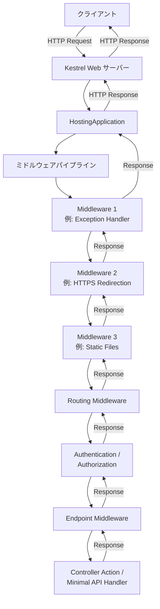

## 第1章：ホスティングモデル — アプリケーションが起動するまで

### Generic Host の構造

ASP.NET Core アプリケーションは **Generic Host**（`Microsoft.Extensions.Hosting`）の上に構築されます。`WebApplication.CreateBuilder()` を呼び出すと、内部では以下の処理が行われます。

```csharp
var builder = WebApplication.CreateBuilder(args);
// 内部で起こること:
// 1. HostApplicationBuilder を初期化
// 2. Kestrel を既定の Web サーバーとして設定
// 3. 設定ソース (appsettings.json, 環境変数等) をロード
// 4. ログプロバイダーを設定
// 5. DI コンテナ (ServiceCollection) を初期化
```

[`WebApplication.CreateBuilder()`](https://github.com/dotnet/aspnetcore/blob/main/src/DefaultBuilder/src/WebApplication.cs) の内部実装を見てみましょう。

```csharp
// dotnet/aspnetcore の簡略化した実装イメージ
public static WebApplicationBuilder CreateBuilder(string[] args)
{
    var builder = new WebApplicationBuilder(
        new WebApplicationOptions { Args = args });
    return builder;
}
```

`WebApplicationBuilder` のコンストラクタでは、以下の順序で初期化が進みます：

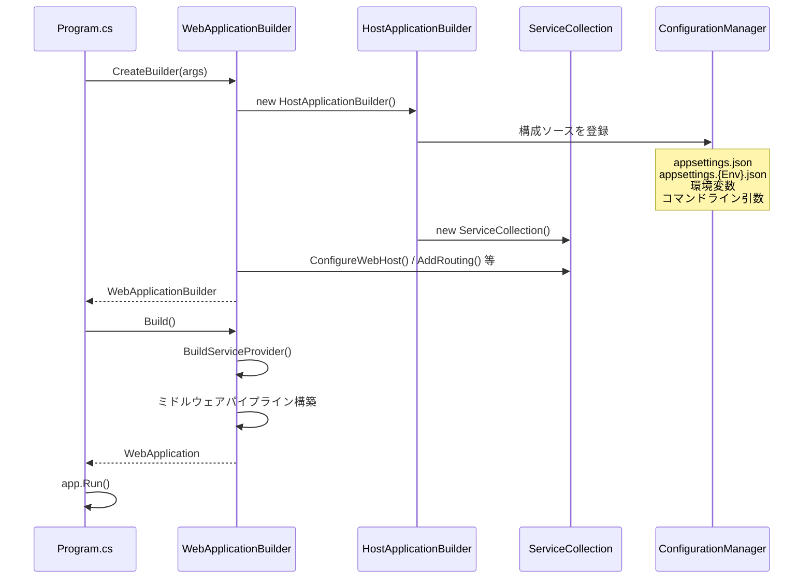

### Kestrel — 高性能 Web サーバー

Kestrel は ASP.NET Core の既定のインプロセス HTTP サーバーです。[libuv](https://libuv.org/) から独自の I/O 実装に移行し、現在は `System.IO.Pipelines` と `System.Net.Sockets` を使用した **非同期 I/O** ベースのアーキテクチャを採用しています。

#### Kestrel の内部構造

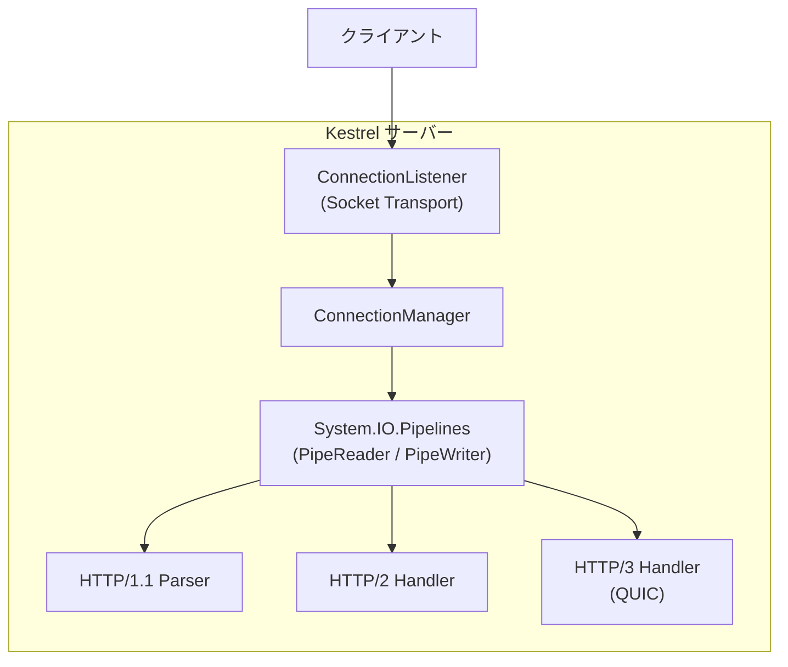

Kestrel の設計で特に重要なのは **`System.IO.Pipelines`** の採用です。従来の `Stream` ベース API では、データの読み取りにバッファのコピーが頻繁に発生していました。`Pipelines` では `ReadOnlySequence<byte>` を通じて **ゼロコピー** に近い形でデータを処理できます。

```csharp
// Kestrel の HTTP/1.1 パーサーの簡略イメージ
while (true)
{
    // PipeReader からデータを読み取り（コピー不要）
    ReadResult result = await reader.ReadAsync();
    ReadOnlySequence<byte> buffer = result.Buffer;

    // HTTP リクエストラインとヘッダーをパース
    if (TryParseRequest(buffer, out var consumed, out var examined))
    {
        reader.AdvanceTo(consumed, examined);
        break;
    }

    // データが不足している場合、追加データを待つ
    reader.AdvanceTo(buffer.Start, buffer.End);
}
```

#### 接続管理と同時接続

Kestrel は各接続を個別の `Task` として管理します。`.NET` のスレッドプールと `async/await` により、少数の OS スレッドで大量の同時接続を効率よく処理できます。

| パラメータ | 既定値 | 説明 |
|-----------|--------|------|
| `MaxConcurrentConnections` | `null`（無制限） | 同時接続数の上限 |
| `MaxConcurrentUpgradedConnections` | `null`（無制限） | WebSocket 等のアップグレード接続上限 |
| `MaxRequestBodySize` | 約 30 MB（30,000,000 bytes） | リクエストボディの最大サイズ |
| `RequestHeadersTimeout` | 30 秒 | リクエストヘッダー受信のタイムアウト |
| `KeepAliveTimeout` | 130 秒 | Keep-Alive 接続のタイムアウト |

### リバースプロキシ構成

プロダクション環境では、Kestrel を直接公開するのではなく、**リバースプロキシ**（Nginx, IIS, YARP 等）の背後に配置するのが一般的です。

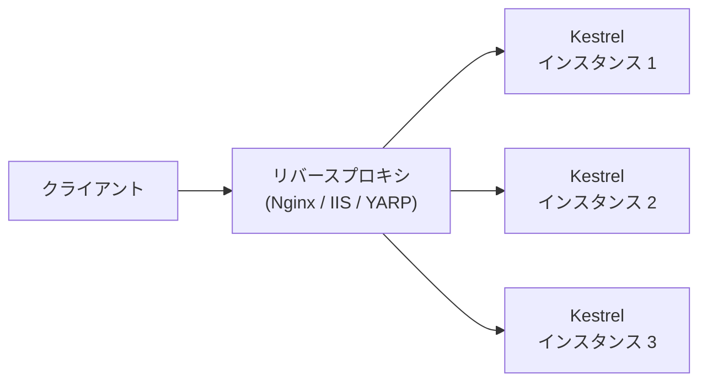

リバースプロキシが担う責任：

- **TLS 終端** — SSL/TLS の暗号化・復号化
- **ロードバランシング** — 複数インスタンスへの負荷分散
- **リクエストバッファリング** — 遅いクライアントからの送信を吸収
- **静的ファイル配信** — Kestrel に到達させずにレスポンス
- **レート制限** — DDoS 攻撃やアビューズの緩和

## 第2章：ミドルウェアパイプライン — リクエストの旅

### ミドルウェアの仕組み

ASP.NET Core のリクエスト処理の核心は **ミドルウェアパイプライン** です。各ミドルウェアは `RequestDelegate` を受け取り、`RequestDelegate` を返す **入れ子構造** になっています。

```csharp
// RequestDelegate の定義
public delegate Task RequestDelegate(HttpContext context);

// ミドルウェアの基本形
public class MyMiddleware
{
    private readonly RequestDelegate _next;

    public MyMiddleware(RequestDelegate next)
    {
        _next = next;
    }

    public async Task InvokeAsync(HttpContext context)
    {
        // リクエスト処理（パイプラインの下流へ行く前）
        Console.WriteLine("Before next middleware");

        await _next(context); // 次のミドルウェアを呼び出す

        // レスポンス処理（パイプラインの下流から戻ってきた後）
        Console.WriteLine("After next middleware");
    }
}
```

### パイプラインの構築プロセス

`app.Build()` が呼ばれると、登録されたミドルウェアが **逆順** にチェーンされます。これは **ロシアンドール（マトリョーシカ人形）** モデルと呼ばれます。

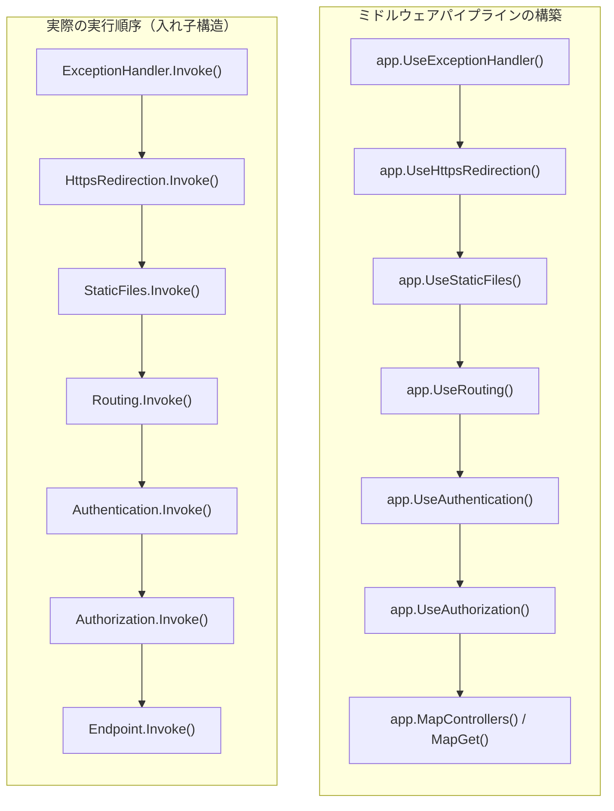

内部的には、`ApplicationBuilder.Build()` は以下のような処理を行います：

```csharp
// ApplicationBuilder.Build() の簡略化した実装
public RequestDelegate Build()
{
    // 最終段：どのミドルウェアも処理しなかった場合 404 を返す
    RequestDelegate app = context =>
    {
        context.Response.StatusCode = 404;
        return Task.CompletedTask;
    };

    // 登録されたミドルウェアを逆順に適用
    for (int i = _components.Count - 1; i >= 0; i--)
    {
        app = _components[i](app);
    }

    return app;
}
```

### 短絡（Short-Circuit）

ミドルウェアは `next()` を呼ばないことで、パイプラインを**短絡**できます。例えば `StaticFiles` ミドルウェアは、該当するファイルが見つかった場合、以降のミドルウェアを実行せずに直接レスポンスを返します。

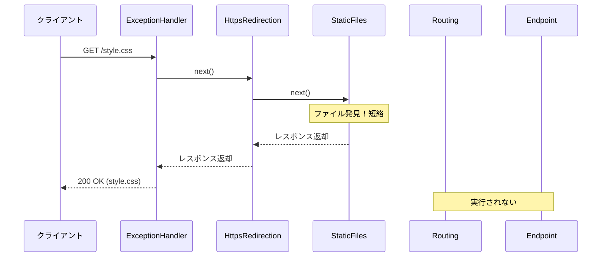

### 組み込みミドルウェアの順序

ASP.NET Core では、ミドルウェアの**登録順序**が動作に直結します。推奨される順序は以下の通りです：

| 順序 | ミドルウェア | 責務 |
|------|------------|------|
| 1 | `ExceptionHandler` / `DeveloperExceptionPage` | 例外をキャッチしてエラーレスポンスに変換 |
| 2 | `HSTS` | HTTP Strict Transport Security ヘッダー追加 |
| 3 | `HttpsRedirection` | HTTP → HTTPS リダイレクト |
| 4 | `StaticFiles` / `MapStaticAssets` | 静的ファイルの配信（短絡可能）。.NET 9 以降は `MapStaticAssets` が推奨（ビルド時圧縮・フィンガープリント対応） |
| 5 | `Routing` | URLに基づいてエンドポイントを選択 |
| 6 | `RateLimiter` | レート制限ポリシーの適用 |
| 7 | `Cors` | Cross-Origin Resource Sharing ポリシー適用 |
| 8 | `Authentication` | ユーザー認証（Identity 確立） |
| 9 | `Authorization` | ユーザー認可（アクセス制御） |
| 10 | `OutputCache` | レスポンスキャッシュ |
| 11 | エンドポイントミドルウェア | `MapGet()` / `MapControllers()` 等 |

## 第3章：依存性注入（DI）コンテナの内部実装

### ASP.NET Core の DI コンテナ

ASP.NET Core には **フレームワーク組み込み** の DI コンテナが搭載されています。これは `Microsoft.Extensions.DependencyInjection` パッケージとして提供され、フレームワーク自体もこの DI コンテナを使って構築されています。

#### サービスのライフタイム

DI コンテナは3種類のライフタイムをサポートします：

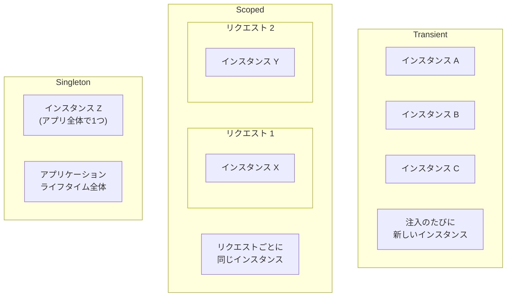

| ライフタイム | 生成タイミング | 破棄タイミング |
|-------------|--------------|--------------|
| **Transient** | 注入のたびに新規作成 | スコープの終了時 |
| **Scoped** | スコープ内で初回要求時 | スコープの終了時（リクエスト終了時） |
| **Singleton** | 初回要求時 | アプリケーション終了時 |

#### Captive Dependency（キャプティブ依存関係）問題

**重要な落とし穴**：Singleton サービスが Scoped サービスに依存すると、Scoped サービスが事実上 Singleton として動作してしまいます。これを **キャプティブ依存関係** と呼びます。

```csharp
// 危険：Singleton が Scoped に依存
services.AddSingleton<MySingleton>();
services.AddScoped<MyScopedService>();

public class MySingleton
{
    private readonly MyScopedService _scoped; // この参照がリーク

    public MySingleton(MyScopedService scoped)
    {
        _scoped = scoped; // リクエストをまたいで保持されてしまう
    }
}
```

ASP.NET Core はこの問題を検出して例外をスローする仕組みを持っています。`WebApplication.CreateBuilder()` を使用する場合、**開発環境では `ValidateScopes` と `ValidateOnBuild` が既定で有効**です（.NET 6 以降）。本番環境でも明示的に有効にしたい場合や、`WebApplicationBuilder` 以外のホスト構築を使う場合は以下のように設定します。

```csharp
builder.Host.UseDefaultServiceProvider(options =>
{
    options.ValidateScopes = true;  // 開発環境では既定で有効
    options.ValidateOnBuild = true; // ビルド時に依存関係を検証
});
```

### ServiceProvider の内部実装

`ServiceProvider` の内部では、登録されたサービスをどのように解決しているのでしょうか。

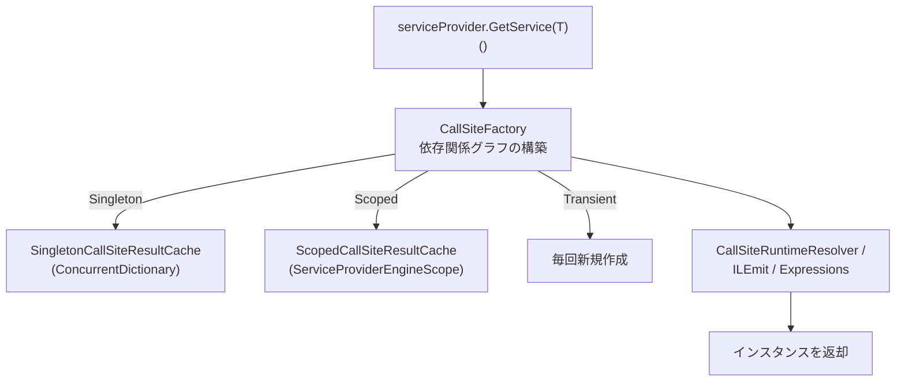

初回の解決時、`CallSiteFactory` は依存関係のグラフ（**CallSite チェーン**）を構築します。2回目以降は、コンパイル済みのファクトリデリゲートを使って高速に解決します。

```csharp
// ServiceProvider の解決プロセスの概要
// 1. CallSiteFactory が ServiceDescriptor から CallSite ツリーを構築
// 2. RuntimeResolver / CompiledResolver が CallSite を走査してインスタンスを生成
// 3. ライフタイムに応じたキャッシュに格納

// 高頻度で呼ばれるため、以下の最適化が適用されています（.NET Core 3.0 以降改善が継続）:
// - IL Emit によるファクトリの動的コンパイル
// - Expression Tree から Delegate への変換
// - キャッシュ済み Singleton の直接返却
```

### スコープの仕組み

HTTP リクエストごとに新しいスコープが作成されます。これは `IServiceScopeFactory` を使って内部的に管理されます。

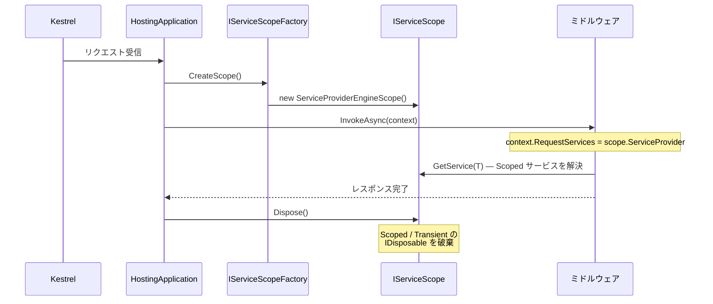

## 第4章：ルーティングシステム

### エンドポイントルーティング

ASP.NET Core は **.NET Core 3.0** 以降、**エンドポイントルーティング** を採用しています。このアーキテクチャでは、ルーティングの処理が2つのミドルウェアに分離されています。

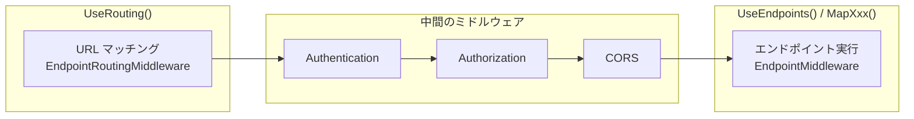

この分離により、認証・認可ミドルウェアは **どのエンドポイントが選択されたか** を知った上で動作できます。

### ルートマッチングの内部

ルーティングエンジンは **DFA（Deterministic Finite Automaton：決定性有限オートマトン）** ベースのマッチャーを使用します。これは URL のセグメントを1つずつ処理する状態遷移マシンです。

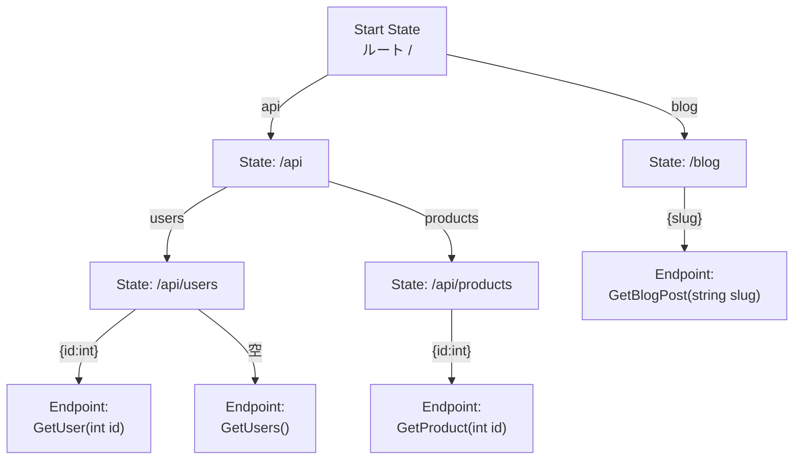

DFA マッチャーの特長：

- **O(path segments)** の時間計算量でマッチング（全ルートを線形走査しない）
- ビルド時にルートテーブルからオートマトンを構築
- ルートパラメータの制約（`{id:int}`）もマッチング段階で評価

```csharp
// ルートパターンの例と内部的なマッチング
app.MapGet("/api/users/{id:int}", (int id) => ...);
// パターン: Literal("api") -> Literal("users") -> Parameter("id", IntConstraint)

app.MapGet("/api/users/{id:guid}", (Guid id) => ...);
// パターン: Literal("api") -> Literal("users") -> Parameter("id", GuidConstraint)

// 同じパスでも制約が異なれば別のエンドポイントにマッチ
// /api/users/42       → int 版
// /api/users/abc-def  → guid 版（GUID 形式の場合）
```

### Minimal API と Controller の比較

ASP.NET Core は2つのプログラミングモデルを提供しています。

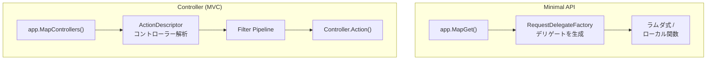

| 特徴 | Minimal API | Controller (MVC) |
|------|------------|-----------------|
| **ルーティング** | `app.MapGet/Post/Put/Delete()` | 属性ルーティング `[Route]` / 規約ベース |
| **モデルバインディング** | `RequestDelegateFactory` が自動推論 | `ModelBinder` + `ValueProvider` チェーン |
| **フィルタ** | Endpoint Filter（ASP.NET Core 7+） | Action / Result / Exception / Resource |
| **適用場面** | シンプルな API、マイクロサービス | 複雑なアプリ、View を使う MVC |
| **起動速度** | 高速（リフレクション最小） | やや遅い（Controller のスキャン・ディスクリプタ構築） |

## 第5章：モデルバインディングとバリデーション

### モデルバインディングの流れ

HTTP リクエストの生データ（クエリ文字列、ルートパラメータ、フォーム、JSON ボディ等）を C# のオブジェクトに変換するプロセスが**モデルバインディング**です。

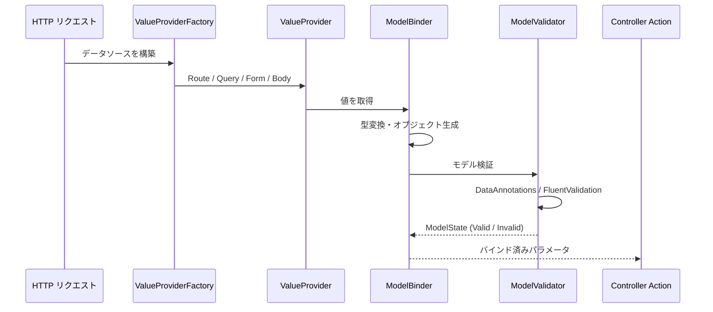

### バインディングソースの種類

明示的に属性を指定することで、以下のソースからデータを取得できます。なお、属性を指定しない場合の既定の検索順序は、フォームフィールド → ルートデータ → クエリ文字列です（`[ApiController]` の場合はリクエストボディも含まれます）。

1. **フォームデータ** (`[FromForm]`)
2. **リクエストボディ** (`[FromBody]`) — 入力フォーマッター経由で処理
3. **ルートパラメータ** (`[FromRoute]`)
4. **クエリ文字列** (`[FromQuery]`)
5. **ヘッダー** (`[FromHeader]`)
6. **サービス（DI コンテナ）** (`[FromServices]`)

```csharp
// バインディングソースの明示指定
[HttpPost("api/orders/{id}")]
public IActionResult UpdateOrder(
    [FromRoute] int id,           // URL: /api/orders/42
    [FromQuery] bool notify,      // Query: ?notify=true
    [FromBody] OrderDto order,    // Body: JSON
    [FromHeader(Name = "X-Correlation-Id")] string correlationId,
    [FromServices] IOrderService service)  // DI コンテナ
{
    // ...
}
```

### JSON シリアライズ：System.Text.Json

ASP.NET Core は既定で **System.Text.Json** を使用します。Newtonsoft.Json からの移行ポイントを整理します。

| 特徴 | System.Text.Json | Newtonsoft.Json |
|------|-----------------|-----------------|
| **パフォーマンス** | `Utf8JsonReader/Writer` による高速処理 | リフレクション重視 |
| **メモリ効率** | `Span<byte>` ベース、アロケーション最小 | `string` ベース |
| **Source Generator** | `JsonSerializerContext` で AOT 対応 | なし |
| **既定の動作** | 厳格（コメント不可、trailing comma 不可） | 寛容 |
| **ポリモーフィズム** | `[JsonDerivedType]`（.NET 7+） | `TypeNameHandling`（セキュリティリスクあり） |

```csharp
// Source Generator を使った高速 JSON シリアライズ
[JsonSerializable(typeof(WeatherForecast))]
[JsonSerializable(typeof(List<WeatherForecast>))]
public partial class AppJsonContext : JsonSerializerContext { }

// Program.cs で登録
builder.Services.ConfigureHttpJsonOptions(options =>
{
    options.SerializerOptions.TypeInfoResolverChain
        .Insert(0, AppJsonContext.Default);
});
```

## 第6章：フィルタパイプライン（MVC）

### フィルタの実行順序

MVC のフィルタは、アクション実行の前後に処理を挿入するメカニズムです。5種類のフィルタが決まった順序で実行されます。

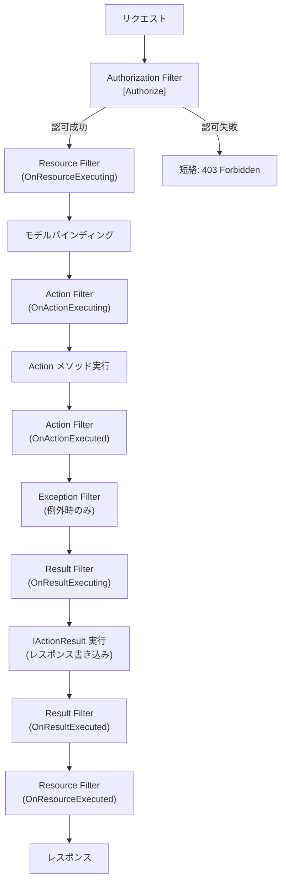

### Endpoint Filter（Minimal API 用）

Minimal API には MVC フィルタの代わりに **Endpoint Filter** が用意されています（ASP.NET Core 7 以降）。

```csharp
app.MapGet("/api/users/{id}", (int id) => ...)
    .AddEndpointFilter(async (context, next) =>
    {
        var id = context.GetArgument<int>(0);
        if (id <= 0)
        {
            return Results.BadRequest("ID は正の整数である必要があります");
        }

        // 次のフィルタまたはハンドラを実行
        return await next(context);
    });
```

## 第7章：構成（Configuration）システム

### 構成プロバイダのチェーン

ASP.NET Core の構成システムは複数のソースから設定値を取得し、**後から追加されたソースが前のソースを上書きする** 仕組みです。

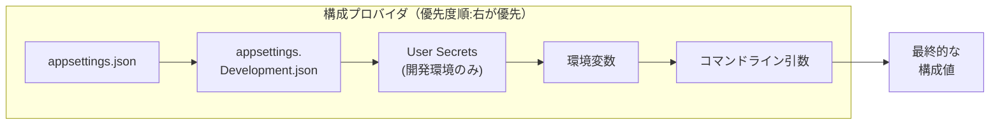

```csharp
// 構成値の取得方法
// 1. IConfiguration から直接取得
var connectionString = builder.Configuration
    .GetConnectionString("DefaultConnection");

// 2. Options パターン（推奨）
builder.Services.Configure<SmtpSettings>(
    builder.Configuration.GetSection("Smtp"));

// 3. 型安全な Options with validation
builder.Services.AddOptions<SmtpSettings>()
    .BindConfiguration("Smtp")
    .ValidateDataAnnotations()
    .ValidateOnStart(); // 起動時にバリデーション実行
```

### Options パターンの3つのインターフェース

| インターフェース | 用途 | リロード対応 |
|----------------|------|------------|
| `IOptions<T>` | Singleton。アプリ起動時に値が確定 | 不可 |
| `IOptionsSnapshot<T>` | Scoped。リクエストごとに最新の値を取得 | 可 |
| `IOptionsMonitor<T>` | Singleton。変更通知を受け取れる | 可（`OnChange` コールバック） |

```csharp
// IOptionsMonitor で構成変更をリアルタイム監視
public class MyService
{
    private readonly IOptionsMonitor<MyConfig> _config;

    public MyService(IOptionsMonitor<MyConfig> config)
    {
        _config = config;
        _config.OnChange(newConfig =>
        {
            Console.WriteLine($"構成が変更されました: {newConfig.SomeKey}");
        });
    }

    public string GetValue() => _config.CurrentValue.SomeKey;
}
```

## 第8章：認証と認可

### 認証スキームとハンドラー

ASP.NET Core の認証システムは **スキームベース** のアーキテクチャです。

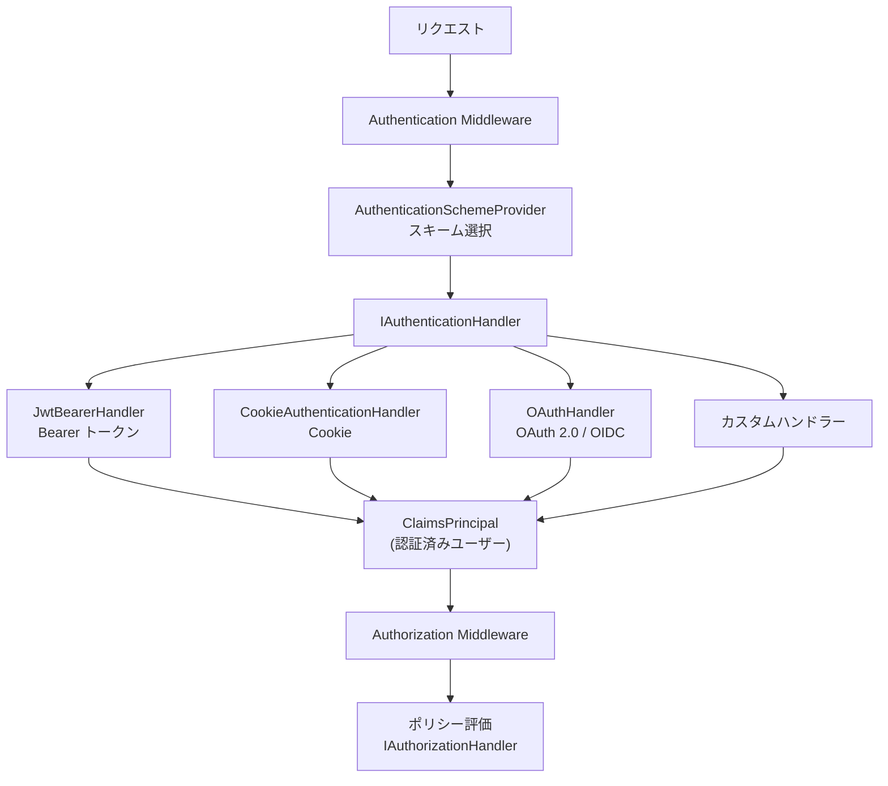

#### 認証の処理フロー

```csharp
// AuthenticationMiddleware の簡略化した実装
public async Task InvokeAsync(HttpContext context)
{
    // 1. 既定のスキームで認証を試行
    var result = await context.AuthenticateAsync();

    if (result.Succeeded)
    {
        // 2. ClaimsPrincipal を HttpContext に設定
        context.User = result.Principal;
    }

    // 3. 次のミドルウェア（通常は Authorization）へ
    await _next(context);
}
```

### ポリシーベース認可

認可はポリシーと要件（Requirement）の組み合わせで柔軟に構成できます。

```csharp
// カスタム認可ポリシーの定義
builder.Services.AddAuthorization(options =>
{
    options.AddPolicy("AdminOnly", policy =>
        policy.RequireRole("Admin"));

    options.AddPolicy("MinimumAge", policy =>
        policy.Requirements.Add(new MinimumAgeRequirement(18)));
});

// カスタム AuthorizationHandler
public class MinimumAgeHandler
    : AuthorizationHandler<MinimumAgeRequirement>
{
    protected override Task HandleRequirementAsync(
        AuthorizationHandlerContext context,
        MinimumAgeRequirement requirement)
    {
        var birthDateClaim = context.User.FindFirst("birth_date");
        if (birthDateClaim is null)
        {
            return Task.CompletedTask; // Fail（明示的に Succeed しない）
        }

        var birthDate = DateOnly.Parse(birthDateClaim.Value);
        var age = DateOnly.FromDateTime(DateTime.Today)
            .DayNumber - birthDate.DayNumber;

        if (age / 365 >= requirement.MinimumAge)
        {
            context.Succeed(requirement);
        }

        return Task.CompletedTask;
    }
}
```

## 第9章：HttpContext — リクエストの全情報

### HttpContext の構造

`HttpContext` は1つの HTTP リクエスト/レスポンスサイクルに関するすべての情報を保持するオブジェクトです。

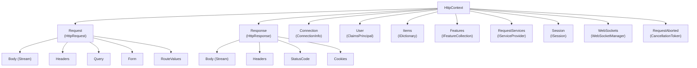

### Feature コレクション

`HttpContext.Features` は **拡張ポイント** です。サーバーやミドルウェアが追加の機能を注入できます。

```csharp
// Kestrel が提供する Feature の例
var connectionFeature = context.Features
    .Get<IHttpConnectionFeature>();
var localIp = connectionFeature?.LocalIpAddress;

// HTTP レスポンストレーラー（レスポンスボディの後に送信される末尾ヘッダー）
var trailersFeature = context.Features
    .Get<IHttpResponseTrailersFeature>();

// リクエストのタイムアウト (.NET 8+)
var timeoutFeature = context.Features
    .Get<IHttpRequestTimeoutFeature>();
timeoutFeature?.DisableTimeout();
```

## 第10章：パフォーマンス最適化のアーキテクチャ

### Object Pool

ASP.NET Core は頻繁に使用されるオブジェクトの**プーリング**を行い、GC 圧力を低減しています。

```csharp
// StringBuilder のプーリング例
var pool = serviceProvider
    .GetRequiredService<ObjectPool<StringBuilder>>();

var sb = pool.Get();
try
{
    sb.Append("Hello ");
    sb.Append("World");
    return sb.ToString();
}
finally
{
    pool.Return(sb); // プールに返却（Clear も自動）
}
```

### ArrayPool と MemoryPool

`System.Buffers.ArrayPool<T>` は配列のレンタル・返却を管理し、大量の短命な配列によるヒープ割り当てを削減します。

```csharp
// Kestrel 内部で使われるバッファ管理パターン
byte[] buffer = ArrayPool<byte>.Shared.Rent(4096);
try
{
    int bytesRead = await stream.ReadAsync(
        buffer.AsMemory(0, 4096));
    ProcessData(buffer.AsSpan(0, bytesRead));
}
finally
{
    ArrayPool<byte>.Shared.Return(buffer);
}
```

### Response Compression

レスポンス圧縮ミドルウェアは、`Accept-Encoding` ヘッダーに基づいて自動的にレスポンスを圧縮します。

```csharp
builder.Services.AddResponseCompression(options =>
{
    options.EnableForHttps = true; // HTTPS でも圧縮
    options.Providers.Add<BrotliCompressionProvider>();
    options.Providers.Add<GzipCompressionProvider>();
});

builder.Services.Configure<BrotliCompressionProviderOptions>(
    options => options.Level = CompressionLevel.Fastest);
```

### .NET 8 以降のパフォーマンス機能

#### .NET 8

| 機能 | 説明 |
|------|------|
| **Native AOT** | JIT 不要。起動時間とメモリ消費を大幅に削減 |
| **Request Delegate Generator** | Minimal API のデリゲートをコンパイル時に生成 |
| **Frozen Collections** | `FrozenDictionary` / `FrozenSet` で読み取り専用コレクションを最適化 |
| **SearchValues** | 文字列検索の SIMD 最適化 |
| **Interceptors** | コンパイル時にメソッド呼び出しを差し替え |
| **CompositeFormat** | `string.Format` のパース済みフォーマット文字列 |

#### .NET 9

| 機能 | 説明 |
|------|------|
| **MapStaticAssets** | ビルド時圧縮・フィンガープリント付き静的ファイル配信（`UseStaticFiles` の推奨代替） |
| **HybridCache** | `IDistributedCache` と `IMemoryCache` を統合する新キャッシュライブラリ。スタンピード防止機能付き |
| **Keyed DI in Middleware** | ミドルウェアのコンストラクタや `Invoke` メソッドで `[FromKeyedServices]` をサポート |
| **SignalR Native AOT** | SignalR のクライアント/サーバーがトリミングと Native AOT に対応 |

#### .NET 10

| 機能 | 説明 |
|------|------|
| **Minimal API Validation** | `AddValidation()` で DataAnnotations ベースの組み込みバリデーションを有効化 |
| **Server-Sent Events** | `TypedResults.ServerSentEvents` で SSE ストリームを返却可能 |
| **OpenAPI 3.1** | JSON Schema draft 2020-12 に準拠した OpenAPI ドキュメント生成 |
| **Memory Pool Eviction** | Kestrel / IIS / HTTP.sys のメモリプールがアイドル時に自動解放 |
| **JSON Patch (System.Text.Json)** | `Newtonsoft.Json` 不要の高速 JSON Patch 実装 |

## 第11章：エラーハンドリングのアーキテクチャ

### 例外処理の階層

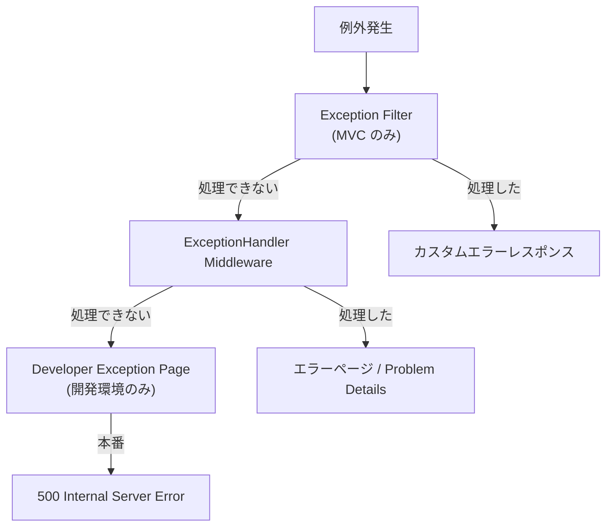

### Problem Details（RFC 9457）

ASP.NET Core 7 以降は [RFC 9457 (Problem Details)](https://www.rfc-editor.org/rfc/rfc9457) に準拠したエラーレスポンスを簡単に返せます。

```csharp
// グローバルに Problem Details を有効化
builder.Services.AddProblemDetails(options =>
{
    options.CustomizeProblemDetails = context =>
    {
        context.ProblemDetails.Extensions["traceId"] =
            context.HttpContext.TraceIdentifier;
    };
});

// 例外ハンドラーでの使用
app.UseExceptionHandler();
app.UseStatusCodePages();

// レスポンス例:
// {
//   "type": "https://tools.ietf.org/html/rfc9110#section-15.5.5",
//   "title": "Not Found",
//   "status": 404,
//   "traceId": "00-abc123-def456-01"
// }
```

## 第12章：テストアーキテクチャ

### WebApplicationFactory

ASP.NET Core はインメモリでアプリケーション全体を起動できる `WebApplicationFactory` を提供しています。これにより、実際のネットワーク通信なしにインテグレーションテストが可能です。

```csharp
public class ApiTests : IClassFixture<WebApplicationFactory<Program>>
{
    private readonly HttpClient _client;

    public ApiTests(WebApplicationFactory<Program> factory)
    {
        _client = factory.WithWebHostBuilder(builder =>
        {
            builder.ConfigureServices(services =>
            {
                // テスト用にサービスを差し替え
                services.AddScoped<IEmailService, FakeEmailService>();
            });
        }).CreateClient();
    }

    [Fact]
    public async Task GetUsers_ReturnsOk()
    {
        var response = await _client.GetAsync("/api/users");
        response.EnsureSuccessStatusCode();

        var users = await response.Content
            .ReadFromJsonAsync<List<UserDto>>();
        Assert.NotEmpty(users);
    }
}
```

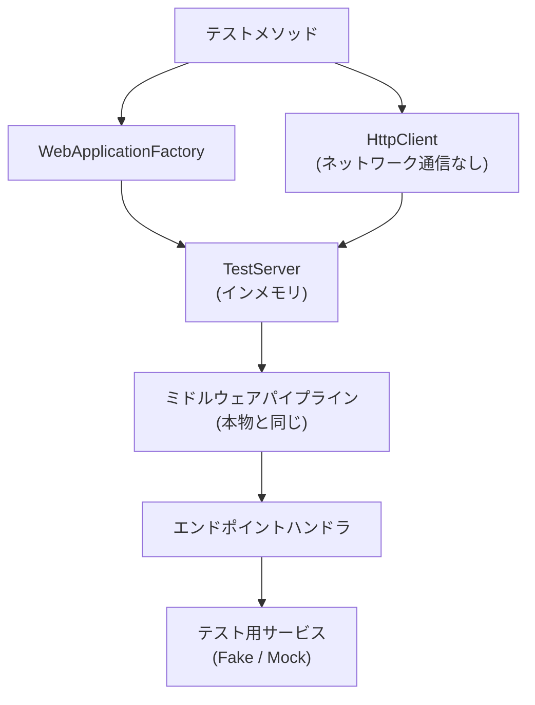

## まとめ：リクエストの生涯

最後に、1つの HTTP リクエストが辿る全過程をまとめます。

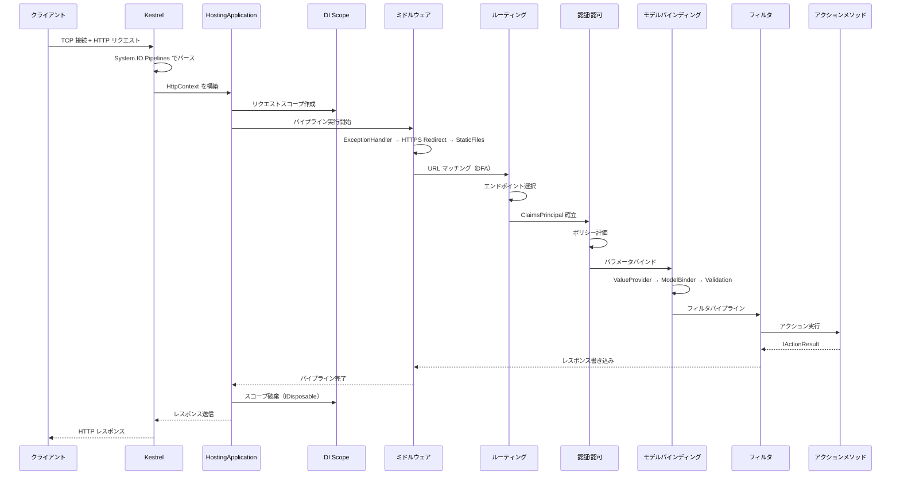

## 参考資料

- [ASP.NET Core 公式ドキュメント](https://learn.microsoft.com/aspnet/core/)
- [ASP.NET Core ソースコード (GitHub)](https://github.com/dotnet/aspnetcore)
- [.NET Runtime ソースコード (GitHub)](https://github.com/dotnet/runtime)
- [Kestrel の内部実装 — Steve Gordon](https://www.stevejgordon.co.uk/building-asp-net-core-kestrel)
- [ASP.NET Core Performance Best Practices](https://learn.microsoft.com/aspnet/core/performance/performance-best-practices)
- [RFC 9457 — Problem Details for HTTP APIs](https://www.rfc-editor.org/rfc/rfc9457)
