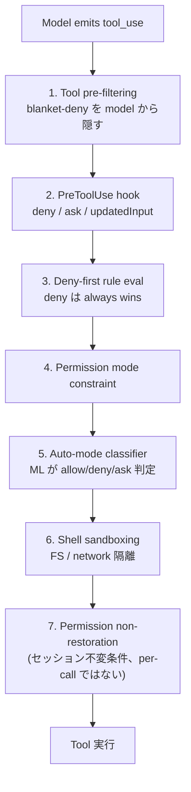

> **元論文**: Liu, Zhao, Shang, Shen (MBZUAI / UCL).
> [_Dive into Claude Code: The Design Space of Today's and Future AI Agent Systems_](https://arxiv.org/abs/2604.14228) — arXiv:2604.14228, 2026-04-14.
> [GitHub: VILA-Lab/Dive-into-Claude-Code](https://github.com/VILA-Lab/Dive-into-Claude-Code)

## はじめに —— なぜ本番エージェントの「中身」を知るべきか

2026 年の今、ソフトウェア開発の風景は一変しつつあります。GitHub Copilot がカーソル位置にコード断片を提案するだけだった時代は遠く、Cursor や Windsurf が IDE と会話しながら複数ファイルを編集する「Chat 統合」フェーズを経て、私たちは今 **自律型 CLI** の時代に足を踏み入れています。Claude Code、Codex CLI、Aider——これらのツールはシェルを叩き、ファイルシステムを書き換え、テストを走らせ、その結果を見て次の手を自律的に決めます。さらにその先には Devin や SWE-Agent、OpenHands のようにサンドボックス内でほぼ人間不在のまま開発を進める「完全自律型」が控えている。

この急速な進化の中で、ほとんどの議論は **モデルの賢さ** に集中してきました。どのモデルが SWE-bench で何パーセント解けるか、HumanEval のスコアがいくつか。しかし現場のエンジニアが肌で感じ始めているのは、別の事実です：**同じモデルを使っても、ツールによって成果がまるで違う**。モデルは必要条件であって十分条件ではない——では、差を生んでいるのは何か？

2026 年 4 月、MBZUAI と UCL の研究グループがその問いに正面から答える論文を公開しました。Anthropic の Claude Code（v2.1.88）の **TypeScript ソースコード約 1,884 ファイル / 512,000 行** を 1 行ずつ読み解き、アーキテクチャ全体を逆引きした技術レポートです。

その最大の発見はシンプルですが、示唆に富んでいます：

> **Claude Code のコードベースのうち、AI の意思決定ロジックは推定わずか 1.6%。残りの 98.4% は、モデルを取り囲む決定論的な「運用ハーネス」である。**（コミュニティ分析による Tier C 推定）

これは行数ベースの計測であり、価値配分の比ではありません（モデルを弱いものに差し替えれば同じハーネスでも性能は崩壊する）。しかしこの数字が伝えるメッセージは明確です：**本番 AI エージェントの真の設計空間は、モデルの外側に広がっている**。

本記事では、この論文の要点を **AI エージェント開発に取り組むエンジニア** に向けて、設計判断の背景となる文脈を豊かに補いながら再構成します。論文の構造をなぞるのではなく、「なぜそう作ったのか」「それは我々の製品に何を意味するのか」という問いを軸に歩いていきます。

論文は全体を通じて **「`auth.test.ts` の失敗テストを直して」** という 1 つのタスクを追跡しますので、本記事でもこれを骨格に使います。まずはインタラクティブなデモで、エージェントの心臓部である `queryLoop()` が 1 周する流れを体感してみてください。

<ClaudeCodeLoopVisualizer />

---

## I. 設計の北極星 —— 5 つの価値観と「モデルの判断を妨げない」哲学

あらゆるソフトウェアアーキテクチャには、意識的であれ無意識であれ、「何を大事にするか」という価値観が埋め込まれています。Claude Code も例外ではありません。論文はまず、Anthropic の公式ドキュメント・ブログ・社内調査から **5 つの人間的価値** を抽出し、それがアーキテクチャ全体を貫く北極星であることを示します。

**第一の価値は「人間の意思決定権限」** です。人間が最終的な決定権を握ること。これは Anthropic Constitution の権限階層（Anthropic → operator → user の権限階層）を反映しています。興味深いのは、ユーザーが許可プロンプトの 93% を承認してしまうという実証データが出た時、Anthropic の対応が「もっと警告を出す」ではなく「問題の構造を変える」——つまり、サンドボックスと ML 分類器を導入して、人間が判断しなくてもよい領域を定義し直す——だったこと。**人間の決定権を保証するために、人間の注意力を前提としない** という逆説的な設計です。

**第二は「安全性・セキュリティ・プライバシー」**。人間が油断しても守る義務。決定権が「人間が選ぶ力」なら、安全性は「人間がその力を行使し損ねた時の保護」です。auto-mode の脅威モデルは 4 カテゴリ（過剰行動、正直なミス、prompt injection、モデルの価値観のずれ）を明示的に対象としています。

**第三は「確実な実行」**。言われた通りを長時間維持すること。情報収集→実行→検証の 3 段階ループとして実装されています。Anthropic のハーネス設計ガイドが「エージェントは出来が悪くても自信満々に褒める傾向がある」と警告しているのは印象的で、生成と評価の分離を動機づけています。

**第四は「能力の拡張」**。人間ができることを質的に増やすこと。社内調査によれば、Claude Code で手がけたタスクの約 27% は「ツールがなければそもそも着手しなかった仕事」だったという報告があります。速くなるのではなく、**新しい種類の仕事が可能になる**——これが質的変化の意味です。Claude Code の開発者はこれを「製品ではなく Unix ユーティリティ」と呼んでいます。

**第五は「文脈への適応」**。プロジェクトと一緒に賢くなること。自動承認率はセッション数 50 未満で約 20%、750 セッション超で 40% 以上に上昇するという長期追跡データがあり、信頼は「ユーザーとモデルと製品の三者が共同で築く」ものとして設計されています。

これら 5 つの価値は **13 の設計原則** に具体化されます。中でもアーキテクチャ全体を最もよく説明するのが **「足場は最小限に、運用基盤は最大限に」** という原則です。LangGraph のようにプランナーや状態グラフでモデルの意思決定を外側から構造化するのではなく、**モデルには自由に判断させ、その周りを鉄壁の決定論で固める**。これが 1.6% / 98.4% という数字の背景にある設計哲学です。

加えて論文は、5 価値とは別に **「長期的な人間の能力保全」** という評価レンズを導入します。これは Claude Code の設計原則には入っていないもので、後段で「エージェントが開発者の理解やスキルを毀損していないか」を批判的に検討するためのフレームです。本番エージェントの議論でこの視点が明示されるのは稀であり、後述する実証データ（§X）と合わせて、本論文の大きな貢献の一つです。

> **産業への示唆①**：自社のエージェント製品が「何を大事にしているか」を 5 価値のフレームで点検してみてください。多くのスタートアップは「能力の拡張」に全振りしていますが、安全性と決定権のバランスが欠けると、93% が承認されてしまう承認疲れの罠にはまります。

---

## II. 心臓部を解剖する —— queryLoop() で追う 1 タスクの生涯

### 「全部 queryLoop() に流れ込む」という設計選択

Claude Code には Interactive CLI、Headless CLI（`claude -p`）、Agent SDK、IDE 統合といった複数のインターフェースがありますが、**すべてが同一の `queryLoop()` 関数に流れ込みます**。差は rendering 層だけ。これは `QueryEngine`（`QueryEngine.ts`, 47KB）が SDK / headless 向けの会話ラッパーであって、エンジンそのものではないことからも分かります。Interactive CLI は `QueryEngine` を迂回して直接 `query()` を呼びます。**共有コードパスはクラスではなくループ関数**——この区別はアーキテクチャ上重要です。

### 1 ターンの 9 ステップ

`query.ts`（68KB）に実装された `queryLoop()` は、async generator として書かれた while-true ループです。「`auth.test.ts` の失敗テストを直して」というタスクを例に、1 ターンの流れを追いましょう：

1. **設定の解決** — システムプロンプト、許可コールバック、モデル設定を展開
2. **状態の初期化** — メッセージ履歴・ツール実行文脈・圧縮追跡を持つ単一の State オブジェクト。ループ内の 7 つの継続地点はこのオブジェクトをフィールド単位ではなくオブジェクトごと上書きする
3. **文脈の組み立て** — 最後の圧縮境界以降のメッセージを取得
4. **5 段の事前圧縮処理を順次適用**（後述）
5. **`callModel()` を `for await` でストリーミング** — ここでモデルが `Bash { command: "npm test auth.test.ts" }` を emit する
6. **tool_use ブロックがあれば振り分け** — StreamingToolExecutor へ
7. **許可ゲートを通す** — 7 層の「まず拒否」評価（§III で詳述）
8. **実行 → tool_result を会話に追加** — テスト失敗ログが `tool_result` として追加される
9. **テキストのみなら終了、tool_use があればループ続行**

これは ReAct パターン（Reasoning → Acting → Observing を繰り返す; Yao et al., 2022）の素直な実装です。LangGraph のような explicit graph routing でも、LATS（Language Agent Tree Search; Zhou et al., 2024）のような tree search でもなく、**「while-true で commit して、戻れない」** 設計。これは latency と simplicity のための選択であり、search completeness を犠牲にしています。

### ループを止める 5 つの条件

while-true とはいえ、無限に走り続けるわけではありません。ループは以下のいずれかで停止します：(1) モデルが text-only（tool_use なし）で返答した場合（主要パス）、(2) `maxTurns` の上限に到達、(3) API が `prompt_too_long` を返し recovery も失敗、(4) PostToolUse hook が `hook_stopped_continuation` を set、(5) `abortController` signal が発火。

この停止条件の設計は、Huyen (2025) が指摘する **複合誤差の問題** と直結します。ステップ精度 95% でも 100 ステップ実行すれば全体成功率は 0.6% しかない。Claude Code は停止条件とステップごとの許可検査の組み合わせでこの崩壊を抑え込もうとしています。

### 並列ツール実行のメカニズム

`StreamingToolExecutor` は read-only な tool を **並列** に、state-modifying な tool（Bash など）を **直列** に実行します。並列実行しても出力順は元の tool_use 順に保たれます（モデルが期待する順序を維持するため）。2 つの coordination mechanism——任意の Bash tool エラーで in-flight な他プロセスを即 terminate する **sibling abort controller** と、新出力で consumer を起こす **progress-available signal**——が並列性を安全に管理します。

これは PASTE（Sui et al., 2026）のような投機的先行実行（モデルが生成中に使いそうなツールを先走りさせる）と純粋直列の中間点です。全体は `AsyncGenerator` として実装され、`StreamEvent`、`RequestStartEvent`、`Message` 等を yield しながら、**ストリーミング UI 出力と単一の同期的制御フローを両立** させています。

### 5 段圧縮パイプライン —— 「文脈は希少な計算資源」

この論文最大の設計上の洞察の一つが、文脈の圧縮を **多段にする** という設計選択です。

文脈ウィンドウは「データを入れる箱」ではなく **「希少な計算資源」** です。Claude Code はこの資源を 5 段の段階的パイプラインで管理します。安い圧縮から順に試し、本当に必要な時だけ段階を上げる——**急がない劣化**の思想です。

| 段 | 名前 | 何を削るか | 特徴 |
|---|---|---|---|
| 1 | **Budget reduction** | サイズ超過の tool result | 常時 ON、content reference に置換 |
| 2 | **Snip** | 古い history 区間 | feature flag、軽量 trim |
| 3 | **Microcompact** | 細粒度、cache 認識 | API レスポンス後まで boundary を遅延。Anthropic の API は繰り返される prompt prefix を cache するため、prefix 境界を壊すと cache 再作成の課金が発生する |
| 4 | **Context collapse** | history への read-time projection | 元の transcript は破壊しない |
| 5 | **Auto-compact** | モデル生成サマリ | 上 4 段で足りなかった時の最終手段 |

compaction にはもう一つ興味深い経済的な詳細があります。ソースコード中の 2026 年 1 月の実験コメントによれば、プロンプトキャッシュの再利用をオフにした経路は **98% がキャッシュミスで、全体のキャッシュ生成コストの約 0.76%** に相当するとのこと。圧縮アルゴリズムと API 課金がこれほど直結している点は、本番エージェント設計の現実を如実に示しています。

5 段圧縮とは別に、論文は文脈節約のための **4 つの追加仕組み** も識別しています：CLAUDE.md の遅延読み込み、ToolSearch によるツールスキーマの後回し読み込み、サブエージェントの要約のみ返却、ツール結果ごとのサイズ上限。

> **産業への示唆②**：自社でエージェントを作る時、最低でも「ツール結果ごとのサイズ上限」「セッション全体のトークン監視」「代替モデル」「出力上限エラー用の小さな固定リトライ予算」は必須です。Claude Code のリトライ回数 3（`MAX_OUTPUT_TOKENS_RECOVERY_LIMIT = 3`）は彼らのワークロードで最適化された値であり、普遍定数ではありません。しかし「段階的に安い圧縮から試す」という原則は一般化できます。

### Recovery メカニズム

- 出力トークン超過には最大 3 回リトライ
- `prompt_too_long` エラーには context-collapse → reactive compact の順で fallback
- streaming fallback と fallback model も用意

---

## III. 安全は建築で担保する —— 7 層 Permission Gate の設計思想

### 「93% が approve」が意味すること

Anthropic の auto-mode 分析（2026）によれば、ユーザーは **許可プロンプトの 93% を承認** します。これは一見、「ほとんどの操作は安全だ」と読めます。しかし実際にはこの数字は **安全装置としての対話型確認が機能していない** ことの証拠です。人間は習慣化すると、内容を確認せずに承認を押すようになる——承認疲れです。

長期追跡データはさらに先を示しています。自動承認率はセッション数 50 未満で約 20% → 750 セッション超で 40% 以上に上昇し、セッション時間も著しく伸びる。信頼は「意図的なモード選択」ではなく **漸進的な慣れ** で遷移するのです。サンドボックス導入は許可プロンプトの頻度を推定 84% 削減しました。問題の再定義：「もっと承認してもらう」ではなく「人間が判断しなければならない回数を減らす」。

この認識が、Claude Code の安全設計を根本的に方向づけています。Claude Code は SWE-Agent / OpenHands のような Docker サンドボックスでの粗粒度隔離でも、Aider のような git 自動コミット + `/undo` の事後取り消しでもなく、**操作ごとのポリシー強制の多層化** を選びました。

### 7 つの permission mode

Claude Code には 7 つの permission mode があります。`plan`（計画立案必須、user 承認後に実行）、`default`（標準的な対話モード）、`acceptEdits`（working dir 内 edit を auto-approve）、`auto`（ML 分類器が判定、feature flag 必要）、`dontAsk`（聞かないが deny rule は有効）、`bypassPermissions`（大半スキップ、safety-critical は残る）、そして `bubble`（内部用、subagent の permission prompt を親プロセスに escalate）。5 つの外部 mode + feature-gated `auto` + internal `bubble` で 7 つです。

### 7 段の独立な safety layer



各層は独立であり、**1 つでも block すれば tool は実行されません**。

### Permission handler の 4 パス

permission 評価の実装（`useCanUseTool.tsx`）は、runtime context に応じて 4 つのパスに分岐します。(1) **Coordinator**：multi-agent coordination mode で、自動解決を試し失敗なら user に fallback。(2) **Swarm worker**：agent swarm 内の worker 用。(3) **Speculative classifier**：`BASH_CLASSIFIER` 有効 + BashTool の場合、事前分類結果を timeout と race し、高確度なら user interaction なしで即 approve。(4) **Interactive**：標準的な approval dialog を terminal UI に表示する fallback パス。

重要な設計判断として、**許可の拒否は強制停止ではなく経路制御の信号** です。モデルは拒否理由を受け取り、次のループの回でより安全な代替手段を試みます。つまり許可の強制はエージェントの行動を停止するのではなく **形作る**。

### 自動モード分類器の緊張

`yoloClassifier.ts` は提案された tool_use を会話履歴と許可テンプレートに対して評価し、許可 / 拒否 / 「手動承認を要請」 を返す **別の LLM 呼び出し** です。ここに構造的な緊張があります——安全層自体が LLM 呼び出しを伴い、トークン・応答時間のコストを主ループと共有する。独立セキュリティ調査（Adversa AI, 2026）は、50 個以上のサブコマンドを持つコマンドがサブコマンドごとの拒否検査を省略して汎用プロンプト 1 回に後退する振る舞いを報告しています。**多層防御は、各層が独立した障害モードを持つ時にだけ機能する** という教訓です。

### 時間的順序の脆弱性

論文が明らかにした最も重要な安全上の洞察の一つは、**時間的順序** に関するものです。プロジェクト初期化フェーズ（hook / MCP サーバー / 設定解決）は信頼ダイアログの **前** に走ります。この信頼確立前の実行ウィンドウは「まず拒否」パイプラインの外側にあり、独立に検証された複数の CVE がこの単一の根を共有しています。

空間的なレイヤー図は時間的な性質を隠す——セキュリティレビューでアーキテクチャ図を読む時は「どの順番でいつ有効になるか」を必ず確認すべき、という教訓です。

### シェルサンドボックスの直交性

`shouldUseSandbox.ts` が制御するシェルサンドボックスは許可システムとは **独立した軸** で動作します。許可で承認されたコマンドでもサンドボックス対象ならサンドボックス内で実行される。逆に拒否されたコマンドはサンドボックスに到達しない。**認可と隔離** の 2 軸の独立性が、多層防御の真の意味です。

> **産業への示唆③**：「まず拒否」だけ採用すると摩擦だけ得て安全は得られません。Claude Code で機能しているのは、分類器とサンドボックスが下流で受けているから。本番エージェントには最低でも「まず拒否 + サンドボックス + 許可非復元」の 3 層が必要です。そして MCP サーバーやプラグインを組み込む時は、各拡張のマニフェストに **有効化フェーズ**（「信頼確立前」/「信頼確立後」/「ターンごと」）の宣言を必須化すべきです。

---

## IV. 拡げる —— 4 つの拡張機構と context cost のジレンマ

### なぜ 4 つに分けるのか

エージェント基盤を作る時、「拡張の仕組みを 1 本化したい」誘惑は強い。しかし Claude Code は MCP / プラグイン / スキル / フックの **4 つ** に分けています。論文の答えは明快です：**文脈ウィンドウのコストが違うものを同じ抽象で扱うと、拡張作者を不当に縛る**。

| 機構 | Context cost | 注入点 | 何を提供するか |
|---|---|---|---|
| **フック** | **ゼロ** | `execute()` | ライフサイクルへの介入、イベント駆動 |
| **スキル** | **低** | `assemble()` | ドメイン指示 + メタツール |
| **プラグイン** | **中** | 全 3 点 | 複数要素のパッケージング |
| **MCP servers** | **高** | `model()` | 外部サービス統合（MCP = Model Context Protocol） |

### 3 つの注入点

エージェントループの内部には 3 つの拡張点があります。(a) `assemble()` はモデルが「何を見るか」を制御（CLAUDE.md、スキルの説明、MCP リソースが注入される）。(b) `model()` はモデルが「何に手を伸ばせるか」を制御（組み込みツール、MCP ツール、SkillTool、AgentTool がフラットな一覧として渡される）。(c) `execute()` は操作が「実行されるか / どう実行されるか」を制御（許可ルール、PreToolUse / PostToolUse フックが介入する）。4 つの拡張機構はこの 3 点にそれぞれ異なる位置で接続します。

### 27 種の Hook event

`coreTypes.ts` に 27 種の hook event が定義されています。tool 認可 5 種（PreToolUse / PostToolUse / PostToolUseFailure / PermissionRequest / PermissionDenied）、session lifecycle 5 種、user interaction 3 種、subagent coordination 5 種、context management 4 種、workspace event 4 種 + notification。うち 15 イベントは rich な output schema を持ちます。実装形式はシェルコマンド / LLM プロンプト / HTTP / エージェント検証器 / コールバックの 5 種。

実装上の重要な詳細として、**MCP tool と非 MCP tool で hook のタイミングが異なります**。非 MCP tool では `tool_result` が emit された後に PostToolUse hook が走りますが、MCP tool では result の emit を hook 完了後まで遅延し、`updatedMCPToolOutput` による出力書き換えを可能にしています。

> **産業への示唆④**：MCP が Linux Foundation Agentic AI Foundation に寄贈された今、「コストごとに別の仕組みに分けるか、コスト注釈付きの統一 API にするか」はエコシステム全体で議論すべき段階です。Claude Code の賭けは「別の仕組みに分けることで作者にコストを直視させる」こと。

---

## V. 覚える —— CLAUDE.md と context 構築の戦略

### 「指示」と「強制」の分離

Claude Code の記憶システムの設計で最も重要なのは、**CLAUDE.md の中身はシステムプロンプトではなくユーザーメッセージとして注入される** という点です。これはモデルの指示への応答が **確率的** であることを意味します。確実な強制は許可ルール（「まず拒否」、決定論的）に分離されている。「指示」（確率的）と「強制」（決定論的）がアーキテクチャレベルで明確に分かれているのです。

### 4 階層の CLAUDE.md

```text
/etc/claude-code/CLAUDE.md    ← OS-level managed memory（ポリシー、Linux）
~/.claude/CLAUDE.md           ← user memory（グローバル）
<project>/CLAUDE.md           ← project memory（git commit 対象）
<project>/CLAUDE.local.md     ← local memory（gitignore 対象）
```

後から読まれた方がモデルの注意を強く引く「逆優先順」で load されます。CWD 配下の nested directory は lazy load——エージェントがそのディレクトリのファイルを読んで初めて load される。これにより **会話の途中で instruction set が探索に応じて拡大していく** 動的な振る舞いが生まれます。

記憶の検索は埋め込みベクトルやベクトルインデックスを使わず、**LLM による走査で記憶ファイルのヘッダーを見て最大 5 ファイル選ぶ**（粒度はファイル単位）。検査のしやすさを、埋め込みベクトルによる選択精度と引き換えにした設計です。

### Context window の assembly order

9 つのソースが特定の順序で組み立てられます：(1) system prompt、(2) environment info（git status 等、memoize）、(3) CLAUDE.md hierarchy、(4) path-scoped rules（lazy）、(5) auto memory（async prefetch）、(6) tool metadata、(7) conversation history、(8) tool results、(9) compact summaries。さらに relevant-memory prefetch、MCP instruction delta、agent listing delta は **メイン window 構築後にも追加** される——context window は assembly time に static ではなく、turn 中に膨らみうるのです。

> **産業への示唆⑤**：文脈ウィンドウを「データを入れる箱」ではなく「希少な計算資源」として設計の中心軸に据えてください。安価で非破壊的な圧縮を先に試し、段階上げの条件を明示的にする（急がない劣化）。そして失われた情報はユーザーが確認できるようにすべきです（ここは Claude Code 自身も透明性と効率のバランスで課題を残しています）。

---

## VI. 委ねる —— サブエージェントの設計と multi-agent の現実

### AgentTool はメタツール

`AgentTool` は `SkillTool` と並ぶメタツールですが、両者は根本的に異なります。`SkillTool` は現在の文脈ウィンドウに指示を注入するのに対し、`AgentTool` は **新しい独立した文脈を生成** します。

6 種の組み込みサブエージェント（Explore / Plan / General-purpose / Claude Code Guide / Verification / Statusline-setup）に加え、`.claude/agents/*.md` で独自のエージェントを定義できます。YAML フロントマターでツール / モデル / 許可モード / フック / 最大ターン数 / 隔離モード等を指定でき、独自エージェントは **独立したツール・モデル・許可・フックを持つ完全に構成されたサブシステム** になり得ます。

### 3 つの隔離モード

**worktree** は git worktree で FS を分離（Docker ゼロ依存で FS-level separation を実現）。**remote** は Claude Code Remote 環境で実行（internal 限定）。**in-process**（default）は FS 共有、conversation context のみ分離。

### 許可の上書きの連鎖

サブエージェントの許可上書きには具体的なルールがあります。親が `bypassPermissions` / `acceptEdits` / `auto` のいずれかであれば、サブエージェントの `permissionMode` 上書きは適用されない（これらはユーザーの明示的な安全性の選択を表すため常に優先）。`allowedTools` が渡された場合は 2 階層の範囲設定——SDK レベルの許可は保持され、セッションレベルのルールはサブエージェントの宣言で置換。

### サイドチェーン記録とトークン経済

各サブエージェントは独立した `.jsonl` + `.meta.json` を書き出し、親には **要約のみ** 返します。エージェントチームは計画モードで **通常セッションの約 7 倍のトークンを消費する** というデータがあり、要約のみ返却の設計が一層重要です。

複数インスタンスの調整は **ファイルロック** によるものです。メッセージブローカーも分散調整サービスも不要——外部依存ゼロの配備と、平文の JSON を覆けば状態が分かるデバッグのしやすさが得られます。ただしファイルロックは NFS 上では壊れやすく、これが機能するのは Claude Code が **単一ユーザーの CLI ツール** だからです。

> **産業への示唆⑥**：「マルチエージェントにはメッセージブローカーが要る」と短絡しがちですが、Claude Code はファイルロック + JSONL で十分に機能しています。デバッグのしやすさは本番エージェントシステムの生死を分けます。ただし分散配備が必要なら別の基盤が要ります。

---

## VII. 残す —— Session 永続化と「信頼は持ち越せない」

論文は永続化サブシステムに 2 つの設計原則を明示しています：

> **Conversations Outlive Context** — セッションの有用な寿命は context window で制限されるべきではない。disk 上の transcript が全てを記録するから、compaction は live view をリサイクルしても会話を終了させない。
>
> **Conversations Outgrow a Single Path** — セッションは単一の線形軌道に閉じ込められるべきではない。append-only transcript があるから、rewind / resume / fork が可能。

3 つの永続化チャネル——session transcripts（project scope, 1 file per session）、global prompt history（`history.jsonl`、user prompt のみ）、subagent sidechains——が独立に動作します。

核心は **追記専用** です。JSONL に追記し続け、圧縮境界マーカーは `headUuid / anchorUuid / tailUuid` で読み取り時の連鎖修正を可能にする。**過去の行を変更・削除しない**。監査可能性と単純さのため、検索性能を犠牲にした設計です。

そして最も重要な安全判断：**`--resume` はセッション固有の許可を復元しない**。信頼はセッションごとに確立する原則。古い信頼を引き継ぐリスクよりも、ユーザーの手間を受容する選択です。

---

## VIII. 鏡としての OpenClaw —— 設計空間は平坦ではなく多層的

論文は OpenClaw（多チャネルの個人アシスタントゲートウェイ）と Claude Code を 6 軸で比較し、**同じ設計上の問いに対して配備文脈が違えば違う答えが出る** ことを示します。

Claude Code は一時的な CLI プロセスで操作ごとの「まず拒否」、OpenClaw は永続的な WebSocket デーモンで境界レベルのアクセス制御。Claude Code の `queryLoop()` がシステム中心、OpenClaw はゲートウェイ振り分け内にエージェント実行環境を埋め込み。Claude Code は 4 機構を文脈コストで階層化、OpenClaw はマニフェスト先行のプラグイン + 12 種の機能型。

最も興味深いのは **合成可能性** です。OpenClaw は ACP（Agent Client Protocol）経由で Claude Code をコーディングハーネスとして収容できる。両者は排他的な選択肢ではなく **層の重なり**。AI エージェントの設計空間は平坦な分類ではなく **多層的な分類** です。

---

## IX. 避けられない緊張 —— 設計トレードオフの地図

### 5 つの構造的テンション

5 価値を同時に追求すると、構造的な緊張が生まれます。Authority と Safety の間では approval fatigue vs 保護。Safety と Capability の間では性能 vs defense depth（50-subcommand fallback の例）。Adaptability と Safety の間では拡張性 vs attack surface（pre-trust 初期化の CVE）。Capability と Adaptability の間では proactivity vs disruption（タスク完了 +12〜18% だが高頻度で preference 急落）。Capability と Reliability の間では velocity vs coherence（bounded context が full codebase awareness を妨げる）。

### 3 つの横断的パターン

6 つのサブシステムを通読すると、3 つの設計上の誓約が浮かび上がります。**段階的な多層化**（安全・文脈・拡張のいずれも段階的な独立仕組みの積み重ね）、**追記専用**（監査可能性を検索性能より優先）、**決定論的ハーネス内でのモデル判断**（1.6% の意思決定ロジック比が象徴する、モデルの判断を制約ではなく活かすハーネス）。

3 番目のパターンのトレードオフは具体的です。文脈の制約がコードベース全体への見通しを妨げ、テストファイル修正中のエージェントが遠くのモジュールの既存ユーティリティ関数を知らずに同じロジックを複製する——局所的には正しいが、全体では技術的負債が累積する。

### KAIROS —— proactive architecture の萌芽

feature-gated な KAIROS system は reactive tool-use を超える方向を示しています。persistent background agent で tick-based heartbeat を実装し、user message がない時に周期的に `<tick>` prompt を inject。terminal focus awareness で user 離席中は autonomous action を maximize。`SleepTool` で wake-up コストを明示化し、prompt cache の 5 分 expire と連動させた経済的スロットリング。

KAIROS が解こうとしているのは上記の「能力の拡張 ↔ 文脈への適応」の緊張。能動型 AI はタスク完了率を +12〜18% 向上させますが、高頻度の Persistent Suggest 型では好感度が 47% まで急落します（Chi et al. 2025）。KAIROS はこれをユーザーの存在とトークン経済の両方に紐づけて解決しようとしています。ただし本番ビルドでの稼働は未確認です。

---

## X. データが語ること —— 経験的早期シグナル

論文は source-level analysis では検証できない **経験的予測** を立て、隣接する系の実証研究を引用します。

- **Cursor の 807 リポジトリ因果分析**（He et al., 2026）：コード複雑度 +40.7%（He et al. の報告値）、初期速度向上は 3 ヶ月で baseline へ消失。**ゲインは self-cancelling**
- **304,000 件の AI 著作 commit 監査**（Liu et al., 2026）：security 関連 issue が著しく persistent
- **16 開発者 RCT**（METR / Becker et al., 2025）：AI 利用で **19% 遅く** なった（開発者の体感は +20%）。N=16 は小さいが、「出力量 KPI ≠ end-to-end 生産性」という結論は普遍的
- **EEG 54 名研究**（Kosmyna et al., 2025）：LLM 利用者は神経連結性が低下、AI 撤去後も持続
- **AI 支援下の開発者は理解度テストが 17% 低下**（Shen et al., 2026）
- **エントリレベルテック採用 25% 減**（2023→2024, Rak et al., 2025）

これらは Claude Code のアーキテクチャを直接攻撃するデータではありませんが、**有限な文脈 + ツール利用ループを持つあらゆるエージェントシステムに共通する** 構造的問題を指し示しています。それぞれ単一研究で交絡要因も小さくないため、1 つを確定的事実として扱うのではなく、**パターン** として「自社を計測する理由」と受け取るべきです。

> **産業への示唆⑦**：「生産性が上がる」だけを KPI にすると、組織は数年単位で痩せていきます。出力量（コミット数 / PR 数 / 行数）と全体の生産性は別物です。エージェントが起こした PR のうち、人手修正なしで出荷したものと実質的レビューが必要だったものの比率を追跡してください。コード複雑度 / 技術的負債の長期的な累積を CI に組み込んでください。

---

## XI. 6 つの未解決問題 —— 次の 10 年の設計空間

論文は最終章で 6 つの未解決問題を提示します。これは予測ではなく **設計上の未解決問題の目録** です。

**1. 沈黙の障害と観測可能性・評価の乖離**。観測可能性の導入率 89% に対し、オフライン評価は 52.4%（LangChain 2026 調査）。障害の 78% は見えない（Bessemer 2026）。生成と評価の分離をハーネス内に置くか外に置くかは未解決。

**2. 永続化と長期的な協働関係**。CLAUDE.md（静的指示）と 1 セッションの記録の間に何を置くか。MemGPT 的なページドメモリ、Mem0 的な本番用ストア、AgentWorkflowMemory、Reflexion、AMem——Hu et al. (2025) はエージェントの記憶を **独立した認知基盤** として位置づけ、自動化・強化学習駆動・信頼性のある記憶を未開拓の最前線として特定。

**3. ハーネス境界の進化**。**どこで**: Managed Agents はセッション/ハーネス/サンドボックスを独立なインターフェースに仮想化。**いつ**: KAIROS の定期的な心拍。**何を**: VLA で物理的な操作へ拡張。**誰と**: MetaGPT / CAMEL / マルチエージェント討論。

**4. 時間軸の拡大**。METR の 50% 時間軸測定。AI Scientist（Lu et al., 2024）は論文草稿まで自律的に生成、CoScientist（Gottweis et al., 2025）は日単位で走る仮説生成、AlphaEvolve（Novikov et al., 2025）は週単位のアルゴリズム発見。

**5. 大規模なガバナンス**。EU AI Act（2026 年 8 月全面適用）。MIT AI Agent Index でエージェント固有の安全性カードを公開しているのは登録システムの 13.3% のみ。

**6. 長期的な人的能力の再訪**。セッション粒度で理解度の変化を測定する信号をハーネスが露出すべきか。**「生産性が上がる」と「人が伸びる」は別** という教訓。

---

## XII. 産業適用への持ち帰り —— 7 つの実践的ガイドライン

ここまでの分析を、**AI/LLM/エージェントを組み込んだ製品を作る人** にとっての実践的な行動指針に落とします。

### 1. 最先端モデルを選んだ後は「ハーネスへの追加投資」が投資効率を決める

1.6% / 98.4% は行数比であり価値配分ではない。しかし防御可能な主張はこれ：**最先端モデルを選んだ後、追加投資が最も効くのは決定論的ハーネス**（許可 / 文脈管理 / 復旧 / 観測可能性）であって、モデルをさらに絞り込むことではない。ただし 51万行のハーネス自体が攻撃対象 / 学習コスト / 無音の挙動変化の源泉であることも忘れずに。

### 2. 許可は人間の注意力を仮定してはいけない

「まず拒否」+ 多層防御 + 時間的順序の意識の 3 層が必要。MCP / プラグインを使う本番エージェントでは拡張マニフェストに有効化フェーズを必須化すべき。

### 3. 文脈は計算資源として設計の中心軸に

段階的圧縮（安いものから段階を上げる）、ツール結果ごとのサイズ上限、トークン監視は必須の仕組み。

### 4. 拡張の仕組みは文脈コストで階層化する

ゼロコスト（フック）→ 低コスト（スキル）→ 中コスト（プラグイン）→ 高コスト（MCP）の段階構成。

### 5. マルチエージェントは「隔離の粒度」で設計する

ワークツリー（ファイルシステム隔離）/ インプロセス（文脈隔離）/ コンテナ（リソース隔離）を用途で使い分ける。要約のみの返却で文脈の爆発を防ぐ。

### 6. 永続化は追記専用から始める

JSONL + 読み取り時の連鎖修正 + 許可の非復元。再開時に信頼を持ち越さない。

### 7. 「短期生産性」と「長期能力」を分けて測る

出力量 KPI だけでは不十分。エージェントが作った PR の無修正出荷率と実質レビュー率を追跡。コード複雑度の長期的な累積を CI に組み込む。開発者の理解度測定のプロトコルを設計の射程に入れる。

---

## おわりに

『Dive into Claude Code』は、production AI agent を **動くソースコード** から逆引きした研究です。「モデル＝推論、ハーネス＝執行」の分離、deny-first + 多層 defense の安全モデル、context を希少資源として graduated に管理する圧縮戦略、context cost で階層化された拡張機構——これらは今後のエージェントプラットフォーム設計の **共通語彙** になるでしょう。

同時に、6 つの未解決方向が示す通り、AI エージェントの設計空間は閉じておらず、**ハーネス周辺で興味深い組み合わせの空間がむしろ広がっている** 段階です。

最も重要な問いは「もっと自律性を上げるにはどうするか」ではなく、**「人間の能力を長期的にどう保全するか」** です。この論文がその問いをアーキテクチャ分析の文脈で明示したことの意義は大きい。

この記事をきっかけに、自社製品のハーネスを tool_use の安全弁・多層圧縮・フックのライフサイクル・サブエージェント隔離の観点で監査するなら、書いた甲斐があります。

---

## 補遺：エビデンスの 3 階層と方法論

論文は主張を 3 つのエビデンス階層で grounding しています。**Tier A**（Product-documented）：Anthropic の公式ドキュメント・ブログ。product intent を確立するが内部実装を保証しない。**Tier B**（Code-verified）：TypeScript ソースコード v2.1.88 の特定ファイル・関数を引用。最強のエビデンス。**Tier C**（Reconstructed）：コミュニティ分析、OpenClaw 比較、コードパターンからの推論。hedging language で記述。

ソースコーパス：約 1,884 ファイル / 512K LOC。分析は静的スナップショット（v2.1.88）であり、feature flag による build-time variability がある。reverse-engineering のため、design intent / 有効な production flag / runtime prevalence / 未出荷機能は確認できない。

## 参考文献

- 論文: [arXiv:2604.14228](https://arxiv.org/abs/2604.14228) — Liu, Zhao, Shang, Shen (2026)
- リポジトリ: [VILA-Lab/Dive-into-Claude-Code](https://github.com/VILA-Lab/Dive-into-Claude-Code)
- Anthropic ドキュメント: [How Claude Code Works](https://docs.anthropic.com/en/docs/claude-code) ほか anthropic2025/2026 系参考文献
- 比較対象: [OpenClaw](https://github.com/openclaw) — multi-channel personal assistant gateway
- MCP の Linux Foundation 寄贈: [Agentic AI Foundation](https://www.linuxfoundation.org/) (2025)
- Agent Architecture: ReAct (Yao et al., 2022), Toolformer (Schick et al., 2023), LangGraph, AutoGen, SWE-Agent, OpenHands, Aider
- Agent Patterns: Martin (2026) "Seven Patterns", Chase (2025) "Deep Agents", Swyx (2025) "Agent Engineering", Huyen (2025) "Building Agents"
- Memory: MemGPT (Packer et al., 2024), Mem0 (Chhikara et al., 2025), AMem (Xu et al., 2025), AgentWorkflowMemory (Wang et al., 2024), Reflexion (Shinn et al., 2023)
- Context Engineering: ACE (Zhang et al., 2026), Hu et al. (2025) Agent Memory Survey
- Proactive AI: Chi et al. (2025), KAIROS (feature-gated in Claude Code)
- Horizon: AI Scientist (Lu et al., 2024), CoScientist (Gottweis et al., 2025), AlphaEvolve (Novikov et al., 2025), METR (Kwa et al., 2025)
- Empirical: He et al. (2026, Cursor 807 repos), Liu et al. (2026, 304K commits), Becker et al. (2025, METR RCT), Kosmyna et al. (2025, EEG), Shen et al. (2026, comprehension), Rak et al. (2025, hiring)
- Governance: EU AI Act, GPAI Code of Practice, MIT AI Agent Index (Staufer et al., 2026), Nannini et al. (2026)
