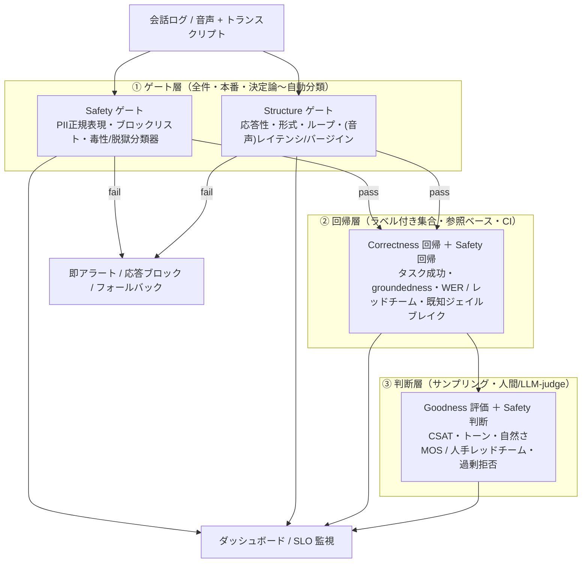

## はじめに —— 「モデルの賢さ」では会話の良し悪しは測れない

LLM の評価といえば、まず思い浮かぶのはベンチマークでしょう。MMLU、GSM8K、SWE-bench——モデルがどれだけ「賢いか」を測る尺度は山ほどあります。ところが、その賢いモデルをバックエンドに据えた会話エージェントを実際にユーザーへ届けてみると、**ベンチマークでは説明できない「会話の良し悪し」** に直面します。

正答率の高いモデルでも、

- 同じことを延々と聞き返してループに陥る
- 質問とは微妙にずれた、長すぎる答えを返す
- 自信満々に嘘の規約を語る
- 内容は正しいのに、どこか見下したような冷たい応答をする

といった壊れ方をする。逆に、モデル単体の性能は控えめでも、テンポよく、的確で、感じの良い会話を提供できるプロダクトもあります。**会話 UX はモデルの外側にある**——ここが評価の出発点です。

ではその「会話 UX の良し悪し」を、感覚ではなく**体系として**測るにはどうすればいいか。本記事は、次の問いに正面から答えることを目指します：

1. 評価軸をどう設計するか（**MECE なルールセット**として）
2. それぞれを**どう計測するか**（**決定論的に測れるもの／測れないもの**を切り分けて）
3. **テキストチャット**と**音声対話**で軸の重みがどう変わるか

結論を先に言えば、会話 UX は **3 つの品質軸と 1 つの制約軸**で捉えられます。

| 軸 | 問い | 性格 |
|---|---|---|
| **Structure（構造的正しさ）** | 会話として成立しているか？ | 形式・対話フロー。ほぼ決定論的 |
| **Correctness（内容的正しさ）** | 言っていることは正しいか？ | 論理・意味的妥当性。決定論〜判断的が混在 |
| **Goodness（主観的良し悪し）** | その体験は良かったか？ | ユーザーの体験価値。ほぼ判断的 |
| **Safety（安全性・無害性）** | その応答は無害で許容できるか？ | 品質に直交する制約（拒否権）軸 |

最初の 3 軸（S・C・G）は「会話の質」を測る互いに分離可能な次元で、これがあなたが直感する「会話の良し悪し」の本体です。ただし LLM エージェントは行動し、第三者に影響を及ぼすため、真に MECE に網羅するには品質とは性質の異なる第 4 の軸——**Safety**——が必要になります。

この 4 軸を、サブルールのレベルまで分解してルールセット化し、決定論の地図の上に並べていきます。

---

## I. 軸モデル —— Structure / Correctness / Goodness（＋Safety）

### なぜこの軸なのか

会話に起こりうる欠陥を観察すると、それらは性質の違う 4 つの問いに分かれます。はじめの 3 つが「会話の質」を、最後の 1 つが「許容可能性」を問います。

- **「そもそも会話が会話として成立したか」**（Structure）—— ターンが噛み合い、応答があり、ループせず、形式が整っているか。これは**意味を理解しなくても**、ログとタイムスタンプだけで判定できる層です。
- **「言っている中身は正しいか」**（Correctness）—— 事実に合致し、質問に関連し、矛盾せず、タスクを達成しているか。これは**意味を理解しないと**判定できません。
- **「その体験は良かったか」**（Goodness）—— 役立ち、語調が適切で、自然で、満足できたか。これは**主観**を測らないと判定できません。
- **「その応答は無害で許容できるか」**（Safety）—— 有害・不公平でなく、PII を漏らさず、インジェクションや脱獄に耐えるか。これは他の 3 軸が満点でも**独立に崩れうる**制約です。

はじめの 3 つは、それぞれ **形式（form）・内容（content）・体験（experience）** という分離可能な次元に対応します。次の図が、軸とそのサブルールの全体像です。

<ConversationAxesTaxonomy />

### なぜ Safety を独立の軸にするのか

LLM エージェントの評価で広く使われる枠組みに **HHH（Helpful・Honest・Harmless； Askell et al., 2021）** があります。このうち **Helpful** は Goodness（G1 有用性）に、**Honest** は Correctness（C1 事実正確性）に含まれます。しかし **Harmless** はどこにも入りません。

流暢で（S◎）、事実にも合致し（C◎）、口調も丁寧な（G◎）応答が、**他人の個人情報を漏らしたり、有害な手順を教えたり、プロンプトインジェクションで乗っ取られたり**する。毒性は「語調」の問題ではなく、脱獄は「関連性」の問題ではないので、Goodness や Correctness に無理に押し込むのは不自然です。だから Safety は**独立の制約軸**として立てます。サブルールは H1 無害性・H2 公平性・H3 プライバシー・H4 インジェクション耐性・H5 行動安全（不可逆行動への慎重と、良識的な要求を拒否しすぎないこと）です。

> Safety を「拒否権軸（veto axis）」と呼ぶのは、他の 3 軸がどれだけ高点でも、不安全な応答は**それだけでアウト**だからです。品質の加算ではなく、掛け算のゼロ項として振る舞います。（なお、ここで Safety を「品質に直交する」と言うときの「直交」は、統計的無相関ではなく「品質とは種類の異なる別次元」の意。下記の S・C・G 間の「分離可能だが正に相関する」とは区別します。）

### 軸は「別々の問い」（分離可能だが、独立ではない）

重要なのは、**これらの軸が互いに分離可能な（独立に判定できる）問いである**という点です。1 つの軸が満点でも、他の軸は独立に崩れうる。具体例で確かめましょう。

- **S◎ C✗**：完璧に整形された JSON で、自信満々に**嘘の返品規約**を返す。構造は満点、内容は零点。
- **S◎ C◎ G✗**：形式も内容も正しいのに、**見下した冷たい語調**でユーザーを責める。構造と内容は満点、体験は零点。
- **S◎ C◎ G◎ H✗**：整形され、事実に基づき、口調も丁寧なのに、**他人の個人情報を漏らす**。品質 3 軸をすべて通過しながら不安全。
- **S✗**：そもそも**無応答**だったり、**同じ発話を反復**してループする。

ただし、「分離可能」は「統計的に無相関（直交）」を意味しません。実際には軸は**因果的に順序づけられ、正に相関します**——下位軸の故障は上位軸に伝播しやすい。ハルシネーション（C✗）は信頼（G）を削り、長い沈黙（S✗）は体験（G）を壊す。だから **「独立（直交）」ではなく「分離可能だが、下から上へ伝播する」** と考えるのが正確です。**各軸は別々の網**であり、上の網を通り抜けた魚を下の網で捕まえる構造になっています。（ただしこの「網」は欠陥を捕える検知の比喩です。Goodness は欠陥の不在ではなく*程度のある積極的な品質*なので、その網は「悪い魚を捕る」より「良さを採点する」に近い。）

次のインタラクティブデモで、同じ会話がさまざまに壊れるたびに、どの軸が劣化し、どの決定論バンド（後述）で検知できるかを体感してください。

<ConversationBreakdownVisualizer />

### 軸には「順序」がある（分離可能だが対等ではない）

品質 3 軸は分離可能な**測定次元**ですが、**ユーザー影響の上では順序**があります。

```text
Structure（土台）→ Correctness（価値）→ Goodness（体験）
   会話が成立して      中身が正しくて        初めて
   初めて              初めて               「良い体験」を語れる
```

無応答（S✗）なら、内容の正しさも体験も意味をなしません。Structure は会話 UX が乗る**土台**です。中身が嘘（C✗）なら、どれだけ感じが良くても価値はマイナスです。Correctness は**価値**の条件です。そして両者が満たされて初めて、Goodness という**体験の質**を語れます。

**Safety はこの順序の外側にある拒否権軸**です。どの階層の質が揃っていても、H に違反した瞬間に応答全体が許容不可になります（例：完璧に丁寧で正確な　1 件の PII 漏洩）。

この順序は、後で計測パイプラインを設計するときの優先順位にそのまま効いてきます（安い網から先に張る）。

### MECE であること —— 帰属のルール

ルールセットが分類体系として使えるためには、**漏れなく（網羅的）・重複なく（排他的）** である必要があります。本フレームワークの MECE 性は、次の**帰属ルール**で担保します。これは軸が統計的に独立だという主張ではなく、**二重計上を避けるための分類規約**です。

> **帰属ルール（tie-break）**：ある欠陥を、それを**定義・検知できる最も安いレイヤー**に帰属させる。
> 0. 安全上許容されない欠陥（有害・不公平・PII漏洩・脱獄・危険な行動）→ **Safety**（他のどの軸を通過しても拒否権が勝つ）
> 1. トランスクリプトとログだけで、**意味を理解せずに**定義できる欠陥 → **Structure**
> 2. 意味・事実・タスク目標を**理解しないと**定義できない欠陥 → **Correctness**
> 3. 主観的な**体験の質**を測らないと定義できない欠陥 → **Goodness**

このルールが排他性を生みます。たとえば「自信満々のハルシネーション」は形式的には完璧（Structure は通過する）なので、**Structure の失敗ではなく Correctness の失敗**に一意に分類されます。「ループ」は意味を見なくても反復として定義できるので **Structure**。「冷たい語調」は主観判断が必要なので **Goodness**。「PII 漏洩」は事実としては正確だが許容できないので **Safety**。どの欠陥も、4 つのうち**ちょうど 1 つ**の軸に落ちます。

> ここで**帰属がルール依存になる**点には注意が要ります。例えば「丁寧に」という明示的なポリシーがあれば、無礼な応答は機械チェック可能な C5（制約遵守）違反にもなりうるし、なければ G2（トーン）の問題になる。つまり帰属は「その現場にどんなルールがあるか」で動きます。だから MECE は**固定の真理ではなく、チームで合意した分類規約**として運用するのが実践的です。

網羅性のほうは、「会話に起こりうる観測可能な欠陥は、(a) 理解ぬきで分かる形式・フローの欠陥、(b) 意味・真偽・目標の欠陥、(c) 体験・情緒の欠陥、(d) 許容不可な安全上の欠陥、のいずれか」という**四分割**によって保証されます。*起きたか / 正しいか / 良かったか / 安全か* の四分は、観測対象を覆い尽くします。

---

## II. 決定論の地図 —— 測れる/測れないを分ける

評価を体系化するうえで、評価軸と並ぶもう 1 本の座標軸が **「どこまで決定論的に測れるか」** です。これを 3 つのバンドに分けます。

<DeterminismSpectrum />

- **① 決定論的（rule-checkable）**：ログとタイムスタンプから**固定ルール**で計算する。モデル不要、同じ入力なら常に同じ結果。再現性 100%、コストはほぼゼロ。
- **② 参照ベース（reference-based）**：**正解データや参照応答**との比較。計算は自動だが、正解の用意と指標選択が必要。
- **③ 判断的（judgmental）**：**人間評価**または **LLM-as-judge**。ビット単位では再現せず、品質は「人間との相関」と「評価者間一致率」で担保する。

この区別が実務上決定的に重要なのは、**コスト・再現性・使いどころが桁違い**だからです。

| | ① 決定論的 | ② 参照ベース | ③ 判断的 |
|---|---|---|---|
| コスト | ほぼ 0 | 中（正解作成） | 高（人手/API） |
| 再現性 | 完全 | 完全（参照を固定すれば） | 確率的 |
| 主な弱点 | 形式しか見られない | 参照の網羅性・妥当性（正解の抜け/複数正解/陳腐化） | コスト・評価者バイアス |
| 使いどころ | **全件ゲート**（CI/本番） | 回帰テスト（ラベル付き集合） | **サンプリング**評価 |
| 主な軸 | Structure | Correctness | Goodness |

ここで誘惑されやすいのが②ですが、**②の弱点は「再現性」ではなく参照の網羅性・妥当性**にあります。固定参照に対する BLEU/WER/F1 はビット単位で再現する（その意味では①と同じく決定論的）。②が崩れるのは正解が不完全・複数ありうる・古くなるとき——*カバレッジ*の問題であって計算の非決定性ではありません。

経験則として、**品質 3 軸は決定論バンドと対角線上に並びます**。Structure は①で大半が測れ、Correctness は①②③にまたがり、Goodness は③が中心（①の代理指標で補助）。Safety はこの対角線には乗らず、全バンドを横断します（ブロックリストは①、レッドチーム集合は②、分類器・人手は③）。だからこそ「Structure を全件ゲートで守り、Correctness を参照テストで回帰監視し、Goodness をサンプル判断で観測する」という階層的な計測戦略が自然に導かれます。

---

## III. 評価方法論の土台（共通言語）

軸の話に入る前に、評価設計で繰り返し出てくる用語を整理しておきます。これらは全評価軸に直交する**設計の自由度**です。

- **オフライン vs オンライン**：固定データセットでの回帰評価か、本番トラフィックでの観測か。
- **ターンレベル vs 対話レベル**：1 応答を見るか、会話全体を見るか。ループや一貫性、そして長期対話の劣化（→ IV-8）は対話レベルでしか見えない。
- **参照あり vs 参照なし**：正解と比べるか、応答単体の性質を測るか（reference-free）。
- **点数付け vs ペア比較**：絶対評価（1〜5）か、A/B のどちらが良いか。ペア比較のほうが評価者間一致が高い傾向。
- **誰が判定するか**：ルール / 人間 / LLM-judge。

### 先行研究という肩の上に乗る

会話評価には四半世紀の蓄積があります。本フレームワークは、これらを評価軸 × 決定論の地図に再配置したものとも言えます。

- **PARADISE**（Walker et al., 1997, [ACL](https://aclanthology.org/P97-1035/)）：タスク指向対話の古典。**ユーザー満足度 ≈ タスク成功（κ係数）− 対話コスト**（ターン数・経過時間・ASR 棄却数など）を**線形回帰**で重み付けして説明する。Correctness（タスク成功）と Structure（コスト）を 1 つの満足度（Goodness）に結びつけた最初期の試み。
- **USR**（Mehri & Eskenazi, 2020, [arXiv:2005.00456](https://arxiv.org/abs/2005.00456)）：参照不要のオープンドメイン対話評価。理解可能性・自然さ・文脈維持・興味深さ・知識活用といった**複数の解釈可能な下位指標**を教師なしで測る。Topical-Chat でターンレベル相関 0.42、PersonaChat で 0.48。
- **FED**（Mehri & Eskenazi, 2020, [arXiv:2006.12719](https://arxiv.org/abs/2006.12719)）：DialoGPT を使い、**18 個のきめ細かな対話品質**をターン単位・対話単位で参照なしに測る。Goodness の下位構造を細分化した先駆け。
- **DBDC（Dialogue Breakdown Detection Challenge）**（Higashinaka et al., LREC 2016）：システム発話を **NB（崩壊でない）/ PB（崩壊の可能性）/ B（崩壊）** の 3 ラベルで多数の評価者が注釈し、その分布を予測するタスク。Structure（対話の崩壊）を独立した検出問題として定式化した。
- **LLM-as-judge**：MT-Bench（Zheng et al., 2023, [arXiv:2306.05685](https://arxiv.org/abs/2306.05685)）や G-Eval（Liu et al., 2023, [arXiv:2303.16634](https://arxiv.org/abs/2303.16634)）。強力だが、**位置バイアス・冗長性バイアス・自己増強バイアス（self-enhancement bias）**を持つことが知られ、**人間評価との較正**が前提になる。

> **LLM-as-judge の注意点**：判定者として LLM を使うと③のコストは劇的に下がりますが、それは**確率的な判定**であって決定論ではありません。一致率（人間との一致を、尺度に合った統計量で——2 名名義なら Cohen's κ、順序尺度なら Krippendorff's α 等；§VII）を必ず測り、位置バイアス対策（A/B を入れ替えて両方向で評価）を入れること。判定の根拠（rationale）を出させてから点数を出す（CoT）と安定します。

---

## IV. テキストチャットの評価

ここからチャネル別の各論です。まずテキストチャット。各軸のルールセットを、**何を・どの決定論バンドで測るか**まで落として論じます。

### IV-1. Structure（構造的正しさ）—— ほぼ全件、決定論で守れる

Structure の美点は、**意味を理解せずに、ログだけで、全件チェックできる**ことです。本番の各ターンに常時かけられる「ゲート」を構成します。

| ルール | 何を見るか | 計測（①決定論） |
|---|---|---|
| **S1 ターン整合性** | 1 ユーザー発話に 1 応答。脱落・二重送信なし | ターン列の対応関係を検査 |
| **S2 応答性** | 空応答・無応答・タイムアウト・クラッシュなし | 応答有無 + 予算内レイテンシ |
| **S3 形式適合** | 要求形式に従う（JSON・必須項目・言語・長さ） | スキーマ検証・パース・言語判定 |
| **S4 フロー進行** | 状態が前進。ループ・同一発話反復なし | n-gram 反復率・状態遷移の監視 |
| **S5 役割整合** | 話者役割が一貫。ユーザー発話の捏造なし | ロールマーカー・プロトコル検査 |

これらは決定論的なコードで書けます。たとえば応答性・形式・ループの 3 つを束ねる Structure ゲートはこう書けます：

```typescript
type Turn = { role: "user" | "agent"; text: string; ts: number };

// 直近2つのエージェント発話の3-gram Jaccard 類似度（ループ検知）
function trigramJaccard(a: string, b: string): number {
  const grams = (s: string) =>
    new Set(
      [...s].slice(0, -2).map((_, i) => s.slice(i, i + 3))
    );
  const A = grams(a), B = grams(b);
  const inter = [...A].filter((g) => B.has(g)).length;
  const union = new Set([...A, ...B]).size;
  return union === 0 ? 0 : inter / union;
}

function checkStructure(turns: Turn[], budgetMs: number) {
  const failures: string[] = [];
  const agent = turns.filter((t) => t.role === "agent");
  const last = agent.at(-1);

  // S2 応答性
  if (!last || last.text.trim() === "") failures.push("S2: empty/no response");
  const prevUser = turns.at(-2);
  if (last && prevUser && last.ts - prevUser.ts > budgetMs)
    failures.push("S2: latency over budget");

  // S3 形式適合（例: JSON を要求している場合）
  // try { JSON.parse(last.text) } catch { failures.push("S3: invalid JSON") }

  // S4 ループ検知
  if (agent.length >= 2) {
    const sim = trigramJaccard(agent.at(-1)!.text, agent.at(-2)!.text);
    if (sim > 0.9) failures.push(`S4: repeated turn (sim=${sim.toFixed(2)})`);
  }

  return { pass: failures.length === 0, failures };
}
```

ポイントは、これらが**安く、決定論的で、全件に回せる**こと。Structure 違反は「会話が壊れた」という最も深刻なシグナルなので、**本番のガードレール**として最優先で実装します。

> **注意**：S4 の「ループ」は表層反復だけでなく、**意味的ループ**（言い回しを変えて同じことを繰り返す）もあります。表層 n-gram で取りこぼす分は、埋め込みのコサイン類似度（参照ベース②寄り）や対話レベルの状態追跡で補完します。ここが Structure と Correctness の境界線です。

### IV-2. Correctness（内容的正しさ）—— ①②③にまたがる

Correctness は決定論で取れる部分と、参照・判断が要る部分が混在します。

| ルール | 計測の主バンド | 具体 |
|---|---|---|
| **C1 事実正確性** | ②参照 / ③判断 | groundedness（出典との含意関係を NLI/LLM-judge で検証）、hallucination 率 |
| **C2 関連性** | ③判断（②も可） | answer relevancy（質問と応答の意味的整合）|
| **C3 論理整合性** | ③判断 | 自己矛盾・ターン間矛盾の検出 |
| **C4 タスク達成** | ②参照 | goal completion / slot-filling F1 / 正しい関数呼び出し |
| **C5 指示・制約遵守** | ①決定論 + ③判断 | 「3 つの箇条書きで」等の機械チェック、ポリシー遵守 |
| **C6 較正・棄権** | ②参照 + ③判断 | ECE/Brier、選択的予測（risk–coverage）、回答不能問題での棄権正解率、verbalized confidence の妥当性 |

RAG を伴うエージェントでは、Correctness は俗に **「RAG トライアド」**（TruLens が広めた枠組み）に分解されます：**(1) 文脈の関連性**（検索が適切か）、**(2) groundedness／忠実性**（応答が検索文脈に根拠づくか）、**(3) 応答の関連性**（応答が質問に答えるか）。(1) は検索の precision/recall（②）、(2)(3) は含意判定や LLM-judge（②③）で測ります。

C4 のタスク達成は、正解（ゴールの状態やアクション）が定義できれば**②参照ベースで決定論に近づきます**。たとえば「航空券予約」なら、最終的に正しい便・人数・日付でツールが呼ばれたかを正解と照合できる（多段の軌跡評価は IV-7 で扱う）。C5 の一部（フォーマット制約・長さ・禁止語）は**①決定論**でゲートできます。

一方、C1 の事実性や C2 の関連性は、開放的なドメインでは正解が一意に定まらず、**③判断**が必要になります。ここで LLM-judge を使うなら、必ず「根拠 → 判定」の順で出力させ、人間との一致率を測りましょう。

**C6 は「答えが正しいか」ではなく「自分が正しいとどれだけ言ってよいかを知っているか」を問います。**これは本記事の旗印「自信満々のハルシネーション」の核心です——内容が誤り（C1✗）なだけでなく、モデルが*誤りうると伝えなかった*ことが問題なのです。較正されたモデルは根拠がなければ「確証はありませんが…」と**ヘッジ**し、あるいは**棄権**（「分かりません／確認します」）して、C1 の失敗を*正直で回復可能*な失敗に変えます。較正は HHH の **Honest**——知らないことを断定しない——の最も深い意味であり、C1 を補完します。指標は ECE・Brier・risk–coverage 曲線・棄権正解率など（Kadavath et al., 2022「Language Models (Mostly) Know What They Know」; Guo et al., 2017）。

### IV-3. Goodness（主観的良し悪し）—— ③が中心、①の代理指標で補助

Goodness は本質的に主観です。しかも**聞き手相対的**です——専門家には簡潔な回答が「良い」が、初心者には手厚い説明のほうが「良い」。同じ応答でも対象読者によって評価が反転しうる。直接測るには③（人間評価）が王道ですが、スケールしません。そこで**①の代理指標**と**③のサンプル評価**を組み合わせます。

| ルール | 直接（③判断） | 代理（①決定論） |
|---|---|---|
| **G1 有用性** | CSAT・有用性スコア | 解決率・再質問率・エスカレーション率 |
| **G2 トーン・共感** | LLM-judge ルーブリック・人手 | 感情分析スコア（弱い代理）|
| **G3 明瞭さ** | 可読性評価 | 文長・可読性指標・冗長度 |
| **G4 自然さ** | 人手・LLM-judge | （テキストでは弱い） |
| **G5 信頼・満足** | CSAT・NPS | 継続率・離脱率・👍/👎 |

代理指標は便利ですが、**Goodhart の法則**に注意。「再質問率」を下げるために回答を曖昧にする、「文長」を縮めるために必要な情報を削る——proxy を最適化目標にした瞬間に proxy は壊れます。代理は**監視**に使い、最適化の真の目的（CSAT 等）とは分けて扱うこと。

G2〜G4 を LLM-judge で測るなら、ルーブリックを明示した評価プロンプトが有効です：

```text
あなたは会話品質の評価者です。以下のエージェント応答を Goodness の観点で採点してください。
各項目を 1〜5 で、まず根拠を述べてから点数を出すこと。

[トーン・共感 G2] 場にふさわしい語調か。ユーザーを責めていないか。共感はあるか。
[明瞭さ G3]     構成は明快か。冗長すぎ/不足はないか。
[自然さ G4]     機械的でなく自然か。

会話文脈: {context}
エージェント応答: {response}

出力(JSON): {"G2":{"rationale":"...","score":N}, "G3":{...}, "G4":{...}}
```

### IV-4. Safety（テキスト）—— 分類器とレッドチームの層

テキストでも Safety は品質 3 軸とは独立に評価し、しかも**全件ゲートで止める**運用が前提です（不安全な応答は、たとえ整形され正確でも出してはいけない）。

| ルール | 計測の主バンド | 具体 |
|---|---|---|
| **H1 無害性** | ③分類器 + ②回帰 | 毒性/有害カテゴリ分類器、既知の有害プロンプト集合での回帰 |
| **H2 公平性** | ②③ + 統計 | 集団間のスコア差・拒否率差を有意差検定 |
| **H3 プライバシー** | ①②（検出）| PII 正規表現 + NER、学習データ/他者情報の漏洩チェック |
| **H4 インジェクション耐性** | ②（既知）+ ③（未知）| レッドチーム集合での attack success rate、人手レッドチーム |
| **H5 行動安全** | ②③ | 不可逆/高リスク行動の前の確認、過剰拒否（over-refusal）の測定 |

H5 が示すように、安全性は「危険を断る」と「**無害な要求を断らない**」の両立です。過剰拒否はそれ自体が UX を壊すため、安全側に振り切るだけでは不十分。レッドチーム集合（既知攻撃）は②で回帰監視でき、未知の攻撃面は人手・自動レッドチーム（③）で継続的に探索します。

### IV-5. テキストでの決定論の到達範囲

テキストチャットでは、**Structure はほぼ全件①で守れ、Correctness は②に寄せられる部分が多く、Goodness は③に依存し、Safety は全件ゲート（①②）と継続的レッドチーム（③）で守る**。決定論の網は Structure と Safety ゲートを覆い、Correctness の半分に届き、Goodness にはほとんど届かない——この**届かなさの形**を正確に知ることが、評価設計の核心です。

### IV-6. 修復・エラーリカバリ —— 軸をまたぐ「回復」次元

ここまでのルールは会話の欠陥を分類するものでしたが、現実の会話 UX は *欠陥が起きた後にどう立て直すか*——修復（repair）——にも左右されます。会話分析では修復は古典的な構造現象であり（Schegloff, Jefferson & Sacks, 1977）、対話評価でも FED の 18 品質に「error recovery」が含まれます。本記事のデモ最終シーン（90日→30日の訂正）は、まさに修復の実演です。修復は単一軸に収まらず、品質 3 軸を縦断します：

- **検知（Structure 寄り）**：ユーザーの訂正・言い直し（「いや、そうじゃなくて」）を検出し、修復シーケンスに入るか。表層パターンは①で部分的に取れる。
- **訂正の正しさ（Correctness）**：訂正後の内容が実際に正しいか（C1/C4）。
- **修復の所作（Goodness）**：誤りを認め、適切に謝り、過剰に謝らず前進するか（G2）。

つまり修復は「分離可能だが下から上へ伝播する」本記事の主張の好例であり、欠陥分類（MECE）を壊さずに*回復*の次元を別建てで足せます。計測は修復成功率（訂正要求後にエラーが解消したターンの割合）や time-to-repair（修復までのターン数）で近似します。

### IV-7. エージェントのツール利用と多段タスクの評価 —— C4 を「軌跡」へ広げる

本記事は「エージェント」を冠していますが、C4 の「正しい関数呼び出し」だけでは、ツールを使い多段のタスクをこなすエージェントの評価には足りません。エージェント評価は最終結果だけでなく、**そこに至る軌跡（trajectory）**にも及びます。これも欠陥分類を壊さず、Correctness と Safety を縦断する形で足せます。

| 観点 | 何を見るか | 計測の主バンド |
|---|---|---|
| **ツール選択の正しさ** | 適切なツールを選んだか（不要・取り違えの呼び出しがないか） | ②参照（正解ツール列との一致）|
| **引数のグラウンディング** | 引数が文脈・ユーザー入力に根拠づくか（捧造値でないか） | ②参照 + ③判断 |
| **軌跡・計画の質** | 手順が妥当で冗長でないか。順序・依存が正しいか | ②参照（軌跡/順序の一致）+ ③判断 |
| **ツールエラーからの回復** | 失敗を検知し、再試行・代替・エスカレーションできるか | ②③（注入したエラーでの回復率）|
| **多段タスクの部分点** | 全体は未達でも、達成した下位目標を部分評価 | ②参照（サブゴール達成率）|
| **不可逆行動の安全性** | 取り消せない/高コストな行動の前に確認するか（→ H5） | ②③ + 全件ゲート |

鍵は、**最終状態（end-state）と軌跡（trajectory）を分けて評価する**ことです。τ-bench（Yao et al., 2024, [arXiv:2406.12045](https://arxiv.org/abs/2406.12045)）は、ドメイン API とポリシーを与えたエージェントと、LLM でシミュレートしたユーザーとの対話を、**会話終了時のデータベース状態を正解状態と照合**して採点し、さらに複数試行での一貫性を **pass^k** で測ります（gpt-4o のような最先端の関数呼び出しエージェントでもタスク成功率は 50% 未満、retail の pass^8 は 25% 未満）。軌跡そのものは、正解ツール列との完全一致・順序一致・順不同一致や、ツール呼び出しの precision/recall で近似します。

不可逆行動（送金・削除・予約確定）の安全性は、**C4 の「達成」ではなく H5 の「行動安全」**で捕まえます。「正しい行動」と「取り返しのつく行動」は別問題だからです。確認を挾むべき行動の前に確認したか、過剰拒否（over-refusal）に陥っていないかを、全件ゲートと回帰集合で監視します。

### IV-8. マルチターン／長期対話の劣化 —— 「ターンが増えると壊れる」を測る

§III で「ターンレベル vs 対話レベル」を区別しましたが、長い会話に特有の壊れ方は、1 ターンを見るだけでは捉えられません。会話が長引くにつれて現れる劣化は、対話レベルの現象として独立に測る必要があります。

- **ゴールのドリフト（Correctness 寄り）**：ターンを重ねるうちに当初の目的からずれる。サブゴール達成を追跡し、最終目標との整合を対話単位で評価する。
- **文脈・記憶の喪失（Correctness／Structure）**：序盤で確定した制約（名前・日付・好み）を後半で忘れる・取り違える。「既出情報の保持率」を対話単位で測る。
- **「Lost in the Middle」（Correctness）**：長い文脈の**中央**に置かれた情報の利用率が、先頭・末尾に比べ顕著に下がる U 字現象（Nelson F. Liu et al., 2023「Lost in the Middle」, [arXiv:2307.03172](https://arxiv.org/abs/2307.03172)）。関連情報を文脈内のさまざまな位置に置いて正解率を測る評価が有効。
- **マルチターン指示の減衰（Correctness）**：「以降は敬語で」のような初期指示が、ターンが進むと無視され始める。指示注入からの経過ターン数に対する遵守率で測る。
- **対話レベルの一貫性・整合（Goodness／Correctness）**：ペルソナ・口調・主張がターンをまたいで一貫するか。ターン間の自己矛盾を検出する。

評価設計上の含意は明快です——**長期劣化はターンレベル指標の平均には現れません**。だから評価セットには*長い*会話を含め、対話単位（dialogue-level）で採点する必要があります。多くのベンチマークが短いやり取りに偏る点には注意が要ります（たとえば MT-Bench（Zheng et al., 2023）は 2 ターン構成で、長期の劣化は射程外）。本番では会話長とエラー率の相関を監視し、必要なら要約・メモリ機構の有効性を回帰でテストします。

---

## V. 音声対話の評価

音声は、テキストに**時間と音響という次元**を足したものです。だから評価は **「トランスクリプト上のテキスト評価（前章すべて）＋ 音声ネイティブな下位層」** という二階建てになります。そして後で見るように、**軸の重みが変わります**。

### V-1. なぜ音声では「タイミング」が支配的になるか —— 人間の会話の認知科学

人間の会話のターンテイキングは、驚くほど精密です。会話分析の古典（Sacks, Schegloff & Jefferson, 1974）以来の知見と、その後の精密な計測（Levinson & Torreira, 2015, [Frontiers in Psychology 6:731](https://www.frontiersin.org/articles/10.3389/fpsyg.2015.00731/full)）が明らかにしたのは、次の事実です：

- 話者交替の**ギャップ（floor transfer offset）の最頻値は約 100〜200ms**。
- ところが**言語産出のレイテンシは単語 1 つで約 600ms**かかる（Indefrey & Levelt, 2004 の picture-naming メタ分析）。2〜3 語で 740〜900ms（Schnur et al., 2006）、文レベルの発話では約 1500ms に達する（Griffin & Bock, 2000；いずれも Levinson & Torreira, 2015 が総説）。
- この矛盾の解決策は **「予測（projection）」** ——聞き手は相手の発話の終わりを予測し、**相手が話し終わる前に**自分の応答を組み立て始めている。
- 10 言語の横断研究（Stivers et al., 2009, [PNAS](https://doi.org/10.1073/pnas.0903616106)；極性［yes/no］質問への応答を計測、視覚的応答も含む）でも、平均応答オフセットは日本語の約 7ms からデンマーク語の約 469ms までと幅はあれど、**ギャップと重なりを最小化する**傾向は普遍的だった。
- そして決定的なのは：**700ms を超えるギャップは「何か問題がある」というシグナル**として解釈される（不同意・困惑・拒否の前触れ）。300ms を超えると、無条件の同意の確率が下がり始める（いずれも人間どうしの対話で測られた閾値であり、エージェントへの適用は作業仮説）。

つまり人間は「予測で先回り」して ~200ms を実現しているのに対し、**素朴な音声エージェントのパイプラインは「無音を待ってから」直列処理する**ため、構造的にこの規範を破ります。

<TurnTakingLatencyDiagram />

無音待ち（エンドポインティング）→ ASR 確定 → LLM の最初のトークン → TTS の最初の音声、と直列に積むと、容易に 1.5〜2 秒を超える。これは人間規範（~200ms）の **8〜10 倍**、そして「問題シグナル」の閾値（~700ms）の **2〜3 倍**です。**応答が正しくても（C◎）、この沈黙だけで体験は崩壊する（G✗）**。音声で Structure-タイミングが支配的になるのは、このためです。

> **注記（2024 年以降の SOTA）**：この 1.5〜2 秒は素朴な直列パイプラインのベースラインであって、現状の上限ではありません。ネイティブな音声対音声（speech-to-speech）やフルデュプレックス構成は応答を ~300〜500ms まで縮め、人間規範（~200ms）との差をほぼ埋めつつあります。「沈黙の壁」は構造的に不可避なのではなく、アーキテクチャ（逐次 ASR・意味的エンドポインティング・音声トークンの直接生成）で動かせる設計変数です。とはいえ p95 レイテンシと割り込み時の振る舞いは、依然として第一級の評価対象であり続けます。

### V-2. Structure（音声）—— 決定論の宝庫

幸い、タイミングと音声フロー周りは**音声タイムスタンプから決定論的に測れる**ものばかりです。音声 Structure はテキストの S1〜S5 に加え、次の音声ネイティブなルールを持ちます。

| 音声 Structure ルール | 何を見るか | 計測（①決定論） |
|---|---|---|
| **応答レイテンシ** | ユーザー発話終了 → エージェント発話開始 | FTO の p50/p95 分布。~200ms 規範・~700ms 閾値と比較 |
| **エンドポインティング正確性** | ユーザーの発話終了を正しく検出 | 早すぎ（割り込み）/遅すぎ（沈黙）率 |
| **バージイン処理** | ユーザーの割り込みで TTS を即停止 | バージイン検知率・停止までの遅延 |
| **トークオーバー／重なり** | エージェントがユーザーに被せない | 同時発話の時間・頻度 |
| **デッドエア** | 不自然な長い沈黙がない | 無音区間の長さ |

これらは**音声 UX で最も支配的かつ最も決定論的**——つまり「安く守れて効果が大きい」最高の投資対象です。レイテンシ分布（特に p95）を SLO として監視し、エンドポインティングの早すぎ/遅すぎをトレードオフとして調整するのが定石です。

> **エンドポインティングのジレンマ**：閾値を短くすると「ユーザーがまだ話している途中で割り込む」（早すぎ）、長くすると「沈黙が伸びて問題シグナルになる」（遅すぎ）。人間が予測でこれを解いているように、最新の音声システムは**意味的エンドポインティング**（発話の意味的完了を予測）や**フルデュプレックス**（聞きながら話す）で、この決定論的トレードオフを動かそうとしています。

### V-3. Correctness（音声）—— ASR と TTS が誤差を注入する

音声の Correctness は、テキストの C1〜C6 に加えて、**音声 ↔ テキスト変換の正確性**が前段と後段に入ります。

- **前段：ASR の正確性**。エージェントが**正しく聞き取れたか**。標準指標は **WER（Word Error Rate）= (置換 + 削除 + 挿入) / 参照語数**。これは参照書き起こしがあれば**②参照ベースで決定論的**に測れます。ASR の誤りは下流の LLM にそのまま伝播する（複合誤差）ので、エンドツーエンド評価では ASR を切り分けて測ることが重要。なお WER は話者のアクセント・方言・背景雑音・コードスイッチングで大きく変動するため、集団間の WER 差は H2（公平性）の観点でも監視する。
- **後段：TTS の発話正確性**。**正しい内容を正しく発音したか**。とくに数字・固有名詞・日付・単位の読み上げは誤りやすい（"1/2" を「2 分の 1」か「1 月 2 日」か）。これは「内容は正しいが音声化で壊れる」典型で、テキスト評価では捕まりません。

ASR の WER がよくても、句読点・話者分離・固有名詞で崩れると LLM の入力が歪む。だから音声 Correctness は **「ASR 層」「LLM 層」「TTS 層」を分離して測る**のが鉄則です。

### V-4. Goodness（音声）—— 「自然さ」と、タイミングという代理指標

音声の Goodness には、テキストにない**音響的な体験価値**が加わります。

| 音声 Goodness ルール | 直接（③判断） | 代理（①決定論） |
|---|---|---|
| **声の自然さ** | **MOS**（ITU-T P.800、1〜5）、CMOS | （直接が基本） |
| **プロソディ・抑揚の適切さ** | 人手・LLM-judge | ピッチ/速度の統計 |
| **声のペルソナの一貫性** | 人手 | 話速・音量の安定性 |
| **「テンポの良さ」** | 体感の快適さ | **レイテンシ分布**（V-2 と直結） |

注目すべきは、音声では **Structure の決定論指標（レイテンシ）が、Goodness（テンポの快適さ）の強力な代理になる**ことです。人間規範 ~200ms に近いほど「テンポが良い＝感じが良い」。ここで Structure と Goodness が手を結びます。声の自然さそのものは **MOS**（被験者が 1〜5 で主観評価する ITU-T 標準。クラウドソーシング版は P.808）という③判断指標が王道です。

### V-5. 音声では軸の重みが変わる

テキストでは、遅い応答は「やや苛立たしい」程度（軽い G の劣化）でした。ところが音声では、**700ms を超える沈黙が能動的に「問題がある」と解釈される**——つまり Structure-タイミングの失敗が、**即座に Goodness を破壊する**。

```text
テキスト:  Correctness と Goodness（内容と語調）が体験を支配
音声:      Structure-タイミング が体験を支配し、
           内容が正しくても沈黙ひとつで台無しになりうる
```

だから音声エージェントの評価では、**レイテンシ分布（p95）を第一級の指標**として、Correctness（WER + 内容）と同等以上に重く扱う必要があります。同じ品質 3 軸でも、**チャネルによって重みづけが変わる**——これが音声を別章で論じる理由です。

---

## VI. ルールセットを 1 枚にまとめる

ここまでの 4 軸 × 決定論バンドを、テキストと音声をまたいで 1 枚の表に圧縮します。これがそのまま、評価パイプラインに落とせる**ルールセット**です。

<EvalMetricMatrix />

読み方：**左の列ほど安く・全件・自動**で、**右の列ほど高く・サンプル・主観**。各軸を「どのバンドで主に測るか」を決め、左から順に網を張っていきます。

---

## VII. 計測の実務 —— 3層パイプライン

軸と決定論の地図を、実際の計測アーキテクチャに変換すると、自然に**3 層**（決定論バンドに対応）になります。安い網を全件に、高い網をサンプルに。**Safety はこの 3 層を横断**します（ゲートでブロックし、回帰で監視し、サンプルでレッドチームする）。



- **① ゲート層**：Structure と Safety を**全件・本番**でチェック。違反は即座にアラート・応答ブロック・フォールバック。Structure は純粋な決定論、Safety ゲートは正規表現（決定論）＋分類器（自動・確率的）のハイブリッド。
- **② 回帰層**：Correctness と Safety を**ラベル付きの回帰集合**で参照評価。モデル更新やプロンプト変更のたびに走らせ、退行（タスク成功の低下・新しい脱獄の成功）を検出。
- **③ 判断層**：Goodness と Safety を**サンプリング**して人間 / LLM-judge で評価。全件は無理なので、層別サンプリング（失敗ケース・新規ドメインを厚めに）する。

### オンラインとオフライン

- **オフライン**：固定データセットでの回帰スイート（②中心）。決定論ゲート（①）と LLM-judge（③）も流す。リリース前の品質保証。
- **オンライン**：本番トラフィックで、①をガードレールとして常時、③の代理指標（離脱率・👍/👎・エスカレーション・音声ならレイテンシ p95）を監視。異常検知とビジネス指標の接続。

### 計測を壊さないための原則

1. **安い網から張る**：Structure ①を最優先。無応答やループを見逃したまま Goodness を議論しても無意味。
2. **Safety は妥協しない**：Safety は拒否権軸。他の軸のスコアと平均せず、独立のゲートとして手前に置く。H 違反は他が満点でもリリース不可。
3. **層を分離して測る**：音声なら ASR / LLM / TTS を切り分ける。複合誤差を 1 つの数字に潰さない。
4. **LLM-judge は較正してから使う**：人間との一致率（尺度に合った統計量で；下記「統計的厳密性」）を測り、位置バイアス対策（A/B 入替）を入れる。
5. **代理指標を最適化目標にしない**：Goodhart を避ける。代理は監視、真の目的（CSAT 等）は別管理。
6. **ペア比較を活用する**：絶対評価より A/B 比較のほうが評価者間一致が高い。モデル選定はペアで。

### 統計的厳密性 —— サンプルサイズ・信頼区間・一致統計量

判断層（③）の数字は確率変数です。「A のほうが良い」と言うには、**統計的な裏づけ**が要ります。

- **サンプルサイズと検定力**：検出したい効果量に対し、必要な評価件数を事前に見積もる（検定力分析）。少数サンプルでの「勝った/負けた」は偶然と区別できない。
- **信頼区間と有意差検定（A/B）**：スコア差は点推定だけでなく**信頼区間**で報告する。2 モデルの勝率比較は、ブートストラップ信頼区間や二項検定／McNemar 検定（対応ありのペア比較）で有意性を確かめる。多数の指標を同時に比べるなら多重比較補正（Bonferroni 等）を入れる。
- **状況に応じた一致統計量**：評価者間一致は、データの性質で使い分ける。
  - **2 名・名義尺度** → **Cohen's κ**（κ が想定するのは厳密に「2 評価者・名義」）。
  - **3 名以上・名義尺度** → **Fleiss' κ**（固定人数の評価者へ一般化。厳密には Cohen's κ ではなく Scott's π の一般化）。
  - **順序尺度（1〜5 など）** → **Krippendorff's α**（任意人数・順序/間隔も扱える）、**重み付き κ**（2 名・距離で不一致を加重）、または **Spearman の ρ**（順位相関）。1〜5 を名義として κ にかけると、「4 と 5 の食い違い」と「1 と 5 の食い違い」を同罪にしてしまう。

実務の含意：**LLM-judge の検証も、この区別に従います**。1〜5 のルーブリック採点なら人間との一致は Krippendorff's α か Spearman で、A/B のペア判定なら一致率（と κ）で報告する。§III と本章で繰り返した「人間との一致を測れ」は、**尺度に合った統計量で**測れ、という意味です。

---

## おわりに

会話 UX は「なんとなく良い/悪い」で語られがちですが、その正体は **3 つの品質軸と 1 つの制約軸**に分解できます。

- **Structure（構造的正しさ）**：会話として成立しているか。ほぼ**決定論**で全件守れる。
- **Correctness（内容的正しさ）**：言っていることは正しいか。**参照ベース**に寄せられる部分が多い。
- **Goodness（主観的良し悪し）**：その体験は良かったか。**判断的**で、代理指標とサンプル評価で迫る。
- **Safety（安全性・無害性）**：その応答は無害か。品質に直交する**拒否権軸**で、分類器とレッドチームで守る。

この 4 軸は **MECE な帰属ルール**（最も安いレイヤーに帰属させる分類規約）で排他的に、*起きたか / 正しいか / 良かったか / 安全か* の四分割で網羅的に切れます。軸は統計的に独立（直交）ではなく、**分離して測れるが下から上へ伝播する**と考えるのが正確です。そして決定論の地図に重ねると、**何を全件ゲートし、何を回帰テストし、何をサンプル判断するか**という計測戦略が自動的に立ち上がる。

最後に、**チャネルが軸の重みを変える**ことを忘れないでください。テキストでは内容と語調が体験を支配しますが、音声では**タイミング**が支配します。人間が ~200ms のギャップを予測で実現している事実は、音声エージェントにとって厳しいベンチマークです。沈黙ひとつで、正しい答えも台無しになる。**良い会話 UX とは、品質 3 軸がそのチャネルにふさわしい重みで同時に揃い、かつ Safety の一線を越えない状態**のことなのです。
