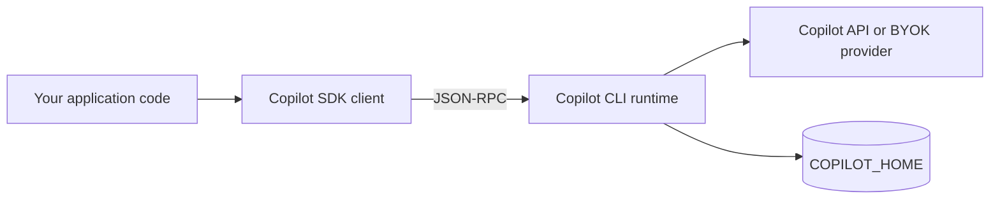
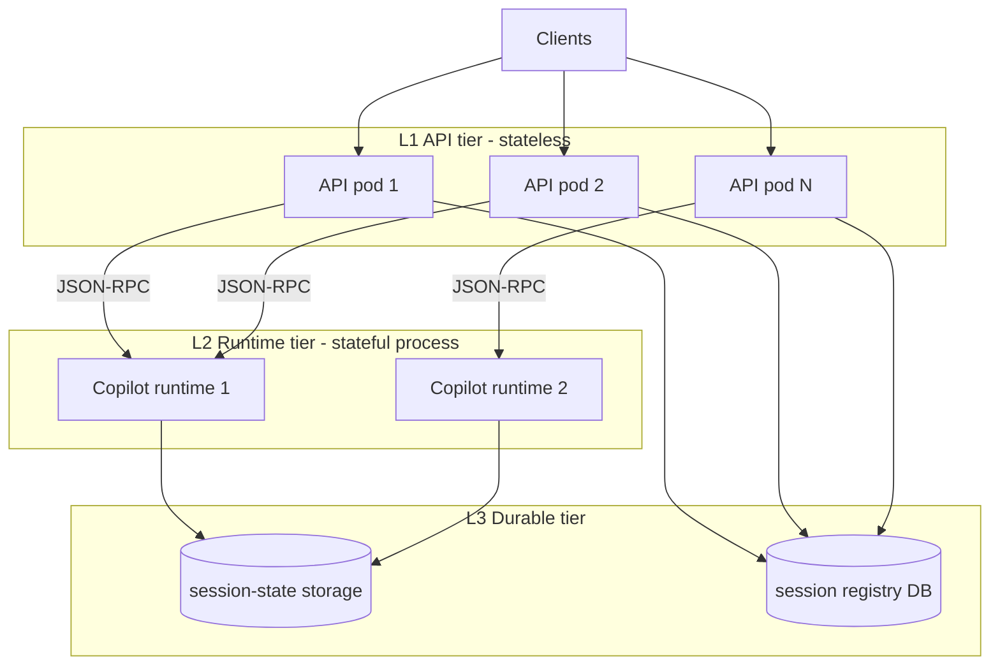
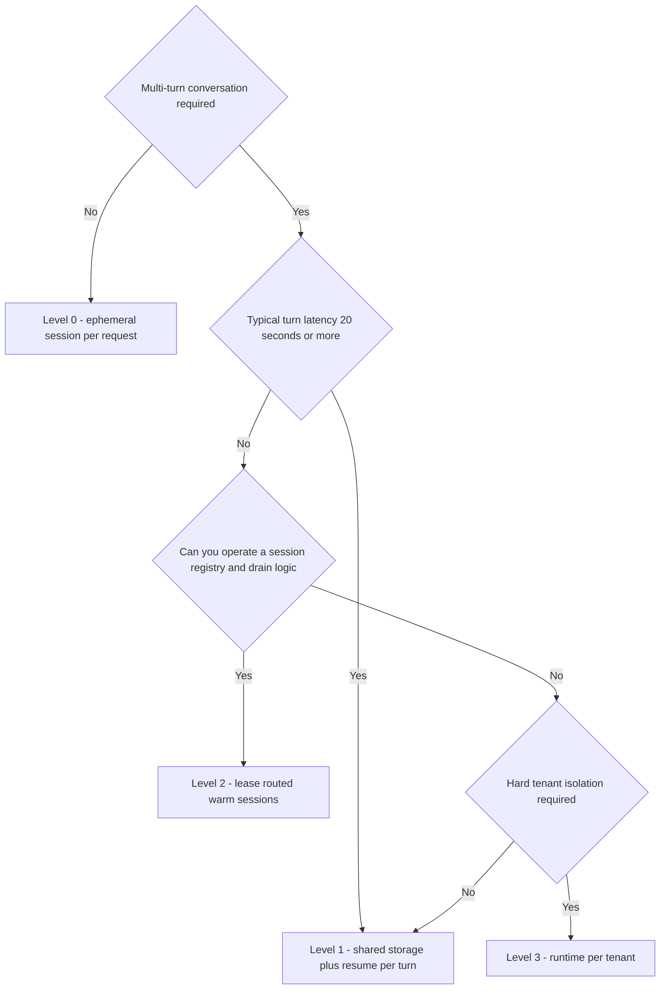
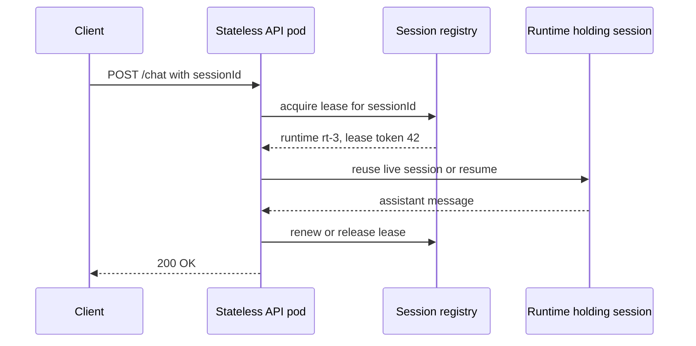
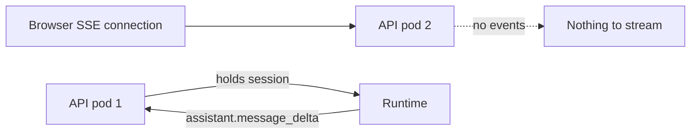

## はじめに

GitHub Copilot SDK は、Copilot CLI の背後にあるエージェントランタイムをプログラムから呼び出すためのライブラリだ。Node.js/TypeScript、Python、Go、.NET、Java、Rust 向けに提供されており、自社プロダクトに「Copilot 相当のエージェント」を埋め込める。

サーバーサイドで使うことを検討し始めると、最初に突き当たる問いはたいてい同じである。

> このSDKを使ったバックエンドは、ステートレスに設計して水平スケールできるのか？

結論を先に言うと、**「アプリ層はステートレスにできる。ランタイム層はできない」**。そしてこの記事で本当に議論したいのは、Yes/No ではなく次の3点だ。

- 状態はどこに、どんな粒度で存在するのか
- その状態境界を跨ぐコストはいくらか
- 境界の置き方を間違えたとき、どんな壊れ方をするのか

本稿は 2026-08 時点の公開ドキュメントと `@github/copilot-sdk` v1.0.11 の README を一次情報として書いている。SDKは活発に更新されているので、採用時は必ず手元のバージョンの型定義で再確認してほしい。

## 先に結論

| 問い | 答え |
|---|---|
| HTTP/APIハンドラをステートレスにできるか | できる。セッションIDでアドレス可能にすればよい |
| Copilotランタイムをステートレスにできるか | できない。プロセス内メモリとディスクに状態を持つ |
| 任意のPodが任意のセッションを扱えるか | 共有ストレージか `sessionFs` を用意すれば可能。ただし単一ライタ制約がつく |
| 毎リクエスト resume する設計は現実的か | ターンが長い用途では現実的。短いターンでは容量が数倍必要になる |
| ストリーミングUIはステートレス化を壊すか | 壊す。イベント配送は別の設計課題として切り出す必要がある |
| 一番危険な既定値は何か | `mode: "copilot-cli"` のままマルチテナントに使うこと |

## 前提: Copilot SDK は何を「持っている」のか

### SDK はクライアントであって、本体ではない

まず、アーキテクチャを正確に把握する必要がある。SDKは自前でLLMを叩いているわけではない。**Copilot CLI ランタイムに JSON-RPC でつなぐクライアント**である。



つまり、あなたのプロセスの外に、もう一つ状態を持ったプロセスがいる。この事実がステートレス設計のすべてを規定する。

接続方法は `RuntimeConnection` のファクトリで選ぶ。

| 接続方式 | 生成方法 | ランタイムの寿命 |
|---|---|---|
| stdio（既定） | `RuntimeConnection.forStdio({ path, args, env })` | SDKが子プロセスとして起動・停止 |
| TCP | `RuntimeConnection.forTcp({ port, connectionToken, ... })` | SDKが起動し、TCPで通信 |
| 外部URI | `RuntimeConnection.forUri(url, { connectionToken })` | 起動済みランタイムに接続。寿命は別管理 |
| in-process | `RuntimeConnection.forInProcess()` | 同一プロセス内（C ABI/FFI、実験的） |

サーバーサイドで意味を持つのは主に `forUri` だ。ランタイムを `copilot --headless --port 4321` で常駐サーバとして起動し、APIプロセスからはそこに接続する。ランタイムのライフサイクルがリクエストハンドラから切り離されるので、Podの再起動やデプロイの単位を分けられる。

なお headless サーバは既定でループバック（`127.0.0.1`）からの接続しか受け付けない。別コンテナから繋ぐなら `--host 0.0.0.0` が必要になるが、その瞬間に「SDKとランタイム間に組み込みの認証がない」という制約が効いてくる。`forUri` / `forTcp` には `connectionToken` を渡す余地はあるものの、ドキュメントはこれを制限事項として明記しており、共有シークレット1本を認証の代替にはできない。ネットワーク境界（同一Pod、サイドカー、mTLSを張ったVPC内など）で守るのが前提になる。

### 状態の棚卸し

「ステートレスにできるか」を議論する前に、状態を分類する。Copilot SDK を使うシステムには、少なくとも5種類の状態がある。

| 状態の種類 | 実体 | 永続化されるか | 外部化できるか |
|---|---|---|---|
| 会話状態 | メッセージ列、ツール呼び出し結果 | される（checkpoints） | できる（共有FS / `sessionFs`） |
| 計画・成果物 | `plan.md`、`files/` 配下 | される | できる |
| ランタイム内メモリ | 生きたセッションオブジェクト、購読中のイベントハンドラ | されない | できない |
| 認証情報 | BYOKのAPIキー、per-session GitHubトークン | **されない**（意図的） | 自前の秘密管理に置く |
| ツール実装の状態 | `defineTool` ハンドラが握るインメモリ状態 | されない | 自分で設計する |

公式ドキュメントの記述をそのまま整理すると、`COPILOT_HOME/session-state/{sessionId}/` の中身はこうなる。

```text
~/.copilot/session-state/
└── user-123-task-456/
    ├── checkpoints/
    │   ├── 001.json
    │   ├── 002.json
    │   └── ...
    ├── plan.md
    └── files/
```

ここで押さえるべき重要な非対称性が2つある。

1. **会話は永続化されるが、接続は永続化されない。** ディスク上のセッションは残るが、そのセッションを握っていた「生きたオブジェクト」とイベント購読は、プロセスが死ねば消える。
2. **鍵は永続化されない。** BYOK構成では、`resumeSession` のたびに `provider` 設定を再投入しなければならない。これはセキュリティ上まっとうな設計だが、ステートレスな resume パスを書くときに必ず踏む地雷でもある。

## 「ステートレス」を層で定義し直す

「ステートレス」はシステム全体の性質ではなく、**層の性質**だ。Copilot SDK を使うシステムは、次の3層に分けて考えると設計が急に楽になる。



- **L1（APIティア）** は12ファクター的な意味で完全にステートレスにできる。リクエストが持つのはセッションIDだけ。
- **L2（ランタイムティア）** は本質的にステートフルだ。プロセスが生きたセッションを握っている。ここをステートレスにしようとするのは、PostgreSQLをステートレスにしようとするのと同じ種類の誤りである。
- **L3（永続ティア）** は共有ファイルシステム、あるいは `sessionFs` 経由のオブジェクトストレージ、そして**あなた自身が持つべきセッションレジストリ**からなる。

3つ目が抜けている設計をよく見る。SDKは `listSessions()` を提供するが、これはランタイムが見えているストレージ上のセッションを列挙するだけで、「誰のものか」「今どのランタイムが握っているか」「まだ有効か」は答えてくれない。**所有権とルーティングは、あなたのDBの責務**である。

## ステートレス度の4段階

「ステートレスか否か」の二値ではなく、段階として捉える。



### Level 0: エフェメラルセッション

各リクエストが独立している用途（分類、要約、単発のコード生成など）では、そもそもセッションを残さない。これは真にステートレスだ。

```typescript
import { CopilotClient, RuntimeConnection } from "@github/copilot-sdk";

// プロセス起動時に1回だけ
const client = new CopilotClient({
  mode: "empty",
  connection: RuntimeConnection.forUri(process.env.COPILOT_RUNTIME_URL!),
});
await client.start();

app.post("/api/analyze", async (req, res) => {
  const session = await client.createSession({
    model: "gpt-5.4",
    availableTools: ["custom:lookupOrder"],
    gitHubToken: req.user.githubToken,
    onPermissionRequest: () => ({ kind: "approve-once" }),
  });

  try {
    const result = await session.sendAndWait({ prompt: req.body.prompt }, 120_000);
    res.json({ content: result?.data.content });
  } finally {
    await session.disconnect();
  }
});
```

注意点は3つ。

- `client` はリクエストごとに作らない。`createSession` は軽いが、`new CopilotClient()` + `start()` はランタイム接続の確立を伴う。
- `sendAndWait` にはタイムアウトを必ず渡す。エージェントは原理的に停止性が保証されないので、上限は呼び出し側が握る。
- `finally` で `disconnect()` する。これはディスク上のデータを消さず、インメモリのリソースだけ解放する。捨ててよいセッションなら `deleteSession()` まで走らせる。

Level 0の代償は明快で、**文脈が残らない**。マルチターンにしたければ、毎回自前で会話履歴をプロンプトに詰め直すことになり、それはトークン課金とレイテンシに直撃する。

### Level 1: 共有ストレージ + 毎ターン resume

APIティアを完全にステートレスにしたまま、マルチターンを成立させる正攻法。セッション状態を共有ストレージ（NFS/CSI PVC/`sessionFs` 経由のオブジェクトストレージ）に置き、どのランタイムからでも resume できるようにする。

```typescript
app.post("/api/chat", async (req, res) => {
  const { sessionId, message } = req.body;

  // 1. 所有権チェック（SDKはやってくれない）
  const record = await db.sessions.findById(sessionId);
  if (!record || record.ownerId !== req.user.id) {
    return res.status(404).json({ error: "not found" });
  }

  // 2. 単一ライタを保証してから resume
  const result = await withSessionLease(sessionId, async () => {
    const session = await client.resumeSession(sessionId, {
      onPermissionRequest: policyFor(req.user),
      // BYOKなら provider を毎回再投入する必要がある
      provider: byokProviderFor(record.tenantId),
    });
    try {
      return await session.sendAndWait({ prompt: message }, 180_000);
    } finally {
      await session.disconnect();
    }
  });

  res.json({ content: result?.data.content });
});
```

この形は美しいが、コストがある。1ターンあたりの実時間が

$$
W_{\text{L1}} = W_{\text{lease}} + W_{\text{resume}} + W_{\text{turn}} + W_{\text{disconnect}}
$$

になる。この差が容量に効く話は後述する。

### Level 2: リース経路制御によるウォームセッション

resume コストを避けたいなら、セッションを一定時間ランタイム内に生かしておき、APIティアは「そのセッションを持っているランタイムはどれか」を**レジストリに問い合わせて**転送する。APIティア自体はステートレスなまま、実質的なアフィニティを得る。



ここで重要なのは、**ロードバランサのスティッキーセッションに頼らない**ことだ。LBのアフィニティはクライアント接続の性質であって、セッション所有権の真実ではない。Podが落ちたときにLBは黙って別のPodに振り、そこで二重ライタが発生する。所有権はレジストリ（リース）で表現し、APIティアはそれを引くだけにする。

### Level 3: テナント専用ランタイム

コンプライアンス要件が厳しい場合や、テナントごとに別の認証情報でランタイムを走らせたい場合は、テナント単位でランタイムを分ける。分離は最強だが、密度は最悪だ。アイドルテナント分のプロセスとメモリを払い続けることになる。

| | Level 0 | Level 1 | Level 2 | Level 3 |
|---|---|---|---|---|
| APIティアのステートレス性 | 完全 | 完全 | 完全（レジストリ依存） | 完全 |
| 会話継続 | なし | あり | あり | あり |
| 1ターンの追加コスト | なし | resume + lease | lease のみ | なし |
| 必要な共有ストレージ | 不要 | 必須 | 望ましい（フェイルオーバ用） | 任意 |
| 単一ライタ制御 | 不要 | 必須 | 必須 | 実質不要 |
| 分離レベル | セッション | セッション | セッション | プロセス |
| 運用の複雑度 | 低 | 中 | 高 | 中（密度が犠牲） |

## 外部ストレージ化で解決すること・しないこと

ここでよくある誤解を潰しておく。「セッションデータを外部ストレージに出せばステートレスになる」——これは**半分しか正しくない**。

### 得られるのは「ステートレス」ではなく「再配置可能」

外部化で手に入るのは、セッションが**どのノードからでも開ける**という性質だけだ。残る2種類の状態は、原理的に外部化できない。

| 状態 | 外部化 | 理由 |
|---|---|---|
| 会話履歴・checkpoint・`plan.md`・`files/` | できる | 単なるデータ。`sessionFs` はこのためにある |
| 実行中ターンの待ち合わせ | **できない** | データではなく、**あなたのプロセスへのRPC**だから |
| ストリーミング中のイベント | **できない** | そもそもディスクに書かれない（後述） |

2つ目が本質的だ。ツール実行、`onPermissionRequest`、hooks は、ランタイムからあなたのプロセスへ JSON-RPC で問い合わせが飛び、**ランタイムは応答を待って停止する**。ターン実行中に API Pod が落ちると、ランタイム側には答え手のいない保留リクエストが残る。ディスクを共有しても、この「通話中の回線」は別の Pod に転送できない。

つまり外部化が守るのは**ターンとターンのあいだ**であって、**ターンの途中**ではない。Level 1 のハンドラがリトライするとき安全に仮定できるのは「直前の checkpoint まで戻っている」ことだけで、ツールの副作用は**冪等に設計する**しかない。

これは推測ではない。SDK 自身が、Agent Factories の durable step の実装にこう書いている。

```typescript
// nodejs/src/session.ts
// Producers are best-effort at-least-once across crashes or
// concurrent callers, so authors must make side effects idempotent.
```

「クラッシュや並行呼び出しをまたぐと at-least-once になるので、副作用は冪等にせよ」。SDK の中で最も durability に配慮された機構ですら、保証は at-least-once である。

### 外部化すると「偶然の単一ライタ性」を失う

もう一つ、見落とされやすい副作用がある。

ローカルディスク構成では、セッション状態が特定 Pod のディスクにしかないため、**その Pod しか触れない**という排他が偶然成立していた。共有ストレージにした瞬間、この保護が消える。そして SDK にロック機構はない。

`nodejs/src` 全体を検索して見つかる排他は2つだけで、どちらもセッションとは無関係だ。

| 場所 | 実体 | 守っている対象 |
|---|---|---|
| `client.ts` の `modelsCacheLock` | Promise ベースの排他 | `listModels()` のキャッシュ。同一プロセス内のみ |
| `sessionFsProvider.ts` の `"busyOrLocked"` | SQLite の BUSY/LOCKED 分類 | ストレージ層のリトライ可否判定 |

`createSession` / `resumeSession` には、そのセッションが既に他のクライアントに掴まれているかを確認する処理がない。2つの Pod が同じ `sessionId` を resume しても、両方とも成功する。

興味深いのは、SDK が "already active" という概念自体は持っていることだ。ただし対象はセッションではなく Factory Run である。

```typescript
// nodejs/src/factory.ts
export type FactoryResumeErrorCode =
    | "not_found"
    | "non_resumable"
    | "already_active"          // 二重実行を弾く
    | "factory_already_running"
    | "factory_limits_invalid"
    | "factory_session_disposed"
    | "factory_storage_unavailable"
    | "factory_storage_corrupt";
```

つまり実装漏れではなく、**セッションの排他はアプリケーションの責務**という設計判断と読むのが自然だ。ライブラリは自分より上のレイヤの構成（Pod が何個あるか、LB がどう振るか）を知らないので、排他を提供しようがない。提供しようとすれば SDK 自身が Redis や etcd への依存を要求することになり、それは筋が悪い。

ただし、排他を提供しないレイヤでも**競合の検出手段**は普通は用意される。HTTP の `If-Match`、オブジェクトストレージの条件付き書き込み、`git push` の非 fast-forward 拒否がそれだ。Copilot SDK には `listSessions()` が返す `modifiedTime` はあるが、**書き込み時にバージョンを検証する compare-and-swap がない**。したがって、

- 二重書き込みを**防ぐ**ことはできない（レイヤ的に妥当）
- 二重書き込みが**起きたことを知る**手段も薄い（ここは物足りない）

責任分界は次のように整理できる。

| SDK が提供するもの | あなたが用意するもの |
|---|---|
| 識別 — `sessionId` でセッションを指せる | 排他 — 同時に書き手が1つであることの保証 |
| 永続化 — checkpoint への保存と復元 | 所有権 — そのセッションが誰のものか |
| 配置の自由 — `sessionFs` で置き場所を選べる | 経路 — いまどのランタイムが握っているか |

ストレージの外部化は左列の3つ目を手に入れる話であり、右列は最初から最後まであなたの仕事のまま残る。

## セッションIDは主キーであり、ACLである

`createSession({ sessionId })` でIDを自分で決められる。指定しなければランダムIDが振られ、その場合は resume できない（IDを控えていなければ、という意味で）。

公式ドキュメントは `user-{userId}-{taskId}` のような構造化IDを推奨し、`sessionId.split("-")` でユーザーIDをパースして所有権を検証するサンプルを載せている。**このサンプルをそのまま本番に持ち込んではいけない。**

理由は単純で、これはIDの文字列表現を信頼境界にしてしまう設計だからだ。

- ユーザーIDにハイフンが含まれれば境界がずれる（`user-alice-smith-42` をどう分割する？）
- 攻撃者は任意の `sessionId` を送れる。`createSession` にクライアント由来のIDをそのまま渡すと、他人のIDを名乗れる
- テナント削除・ユーザーIDの再利用に追随できない

正しいのは、**セッションIDは不透明な識別子として扱い、所有権は自分のDBで持つ**ことだ。

```typescript
// 生成: 衝突しない不透明IDにテナント接頭辞だけ付ける
function newSessionId(tenantId: string): string {
  return `t${tenantId}-${crypto.randomUUID()}`;
}

// 認可: 文字列パースではなくレコード参照
async function authorize(sessionId: string, user: User) {
  const rec = await db.sessions.findById(sessionId);
  if (!rec) throw new NotFound();
  if (rec.tenantId !== user.tenantId) throw new NotFound(); // 403ではなく404
  if (!user.can("session:write", rec)) throw new Forbidden();
  return rec;
}
```

テナント接頭辞を残すのは、`sessionFs` でテナント別のストレージパスに振り分けるときや、障害調査でIDだけを見るときに効く。ただし**認可の根拠にはしない**。存在有無を漏らさないために、他テナントのセッションには 403 ではなく 404 を返す。

## 単一ライタ制約 — ロックではなくパーティションで解く

SDKドキュメントは明言している。「セッションのロック機構は組み込まれていない」。同じセッションIDに対して2つのクライアントが同時に `resumeSession` して書き込んだ場合の挙動は未定義だ。checkpoint は連番のJSONファイルとして書かれるので、失われた更新（lost update）が起きうる。

公式サンプルは Redis の `SET NX EX` によるロックを示している。方向性は正しいが、そのままだと2つ問題がある。

### 問題1: ロック解放が競合する

ドキュメントのサンプルには `GET` してから `DEL` する形のものがある。この2ステップの間にTTLが切れて別クライアントがロックを取ると、**他人のロックを消す**。解放は必ず Lua でアトミックにする。

```typescript
const RELEASE = `
if redis.call("get", KEYS[1]) == ARGV[1] then
  return redis.call("del", KEYS[1])
else
  return 0
end`;

// 更新も所有権チェックが要る。素の EXPIRE は他人のロックを延ばしてしまう
const RENEW = `
if redis.call("get", KEYS[1]) == ARGV[1] then
  return redis.call("expire", KEYS[1], ARGV[2])
else
  return 0
end`;

async function withSessionLease<T>(
  sessionId: string,
  fn: () => Promise<T>,
  ttlSec = 300,
): Promise<T> {
  const key = `copilot:lease:${sessionId}`;
  const token = crypto.randomUUID();

  const ok = await redis.set(key, token, "NX", "EX", ttlSec);
  if (!ok) throw new SessionBusyError(sessionId);

  const renew = setInterval(() => {
    void redis.eval(RENEW, 1, key, token, String(ttlSec));
  }, (ttlSec / 3) * 1000);

  try {
    return await fn();
  } finally {
    clearInterval(renew);
    await redis.eval(RELEASE, 1, key, token);
  }
}
```

見落としやすいのは**更新側にも同じ競合がある**ことだ。素の `EXPIRE` は「そのキーが今も自分のものか」を確かめない。TTLが切れて別クライアントがロックを取った後に更新タイマが発火すると、他人のロックのTTLを延長してしまう。解放と同じく、更新もトークン照合込みのLuaにする。

### 問題2: そもそもロックは相互排他を保証しない

Redisロックは**アドバイザリ**であって、相互排他の証明にはならない。GCの長時間停止、ネットワーク分断、コンテナのフリーズが起きれば、TTL切れ後も自分がロックを持っていると思い込んだプロセスが書き込みを続ける。分散ロックの一般的な処方箋は「リソース側でフェンシングトークンを検証する」ことだが、**Copilotランタイムはフェンシングトークンを受け取らない**。つまり、ロックだけでは原理的に守り切れない。

実務的な解は2つある。

**(a) 設計で単一ライタを作る。** セッションIDをキーにしたパーティション付きキュー（Kafkaのパーティション、SQS FIFOのMessageGroupId、Redis Streamsのコンシューマグループなど）を使い、同じセッションのターンは常に同じワーカーが順に処理する。相互排他が「ロックの成否」ではなく「配送の性質」から出てくるので、はるかに堅い。

**(b) 破損を検出可能にする。** それでも二重ライタは起きうる、という前提で、`listSessions()` が返す `modifiedTime` や自前のターンカウンタを使い、期待したバージョンから進んでいたら異常として扱う。エージェントセッションは金銭取引ではないので、「検出して当該セッションを隔離し、ユーザーに再開を促す」で十分なことが多い。

そして最も安価な緩和策として、**同一セッションへの同時リクエストは 409 Conflict で即座に落とす**。UIが「前の応答の生成中です」と出せば、それで大半のケースは解決する。

## resume のコストと容量計画

Level 1 の設計は「毎ターン resume」を受け入れる。そのコストを定量的に扱う。

必要な同時アクティブセッション数はリトルの法則で出る。

$$
L = \lambda \cdot W
$$

$\lambda$ はターン到着率 [turns/sec]、$W$ は1ターンの滞在時間 [sec]、$L$ は同時に処理中のターン数だ。

たとえばチャットバックエンドで $\lambda = 3\ \text{turns/sec}$、$W = 25\ \text{s}$ なら、$L = 75$。常時75本のターンが並行して走る。これを1ランタイムあたりの実測同時処理能力 $C$ で割れば必要ランタイム数が出る。

$$
N = \left\lceil \frac{L}{C} \right\rceil \times (1 + \text{headroom})
$$

ここで Level 1 と Level 2 の差が効く。resume を挟むと $W$ が伸び、$L$ が線形に増える。

$$
\frac{L_{\text{L1}}}{L_{\text{L2}}} = \frac{W_{\text{resume}} + W_{\text{turn}}}{W_{\text{turn}}}
$$

$W_{\text{lease}}$ は Level 1 / Level 2 の両方にかかるので約分され、$W_{\text{disconnect}}$ は $W_{\text{resume}}$ に比べて十分小さいとして落としている。

| $W_{\text{turn}}$ | $W_{\text{resume}} = 1\text{s}$ | $W_{\text{resume}} = 5\text{s}$ |
|---|---|---|
| 60 s（長時間エージェント） | +1.7% | +8.3% |
| 25 s（通常のチャット） | +4.0% | +20% |
| 5 s（短い問い合わせ） | +20% | +100% |
| 1 s（補完的な用途） | +100% | +500% |

つまり、**ステートレス化のコストはターン長に反比例する**。長時間走るエージェントワークフローなら Level 1 でほぼ無料。逆に、短いターンを高頻度で捌くAPIでは、resume がそのままインフラ費用になる。ここが Level 1 と Level 2 の分岐点だ。

ただし $W$ を平均で見てはいけない。エージェントのターン長は裾が重い（ツール実行が支配的で、リトライやコンパクションが混ざる）。キャパシティは p95/p99 で見積もり、さらに**同時実行に上限を設けて待たせる**。上限がないと、遅いターンが積み上がってメモリを食い潰し、全体が崩れる。

$C$ については、公開ドキュメントに具体的な数値は載っていない。ランタイムはシングルプロセスで、スレッドではなくインスタンスを増やしてスケールする設計だと明記されているだけだ。**必ず自分のワークロードで実測する**。測るべきは、ランタイム1本に対して同時セッション数を増やしながらの、

- ターンレイテンシの p50 / p95 / p99
- RSS（生きたセッション数に対する傾き）
- `session-state` のディスクI/Oとサイズ増加率
- エラー率とタイムアウト率

の4つ。「何セッション載るか」ではなく「どこでレイテンシが崩れるか」を探す。

## ストリーミングがステートレス化を壊す

ここが実装で一番よく詰まる。

`createSession({ streaming: true })` にすると、ランタイムは `assistant.message_delta` を `deltaContent` 付きで流してくる。これを購読しているのは、**そのセッションを握っているSDKクライアントのプロセス**だ。ブラウザに向けたSSE/WebSocketは、別のAPI Podで終端しているかもしれない。



素朴に組むとこうなる。Pod 1 がデルタを受け取っているのに、ブラウザは Pod 2 に繋がっていて何も届かない。

### エフェメラルイベント — 取り戻せないものがある

ここには配送以上の問題がある。**ストリーミング系のイベントはディスクに書かれない**。

生成された型定義を見ると、すべてのセッションイベントが `ephemeral` フラグを持っている。

```typescript
// nodejs/src/generated/session-events.ts
/**
 * When true, the event is transient and not persisted to the session event log on disk
 */
ephemeral?: boolean;
```

そして一部のイベントは、この値がリテラル型 `true` に固定されている。つまり**型レベルで永続化されないことが保証されている**。該当するイベントは 63 種類あり、その中には次のものが含まれる。

| イベント | 失われるもの |
|---|---|
| `assistant.message_delta` / `assistant.message_start` | 途中まで生成された応答 |
| `assistant.reasoning_delta` / `assistant.tool_call_delta` | 推論とツール呼び出しのストリーム |
| `assistant.usage` | **モデル呼び出し1回ごとのトークン数とコスト** |
| `tool.execution_progress` / `tool.execution_partial_result` | ツール実行の途中経過 |
| `session.usage_info` | コンテキストウィンドウの使用状況 |
| `session_limits_exhausted.requested` / `.completed` | 予算切れの通知 |
| `user_input.requested` / `elicitation.requested` | ユーザー入力・フォーム要求 |
| `session.idle` / `model.call_failure` | アイドル遷移とモデル呼び出し失敗 |

これがステートレス設計に効いてくる。`getEvents()` を呼んでも、**途中まで流れたターンを復元することはできない**。ディスクに残っているのは checkpoint に落ちた確定分だけだ。

だからストリーミングの問題は「イベントをどう配送するか」ではなく「**イベントをどう耐久化するか**」である。ブローカへの publish は配送のためだけではない。それが唯一の記録になる。追記専用バッファは、あれば便利なものではなく、**欠けたら二度と取り戻せないものの保管庫**だ。

なお、イベントは `parentId` を持ち、「直前のイベントへのリンクを辿る鎖」を形成する。順序と因果はこの鎖で表現されているので、自前のバッファを作るときは `parentId` をそのまま持ち回ると再構成が楽になる。

打ち手は3つある。

| 方式 | 仕組み | 向く場面 | 代償 |
|---|---|---|---|
| イベントブローカ | セッションを握ったPodがデルタを Redis Pub/Sub や NATS に publish、SSEを終端したPodが subscribe | 汎用。APIティアを本当にステートレスに保てる | ホップが1つ増える。順序保証と欠落対策が要る |
| 所有Podへのルーティング | レジストリを引いて、SSE接続自体を所有Podへプロキシ／リダイレクト | ホップが少なく低遅延 | Pod間の内部ルーティングが必要。ドレイン時の扱いが面倒 |
| ストリーミングを捨てる | `streaming` を使わず最終 `assistant.message` だけ返す | バッチ処理、非対話UI | 体感が悪い。長いターンでは無応答に見える |

イベントブローカ方式を採るなら、**追記専用のターンバッファ**を併設するとよい。デルタを publish すると同時に Redis の List か Stream に追記し、SSE接続はまず既存バッファを吐いてから購読に切り替える。これで「接続が一瞬切れて再接続したら途中が欠けた」を潰せる。SSE の `Last-Event-ID` と組み合わせれば再開位置も決まる。

なお、`streaming` の設定に関わらず最終的な `assistant.message` は必ず送られる。だからバッファの整合性は、最後に届く完全なコンテンツで検算できる。

クラウドセッション（`cloud: { repository: ... }`）を使う場合はもう一段の罠がある。`createSession` は Mission Control がタスクを予約した時点で解決するが、リモートワーカーが接続するのは1〜2秒後だ。その前に `send` すると、ランタイム側は `"Remote session is still starting"` を投げるにもかかわらず、**スキーマ側のラッパがそのエラーを握り潰し、新しい messageId を返す**。プロンプトはサーバ側で捨てられる。`session.start` イベントのうち `producer === "copilot-agent"` のものを待ってから送る必要がある。ステートレスなAPIハンドラでこれをやるなら、「セッション作成」と「最初のプロンプト送信」を別リクエストに割るか、作成側で ready を待ってからレスポンスを返す。

## sessionFs — 状態をローカルディスクから剥がす

`baseDirectory` は `COPILOT_HOME` を指定する。既定は `~/.copilot`。`RuntimeConnection.forUri` で外部ランタイムに繋ぐ場合、SDKクライアント側の `baseDirectory` は**無視される**（ランタイムプロセス側で環境変数として設定する必要がある）。ここは間違えやすい。

そして同じことが `sessionIdleTimeoutSeconds` と `enableRemoteSessions` にも当てはまる。外部ランタイムに接続する構成では、これらのクライアントオプションは例外も警告もなく黙って無視され、ランタイムプロセス側の設定が効く。本稿が推奨する headless 常駐構成は、まさにこの「無視される側」に該当する。

共有ストレージを用意する古典的な方法は、`COPILOT_HOME/session-state` を PVC や Azure File にマウントすることだ。ドキュメントにも Kubernetes と ACI の例がある。だが、ネットワークファイルシステムを複数ランタイムから同時マウントする構成は、ロック・整合性・レイテンシのすべてで面倒を抱え込む。

そこで `sessionFs` が用意されている。セッションスコープのファイルI/Oを、ランタイムのローカルディスクではなくアプリケーション側のストレージへ経路づけする仕組みだ。

```typescript
const client = new CopilotClient({
  mode: "empty",
  sessionFs: {
    initialCwd: "/workspace",
    sessionStatePath: "/session-state",
    conventions: "posix",
  },
});
```

クライアントレベルで `sessionFs` を設定し、セッション作成／再開時にセッションごとのファイルシステムハンドラを渡す、という二段構えになっている。言語ごとの公開APIは次のとおり。

| 言語 | クライアント設定 | セッション単位のプロバイダ |
|---|---|---|
| TypeScript | `sessionFs` | `createSessionFsAdapter` / プロバイダコールバック |
| Python | `session_fs` | `create_session_fs_handler` |
| Go | `SessionFS` | `CreateSessionFSProvider` |
| .NET | `SessionFs` | `CreateSessionFsProvider` |
| Rust | `with_session_fs(...)` | `with_session_fs_provider(...)` |
| Java | （公開APIなし） | — |

Javaには現時点で検証済みの公開 `sessionFs` オプションがない。JVMスタックで組むなら、共有ファイルシステム前提の設計になる点は先に織り込んでおくべきだ。

`sessionFs` を使う実務上の利点は3つある。

1. **ローカルディスクをエフェメラルにできる。** Podが消えても状態が消えない。Cloud Run や Container Apps のようにディスクが揮発する環境で必須になる。
2. **テナント境界をパスで強制できる。** プロバイダ実装の中でテナントプレフィックスを強制すれば、セッションIDの取り違えがあってもストレージ層で止まる。多層防御になる。
3. **ライフサイクル管理を自分のツールに寄せられる。** オブジェクトストレージのライフサイクルポリシーでTTL削除、バージョニング、監査ログが乗る。

代償はレイテンシだ。checkpoint の読み書きがネットワーク越しになる。特に Level 1 の毎ターン resume と組み合わせると、$W_{\text{resume}}$ が直撃する。ここは Level 2 のウォームセッションと相性がよい。

## `mode: "empty"` — マルチテナントの前提条件

これは1行の設定だが、**マルチテナント設計における最重要の分岐**だ。

`CopilotClient` の `mode` は `"copilot-cli"`（既定）と `"empty"` の2択で、ドキュメントは明確に述べている。共有サーバで既定の `"copilot-cli"` を使ってはいけない、と。理由は、そのモードがCLIライクなコーディングエージェントを想定していて、**ホストのファイルシステムへアクセスできる環境依存（ambient）のツール群を露出しうる**からだ。

ランタイムはあなたのサーバのプロセスとして動いている。そのプロセスが読めるものは、原理的に全テナントの共有物だ。`.env`、サービスアカウントのトークン、他テナントのセッションディレクトリ、`/proc`、クラウドのインスタンスメタデータエンドポイント。エージェントに「サーバ上のファイルを読んで」と頼めるツールが暗黙に有効になっている状態は、それだけで OWASP A01（アクセス制御の不備）と A05（セキュリティ設定ミス）に直行する。

```typescript
const client = new CopilotClient({
  mode: "empty", // 共有ランタイムでは必須
  connection: RuntimeConnection.forUri(process.env.COPILOT_RUNTIME_URL!),
});

const session = await client.createSession({
  sessionId,
  model: "gpt-5.4",
  // 明示的な許可リスト。builtin:* のようなワイルドカードは使わない
  availableTools: ["custom:lookupOrder", "custom:createTicket"],
  gitHubToken: user.githubToken,
  sessionLimits: { maxAiCredits: 30 },
  onPermissionRequest: (request) => {
    if (request.kind === "shell") {
      return { kind: "reject", feedback: "Shell execution is disabled." };
    }
    if (request.kind === "read" || request.kind === "write") {
      return { kind: "reject", feedback: "Direct file access is disabled." };
    }
    return { kind: "approve-once" };
  },
});
```

セッションレベルの分離について、ドキュメントは次のように整理している。

| 面 | 分離の挙動 |
|---|---|
| モデル一覧キャッシュ | セッション単位 |
| セッション状態 | `COPILOT_HOME/session-state/{sessionId}` 単位 |
| GitHubアイデンティティ | セッションに `gitHubToken` を設定すればセッション単位 |
| ツール | `mode: "empty"` では明示的、`"copilot-cli"` では環境依存 |
| ホストファイルシステム | ホストツールが有効なら**ランタイムプロセスで共有** |

最後の行がすべてを物語っている。`mode: "empty"` は、共有ランタイムパターンを成立させるための前提条件そのものだ。

### `mode: "empty"` は「既定値の切替」ではなく「検証」でもある

ガイドを読むだけだと単なるデフォルト変更に見えるが、型定義を読むと違う。

```typescript
// nodejs/src/types.ts
/**
 * When set to `"empty"`, the SDK validates that the app has supplied the
 * required configuration (baseDirectory or sessionFs, plus availableTools
 * on each session) and translates session creation requests into runtime
 * options that flip tool filter precedence to deny-wins so exclusions are
 * expressible.
 */
```

`mode: "empty"` は次の2つを**強制**する。設定漏れは実行時エラーになる。

1. `baseDirectory` **または** `sessionFs` のいずれかが設定されていること（`CopilotClient` 構築時に検証）
2. すべてのセッションで `availableTools` が指定されていること（`createSession` 時に検証）

で1点目には落とし穴がある。前述のとおり `baseDirectory` は `RuntimeConnection.forUri` 接続では無視される。したがって「外部ランタイム + `mode: "empty"`」という本稿推奨の構成では、**実質的に `sessionFs` を用意するのが筋**になる。`baseDirectory` を渡せば検証は通るが、それは何も設定していないのと同じだ。

2点目は嬉しい方の驚きだ。「許可リストを書くべき」ではなく「書かないと動かない」。安全側に倒れている。

### deny-by-default にするための設定リファレンス

`mode: "empty"` は多くの既定を安全側に倒すが、**全部を塞ぐわけではない**。型定義から、モードで既定が変わるフィールドと、マルチテナントで明示的に固定すべきフィールドを拾うと次のようになる。

| フィールド | モードによる既定の変化 | マルチテナントでの推奨 |
|---|---|---|
| `availableTools` | `empty` では**必須**（未指定はエラー） | 明示的な許可リスト |
| `skipCustomInstructions` | `false` → `empty` では `true` | `true`（既定のまま） |
| `customAgentsLocalOnly` | `false` → `empty` では `true` | `true`（既定のまま） |
| `coauthorEnabled` | `true` → `empty` では `false` | `false`（既定のまま） |
| `manageScheduleEnabled` | ランタイム依存 → `empty` では `false` | `false`（既定のまま） |
| `enableExperimentalMode` | ランタイム依存 → `empty` では `false` | `false`（既定のまま） |
| `enableSessionStore` | `copilot-cli` では有効 → `empty` では無効 | 明示的に `false` |
| `memory` | `copilot-cli` はランタイム既定 → `empty` では無効 | 明示的に `{ enabled: false }` |
| `skipEmbeddingRetrieval` | モード別の既定の記載なし | **`true`** |
| `embeddingCacheStorage` | モード別の既定の記載なし | **`"in-memory"`** |
そして、resume で再投入が必要なものは認証情報だけではない。型定義にはもう一つ、より危険なものがある。

```typescript
// nodejs/src/types.ts — SessionConfigBase.managedSettings
// This is startup-only. It is **not** persisted: it must be re-supplied on
// resume, where it replaces the prior injected layer (omitting it clears
// the layer, so warm and cold resume behave identically).
```

`managedSettings` は、ホストが注入するエンタープライズ管理ポリシーだ。`deny`/`ask` ルールは和集合で合成され、`disableBypassPermissionsMode: "disable"` は deny-wins で適用される。つまり**権限を絞る側の設定**であり、これを resume で渡し忘れると層ごと消えて**ポリシーが緩む**。

BYOK の鍵を忘れた場合は認証エラーで即座に気づけるが、`managedSettings` を忘れても**セッションは正常に動く**。失敗が静かなので、レビューで見つけるしかない。resume パスで再投入すべきものを一つの関数に集め、テストを書くのが現実的だ。

なお `enableManagedSettings`（ランタイムが自ら組織ポリシーを取得するモード）はセッションの `gitHubToken` を必要とし、未設定ならセッション作成を拒否する（fail-closed）と型定義に書かれている。ここだけは安全側に倒れている。

| `enableFileHooks` | モード別の既定の記載なし | `false` |
| `enableOnDemandInstructionDiscovery` | 同上 | `false` |
| `enableHostGitOperations` | 同上 | `false` |
| `enableSkills` | 同上 | 必要なければ `false` |

`skipCustomInstructions` の意味は重要だ。既定の `copilot-cli` モードでは、ランタイムが作業ディレクトリから `.github/copilot-instructions.md`、`AGENTS.md`、`CLAUDE.md` を読み込んでシステムプロンプトに混ぜる。テナントがファイルをアップロードできる、あるいは作業ディレクトリに影響を与えられる設計だと、これは**プロンプトインジェクションの直通経路**になる。`enableOnDemandInstructionDiscovery` も同じ系統で、ファイル閲覧後に指示ファイルを追加発見する機能だ。

### 埋め込みキャッシュという見落とされやすい漏洩経路

型定義の中に、公式ガイドではまず触れられていない注意書きがある。

```typescript
// nodejs/src/types.ts
/**
 * When true, skips embedding-based retrieval for this session.
 * Use in multitenant deployments to prevent cross-session information
| 他テナントの内容が検索結果に混ざる | 共有埋め込みキャッシュ、または cross-session store | `skipEmbeddingRetrieval: true`、`embeddingCacheStorage: "in-memory"`、`enableSessionStore: false` |
| resume 後に権限ポリシーが緩む | `managedSettings` を resume で再投入していない（省略すると層ごと消える） | resume パスで必ず再投入し、テストで固める |
| テナントのファイルがプロンプトに混入する | `AGENTS.md` 等の自動読み込み | `skipCustomInstructions: true`、`enableOnDemandInstructionDiscovery: false` |
 * leakage through the shared embedding cache.
 */
skipEmbeddingRetrieval?: boolean;
```

**共有された埋め込みキャッシュを経由したセッション間の情報漏洩**。SDK 自身がマルチテナント環境での使用を名指しで推奨しているフィールドだ。関連する `embeddingCacheStorage` は `"persistent"`（ディスクに保存され、セッションと再起動をまたいで共有）と `"in-memory"`（セッション終了とともに破棄）を選べる。

`mode: "empty"` はツールの露出面を塞ぐが、**この2つについてはモード別の既定が型定義に記載されていない**。マルチテナントSaaSなら、`skipEmbeddingRetrieval: true` か、少なくとも `embeddingCacheStorage: "in-memory"` を明示的に設定すべきだ。

`onPermissionRequest` についても、深いところで注意点がある。ハンドラを省略すると、パーミッション要求はイベントとして発行され、**保留状態のまま残る**。誰かが解決するまでセッションは進まない。バックエンドサービスでハンドラを付け忘れると、セッションが静かにハングして、アイドルタイムアウトまで居座る。必ず明示的に付ける。

また、`approve-for-session` / `approve-for-location` / `approve-permanently` といったスコープは、承認をセッションを越えて永続化する。マルチテナントでは、`approve-for-location` の `locationKey` や `approve-permanently` のドメイン承認が意図せず共有される可能性がある。共有ランタイムでは `approve-once` と `reject` だけに絞るのが安全側だ。

## 認証とトークンのライフサイクル

サーバーサイドでは、認証は2階層になる。

- **クライアント／ランタイムレベル**: `COPILOT_GITHUB_TOKEN` などの環境変数、あるいは `gitHubToken` オプション。ランタイムプロセス自体の身元。
- **セッションレベル**: `createSession({ gitHubToken })`。リクエスト元ユーザーの身元。

ドキュメントは、マルチユーザーサーバでは**セッション単位のトークンを渡せ**と明言している。コンテンツ除外（content exclusion）、モデルルーティング、クォータ、ユーザーごとのCopilotアクセス可否が、これに依存するからだ。単一のサービストークンを全ユーザーで使い回すと、これらの組織ポリシーが全部バイパスされる。

認証の優先順位は、明示的なSDKトークン → Copilot API環境変数認証 → 環境変数のGitHubトークン → 保存済みCLI認証情報 → GitHub CLI認証情報、の順だ。危険なのは後ろの2つで、**明示的なトークンを渡し忘れたコードが、ディスクに残った認証情報を拾って動いてしまう**。開発中に `copilot` へログインした痕跡が `COPILOT_HOME`（既定 `~/.copilot`）に残ったままイメージを本番に出すと、ローカルでは動くのに本番で落ちる（あるいは逆に、本番で意図しないアイデンティティで動く）典型パターンになる。

なお、クライアントオプションの `useLoggedInUser` は `RuntimeConnection.forUri` と併用できない（クライアントレベルの `gitHubToken` も同様）。したがって外部ランタイム構成でこの事故が起きるのはSDKクライアント側ではなく**ランタイムプロセス側**であり、対処もランタイム側に打つ。コンテナイメージに `~/.copilot` を持ち込まない、ランタイムプロセスの `COPILOT_HOME` を専用ディレクトリに固定する、が具体策になる（SDKクライアントの `baseDirectory` は `forUri` では効かない）。

ステートレスなハンドラで特に厄介なのが、**トークンの寿命とセッションの寿命が一致しない**点だ。ユーザーのOAuthトークンは数時間で失効しうるが、セッションは何日も生き残る。したがって、

- セッションレコードにトークンそのものを保存しない
- resume のたびに、あなたの認証基盤から新しいトークンを取り直して `gitHubToken` に渡す
- トークンが取れない（ユーザーが退職した、アクセスを取り消した）場合、セッションは resume できないものとして扱う
そして、resume で再投入が必要なものは認証情報だけではない。型定義にはもう一つ、より危険なものがある。

```typescript
// nodejs/src/types.ts — SessionConfigBase.managedSettings
// This is startup-only. It is **not** persisted: it must be re-supplied on
// resume, where it replaces the prior injected layer (omitting it clears
// the layer, so warm and cold resume behave identically).
```

`managedSettings` は、ホストが注入するエンタープライズ管理ポリシーだ。`deny`/`ask` ルールは和集合で合成され、`disableBypassPermissionsMode: "disable"` は deny-wins で適用される。つまり**権限を絞る側の設定**であり、これを resume で渡し忘れると層ごと消えて**ポリシーが緩む**。

BYOK の鍵を忘れた場合は認証エラーで即座に気づけるが、`managedSettings` を忘れても**セッションは正常に動く**。失敗が静かなので、レビューで見つけるしかない。resume パスで再投入すべきものを一つの関数に集め、テストを書くのが現実的だ。

なお `enableManagedSettings`（ランタイムが自ら組織ポリシーを取得するモード）はセッションの `gitHubToken` を必要とし、未設定ならセッション作成を拒否する（fail-closed）と型定義に書かれている。ここだけは安全側に倒れている。


| 他テナントの内容が検索結果に混ざる | 共有埋め込みキャッシュ、または cross-session store | `skipEmbeddingRetrieval: true`、`embeddingCacheStorage: "in-memory"`、`enableSessionStore: false` |
| resume 後に権限ポリシーが緩む | `managedSettings` を resume で再投入していない（省略すると層ごと消える） | resume パスで必ず再投入し、テストで固める |
| テナントのファイルがプロンプトに混入する | `AGENTS.md` 等の自動読み込み | `skipCustomInstructions: true`、`enableOnDemandInstructionDiscovery: false` |
BYOK も同型の問題を持つ。APIキーはセキュリティ上ディスクに永続化されないので、**`resumeSession` のたびに `provider` を再投入する必要がある**。ここを忘れると、作成直後は動くのに resume 後に認証エラーになる、という再現性の低いバグになる。

```typescript
async function resumeWithFreshCredentials(sessionId: string, rec: SessionRecord) {
  return client.resumeSession(sessionId, {
    // 毎回、秘密管理から取り直す
    gitHubToken: await tokenBroker.forUser(rec.ownerId),
    provider: rec.byok ? await secrets.providerConfig(rec.tenantId) : undefined,
    onPermissionRequest: policyFor(rec),
  });
}
```

なお、BYOK は静的なAPIキーだけではない。`provider` には `apiKey` のほかに `bearerToken`（静的な文字列）と `bearerTokenProvider`（オンデマンドでトークンを返すコールバック）があり、公式ドキュメントには Azure Managed Identity 専用のガイドが独立して用意されている。`DefaultAzureCredential` で `https://ai.azure.com/.default` スコープのトークンを取り、`bearerTokenProvider` に渡す形だ。

ステートレス設計の観点では、この差は大きい。`apiKey` や `bearerToken` は「resume のたびに秘密管理から取り直して再投入する値」だが、`bearerTokenProvider` は**コールバックそのもの**を渡すので、トークンの取得と更新をIdentity SDK側に委譲できる。長寿命の鍵をセッションレコードにも環境変数にも置かずに済む。ただし `provider` オブジェクト自体を resume のたびに渡し直す必要がある点は変わらない（コールバック参照もディスクには残らない）。逆に、静的な `bearerToken` は自動更新されないと明記されているので、長時間セッションでは必ず `bearerTokenProvider` を使う。

## 失敗モードカタログ

設計レビューで潰すべき項目を、症状から引ける形にまとめる。

| 症状 | 根本原因 | 対処 |
|---|---|---|
| 会話が巻き戻る／応答が混線する | 同一セッションへの二重ライタ | セッションIDでパーティションしたキュー、またはリース + 409 |
| Pod再起動でセッションが消える | `session-state` がエフェメラルディスク上 | PVC、または `sessionFs` で外部ストレージへ |
| resume 直後に認証エラー | BYOKの `provider` を再投入していない | resume 時に秘密管理から再取得 |
| 数時間後に resume すると 401 | ユーザーOAuthトークンの失効 | セッションレコードにトークンを保存せず、都度発行 |
| ストリームが途中で止まる | SSEを終端したPodがセッション所有者ではない | イベントブローカ、または所有Podへのルーティング |
| クラウドセッションの初回プロンプトが消える | `session.start`（`producer` が `copilot-agent`）を待たずに `send` | ready を待ってから送信。60秒程度のタイムアウトを付ける |
| ディスクが徐々に埋まる | `session-state` の無制限な蓄積 | TTLで `deleteSession`、`sessionFs` + ライフサイクルポリシー |
| アイドルセッションが溜まる | アイドルタイムアウト未設定 | 明示的に設定（チャットなら15〜30分が出発点）。外部ランタイム接続ではクライアントの `sessionIdleTimeoutSeconds` は無視されるので、ランタイムプロセス側で設定する |
| 1テナントがコストを食い潰す | セッション予算がない | `sessionLimits.maxAiCredits` + `session_limits_exhausted.requested` のハンドリング |
| 他テナントのファイルが読まれる | `mode: "copilot-cli"` のまま共有 | `mode: "empty"` + `availableTools` 許可リスト |
| セッションが無言でハングする | `onPermissionRequest` 未指定で要求が保留のまま | ハンドラを必ず指定。保留を検知する監視も置く |
| デプロイのたびにターンが失われる | ドレイン設計がない | SIGTERMで新規受付停止 → 進行中ターン完了待ち → `disconnect()` → リース解放 |

最後の項目を補足する。Kubernetesでは `terminationGracePeriodSeconds` を**ターン長の p99 より長く**取る必要がある。エージェントのターンは分単位になりうるので、既定の30秒ではほぼ確実に切られる。かといって無制限に長くするとローリングアップデートが終わらない。現実的には、

1. preStop フックで新規ターンの受付を止める
2. 進行中ターンの完了を待つ（上限つき）
3. 上限を超えたものは `session.abort()` してから `disconnect()`
4. リースを解放し、クライアントには「再送してください」を返す

という段階的な打ち切りにする。`disconnect()` がディスク上の状態を保持することが、ここで効いてくる。

プロセス終了時は `client.stop()` を呼ぶ。これは全セッションを閉じ、**後始末で発生したエラーの配列 `Error[]` を返す**（例外を投げない）ので、戻り値を捨てずにログへ出す。停止が長引く場合の脱出口として `forceStop()` があるが、graceful なクリーンアップを飛ばすので、ドレインの最後の手段として扱う。

## 観測性と予算制御

エージェントバックエンドは、通常のWebサービスより観測が難しい。1リクエストの中でモデル呼び出しとツール実行が何度も起きるからだ。

SDKは OpenTelemetry を組み込みでサポートしている。`telemetry` を渡すだけで、ランタイムがセッション・メッセージ・ツール呼び出しのスパンをコレクタに送る。

```typescript
const client = new CopilotClient({
  mode: "empty",
  telemetry: {
    otlpEndpoint: process.env.OTLP_ENDPOINT,
    otlpProtocol: "http/protobuf",
    captureContent: false, // マルチテナントでは既定でオフにする
  },
});
```

`captureContent` はメッセージ本文をスパンに載せるかどうかを制御する。マルチテナントSaaSでは、これをオンにするとテナントのデータがトレースバックエンドに流れ込む。データ所在地・保持期間・アクセス制御の要件がトレース基盤側にも波及するので、既定はオフ、必要なときだけ同意のもとで、という運用が安全だ。

自前のアプリケーションスパンとランタイムのスパンを同じトレースに繋ぎたい場合は `onGetTraceContext` を使う。ツールハンドラ側には `ToolInvocation` の `traceparent` / `tracestate` としてコンテキストが入ってくるので、ツール実装の中のDBアクセスまで含めて1本のトレースになる。

メトリクスとしては、少なくとも次を持っておきたい。
（`sessionFs` または `baseDirectory` の検証を満たしているか）
- `availableTools` が明示的な許可リストか（`builtin:*` を使っていないか）
- `skipEmbeddingRetrieval` / `embeddingCacheStorage` / `enableSessionStore` / `memory` を明示的に固定しているか
- ターンレイテンシ（p50 / p95 / p99）
- resume レイテンシ（Level 1 では最重要）
- リース取得失敗率（409の頻度 = 同時操作の多さ）
- `session.compaction_start` / `session.compaction_complete` の発生率
- `session.usage_checkpoint` に基づく累積使用量
- ツール呼び出しの成功率と所要時間（ツール別）

### 使用量イベントは2種類あり、片方は消える

チャージバック（テナント別課金）を作るなら、ここは必ず押さえる必要がある。使用量に関するイベントは2系統ある。
ツールの副作用が冪等か（ターン途中のクラッシュ後に再送されても壊れないか）
- `assistant.usage` を受信した瞬間に外部へ退避しているか
- BYOK の `provider`、`gitHubToken`、`managedSettings` を resume のたびに再投入しているか
- SIGTERM でのドレイン手順があり、`terminationGracePeriodSeconds` が p99 より長いか
- `client.stop()` の戻り値（`Error[]`）をログに出している
|---|---|---|---|
| `assistant.usage` | モデル呼び出し1回ごと | **されない**（型で `ephemeral: true`） | `model`, `inputTokens`, `outputTokens`, `cacheReadTokens`, `cacheWriteTokens`, `reasoningTokens`, `cost`, `duration`, `timeToFirstTokenMs`, `interTokenLatencyMs`, `finishReason`, `isByok`, `serviceRequestId`, `providerCallId` |
| `session.usage_checkpoint` | セッションの累積 | される | `totalNanoAiu`, `totalPremiumRequests?` |

つまり、**細かい方は消える**。`assistant.usage` を購読していない、あるいは購読していた Pod が落ちたら、その呼び出しのトークン数もコストも二度と取れない。GitHub 側の課金は当然発生しているのに、あなたの会計には穴が空く。

したがってチャージバックの設計はこうなる。

1. `assistant.usage` を**受け取った瞬間に**外部の追記先（キュー、時系列DB、イベントストア）へ流す。ここを非同期のベストエフォートにしない
2. 帳簿の正としては `session.usage_checkpoint` の累積値を使う。こちらは永続化されるので resume 後も一貫している
3. 両者を突き合わせて欠損を検出する。差分が出たら、それは Pod 障害でイベントを取りこぼした量そのものだ

`serviceRequestId`（`x-copilot-service-request-id`）と `providerCallId`（`x-github-request-id`）は、GitHub 側のログと突き合わせるための識別子だ。「特定のリクエストが遅かった／失敗した」をサポートに問い合わせるときの手がかりになるので、コストと一緒に保存しておく。

なお `quotaSnapshots` と `toolCounts` は型定義で `@internal` と印が付いている。使えてしまうが、後方互換の対象外と考えるのが安全だ。

コスト面では `sessionLimits.maxAiCredits` が使える。これはセッションの現在の会計ウィンドウに対する**ソフトキャップ**で、使用量はモデル呼び出しが返ってから検査される。つまり**1レスポンス分は設定値を超えうる**。厳密な上限ではなく、暴走を止めるためのブレーキだと理解する。

予算切れは `session_limits_exhausted.requested` イベントで通知され、続行にはユーザー判断が要る。ステートレスなHTTPハンドラの中でこれをどう扱うかは設計判断になる。素直なのは、イベントを受けたらセッションを一旦 `disconnect()` して「予算上限に達しました」を返し、増額の意思決定を別のリクエストで受けることだ。ハンドラの中で人間の入力を待つと、リクエストがそのまま滞留する。

`maxAiCredits` は `createSession` と `resumeSession` の両方で指定する。公式サンプルも必ず両方に書いているが、resume 時に省略したときの挙動はドキュメントに明記されていない。キャップが外れる前提で、常に両方に渡すのが安全だ。

## コンテキスト圧縮という隠れた状態

長時間セッションでは infinite sessions が効く。既定で有効で、コンテキストウィンドウの上限をバックグラウンドのコンパクションで自動管理する。

```typescript
const session = await client.createSession({
  sessionId,
  infiniteSessions: {
    enabled: true,
    backgroundCompactionThreshold: 0.8,  // 使用率80%でコンパクション開始
    bufferExhaustionThreshold: 0.95,     // 95%で完了までブロック
  },
});
```

閾値は絶対トークン数ではなく**コンテキスト利用率（0.0〜1.0）**である。ここを誤解して `8000` のような値を入れる事故がありうる。

ステートレス設計の文脈で重要なのは、コンパクションが**非同期に走る背景プロセス**だという点だ。つまり、

- ターンの実時間 $W$ は、コンパクションが挟まった回で跳ねる。レイテンシ分布の裾が重くなる主要因の一つ
- `bufferExhaustionThreshold` に達すると、コンパクション完了まで**ブロックする**。同時実行制御の上限設計はこれを見込む必要がある
- コンパクションの最中にプロセスが死ぬと、次の resume がどの checkpoint から始まるかは、あなたのコードからは制御できない

対処としては、`session.compaction_start` / `session.compaction_complete` を購読してメトリクス化し、コンパクション頻度が上がってきたら「セッションを畳んで新規に切り直す」判断をアプリ側で持つのが現実的だ。無限に伸びるセッションは、無限に伸びる resume コストでもある。

## ドキュメントの記述ゆれに注意

SDKは更新が速く、公式ドキュメントの中でも記述が食い違っている箇所がある。設計判断の根拠にする前に、**手元のバージョンの型定義で確認する**のが安全だ。2026-08 時点で確認できた主な食い違いを挙げておく。

| 項目 | 記述A | 記述B | 実務上の扱い |
|---|---|---|---|
| アイドルタイムアウトの既定 | Session Persistence: 「既定ではアイドルタイムアウトなし」 | Scaling / Backend Services の制限表: 「30分のアイドルタイムアウト」 | 既定に依存せず明示する。ただし `RuntimeConnection.forUri` 接続ではクライアントの `sessionIdleTimeoutSeconds` は無視され、ランタイムプロセス側の設定が効く |
| 外部ランタイム接続 | npm README(v1.0.11): トップレベルの `cliUrl` は存在せず `RuntimeConnection.forUri` を使う | Scaling ガイドのサンプル: `new CopilotClient({ cliUrl })` | Node は `RuntimeConnection.forUri`。Java は `setCliUrl` で正しい |
| セッションメタデータ | npm README: `startTime` / `modifiedTime` | Backend Services / Session Persistence のクリーンアップ例: `session.createdAt` | 型定義で確認。README側が新しい |
| ヘルスチェック | npm README: `ping()` | Backend Services: `client.getStatus()` | `ping()` を使う |
| Azure プロバイダ設定 | npm README: `baseUrl` + `azure.apiVersion` | Session Persistence のサンプル: `endpoint` + `deploymentId` | README（公開パッケージ同梱）を優先 |
| resume で渡せる設定 | Session Persistence の Resume options 表に `gitHubToken` と `sessionLimits` の記載なし | 型定義: `ResumeSessionConfig` は `SessionConfigBase` を継承し `gitHubToken` を持つ。Session limits のガイドは resume でも `sessionLimits` を設定している | 表は網羅的ではない。型定義を正とする |
| イベントの永続化 | ガイドでは一部のイベントを ephemeral と説明 | 生成型定義: 63 種類が `ephemeral: true` のリテラル型 | 依存する前に `session-events.ts` で該当イベントを確認する |

こうした食い違い自体は、GAしたばかりで進化中のSDKでは珍しくない。重要なのは、**プロダクションの設計をブログ記事やガイドのサンプルコードに依存させない**ことだ。`node_modules/@github/copilot-sdk` の `.d.ts` を読むのが常に正解である。

## 設計判断のまとめ

最後に、実際にレビューで確認すべきチェックリストの形にする。

**アーキテクチャ**

- ランタイムは `--headless` の常駐サーバとして、APIプロセスから分離されているか
- APIプロセスは `CopilotClient` をプロセス起動時に1回だけ生成しているか
- セッションレジストリ（所有権・状態・リース）が自前のDBに存在するか
- Level 0〜3 のどれを採用するか、その根拠がターン長の実測に基づいているか

**分離とセキュリティ**

- `mode: "empty"` になっているか（かつ `sessionFs` または `baseDirectory` の検証を満たしているか）
- `availableTools` が明示的な許可リストか（`builtin:*` を使っていないか）
- `skipEmbeddingRetrieval` / `embeddingCacheStorage` / `enableSessionStore` / `memory` を明示的に固定しているか
- `onPermissionRequest` が必ず指定され、`shell` / `read` / `write` を拒否しているか
- 承認スコープを `approve-once` / `reject` に限定しているか
- セッションIDの文字列パースを認可に使っていないか
- per-session `gitHubToken` を渡しているか（サービストークンの共有になっていないか）
- `telemetry.captureContent` がテナントデータの取り扱い方針と整合しているか

**耐障害性**

- 同一セッションへの同時書き込みが、パーティションかリースで防がれているか
- リース解放がアトミック（Lua）か
- ツールの副作用が冪等か（ターン途中のクラッシュ後に再送されても壊れないか）
- `assistant.usage` を受信した瞬間に外部へ退避しているか
- BYOK の `provider`、`gitHubToken`、`managedSettings` を resume のたびに再投入しているか
- SIGTERM でのドレイン手順があり、`terminationGracePeriodSeconds` が p99 より長いか
- `client.stop()` の戻り値（`Error[]`）をログに出しているか
- `session-state` が Pod のライフサイクルから独立しているか

**コストと容量**

- アイドルタイムアウトを明示しているか（外部ランタイム接続なら、クライアントではなくランタイムプロセス側に設定しているか）
- `sessionLimits.maxAiCredits` を `createSession` と `resumeSession` の両方で設定しているか
- 古いセッションの `deleteSession` が定期実行されているか
- 同時実行数に上限があり、超過時に待たせる（あるいは429を返す）か
- リトルの法則に基づく容量見積もりを、p95のターン長で行っているか

## おわりに

「Copilot SDK でステートレスなバックエンドは書けるか」という問いへの答えは、「書けるが、ステートレスなのはあなたのコードであって、システムではない」だ。

エージェントは本質的に状態を持つ。会話履歴、計画、ツールの副作用、圧縮されたコンテキスト。これらを消し去ることはできないし、消し去るべきでもない。設計者の仕事は状態をなくすことではなく、**状態の置き場所を明示的に選び、その境界を跨ぐコストを測り、境界が破れたときの壊れ方を設計すること**である。

Copilot SDK は、その選択肢をかなり丁寧に用意している。`sessionFs` で状態の物理的な置き場所を選べる。`mode: "empty"` でツールの露出面を選べる。per-session トークンでアイデンティティの境界を選べる。`sessionLimits` でコストの上限を選べる。一方で、**セッションのロック、所有権、ルーティング、イベント配送は明示的にあなたの責務として残されている**。この責務分担を理解した上で設計すれば、Copilot SDK は十分に本番のマルチテナントバックエンドに載る。

理解しないまま「とりあえず動いた」を本番に出すと、二重ライタで会話が壊れ、`mode: "copilot-cli"` でテナント境界が漏れ、resume 時の認証エラーが再現しないバグとして残る。この記事が、その手前で立ち止まるための材料になれば幸いだ。

## 参考

- [github/copilot-sdk](https://github.com/github/copilot-sdk) — SDK本体のリポジトリ
- [Multi-tenancy and server deployments](https://github.com/github/copilot-sdk/blob/main/docs/setup/multi-tenancy.md) — `mode: "empty"`、`sessionFs`、per-session トークン
- [Scaling and multi-tenancy](https://github.com/github/copilot-sdk/blob/main/docs/setup/scaling.md) — トポロジ、分離パターン、コンテナ配置
- [Backend services setup](https://github.com/github/copilot-sdk/blob/main/docs/setup/backend-services.md) — headless サーバの起動と接続
- [Session resume and persistence](https://github.com/github/copilot-sdk/blob/main/docs/features/session-persistence.md) — 永続化される／されないものの一覧
- [Session limits](https://github.com/github/copilot-sdk/blob/main/docs/features/session-limits.md) — `maxAiCredits` と予算イベント
- [Cloud sessions](https://github.com/github/copilot-sdk/blob/main/docs/features/cloud-sessions.md) — GitHubホスト実行と初回送信のレース
- [Streaming session events](https://github.com/github/copilot-sdk/blob/main/docs/features/streaming-events.md) — 全イベント型と ephemeral / persisted の区別
- [BYOK (bring your own key)](https://github.com/github/copilot-sdk/blob/main/docs/auth/byok.md) — `ProviderConfig` の全フィールドと `bearerTokenProvider`
- [Azure Managed Identity with BYOK](https://github.com/github/copilot-sdk/blob/main/docs/setup/azure-managed-identity.md) — マネージドIDでのBYOK認証
- [@github/copilot-sdk (npm)](https://www.npmjs.com/package/@github/copilot-sdk) — 公開パッケージのAPIリファレンス
