## はじめに

### 分散アプリケーション開発の課題

マイクロサービスや分散アプリケーションを構築する際、開発者は「アプリケーションのビジネスロジック」以前に解決しなければならない課題に直面します。Redis や PostgreSQL などのインフラをローカルでどう起動するか、サービス間の接続文字列をどう管理するか、ヘルスチェック・テレメトリ・リトライをどう組み込むか——これらの **構成的な複雑さ（accidental complexity）** が、本来の開発をすぐに圧迫し始めます。

従来、開発者は `docker-compose.yml` でインフラを定義し、ポート番号をハードコードし、各サービスに個別にテレメトリ SDK をセットアップし、リトライロジックを手書きしていました。プロジェクトが成長するにつれてこれらの設定は分散・乖離し、「ローカルで動くがクラウドでは動かない」「サービス A の設定だけ古い」といった問題が頻発しました。

### .NET Aspire のアプローチ

.NET Aspire は、こうした課題に対する Microsoft の回答です。分散アプリケーション開発のための **オピニオネイテッド（opinionated）フレームワーク**であり、「オピニオネイテッド」とは、フレームワーク自体が<strong>「こうすべき」という設計上の判断をあらかじめ組み込んでいる</strong>ことを意味します。開発者が一から選定・設定する必要がなく、テレメトリ（OpenTelemetry）、ヘルスチェック（`/health`, `/alive`）、レジリエンス（リトライ・サーキットブレーカー）などのベストプラクティスが最初から標準搭載されています。

重要なのは、Aspire は既存の .NET エコシステムを置き換えるものではないという点です。ASP.NET Core、Entity Framework Core、HttpClient——すべて従来通りのライブラリ・フレームワークをそのまま使います。Aspire が行うのは、それらの **接着力（glue）** を提供すること、つまりサービス間の接続・テレメトリの収集・レジリエンスのポリシー適用といった横断的関心事を、一貫したやり方で自動化することです。

しかし `builder.AddProject<Projects.Api>()` や `builder.AddRedis("cache")` といったシンプルな API の裏側では、複雑なオーケストレーション、依存関係の解決、動的なサービスディスカバリが行われています。この記事では、.NET Aspire の内部アーキテクチャを深層まで掘り下げます。

## 全体アーキテクチャの俯瞰

.NET Aspire は大きく3つの柱で構成されます。

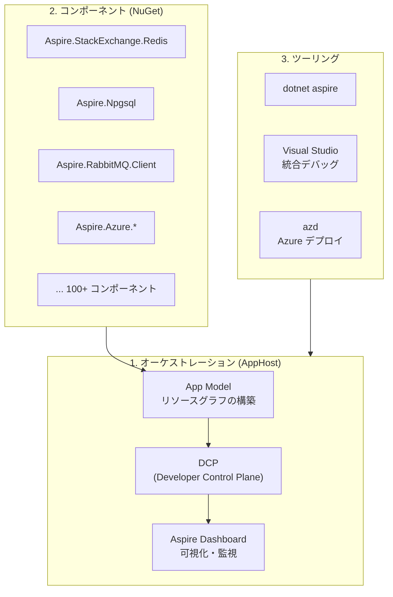

| 柱 | 役割 |
|---|---|
| **オーケストレーション** | アプリケーションの構成定義とローカル実行の管理 |
| **コンポーネント** | 外部サービス（Redis、PostgreSQL 等）へのクライアント接続を標準化 |
| **ツーリング** | 開発・デバッグ・デプロイのワークフロー支援 |

第1の柱である**オーケストレーション**は、この記事の中心的なトピックです。ここで登場するのが **AppHost** と呼ばれるプロジェクトです。AppHost は、アプリケーション全体の「設計図」を C# コードで定義する専用のコンソールアプリケーションです。どのサービスが存在し、どのインフラに依存し、サービス間がどう接続されるかを宣言的に記述します。AppHost 自身はビジネスロジックを一切含まず、純粋にアプリケーションの構成（composition）だけを担います。

第2の柱である**コンポーネント**は、各サービスプロジェクト（API、Worker など）にインストールする NuGet パッケージ群です。`Aspire.StackExchange.Redis` や `Aspire.Npgsql` といったパッケージが、接続文字列の解決・ヘルスチェック・テレメトリ計装を自動的にセットアップします。開発者は `builder.AddRedisClient("cache")` と1行書くだけで、接続管理・監視・障害検知がすべて組み込まれた Redis クライアントを手に入れます。

第3の柱である**ツーリング**は、Visual Studio や `dotnet aspire` CLI、Azure Developer CLI (`azd`) によるエンドツーエンドの開発体験を提供します。プロジェクトの作成からローカルデバッグ、クラウドデプロイまでを一貫して支援します。

以降の章では、第1の柱であるオーケストレーションの内部——AppHost が構築する App Model とは何か、それがどのようにローカルで実行されるのか——を中心に、フレームワークの深層を解き明かしていきます。

## 第1章：App Model — リソースグラフの構築

### AppHost とは何か

.NET Aspire のオーケストレーションの起点は **AppHost プロジェクト** です。AppHost は、`dotnet new aspire` や Visual Studio のテンプレートで生成される、ソリューション内の特別なコンソールアプリケーションです。

一般的な .NET ソリューションでは、各プロジェクト（Web API、Worker、Blazor フロントエンドなど）は独立して起動・実行されます。しかしマイクロサービス構成では「Redis と PostgreSQL を先に起動し、マイグレーションを実行し、その後に API と Worker を立ち上げ、最後にフロントエンドを起動する」といった **起動順序と接続関係** の管理が必要です。従来はこれを `docker-compose.yml` やシェルスクリプトで手作業で記述していましたが、AppHost はこれを **C# コード** で宣言的に表現します。

AppHost の `Program.cs` は通常のビジネスロジックコードとは異なり、アプリケーション全体の **トポロジー（構成図）** を定義するファイルです。「このソリューションには Redis と PostgreSQL と3つの .NET プロジェクトがあり、API は PostgreSQL と Redis に依存し、Worker は RabbitMQ に依存し、フロントエンドは API に依存する」——こうした関係性を `AddProject()`、`AddRedis()`、`WithReference()` といったメソッドチェーンで記述します。

AppHost の `.csproj` ファイルには、オーケストレーション対象のプロジェクトへの `ProjectReference` が列挙されます。ビルド時に Source Generator がこれらの参照を解析し、後述する型安全なプロジェクトメタデータクラスを自動生成します。つまり AppHost は、ソリューション内の「全体を俯瞰する唯一の場所」であり、他のプロジェクトは AppHost の存在を知りません。

### App Model とは

.NET Aspire の中核は **App Model** です。これは、アプリケーションを構成するすべてのリソース（プロジェクト、コンテナ、実行ファイル、外部サービス）とその依存関係を表す **有向非巡回グラフ（DAG）** です。AppHost の `Program.cs` に記述する一連の `Add*()` や `WithReference()` の呼び出しが、内部的にこの DAG を構築しています。

DAG（Directed Acyclic Graph）とは、ノード間に方向があり、かつ循環しないグラフ構造です。Aspire では各リソース（Redis、PostgreSQL、API サービスなど）がノードに、`WithReference()` による依存関係がエッジに対応します。この構造があることで、Aspire は「PostgreSQL → データベースマイグレーション → API サービス」といった起動順序を自動的に導出できます。

以下に、典型的な AppHost の `Program.cs` とそこから構築されるリソースグラフを示します。

```csharp
// AppHost の Program.cs
var builder = DistributedApplication.CreateBuilder(args);

// リソースの追加
var cache = builder.AddRedis("cache");
var postgres = builder.AddPostgres("pg")
    .AddDatabase("catalogdb");
var rabbit = builder.AddRabbitMQ("messaging");

// プロジェクトリソースとその依存関係
var catalogApi = builder.AddProject<Projects.CatalogApi>("catalog-api")
    .WithReference(postgres)
    .WithReference(cache);

var orderProcessor = builder.AddProject<Projects.OrderProcessor>("order-processor")
    .WithReference(rabbit)
    .WithReference(postgres);

var webFrontend = builder.AddProject<Projects.WebFrontend>("web-frontend")
    .WithReference(catalogApi)
    .WithReference(cache)
    .WithExternalHttpEndpoints();

builder.Build().Run();
```

このコードから構築されるリソースグラフ：

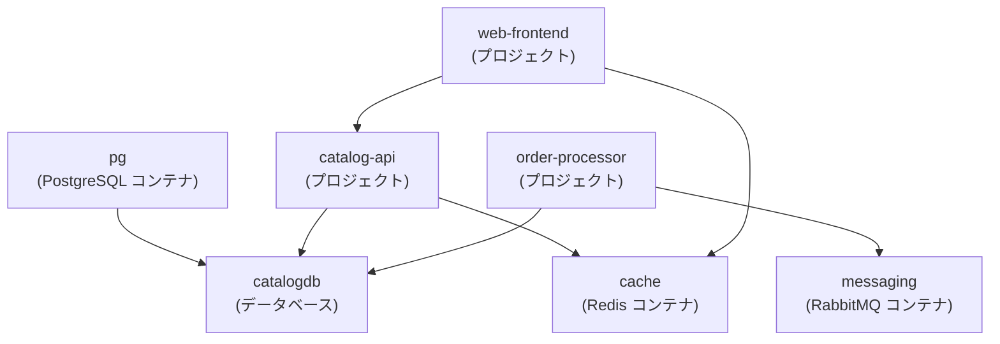

### `AddProject<T>()` の型パラメータの仕組み

上のコードで `builder.AddProject<Projects.CatalogApi>("catalog-api")` と書きましたが、この `<Projects.CatalogApi>` とは何でしょうか？これは C# の**ジェネリクス**（型パラメータ）構文で、プロジェクトを「型」として扱っています。

AppHost の `.csproj` にプロジェクト参照を追加すると：

```xml
<ProjectReference Include="..\CatalogApi\CatalogApi.csproj" />
```

Aspire のビルドツール（[Source Generator](https://github.com/dotnet/aspire/blob/main/src/Aspire.Hosting/ProjectResourceBuilderExtensions.cs)）が`Projects` 名前空間の下にクラスを**自動生成**します。生成されるコードはおおよそ以下のようなものです：

```csharp
namespace Projects;

// ビルド時に自動生成される（手書きではない）
public class CatalogApi : IProjectMetadata
{
    public string ProjectPath => @"C:\src\CatalogApi\CatalogApi.csproj";
}
```

`AddProject<T>()` のシグネチャは以下のようになっています：

```csharp
public static IResourceBuilder<ProjectResource> AddProject<TProject>(
    this IDistributedApplicationBuilder builder,
    string name)
    where TProject : IProjectMetadata, new()
```

型制約 `where TProject : IProjectMetadata, new()` により、`TProject` は `IProjectMetadata` を実装し、引数なしコンストラクタを持つ型でなければなりません。メソッド内部では `new TProject().ProjectPath` で `.csproj` のパスを取得し、オーケストレーターがどのプロジェクトを起動すべきかを特定します。

**なぜ文字列パスではなく型を使うのか？** 最大の理由は**コンパイル時の安全性**です。文字列パス `AddProject("../CatalogApi")` では typo がランタイムエラーになりますが、型パラメータ `AddProject<Projects.CatalogApi>()` ならプロジェクト参照を削除・リネームした時点で `Projects.CatalogApi` が存在しなくなり、**ビルドエラーとして即座に検出**できます。IDE の補完・リファクタリング支援も効くため、大規模なマイクロサービス構成でも安全にリソースを管理できます。

### IResource インターフェースの階層

App Model に登録されるリソースは、すべて `IResource` インターフェースを実装する型のインスタンスです。「Redis コンテナ」も「.NET プロジェクト」も「RabbitMQ」も、Aspire から見れば等しく「リソース」であり、それぞれ `ContainerResource`、`ProjectResource`、`ExecutableResource` といった具象クラスで表現されます。

この型階層の設計は、Aspire が新しい種類のリソース（例：Kafka、Elasticsearch、独自のサイドカー）を追加する際の拡張ポイントでもあります。すべてのリソースは [`IResource`](https://github.com/dotnet/aspire/blob/main/src/Aspire.Hosting/ApplicationModel/IResource.cs) インターフェースを実装します。

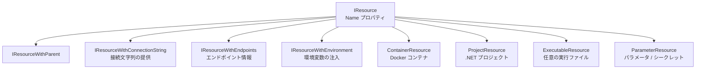

```csharp
// IResource の定義
public interface IResource
{
    string Name { get; }
    ResourceAnnotationCollection Annotations { get; }
}

// ContainerResource の例
public class RedisResource : ContainerResource, IResourceWithConnectionString
{
    public RedisResource(string name) : base(name) { }

    public ReferenceExpression ConnectionStringExpression =>
        ReferenceExpression.Create(
            $"{PrimaryEndpoint.Property(EndpointProperty.Host)}:{PrimaryEndpoint.Property(EndpointProperty.Port)}");
}
```

### Annotation ベースの拡張モデル

リソースの型階層を見ると疑問が湧くかもしれません——「Redis のポート番号情報はどこに持つのか？」「環境変数の注入ロジックはどう紐づけるのか？」。Aspire の回答は **アノテーション（Annotation）パターン** です。

クラスの継承で機能を追加するのではなく、リソースオブジェクトに「付箋」のようにメタデータを貼り付けていく設計です。これは継承ではなく**コンポジション**でリソースの能力を拡張するアプローチであり、`WithEndpoint()`、`WithEnvironment()` といったメソッドチェーンは、内部的にアノテーションオブジェクトをリソースの `Annotations` コレクションに追加しています。この設計のおかげで、リソースの型を変更することなく、後から自由に能力を付加できます。

```csharp
// アノテーションの例
public record EndpointAnnotation(
    string Name,
    string? Transport = null,
    string? Scheme = null,
    int? Port = null,
    int? TargetPort = null,
    bool IsExternal = false,
    bool IsProxied = true) : IResourceAnnotation;

public record EnvironmentCallbackAnnotation(
    Func<EnvironmentCallbackContext, Task> Callback)
    : IResourceAnnotation;

// WithReference() が内部で行っていること
public static IResourceBuilder<T> WithReference<T>(
    this IResourceBuilder<T> builder,
    IResourceBuilder<IResourceWithConnectionString> source)
    where T : IResourceWithEnvironment
{
    // 環境変数コールバックアノテーションを追加
    return builder.WithEnvironment(context =>
    {
        var connectionString = source.Resource
            .ConnectionStringExpression;
        context.EnvironmentVariables[$"ConnectionStrings__{source.Resource.Name}"]
            = connectionString;
    });
}
```

| アノテーション | 用途 |
|--------------|------|
| `EndpointAnnotation` | ネットワークエンドポイントの定義 |
| `EnvironmentCallbackAnnotation` | 環境変数の動的注入 |
| `ContainerImageAnnotation` | Docker イメージの指定 |
| `ContainerMountAnnotation` | ボリュームマウント情報 |
| `HealthCheckAnnotation` | ヘルスチェック方式の指定 |
| `CommandLineArgsCallbackAnnotation` | コマンドライン引数の動的構築 |
| `ManifestPublishingCallbackAnnotation` | デプロイマニフェストの生成方法 |

## 第2章：DCP（Developer Control Plane）— ローカルオーケストレーション

### DCP の役割

第1章で見た App Model は、あくまでアプリケーションの「設計図」にすぎません。実際にコンテナを起動し、プロセスを立ち上げ、ネットワークを接続する「実行エンジン」が必要です。それが **DCP（Developer Control Plane）** です。

AppHost プロジェクトを `dotnet run` すると、最初に App Model（DAG）がメモリ上に構築されます。次に、この DAG が gRPC を介して DCP プロセスに送信されます。DCP は受け取った設計図に基づいて、Docker コンテナの起動・.NET プロジェクトのプロセス起動・ポートの割り当てと接続文字列の注入を実行します。開発者から見ると `dotnet run` 一発でアプリケーション全体が立ち上がりますが、裏側では AppHost → DCP → Docker/プロセス という明確な責務分離が行われています。

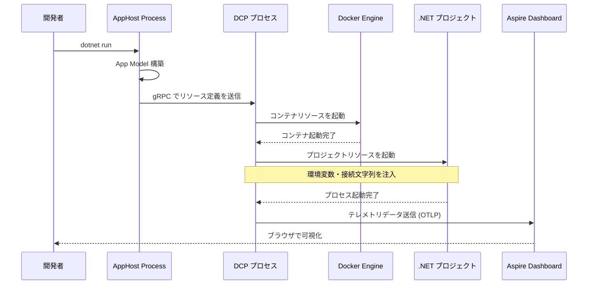

### DCP の内部アーキテクチャ

DCP は Go 言語で実装された軽量なコントロールプレーンです。「Kubernetes に着想を得た」というのは比喩ではなく、実際に Kubernetes の Custom Resource Definition (CRD) と同様の **宣言的リソースモデル** を採用しています。つまり、DCP は「Redis コンテナをポート 6379 で起動せよ」という命令を受け取るのではなく、「Redis コンテナが存在すべき」という**望ましい状態（desired state）** を受け取り、現在の状態との差分を埋める **Reconciliation（調停）ループ** を実行します。

コンテナが異常終了した場合は自動的に再起動し、エンドポイントが変更された場合はプロキシ設定を更新する——こうした自己修復的な振る舞いは、この宣言的モデルから自然に導かれます。ただし DCP は Kubernetes クラスタを要求しません。あくまでローカルの開発マシン上で動作する軽量プロセスであり、Docker Desktop さえあれば動きます。

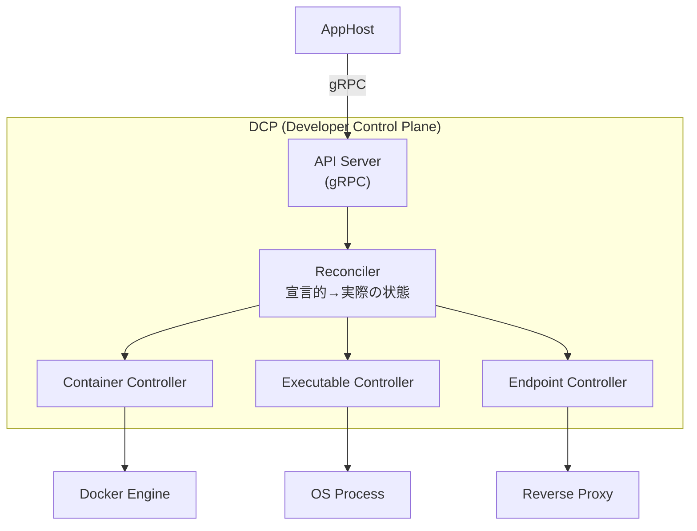

DCP のリソースモデル：

| DCP リソース | 対応する概念 | 説明 |
|-------------|------------|------|
| `Container` | Docker コンテナ | イメージの pull と起動 |
| `Executable` | プロセス | .NET プロジェクトや任意の実行ファイル |
| `Endpoint` | ネットワーク | ポートマッピングとプロキシ |
| `ExecutableReplicaSet` | レプリカ | 同一プロセスの複数インスタンス |

### リソースの起動順序と依存関係解決

App Model は DAG（有向非巡回グラフ）なので、DCP は **トポロジカルソート** を適用して安全な起動順序を決定できます。トポロジカルソートとは、グラフ内のすべての辺 (u → v) について u が v より前に来るような線形順序を求めるアルゴリズムです。

具体的には、依存先のないリソース（Redis、PostgreSQL、RabbitMQ）が最初に起動され、それらに依存するリソース（API、Worker）がその次に、最後に上流サービスに依存するフロントエンドが起動されます。同じフェーズ内のリソースは**並列に**起動されるため、全体の起動時間が最小化されます。

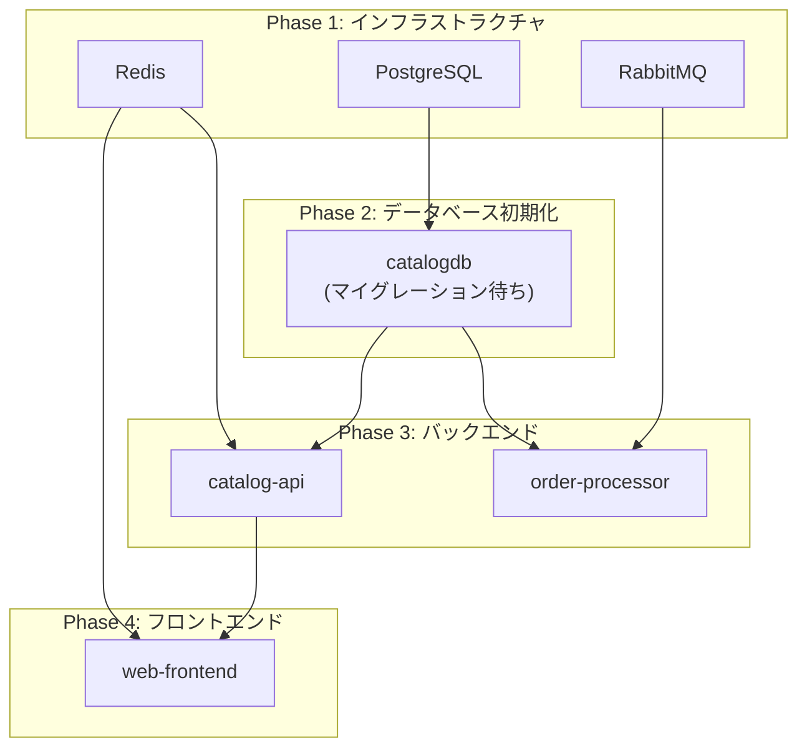

```csharp
// WaitFor() による明示的な起動順序制御
var postgres = builder.AddPostgres("pg")
    .AddDatabase("catalogdb");

var migration = builder.AddProject<Projects.DbMigration>("migration")
    .WithReference(postgres)
    .WaitFor(postgres); // PostgreSQL の準備完了を待つ

var api = builder.AddProject<Projects.Api>("api")
    .WithReference(postgres)
    .WaitFor(migration); // マイグレーション完了を待つ
```

`WaitFor()` は内部的にヘルスチェックを使って依存リソースの準備完了を確認します。

## 第3章：サービスディスカバリ — 動的なエンドポイント解決

### 接続文字列と環境変数

マイクロサービス構成で避けられない問題のひとつが「サービス A はサービス B にどうやって接続するのか」です。IP アドレスやポート番号をハードコードするのは論外ですし、ローカル開発とクラウドデプロイで接続先が異なるため、設定ファイルで管理するのも煩雑です。

Aspire はこの問題を **環境変数による自動注入** で解決します。`WithReference()` でリソース間の依存関係を宣言すると、DCP が下流サービスのプロセス起動時に、上流リソースの**接続文字列**や**エンドポイント URL** を環境変数として自動的に注入します。開発者はコード内で接続先を意識する必要がなく、`IConfiguration.GetConnectionString("cache")` と書くだけで、Aspire が注入した値が取得されます。

```csharp
// この宣言から...
var cache = builder.AddRedis("cache");
var api = builder.AddProject<Projects.Api>("api")
    .WithReference(cache);

// 以下のような環境変数が api プロセスに注入される:
// ConnectionStrings__cache = "localhost:63241"
```

環境変数の命名規則：

| 参照タイプ | 環境変数パターン | 例 |
|-----------|----------------|---|
| 接続文字列 | `ConnectionStrings__{name}` | `ConnectionStrings__cache` |
| HTTP エンドポイント | `services__{name}__http__0` | `services__catalog-api__http__0` |
| HTTPS エンドポイント | `services__{name}__https__0` | `services__catalog-api__https__0` |

### サービスディスカバリの仕組み

環境変数による接続文字列の注入は「静的な」エンドポイント解決です。しかし、サービスがレプリカを持つ場合や、エンドポイントが動的に変化する場合はどうでしょうか？ここで登場するのが .NET Aspire のサービスディスカバリ機構です。

`Microsoft.Extensions.ServiceDiscovery` パッケージは、HttpClient のパイプラインにインターセプトハンドラーを挿入します。開発者が `http://catalog-api/api/products` のように**論理名**（サービス名）で URL を指定すると、ハンドラーがリクエストを横取りし、環境変数や DNS SRV レコードから実際のエンドポイント（`https://localhost:7234/api/products`）に透過的に解決します。コードに物理アドレスが一切現れないため、ローカル開発でもクラウド環境でもコードの変更が不要です。

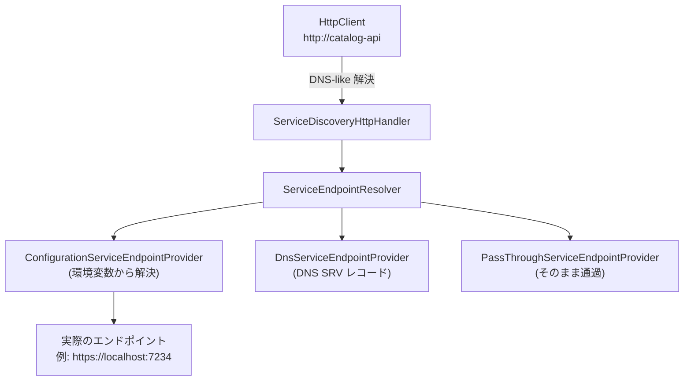

```csharp
// サービスディスカバリの使用例（ServiceDefaults プロジェクト）
builder.Services.AddServiceDiscovery();
builder.Services.ConfigureHttpClientDefaults(http =>
{
    http.AddServiceDiscovery(); // すべての HttpClient にサービスディスカバリを適用
});

// 利用側：論理名でリクエスト
app.MapGet("/products", async (HttpClient client) =>
{
    // "https://catalog-api" は実際のエンドポイントに解決される
    var products = await client.GetFromJsonAsync<Product[]>(
        "https://catalog-api/api/products");
    return products;
});
```

### エンドポイント解決の優先順位

1. **Configuration** — 環境変数 `services__{name}__{scheme}__{index}` から解決
2. **DNS SRV** — DNS SRV レコードから解決（Kubernetes 環境で有用）
3. **Pass-through** — ホスト名がそのまま通過（従来の DNS 解決）

```csharp
// Aspire が注入する環境変数の実際の値
// services__catalog-api__https__0 = "https://localhost:7234"
// services__catalog-api__http__0 = "http://localhost:5234"

// これが ServiceDiscovery によって解決される:
// "https://catalog-api" → "https://localhost:7234"
```

### ロードバランシング

サービスディスカバリはクライアントサイドのロードバランシングもサポートします。

```csharp
// レプリカを設定
var api = builder.AddProject<Projects.Api>("api")
    .WithReplicas(3); // 3インスタンス起動

// ServiceDiscovery は Round-robin で各インスタンスに分散
// services__api__https__0 = "https://localhost:7234"
// services__api__https__1 = "https://localhost:7235"
// services__api__https__2 = "https://localhost:7236"
```

## 第4章：コンポーネントシステム — 標準化されたクライアント設定

### コンポーネントの哲学

Redis に接続するとき、開発者は通常こうした作業を行います——NuGet パッケージのインストール、接続文字列の取得、`IConnectionMultiplexer` の DI 登録、ヘルスチェックの追加、OpenTelemetry の計装設定、リトライポリシーの構成。これらはプロジェクトごとに繰り返される **ボイラープレート** であり、どれかひとつでも忘れるとモニタリングの穴が生まれます。

.NET Aspire コンポーネントは、この繰り返し作業を **1行のメソッド呼び出し** に凝縮する NuGet パッケージです。`builder.AddRedisClient("cache")` と書くだけで、上記すべてが標準的な方法でセットアップされます。これが「オピニオネイテッド」の具体的な現れです——ベストプラクティスをデフォルトとして組み込むことで、開発者が「正しいこと」をするのに余分な労力を必要としなくなります。

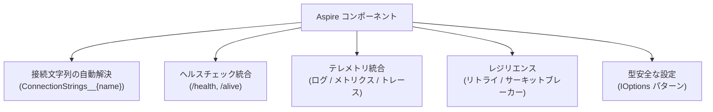

### コンポーネントの内部実装

コンポーネントの「1行で全部入り」がどう実現されているか、`Aspire.StackExchange.Redis` を例に内部を見てみましょう。`AddRedisClient()` メソッドは、内部で5つのステップを順に実行しています。設定のバインド → 接続文字列の取得 → DI コンテナへの登録 → ヘルスチェックの追加 → テレメトリの計装です。これらが1つのメソッド内に凝集されていることで、設定の一部だけ忘れるという問題が構造的に排除されています。

```csharp
// AddRedisClient() の内部実装（簡略化）
public static void AddRedisClient(
    this IHostApplicationBuilder builder,
    string connectionName,
    Action<AspireRedisSettings>? configureSettings = null)
{
    // 1. 設定のバインド
    var settings = new AspireRedisSettings();
    builder.Configuration
        .GetSection($"Aspire:StackExchange:Redis:{connectionName}")
        .Bind(settings);
    configureSettings?.Invoke(settings);

    // 2. 接続文字列の取得
    var connectionString = settings.ConnectionString
        ?? builder.Configuration.GetConnectionString(connectionName);

    // 3. IConnectionMultiplexer の登録
    builder.Services.AddSingleton<IConnectionMultiplexer>(sp =>
    {
        var options = ConfigurationOptions.Parse(connectionString!);
        return ConnectionMultiplexer.Connect(options);
    });

    // 4. ヘルスチェックの登録
    if (!settings.DisableHealthChecks)
    {
        builder.Services.AddHealthChecks()
            .AddRedis(connectionString!,
                name: $"Redis_{connectionName}",
                tags: ["ready"]);
    }

    // 5. テレメトリの設定
    if (!settings.DisableTracing)
    {
        builder.Services.AddOpenTelemetry()
            .WithTracing(tracing =>
                tracing.AddRedisInstrumentation());
    }
}
```

### ホスティング側 vs クライアント側

Aspire コンポーネントを理解する上で重要なのが、**ホスティングパッケージ** と **クライアントパッケージ** の区別です。同じ Redis でも2種類の NuGet パッケージが存在し、それぞれ異なるプロジェクトにインストールされます。

ホスティングパッケージ（`Aspire.Hosting.Redis`）は AppHost プロジェクトにインストールし、「Redis コンテナをどう起動するか」を定義します。クライアントパッケージ（`Aspire.StackExchange.Redis`）は各サービスプロジェクトにインストールし、「Redis にどう接続するか」を設定します。両者の間を橋渡しするのが、DCP が注入する環境変数（`ConnectionStrings__cache`）です。

| パッケージ | 用途 | インストール先 |
|-----------|------|-------------|
| `Aspire.Hosting.Redis` | Redis コンテナの定義 | AppHost プロジェクト |
| `Aspire.StackExchange.Redis` | Redis クライアントの設定 | サービスプロジェクト |

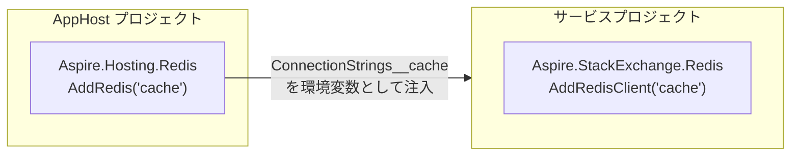

## 第5章：ServiceDefaults — 横断的関心事の標準化

### ServiceDefaults の役割

個々のコンポーネントが外部サービスごとのベストプラクティスを提供するのに対し、**ServiceDefaults** はサービス自体の横断的関心事（Cross-Cutting Concerns）を一箇所にまとめたプロジェクトです。

「横断的関心事」とは、ビジネスロジックとは直交するが、すべてのサービスに必要な機能——テレメトリ収集、ヘルスチェックエンドポイント、サービスディスカバリ、HTTP リトライポリシー——のことです。これらをサービスごとに個別に設定すると、設定の不整合が起きやすくなります。ServiceDefaults は共有クラスライブラリとして実装され、すべてのサービスプロジェクトが `builder.AddServiceDefaults()` を呼び出すだけで、統一された設定が適用されます。

以下は ServiceDefaults の `AddServiceDefaults()` メソッドの構造です。わずか数行で、OpenTelemetry・ヘルスチェック・サービスディスカバリ・リトライが一括設定されていることがわかります。

```csharp
// ServiceDefaults/Extensions.cs の全体構造
public static IHostApplicationBuilder AddServiceDefaults(
    this IHostApplicationBuilder builder)
{
    // 1. OpenTelemetry の構成
    builder.ConfigureOpenTelemetry();

    // 2. ヘルスチェックエンドポイントの追加
    builder.AddDefaultHealthChecks();

    // 3. サービスディスカバリの登録
    builder.Services.AddServiceDiscovery();

    // 4. HttpClient のデフォルト設定
    builder.Services.ConfigureHttpClientDefaults(http =>
    {
        http.AddStandardResilienceHandler(); // リトライ・サーキットブレーカー
        http.AddServiceDiscovery();          // サービスディスカバリ
    });

    return builder;
}
```

### OpenTelemetry 統合の詳細

Aspire が OpenTelemetry を選択したのは偶然ではありません。OpenTelemetry は CNCF（Cloud Native Computing Foundation）がホストするオープンスタンダードであり、ベンダーロックインなしにログ・メトリクス・トレースを統一的に扱えます。Aspire は各サービスの OpenTelemetry SDK 設定を自動化し、データの送信先として Aspire Dashboard の OTLP Receiver を環境変数（`OTEL_EXPORTER_OTLP_ENDPOINT`）で指定します。

注目すべきは、この設定が AppHost でも ServiceDefaults でもなく、**ランタイム時に環境変数を介して動的に行われる**点です。ローカル開発時は Dashboard に送信され、プロダクション環境では Jaeger や Azure Monitor など別のバックエンドに切り替えられます——コードの変更なしに。

```csharp
public static IHostApplicationBuilder ConfigureOpenTelemetry(
    this IHostApplicationBuilder builder)
{
    // ログ
    builder.Logging.AddOpenTelemetry(logging =>
    {
        logging.IncludeFormattedMessage = true;
        logging.IncludeScopes = true;
    });

    // メトリクスとトレース
    builder.Services.AddOpenTelemetry()
        .WithMetrics(metrics =>
        {
            metrics.AddAspNetCoreInstrumentation()  // HTTP メトリクス
                   .AddHttpClientInstrumentation()   // HttpClient メトリクス
                   .AddRuntimeInstrumentation();     // .NET ランタイムメトリクス
        })
        .WithTracing(tracing =>
        {
            tracing.AddAspNetCoreInstrumentation()   // HTTP トレース
                   .AddGrpcClientInstrumentation()    // gRPC トレース
                   .AddHttpClientInstrumentation();   // HttpClient トレース
        });

    // OTLP エクスポーターの構成
    builder.AddOpenTelemetryExporters();

    return builder;
}

private static IHostApplicationBuilder AddOpenTelemetryExporters(
    this IHostApplicationBuilder builder)
{
    // OTEL_EXPORTER_OTLP_ENDPOINT が設定されていれば OTLP エクスポーターを使用
    // Aspire Dashboard が自動的にこの環境変数を設定する
    var otlpEndpoint = builder.Configuration["OTEL_EXPORTER_OTLP_ENDPOINT"];
    if (!string.IsNullOrWhiteSpace(otlpEndpoint))
    {
        builder.Services.AddOpenTelemetry()
            .UseOtlpExporter(); // gRPC over HTTP/2 で Dashboard に送信
    }

    return builder;
}
```

テレメトリデータの流れ：

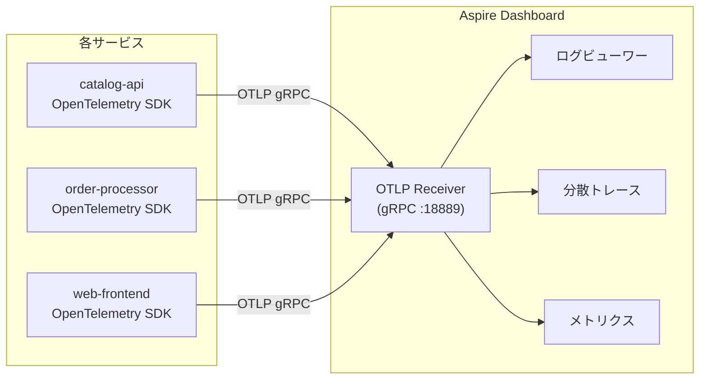

## 第6章：Aspire Dashboard — オブザーバビリティの統合

### Dashboard のアーキテクチャ

ServiceDefaults が各サービスにテレメトリ計装を設定しても、データを受信・可視化する先がなければ意味がありません。Aspire Dashboard はその受け皿として機能する **Blazor Server** アプリケーションです。

AppHost を起動すると、DCP が Docker コンテナとして Dashboard を自動的に立ち上げます（通常 `http://localhost:15888` でアクセス可能）。Dashboard は OTLP（OpenTelemetry Protocol）レシーバーとして動作し、すべてのサービスからログ・メトリクス・分散トレースをリアルタイムに受信します。これらのデータはインメモリの循環バッファに格納され、ブラウザ上でインタラクティブに探索できます。

開発中にエラーが発生した場合、Dashboard の分散トレース画面を開けば「どのサービスのどのオペレーションで何ms かかり、どこでエラーが発生したか」を一目で確認できます。従来であれば複数のサービスのログファイルを突き合わせる必要があった作業が、一画面で完結します。

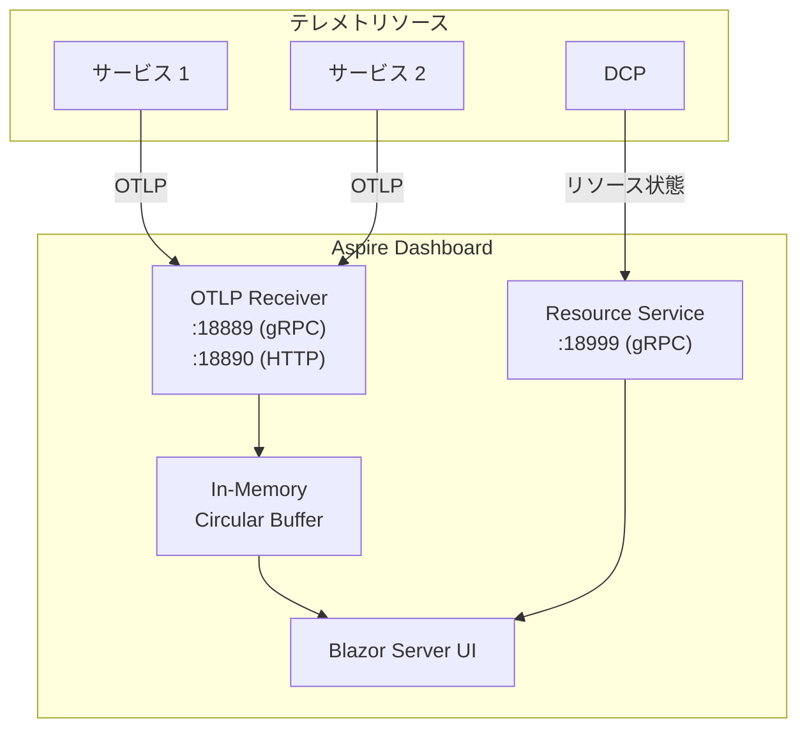

| 機能 | 説明 |
|------|------|
| **リソース一覧** | 全リソースの状態、起動ログ、環境変数の確認 |
| **構造化ログ** | OpenTelemetry で収集したログのフィルタリング・検索 |
| **分散トレース** | サービス間のリクエストフローを視覚化 |
| **メトリクス** | HTTP リクエスト率、レイテンシ、エラー率のリアルタイム表示 |

### Dashboard の独立利用

Dashboard はスタンドアロンの Docker コンテナとしても利用可能です。

```bash
docker run --rm -it -d \
  -p 18888:18888 \
  -p 4317:18889 \
  -p 4318:18890 \
  --name aspire-dashboard \
  mcr.microsoft.com/dotnet/aspire-dashboard:9.0
```

この場合、任意の OTLP 互換アプリケーション（Java、Go、Python 等）のテレメトリも受信できます。

## 第7章：ヘルスチェックと Readiness

### ヘルスチェックの階層

分散システムでは「サービスのプロセスが起動している」ことと「サービスがリクエストを正しく処理できる」ことは別の問題です。プロセスは生きていても、DB 接続が切れていればリクエストは処理できません。

.NET Aspire はこの区別を **Liveness**（生存確認）と **Readiness**（準備完了確認）の2階層で表現します。Liveness（`/alive`）は「プロセスが応答するか」だけを確認し、デッドロックやメモリ枯渇の検知に使います。Readiness（`/health`）は DB・Redis・依存サービスを含むすべての依存関係が正常かを確認し、「トラフィックを受け入れてよいか」を判定します。

この2階層は Kubernetes の `livenessProbe` と `readinessProbe` にそのまま対応しており、ローカル開発時と Kubernetes デプロイ時で同じヘルスチェック定義が使い回されます。AppHost の `WaitFor()` は Readiness エンドポイントをポーリングすることで、依存リソースが本当に「使える状態」になるまで下流の起動を遅延させます。

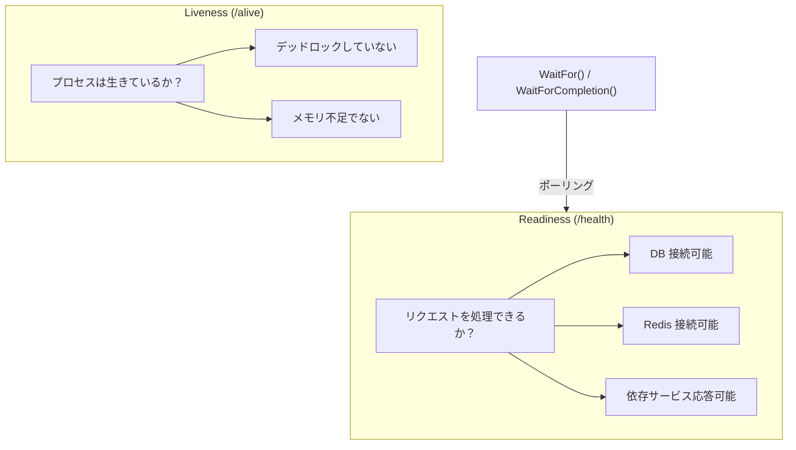

```csharp
// ServiceDefaults で設定されるヘルスチェック
public static IHostApplicationBuilder AddDefaultHealthChecks(
    this IHostApplicationBuilder builder)
{
    builder.Services.AddHealthChecks()
        // Liveness: アプリケーションプロセスが応答するか
        .AddCheck("self", () => HealthCheckResult.Healthy(),
            tags: ["live"]);

    return builder;
}

public static WebApplication MapDefaultEndpoints(
    this WebApplication app)
{
    // Readiness endpoint: すべてのヘルスチェックを評価
    app.MapHealthChecks("/health");

    // Liveness endpoint: "live" タグのチェックのみ
    app.MapHealthChecks("/alive", new()
    {
        Predicate = r => r.Tags.Contains("live")
    });

    return app;
}
```

### WaitFor の内部実装

`WaitFor()` は、DCP が依存リソースのヘルスチェックエンドポイントをポーリングし、`Healthy` レスポンスが返るまで依存先リソースの起動を遅延させます。

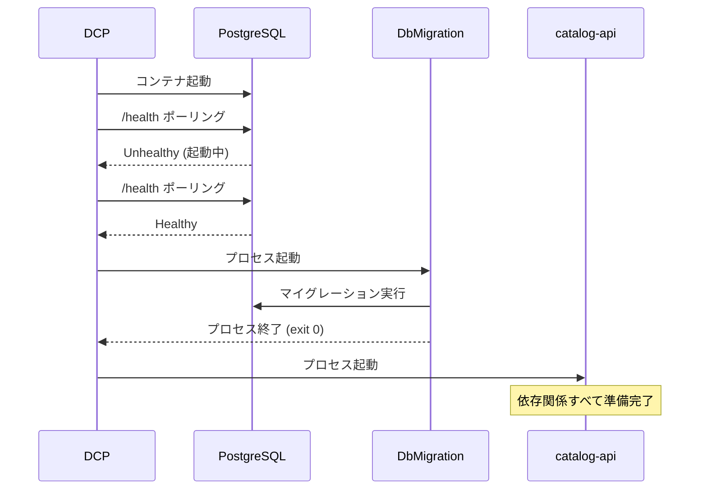

## 第8章：レジリエンスとリトライ

### 標準レジリエンスハンドラー

分散システムでは、ネットワーク遅延・一時的な障害・サービスの再起動は日常茶飯事です。クライアントコードに何の対策もなければ、1つのサービスの一時的なスローダウンがリトライの嵐とタイムアウトの連鎖を引き起こし、システム全体が崩壊します。

ServiceDefaults の `AddStandardResilienceHandler()` は、`Microsoft.Extensions.Http.Resilience`（内部的に [Polly v8](https://github.com/App-vNext/Polly) を使用）を使って、**5層のレジリエンスパイプライン** をすべての `HttpClient` に自動適用します。各層は外側から順にリクエストをラップし、様々な障害パターンに対処します。

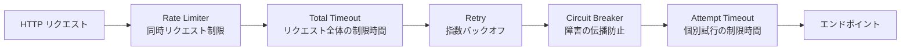

| レイヤー | 既定値 | 説明 |
|---------|--------|------|
| **Rate Limiter** | 1,000 同時リクエスト | 下流サービスへの同時リクエスト数を制限 |
| **Total Request Timeout** | 30 秒 | リトライを含むリクエスト全体のタイムアウト |
| **Retry** | 最大 3 回、指数バックオフ | 一時的な障害からの復帰 |
| **Circuit Breaker** | 失敗率 10%、サンプル期間 30 秒 | 障害の連鎖を防止 |
| **Attempt Timeout** | 10 秒 | 個別リクエスト試行のタイムアウト |

```csharp
// カスタマイズ例
builder.Services.ConfigureHttpClientDefaults(http =>
{
    http.AddStandardResilienceHandler(options =>
    {
        options.Retry.MaxRetryAttempts = 5;
        options.Retry.BackoffType = DelayBackoffType.Exponential;
        options.Retry.Delay = TimeSpan.FromMilliseconds(500);

        options.CircuitBreaker.SamplingDuration = TimeSpan.FromSeconds(60);
        options.CircuitBreaker.FailureRatio = 0.2;

        options.TotalRequestTimeout.Timeout = TimeSpan.FromSeconds(60);
    });
});
```

## 第9章：デプロイメントマニフェスト — ローカルからクラウドへ

### マニフェスト生成

ここまでの章では、AppHost がローカル開発環境でどう機能するかを見てきました。しかし Aspire の野心はローカル開発にとどまりません。AppHost が構築する App Model は、**デプロイメントマニフェスト**として JSON に書き出すことができ、これによりローカルの構成定義がそのままクラウドデプロイの設計図になります。

これは「ローカルで動いたものがそのまま本番に行く」という開発者体験の核心です。`docker-compose.yml` から Kubernetes マニフェスト、あるいは Terraform 定義への手動変換が不要になり、AppHost の C# コードが **Single Source of Truth（唯一の信頼できる情報源）** として機能します。

```bash
# マニフェストの生成
dotnet run --project AppHost -- --publisher manifest --output-path manifest.json
```

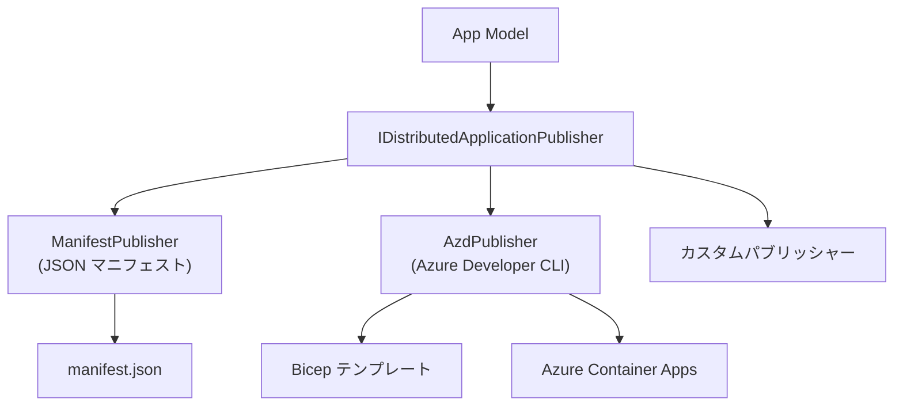

### マニフェストの構造

生成されるマニフェストには、リソース間の接続情報とデプロイに必要な設定がすべて含まれます。

```json
{
  "resources": {
    "cache": {
      "type": "container.v0",
      "connectionString": "{cache.bindings.tcp.host}:{cache.bindings.tcp.port}",
      "image": "docker.io/library/redis:7.4",
      "bindings": {
        "tcp": {
          "scheme": "tcp",
          "protocol": "tcp",
          "transport": "tcp",
          "targetPort": 6379
        }
      }
    },
    "catalog-api": {
      "type": "project.v0",
      "path": "../CatalogApi/CatalogApi.csproj",
      "env": {
        "ConnectionStrings__cache": "{cache.connectionString}"
      },
      "bindings": {
        "http": { "scheme": "http", "protocol": "tcp", "transport": "http" },
        "https": { "scheme": "https", "protocol": "tcp", "transport": "http" }
      }
    }
  }
}
```

### Azure Container Apps へのデプロイ

`azd` (Azure Developer CLI) は Aspire マニフェストを読み取り、Azure リソースを自動プロビジョニングします。

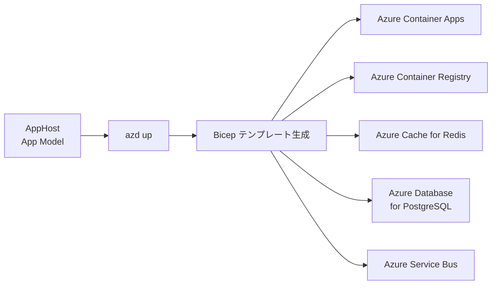

| Aspire リソース | Azure マッピング |
|---------------|----------------|
| `AddRedis()` | Azure Cache for Redis |
| `AddPostgres()` | Azure Database for PostgreSQL |
| `AddRabbitMQ()` | Azure Service Bus |
| `AddProject()` | Azure Container Apps |
| コンテナリソース | Azure Container Apps (カスタムコンテナ) |

## 第10章：カスタムリソースの作成

### カスタムリソースの実装パターン

Aspire が標準で提供するリソース（Redis、PostgreSQL、RabbitMQ など）は便利ですが、実際のプロジェクトではこれらだけでは足りない場面が必ずあります。ローカル開発用のメールサーバー（MailDev）、社内用のキューシステム、独自のサイドカープロセスなど——こうした「Aspire が知らないインフラ」もリソースとして統合したい場合があります。

Aspire はこのニーズに対して **カスタムリソース** という拡張ポイントを提供しています。実装の流れは明快で、(1) `ContainerResource` などを継承したリソースクラスを定義し、(2) `AddMailDev()` のようなビルダー拡張メソッドを作成し、(3) AppHost の `Program.cs` で他のリソースと同じように使う——これだけです。カスタムリソースは標準リソースと同じ生態系（ヘルスチェック、テレメトリ、`WithReference()` による依存関係）に完全に参加できます。

```csharp
// 1. リソースクラスの定義
public class MailDevResource : ContainerResource, IResourceWithConnectionString
{
    public MailDevResource(string name) : base(name) { }

    // SMTP エンドポイント
    private EndpointReference? _smtpEndpoint;
    public EndpointReference SmtpEndpoint =>
        _smtpEndpoint ??= new(this, "smtp");

    // Web UI エンドポイント
    private EndpointReference? _httpEndpoint;
    public EndpointReference HttpEndpoint =>
        _httpEndpoint ??= new(this, "http");

    // 接続文字列の式
    public ReferenceExpression ConnectionStringExpression =>
        ReferenceExpression.Create(
            $"smtp://{SmtpEndpoint.Property(EndpointProperty.Host)}:{SmtpEndpoint.Property(EndpointProperty.Port)}");
}

// 2. ビルダー拡張メソッドの定義
public static class MailDevResourceExtensions
{
    public static IResourceBuilder<MailDevResource> AddMailDev(
        this IDistributedApplicationBuilder builder,
        string name,
        int? smtpPort = null,
        int? httpPort = null)
    {
        return builder.AddResource(new MailDevResource(name))
            .WithImage("maildev/maildev", "2.1.0")
            .WithHttpEndpoint(
                port: httpPort,
                targetPort: 1080,
                name: "http")
            .WithEndpoint(
                port: smtpPort,
                targetPort: 1025,
                name: "smtp",
                scheme: "tcp")
            .WithHealthCheck("smtp"); // ヘルスチェックの追加
    }
}

// 3. AppHost での使用
var maildev = builder.AddMailDev("mail");
var api = builder.AddProject<Projects.Api>("api")
    .WithReference(maildev); // ConnectionStrings__mail が注入される
```

### カスタムリソースのライフサイクルフック

```csharp
// IDistributedApplicationLifecycleHook でリソースライフサイクルに介入
public class DatabaseSeederHook : IDistributedApplicationLifecycleHook
{
    public async Task AfterResourcesCreatedAsync(
        DistributedApplicationModel appModel,
        CancellationToken cancellationToken)
    {
        // 全リソース起動後に実行
        var dbResource = appModel.Resources
            .OfType<PostgresDatabaseResource>()
            .FirstOrDefault();

        if (dbResource != null)
        {
            // シードデータの投入 etc.
        }
    }
}

// 登録
builder.Services
    .AddLifecycleHook<DatabaseSeederHook>();
```

## 第11章：テストとインテグレーション

### DistributedApplicationTestingBuilder

マイクロサービスの統合テストは伝統的に困難でした。各サービスを手動で起動し、テスト用のインフラを用意し、テスト後にクリーンアップする——この手間がテストの省略や不十分なカバレッジにつながりがちです。

Aspire は `DistributedApplication.TestingBuilder` を提供することで、この問題を根本から解消します。テストコード内で AppHost 全体を起動し、実際のコンテナとプロセスが動く環境に対して HTTP リクエストを送ることができます。モックやスタブではなく、本物のインフラ（Docker で起動した PostgreSQL・Redis）を使った**本物の統合テスト**です。テスト終了時には `await using` パターンでリソースが自動クリーンアップされます。

```csharp
public class AppHostTests
{
    [Fact]
    public async Task CatalogApiReturnsProducts()
    {
        // AppHost 全体を起動
        var appHost = await DistributedApplicationTestingBuilder
            .CreateAsync<Projects.AppHost>();

        await using var app = await appHost.BuildAsync();
        await app.StartAsync();

        // catalog-api の HttpClient を取得
        var httpClient = app.CreateHttpClient("catalog-api");

        // API にリクエスト
        var response = await httpClient.GetAsync("/api/products");
        response.EnsureSuccessStatusCode();

        var products = await response.Content
            .ReadFromJsonAsync<List<Product>>();
        Assert.NotEmpty(products);
    }

    [Fact]
    public async Task WebFrontendIsHealthy()
    {
        var appHost = await DistributedApplicationTestingBuilder
            .CreateAsync<Projects.AppHost>();

        await using var app = await appHost.BuildAsync();
        await app.StartAsync();

        // ヘルスチェックエンドポイントを確認
        var httpClient = app.CreateHttpClient("web-frontend");
        var response = await httpClient.GetAsync("/health");
        Assert.Equal(HttpStatusCode.OK, response.StatusCode);
    }
}
```

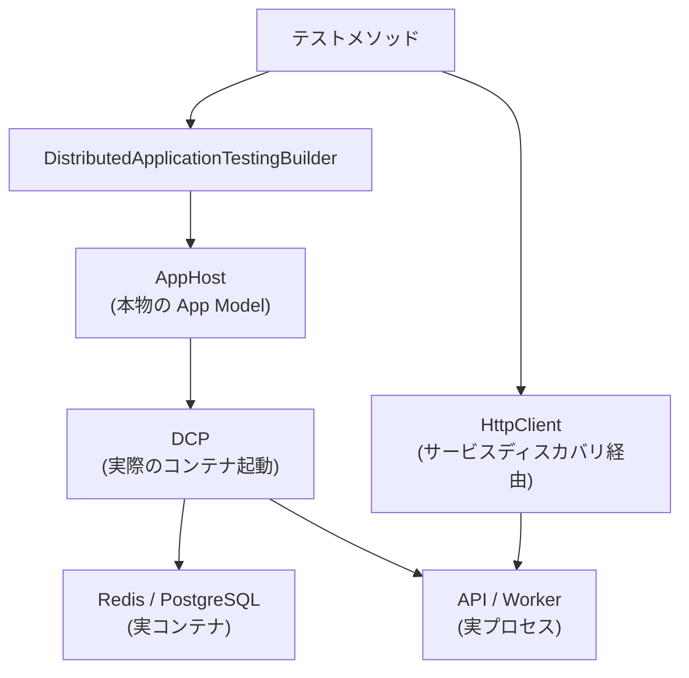

### テスト時の設定カスタマイズ

テスト時に設定を上書きしたり、サービスコレクションをカスタマイズすることも可能です。

```csharp
var appHost = await DistributedApplicationTestingBuilder
    .CreateAsync<Projects.AppHost>(args =>
    {
        // テスト用の設定を上書き
        args.Configuration["Parameters:pgPassword"] = "test-password";
    });

// テスト用の HttpClient 設定
appHost.Services.ConfigureHttpClientDefaults(http =>
{
    http.AddStandardResilienceHandler();
});
```

## 第12章：.NET Aspire 9.x の進化

### 主要な新機能

Aspire はリリースサイクルが速く、.NET 9 と同時にリリースされた Aspire 9 では、コミュニティのフィードバックを反映した多くの改善が行われています。特に注目すべきは、開発体験のさらなる向上を目指した新機能群です。

`WaitFor` / `WaitForCompletion` は第2章で触れた起動順序制御の宣言的 API で、Aspire 9 で正式導入されました。`Persistent Containers` は `dotnet run` を再起動するたびにコンテナが再作成される待ち時間を解消する機能です。`Resource Commands` と `Custom Resource States` は Dashboard の拡張ポイントであり、カスタムリソースの運用をよりインタラクティブにします。`Eventing Model` はリソースのライフサイクルにフックし、「Redis が起動完了したら特定の処理を実行する」といった宣言的なイベント駆動パターンを可能にします。

| 機能 | 説明 |
|------|------|
| **WaitFor / WaitForCompletion** | リソース間の起動順序を宣言的に制御 |
| **Persistent Containers** | `dotnet run` を再起動してもコンテナを維持 |
| **Resource Commands** | Dashboard からカスタムコマンドを実行 |
| **Custom Resource States** | リソースの状態を独自に報告 |
| **Eventing Model** | リソースライフサイクルイベントの購読 |

### Eventing Model

```csharp
// リソースイベントの購読
var cache = builder.AddRedis("cache");

builder.Eventing.Subscribe<ResourceReadyEvent>(
    cache.Resource,
    async (evt, ct) =>
    {
        // Redis が起動完了した時に実行
        Console.WriteLine($"{evt.Resource.Name} is ready!");
    });

builder.Eventing.Subscribe<BeforeResourceStartedEvent>(
    cache.Resource,
    async (evt, ct) =>
    {
        // Redis が起動する前に実行
        Console.WriteLine($"{evt.Resource.Name} is about to start");
    });
```

### Persistent Containers

```csharp
// コンテナの永続化（再起動しても維持）
var postgres = builder.AddPostgres("pg")
    .WithLifetime(ContainerLifetime.Persistent) // デフォルトは Session
    .AddDatabase("catalogdb");

// Session: AppHost 停止時にコンテナも停止
// Persistent: AppHost 停止後もコンテナが残る（高速な再起動）
```

## Aspire のアーキテクチャ全体像

最後に、.NET Aspire の全体的なアーキテクチャを一枚の図にまとめます。

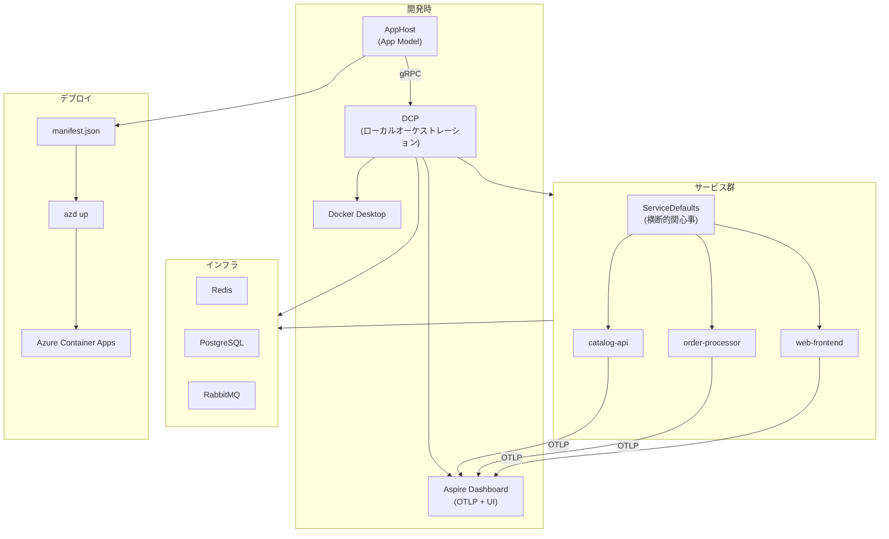

## まとめ

.NET Aspire は単なるプロジェクトテンプレートやコード生成ツールではありません。AppHost による宣言的な構成定義から、DCP によるローカルオーケストレーション、コンポーネントによるベストプラクティスの自動適用、そしてデプロイメントマニフェストによるクラウドへの移行まで、分散アプリケーション開発の**ライフサイクル全体**をカバーするフレームワークです。

その本質は「開発者が本来やるべきこと（ビジネスロジックの実装）に集中できるように、インフラの接続・監視・障害対策という構成的な複雑さを引き受ける」ことにあります。以下の設計原則がそれを支えています。

1. **宣言的な App Model** — リソースとその依存関係をコードで表現
2. **ローカルファーストのオーケストレーション** — DCP による開発体験の最適化
3. **オブザーバビリティの組み込み** — OpenTelemetry の標準統合
4. **レジリエンスの標準化** — リトライ・サーキットブレーカーのデフォルト適用
5. **クラウドへのスムーズな移行** — マニフェストを介したデプロイ抽象化
6. **拡張性** — カスタムリソース、ライフサイクルフック、イベントモデル

## 参考資料

- [.NET Aspire 公式ドキュメント](https://learn.microsoft.com/dotnet/aspire/)
- [.NET Aspire ソースコード (GitHub)](https://github.com/dotnet/aspire)
- [.NET Aspire サンプル集 (GitHub)](https://github.com/dotnet/aspire-samples)
- [Microsoft.Extensions.ServiceDiscovery ソースコード](https://github.com/dotnet/aspire/tree/main/src/Microsoft.Extensions.ServiceDiscovery)
- [Aspire Dashboard を独立利用する](https://learn.microsoft.com/dotnet/aspire/fundamentals/dashboard/standalone)
- [.NET Aspire コンポーネント一覧](https://learn.microsoft.com/dotnet/aspire/fundamentals/components-overview)
