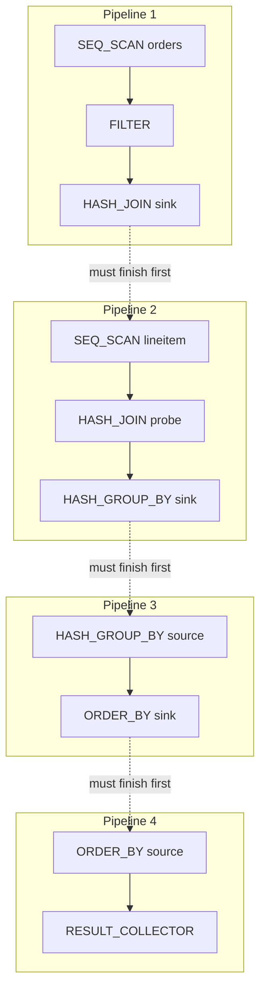
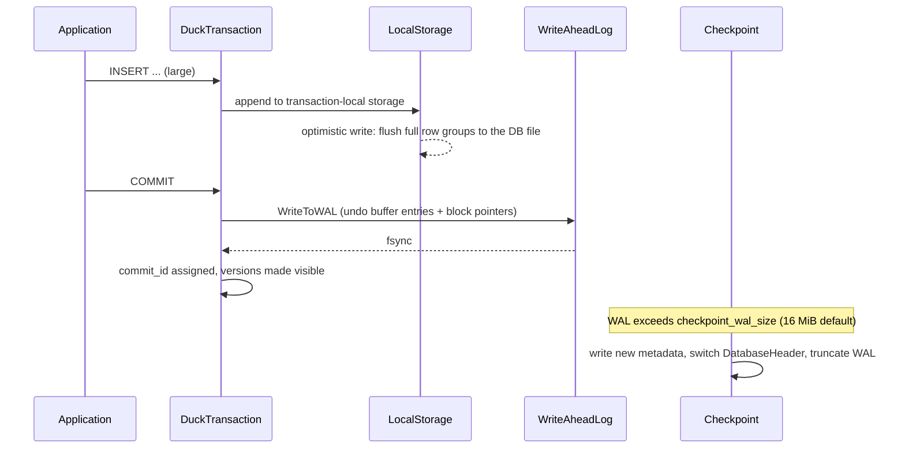

`pip install duckdb` して 3 秒後には `SELECT` が動く。サーバも起動しない。設定ファイルもない。それでいて 1 億行の Parquet を数秒で集計する。DuckDB を初めて触ったときの「速すぎて逆に不安になる」感覚には、はっきりした技術的な理由があります。

本記事では DuckDB を <strong>「使い方」ではなく「作り」から</strong> 読み解きます。ベクトル化実行エンジンのデータ表現、push ベースのパイプライン、exchange 演算子を持たない並列化、単一ファイルに閉じた列指向ストレージ、HyPer 系 MVCC、そして ART インデックス — それぞれについて、実際に [`duckdb/duckdb`](https://github.com/duckdb/duckdb) のどのファイルの何という構造体がその役割を担っているかまで踏み込みます。

> <strong>喫茶店のたとえで先に結論</strong>
>
> 行指向の OLTP データベースが「注文が入るたびに 1 皿ずつ作るカウンター」だとすれば、DuckDB は <strong>「同じ料理を 2048 皿ぶんまとめて仕込む厨房」</strong> です。
>
> - <strong>ベクトル化</strong>: 1 行ずつ「これは int か? NULL か?」と判定し直すのをやめ、同じ型の 2048 個を 1 回の判定でまとめて処理する。
> - <strong>push ベース</strong>: 客（上位演算子）が「次の 1 皿ください」と呼ぶのではなく、厨房（下位演算子）ができた皿を配膳台に押し出していく。
> - <strong>モーセル駆動</strong>: 仕込みの単位（row group）を小分けにして、手の空いた料理人が次の分を自分で取りに行く。誰かに割り当てられるのを待たない。
> - <strong>列指向 + 圧縮</strong>: 「食材を料理ごとに箱詰め」ではなく「食材の種類ごとに箱詰め」する。同じものが並ぶので、箱ごと圧縮できる。
>
> この 4 つが噛み合ったとき、シングルノードの分析クエリはあきれるほど速くなります。

## 1. DuckDB とは何か — 位置づけを一言で

DuckDB は Mark Raasveldt と Hannes Mühleisen が CWI (Centrum Wiskunde & Informatica) で始めた、<strong>組み込み型の分析用（OLAP）データベース</strong>です。設計上のポジションは、次の 2 軸で理解するのがいちばん早い。

| | トランザクション処理 (OLTP) | 分析処理 (OLAP) |
| --- | --- | --- |
| <strong>クライアント・サーバ</strong> | PostgreSQL, MySQL | Snowflake, ClickHouse, BigQuery |
| <strong>組み込み（プロセス内）</strong> | SQLite | <strong>DuckDB</strong> |

「SQLite の OLAP 版」という説明はここから来ています。ただしこれは <strong>使われ方</strong> の類似であって、<strong>中身</strong> はまったく別物です。SQLite は行指向・B木・1 行ずつのバイトコード VM。DuckDB は列指向・ベクトル化・push ベース実行。共有しているのは「ライブラリとしてホストプロセスにリンクされる」という配置だけです。

<DuckDBArchitecture />

この配置がもたらす最大の帰結は <strong>ワイヤプロトコルもシリアライズも介在しない</strong> ことです。Python から 1 億行の結果を受け取るとき、PostgreSQL ならエンコードして TCP を通して再デコードする必要がある。DuckDB は同じプロセスのヒープ上で完結します。

ただし「ゼロコピー」は方向によって意味が違います。<strong>入力方向</strong>は、数値列がメモリ上に連続配置されていれば文字どおりゼロコピーです。DuckDB は呼び出し側のバッファをそのまま指すだけで、1 バイトも詰め替えません（pandas と Arrow がそれぞれどの経路を通るかは 10.2 で見ます）。<strong>結果方向</strong>はそうはいきません。`fetchdf()` は列ごとに NumPy 配列を新しく確保して詰め替え、`to_arrow_table()` は自前のバッファに書き出します。エンジン内部の列は圧縮されたままのことがあり、レイアウトも Python 側が期待するものとは違うからです。消えているのは <strong>シリアライズとプロセス間通信</strong> であって、メモリコピーそのものではありません。

## 2. ベクトル化実行 — DuckDB のいちばん深い層

### 2.1 3 つの実行モデル

クエリエンジンが 1 回の演算子呼び出しで何行処理するかには、大きく 3 つの流儀があります。

| モデル | 1 呼び出しの粒度 | 代表 | 弱点 |
| --- | --- | --- | --- |
| <strong>タプル単位</strong> (Volcano) | 1 行 | PostgreSQL, SQLite | 関数呼び出しと分岐のオーバーヘッドが行数に比例 |
| <strong>列単位</strong> | 列まるごと | MonetDB, 初期の Pandas | 中間結果が巨大になり DRAM へ落ちる |
| <strong>ベクトル単位</strong> | N 行のバッチ | <strong>DuckDB</strong>, Vectorwise, Velox | — |

ベクトル単位は、この 2 つの中間を狙った設計です。理論的背景は Boncz・Zukowski・Nes の "MonetDB/X100: Hyper-Pipelining Query Execution" (CIDR 2005) にあり、DuckDB はその直系の子孫にあたります。

### 2.2 なぜ 2048 なのか

DuckDB のベクトルサイズは [`src/include/duckdb/common/vector_size.hpp`](https://github.com/duckdb/duckdb/blob/main/src/include/duckdb/common/vector_size.hpp) にあります。

```cpp
// duckdb/common/vector_size.hpp
//! The default standard vector size
#define DEFAULT_STANDARD_VECTOR_SIZE 2048U

//! The vector size used in the execution engine
#ifndef STANDARD_VECTOR_SIZE
#define STANDARD_VECTOR_SIZE DEFAULT_STANDARD_VECTOR_SIZE
#endif

#if (STANDARD_VECTOR_SIZE & (STANDARD_VECTOR_SIZE - 1) != 0)
#error The vector size must be a power of two
#endif
```

注目すべきは、これが <strong>実行時の設定ではなくコンパイル時定数</strong> であることです。マクロなので、テンプレート引数にも、固定長配列の宣言にも使える。`SelectionVector sel(STANDARD_VECTOR_SIZE);` のようなスタック上の固定長バッファが、エンジン中に散りばめられています。

2048 という数字の根拠は「中間結果を CPU キャッシュに閉じ込める」ことです。

<VectorSizeTradeoff />

8 バイト型なら 2048 × 8 = 16 KB。典型的な L1 データキャッシュが 32〜48 KB、L2 が数百 KB〜数 MB なので、演算子の入出力と作業用バッファを合わせても L2 に収まります。一方で 2048 行あれば、演算子呼び出し 1 回あたりのオーバーヘッド（仮想関数ディスパッチ、型スイッチ、状態の読み込み）は 1 行あたり 1/2048 に薄まる。

DuckDB は `STANDARD_VECTOR_SIZE=512` や `=2` といった値でもビルドできるようになっていて、テストスイートは小さいベクトルサイズでも走ります（コード中に `#if STANDARD_VECTOR_SIZE > 2` のような分岐が現れるのはこのため）。

### 2.3 DataChunk — 「2048 行 × N 列」の箱

演算子の間を流れる単位が `DataChunk` です。これは <strong>列の集合</strong> であって、行の集合ではありません。

```cpp
// duckdb/common/types/data_chunk.hpp — https://github.com/duckdb/duckdb/blob/main/src/include/duckdb/common/types/data_chunk.hpp
class DataChunk {
public:
	//! The vectors owned by the DataChunk.
	vector<Vector> data;
	// ...
};
```

`DataChunk` は本質的に `vector<Vector>` と行数（cardinality）だけを持つ薄い箱で、重要な仕事はすべて `Vector` の側にあります。

そして `DataChunk::Slice()` を見ると、DuckDB の設計思想がよく分かります。フィルタが行を「削る」とき、値のコピーは起きません。合致した行の添字を並べた `SelectionVector` を作り、各 `Vector` にその選択を <strong>被せる</strong> だけです。

### 2.4 Vector は 1 つの姿を持たない

ここが DuckDB を読む上でいちばん重要な箇所です。`Vector` は「2048 個の値が並んだ配列」ではありません。<strong>同じ論理データの複数の物理表現</strong> を切り替えられるオブジェクトです。

```cpp
// duckdb/common/enums/vector_type.hpp — https://github.com/duckdb/duckdb/blob/main/src/include/duckdb/common/enums/vector_type.hpp
enum class VectorType : uint8_t {
	FLAT_VECTOR,       // Flat vectors represent a standard uncompressed vector
	FSST_VECTOR,       // Contains string data compressed with FSST
	CONSTANT_VECTOR,   // Constant vector represents a single constant
	DICTIONARY_VECTOR, // Dictionary vector represents a selection vector on top of another vector
	SEQUENCE_VECTOR,   // Sequence vector represents a sequence with a start point and an increment
	SHREDDED_VECTOR    // Shredded variant vector
};
```

たとえば `SELECT * FROM t WHERE country = 'JP'` を考えます。

- 定数 `'JP'` は <strong>CONSTANT_VECTOR</strong>。1 個の値しか実体化せず、比較演算子は「1 回計算して 2048 行に配る」最適化ができる。
- `country` 列が辞書圧縮されていれば、スキャンは <strong>DICTIONARY_VECTOR</strong> をそのまま返す。国名の文字列は辞書エントリぶんしか存在しない。
- FSST 圧縮された文字列列は <strong>FSST_VECTOR</strong> のまま演算子に渡され、必要になるまで伸長されない。
- `range(0, 1000000)` や rowid 列は <strong>SEQUENCE_VECTOR</strong>。start と increment の 2 つの整数だけ。

下のプレイグラウンドで型を切り替えてみてください。同じ「2048 行の論理データ」が、物理的には 1 個の値だったり、添字の列だったり、2 個の整数だったりすることが見えます。

<DuckDBVectorPlayground />

### 2.5 UnifiedVectorFormat — 抽象化の「妥協点」

物理表現が 6 通りあるということは、演算子を書くたびに 6 通りの分岐を書くのか? もちろんそうはなりません。`UnifiedVectorFormat` が「どの表現でも同じコードで読める」共通ビューを提供します。

```cpp
// duckdb/common/vector/unified_vector_format.hpp — https://github.com/duckdb/duckdb/blob/main/src/include/duckdb/common/vector/unified_vector_format.hpp
struct UnifiedVectorFormat {
	const SelectionVector *sel;
	const_data_ptr_t data;
	ValidityMask validity;
	SelectionVector owned_sel;
	PhysicalType physical_type;
	// ...
};
```

読み手のコードは常にこの形になります。

```cpp
UnifiedVectorFormat vdata;
input.ToUnifiedFormat(vdata);
auto values = UnifiedVectorFormat::GetData<int32_t>(vdata);

for (idx_t i = 0; i < count; i++) {
	auto idx = vdata.sel->get_index(i);   // 論理行 i → data の添字
	if (!vdata.validity.RowIsValid(idx)) {
		continue;                          // NULL
	}
	// values[idx] が値
}
```

- FLAT なら `sel` は恒等写像（`FlatVector::IncrementalSelectionVector()`）。
- CONSTANT なら `sel` は全要素 0 のベクトル（`ConstantVector::ZeroSelectionVector()`）で、`data[0]` に落ちる。
- DICTIONARY なら `sel` が辞書への添字そのもの。

ここが <strong>妥協点</strong> だというのは、`ToUnifiedFormat()` が万能ではないからです。

```cpp
// src/common/types/vector.cpp — https://github.com/duckdb/duckdb/blob/main/src/common/types/vector.cpp
void Vector::ToUnifiedFormat(UnifiedVectorFormat &format) const {
	format.physical_type = GetType().InternalType();
	auto vtype = GetVectorType();
	if (vtype != VectorType::FLAT_VECTOR && vtype != VectorType::CONSTANT_VECTOR &&
	    vtype != VectorType::DICTIONARY_VECTOR) {
		// FSST/SEQUENCE/SHREDDED: flatten first so the buffer can provide unified format
		Flatten();
	}
	Buffer().ToUnifiedFormat(format);
}
```

FSST や SEQUENCE は `sel` + `data` の形に落とせないので、<strong>先に `Flatten()` して 2048 個を実体化してしまう</strong>。つまり `ToUnifiedFormat()` を呼んだ瞬間、圧縮表現の恩恵は消えます。だから DuckDB のホットな演算子（比較、ハッシュ、集約）は、`ToUnifiedFormat` の汎用パスとは別に、CONSTANT や DICTIONARY を検出する <strong>専用の高速パス</strong> を持っています。汎用性と速度のトレードオフが、ここに明示的に現れているわけです。

### 2.6 string_t — 16 バイトに詰め込まれた設計判断

文字列型の表現は [`src/include/duckdb/common/types/string_type.hpp`](https://github.com/duckdb/duckdb/blob/main/src/include/duckdb/common/types/string_type.hpp) にあります。

```cpp
// duckdb/common/types/string_type.hpp
struct string_t {
	static constexpr idx_t PREFIX_BYTES = 4 * sizeof(char);
	static constexpr idx_t INLINE_BYTES = 12 * sizeof(char);
	// ...
private:
	union {
		struct {
			uint32_t length;
			char prefix[4];
			char *ptr;
		} pointer;
		struct {
			uint32_t length;
			char inlined[12];
		} inlined;
	} value;
};
```

<StringTLayout />

12 バイト以下なら構造体の中に完全に収まり、ヒープアクセスがゼロになる。13 バイト以上でも <strong>先頭 4 バイトのプレフィックスは構造体側にコピーされている</strong>。この配置が効いてくるのが等値比較です。

```cpp
// duckdb/common/types/string_type.hpp — string_t::StringComparisonOperators の内部
struct StringComparisonOperators {
	static inline bool Equals(const string_t &a, const string_t &b) {
		// (DUCKDB_DEBUG_NO_INLINE 用の分岐は省略)
		uint64_t a_bulk_comp = Load<uint64_t>(const_data_ptr_cast(&a));
		uint64_t b_bulk_comp = Load<uint64_t>(const_data_ptr_cast(&b));
		if (a_bulk_comp != b_bulk_comp) {
			// Either length or prefix are different -> not equal
			return false;
		}
		// they have the same length and same prefix!
		a_bulk_comp = Load<uint64_t>(const_data_ptr_cast(&a) + 8u);
		b_bulk_comp = Load<uint64_t>(const_data_ptr_cast(&b) + 8u);
		if (a_bulk_comp == b_bulk_comp) {
			// either they are both inlined (so compare equal) or point to the
			// same string (so compare equal)
			return true;
		}
		// ...
	}
	// ...
};
```

最初の 8 バイト（`length` 4 バイト + `prefix` 4 バイト）を <strong>1 つの `uint64_t` として一括比較</strong> する。長さが違うか、先頭 4 文字が違えば、ここで即座に false が返る。実際のワークロードでは不一致の圧倒的多数がこの 1 命令で決着します。

さらに次の 8 バイトも同じように一括比較する。ここが一致すれば「両方ともインライン文字列で中身が同じ」か「同じポインタを指している」かのどちらかなので、<strong>12 バイト以下の文字列の等値判定はロード 4 回・比較 2 回で完結</strong> します。ポインタを追ってキャッシュミスを起こすのは、長さもプレフィックスも一致した長い文字列だけ。

比較演算 (`GreaterThan`) でも同じ仕掛けが使われますが、こちらは <strong>バイトオーダの入れ替え</strong> が入ります。

```cpp
uint32_t a_prefix = Load<uint32_t>(const_data_ptr_cast(left.GetPrefix()));
uint32_t b_prefix = Load<uint32_t>(const_data_ptr_cast(right.GetPrefix()));
if (a_prefix != b_prefix) {
	return BSwapIfLE(a_prefix) > BSwapIfLE(b_prefix);
}
```

リトルエンディアン機で 4 バイトを `uint32_t` として読むとバイト順が逆転してしまうので、`BSwapIfLE` で戻してから比較する。これで <strong>4 文字ぶんの辞書順比較が整数 1 回の比較になる</strong>。

### 2.7 SelectionVector と ValidityMask

`SelectionVector` は単なる `sel_t*`（`uint32_t*`）のラッパーです。しかし DuckDB の実行モデル全体がこれに乗っています。

- <strong>フィルタ</strong>: 合致した行の添字を書く。
- <strong>ハッシュ結合</strong>: マッチした probe 側の行と build 側の行を、2 本の選択ベクトルで表す。

（ソートだけは例外で、選択ベクトルではなくソートキーそのものを並べ替えます — 6.6 で扱います。）

`ValidityMask` は NULL を表すビットマップです。1 ビット = 1 行で、<strong>ビットが立っている = 有効（NULL でない）</strong>。注目すべきは「NULL が 1 つもない場合は `ValidityMask` の実体を確保しない（`GetData()` が `nullptr` を返す）」という最適化で、`CannotHaveNull()`（旧称 `AllValid()`）が真なら NULL チェックのループごと省略できます。実データの多くの列は NULL を含まないので、この分岐は極めてよく当たります。

### 2.8 `Value` と `Vector` — 混同すると読めなくなる二つの表現

ソースを読み始めるとすぐ `Value` という型に出会いますが、これは `Vector` の 1 要素版ではありません。<strong>`Vector` は実行エンジンの表現、`Value` はそれ以外全部の表現</strong> だと思ってください。定数畳み込み、統計の min/max、`SET` の設定値、カタログのデフォルト値、そして後述する実行時フィルタの境界値 — これらはすべて `Value` です。型タグと値を 1 個ずつ抱えた、素直だが太いオブジェクトです。

境界を跨ぐ関数は決まっています。`Vector::GetValue(i)` は <strong>1 行を箱詰めして `Value` を作る</strong>。逆向きは `Vector::Reference(const Value &, count_t)` や `ConstantVector` 化。ホットループで `GetValue()` を呼んだら負けで、DuckDB のコードでそれが現れるのは「Finalize で 1 個だけ取り出す」ような場所に限られます。

キャストも 2 系統あります。`Value` に対しては `value.DefaultTryCastAs(type)` が失敗しうる結果を返し、`Vector` に対しては `BoundCastExpression::AddCastToType()` が <strong>式ツリーにキャスト演算子を挿入</strong> して、実行時に `CastFunctionSet` から引いた関数がベクトル単位で走る。キャストが「失敗しうる第一級の演算」であることは、実行時フィルタの設計にも影響します — 結合フィルタの押し下げが整数キャストしか跨げないのも、`RuntimeFilterCastMode { DEFAULT_CAST, TRY_CAST }` で「そのキャストは失敗しうるか」を覚えているのも、このためです。

そして関数解決は `FunctionBinder` の仕事です。同名関数の候補集合に対して <strong>暗黙キャストのコストで最良の 1 つを選ぶ</strong>。extension が登録したスカラ関数も組み込み関数もこの同じ経路を通るので、後述の「extension がカタログに関数を登録する」は、そのままオーバーロード解決の候補に加わるという意味になります。

## 3. push ベース実行モデル

2 節ではデータがどう表現されているかを見ました。ここからは、そのデータが演算子の間をどう動くかを見ます。

### 3.1 pull から push へ

古典的な Volcano モデルでは、根の演算子が `next()` を呼び、それが再帰的に葉まで降りていきます。上位が下位から <strong>引く (pull)</strong>。

DuckDB は逆向きです。データは <strong>下から上へ押し込まれ (push)</strong>、演算子は 3 つの役割のいずれかを演じます。

| 役割 | インターフェース | 意味 |
| --- | --- | --- |
| <strong>Source</strong> | `GetData()` | パイプラインの起点。データを産む。 |
| <strong>Operator</strong> | `Execute()` | 中間。chunk を受け取り chunk を返す。状態は持っても有界（下記）。 |
| <strong>Sink</strong> | `Sink()` / `Combine()` / `Finalize()` | パイプラインの終点。全入力を溜め込む。 |

「有界」というのは「無制限には溜め込まない」の意味です。フィルタや結合のように <strong>出力の行数が入力から変わる</strong> 演算子は `CachingPhysicalOperator` を継承します。該当するのは `PhysicalFilter`、`PhysicalJoin`、`PhysicalCrossProduct`、`PhysicalRecursiveCTEKeyJoin` の 4 つで、射影 `PhysicalProjection` は含まれません。これらは小さい出力 chunk を `cached_chunk` に貯め、2048 行に近づけてから下流へ流します（`CanCacheType()` が LIST / MAP / ARRAY / VARIANT を除外する）。その結果、source を読み切ったあとも演算子の中に行が残り得る。だからパイプラインには Source / Operator / Sink に加えて 4 つ目の呼び出し口 `FinalExecute()` があり、`PipelineExecutor::TryFlushCachingOperators()` が最後にそれを吸い出します。

同じ物理演算子が、パイプラインによって役割を変えるのが肝です。`PhysicalHashJoin` は build 側パイプラインでは <strong>Sink</strong>、probe 側では <strong>Operator</strong>、そして build 側の行を出力に流す結合型（`PropagatesBuildSide` が真になる RIGHT / FULL OUTER / RIGHT_SEMI / RIGHT_ANTI）のときと、メモリを溢れて外部結合になったときには <strong>Source</strong> です。コード上はこの 3 役が静的に分かれておらず、`IsSource()` は無条件に true を返したうえで、`GetDataInternal()` が `!sink.external && !PropagatesBuildSide(join_type)` なら即 `FINISHED` を返して何もしません。

### 3.2 パイプラインとパイプラインブレーカ

パイプラインの切れ目は <strong>パイプラインブレーカ</strong>、つまり「全入力を見終わるまで 1 行も出力できない演算子」の位置に入ります。ハッシュ結合の build 側、ハッシュ集約、ソート、ウィンドウ関数などがこれにあたります。



同じ sink を共有するパイプラインの集合を `MetaPipeline` と呼びます。

```cpp
// duckdb/parallel/meta_pipeline.hpp — https://github.com/duckdb/duckdb/blob/main/src/include/duckdb/parallel/meta_pipeline.hpp
//! MetaPipeline represents a set of pipelines that all have the same sink
class MetaPipeline : public enable_shared_from_this<MetaPipeline> {
	// ...
};
```

たとえば `UNION ALL` の 2 本の枝は別々のパイプラインですが、同じ sink に注ぎ込むので 1 つの MetaPipeline に属します（`PhysicalUnion::BuildPipelines` が `meta_pipeline.CreateUnionPipeline()` を呼ぶ）。逆に sink を跨ぐと `CreateChildMetaPipeline()` で別の MetaPipeline になるので、上の図の 4 本は 4 つの MetaPipeline が親子で繋がった形です。

<DuckDBPipelineVisualizer />

### 3.3 HAVE_MORE_OUTPUT — 出力が膨らむとき

push ベースには pull ベースにない厄介さがあります。<strong>1 つの入力 chunk が 2048 行を超える出力を生む</strong> 場合です。ハッシュ結合で 1 行が 100 行にマッチしたら、2048 行の入力が 20 万行の出力になり得る。

DuckDB の答えが `OperatorResultType` です。

```cpp
// duckdb/common/enums/operator_result_type.hpp — https://github.com/duckdb/duckdb/blob/main/src/include/duckdb/common/enums/operator_result_type.hpp
// 実際のソースでは列挙子は 1 行で並び、意味は直前のブロックコメントに書かれている。
// 以下の行コメントは筆者による要約。
enum class OperatorResultType : uint8_t {
	NEED_MORE_INPUT,   // この入力は使い切った。次をくれ
	HAVE_MORE_OUTPUT,  // 同じ入力からまだ出せる。もう一度呼んでくれ
	FINISHED,          // パイプライン全体が終了。この演算子も同じパイプラインの他の演算子ももう呼ばれない（LIMIT 到達など）
	BLOCKED            // 非同期待ち。あとで再開してくれ（中間演算子は返さない — 3.4）
};
```

`HAVE_MORE_OUTPUT` を受け取った `PipelineExecutor` は、その演算子を `in_process_operators` スタックに積みます。

```cpp
// duckdb/parallel/pipeline_executor.hpp — https://github.com/duckdb/duckdb/blob/main/src/include/duckdb/parallel/pipeline_executor.hpp
//! If the stack of in_process_operators is empty, we fetch from the source instead
stack<idx_t> in_process_operators;
```

スタックが空でない限り、source には戻らず <strong>同じ入力 chunk で同じ演算子を再入</strong> します。パイプラインに複数の膨張演算子が並んでいても、スタックが「どこまで戻ればいいか」を覚えているので正しく動く。この 1 本のスタックが、push モデルにおける「途中再開」の全体を担っています。

### 3.4 BLOCKED — 実行を止めずに I/O を待つ

`BLOCKED` は比較的新しく入った状態で、S3 上の Parquet を読むような <strong>ネットワーク I/O を伴うクエリ</strong> のために存在します。

pull モデルなら「ソケットで待つ」で済みますが、それではワーカースレッドが 1 本潰れます。DuckDB では source や sink が `BLOCKED` を返すと、`PipelineExecutor` は `INTERRUPTED` を上に伝え、`PipelineTask` は `TASK_BLOCKED` を返してスケジューラに <strong>スレッドを返上</strong> します。I/O が完了したら、`InterruptState` に握られていたタスクへのコールバックが発火して、タスクが再スケジュールされる。

```cpp
// src/parallel/pipeline_executor.cpp — https://github.com/duckdb/duckdb/blob/main/src/parallel/pipeline_executor.cpp
// SINK INTERRUPT
if (result == OperatorResultType::BLOCKED) {
	remaining_sink_chunk = true;
	return PipelineExecuteResult::INTERRUPTED;
}
```

`remaining_sink_chunk` のようなフラグが `PipelineExecutor` に大量にあるのは、この <strong>再入可能性 (re-entrancy)</strong> を確保するためです。中断されたパイプラインが正確に同じ位置から再開できるよう、「どこまで進んだか」がすべて明示的なメンバ変数として保持されている。ステートマシンを手で書き下したコードなので読むのは骨が折れますが、コルーチンを使わずに非同期性を実現するための代償です。

## 4. モーセル駆動並列化 — exchange 演算子を捨てる

### 4.1 従来のやり方の問題

伝統的な並列 DB は <strong>exchange 演算子</strong>（別名 Volcano 並列化）でプランを並列化します。プランの各所に「データを N 個のパーティションに撒く」演算子を挿入し、下流を N 並列で走らせる。

これには 3 つの問題があります。

1. <strong>並列度をプラン時に決め打ちする</strong>。実行中に空いた CPU を使えない。
2. <strong>データ偏りに弱い</strong>。1 つのパーティションだけ重いと全体がそれに引きずられる。
3. <strong>撒く（materialize する）コスト</strong>が高い。

### 4.2 モーセル駆動

DuckDB は Leis らの "Morsel-Driven Parallelism" (SIGMOD 2014) を採用しています。考え方はシンプルです。

- 入力を <strong>モーセル</strong>（小片）に分割する。テーブルスキャンでは <strong>1 モーセル = 1 row group（既定 122,880 行）</strong>。
- 各パイプラインに対して N 個の同一なタスクを起動する。
- 各タスクは <strong>グローバルなカーソルを（短いロックの下で）進めて</strong>、次のモーセルを自分で取りに行く。

コードで見ると、カーソルを進めているのは `RowGroupCollection::NextParallelScan()` です。

```cpp
// src/storage/data_table.cpp — https://github.com/duckdb/duckdb/blob/main/src/storage/data_table.cpp
idx_t DataTable::MaxThreads(ClientContext &context) const {
	idx_t row_group_size = GetRowGroupSize();
	idx_t parallel_scan_vector_count = row_group_size / STANDARD_VECTOR_SIZE;
	if (ClientConfig::GetConfig(context).verify_parallelism) {
		parallel_scan_vector_count = 1;
	}
	idx_t parallel_scan_tuple_count = STANDARD_VECTOR_SIZE * parallel_scan_vector_count;
	return GetTotalRows() / parallel_scan_tuple_count + 1;
}
```

つまり通常は「行数 ÷ row group サイズ + 1」。`verify_parallelism` を立てるとモーセルが 1 ベクトル単位まで細かくなりますが、これは並列性を検証するためのテスト専用モードです。

プランに exchange 演算子は 1 つも入りません。並列度は `Pipeline::GetMaxThreads()` が動的に決めます。

モーセルを row group 単位にしているのは、実行エンジンとストレージの都合が一致するからです。row group は列ごとに独立した `ColumnSegment` と min/max 統計を持つ最小の単位なので、モーセルを row group に揃えれば、フィルタによるセグメント丸ごとの枝刈り（後述）がタスクの割り当て単位とそのまま一致します。加えて 122,880 行は 60 ベクトルぶん — 1 回のカーソル前進あたり 60 回ぶんの仕事が取れるので、グローバルカーソルのロックがボトルネックになりません。逆に言えば、行数が row group サイズを下回るテーブルでは `MaxThreads()` が 1 を返し、テーブルスキャンは実質シングルスレッドになります。

下の可視化ではスレッド数を変えられます。注目してほしいのは、遅いスレッドが 1 本いても他がその分を食べていくところ — これが 4.1 の「データ偏りに弱い」を解いている部分です。

<DuckDBMorselVisualizer />

### 4.3 Global state と Local state の分離

モーセル駆動が成立するのは、演算子の状態が <strong>グローバル / ローカル</strong> にきれいに分離されているからです。

```cpp
// duckdb/execution/physical_operator.hpp — https://github.com/duckdb/duckdb/blob/main/src/include/duckdb/execution/physical_operator.hpp
// （source 側と sink 側は別々のセクションにある。ここでは対比のため 4 つを並べた）
virtual unique_ptr<LocalSourceState> GetLocalSourceState(ExecutionContext &context, GlobalSourceState &gstate) const;
virtual unique_ptr<GlobalSourceState> GetGlobalSourceState(ClientContext &context) const;
// ...
virtual unique_ptr<LocalSinkState> GetLocalSinkState(ExecutionContext &context) const;
virtual unique_ptr<GlobalSinkState> GetGlobalSinkState(ClientContext &context) const;
```

- <strong>Local state</strong>: そのスレッド専用。ロック不要。ハッシュ集約ならスレッドローカルなハッシュテーブル、テーブルスキャンなら現在のスキャン位置。
- <strong>Global state</strong>: 全スレッド共有。ロックまたは atomic で保護。テーブルスキャンなら「次に読む row group」のカーソル。

スレッドが仕事を終えると `Combine()` でローカル状態をグローバルへマージし、最後の 1 つが `Finalize()` を呼びます。

```text
thread 0 ─ Sink() × n ─┐
thread 1 ─ Sink() × n ─┼─ Combine() ─→ GlobalSinkState ─ Finalize() ─→ 次のパイプラインへ
thread 2 ─ Sink() × n ─┘
```

`Sink()` は毎 chunk 呼ばれるのでロックを避けたい。`Combine()` はスレッドあたり 1 回だけなのでロックしてよい。`Finalize()` は 1 回だけなので何をしてもよい。この <strong>3 段階の粒度</strong> が、ロック競合をほぼゼロに抑えます。

### 4.4 タスクの粒度

タスクは大きすぎても小さすぎても困ります。DuckDB は「1 タスクが全モーセルを食い尽くす」のを防ぐため、部分実行モードを持っています。

```cpp
// duckdb/parallel/pipeline.hpp — https://github.com/duckdb/duckdb/blob/main/src/include/duckdb/parallel/pipeline.hpp
class PipelineTask : public ExecutorTask {
	static constexpr const idx_t PARTIAL_CHUNK_COUNT = 50;
	// ...
};
```

`TaskExecutionMode::PROCESS_PARTIAL` では、`PipelineExecutor::Execute(50)` が 50 chunk（= 最大 102,400 行）処理した時点で `PipelineExecuteResult::NOT_FINISHED` を返し、`PipelineTask::ExecuteTask()` がそれを `TaskExecutionResult::TASK_NOT_FINISHED` に変換してスケジューラに制御を返します。これにより、キャンセルへの応答性と、他のクエリとの公平性が保たれます。

## 5. ストレージ — 単一ファイルに閉じた列指向

ここまでは実行時のメモリ上の話でした。ここからは、同じデータがディスク上でどう並んでいるかを見ます。実行エンジンで決めた 2048 という数字が、そのままストレージの粒度を決めていることが分かります。

### 5.1 ファイルレイアウト

DuckDB のデータベースは <strong>1 個のファイル</strong>です。先頭には固定サイズのヘッダ群が並びます。

```text
+---------------------------+  offset 0
| MainHeader (4096 B)       |  [0..8) チェックサム、offset 8 から magic "DUCK"、ライブラリのバージョン・git hash
+---------------------------+  offset 4096
| DatabaseHeader #0 (4096 B)|  iteration, meta_block, free_list, block_count, ...
+---------------------------+  offset 8192
| DatabaseHeader #1 (4096 B)|
+---------------------------+  offset 12288  (SingleFileBlockManager::BLOCK_START)
| Block 0 (256 KB)          |
| Block 1 (256 KB)          |
| ...                       |
+---------------------------+
```

`DatabaseHeader` が <strong>2 つある</strong> のが要点です。

```cpp
// duckdb/storage/storage_info.hpp — https://github.com/duckdb/duckdb/blob/main/src/include/duckdb/storage/storage_info.hpp
//! The DatabaseHeader contains information about the current state of the database. Every storage file has two
//! DatabaseHeaders. On startup, the DatabaseHeader with the highest iteration count is used as the active header. When
//! a checkpoint is performed, the active DatabaseHeader is switched by increasing the iteration count of the
//! DatabaseHeader.
struct DatabaseHeader {
	//! The iteration count, increases by 1 every time the storage is checkpointed.
	uint64_t iteration = 0;
	idx_t meta_block = 0;
	idx_t free_list = 0;
	uint64_t block_count = 0;
	idx_t block_alloc_size = 0;
	idx_t vector_size = 0;
	StorageVersion storage_compatibility = StorageVersion::INVALID;
	// ...
};
```

チェックポイントは <strong>使っていない方のヘッダに新しい状態を書き、iteration を +1 する</strong> だけ。ヘッダ 1 つは 4096 バイト（`Storage::FILE_HEADER_SIZE`。ページサイズに揃えてある。値が同じ `Storage::SECTOR_SIZE` は Direct I/O 用の別定数）で、ソースのコメントも「ディスクが <strong>ほぼ</strong>アトミックに書ける大きさ」（*written more or less atomically by the hard disk*）と控えめに表現しています。実際に安全性を担保しているのは、それに加えた <strong>書き込み順序</strong> のほうです。

```cpp
// src/storage/single_file_block_manager.cpp — https://github.com/duckdb/duckdb/blob/main/src/storage/single_file_block_manager.cpp
// We need to fsync BEFORE we write the header to ensure that all the previous blocks are written as well
handle->Sync();
// ...
auto location = active_header == 1 ? Storage::FILE_HEADER_SIZE : Storage::FILE_HEADER_SIZE * 2;
ChecksumAndWrite(context, header_buffer, location);
// switch active header to the other header
active_header = 1 - active_header;
//! Ensure the header write ends up on disk
handle->Sync();
```

「先にデータブロックを fsync → 使っていない方のヘッダスロットに書く → もう一度 fsync → `active_header` を反転」。だから書き込み途中でプロセスが死んでも、古い方の有効なヘッダが無傷で残る — <strong>シャドウページングによるアトミックなチェックポイント</strong>です。さらに各ヘッダには 8 バイトのチェックサムが付いていて、書き込みが途中で切れた場合は起動時の `CheckChecksum()` が `DataCorruptionException` で検知します。

`vector_size` と `block_alloc_size` がヘッダに書かれているのも面白い点で、異なる `STANDARD_VECTOR_SIZE` でビルドされたバイナリが誤ってファイルを開くのを防いでいます。

### 5.2 RowGroup と ColumnSegment

テーブルは `RowGroupCollection` として管理され、その中身は row group の並びです。

```cpp
// duckdb/storage/storage_info.hpp
//! The standard row group size
#define DEFAULT_ROW_GROUP_SIZE 122880ULL
```

122,880 = 60 × 2048。つまり <strong>1 row group はちょうど 60 ベクトル分</strong> です。この制約はコンパイル時に検証されています。

```cpp
// duckdb/storage/storage_info.hpp
#if (DEFAULT_ROW_GROUP_SIZE % STANDARD_VECTOR_SIZE != 0)
#error The row group size must be a multiple of the vector size
#endif
```

row group の中では、列ごとに `ColumnData` があり、その中身は `ColumnSegment` の並びです。

<RowGroupLayout />

`ColumnSegment` はブロック（既定 256 KB、[`DEFAULT_BLOCK_ALLOC_SIZE 262144ULL`](https://github.com/duckdb/duckdb/blob/main/src/include/duckdb/storage/storage_info.hpp)。うち先頭 8 バイトはチェックサムなのでペイロードは 262,136 バイト。256 KB は同時に上限 `MAX_BLOCK_ALLOC_SIZE` でもある）に載り、<strong>それぞれ独立に圧縮方式を選びます</strong>。同じ列でも、row group が違えば別の圧縮が選ばれ得る。「前半は連番だから RLE、後半はランダムだからビットパッキング」といった適応が自然に起きます。

### 5.3 ゾーンマップ — 読まずに済ませる

各セグメントは min/max 統計（`BaseStatistics`）を持ちます。`WHERE l_shipdate > DATE '1998-01-01'` に対して、`max(l_shipdate) <= '1998-01-01'` のセグメントは <strong>1 バイトも読まずに丸ごと飛ばせる</strong>。

これがいわゆるゾーンマップ / min-max インデックスですが、DuckDB はこれを「作る」のではなく、<strong>書き込みの副産物として常に持っています</strong>。各圧縮方式の圧縮状態には [`StatsWriter<T>`](https://github.com/duckdb/duckdb/blob/main/src/include/duckdb/storage/statistics/stats_writer.hpp) が埋め込まれていて、値を書きながら min/max を更新する。無圧縮パス（`string_uncompressed.hpp`）も、既存行の更新（`update_segment.cpp`）も、同じ仕掛けです。時系列データのように自然にソートされている列では、これだけで大半の I/O が消えます。

### 5.4 圧縮方式は「競争」で決まる

DuckDB の圧縮は、列に対して <strong>固定で決まっているのではなく、セグメントごとに競わせて選ばれます</strong>。

チェックポイント時、`ColumnDataCheckpointer` は物理型に対応する全候補（`DBConfig::GetCompressionFunctions(physical_type)`）について、次の 3 段階を回します。

1. `InitAnalyze` — 候補ごとの解析状態を作る
2. `Analyze(vector)` — セグメントの全ベクトルを流し、統計を取る（`false` を返したら候補から脱落）
3. `FinalAnalyze` — <strong>推定バイト数</strong> を返す

下のラボで入力パターンを変えて、どの方式が勝つか試してみてください。「連番なら RLE、ランダムならビットパッキング」という直感が、どのあたりで裏切られるかが見どころです。

そして最小値を返した候補が勝ちます。負けた候補は捨てられ、勝者だけが `InitCompression` → `Compress` → `FinalizeCompress` で実際に書き出す。<strong>実データを 2 回舐める</strong> という贅沢な設計ですが、分析ワークロードでは書き込み 1 回に対して読み出しが何百回も走るので、十分に元が取れます。

<DuckDBCompressionLab />

主要な圧縮方式を [`src/storage/compression/`](https://github.com/duckdb/duckdb/tree/main/src/storage/compression) から拾うと以下のとおり。

| 方式 | 対象 | 概要 |
| --- | --- | --- |
| <strong>Constant</strong> | 固定長数値型 + validity | 全値が同一。1 値だけ格納。VARCHAR や入れ子型には適用されない（`ConstantFun::TypeIsSupported` のホワイトリスト）。 |
| <strong>RLE</strong> | 固定長 | (値, 実行長) の並び。実行長は `uint16_t` なので 1 ラン最大 65,535 行。 |
| <strong>BitPacking</strong> | 整数 | `BITPACKING_METADATA_GROUP_SIZE`（既定では `STANDARD_VECTOR_SIZE` = 2048）値のグループごとに `CONSTANT` / `CONSTANT_DELTA` / `DELTA_FOR` / `FOR` の 4 モードを選び直す。 |
| <strong>Dictionary</strong> | 文字列 | 辞書 + ビットパックした添字。 |
| <strong>FSST</strong> | 文字列 | 頻出 1〜8 バイト列を 1 バイト記号に置換する静的シンボルテーブル。ランダムアクセス可能なまま圧縮。 |
| <strong>DICT_FSST</strong> | 文字列 | 辞書と FSST を 1 つのセグメント形式に統合。 |
| <strong>ALP / ALPRD</strong> | 浮動小数点 | 「その double は本当は 10 進小数」に賭ける方式と、賭けが外れたとき用の分割方式。 |
| <strong>Roaring</strong> | validity mask | NULL 位置のビットマップを Roaring bitmap で圧縮。 |
| <strong>Zstd</strong> | 文字列など | 汎用圧縮のフォールバック。 |

FSST (Fast Static Symbol Table) は Boncz・Neumann・Leis の VLDB 2020 論文由来で、<strong>「圧縮したまま検索できる」</strong> のが特徴です。LZ4 や Zstd はブロック単位で伸長しないと 1 行も読めませんが、FSST は 1 文字列ずつ独立に伸長できる。列指向 DB の文字列圧縮としてはこの性質が決定的に重要です。

ALP (Adaptive Lossless floating-Point, SIGMOD 2024) の発想も面白い。実世界の `DOUBLE` の多くは、価格や測定値のように <strong>本当は 10 進の小数</strong> です。`938.71` は `93871 × 10^-2` として整数で表せる。ALP は 1024 値ごとに指数 `e` と係数 `f` を選び、`value × 10^e` を整数に丸めて逆変換で一致するか検証し、成功すれば整数として FOR + ビットパックします。外れ値は例外リストに逃がす。

```cpp
// duckdb/storage/compression/alp/alp_constants.hpp — https://github.com/duckdb/duckdb/blob/main/src/include/duckdb/storage/compression/alp/alp_constants.hpp
class AlpConstants {
public:
	static constexpr uint32_t ALP_VECTOR_SIZE = 1024;
	static constexpr uint32_t RG_SAMPLES = 8;
	static constexpr uint16_t SAMPLES_PER_VECTOR = 32;
	// We calculate how many equidistant vector we must jump within a rowgroup
	static constexpr uint32_t RG_SAMPLES_DUCKDB_JUMP = (DEFAULT_ROW_GROUP_SIZE / RG_SAMPLES) / STANDARD_VECTOR_SIZE;
	// ...
};
```

`RG_SAMPLES = 8`、`SAMPLES_PER_VECTOR = 32` という定数から分かるとおり、ALP は row group 全体を舐めるのではなく <strong>等間隔に 8 ベクトルを選び、そこから 32 値ずつサンプリング</strong> します。ただしこの 8 × 32 = 256 値が使われるのは指数・係数の候補を絞り込む `FindTopKCombinations` だけで、最終的なサイズ推定はそのあと <strong>8 本の完全なサンプルベクトル（最大 1024 値ずつ）を実際に圧縮して</strong> 求めます。row group をサンプリングし、次にベクトルをサンプリングする二段構えで、解析コストと代表性を両立させる設計です。

### 5.5 バッファマネージャ

DuckDB は <strong>メモリより大きいデータを扱えます</strong>。これを支えているのが `BufferManager` です。

- ブロックは `BlockHandle` として管理され、`Pin()` すると物理メモリに載り、`Unpin()` すると退避候補になる。
- メモリ上限（既定はシステムの<strong>利用可能</strong>メモリの 80%。cgroup も考慮される）を超えると退避が走る。退避対象の選び方は厳密な LRU ではなく、<strong>Unpin されたブロックを並行キューに追加していく FIFO</strong> です。ブロックが再び Pin → Unpin されると新しいエントリが末尾に積まれ、古いエントリはシーケンス番号の不一致で「死んだノード」として読み飛ばされる — これがロックを取らない LRU 近似の正体です（`EvictionQueue::Purge()` のコメントも *we want to keep the LRU characteristic alive* と言っています）。
- キューは 1 本ではなく <strong>退避コストの順に 3 段</strong>あり、`BLOCK` / `EXTERNAL_FILE`（捨てるだけで済むので最初）、`MANAGED_BUFFER`（書き出しが要るので次）、`TINY_BUFFER`（最後の手段）の順に探されます。
- 永続ブロックは <strong>データベースファイルへ書き戻す（あるいは既に書かれているので捨てる）</strong>。一時ブロック（ハッシュテーブル、ソートバッファ）は <strong>`temp_directory` へ書き出す</strong>。

`MemoryTag`（`BASE_TABLE`、`HASH_TABLE`、`ORDER_BY`、`TRANSACTION` など）でメモリ使用が分類されており、`duckdb_memory()` テーブル関数で内訳を覗けます。

## 6. 重い演算子 — 集約・結合・ソート・ウィンドウ

ここからはパイプラインブレーカ — ハッシュ集約、ハッシュ結合、ソート、ウィンドウ関数 — を見ていきます。いずれも「入力を全部受け取ってからでないと 1 行も出せない」以上、<strong>メモリを超えたときにどうするか</strong> を自分で解かなければなりません。エンジンのなかでとくに込み入った部分です。4 つの演算子の合間に、そのために共有されている部品 — メモリの配分役と、ハッシュテーブルのエントリ表現 — も挟みます。

### 6.1 基数分割ハッシュ集約

`GROUP BY` の実装は [`src/execution/radix_partitioned_hashtable.cpp`](https://github.com/duckdb/duckdb/blob/main/src/execution/radix_partitioned_hashtable.cpp) にあります。名前のとおりハッシュの一部のビットでパーティションを決めますが、使うのは最上位ビットではありません。

```cpp
// duckdb/common/radix_partitioning.hpp — https://github.com/duckdb/duckdb/blob/main/src/include/duckdb/common/radix_partitioning.hpp
//! 4096 partitions ought to be enough to go out-of-core properly
static constexpr const idx_t MAX_RADIX_BITS = 12;

//! Radix bits begin after uint16_t because these bits are used as salt in the aggregate HT
static inline constexpr idx_t Shift(idx_t radix_bits) {
	return (sizeof(hash_t) - sizeof(uint16_t)) * 8 - radix_bits;   // = 48 - radix_bits
}
```

つまりパーティション番号に使われるのは <strong>上位 16 ビットのすぐ下にある `radix_bits` ビット</strong>。上位 16 ビットを空けてあるのは、そこがハッシュテーブルのソルト（後述 6.2）として使われるからです。もし両者が同じビットを使っていたら、1 パーティション内の全エントリがまったく同じソルトを持つことになり、ソルトによる事前フィルタが完全に無意味になります。

ただし `MAX_RADIX_BITS = 12`（4096 パーティション）は基数分割の枠組み全体の上限で、ハッシュ集約が実際に使うのはずっと少ない。集約側の上限は `RadixHTConfig::MAXIMUM_FINAL_SINK_RADIX_BITS = 8`（256 パーティション）で、行が太いとさらに削られます（`ROW_WIDTH_THRESHOLD_ONE = 32` バイト<strong>以上</strong>で 1 ビット、`ROW_WIDTH_THRESHOLD_TWO = 64` バイト<strong>以上</strong>で 2 ビット）。コメントにあるとおり「キャッシュミスが手に負えなくなる」からです。

<RadixPartitionDiagram />

この分割には 2 つの意味があります。

1. <strong>並列化</strong>: 同じグループキーは必ず同じパーティションに落ちるので、パーティション同士は完全に独立。Finalize でパーティション間の同期が要らない。
2. <strong>溢れ出しの単位</strong>: メモリが逼迫したら「1 度に 1 パーティションだけメモリに載せ、残りはディスク」で処理できる。

メモリ圧の検知は `MaybeRepartition()` が担っています。

```cpp
// src/execution/radix_partitioned_hashtable.cpp
const auto total_size =
    aggregate_allocator_size + ht.GetPartitionedData().SizeInBytes() + ht.Capacity() * sizeof(ht_entry_t);
if (total_size > gstate.GetThreadLimit()) {
	// We're over the thread memory limit
	// ...
}
```

スレッドあたりのメモリ上限を超えると、`SetRadixBitsToExternal()` が呼ばれて外部モードに入り、パーティション数を増やして（`Repartition()`）1 パーティションあたりのサイズを下げます。パーティションが小さくなれば、それぞれは確実にメモリに収まる。

さらに新しい DuckDB は <strong>集約状態そのものの溢れ出し</strong>（`AggregateStateSpilling`）も持ちます。`string_agg` や `list` のように状態が巨大になる集約では、行データを溢れさせてもアリーナアロケータが残ってしまう。そこで状態を `ColumnDataCollection` に「エクスポート」してアリーナを解放し、Finalize 時に「インポート」して戻すという操作が入ります。

基数分割と溢れ出しに加えて、いまの DuckDB のハッシュ集約はもう一段 <strong>適応的</strong>です。各スレッドは意図的に小さなハッシュテーブルで始め、HyperLogLog で「実際の異なりキー数」を数えながら、1,048,576 行（`RadixHTLocalSinkState::ADAPTIVITY_THRESHOLD`）を処理した時点で `DecideAdaptation()` を呼びます。

- 推定ユニーク率が 95%（`SKIP_LOOKUP_UNIQUE_PERCENTAGE_THRESHOLD`）を超える — つまり「ほとんど集約されない」なら、<strong>ハッシュテーブルの探索をやめて追記だけにし</strong>、重複排除を GetData フェーズに丸ごと先送りする（`ht.SkipLookups()`）。
- 逆に「HT がもっと大きければ倍以上重複を潰せた」と分かれば、容量を上げて張り直す。

どちらの判断も <strong>データを見てから</strong> 行われる。カーディナリティ推定（後述 8.3）が外れても、実行エンジン側が自力で立て直せるようになっているわけです。なお上の `GetThreadLimit()` も固定値ではなく、`TemporaryMemoryManager`（後述 6.4）が割り当てた予約量に連動して動きます。

（ただしこの適応が働くのは 3 スレッド以上のときだけです。`GROW_STRATEGY_THREAD_THRESHOLD = 2` 以下なら DuckDB は「育てる」戦略を採り、`SinkCapacity()` は適応モードの 32,768 ではなく 262,144 で始めて、`DecideAdaptation()` は一度も呼ばれません。）

### 6.2 ht_entry_t — ポインタの空きビットを使い切る

ハッシュテーブルのエントリは 64 ビット 1 つです。

```cpp
// duckdb/execution/ht_entry.hpp — https://github.com/duckdb/duckdb/blob/main/src/include/duckdb/execution/ht_entry.hpp
struct ht_entry_t {
public:
	//! Upper 16 bits are salt, lower 48 bits are the pointer
	static constexpr const hash_t SALT_MASK = 0xFFFF000000000000;
	static constexpr const hash_t POINTER_MASK = 0x0000FFFFFFFFFFFF;
	// ...
private:
	hash_t value;
};
```

x86-64 のユーザ空間ポインタは実質 48 ビットしか使わないので、<strong>上位 16 ビットが空いている</strong>。DuckDB はそこにハッシュの一部（<strong>ソルト</strong>）を詰め込みます。

線形探索でスロットを見るとき、まずソルトを比較する。違えば <strong>ポインタを辿らずに次のスロットへ</strong> 進める。ハッシュテーブルの探索でいちばん高くつくのは「ポインタを追った先でキャッシュミス」なので、16 ビットの事前フィルタで偽陽性を 1/65536 に落とせるのは大きい。

（Android では仮想アドレス空間の都合でこの最適化が無効化されており、`DUCKDB_DISABLE_POINTER_SALT` でソルトなしに切り替わります。ソースのコメントに残っている愚痴が実に人間くさい。）

もう一つの但し書きとして、ソルト比較はハッシュテーブルが十分に大きいときだけ有効になります。

```cpp
// duckdb/execution/join_hashtable.hpp — https://github.com/duckdb/duckdb/blob/main/src/include/duckdb/execution/join_hashtable.hpp
//! only compare salts with the ht entries if the capacity is larger than 8192 so that it does not fit into the CPU
//! cache
static constexpr const idx_t USE_SALT_THRESHOLD = 8192;
```

テーブルが L2 に収まる程度なら、そもそもポインタを追ってもキャッシュミスしない。事前フィルタのコストのほうが高くつくので、`JoinHashTable::UseSalt()` が偽を返してソルト比較を丸ごと省きます。<strong>最適化そのものにも損益分岐点がある</strong> ことを、コードが素直に認めている例です。

同じヘッダには、モジュロ演算を分岐なしで書くヘルパもあります。

```cpp
// uses an AND operation to apply the modulo operation instead of an if condition that could be branch mispredicted
inline void IncrementAndWrap(idx_t &offset, const uint64_t &capacity_mask) {
	++offset &= capacity_mask;
}
```

容量を 2 冪に保っているのは、まさにこの 1 行のためです。

### 6.3 外部ハッシュ結合と ProbeSpill

ハッシュ結合の build 側がメモリに収まらない場合、DuckDB は build 側を基数分割し、<strong>「今メモリに載っているパーティション」に当たらない probe 行を退避します</strong>。

```cpp
// duckdb/execution/join_hashtable.hpp — https://github.com/duckdb/duckdb/blob/main/src/include/duckdb/execution/join_hashtable.hpp
//! ProbeSpill represents materialized probe-side data that could not be probed during PhysicalHashJoin::Execute
//! because the HashTable did not fit in memory. The ProbeSpill is not partitioned if the remaining data can be
//! dealt with in just 1 more round of probing, otherwise it is radix partitioned in the same way as the HashTable
struct ProbeSpill {
	// ...
};
```

probe 中の振り分けは `RadixPartitioning::Select()` の 1 呼び出しで、合致する行と退避する行を 2 本の選択ベクトルに分けています。

```cpp
// src/execution/join_hashtable.cpp — https://github.com/duckdb/duckdb/blob/main/src/execution/join_hashtable.cpp
const auto true_count =
    RadixPartitioning::Select(hashes, FlatVector::IncrementalSelectionVector(), probe_keys.size(), radix_bits,
                              current_partitions, &true_sel, &false_sel);
```

コメントにあるとおり、「あと 1 ラウンドで片付く」なら退避データを分割せずそのまま持ちます。無駄な分割コストを避けるための場合分けです。

なお、ロードファクタの定義がやや独特です。

```cpp
//! For a LOAD_FACTOR of 2.0, the HT is between 25% and 50% full
static constexpr double DEFAULT_LOAD_FACTOR = 2.0;
```

「行数の 2 倍以上の容量を 2 冪で確保する」ので、実際の充填率は 25〜50% になります。線形探索を短く保つための、かなり余裕を見た設定です。

### 6.4 TemporaryMemoryManager

複数の演算子が同時にメモリを取り合うと、単純な「演算子ごとの上限」では非効率になります。ハッシュ結合とソートが同時に走っているとき、片方が暇なら他方が全部使いたい。

`TemporaryMemoryManager` はこれを調停するグローバルな仲介役で、各演算子は `TemporaryMemoryState` を登録して「最低これだけ要る (`SetMinimumReservation`)」「あとこれくらい欲しい (`SetRemainingSizeAndUpdateReservation`)」を申告します。マネージャは全体の要求を見て予約量を割り振り、演算子は割り当てられた予約に応じて外部モードに落ちるかどうかを決めます。

### 6.5 外部ハッシュ結合のステートマシン

6.3 の `ProbeSpill` が実際にどう回るのかは、Source 側のステージ定義を見るといちばん早い。

```cpp
// src/execution/operator/join/physical_hash_join.cpp — https://github.com/duckdb/duckdb/blob/main/src/execution/operator/join/physical_hash_join.cpp
enum class HashJoinSourceStage : uint8_t { INIT, BUILD, PROBE, SCAN_HT, DONE };
```

外部結合では、このステージを <strong>メモリに載るパーティション群を入れ替えながら何周も回します</strong>。

1. <strong>BUILD</strong> — 今回メモリに載せるパーティション群についてポインタテーブルを構築する（`ExternalBuild`）。
2. <strong>PROBE</strong> — 退避しておいた probe 行を `probe_spill` から chunk 単位で取り出して探索する（`ExternalProbe`）。
3. <strong>SCAN_HT</strong> — `PropagatesBuildSide` が真なら（RIGHT / FULL OUTER / RIGHT_SEMI / RIGHT_ANTI）build 側の残りを吐く（`ExternalScanHT` → `ScanFullOuter`）。
4. `PrepareBuild()` に戻り、次のパーティションが載るなら BUILD へ、載らなければ DONE。

一点だけ補足すると、Source が最初に入るのは BUILD ではなく PROBE です。1 周目のポインタテーブルは Sink 側の `Finalize()` が `PrepareExternalFinalize()` → `ScheduleFinalize()` で既に作っているので、`Initialize()` は `global_stage` をいきなり `PROBE` にします。BUILD が回るのは 2 周目以降です。

面白いのは <strong>ステージの切り替わり待ちに、前に見た `BLOCKED` がそのまま使われている</strong> ことです。

```cpp
// src/execution/operator/join/physical_hash_join.cpp
if (gstate.TryPrepareNextStage(sink) || gstate.global_stage == HashJoinSourceStage::DONE) {
	gstate.UnblockTasks();
} else {
	return gstate.BlockSource(input.interrupt_state);
}
```

つまり「他のスレッドが今のステージを終えるのを待つ」という同期が、S3 の I/O 待ちとまったく同じ仕組み（タスクを手放してスケジューラに返す）で書かれている。`BLOCKED` は非同期 I/O 専用の機構ではなく、<strong>パイプライン内の任意の待ちを表現する汎用の手段</strong> なのだ、という点がここでよく分かります。

### 6.6 ソート — キーを二値化してから基数ソートする

`ORDER BY` は DuckDB のなかでも近年まるごと書き直された部分で、実装は [`src/common/sort/`](https://github.com/duckdb/duckdb/tree/main/src/common/sort)（ヘッダは `src/include/duckdb/common/sorting/` — ディレクトリ名が揃っていないので注意）にあります。

出発点は <strong>比較関数を捨てる</strong> ことです。`Sort` は `create_sort_key` というスカラ関数の式を持っていて、sink のたびにこれを実行し、ORDER BY の全列を <strong>1 本の二値比較可能なバイト列</strong> に畳みます。以降、比較そのものは列の型も ASC/DESC も NULLS FIRST/LAST も一切見ません。`memcmp` 相当の比較だけで正しい順序になるからです。（型とソート指定が再び要るのはキーを値に戻すときだけで、`Sort::Sort` は `create_sort_key` と対になる `decode_sort_key` 式を同時に束縛しています。）

そのバイト列の物理表現が `SortKeyType` です。

```cpp
// duckdb/common/sorting/sort_key.hpp — https://github.com/duckdb/duckdb/blob/main/src/include/duckdb/common/sorting/sort_key.hpp
enum class SortKeyType : uint8_t {
	INVALID = 0,
	//! Without payload
	NO_PAYLOAD_FIXED_8 = 1,
	NO_PAYLOAD_FIXED_16 = 2,
	NO_PAYLOAD_FIXED_24 = 3,
	NO_PAYLOAD_FIXED_32 = 4,
	NO_PAYLOAD_VARIABLE_32 = 5,
	//! With payload (requires row pointer in key)
	PAYLOAD_FIXED_16 = 6,
	PAYLOAD_FIXED_24 = 7,
	PAYLOAD_FIXED_32 = 8,
	PAYLOAD_VARIABLE_32 = 9,
};
```

`sizeof(SortKey<NO_PAYLOAD_FIXED_8>) == 8` のように、どれも `static_assert` で幅が固定されています。<strong>PAYLOAD 系はキー構造体の中に払い出し行へのポインタを持つ</strong>（`SetPayload` / `GetPayload`）ので、ソート中に動くのは 8〜32 バイトの構造体だけ。行データは 1 バイトも動きません（外部ソートに落ちたときだけ `SortedRun::Finalize(external)` が物理的に並べ替えます — *"Sorts the data (physically reorder data if external)"*）。

面白いのは、キーが <strong>実際にはバイト比較可能な順に並んでいない</strong> ことです。

```cpp
// duckdb/common/sorting/sort_key.hpp — FixedSortKey::Construct
// IMPORTANT NOTE: We don't actually store the data in byte-comparable order!
// This allows us to do int64_t comparisons, yielding better performance.
// This means we have to ByteSwap once more when decoding the keys later.
ByteSwap();
```

`ByteSwap()` の中身は `BSwapIfLE` — 2.6 で `string_t` のプレフィックス比較に出てきたのと同じ関数です。バイト列を `uint64_t` の並びとして読み、`SortKeyLessThan<PARTS>` で辞書順に比較する。<strong>「4 文字の辞書順比較 = 整数 1 回の比較」という 2.6 のトリックを、ソートキー全体に押し広げたもの</strong>だと思えばいい。

並べ替え自体は自前実装ではなく、vergesort に ska_sort（基数ソート）をフォールバックとして渡す形です。

```cpp
// src/common/sort/sorted_run.cpp — https://github.com/duckdb/duckdb/blob/main/src/common/sort/sorted_run.cpp
const auto fallback = [ska_extract_key](const BLOCK_ITERATOR &fb_begin, const BLOCK_ITERATOR &fb_end) {
	duckdb_ska_sort::ska_sort(fb_begin, fb_end, ska_extract_key);
};
duckdb_vergesort::vergesort(begin, end, std::less<SORT_KEY>(), fallback);
```

スレッドごとにできた <strong>sorted run</strong> は `SortedRunMerger` がマージします。ここも exchange 演算子は使いません。出力をパーティションに切り、各スレッドが <strong>K-way Merge Path</strong> で「自分の担当区間が各 run のどこからどこまでか」を独立に計算する（`COMPUTE_BOUNDARIES` → `ACQUIRE_BOUNDARIES` → `MERGE_PARTITION` → `SCAN_PARTITION`）。境界さえ決まればパーティション同士は完全に独立なので、マージが並列に走ります。

そして各パーティションの中は、驚くことにマージせず <strong>もう一度ソート</strong> します（run が 1 本だけのときなどは除く）。

```cpp
// src/common/sort/sorted_run_merger.cpp — https://github.com/duckdb/duckdb/blob/main/src/common/sort/sorted_run_merger.cpp
// Seems counter-intuitive to re-sort instead of merging, but modern sorting algorithms detect and merge
static const auto fallback = [](SORT_KEY *begin, SORT_KEY *end) {
	duckdb_pdqsort::pdqsort_branchless(begin, end);
};
```

ここでも実際に呼ばれるのは `duckdb_vergesort::vergesort(..., std::less<SORT_KEY>(), fallback)` で、`pdqsort_branchless` はフォールバック側です — run ソートとまったく同じ形。コメントのとおり「現代のソートは既にソート済みの部分列を検出してマージする」ので、自前の K-way マージを書くより速いという判断です。

メモリを超えたときは `BlockIteratorStateType` が `IN_MEMORY` から `EXTERNAL` に切り替わり、同じテンプレートコードがバッファマネージャ経由でキーを読むようになります。

なお `Sort` はウィンドウ関数からも使われます。`SortStrategy::Factory()` が返す派生が 3 つあって、`FullSort`（`OVER (ORDER BY ...)`）、`HashedSort`（`OVER (PARTITION BY ...)` — パーティションキーをハッシュして基数分割し、ハッシュグループごとに独立したソート状態（`sort_global` / `sort_source`）を持つ。`Sort` オブジェクト自体はヘッダが *"Common sort description"* と呼ぶ 1 つを共有する）、`NaturalSort`（`OVER ()`、そもそも並べ替えない）。6.1 のハッシュ集約とまったく同じ「ハッシュで分割してから各パーティションを独立に処理する」型が、ここでも再利用されているわけです。

### 6.7 ウィンドウ関数 — ハッシュグループとセグメント木

[`src/execution/operator/aggregate/physical_window.cpp`](https://github.com/duckdb/duckdb/blob/main/src/execution/operator/aggregate/physical_window.cpp) の `PhysicalWindow` は、コメントのとおり「すべての関数が共通の partitioning と ordering を持つ」ことを前提にした演算子です。Sink 側は 6.6 の `SortStrategy::Factory()` が選んだ戦略（`PARTITION BY` があれば `HashedSort`）にそのまま流し込み、Source 側で <strong>ハッシュグループごとに独立した状態機械</strong> を回します。

```cpp
// src/execution/operator/aggregate/physical_window.cpp
enum WindowGroupStage : uint8_t { SORT, MATERIALIZE, MASK, SINK, FINALIZE, GETDATA, DONE };
```

`WindowHashGroup` は 1 パーティション群ぶんの、ソート済みデータ・境界マスク・関数ごとのグローバル状態・スレッドローカル状態をまとめて持ちます。<strong>MASK</strong> というステージがあるのが目を引きますが、これは `partition_mask` / `order_masks` という `ValidityMask` を埋める工程です。「この行でパーティションが変わる」「この行で ORDER BY のピア群が変わる」を 1 ビットで表しておけば、以降のフレーム境界計算がビット演算だけで済む。

タスクの配り方も並列化の章の延長線上にあります。グループを大きい順に並べ、<strong>1 グループの中をブロック単位で分割して複数スレッドに割る</strong>ので、グループ数がスレッド数より少なくても並列度が落ちません。そしてステージの切り替わり待ちは、またしても `TryPrepareNextStage()` / `UnblockTasks()` / `BlockSource` — 6.5 の外部ハッシュ結合と <strong>まったく同じ `BLOCKED` の仕組み</strong>です。

フレーム集約の中身が `WindowSegmentTree` です。`SUM(x) OVER (ROWS BETWEEN 100 PRECEDING AND CURRENT ROW)` を素朴に計算すると 1 行あたり 100 回の更新になりますが、セグメント木を持っておけば任意区間が $O(\log n)$ で求まります。

```cpp
// src/function/window/window_segment_tree.cpp — https://github.com/duckdb/duckdb/blob/main/src/function/window/window_segment_tree.cpp
//! The actual window segment tree: an array of aggregate states that represent all the intermediate nodes
WindowAggregateStates levels_flat_native;
//! For each level, the starting location in the levels_flat_native array
vector<idx_t> levels_flat_start;
//! The level being built (read)
std::atomic<idx_t> build_level;
```

ここまでは読む側の話でした。書く側 — 誰が何を見てよいか — を決めているのが MVCC です。

木のノードは <strong>集約状態そのもの</strong>（`WindowAggregateStates::Initialize()` で初期化された生の状態）で、レベルごとに 1 本のフラットな配列に詰められています。`build_level` が atomic なのは、木の構築自体を複数スレッドでレベル順に進めるためです。集約が順序に依存しなければ上位レベルをすべて combine してから葉を `FramePart::FULL` で一括処理できます。依存する場合は葉を `LEFT` → 上位レベル → `RIGHT` の順に評価し、上位レベルの右端の範囲はスタックに積んで逆順に取り出します。（なおフレームそのものを左右に割るのは別の軸で、`EXCLUDE` 句が付いたときの話です。）

`median`、`quantile` のように「フレーム内の順位」が要る関数、および `first_value(x ORDER BY y)` のように引数側に `ORDER BY` を持つ値関数は別系統で、`MergeSortTree`（`WindowMergeSortTree` / `WindowIndexTree`）を使います。こちらは `SelectNth(frames, n)` で「このフレームの n 番目」を答えられる索引で、内部に 6.6 の `Sort` を丸ごと抱えています（`WindowMergeSortTree` が `sort = make_uniq<Sort>(...)` を持つ）。<strong>ソート・ハッシュ分割・セグメント木・`BLOCKED` — ここまでに出てきた部品がほぼ全部再登場する</strong>のが、ウィンドウ関数がエンジンで一番込み入っている理由です。

## 7. MVCC — 読み手を止めない

ここまでは読む側の話でした。書く側 — 誰が何を見てよいか — を決めているのが MVCC です。

### 7.1 バージョン情報はどこにあるか

DuckDB の MVCC は Neumann・Mühlbauer・Kemper の "Fast Serializable Multi-Version Concurrency Control for Main-Memory Database Systems" (SIGMOD 2015)、つまり HyPer 系の設計です。

行の可視性は row group ごとの `RowVersionManager` が管理し、その中身は <strong>2048 行ごとの `ChunkVectorInfo`</strong> です。

```cpp
// src/storage/table/row_version_manager.cpp — https://github.com/duckdb/duckdb/blob/main/src/storage/table/row_version_manager.cpp
RowVersionManager::RowVersionManager(BufferManager &buffer_manager_p) noexcept
    : allocator(STANDARD_VECTOR_SIZE * sizeof(transaction_t), buffer_manager_p.GetTemporaryBlockManager(),
                MemoryTag::BASE_TABLE) {
}
```

`ChunkVectorInfo` は各行について「いつ挿入されたか」「いつ削除されたか」を `transaction_t` で保ちます。ただし格納形式は可変で、全行が同じ ID なら定数（`constant_insert_id` / `constant_delete_id`）に畳まれ、そうでなければ `FixedSizeAllocator` 上の行ごとの ID 配列（`inserted_data` / `deleted_data`、いずれも `IndexPointer`）に置かれます。判定の論理はこうです。

```cpp
// 概念的には
bool UseVersion(TransactionData transaction, transaction_t id) {
	return id < transaction.start_time || id == transaction.transaction_id;
}
bool visible = UseVersion(transaction, inserted[row]) && !UseVersion(transaction, deleted[row]);
```

<MVCCVersionDiagram />

ここで `transaction_t` の値域が巧妙です。

```cpp
// src/common/constants.cpp — https://github.com/duckdb/duckdb/blob/main/src/common/constants.cpp
const transaction_t TRANSACTION_ID_START = 4611686018427388000ULL;                // 2^62
const transaction_t MAX_TRANSACTION_ID = NumericLimits<transaction_t>::Maximum(); // 2^63
const transaction_t NOT_DELETED_ID = NumericLimits<transaction_t>::Maximum() - 1; // 2^64 - 1
```

- `TRANSACTION_ID_START` 未満 → <strong>コミットタイムスタンプ</strong>
- `TRANSACTION_ID_START` 以上 → <strong>未コミットのトランザクション ID</strong>

同じフィールドに 2 種類の意味を持たせ、大小比較だけで区別している。未コミットの ID は必ず巨大なので、`id < start_time` が自然に false になり、他トランザクションからは見えません。コミット時に `CommitState::CommitEntry` がその ID をコミットタイムスタンプで上書きすることで、一斉に可視化される。

`NOT_DELETED_ID` が `MAX - 1` なのも同じ論理で、「削除されていない」は「無限の未来に削除された」と等価に扱えます。

（ソースの `// 2^63` / `// 2^64 - 1` は概数です。`transaction_t` は `uint64_t` なので、実際は `MAX_TRANSACTION_ID` = 2^64 − 1、`NOT_DELETED_ID` = 2^64 − 2、`TRANSACTION_ID_START` = 2^62 + 96。）

### 7.2 バージョン ID の圧縮

素朴には 1 行あたり `transaction_t` 2 個 = 16 バイトが必要ですが、実際にはほとんどの行が「大昔にコミットされ、削除されていない」状態です。DuckDB はこれを `CompressVersionIds()` で畳み込みます。

```cpp
// duckdb/storage/table/row_version_manager.hpp — https://github.com/duckdb/duckdb/blob/main/src/include/duckdb/storage/table/row_version_manager.hpp
//! Attempts to compress the per-row insert/delete ids of each vector into constants
//! This is possible when the ids behave identically for all transactions with a start time of at least
//! lowest_active_start (i.e. all active and future transactions)
//! ...
void CompressVersionIds(transaction_t lowest_active_start);
```

現在および将来のすべてのトランザクションにとって同じ答えになるなら、2048 個の配列を 1 つの定数に潰せる。さらに削除については、`DeleteIdState` が `CONSTANT` / `MASKED` / `ARRAY` の 3 段階を持ち、「全行同じ」「ビットマスク + 1 個の削除 ID」「行ごとに異なる」を使い分けます。

### 7.3 UndoBuffer

トランザクションが行った変更の「元に戻すための情報」は `UndoBuffer` に線形に積まれます。

```cpp
// src/transaction/undo_buffer.cpp — https://github.com/duckdb/duckdb/blob/main/src/transaction/undo_buffer.cpp
constexpr uint32_t UNDO_ENTRY_HEADER_SIZE = sizeof(UndoFlags) + sizeof(uint32_t);

UndoBufferReference UndoBuffer::CreateEntry(UndoFlags type, idx_t len) {
	idx_t alloc_len = AlignValue<idx_t>(len + UNDO_ENTRY_HEADER_SIZE);
	auto handle = allocator.Allocate(alloc_len);
	auto data = handle.GetDataMutable();
	// write the undo entry metadata
	Store<UndoFlags>(type, data);
	data += sizeof(UndoFlags);
	Store<uint32_t>(UnsafeNumericCast<uint32_t>(alloc_len - UNDO_ENTRY_HEADER_SIZE), data);
	// increment the position of the header past the undo entry metadata
	handle.position += UNDO_ENTRY_HEADER_SIZE;
	return handle;
}
```

`(型タグ, 長さ, ペイロード)` を詰めた自前のバイト列です。同じバッファが、用途ごとに違う走査で読み直されます。

| 操作 | 走査方向 | 実装 |
| --- | --- | --- |
| WAL 書き出し | 挿入順 | `WALWriteState::CommitEntry` — 変更を WAL に追記する |
| コミット | 挿入順 | `CommitState::CommitEntry` — 未コミット ID をコミット ID に書き換える |
| ロールバック | <strong>逆順</strong> | `RollbackState::RollbackEntry` — 変更を巻き戻す |
| ガベージコレクション | 挿入順 | `CleanupState::CleanupEntry` — 誰からも見えなくなった旧バージョンを解放 |

逆順が要るのはロールバックだけで、ソースのコメントも `// rollback needs to be performed in reverse` としか言っていません。コミット側の各エントリはほぼ独立です（`UPDATE_TUPLE` なら `info->version_number = commit_id;` の 1 行、`INSERT_TUPLE` なら `CommitAppend`）。順序が本当に効くのは 2 か所だけ。1 つはカタログ変更で、同じオブジェクトへの CREATE → ALTER のように、積まれた順にコミットタイムスタンプを打っていく必要がある。もう 1 つは WAL 書き出しで、ログは操作が起きた順でなければ再生できません。

注目すべきは `UndoBufferAllocator` が `BufferManager` から確保している点で、<strong>巨大なトランザクションの undo 情報もディスクへ退避できる</strong>。「10 億行を 1 トランザクションで UPDATE したらメモリが溢れた」を防いでいます。

### 7.4 WAL・楽観的書き込み・チェックポイント

書き込みの流れは次のとおりです。



<strong>楽観的書き込み (optimistic writing)</strong> が独特です。大量 INSERT のとき、DuckDB はコミットを待たずに、完成した row group をデータベースファイルへ直接書き出します。

- コミットしたら → WAL にはブロックへのポインタだけ書けばよい。データ本体を WAL に二重に書かない。
- ロールバックしたら → 書いたブロックをフリーリストに戻すだけ。

これにより「1 億行の COPY」がデータを 2 回書かずに済みます。`DuckTransaction::PreFlushOptimisticBlocks()` がコミットロックを取る <strong>前</strong> に呼ばれているのも重要で、fsync のような遅い操作をクリティカルセクションの外に追い出しています。

チェックポイントは WAL が既定 16 MiB（`checkpoint_wal_size = 1 << 24`）を超えると自動で走り、`RowGroupCollection::Checkpoint()` が全 row group をディスクへ書き出します。ここでも工夫があって、変更のない row group は <strong>メタデータを再利用してスキップ</strong> します（`RowGroupWriteAction::REUSE_EXISTING_ROW_GROUP_METADATA`）。1 行だけ更新したテーブルのチェックポイントで、テーブル全体を書き直すことはありません。

そして書き出しは <strong>列ごと</strong>に行われます。

```cpp
// src/storage/table/row_group.cpp — https://github.com/duckdb/duckdb/blob/main/src/storage/table/row_group.cpp
// In order to co-locate columns across different row groups, we write column-at-a-time
// i.e. we first write column #0 of all row groups, then column #1, ...
```

こうすると、同じ列のデータがファイル上で連続配置される。1 列だけを読むスキャンで、シーク距離が最小になります。

## 8. オプティマイザ

ここまで見てきた実行エンジンは、与えられた物理プランを速く回す装置でした。そのプランを決めているのがオプティマイザです。

### 8.1 最適化パスの列

DuckDB のオプティマイザは、論理プランに対する変換パスの列です（[`src/optimizer/`](https://github.com/duckdb/duckdb/tree/main/src/optimizer)）。式の書き換え、フィルタ押し下げ、不要列の削除、統計伝播、結合順序決定、共通部分式の除去、そして正規表現からの範囲フィルタ生成 (`regex_range`) など。

最後のものは分かりやすい例です。`regex_range` は 2 引数の定数パターン `regexp_full_match` を見つけると、RE2 の `PossibleMatchRange` に下限・上限を出させ、成功したら `col >= min AND col <= max` を<strong>元のフィルタの下に追加</strong>します。正規表現の評価自体は残りますが、その手前で 5.3 のゾーンマップが効くようになる。

個別のパスは `SET disabled_optimizers='join_order'` のようにカンマ区切りで無効化でき、名前の一覧は `SELECT * FROM duckdb_optimizers();` で引けます。どのパスがどれだけ効いているかを実測で切り分けられます。

### 8.2 結合順序 — DPccp

結合順序決定は [`src/optimizer/join_order/plan_enumerator.cpp`](https://github.com/duckdb/duckdb/blob/main/src/optimizer/join_order/plan_enumerator.cpp) にあり、コメントが出典を明示しています。

```cpp
// the plan enumeration is a straight implementation of the paper "Dynamic Programming Strikes Back" by Guido
// Moerkotte and Thomas Neumannn, see that paper for additional info/documentation bonus slides:
// https://db.in.tum.de/teaching/ws1415/queryopt/chapter3.pdf?lang=de
bool PlanEnumerator::SolveJoinOrder() {
	// ...
}
```

DuckDB のコードに「DPccp」「DPhyp」という語は出てきませんが、`EmitCSG` / `EnumerateCSGRecursive` / `EnumerateCmpRecursive` という関数名がそのまま出自を示しています — DPccp（VLDB 2006）が導入し、"Dynamic Programming Strikes Back" が DPhyp としてハイパーグラフへ拡張した CSG-CMP ペア列挙です。いずれも、素朴な「全部分集合を試す DP」を大幅に効率化したアルゴリズムです。要点は <strong>クエリグラフ上で連結な部分グラフ (connected subgraph) だけを列挙する</strong> こと。関係が線形に繋がっているクエリなら、$2^n$ の部分集合のうちごく一部しか調べずに済みます。

実装は論文どおりの関数名で書かれているので、論文を横に置きながら読める作りです。

現実的な安全弁も入っています。

```cpp
auto swap_to_approximate_threshold = Settings::Get<ApproximateJoinOrderThresholdSetting>(query_graph_manager.context);
// first try to solve the join order exactly
bool solved;
if (query_graph_manager.relation_manager.NumRelations() >= swap_to_approximate_threshold) {
	solved = SolveJoinOrderApproximately();
} else {
	auto completed_exactly = SolveJoinOrderExactly();
	// ...
}
```

関係数が閾値を超えるか、探索したペア数が予算 (`pairs`) を使い切ったら、貪欲法 (`SolveJoinOrderApproximately`) に切り替える。<strong>最適解を諦めてでも最適化時間を有限に保つ</strong> という判断です。

### 8.3 カーディナリティ推定

コストモデルの入力となる中間結果サイズの推定は `CardinalityEstimator` が行います。DuckDB の実装は「分子 / 分母」モデルです。

- <strong>分子</strong>: 参加する関係のベース基数の積
- <strong>分母</strong>: 結合述語ごとの <strong>total domain</strong>（その等値結合列の推定異なり数）の積

$$
|R_1 \bowtie R_2 \bowtie \cdots| \approx \frac{\prod_i |R_i|}{\prod_j \mathrm{TD}_j}
$$

これは古典的な「等値結合の選択率 = 1 / max(distinct)」を、部分グラフ単位に一般化したものです。実装では等価クラス（`a.x = b.x` かつ `b.x = c.x` なら 3 者は同じ total domain を共有する）を作り、推移的に冗長な述語を二重計上しないよう `EquivalenceGroupApplied` でチェックしています。

DuckDB は結合列に対して HyperLogLog による異なり数推定を持っており、それが `DistinctCountSource` として total domain の元になります。`DistinctCountSource` が `HLL` でも `EXACT` でもないとき（`IsReliableDistinctCount` が偽）は、あらかじめ用意された `fallback_distinct_count` を使う保守的な作りです。

### 8.4 実行時のフィルタ伝播

静的な最適化だけでなく、DuckDB は <strong>実行中に</strong> フィルタを作ります。プラン時に決まるのは「どの `LogicalGet` のどの列に、あとでフィルタを差し込むか」だけで、中身は build が終わるまで空のままです。この予約席が `DynamicTableFilterSet`、予約の内容が `JoinFilterPushdownInfo` です。

```cpp
// duckdb/execution/operator/join/join_filter_pushdown.hpp — https://github.com/duckdb/duckdb/blob/main/src/include/duckdb/execution/operator/join/join_filter_pushdown.hpp
struct JoinFilterPushdownInfo {
	//! The join condition indexes for which we compute the min/max aggregates
	vector<idx_t> join_condition;
	//! The probes to push the filter into
	vector<JoinFilterPushdownFilter> probe_info;
	//! Min/Max aggregates
	vector<unique_ptr<Expression>> min_max_aggregates;
	//! Whether the build side has a filter -> we might be able to push down a bloom filter into the probe side
	bool build_side_has_filter;
};
```

注目すべきは `min_max_aggregates` が <strong>本物の集約式</strong> であることです。min/max は build が終わってから計算されるのではなく、build の `Sink()` の中でスレッドローカルな `LocalUngroupedAggregateState` に流し込まれ、`Combine()` でグローバルへマージされます — 並列化の章で見た三段階の粒度が、ここでもそのまま使われている。

そして Finalize の時点で、DuckDB は min/max だけを押し込むわけではありません。`FinalizeFilters()` は build 側の性質を見ながら、<strong>4 種類のフィルタを選択的に</strong> 差し込みます。

| フィルタ | 発動条件 | 効き方 |
| --- | --- | --- |
| <strong>min/max 比較</strong> | min/max が NULL でなく、IN フィルタも prefix range も採用されなかったとき（min = max なら等値比較 1 本に畳まる） | ゾーンマップで row group ごと棄却 |
| <strong>IN リスト</strong> | 等値結合で `1 < ht.Count() <= dynamic_or_filter_threshold`。値が密（連番）だったり NULL を含む場合は不採用 | build 側の実値そのもので絞る |
| <strong>prefix range</strong> | Bloom と同じ門（等値条件がちょうど 1 本、`build 行数 / probe 推定行数 <= 1.0`）に加えて、値域が `1 << 26` 未満か Bloom のビット予算以内 | min/max より細かい範囲棄却 |
| <strong>Bloom フィルタ</strong> | 等値条件がちょうど 1 本、かつ `build 行数 / probe 推定行数 <= 1.0`。build 側にフィルタが無い場合はさらに厳しく、比が 0.1 を超えていて build が 4,194,304 行超なら見送る | 行単位の事前棄却 |

Bloom / prefix range は「作るのに build 側のコストがかかる」ので条件が厳しい。`CanUseBloomFilter()` のコメントが理由をそのまま書いています — *building the bloom filter is costly on the build to make probing faster, so only use it if there are less build tuples than probing tuples*。

さらにもう一段の保険があります。Bloom と prefix range は常に、min/max は非等値比較のときに限って、<strong>selectivity-optional</strong> なフィルタとして包まれます。スキャン開始後の最初の数ベクトルで「実際にはほとんど何も落とせていない」と分かると、<strong>自分自身を無効化して以降は評価さえされなくなる</strong>。プラン時の推定が外れても、コストが線形に積み上がらないようになっているわけです（IN リストだけは包まれません — 実値を持っている以上、選択率は既に分かっているからです）。

TPC-H の Q3 のように「小さい次元表 × 巨大なファクト表」の形をしたクエリでは、build 側の値域が狭いので、ファクト表の row group の大半が min/max だけで棄却されることがあります。

## 9. インデックス — なぜ ART なのか

### 9.1 分析 DB にインデックスは要るのか

列指向ストレージとゾーンマップがあれば、分析クエリの大半はインデックスを必要としません。それでも DuckDB がインデックスを持っているのは、主に <strong>制約の強制</strong>（PRIMARY KEY / UNIQUE / FOREIGN KEY）と、<strong>選択率の非常に高い点検索</strong> のためです。

選ばれたのは B+ 木ではなく <strong>ART (Adaptive Radix Tree)</strong>。Leis・Kemper・Neumann の "The Adaptive Radix Tree: ARTful Indexing for Main-Memory Databases" (ICDE 2013) です。

理由は主記憶向けだからです。B+ 木の探索は各ノードで二分探索を行うため、比較のたびにキャッシュラインをまたぐ可能性がある。基数木（トライ）はキーのバイトを直接添字に使うので比較がゼロで、木の高さがキー長だけで決まる。しかし素朴な基数木は 1 ノードあたり 256 個のポインタ配列を持つため、疎な木では絶望的にメモリを食う。

ART の答えは <strong>ノードの物理表現を子の数に応じて切り替える</strong> ことでした。

### 9.2 ノードの適応

DuckDB の実装は [`src/include/duckdb/execution/index/art/node.hpp`](https://github.com/duckdb/duckdb/blob/main/src/include/duckdb/execution/index/art/node.hpp) の `NType` に全種類が並んでいます。

```cpp
// duckdb/execution/index/art/node.hpp
enum class NType : uint8_t {
	PREFIX = 1,
	LEAF = 2,
	NODE_4 = 3,
	NODE_16 = 4,
	NODE_48 = 5,
	NODE_256 = 6,
	LEAF_INLINED = 7,
	NODE_7_LEAF = 8,
	NODE_15_LEAF = 9,
	NODE_256_LEAF = 10,
};
```

論文にある `Node4` / `Node16` / `Node48` / `Node256` に加えて、DuckDB 固有のものが並んでいるのが分かります。

- <strong>`PREFIX`</strong> — 経路圧縮。分岐しない連続バイト列を 1 ノードにまとめる。プレフィックス長は ART インスタンスごとに設定可能 (`ART::PrefixCount()`)。
- <strong>`LEAF_INLINED`</strong> — 行 ID が 1 つだけなら、リーフノードを確保せず <strong>ポインタの中に行 ID を直接埋め込む</strong>。ユニークインデックスではこれが大半を占める。
- <strong>`NODE_7_LEAF` / `NODE_15_LEAF` / `NODE_256_LEAF`</strong> — 子ポインタを持たず、<strong>存在するバイトだけ</strong>を保持する特殊ノード。

下の可視化で子を 1 つずつ足していくと、Node4 → Node16 → Node48 → Node256 の切り替わりがそのまま見えます。

<ARTNodeVisualizer />

`Node48` の間接参照は、素朴な実装とのメモリ効率の差がいちばん分かりやすい例です。

```cpp
// duckdb/execution/index/art/node48.hpp — https://github.com/duckdb/duckdb/blob/main/src/include/duckdb/execution/index/art/node48.hpp
//! Node48 holds up to 48 children. The child_index array is indexed by the key byte.
//! It contains the position of the child node in the children array.
class Node48 {
	// ...
	static constexpr uint8_t CAPACITY = 48;
	static constexpr uint8_t EMPTY_MARKER = 48;
	static constexpr uint8_t SHRINK_THRESHOLD = 12;
private:
	uint8_t count;
	uint8_t child_index[Node256::CAPACITY];
	NodePtr children[CAPACITY];
};
```

256 バイトの索引配列を持っても、`NodePtr` の 8 バイトアライメントを含めて `sizeof(Node48)` は 648 バイト。`Node256` は 2056 バイトなので、子が 48 個までなら 3 分の 1 弱で済みます。<strong>1 バイトの間接参照テーブルで 8 バイトのポインタ配列を圧縮している</strong> わけです。

縮小は膨張と対称ではありません。`Node256::SHRINK_THRESHOLD = 36`、`Node48::SHRINK_THRESHOLD = 12` で、膨張の閾値（48、16）よりかなり低い。境界付近で挿入と削除が繰り返されたときに型変換が振動しないよう、<strong>ヒステリシス</strong>を入れてあります。

### 9.3 gate — 木の中の木

非ユニークインデックスでは、1 つのキーに複数の行 ID がぶら下がります。DuckDB はこれを「行 ID のリスト」ではなく <strong>行 ID をキーとする入れ子の ART</strong> で表現します。その境界を示すのが <strong>gate</strong> です。

```cpp
// duckdb/execution/index/art/node.hpp
//! A gate sets the leftmost bit of the metadata, binary: 1000-0000.
static constexpr uint8_t AND_GATE = 0x80;
static constexpr idx_t AND_ROW_ID = 0x00FFFFFFFFFFFFFF;
```

`NodePtr` のメタデータバイトの最上位ビットを立てるだけで、「この先は入れ子 ART である」を表現している。ポインタの空きビットを使い切る発想は `ht_entry_t` と同じです。

`NODE_7_LEAF` などのリーフ特化ノードは、この入れ子 ART の内側で使われます。行 ID は 8 バイト固定長なので、木の最下層では「最後の 1 バイトの集合」だけを持てばよい — 子ポインタは不要になる。だから `Node256Leaf` は 256 ビットのビットマスクだけで済みます。

```cpp
// duckdb/execution/index/art/node256_leaf.hpp — https://github.com/duckdb/duckdb/blob/main/src/include/duckdb/execution/index/art/node256_leaf.hpp
//! Node256Leaf is a bitmask containing 256 bits.
class Node256Leaf {
	// ...
	uint16_t count;
	validity_t mask[CAPACITY / sizeof(validity_t)];
};
```

2048 バイト分の子ポインタ配列が、256 ビットのビットマスクに置き換わる。（論理的に必要なのは 256 ビット = 32 バイトですが、`validity_t mask[CAPACITY / sizeof(validity_t)]` という宣言は 32 エントリ × 8 バイト = 256 バイトを確保するので、`sizeof(Node256Leaf)` は 264 バイトになります。）同じ ART という枠組みの中で、内側と外側でまったく違う最適化が効いているのが面白いところです。

### 9.4 ART のノードはどこに確保されるか

ART のノードは `new` で確保されるのではなく、<strong>ノード型ごとの `FixedSizeAllocator`</strong> から取られます。

```cpp
// duckdb/execution/index/art/art.hpp — https://github.com/duckdb/duckdb/blob/main/src/include/duckdb/execution/index/art/art.hpp
//! Fixed-size allocators holding the ART nodes.
shared_ptr<array<unsafe_unique_ptr<FixedSizeAllocator>, ALLOCATOR_COUNT>> allocators;
```

そして `NodePtr` は生ポインタではなく `IndexPointer` — <strong>「どのバッファの何番目か」を表す 64 ビット値</strong> です。これによって、

- 同じ型のノードが連続配置され、キャッシュ効率が上がる
- インデックス全体をバッファマネージャ管理下に置ける（＝メモリより大きなインデックスを扱える）
- ディスクへのシリアライズがポインタ書き換えなしで済む

という 3 つの利点が同時に得られます。ART をディスクに永続化できるのは、この間接参照のおかげです。

## 10. 拡張性 — 「小さいコア + 拡張」

### 10.1 extension

DuckDB のコアは意図的に小さく保たれ、Parquet、JSON、httpfs（S3/HTTP アクセス）、spatial、iceberg、delta、fts（全文検索）、vss（ベクトル検索）などは <strong>core extension</strong>（DuckDB チームが保守し、公式リポジトリから配布される extension。第三者が公開する community extension と対になる呼び名）として分離されています。

ただし「分離されている＝必ず別ファイル」ではありません。標準の Python / CLI 配布では parquet や json などは <strong>バイナリに静的リンクされて出荷</strong>されており、`DBConfig::linked_extensions` を通してロードされます。

```cpp
// duckdb/main/config.hpp — https://github.com/duckdb/duckdb/blob/main/src/include/duckdb/main/config.hpp
//! An extension linked into the binary, and how to load it into a database.
struct LinkedExtension {
	string name;
	std::function<void(DuckDB &)> load;
};
```

だから `INSTALL parquet` を打たなくても `SELECT * FROM 'x.parquet'` が動く。動的にロードされるのは、そこに含まれていない extension です。

```sql
INSTALL httpfs;
LOAD httpfs;
SELECT count(*) FROM 's3://bucket/data/*.parquet';
```

extension は動的リンクされる共有ライブラリ（`.duckdb_extension`）で、ロード時にスカラ関数・テーブル関数・型・最適化パス・ストレージバックエンドなどをカタログに登録します。バージョン間の ABI 互換性を守るため、拡張バイナリはコアのバージョンとプラットフォームごとにビルドされ、署名が検証されます。

`DBConfig` にはこれを受け止めるフックが並んでいます。

```cpp
// duckdb/main/config.hpp — https://github.com/duckdb/duckdb/blob/main/src/include/duckdb/main/config.hpp
//! Replacement table scans are automatically attempted when a table name cannot be found in the schema
vector<ReplacementScan> replacement_scans;
```

### 10.2 replacement scan — 「なぜ `SELECT * FROM 'file.parquet'` が動くのか」

上のコメントがそのまま答えです。バインダがテーブル名を解決できなかったとき、DuckDB は諦めずに <strong>登録された replacement scan を順に試します</strong>。

- 名前が `.parquet` で終わる → `parquet_scan('...')` に置き換える（`read_parquet` と同じ関数セットの別名）。このフックは parquet extension の `LoadInternal()` が `config.replacement_scans` に登録するので、<strong>extension がロードされて初めて動きます</strong>。
- 名前が `.csv` / `.tsv` で終わる → `read_csv_auto('...')` に置き換える。`.gz` / `.zst` は先に剥がすので `data.csv.gz` も通ります。
- Python クライアントなら、呼び出し元のローカル変数を探して pandas DataFrame や Arrow テーブルを見つけ、それをスキャンする関数に置き換える。（PyArrow / Polars は arrow スキャンに、`DuckDBPyRelation` はテーブル関数ではなくサブクエリに展開されます。探索範囲は既定で呼び出し元フレーム 1 段だけで、`python_scan_all_frames` を立てると祖先フレームまで遡ります。）

```python
import duckdb, pandas as pd
df = pd.DataFrame({"a": [1, 2, 3]})
duckdb.sql("SELECT sum(a) FROM df")   # df はテーブルではないが動く
```

「魔法」に見える機能の正体は、<strong>名前解決の失敗をフック可能にした</strong> という 1 点だけです。しかもこの置き換えは論理プランの段階で起きるので、置き換わったテーブル関数はその後の最適化（フィルタ押し下げ、列刈り込み）を普通に受けられます。だから `SELECT a FROM 'huge.parquet' WHERE b = 1` は、Parquet のフッタを見て不要な row group と列を読み飛ばせるのです。

1 節で触れた「入力方向のゼロコピー」の実体もここにあります。pandas 経路では `ScanNumpyColumn` / `ScanNumpyFpColumn` が `stride == sizeof(T)` のときだけ NumPy バッファを `FlatVector::SetData` にそのまま渡し、strided な配列は gather ループ、object 列は常に詰め替えになります（このコードは本体ではなく別リポジトリ [`duckdb/duckdb-python`](https://github.com/duckdb/duckdb-python) の `src/numpy/numpy_scan.cpp`）。Arrow 経路では [`src/function/table/arrow_conversion.cpp`](https://github.com/duckdb/duckdb/blob/main/src/function/table/arrow_conversion.cpp) の `DirectConversion` が stride を見ずに `FlatVector::SetData` を呼びます — 固定幅プリミティブの Arrow レイアウトは値バッファが 1 本に連続しているので、必要なのはオフセットだけだからです。ただしこれが効くのは固定幅の数値と一部の時刻型に限った話で、BOOLEAN はビットを開き、`TIME` や ns 精度のタイムスタンプは 1 行ずつ換算されます。

### 10.3 table function

外部データソースを DuckDB に繋ぐ標準的な口が `TableFunction` です。実装者は `bind`（列名と型を決める）、`init_global` / `init_local`（並列スキャン状態を作る）、そして `function`（chunk を 1 つ埋める）を書きます。

ここで混同しやすいのですが、最適化を受け取る口には <strong>bool のケイパビリティフラグ</strong>と <strong>コールバック</strong>の 2 種類があります。

```cpp
// duckdb/function/table_function.hpp — https://github.com/duckdb/duckdb/blob/main/src/include/duckdb/function/table_function.hpp
//! Whether or not the table function supports projection pushdown. If not supported a projection will be added
//! that filters out unused columns.
bool projection_pushdown;
//! Whether or not the table function supports filter pushdown. If not supported a filter will be added
//! that applies the table filter directly.
bool filter_pushdown;
```

`projection_pushdown` / `filter_pushdown` を true にしておくと、`init_global` / `init_local` に渡される `TableFunctionInitInput` の `column_indexes` と `filters` に、必要な列と押し下げられたフィルタがそのまま届きます（フラグを立てなければ、DuckDB がスキャンの上に Projection / Filter 演算子を足して同じ結果を得ます）。さらに `cardinality`、`table_scan_progress`、`pushdown_complex_filter`（定数比較に収まらない任意の式を受け取る）といったオプショナルなコールバックを実装すれば、<strong>組み込みテーブルと同等の最適化を受けられます</strong>。Parquet リーダも CSV リーダも、内部的にはただのテーブル関数です。

### 10.4 CSV リーダ — 「ただのテーブル関数」の中身

とはいえ CSV リーダを「ただのテーブル関数」で片づけるのは不当です。[`src/execution/operator/csv_scanner/`](https://github.com/duckdb/duckdb/tree/main/src/execution/operator/csv_scanner) は DuckDB でいちばん特徴的な部品のひとつで、<strong>方言の推測</strong>と<strong>並列読み</strong>という 2 つの厄介な問題を正面から解いています。

まず sniffer。`read_csv` が区切り文字も型もヘッダも当ててくれるのは、段階的な推測が走っているからです。

```cpp
// duckdb/execution/operator/csv_scanner/sniffer/csv_sniffer.hpp
//! CSV Sniffing consists of five steps:
//! 1. Dialect Detection: Generate the CSV Options (delimiter, quote, escape, etc.)
//! 2. Type Detection: Figures out the types of the columns (For one chunk)
//! 3. Type Refinement: Refines the types of the columns for the remaining chunks
//! 4. Header Detection: Figures out if  the CSV file has a header and produces the names of the columns
//! 5. Type Replacement: Replaces the types of the columns if the user specified them
```

ここでも <strong>5.4 の「圧縮方式を競わせる」のと同じ発想</strong>が使われています。`DetectDialect()` は区切り文字 × コメント文字 × (quote, escape) の組み合わせを直積で展開し、<strong>組み合わせごとに状態機械を 1 台つくって</strong> 先頭チャンクを実際にパースする。各行の列数がいちばん安定していた候補が勝ち、`RefineCandidates()` が残った候補を後続のチャンクでも走らせて絞り込みます。状態機械は `CSVStateMachineCache` にキャッシュされていて、実体は `CSVState state_machine[NUM_TRANSITIONS][NUM_STATES]` — <strong>256 文字 × 19 状態の遷移表</strong>です。ソースのコメントは *"The Transition Array is a Finite State Machine"* / *"It holds the transitions of all states, on all 256 possible different characters"*。

次が並列読み。CSV には Parquet の row group のような自然な境界がありません。DuckDB の答えは <strong>「バイト範囲で雑に切って、あとから行頭を探し直す」</strong> です。

```cpp
// duckdb/execution/operator/csv_scanner/scanner_boundary.hpp
//! As in real life, much like my childhood country, the rules are not really enforced.
//! So the end boundaries of a Scanner Boundary can and will be pushed.
//! In practice this means that a scanner is tolerated to read one line over it's end.
```

`CSVGlobalState::Next()` は `CSVIterator::Next()` を呼んで次のバイト範囲を切り出すだけで、範囲の幅は行数ではなくバイト数で決まります。問題は「切った位置が引用符の内側かもしれない」こと。`a,"foo` のあとに改行があって `bar",c` と続く場合、その改行を行頭だと思い込むと以降の全行がずれます。`StringValueScanner::SetStart()` の解き方は身も蓋もなく、<strong>3 通りの解釈を順に試して、いちばんよく行として成立したものを採る</strong>（コードのコメントもそのまま *"At this point we have 3 options"*）。

- `TryRow(CSVState::STANDARD_NEWLINE, ...)` — 「引用符の外にいる」と仮定して次の行末まで進み、1 行だけ実際にパースしてエラーなく 1 行になるかを `IsRowValid()` で確かめる。
- quote 文字が設定されていれば `TryRow(CSVState::QUOTED, ...)` — 「引用符の内側にいる」と仮定して同じことをする。
- どちらも成立しなければ `TryRow(CSVState::ESCAPE, ...)` — 「エスケープされた値の途中にいる」と仮定して同じことをする。

しかも `SetStart()` 専用に <strong>strict モードの状態機械を別に組み立てて</strong> 使います（`state_machine_strict`）。緩い解釈を許すと「成立してしまう」偽の行頭が増えるからです。

推測である以上、外すことはあり得ます。だから並列読みでエラーを見逃さない設定（`ignore_errors` も `store_rejects` も無い）のときは、最後に <strong>validator</strong> が走ります。

```cpp
// src/execution/operator/csv_scanner/table_function/global_csv_state.cpp
// If we are running multithreaded and not ignoring errors, we must run the validator
scan.validator.Verify();
```

各スキャナが「自分が最初に読んだ行」を登録しておき、隣のスキャナの「最後に読んだ行」と噛み合っているかを突き合わせる。ずれていればそこで落とす。<strong>速い推測 + 事後検証</strong> という、実行時フィルタ（8.4）の selectivity-optional とよく似た構えです。

例外もあります。`null_padding` を有効にしたうえで引用符内改行が見つかると、並列読みでは <strong>行頭の推測が原理的に確定できない</strong> ため `CSVError::NullPaddingFail` でエラーになります。

## 11. まとめ — 速さの分解

DuckDB の速さは 1 つの魔法ではなく、層ごとの意思決定の積み重ねです。

| 層 | 決定 | 効いてくる場面 |
| --- | --- | --- |
| 配置 | プロセス内ライブラリ | シリアライズも IPC もなし。連続配置の数値列は真にゼロコピー（10.2） |
| データ表現 | 2048 行のベクトル、多態的な `Vector` | 中間結果が L1/L2 に収まる。ホットな演算子は圧縮表現のまま処理できる |
| 実行モデル | push ベース、パイプライン分解 | 中間の materialize を最小化 |
| 並列化 | モーセル駆動、exchange なし | データ偏りに強く、動的に並列度を変えられる |
| 順序付け | ソートキーの二値化 + Merge Path 並列マージ | 比較関数の呼び出しが消え、マージまで並列化できる |
| ストレージ | 単一ファイル・row group・per-segment 圧縮 | I/O 量そのものが減る。ゾーンマップで読まずに済む |
| メモリ | 基数分割 + 溢れ出し | メモリを超えるクエリが「落ちない」 |
| 並行制御 | HyPer 系 MVCC | 読み手がライタに一切ブロックされない |
| 拡張 | 小さいコア + extension + replacement scan | コアを膨らませずにエコシステムを広げられる |

特に強調したいのは、これらが <strong>互いに前提を共有している</strong> ことです。`STANDARD_VECTOR_SIZE` は実行エンジンの都合で決まった値ですが、`DEFAULT_ROW_GROUP_SIZE` はその倍数でなければならず、MVCC の `ChunkVectorInfo` もその粒度で切られ、圧縮の解析もその単位で走る。1 つの定数がエンジン全体を貫いている。

そして DuckDB の設計判断の多くには <strong>「どちらかを捨てる」勇気</strong> が見えます。`ToUnifiedFormat()` が FSST を平坦化してしまうのは抽象化のための妥協ですし、結合順序探索を予算で打ち切るのは最適性の放棄です。全部を最適化しようとせず、「ほとんどの場合に速い」を選ぶ。組み込み DB として起動時間とバイナリサイズを守るためには、この線引きが不可欠でした。

## 12. コードを読み始めるための地図

自分でソースを追うときの出発点をまとめておきます。読み方のコツは、<strong>まず `duckdb_` 系のテーブル関数で内部状態を覗いてから、対応するコードを読む</strong> こと。1 ファイルだけ選ぶなら `src/include/duckdb/common/types/vector.hpp` です。この記事で見てきたものはほぼすべて、あそこから枝分かれしています。

```sql
-- 実行プランと実測時間
EXPLAIN ANALYZE SELECT ...;

-- 各列セグメントの圧縮方式と統計
SELECT * FROM pragma_storage_info('my_table');

-- メモリ使用の内訳（MemoryTag ごと）
SELECT * FROM duckdb_memory();

-- バッファ退避キューの 3 段構造
SELECT * FROM duckdb_eviction_queues();

-- 有効な最適化パス名の一覧
SELECT * FROM duckdb_optimizers();

-- ロードされている拡張
SELECT * FROM duckdb_extensions();
```

`pragma_storage_info` の出力に `compression` 列があって、そこに `RLE` や `FSST` が並んでいるのを見ると、この記事で読んできた「セグメントごとの圧縮競争」の結果がそのまま目に見えます。そこからコードに降りていくのが、いちばん迷子になりにくい経路です。

降り先の対応表がこちらです。

| 知りたいこと | 見るファイル |
| --- | --- |
| ベクトルの実体 | `src/include/duckdb/common/types/vector.hpp`, `src/common/types/vector.cpp` |
| ベクトル型の一覧 | `src/include/duckdb/common/enums/vector_type.hpp` |
| 文字列表現 | `src/include/duckdb/common/types/string_type.hpp` |
| 実行モデル | `src/parallel/pipeline_executor.cpp`, `src/parallel/pipeline.cpp` |
| モーセルの割り当て | `src/storage/table/row_group_collection.cpp`（`NextParallelScan`）, `src/storage/data_table.cpp` |
| パイプライン構築 | `src/parallel/meta_pipeline.cpp`, `src/execution/physical_plan_generator.cpp` |
| 演算子の共通 API | `src/include/duckdb/execution/physical_operator.hpp` |
| ハッシュ集約 | `src/execution/radix_partitioned_hashtable.cpp`, `src/execution/aggregate_hashtable.cpp` |
| 基数分割のビット割り当て | `src/include/duckdb/common/radix_partitioning.hpp` |
| ハッシュ結合 | `src/execution/join_hashtable.cpp`, `src/execution/operator/join/physical_hash_join.cpp` |
| 実行時フィルタ伝播 | `src/include/duckdb/execution/operator/join/join_filter_pushdown.hpp` |
| バッファ退避 | `src/storage/buffer/buffer_pool.cpp` |
| ソート（キー表現） | `src/include/duckdb/common/sorting/sort_key.hpp` |
| ソート（実装） | `src/common/sort/sort.cpp`, `sorted_run.cpp`, `sorted_run_merger.cpp`, `hashed_sort.cpp` |
| ウィンドウ関数 | `src/execution/operator/aggregate/physical_window.cpp`, `src/function/window/` |
| CSV リーダ | `src/execution/operator/csv_scanner/`（`sniffer/`, `scanner/`, `table_function/`） |
| ストレージ | `src/storage/table/row_group.cpp`, `src/storage/table/row_group_collection.cpp` |
| 圧縮 | `src/storage/compression/` |
| MVCC | `src/storage/table/row_version_manager.cpp`, `src/transaction/undo_buffer.cpp` |
| 結合順序 | `src/optimizer/join_order/plan_enumerator.cpp` |
| ART | `src/execution/index/art/` |

（一つ罠なのはソートで、実装は `src/common/sort/`、ヘッダは `src/include/duckdb/common/sorting/` とディレクトリ名が違います。）

## 参考文献

- Peter Boncz, Marcin Zukowski, Niels Nes. "MonetDB/X100: Hyper-Pipelining Query Execution." CIDR 2005.
- Viktor Leis, Peter Boncz, Alfons Kemper, Thomas Neumann. "Morsel-Driven Parallelism: A NUMA-Aware Query Evaluation Framework for the Many-Core Age." SIGMOD 2014.
- Viktor Leis, Alfons Kemper, Thomas Neumann. "The Adaptive Radix Tree: ARTful Indexing for Main-Memory Databases." ICDE 2013.
- Thomas Neumann, Tobias Mühlbauer, Alfons Kemper. "Fast Serializable Multi-Version Concurrency Control for Main-Memory Database Systems." SIGMOD 2015.
- Guido Moerkotte, Thomas Neumann. "Analysis of Two Existing and One New Dynamic Programming Algorithm for the Generation of Optimal Bushy Join Trees without Cross Products." VLDB 2006（DPccp）.
- Guido Moerkotte, Thomas Neumann. "Dynamic Programming Strikes Back." SIGMOD 2008（DPhyp）.
- Peter Boncz, Thomas Neumann, Viktor Leis. "FSST: Fast Random Access String Compression." VLDB 2020.
- Azim Afroozeh, Leonardo X. Kuffo, Peter Boncz. "ALP: Adaptive Lossless floating-Point Compression." Proc. ACM Manag. Data 1(4), Article 230, 2023（SIGMOD 2024 で発表）.
- Mark Raasveldt, Hannes Mühleisen. "DuckDB: an Embeddable Analytical Database." SIGMOD 2019 (Demo).
- Mark Raasveldt, Hannes Mühleisen. "Data Management for Data Science — Towards Embedded Analytics." CIDR 2020.
- [duckdb/duckdb](https://github.com/duckdb/duckdb) — 本記事で参照したコードはすべて `main` ブランチのもの。
