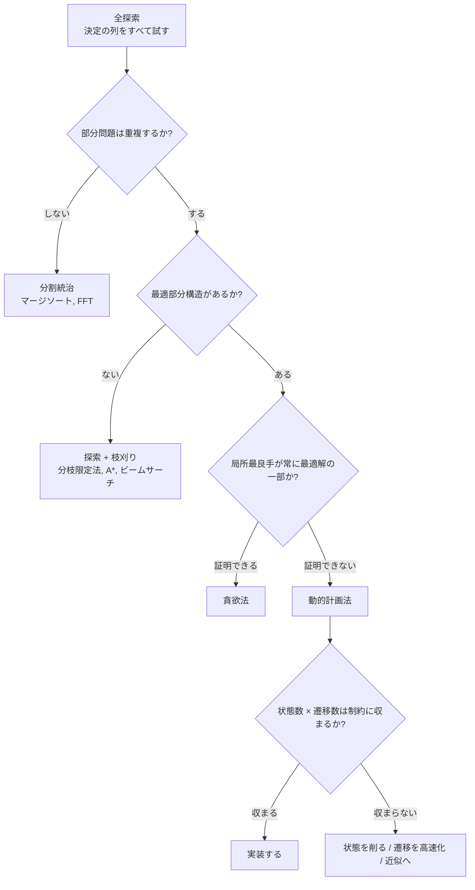
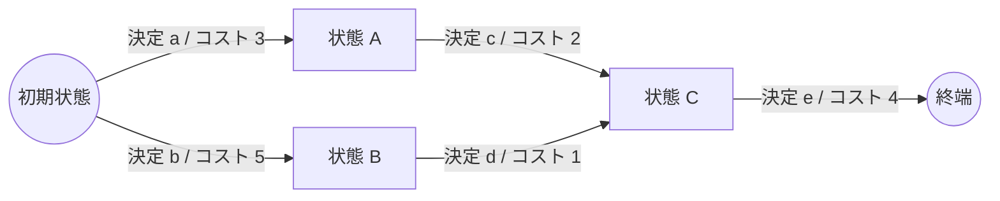

動的計画法（dynamic programming、以下 DP）は、競技プログラミングで最も «解法を思いつけるかどうか» の差が出る道具です。そして同時に、最も «暗記で乗り切ろうとして失敗する» 道具でもあります。ナップサックの漸化式を覚えても、初見の問題でその形にたどり着けなければ意味がありません。

本記事の主張は 1 つです。<strong>DP はアルゴリズムではなく、全探索を書き直すための設計手順である</strong>。だから覚えるべきなのは漸化式ではなく、全探索から漸化式に至る手続きのほうです。以下では、その手続きを段階的に分解し、動くデモで確かめながら、型のカタログ・高速化・実務での応用へと広げていきます。

## 1. DP は「探索の書き直し」である

### 1.1 二つの条件

ある問題が DP で解けるとき、ほぼ必ず次の 2 つが成り立っています。

- <strong>最適部分構造（optimal substructure）</strong>: 最適解が、部分問題の最適解から組み立てられる。
- <strong>部分問題の重複（overlapping subproblems）</strong>: 素朴な再帰が、まったく同じ部分問題を何度も解いている。

前者だけなら分割統治（マージソートなど）で十分です。後者だけなら、単なるキャッシュの話になります。両方が揃ったときに初めて、「部分問題に名前を付けて表に保存する」ことが指数から多項式への飛躍を生みます。

Richard Bellman が 1950 年代に定式化した<strong>最適性の原理（principle of optimality）</strong>は、最適部分構造を言い換えたものです。

> 最適な方策は、最初の状態と最初の決定が何であっても、その決定で移った先の状態から見たとき、残りの決定列がやはり最適な方策になっている。

なお「dynamic programming」という名前は、数学的研究に否定的だった当時の国防長官の目を意識してあえて選んだ、と Bellman は自伝 *Eye of the Hurricane* (1984) で述べています。ここでの programming は「計画法」であり、プログラミング言語とは関係ありません。

### 1.2 貪欲法との分岐点

DP と貪欲法は、どちらも「1 手ずつ決める」構造をしています。違いは、<strong>局所的な最良手が大域最適の一部だと保証できるか</strong>です。

<GreedyFailureDiagram />

貪欲法が正しいことは、<strong>証明</strong>する必要があります。代表的な道具が<strong>交換論法</strong>（exchange argument：2 つの選択を入れ替えても悪化しない、と示す論法。最適解の 1 手を貪欲の 1 手に取り替える形と、隣り合う 2 要素の順序を入れ替える形があり、後者の実例を 3.5 節で扱います）と、<strong>マトロイド</strong>構造の確認（「独立な集合の族」がある公理を満たすなら貪欲が最適だと保証される、という一般論。最小全域木の Kruskal 法がその例です）です。証明できないなら、最初の 1 手を全通り試して残りを再帰に任せる、つまり DP に落とすのが安全です。逆に、証明できる問題に DP を持ち込むのは、計算量とコード量の無駄になります。

<strong>硬貨系が canonical かどうか</strong>（貪欲が常に最適か）は、実は判定可能です。Pearson (2005) は、$n$ 種類の硬貨系に対して $O(n^3)$ で判定するアルゴリズムを与えています。「貪欲でいいかどうか」は問題の種類ではなく、入力そのものによって決まる——ということです。

### 1.3 全探索からの分岐図



この図で重要なのは、<strong>DP は «全探索の下位互換» ではなく «全探索の圧縮» だ</strong>という位置づけです。DP を思いつくとは、正しい圧縮の軸を見つけることです。

## 2. 出発点は必ず全探索

### 2.1 題材：Frog 1

具体例で進めます。AtCoder の [Educational DP Contest](https://atcoder.jp/contests/dp) A 問題「Frog 1」です。

> 高さ $h_0, h_1, \dots, h_{N-1}$ の石が並んでいる。カエルは石 0 から出発し、石 $i$ にいるとき石 $i+1$ か $i+2$ に飛べる。石 $i$ から石 $j$ へ飛ぶコストは $|h_i - h_j|$。石 $N-1$ に着くまでの最小コストは？

まず、何も考えずに全探索を書きます。「決めること」は各時点で 1 段飛ぶか 2 段飛ぶかです。

```python
def solve(h):
    n = len(h)

    def f(i):  # 石 i にたどり着くまでの最小コスト
        if i == 0:
            return 0
        if i == 1:
            return abs(h[1] - h[0])
        return min(
            f(i - 1) + abs(h[i] - h[i - 1]),
            f(i - 2) + abs(h[i] - h[i - 2]),
        )

    return f(n - 1)
```

これは正しいですが、遅い。どれくらい遅いのか、再帰木を実際に描いてみます。

### 2.2 再帰木を見る

<DPRecursionTreeVisualizer />

メモ化を OFF にして再生すると、`f(3)`, `f(2)`, `f(1)` が何度も現れます。呼び出し回数は $T(i) = 1 + T(i-1) + T(i-2)$、すなわち $2F(i+1) - 1$ で、フィボナッチ数の速度で増えます（$T(0) = T(1) = 1$ から順に $T(2) = 3$、$T(3) = 5$、$T(4) = 9$。デモの木のノード数と一致することを確かめてみてください）。$N = 45$ なら約 22.7 億回です。

一方、<strong>引数の種類は $N$ 通りしかありません</strong>。同じ引数に対して同じ値を返す関数を、何度も計算し直しているだけです。ならば一度計算した結果を覚えておけばよい。それがメモ化です。

```python
from functools import cache

def solve(h):
    n = len(h)

    @cache
    def f(i):
        if i == 0:
            return 0
        if i == 1:
            return abs(h[1] - h[0])
        return min(
            f(i - 1) + abs(h[i] - h[i - 1]),
            f(i - 2) + abs(h[i] - h[i - 2]),
        )

    return f(n - 1)
```

`functools.cache`（Python 3.9 以降。それ以前は `lru_cache(maxsize=None)`）を 1 行足しただけで、指数時間が線形時間になります。デモでメモ化を ON にすると、木が «計算済みの枝を刈った木» に潰れるのが見えます。

### 2.3 メモ化が正しい条件

ここで一度立ち止まっておきます。メモ化が正しいのは、<strong>`f` が引数だけで戻り値が決まる純粋関数のとき</strong>です。関数の外側にある可変状態（訪問済みフラグ、グローバルなカウンタ、乱数）を読んでいると、同じ引数でも呼び出し文脈によって答えが変わります。それでもキャッシュは最初の答えを返し続けるので、エラーも例外も出ないまま結果だけが狂います。

実装上のチェックリストは次の 2 つです。

- 関数が読んでいる変数のうち、実行中に変化するものは<strong>すべて引数に入っているか</strong>。
- 引数に入れるべき情報を「入れなくても大丈夫だろう」と省略していないか。

この 2 番目が、次節で扱う「状態設計」そのものです。

### 2.4 計算量は「状態数 × 遷移数」

ここで、この先ずっと使う 2 つの言葉を、いま書いたコードに即して定義しておきます。

- <strong>状態</strong>: メモ化した関数 `f` の<strong>引数の組</strong>のこと。<strong>状態数</strong>はその引数が取りうる値の種類数です。Frog 1 では引数は `i` だけなので、状態数は $N$ 個。
- <strong>遷移</strong>: 1 つの状態から別の状態への 1 手のこと。<strong>遷移数</strong>は、`f` を 1 回実行する中で行われる再帰呼び出しの本数です。Frog 1 では `min(...)` の中の 2 項、つまり $i-1$ と $i-2$ の 2 本。

メモ化された関数は、<strong>実際に呼ばれた引数それぞれにつき、ちょうど 1 回だけ</strong>本体が走ります。だから全体の仕事量は「本体が走る回数 × 1 回あたりの仕事」であり、DP の計算量は、ほぼ常に次の掛け算で見積もれます。

$$
\text{計算量} = (\text{状態数}) \times (\text{遷移数})
$$

Frog 1 なら $N \times 2 = O(N)$。この式は実装前に必ず暗算してください。制約が $N \le 10^5$ で状態数 $N^2$ の設計を思いついたなら、その時点で捨てるべきです。競技プログラミングの実務的な目安として、C++ で単純な演算 $10^8$ 回程度が 1〜2 秒の実行時間制限に収まる上限、Python なら $10^6 \sim 10^7$ 回程度と考えておくと事故が減ります。

### 2.5 ここから先の地図

ここまでで、DP の骨格——全探索を書き、重複に気づき、引数を状態と呼び直し、計算量を掛け算で見積もる——は出そろいました。この先は扱う題材が増えるので、先に地図を出しておきます。

| 章 | 内容 | 読み方 |
|---|---|---|
| 3 | 状態の作り方 | DP でいちばん難しい部分。順番に読んでください |
| 4 | 設計手順と、DP の正体（DAG 上の最短経路） | 同上 |
| 5 | 表の埋め方と実装 | 同上 |
| 6 | 型のカタログ（ナップサック、格子、区間、木、bit、桁、期待値） | <strong>辞書</strong>。必要な型だけ拾って構いません |
| 7 | 遷移の高速化 | 困ってから読む |
| 8〜11 | 実装の作法、実務での応用、練習の順序 | 適宜 |

<strong>通読が要るのは 5 章まで</strong>です。6 章の各節は「問題の定義 → 状態 → 遷移 → 実装 → 落とし穴」の順で独立して読めるようにしてあるので、知らない型に出会ったときに戻ってくる、という使い方を想定しています。

## 3. 状態とは「未来に効く情報の最小集合」

### 3.1 定義

DP における<strong>状態</strong>を、実用的にはこう定義できます。

> ここまでの決定のうち、<strong>この先の最適な決め方に影響するものだけ</strong>を残した要約。

これは確率過程でいう Markov 性、統計でいう十分統計量と同じ考え方です。「ここまでの経路」をすべて覚える必要はなく、「この先を最適に決めるために必要な分だけ」覚えればよい。要約が小さいほど状態数が減り、DP が速くなります。

### 3.2 状態設計に失敗する典型例

<strong>最長増加部分列</strong>（Longest Increasing Subsequence、以下 LIS）を例にします。まず問題を定義します。

> 数列 $a_0, a_1, \dots, a_{n-1}$ が与えられる。添字が増加する順に選んだ部分列のうち、値が狭義単調増加になっているもので、最も長いものの長さを求めよ。

ここでいう<strong>部分列</strong>は「連続していなくてよい」ものです（連続を要求するのは «部分配列» で、次の 3.3 節で扱います）。たとえば $a = [3, 1, 4, 1, 5, 9, 2, 6, 5]$ なら、添字 1, 2, 4, 5 を選んだ $1 < 4 < 5 < 9$ や、添字 1, 2, 4, 7 の $1 < 4 < 5 < 6$ が長さ 4 で、これが最長です。

さて、素朴に

```text
dp[i] = a[0..i] の中の最長増加部分列の長さ
```

と置くと、`dp[i]` から `dp[i+1]` への遷移が書けません。`a[i+1]` を末尾に付け足せるかどうかは、<strong>その増加列の末尾の値</strong>に依存しますが、この状態はそれを覚えていないからです。上の例で `dp[5] = 4` と分かっても、その 4 の列が $1<4<5<9$（末尾 9）なのか別のものなのかが分からず、次の $a_6 = 2$ を足せるか判定できません。

正しい定義は次のとおりです。

```text
dp[i] = a[i] を末尾とする最長増加部分列の長さ
```

「$i$ 番目<strong>まで</strong>見た」ではなく「$i$ 番目<strong>で終わる</strong>」に変えると、末尾の値が `a[i]` に固定され、遷移が書けるようになります。

```text
dp[i] = 1 + max{ dp[j] | j < i かつ a[j] < a[i] }   （該当する j がなければ 1）
答え  = max(dp[0], ..., dp[n-1])
```

答えが `dp[n-1]` ではなく <strong>`dp` 全体の最大値</strong>になる点に注意してください。「$i$ で終わる」と定義した DP では、最後の要素を使うとは限らないので、最後に集約が要ります。この «定義を変えたぶん、答えの取り出し方も変わる» 対応関係は、DP を書くたびに確認する癖をつけるとよいところです。

<strong>遷移が書けないときは、状態が足りていない</strong>——これが最も頻繁に遭遇する詰まり方であり、同時に最も分かりやすいシグナルです。この問題の $O(n \log n)$ 版は 6.2 節で扱います。

### 3.3 最小の DP — 最大部分配列和

同じ「$i$ で終わる」への言い換えが効く例をもう 1 つ。配列 $a$ の<strong>連続</strong>部分列の和の最大値を求める問題です。

素朴には全区間 $O(n^2)$ 通りを試します。ここで状態を「$a[i]$ で終わる連続部分列の和の最大値」と置くと、遷移が 1 行で書けます。

```text
dp[i] = max(a[i], dp[i-1] + a[i])
答え  = max(dp[0], dp[1], ..., dp[n-1])
```

「直前まで伸ばしてきた和に $a[i]$ を足す」か「$a[i]$ から新しく始める」か。この 2 択がすべてです。`dp[i-1]` しか参照しないので変数 2 つで済み、表すら要りません。

```python
def max_subarray(a):
    if not a:
        raise ValueError("空の配列には «空でない部分配列» が存在しません")
    best = cur = a[0]
    for x in a[1:]:
        cur = max(x, cur + x)   # dp[i]
        best = max(best, cur)   # 答えの更新
    return best
```

これが <strong>Kadane のアルゴリズム</strong>（Jay Kadane, 1977。Bentley の *Programming Pearls* で広まりました）です。$O(n)$ 時間、$O(1)$ 空間。<strong>DP には表が要る、という思い込みを崩す</strong>のに最適な例です。表の次元は «状態の個数» ではなく «同時に生きている状態の個数» で決まります。

なお、この実装は<strong>空の部分列を許しません</strong>。全要素が負のとき、空を許す定義なら答えは 0、許さない定義なら最大要素です。`best = cur = 0` で始めると後者で誤答します。境界の決め方が答えを変えてしまうので、問題文をよく読んでください。

### 3.4 状態を «増やす» ことで解ける問題

逆に、状態を意図的に増やして解く問題も多くあります。

| 追加する次元 | 意味 | 典型問題 |
|---|---|---|
| 直前の選択 | 「同じものを 2 回連続で選べない」制約 | EDPC C（Vacation：3 種類の活動から毎日 1 つ選ぶが、2 日連続で同じ活動は不可） |
| 使った個数 | 「ちょうど $k$ 個選ぶ」制約 | 個数制限つき最適化 |
| 上限に張り付いているか | 桁 DP の tight フラグ（6.7 節） | 区間内の数え上げ |
| 余り | 「合計を $m$ で割った余りが 0」 | 部分和の剰余条件 |
| 訪問済み集合 | 順序ではなく «済んだ集合» が効く | TSP（6.6 節）、集合分割 |

表だけでは抽象的なので、1 行目を実際に解いてみます。EDPC C（Vacation）は「$N$ 日間、毎日 A・B・C の 3 種類の活動から 1 つを選ぶ。$i$ 日目に活動 A を選ぶと幸福度 $a_i$（B なら $b_i$、C なら $c_i$）を得る。ただし 2 日連続で同じ活動は選べない。幸福度の合計の最大値は？」という問題です。

`dp[day]` だけでは遷移が書けません。「$day$ 日目までの最大値」を知っていても、その最大値を出したときに<strong>最後に何を選んだか</strong>が分からないと、次の日に選べる活動が決まらないからです（3.2 節の LIS とまったく同じ詰まり方です）。そこで、最後に選んだものを状態に足します。

```text
dp[day][last] = day 日目に活動 last を選んだときの、そこまでの幸福度の合計の最大値
dp[day][last] = happiness[day][last] + max{ dp[day-1][prev] | prev ≠ last }
答え = max(dp[N-1][A], dp[N-1][B], dp[N-1][C])
基底  = dp[0][last] = happiness[0][last]   （初日は «直前» の制約がない）
```

状態数は $N \times 3$、遷移数は 2（自分以外の 2 種類）なので $O(N)$ です。<strong>状態を 1 次元増やすと計算量は定数倍しか増えないのに、書けなかった遷移が書けるようになる</strong>——これが「状態を増やす」の典型的な効き方です。

状態設計は「削る」だけの作業ではありません。<strong>足りないなら足す、多すぎるなら畳む</strong>という双方向の調整です。

### 3.5 状態を «減らす» 4 つの定石

逆向きの調整、つまり状態数が多すぎるときの手は、次の 4 つがほとんどを占めます。

<strong>(a) 順序を固定する。</strong> 「どの順に処理しても答えが同じ」なら、あらかじめソートして単調性（ここでは «処理順に沿って制約が緩む/きつくなる» という向きの一貫性）を作ると、状態に «順序» を持たなくて済みます。逆に順序が効く問題でも、隣接する 2 要素を交換したときの損得を比べる<strong>交換論法</strong>で<strong>最適な処理順が先に決まる</strong>ことがあり、そのあとは普通のナップサック（6.1 節）になります。

EDPC X（Tower）がこの形です。問題は「重さ $w_i$、耐荷重 $s_i$、価値 $v_i$ のブロックを積み上げる。各ブロックについて、その<strong>上に載っているブロックの重さの合計</strong>が $s_i$ を超えてはならない。価値の合計を最大化せよ」。

隣り合う 2 つ $i, j$ だけを取り出し、その 2 つの上に載る重さの合計を $W$ とします。$i$ を上・$j$ を下に置けるのは、$i$ が耐えられて（$W \le s_i$）かつ $j$ も耐えられる（$W + w_i \le s_j$）ときなので、

```text
i が上: W <= min(s_i, s_j - w_i)
j が上: W <= min(s_j, s_i - w_j)
```

この 2 つを比べます。右側（$j$ を上）は $\min$ なので、必ず $s_i - w_j$ 以下です。いっぽう左側（$i$ を上）の 2 項は、どちらも $s_i - w_j$ 以上になります——$s_i \ge s_i - w_j$ は重さが正だから、$s_j - w_i \ge s_i - w_j$ は

$$
s_j - w_i \ge s_i - w_j \iff w_i + s_i \le w_j + s_j
$$

だからです。つまり $w_i + s_i \le w_j + s_j$ でありさえすれば、$\min$ のどちらの項が効いていても «$i$ を上» の許容量が «$j$ を上» を下回ることはありません。<strong>$w + s$ が小さいものを上に置くほうが、許容できる $W$ が大きい（＝損をしない）</strong>と分かります。この比較はどのブロックを選ぶかに依存しないので、$w_i + s_i$ の昇順に並べ替えてしまえば、あとは «その順に並べた列に対する 0-1 ナップサック» になります。

<strong>(b) 対称性で畳む。</strong> 「$i$ と $j$ を入れ替えても同じ」「集合の補集合を取っても同じ」なら、片側だけを持てば状態は半分になります。たとえば「$N$ 人を 2 チームに分ける」問題で<strong>チームに区別がない</strong>なら、$(S, \bar{S})$ と $(\bar{S}, S)$ は同じ分け方なので、「人 0 は必ずチーム 1」と固定すれば $2^N$ が $2^{N-1}$ になります。逆にチームに名前がついている（区別がある）場合、この固定は解の半分を捨てることになるので使えません。<strong>畳めるのは «問題が本当に対称なとき» だけ</strong>——ここだけは気をつけてください。

<strong>(c) 絶対量ではなく差を持つ。</strong> 2 つのグループの合計 $(A, B)$ を両方覚える必要はなく、$A - B$ だけで足りることがあります。「品物を 2 つの山に分け、重さの差を最小化する」問題は、$(A, B)$ の 2 次元ではなく «差» の 1 次元、あるいは「片方の山の重さとして到達可能な値の集合」で解けます。次元がひとつ落ちます。

<strong>(d) 最適化ではなく到達可能性に落とす。</strong> 「最大値」ではなく「作れるか否か」だけでよいなら、`bool` の表になり、ビット並列化（6.9 節の $O(nW/64)$）が使えます。

いずれも「その情報は本当に未来に効くのか？」という 3.1 の問いに戻って判断します。

## 4. 設計手順を型にする

ここまでの話を、初見の問題に適用できる手順に固定します。

<DPDesignSteps />

この 6 ステップのうち、実際に難しいのはステップ 2 と 5 です。ステップ 2（何を覚えれば十分か）が本質的な発想で、ステップ 5（計算量の見積もり）が実装前の安全弁です。ステップ 3・4・6 は、2 が決まればほぼ機械的に書けます。

### 4.1 ステップ 6 の「依存が DAG か」について

DP は本質的に<strong>有向非巡回グラフ（DAG）上の最短経路</strong>です。状態を頂点、遷移を辺、遷移コストを辺の重みとすると、DP の答えは始点から終点への最短（または最長・総和・最大確率）経路になります。

用語を確認しておきます。<strong>有向グラフ</strong>は「A から B へ」という向きのある辺で点をつないだもの、<strong>非巡回（acyclic）</strong>は「辺をたどって元の点に戻ってこられない」こと、<strong>トポロジカル順序</strong>は「すべての辺が前から後ろへ向かうように点を一列に並べた順序」のことです。DP に翻訳すると、点 = 状態、辺 = 遷移、そして「`dp[x]` を計算する前に `dp[y]` が確定していなければならない」という依存関係が辺の向きにあたります。Frog 1 なら、石 $i$ が点で、$i \to i+1$ と $i \to i+2$ が辺です。添字の小さい順に並べればすべての辺が前から後ろを向くので、これがトポロジカル順序になります。



この見方をすると、いくつかのことがまとめて説明できます。

- <strong>評価順序 = トポロジカル順序</strong>。ループの向きを間違えるとは、トポロジカル順序を守っていないということ。
- <strong>依存に閉路があると、そのままでは DP にならない</strong>。閉路を扱うには、（a）辺数などの次元を足して層状の DAG に開く（Bellman–Ford）、（b）順序を貪欲に確定させる（Dijkstra、辺の重みが非負のとき）、（c）表全体を «値が変わらなくなるまで» 何周も更新し続ける（価値反復。9.6 節で扱います）のいずれかが必要になる。
- <strong>最長経路は一般のグラフでは NP 困難だが、DAG では線形時間</strong>。これは EDPC G がそのまま示しています。

グラフ探索そのものの «発明の順序» については [グラフのトラバーサルアルゴリズム](/ja/blog/graph-traversal) で扱いました。本記事の DP は、そこで扱った最短経路を «状態空間» に一般化したものと読めます。

### 4.2 同じ表で別の問題を解く — 半環という見方

もう少し実利のある話をします。Frog 1 で「最小コスト」ではなく「石 0 から石 $N-1$ への行き方は何通りあるか」を聞かれたとしましょう。書き換える必要があるのは、実質 1 行だけです。

```text
最小コスト: dp[i] = min( dp[i-1] + cost1 , dp[i-2] + cost2 )
行き方の数: dp[i] =      dp[i-1] * 1      +  dp[i-2] * 1
初期値      : 最小コストは dp[0] = 0、行き方の数は dp[0] = 1
```

`min` だったところが `+` に、コストの `+` だったところが `×` になっています（行き方を数えるときは 1 本の辺の重みが「1 通り」なので、掛けても値が変わらず消えます）。ループも状態も走査順もそのままです。

この「演算だけ差し替える」操作は、<strong>半環（semiring）</strong>——足し算にあたる演算 $\oplus$ と掛け算にあたる演算 $\otimes$ の組——を取り替える操作として統一的に説明できます。$\oplus$ は「複数の経路から 1 つの値にまとめる」役、$\otimes$ は「経路に沿ってコストをつなぐ」役です。

初期値が 0 から 1 に変わるのも、この対応で説明できます。`dp[0]` に置くべきなのは「$\otimes$ でつないでも相手が変わらない値（$\otimes$ の単位元）」で、最小コスト版の $\otimes$ は足し算だから 0、数え上げ版の $\otimes$ は掛け算だから 1 です。これと対になるのが「$\oplus$ でまとめても影響しない値（$\oplus$ の単位元）」で、こちらは «そんな状態は存在しない» を表す値になります——最小化なら $\infty$、数え上げなら 0 です。範囲外の `dp[-1]` は «そんな行き方はない» なので、数え上げでは 0 として扱うことになり、結果として `dp[1] = dp[0] = 1` です。

| 半環 $(\oplus, \otimes)$ | 意味 | 得られるもの |
|---|---|---|
| $(\min, +)$ | 最小コスト | 最短経路、最小コスト DP |
| $(\max, +)$ | 最大価値 | ナップサック、最長経路 |
| $(+, \times)$ | 総和と積 | 数え上げ DP、確率 DP |
| $(\max, \times)$ | 最大確率 | Viterbi 経路 |
| $(\lor, \land)$ | 論理和・論理積 | 到達可能性、部分和の可否 |

これは実務でもよく効きます。<strong>「最小コストを求める DP」を書いたあとで「同じ遷移で作れる場合の数」を求めよと言われたら、同じループのまま `min` を `+` に、`+` を `×` に置き換えるだけ</strong>で済むからです。ただしこの置き換えで数えられるのは<strong>作り方の総数</strong>であって、<strong>「最小コストを達成する方法の数」ではありません</strong>。後者が欲しいときは、$(\text{最小値},\ \text{その最小値を達成した個数})$ の組を 1 つの元とする半環——$\oplus$ は最小値を取り、同値なら個数を足す——に取り替えます。

なお数え上げ版では、最小コストと違って値が指数的に増えるので、そのままでは 64 ビット整数に収まりません。だから問題文で $\bmod\ 10^9+7$ のような指定がつくのが普通で、加算・乗算のたびに剰余を取ります（8.1 節）。骨格そのものは変わりません。

## 5. 表を埋める — もらう DP と配る DP

漸化式が決まったら、実際に埋めます。ループの書き方には 2 通りあります。

<DPTableFillVisualizer />

- <strong>もらう DP（pull）</strong>: `dp[i]` を、`dp[i]` に入ってくる遷移をすべて見て確定させる。「代入」で書けるので、初期化忘れに強い。
- <strong>配る DP（push）</strong>: 確定した `dp[i]` から、出ていく遷移の先を更新する。遷移先が計算しにくい場合や、「$i$ から届く範囲」が自然に書ける場合に有利。

どちらでも答えは同じですが、書きやすさが変わります。経験的には、<strong>「入ってくる辺」を列挙しやすいならもらう DP、「出ていく辺」を列挙しやすいなら配る DP</strong>を選ぶのが素直です。区間に一様に配るような遷移は、配る DP と差分更新（いもす法）の相性が良くなります。

### 5.1 実装

```cpp
// もらう DP（C++）
#include <bits/stdc++.h>
using namespace std;

int main() {
    int n; cin >> n;
    vector<long long> h(n);
    for (auto &x : h) cin >> x;

    const long long INF = 1e18;
    vector<long long> dp(n, INF);
    dp[0] = 0;
    for (int i = 1; i < n; i++) {
        dp[i] = dp[i - 1] + llabs(h[i] - h[i - 1]);
        if (i >= 2) dp[i] = min(dp[i], dp[i - 2] + llabs(h[i] - h[i - 2]));
    }
    cout << dp[n - 1] << '\n';
}
```

```cpp
// 配る DP（C++）
vector<long long> dp(n, INF);
dp[0] = 0;
for (int i = 0; i < n; i++) {
    if (dp[i] == INF) continue;              // 到達不能な状態からは配らない
    for (int d = 1; d <= 2 && i + d < n; d++) {
        long long cand = dp[i] + llabs(h[i + d] - h[i]);
        dp[i + d] = min(dp[i + d], cand);
    }
}
```

配る DP で `if (dp[i] == INF) continue;` を忘れると、`INF + コスト` を計算してしまいます。`INF` に `LLONG_MAX` のような «足したら壊れる値» を選んでいると、これがオーバーフローして負値になり、そのまま最小値として採用されます。<strong>`INF` は「加算しても壊れない値」にする</strong>のが定石です。`long long` なら `1e18`、`int` なら `1'000'000'000` ではなく `1'000'000'000 / 2` 程度を使い、加算の余地を残します。とはいえ、値が壊れなくても «到達不能な状態から配った偽の経路» が残ることに変わりはないので、ガード自体は必ず書いてください。

### 5.2 トップダウンかボトムアップか

<MemoVsTabulation />

指針をまとめると次のようになります。

- <strong>状態空間が疎</strong>（到達しない状態が大量にある、状態が文字列や集合で添字化しづらい）なら、メモ化再帰。
- <strong>状態空間が密</strong>で、定数倍や高速化テクニックを載せたいなら、ループ。
- <strong>再帰の深さが $10^5$ を超えうる</strong>なら、ループ（あるいは明示的スタック）。Python はデフォルトの再帰上限が 1000 なので、`sys.setrecursionlimit` の引き上げに加えてスレッドスタックサイズの調整が必要になることもあります。

まずメモ化再帰で正しさを確認し、必要になったらループへ書き換える、という順序が実務的です。漸化式が正しいことさえ確認できれば、ループへの変換は機械的な作業になります。

## 6. 型のカタログ

ここからは辞書パートです。典型的な DP の «型» を順に見ていきますが、<strong>各節は独立して読めます</strong>。どの節も「問題の定義 → なぜその状態になるのか → 遷移と計算量 → 実装 → 落とし穴」の順で並べてあるので、必要な型だけ拾ってください。

型を覚える目的は、暗記そのものではありません。初見の問題に出会ったとき「これは区間をまとめる形だから、区間を状態にすればよさそうだ」と<strong>当たりをつける</strong>ためです。3〜5 章の手順は、その当たりが外れたときに戻ってくる場所です。

<DPPatternTable />

### 6.1 ナップサック DP — 「疑似多項式」という言葉の意味

まず問題を定義します。

> $N$ 個の品物があり、品物 $i$ は重さ $w_i$、価値 $v_i$ を持つ。重さの合計が容量 $W$ を超えないように品物を選ぶとき、価値の合計の最大値を求めよ。各品物は<strong>使うか使わないかの 2 択</strong>（0-1 ナップサック）とする。

「決めること」は品物を 1 つずつ見て「入れる / 入れない」を決めることです。ここまでの手順どおり、まず全探索は $2^N$ 通りの部分集合を試すことになります。そして「先頭 $i$ 個をどう選んだか」のうち、この先に効くのは<strong>使った重さの合計だけ</strong>です。どの品物をどう組み合わせて合計 $w$ になったかは、残りの選び方に影響しません。これで状態が 2 次元に決まります。

```text
dp[i][w] = 先頭 i 個から選び、重さの合計が w 以下のときの価値の最大値
dp[i][w] = max( dp[i-1][w] ,  dp[i-1][w - w_i] + v_i )
             ↑ i 番目を使わない   ↑ i 番目を使う（w >= w_i のときだけ）
```

「この先に効くのは使った重さ」と考えたときは «ちょうど $w$» が自然ですが、上では «$w$ 以下» と定義しています。重さが非負である以上、容量を余らせても損はしないので、«$w$ 以下» の表は «ちょうど» の表を $w$ の小さいほうから累積最大していったものにあたり、$w$ について単調非減少になります。

ただし、セルごとの値まで一致するわけではありません。«ちょうど» では作れない重さのセルにも、«以下» ならより軽い組み合わせの最良値が入るからです。それでも最後に欲しいのは «$W$ 以下での最大» なので、この形にしておけば `dp[N][W]` を読むだけで答えになり、「ちょうど $W$ を使い切る組み合わせがない」場合の場合分けが要りません。

逆に «ちょうど» が必要な問題（6.2 節や部分和）では、到達不能なセルを明示的に区別します——最小化なら $\infty$、最大化なら $-\infty$、可否なら `false` です。

状態数 $N \times W$、遷移数 2 なので $O(NW)$ です。

さて、0-1 ナップサック問題は<strong>NP 困難</strong>です。それでも $O(NW)$ の DP で解けるのは、$W$ が<strong>入力の値そのもの</strong>であって、入力サイズ（ビット数）ではないからです。$W$ を二進表記したときの長さは $\log W$ なので、$O(NW)$ は入力サイズに対して指数的です。これを<strong>疑似多項式時間</strong>と呼びます。

つまり「$W \le 10^5$ なら通るが、$W \le 10^9$ なら通らない」というのは実装の巧拙ではなく、問題の構造そのものです。

<KnapsackDPVisualizer />

デモの 3 モードは、実装上の要点をそのまま示しています。

<strong>2 次元表</strong>は定義どおりです。

```cpp
// dp[i][w] = 先頭 i 個から選び、重さ合計 w 以下での最大価値
vector<vector<long long>> dp(n + 1, vector<long long>(W + 1, 0));
for (int i = 1; i <= n; i++)
    for (int w = 0; w <= W; w++) {
        dp[i][w] = dp[i - 1][w];
        if (w >= wt[i - 1])
            dp[i][w] = max(dp[i][w], dp[i - 1][w - wt[i - 1]] + val[i - 1]);
    }
```

<strong>1 次元・逆順</strong>は、行 $i$ を計算するとき行 $i-1$ しか要らないことを使って次元を落とします。

```cpp
vector<long long> dp(W + 1, 0);
for (int i = 0; i < n; i++)
    for (int w = W; w >= wt[i]; w--)          // ← 降順が必須
        dp[w] = max(dp[w], dp[w - wt[i]] + val[i]);
```

<strong>1 次元・順方向</strong>にすると、`dp[w - wt[i]]` が「同じ品物ですでに更新済み」の値になり、同じ品物を何個でも使えることになります。これはバグですが、<strong>個数無制限ナップサックの正しい実装そのもの</strong>でもあります。デモで答えが 90 から 100 に変わるのを確認してください。ループの向き 1 つで、解いている問題そのものが入れ替わる——これは覚えておいてください。

```cpp
// 個数無制限ナップサック：昇順ループが「正解」になる
for (int i = 0; i < n; i++)
    for (int w = wt[i]; w <= W; w++)
        dp[w] = max(dp[w], dp[w - wt[i]] + val[i]);
```

<strong>個数制限つき</strong>（品物 $i$ を最大 $c_i$ 個まで使える版。上の 0-1 が $c_i = 1$、個数無制限が $c_i = \infty$ にあたります）は、素朴には $O(NWc)$ ですが、$c_i$ を $1, 2, 4, \dots$ と二進分割して 0-1 ナップサックに帰着すると $O(NW \log c)$、剰余類ごとにスライド最小値を使えば $O(NW)$ になります。

### 6.2 添字と値を入れ替える

同じナップサックでも、制約の形が変わると同じ状態設計が使えなくなります。EDPC E（Knapsack 2）は $N \le 100$、$W \le 10^9$、$v_i \le 10^3$ です。品物数は少ないのに容量だけが桁違いに大きい。$O(NW) = 10^{11}$ は不可能です。

ここで、価値の総和は高々 $N \times \max v_i = 100 \times 10^3 = 10^5$ しかないことに気づきます。<strong>大きすぎる «重さ» を添字から追い出し、代わりに小さい «価値» を添字にする</strong>——つまり、何を最適化し何を制約とするかを入れ替えます。

```text
これまで: dp[i][w] = 重さ w 以下での「価値の最大値」        ← 添字が重さ
入れ替え: dp[i][v] = 価値ちょうど v を作るための「重さの最小値」  ← 添字が価値
```

これで状態数は $N \times \sum v_i \le 100 \times 10^5 = 10^7$ となり、現実的になります。答えは `dp[N][v] <= W` を満たす最大の `v` です。

> 「片方の次元が大きすぎるなら、最適化対象と制約を入れ替えられないか」を疑う。これは DP における最も汎用的な発想転換です。

同じ発想が、3.2 節で定義した LIS の $O(n \log n)$ 解法にも現れます。

<LISVisualizer />

素朴な $O(n^2)$ 解法（3.2 節のもの）は `dp[i]` に<strong>長さ</strong>を持ちました。高速版は逆に、<strong>長さを添字にし、値のほうを中身にします</strong>。

```text
素朴: dp[i]    = 「a[i] で終わる増加列」の長さ          ← 添字が位置、中身が長さ
高速: tails[k] = 「長さ k+1 の増加列を作れる末尾」の最小値  ← 添字が長さ、中身が値
```

`tails` が常に狭義単調増加になるのが要点です（長い列の末尾は、短い列の末尾より小さくできないため）。ソート済みの配列なので二分探索が使え、要素 1 つあたり $O(\log n)$、全体で $O(n \log n)$ になります。

```python
from bisect import bisect_left

def lis_length(a):
    tails = []
    for x in a:
        i = bisect_left(tails, x)     # 狭義単調増加。広義なら bisect_right
        if i == len(tails):
            tails.append(x)
        else:
            tails[i] = x
    return len(tails)
```

<strong>ここに落とし穴があります</strong>。`tails` の<strong>長さ</strong>は正しい答えですが、`tails` の<strong>中身は部分列になっていません</strong>。デモの最後で、`tails = [1, 2, 5, 6]` が入力の並び順を満たしていないことを確認できます。列そのものを復元したいなら、各要素を挿入したときの位置と «そのとき 1 つ左のスロットを持っていた要素の添字» を記録する必要があります。

```python
def lis_sequence(a):
    tails, tails_idx, parent = [], [], [-1] * len(a)
    for i, x in enumerate(a):
        k = bisect_left(tails, x)
        parent[i] = tails_idx[k - 1] if k > 0 else -1
        if k == len(tails):
            tails.append(x); tails_idx.append(i)
        else:
            tails[k] = x; tails_idx[k] = i
    res, cur = [], tails_idx[-1]
    while cur != -1:
        res.append(a[cur]); cur = parent[cur]
    return res[::-1]
```

### 6.3 格子 DP — diff と編集距離の骨格

2 本の列の接頭辞を 2 軸に取る DP は、実務で最も出番の多い型です。代表的な 2 問を定義します。

> <strong>最長共通部分列</strong>（Longest Common Subsequence, LCS）: 2 つの文字列 $s$, $t$ が与えられる。両方の<strong>部分列</strong>（連続でなくてよいが、順序は保つ）になっている文字列のうち、最も長いものを求めよ。例：$s = $ `axyb`、$t = $ `abyxb` なら `axb` や `ayb` が長さ 3 で最長。

> <strong>編集距離</strong>（Levenshtein distance）: 文字列 $s$ に「1 文字の挿入・削除・置換」を繰り返して $t$ にするとき、必要な操作回数の最小値を求めよ。例：`axyb` → `abyb`（x を b に置換）→ `abyxb`（x を挿入）で 2 回。

どちらも「$s$ の先頭 $i$ 文字と $t$ の先頭 $j$ 文字」という<strong>接頭辞の組</strong>が状態になります。$s$ の $i$ 文字目と $t$ の $j$ 文字目をどう対応させるかを決めれば、残りは同じ形の小さい問題になるからです。状態数 $nm$、遷移数 2〜3 で $O(nm)$ です。

<LCSGridVisualizer />

同じ表・同じ走査順で、<strong>遷移の定義だけ</strong>を差し替えると別の問題になります。

```python
# 最長共通部分列
if s[i-1] == t[j-1]: dp[i][j] = dp[i-1][j-1] + 1
else:                dp[i][j] = max(dp[i-1][j], dp[i][j-1])

# 編集距離（Levenshtein）
if s[i-1] == t[j-1]: dp[i][j] = dp[i-1][j-1]
else:                dp[i][j] = 1 + min(dp[i-1][j-1], dp[i-1][j], dp[i][j-1])
```

この格子はそのまま応用に繋がります。

- <strong>diff</strong>: LCS に入らなかった文字が削除・追加として表示される。GNU diff や git のデフォルトは Myers のアルゴリズム（1986）で、これは編集グラフ上の最短経路を $O(ND)$（$D$ は差分の大きさ）で求めるもので、差分が小さいほど速くなります。
- <strong>スペル訂正・あいまい検索</strong>: 編集距離そのもの。閾値付きなら対角帯だけ計算して $O(nk)$ に落とせます。
- <strong>バイオインフォマティクス</strong>: Needleman–Wunsch（1970、大域アライメント）と Smith–Waterman（1981、局所アライメント）は、この格子にギャップペナルティと置換スコア行列を入れたものです。
- <strong>DTW（動的時間伸縮）</strong>: 時系列の対応付け。遷移の定義を変えただけの同じ格子です。

<strong>メモリ削減の定番</strong>として、長さだけが欲しいなら 2 行のローリング配列で $O(\min(n,m))$ になります。列そのものが欲しい場合も、Hirschberg のアルゴリズム（1975）で分割統治を組み合わせれば、時間 $O(nm)$ のまま空間 $O(\min(n,m))$ で復元できます。

理論的な下界にも触れておきます。Backurs と Indyk (2015) は、SETH（強指数時間仮説）が真なら編集距離を $O(n^{2-\delta})$ 時間で計算できないことを示しました。LCS についても同様の結果があります。つまり<strong>この $O(nm)$ は、定数倍改善（ビット並列化、Four Russians 法）以上の本質的な改善が期待できない</strong>、ということです。

### 6.4 区間 DP

「隣り合うものをくっつけていく」構造の問題は、区間を状態にします。代表例を挙げます。

> <strong>スライム合体</strong>（EDPC N）: $N$ 個のスライムが一列に並び、$i$ 番目の大きさは $a_i$。隣り合う 2 匹を合体させると、大きさは和になり、そのとき $($ 2 匹の大きさの和 $)$ のコストがかかる。全部を 1 匹にするまでの総コストの最小値を求めよ。

> <strong>行列連鎖積</strong>: $A_1 A_2 \cdots A_n$ を掛けるとき、掛ける順序（括弧の付け方）によってスカラー乗算の回数が変わる。回数を最小化する括弧の付け方を求めよ。

どちらも、最後に「区間 $[l, r)$ 全体が 1 つにまとまる」瞬間があり、そのときは必ず<strong>ある分割点 $k$ で左右に分かれていた</strong>はずです。この $k$ を全通り試すのが遷移になります。「先頭から順に決める」線形 DP と違い、<strong>決める順番が «区間の大きさ» になっている</strong>のがこの型の特徴です。

```text
dp[l][r] = 区間 [l, r) をひとつにまとめるときの最適値
dp[l][r] = min over k in (l, r) of  dp[l][k] + dp[k][r] + cost(l, r)
```

状態数 $O(n^2)$、遷移数 $O(n)$ で $O(n^3)$ です。ループは<strong>区間の長さが短いほうから</strong>回します（長い区間は短い区間の答えに依存するため、これがトポロジカル順序になります）。上の骨格は `cost(l, r)` を `min` の<strong>外</strong>に置いた形（EDPC N や最適二分探索木がこちら）ですが、行列連鎖積のようにコストが分割点に依存する場合は `dp[l][k] + dp[k][r] + p_l p_k p_r` のように `min` の<strong>内側</strong>に入ります。どちらも同じ «区間 DP» です。

コスト関数が<strong>四角不等式（quadrangle inequality）</strong>

$$
w(a, c) + w(b, d) \le w(a, d) + w(b, c) \quad (a \le b \le c \le d)
$$

さらに、区間の包含に関する単調性 $w(b, c) \le w(a, d)$（同じく $a \le b \le c \le d$）も満たすとします。このとき<strong>最適分割点は単調になります</strong>。直観的には「区間を右に広げると最適な分割点も右にしか動かない、左に広げると左にしか動かない」ということで、この 2 つの向きがそれぞれ探索範囲の下限と上限を与えます。

つまり $dp[l][r]$ の分割点を探す範囲を $[\,\text{argmin}(l, r-1),\ \text{argmin}(l+1, r)\,]$ に限定できます。区間の長さごとに範囲が畳み込まれるので、全体では $O(n^2)$ に落ちます（Knuth–Yao 高速化）。Knuth が 1971 年に最適二分探索木（各キーの検索頻度が分かっているとき、平均検索コストを最小にする二分探索木を作る問題）で示し、Yao が 1980 年に一般化した結果です。

```cpp
// 区間 DP の骨格（もらう DP）
for (int len = 2; len <= n; len++)
    for (int l = 0; l + len <= n; l++) {
        int r = l + len;
        for (int k = l + 1; k < r; k++)
            dp[l][r] = min(dp[l][r], dp[l][k] + dp[k][r]);
        dp[l][r] += cost(l, r);
    }
```

### 6.5 木 DP と全方位木 DP

木の上では、<strong>部分木</strong>が自然な部分問題になります。代表例を定義します。

> <strong>木の最大重み独立集合</strong>: 頂点に重み $w_v$ を持つ木が与えられる。<strong>辺で直接つながった 2 頂点を同時には選ばない</strong>という条件のもとで、選んだ頂点の重みの合計を最大化せよ。

一列に並んだ場合（＝パス）なら「$i$ 番目を使うか使わないか」の線形 DP ですが、木では子が複数あります。それでも構造は同じで、<strong>頂点 $v$ の部分木の答えは、子たちの部分木の答えから決まります</strong>。ただし「$v$ 自身を選んだかどうか」で子の自由度が変わるので、その 1 ビットを状態に足します。

```python
# 木の最大重み独立集合
# 戻り値 (take, skip) = (v を選ぶ場合の部分木の最大値, v を選ばない場合の最大値)
def dfs(v, parent):
    take, skip = w[v], 0
    for c in graph[v]:
        if c == parent: continue
        t, s = dfs(c, v)
        take += s          # v を使うなら子は使えない
        skip += max(t, s)  # v を使わないなら子は自由
    return take, skip

answer = max(dfs(root, -1))
```

状態は「頂点 $v$」×「$v$ 自身を使ったか」の 2 次元です。計算量は各辺を 1 回ずつ見るので $O(n)$。EDPC P（Independent Set）は同じ状態のまま $(\max, +)$ を $(+, \times)$ に取り替えた<strong>数え上げ版</strong>で、`max` を足し算に、足し算を掛け算にすると独立集合の個数になります。4.2 節の半環の話がそのまま効く例です。

<strong>全方位木 DP（rerooting）</strong>は、「<strong>すべての</strong>頂点それぞれを根としたときの答え」をまとめて $O(n)$ で求める技法です。上の DFS は根を 1 つ決めたときの答えしか出しません。素朴に $n$ 回やり直すと $O(n^2)$ ですが、根から下向きの累積（子方向の答え）と、親方向から降りてくる答えを組み合わせると 2 回の DFS で済みます。鍵は<strong>「自分以外のすべての子の集約」を左右からの累積で $O(\deg v)$ に抑える</strong>ことです。EDPC V がこの典型です。

### 6.6 bit DP — 順列を集合に畳む

順序が本質的に効く問題でも、「これまでに何をしたか」が集合として要約できるなら、状態を $2^n$ に畳めます。題材は巡回セールスマン問題です。

> <strong>巡回セールスマン問題</strong>（Travelling Salesman Problem, TSP）: $n$ 個の都市と、都市 $u$ から $v$ への移動距離 $D[u][v]$ が与えられる。都市 0 から出発してすべての都市をちょうど 1 回ずつ訪問し、都市 0 に戻る巡回路のうち、総距離が最小のものを求めよ。

<BitmaskTSPVisualizer />

素朴に解くと、都市 0 以外の $n-1$ 都市の並べ方 $(n-1)!$ 通りを試すことになります。しかし、<strong>「どの都市を訪問済みか」と「いまどこにいるか」が同じなら、この先の最適な回り方は同じ</strong>です。「$0 \to 1 \to 2 \to 3$ と回った」のと「$0 \to 2 \to 1 \to 3$ と回った」を比べると、訪問済み集合はどちらも $\lbrace 0,1,2,3 \rbrace$、現在地はどちらも都市 3 なので、残りの都市の回り方に違いは出ません。距離が非対称（$D[u][v] \neq D[v][u]$）でも同じことが言えます——違うのはここまでに払ったコストだけで、この先に残っている仕事は同一だからです。だから訪問順そのものは覚えなくて構いません。

訪問済み集合は $n$ ビットの整数 $S$ で表します（$i$ ビット目が 1 なら都市 $i$ を訪問済み）。集合をビット列に押し込めるので、この型を<strong>状態圧縮 / bit DP</strong>と呼びます。

$$
dp[S][v] = \min_{u \in S \setminus \lbrace v \rbrace} \bigl( dp[S \setminus \lbrace v \rbrace][u] + D[u][v] \bigr)
$$

状態数 $2^n \cdot n$、遷移数 $n$ で $O(2^n n^2)$。Held と Karp（1962）、および Bellman（1962）が独立に与えた結果です。指数は消えませんが、階乗は消えます。$n = 20$ なら $(n-1)! \approx 1.2 \times 10^{17}$ に対して $2^n n^2 \approx 4.2 \times 10^8$ で、後者は現実的な範囲に入ります。

```cpp
// Held–Karp
vector<vector<long long>> dp(1 << n, vector<long long>(n, INF));
dp[1][0] = 0;
for (int S = 1; S < (1 << n); S++) {
    if (!(S & 1)) continue;
    for (int v = 0; v < n; v++) {
        if (!((S >> v) & 1) || dp[S][v] == INF) continue;
        for (int u = 0; u < n; u++) {
            if ((S >> u) & 1) continue;
            int T = S | (1 << u);
            dp[T][u] = min(dp[T][u], dp[S][v] + D[v][u]);
        }
    }
}
```

bit DP の実装で頻出のイディオムを挙げておきます。

```cpp
__builtin_popcount(S)          // 立っているビット数
S & (S - 1)                    // 最下位の 1 を落とす
S & -S                         // 最下位の 1 だけを取り出す
for (int T = S; T; T = (T - 1) & S)   // S の空でない部分集合を全列挙
```

最後のイディオムで全 $S$ について部分集合を回すと $O(3^n)$ になります（各要素が「$T$ に入る / $S \setminus T$ に入る / $S$ に入らない」の 3 通りだから）。部分集合の総和だけが必要なら、<strong>SOS DP（高速ゼータ変換）</strong>で $O(2^n n)$ に落とせます。

```cpp
// f[S] を「S の部分集合すべてにわたる総和」に書き換える
for (int i = 0; i < n; i++)
    for (int S = 0; S < (1 << n); S++)
        if ((S >> i) & 1) f[S] += f[S ^ (1 << i)];
```

### 6.7 桁 DP

> 「$A$ 以上 $B$ 以下の整数のうち、ある条件（各桁の和が $D$ の倍数、など）を満たすものはいくつあるか」

$B$ が $10^{18}$ でも、1 つずつ数える代わりに<strong>桁を上位から 1 桁ずつ決める</strong>ことで数えられます。「決めること」が値そのものではなく桁である、という発想の転換です。

このとき問題になるのが「上限 $B$ を超えないこと」で、これを<strong>いま作りかけの数が $B$ の接頭辞と完全に一致しているか（tight）</strong>という 1 ビットで表します。tight なら次の桁は $B$ のその桁までしか置けず、tight でない（すでに $B$ より小さいことが確定している）なら 0〜9 が自由に置けます。

```python
from functools import cache

def count_upto(n_str, ...):
    L = len(n_str)

    @cache
    def rec(pos, tight, started, state):
        if pos == L:
            return 1 if is_ok(state) else 0
        limit = int(n_str[pos]) if tight else 9
        total = 0
        for d in range(0, limit + 1):
            total += rec(
                pos + 1,
                tight and d == limit,     # 上限に張り付いたままか
                started or d > 0,         # 先頭ゼロを抜けたか
                next_state(state, d, started or d > 0),
            )
        return total

    return rec(0, True, False, initial_state)

# 区間は差で取る
answer = count_upto(str(B)) - count_upto(str(A - 1))
```

`started`（先頭ゼロの扱い）を忘れると、「桁の中に 0 がいくつあるか」のような条件で必ずずれます。<strong>tight と started の 2 つのフラグ</strong>は、桁 DP のほぼ全問題で必要になる定型です。

### 6.8 確率・期待値 DP

「最適化」ではなく「平均」を求める DP です。たとえば次のような問題を指します。

> $N$ 枚の皿があり、皿 $i$ には寿司が $a_i$ 貫（$1 \le a_i \le 3$）のっている。「$N$ 枚から等確率で 1 枚選び、寿司が残っていれば 1 貫食べる（空なら何もしないが、操作は 1 回と数える）」を繰り返すとき、全部の寿司がなくなるまでの操作回数の期待値を求めよ。（EDPC J: Sushi）

確率 DP は 4.2 節でいう $(+, \times)$ 半環の DP そのものです。期待値 DP には固有の注意点が 2 つあります。

<strong>1 つ目：向きを逆に取る</strong>。「状態 $s$ から終端までにかかる操作回数の期待値」を `dp[s]` に持ち、終端側から埋めます。「始点から $s$ までの期待値」では、期待値の線形性を使った合成ができません。

<strong>2 つ目：自己ループは方程式を解く</strong>。「確率 $p$ で何も起きず同じ状態に留まる」場合、

$$
E = 1 + pE + \sum_i q_i E_i
\quad\Longrightarrow\quad
E = \frac{1 + \sum_i q_i E_i}{1 - p}
$$

と移項して解きます。「同じ状態に戻る」は無限級数ですが、閉じた形になります。$p = 1$（絶対に抜けられない）のときは期待値が発散するので、問題側でそれが起きないことを確認してください。

EDPC J（Sushi）は、$a_i \le 3$ という制約のおかげで «寿司が 1 貫の皿の数、2 貫の皿の数、3 貫の皿の数» の 3 次元を状態に取れる問題で、この自己ループの処理をする典型例です。

### 6.9 部分和と bitset — 「作れるか」だけなら定数倍で殴れる

3.5 節の定石 (d) の具体例です。「重さの部分集合で和 $j$ をちょうど作れるか」だけを問う部分和問題は、`dp[j]` が `bool` になります。

```text
dp[j] = 和 j が作れるか（bool）
品物 w を追加：dp_new = dp OR (dp << w)
```

`dp` をビット列とみなすと、遷移が<strong>シフトと論理和 1 回</strong>になります。C++ なら `std::bitset` で $O(nW/64)$、つまり素朴な $O(nW)$ の 64 分の 1 です。

```cpp
bitset<100001> dp;
dp[0] = 1;
for (int w : weights) dp |= dp << w;   // dp[j] が立っていれば和 j を作れる
```

Python では、任意精度整数をそのままビット集合として使えます。ループ回数が減るぶん、素朴なリスト DP より 1〜2 桁速くなることも珍しくありません。

```python
dp = 1                       # 第 0 ビットだけ立っている = 和 0 は作れる
for w in weights:
    dp |= dp << w
can_make = lambda j: (dp >> j) & 1
```

<strong>ただし、この形では復元も個数制限もできません</strong>。「どれを選んだか」が必要なら `bool` ではなく親を持つ表に戻す必要があります。定数倍の高速化は、たいてい情報を捨てることと引き換えです。

## 7. 遷移を速くする

状態数は減らせないが遷移が重い、という状況はよく起きます。そのときに使う道具の対応表です。

<DPOptimizationTable />

### 7.1 累積和：最も費用対効果が高い

`dp[i] = sum(dp[j] for j in [i-k, i-1])` のように<strong>遷移が区間の総和</strong>なら、累積和で $O(k)$ が $O(1)$ になります。

```python
# dp[i] = dp[i-1] + dp[i-2] + ... + dp[i-k]
S = [0] * (n + 2)          # dp の累積和
dp[0] = 1; S[1] = 1
for i in range(1, n + 1):
    lo = max(0, i - k)
    dp[i] = (S[i] - S[lo]) % MOD
    S[i + 1] = (S[i] + dp[i]) % MOD
```

配る DP 側で「区間に一様に加算する」なら、いもす法（差分配列）で同じ効果が得られます。EDPC M（Candies）や T（Permutation）がこの型です。

### 7.2 スライド最小値

`dp[i] = min(dp[j] for j in [i-k, i-1]) + c[i]` のように<strong>窓の最小値</strong>を取るなら、単調両端キュー（monotonic deque）で償却 $O(1)$ になります。

```python
from collections import deque

dq = deque()               # (index, value) を value 昇順で保持
for i in range(n):
    while dq and dq[0][0] < i - k:      # 窓から出た要素を捨てる
        dq.popleft()
    dp[i] = c[i] + (dq[0][1] if dq else 0)
    while dq and dq[-1][1] >= dp[i]:    # 自分より大きい末尾は将来使われない
        dq.pop()
    dq.append((i, dp[i]))
```

「自分より大きくて自分より古い要素は、二度と最小値にならない」——単調キューが正しく動くのは、この性質があるからです。個数制限つきナップサックの $O(NW)$ 解法も、剰余類ごとにこの構造を使います。

### 7.3 Convex Hull Trick

$dp[i] = \min_j (dp[j] + a_j \cdot x_i)$ の形、つまり<strong>直線の族の下側包絡線</strong>を評価する遷移なら、傾きと問い合わせが単調なら $O(n)$、そうでなくても Li Chao 木で $O(n \log n)$ になります。

最小構成の練習問題が EDPC Z（Frog 3）です。Frog 1 と同じ設定で、<strong>ジャンプ先が 1〜2 個先ではなく «自分より先のどの石でもよい»</strong> になり、石 $j$ から石 $i$ へのコストが $(h_i - h_j)^2 + C$ になります。素朴に書くと遷移が $O(n)$ で全体 $O(n^2)$ です。ここで $dp[i] = \min_j (dp[j] + (h_i - h_j)^2 + C)$ を展開すると

$$
dp[i] = h_i^2 + C + \min_j \bigl( \underbrace{-2h_j}_{\text{傾き}} \cdot h_i + \underbrace{dp[j] + h_j^2}_{\text{切片}} \bigr)
$$

となり、$j$ ごとに «傾き $-2h_j$、切片 $dp[j] + h_j^2$ の直線» が 1 本対応します。求めたいのは、$x = h_i$ での直線群の最小値——つまり<strong>下側包絡線</strong>の値です。<strong>「$i$ に依存する部分と $j$ に依存する部分に分離できるか」</strong>が、この変形の適用可否を判断する基準です。

EDPC Z では $h_1 < h_2 < \dots < h_N$ という制約があり、これが効きます。直線を追加していく順序（傾き $-2h_j$）は単調減少で、問い合わせる $x$（$= h_i$）は単調増加。最小値を取るときは «$x$ が大きいほど最適な直線の傾きは小さい» ので、この 2 つの単調性が揃えば包絡線を<strong>傾きについて単調な両端キュー</strong>で管理でき、償却 $O(n)$ で済みます（7.2 節のスライド最小値とは名前が似ていますが、不変条件が違います。こちらは «末尾の直線が不要になったら pop、先頭の直線が最適でなくなったら pop»）。単調性がない一般の場合は Li Chao 木（$x$ の定義域をセグメント木状に分割し、各ノードに «その区間で最も優勢な直線» を 1 本だけ持つデータ構造）などが必要で、$O(n \log n)$ になります。<strong>高速化の可否は問題の制約に書いてある</strong>、という好例です。

### 7.4 行列累乗

線形漸化式で $n$ が $10^9$ 級なら、遷移を行列にして累乗します。

$$
\begin{pmatrix} F_{n} \\ F_{n-1} \end{pmatrix}
=
\begin{pmatrix} 1 & 1 \\ 1 & 0 \end{pmatrix}^{\,n-1}
\begin{pmatrix} F_1 \\ F_0 \end{pmatrix}
$$

状態数 $k$ に対して $O(k^3 \log n)$。グラフの隣接行列の $n$ 乗が「長さ $n$ の経路数」になるのも同じ原理で（$(+, \times)$ 半環）、EDPC R（Walk）がこの経路数え上げ版です。$(\min, +)$ 半環で同じことをすると「辺をちょうど $n$ 本使う最短経路」になります。

### 7.5 どれを使うかの判断

高速化テクニックは「知っていれば速い」ものではなく、<strong>遷移の形を見て適用条件を確認する</strong>ものです。優先順位は次のとおりです。

1. まず<strong>状態が減らせないか</strong>を疑う。次元を 1 つ落とせるなら、どんな定数倍改善よりも効く。
2. 遷移が<strong>区間の集約</strong>なら累積和・いもす法・セグメント木。
3. 遷移が<strong>窓の min/max</strong>ならスライド最小値。
4. 遷移が<strong>直線の族</strong>なら CHT / Li Chao 木。
5. 遷移が<strong>分割点の探索</strong>で、コストが凸なら Knuth–Yao / 分割統治最適化。

## 8. 実装の作法

### 8.1 初期値・到達不能・オーバーフロー

- 最小化なら `INF`、最大化なら `-INF` で初期化し、<strong>「到達不能」と「値が 0」を区別</strong>する。数え上げなら 0 初期化。
- `INF` は加算しても壊れない値にする（`long long` で `1e18`、`int` で `1e9` は危険）。
- 配る DP では `if (dp[i] == INF) continue;` を必ず書く。
- 数え上げでは毎回 $\bmod$ を取る。$10^9+7$ と $998244353$ が定番で、後者は NTT に適した素数（$998244353 = 119 \cdot 2^{23} + 1$）なので、畳み込みを使う問題で選ばれます。

### 8.2 復元

多くの問題は「最適値」だけを聞いてきますが、実務では「最適解そのもの」が必要です。方法は 2 つあります。

<strong>親を記録する</strong>: `from[state]` に遷移元を保存し、終端から辿る。実装が単純ですが、状態数と同じだけメモリを食います。

<strong>再計算する</strong>: 表さえ残っていれば、終端から «どの遷移がその値を作ったか» を再判定できます。ナップサックのデモで使っているのがこれです。追加メモリが不要な代わりに、条件式を漸化式と二重に書くことになるので、変更時の不整合に注意が必要です。

```cpp
// 追加メモリなしの復元（0-1 ナップサック）
vector<int> chosen;
int w = W;
for (int i = n; i >= 1; i--) {
    if (dp[i][w] != dp[i - 1][w]) {   // 値が変わった = 品物 i を使った
        chosen.push_back(i - 1);
        w -= wt[i - 1];
    }
}
```

ローリング配列で次元を落とすと、この «真上と比べる» 復元ができなくなります。<strong>復元が必要なら、次元圧縮は諦めるか、Hirschberg 型の分割統治を使う</strong>——このトレードオフは設計時に決めておくべきです。

### 8.3 メモリとキャッシュ

$O(NW)$ の表は、$N = 10^2$、$W = 10^5$、`long long` で 80 MB です。ローリング配列にすれば 800 KB になります。多くの競技プログラミングのメモリ制限（256 MB 前後）では、2 次元表がそのままでは載らない場面が実際に起きます。

もう 1 つ効くのが<strong>アクセス順序</strong>です。`dp[i][w]` を行優先（`w` を内側ループ）で舐めればキャッシュに乗りますが、列優先にすると同じ計算量でも数倍遅くなります。多次元配列は「最も内側のループが最も右の添字を動かす」形に揃えるのが基本です。

### 8.4 デバッグ：ストレステスト

DP のバグは「サンプルは通るが WA」の形で出ます。最も効率が良いデバッグは、<strong>小さいランダムケースで全探索と突き合わせる</strong>ことです。

```python
import random

def brute(items, W):
    best = 0
    for mask in range(1 << len(items)):
        w = v = 0
        for i, (wi, vi) in enumerate(items):
            if mask >> i & 1:
                w += wi; v += vi
        if w <= W:
            best = max(best, v)
    return best

for trial in range(10_000):
    n = random.randint(1, 8)
    W = random.randint(1, 15)
    items = [(random.randint(1, 8), random.randint(1, 20)) for _ in range(n)]
    if (expected := brute(items, W)) != (got := knapsack_dp(items, W)):
        print("MISMATCH", items, W, expected, got)
        break
```

このループを回すと、境界条件（$w = 0$、品物 0 個、重さが容量ちょうど）のバグが数秒で見つかります。<strong>全探索の実装は捨てずに取っておく</strong>——DP の出発点が全探索である以上、すでに書いてあるはずです。

もう 1 つ有効なのが<strong>表そのものを出力する</strong>ことです。小さいケースで表を印字し、手計算と突き合わせると、「初期化がおかしい」のか「遷移がおかしい」のかを 1 分で切り分けられます。

### 8.5 症状から原因を引く表

DP の不具合は、症状と原因の対応がかなり定型的です。提出結果を見たら、まずこの表を引いてください。

| 症状 | まず疑うところ |
|---|---|
| サンプルは通るが WA | 初期値（`INF` / 0 の使い分け）、境界（$i = 0$、$w = 0$、空集合）、到達不能状態の扱い |
| 大きいケースだけ WA | オーバーフロー、$\bmod$ の取り忘れ、負数の剰余（言語によって符号が違う） |
| 答えが常に大きすぎる | 配る DP の `INF` ガード漏れ。1 次元ナップサックのループ方向ミス（0-1 が個数無制限になっている） |
| 答えが常に小さすぎる | 最大化なのに `INF` で初期化、遷移の場合分けの漏れ、「ちょうど」と「以下」の取り違え |
| 数え上げだけ合わない | 同じ解を複数回数えている（順序を区別してしまっている）。並べ方を一意に決める規則が要る |
| TLE | 状態数 × 遷移数の見積もりミス。メモ化のキーがタプルや文字列で重い。再帰呼び出しのオーバーヘッド |
| MLE | 2 次元表をローリング配列にしていない。復元が要らないのに親配列を持っている |
| RE | 再帰の深さ、添字が負（`w - w_i < 0` のチェック漏れ）、配列サイズ off-by-one |

とくに «数え上げの重複» は、最適化 DP では起きないのに数え上げ DP では頻発します。「同じ集合を、選ぶ順番を変えて 2 回数えていないか」を必ず確認してください。品物ループを外側、容量ループを内側にする順序が 0-1 ナップサックで重要なのも、根は同じ話です。

### 8.6 スクリプト言語で書くときの現実

Python でそのまま DP を書くと、$10^7$ 回の遷移でも数十秒かかることがあります。実務でも競技でも使える対処は次のとおりです。

- <strong>メモ化のキーを整数に潰す。</strong> `(i, w)` のタプルより `i * (W + 1) + w` のほうが辞書引きが軽く、そもそもリストで持てるならリストにする。
- <strong>ボトムアップにして関数呼び出しを消す。</strong> 再帰 1 回のコストはループ 1 周の数倍から数十倍です。
- <strong>ベクトル化する。</strong> ナップサックの 1 行更新はスライス演算 1 回で書けます。逆順ループをスライスに置き換えても、右辺が先に評価されて一時配列になるため 0-1 の意味は保たれます。

```python
import numpy as np

def knapsack(items, W):
    dp = np.zeros(W + 1, dtype=np.int64)
    for w, v in items:
        # dp[w:] = max(dp[w:], dp[:-w] + v) と同じ。右辺は先に一時配列になる
        np.maximum(dp[w:], dp[:-w] + v, out=dp[w:])
    return int(dp[W])
```

- <strong>bool の DP は整数のビット演算にする。</strong> 6.9 節のとおりです。
- <strong>PyPy が使えるなら使う。</strong> 素朴なループ主体の DP では、CPython の 10 倍以上速くなることがあります。

## 9. 実務のなかの DP

競技プログラミングの外でも、DP は驚くほど広く使われています。「知らずに使っている」ケースも多い。

### 9.1 テキスト差分（diff）

`git diff` の既定アルゴリズムは Myers（1986）です。これは編集グラフ上で「削除と挿入の合計 $D$ が最小の経路」を求める DP で、$O(ND)$ 時間で動きます。差分が小さいときに $O(nm)$ より圧倒的に速いため、バージョン管理の標準になっています。`git diff --histogram` や `--patience` は、可読性の高い差分を得るための別のヒューリスティクスです。

### 9.2 形態素解析

日本語の形態素解析器（MeCab、Kuromoji など）は、入力文からラティス（単語候補のグラフ）を作り、その上で最小コスト経路を Viterbi アルゴリズムで求めます。「単語の生起コスト + 品詞の連接コスト」の総和を最小化する経路が解析結果です。これは $(\min, +)$ 半環上の DAG 最短経路そのものであり、本記事の Frog 1 と構造は同じです。

### 9.3 データベースの結合順序最適化

$n$ 個のテーブルを結合するとき、結合順序は左深優先木だけでも $n!$ 通りあります。System R（Selinger ら、1979）は、<strong>部分集合ごとに最良のプランを 1 つだけ持つ</strong> DP を導入しました。状態は「結合済みテーブルの集合」——つまり bit DP です。TSP と同じ構造であり、だからこそ「テーブル数が増えると急に効かなくなる」（多くの DBMS が 8〜12 個で遺伝的アルゴリズムなどに切り替える）という現象が起きます。詳細は [SQL はどうやってディスク上のバイト列に届くのか](/ja/blog/sql-query-execution-internals) で扱っています。

### 9.4 組版

TeX の段落分割（Knuth–Plass、1981）は、行末の候補すべてを状態とする DP です。貪欲に「入るだけ詰める」方式に比べ、段落全体の «見た目の悪さ» の総和を最小化します。単語間の空白の伸縮に対するペナルティを定義し、最短経路として解く——ここでも構造は同じです。

### 9.5 画像処理

Seam carving（Avidan と Shamir、2007）は、画像を «縦につながった 1 画素幅の経路» 単位で削ることで、被写体を歪めずにリサイズします。この «継ぎ目» は、エネルギー関数の最小経路を格子上の DP で求めたものです。

### 9.6 強化学習と最適制御

強化学習の価値反復（value iteration）は Bellman 方程式

$$
V(s) = \max_a \Bigl( r(s,a) + \gamma \sum_{s'} P(s' \mid s,a) V(s') \Bigr)
$$

を不動点まで反復するアルゴリズムです。DP との違いは<strong>依存関係に閉路があること</strong>で、だから 1 回のトポロジカル順の走査では終わらず、割引率 $\gamma < 1$ による縮小写像の性質を使って収束させます。「DP は DAG、価値反復は閉路つき」と対にして覚えておくと、両者の区別がつきやすくなります。

### 9.7 実務で DP を使うときの現実的な注意

- <strong>結局は状態数で決まる</strong>。実務の問題は状態が爆発しがちで、そのままでは載りません。状態を粗く近似する（離散化、特徴量への射影）、ビーム幅で刈る、上位 $k$ 件だけ持つ、といった «正確さを捨てる» 判断が必要になります。
- <strong>疑似多項式性の罠</strong>。「重さを 0.01 単位で扱う」と決めた瞬間に $W$ が 100 倍になります。単位の設計が計算量を決めます。
- <strong>DP は再計算に弱い</strong>。入力が少し変わるたびに表全体を作り直す設計は、オンライン処理では破綻します。差分更新できる構造（セグメント木上の DP、遷移行列の再利用）を検討してください。

## 10. DP が向かないとき

正直に書くと、DP が最良の道具でない場面も多くあります。

- <strong>状態が定義できない</strong>: 「これまでの履歴すべて」が将来に影響するなら、要約が作れません。この場合は探索 + 枝刈り、あるいはヒューリスティクスへ。
- <strong>状態数が爆発する</strong>: $2^n$ は $n = 20$ 前後が限界です。分枝限定法、A*、ビームサーチ、あるいは近似アルゴリズムを検討します。0-1 ナップサックには FPTAS（任意の $\varepsilon > 0$ に対し、最適値の $1 - \varepsilon$ 倍以上の解を、入力サイズと $1/\varepsilon$ の<strong>両方</strong>について多項式の時間で返す枠組み）が存在します。
- <strong>連続状態</strong>: 状態が実数値なら表に載りません。離散化するか、価値関数を関数近似する（近似動的計画法、強化学習）方向になります。
- <strong>制約が «全体» に効く</strong>: 「選んだ要素の分散が閾値以下」のような、部分和に分解できない制約は状態に落としづらい。ラグランジュ緩和（Alien's trick はその一種）で扱える場合があります。

DP が効かないと見抜けることも、DP を理解しているということです。

## 11. 練習の順序

型を身につけるには、分類された問題集を順に解くのが最短です。AtCoder の [Educational DP Contest](https://atcoder.jp/contests/dp) は A から Z まで 26 問が «型» ごとに並んでおり、この記事の内容とほぼ 1 対 1 に対応します。

| 問題 | 型 | 本記事の対応節 |
|---|---|---|
| A, B（Frog 1 / 2） | 線形 DP | 2, 5 |
| C（Vacation） | 直前の選択を状態に持つ | 3.4 |
| D, E（Knapsack 1 / 2） | ナップサック、添字と値の交換 | 6.1, 6.2 |
| F（LCS） | 格子 DP と復元 | 6.3 |
| G（Longest Path） | DAG 上の DP | 4.1 |
| H（Grid 1） | 格子上の数え上げ | 4.2 |
| I（Coins） | 確率 DP | 6.8 |
| J（Sushi） | 期待値 DP と自己ループ | 6.8 |
| K, L（Stones / Deque） | ゲームの DP | — |
| M（Candies） | 累積和による高速化 | 7.1 |
| N（Slimes） | 区間 DP | 6.4 |
| O（Matching） | bit DP による数え上げ | 6.6 |
| P（Independent Set） | 木 DP | 6.5 |
| R（Walk） | 行列累乗 | 7.4 |
| S（Digit Sum） | 桁 DP | 6.7 |
| V（Subtree） | 全方位木 DP | 6.5 |
| Z（Frog 3） | Convex Hull Trick | 7.3 |

解くときは、<strong>いきなり漸化式を書かず、必ず全探索から始めてください</strong>。「全探索を書く → 引数を見る → 状態を決める → 計算量を掛け算する」という手順を毎回踏むことが、初見の問題に対応するいちばん確実な訓練になります。

## まとめ

- DP は覚える漸化式の集合ではなく、<strong>全探索を «状態» で圧縮する設計手順</strong>である。
- 状態とは<strong>「この先の最適な決め方に影響する情報だけを残した要約」</strong>。遷移が書けないなら状態が足りていない。
- 計算量は<strong>状態数 × 遷移数</strong>。実装前に必ず暗算する。
- DP は<strong>DAG 上の最短経路</strong>であり、評価順序はトポロジカル順序である。閉路がある場合は層を足すか、反復で不動点に落とす。
- 半環を差し替えれば、最小化・最大化・数え上げ・確率が同じ骨格で書ける。
- 高速化は「知識」ではなく<strong>遷移の形の判定</strong>。まず状態を減らせないかを疑う。
- diff、形態素解析、クエリ最適化、組版、強化学習——実務の DP は、競技プログラミングで書く表とまったく同じ構造をしている。
