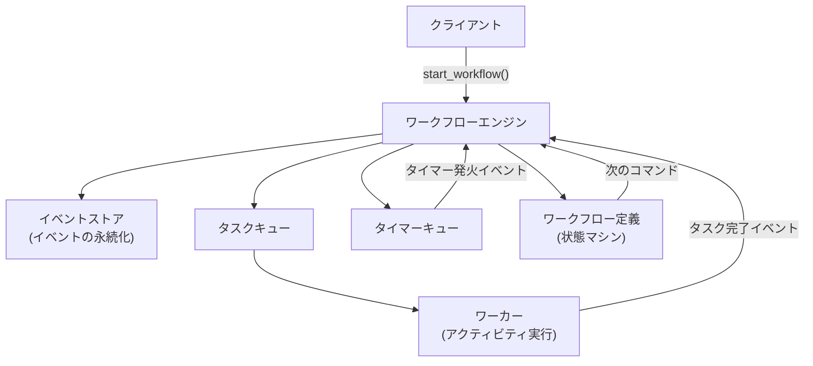
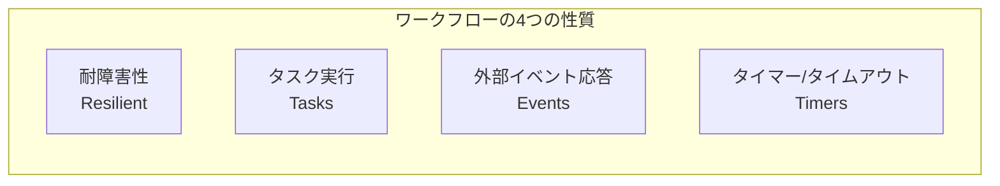
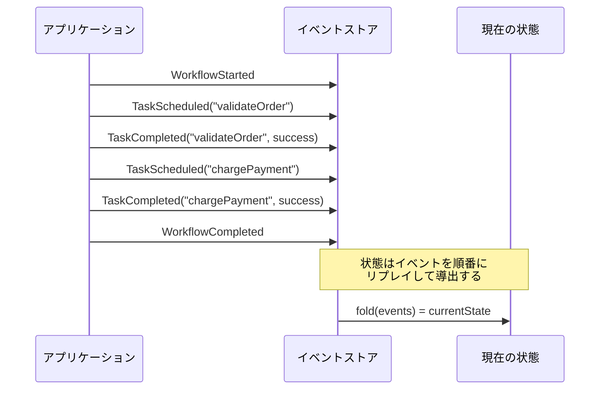
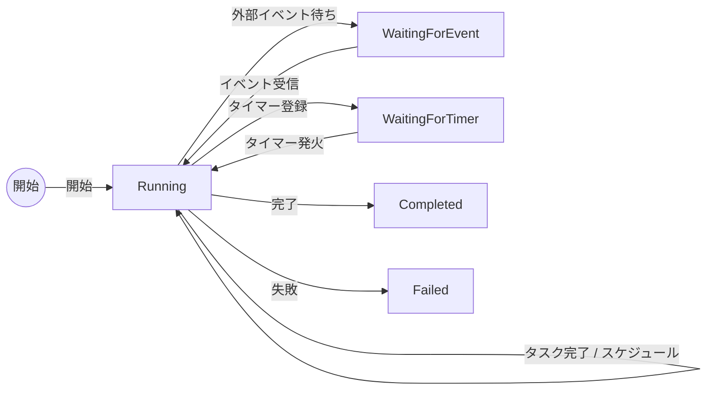
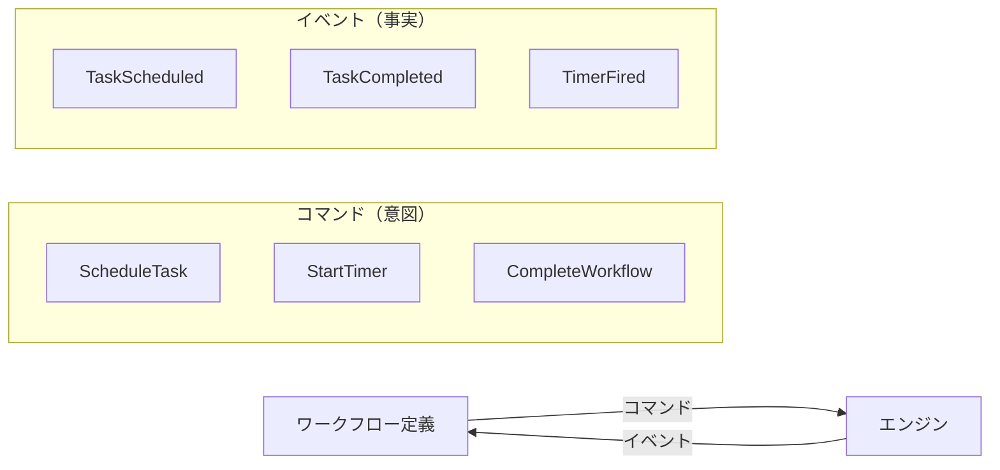
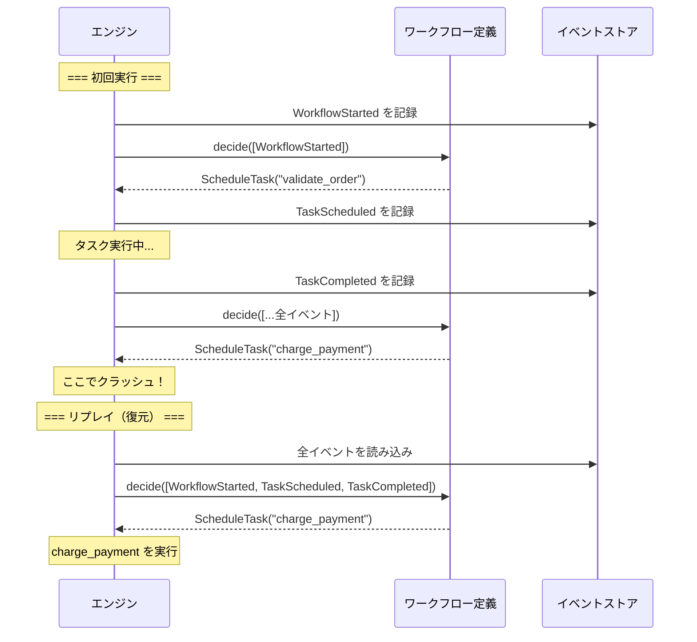
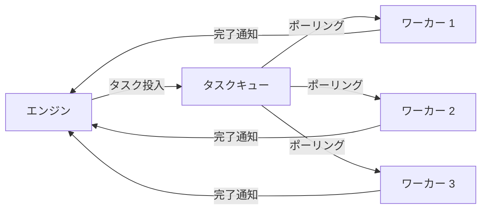
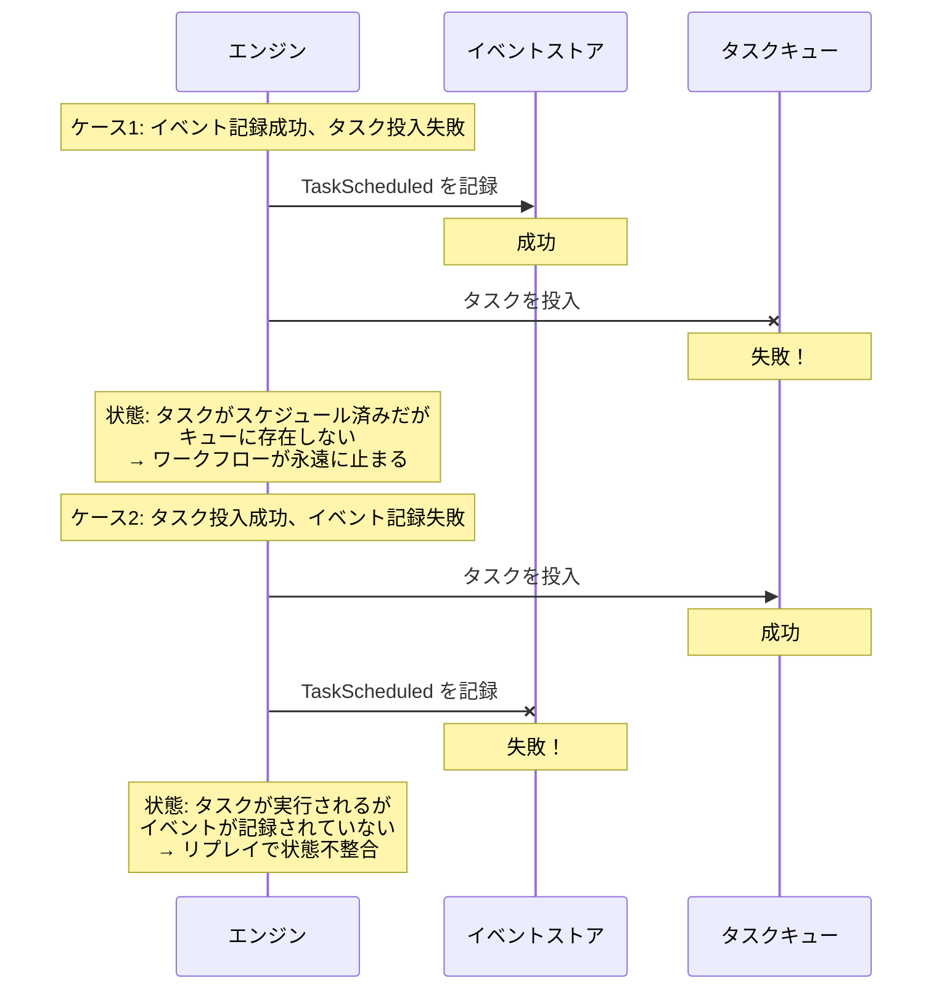
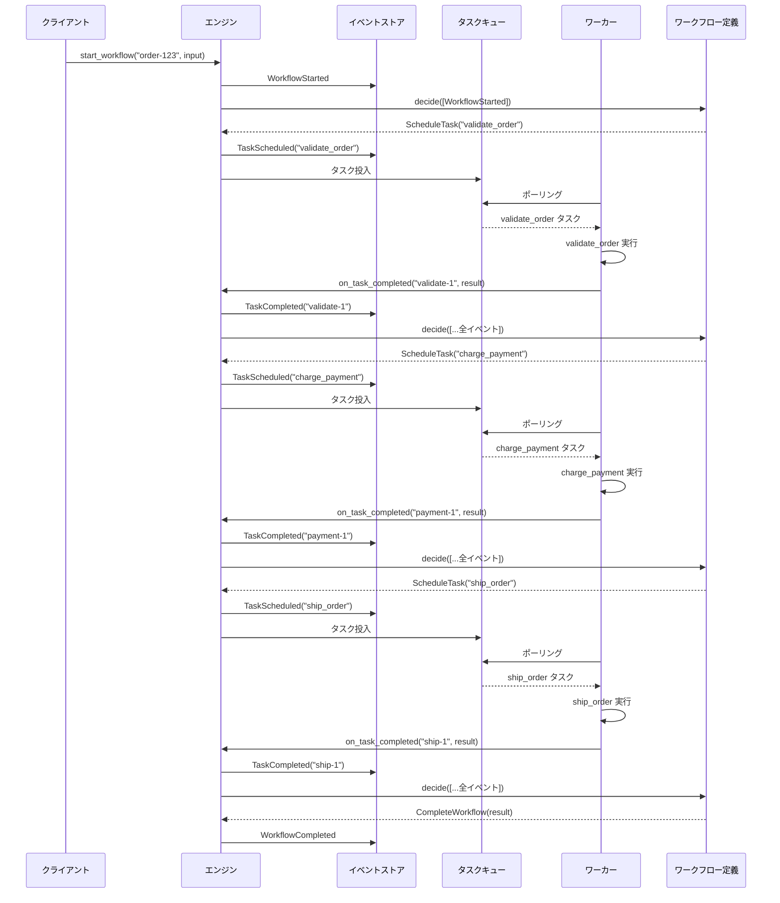
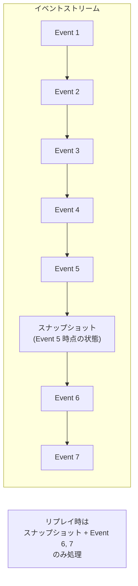

## はじめに

Temporal、Azure Durable Functions、AWS Step Functions——現代の分散システムで「ワークフローエンジン」は不可欠なインフラです。EC サイトの注文処理、SaaS のユーザーオンボーディング、決済フローなど、「複数のステップを確実に最後まで実行しなければならない処理」を支えているのが、この仕組みです。

しかし、その内部では一体何が起きているのでしょうか？ ワークフローエンジンを「使う」だけでなく「作る」側に回ることで、設計の根底にある原理をはじめて本当に理解できるようになります。

この記事では、イベントドリブンなワークフローエンジンを **Python でゼロから実装** しながら、その根底にある設計原理を徹底的に理解します。Python の `dataclass`、`ABC`（抽象基底クラス）、`collections.deque` といった標準ライブラリだけで実装するので、外部ライブラリのインストールは一切不要です。

### この記事で扱うトピック

1. ワークフローとは何か——4つの本質的性質
2. イベントソーシング——状態を「イベントの列」として保存する
3. ワークフロー定義——決定論的な状態マシン
4. 決定論的リプレイ——障害耐性の核心
5. タスクキューとワーカー
6. タイマーとタイムアウト
7. トランザクション整合性——Outbox パターン
8. すべてを組み合わせる——注文処理ワークフロー
9. スナップショットによる最適化
10. 商用エンジンとの対応

### 対象読者

- Python の基本文法（クラス、関数、辞書、リスト）を理解している方
- 分散システムやワークフローエンジンに興味があるが、内部の仕組みは知らない方
- Temporal や Azure Durable Functions を「なんとなく使っている」が、設計原理を深く理解したい方

それでは、まず全体アーキテクチャの俯瞰から始めましょう。

## 全体アーキテクチャ

これから構築するワークフローエンジンの全体像です。まずは大きな絵を頭に入れてから、各部品を一つずつ実装していきます。



この図に登場する各コンポーネントの役割を簡単に整理しておきます。

- <strong>ワークフローエンジン</strong>——全体を統括するオーケストレーター。イベントストアから履歴を読み込み、ワークフロー定義に問い合わせて次のアクションを決定します。
- <strong>イベントストア</strong>——起きたことをすべて記録する「帳簿」。追記のみ可能で、既存の記録は変更しません。
- <strong>ワークフロー定義</strong>——ビジネスロジックそのもの。「注文を検証→決済→発送」という手順を定義する状態マシンです。
- <strong>タスクキュー</strong>——副作用のある処理（API 呼び出し、DB 操作など）をワーカーに委託するための待ち行列です。
- <strong>ワーカー</strong>——タスクキューから仕事を取り出して実際に実行するプロセスです。
- <strong>タイマーキュー</strong>——「30日後にリマインダーを送る」のような時間ベースの制御を管理します。

この構造は Temporal のアーキテクチャを大幅に簡略化したものですが、核心的な概念は同じです。Temporal は Uber 社内で開発された Cadence の後継プロジェクトであり、世界中の企業で本番運用されています。本記事のゴールは、こうした商用エンジンの「なぜそういう設計になっているのか」を、自分の手でコードを書きながら体得することです。

## 第1章：ワークフローとは何か——4つの本質的性質

### 「普通のプログラム」では何が足りないのか

まず、ワークフローエンジンを使わないとどうなるか——「普通のプログラム」で注文処理を書く場合を考えてみましょう。

```python
def process_order(order):
    validate_order(order)        # ステップ1: 注文の検証
    charge_payment(order)        # ステップ2: 決済
    ship_order(order)            # ステップ3: 発送
    send_confirmation(order)     # ステップ4: 確認メール
```

一見シンプルですが、以下の問題があります。

- `charge_payment()` が成功した直後にプロセスがクラッシュしたら？ 決済は済んでいるのに発送されず、お客様に二重課金されるかもしれません。
- `ship_order()` が外部配送 API のタイムアウトで失敗したら？ 何分後にリトライすべきでしょうか。リトライ中にまたクラッシュしたら？
- 「お客様の承認を3日間待って、タイムアウトしたらキャンセル」のような待機をどう実現しますか？ `time.sleep(3 * 86400)` では、プロセスが再起動されたら待機状態が消えます。

ワークフローエンジンは、こうした「長時間にわたる複数ステップの処理を、障害があっても確実に最後まで実行する」ための仕組みです。

### ワークフローの4つの性質

Temporal の共同創設者 Maxim Fateev は、ワークフローを次の4つの性質で定義しています：

1. <strong>耐障害性のあるプログラム</strong>（Resilient Program）——プロセスがクラッシュしても実行を途中から継続できる
2. <strong>タスクを実行する</strong>（Executes Tasks）——外部の副作用を持つ処理（API 呼び出し、DB 書き込み等）を呼び出す
3. <strong>外部イベントに反応する</strong>（Reacts to External Events）——人間の承認ボタンや Webhook など、外部からの通知を受け取れる
4. <strong>タイマーとタイムアウト</strong>（Timers and Timeouts）——「30日間スリープ」「3日以内に承認がなければキャンセル」のような時間ベースの制御ができる



これら4つの性質をすべて満たすために、ワークフローエンジンは **イベントソーシング** と **決定論的リプレイ** という2つの仕組みを中核に据えています。次の章から、この2つを順番に実装していきます。

## 第2章：イベントソーシング——すべては「イベントの列」

### なぜ「現在の状態」だけでは不十分なのか

従来の CRUD（Create/Read/Update/Delete）アプローチでは、データベースに「現在の状態」だけを保存します。たとえば注文テーブルに `status = "paid"` と書き込めば、それが「今の状態」です。

しかし、ワークフローエンジンにとって、この方式には致命的な問題があります。

- <strong>監査証跡がない</strong>——`status` が `"paid"` になった経緯がわかりません。いつ誰がどういう理由で変更したのか、履歴が消えています。
- <strong>障害復旧ができない</strong>——プロセスがクラッシュした瞬間、メモリ上の中間状態は消えます。DB の `status` は更新されていたかもしれないし、されていなかったかもしれない。中途半端な状態を正しく復元する方法がありません。
- <strong>デバッグが困難</strong>——本番環境で問題が起きたとき、「どういう順序で何が起きたか」を後から再現できません。

### イベントソーシングという解決策

イベントソーシングでは、状態の変更を直接データベースに書き込む代わりに、**起きた出来事（イベント）をすべて時系列順に記録** します。現在の状態は、記録されたイベントを最初から順番に「リプレイ」（再生）することで導出します。

日常的な例で考えると、銀行の預金口座がまさにイベントソーシングです。通帳には「入金 10,000円」「出金 3,000円」「入金 5,000円」と記録されています。残高（現在の状態）はこれらの取引履歴を上から順に計算すれば求まります：10,000 - 3,000 + 5,000 = 12,000円。残高だけをメモしていたら、途中で計算ミスがあっても検証できません。しかし、取引履歴が全部残っていれば、いつでも正しい残高を再計算できます。



### Python でイベントを表現する——`dataclass` の活用

実装に入りましょう。まず、ワークフローで発生するイベントの種類を Python の `dataclass` で定義します。

`dataclass` は Python 3.7 で導入された機能で、`__init__` や `__repr__` を自動生成してくれるデコレータです。`frozen=True` を指定することで、作成後にフィールドを変更できないイミュータブル（不変）なオブジェクトになります。イベントは「起きた事実」の記録なので、後から内容が書き換わってはいけません。`frozen=True` はその制約をコードレベルで強制するためのものです。

なお、先頭の `from __future__ import annotations` は、型ヒント（`str`, `list[WorkflowEvent]` 等）を文字列として遅延評価させるためのインポートです。これにより、まだ定義していないクラス名を型ヒントに使えるようになります。Python 3.10 以降ではなくても動く場合がありますが、互換性のために指定しておくと安全です。

```python
from __future__ import annotations

import time
from dataclasses import dataclass
from typing import Any


# ──────────────────────────────────────────────
# イベント：「起きたこと」を表すイミュータブルなデータ
# frozen=True により、生成後のフィールド変更を禁止する
# ──────────────────────────────────────────────

@dataclass(frozen=True)
class WorkflowStarted:
    workflow_id: str
    input_data: Any
    timestamp: float

@dataclass(frozen=True)
class TaskScheduled:
    task_id: str
    task_name: str
    input_data: Any
    timestamp: float

@dataclass(frozen=True)
class TaskCompleted:
    task_id: str
    result: Any
    timestamp: float

@dataclass(frozen=True)
class TaskFailed:
    task_id: str
    error: str
    timestamp: float

@dataclass(frozen=True)
class TimerScheduled:
    timer_id: str
    fire_at: float          # Unix タイムスタンプ（秒）
    timestamp: float

@dataclass(frozen=True)
class TimerFired:
    timer_id: str
    timestamp: float

@dataclass(frozen=True)
class ExternalEventReceived:
    event_name: str
    payload: Any
    timestamp: float

@dataclass(frozen=True)
class WorkflowCompleted:
    result: Any
    timestamp: float

@dataclass(frozen=True)
class WorkflowFailed:
    error: str
    timestamp: float


# すべてのイベント型をまとめた型エイリアス（Union 型）
WorkflowEvent = (
    WorkflowStarted | TaskScheduled | TaskCompleted | TaskFailed
    | TimerScheduled | TimerFired | ExternalEventReceived
    | WorkflowCompleted | WorkflowFailed
)
```

各イベントクラスに共通して `timestamp` フィールドがあることに注目してください。これは「そのイベントが起きた時刻」を記録するためのもので、後述する決定論的リプレイでも重要な役割を果たします。

### イベントストアの実装

イベントを保存・取得するための「イベントストア」を実装します。ここではシンプルにインメモリ（メモリ上の辞書）で実装しますが、本番システムでは PostgreSQL や DynamoDB などの永続ストレージに置き換えます。

```python
from collections import defaultdict


class EventStore:
    """追記専用（append-only）のイベントストア。

    ワークフロー ID ごとにイベントのリストを保持する。
    一度記録されたイベントは変更も削除もしない——
    これがイベントソーシングの根幹ルール。
    """

    def __init__(self) -> None:
        # dict のキーが workflow_id、値がイベントのリスト
        self._streams: dict[str, list[WorkflowEvent]] = defaultdict(list)

    def append(self, workflow_id: str, events: list[WorkflowEvent]) -> None:
        """イベントを末尾に追記する。既存イベントには触れない。"""
        self._streams[workflow_id].extend(events)

    def get_events(self, workflow_id: str) -> list[WorkflowEvent]:
        """指定ワークフローの全イベントを時系列順で返す。"""
        return list(self._streams[workflow_id])

    def get_events_since(
        self, workflow_id: str, after_index: int
    ) -> list[WorkflowEvent]:
        """指定インデックス以降のイベントのみ返す（スナップショット最適化用）。"""
        return list(self._streams[workflow_id][after_index:])
```

`defaultdict(list)` を使うことで、まだ存在しないワークフロー ID に対して `append` しても、自動的に空リストが作られます。

ここで重要なのは、イベントストアが **追記専用**（append-only）であることです。一度記録されたイベントは変更も削除もしません。`append` メソッドは末尾に追加するだけで、既存のイベントには一切触れません。これがイベントソーシングの根幹ルールです。

なぜ追記専用なのでしょうか？ もし過去のイベントを書き換えてしまったら、そのイベントに基づいて導出される「現在の状態」が変わってしまいます。すると、障害後のリプレイで別の状態が復元されてしまい、整合性が壊れます。銀行口座の通帳から過去の取引を消してはいけないのと同じ理由です。

## 第3章：ワークフロー定義——決定論的な状態マシン

### ワークフローは状態マシンである

イベントストアの実装ができたので、次は「ワークフローのビジネスロジック」を定義する仕組みを作ります。

あらゆるワークフローエンジン——YAML ベースの AWS Step Functions も、コードベースの Temporal も——の根底には **状態マシン**（ステートマシン）という概念があります。状態マシンとは、「現在どの状態にいるか」と「どんなイベントが来たら次のどの状態に遷移するか」を定義するモデルです。

たとえば注文処理であれば、「注文受付」→「検証済み」→「決済済み」→「発送済み」→「完了」という状態があり、各ステップの完了イベントによって次の状態に遷移します。



エンジンのコアループは、以下のサイクルを繰り返します。

1. イベントストアから**全イベント履歴**を読み込む
2. その履歴をワークフロー定義（状態マシン）に渡す
3. ワークフロー定義が「次に実行すべきコマンド」を返す（例：「タスク A を実行せよ」）
4. エンジンがコマンドを実行し、結果をイベントとして記録する
5. 1 に戻る

ここで「コマンド」と「イベント」を明確に区別することが、極めて重要な設計原理です。

### コマンドとイベントの分離

- <strong>コマンド</strong>（Command）は、ワークフロー定義が発行する**意図**です。「このタスクを実行してほしい」「タイマーを設定してほしい」という**依頼**に相当します。
- <strong>イベント</strong>（Event）は、エンジンが記録する**事実**です。「このタスクが完了した」「タイマーが発火した」という**結果**に相当します。



なぜ分離するのでしょうか？ この分離により、ワークフロー定義は**純粋なロジック**に集中できます。「決済 API を呼ぶ」という副作用の実行はエンジンやワーカーに完全に委ねられるため、ワークフロー定義自体はテストしやすく、リプレイ可能になるのです。

### Python でコマンドとワークフロー定義を実装する

コマンドもイベントと同じように `dataclass` で定義します。そして、ワークフロー定義のインターフェースを `ABC`（Abstract Base Class：抽象基底クラス）で定義します。

`ABC` は「このクラスを直接インスタンス化することはできず、必ずサブクラスで指定されたメソッドを実装しなければならない」という制約を強制する仕組みです。Java や C# の `interface` に相当します。

```python
from abc import ABC, abstractmethod


# ──────────────────────────────────────────────
# コマンド：ワークフロー定義が発行する「意図」
# ──────────────────────────────────────────────

@dataclass(frozen=True)
class ScheduleTask:
    task_id: str
    task_name: str
    input_data: Any

@dataclass(frozen=True)
class StartTimer:
    timer_id: str
    delay_seconds: float

@dataclass(frozen=True)
class WaitForEvent:
    event_name: str

@dataclass(frozen=True)
class CompleteWorkflow:
    result: Any

@dataclass(frozen=True)
class FailWorkflow:
    error: str


WorkflowCommand = (
    ScheduleTask | StartTimer | WaitForEvent
    | CompleteWorkflow | FailWorkflow
)


# ──────────────────────────────────────────────
# ワークフロー定義の抽象インターフェース
# ──────────────────────────────────────────────

class WorkflowDefinition(ABC):
    """ワークフローのビジネスロジックを表す抽象基底クラス。

    サブクラスは decide() メソッドを実装する。
    decide() は「イベント履歴を受け取り、次のコマンドのリストを返す」
    純粋関数でなければならない。
    """

    @abstractmethod
    def decide(self, events: list[WorkflowEvent]) -> list[WorkflowCommand]:
        """イベント履歴から次に実行すべきコマンドを決定する。

        重要: このメソッドは **純粋関数** でなければならない。
        同じイベント列を入力すれば、必ず同じコマンド列を返すこと。
        """
        ...
```

`decide` メソッドが**純粋関数**であるという制約は、この記事全体で最も重要なポイントです。「同じ入力（イベント列）に対して、必ず同じ出力（コマンド列）を返す。副作用を一切持たない。」この性質があるからこそ、後述する決定論的リプレイが成立します。

### 具体例：注文処理ワークフロー

実際にワークフロー定義を実装してみましょう。注文処理の流れは「注文検証 → 決済 → 発送 → 完了」です。

```python
class OrderWorkflow(WorkflowDefinition):
    """注文処理ワークフロー。

    検証 → 決済 → 発送 → 完了 の順に進む。
    途中でタスクが失敗したらワークフロー全体を失敗にする。
    """

    def decide(self, events: list[WorkflowEvent]) -> list[WorkflowCommand]:
        # まずイベント履歴から「今どのフェーズにいるか」を計算する
        state = self._build_state(events)

        # フェーズに応じて次のコマンドを返す
        if state["phase"] == "started":
            return [ScheduleTask(
                task_id="validate-1",
                task_name="validate_order",
                input_data=state["order_data"],
            )]

        if state["phase"] == "validated":
            return [ScheduleTask(
                task_id="payment-1",
                task_name="charge_payment",
                input_data=state["order_data"],
            )]

        if state["phase"] == "charged":
            return [ScheduleTask(
                task_id="ship-1",
                task_name="ship_order",
                input_data=state["order_data"],
            )]

        if state["phase"] == "shipped":
            return [CompleteWorkflow(result={
                "order_id": state["order_id"],
                "status": "delivered",
            })]

        if state["phase"] == "failed":
            return [FailWorkflow(error=state["error_message"])]

        # タスク実行中や外部イベント待ちの場合はコマンドなし
        return []

    def _build_state(self, events: list[WorkflowEvent]) -> dict:
        """イベント履歴を先頭から順に処理して現在の状態を構築する。

        この操作はイベントソーシングにおいて rehydration（再水和）と呼ばれる。
        関数型プログラミングでは fold（畳み込み）に相当する。
        """
        phase = "initial"
        order_data: Any = None
        order_id = ""
        error_message = ""

        for event in events:
            if isinstance(event, WorkflowStarted):
                phase = "started"
                order_data = event.input_data
                if isinstance(event.input_data, dict):
                    order_id = event.input_data.get("order_id", "")

            elif isinstance(event, TaskCompleted):
                if event.task_id == "validate-1":
                    phase = "validated"
                elif event.task_id == "payment-1":
                    phase = "charged"
                elif event.task_id == "ship-1":
                    phase = "shipped"

            elif isinstance(event, TaskFailed):
                phase = "failed"
                error_message = event.error

        return {
            "phase": phase,
            "order_data": order_data,
            "order_id": order_id,
            "error_message": error_message,
        }
```

`_build_state` メソッドに注目してください。イベントリストを先頭から順に処理して、「今どのフェーズにいるか」を計算しています。この操作はイベントソーシングの世界で **rehydration**（再水和）と呼ばれます。関数型プログラミングに馴染みがあれば、`functools.reduce`（fold/畳み込み）と同じパターンだとわかるでしょう。

重要なのは、`_build_state` が `isinstance` でイベントの型を判別し、型ごとに状態を更新している点です。Python では `isinstance` を使ったパターンマッチングが、TypeScript の `switch (event.type)` や、Rust の `match` に相当する書き方です。Python 3.10 以降では `match` 文も使えますが、ここでは互換性のために `isinstance` を使います。

## 第4章：決定論的リプレイ——障害耐性の核心

### なぜリプレイで復元できるのか

ワークフローエンジンの最も重要な特性は **障害耐性** です。プロセスがクラッシュしても、イベントストアに記録されたイベント列をリプレイするだけで、まったく同じ状態を復元できます。

なぜこれが可能なのでしょうか？ 前章で実装した `decide` メソッドが**純粋関数**だからです。同じイベント列を入力すれば、必ず同じコマンド列が返ります。つまり、イベントストアに残っている履歴を `decide` に渡すだけで、「今どこまで進んでいて、次に何をすべきか」が一意に決まるのです。



この図の「リプレイ（復元）」の部分を見てください。新しいプロセスが起動すると、まずイベントストアから全履歴を読み込み、`decide` に渡します。`decide` はクラッシュ前と同じイベント列に対して同じコマンドを返すので、エンジンは「あ、ここまでは済んでいるから、次は `charge_payment` だな」と判断し、正しく再開できるのです。

### 決定論性の制約——`decide` の中でやってはいけないこと

この仕組みが成立するためには、ワークフロー定義の `decide` メソッドが**決定論的**——つまり「同じ入力に対して常に同じ出力を返す」——でなければなりません。したがって、`decide` の中では以下の操作が禁止されます。

| 禁止事項 | 理由 | 代替手段 |
|----------|------|---------|
| `random.random()` | リプレイ時に異なる値が返る | タスクとして実行し結果をイベントに記録 |
| `time.time()` | リプレイ時に異なるタイムスタンプが返る | イベントの `timestamp` フィールドを使用 |
| ネットワーク呼び出し | リプレイ時に副作用が再実行される | アクティビティ（タスク）として実行 |
| グローバル変数の参照 | プロセス間で値が異なる可能性 | イベントの入力として渡す |

Temporal はこの制約を「ワークフローコードは **決定論的** でなければならない」と公式ドキュメントに明記しています。副作用のある処理はすべて**アクティビティ**（タスク）として外部化し、その結果をイベントとして記録します。リプレイ時には、アクティビティを再実行するのではなく、記録済みのイベント（結果）を使うことで、決定論性を保ちます。

### リプレイエンジンの実装

いよいよ、ワークフローエンジン本体の実装です。これがシステム全体のオーケストレーターであり、イベントストア・ワークフロー定義・タスクキュー・タイマーキューを結びつける中心的なコンポーネントです。

```python
class WorkflowEngine:
    """ワークフローエンジン本体。

    責務:
    1. ワークフローの開始（start_workflow）
    2. イベント履歴からの状態復元と次コマンドの決定（process_workflow）
    3. コマンドの実行とイベントの記録（_execute_command）
    4. タスク完了/失敗/タイマー発火のコールバック
    """

    def __init__(
        self,
        event_store: EventStore,
        task_queue: "TaskQueue",
        timer_queue: "TimerQueue",
        registry: dict[str, WorkflowDefinition],
    ) -> None:
        self.event_store = event_store
        self._task_queue = task_queue
        self._timer_queue = timer_queue
        self._registry = registry

    # ─── ワークフローの開始 ───

    def start_workflow(
        self, workflow_id: str, workflow_type: str, input_data: Any
    ) -> None:
        """新しいワークフローを開始する。"""
        start_event = WorkflowStarted(
            workflow_id=workflow_id,
            input_data=input_data,
            timestamp=time.time(),
        )
        self.event_store.append(workflow_id, [start_event])
        self.process_workflow(workflow_id, workflow_type)

    # ─── コアループ ───

    def process_workflow(self, workflow_id: str, workflow_type: str) -> None:
        """イベント列から次のコマンドを決定し実行する。

        このメソッドが「決定論的リプレイ」の実体。
        同じイベント列に対して decide() は同じコマンド列を返すため、
        クラッシュ後でも正しい地点から再開できる。
        """
        definition = self._registry.get(workflow_type)
        if definition is None:
            raise ValueError(f"Unknown workflow type: {workflow_type}")

        events = self.event_store.get_events(workflow_id)

        # ① 決定論的リプレイ：同じイベント列 → 同じコマンド列
        commands = definition.decide(events)

        # ② 既にスケジュール済みのコマンドをスキップ（冪等性の確保）
        new_commands = self._filter_already_processed(events, commands)

        # ③ 新しいコマンドだけを実行
        for command in new_commands:
            self._execute_command(workflow_id, workflow_type, command)

    # ─── コマンドの実行 ───

    def _execute_command(
        self, workflow_id: str, workflow_type: str, command: WorkflowCommand
    ) -> None:
        """コマンドを実行し、対応するイベントを記録する。"""
        now = time.time()

        if isinstance(command, ScheduleTask):
            event = TaskScheduled(
                task_id=command.task_id,
                task_name=command.task_name,
                input_data=command.input_data,
                timestamp=now,
            )
            self.event_store.append(workflow_id, [event])
            self._task_queue.enqueue(TaskEntry(
                workflow_id=workflow_id,
                workflow_type=workflow_type,
                task_id=command.task_id,
                task_name=command.task_name,
                input_data=command.input_data,
            ))

        elif isinstance(command, StartTimer):
            fire_at = now + command.delay_seconds
            event = TimerScheduled(
                timer_id=command.timer_id,
                fire_at=fire_at,
                timestamp=now,
            )
            self.event_store.append(workflow_id, [event])
            self._timer_queue.schedule(TimerEntry(
                workflow_id=workflow_id,
                workflow_type=workflow_type,
                timer_id=command.timer_id,
                fire_at=fire_at,
            ))

        elif isinstance(command, CompleteWorkflow):
            event = WorkflowCompleted(result=command.result, timestamp=now)
            self.event_store.append(workflow_id, [event])

        elif isinstance(command, FailWorkflow):
            event = WorkflowFailed(error=command.error, timestamp=now)
            self.event_store.append(workflow_id, [event])

        # WaitForEvent はエンジン側では何もしない——
        # 外部イベントの到着を待つだけ

    # ─── コールバック ───

    def on_task_completed(
        self, workflow_id: str, workflow_type: str,
        task_id: str, result: Any,
    ) -> None:
        """ワーカーからタスク完了の通知を受け取る。"""
        event = TaskCompleted(
            task_id=task_id, result=result, timestamp=time.time()
        )
        self.event_store.append(workflow_id, [event])
        # ワークフローを再駆動して次のコマンドを決定
        self.process_workflow(workflow_id, workflow_type)

    def on_task_failed(
        self, workflow_id: str, workflow_type: str,
        task_id: str, error: str,
    ) -> None:
        """ワーカーからタスク失敗の通知を受け取る。"""
        event = TaskFailed(
            task_id=task_id, error=error, timestamp=time.time()
        )
        self.event_store.append(workflow_id, [event])
        self.process_workflow(workflow_id, workflow_type)

    def on_timer_fired(
        self, workflow_id: str, workflow_type: str,
        timer_id: str, now: float,
    ) -> None:
        """タイマーキューからタイマー発火の通知を受け取る。"""
        event = TimerFired(timer_id=timer_id, timestamp=now)
        self.event_store.append(workflow_id, [event])
        self.process_workflow(workflow_id, workflow_type)

    # ─── 冪等性フィルター ───

    def _filter_already_processed(
        self,
        events: list[WorkflowEvent],
        commands: list[WorkflowCommand],
    ) -> list[WorkflowCommand]:
        """既にスケジュール済みのコマンドをスキップする。

        リプレイ時に同じコマンドを二重実行しないための冪等性ガード。
        """
        scheduled_task_ids: set[str] = set()
        scheduled_timer_ids: set[str] = set()
        is_completed = False

        for e in events:
            if isinstance(e, TaskScheduled):
                scheduled_task_ids.add(e.task_id)
            elif isinstance(e, TimerScheduled):
                scheduled_timer_ids.add(e.timer_id)
            elif isinstance(e, (WorkflowCompleted, WorkflowFailed)):
                is_completed = True

        if is_completed:
            return []

        result: list[WorkflowCommand] = []
        for cmd in commands:
            if isinstance(cmd, ScheduleTask) and cmd.task_id in scheduled_task_ids:
                continue    # 既にスケジュール済み → スキップ
            if isinstance(cmd, StartTimer) and cmd.timer_id in scheduled_timer_ids:
                continue
            result.append(cmd)

        return result
```

コードが長いですが、各部分の責務は明確です。ポイントを整理しましょう。

1. <strong>`process_workflow`</strong>——コアループです。イベントストアから全イベントを読み込み、`decide()` に渡して次のコマンドを計算し、まだ実行していないコマンドだけを実行します。
2. <strong>`_execute_command`</strong>——コマンドの種類に応じてイベントを記録し、タスクキューやタイマーキューに仕事を投入します。
3. <strong>`on_task_completed` / `on_task_failed` / `on_timer_fired`</strong>——外部からの通知を受け取り、イベントを記録してから `process_workflow` を再度呼び出します。これにより、ワークフローが「次のステップ」に進みます。
4. <strong>`_filter_already_processed`</strong>——冪等性のガードです。リプレイ時に `decide()` が「タスク A をスケジュールせよ」と返しても、イベントストアに「タスク A はスケジュール済み」の記録があればスキップします。これにより、同じコマンドが二重実行されることを防ぎます。

## 第5章：タスクキューとワーカー

### なぜキューが必要なのか

ワークフローエンジンが「決済 API を呼び出せ」と決定したとき、なぜエンジン自体が直接 API を呼ばないのでしょうか？ なぜわざわざキューを経由してワーカーに実行させるのでしょうか？

理由は3つあります。

1. <strong>流量制御</strong>——外部 API には秒間リクエスト数の上限（レートリミット）があります。キューを挟むことで、ワーカーの処理能力に応じてタスクを分配できます。
2. <strong>可用性</strong>——ワーカーが一時的にダウンしても、タスクはキューに残ります。ワーカーが復旧したら、キューからタスクを取り出して処理を再開できます。
3. <strong>スケーラビリティ</strong>——ワーカーを水平スケール（台数追加）して、並列処理能力を上げることができます。1台のワーカーが処理しきれない量のタスクが来ても、10台に増やせば対応できます。



### タスクキューとワーカーの実装

`collections` モジュールの `deque`（ダブルエンドキュー）は、両端からの追加・削除が O(1) で行えるデータ構造です。通常の `list` では `list.pop(0)` が O(n) ですが、`deque.popleft()` は O(1) なので、FIFO キューの実装に最適です。

`collections.abc` の `Callable` と `Awaitable` は型ヒントに使う型です。`Callable[[Any], Awaitable[Any]]` は「任意の型の引数を1つ受け取り、非同期の結果を返す関数」を意味します。これがアクティビティ関数の型です。

```python
from collections import deque
from collections.abc import Awaitable, Callable


@dataclass
class TaskEntry:
    """タスクキューに投入されるエントリ。"""
    workflow_id: str
    workflow_type: str
    task_id: str
    task_name: str
    input_data: Any


class TaskQueue:
    """シンプルなインメモリ FIFO タスクキュー。

    本番では RabbitMQ、Amazon SQS、Redis Streams 等に置き換える。
    """

    def __init__(self) -> None:
        self._queue: deque[TaskEntry] = deque()

    def enqueue(self, task: TaskEntry) -> None:
        """タスクをキューの末尾に追加する。"""
        self._queue.append(task)

    def dequeue(self) -> TaskEntry | None:
        """キューの先頭からタスクを取得する（FIFO）。

        キューが空の場合は None を返す。
        """
        if self._queue:
            return self._queue.popleft()
        return None

    def __len__(self) -> int:
        return len(self._queue)


# アクティビティ関数の型：入力を受け取り結果を返す非同期関数
ActivityFn = Callable[[Any], Awaitable[Any]]


class Worker:
    """ワーカー：タスクキューからタスクを取得し実行する。

    アクティビティ（副作用のある処理）を実行し、
    完了/失敗をエンジンに通知する。
    """

    def __init__(
        self,
        task_queue: TaskQueue,
        engine: WorkflowEngine,
        activities: dict[str, ActivityFn],
    ) -> None:
        self._task_queue = task_queue
        self._engine = engine
        self._activities = activities

    async def poll(self) -> None:
        """キューからタスクを1つ取得して実行する。

        本番ではこれをループで回し続ける（ロングポーリング）。
        """
        task = self._task_queue.dequeue()
        if task is None:
            return

        activity = self._activities.get(task.task_name)
        if activity is None:
            self._engine.on_task_failed(
                task.workflow_id, task.workflow_type,
                task.task_id, f"Unknown activity: {task.task_name}",
            )
            return

        try:
            result = await activity(task.input_data)
            self._engine.on_task_completed(
                task.workflow_id, task.workflow_type,
                task.task_id, result,
            )
        except Exception as exc:
            self._engine.on_task_failed(
                task.workflow_id, task.workflow_type,
                task.task_id, str(exc),
            )
```

ワーカーは**アクティビティ**を実行します。アクティビティとは、外部 API 呼び出し、データベース操作、メール送信など、**副作用を持つ処理**です。

ここで重要な区別を再確認しましょう。

- <strong>ワークフロー定義</strong>——純粋関数。副作用なし。決定論的。リプレイ可能。
- <strong>アクティビティ</strong>——副作用あり。非決定論的で構わない。実行結果はイベントとして記録される。

アクティビティが非決定論的でも問題ない理由は、**その結果がイベントとして記録されるから**です。リプレイ時には、アクティビティを再実行するのではなく、イベントストアに記録された結果（`TaskCompleted` や `TaskFailed`）を使います。だから、たとえアクティビティが「外部 API の呼び出し」で毎回異なる結果を返す処理であっても、リプレイの決定論性には影響しません。

## 第6章：タイマーとタイムアウト

### 「30日間スリープ」をどう実現するか

ワークフローでは「承認待ちで3日間タイムアウト」「30日後にリマインダー送信」といった長時間の待機が必要になります。

素朴に `time.sleep(30 * 86400)` と書いたらどうなるでしょうか？ プロセスが再起動されたら、スリープ状態は消えてしまいます。30日間ずっとプロセスを動かし続けるのは非現実的ですし、メモリも無駄に消費します。

ソリューションは**永続タイマー**です。「何時何分に発火する」という予約情報をイベントとして記録し、別のプロセス（タイマーサービス）が定期的にチェックして、時刻が来たらイベントを発火します。プロセスが再起動しても、イベントストアに「タイマーを予約した」という記録が残っているので、タイマーサービスが再起動後に自動的に復元できます。

```python
@dataclass
class TimerEntry:
    """タイマーキューに登録されるエントリ。"""
    workflow_id: str
    workflow_type: str
    timer_id: str
    fire_at: float   # Unix タイムスタンプ（秒）


class TimerQueue:
    """永続タイマーキュー。

    発火時刻順にソートされたリストを保持し、
    定期的に check_and_fire() を呼ぶことで
    期限到来のタイマーを発火する。

    本番では Redis の Sorted Set や
    データベースのスケジューラに置き換える。
    """

    def __init__(self) -> None:
        self._timers: list[TimerEntry] = []

    def schedule(self, timer: TimerEntry) -> None:
        """タイマーを登録し、発火時刻順にソートする。"""
        self._timers.append(timer)
        self._timers.sort(key=lambda t: t.fire_at)

    def check_and_fire(
        self, engine: WorkflowEngine, now: float | None = None
    ) -> None:
        """発火時刻を過ぎたタイマーをすべて発火する。"""
        if now is None:
            now = time.time()

        while self._timers and self._timers[0].fire_at <= now:
            timer = self._timers.pop(0)
            engine.on_timer_fired(
                timer.workflow_id, timer.workflow_type,
                timer.timer_id, now,
            )
```

`check_and_fire` メソッドがエンジンの `on_timer_fired` を呼び出す点に注目してください。前章のワーカーがエンジンの `on_task_completed` を呼ぶのと同じパターンです。タイマーの発火もワーカーのタスク完了も、エンジンから見れば「イベントの記録 → `process_workflow` の再駆動」という同じフローになります。

## 第7章：トランザクション整合性——Outbox パターン

### 分散システムにおける整合性の罠

ワークフローエンジンの各操作では、複数の更新を**アトミック**（全部成功するか全部失敗するか）に行う必要があります。

1. イベントストアにイベントを追記する
2. タスクキューにタスクを投入する
3. タイマーキューにタイマーを登録する

もしこれらがアトミックでない場合、深刻な不整合が発生します。



ケース1では、イベントストアには「タスクをスケジュールした」と記録されているのに、実際にはタスクがキューに入っていないため、ワーカーが永遠にそのタスクを処理しません。ワークフローは永久に止まります。

ケース2では、タスクキューにタスクが入っており実行されるのに、イベントストアにはその記録がありません。リプレイ時に `decide` は「まだスケジュールしていない」と判断し、同じタスクを二重にスケジュールしてしまいます。

### Outbox パターンによる解決

Temporal のアーキテクチャではこれを **Transfer Queue** で解決しています。マイクロサービスアーキテクチャでは Chris Richardson が **Transactional Outbox パターン** として形式化しており、広く知られた手法です。

核心的なアイデアは次の通りです。

1. イベントとメッセージ（タスク投入やタイマー登録の「お知らせ」）を**同じトランザクション**でデータベースに書き込む
2. 別のプロセス（Outbox リレー）が非同期でメッセージを読み出して実際のキューに配信する

こうすることで、「イベントは記録されたがメッセージが配信されない」というケース1の問題が解消されます。Outbox リレーのプロセスがクラッシュしても、未配信のメッセージはデータベースに残っているので、再起動後に配信をリトライできます。

```python
import json


@dataclass
class OutboxEntry:
    """Outbox テーブルのエントリ。

    イベントストアと同じトランザクションで書き込まれ、
    Outbox リレーが非同期でタスクキュー/タイマーキューに配信する。
    """
    id: int
    workflow_id: str
    workflow_type: str
    message_type: str      # "task" または "timer"
    payload: str           # JSON 文字列
    processed: bool = False


class TransactionalEventStore:
    """Outbox パターン付きのトランザクショナルイベントストア。

    append_with_outbox() が「イベント追記 + Outbox メッセージ追加」を
    アトミックに行う。実際のシステムではデータベーストランザクションを使う。
    """

    def __init__(self) -> None:
        self._streams: dict[str, list[WorkflowEvent]] = defaultdict(list)
        self._outbox: list[OutboxEntry] = []
        self._next_outbox_id = 1

    def append_with_outbox(
        self,
        workflow_id: str,
        events: list[WorkflowEvent],
        messages: list[OutboxEntry],
    ) -> None:
        """アトミックにイベントを追記し Outbox メッセージを追加する。

        ──── ここがトランザクション境界 ────
        実際のシステムでは BEGIN / COMMIT で囲む：
          BEGIN;
            INSERT INTO event_store ...;
            INSERT INTO outbox ...;
          COMMIT;
        """
        self._streams[workflow_id].extend(events)
        for msg in messages:
            msg.id = self._next_outbox_id
            self._next_outbox_id += 1
            self._outbox.append(msg)

    def process_outbox(
        self,
        task_queue: TaskQueue,
        timer_queue: TimerQueue,
    ) -> None:
        """Outbox リレー：未処理メッセージをキューに配信する。"""
        for entry in self._outbox:
            if entry.processed:
                continue

            payload = json.loads(entry.payload)
            if entry.message_type == "task":
                task_queue.enqueue(TaskEntry(**payload))
            elif entry.message_type == "timer":
                timer_queue.schedule(TimerEntry(**payload))

            entry.processed = True

    def get_events(self, workflow_id: str) -> list[WorkflowEvent]:
        """指定ワークフローの全イベントを返す。"""
        return list(self._streams[workflow_id])
```

この実装はインメモリで「トランザクション境界」をコメントで示しているだけですが、本質的なパターンは同じです。本番システムでは `append_with_outbox` の中身を SQL の `BEGIN` / `COMMIT` で囲むことで、真のアトミック操作にします。

> <strong>Outbox パターンの保証と注意点</strong>：メッセージは「少なくとも1回」配信されます（at-least-once）。Outbox リレーがメッセージを配信した直後にクラッシュすると、`processed = True` への更新が失われ、次回起動時に同じメッセージが再配信される可能性があります。そのため、コンシューマー（ワーカーやタイマー処理）は<strong>冪等</strong>でなければなりません。冪等とは「同じ操作を何回実行しても、1回実行したときと結果が同じ」という性質です。たとえば「残高を1,000円にする」は冪等ですが（何回繰り返しても1,000円）、「残高に1,000円を加算する」は冪等ではありません（繰り返すと加算が増える）。冪等性の確保方法としては、処理済みの task_id を記録しておき、重複を検知してスキップするのが一般的です。

## 第8章：すべてを組み合わせる——注文処理ワークフロー

### 完全な実行フロー

ここまでの部品をすべて組み合わせて、注文処理ワークフローの完全な実行フローを追いかけましょう。各ステップで「どのコンポーネントが何をしているか」を一つずつ確認します。



この一連のフローを言葉で整理すると、以下のようになります。

1. クライアントが `start_workflow` を呼ぶと、エンジンは `WorkflowStarted` イベントを記録し、`decide` を呼びます。
2. `decide` は「まだ検証していない」と判断し、`ScheduleTask("validate_order")` コマンドを返します。
3. エンジンは `TaskScheduled` イベントを記録し、タスクキューにタスクを投入します。
4. ワーカーがタスクキューからタスクを取得し、`validate_order` アクティビティを実行します。
5. 成功したら、ワーカーはエンジンの `on_task_completed` を呼びます。
6. エンジンは `TaskCompleted` イベントを記録し、再び `decide` を呼びます。
7. `decide` は「検証は完了した。次は決済だ」と判断し、`ScheduleTask("charge_payment")` を返します。
8. 以下同様に、決済 → 発送 → 完了 と進みます。

**もしステップ5の直後にクラッシュしたら？** 新しいプロセスが起動し、イベントストアから全イベントを読み込んで `decide` に渡します。`decide` はイベント列から「検証は完了済み、次は決済だ」と決定論的に判断するため、正しくステップ7から再開できます。

### エントリーポイント——すべてを配線する

シーケンス図を見ただけでは「結局どこからどう起動するのか」がわかりにくいかもしれません。ここで、これまで作ってきた部品をすべて配線する `main` 関数を示します。

```python
import asyncio


# ─── アクティビティ関数（副作用のある実際のビジネスロジック） ───

async def validate_order(input_data: Any) -> dict:
    """注文内容を検証する。"""
    order_id = input_data["order_id"]
    # 実際には在庫確認や入力バリデーションを行う
    return {"valid": True, "order_id": order_id}


async def charge_payment(input_data: Any) -> dict:
    """決済処理を行う。"""
    order_id = input_data["order_id"]
    # 実際には決済ゲートウェイ API を呼び出す
    return {"charged": True, "order_id": order_id}


async def ship_order(input_data: Any) -> dict:
    """出荷処理を行う。"""
    order_id = input_data["order_id"]
    # 実際には配送業者 API を呼び出す
    return {"tracking_id": "TRK-456", "order_id": order_id}


# ─── メイン関数 ───

async def main() -> None:
    # 1. インフラ層を初期化
    event_store = EventStore()
    task_queue = TaskQueue()
    timer_queue = TimerQueue()

    # 2. ワークフロー定義を登録
    #    キー "order" は start_workflow の workflow_type に対応
    registry: dict[str, WorkflowDefinition] = {
        "order": OrderWorkflow(),
    }

    # 3. エンジンを組み立て
    engine = WorkflowEngine(event_store, task_queue, timer_queue, registry)

    # 4. アクティビティ関数を登録してワーカーを作成
    #    キーはワークフロー定義の decide() が返す task_name に対応
    activities: dict[str, ActivityFn] = {
        "validate_order": validate_order,
        "charge_payment": charge_payment,
        "ship_order": ship_order,
    }
    worker = Worker(task_queue, engine, activities)

    # 5. ワークフローを開始
    engine.start_workflow(
        workflow_id="order-123",
        workflow_type="order",
        input_data={"order_id": "ORD-123", "items": ["item-A", "item-B"]},
    )

    # 6. ワーカーでタスクを処理（キューが空になるまで）
    while len(task_queue) > 0:
        await worker.poll()

    # 7. 結果を確認
    events = event_store.get("order-123")
    for i, event in enumerate(events):
        print(f"[{i}] {type(event).__name__}")


asyncio.run(main())
```

この `main` 関数が示しているのは、ワークフローエンジンの<strong>依存関係の配線</strong>です。

- `EventStore`、`TaskQueue`、`TimerQueue` はインフラ層——データの永続化とタスクの受け渡しを担当します。
- `OrderWorkflow` はビジネスロジック層——「次に何をすべきか」の判断を担当します。
- `WorkflowEngine` はオーケストレーション層——イベントの記録、`decide` の呼び出し、コマンドの実行を統括します。
- `Worker` は実行層——副作用のあるアクティビティを実際に実行し、結果をエンジンに報告します。

`main` 関数自身はこれらの層を<strong>組み立てて起動するだけ</strong>であり、ビジネスロジックもインフラの詳細も一切含みません。これが関心の分離の効果です。

本番環境では、`while len(task_queue) > 0` のループは常駐プロセスのロングポーリングに置き換わり、`asyncio.run(main())` は Web フレームワークのエントリーポイント（例：FastAPI の `uvicorn` 起動）に統合されます。しかし、配線の構造そのものは変わりません。

### イベントストアの中身

実行完了後、イベントストアには以下のイベントが記録されています。

```text
[0] WorkflowStarted      input={"order_id": "order-123", "items": [...]}
[1] TaskScheduled         task_id="validate-1"  task_name="validate_order"
[2] TaskCompleted         task_id="validate-1"  result={"valid": True}
[3] TaskScheduled         task_id="payment-1"   task_name="charge_payment"
[4] TaskCompleted         task_id="payment-1"   result={"charged": True}
[5] TaskScheduled         task_id="ship-1"      task_name="ship_order"
[6] TaskCompleted         task_id="ship-1"      result={"tracking_id": "TRK-456"}
[7] WorkflowCompleted     result={"order_id": "order-123", "status": "delivered"}
```

この完全な履歴があれば、いつでも任意の時点の状態を復元でき、監査証跡やデバッグに活用できます。「なぜこの注文が失敗したのか？」を調査するとき、イベント列を上から追うだけで、すべての経緯がわかります。

## 第9章：スナップショットによる最適化

### リプレイのコスト問題

ここまでの実装では、`process_workflow` が呼ばれるたびに**全イベント**をイベントストアから読み込み、`decide` に渡しています。ワークフローが短ければ問題ありませんが、数千〜数万ステップのワークフロー（例：大規模バッチ処理や長期間の承認フロー）では、毎回すべてのイベントをリプレイするコストが無視できなくなります。

### スナップショットという解決策

この問題を解決するのが**スナップショット**です。N 件のイベントを処理するごとに「その時点の状態」をスナップショットとして保存し、次回リプレイ時にはスナップショット + それ以降のイベントだけを処理します。



たとえば1,000件のイベントがあるワークフローで、500件目にスナップショットを取っていれば、リプレイ時に処理するのは 501〜1,000 の 500 件だけです。処理量が半分になります。

ここで重要な点は、スナップショットはあくまで**最適化**であるということです。イベントストリームが真のソースオブトゥルース（信頼の源泉）です。スナップショットが壊れたり失われたりしても、イベントストリームからいつでもスナップショットを再生成できるので、データが失われることはありません。

## 第10章：商用ワークフローエンジンとの対応

ここまで実装してきたミニマルなエンジンの各概念が、商用のワークフローエンジンでどのように実現されているかを整理します。概念の名前は違っても、根底にあるメカニズムは同じです。

| 概念 | 本記事の実装 | Temporal | Azure Durable Functions |
|------|-------------|----------|------------------------|
| イベントストア | `EventStore` クラス | History Service（各ワークフローに Event History） | Azure Storage Table/Blob（History Table） |
| ワークフロー定義 | `WorkflowDefinition.decide()` | Workflow 関数（決定論コード） | Orchestrator 関数（`yield`/`await` で replay） |
| タスク実行 | `Worker` + `TaskQueue` | Activity + Task Queue | Activity 関数 + Durable Task Framework |
| タイマー | `TimerQueue` | Durable Timer（History Service 内） | Durable Timer（`create_timer()`） |
| Outbox パターン | `TransactionalEventStore` | Transfer Queue（各シャードにローカルキュー） | Control Queue + Work Item Queue |
| 決定論的リプレイ | `process_workflow()` | Workflow Task Processing | Orchestrator Replay |
| スナップショット | `get_events_since()` | Sticky Execution（ワーカー上のインメモリキャッシュ。永続スナップショットではなく、ワーカー障害時はフルリプレイが行われる） | Checkpoint（Extended Sessions） |

Temporal の Sticky Execution はワーカープロセスのメモリ上に状態をキャッシュする仕組みで、本記事で説明した永続スナップショットとは性質が異なります。同じワーカーに連続して処理が割り当てられる場合はリプレイをスキップできますが、ワーカーがクラッシュするとキャッシュが失われ、フルリプレイが必要になります。

## まとめ

この記事では、イベントドリブンワークフローエンジンを Python でゼロから実装しながら、6つの設計原理を学びました。

1. <strong>イベントソーシング</strong>——状態を直接保存するのではなく、イミュータブルなイベントの列として記録する。現在の状態はイベントのリプレイで導出する。銀行の通帳と同じ原理。
2. <strong>決定論的ワークフロー定義</strong>——ワークフローのロジックは純粋関数として記述する。同じイベント列に対して必ず同じコマンドを返すことで、リプレイによる障害復旧を可能にする。
3. <strong>コマンドとイベントの分離</strong>——「やりたいこと」（コマンド）と「起きたこと」（イベント）を明確に分けることで、ワークフロー定義を副作用から隔離する。
4. <strong>タスクキューによる間接実行</strong>——副作用のある処理はワーカーに委譲し、キューで流量制御・可用性・スケーラビリティを確保する。
5. <strong>永続タイマー</strong>——タイマーもイベントとして記録し、プロセスのライフサイクルから分離する。`time.sleep()` ではなく、イベントストアに保存された予約情報で実現する。
6. <strong>Outbox パターン</strong>——状態更新とメッセージ送信をアトミックに行い、分散システムの整合性を確保する。at-least-once 配信なのでコンシューマーには冪等性が必要。

これらの概念を理解していれば、Temporal だろうと Azure Durable Functions だろうと、どのワークフローエンジンを使う場合でもその設計判断の**なぜ**を深く理解できるはずです。そして「使う側」から「内部を理解して適切に設計・運用する側」へとステップアップできるでしょう。

## 参考資料

- [Designing a Workflow Engine from First Principles — Temporal Blog](https://temporal.io/blog/workflow-engine-principles)
- [Event Sourcing pattern — Microsoft Azure Architecture Center](https://learn.microsoft.com/en-us/azure/architecture/patterns/event-sourcing)
- [Transactional Outbox pattern — microservices.io (Chris Richardson)](https://microservices.io/patterns/data/transactional-outbox.html)
- [Event Sourcing — Martin Fowler](https://martinfowler.com/eaaDev/EventSourcing.html)
- [CQRS Documents (PDF) — Greg Young](https://cqrs.files.wordpress.com/2010/11/cqrs_documents.pdf)
- [Temporal Documentation — Concepts](https://docs.temporal.io/concepts)
- [Azure Durable Functions Documentation](https://learn.microsoft.com/en-us/azure/azure-functions/durable/durable-functions-overview)
