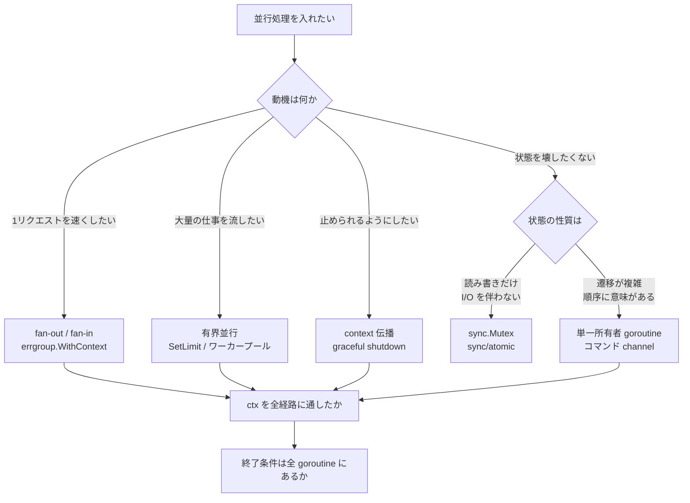
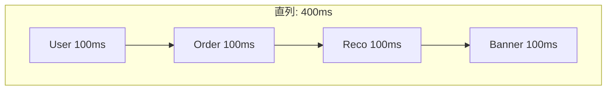
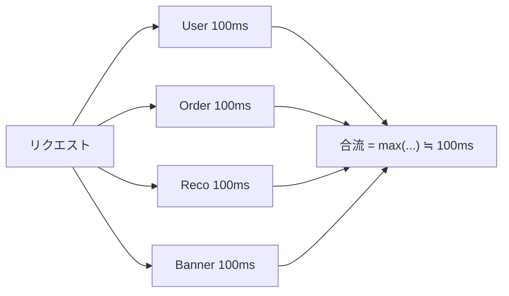
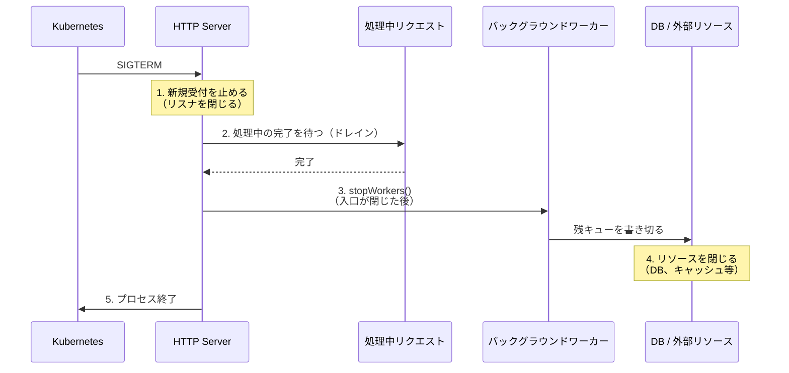
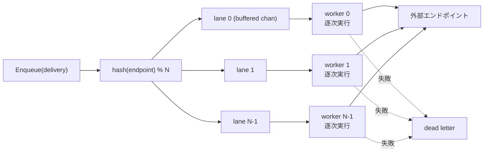

`go func()` と書けば goroutine が起動し、`ch <- v` で送って `<-ch` で受け取る。`select` で複数の channel を待てる。文法としては 30 分で覚えられます。教科書の例も理解できる。

それなのに、いざ業務のコードを書くと <strong>どこにも channel を使う場所が見つからない</strong>。あるいは逆に、無理に使ってみたら以前より読みにくく壊れやすいコードになった。

このギャップは、あなたの理解が浅いから生じているのではありません。<strong>教科書が教えるのは「機構」であって「動機」ではない</strong> からです。「1 から 100 までを 3 つの goroutine で足す」というサンプルは、機構の説明としては正しくても、実務で並行処理を導入する動機とは何の関係もありません。実務で必要なのは「この関数を並行にすべきか」「ここは channel か mutex か」「バッファサイズをいくつにするか」という <strong>判断</strong> です。

この記事では、その判断の側から Go の並行処理を再構成します。

## この記事の立場

まず、よくある 3 つの誤解を先に潰しておきます。ここが解けないと、以降のパターンが「テクニック集」にしか見えません。

<strong>誤解 1: 並行処理は「速くするため」のもの</strong>

実務のサーバアプリケーションで並行処理を入れる主な理由は、CPU を使い切ることではなく <strong>待ち時間を重ねること</strong> と <strong>ライフサイクルを制御すること</strong> です。Web アプリケーションのプロファイルを取ると、時間の大半は DB・外部 API・ストレージの応答待ちで消えています。CPU 並列化が主役になるのは画像処理や暗号処理のような CPU バウンドな処理に限られます。

<strong>誤解 2: goroutine を使うのは特別なとき</strong>

`net/http` サーバは受け付けた <strong>接続ごとに</strong> goroutine を起動します（[`net/http/server.go`](https://github.com/golang/go/blob/master/src/net/http/server.go) の `Server.Serve` が `go c.serve(connCtx)` を呼びます。HTTP/1.1 の keep-alive では同一接続上のリクエストはその goroutine 内で逐次処理され、HTTP/2 ではストリームごとに goroutine が起動します）。いずれにせよ、異なるクライアントのハンドラは同時に走ります。つまり Go で Web アプリケーションを書いている時点で、あなたはすでに並行プログラムを書いています。ハンドラの中で触るグローバル変数、共有キャッシュ、コネクションプールはすべて並行アクセスされます。「並行処理を使うかどうか」ではなく「<strong>すでに並行な世界で、どこに構造を入れるか</strong>」が実務の問いです。

<strong>誤解 3: channel は goroutine 間でデータを渡す道具</strong>

これは間違いではありませんが、実務での比重を見誤らせます。実際のプロダクションコードで channel が担っているのは、データそのものよりも <strong>タイミング（いつ進んでよいか）</strong> と <strong>所有権（今どの goroutine がこの値に触ってよいか）</strong> です。`<-ctx.Done()` はデータを運びませんが、実務で最も頻繁に書かれる channel 操作です。

この 3 点を踏まえて、以下の順で進めます。

1. <strong>判断フレーム</strong> — そもそも並行にすべきか、channel と mutex のどちらを選ぶか
2. <strong>本番パターン 6 種</strong> — fan-out / 有界並行と背圧 / ライフサイクル管理 / 所有権の直列化 / バッチング / 購読
3. <strong>事故カタログ</strong> — 本番で実際に踏むバグと、Go 1.27 時点での検出手段
4. <strong>道具箱</strong> — 標準・準標準ライブラリの使い分け
5. <strong>ケーススタディ</strong> — Webhook 配信ワーカーを段階的に組み立てる
6. <strong>テストと観測</strong>

この記事のコードはすべて <strong>Go 1.27</strong>（`go vet` と `go test -race` を通過）で検証しています。ランタイムの内部実装（G・M・P モデル、work stealing、netpoller）については別記事「[Go スケジューラの仕組み](/ja/blog/go-scheduler-gmp)」を参照してください。ここでは意図的に「使う側」の話に絞ります。

## 第1章 判断フレーム — 並行にすべきか、channel を使うべきか

### 1.1 並行処理を導入する動機は 4 つしかない

実務のコードベースを観察すると、並行処理が入る理由はほぼこの 4 つに収まります。<strong>自分が今どれを求めているのかを言語化できないうちは、コードを書き始めてはいけません。</strong> 動機が違えば適切な構造も違うからです。

| 動機 | 何を得たいか | 典型的な構造 | 成功の指標 |
| --- | --- | --- | --- |
| ① 待ち時間の重ね合わせ | 1 リクエストのレイテンシ短縮 | fan-out / fan-in | p50・p99 レイテンシ |
| ② スループット | 単位時間あたりの処理件数 | 有界ワーカープール / パイプライン | 件/秒、キュー滞留 |
| ③ ライフサイクル管理 | 止められる・止まるまで待てる | context、graceful shutdown | 停止時のエラー率・取りこぼし |
| ④ 所有権の直列化 | 壊れない状態管理 | 単一所有者 goroutine（アクター） | 不変条件の維持、race の不在 |

CPU バウンドな計算の並列化は 5 番目の動機ですが、典型的な Web バックエンドでは稀です。もし該当するなら、それは並行処理の設計問題というより「`GOMAXPROCS` 個のワーカーで分割する」という単純な話に落ち着くことが多く、この記事の後半で扱う背圧やライフサイクルの議論はあまり効いてきません。

ここで重要なのは、<strong>① と ② はまったく違う目標だ</strong> ということです。①（レイテンシ）は「1 件の仕事を細かく割って同時に投げる」ことで達成され、②（スループット）は「多数の仕事を詰まらせずに流し続ける」ことで達成されます。①のつもりで無制限に goroutine を撒くと、②が崩壊します（第3章）。

### 1.2 channel と mutex のどちらを選ぶか

Go には有名な標語があります。

> Don't communicate by sharing memory; share memory by communicating.

これは Go の設計思想を示す優れたスローガンですが、<strong>「常に channel を使え」という意味ではありません</strong>。Go 公式の [Go Wiki: Use a sync.Mutex or a channel?](https://go.dev/wiki/MutexOrChannel) は、まさにこの誤読を正すために書かれています。

> Use whichever is most expressive and/or most simple.
> （最も表現力が高い、あるいは最も単純な方を使え）

同ページは「channel が向く場合」として「データの所有権の受け渡し」「作業単位の分配」「非同期の結果通知」を、「mutex が向く場合」として「キャッシュ」「状態」を挙げています。さらに、こうも明記しています。

> A common Go newbie mistake is to over-use channels and goroutines just because it's possible, and/or because it's fun.
> （よくある初心者の誤りは、できるから／楽しいからという理由だけで channel と goroutine を使いすぎることだ）

実務的な判断基準に落とすと、こうなります。

<strong>mutex（あるいは atomic）を選ぶ場合</strong>

- 守りたいのが <strong>データ構造そのもの</strong>（マップ、カウンタ、設定値）
- クリティカルセクションが短く、<strong>その中で I/O をしない</strong>
- 操作が「読む」「書く」に還元でき、<strong>順序に意味がない</strong>

<strong>channel を選ぶ場合</strong>

- 値の <strong>所有権を別の goroutine に渡す</strong>（渡したら元の goroutine はもう触らない）
- <strong>タイミング</strong>を伝えたい（完了した、キャンセルされた、時間が来た）
- <strong>流量を制御したい</strong>（送り手を待たせたい ＝ 背圧）
- 複数の待機イベントを <strong>`select` で合流</strong> させたい（これは channel にしかできません）

最後の点は決定的です。`select` は「複数のイベント源のうち、最初に来たものに反応する」を安全に書ける唯一の構文です。「結果が来る」「タイムアウトした」「キャンセルされた」の 3 つを同時に待つ処理は、mutex では書けません。

### 1.3 コストを測る — channel は安くない

判断材料として、実測値を見ておく価値があります。同じ「カウンタを増やす」処理を 3 通りで実装しました。

```go
type mutexCounter struct {
    mu sync.Mutex
    n  int64
}

func (c *mutexCounter) Inc() {
    c.mu.Lock()
    c.n++
    c.mu.Unlock()
}

type atomicCounter struct{ n atomic.Int64 }

func (c *atomicCounter) Inc() { c.n.Add(1) }

// 「状態を 1 つの goroutine が所有する」アクター方式
type chanCounter struct {
    inc  chan struct{}
    stop chan struct{}
    n    int64
}

func newChanCounter() *chanCounter {
    c := &chanCounter{inc: make(chan struct{}), stop: make(chan struct{})}
    go func() {
        for {
            select {
            case <-c.inc:
                c.n++
            case <-c.stop:
                return
            }
        }
    }()
    return c
}

func (c *chanCounter) Inc() { c.inc <- struct{}{} }

// 注: このベンチ用ハーネスは stop を閉じていません（計測プロセスの寿命と
// 同じなので意図的です）。実務コードでは 4.2 の原則 2 に従ってください。
```

`b.RunParallel` で競合させた結果です。

```text
goos: windows, goarch: amd64, go1.27
cpu: 12th Gen Intel(R) Core(TM) i7-12700K
GOMAXPROCS=8, -benchtime=2s -count=5（中央値）

BenchmarkCounterAtomic-8      14.3 ns/op
BenchmarkCounterMutex-8       50.2 ns/op
BenchmarkCounterChannel-8    441.9 ns/op
```

絶対値は環境で大きく変わりますし、この測定自体もノイズを含みます（同一環境の 5 回試行でも ±30% 程度は動きます）。読むべきは <strong>桁の関係</strong> です。単純な状態更新において、channel によるアクター方式は mutex のおおよそ 1 桁遅く、atomic とは 30 倍程度の差があります。バッファなし channel の送受信は goroutine の park / unpark（スケジューラへの制御移譲）を伴うため、これは避けられない構造的コストです。

だからといって「channel は遅いから使うな」という結論にはなりません。正しい結論はこうです。

> <strong>1 回あたり数百ナノ秒を払う価値のある構造</strong> を channel で表現せよ。単なる排他制御に払うな。

1 リクエストで 1 回だけ channel を使うなら 441 ns は完全に無視できます（ネットワーク I/O はミリ秒単位＝ 3〜4 桁上のオーダー）。逆に、ホットループの中で 1 秒あたり数百万回カウンタを更新するなら、mutex どころか atomic を選ぶべきです。

### 1.4 判断のフローチャート



図の下 2 段は「どのパターンを選んでも必ず通る検問」です。<strong>ctx を通したか</strong>、<strong>すべての goroutine に終了経路があるか</strong>。第8章で見るように、本番障害の大半はこの 2 つの検問をすり抜けたコードから発生します。

## 第2章 パターン① fan-out / fan-in — 待ち時間を重ねる

### 2.1 実務での出現場所

これが最も分かりやすい動機です。典型例は BFF（Backend for Frontend）や集約 API です。

1 つの画面を描くために、ユーザー情報・注文履歴・レコメンド・バナーの 4 つを別々のサービスから取ってくる。それぞれ 100ms かかる。直列に呼べば 400ms、並行に呼べば 100ms +α。<strong>これが実務における「並行処理を入れる理由」の第 1 位</strong> です。

```go
// 直列版：400ms
func (c *Clients) BuildPageSerial(ctx context.Context, uid string) (*Page, error) {
    u, err := c.User.Get(ctx, uid)
    if err != nil {
        return nil, err
    }
    o, err := c.Order.List(ctx, uid)
    if err != nil {
        return nil, err
    }
    r, err := c.Reco.For(ctx, uid)
    if err != nil {
        return nil, err
    }
    b, err := c.Banner.Fetch(ctx)
    if err != nil {
        return nil, err
    }
    return &Page{User: u, Orders: o, Recos: r, Banners: b}, nil
}
```

このコードを見て「並行にできる」と判断する条件は明確です。<strong>4 つの呼び出しの間にデータ依存がない</strong> こと。もし `o` を取るのに `u.TenantID` が必要なら、その 2 つは直列にせざるを得ません（依存グラフの深さがレイテンシの下限になります）。





### 2.2 素朴な並行化と、その 4 つの穴

多くの人が最初に書くのはこれです。

```go
// 問題のある実装
func (c *Clients) BuildPageNaive(ctx context.Context, uid string) (*Page, error) {
    var (
        wg   sync.WaitGroup
        page Page
        mu   sync.Mutex
        errs []error
    )
    wg.Go(func() {
        u, err := c.User.Get(ctx, uid)
        mu.Lock()
        defer mu.Unlock()
        if err != nil {
            errs = append(errs, err)
            return
        }
        page.User = u
    })
    wg.Go(func() {
        o, err := c.Order.List(ctx, uid)
        mu.Lock()
        defer mu.Unlock()
        if err != nil {
            errs = append(errs, err)
            return
        }
        page.Orders = o
    })
    wg.Wait()
    return &page, errors.Join(errs...)
}
```

（`wg.Go` は Go 1.25 で追加されたメソッドです。`wg.Add(1)` と `defer wg.Done()` の対応漏れという古典的なバグを構造的に排除できるため、新規コードでは常にこちらを使うべきです。）

動きはします。しかし本番に出すには 4 つ足りません。

1. <strong>キャンセルが伝播しない</strong> — User の取得が 500ms で失敗しても、Order は最後まで走り切ります。ユーザーはもう結果を受け取らないのに、下流サービスの負荷だけがかかり続けます。
2. <strong>エラーの意味が失われる</strong> — `errors.Join` で全部束ねるのは、呼び出し側が「どれが必須でどれが任意か」を判断できない場合に困ります。
3. <strong>panic がプロセスを殺す</strong> — goroutine 内の panic は `recover` されない限りプロセス全体を落とします。呼び出し元の `defer recover()` では拾えません。
4. <strong>ロックの用途を取り違えている</strong> — `page.User` と `page.Orders` は<strong>別々のメモリ位置</strong>なので、<strong>ページのフィールドを守るためのロックは要りません</strong>。この `mu` が実際に守っているのは `errs` への `append` の方です（詳細は 2.4）。

### 2.3 errgroup による実装

`golang.org/x/sync/errgroup` はこの用途のための準標準ライブラリです。API は 5 つだけです。

```go
func WithContext(ctx context.Context) (*Group, context.Context)
func (g *Group) Go(f func() error)
func (g *Group) TryGo(f func() error) bool
func (g *Group) SetLimit(n int)
func (g *Group) Wait() error
```

`errgroup.WithContext` が返す `ctx` は、<strong>いずれかの `Go` が非 nil のエラーを返した時点、または `Wait` が返った時点のどちらか早い方でキャンセルされます</strong>。前半が素朴版との決定的な差です。後半も重要で、<strong>`g.Wait()` の後にこの `ctx` を使い回すと、全タスクが成功していても `context.Canceled` になります</strong>。派生 ctx の寿命はグループの寿命と一致します。

```go
func (c *Clients) BuildPage(ctx context.Context, uid string) (*Page, error) {
    g, ctx := errgroup.WithContext(ctx) // 以降はこの ctx を使う
    var page Page

    // 必須項目：1 つでも落ちたらページを出せない
    g.Go(func() error {
        u, err := c.User.Get(ctx, uid)
        if err != nil {
            return err
        }
        page.User = u
        return nil
    })
    g.Go(func() error {
        o, err := c.Order.List(ctx, uid)
        if err != nil {
            return err
        }
        page.Orders = o
        return nil
    })

    // 任意項目：失敗しても全体を落とさない（nil を返す）
    g.Go(func() error {
        rctx, cancel := context.WithTimeout(ctx, 80*time.Millisecond)
        defer cancel()
        r, err := c.Reco.For(rctx, uid)
        if err != nil {
            slog.WarnContext(ctx, "recommendation degraded", "err", err)
            return nil // ここが設計判断
        }
        page.Recos = r
        return nil
    })

    if err := g.Wait(); err != nil {
        return nil, err
    }
    return &page, nil
}
```

ここで押さえるべき実務上のポイントが 3 つあります。

<strong>ポイント 1: `g, ctx := errgroup.WithContext(ctx)` の shadowing は意図的</strong>

元の `ctx` を上書きすることで、以降で誤って「キャンセルされない方の ctx」を使う事故を防ぎます。逆に「グループのキャンセルに巻き込まれたくない処理」がある場合は、意図的に別名で元の ctx を保持してください。

<strong>ポイント 2: 「必須」と「任意」を `return err` / `return nil` で表現する</strong>

`errgroup` は「1 つでも失敗したら全体を諦める」というセマンティクスです。これは必須項目には正しく、<strong>任意項目には強すぎます</strong>。レコメンドが取れなくてもページは出したい、という要件は極めて普通です。その場合は goroutine 内でエラーを握り潰し（ログは残す）、`nil` を返します。

言い換えると、`errgroup` の `error` は「このサブタスクの失敗は、グループ全体を中止する理由になるか？」というフラグです。「エラーが起きたか」ではありません。ここを取り違えると、任意項目の一時的な失敗でページ全体が 500 になります。

<strong>ポイント 3: 任意項目には個別のタイムアウトを切る</strong>

必須項目より短いタイムアウトを与えることで、「あってもなくてもよいデータのために全体が待たされる」事態を防ぎます。上の例では 80ms を超えたらレコメンドを諦めます。

なお、2.2 で挙げた 4 つの穴のうち <strong>穴 3（panic）は `errgroup` でも埋まりません</strong>。`errgroup` は goroutine 内の panic を意図的に伝播させないため、`g.Go` に渡した関数が panic すればプロセスが落ちます。理由と対策は 3.2 と 8.7 で扱います。

### 2.4 なぜ `page` にロックが要らないのか

`page.User` と `page.Orders` に別々の goroutine から書き込んでいますが、これは race ではありません。Go のメモリモデルにおいて、構造体の <strong>異なるフィールドは異なるメモリ位置</strong> であり、異なるメモリ位置への並行書き込みは競合しません。読み出し側は `g.Wait()` の後にのみ `page` を読むため、`Wait` が張る happens-before 関係によって全書き込みが可視になります。

ただし、この推論が成り立つのは以下の条件下だけです。

- 各 goroutine が <strong>互いに素なフィールド集合</strong> にのみ書く
- フィールドがスライスやマップを <strong>共有していない</strong>（`page.Orders` と `page.Recos` が同じ backing array を指していない）
- 読み出しは必ず `Wait()` の後

逆に、<strong>同じスライスに複数 goroutine が `append` するのは明確な race</strong> です（`append` は長さと backing array の両方を読み書きするため）。結果を集める必要があるときは、インデックス固定のスライス（`results[i] = v`）を使うか、channel で集約します。

```go
// OK: 各 goroutine が自分のインデックスだけに書く
results := make([]Result, len(inputs))
g, ctx := errgroup.WithContext(ctx)
for i, in := range inputs {
    g.Go(func() error {
        r, err := fetch(ctx, in)
        if err != nil {
            return err
        }
        results[i] = r // 異なるインデックス = 異なるメモリ位置
        return nil
    })
}
```

（このループが安全に書けるのは Go 1.22 でループ変数がイテレーションごとのスコープになったためです。Go 1.21 以前は `i, in := i, in` の再宣言が必須でした。古い記事のコピペには注意してください。）

### 2.5 レイテンシは max ではなく tail に支配される

fan-out の効果を「400ms → 100ms」と説明しましたが、本番ではもう少し悲観的に見積もる必要があります。合流点のレイテンシは <strong>4 つのうち最も遅いもの</strong> で決まります。つまり、

- 各下流の p99 が 500ms なら、4 つ並行に呼んだときの全体の p99 は 500ms より <strong>悪く</strong> なります
- 1 つでも遅い下流があると、並行化の恩恵はそこで頭打ちになります

4 つの独立な呼び出しがそれぞれ 1% の確率で遅い場合、少なくとも 1 つが遅い確率は `1 - 0.99^4 ≒ 3.9%` です。<strong>fan-out は個々の遅さを増幅します。</strong> だからこそ 2.3 の「任意項目には個別タイムアウト」が効きます。

対策の選択肢は、優先度順に次のとおりです。

1. <strong>必須項目を減らす</strong> — 本当に全部そろわないとレスポンスを返せないのか
2. <strong>任意項目に短いタイムアウトを切る</strong> — 上限を構造で保証する
3. <strong>キャッシュで下流呼び出し自体を消す</strong> — 最も効くが実装コストが高い
4. <strong>ヘッジリクエスト</strong>（一定時間経過後に 2 本目を投げる）— 効くが下流負荷が増えるので、必ず割合を制限する

### 2.6 `errgroup` と `sync.WaitGroup` の使い分け

Go 1.25 で `WaitGroup.Go` が入り、両者の見た目は近づきました。判断基準はシンプルです。

| | `sync.WaitGroup` | `errgroup.Group` |
| --- | --- | --- |
| エラーの集約 | 自分で書く | 最初の非 nil エラーを返す |
| 失敗時のキャンセル | なし | `WithContext` ならあり |
| 並行数の制限 | 自分で書く | `SetLimit(n)` |
| 依存 | 標準ライブラリ | `golang.org/x/sync` |

<strong>エラーを返すタスクなら `errgroup`、返さないなら `WaitGroup`。</strong> それだけです。「依存を増やしたくない」という理由で `WaitGroup` にエラー集約を手書きするのは、たいてい割に合いません（`golang.org/x/sync` は Go チームが管理する準標準ライブラリです）。

## 第3章 パターン② 有界並行と背圧 — 「全部 goroutine にする」が事故になる理由

### 3.1 最も多い並行処理の事故

第2章の fan-out は「4 つ」という固定の小さな数だから安全でした。ここで扱うのは、<strong>個数が入力データで決まる</strong> ケースです。

```go
// 本番を落とすコード
func ProcessAllUnbounded(ctx context.Context, items []Item) {
    var wg sync.WaitGroup
    for _, it := range items {
        wg.Go(func() { _ = process(ctx, it) })
    }
    wg.Wait()
}
```

`items` が 10 件なら問題ありません。10 万件になった瞬間に本番が落ちます。goroutine 自体は初期スタック 2KB と軽量ですが、問題は goroutine ではなく <strong>goroutine が掴むリソース</strong> です。

- <strong>DB コネクションプール枯渇</strong> — `database/sql` の `SetMaxOpenConns(20)` に対して 10 万本が殺到すると、99,980 本がプール待ちでブロックします。待ち時間はやがてアプリ側のタイムアウトを超え、全リクエストがエラーになります
- <strong>下流サービスへの意図しない DoS</strong> — 自分のサービスは耐えても、呼び出し先が 10 万本の同時接続で死にます。そして障害が連鎖します
- <strong>メモリ</strong> — 各 goroutine が 1MB のバッファを持てば 100GB です。goroutine が軽くてもペイロードは軽くありません
- <strong>ファイルディスクリプタ枯渇</strong> — `too many open files` でプロセス全体が機能停止します

重要なのは、<strong>このコードは開発環境とステージングでは絶対に落ちない</strong> ことです。テストデータが 10 件だからです。落ちるのは本番だけです。

### 3.2 有界化の 3 つの手段

<strong>手段 1: `errgroup.SetLimit`（第一選択）</strong>

```go
func ProcessAllErrgroup(ctx context.Context, items []Item, limit int) error {
    g, ctx := errgroup.WithContext(ctx)
    g.SetLimit(limit)
    for _, it := range items {
        // 実行中が limit 本に達していると、ここでブロックする
        g.Go(func() error { return process(ctx, it) })
    }
    return g.Wait()
}
```

`SetLimit(n)` 以降、`g.Go` は実行中の goroutine が `n` 本に達しているとブロックします。エラー集約・キャンセル・有界化がこれだけで揃うので、<strong>大半のケースはこれで終わり</strong> です。

ひとつ注意点があります。実装を見ると `g.Go` の待機は素の channel 送信です（[`errgroup.go`](https://github.com/golang/sync/blob/master/errgroup/errgroup.go)）。

```go
func (g *Group) Go(f func() error) {
    if g.sem != nil {
        g.sem <- token{} // select ではない = ctx を見ていない
    }
    ...
}
```

つまり `g.Go` がブロックしている間に `ctx` がキャンセルされても、<strong>`g.Go` は枠が空くまで戻りません</strong>。長時間タスクを大量に投入するループでキャンセル応答性が要るなら、`TryGo`（枠がなければ即 false を返す）を使うか、次の手段 2 のように `select` で待ち先を明示します。

もうひとつ、`errgroup` は <strong>goroutine 内の panic を伝播しません</strong>。ソースコードのコメントにその判断理由が明記されています（panic を遅延させるとバグの発見が遅れる、クラッシュ監視ツールからスタックが隠れる、など）。つまり `g.Go` に渡した関数が panic すれば、プロセスは落ちます。これは errgroup の欠陥ではなく意図された設計です。対策は 8.7 で扱います。

なお `SetLimit` には前提条件があります。<strong>グループ内に実行中の goroutine がある状態で呼ぶと panic します。</strong> 必ず最初の `Go` より前に設定してください。

<strong>手段 2: buffered channel をセマフォとして使う</strong>

```go
func ProcessAllSemaphoreChan(ctx context.Context, items []Item, limit int) error {
    sem := make(chan struct{}, limit)
    var (
        wg   sync.WaitGroup
        mu   sync.Mutex
        errs []error
    )
    for _, it := range items {
        select {
        case sem <- struct{}{}: // 枠を取る（満杯ならブロック）
        case <-ctx.Done():
            wg.Wait()
            return ctx.Err()
        }
        wg.Go(func() {
            defer func() { <-sem }() // 枠を返す
            if err := process(ctx, it); err != nil {
                mu.Lock()
                errs = append(errs, err)
                mu.Unlock()
            }
        })
    }
    wg.Wait()
    return errors.Join(errs...)
}
```

`make(chan struct{}, limit)` に値を入れられた数 ＝ 同時実行数、という発想です。`select` を使うことで「枠を待つ」と「キャンセルされる」を同時に待てるのが手段 1 との差です。

このイディオムは <strong>channel の本質を最もよく表す例</strong> でもあります。ここで送っている `struct{}{}` にはデータとしての意味がまったくありません。運んでいるのは「進んでよい」という <strong>許可</strong> だけです。

<strong>手段 3: `semaphore.Weighted`（コストが不均一なとき）</strong>

```go
func ProcessWeighted(ctx context.Context, items []Item, budgetMB int64) error {
    sem := semaphore.NewWeighted(budgetMB)
    g, ctx := errgroup.WithContext(ctx)
    for _, it := range items {
        // 重みが budgetMB を超えると Acquire は永久に待つ（後述）ので必ず丸める
        cost := min(estimateMB(it), budgetMB)
        if err := sem.Acquire(ctx, cost); err != nil {
            break // ctx キャンセル
        }
        g.Go(func() error {
            defer sem.Release(cost)
            return process(ctx, it)
        })
    }
    return g.Wait()
}
```

「同時 10 本」ではなく「同時に使うメモリ 2GB まで」を制限したい場合に使います。動画変換やバッチ集計のように、1 タスクのコストが桁で違うワークロードで効きます。

<strong>`min` で丸めているのは必須の防御です。</strong> [`semaphore.go`](https://github.com/golang/sync/blob/master/semaphore/semaphore.go) の実装を読むと、`Acquire(ctx, n)` は `n` がセマフォの総容量を超える場合、<strong>エラーを返さずに `<-ctx.Done()` でブロックします</strong>（容量が空でも決して満たせないため）。3GB の項目を 2GB の予算に投げると、キャンセルされるまでループが停止します。「大きすぎる要求はエラー」ではなく「大きすぎる要求は永久に待つ」という挙動なので、呼び出し側で丸めるか事前に弾く必要があります。

### 3.3 並行数をどう決めるか — 勘で決めない

`limit` に何を入れるか。「とりあえず 10」「CPU 数」といった決め方をしているコードは非常に多いのですが、根拠のある決め方があります。

<strong>CPU バウンドなら `GOMAXPROCS`</strong>

`runtime.GOMAXPROCS(0)` を上限にします。それ以上増やしてもコンテキストスイッチが増えるだけです。Go 1.25 以降、`GOMAXPROCS` の既定値は Linux の cgroup CPU 制限を考慮するようになったため、コンテナ環境でもこの値は信頼できます（詳細は「[Go スケジューラの仕組み](/ja/blog/go-scheduler-gmp)」を参照）。

<strong>I/O バウンドなら「下流の制約」から逆算する</strong>

こちらが実務では圧倒的に多いケースです。並行数の上限を決めるのは自分の CPU ではなく、<strong>下流が受け入れられる量</strong> です。リトルの法則を使います。

```text
L = λ × W

L : 系の中に同時に存在する仕事の数（＝必要な並行数）
λ : スループット（件/秒）
W : 1 件あたりの滞在時間（秒）
```

具体例です。下流 API が「200 req/s まで」と契約で決まっていて、1 リクエストの平均応答時間が 50ms だとします。

```text
L = 200 × 0.05 = 10
```

<strong>並行数 10 で、ちょうど 200 req/s を出し切ります。</strong> これを 100 にしても下流のレート制限に弾かれるだけで、スループットは増えずエラーとリトライだけが増えます。逆に 5 にすると 100 req/s しか出ません。

（厳密には、この換算は <strong>`W` が一定であることを前提</strong> にしています。逆方向の危険——下流が速くなったときに契約レートを踏み越えてしまう問題——は次節で扱います。）

この計算の実務的な価値は、<strong>「並行数」という設定値を「守るべき契約」から導出できる</strong> 点にあります。下流の許容量が変わったら、並行数もそれに追随して変えるべきだと分かります。

もうひとつよくある制約が DB コネクションプールです。

```text
アプリ 1 インスタンスの MaxOpenConns = 20
1 タスクが同時に掴むコネクション = 1
→ DB を触るワーカーの並行数上限は 20 未満にすべき
（HTTP ハンドラ側も同じプールを使うことを忘れずに）
```

<strong>バッチワーカーとオンラインリクエストが同じプールを共有している</strong> ことに気づかず、バッチを流した瞬間に API が全滅する、というのは定番の障害です。

#### 3.3.1 並行数制限とレート制限は別物

ここで多くの実装が混同する区別があります。リトルの法則の式をもう一度見てください。

```text
L = λ × W
```

- <strong>セマフォ（`SetLimit`、`semaphore.Weighted`）が縛るのは `L`</strong> — 同時に「進行中」の仕事の数
- <strong>レートリミッタが縛るのは `λ`</strong> — 単位時間あたりに「開始する」仕事の数

<strong>下流の契約がどちらの単位で書かれているかで、使う道具が決まります。</strong>

| 下流の契約 | 縛るべき量 | 道具 |
| --- | --- | --- |
| 「200 req/s まで」 | λ（速度） | `rate.Limiter` |
| 「同時接続 20 まで」「プール 20 本」 | L（在庫） | セマフォ / `SetLimit` |
| 「1 分あたり 1000 回、かつ同時 10 まで」 | 両方 | 併用 |

セマフォだけで `λ` を守ろうとすると破綻します。3.3 の計算（並行数 10 ＝ 200 req/s）は <strong>`W` が 50ms のままなら</strong> 成り立ちますが、下流が速くなって `W` が 5ms になった瞬間、同じ並行数 10 が 2000 req/s を叩き出してレート制限に激突します。<strong>セマフォは速度を保証しません。</strong>

```go
// golang.org/x/time/rate

// 平常時 200 req/s、瞬間的なバーストは 20 まで許す
limiter := rate.NewLimiter(rate.Limit(200), 20)

g, ctx := errgroup.WithContext(ctx)
g.SetLimit(10) // L: 同時実行数（プールやメモリの制約）

for _, it := range items {
    g.Go(func() error {
        // λ: 開始速度。トークンが貯まるまでブロックする（ctx で中断可能）
        if err := limiter.Wait(ctx); err != nil {
            return err
        }
        return process(ctx, it)
    })
}
```

`rate.Limiter` の 3 つのメソッドは、そのまま 3.5 の 3 戦略に対応します。

| メソッド | 挙動 | 対応する戦略 |
| --- | --- | --- |
| `Wait(ctx)` | トークンが貯まるまで待つ | A（ブロック＝背圧） |
| `Allow()` | 今トークンが無ければ `false` | B（捨てる＝負荷制限） |
| `Reserve()` | 予約を取り、待つべき時間を返す | C（待ち時間を見て判断する） |

`Reserve()` には注意が必要です。<strong>呼んだ時点でトークンを消費します。</strong> 返ってきた `*Reservation` の `Delay()` を見て「待てないからやめる」と判断したら、必ず `r.Cancel()` でトークンを返してください。返さないと実効レートが静かに下がります（`ReserveN(t, n)` で `n` がバースト値を超える場合は `OK() == false` の予約が返ります）。

第 2 引数のバースト値（上の `20`）は、3.4 のバッファサイズと同じ性質の設計判断です。「瞬間的に何件までなら一気に投げてよいか」を宣言しています。

<strong>実務では両方必要になることがほとんどです。</strong> レートリミッタだけでは、下流が詰まったときに進行中の仕事が無限に積み上がります（`λ` は守れても `L` が発散する）。セマフォだけでは、下流が速いときに契約速度を超えます。片方しか無い実装を見たら、もう片方の制約が本当に無いのかを確認してください。

### 3.4 背圧（backpressure）とは何か

ここが、channel を「非同期キュー」として捉えているうちは見えてこない部分です。

<strong>バッファなし channel は「完全な背圧」を意味します。</strong>

```go
ch := make(chan Item) // バッファなし
ch <- item            // 受信側が受け取るまでブロックする
```

送信側は受信側が受け取るまで進めません。これは制約ではなく <strong>機能</strong> です。生産者は消費者のペースを強制的に守らされます。生産が消費より速い状況で、キューが無限に伸びてメモリを食い潰すことが構造的に起こりません。

<strong>バッファ付き channel は「N 個分のバーストを吸収してよい」という宣言です。</strong>

```go
ch := make(chan Item, 100) // 100 個までは送信側がブロックしない
```

よくある誤解が「バッファを増やせば速くなる」です。正確に言うと、<strong>バッファが上げるのは「到達率」であって「上限」ではありません。</strong> 上限は消費側の処理能力 μ で決まり、バッファはそれを 1 件も引き上げません。

バッファが買えるのは 2 つです。

1. <strong>一時的なバーストの吸収</strong> — μ を超えた瞬間的な流入を、後で消化する約束で受け取る
2. <strong>生産者と消費者のスケジューリングの分離</strong> — ランデブーのたびに払う goroutine の park / unpark（1.3 で測った数百 ns）を償却し、両者を重ねて走らせる

(2) はパイプラインのように両側が実仕事をする構成では実測できる差になります。ただし生産が消費を恒常的に上回っているなら、バッファは遅かれ早かれ満杯になり、そこから先の挙動はバッファなしと同じです。

つまり、バッファサイズは性能のつまみではなく、<strong>「どれだけの滞留を許容するか」という設計判断</strong> です。

| バッファサイズ | 意味 |
| --- | --- |
| `0`（バッファなし） | 送信と受信をランデブーさせる。完全な背圧。順序と同期が最優先 |
| `1` | 送信側を 1 回分だけ先に進ませる。シグナル通知の定番 |
| `N`（小さい） | N 件分のバーストを吸収する。N × 処理時間 ＝ 許容する最大追加レイテンシ |
| 巨大 / 無制限 | 背圧の放棄。メモリと引き換えに問題を先送りしている |

<strong>実務的な指針:</strong> バッファサイズを決めるときは「何秒分の滞留を許すか」から逆算します。1 件 10ms で処理でき、最大 1 秒の遅延を許容するなら、バッファは 100 です。この数字には意味があります。「100 くらいでいいか」には意味がありません。

### 3.5 満杯のときどうするか — 3 つの戦略

背圧を設計するとは、<strong>「キューが満杯になったときの振る舞い」を明示的に決めること</strong> です。決めていないコードは、暗黙のうちに「ブロックする」を選んでいます。

```go
// 戦略A: ブロックする（背圧を上流に伝える）
select {
case queue <- item:
case <-ctx.Done():
    return ctx.Err()
}

// 戦略B: 捨てる（負荷制限 / load shedding）
select {
case queue <- item:
default:
    metrics.Dropped.Inc()
    return ErrOverloaded
}

// 戦略C: 期限つきで待ち、駄目なら諦める
timer := time.NewTimer(50 * time.Millisecond)
defer timer.Stop()
select {
case queue <- item:
case <-timer.C:
    metrics.Dropped.Inc()
    return ErrOverloaded
case <-ctx.Done():
    return ctx.Err()
}
```

選択の基準はデータの性質で決まります。

| データ | 戦略 | 理由 |
| --- | --- | --- |
| 課金イベント、注文 | A（ブロック）＋ 永続キュー | 1 件も落とせない。落とすくらいなら受付を止める |
| メトリクス、アクセスログ | B（捨てる） | 欠測は許容できる。本処理を止める方が害が大きい |
| ユーザーからの同期リクエスト | B or C | 待たせ続けるより 503 を早く返す方が親切（fail fast） |

<strong>戦略 B は「諦め」ではなく積極的な設計判断です。</strong> 満杯時に無条件でブロックすると、上流のリクエストハンドラが次々と滞留し、goroutine 数とメモリが増え続け、最終的にサービス全体が応答不能になります。これは典型的なカスケード障害です。早期に 503 を返して負荷を落とす方が、システム全体としては健全です。

なお、戦略 B の `default` 節は「即座に諦める」という意味なので、`for` ループの中で使うとビジーループになります。リトライしたいなら必ず戦略 C のように待ち先を持たせてください。

### 3.6 キューを観測可能にする

背圧の設計が正しかったかどうかは、動かしてみないと分かりません。<strong>`len(ch)` と `cap(ch)` をメトリクスとして出す</strong> だけで、判断材料が劇的に増えます（以下の `metrics` は Prometheus クライアントなど、アプリ側のメトリクスパッケージを指します）。

```go
// 定期的にキュー滞留を計測する
func (d *Dispatcher) observeQueues(ctx context.Context, interval time.Duration) {
    t := time.NewTicker(interval)
    defer t.Stop()
    for {
        select {
        case <-ctx.Done():
            return
        case <-t.C:
            for i, lane := range d.lanes {
                metrics.QueueDepth.WithLabelValues(strconv.Itoa(i)).
                    Set(float64(len(lane)))
            }
        }
    }
}
```

読み方は次のとおりです。

| 観測される滞留量 | 診断 |
| --- | --- |
| ほぼ常に 0 | 健全。消費が生産に追いついている |
| 時々跳ねてすぐ戻る | 健全。バッファが本来の役割（バースト吸収）を果たしている |
| 常に満杯付近 | <strong>容量不足</strong>。バッファを増やしても解決しない。消費側を増やすか生産を絞る |
| 単調増加 | <strong>消費側が停止している疑い</strong>。デッドロックかリークを疑う |

3 行目が重要です。滞留が常に高いときにバッファを増やすのは、<strong>問題を隠してレイテンシを悪化させる</strong> だけです。滞留したアイテムは、それだけ古い（＝価値の下がった）データでもあります。

Go 1.26 では goroutine の状態別内訳が [`runtime/metrics`](https://pkg.go.dev/runtime/metrics) に追加され、ランタイム側の飽和も直接取れるようになりました（こちらの `metrics` は標準ライブラリの `runtime/metrics` です）。

```go
// runtime/metrics

samples := []metrics.Sample{
    {Name: "/sched/goroutines:goroutines"},          // 総数（Go 1.16〜）
    {Name: "/sched/goroutines/runnable:goroutines"}, // 実行可能だが実行されていない（Go 1.26〜）
    {Name: "/sched/goroutines/running:goroutines"},  // 実行中（Go 1.26〜）
    {Name: "/sched/goroutines/waiting:goroutines"},  // I/O や同期プリミティブ待ち（Go 1.26〜）
    {Name: "/sched/latencies:seconds"},              // スケジューラ待ち時間の分布（Go 1.17〜）
}
metrics.Read(samples)
```

読み分けの目安は次のとおりです。

- `runnable` が慢性的に高い → <strong>CPU が足りていない</strong>。並行数を増やしても悪化するだけ
- `waiting` が <strong>高いまま安定</strong> していて `runnable` が低く CPU に余裕がある → I/O 待ちが支配的。<strong>ここは並行数を増やす余地がある</strong>
- `waiting` が <strong>単調増加</strong> している → リーク（8.1）か下流の停止。並行数を増やすと悪化する。goroutine プロファイルでスタックを確認する
- `/sched/latencies:seconds` の裾が伸びている → goroutine がスケジューラで待たされている

「並行数を増やすべきか」という問いに、勘ではなく数字で答えられるようになります。

## 第4章 パターン③ ライフサイクル管理 — 実務で最も多い channel の用途

### 4.1 `<-ctx.Done()` こそが実務の channel

冒頭で「実務のコードに channel を使う場所が見つからない」と書きましたが、実際には多くの人がすでに毎日 channel を使っています。`context.Context` の `Done()` がそれです。

```go
type Context interface {
    Deadline() (deadline time.Time, ok bool)
    Done() <-chan struct{}   // これが channel
    Err() error
    Value(key any) any
}
```

`context` の設計は、channel の 2 つの性質を見事に使い切っています。

<strong>性質 1: `close` された channel からの受信は即座に成功する</strong>

これが「1 対多のブロードキャスト」を実現します。`cancel()` が呼ばれると `close(done)` が実行され、<strong>`<-ctx.Done()` で待っていたすべての goroutine が同時に解放されます</strong>。値を送る方式では受信者 1 人にしか届かないので、この用途には `close` を使うのが唯一の正解です。

標準ライブラリの実装（[`context/context.go`](https://github.com/golang/go/blob/master/src/context/context.go)）を見ると、まさにそうなっています。

```go
// cancelCtx.cancel の抜粋
func (c *cancelCtx) cancel(removeFromParent bool, err, cause error) {
    // ...
    c.mu.Lock()
    // ...
    d, _ := c.done.Load().(chan struct{})
    if d == nil {
        c.done.Store(closedchan)
    } else {
        close(d)          // ここで全待機者を一斉に起こす
    }
    for child := range c.children {
        child.cancel(false, err, cause) // 子へ再帰的に伝播
    }
    // ...
}
```

<strong>性質 2: `nil` channel は永久にブロックする</strong>

`context.Background()` の `Done()` は `nil` を返します。`select` で `nil` channel を待つ腕は <strong>決して選ばれません</strong>。だから「キャンセルされないコンテキスト」を特別扱いなしに表現できます。この性質は 8.4 で実務パターンとして再登場します。

### 4.2 キャンセル伝播の原則

実務で守るべき原則は 3 つだけです。

<strong>原則 1: `ctx` は第 1 引数で受け取り、下流にそのまま渡す</strong>

`ctx` を受け取っておきながら下流の呼び出しに渡していないコードは、キャンセルの鎖を断ち切っています。`contextcheck` linter で機械的に検出できます（`go vet` の `lostcancel` は後述の原則 3 専用で、伝播漏れは見ません）。

<strong>原則 2: 起動した goroutine は起動した側が止める</strong>

goroutine を起動する関数は、<strong>その goroutine が確実に終了する経路</strong> を用意する責任を負います。「いつ終わるか説明できない `go` 文」はバグです。

この原則には専用の道具があります。「`ctx` がキャンセルされたら後始末をする」だけの見張り goroutine——

```go
// よく見るが、リークしやすい書き方
go func() {
    select {
    case <-ctx.Done():
        conn.Close()
    case <-done: // これを閉じ忘れると goroutine が残る
    }
}()
```

——は、Go 1.21 の `context.AfterFunc` で置き換えられます。

```go
stop := context.AfterFunc(ctx, func() { conn.Close() })
defer stop() // 登録解除
```

<strong>`ctx` の完了を待つ goroutine を常駐させない</strong> のが利点です。`f` は親の `children` に登録されるだけで、キャンセル時になって初めて専用の goroutine で実行されます（[`context.go`](https://github.com/golang/go/blob/master/src/context/context.go) の `afterFuncCtx.cancel` が `a.once.Do(func() { go a.f() })` を呼びます）。つまり <strong>「待機しているだけの goroutine」がリークすることがありません</strong>。

`stop()` の戻り値は控えめに読んでください。ドキュメントは「`f` の実行を止められたなら `true`」「`false` は『ctx が完了して `f` が起動済み』か『すでに停止済み』のどちらか」と定めており、さらに <strong>`stop` は `f` の完了を待ちません</strong>。つまり `true` なら「後始末はまだ走っていない」と分かりますが、`false` から「後始末が完了した」は導けません。完了を知りたければ `f` 側と明示的に同期してください。

なお `stop()` を呼ばないと、`f` とそのクロージャが掴んでいるオブジェクトは <strong>親コンテキストが生きている限り解放されません</strong>。原則 3 の `defer cancel()` と同じ種類の落とし穴です。

<strong>原則 3: `cancel` は必ず呼ぶ（`defer cancel()`）</strong>

```go
ctx, cancel := context.WithTimeout(parent, 3*time.Second)
defer cancel() // 早く終わっても必ず呼ぶ
```

`cancel()` を呼ばないと、親コンテキストの `children` マップから自分が外れず、親が生きている限りメモリが解放されません。タイムアウトが来れば自動で解放されますが、それまでの間リークします。`go vet` が検出してくれます。

### 4.3 タイムアウトの階層設計

実務で見落とされがちなのが、<strong>タイムアウトが入れ子になっている</strong> ことです。

```go
// HTTP ハンドラ全体で 3 秒
ctx, cancel := context.WithTimeout(r.Context(), 3*time.Second)
defer cancel()

// その中で DB は 1 秒
dbCtx, dbCancel := context.WithTimeout(ctx, 1*time.Second)
defer dbCancel()
```

`context.WithTimeout` は <strong>親のデッドラインを延ばせません</strong>。親が 3 秒なら、子に 10 秒を指定しても実質 3 秒です。この性質のおかげで「全体の上限」が構造的に保証されます。

ここで有用なのが Go 1.21 で追加された `WithTimeoutCause` です。

```go
var ErrDBSlow = errors.New("db call exceeded budget")

dbCtx, dbCancel := context.WithTimeoutCause(ctx, time.Second, ErrDBSlow)
defer dbCancel()

if err := db.QueryRowContext(dbCtx, q).Scan(&v); err != nil {
    // ctx.Err() は常に context.DeadlineExceeded だが、
    // context.Cause(dbCtx) は ErrDBSlow を返す
    if errors.Is(context.Cause(dbCtx), ErrDBSlow) {
        // 「DB が遅くて切った」と「全体の期限が来た」を区別できる
    }
}
```

`ctx.Err()` は `context.DeadlineExceeded` としか言ってくれないため、<strong>どの階層のタイムアウトで切れたのか</strong> が分かりません。`Cause` を使えば区別でき、障害調査が劇的に楽になります。

#### 4.3.1 `context.Canceled` / `DeadlineExceeded` には 4 通りの意味がある

ここまでは「キャンセルをどう伝えるか」の話でした。実務でより難しいのは、<strong>受け取ったキャンセルをどう解釈するか</strong> です。ハンドラの中で `context.Canceled` を観測したとき、原因は少なくとも 4 通りあり、正しい反応はそれぞれ違います。

| 原因 | 見分け方 | 正しい反応 |
| --- | --- | --- |
| ④ プロセスが停止中 | `workerCtx.Err() != nil` — <strong>これを最初に判定する</strong> | 503 ＋ `Retry-After` を返す |
| ① クライアントが切断した | `workerCtx.Err() == nil` かつ `errors.Is(r.Context().Err(), context.Canceled)` | <strong>エラーログを出さない</strong>。SLO のエラー予算を消費させない。リトライもしない |
| ② `errgroup` の兄弟タスクが失敗した | `context.Cause(ctx)` が `context.Canceled` 以外 | 兄弟の<strong>本当のエラー</strong>を返す。`Canceled` を報告しない |
| ③ 自分のタイムアウト予算が尽きた | `DeadlineExceeded` ＋ `Cause` で階層を特定（4.3） | <strong>アラートを出す</strong>。自分の性能問題である |

<strong>判定に順序があることに注意してください。</strong> 4.5 の構成では `BaseContext` に `workerCtx` を渡しているため、`stopWorkers()` は進行中の全ハンドラの `r.Context()` もキャンセルします。つまり `r.Context().Err() != nil` は ① と ④ の両方で真になります。④ を先に判定しないと、停止中のリクエストを「クライアントが切った」と誤分類し、返すべき 503 を返さないことになります。

<strong>①を②③と混同するのが、実務で最も多い間違いです。</strong> ユーザーがブラウザを閉じただけの事象が「サーバエラー」として計上され、デプロイのたびにエラー率グラフが跳ねているように見える——「graceful shutdown を入れたのに 5xx が減らない」という相談の一定数はこれです。クライアント都合の切断は、そもそも自分の失敗ではありません。

②の見分け方には、実装上の裏付けがあります。[`errgroup.go`](https://github.com/golang/sync/blob/master/errgroup/errgroup.go) の `WithContext` は `context.WithCancelCause` でコンテキストを作り、失敗時に `g.cancel(g.err)` を呼びます。したがって <strong>兄弟の goroutine は `context.Cause(ctx)` で「誰が落としたか」を知れます</strong>。

```go
g, ctx := errgroup.WithContext(context.Background())

g.Go(func() error {
    return errBoom // 誰かが失敗する
})
g.Go(func() error {
    <-ctx.Done()
    // ctx.Err()          → context.Canceled（情報がない）
    // context.Cause(ctx) → errBoom（本当の原因）
    return fmt.Errorf("aborted: %w", context.Cause(ctx))
})
```

手元の Go 1.27 ＋ `x/sync v0.23.0` で実行すると、`ctx.Err()=context canceled` に対して `context.Cause(ctx)=boom` が得られます。2.3 の fan-out で「なぜページが出せなかったのか」を下位のタスク側でログに残したいとき、この 1 行が効きます。

自分でキャンセルを送る側なら、`context.WithCancelCause` で理由を添えられます。

```go
ctx, cancel := context.WithCancelCause(parent)
defer cancel(nil)

// ... 何か問題が起きたら
cancel(fmt.Errorf("upstream quota exhausted"))
// 下流では context.Cause(ctx) でこの理由が読める
```

4.3 の `WithTimeoutCause` が「期限切れの理由」を伝えるのに対し、`WithCancelCause` は「明示的なキャンセルの理由」を伝えます。両方あって初めて、`context.Canceled` / `DeadlineExceeded` という情報量ゼロの 2 値から抜け出せます。

### 4.4 「リクエストが終わっても続けたい処理」

fire-and-forget な処理を次のように書くのは、非常によくあるバグです。

```go
// バグ: ハンドラが return した瞬間に ctx がキャンセルされる
func handler(w http.ResponseWriter, r *http.Request) {
    doMainWork(r.Context())
    go auditLog(r.Context(), "action performed") // ほぼ確実に context canceled
    w.WriteHeader(http.StatusOK)
}
```

`r.Context()` はレスポンス送出後にキャンセルされるため、監査ログの書き込みは高確率で `context canceled` で失敗します。Go 1.21 の `context.WithoutCancel` がこの用途のためにあります。

```go
func handler(w http.ResponseWriter, r *http.Request) {
    doMainWork(r.Context())

    // 値（trace ID など）は引き継ぎ、キャンセルだけ切り離す
    bg := context.WithoutCancel(r.Context())
    go func() {
        ctx, cancel := context.WithTimeout(bg, 5*time.Second) // 期限は必ず付ける
        defer cancel()
        if err := auditLog(ctx, "action performed"); err != nil {
            slog.ErrorContext(ctx, "audit log failed", "err", err)
        }
    }()

    w.WriteHeader(http.StatusOK)
}
```

`WithoutCancel` は trace ID などの `Value` を保持したまま、キャンセルとデッドラインだけを切り離します。ただし <strong>必ず新しいタイムアウトを設定してください</strong>。さもないと期限のない goroutine を撒くことになり、第8章のリークに直行します。

なお、この `go func()` はプロセス停止時に取りこぼされます。本当に失われては困るデータなら、goroutine ではなく永続キュー（あるいは 4.5 で束ねるワーカー）に載せるべきです。「fire-and-forget」は「失っても構わない」と同義だと理解しておく必要があります。

### 4.5 Graceful shutdown — 停止順序が本質

Kubernetes 環境では、Pod 停止時に SIGTERM が送られ、`terminationGracePeriodSeconds`（既定 30 秒）後に SIGKILL されます。この間にやるべきことは決まっています。

<strong>停止は「順序」がすべてです。</strong>



逆順にやると事故ります。<strong>先にワーカーを止めると、まだ受け付けている HTTP リクエストが処理できずエラーになります。先に DB を閉じると、処理中のリクエストが全滅します。</strong>

実装は次のようになります。

```go
func RunServer(handler http.Handler, workers []*Worker) error {
    // SIGTERM / SIGINT を受けてキャンセルされる ctx
    rootCtx, stop := signal.NotifyContext(
        context.Background(), os.Interrupt, syscall.SIGTERM)
    defer stop()

    // ワーカー用の ctx は「入口が閉じた後」に閉じたいので、
    // rootCtx とは別系統にする
    workerCtx, stopWorkers := context.WithCancel(context.Background())
    defer stopWorkers()

    srv := &http.Server{
        Addr:              ":8080",
        Handler:           handler,
        ReadHeaderTimeout: 5 * time.Second,
        BaseContext:       func(net.Listener) context.Context { return workerCtx },
    }

    g, gctx := errgroup.WithContext(rootCtx)

    g.Go(func() error {
        if err := srv.ListenAndServe(); !errors.Is(err, http.ErrServerClosed) {
            return err
        }
        return nil
    })

    for _, w := range workers {
        g.Go(func() error { return w.Run(workerCtx) })
    }

    // シャットダウン担当の goroutine
    g.Go(func() error {
        <-gctx.Done() // シグナル、またはいずれかのタスクの失敗

        // ステップ 1-2: 入口を閉じ、処理中の完了を待つ
        // タイムアウトは「停止シーケンス全体の予算」から配分する（判断 2）
        shutCtx, cancel := context.WithTimeout(context.Background(), 7*time.Second)
        defer cancel()
        if err := srv.Shutdown(shutCtx); err != nil {
            slog.Error("graceful shutdown timed out", "err", err)
            _ = srv.Close() // 諦めて強制切断
        }

        // ステップ 3: 入口が閉じた後にワーカーを止める
        stopWorkers()
        return nil
    })

    if err := g.Wait(); err != nil && !errors.Is(err, context.Canceled) {
        return err
    }
    return nil
}
```

このコードには、実際の障害から学んだ判断がいくつも埋まっています。

<strong>判断 1: `signal.NotifyContext` を使う</strong>

`signal.Notify` と channel を自前で扱うより短く、ctx として下流に渡せます。

<strong>判断 2: 停止シーケンス全体で grace period を配分する</strong>

SIGKILL が来る前に自分で終わる必要があります。ここで見落としがちなのは、<strong>grace period は `Shutdown` 単体ではなく停止シーケンス全体の予算だ</strong> という点です。`Shutdown` に 25 秒使い、そのあとワーカーのドレインに 15 秒使えば合計 40 秒で、30 秒の grace period を超えて SIGKILL されます。ドレインが救うはずだったデータを、まさにその瞬間に失います。

```text
terminationGracePeriodSeconds = 30s
  LB 離脱待ち                    5s   （4.6）
+ srv.Shutdown                  7s   （4.5）
+ ワーカーのドレイン              10s   （10.2 の drain）
+ 予算超過後の後始末              3s   （10.2 の abandon）
+ 余裕                          5s
= 30s
```

（レーンは並行にドレインするので、10 秒と 3 秒は「レーン数ぶんの合計」ではなく「レーン間の最大値」です。）

各段のタイムアウトは、この配分表から決めてください。上のコードでは `shutCtx` を 7 秒にしています。`Shutdown` がタイムアウトしたら `Close()` で強制切断し、少なくとも「終わったこと」を確定させます。

<strong>判断 3: `srv.Shutdown` は進行中リクエストの ctx をキャンセルしない</strong>

これは誤解が多い点です。`Shutdown` は「新規受付を止めて、アイドル接続を閉じ、処理中が終わるのを待つ」だけで、<strong>処理中のハンドラの `r.Context()` はキャンセルしません</strong>（[`net/http/server.go`](https://github.com/golang/go/blob/master/src/net/http/server.go) の `Shutdown` はリスナとアイドル接続を閉じたあと、接続が静止するまでポーリングするだけです）。したがって、無限ループするハンドラがあると `Shutdown` 自身は待ち続け、上のコードでは `shutCtx` の 7 秒タイムアウトでしか抜けられません。だからこそ `BaseContext` で `workerCtx` を渡し、最後の手段として `stopWorkers()` で全ハンドラに終了を伝えられるようにしています。

なお `RunServer` のステップ 3 で `stopWorkers()` を呼んでいるのは、<strong>バックグラウンドワーカーだけでなく、`BaseContext` 経由で進行中のハンドラにも停止を伝えるため</strong> です。`Shutdown` が時間内に返らなかった場合の最終手段として機能します。

<strong>判断 4: ワーカー用 ctx を `rootCtx` から派生させない</strong>

もしワーカーに `rootCtx` を渡すと、SIGTERM の瞬間にワーカーが止まります。しかしその時点ではまだ HTTP リクエストが処理中で、そのハンドラがワーカーにジョブを投入するかもしれません。<strong>入口が閉じきってからワーカーを止める</strong> 必要があるため、別系統の ctx にして手動で `stopWorkers()` を呼びます。

<strong>判断 5: `g.Wait()` の `context.Canceled` を無視する</strong>

正常なシグナル停止でも `gctx` はキャンセルされるため、これをエラーとして扱うと終了コードが 1 になり、Kubernetes が異常終了として記録します。

### 4.6 ロードバランサからの離脱を忘れない

もう一段外側の話です。SIGTERM を受けて即座にリスナを閉じると、<strong>ロードバランサがまだこの Pod にトラフィックを送っている</strong> 可能性があります（Endpoints の更新はプロセス停止と非同期です）。結果として一部のリクエストが接続拒否になります。

実務での定番は、SIGTERM 受信後にまず readiness probe を落とし、数秒待ってからドレインを始めることです。4.5 の `RunServer` のシャットダウン担当 goroutine を、次のように差し替えます。

```go
// hardStop は「2 回目の SIGTERM / Ctrl-C」で閉じる channel。
// signal.NotifyContext は stop() を呼ぶまで 2 回目以降のシグナルを
// 飲み込んでしまうため、即時停止したいときは自前で受ける必要がある。
// この goroutine はプロセスの寿命と運命を共にする（意図的に止めない）
hardStop := make(chan struct{})
go func() {
    sig := make(chan os.Signal, 2)
    signal.Notify(sig, os.Interrupt, syscall.SIGTERM)
    defer signal.Stop(sig)
    <-sig // 1 回目（NotifyContext と共有）
    <-sig // 2 回目 = 「待たずに落とせ」
    close(hardStop)
}()

g.Go(func() error {
    <-gctx.Done()

    // 1. まず readiness を落とす（LB から外れる）
    ready.Store(false)

    // 2. LB が気づくまで待つ（probe 間隔 + 猶予）
    select {
    case <-time.After(5 * time.Second):
    case <-hardStop:
    }

    // 3. ここからドレイン（判断 2 の予算配分に従う）
    shutCtx, cancel := context.WithTimeout(context.Background(), 7*time.Second)
    defer cancel()
    if err := srv.Shutdown(shutCtx); err != nil {
        slog.Error("graceful shutdown timed out", "err", err)
        _ = srv.Close()
    }

    stopWorkers()
    return nil // 判断 5 と同じく、正常停止を異常終了にしない
})
```

「graceful shutdown を実装したのにデプロイのたびに 5xx が出る」という相談の大半は、この待ち時間が無いことが原因です。

## 第5章 パターン④ 所有権の直列化 — mutex では破綻する状態管理

### 5.1 mutex が向かなくなる 3 つの兆候

1.2 で「状態を守るだけなら mutex」と書きました。では、いつ channel に切り替えるべきか。実務では次の兆候が出たときです。

<strong>兆候 1: ロックを保持したまま I/O をしている</strong>

```go
// 危険なコード
func (c *Cache) Refresh(ctx context.Context, key string) error {
    c.mu.Lock()
    defer c.mu.Unlock()

    v, err := c.origin.Fetch(ctx, key) // ロックを持ったまま数百ms のネットワーク I/O
    if err != nil {
        return err
    }
    c.m[key] = v
    return nil
}
```

これは動きますが、原点が遅くなった瞬間に <strong>全リクエストが直列化</strong> します。ロックを持ったまま外部を呼ぶのは、実務で最も高くつくアンチパターンのひとつです。

<strong>ただし、兆候 1 の第一の対処はアクター化ではありません。</strong> まず I/O をクリティカルセクションの外に出してください。

```go
func (c *Cache) Refresh(ctx context.Context, key string) error {
    v, err := c.origin.Fetch(ctx, key) // ロックの外で I/O する
    if err != nil {
        return err
    }
    c.mu.Lock()
    c.m[key] = v // ロックは代入の一瞬だけ
    c.mu.Unlock()
    return nil
}
```

これで直列化は解消します（同じキーへの重複フェッチが気になるなら 9.1 の `singleflight` を重ねます）。<strong>アクターに切り替えても、所有者ループの中で I/O をすれば同じように詰まります</strong>（5.4）。つまりアクター化は I/O 問題の解決策ではありません。アクターが効くのは、I/O を外に出した後もなお <strong>状態遷移の順序</strong> を守る必要が残る場合——次の兆候 3 です。

<strong>兆候 2: 複数のロックを順番に取っている</strong>

デッドロックの温床です。ロック順序の規約をドキュメントで守る運用は、コードベースが育つと必ず破綻します。

<strong>兆候 3: 状態遷移に「順序」の意味がある</strong>

「接続は `connecting → connected → draining → closed` としか遷移しない」「クローズ後の書き込みは無視する」といった規則を mutex で表現すると、あらゆるメソッドの先頭に状態チェックが散らばります。

<strong>兆候 2・3 が出たら</strong>（あるいは兆候 1 が、I/O をロックの外に出してもなお残るなら）、<strong>状態を 1 つの goroutine が所有し、他は channel 経由でしか触れない</strong> 構造に切り替えます。いわゆるアクターモデルです。

### 5.2 コマンド channel と reply channel

実装の骨格はこうなります。

```go
type entry struct {
    val       string
    expiresAt time.Time
}

// コマンドを型で表現する
type cacheCmd interface{ isCacheCmd() }

type getCmd struct {
    key   string
    reply chan getResult // 返信専用 channel
}

func (getCmd) isCacheCmd() {}

type getResult struct {
    val string
    ok  bool
}

type setCmd struct {
    key string
    val string
    ttl time.Duration
}

func (setCmd) isCacheCmd() {}

type Cache struct {
    cmds chan cacheCmd
    done chan struct{} // 所有者 goroutine の終了を通知する
}

func NewCache(ctx context.Context) *Cache {
    c := &Cache{
        cmds: make(chan cacheCmd),
        done: make(chan struct{}),
    }
    go c.loop(ctx)
    return c
}

// Done は「所有者が停止しきったこと」を待つための公開手段。
// 11.1 で見るように、テスト可能性のために必要になる
func (c *Cache) Done() <-chan struct{} { return c.done }
```

中核は 1 本の `for-select` ループです。<strong>このループの中では、`m` に触るのが自分だけであることが保証されています。</strong> ロックが 1 つも要りません。

```go
func (c *Cache) loop(ctx context.Context) {
    defer close(c.done) // 終了を全待機者にブロードキャスト

    m := make(map[string]entry)
    gc := time.NewTicker(time.Minute)
    defer gc.Stop()

    for {
        select {
        case <-ctx.Done():
            return

        case cmd := <-c.cmds:
            switch cmd := cmd.(type) {
            case setCmd:
                m[cmd.key] = entry{cmd.val, time.Now().Add(cmd.ttl)}
            case getCmd:
                e, ok := m[cmd.key]
                if ok && time.Now().After(e.expiresAt) {
                    delete(m, cmd.key)
                    ok = false
                }
                if !ok {
                    e.val = "" // 期限切れの値を返さない
                }
                cmd.reply <- getResult{e.val, ok}
            }

        case now := <-gc.C:
            // 期限切れの一括削除。mutex 版ならここで全体をロックすることになる
            for k, e := range m {
                if now.After(e.expiresAt) {
                    delete(m, k)
                }
            }
        }
    }
}
```

注目すべきは最後の `case now := <-gc.C:` です。<strong>「定期的な掃除」という時間駆動の処理を、状態アクセスと同じ場所に自然に置けています。</strong> mutex 版なら別 goroutine から全体をロックして走査する必要があり、その間 API 全体が止まります。時間と入力が合流する処理は、channel の独壇場です。

### 5.3 呼び出し側 — 3 つの待ち先を必ず持つ

公開 API 側では、<strong>すべての channel 操作を `select` で囲み、必ず 3 つの脱出口を用意します</strong>。

```go
var ErrCacheClosed = errors.New("cache: closed")

func (c *Cache) Get(ctx context.Context, key string) (string, bool, error) {
    reply := make(chan getResult, 1) // バッファ 1 が重要（後述）

    // ① コマンドを送る
    select {
    case c.cmds <- getCmd{key: key, reply: reply}:
    case <-c.done:
        return "", false, ErrCacheClosed
    case <-ctx.Done():
        return "", false, ctx.Err()
    }

    // ② 返信を待つ。すでに届いている返信は、同時に起きた停止より優先する
    select {
    case r := <-reply:
        return r.val, r.ok, nil
    default:
    }

    select {
    case r := <-reply:
        return r.val, r.ok, nil
    case <-c.done:
        return "", false, ErrCacheClosed
    case <-ctx.Done():
        return "", false, ctx.Err()
    }
}
```

<strong>ポイント 1: `<-c.done` が無いとハングする</strong>

これがアクターパターン最大の落とし穴です。所有者 goroutine が終了した後に `c.cmds <- cmd` を実行すると、受信者がいないので <strong>永久にブロック</strong> します。`ctx` にタイムアウトが無ければ、その goroutine は二度と戻りません。所有者の生死を伝える channel（ここでは `done`）は必須です。

<strong>ポイント 2: ②の前段のノンブロッキング `select` は飾りではない</strong>

これを省くと、<strong>正しく計算された結果を 50% の確率で捨てて `ErrCacheClosed` を返します</strong>。所有者が `cmd.reply <- ...`（バッファ 1 なので即完了）を実行した直後にループが `<-ctx.Done()` に入って終了し、`defer close(c.done)` が走る、という並びが普通に起こるからです。この瞬間、呼び出し側の `select` からは `reply` と `c.done` の両方が準備できて見え、8.3 のとおり一様ランダムに選ばれます。

手元で 400 回試行したところ、ちょうど 200 回が偽の `ErrCacheClosed` になりました。前段のノンブロッキング `select` を入れると 0 回になります。<strong>`done` の腕が、すでに配送済みの返信を打ち負かしてはいけません。</strong> これは 8.3 の優先度問題を、アクターの返信経路に適用したものです。

<strong>ポイント 3: `reply` にバッファ 1 を持たせる</strong>

`make(chan getResult, 1)` の `1` には明確な意味があります。仮にバッファなしにすると、呼び出し側が `ctx.Done()` で②を離脱した直後に所有者が `cmd.reply <- ...` を実行したとき、<strong>受信者がいないので所有者ループが永久にブロックします</strong>。1 個のアクターが止まれば全 API が止まる、致命的な障害です。バッファ 1 なら所有者は必ず送信を完了でき、値は誰にも読まれないまま GC されます。

これは 3.4 で述べた「バッファサイズには意味を持たせろ」の具体例です。この `1` は性能チューニングではなく、<strong>所有者を絶対にブロックさせないという不変条件</strong> の表明です。

### 5.4 アクターにすべきか、mutex のままか

| | mutex + マップ | アクター（channel） |
| --- | --- | --- |
| 1 操作のコスト | 数十 ns | 数百 ns |
| 読み込みの並行性 | `RWMutex` なら並行可 | <strong>直列</strong>（単一 goroutine） |
| ロック保持中の I/O | 事故のもと | 構造上は書けてしまう（が結局同じく詰まる） |
| 時間駆動処理の統合 | 別 goroutine ＋ ロック | `select` に 1 行足すだけ |
| 複雑な不変条件 | 全メソッドに散らばる | 1 箇所に集約 |
| 所有者が死んだとき | 影響なし | `done` channel が無ければ全 API がハングしうる（5.3 で対処） |

読み込みが支配的なキャッシュなら `sync.RWMutex` の方が優れています。アクターが勝つのは、<strong>状態遷移そのものが仕様の中心にある場合</strong> です。接続の状態機械、レート制限のトークンバケット、順序保証が要るジョブキュー、といった対象です。

なお、アクター内の処理が遅いと全体のボトルネックになります。所有者ループの中では <strong>状態の更新だけを行い、I/O は別 goroutine に投げる</strong> のが鉄則です。

## 第6章 パターン⑤ バッチング — 時間と入力を合流させる

### 6.1 実務での出現場所

「N 件たまるか、T 秒経つか、どちらか早い方でまとめて送る」。これは実務で極めて頻出します。

- メトリクス / 監査ログの送信（1 件ずつ HTTP を叩くと下流が死ぬ）
- DB への一括 INSERT（1 件ずつだとラウンドトリップが支配的）
- 外部 API の bulk エンドポイント（1 リクエスト 500 件まで、など）
- 検索インデックスの更新

そして、これは <strong>channel でしか綺麗に書けない処理の代表例</strong> です。「入力の到着」と「時間の経過」という 2 つの独立したイベント源を待ち合わせる必要があり、`select` 以外に自然な表現がありません。

### 6.2 実装

```go
type Batcher struct {
    in       chan Event
    done     chan struct{}
    sink     Sink
    maxSize  int
    maxDelay time.Duration
}

func NewBatcher(sink Sink, queue, maxSize int, maxDelay time.Duration) *Batcher {
    return &Batcher{
        in:       make(chan Event, queue), // queue = 許容する滞留量（3.4）
        done:     make(chan struct{}),
        sink:     sink,
        maxSize:  maxSize,
        maxDelay: maxDelay,
    }
}

func (b *Batcher) Run(ctx context.Context) error {
    defer close(b.done)

    batch := make([]Event, 0, b.maxSize)
    timer := time.NewTimer(b.maxDelay)
    defer timer.Stop()

    flush := func(reason string) {
        if len(batch) == 0 {
            return
        }
        // シャットダウン中でも書き切れるよう、キャンセルを切り離す
        fctx, cancel := context.WithTimeout(context.WithoutCancel(ctx), 5*time.Second)
        defer cancel()
        if err := b.sink.WriteBatch(fctx, batch); err != nil {
            slog.Error("batch write failed", "reason", reason, "n", len(batch), "err", err)
        }
        batch = batch[:0]
    }

    for {
        select {
        case <-ctx.Done():
            // 停止時：キューに残っている分を吸い出してから flush
            for {
                select {
                case e := <-b.in:
                    batch = append(batch, e)
                    if len(batch) >= b.maxSize {
                        flush("drain")
                    }
                    continue
                default:
                }
                break
            }
            flush("shutdown")
            return nil

        case e := <-b.in:
            batch = append(batch, e)
            if len(batch) == 1 {
                // 「最初の 1 件が入った時刻」から最大遅延を測る。
                // Go 1.23+ では Stop() 後にチャネルへ古い値が残らないので
                // ドレイン（<-timer.C）を書いてはいけない（6.4 参照）
                timer.Stop()
                timer.Reset(b.maxDelay)
            }
            if len(batch) >= b.maxSize {
                timer.Stop()
                flush("size")
            }

        case <-timer.C:
            flush("time")
        }
    }
}
```

### 6.3 ここに埋まっている実務上の判断

<strong>判断 1: タイマーは「最初の 1 件が入った時点」から測る</strong>

`len(batch) == 1` の条件がそれです。素朴に「常に 100ms ごとに flush」とすると、99ms 目に届いたイベントは 1ms 後に単独で送信されてしまいます。「イベントが来てから最大 T 秒以内に送る」という契約を守るには、バッチの起点から測る必要があります。

<strong>判断 2: 停止時に必ず flush する</strong>

`case <-ctx.Done():` の中で残りを吸い出しています。これが無いと、デプロイのたびに <strong>手持ちのバッチ（最大 `maxSize - 1` 件）に加えて `b.in` に残っている分（最大 `cap(b.in)` 件）</strong> が消えます。「たまにログが欠ける」という不具合の典型的な原因です。

<strong>このドレインループは「入口がすでに閉じている」ことを前提にしています。</strong> `default:` で抜けるので、`b.in` が一瞬でも空になれば終わります。しかし生産者が `Add` を呼び続けている間はキューが供給され続け、`maxSize` を跨ぐたびに `flush` が最大 5 秒かかるため、<strong>停止時間に上限がなくなります</strong>。4.5 の停止順序（入口 → 処理中 → ワーカー）を守っていればこの状況は起きませんが、そうでない配置なら 10.2 の `drain` のように明示的な予算を切ってください。

<strong>判断 3: flush 用の ctx はキャンセルから切り離す</strong>

`context.WithoutCancel(ctx)` がそれです。停止時の flush で `ctx` をそのまま使うと、すでにキャンセル済みなので送信が即座に失敗します。ただし `WithTimeout` は必ず付けます（永久に終わらない停止処理は SIGKILL されるだけです）。

<strong>判断 4: `Add` に背圧と「所有者の生死」を持たせる</strong>

```go
var ErrBatcherClosed = errors.New("batcher: closed")

func (b *Batcher) Add(ctx context.Context, e Event) error {
    select {
    case b.in <- e:
        return nil
    case <-b.done: // 5.3 のポイント 1：所有者の生死を必ず待ち先に入れる
        return ErrBatcherClosed
    case <-ctx.Done():
        return ctx.Err()
    }
}
```

`b.in` のバッファサイズが、そのまま「許容する滞留量」になります（3.4 参照）。メトリクスのように落としてよいデータなら、ここを `default:` にして捨てる設計もありえます。

`<-b.done` の腕を忘れると、`Run` が終わった後の `Add` が <strong>誰も読まないバッファに黙って値を捨てる</strong>（`cap(b.in)` 件まで）か、呼び出し側の `ctx` が切れるまでブロックします。5.3 でアクターに課したのと同じ規約が、ここにも同じ理由で必要です。

<strong>判断 5: タイマーは生成直後から走っている</strong>

`time.NewTimer(b.maxDelay)` は作った瞬間に動き始めるため、起動後 `maxDelay` の間 1 件もイベントが来ないと、空バッチに対する `case <-timer.C:` が 1 度だけ発火します。`flush` は `len(batch) == 0` で早期 return するので実害はありません。気になるなら生成直後に `timer.Stop()` を呼んでください。

### 6.4 `time.Timer` の作法 — Go 1.23 で変わったこと

6.2 の実装では `timer.Stop()` を呼ぶだけで、発火済みの値を `<-timer.C` で取り除く処理を書いていません。多くの既存コードには `if !t.Stop() { <-t.C }` という古典的なイディオムが入っているので、なぜ書かないのかを説明します。Go 1.23 で `time.Timer` の実装が変わり、この作法の前提が崩れたためです。

[Go 1.23 リリースノート](https://go.dev/doc/go1.23#timer-changes) の変更点は 2 つです。

1. <strong>参照されなくなった `Timer` / `Ticker` は、`Stop` を呼ばなくても即座に GC 対象になる</strong> — 以前は、未 `Stop` の `Timer` は発火するまで回収されず、`Ticker` に至っては永久に回収されませんでした
2. <strong>タイマーの channel がバッファなし（容量 0）になった</strong> — `Reset` / `Stop` の呼び出し後に、それ以前に準備された古い値が送受信されないことが保証されるようになりました

実務への影響はこうです。

- <strong>`time.After` をループ内で使ってもメモリリークにならなくなった</strong>（Go 1.23 以降）。それ以前は、`for` ループ内の `select` で `time.After(time.Hour)` を使うと、1 時間分のタイマーがすべて生き続けました
- ただし <strong>毎回タイマーを確保するコストは残る</strong> ので、ホットループでは `time.Timer` の再利用か `context.WithTimeout` が依然として有利です
- <strong>`Stop` の後に `<-timer.C` でドレインする処理は、Go 1.23 以降は書いてはいけません</strong>

最後の点は、古い記事をコピペしている人ほど危険なので詳しく説明します。Go 1.23 以降の `Stop()` は、発火済みの値がチャネルに残っていればそれを取り除いたうえで <strong>`true` を返します</strong>。つまり <strong>`Stop()` が `false` を返すのは「チャネルが空であることが保証される」場合そのもの</strong> です。したがって古典的な

```go
if !t.Stop() {
    <-t.C // Go 1.23 以降、ここに到達したら必ずデッドロックする
}
```

は、`Stop()` が false を返したときに確実にデッドロックします（[`time/sleep.go`](https://github.com/golang/go/blob/master/src/time/sleep.go) が「`Stop` が返った後の `t.C` からの受信はブロックすることが保証される」と明記しています）。

重要なのは、<strong>`timerActive` のようなガードを足しても正しくならない</strong> ことです。ガードが false になる条件と、ドレインが安全な条件は一致しません。正解は単純で、<strong>`timer.Stop()` だけを呼び、ドレインを書かない</strong> ことです。

手元の Go 1.27 で確認した挙動です。

```go
tm := time.NewTimer(1 * time.Millisecond)
time.Sleep(20 * time.Millisecond) // 確実に発火させる

tm.Stop() // → true（発火済みの値を取り除いたため）
// この後 <-tm.C は永久にブロックする
```

なお、`asynctimerchan` GODEBUG（旧挙動に戻すための設定）は Go 1.27 で完全に削除されました。現行の Go では、タイマー channel は常にバッファなしです。

## 第7章 パターン⑥ 購読とブロードキャスト — 1 対 N の通知

### 7.1 channel は 1 対 1 である

見落とされがちな性質です。<strong>1 つの channel に送った 1 つの値は、1 つの受信者にしか届きません。</strong> 複数の goroutine が同じ channel から受信していると、値はそのうちのちょうど 1 人に渡ります（ランタイムは待機者を `recvq` という FIFO キューで管理しており、実装上は最も長く待っている goroutine が起こされます。言語仕様は順序を規定していないので、依存すべきではありません）。work distribution としては正しい挙動です。

したがって「全員に同じ通知を届ける」には別の手段が要ります。選択肢は 2 つです。

| 手段 | 用途 | 制約 |
| --- | --- | --- |
| `close(ch)` | <strong>1 回だけ</strong> の通知（停止、初期化完了） | 繰り返せない。値を運べない |
| 購読者ごとに channel を持つ | 繰り返す通知（イベント配信） | 遅い購読者の扱いを決める必要がある |

### 7.2 `close` によるブロードキャスト

「一度だけ起きる出来事」を全員に知らせるなら、これが最も安く確実です。

```go
type Signal struct {
    once sync.Once
    ch   chan struct{}
}

func NewSignal() *Signal { return &Signal{ch: make(chan struct{})} }

func (s *Signal) Done() <-chan struct{} { return s.ch }

// 何回呼んでも安全（二重 close による panic を防ぐ）
func (s *Signal) Fire() { s.once.Do(func() { close(s.ch) }) }
```

`sync.Once` で包むのが要点です。<strong>閉じた channel を再度 `close` すると panic します。</strong> 複数の経路から停止が起こりうる実務コードでは、`Once` なしの `close` はいずれ必ず落ちます。

これはまさに `context` がやっていることで、自前で書く場面は多くありません。「停止」以外の一度きりのイベント（初期化完了、リーダー選出成功など）で使います。

### 7.3 購読ハブ — SSE / WebSocket の実装

繰り返し発生するイベントを N 人に配る場合、購読者ごとに channel を持ちます。

```go
type Hub struct {
    mu   sync.RWMutex
    subs map[*subscriber]struct{}

    // RLock は共有ロックなので、複数の Publish が同時に走る。
    // ここを素の int64 にすると -race が競合を報告する
    dropped atomic.Int64
}

type subscriber struct {
    ch    chan Message
    unsub func()
}

func NewHub() *Hub {
    return &Hub{subs: make(map[*subscriber]struct{})}
}

func (h *Hub) Subscribe(buffer int) (<-chan Message, func()) {
    if buffer < 1 {
        // バッファ 0 だと、受信者がすでに待機中の瞬間しか送信が成功しない。
        // Publish はノンブロッキング送信なので、ほぼ全部落ちてしまう
        buffer = 1
    }
    s := &subscriber{ch: make(chan Message, buffer)}

    var once sync.Once
    s.unsub = func() {
        once.Do(func() {
            h.mu.Lock()
            delete(h.subs, s)
            h.mu.Unlock()
            close(s.ch) // 送信側だけが閉じる
        })
    }

    h.mu.Lock()
    h.subs[s] = struct{}{}
    h.mu.Unlock()

    return s.ch, s.unsub
}

// Publish は決してブロックしない。遅い購読者には落とす。
func (h *Hub) Publish(m Message) {
    h.mu.RLock()
    defer h.mu.RUnlock()
    for s := range h.subs {
        select {
        case s.ch <- m:
        default:
            h.dropped.Add(1) // 観測できるようにする
        }
    }
}

// 落とした件数は必ず外から読めるようにする（7.4）
func (h *Hub) Dropped() int64 { return h.dropped.Load() }
```

ここは <strong>channel と mutex を併用</strong> しています。購読者の集合（マップ）は mutex で守り、各購読者への配送は channel で行う。1.2 の基準どおり、「状態＝マップ」は mutex、「所有権の受け渡し＝メッセージ配送」は channel です。片方に寄せる必要はありません。

<strong>`dropped` が `atomic.Int64` である理由に注目してください。</strong> `RLock` は<strong>共有</strong>ロックなので、複数の `Publish` が同時にこのループを実行します。素の `h.dropped++` は read-modify-write であり、共有ロック下では保護されません。「ロックを取っているから安全」という直感が外れる典型例で、`go test -race` が即座に報告します。ロックの種類（排他か共有か）と、その下で行う操作が対応しているかを常に確認してください。

<strong>返り値の型にも注目してください。</strong> `Subscribe` は `<-chan Message`（受信専用）を返します。購読者は受信しかできず、`close` もできません。<strong>channel を閉じるのは常に送信側</strong> という規約を、型で強制しています。

### 7.4 遅い購読者（slow consumer）問題

`Publish` の `default:` 節は、実は最も重い設計判断です。購読者の 1 人が遅い（ネットワークが詰まっている、処理が重い）とき、どうするか。

| 戦略 | 実装 | 適する場面 |
| --- | --- | --- |
| <strong>落とす</strong> | `select` + `default` | ライブダッシュボード、進捗表示。最新値さえ届けばよい |
| <strong>ブロックする</strong> | 素の `s.ch <- m` | 1 件も落とせない。ただし <strong>デッドロックの危険がある（下記）</strong> |
| <strong>切断する</strong> | `RUnlock` 後に `unsubscribe()` | チャットや通知。追いつけない客は切る |
| <strong>古い方を捨てる</strong> | 受信してから送信 | 最新値のみ意味がある監視データ |

<strong>「切断する」には落とし穴があります。</strong> `Publish` の `default:` 節の中で直接 `unsubscribe()` を呼ぶと、<strong>確実に自己デッドロックします</strong>。`Publish` は `h.mu.RLock()` を保持しており、`unsubscribe` は同じ `RWMutex` の `Lock()` を取りにいくためです。Go の `sync.RWMutex` は再入可能でもアップグレード可能でもありません。切断対象を集めておき、`RUnlock` の後で呼びます。

```go
func (h *Hub) PublishDisconnectSlow(m Message) {
    var doomed []func()

    h.mu.RLock()
    for s := range h.subs {
        select {
        case s.ch <- m:
        default:
            doomed = append(doomed, s.unsub) // ここでは呼ばない。集めるだけ
        }
    }
    h.mu.RUnlock()

    for _, unsub := range doomed {
        unsub() // 排他ロックが要るので必ず RUnlock の後で
    }
}
```

<strong>実務上の第一選択は「落とす」か「切断する」です。</strong> ブロックを選ぶと、`Publish` の呼び出し元（多くはビジネスロジックの中心）が、最も遅い購読者のペースに引きずられます。1 人の遅いクライアントが全システムを止める構造は、外部に公開する API では特に危険です。

<strong>しかも `Publish` を素の `s.ch <- m` に書き換えると、単に遅くなるだけでは済みません。</strong> ブロック版の `Publish` は `h.mu.RLock()` を保持したまま park します。その購読者の読み手が「もう要らない」と `unsub()` を呼ぶと、`unsub` は `h.mu.Lock()` を待ってブロックし、<strong>同時に `s.ch` を読むのをやめます</strong>。誰も `s.ch` を読まないので `Publish` は永久に返らず、`RUnlock` されないので `unsub` も永久に返りません。<strong>相互デッドロックです。</strong> さらに Go の `RWMutex` は writer が待機し始めると新規 reader を通さないので、後続の `Publish` と `Subscribe` もすべて巻き込まれます。

つまり「遅い購読者を切り離す」という自己修復の経路そのものが、ブロック戦略では動きません。

<strong>「ロックの外で送る」で回避しようとすると、今度は panic します。</strong> `RLock` を保持したまま送っていることが、`unsub` の `close(s.ch)` との相互排他を担保していたからです。購読者集合のスナップショットを取ってロックの外で送ると、その排他が消えます。古い `*subscriber` を掴んだ送信者が、`unsub` が閉じた直後の `s.ch` に送って <strong>`send on closed channel` で落ちます</strong>。しかも並行する `Publish` があれば `s.ch` は多重送信者の channel なので、8.5 の規約 2 が「閉じるな」と言っている状況そのものです。

スナップショット方式を採るなら、<strong>`close(s.ch)` をやめる</strong> 必要があります。購読終了は購読者ごとの `done` channel と `select` で表現し、channel 自体は閉じずに GC に任せます。そこまでやる価値が無いなら、<strong>1 件も落とせないデータを `Hub` に載せない</strong>（永続キューに載せる）のが正解です。

「古い方を捨てる」を実装する場合はこうなります。

```go
select {
case s.ch <- m:
default:
    select {
    case <-s.ch: // 最古の 1 件を捨てる
    default:
    }
    select {
    case s.ch <- m: // 空いた枠に最新を入れる
    default:
    }
}
```

ただし複数の `Publish` が並行すると厳密な「最新 N 件」にはなりません。厳密さが要るなら、購読者ごとにリングバッファを持ち mutex で守る方が素直です。

いずれの戦略でも、<strong>落とした件数を必ずメトリクスに出してください。</strong> 「気づかないうちにデータが消えている」のが、この構造で最も怖い失敗です。

## 第8章 事故カタログ — 本番で実際に踏むバグ

### 8.1 goroutine リークの 4 大原因

goroutine リークは、Go における <strong>メモリリークの主要な形態</strong> です。goroutine が終わらない限り、そのスタックとスタックから参照される全オブジェクトが回収されません。

<strong>原因 1: 受信者が去った後の送信</strong>

最も多いパターンです。

```go
// リークする実装
func LeakySearch(ctx context.Context, q string) (string, error) {
    backends := []string{"a", "b", "c"}
    results := make(chan string) // バッファなし

    for _, backend := range backends {
        go func() {
            results <- search(backend, q) // 最初の 1 本以外は永久にブロック
        }()
    }

    select {
    case r := <-results:
        return r, nil // ← ここで返ると、残り 2 本が永久にリーク
    case <-ctx.Done():
        return "", ctx.Err() // ← ここなら 3 本全部リーク
    }
}
```

「最速の 1 件だけ使う」は正しい設計ですが、<strong>残りの送信側を解放していません</strong>。修正は 1 箇所です。

```go
results := make(chan string, len(backends)) // 送信側が絶対にブロックしない
```

これも 3.4 の「バッファサイズには意味を持たせろ」の例です。この `len(backends)` は「全送信者が受信者不在でも送信を完了できる」という不変条件の表明であり、性能とは無関係です。

<strong>原因 2: 送信者が去った後の受信</strong>

```go
for v := range ch { // ch が誰にも close されないと永久にブロック
    process(v)
}
```

`close` する責任者が決まっていない、あるいは close する経路がエラーで飛ばされると起きます。<strong>送信側は `defer close(ch)` で閉じる</strong> のが原則です。

<strong>原因 3: `ctx` を見ていない無限ループ</strong>

```go
// 停止できない goroutine
go func() {
    for {
        time.Sleep(time.Minute)
        refreshCache()
    }
}()
```

プロセスが生きている限り止まりません。テストで起動すると、テストプロセスに残り続けます。

```go
// 正しい実装
go func() {
    t := time.NewTicker(time.Minute)
    defer t.Stop()
    for {
        select {
        case <-ctx.Done():
            return
        case <-t.C:
            refreshCache(ctx)
        }
    }
}()
```

<strong>原因 4: `range` を途中で抜ける</strong>

```go
for v := range ch {
    if v.IsBad() {
        return errors.New("bad value") // 送信側は残りを送ろうとしてブロック
    }
}
```

早期 return する可能性があるなら、送信側にも `ctx` による脱出口が必要です。

### 8.2 Go 1.27 の goroutine リークプロファイル

ここまで挙げた 4 パターンは、これまで「コードレビューで気をつける」しかありませんでした。[Go 1.27](https://go.dev/doc/go1.27) で状況が変わります。

> A new profile type that reports leaked goroutines, previously available as an experiment in Go 1.26, is now generally available. The new profile type, named `goroutineleak`, is supported in the `runtime/pprof` package. It is also available as the `net/http/pprof` endpoint `/debug/pprof/goroutineleak`.

仕組みは巧妙です。<strong>GC の到達可能性解析を流用します。</strong> goroutine G が同期プリミティブ P でブロックしているとき、P が「実行可能な goroutine」からも「それらが起こしうる goroutine」からも到達不能なら、P は二度とアンブロックされえない。したがって G は永久にリークしている、と判定します。

実際に動かしてみます。

```go
func leak() {
    ch := make(chan int) // ローカル変数。leak() が返ると誰も参照しない
    go func() {
        ch <- 1 // 永久にブロック
    }()
}

func main() {
    for range 3 {
        leak()
    }
    time.Sleep(100 * time.Millisecond)

    p := pprof.Lookup("goroutineleak")
    fmt.Printf("goroutines alive: %d\n", runtime.NumGoroutine())
    fmt.Printf("Count() before write: %d\n", p.Count())
    _ = p.WriteTo(os.Stdout, 1)
    fmt.Printf("Count() after write: %d\n", p.Count())
}
```

Go 1.27 での実行結果です。

```text
goroutines alive: 4
Count() before write: 0
---- profile (debug=1) ----
goroutineleak profile: total 3
3 @ 0x7ff77731c56a 0x7ff7772b0f5c 0x7ff7772b0b57 0x7ff77738829e 0x7ff777322661
#	0x7ff77738829d	main.leak.func1+0x1d	.../leakdemo/main.go:15

Count() after write: 3
```

<strong>リークした 3 本と、その発生箇所の行番号が正確に出ます。</strong> 従来の `goroutine` プロファイルは「今ブロックしている goroutine」を全部並べるだけで、正常な待機とリークの区別がつきませんでした。それが自動判別されるのは大きな前進です。

実務での使い方は次の 2 つです。

```go
// 1. HTTP エンドポイントとして公開（net/http/pprof を import するだけ）
//    go tool pprof http://localhost:6060/debug/pprof/goroutineleak

// 2. テストの最後に検査する
func TestNoLeaks(t *testing.T) {
    // ... テスト本体 ...

    p := pprof.Lookup("goroutineleak")
    var buf bytes.Buffer
    _ = p.WriteTo(&buf, 1) // 検出はここで走る。これより前の Count() は 0
    if n := p.Count(); n > 0 {
        t.Errorf("leaked %d goroutines:\n%s", n, buf.String())
    }
}
```

2 点、実際に動かして分かった注意があります。

- <strong>`Count()` は最初の `WriteTo` を呼ぶまで 0 を返します</strong>（上の出力のとおり）。リーク検出は書き出し時に走るためで、`Count()` だけで判定するコードは常に 0 になります。テストで使うなら `WriteTo` を先に呼んでください
- リリースノートが明記するとおり、<strong>グローバル変数や実行中 goroutine のローカル変数から到達できるプリミティブでブロックしているリークは検出できません</strong>。到達可能性ベースの手法の原理的な限界です

したがって、`goroutineleak` は万能ではなく、後述の `goleak` や goroutine 数の監視と併用するのが現実的です。

### 8.3 `select` のランダム性と優先度

<strong>複数の case が同時に準備できている場合、`select` は一様ランダムに 1 つを選びます</strong>（[Go 言語仕様](https://go.dev/ref/spec#Select_statements)）。これは飢餓を防ぐための設計ですが、「優先度をつけたい」ときには障害になります。

```go
// 意図どおりに動かないコード
select {
case <-ctx.Done():   // 「キャンセルを最優先したい」つもり
    return ctx.Err()
case job := <-jobs:
    process(job)
}
```

`ctx` がキャンセル済みで、かつ `jobs` にもデータがあるとき、<strong>50% の確率で `job` が処理されます</strong>。「キャンセル後は絶対に新しい仕事を始めない」という要件があるなら、二段構えにします。

```go
// キャンセルを厳密に優先する
select {
case <-ctx.Done():
    return ctx.Err()
default:
}

select {
case <-ctx.Done():
    return ctx.Err()
case job := <-jobs:
    process(job)
}
```

逆に、<strong>シャットダウン時に残りを処理しきりたい</strong> 場合は優先度が逆になります（6.2 のドレインループがまさにそれです）。どちらが要件なのかを明示的に決めてください。

なお、この二段構えが保証するのは「<strong>キャンセルを観測した後は新しい仕事を始めない</strong>」であって、「キャンセルと同時に止まる」ではありません。2 つの `select` の<strong>あいだ</strong>にキャンセルが届いた場合、後段は依然として五分五分です。窓は狭いですが 0 ではないので、1 件の取りこぼしも許されない処理では、<strong>仕事を始めた側でも先頭で `ctx.Err()` を確認し、キャンセル済みなら「処理する」のではなく「ドレイン用の予算に載せ替える」か「未処理として差し戻す」</strong> 必要があります。10.2 の `deliver` でこのトレードオフを具体的に扱います。

### 8.4 `nil` channel — 実務で効くイディオム

`nil` channel への送受信は永久にブロックします。一見すると単なるバグの元ですが、<strong>`select` の腕を動的に有効・無効にする</strong> 手段として非常に有用です。

```go
func Pump(ctx context.Context, in <-chan Result, out chan<- Result) error {
    var pending *Result
    for {
        // 送るものが無い間は、送信腕を nil にして無効化する
        var send chan<- Result
        var val Result
        if pending != nil {
            send = out
            val = *pending
        }

        // 手持ちがある間は、受信腕を nil にして無効化する
        var recv <-chan Result
        if pending == nil {
            recv = in
        }

        select {
        case <-ctx.Done():
            return ctx.Err()
        case v, ok := <-recv:
            if !ok {
                return nil
            }
            pending = &v
        case send <- val:
            pending = nil
        }
    }
}
```

これを `nil` channel なしで書こうとすると、「手持ちがある場合」と「無い場合」で `select` 文を 2 つ書き分けることになり、`ctx.Done()` の処理が重複します。

<strong>ここから一般的なパイプラインへ。</strong> `Pump` は「1 段」ですが、実務では `生成 → 変換 → 出力` のように段を繋ぎます。上のコードが `out` を `close` していないのは、`Pump` が `out` を所有していないためです。パイプラインでは <strong>各段が自分の出力 channel を所有し、`defer close(out)` で閉じる</strong> のが規約になります（8.5 の規約 1）。

```go
// 段 1: 生成。出力 channel を所有するので自分で閉じる
func gen(ctx context.Context, items []Item) <-chan Item {
    out := make(chan Item)
    go func() {
        defer close(out) // 所有者が閉じる
        for _, it := range items {
            select {
            case out <- it:
            case <-ctx.Done():
                return // 下流が消えても抜けられる
            }
        }
    }()
    return out
}

// 段 2: 変換
func transform(ctx context.Context, in <-chan Item) <-chan Result {
    out := make(chan Result)
    go func() {
        defer close(out)
        for it := range in { // 上流が閉じればループを抜ける
            v := convert(it) // select の外で評価する（後述）
            select {
            case out <- v:
            case <-ctx.Done():
                return
            }
        }
    }()
    return out
}

// 段 3: 出力。ここが受信しきることで、上流全体が終わる
func sink(ctx context.Context, in <-chan Result) error {
    for r := range in {
        if err := write(ctx, r); err != nil {
            return err
        }
    }
    // 上流が「中断された」のか「正常に閉じた」のかを区別するために返す
    return ctx.Err()
}

// 組み立て。ここで ctx を所有するのが要点
func RunPipeline(parent context.Context, items []Item) error {
    ctx, cancel := context.WithCancel(parent)
    defer cancel() // sink が早期 return したら、段 1・段 2 を解放する

    return sink(ctx, transform(ctx, gen(ctx, items)))
}
```

<strong>`convert(it)` を `select` の外で評価している理由。</strong> Go 言語仕様は「送信文のチャネルと右辺の式は、`select` に入った時点でちょうど一度だけ評価される」と定めています。つまり `case out <- convert(it):` と書くと、<strong>`ctx.Done()` の腕が選ばれる場合でも `convert` は実行されます</strong>。純粋関数なら無害ですが、重い処理や副作用があるなら事前に評価してください。`select` の非自明な意味論のひとつです。

<strong>この形の要点は「送信側の非対称性」です。</strong> 多くの人は受信を `for v := range in` と書いた時点で安心しますが、<strong>リークするのは送信側です</strong>。下流の段が死んでも `out <- v` は誰にも受け取られず永久にブロックします。だから <strong>すべての送信を `select` で囲み、`ctx.Done()` の腕を付ける</strong> 必要があります。8.1 の原因 1 が、パイプラインの姿で現れたものだと考えてください。

もうひとつ、`sink` が早期 return する場合（上の `write` が失敗したケース）、上流の段は `in` を読む人がいなくなって詰まります。<strong>だから `ctx` を所有するのは組み立てを行う `RunPipeline` 側</strong> です。`defer cancel()` が走って初めて、段 1 と段 2 が `<-ctx.Done()` で抜けられます。`sink` 自身は渡された `ctx` をキャンセルできないので、この責任は必ず呼び出し側にあります。

これは実際に検証できます。上の `RunPipeline` から `defer cancel()` を外して `sink` を 3 件目で失敗させると、`goleak` が `gen` の goroutine を「まだ生きている」と報告します。付ければ報告されません。

なお、パイプライン全体のスループットは <strong>最も遅い段の μ</strong> で決まります（3.4）。段を増やしても、律速段より速くはなりません。

同じ発想は「close された channel を `select` から外す」場合にも使えます。

```go
for a != nil || b != nil {
    select {
    case v, ok := <-a:
        if !ok {
            a = nil // 閉じた channel は常に受信可能になるので、外す
            continue
        }
        handle(v)
    case v, ok := <-b:
        if !ok {
            b = nil
            continue
        }
        handle(v)
    }
}
```

<strong>閉じた channel は「常に受信可能」になります。</strong> `nil` に差し替えないと、その case が延々と選ばれ続けてビジーループになります。fan-in を自前で書くときの必須テクニックです。

### 8.5 `close` の規約

3 つ覚えれば十分です。

1. <strong>送信側が閉じる。受信側は絶対に閉じない</strong>
2. <strong>送信者が複数いる channel は閉じない</strong> — どうしても閉じる必要があるなら、`done` channel（または `ctx`）で全送信者に停止を伝え、`wg.Wait()` で <strong>全員が抜けたことを確認してから</strong> 閉じます。`sync.Once` で包んでも解決しません。<strong>`Once` が防ぐのは二重 `close` の panic だけで、「閉じた channel への送信」は防げません。</strong> 複数送信者で実際に問題になるのは後者です（`ch <- v` でパークしている送信者がいる最中に `close` すれば、`Once` の有無に関係なく panic します）
3. <strong>閉じた channel への送信は panic、二重 close も panic。閉じた channel からの受信は、バッファに残っている値を返し切ってから、ゼロ値と `ok == false` を返す</strong>

3 番目の但し書きは実務で効きます。7.3 で `close(s.ch)` するとき、バッファにまだメッセージが残っていることがあります。それらは失われず、受信側が読み切ってから `ok == false` になります。

（6.3 との対比に注意してください。`Add` が `cap(b.in)` 件まで受け付けられるのは、単にバッファに空きがあるからです。`b.in` は誰も閉じないので <strong>この規約 3 は適用されません</strong>——だからこそ、誰も読まないバッファに値を捨てないよう `<-b.done` の腕が要ります。）

7.3 で `Subscribe` が `<-chan Message` を返していたのは、規約 1 を型で強制するためです。<strong>API の境界では方向つき channel 型（`chan<-` / `<-chan`）を使ってください。</strong> ドキュメントで規約を書くより確実です。

### 8.6 データ競合とメモリモデル

<strong>`-race` を CI で必ず回す。</strong> これに勝る対策はありません。競合検出器は「実際に発生した」競合しか報告しませんが、<strong>偽陽性はありません</strong>。報告されたら必ずバグです。

```sh
go test -race ./...
```

実行速度は 2〜20 倍遅く、メモリは 5〜10 倍使うので、本番バイナリには入れません。CI と、可能ならステージング環境のカナリアで動かします。

[Go メモリモデル](https://go.dev/ref/mem)が channel について保証しているのは次の 4 点です（Go 1.19 の改訂で、メモリモデルは *synchronized before* を基礎に整理されました。*happens before* も引き続き、*synchronized before* とプログラム順序から定義されています）。

1. channel への送信は、対応する受信の<strong>完了より前に</strong> synchronized される
2. channel の `close` は、`close` によりゼロ値を返す受信<strong>より前に</strong> synchronized される
3. <strong>バッファなし</strong> channel からの受信は、対応する送信の<strong>完了より前に</strong> synchronized される
4. 容量 `C` の channel からの `k` 番目の受信は、`k+C` 番目の送信の<strong>完了より前に</strong> synchronized される

3 番目が「バッファなし channel はランデブーである」ことの形式的な表現です。この保証があるため、channel で値を渡せば、その値を作るまでに行った全ての書き込みが受信側から見えます。

4 番目は一見難解ですが、仕様自身が用途を明記しています。

> This rule generalizes the previous rule to buffered channels. It allows a counting semaphore to be modeled by a buffered channel: the number of items in the channel corresponds to the number of active uses, the capacity of the channel corresponds to the maximum number of simultaneous uses, sending an item acquires the semaphore, and receiving an item releases the semaphore.

つまり 3.2 の「buffered channel をセマフォとして使う」パターンは、思いつきのイディオムではなく <strong>メモリモデルが公式に保証している用法</strong> です。

<strong>ループ変数（Go 1.22 の変更）</strong>

Go 1.21 以前は、`for` ループの変数が全イテレーションで共有されていました。

```go
// Go 1.21 以前: 全 goroutine が同じ i を見る（多くの場合すべて最後の値になる）
for i := 0; i < 3; i++ {
    go func() { fmt.Println(i) }()
}

// Go 1.21 以前で必要だった回避策
for i := 0; i < 3; i++ {
    i := i // 再宣言
    go func() { fmt.Println(i) }()
}
```

<strong>Go 1.22 でループ変数はイテレーションごとのスコープになり、この問題は解消しました。</strong> ただし、この挙動は `go.mod` の `go` ディレクティブで決まります。古い `go 1.21` のままのモジュールでは旧挙動のままです。ネット上の古い記事からコピペする際は、`i := i` の有無ではなく <strong>自分の `go.mod` のバージョン</strong> を確認してください。

### 8.7 goroutine 内の panic はプロセスを落とす

<strong>`recover` は goroutine ごとです。</strong> 呼び出し元の `defer recover()` では、別 goroutine の panic を拾えません。

```go
func handler(w http.ResponseWriter, r *http.Request) {
    defer func() {
        if v := recover(); v != nil { // この recover は届かない
            w.WriteHeader(500)
        }
    }()
    go doWork() // ここで panic するとプロセス全体が死ぬ
}
```

`net/http` はハンドラ自体の panic を捕捉して接続だけを閉じますが、<strong>ハンドラが起動した goroutine の panic は捕捉できません</strong>。3.2 で見たとおり `errgroup` も意図的に panic を伝播しません。

対策は、ワーカー起動をラップすることです。

```go
func Go(ctx context.Context, name string, f func()) {
    go func() {
        defer func() {
            if v := recover(); v != nil {
                slog.ErrorContext(ctx, "goroutine panicked",
                    "name", name, "panic", v,
                    "stack", string(debug.Stack()))
                metrics.PanicTotal.WithLabelValues(name).Inc()
            }
        }()
        f()
    }()
}
```

ただし <strong>無条件に recover するのが常に正しいわけではありません</strong>。状態が壊れている可能性がある場合、生き延びるより落ちて再起動する方が安全です。判断基準は「その goroutine の失敗が、他のリクエストの正しさに影響するか」です。1 リクエストを処理するだけのワーカーなら recover して続行、共有状態を更新する途中なら落とす、が目安になります。

## 第9章 道具箱 — 何を使うべきか

自分で channel を組む前に、既製品が無いか確認する価値があります。

| やりたいこと | 道具 | 備考 |
| --- | --- | --- |
| 複数タスクの完了待ち | `sync.WaitGroup`（`Go` メソッドは 1.25〜） | エラーを返さないタスク |
| 完了待ち＋エラー＋キャンセル | `errgroup.Group` | 実務の第一選択 |
| 並行数の制限 | `errgroup.SetLimit` | 均一コストのタスク |
| 重み付きの資源制限 | `semaphore.Weighted` | コストが不均一なタスク |
| 重複呼び出しの抑制 | `singleflight.Group` | キャッシュスタンピード対策 |
| 1 回だけの初期化 | `sync.OnceValue`（1.21〜） | エラー付きは `OnceValues` |
| カウンタ・フラグ | `atomic.Int64` / `atomic.Bool`（1.19〜） | 型付き API。`atomic.AddInt64` より安全 |
| 設定のホットリロード | `atomic.Pointer[T]` | コピーオンライト |
| レート制限 | `x/time/rate.Limiter` | トークンバケット。3.3.1 参照 |
| 述語待ち（ロック保持中） | `sync.Cond` | ほぼ常に channel で置き換え可能。`Broadcast` だけが `close` より優れる場面がある |
| 一時オブジェクトの再利用 | `sync.Pool` | GC 圧が実測で問題になってから |

### 9.1 `singleflight` — 実務価値が最も高い準標準ライブラリ

キャッシュが切れた瞬間に、同じキーへのリクエストが 1000 件同時に来る。全部が原点（DB や外部 API）を叩きにいく。<strong>キャッシュスタンピード</strong>（thundering herd）と呼ばれる、実務で頻発する障害です。

`golang.org/x/sync/singleflight` は「同じキーで同時に走る呼び出しを 1 本にまとめ、結果を全員に配る」だけのライブラリです。1000 件のリクエストに対して原点への呼び出しは 1 回になります。

```go
func (l *Loader) Get(ctx context.Context, key string) (string, error) {
    if v, ok, err := l.cache.Get(ctx, key); err == nil && ok {
        return v, nil
    }

    ch := l.sf.DoChan(key, func() (any, error) {
        // 呼び出し元の ctx をそのまま使わない（後述）
        octx, cancel := context.WithTimeout(context.WithoutCancel(ctx), 3*time.Second)
        defer cancel()

        v, err := l.origin(octx, key)
        if err != nil {
            return nil, err
        }
        _ = l.cache.Set(octx, key, v, time.Minute)
        return v, nil
    })

    select {
    case r := <-ch:
        if r.Err != nil {
            return "", fmt.Errorf("load %q: %w", key, r.Err)
        }
        return r.Val.(string), nil
    case <-ctx.Done():
        return "", ctx.Err() // 自分だけ離脱。他の待機者には影響しない
    }
}
```

ここには 2 つの重要な判断があります。

<strong>判断 1: `Do` ではなく `DoChan` を使う</strong>

`Do` はブロックするため、<strong>呼び出し元の `ctx` がキャンセルされても待ち続けます</strong>。`DoChan` は channel を返すので、`select` で「結果」と「自分のキャンセル」を同時に待てます。相乗りしている他の呼び出し元に影響を与えずに、自分だけ離脱できます。

離脱が安全なのは実装上の裏付けがあります。[`singleflight.go`](https://github.com/golang/sync/blob/master/singleflight/singleflight.go) の `DoChan` は待機者ごとに `make(chan Result, 1)`（バッファ 1）を作ります。したがって、あなたが `ctx.Done()` で離脱しても、結果を送る側は <strong>ブロックせずに送信を完了できます</strong>。8.1 の「受信者が去った後の送信」でリークしないのは、このバッファ 1 のおかげです（ドキュメントにも「返された channel は close されない」と明記されています）。

<strong>判断 2: 実行関数の中で呼び出し元の `ctx` を使わない</strong>

これは実装を読まないと気づけない罠です。`Do` は `g.doCall(...)` を呼び出し元の goroutine 上で同期実行し、`DoChan` は `go g.doCall(...)` と新しい goroutine で実行します。実行される場所は違いますが、<strong>どちらの場合も実行されるのは「そのキーで最初に呼んだ呼び出し元」が作ったクロージャ</strong> です。相乗りした 2 番目以降の呼び出し元が渡した関数は、一度も実行されません。

つまり、その関数が呼び出し元の `ctx` をキャプチャしていると、<strong>最初の呼び出し元がタイムアウトした瞬間に原点への呼び出しが中断され、相乗りしていた全員が巻き添えでエラーになります</strong>。しかも「最初の呼び出し元」は実行のたびに変わるため、再現性のない散発的なエラーとして現れます。`context.WithoutCancel` で切り離し、独立したタイムアウトを与えるのが安全です。

なお `singleflight` には既知の注意点が 3 つあります。

1. <strong>エラーも全員に配られます。</strong> 原点が失敗すると「1 件の一時的な失敗が 1000 件のエラー」になります。リトライやフォールバック（古いキャッシュを返すなど）と組み合わせるのが実務的です。`Forget(key)` で進行中の呼び出しを共有対象から外せます
2. <strong>`DoChan` 経由では、実行関数内の panic を回復できません。</strong> `doChan` の待機者がいる場合、`doCall` は捕捉した panic を切り離した goroutine から `go panic(e)` で再送出します。3.2 の `errgroup` と同じ設計思想です（`Do` を待機者なしで呼んだ場合は呼び出し元の goroutine 上で再 panic するため、そこでは `recover` できます）。8.7 も参照してください
3. <strong>重複排除はプロセス内に閉じています。</strong> レプリカが N 台あれば原点への呼び出しも N 回です。「1000 → 1」ではなく「1000 → N」だと理解してください。10.4 で channel について述べるのと同じ境界が、ここにも当てはまります

もうひとつ、`context.WithoutCancel` で切り離した `ctx` は <strong>最初の呼び出し元のリクエストスコープの値をそのまま持ち込みます</strong>。trace ID もそのひとつなので、1000 人分の共有呼び出しが「たまたま最初だった 1 リクエスト」に紐づいて記録されます。観測性を気にするなら、値を落とすか、待機者全員にリンクした新しいスパンを張ってください。

### 9.2 `atomic.Pointer` によるコピーオンライト

設定やルーティングテーブルのように「読み込みが圧倒的に多く、更新が稀」なデータには、mutex より優れた選択肢があります。

```go
type Config struct {
    Timeout  time.Duration
    Features map[string]bool
}

type Store struct {
    cfg atomic.Pointer[Config]
}

// 読み込み: ロックなし、数 ns
func (s *Store) Get() *Config { return s.cfg.Load() }

// 更新: 新しいインスタンスを作って差し替える
func (s *Store) Update(c *Config) { s.cfg.Store(c) }
```

読み込み側はロックを一切取りません。ポイントは、<strong>格納した `*Config` の中身を絶対に書き換えないこと</strong>です。更新は必ず新しい `Config` を作って `Store` します。返された `*Config` を受け取った側が `Features` マップに書き込むと、そこで race が発生します。

この規約を守れないチームでは、素直に `RWMutex` を使う方が安全です。

### 9.3 `sync.Map` を使うべきでない場合

`sync.Map` は「あらゆる場面で速い並行マップ」ではありません。[ドキュメント](https://pkg.go.dev/sync#Map)が明示する適用場面は 2 つだけです。

1. あるキーが一度書かれた後は読まれるだけ（追記のみのキャッシュ）
2. 複数の goroutine が <strong>互いに素なキー集合</strong> を読み書きする

それ以外の用途については、注意深く判断してください。<strong>Go 1.24 で `sync.Map` の実装が `HashTrieMap` ベースに入れ替わり</strong>、書き込みや削除の多いワークロード、競合の激しいワークロードの性能は以前より大きく改善しています。「書き込みが多いなら `map` + `RWMutex` の方が速い」という古い経験則は、Go 1.24 以降そのままでは通りません。

それでも手順は変わりません。<strong>まず `map` + `RWMutex` で書き、プロファイルでロック競合が見えてから、自分のワークロードで実測して切り替える。</strong> ドキュメントが挙げる 2 つの用途に当てはまらないなら、性能上の理由で `sync.Map` を選ぶ前に必ずベンチマークを取ってください。

## 第10章 ケーススタディ — Webhook 配信ワーカー

ここまでのパターンを 1 つのシステムに統合します。要件は実際のプロダクトによくあるものです。

1. イベントを外部の URL へ HTTP POST で配信する
2. <strong>同一宛先への配信順序を保証する</strong>（イベントの順序が意味を持つ）
3. 失敗したら指数バックオフでリトライし、上限を超えたら dead letter へ
4. 下流を DoS しないよう並行数を制限する
5. Graceful shutdown 時に取りこぼさない
6. 滞留と失敗を観測できる

### 10.1 設計判断: 順序保証と並行性の両立

要件 2 と要件 4 は一見矛盾します。順序を保証するには逐次実行が必要で、それではスループットが出ません。

解決は <strong>宛先によるシャーディング</strong> です。宛先のハッシュでレーンを決め、<strong>レーンごとに 1 本のワーカー</strong> を張ります。レーン内は逐次なので同一宛先の順序が保たれ、レーン間は並行なので全体のスループットが出ます。



<strong>レーン数がそのまま最大並行数になります。</strong> 3.3 のリトルの法則で決めた値を使います。

### 10.2 実装

```go
type Delivery struct {
    Endpoint string // 宛先。同一宛先内では順序を保つ
    Payload  []byte
    Attempt  int
}

type DispatcherConfig struct {
    Shards       int           // レーン数 = 実質の最大並行度
    QueuePerLane int           // レーンあたりのバッファ = 許容する滞留量
    MaxAttempts  int
    BaseBackoff  time.Duration
    MaxBackoff   time.Duration
    SendTimeout  time.Duration
}

type Dispatcher struct {
    cfg    DispatcherConfig
    sender Sender
    lanes  []chan Delivery
    dead   func(context.Context, Delivery, error)
    done   chan struct{} // 5.3 ポイント1：所有者の生死を伝える

    enqueued atomic.Int64
    rejected atomic.Int64
    sent     atomic.Int64
    failed   atomic.Int64
}

func NewDispatcher(cfg DispatcherConfig, sender Sender,
    dead func(context.Context, Delivery, error)) *Dispatcher {

    if cfg.Shards < 1 {
        cfg.Shards = 1 // 0 だと lane() の剰余がゼロ除算で panic する
    }
    lanes := make([]chan Delivery, cfg.Shards)
    for i := range lanes {
        lanes[i] = make(chan Delivery, cfg.QueuePerLane)
    }
    return &Dispatcher{
        cfg: cfg, sender: sender, lanes: lanes, dead: dead,
        done: make(chan struct{}), // 忘れると 10.2 の生存確認が無効化される
    }
}

// 観測用のアクセサ（7.4 / 10.3 のとおり、必ずメトリクスに出す）
func (d *Dispatcher) Stats() (enqueued, rejected, sent, failed int64) {
    return d.enqueued.Load(), d.rejected.Load(), d.sent.Load(), d.failed.Load()
}

func (d *Dispatcher) lane(endpoint string) chan Delivery {
    h := fnv.New32a()
    _, _ = h.Write([]byte(endpoint))
    // 剰余は uint32 のまま取る。int(h.Sum32()) は 32bit 環境で負になりうる
    return d.lanes[h.Sum32()%uint32(len(d.lanes))]
}
```

投入側は <strong>満杯なら即座に諦めます</strong>（3.5 の戦略 B）。

```go
var ErrQueueFull = errors.New("dispatcher: queue full")
var ErrDispatcherClosed = errors.New("dispatcher: closed")

func (d *Dispatcher) Enqueue(ctx context.Context, del Delivery) error {
    // 8.3 の二段構え。default 付き select は決してブロックしないため、
    // ctx.Done() を腕に混ぜると「キャンセル済みかつ空きあり」で
    // 50% の確率で投入されてしまう
    if err := ctx.Err(); err != nil {
        return err
    }

    // 5.3 ポイント1 と同じ規約。ワーカーが死んだ後に受け付けない
    select {
    case <-d.done:
        return ErrDispatcherClosed
    default:
    }

    select {
    case d.lane(del.Endpoint) <- del:
        d.enqueued.Add(1)
        return nil
    default:
        d.rejected.Add(1)
        return fmt.Errorf("%w: %s", ErrQueueFull, del.Endpoint)
    }
}
```

<strong>ここは 8.3 の優先度問題がそのまま現れる場所です。</strong> `default` を持つ `select` は決してブロックしないので、`case <-ctx.Done():` を腕に加えても意味がないどころか有害です。キャンセル済みで空きもある場合、2 つの腕が同時に準備できているため 50% の確率でキャンセルが無視されて投入されてしまいます。さらに、キャンセル済みで満杯の場合は「キュー満杯」ではなく「キャンセル」が返るため、`rejected` カウンタが過少計上になります。ノンブロッキング投入では、`ctx` のチェックを `select` の<strong>前</strong>に置いてください。

<strong>`<-d.done` の事前確認も同じ理由で必須です。</strong> `Run` が返った後（`Shutdown` がタイムアウトして `stopWorkers()` が走った直後など）、レーンにはまだ空きがあります。この確認が無いと `Enqueue` は成功を返し、`enqueued` を増やし、そして <strong>その配信は誰にも処理されず dead letter にも載りません</strong>。10.4 で警告する「たまにイベントが消える」を、自分のコードで作り込むことになります。5.3 のアクターと 6.3 の `Batcher` に課したのと同じ規約が、ここにも必要です。

ただし、<strong>この確認は検査と送信のあいだの窓を消しません</strong>。`default` を抜けた直後に `close(d.done)` が走れば、その 1 件は依然として行方不明になります。8.3 と同じで、二段構えが与えるのは「桁違いに減らす」であって「0 にする」ではありません。<strong>1 件も失えないなら 10.4 のとおり永続キューが必要</strong> です。

<strong>エラーは番兵（sentinel）にします。</strong> `fmt.Errorf` だけで返すと呼び出し側が `errors.Is` で判別できず、3.5 の戦略 B が求める「満杯なら 503 を返す」を実装できません。`%w` でラップして `ErrQueueFull` を伝播させます。

ワーカーはレーンごとに 1 本です。

```go
func (d *Dispatcher) Run(ctx context.Context) error {
    defer close(d.done) // 停止したことを Enqueue 側に伝える

    g := &errgroup.Group{}
    for i := range d.lanes {
        g.Go(func() error {
            d.runLane(ctx, d.lanes[i])
            return nil
        })
    }
    return g.Wait()
}

func (d *Dispatcher) runLane(ctx context.Context, lane chan Delivery) {
    for {
        // 8.3 の二段構え：停止が来ていたら新しい配信を始めない
        select {
        case <-ctx.Done():
            d.drain(lane)
            return
        default:
        }

        select {
        case <-ctx.Done():
            d.drain(lane)
            return
        case del := <-lane:
            d.deliver(ctx, del)
        }
    }
}

func (d *Dispatcher) drain(lane chan Delivery) {
    // シャットダウン用に有限の猶予を切る（4.5 の判断 2 と同じ理由）
    ctx, cancel := context.WithTimeout(context.Background(), 10*time.Second)
    defer cancel()
    for {
        select {
        case <-ctx.Done():
            d.abandon(lane) // 予算超過。送信は諦めて記録だけ残す
            return
        default:
        }

        select {
        case del := <-lane:
            d.deliver(ctx, del)
        default:
            return
        }
    }
}

// abandon は予算超過後の後始末。送信を試みず、dead letter 書き込み全体にも
// 上限を与えることで、停止時間が cap(lane) に比例して伸びるのを防ぐ
func (d *Dispatcher) abandon(lane chan Delivery) {
    ctx, cancel := context.WithTimeout(context.Background(), 3*time.Second)
    defer cancel()
    for {
        select {
        case del := <-lane:
            d.failed.Add(1)
            d.dead(ctx, del, context.DeadlineExceeded)
        default:
            return
        }
    }
}
```

<strong>`runLane` の二段構えは必須です。</strong> 素直に 1 段の `select` で書くと、8.3 の優先度問題が最悪の形で現れます。停止が来た時点でレーンに残りがあると 2 つの腕が同時に準備でき、50% の確率で `<-lane` が選ばれます。すると `deliver` はキャンセル済みの `ctx` から `sctx` を作るため送信が即座に失敗し、リトライのバックオフ待ちで `<-ctx.Done()` に落ちて、<strong>一度も送信を試みないまま dead letter 行き</strong> になります。デプロイのたびにレーンあたり平均 1 件が理由もなく失敗する、という嫌なバグです。

（前段のノンブロッキング `select` を入れても、2 つの `select` の<strong>あいだ</strong>にキャンセルが届く窓は残ります。厳密さが要るなら 8.3 のとおり `deliver` の先頭でも `ctx.Err()` を確認し、その場合はドレイン用の予算で処理してください。）

<strong>`drain` が `abandon` に切り替わる理由</strong>。素朴に「予算が切れても `deliver` を呼び続ける」実装にすると、停止時間が `cap(lane)` に比例して伸びます。`ctx` が死んでいるので送信は即失敗しますが、<strong>1 件ごとに `Send` 試行・ログ出力・dead letter 書き込みが走る</strong> からです。`d.dead` の呼び出しは 1 件ずつなら 2 秒で打ち切られますが、<strong>全体をまとめて縛るものがありません</strong>。`QueuePerLane = 1000` で 1 件 20ms なら、10 秒の予算のあとにさらに 20 秒かかります。4.5 の判断 2 で警告した「ドレインが救うはずだったデータを、まさにその瞬間に失う」状況そのものです。

そこで、予算を超えたら送信を諦め、<strong>dead letter 書き込み全体にも別途 3 秒の上限を与えます</strong>。「記録は残すが送信はしない」を明示的な予算の中で行う、という設計です。

なお `abandon` の 3 秒という保証には前提が 2 つあります。ひとつは <strong>`d.dead` の実装が渡された `ctx` の期限を尊重すること</strong>（無視する実装なら予算は意味を失います）。もうひとつは、<strong>3 秒を使い切った時点でレーンに残っている分は、送信も記録もされず失われる</strong> ことです。ここでも結論は 10.4 と同じで、1 件も失えないなら永続キューが要ります。

配信本体にリトライとバックオフを入れます。

```go
func (d *Dispatcher) deliver(ctx context.Context, del Delivery) {
    for {
        sctx, cancel := context.WithTimeout(ctx, d.cfg.SendTimeout)
        err := d.sender.Send(sctx, del)
        cancel() // defer にしない（ループなので毎回解放する）

        if err == nil {
            d.sent.Add(1)
            return
        }

        del.Attempt++
        permanent := errors.Is(err, ErrPermanent) // 4xx はリトライしても無駄
        exhausted := del.Attempt >= d.cfg.MaxAttempts

        if permanent || exhausted {
            d.failed.Add(1)
            // 停止中でも dead letter は書き切る。ただし無期限にはしない
            dctx, dcancel := context.WithTimeout(context.WithoutCancel(ctx), 2*time.Second)
            d.dead(dctx, del, err)
            dcancel()
            return
        }

        wait := backoff(d.cfg.BaseBackoff, d.cfg.MaxBackoff, del.Attempt)
        slog.WarnContext(ctx, "webhook retry",
            "endpoint", del.Endpoint, "attempt", del.Attempt,
            "wait", wait, "err", err)

        select {
        case <-time.After(wait):
        case <-ctx.Done():
            // 停止指示が来たら、未送信のまま dead letter へ逃がす
            d.failed.Add(1)
            dctx, dcancel := context.WithTimeout(context.WithoutCancel(ctx), 2*time.Second)
            d.dead(dctx, del, err)
            dcancel()
            return
        }
    }
}

// backoff は完全ジッタ付き指数バックオフ。戻り値の範囲は [1, maxWait]。
// rand は math/rand/v2（v1 に Int64N はありません）。
func backoff(base, maxWait time.Duration, attempt int) time.Duration {
    if maxWait <= 0 {
        return 1 // rand.Int64N(0) は panic する
    }
    shift := attempt - 1
    if shift < 0 {
        shift = 0 // 負のシフト量は実行時 panic になる
    }
    d := base << min(shift, 16) // シフト量を抑えてオーバーフローを防ぐ
    if d > maxWait || d <= 0 {
        d = maxWait
    }
    return time.Duration(rand.Int64N(int64(d)) + 1)
}
```

### 10.3 埋め込まれた判断の一覧

このコードは短いですが、ここまでの章の判断がほぼすべて入っています。

| 箇所 | 判断 | 参照 |
| --- | --- | --- |
| レーン数 | 下流の許容量から逆算 | 3.3 |
| `QueuePerLane` | 許容する滞留時間から逆算 | 3.4 |
| `Enqueue` の `ctx.Err()` 前置 | `default` 付き `select` に `ctx.Done()` を混ぜない | 8.3 |
| `Enqueue` の `<-d.done` 事前確認 | 所有者が死んだ後は受け付けない | 5.3 / 6.3 |
| `Enqueue` の `default` | 満杯時は捨てて 503 を返す（load shedding） | 3.5 |
| `ErrQueueFull` の番兵化 | 呼び出し側が `errors.Is` で 503 に変換できる | 3.5 |
| `runLane` の二段 `select` | 停止後に新しい配信を始めない | 8.3 |
| `drain` | 停止時に残りを処理する | 4.5 / 6.3 |
| `drain` のタイムアウト | grace period 内に終わる（dead letter 書き込みも `abandon` で上限を切る） | 4.5 |
| `deliver` の `cancel()` | `defer` にせずループ内で毎回解放 | — |
| `d.dead` の `WithoutCancel` ＋ 期限 | 停止中でも書き切るが、無期限にはしない | 4.4 / 6.3 |
| バックオフ中の `ctx.Done()` | 待機中でも停止に応答する | 4.2 |
| 完全ジッタ | リトライの同期（thundering herd）を防ぐ | — |
| `atomic.Int64` ＋ `Stats()` | 観測可能にする | 3.6 |

<strong>`defer cancel()` を使っていない点を補足します。</strong> `deliver` は `for` ループなので、`defer` にすると <strong>関数が返るまで全リトライ分の `cancel` が積み上がります</strong>。リトライ 10 回なら 10 個の未解放コンテキストが残ります。ループ内で `context.WithTimeout` を使うときは、`defer` ではなくその場で `cancel()` を呼んでください。これは `go vet` の `lostcancel` では検出されない、地味に厄介なリークです。

<strong>`d.dead` に期限付きの `context.WithoutCancel` を使う理由。</strong> dead letter への書き込みは「配信を諦めた」という最も失いたくない記録です。停止中（`ctx` がキャンセル済み）に到達する経路があるので、両方の呼び出し箇所でキャンセルを切り離します。ただし `context.WithoutCancel` が返すコンテキストには <strong>デッドラインが一切ありません</strong>（`Deadline()` は `ok == false` を返します）。そのまま渡すと停止時間の上限が消えるので、必ず `WithTimeout` を重ねてください。

<strong>完全ジッタについて。</strong> `rand.Int64N(int64(d)) + 1` は 1 以上 `d` 以下の値を返します。固定のバックオフだと、障害から復旧した瞬間に全リトライが同時に殺到し、下流を再び落とします。ジッタを入れることでリトライが時間軸に散らばります。

### 10.4 残る課題 — プロセス内キューの限界

このディスパッチャには、明示しておくべき限界があります。

- <strong>プロセスが SIGKILL されるとキューの中身は消えます。</strong> `drain` は graceful な停止しか救いません
- <strong>水平スケールすると順序保証が壊れます。</strong> 同じ宛先へのイベントが別インスタンスに振り分けられうるためです。同様に、`Shards` の値を変えると `hash % N` の割り当てが変わるので、<strong>レーン数の変更自体が順序保証を壊します</strong>
- <strong>1 つの死んだ宛先が、同じレーンに載った健全な宛先を巻き添えにします。</strong> `deliver` はリトライをレーン内でインラインに待つため、`MaxAttempts × MaxBackoff`（例えば 5 回 × 30 秒）のあいだレーン全体が停止します。やがてレーンが満杯になり、<strong>何も悪くない宛先の `Enqueue` が弾かれ始めます</strong>。設計に起因するカスケード障害です。対策は、宛先ごとのサーキットブレーカで即座に dead letter へ落とすか、リトライ対象を遅延キュー（別レーン）へ退避させてレーンを解放することです

「1 件も失ってはいけない」「厳密な順序保証が要る」場合、プロセス内 channel はキューとして不適格です。永続キュー（PostgreSQL の `SELECT ... FOR UPDATE SKIP LOCKED`、Redis Streams、Kafka など）を使い、<strong>channel はそこから取り出したジョブをプロセス内のワーカーに配る役割に限定</strong> してください。

<strong>これが実務で最も重要な判断かもしれません。channel は優れたプロセス内の並行制御機構であって、永続キューでも分散キューでもありません。</strong> プロセスが死ねば中身は消え、プロセスをまたげば共有できません。この境界を理解していないと、「たまにイベントが消える」という再現困難な障害を抱え込むことになります。

## 第11章 テストと観測

### 11.1 `-race` は必須、`goleak` は強く推奨

```sh
go test -race ./...
```

`go.uber.org/goleak` はテスト終了時に残存 goroutine を検出します。8.2 の `goroutineleak` プロファイルが「原理的に到達不能なもの」を検出するのに対し、`goleak` は「テスト終了時にまだ生きているもの」を検出します。<strong>両者は補完関係にあります。</strong>

```go
func TestCacheNoLeak(t *testing.T) {
    defer goleak.VerifyNone(t)

    ctx, cancel := context.WithCancel(context.Background())
    defer cancel() // t.Fatal で抜けても必ず止める
    c := NewCache(ctx)
    // ... テスト本体 ...

    cancel()
    <-c.Done() // 所有者 goroutine の終了を待ってから検査する
}
```

`<-c.Done()` が要点です。`goleak.VerifyNone` 自体はリトライ（バックオフしながら十数回）してくれるので、`cancel()` 直後の一瞬の残存で即失敗するわけではありません。しかし `<-c.Done()` を書かないと、<strong>テストの成否が goleak のリトライ猶予に間に合うかどうかに依存する</strong> ことになります。停止処理にドレインや最終 flush が入れば猶予を超え、フレーキーなテストになります。

より本質的なのは、<strong>「停止を指示する」と「停止を待つ」は別の操作</strong> だという点です。テスト可能なコンポーネントは後者の手段を <strong>公開 API として</strong> 提供すべきで、5.2 の `Cache` に `Done()` を生やしたのはこの理由です（`c.done` を直接触るテストは同一パッケージ内でしか書けません）。

パッケージ全体に適用するなら `TestMain` を使います。

```go
func TestMain(m *testing.M) {
    goleak.VerifyTestMain(m)
}
```

### 11.2 `testing/synctest` — 時間に依存するテストを決定論的にする

Go 1.24 で実験的に導入され、<strong>Go 1.25 で正式版になった</strong> パッケージです。並行コードのテストにおける最大の悩み、「`time.Sleep` を挟んだフレーキーなテスト」を根本的に解決します。

<strong>バージョンに注意してください。</strong> Go 1.25 で入ったのは `Test` と `Wait` の 2 つだけで、本節の例で使う <strong>`Sleep` は Go 1.27 で追加されました</strong>（`api/go1.25.txt` に `Test` / `Wait`、`api/go1.27.txt` に `Sleep` があります）。Go 1.25 / 1.26 では `synctest.Sleep(d)` の代わりに `time.Sleep(d)` の後に `synctest.Wait()` を書いてください（`Sleep` はその 2 つと厳密に等価です）。

`synctest.Test` の中では、<strong>仮想時計</strong> が使われます。バブル内の全 goroutine が durably blocked（バブル内の他の goroutine によってしかアンブロックされない状態）になると、時間が次のイベントまで瞬時に進みます。

6.2 のバッチャーをテストしてみます。

```go
func TestBatcherFlushesOnTimeout(t *testing.T) {
    synctest.Test(t, func(t *testing.T) {
        sink := &fakeSink{}
        b := NewBatcher(sink, 10, 100, 250*time.Millisecond) // queue, maxSize, maxDelay

        ctx, cancel := context.WithCancel(context.Background())
        defer cancel()
        go func() { _ = b.Run(ctx) }()

        if err := b.Add(ctx, Event{ID: "e1"}); err != nil {
            t.Fatal(err)
        }
        synctest.Wait() // 全 goroutine が落ち着くまで待つ

        if got := sink.snapshot(); len(got) != 0 {
            t.Fatalf("flushed too early: %v", got)
        }

        synctest.Sleep(250 * time.Millisecond) // 仮想時間を進める（Go 1.27〜）
        // Go 1.25 / 1.26 では:
        //   time.Sleep(250 * time.Millisecond)
        //   synctest.Wait()

        if got := sink.snapshot(); len(got) != 1 || len(got[0]) != 1 {
            t.Fatalf("want 1 batch of 1, got %v", got)
        }
    })
}
```

実行結果です。

```text
=== RUN   TestBatcherFlushesOnTimeout
--- PASS: TestBatcherFlushesOnTimeout (0.00s)
=== RUN   TestBatcherFlushesOnSize
--- PASS: TestBatcherFlushesOnSize (0.00s)
PASS
```

<strong>250ms のタイムアウトを検証しているのに実行時間は 0.00s です。</strong> しかも「早すぎる flush が起きていないこと」まで確認できています。従来なら `time.Sleep(300 * time.Millisecond)` と書いて祈るしかなかった部分です。

主な API は 3 つです。

| API | 用途 | 導入 |
| --- | --- | --- |
| `synctest.Test(t, f)` | バブル内でテストを実行する | Go 1.25 |
| `synctest.Wait()` | 他の全 goroutine が durably blocked になるまで待つ | Go 1.25 |
| `synctest.Sleep(d)` | `time.Sleep(d)` ＋ `Wait()`。仮想時間を進めて落ち着くまで待つ | <strong>Go 1.27</strong> |

制約もあります。durably blocked と見なされるのは「バブル内で作られた channel の送受信」「`time.Sleep`」「`sync.WaitGroup.Wait`」「`sync.Cond.Wait`」などで、<strong>実ネットワーク I/O やシステムコール、mutex のロック待ちは含まれません</strong>。実 I/O を伴うコードでは、その部分をフェイクに差し替える必要があります。

<strong>重要な落とし穴: `synctest` はメモリ同期をしてくれません。</strong>

この記事を書く過程で実際に踏みました。最初、テスト用の `fakeSink` をロックなしで書いていたところ、`-race` がきっちり競合を報告しました。

```text
WARNING: DATA RACE
Write at 0x00c000114288 by goroutine 12:
  verify/snip.(*fakeSink).WriteBatch()
Previous read at 0x00c000114288 by goroutine 11:
  verify/snip.TestBatcherFlushesOnTimeout.func1()
```

`synctest` が決定論的にするのは <strong>時間とスケジューリング</strong> であって、メモリモデル上の同期関係ではありません。テストコードと被テストコードが同じ変数に触るなら、依然としてロックか channel が必要です。

```go
type fakeSink struct {
    mu      sync.Mutex
    batches [][]Event
}

func (f *fakeSink) WriteBatch(ctx context.Context, batch []Event) error {
    f.mu.Lock()
    defer f.mu.Unlock()
    f.batches = append(f.batches, append([]Event(nil), batch...))
    return nil
}

func (f *fakeSink) snapshot() [][]Event {
    f.mu.Lock()
    defer f.mu.Unlock()
    return append([][]Event(nil), f.batches...)
}
```

<strong>`synctest` を使うときこそ `-race` を併用してください。</strong>

### 11.3 本番で見るべき指標

| 指標 | 取得元 | 異常のサイン |
| --- | --- | --- |
| goroutine 数 | `runtime.NumGoroutine()` | 単調増加＝リーク |
| リーク goroutine 数 | `/debug/pprof/goroutineleak`（1.27〜） | 0 より大きい |
| キュー滞留 | `len(ch)` | 常に満杯／単調増加 |
| 投入拒否数 | 自前カウンタ | 増加＝容量不足 |
| 実行可能 goroutine | `/sched/goroutines/runnable:goroutines`（1.26〜） | 慢性的に高い＝CPU 不足 |
| スケジューラ待ち | `/sched/latencies:seconds`（1.17〜） | 裾が伸びている |

<strong>最も安価で効果が高いのは goroutine 数の監視です。</strong> `runtime.NumGoroutine()` を 30 秒ごとに出すだけで、リークの大半は「グラフが右肩上がりになる」という形で発見できます。閾値アラートを 1 本張っておく価値があります。

## まとめ — 判断チートシート

<strong>まず動機を言語化する</strong>

| 症状 | 動機 | 打ち手 |
| --- | --- | --- |
| 1 リクエストが遅い。中身は待ち時間 | ① レイテンシ | `errgroup.WithContext` で fan-out |
| 大量データの処理が終わらない | ② スループット | 有界ワーカープール。並行数はリトルの法則で |
| デプロイのたびにエラーが出る | ③ ライフサイクル | 停止順序の設計、`Shutdown` + LB 離脱待ち |
| たまに状態が壊れる | ④ 所有権 | mutex か、単一所有者 goroutine |

<strong>channel か mutex か</strong>

| 状況 | 選択 |
| --- | --- |
| マップ・カウンタを守るだけ | `sync.Mutex` / `atomic` |
| 読み込みが支配的 | `sync.RWMutex` / `atomic.Pointer` |
| 所有権を渡す、タイミングを伝える | channel |
| 複数のイベント源を待ち合わせる | channel + `select`（<strong>これしかない</strong>） |
| ロックを持ったまま I/O したくなった | まず I/O をロックの外へ。順序も守りたいなら単一所有者 goroutine |
| 同時実行数（L）を縛りたい | セマフォ / `SetLimit` |
| 開始レート（λ）を縛りたい | `rate.Limiter` |

<strong>channel を作るときの 4 つの質問</strong>

1. <strong>バッファサイズの根拠は何か？</strong> 「許容する滞留量」を説明できないなら、まず 0 にする
2. <strong>満杯のときどうするか？</strong> ブロック／捨てる／諦める。決めていないなら暗黙にブロックしている
3. <strong>誰が閉じるか？</strong> 送信側が閉じる。送信者が複数なら閉じない
4. <strong>すべての goroutine に終了経路があるか？</strong> `ctx.Done()` を見ているか、送信先／受信元が必ず現れるか

<strong>本番に出す前のチェックリスト</strong>

- [ ] `go test -race ./...` が CI で回っている
- [ ] `goleak` でリークを検査している
- [ ] すべての `go` 文について、終了条件を説明できる
- [ ] 入力サイズに比例して goroutine が増える箇所がない
- [ ] `context.WithTimeout` / `WithCancel` の `cancel` が必ず呼ばれる（ループ内は `defer` にしない）
- [ ] graceful shutdown の停止順序が「入口 → 処理中 → ワーカー → リソース」になっている
- [ ] 停止シーケンス全体（LB 離脱待ち＋`Shutdown`＋ドレイン）の合計が grace period を下回っている
- [ ] 下流の契約がレート（req/s）なら、並行数ではなくレートリミッタで縛っている
- [ ] キュー滞留と goroutine 数がメトリクスに出ている

最後にもう一度。<strong>channel は「速くするための道具」ではなく、「タイミングと所有権を型として表現するための道具」です。</strong> 排他制御が欲しいだけなら mutex を使ってください。それは Go らしくない書き方ではなく、Go 公式が推奨する書き方です。

channel を使うべき瞬間は明確です。<strong>複数のイベント源を待ち合わせるとき</strong>、<strong>値の所有権を別の goroutine に引き渡すとき</strong>、<strong>生産と消費の速度差を構造で制御したいとき</strong>。この 3 つに当てはまらないなら、たいてい channel は不要です。

## 参考資料

<strong>公式ドキュメント</strong>

- [The Go Memory Model](https://go.dev/ref/mem) — channel の同期保証の規範的定義
- [Go Wiki: Use a sync.Mutex or a channel?](https://go.dev/wiki/MutexOrChannel) — 公式の判断指針
- [Go 1.22 Release Notes](https://go.dev/doc/go1.22) — ループ変数のスコープ変更
- [Go 1.23 Release Notes: Timer changes](https://go.dev/doc/go1.23#timer-changes) — `Timer` / `Ticker` の GC とバッファなし化
- [Go 1.25 Release Notes](https://go.dev/doc/go1.25) — `WaitGroup.Go`、`testing/synctest` の正式化
- [Go 1.26 Release Notes](https://go.dev/doc/go1.26) — goroutine 状態別メトリクス、`goroutineleak` 実験版
- [Go 1.27 Release Notes: Goroutine leak profile](https://go.dev/doc/go1.27) — `goroutineleak` プロファイルの正式化
- [testing/synctest](https://pkg.go.dev/testing/synctest) — 仮想時計によるテスト
- [runtime/metrics](https://pkg.go.dev/runtime/metrics) — ランタイム指標の一覧

<strong>ライブラリ</strong>

- [golang.org/x/sync/errgroup](https://pkg.go.dev/golang.org/x/sync/errgroup)
- [golang.org/x/sync/semaphore](https://pkg.go.dev/golang.org/x/sync/semaphore)
- [golang.org/x/sync/singleflight](https://pkg.go.dev/golang.org/x/sync/singleflight)
- [go.uber.org/goleak](https://pkg.go.dev/go.uber.org/goleak)

<strong>関連記事</strong>

- [Go スケジューラの仕組み — G・M・P モデルを動く図で理解する](/ja/blog/go-scheduler-gmp) — この記事で触れなかったランタイム内部

<strong>検証環境</strong>

この記事のコードは Go 1.27.0 (windows/amd64) で `gofmt`・`go vet`・`go test -race` を通しています。ベンチマークは 12th Gen Intel Core i7-12700K、`GOMAXPROCS=8` での測定です。


